# Array

## Key Concepts
- **Fixed size, index-based data structure**: Elements stored at contiguous memory locations
- **Requires Random Access**: O(1) access by index, enabling efficient algorithms
- **Time Complexity**: **O(1)** for access, **O(n)** for search/insertion/deletion
- **Space Complexity**: **O(n)** for storage
- **Cache Friendly**: Contiguous memory means better cache locality than linked structures

## Common Problems
- Two Sum
- Maximum Subarray (Kadane's Algorithm)
- Best Time to Buy and Sell Stock
- Contains Duplicate
- Single Number
- Move Zeroes
- Rotate Array
- 3Sum
- Product of Array Except Self
- Merge Intervals
- Trapping Rain Water
- First Missing Positive
- Longest Consecutive Sequence

## Techniques / Patterns
- Two Pointers (opposite ends or same direction)
- Sliding Window (fixed or variable size)
- Prefix Sum (cumulative sums for range queries)
- Hashing (HashMap/HashSet for O(1) lookups)
- Sorting-based approaches (sort first, then two pointers)
- In-place Array Manipulation (using array as hash table)
- XOR Properties (cancelling pairs)

---

## 🔹 Basic Templates

### Two Pointers Template
```java
public void twoPointers(int[] nums) {
    int left = 0, right = nums.length - 1;
    while (left < right) {
        // Process based on condition
        if (condition) {
            left++;
        } else {
            right--;
        }
    }
}
```

### Sliding Window Template
```java
public int slidingWindow(int[] nums, int k) {
    int left = 0, result = 0;
    for (int right = 0; right < nums.length; right++) {
        // Expand window by adding nums[right]
        while (windowConditionInvalid()) {
            // Shrink window by removing nums[left]
            left++;
        }
        // Update result with current window
        result = Math.max(result, right - left + 1);
    }
    return result;
}
```

### Prefix Sum Template
```java
public int[] prefixSum(int[] nums) {
    int n = nums.length;
    int[] prefix = new int[n + 1];
    for (int i = 0; i < n; i++) {
        prefix[i + 1] = prefix[i] + nums[i];
    }
    // Range sum [i, j] = prefix[j + 1] - prefix[i]
    return prefix;
}
```

### Two Pointers Decision Flow
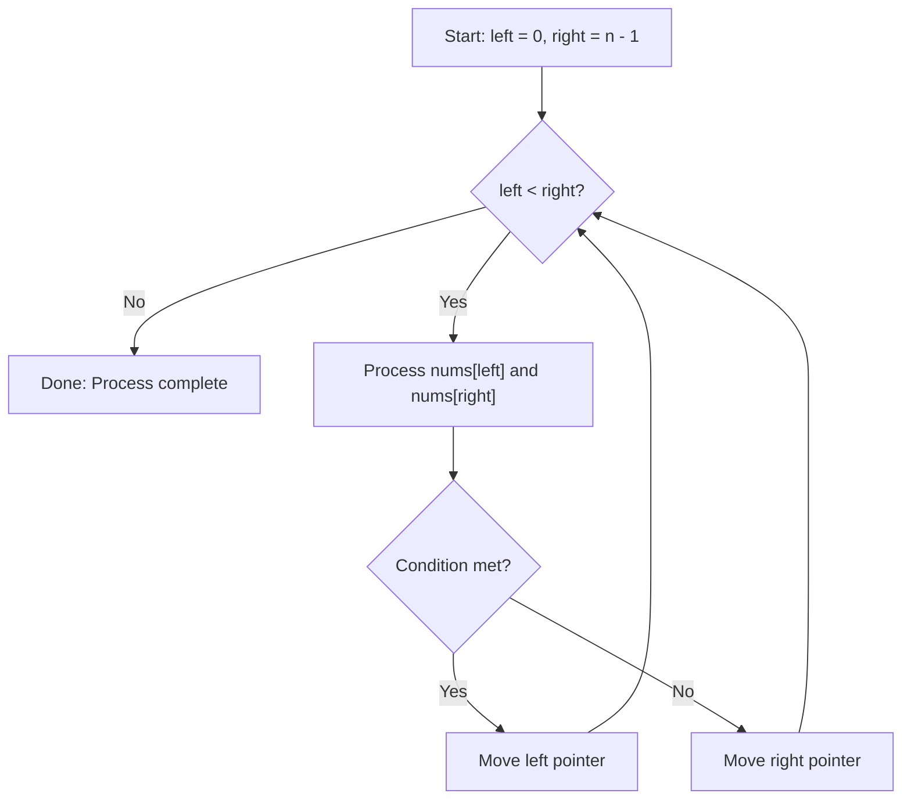

### Sliding Window Decision Flow
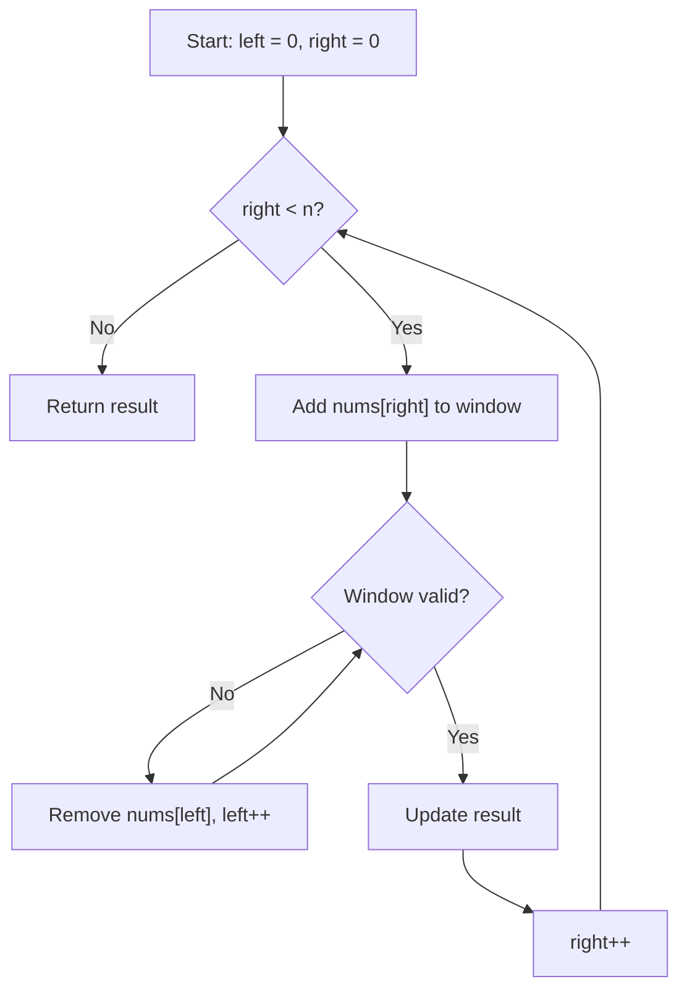

---

## 🔹 Practice Problems by Topic

### Easy

#### 1. **Two Sum**

**Problem Description:**
Given an array of integers and a target, return indices of two numbers that add up to target. Each input has exactly one solution, and you may not use the same element twice.

**Example Walkthrough:**

Input: `nums = [2, 7, 11, 15]`, `target = 9`
```
Expected Output: [0, 1] (2 + 7 = 9)

Step 1: i=0, num=2
        complement = 9 - 2 = 7
        map = {} -> 7 not in map
        map = {2: 0}

Step 2: i=1, num=7
        complement = 9 - 7 = 2
        map = {2: 0} -> 2 IS in map!
        Return [map.get(2), 1] = [0, 1]
```

Input: `nums = [3, 2, 4]`, `target = 6`
```
Expected Output: [1, 2] (2 + 4 = 6)

Step 1: i=0, num=3, complement=3, map={3:0}
Step 2: i=1, num=2, complement=4, map={3:0, 2:1}
Step 3: i=2, num=4, complement=2, 2 IS in map!
        Return [1, 2]
```

**Why It Works:**
- HashMap stores each number's index as we iterate
- For each number, we check if its complement (target - num) was already seen
- Since we check before inserting, we won't use the same element twice
- One pass guarantees O(n) time

**Time Complexity**: O(n) - single pass through array
**Space Complexity**: O(n) - HashMap can store up to n elements

**Visualization - Hash Map Lookup:**
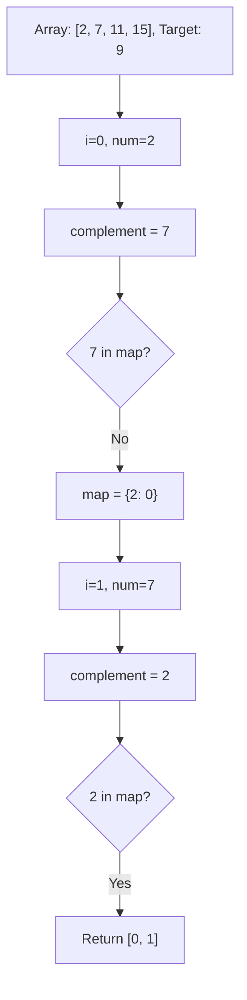

```java
public int[] twoSum(int[] nums, int target) {
    HashMap<Integer, Integer> map = new HashMap<>();
    for (int i = 0; i < nums.length; i++) {
        int complement = target - nums[i];
        if (map.containsKey(complement)) {
            return new int[] {map.get(complement), i};
        }
        map.put(nums[i], i);
    }
    return new int[] {};
}
```

**Edge Cases:**
- Two elements only: works correctly
- Negative numbers: complement logic handles correctly
- Duplicate numbers: map stores latest index, but we find solution first
- No solution: returns empty array (problem guarantees solution)

**Similar Pattern Problems:**
- Two Sum II (sorted array, two pointers)
- Two Sum III (data structure design)
- Three Sum (fix one, two sum on rest)

---

#### 2. **Maximum Subarray (Kadane's Algorithm)**

**Problem Description:**
Given an integer array, find the contiguous subarray with the largest sum and return that sum.

**Example Walkthrough:**

Input: `nums = [-2, 1, -3, 4, -1, 2, 1, -5, 4]`
```
Expected Output: 6 (subarray [4, -1, 2, 1])

Step 1: i=0, num=-2
        maxEndingHere = max(-2, -2) = -2
        maxSoFar = max(-2, -2) = -2

Step 2: i=1, num=1
        maxEndingHere = max(1, -2+1) = max(1, -1) = 1
        maxSoFar = max(-2, 1) = 1

Step 3: i=2, num=-3
        maxEndingHere = max(-3, 1-3) = max(-3, -2) = -2
        maxSoFar = max(1, -2) = 1

Step 4: i=3, num=4
        maxEndingHere = max(4, -2+4) = max(4, 2) = 4
        maxSoFar = max(1, 4) = 4

Step 5: i=4, num=-1
        maxEndingHere = max(-1, 4-1) = max(-1, 3) = 3
        maxSoFar = max(4, 3) = 4

Step 6: i=5, num=2
        maxEndingHere = max(2, 3+2) = max(2, 5) = 5
        maxSoFar = max(4, 5) = 5

Step 7: i=6, num=1
        maxEndingHere = max(1, 5+1) = max(1, 6) = 6
        maxSoFar = max(5, 6) = 6

Step 8: i=7, num=-5
        maxEndingHere = max(-5, 6-5) = max(-5, 1) = 1
        maxSoFar = max(6, 1) = 6

Step 9: i=8, num=4
        maxEndingHere = max(4, 1+4) = max(4, 5) = 5
        maxSoFar = max(6, 5) = 6

Return 6
```

Input: `nums = [1]`
```
Expected Output: 1

Step 1: maxEndingHere = max(1, 1) = 1
        maxSoFar = max(1, 1) = 1
        Return 1
```

**Key Insight - Local vs Global Decision:**
At each position, we make a choice:
- **Extend**: Add current element to existing subarray (`maxEndingHere + nums[i]`)
- **Restart**: Start a new subarray from current element (`nums[i]`)

We choose whichever is larger. This works because:
- If `maxEndingHere` is negative, it's better to start fresh
- If `maxEndingHere` is positive, extending can only help (or at least not hurt more than starting fresh)

**Why It Works:**
- `maxEndingHere` tracks the maximum sum of subarray ending at current position
- `maxSoFar` tracks the global maximum seen so far
- At each step, we either extend the previous best or start new
- This is optimal because any subarray must end at some position

**Visualization - Kadane's Decision:**
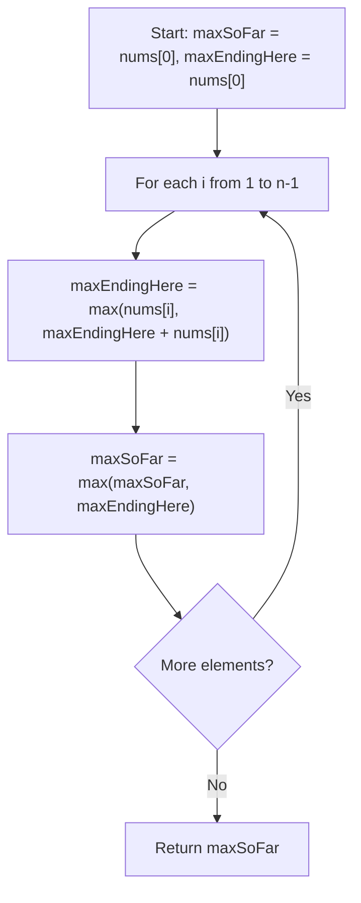

```java
public int maxSubArray(int[] nums) {
    int maxSoFar = nums[0];
    int maxEndingHere = nums[0];
    for (int i = 1; i < nums.length; i++) {
        maxEndingHere = Math.max(nums[i], maxEndingHere + nums[i]);
        maxSoFar = Math.max(maxSoFar, maxEndingHere);
    }
    return maxSoFar;
}
```

**Edge Cases:**
- All negative numbers: returns least negative (single element)
- Single element: returns that element
- All positive: returns sum of entire array
- Alternating positive/negative: correctly identifies best subarray

**Similar Pattern Problems:**
- Maximum Product Subarray (track min and max)
- Maximum Sum Circular Subarray (handle wrap-around)
- Maximum Sum Subarray of Size K (sliding window)

---

#### 3. **Best Time to Buy and Sell Stock**

**Problem Description:**
Given an array of stock prices, find the maximum profit from buying one day and selling on a later day. If no profit possible, return 0.

**Example Walkthrough:**

Input: `prices = [7, 1, 5, 3, 6, 4]`
```
Expected Output: 5 (buy at 1, sell at 6)

Step 1: i=0, price=7
        minPrice = 7
        maxProfit = max(0, 7-7) = 0

Step 2: i=1, price=1
        maxProfit = max(0, 1-7) = max(0, -6) = 0
        minPrice = min(7, 1) = 1

Step 3: i=2, price=5
        maxProfit = max(0, 5-1) = max(0, 4) = 4
        minPrice = min(1, 5) = 1

Step 4: i=3, price=3
        maxProfit = max(4, 3-1) = max(4, 2) = 4
        minPrice = min(1, 3) = 1

Step 5: i=4, price=6
        maxProfit = max(4, 6-1) = max(4, 5) = 5
        minPrice = min(1, 6) = 1

Step 6: i=5, price=4
        maxProfit = max(5, 4-1) = max(5, 3) = 5
        minPrice = min(1, 4) = 1

Return 5
```

Input: `prices = [7, 6, 4, 3, 1]`
```
Expected Output: 0 (prices only decrease)

Step 1: minPrice=7, maxProfit=0
Step 2: maxProfit=max(0,6-7)=0, minPrice=6
Step 3: maxProfit=max(0,4-6)=0, minPrice=4
Step 4: maxProfit=max(0,3-4)=0, minPrice=3
Step 5: maxProfit=max(0,1-3)=0, minPrice=1

Return 0
```

**Key Insight - Track Minimum So Far:**
- We want to buy at the lowest price and sell at the highest price AFTER buying
- As we iterate, we track the minimum price seen so far (best buying opportunity)
- At each day, we calculate profit if we sold today (current price - minPrice)
- We keep track of the maximum profit seen

**Why It Works:**
- The optimal buying day must come before the optimal selling day
- By tracking minimum price as we go, we always know the best buying opportunity up to current day
- For each selling day, we compute the best possible profit
- Taking the maximum over all selling days gives the answer

**Visualization - Profit Tracking:**
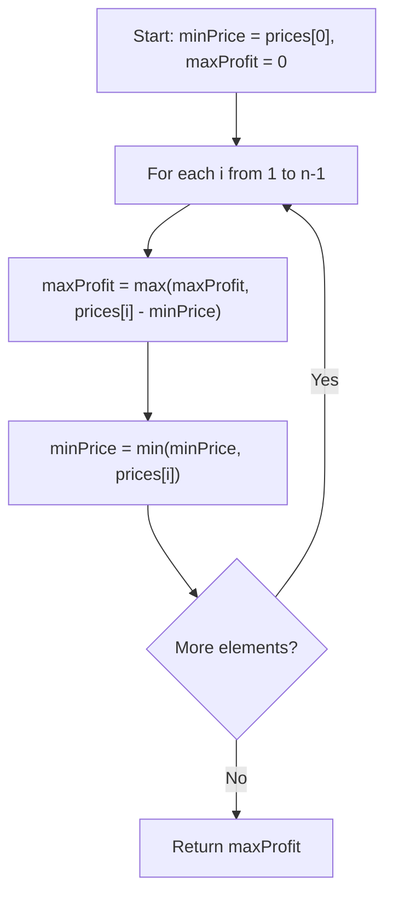

```java
public int maxProfit(int[] prices) {
    int minPrice = prices[0];
    int maxProfit = 0;
    for (int i = 1; i < prices.length; i++) {
        maxProfit = Math.max(maxProfit, prices[i] - minPrice);
        minPrice = Math.min(minPrice, prices[i]);
    }
    return maxProfit;
}
```

**Edge Cases:**
- Single day: no transaction possible, returns 0
- Decreasing prices: returns 0 (no profit)
- Increasing prices: returns last - first
- Same prices: returns 0

**Similar Pattern Problems:**
- Best Time to Buy and Sell Stock II (multiple transactions)
- Best Time to Buy and Sell Stock III (at most 2 transactions)
- Best Time to Buy and Sell Stock with Cooldown

---

#### 4. **Contains Duplicate**

**Problem Description:**
Given an integer array, return true if any value appears at least twice, false if all elements are distinct.

**Example Walkthrough:**

Input: `nums = [1, 2, 3, 1]`
```
Expected Output: true (1 appears twice)

Step 1: num=1, set={} -> not in set, add 1
        set = {1}

Step 2: num=2, set={1} -> not in set, add 2
        set = {1, 2}

Step 3: num=3, set={1,2} -> not in set, add 3
        set = {1, 2, 3}

Step 4: num=1, set={1,2,3} -> 1 IS in set!
        Return true
```

Input: `nums = [1, 2, 3, 4]`
```
Expected Output: false (all distinct)

Step 1: set={1}
Step 2: set={1,2}
Step 3: set={1,2,3}
Step 4: set={1,2,3,4}
Loop ends, return false
```

**Why It Works:**
- HashSet provides O(1) average-case lookup and insertion
- We check for existence before inserting
- If element already exists, we found a duplicate
- If we complete the loop, no duplicates exist

**Time Complexity**: O(n) - single pass, O(1) average for set operations
**Space Complexity**: O(n) - set can store up to n elements

```java
public boolean containsDuplicate(int[] nums) {
    HashSet<Integer> seen = new HashSet<>();
    for (int num : nums) {
        if (seen.contains(num)) {
            return true;
        }
        seen.add(num);
    }
    return false;
}
```

**Edge Cases:**
- Empty array: loop doesn't execute, returns false
- Single element: returns false
- All same elements: returns true on second element
- Duplicates at end: correctly detects

**Alternative Approaches:**
- Sort first: O(n log n) time, O(1) space (if in-place sort)
- Brute force: O(n^2) time, O(1) space (nested loops)

**Similar Pattern Problems:**
- Contains Duplicate II (duplicates within distance k)
- Contains Duplicate III (duplicates within value range)
- Find All Duplicates in Array

---

#### 5. **Single Number**

**Problem Description:**
Given a non-empty array where every element appears twice except for one, find that single element. Must solve in O(n) time and O(1) space.

**Example Walkthrough:**

Input: `nums = [4, 1, 2, 1, 2]`
```
Expected Output: 4

Step 1: result = 0 ^ 4 = 4
Step 2: result = 4 ^ 1 = 5
Step 3: result = 5 ^ 2 = 7
Step 4: result = 7 ^ 1 = 6
Step 5: result = 6 ^ 2 = 4

Return 4
```

Input: `nums = [2, 2, 1]`
```
Expected Output: 1

Step 1: result = 0 ^ 2 = 2
Step 2: result = 2 ^ 2 = 0
Step 3: result = 0 ^ 1 = 1

Return 1
```

**Key Insight - XOR Properties:**
XOR (^) has two critical properties:
1. **a ^ a = 0** (any number XOR itself = 0)
2. **a ^ 0 = a** (any number XOR 0 = itself)
3. **Commutative and Associative**: order doesn't matter

Therefore, if we XOR all elements:
- Pairs cancel out (a ^ a = 0)
- Only the single element remains (0 ^ single = single)

**Why It Works:**
- XOR is commutative: a ^ b ^ a = a ^ a ^ b = 0 ^ b = b
- All paired elements cancel regardless of order
- The remaining value is the single element

**Visualization - XOR Cancellation:**
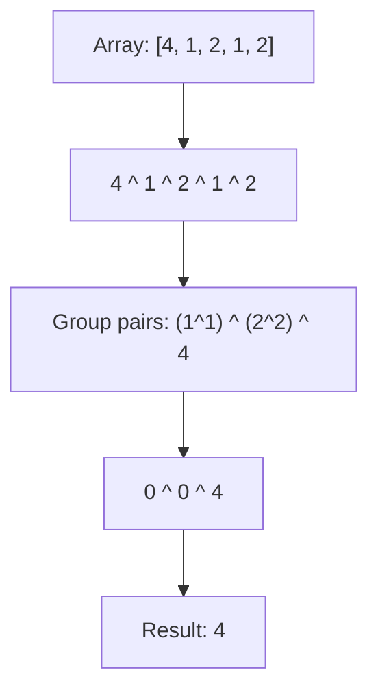

```java
public int singleNumber(int[] nums) {
    int result = 0;
    for (int num : nums) {
        result ^= num;
    }
    return result;
}
```

**Edge Cases:**
- Single element array: returns that element
- Negative numbers: XOR works on binary representation
- Large numbers: no overflow with XOR

**Similar Pattern Problems:**
- Single Number II (every element appears 3 times except one)
- Single Number III (two elements appear once, rest twice)
- Find the Duplicate Number (XOR with indices)

---

#### 6. **Move Zeroes**

**Problem Description:**
Move all zeroes to the end of array while maintaining relative order of non-zero elements. Must do in-place.

**Example Walkthrough:**

Input: `nums = [0, 1, 0, 3, 12]`
```
Expected Output: [1, 3, 12, 0, 0]

Initial: [0, 1, 0, 3, 12], leftPointer=0

Step 1: i=0, num=0 -> skip (it's zero)

Step 2: i=1, num=1 -> non-zero!
        swap(nums[0], nums[1]) -> [1, 0, 0, 3, 12]
        leftPointer = 1

Step 3: i=2, num=0 -> skip

Step 4: i=3, num=3 -> non-zero!
        swap(nums[1], nums[3]) -> [1, 3, 0, 0, 12]
        leftPointer = 2

Step 5: i=4, num=12 -> non-zero!
        swap(nums[2], nums[4]) -> [1, 3, 12, 0, 0]
        leftPointer = 3

Final: [1, 3, 12, 0, 0]
```

Input: `nums = [0, 0, 1]`
```
Expected Output: [1, 0, 0]

Step 1: i=0, num=0 -> skip
Step 2: i=1, num=0 -> skip
Step 3: i=2, num=1 -> non-zero!
        swap(nums[0], nums[2]) -> [1, 0, 0]
        leftPointer = 1

Final: [1, 0, 0]
```

**Key Insight - Two Pointers:**
- `leftPointer` tracks where the next non-zero element should be placed
- `i` scans through the array
- When we find a non-zero at `i`, swap it with `leftPointer` and increment
- This preserves relative order while moving zeros to the end

**Why It Works:**
- All elements before `leftPointer` are non-zero (in original order)
- Elements between `leftPointer` and `i` are zeros
- When we find non-zero at `i`, swapping places it after the last non-zero
- Zeros naturally accumulate at the end

**Visualization - Two Pointer Movement:**
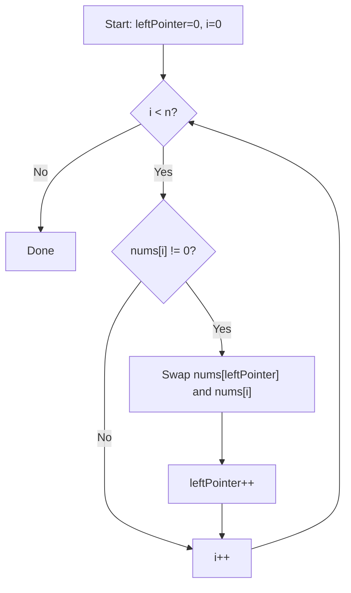

```java
public void moveZeroes(int[] nums) {
    int leftPointer = 0;
    for (int i = 0; i < nums.length; i++) {
        if (nums[i] != 0) {
            int temp = nums[leftPointer];
            nums[leftPointer] = nums[i];
            nums[i] = temp;
            leftPointer++;
        }
    }
}
```

**Edge Cases:**
- No zeros: all elements non-zero, swaps with self, order preserved
- All zeros: no non-zero found, array unchanged
- Single element: works correctly
- Zeros at start: moved to end correctly

**Similar Pattern Problems:**
- Remove Duplicates from Sorted Array
- Remove Element
- Sort Colors (Dutch National Flag)

---

#### 7. **Rotate Array**

**Problem Description:**
Rotate array to the right by k steps, where k is non-negative. Do it in-place with O(1) extra space.

**Example Walkthrough:**

Input: `nums = [1, 2, 3, 4, 5, 6, 7]`, `k = 3`
```
Expected Output: [5, 6, 7, 1, 2, 3, 4]

k = 3 % 7 = 3

Step 1: Reverse entire array
        [1, 2, 3, 4, 5, 6, 7] -> [7, 6, 5, 4, 3, 2, 1]

Step 2: Reverse first k=3 elements
        [7, 6, 5, 4, 3, 2, 1] -> [5, 6, 7, 4, 3, 2, 1]

Step 3: Reverse remaining n-k=4 elements
        [5, 6, 7, 4, 3, 2, 1] -> [5, 6, 7, 1, 2, 3, 4]

Final: [5, 6, 7, 1, 2, 3, 4]
```

Input: `nums = [-1, -100, 3, 99]`, `k = 2`
```
Expected Output: [3, 99, -1, -100]

Step 1: Reverse all -> [99, 3, -100, -1]
Step 2: Reverse first 2 -> [3, 99, -100, -1]
Step 3: Reverse last 2 -> [3, 99, -1, -100]
```

**Key Insight - Triple Reverse:**
The rotation can be achieved by three reversals:
1. Reverse entire array
2. Reverse first k elements
3. Reverse remaining n-k elements

**Why It Works:**
- Reversing entire array puts the last k elements at the front (but reversed)
- Reversing first k fixes their order
- Reversing the rest fixes the remaining elements

**Visualization - Triple Reverse:**
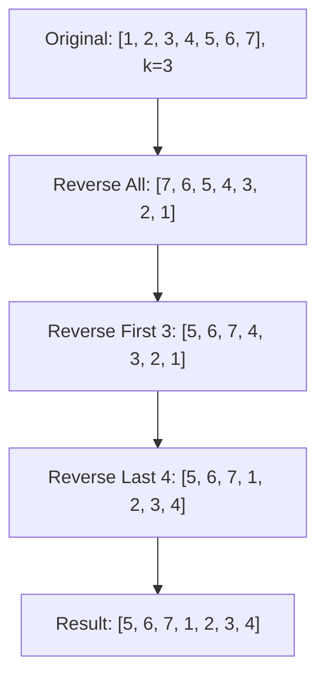

```java
public void rotate(int[] nums, int k) {
    k = k % nums.length;
    reverse(nums, 0, nums.length - 1);
    reverse(nums, 0, k - 1);
    reverse(nums, k, nums.length - 1);
}

private void reverse(int[] nums, int start, int end) {
    while (start < end) {
        int temp = nums[start];
        nums[start] = nums[end];
        nums[end] = temp;
        start++;
        end--;
    }
}
```

**Edge Cases:**
- k = 0: no rotation, array unchanged
- k = n: k % n = 0, no rotation
- k > n: k % n handles correctly
- Single element: reverse does nothing, works

**Similar Pattern Problems:**
- Rotate Matrix (90 degrees)
- Rotate List (linked list)
- Reverse Words in a String

---

### Medium

#### 8. **3Sum**

**Problem Description:**
Given an integer array, find all unique triplets that sum to zero.

**Example Walkthrough:**

Input: `nums = [-1, 0, 1, 2, -1, -4]`
```
Expected Output: [[-1, -1, 2], [-1, 0, 1]]

Step 1: Sort array -> [-4, -1, -1, 0, 1, 2]

Step 2: i=0, nums[0]=-4
        left=1, right=5
        sum = -4 + (-1) + 2 = -3 < 0 -> left++
        sum = -4 + (-1) + 2 = -3 < 0 -> left++
        sum = -4 + 0 + 2 = -2 < 0 -> left++
        sum = -4 + 1 + 2 = -1 < 0 -> left++
        left > right, no triplet

Step 3: i=1, nums[1]=-1
        left=2, right=5
        sum = -1 + (-1) + 2 = 0 -> Found! [-1, -1, 2]
        Skip duplicates: left=3, right=4
        sum = -1 + 0 + 1 = 0 -> Found! [-1, 0, 1]
        Skip duplicates: left=4, right=3
        left > right, done

Step 4: i=2, nums[2]=-1 -> skip (duplicate of i=1)

Step 5: i=3, nums[3]=0
        left=4, right=5
        sum = 0 + 1 + 2 = 3 > 0 -> right--
        left > right, done

Result: [[-1, -1, 2], [-1, 0, 1]]
```

Input: `nums = [0, 0, 0]`
```
Expected Output: [[0, 0, 0]]

Step 1: Sort -> [0, 0, 0]
Step 2: i=0, nums[0]=0
        left=1, right=2
        sum = 0 + 0 + 0 = 0 -> Found! [0, 0, 0]
        Skip duplicates: left=2, right=1
        left > right, done

Result: [[0, 0, 0]]
```

**Key Insight - Sort + Two Pointers:**
- Sort array first to enable two-pointer technique and handle duplicates
- Fix one element (nums[i]), then find pairs summing to -nums[i]
- Use two pointers from opposite ends to find pairs
- Skip duplicates to ensure unique triplets

**Why It Works:**
- Sorting allows us to use two pointers efficiently
- For each fixed element, the problem reduces to Two Sum on sorted array
- Two pointers can find all pairs in O(n) time
- Duplicate skipping ensures we don't add same triplet multiple times

**Visualization - 3Sum Logic:**
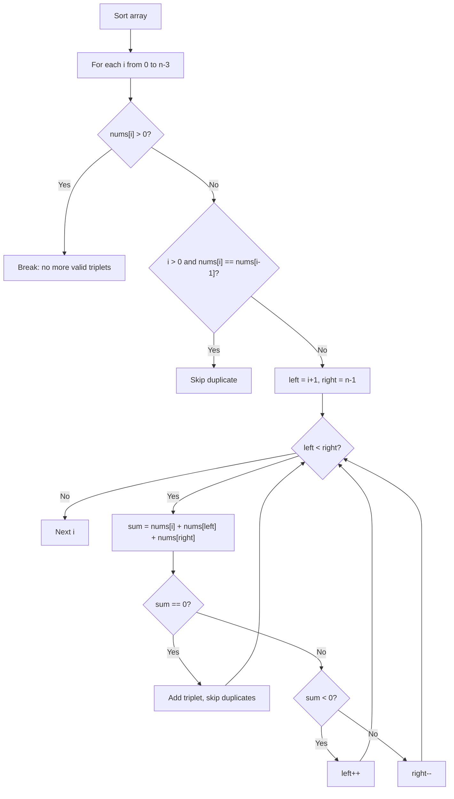

```java
public List<List<Integer>> threeSum(int[] nums) {
    Arrays.sort(nums);
    List<List<Integer>> result = new ArrayList<>();
    for (int i = 0; i < nums.length - 2; i++) {
        if (nums[i] > 0) break;
        if (i > 0 && nums[i] == nums[i-1]) continue;
        int left = i + 1, right = nums.length - 1;
        while (left < right) {
            int sum = nums[i] + nums[left] + nums[right];
            if (sum == 0) {
                result.add(Arrays.asList(nums[i], nums[left], nums[right]));
                while (left < right && nums[left] == nums[left+1]) left++;
                while (left < right && nums[right] == nums[right-1]) right--;
                left++;
                right--;
            } else if (sum < 0) {
                left++;
            } else {
                right--;
            }
        }
    }
    return result;
}
```

**Edge Cases:**
- Less than 3 elements: returns empty list
- All zeros: returns [[0,0,0]] once
- No valid triplets: returns empty list
- Multiple duplicates: correctly skips

**Similar Pattern Problems:**
- 3Sum Closest (track closest sum)
- 4Sum (add another outer loop)
- K Sum (generalization)

---

#### 9. **Product of Array Except Self**

**Problem Description:**
Given an array, return an array where each element is the product of all other elements. Must solve in O(n) without division.

**Example Walkthrough:**

Input: `nums = [1, 2, 3, 4]`
```
Expected Output: [24, 12, 8, 6]

Step 1: Calculate prefix products (product of all before current)
        prefix[0] = 1 (nothing before)
        prefix[1] = 1 * 1 = 1
        prefix[2] = 1 * 2 = 2
        prefix[3] = 2 * 3 = 6
        result = [1, 1, 2, 6]

Step 2: Calculate suffix products and multiply
        suffix = 1
        i=3: result[3] = 6 * 1 = 6, suffix = 1 * 4 = 4
        i=2: result[2] = 2 * 4 = 8, suffix = 4 * 3 = 12
        i=1: result[1] = 1 * 12 = 12, suffix = 12 * 2 = 24
        i=0: result[0] = 1 * 24 = 24, suffix = 24 * 1 = 24

Final: [24, 12, 8, 6]
```

Input: `nums = [-1, 1, 0, -3, 3]`
```
Expected Output: [0, 0, 9, 0, 0]

Step 1: prefix products
        result[0] = 1
        result[1] = 1 * (-1) = -1
        result[2] = -1 * 1 = -1
        result[3] = -1 * 0 = 0
        result[4] = 0 * (-3) = 0
        result = [1, -1, -1, 0, 0]

Step 2: suffix products
        suffix = 1
        i=4: result[4] = 0 * 1 = 0, suffix = 1 * 3 = 3
        i=3: result[3] = 0 * 3 = 0, suffix = 3 * (-3) = -9
        i=2: result[2] = -1 * (-9) = 9, suffix = -9 * 0 = 0
        i=1: result[1] = -1 * 0 = 0, suffix = 0 * 1 = 0
        i=0: result[0] = 1 * 0 = 0, suffix = 0 * (-1) = 0

Final: [0, 0, 9, 0, 0]
```

**Key Insight - Prefix and Suffix Products:**
For each index i:
- Product of all except i = (product of all before i) x (product of all after i)
- We can compute prefix products in one pass
- Then compute suffix products on the fly in a second pass

**Why It Works:**
- First pass computes prefix products (left to right)
- Second pass multiplies by suffix products (right to left)
- This avoids division and handles zeros correctly
- The result at each index is the product of everything except itself

**Visualization - Prefix/Suffix Multiplication:**
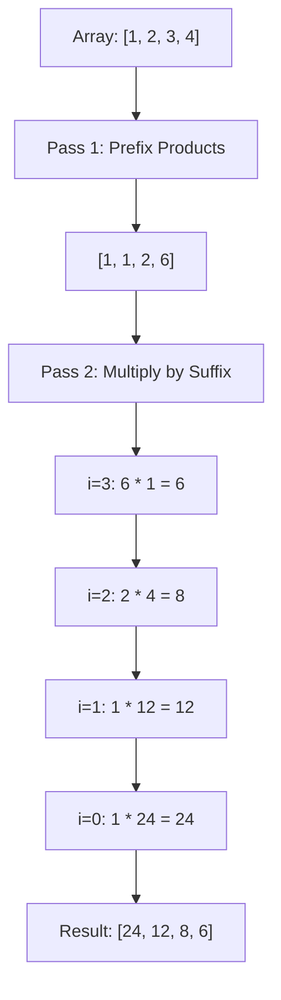

```java
public int[] productExceptSelf(int[] nums) {
    int n = nums.length;
    int[] result = new int[n];
    result[0] = 1;
    for (int i = 1; i < n; i++) {
        result[i] = result[i-1] * nums[i-1];
    }
    int suffix = 1;
    for (int i = n - 1; i >= 0; i--) {
        result[i] *= suffix;
        suffix *= nums[i];
    }
    return result;
}
```

**Edge Cases:**
- One zero: product of all except zero = product of non-zero elements
- Two zeros: product of all except zero = 0 (contains other zero)
- No zeros: works correctly
- Single element: returns [1]

**Similar Pattern Problems:**
- Trapping Rain Water (prefix/suffix max)
- Paint House (prefix/suffix optimization)
- Maximum Product Subarray

---

#### 10. **Merge Intervals**

**Problem Description:**
Given an array of intervals, merge all overlapping intervals.

**Example Walkthrough:**

Input: `intervals = [[1,3], [2,6], [8,10], [15,18]]`
```
Expected Output: [[1,6], [8,10], [15,18]]

Step 1: Sort by start time
        [[1,3], [2,6], [8,10], [15,18]]

Step 2: current = [1,3]
        i=1: [2,6] -> 2 <= 3? YES -> merge: current = [1, max(3,6)] = [1,6]
        i=2: [8,10] -> 8 <= 6? NO -> add [1,6], current = [8,10]
        i=3: [15,18] -> 15 <= 10? NO -> add [8,10], current = [15,18]

Step 3: Add [15,18]

Result: [[1,6], [8,10], [15,18]]
```

Input: `intervals = [[1,4], [4,5]]`
```
Expected Output: [[1,5]] (4 <= 4, so they merge)

Step 1: current = [1,4]
Step 2: [4,5] -> 4 <= 4? YES -> merge: current = [1, max(4,5)] = [1,5]
Step 3: Add [1,5]

Result: [[1,5]]
```

**Key Insight - Sort by Start:**
- Sort intervals by start time
- Two intervals overlap if: current.start <= previous.end
- When overlapping, merge by extending end: max(previous.end, current.end)
- When not overlapping, add previous interval and start new one

**Why It Works:**
- Sorting by start ensures intervals are processed in order
- If an interval starts after the previous ends, they can't overlap with any later interval
- Merging extends the end to cover both intervals
- Greedy approach works because sorted order guarantees correctness

**Visualization - Merge Intervals:**
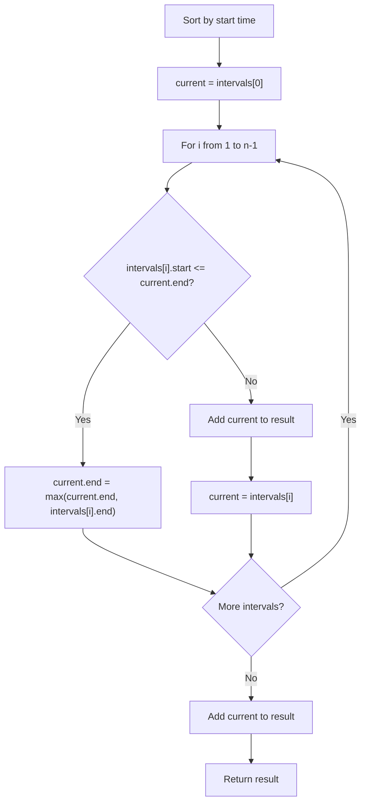

```java
public int[][] merge(int[][] intervals) {
    Arrays.sort(intervals, (a, b) -> Integer.compare(a[0], b[0]));
    List<int[]> merged = new ArrayList<>();
    int[] current = intervals[0];
    for (int i = 1; i < intervals.length; i++) {
        if (intervals[i][0] <= current[1]) {
            current[1] = Math.max(current[1], intervals[i][1]);
        } else {
            merged.add(current);
            current = intervals[i];
        }
    }
    merged.add(current);
    return merged.toArray(new int[merged.size()][]);
}
```

**Edge Cases:**
- Single interval: returns it as-is
- All overlapping: merges into one interval
- No overlapping: returns all intervals
- Intervals touching (end == start): considered overlapping

**Similar Pattern Problems:**
- Insert Interval (insert and merge)
- Meeting Rooms (check conflicts)
- Non-overlapping Intervals (maximum count)

---

### Hard

#### 11. **Trapping Rain Water**

**Problem Description:**
Given elevation map, compute how much water can be trapped after raining.

**Example Walkthrough:**

Input: `height = [0,1,0,2,1,0,1,3,2,1,2,1]`
```
Expected Output: 6

Step 1: Calculate left max heights
        leftMax[0] = 0
        leftMax[1] = max(0, 1) = 1
        leftMax[2] = max(1, 0) = 1
        leftMax[3] = max(1, 2) = 2
        leftMax[4] = max(2, 1) = 2
        leftMax[5] = max(2, 0) = 2
        leftMax[6] = max(2, 1) = 2
        leftMax[7] = max(2, 3) = 3
        leftMax[8] = max(3, 2) = 3
        leftMax[9] = max(3, 1) = 3
        leftMax[10] = max(3, 2) = 3
        leftMax[11] = max(3, 1) = 3

Step 2: Calculate right max heights
        rightMax[11] = 1
        rightMax[10] = max(1, 2) = 2
        rightMax[9] = max(2, 1) = 2
        rightMax[8] = max(2, 2) = 2
        rightMax[7] = max(2, 3) = 3
        rightMax[6] = max(3, 1) = 3
        rightMax[5] = max(3, 0) = 3
        rightMax[4] = max(3, 1) = 3
        rightMax[3] = max(3, 2) = 3
        rightMax[2] = max(3, 0) = 3
        rightMax[1] = max(3, 1) = 3
        rightMax[0] = max(3, 0) = 3

Step 3: Calculate water at each position
        i=0: min(0,3) - 0 = 0
        i=1: min(1,3) - 1 = 0
        i=2: min(1,3) - 0 = 1
        i=3: min(2,3) - 2 = 0
        i=4: min(2,3) - 1 = 1
        i=5: min(2,3) - 0 = 2
        i=6: min(2,3) - 1 = 1
        i=7: min(3,3) - 3 = 0
        i=8: min(3,2) - 2 = 0
        i=9: min(3,2) - 1 = 1
        i=10: min(3,2) - 2 = 0
        i=11: min(3,1) - 1 = 0

Total water = 1+1+2+1+1 = 6
```

Input: `height = [4,2,0,3,2,5]`
```
Expected Output: 9

Water trapped:
Position 2: min(4,5) - 0 = 4
Position 3: min(4,5) - 3 = 1
Position 4: min(4,5) - 2 = 2
Position 5: min(4,5) - 2 = 2
Total = 9
```

**Key Insight - Water Level at Each Position:**
For each position i:
- Water level = min(max height to left, max height to right)
- Trapped water = water level - height[i]
- Water is trapped only if water level > height[i]

**Why It Works:**
- The maximum water level at any position is determined by the shorter of the two tallest bars on either side
- Water can't go higher than the shorter boundary
- Precomputing left and right maximums allows O(1) water calculation per position
- Summing all trapped water gives the answer

**Visualization - Water Trapping:**
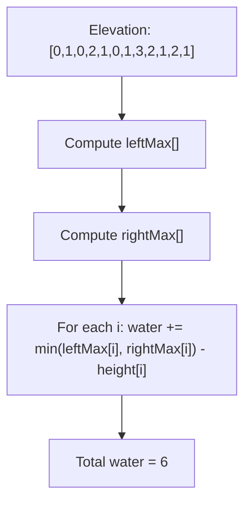

```java
public int trap(int[] height) {
    int n = height.length;
    if (n < 3) return 0;
    int[] leftMax = new int[n];
    int[] rightMax = new int[n];
    leftMax[0] = height[0];
    for (int i = 1; i < n; i++) {
        leftMax[i] = Math.max(leftMax[i-1], height[i]);
    }
    rightMax[n-1] = height[n-1];
    for (int i = n-2; i >= 0; i--) {
        rightMax[i] = Math.max(rightMax[i+1], height[i]);
    }
    int water = 0;
    for (int i = 0; i < n; i++) {
        water += Math.min(leftMax[i], rightMax[i]) - height[i];
    }
    return water;
}
```

**Edge Cases:**
- Less than 3 bars: no water can be trapped
- All same height: no water trapped
- Increasing heights: no water trapped
- Decreasing heights: no water trapped

**Similar Pattern Problems:**
- Trapping Rain Water II (2D version)
- Container With Most Water (two pointers)
- Largest Rectangle in Histogram

---

#### 12. **First Missing Positive**

**Problem Description:**
Given unsorted integer array, find the smallest missing positive integer. Must run in O(n) time and O(1) space.

**Example Walkthrough:**

Input: `nums = [3, 4, -1, 1]`
```
Expected Output: 2

Step 1: Place each number in correct position (nums[i] at index nums[i]-1)
        i=0: nums[0]=3 -> should be at index 2
             swap nums[0] and nums[2] -> [-1, 4, 3, 1]
             Now nums[0]=-1 (not in range 1-4), stop

        i=0: nums[0]=-1 -> not in range, i++

        i=1: nums[1]=4 -> should be at index 3
             swap nums[1] and nums[3] -> [-1, 1, 3, 4]
             Now nums[1]=1 (should be at index 0)
             swap nums[1] and nums[0] -> [1, -1, 3, 4]
             Now nums[1]=-1, stop

        i=1: nums[1]=-1 -> not in range, i++

        i=2: nums[2]=3 -> already at correct position, i++

        i=3: nums[3]=4 -> already at correct position, i++

Step 2: Scan for first missing
        i=0: nums[0]=1 -> expected 1
        i=1: nums[1]=-1 -> expected 2
        Return 2
```

Input: `nums = [1, 2, 0]`
```
Expected Output: 3

Step 1: Place numbers
        i=0: nums[0]=1 -> already at correct position
        i=1: nums[1]=2 -> already at correct position
        i=2: nums[2]=0 -> not in range 1-3

Step 2: Scan
        i=0: nums[0]=1 -> expected 1
        i=1: nums[1]=2 -> expected 2
        i=2: nums[2]=0 -> expected 3
        Return 3
```

**Key Insight - Array as Hash Table:**
- Use array indices as hash keys
- Place value v at index v-1 (for 1 <= v <= n)
- After placement, index i should contain i+1
- First index where this fails gives the missing number

**Why It Works:**
- If all numbers 1 to n are present, they'll be placed at indices 0 to n-1
- Any missing number leaves a gap where nums[i] != i+1
- The first such gap is the smallest missing positive
- If no gap, missing number is n+1

**Visualization - Array as Hash Table:**
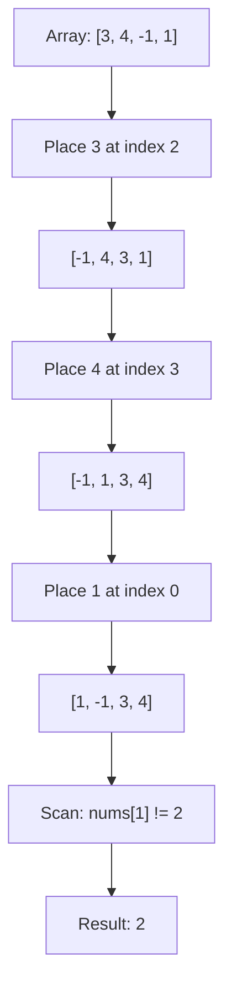

```java
public int firstMissingPositive(int[] nums) {
    int n = nums.length;
    for (int i = 0; i < n; i++) {
        while (nums[i] > 0 && nums[i] <= n && nums[nums[i]-1] != nums[i]) {
            int correctIdx = nums[i] - 1;
            int temp = nums[i];
            nums[i] = nums[correctIdx];
            nums[correctIdx] = temp;
        }
    }
    for (int i = 0; i < n; i++) {
        if (nums[i] != i + 1) {
            return i + 1;
        }
    }
    return n + 1;
}
```

**Edge Cases:**
- Empty array: returns 1
- No positive numbers: returns 1
- All positives present: returns n+1
- Duplicates: handled by while condition

**Similar Pattern Problems:**
- Find All Numbers Disappeared in Array
- Find the Duplicate Number
- Missing Number (XOR approach)

---

#### 13. **Longest Consecutive Sequence**

**Problem Description:**
Given unsorted array, find length of longest consecutive elements sequence. Must run in O(n) time.

**Example Walkthrough:**

Input: `nums = [100, 4, 200, 1, 3, 2]`
```
Expected Output: 4 (sequence [1, 2, 3, 4])

Step 1: Build HashSet
        set = {100, 4, 200, 1, 3, 2}

Step 2: Check each number
        num=100: 99 not in set -> sequence start
                 count: 100, 101 not in set -> length=1
        num=4: 3 in set -> not a start
        num=200: 199 not in set -> start
                 count: 200, 201 not in set -> length=1
        num=1: 0 not in set -> start
               count: 1, 2, 3, 4, 5 not in set -> length=4
        num=3: 2 in set -> not start
        num=2: 1 in set -> not start

Max length = 4
```

Input: `nums = [0, 3, 7, 2, 5, 8, 4, 6, 0, 1]`
```
Expected Output: 9 (sequence [0, 1, 2, 3, 4, 5, 6, 7, 8])

Step 1: set = {0, 1, 2, 3, 4, 5, 6, 7, 8}

Step 2: num=0: -1 not in set -> start
               count: 0,1,2,3,4,5,6,7,8 -> length=9

Max length = 9
```

**Key Insight - Sequence Start Detection:**
- A number is a sequence start if num-1 is NOT in the set
- Only start counting from sequence starts to avoid redundant work
- Use HashSet for O(1) lookups
- For each start, count consecutive numbers using set.contains()

**Why It Works:**
- HashSet provides O(1) existence checking
- By only starting from sequence starts, each sequence is counted once
- Total work is O(n) because each number is visited at most twice
  - Once when checking if it's a start
  - Once when counting in a sequence

**Visualization - Consecutive Sequence:**
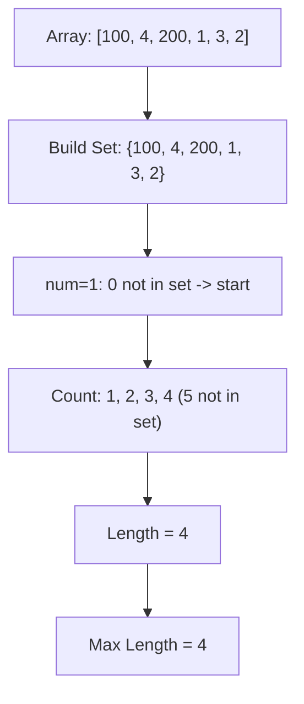

```java
public int longestConsecutive(int[] nums) {
    HashSet<Integer> set = new HashSet<>();
    for (int num : nums) {
        set.add(num);
    }
    int longest = 0;
    for (int num : set) {
        if (!set.contains(num - 1)) {
            int current = num;
            int streak = 1;
            while (set.contains(current + 1)) {
                current++;
                streak++;
            }
            longest = Math.max(longest, streak);
        }
    }
    return longest;
}
```

**Edge Cases:**
- Empty array: returns 0
- Single element: returns 1
- All consecutive: returns n
- Duplicates: set handles automatically

**Similar Pattern Problems:**
- Consecutive Numbers Sum
- Longest Substring Without Repeating Characters
- Binary Tree Longest Consecutive Sequence

---

## 📌 Key Tips & Tricks

### 1. **Prevent Integer Overflow**
```java
// WRONG: can overflow with large sums
int sum = nums[i] + nums[j];

// CORRECT: use long for sum comparisons
long sum = (long) nums[i] + nums[j];

// For binary search mid calculation:
int mid = left + (right - left) / 2;
```

### 2. **Two Pointer Movement Rules**
```java
// For sorted array pair finding:
if (sum < target) {
    left++;
} else if (sum > target) {
    right--;
} else {
    left++;
    right--;
}
```

### 3. **Sliding Window Pattern**
```java
// Fixed size window:
for (int i = 0; i < n - k + 1; i++) {
    // Window is [i, i+k-1]
}

// Variable size window:
int left = 0;
for (int right = 0; right < n; right++) {
    while (invalidCondition) {
        left++;
    }
}
```

### 4. **Prefix Sum Technique**
```java
int[] prefix = new int[n + 1];
for (int i = 0; i < n; i++) {
    prefix[i + 1] = prefix[i] + nums[i];
}
// Range sum [i, j] = prefix[j + 1] - prefix[i]
int rangeSum = prefix[j + 1] - prefix[i];
```

### 5. **HashMap for Complement Finding**
```java
HashMap<Integer, Integer> map = new HashMap<>();
for (int i = 0; i < n; i++) {
    int complement = target - nums[i];
    if (map.containsKey(complement)) {
        return new int[] {map.get(complement), i};
    }
    map.put(nums[i], i);
}
```

### 6. **In-Place Array Manipulation**
```java
// Using array as hash table (First Missing Positive)
while (nums[i] > 0 && nums[i] <= n && nums[nums[i]-1] != nums[i]) {
    int correctIdx = nums[i] - 1;
    int temp = nums[i];
    nums[i] = nums[correctIdx];
    nums[correctIdx] = temp;
}

// Triple reverse (Rotate Array)
reverse(nums, 0, n - 1);
reverse(nums, 0, k - 1);
reverse(nums, k, n - 1);
```

---

## 🎯 Common Pitfalls to Avoid

- Not handling edge cases: Empty array, single element, all same values
- Integer overflow: Use long for large sums or products
- Off-by-one errors: Carefully track pointer boundaries
- Not sorting when needed: Many array problems require sorted input for optimal solutions
- Forgetting to handle duplicates: In 3Sum, need to skip duplicates to get unique triplets
- Modifying array while iterating: Can cause unexpected behavior
- Assuming array is 1-indexed: Java arrays are 0-indexed
- Not using the right data structure: HashSet for existence, HashMap for mappings
- Ignoring space complexity constraints: Some problems require O(1) space
- Not recognizing patterns: Two pointers, sliding window, prefix sum, hashing

---

## 🔹 Array Decision Flow

### Choosing the Right Technique

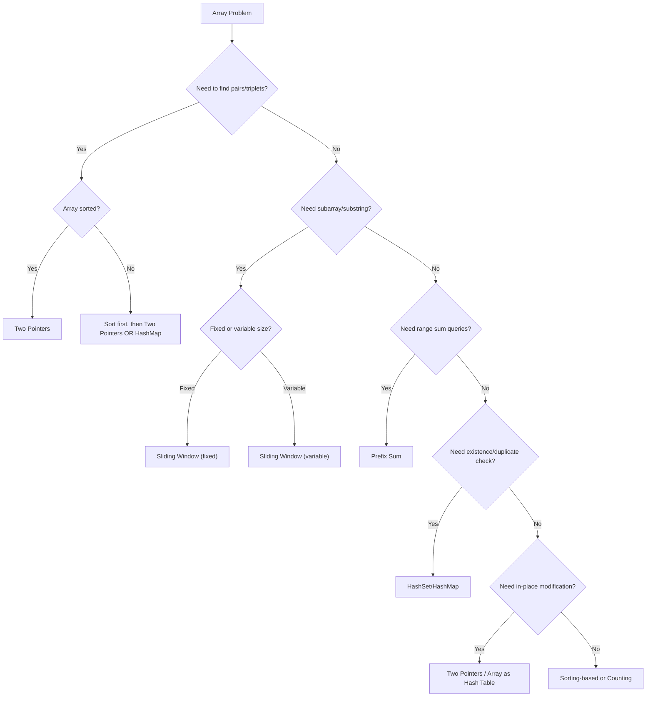

### Complexity Cheat Sheet

| Technique | Time | Space | Use Case |
|-----------|------|-------|----------|
| Two Pointers | O(n) | O(1) | Sorted array pairs, merging |
| Sliding Window | O(n) | O(1) | Subarray problems |
| Prefix Sum | O(n) build, O(1) query | O(n) | Range sum queries |
| HashMap | O(n) | O(n) | Complement finding |
| HashSet | O(n) | O(n) | Duplicate detection |
| Sorting | O(n log n) | O(1) or O(n) | Pair finding, intervals |
| Kadane's | O(n) | O(1) | Max subarray sum |
| XOR | O(n) | O(1) | Finding unique element |
| Array as Hash | O(n) | O(1) | First missing positive |