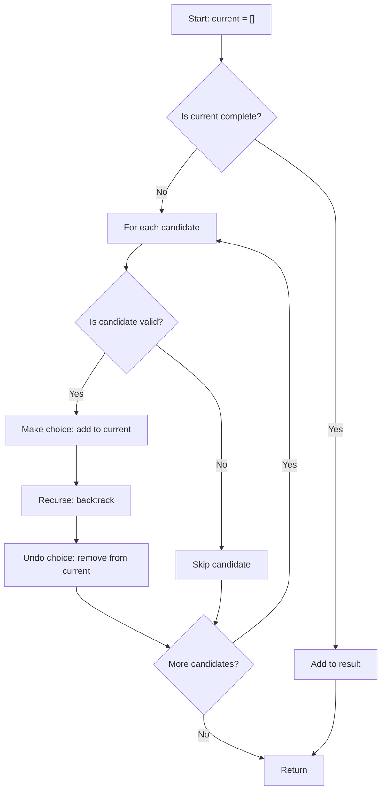
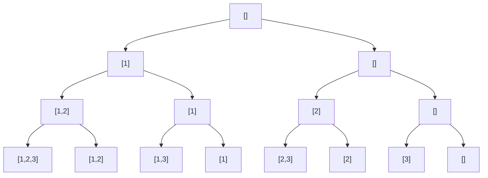
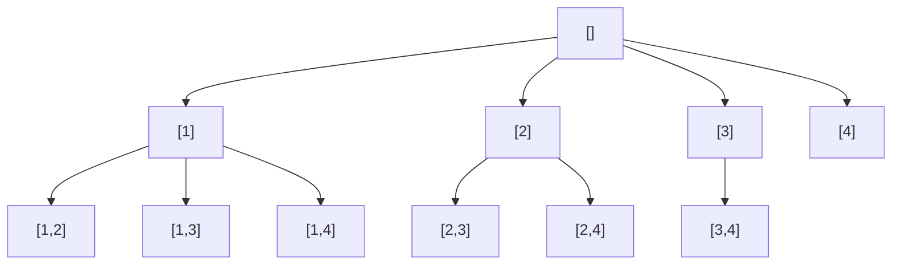
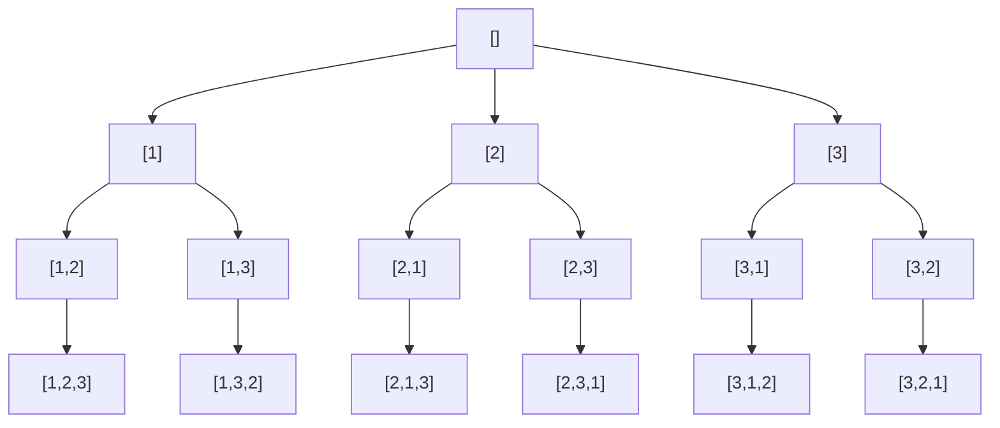
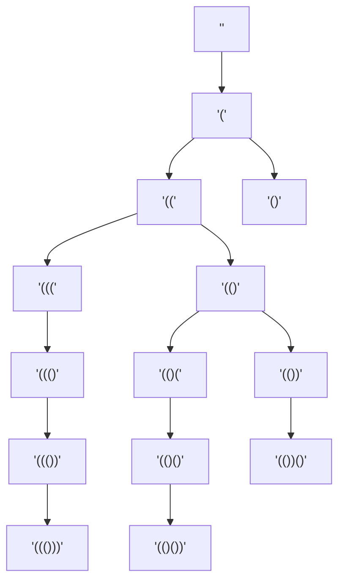
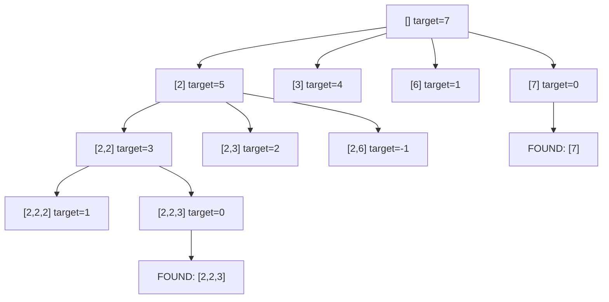
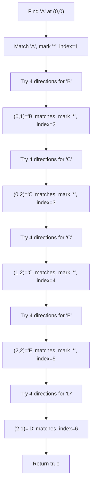
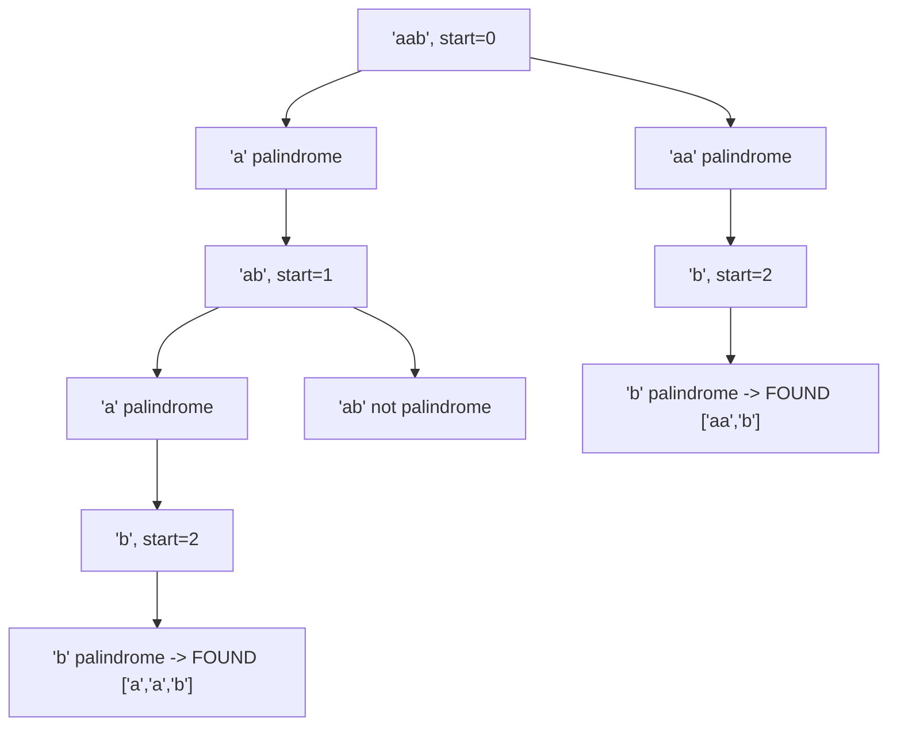
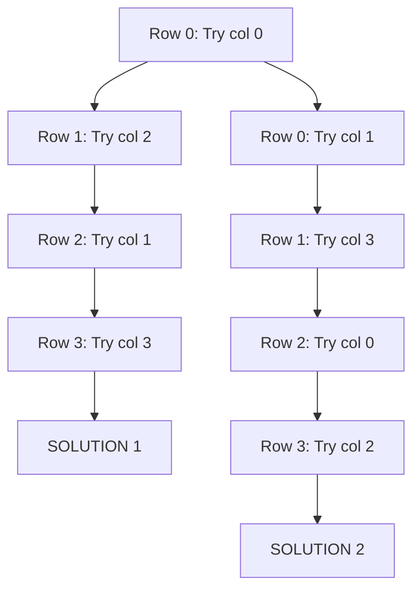
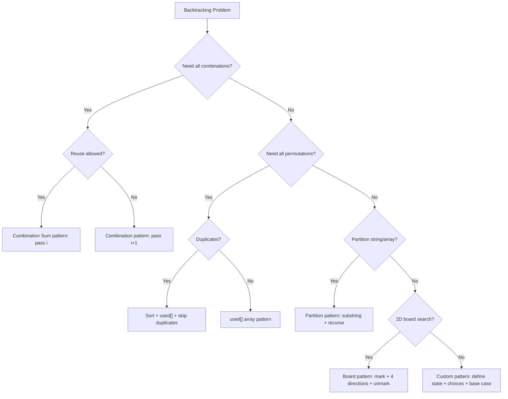

# Backtracking

## Key Concepts
- **Explore all possibilities systematically**: Try each option, recurse, undo, try next
- **Search Space**: All valid combinations/permutations/solutions
- **Pruning**: Cut branches that can't lead to valid solutions
- **State**: Current partial solution being built
- **Backtrack**: Undo choices and try alternatives
- **Base Case**: When solution is complete or invalid
- **Decision Tree**: Each node represents a choice; leaves are complete solutions

## When to Use
- Generate all permutations/combinations
- Find all valid paths/solutions
- Constraint satisfaction problems (N-Queens, Sudoku)
- Exhaustive search with optimization
- Problems asking for "all possible" results

## Time Complexity
- Generally **O(N!)** or **O(2^N)** - exponential
- Pruning can improve practical performance
- Space: **O(N)** for recursion stack
- Output space: can be O(N * 2^N) for storing all solutions

## Common Problems
- Subsets
- Combinations
- Permutations
- Generate Parentheses
- Combination Sum
- Word Search
- Palindrome Partitioning
- N-Queens
- Sudoku Solver
- Letter Combinations of a Phone Number

## Patterns
1. **Permutation pattern**: Choose element, recurse, undo choice
2. **Combination pattern**: Choose index range, avoid duplicates
3. **Partition pattern**: Divide string/array into valid parts
4. **Board pattern**: N-Queens, Sudoku solving
5. **Subset pattern**: Include/exclude each element

---

## 🔹 Basic Template

### Backtracking Template
```java
public List<List<Integer>> backtrackTemplate(int[] nums) {
    List<List<Integer>> result = new ArrayList<>();
    backtrack(nums, 0, new ArrayList<>(), result);
    return result;
}

private void backtrack(int[] nums, int start, List<Integer> current, List<List<Integer>> result) {
    if (isComplete(current)) {
        result.add(new ArrayList<>(current));
        return;
    }
    for (int i = start; i < nums.length; i++) {
        if (!isValid(current, nums[i])) continue;
        current.add(nums[i]);
        backtrack(nums, i + 1, current, result);
        current.remove(current.size() - 1);
    }
}
```

### Backtracking Decision Flow


---

## 🔹 Practice Problems by Topic

### Easy

#### 1. **Subsets**

**Problem Description:**
Given an integer array of unique elements, return all possible subsets (the power set). Solution set must not contain duplicate subsets.

**Example Walkthrough:**

Input: `nums = [1, 2, 3]`
```
Expected Output: [[], [1], [1,2], [1,2,3], [1,3], [2], [2,3], [3]]

Step-by-step execution:
Start: current=[], result=[[]]

i=0: add 1 -> current=[1]
     result=[[], [1]]
     i=1: add 2 -> current=[1,2]
          result=[[], [1], [1,2]]
          i=2: add 3 -> current=[1,2,3]
               result=[[], [1], [1,2], [1,2,3]]
               remove 3 -> current=[1,2]
          remove 2 -> current=[1]
     i=2: add 3 -> current=[1,3]
          result=[[], [1], [1,2], [1,2,3], [1,3]]
          remove 3 -> current=[1]
     remove 1 -> current=[]

i=1: add 2 -> current=[2]
     result=[[], [1], [1,2], [1,2,3], [1,3], [2]]
     i=2: add 3 -> current=[2,3]
          result=[[], [1], [1,2], [1,2,3], [1,3], [2], [2,3]]
          remove 3 -> current=[2]
     remove 2 -> current=[]

i=2: add 3 -> current=[3]
     result=[[], [1], [1,2], [1,2,3], [1,3], [2], [2,3], [3]]
     remove 3 -> current=[]

Final: [[], [1], [1,2], [1,2,3], [1,3], [2], [2,3], [3]]
```

Input: `nums = [0]`
```
Expected Output: [[], [0]]

Start: current=[], result=[[]]
i=0: add 0 -> current=[0]
     result=[[], [0]]
     remove 0 -> current=[]
Final: [[], [0]]
```

**Key Insight - Include/Exclude Decision:**
At each index, we decide whether to include the current element or not. The `start` parameter ensures we only consider elements from current position onward, avoiding duplicates. We add to result at every node (not just leaves) because every partial solution is a valid subset.

**Why It Works:**
- Each element has exactly 2 choices: include or exclude
- Total subsets = 2^n (each element independently in/out)
- Adding at every node captures all partial combinations
- `start` index prevents revisiting earlier elements (avoids duplicates)
- Backtracking removes the last element to explore alternative branches

**Time Complexity**: O(n * 2^n) - 2^n subsets, each takes O(n) to copy
**Space Complexity**: O(n) - recursion depth, plus output space

**Visualization - Subsets Decision Tree:**


```java
public List<List<Integer>> subsets(int[] nums) {
    List<List<Integer>> result = new ArrayList<>();
    backtrack(nums, 0, new ArrayList<>(), result);
    return result;
}

private void backtrack(int[] nums, int start, List<Integer> current, List<List<Integer>> result) {
    result.add(new ArrayList<>(current));
    for (int i = start; i < nums.length; i++) {
        current.add(nums[i]);
        backtrack(nums, i + 1, current, result);
        current.remove(current.size() - 1);
    }
}
```

**Edge Cases:**
- Empty array: returns [[]] (one empty subset)
- Single element: returns [[], [element]]
- All elements: 2^n subsets generated correctly
- Duplicates in input: handled by Subsets II variant

**Similar Pattern Problems:**
- Subsets II (with duplicates - sort and skip)
- Power Set (same problem)
- Letter Combinations of a Phone Number

---

#### 2. **Combinations**

**Problem Description:**
Given two integers n and k, return all possible combinations of k numbers chosen from the range [1, n].

**Example Walkthrough:**

Input: `n = 4, k = 2`
```
Expected Output: [[1,2], [1,3], [1,4], [2,3], [2,4], [3,4]]

Step-by-step execution:
Start: current=[], result=[]

i=1: add 1 -> current=[1]
     i=2: add 2 -> current=[1,2] (size=2=k)
          result=[[1,2]]
          remove 2 -> current=[1]
     i=3: add 3 -> current=[1,3]
          result=[[1,2], [1,3]]
          remove 3 -> current=[1]
     i=4: add 4 -> current=[1,4]
          result=[[1,2], [1,3], [1,4]]
          remove 4 -> current=[1]
     remove 1 -> current=[]

i=2: add 2 -> current=[2]
     i=3: add 3 -> current=[2,3]
          result=[[1,2], [1,3], [1,4], [2,3]]
          remove 3 -> current=[2]
     i=4: add 4 -> current=[2,4]
          result=[[1,2], [1,3], [1,4], [2,3], [2,4]]
          remove 4 -> current=[2]
     remove 2 -> current=[]

i=3: add 3 -> current=[3]
     i=4: add 4 -> current=[3,4]
          result=[[1,2], [1,3], [1,4], [2,3], [2,4], [3,4]]
          remove 4 -> current=[3]
     remove 3 -> current=[]

i=4: add 4 -> current=[4]
     (no more elements to add, size < k)
     remove 4 -> current=[]

Final: [[1,2], [1,3], [1,4], [2,3], [2,4], [3,4]]
```

Input: `n = 1, k = 1`
```
Expected Output: [[1]]

i=1: add 1 -> current=[1] (size=1=k)
     result=[[1]]
     remove 1 -> current=[]
Final: [[1]]
```

**Key Insight - Fixed Size with Start Index:**
Similar to subsets but with a fixed size constraint. The `start` parameter ensures we don't reuse elements and maintain increasing order. The base case triggers when current size equals k.

**Why It Works:**
- `start` index guarantees combinations are in increasing order
- No duplicates because we only move forward
- Base case at size k captures exactly k elements
- Pruning: if remaining elements can't fill to k, we can break early

**Optimization - Pruning:**
```java
// In the loop, we can prune:
for (int i = start; i <= n - (k - current.size()) + 1; i++) {
    // This ensures enough elements remain to complete combination
}
```

**Visualization - Combinations Decision Tree:**


```java
public List<List<Integer>> combine(int n, int k) {
    List<List<Integer>> result = new ArrayList<>();
    backtrack(n, k, 1, new ArrayList<>(), result);
    return result;
}

private void backtrack(int n, int k, int start, List<Integer> current, List<List<Integer>> result) {
    if (current.size() == k) {
        result.add(new ArrayList<>(current));
        return;
    }
    for (int i = start; i <= n; i++) {
        current.add(i);
        backtrack(n, k, i + 1, current, result);
        current.remove(current.size() - 1);
    }
}
```

**Edge Cases:**
- k = 0: returns [[]] (empty combination)
- k = n: returns [[1,2,...,n]] (one combination)
- k > n: no valid combinations, returns []
- n = 1, k = 1: returns [[1]]

**Similar Pattern Problems:**
- Combination Sum (unlimited reuse)
- Combination Sum II (each used once)
- Combination Sum III (exactly k elements)

---

#### 3. **Permutations**

**Problem Description:**
Given an array of distinct integers, return all possible permutations in any order.

**Example Walkthrough:**

Input: `nums = [1, 2, 3]`
```
Expected Output: [[1,2,3], [1,3,2], [2,1,3], [2,3,1], [3,1,2], [3,2,1]]

Step-by-step execution:
Start: current=[], used=[F,F,F], result=[]

i=0: used[0]=T, current=[1]
     i=1: used[1]=T, current=[1,2]
          i=2: used[2]=T, current=[1,2,3] (size=3)
               result=[[1,2,3]]
               undo: current=[1,2], used[2]=F
          undo: current=[1], used[1]=F
     i=2: used[2]=T, current=[1,3]
          i=1: used[1]=T, current=[1,3,2]
               result=[[1,2,3], [1,3,2]]
               undo: current=[1,3], used[1]=F
          undo: current=[1], used[2]=F
     undo: current=[], used[0]=F

i=1: used[1]=T, current=[2]
     i=0: used[0]=T, current=[2,1]
          i=2: used[2]=T, current=[2,1,3]
               result=[[1,2,3], [1,3,2], [2,1,3]]
               undo: current=[2,1], used[2]=F
          undo: current=[2], used[0]=F
     i=2: used[2]=T, current=[2,3]
          i=0: used[0]=T, current=[2,3,1]
               result=[[1,2,3], [1,3,2], [2,1,3], [2,3,1]]
               undo: current=[2,3], used[0]=F
          undo: current=[2], used[2]=F
     undo: current=[], used[1]=F

i=2: used[2]=T, current=[3]
     i=0: used[0]=T, current=[3,1]
          i=1: used[1]=T, current=[3,1,2]
               result=[[1,2,3], [1,3,2], [2,1,3], [2,3,1], [3,1,2]]
               undo: current=[3,1], used[1]=F
          undo: current=[3], used[0]=F
     i=1: used[1]=T, current=[3,2]
          i=0: used[0]=T, current=[3,2,1]
               result=[[1,2,3], [1,3,2], [2,1,3], [2,3,1], [3,1,2], [3,2,1]]
               undo: current=[3,2], used[0]=F
          undo: current=[3], used[1]=F
     undo: current=[], used[2]=F

Final: [[1,2,3], [1,3,2], [2,1,3], [2,3,1], [3,1,2], [3,2,1]]
```

Input: `nums = [1]`
```
Expected Output: [[1]]

i=0: used[0]=T, current=[1] (size=1=n)
     result=[[1]]
     undo: current=[], used[0]=F
Final: [[1]]
```

**Key Insight - Used Array Tracking:**
Unlike combinations, permutations care about order. We use a `boolean[] used` array to track which elements are already in the current permutation. At each step, we try every unused element. Base case triggers when current size equals array length.

**Why It Works:**
- Every position can be filled by any unused element
- `used` array prevents reusing same element in one permutation
- Total permutations = n! (n choices, then n-1, then n-2, ...)
- Backtracking undoes both the addition and the used flag

**Visualization - Permutations Decision Tree:**


```java
public List<List<Integer>> permute(int[] nums) {
    List<List<Integer>> result = new ArrayList<>();
    boolean[] used = new boolean[nums.length];
    backtrack(nums, used, new ArrayList<>(), result);
    return result;
}

private void backtrack(int[] nums, boolean[] used, List<Integer> current, List<List<Integer>> result) {
    if (current.size() == nums.length) {
        result.add(new ArrayList<>(current));
        return;
    }
    for (int i = 0; i < nums.length; i++) {
        if (!used[i]) {
            used[i] = true;
            current.add(nums[i]);
            backtrack(nums, used, current, result);
            current.remove(current.size() - 1);
            used[i] = false;
        }
    }
}
```

**Edge Cases:**
- Empty array: returns [[]]
- Single element: returns [[element]]
- Duplicates: handled by Permutations II (sort and skip)
- Large n: n! grows very fast (n=10 gives 3.6M permutations)

**Similar Pattern Problems:**
- Permutations II (with duplicates)
- Next Permutation (iterative)
- Letter Case Permutation

---

### Medium

#### 4. **Generate Parentheses**

**Problem Description:**
Given n pairs of parentheses, generate all combinations of well-formed parentheses.

**Example Walkthrough:**

Input: `n = 3`
```
Expected Output: ["((()))", "(()())", "(())()", "()(())", "()()()"]

Step-by-step execution:
Start: current="", open=3, close=3, result=[]

open > 0: add "(" -> current="(", open=2, close=3
    open > 0: add "(" -> current="((", open=1, close=3
        open > 0: add "(" -> current="(((", open=0, close=3
            close > open: add ")" -> current="((()", open=0, close=2
                close > open: add ")" -> current="((())", open=0, close=1
                    close > open: add ")" -> current="((()))", open=0, close=0
                        COMPLETE -> result=["((()))"]
                    undo -> current="((())", close=1
                undo -> current="((()", close=2
            undo -> current="(((", close=3
        undo -> current="((", open=1
        close > open: add ")" -> current="(()", open=1, close=2
            open > 0: add "(" -> current="(()(", open=0, close=2
                close > open: add ")" -> current="(()()", open=0, close=1
                    close > open: add ")" -> current="(()())", open=0, close=0
                        COMPLETE -> result=["((()))", "(()())"]
                    undo -> current="(()()", close=1
                undo -> current="(()(", close=2
            undo -> current="(()", open=1
            close > open: add ")" -> current="(())", open=1, close=1
                open > 0: add "(" -> current="(())(", open=0, close=1
                    close > open: add ")" -> current="(())()", open=0, close=0
                        COMPLETE -> result=["((()))", "(()())", "(())()"]
                    undo -> current="(())(", close=1
                undo -> current="(())", open=1
                close > open: add ")" -> current="(())", open=1, close=0
                    (close == 0, but open > 0, can't close more)
                    Actually close > open? 0 > 1? NO -> can't add
                undo -> current="(())", close=1
            undo -> current="(()", close=2
        undo -> current="((", close=3
    undo -> current="(", open=2
    close > open: add ")" -> current="()", open=2, close=2
        ... continues similarly
```

Input: `n = 1`
```
Expected Output: ["()"]

open > 0: add "(" -> current="(", open=0, close=1
    close > open: add ")" -> current="()", open=0, close=0
        COMPLETE -> result=["()"]
    undo -> current="(", close=1
undo -> current="", open=1
```

**Key Insight - Open/Close Count Tracking:**
Track remaining open and close parentheses. Two rules:
1. Add `(` only if `open > 0` (still have opening left)
2. Add `)` only if `close > open` (more closing than opening means we can close)

**Why It Works:**
- Well-formed parentheses require: never have more `)` than `(` at any prefix
- `close > open` condition ensures we only close when there's an unclosed `(`
- Base case: both open and close reach 0
- This generates all valid combinations without invalid ones

**Visualization - Generate Parentheses Decision Tree:**


```java
public List<String> generateParenthesis(int n) {
    List<String> result = new ArrayList<>();
    backtrack(n, n, "", result);
    return result;
}

private void backtrack(int open, int close, String current, List<String> result) {
    if (open == 0 && close == 0) {
        result.add(current);
        return;
    }
    if (open > 0) {
        backtrack(open - 1, close, current + "(", result);
    }
    if (close > open) {
        backtrack(open, close - 1, current + ")", result);
    }
}
```

**Edge Cases:**
- n = 0: returns [""]
- n = 1: returns ["()"]
- Large n: Catalan number grows exponentially
- String concatenation: could use StringBuilder for efficiency

**Similar Pattern Problems:**
- Generate Valid IP Addresses
- Restore IP Addresses
- Letter Combinations of a Phone Number

---

#### 5. **Combination Sum**

**Problem Description:**
Given an array of distinct integers and a target, return all unique combinations that sum to target. Same number may be used unlimited times.

**Example Walkthrough:**

Input: `candidates = [2, 3, 6, 7]`, `target = 7`
```
Expected Output: [[2,2,3], [7]]

Step-by-step execution:
Start: current=[], remaining=7, start=0

i=0: add 2 -> current=[2], remaining=5, start=0
     i=0: add 2 -> current=[2,2], remaining=3, start=0
          i=0: add 2 -> current=[2,2,2], remaining=1, start=0
               i=0: add 2 -> remaining=-1 < 0, prune
               i=1: add 3 -> remaining=-2 < 0, prune
               i=2: add 6 -> remaining=-5 < 0, prune
               i=3: add 7 -> remaining=-6 < 0, prune
               undo -> current=[2,2], remaining=3
          i=1: add 3 -> current=[2,2,3], remaining=0
               FOUND -> result=[[2,2,3]]
               undo -> current=[2,2], remaining=3
          i=2: add 6 -> remaining=-3 < 0, prune
          i=3: add 7 -> remaining=-4 < 0, prune
          undo -> current=[2], remaining=5
     i=1: add 3 -> current=[2,3], remaining=2
          i=0: add 2 -> current=[2,3,2], remaining=0
               FOUND -> result=[[2,2,3], [2,3,2]]  <- DUPLICATE!
               Wait, this shouldn't happen...
               Actually with start=i, we won't reuse earlier elements
               i=0: but start=1 now, so i starts at 1
               i=1: add 3 -> remaining=-1, prune
               i=2: add 6 -> remaining=-4, prune
               i=3: add 7 -> remaining=-5, prune
          undo -> current=[2], remaining=5
     i=2: add 6 -> remaining=-1, prune
     i=3: add 7 -> remaining=-2, prune
     undo -> current=[], remaining=7

i=1: add 3 -> current=[3], remaining=4, start=1
     i=1: add 3 -> current=[3,3], remaining=1, start=1
          i=1: add 3 -> remaining=-2, prune
          i=2: add 6 -> remaining=-5, prune
          i=3: add 7 -> remaining=-6, prune
          undo -> current=[3], remaining=4
     i=2: add 6 -> remaining=-2, prune
     i=3: add 7 -> remaining=-3, prune
     undo -> current=[], remaining=7

i=2: add 6 -> current=[6], remaining=1
     i=2: add 6 -> remaining=-5, prune
     i=3: add 7 -> remaining=-6, prune
     undo -> current=[], remaining=7

i=3: add 7 -> current=[7], remaining=0
     FOUND -> result=[[2,2,3], [7]]
     undo -> current=[], remaining=7

Final: [[2,2,3], [7]]
```

Input: `candidates = [2, 3, 5]`, `target = 8`
```
Expected Output: [[2,2,2,2], [2,3,3], [3,5]]

Multiple combinations found through backtracking
```

**Key Insight - Reuse with Start Index:**
Unlike combinations, we can reuse elements. But we pass `i` (not `i+1`) as the new start, allowing the same element to be picked again. The start index prevents duplicates by maintaining non-decreasing order.

**Why It Works:**
- Passing `i` (not `i+1`) allows reuse of same element
- Start index prevents combinations like [3,2] when [2,3] already exists
- Pruning when target < 0 avoids unnecessary recursion
- Base case target == 0 captures valid combinations

**Optimization - Sort and Prune:**
```java
Arrays.sort(candidates);  // Sort first
for (int i = start; i < candidates.length; i++) {
    if (candidates[i] > target) break;  // Prune: all further are larger
    // ... rest of logic
}
```

**Visualization - Combination Sum Decision Tree:**


```java
public List<List<Integer>> combinationSum(int[] candidates, int target) {
    List<List<Integer>> result = new ArrayList<>();
    Arrays.sort(candidates);
    backtrack(candidates, target, 0, new ArrayList<>(), result);
    return result;
}

private void backtrack(int[] candidates, int target, int start, List<Integer> current, List<List<Integer>> result) {
    if (target == 0) {
        result.add(new ArrayList<>(current));
        return;
    }
    if (target < 0) return;
    for (int i = start; i < candidates.length; i++) {
        if (candidates[i] > target) break;
        current.add(candidates[i]);
        backtrack(candidates, target - candidates[i], i, current, result);
        current.remove(current.size() - 1);
    }
}
```

**Edge Cases:**
- Empty candidates: returns []
- Target smaller than all: returns []
- Target = 0: returns [[]]
- Single candidate = target: returns [[target]]

**Similar Pattern Problems:**
- Combination Sum II (no reuse, skip duplicates)
- Combination Sum III (exactly k elements)
- Combination Sum IV (count permutations)

---

#### 6. **Word Search**

**Problem Description:**
Given a 2D board of characters and a word, determine if the word exists in the grid. Word can be constructed from adjacent cells (horizontal/vertical), same cell not used twice.

**Example Walkthrough:**

Input: `board = [['A','B','C','E'], ['S','F','C','S'], ['A','D','E','E']]`, `word = "ABCCED"`
```
Expected Output: true

Step-by-step execution:
Find starting 'A' at (0,0)

(0,0)='A' == 'A' -> mark '*', index=1
    (1,0)='S' != 'B', (0,1)='B' == 'B' -> mark '*', index=2
        (0,2)='C' == 'C' -> mark '*', index=3
            (0,3)='E' != 'C', (1,2)='C' == 'C' -> mark '*', index=4
                (1,1)='F' != 'E', (0,2)='*', (2,2)='E' == 'E' -> mark '*', index=5
                    (2,1)='D' == 'D' -> mark '*', index=6 == word.length()
                    RETURN true
```

Input: `board = [['A','B','C','E'], ['S','F','C','S'], ['A','D','E','E']]`, `word = "ABCB"`
```
Expected Output: false

(0,0)='A' -> (0,1)='B' -> (0,2)='C' -> back to 'B'? 
(0,1) already visited, (1,2)='C' not 'B'
No valid path, return false
```

**Key Insight - Mark and Unmark:**
Use DFS with backtracking. Mark current cell as visited (e.g., change to `*`), explore all 4 directions, then unmark (restore original character). This prevents revisiting the same cell in one path.

**Why It Works:**
- Start DFS from every cell that matches word[0]
- At each step, check current cell matches expected character
- Mark visited to avoid cycles
- Explore all 4 directions recursively
- Unmark on backtrack to allow other paths to use this cell

**Visualization - Word Search DFS:**


```java
public boolean exist(char[][] board, String word) {
    for (int i = 0; i < board.length; i++) {
        for (int j = 0; j < board[0].length; j++) {
            if (board[i][j] == word.charAt(0) && backtrack(board, word, 0, i, j)) {
                return true;
            }
        }
    }
    return false;
}

private boolean backtrack(char[][] board, String word, int index, int row, int col) {
    if (index == word.length()) return true;
    if (row < 0 || row >= board.length || col < 0 || col >= board[0].length ||
        board[row][col] != word.charAt(index)) {
        return false;
    }
    char original = board[row][col];
    board[row][col] = '*';
    boolean result = backtrack(board, word, index + 1, row + 1, col) ||
                     backtrack(board, word, index + 1, row - 1, col) ||
                     backtrack(board, word, index + 1, row, col + 1) ||
                     backtrack(board, word, index + 1, row, col - 1);
    board[row][col] = original;
    return result;
}
```

**Edge Cases:**
- Empty board: returns false
- Word longer than cells: returns false
- Single cell matching word: returns true
- Word with repeated characters: correctly handles revisits

**Time Complexity**: O(N * 3^L) where N is cells, L is word length
**Space Complexity**: O(L) for recursion stack

**Similar Pattern Problems:**
- Word Search II (multiple words - use Trie)
- Search Pattern in Matrix
- Number of Islands (similar DFS)

---

#### 7. **Palindrome Partitioning**

**Problem Description:**
Given a string s, partition s such that every substring is a palindrome. Return all possible palindrome partitioning.

**Example Walkthrough:**

Input: `s = "aab"`
```
Expected Output: [["a","a","b"], ["aa","b"]]

Step-by-step execution:
Start: current=[], start=0

i=0: substring "a" is palindrome
     current=["a"], recurse(start=1)
     i=1: substring "a" is palindrome
          current=["a","a"], recurse(start=2)
          i=2: substring "b" is palindrome
               current=["a","a","b"], recurse(start=3)
               start == s.length() -> COMPLETE
               result=[["a","a","b"]]
               undo -> current=["a","a"]
          undo -> current=["a"]
     i=2: substring "ab" is NOT palindrome -> skip
     undo -> current=[]

i=1: substring "aa" is palindrome
     current=["aa"], recurse(start=2)
     i=2: substring "b" is palindrome
          current=["aa","b"], recurse(start=3)
          start == s.length() -> COMPLETE
          result=[["a","a","b"], ["aa","b"]]
          undo -> current=["aa"]
     undo -> current=[]

i=2: substring "aab" is NOT palindrome -> skip

Final: [["a","a","b"], ["aa","b"]]
```

Input: `s = "a"`
```
Expected Output: [["a"]]

i=0: substring "a" is palindrome
     current=["a"], recurse(start=1)
     start == s.length() -> COMPLETE
     result=[["a"]]
Final: [["a"]]
```

**Key Insight - Try Every Prefix:**
At each position, try every possible prefix ending at i. If prefix is a palindrome, add it and recurse on the remainder. This ensures all valid partitions are explored.

**Why It Works:**
- Every partition has a first part (prefix) that must be a palindrome
- After choosing a palindrome prefix, recursively partition the rest
- Base case: when we've consumed entire string
- Palindrome check ensures only valid parts are chosen

**Optimization - Precompute Palindromes:**
```java
// Precompute isPalindrome[i][j] in O(n^2) using DP
boolean[][] isPal = new boolean[n][n];
for (int i = n-1; i >= 0; i--) {
    for (int j = i; j < n; j++) {
        if (s.charAt(i) == s.charAt(j) && (j-i <= 2 || isPal[i+1][j-1])) {
            isPal[i][j] = true;
        }
    }
}
```

**Visualization - Palindrome Partitioning:**


```java
public List<List<String>> partition(String s) {
    List<List<String>> result = new ArrayList<>();
    backtrack(s, 0, new ArrayList<>(), result);
    return result;
}

private void backtrack(String s, int start, List<String> current, List<List<String>> result) {
    if (start == s.length()) {
        result.add(new ArrayList<>(current));
        return;
    }
    for (int i = start; i < s.length(); i++) {
        if (isPalindrome(s, start, i)) {
            current.add(s.substring(start, i + 1));
            backtrack(s, i + 1, current, result);
            current.remove(current.size() - 1);
        }
    }
}

private boolean isPalindrome(String s, int left, int right) {
    while (left < right) {
        if (s.charAt(left++) != s.charAt(right--)) return false;
    }
    return true;
}
```

**Edge Cases:**
- Empty string: returns [[]]
- Single character: returns [[char]]
- All same characters: many valid partitions
- No palindrome > 1: only single-char partitions

**Time Complexity**: O(N * 2^N) - 2^N partitions, O(N) palindrome check each
**Space Complexity**: O(N) - recursion stack

**Similar Pattern Problems:**
- Palindrome Partitioning II (minimum cuts - DP)
- Palindrome Partitioning III (k partitions)
- Cut Palindrome String

---

### Hard

#### 8. **N-Queens**

**Problem Description:**
Place n queens on an n×n chessboard such that no two queens attack each other. Return all distinct solutions. Each solution contains a distinct board configuration.

**Example Walkthrough:**

Input: `n = 4`
```
Expected Output: [[".Q..","...Q","Q...","..Q."], ["..Q.","Q...","...Q",".Q.."]]

Step-by-step execution:
Row 0, Col 0: Place Q at (0,0)
    Row 1: Col 0 (same column), Col 1 (diagonal), Col 2 OK
    Place Q at (1,2)
        Row 2: Col 0 (diagonal), Col 1 OK
        Place Q at (2,1)
            Row 3: Col 0 (diagonal), Col 1 (same column), Col 2 (diagonal), Col 3 OK
            Place Q at (3,3)
                Row 4 = n -> COMPLETE
                Solution 1: [".Q..","...Q","Q...","..Q."]
                Backtrack all the way to Row 0

Row 0, Col 1: Place Q at (0,1)
    Row 1: Col 0 OK
    Place Q at (1,0)
        Row 2: Col 2 OK? (diagonal conflict with (0,1)?)
        (0,1) and (2,2): row diff=2, col diff=1 -> no conflict
        Actually (1,0) and (2,2): row diff=1, col diff=2 -> no conflict
        Place Q at (2,2)? But check (0,1) and (2,2): 2-0=2, 2-1=1 -> no conflict
        Wait, need to check all previous queens
        (1,0) and (2,2): row diff=1, col diff=2 -> no conflict
        Place Q at (2,2)? But check (0,1) and (2,2): 2-0=2, 2-1=1 -> no conflict
        Actually let me redo: (0,1), (1,0), (2,2)?
        (0,1) and (1,0): row diff=1, col diff=1 -> DIAGONAL CONFLICT!
        So (1,0) is invalid after (0,1)
    Row 1: Col 2? (0,1) and (1,2): row diff=1, col diff=1 -> DIAGONAL CONFLICT
    Row 1: Col 3 OK
    Place Q at (1,3)
        Row 2: Col 0 OK? (0,1) and (2,0): row diff=2, col diff=1 -> no conflict
        (1,3) and (2,0): row diff=1, col diff=3 -> no conflict
        Place Q at (2,0)
            Row 3: Col 2 OK? 
            (0,1) and (3,2): row diff=3, col diff=1 -> no conflict
            (1,3) and (3,2): row diff=2, col diff=1 -> no conflict
            (2,0) and (3,2): row diff=1, col diff=2 -> no conflict
            Place Q at (3,2)
                Row 4 = n -> COMPLETE
                Solution 2: ["..Q.","Q...","...Q",".Q.."]

Final: 2 solutions
```

Input: `n = 1`
```
Expected Output: [["Q"]]

Row 0, Col 0: Place Q at (0,0)
Row 1 = n -> COMPLETE
Solution: ["Q"]
```

**Key Insight - Validity Check with Pruning:**
For each row, try placing queen in every column. Check if placement is valid (no column conflict, no diagonal conflict with any previously placed queen). If valid, place and recurse. If no valid column, backtrack.

**Why It Works:**
- One queen per row (guaranteed by recursion structure)
- Column conflict: check `board[i][col] == 'Q'` for all previous rows
- Diagonal conflict: check both diagonals going up-left and up-right
- Only need to check upward because lower rows aren't placed yet
- Base case: all n rows filled = valid solution

**Visualization - N-Queens Backtracking:**


```java
public List<List<String>> solveNQueens(int n) {
    List<List<String>> result = new ArrayList<>();
    char[][] board = new char[n][n];
    for (int i = 0; i < n; i++) {
        for (int j = 0; j < n; j++) {
            board[i][j] = '.';
        }
    }
    backtrack(board, 0, result);
    return result;
}

private void backtrack(char[][] board, int row, List<List<String>> result) {
    if (row == board.length) {
        result.add(boardToList(board));
        return;
    }
    for (int col = 0; col < board.length; col++) {
        if (isValid(board, row, col)) {
            board[row][col] = 'Q';
            backtrack(board, row + 1, result);
            board[row][col] = '.';
        }
    }
}

private boolean isValid(char[][] board, int row, int col) {
    for (int i = 0; i < row; i++) {
        if (board[i][col] == 'Q') return false;
    }
    for (int i = row - 1, j = col - 1; i >= 0 && j >= 0; i--, j--) {
        if (board[i][j] == 'Q') return false;
    }
    for (int i = row - 1, j = col + 1; i >= 0 && j < board.length; i--, j++) {
        if (board[i][j] == 'Q') return false;
    }
    return true;
}

private List<String> boardToList(char[][] board) {
    List<String> result = new ArrayList<>();
    for (char[] row : board) {
        result.add(new String(row));
    }
    return result;
}
```

**Edge Cases:**
- n = 1: returns [["Q"]]
- n = 2, n = 3: no solutions, returns []
- n = 4: 2 solutions
- n = 8: 92 solutions

**Time Complexity**: O(n!) - n choices for first row, n-1 for second, etc.
**Space Complexity**: O(n^2) for board, O(n) for recursion

**Similar Pattern Problems:**
- N-Queens II (count solutions only)
- Sudoku Solver (similar backtracking on grid)
- Knight's Tour

---

## 📌 Key Patterns & Techniques

### 1. **Combination Pattern (No Reuse)**
```java
backtrack(nums, i + 1, current, result);  // i+1 prevents reuse
```
- Use `start` index to avoid duplicates
- Explore from start to end
- Perfect for: Combinations, Subsets

### 2. **Permutation Pattern (Full Reuse)**
```java
if (!used[i]) {
    used[i] = true;
    backtrack(nums, used, current, result);
    used[i] = false;
}
```
- Use `boolean[] used` array
- Try all unused elements
- Perfect for: Permutations, Arrangements

### 3. **Substring/Partition Pattern**
```java
for (int i = start; i < s.length(); i++) {
    if (isValid(s, start, i)) {
        current.add(s.substring(start, i + 1));
        backtrack(s, i + 1, current, result);
        current.remove(current.size() - 1);
    }
}
```
- Iterate through indices
- Choose substring, recurse on remainder
- Perfect for: Palindrome Partitioning, IP Addresses

### 4. **Board Pattern (2D Search)**
```java
char original = board[row][col];
board[row][col] = '*';
// Explore 4 directions
board[row][col] = original;
```
- Mark visited cells
- Explore 4 directions
- Unmark on backtrack
- Perfect for: Word Search, N-Queens

### 5. **Pruning Techniques**
```java
if (target < 0) return;  // Prune invalid
if (candidates[i] > target) break;  // Prune sorted
if (close > open) { ... }  // Constraint check
```
- Early termination when target reached
- Check validity before recursing
- Skip impossible branches

### 6. **Duplicate Handling**
```java
Arrays.sort(nums);
if (i > start && nums[i] == nums[i-1]) continue;  // Skip duplicates
```
- Sort first to group duplicates
- Skip if same as previous at same level
- Perfect for: Subsets II, Permutations II, Combination Sum II

---

## 🎯 Common Pitfalls to Avoid

- ❌ Forgetting to undo changes when backtracking (must remove from current, unmark used, restore board)
- ❌ Not handling duplicates (sort first, then skip `nums[i] == nums[i-1]`)
- ❌ Incorrect base case conditions (check size == k, target == 0, start == length)
- ❌ Not exploring all possibilities (missing directions, wrong loop bounds)
- ❌ Inefficient pruning strategies (prune as early as possible)
- ❌ Modifying shared data structure (always undo before returning)
- ❌ Off-by-one errors in index management (`i+1` vs `i`, `<=` vs `<`)
- ❌ Using `List<List<Integer>>` directly (must create new ArrayList for each result)
- ❌ Forgetting to sort when duplicates need handling
- ❌ Not passing `start` index for combination problems

---

## 🔹 Backtracking Decision Flow

### Choosing the Right Pattern



### Complexity Cheat Sheet

| Pattern | Time | Space | Example |
|---------|------|-------|---------|
| Subsets | O(n * 2^n) | O(n) | Subsets |
| Combinations | O(C(n,k) * k) | O(k) | Combinations |
| Permutations | O(n * n!) | O(n) | Permutations |
| Partition | O(n * 2^n) | O(n) | Palindrome Partitioning |
| Board Search | O(N * 3^L) | O(L) | Word Search |
| N-Queens | O(n!) | O(n^2) | N-Queens |
| Parentheses | O(4^n/sqrt(n)) | O(n) | Generate Parentheses |