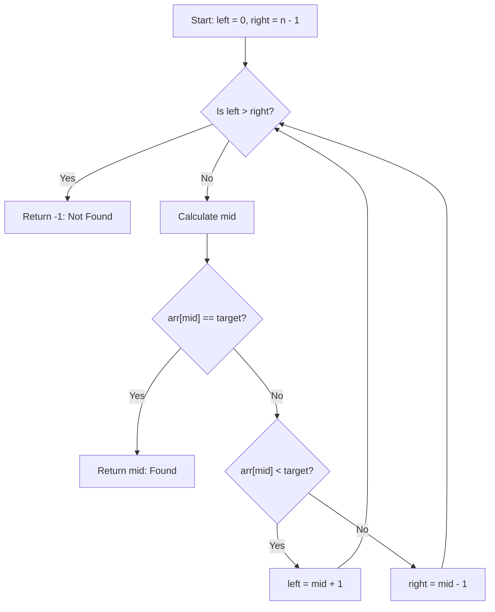
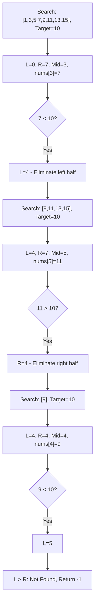
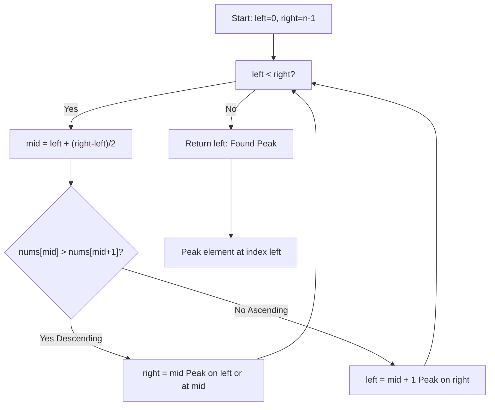
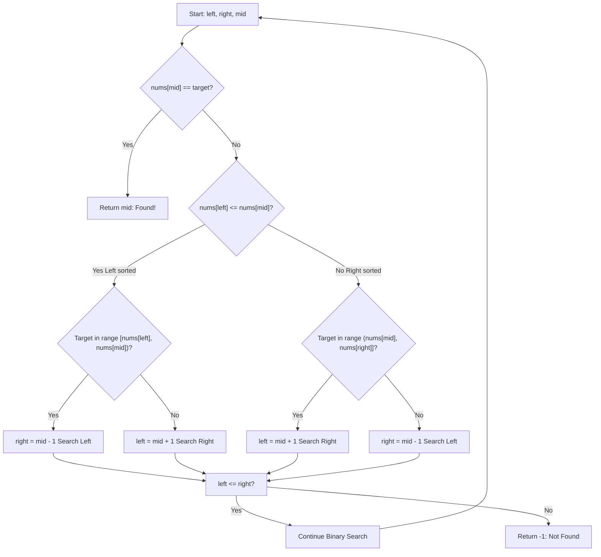
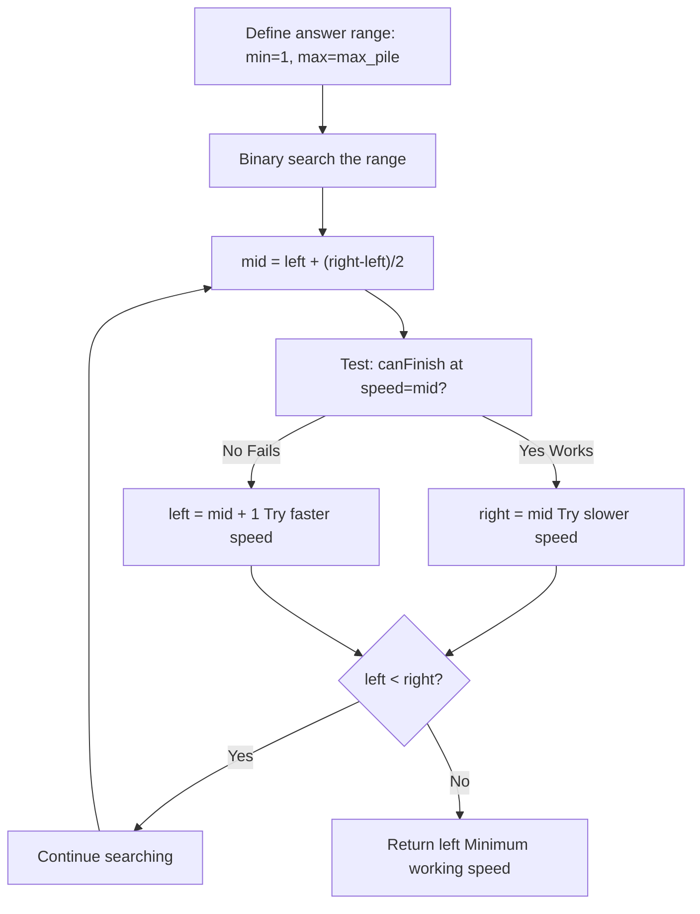

---
tags:
  - binary-search
  - sorted-array
  - divide-and-conquer
  - binary-search-on-answer
  - neetcode-150
---

# Binary Search

## Key Concepts
- **Divide and Conquer Algorithm**: Repeatedly divide search space in half
- **Requires Sorted Input**: Only works on sorted arrays or monotonic conditions
- **Time Complexity**: **O(log n)** - much faster than linear search O(n)
- **Space Complexity**: **O(1)** for iterative, **O(log n)** for recursive (call stack)
- **Search Space Reduction**: Eliminates half of remaining elements in each iteration

## Common Problems
- Search in Sorted Array
- Find First and Last Position
- Search Insert Position
- Find Peak Element
- Search in Rotated Sorted Array
- Find Minimum in Rotated Sorted Array
- Koko Eating Bananas
- Median of Two Sorted Arrays

## Techniques / Patterns
- Standard Binary Search (exact match)
- Finding Boundaries (First/Last Occurrence)
- Searching in Rotated Arrays (cleverly identifying sorted halves)
- Searching with Conditions (Peak, Minimum, comparisons)
- Binary Search on Answer (searching over possible solutions, not elements)

---

## 🔹 Basic Template

### Iterative Approach
```java
public int binarySearch(int[] arr, int target) {
    int left = 0, right = arr.length - 1;
    while (left <= right) {
        int mid = left + (right - left) / 2;
        if (arr[mid] == target) {
            return mid;
        } else if (arr[mid] < target) {
            left = mid + 1;
        } else {
            right = mid - 1;
        }
    }
    return -1;
}
```

### Recursive Approach
```java
public int binarySearchRecursive(int[] arr, int target, int left, int right) {
    if (left > right) {
        return -1;
    }
    int mid = left + (right - left) / 2;
    if (arr[mid] == target) {
        return mid;
    } else if (arr[mid] < target) {
        return binarySearchRecursive(arr, target, mid + 1, right);
    } else {
        return binarySearchRecursive(arr, target, left, mid - 1);
    }
}
```

### Binary Search Decision Flow


---

## 🔹 Practice Problems by Topic

### Easy

#### 1. **Binary Search in Sorted Array**

**Problem Description:**
You have a sorted array of integers and need to find a target value. Return the index if found, otherwise return -1.

**Example Walkthrough:**

Input: `nums = [1, 3, 5, 7, 9, 11, 13, 15]`, `target = 7`

**Step-by-step execution:**
```
Initial state:
Array:  [1, 3, 5, 7, 9, 11, 13, 15]
         L              M              R
left=0, right=7, mid=3

Step 1: nums[mid]=7 == target=7 -> Found! Return 3
```

Input: `nums = [1, 3, 5, 7, 9, 11, 13, 15]`, `target = 10`

**Step-by-step execution:**
```
Step 1: left=0, right=7, mid=3
        nums[3]=7 < target=10 -> Search right half
        left = mid + 1 = 4

Step 2: left=4, right=7, mid=5
        nums[5]=11 > target=10 -> Search left half
        right = mid - 1 = 4

Step 3: left=4, right=4, mid=4
        nums[4]=9 < target=10 -> Search right half
        left = mid + 1 = 5

Step 4: left=5, right=4 -> left > right, loop ends
        Return -1 (not found)
```

**Why It Works:**
- Each comparison with mid eliminates exactly half of the remaining search space
- Since the array is sorted, if target > arr[mid], it cannot exist in left half
- If target < arr[mid], it cannot exist in right half
- This guarantees we explore only log(n) elements maximum

**Time Complexity**: O(log n) - at most 8 comparisons for array of 256 elements
**Space Complexity**: O(1) - only using pointers

**Visualization - Search Space Narrowing:**


```java
public int search(int[] nums, int target) {
    int left = 0, right = nums.length - 1;
    while (left <= right) {
        int mid = left + (right - left) / 2;
        if (nums[mid] == target) {
            return mid;
        } else if (nums[mid] < target) {
            left = mid + 1;
        } else {
            right = mid - 1;
        }
    }
    return -1;
}
```

**Edge Cases:**
- Empty array: loop doesn't execute, returns -1
- Single element match: works correctly
- Target not in array: left > right eventually, returns -1

**Similar Pattern Problems:**
- Contains Duplicate II (searching within a range)
- Single Element in Sorted Array (finding unique element)

---

#### 2. **Search Insert Position**

**Problem Description:**
Given a sorted array and a target value, return the index if found. If not found, return the index where it would be if it were inserted in order.

**Example Walkthrough:**

Input: `nums = [1, 3, 5, 7]`, `target = 5`
```
Expected Output: 2 (element found at index 2)
```

Input: `nums = [1, 3, 5, 7]`, `target = 6`
```
Expected Output: 3 (insert 6 after 5, before 7)

Step 1: left=0, right=3, mid=1
        nums[1]=3 < target=6 -> left = 2

Step 2: left=2, right=3, mid=2
        nums[2]=5 < target=6 -> left = 3

Step 3: left=3, right=3, mid=3
        nums[3]=7 > target=6 -> right = 2

Step 4: left=3, right=2 -> Loop ends (left > right)
        The left pointer is now at position 3, which is the correct insertion point!
```

**Key Insight:**
When element is not found, the `left` pointer will always be positioned at the exact insertion point to maintain sorted order. This is because:
- All elements to the left of `left` are <= target
- All elements at and right of `left` are > target

**Why It Works:**
We use the same binary search logic as regular search, but when element not found, `left` naturally settles at insertion position.

```java
public int searchInsert(int[] nums, int target) {
    int left = 0, right = nums.length - 1;
    while (left <= right) {
        int mid = left + (right - left) / 2;
        if (nums[mid] == target) {
            return mid;
        } else if (nums[mid] < target) {
            left = mid + 1;
        } else {
            right = mid - 1;
        }
    }
    return left;
}
```

**Edge Cases:**
- Target smaller than all elements: left stays at 0
- Target larger than all elements: left becomes array.length
- Target at beginning/middle/end: all work correctly

**Similar Pattern Problems:**
- First Bad Version (finding first occurrence of a condition)
- Valid Perfect Square (checking existence with calculation)

---

### Medium

#### 3. **Find First and Last Position of Element in Sorted Array**

**Problem Description:**
Given an array with potential duplicates, find the starting and ending position of a given target value. Return [-1, -1] if not found.

**Example Walkthrough:**

Input: `nums = [5, 7, 7, 8, 8, 10]`, `target = 8`
```
Expected Output: [3, 4] (8 appears at indices 3 and 4)

First Occurrence:
Step 1: left=0, right=5, mid=2
        nums[2]=7 < target=8 -> left = 3

Step 2: left=3, right=5, mid=4
        nums[4]=8 == target -> Found! But keep searching left
        result = 4, right = 3 (continue searching left half)

Step 3: left=3, right=3, mid=3
        nums[3]=8 == target -> Found! result = 3, right = 2

Step 4: left=3, right=2 -> Loop ends
        First occurrence at index 3

Last Occurrence:
Similar process but after finding, we search right (left = mid + 1)
Last occurrence at index 4
```

**Key Insight - Two-Pass Binary Search:**
1. **First Occurrence**: When target found, save position but continue searching LEFT to find the leftmost occurrence
2. **Last Occurrence**: When target found, save position but continue searching RIGHT to find the rightmost occurrence

This is the "boundary search" pattern - instead of returning immediately when found, we continue until we hit the exact boundary.

**Why It Works:**
- A single binary search finds ANY occurrence of target
- To find boundaries, we treat finding target as a signal to explore that specific direction
- By saving result and continuing, we shrink the search space toward the boundary
- Left pointer will eventually point to first occurrence, right pointer to last

```java
public int[] searchRange(int[] nums, int target) {
    int first = findFirst(nums, target);
    int last = findLast(nums, target);
    return new int[]{first, last};
}

private int findFirst(int[] nums, int target) {
    int left = 0, right = nums.length - 1;
    int result = -1;
    while (left <= right) {
        int mid = left + (right - left) / 2;
        if (nums[mid] == target) {
            result = mid;
            right = mid - 1;
        } else if (nums[mid] < target) {
            left = mid + 1;
        } else {
            right = mid - 1;
        }
    }
    return result;
}

private int findLast(int[] nums, int target) {
    int left = 0, right = nums.length - 1;
    int result = -1;
    while (left <= right) {
        int mid = left + (right - left) / 2;
        if (nums[mid] == target) {
            result = mid;
            left = mid + 1;
        } else if (nums[mid] < target) {
            left = mid + 1;
        } else {
            right = mid - 1;
        }
    }
    return result;
}
```

**Time Complexity**: O(log n) - two binary searches
**Space Complexity**: O(1) - only pointers

**Edge Cases:**
- Target not present: both return -1
- Single occurrence: first and last are same index
- All elements are target: first=0, last=length-1

**Similar Pattern Problems:**
- Find K Closest Elements (variant with range)
- Count Complete Tree Nodes (boundary search)

---

#### 4. **Find Peak Element**

**Problem Description:**
A peak element is an element greater than its neighbors. Find the index of any peak element. Note: treat array boundaries as -infinity, so edge elements can be peaks.

**Example Walkthrough:**

Input: `nums = [1, 2, 3, 1]`
```
Expected Output: 2 (nums[2]=3 is greater than neighbors 2 and 1)

Visual:
    3 <- Peak (greater than both neighbors)
   / \
  2   1
 /
1

Step 1: left=0, right=3, mid=1
        Compare nums[1]=2 with nums[2]=3
        nums[1] < nums[2] -> Peak is on right side
        left = 2

Step 2: left=2, right=3, mid=2
        Compare nums[2]=3 with nums[3]=1
        nums[2] > nums[3] -> Peak is on left side (or at mid)
        right = 2

Step 3: left=2, right=2 -> Loop ends, return left=2
        nums[2]=3 is the peak
```

Input: `nums = [1, 2, 1, 3, 5, 4, 6, 5]`
```
Expected Output: 1 or 5 (two peaks exist, any is acceptable)

Visual:
2     5   6
 \   /|   |\
  1 1 3 4  5
  
Peaks: 2 (index 1) and 6 (index 6)
```

**Key Insight - Monotonic Property:**
In ANY array where we compare each element with its right neighbor:
- If nums[mid] > nums[mid+1]: The peak MUST be on the left side (or at mid) because we're descending
- If nums[mid] < nums[mid+1]: The peak MUST be on the right side because we're ascending

This monotonic comparison property is what makes binary search work here WITHOUT comparing to exact values.

**Why It Works:**
Since we treat boundaries as -infinity:
- If array has only 1 element, it's a peak (return it)
- As we move through any array, we can't stay flat forever (would contradict monotonic comparison)
- Therefore, a peak MUST exist
- By comparing with right neighbor, we always move toward the higher side
- Eventually we find where ascending stops and descending starts = peak!

**Peak Finding Comparison Flow:**


```java
public int findPeakElement(int[] nums) {
    int left = 0, right = nums.length - 1;
    while (left < right) {
        int mid = left + (right - left) / 2;
        if (nums[mid] > nums[mid + 1]) {
            right = mid;
        } else {
            left = mid + 1;
        }
    }
    return left;
}
```

**Important Detail:**
We use `left < right` (not `<=`) because once left==right, we've found our answer. Also, `right = mid` (not `mid-1`) when peak is on left because mid might be the peak.

**Time Complexity**: O(log n)
**Space Complexity**: O(1)

**Edge Cases:**
- Single element: returns 0 immediately
- Strictly increasing: returns last element
- Strictly decreasing: returns first element
- Multiple peaks: returns any one of them

**Similar Pattern Problems:**
- Mountain Peak Array (similar comparison logic)
- Find in Mountain Array (combining peak search with binary search)

---

#### 5. **Search in Rotated Sorted Array**

**Problem Description:**
An array was originally sorted in ascending order, then rotated at an unknown pivot. For example: [0,1,2,4,5,6,7] might become [4,5,6,7,0,1,2]. Find target's index.

**Example Walkthrough:**

Input: `nums = [4, 5, 6, 7, 0, 1, 2]`, `target = 0`
```
Expected Output: 4

Rotation point:
   Original: [0, 1, 2, 4, 5, 6, 7]
   Rotated:  [4, 5, 6, 7, 0, 1, 2]
                         ^ rotation happened here

The KEY insight: One half is ALWAYS sorted!

Step 1: left=0, right=6, mid=3
        nums[3]=7
        Check if left half is sorted: nums[0]=4 <= nums[3]=7? YES
        Left half [4,5,6,7] is sorted
        Is target 0 in range [4,7]? NO
        So target must be in right half -> left = 4

Step 2: left=4, right=6, mid=5
        nums[5]=1
        Check if left half is sorted: nums[4]=0 <= nums[5]=1? YES
        Left half [0,1] is sorted
        Is target 0 in range [0,1]? YES
        Search left -> right = 4

Step 3: left=4, right=4 -> Found! Return 4
```

**Key Insight - Identify Sorted Half:**
In a rotated array, one half must still be properly sorted (has no pivot). By checking if `nums[left] <= nums[mid]`, we determine which half is sorted:
- If true: LEFT half is sorted
- If false: RIGHT half is sorted

Then we check if target falls within that sorted range to decide which half to search.

**Why It Works:**
- The rotation point creates exactly 2 sorted subarrays
- At any mid-point, we can determine which subarray is complete/sorted
- We check if target fits in that sorted range
- This allows us to eliminate half the search space while handling the rotation

**Rotated Array Search Logic Flow:**


**Step-by-Step Logic:**
```
1. Find mid
2. Check if nums[mid] == target -> Return
3. Determine which half is sorted by comparing nums[left] with nums[mid]
4. If sorted half contains target -> search that half
5. Otherwise -> search the other half
6. Repeat
```

```java
public int search(int[] nums, int target) {
    int left = 0, right = nums.length - 1;
    while (left <= right) {
        int mid = left + (right - left) / 2;
        if (nums[mid] == target) {
            return mid;
        }
        if (nums[left] <= nums[mid]) {
            if (target >= nums[left] && target < nums[mid]) {
                right = mid - 1;
            } else {
                left = mid + 1;
            }
        } else {
            if (target > nums[mid] && target <= nums[right]) {
                left = mid + 1;
            } else {
                right = mid - 1;
            }
        }
    }
    return -1;
}
```

**Critical Conditions:**
- Left half sorted: `nums[left] <= nums[mid]`
- Target in range: use strict inequality (`<` and `>`) for left bound, non-strict (`<=`) for right bound
- This ensures we correctly identify boundary cases

**Time Complexity**: O(log n)
**Space Complexity**: O(1)

**Edge Cases:**
- Target at rotation point: found correctly
- Rotation at start or end: works normally
- Array not actually rotated: works as normal binary search

**Similar Pattern Problems:**
- Search in Rotated Sorted Array II (with duplicates - much harder!)
- Find Rotation Count (count how many times rotated)

---

#### 6. **Find Minimum in Rotated Sorted Array**

**Problem Description:**
A sorted array was rotated at an unknown pivot. Find the minimum element.

**Example Walkthrough:**

Input: `nums = [3, 4, 5, 1, 2]`
```
Expected Output: 1

Original: [1, 2, 3, 4, 5]
Rotated:  [3, 4, 5, 1, 2]
                    ^ minimum after rotation

The minimum is always at the rotation point!

Step 1: left=0, right=4, mid=2
        nums[2]=5, nums[4]=2
        nums[2] > nums[4]? YES -> minimum must be in right half
        left = mid + 1 = 3

Step 2: left=3, right=4, mid=3
        nums[3]=1, nums[4]=2
        nums[3] > nums[4]? NO -> minimum is in left half (or at mid)
        right = mid = 3

Step 3: left=3, right=3 -> Loop ends
        Return nums[3] = 1
```

**Key Insight - Use Right Boundary as Reference:**
We compare `nums[mid]` with `nums[right]` (not with `nums[left]`):
- If `nums[mid] > nums[right]`: The minimum is DEFINITELY in right half because left part is sorted and doesn't have the minimum
- If `nums[mid] <= nums[right]`: The minimum is in left half or at mid (right part is sorted, so min can't be there)

Why compare with RIGHT and not left?
- Right boundary naturally guides toward the unsorted portion where the rotation/minimum is
- Left pointer might still be in the larger sorted section

**Why It Works:**
In a rotated array:
- Everything before rotation point is larger
- Everything after is smaller
- Minimum is always at rotation point
- By comparing with right and moving toward where things are getting smaller, we find the rotation point

```java
public int findMin(int[] nums) {
    int left = 0, right = nums.length - 1;
    while (left < right) {
        int mid = left + (right - left) / 2;
        if (nums[mid] > nums[right]) {
            left = mid + 1;
        } else {
            right = mid;
        }
    }
    return nums[left];
}
```

**Important Details:**
- Use `left < right` (not <=) because at end, left==right points to minimum
- Use `right = mid` (not `mid-1`) to ensure we don't skip the actual minimum
- Use `left = mid + 1` (not mid) when mid is larger because we confirmed mid > right

**Time Complexity**: O(log n)
**Space Complexity**: O(1)

**Edge Cases:**
- Array not rotated (minimum at start): works correctly
- Rotated once (minimum at end): works correctly
- Single element: loop doesn't execute, returns that element
- All elements equal except minimum: works correctly

**Similar Pattern Problems:**
- Find Minimum in Rotated Sorted Array II (with duplicates - trickier!)
- Find Peak and Valley search problems

---

### Hard

#### 7. **Binary Search on Answer: Koko Eating Bananas**

**Problem Description:**
Koko loves eating bananas. There are `n` piles of bananas. Koko eats at a fixed eating speed of `k` bananas per hour. If a pile has fewer bananas than `k`, Koko finishes the pile and moves to the next one (no eating across piles). Find the minimum eating speed so Koko can finish all bananas within `h` hours.

**Example Walkthrough:**

Input: `piles = [1, 1, 1, 1]`, `h = 4`
```
Expected Output: 1

Explanation:
At speed 1: 1+1+1+1 = 4 hours

Different speeds:
Speed 1: 1+1+1+1 = 4 hours (fits in 4 hours!)
Speed 2: 1+1+1+1 = 4 hours (fits in 4 hours!)

Answer is 1 (minimum)
```

Input: `piles = [312884132, 968299470, 310146932]`, `h = 968709470`
```
Expected Output: 1

This is a HUGE search space (speed from 1 to 312884132)
Can't check every speed - that's 312 million operations!
But we can binary search the answer.
```

Input: `piles = [1, 1, 6, 1, 7, 1, 1]`, `h = 8`
```
Expected Output: 6

Binary search process:
min_speed = 1, max_speed = max(piles) = 7

Step 1: left=1, right=7, mid=4
        canFinish(piles, 8, 4)? 1+1+2+1+2+1+1 = 9 > 8? NO
        left = 5

Step 2: left=5, right=7, mid=6
        canFinish(piles, 8, 6)? 1+1+1+1+2+1+1 = 8 <= 8? YES
        right = 6

Step 3: left=5, right=6, mid=5
        canFinish(piles, 8, 5)? 1+1+2+1+2+1+1 = 9 <= 8? NO
        left = 6

Step 4: left=6, right=6 -> Loop ends
        Return 6
```

**Key Insight - Search Space is ORDERED:**
This is NOT searching in an array, but searching in a RANGE of possible answers (speeds).
The critical observation is:
- **If speed K works** (can finish in <= h hours), then any speed > K also works
- **If speed K doesn't work** (takes > h hours), then any speed < K also doesn't work
- This MONOTONIC property makes binary search applicable!

We're not searching in data, but in the solution space (1 to max_pile).

**Binary Search on Answer Pattern:**


**Algorithm:**
1. Define search range: min_speed = 1, max_speed = max(piles)
2. Use binary search on this range
3. For each candidate speed, CHECK if it works (helper function)
4. If it works, try slower speed (might be even better answer)
5. If it doesn't work, try faster speed
6. When loop ends, left points to minimum working speed

```java
public int minEatingSpeed(int[] piles, int h) {
    int left = 1, right = 0;
    for (int pile : piles) {
        right = Math.max(right, pile);
    }
    while (left < right) {
        int mid = left + (right - left) / 2;
        if (canFinish(piles, h, mid)) {
            right = mid;
        } else {
            left = mid + 1;
        }
    }
    return left;
}

private boolean canFinish(int[] piles, int h, int speed) {
    long hours = 0;
    for (int pile : piles) {
        hours += (pile + speed - 1) / speed;
        if (hours > h) return false;
    }
    return hours <= h;
}
```

**Why Ceiling Division:**
To calculate hours for eating a pile:
- Pile = 7, Speed = 2
- Mathematically: 7/2 = 3.5 hours
- Actual hours needed: 4 hours (can't have fractional hours)
- Formula: `ceil(7/2) = (7 + 2 - 1) / 2 = 8 / 2 = 4`

**Time Complexity**: O(log(max_pile) * n) where n is number of piles
- Binary search over speeds: O(log(max_pile))
- For each speed, check all piles: O(n)

**Space Complexity**: O(1)

**Edge Cases:**
- h equals total time needed to eat at max(piles) speed: returns max(piles)
- Single pile: binary search still works
- Very large numbers: use long to avoid overflow

**Similar Pattern Problems:**
- Minimum Speed to Finish All Jobs (similar pattern, different context)
- Capacity to Ship Packages Within D Days (exact same pattern)
- Allocate Mailboxes to Minimize Maximum Distance (binary search on answer)

---

#### 8. **Median of Two Sorted Arrays**

**Problem Description:**
Given two sorted arrays, find the median. If combined length is even, return average of two middle elements. Must solve in O(log(min(m,n))) time.

**Example Walkthrough:**

Input: `nums1 = [1, 3]`, `nums2 = [2]`
```
Expected Output: 2.0

Combined sorted: [1, 2, 3]
Median (middle element): 2.0
```

Input: `nums1 = [1, 2]`, `nums2 = [3, 4]`
```
Expected Output: 2.5

Combined sorted: [1, 2, 3, 4]
Median (average of two middle): (2 + 3) / 2.0 = 2.5
```

**Key Insight - Partition Instead of Merge:**
The naive approach would merge both arrays and find median - O(m+n).
But we can do better using **partition strategy**:

Imagine dividing all elements into LEFT and RIGHT halves:
```
nums1 = [1, 3, 5, 7]
nums2 = [2, 4, 6, 8]

One valid partition:
LEFT:  [1, 3, | 2, 4]  (4 elements)
RIGHT: [5, 7, | 6, 8]  (4 elements)

Partition condition: ALL elements on LEFT <= ALL elements on RIGHT
Max on left = 4, Min on right = 5? Valid!
```

If we partition correctly:
- When total elements = even: median = (max_left + min_right) / 2
- When total elements = odd: median = max_left (or min_right, depending on where extra element is)

**Why Binary Search Works:**
We binary search for the correct partition position in nums1 (smaller array):
- Position in nums2 is automatically determined: `partition2 = (m + n + 1) / 2 - partition1`
- This guarantees exactly half of all elements on left side

```java
public double findMedianSortedArrays(int[] nums1, int[] nums2) {
    if (nums1.length > nums2.length) {
        return findMedianSortedArrays(nums2, nums1);
    }
    int m = nums1.length;
    int n = nums2.length;
    int left = 0, right = m;
    while (left <= right) {
        int partition1 = left + (right - left) / 2;
        int partition2 = (m + n + 1) / 2 - partition1;
        int left1  = (partition1 == 0) ? Integer.MIN_VALUE : nums1[partition1 - 1];
        int right1 = (partition1 == m) ? Integer.MAX_VALUE : nums1[partition1];
        int left2  = (partition2 == 0) ? Integer.MIN_VALUE : nums2[partition2 - 1];
        int right2 = (partition2 == n) ? Integer.MAX_VALUE : nums2[partition2];
        if (left1 <= right2 && left2 <= right1) {
            if ((m + n) % 2 == 0) {
                return (Math.max(left1, left2) + Math.min(right1, right2)) / 2.0;
            } else {
                return Math.max(left1, left2);
            }
        } else if (left1 > right2) {
            right = partition1 - 1;
        } else {
            left = partition1 + 1;
        }
    }
    return -1.0;
}
```

**Step-by-Step Example:**

Input: `nums1 = [1, 3]`, `nums2 = [2]`

```
m=2, n=1, total=3 (odd)
Initial: left=0, right=2

Step 1: partition1=1
        partition2 = (2+1+1)/2 - 1 = 2 - 1 = 1
        
        left1  = nums1[0] = 1
        right1 = nums1[1] = 3
        left2  = nums2[0] = 2
        right2 = Integer.MAX_VALUE (partition2=1 is at boundary)
        
        Check: 1 <= MAX_VALUE? YES and 2 <= 3? YES
        Valid partition!
        
        Total is odd (3), so median = max(1, 2) = 2.0
        Return 2.0
```

**Visualization of Partition:**
```
partition1 = 1 means "include first 1 element from nums1 on left side"
partition2 = 1 means "include first 1 element from nums2 on left side"

LEFT:  [1] | [2]
       (1 from nums1, 1 from nums2 = 2 elements)
RIGHT: [3] | (nothing from nums2, empty = 1 element)
       (1 from nums1, 0 from nums2)

Validation:
max(1, 2) = 2 <= min(3, MAX) = 3? Valid!

Median = max(left) = max(1, 2) = 2
```

**Time Complexity**: O(log(min(m, n))) - binary search over smaller array
**Space Complexity**: O(1) - only using pointers and temporary variables

**Edge Cases:**
- Arrays of different sizes: handled by choosing smaller one
- One empty array: returns median of non-empty array
- Both empty: invalid input, but formula still works
- All elements in one array smaller: partition handles correctly

**Similar Pattern Problems:**
- Median of Two Sorted Lists (identical approach)
- Find K-th Largest Element (partition-based selection)

---

## 📌 Key Tips & Tricks

### 1. **Prevent Integer Overflow**
```java
// WRONG: can cause overflow if left and right are large
int mid = (left + right) / 2;

// CORRECT: uses bit shift for efficiency
int mid = left + (right - left) / 2;

// ALSO CORRECT: but slightly less common
int mid = left + ((right - left) >> 1);
```

### 2. **Loop Condition Matters**
```java
// For exact search: left <= right
while (left <= right) { ... }

// For boundary search: left < right
while (left < right) { ... }

// Difference: first one allows searching when left==right
// Second converges when left==right (left is answer)
```

### 3. **Pointer Update Patterns**

When moving left pointer:
```java
left = mid + 1;      // Exclude mid (used when mid definitely not answer)
left = mid;          // Include mid (used in boundary search)
```

When moving right pointer:
```java
right = mid - 1;     // Exclude mid
right = mid;         // Include mid (use for boundary search)
```

### 4. **Rotated Array Check**
```java
// First, identify which half is sorted
if (nums[left] <= nums[mid]) {
    // Left half is sorted
} else {
    // Right half is sorted
}

// Then check if target is in that sorted half's range
if (nums[left] <= target && target < nums[mid]) {
    // Target is in sorted left half
}
```

### 5. **Binary Search on Answer Pattern**
```java
// 1. Define search range (min_possible to max_possible)
// 2. Binary search the range
// 3. For each candidate, check if condition is satisfied
// 4. Adjust search space based on check result

// Monotonic property: if answer=X works, then X+1, X+2... also work
// So binary search for minimum working value or maximum non-working value
```

### 6. **Ceiling Division**
```java
// For positive integers:
int result = (a + b - 1) / b;  // Equivalent to Math.ceil((double)a / b)

// Example:
// ceil(7/2) = (7 + 2 - 1) / 2 = 8 / 2 = 4
// ceil(6/2) = (6 + 2 - 1) / 2 = 7 / 2 = 3 (but actually = 3, not 3.5, so correct)
```

---

## 🎯 Common Pitfalls to Avoid

- Using `mid = (left + right) / 2`: Causes integer overflow with large numbers
- Forgetting array must be sorted: Binary search only works on sorted data
- Wrong boundary conditions: For first/last occurrence, must continue searching after finding
- Incorrect loop termination: Using `left <= right` when should use `left < right` (or vice versa)
- Confusing `mid + 1` vs `mid`: Off-by-one errors when updating pointers
- Not handling edge cases: Empty array, single element, all duplicates
- Assuming all comparisons are for equality: Some problems use comparisons (peak, rotated)
- Not recognizing binary search can apply: Missing "search on answer" patterns in non-array problems