---
tags:
  - greedy
  - sorting
  - priority-queue
  - neetcode-150
---

# Greedy Algorithm

## What is a Greedy Algorithm? (Simple Explanation)
Imagine you're at a buffet and want to eat as much as possible. A greedy strategy would be: "At each step, take the biggest piece of food available." You don't plan ahead or reconsider — you just grab the best thing right now.

That's exactly what a greedy algorithm does:
- **Look at the current situation**
- **Make the choice that looks best right now**
- **Never look back or reconsider**
- **Hope that these local choices lead to the globally best answer**

Sometimes this works perfectly (like getting the maximum number of non-overlapping meetings). Sometimes it fails badly (like trying to make change for 30 cents with coins [25, 10, 1] — greedy picks 25 then 5 ones, but 3 tens would be better... wait, 3 tens is 30, that works too. Let me use a better example: coins [1, 3, 4] to make 6. Greedy picks 4, then 1, then 1 = 3 coins. Optimal is 3 + 3 = 2 coins. Greedy fails!).

**Key idea:** Greedy works when making the locally optimal choice at each step leads to the globally optimal solution. This is called the **greedy choice property**.

## Key Concepts (In Simple Terms)
- **Greedy Choice Property**: A locally optimal choice leads to a globally optimal solution
- **Optimal Substructure**: An optimal solution contains optimal solutions to subproblems
- **No Reconsideration**: Once a choice is made, it's never undone
- **Sorting Often Helps**: Many greedy problems become obvious after sorting
- **Proof Needed**: You must prove greedy works; it's not always correct!

## When to Use Greedy (vs Dynamic Programming)
Use greedy when:
- You can prove that the best local choice is always part of the best global solution
- The problem has the "greedy choice property"
- Future decisions don't affect the validity of past choices

Use DP instead when:
- You need to consider multiple options and pick the best overall
- Local optimal doesn't guarantee global optimal
- You need to remember past decisions

## Common Problems
- Assign Cookies
- Jump Game
- Gas Station
- Best Time to Buy and Sell Stock
- Partition Labels
- Jump Game II
- Task Scheduler
- Queue Reconstruction by Height
- Candy Distribution
- Minimum Number of Refueling Stops

## Patterns / Techniques
- **Sorting for greedy order**: Sort to establish optimal processing order
- **Priority queues**: Always pick the best available option
- **Two pointers with greedy condition**: Sweep through data making choices
- **Simulation with best choice at each step**: Follow algorithm step-by-step
- **Track maximum/minimum reach**: Keep best-so-far values

---

## 🔹 Basic Template

### Greedy Template
```java
public int greedyTemplate(int[] nums) {
    // Step 1: Sort if needed
    Arrays.sort(nums);
    // Step 2: Initialize state
    int result = 0;
    int currentState = 0;
    // Step 3: Make greedy choice at each step
    for (int num : nums) {
        if (shouldTake(num, currentState)) {
            result++;
            currentState = update(num, currentState);
        }
    }
    return result;
}
```

### Greedy Decision Flow
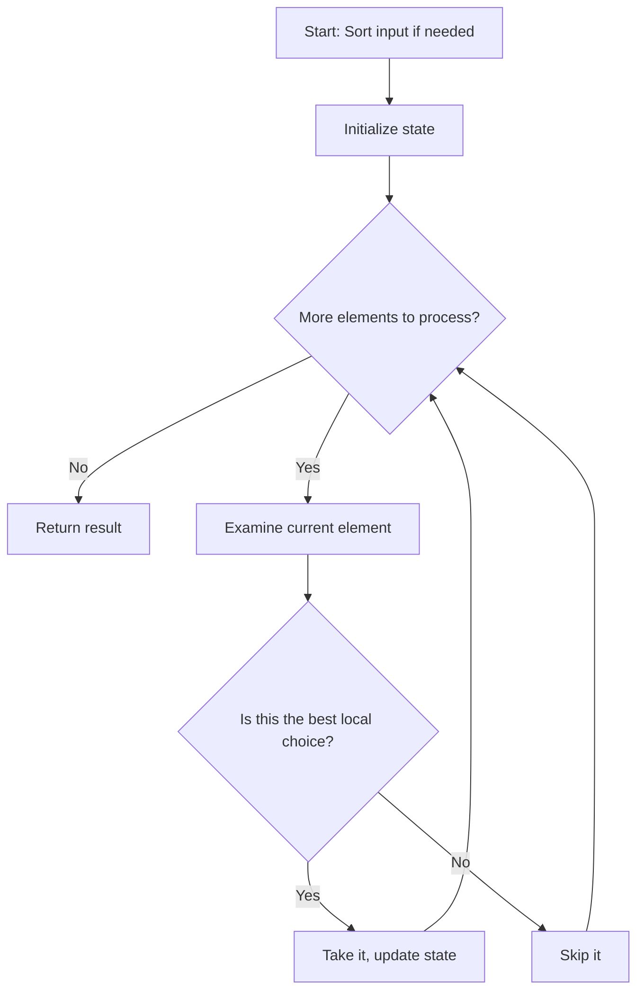

### Greedy vs DP Decision Flow
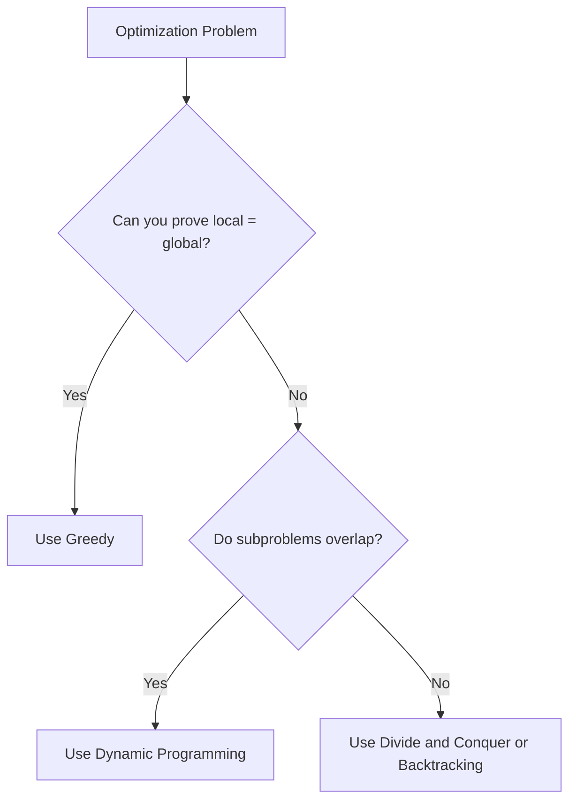

---

## 🔹 Practice Problems by Topic

### Easy

#### 1. **Assign Cookies**

**Problem Description:**
You have children with greed factors (how big a cookie they need) and cookies with sizes. Each child can get at most one cookie. A child is content if the cookie size >= their greed factor. Maximize the number of content children.

**Simple Analogy:**
Like matching kids to cookies. Give the smallest cookie that satisfies the least greedy child, then move on.

**Example Walkthrough:**

Input: `g = [1, 2, 3]`, `s = [1, 1]`
```
Expected Output: 1

Children greed: [1, 2, 3]
Cookies size: [1, 1]

Sort both (already sorted):
Child 1 (greed 1) gets cookie 1 -> content!
Child 2 (greed 2) tries cookie 1 -> too small, no more cookies
Child 3 (greed 3) -> no cookies left

Content children = 1
```

Input: `g = [1, 2]`, `s = [1, 2, 3]`
```
Expected Output: 2

Children greed: [1, 2]
Cookies size: [1, 2, 3]

Child 1 (greed 1) gets cookie 1 -> content!
Child 2 (greed 2) gets cookie 2 -> content!
Cookie 3 unused

Content children = 2
```

Input: `g = [10, 9, 8, 7]`, `s = [5, 6, 7, 8]`
```
Expected Output: 2

Sorted: g = [7, 8, 9, 10], s = [5, 6, 7, 8]

Child 7 gets cookie 7 -> content
Child 8 gets cookie 8 -> content
Child 9 -> no cookie >= 9
Child 10 -> no cookie

Content children = 2
```

**Key Insight - Match Smallest to Smallest:**
Sort both arrays. Use two pointers. If current cookie can satisfy current child, assign it and move both pointers. Otherwise, the cookie is too small — try the next cookie (move cookie pointer only).

**Why It Works:**
- The least greedy child should get the smallest cookie that satisfies them
- This leaves larger cookies for greedier children
- If we gave a large cookie to a small-greed child, we might waste it
- Greedy choice: always satisfy the easiest child with the smallest possible cookie

**Visualization - Assign Cookies:**
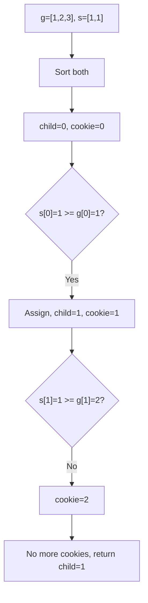

```java
public int findContentChildren(int[] g, int[] s) {
    Arrays.sort(g);
    Arrays.sort(s);
    int childIdx = 0, cookieIdx = 0;
    while (childIdx < g.length && cookieIdx < s.length) {
        if (s[cookieIdx] >= g[childIdx]) {
            childIdx++;
        }
        cookieIdx++;
    }
    return childIdx;
}
```

**Edge Cases:**
- No children: returns 0
- No cookies: returns 0
- All cookies too small: returns 0
- All cookies satisfy all children: returns number of children

**Time Complexity**: O(n log n + m log m) - sorting dominates
**Space Complexity**: O(1) - only pointers

**Similar Pattern Problems:**
- Two Sum Closest
- Best Time to Buy and Sell Stock

---

#### 2. **Jump Game**

**Problem Description:**
You're given an array where nums[i] is the maximum jump length from position i. Starting at index 0, can you reach the last index?

**Simple Analogy:**
Like hopping on stepping stones. Each stone tells you how far you can jump. Can you make it to the other side?

**Example Walkthrough:**

Input: `nums = [2, 3, 1, 1, 4]`
```
Expected Output: true

Start at index 0 (value 2): can jump to index 1 or 2
Jump to index 1 (value 3): can jump to index 2, 3, or 4
Jump to index 4: DONE!

maxReach tracking:
i=0: maxReach = max(0, 0+2) = 2
i=1: maxReach = max(2, 1+3) = 4 (can reach end!)
Return true
```

Input: `nums = [3, 2, 1, 0, 4]`
```
Expected Output: false

i=0: maxReach = 3
i=1: maxReach = max(3, 1+2) = 3
i=2: maxReach = max(3, 2+1) = 3
i=3: maxReach = max(3, 3+0) = 3
i=4: i=4 > maxReach=3 -> STUCK! Return false
```

Input: `nums = [0]`
```
Expected Output: true (already at last index)
```

**Key Insight - Track Maximum Reach:**
As you scan through the array, keep track of the farthest index you can reach. At each position, update maxReach = max(maxReach, i + nums[i]). If your current index exceeds maxReach, you're stuck.

**Why It Works:**
- If you can reach index i, you can reach any index up to maxReach
- The greedy choice: always extend your reach as far as possible
- If you ever find yourself at a position beyond your reach, it's impossible
- If maxReach reaches the last index, return true

**Visualization - Jump Game:**
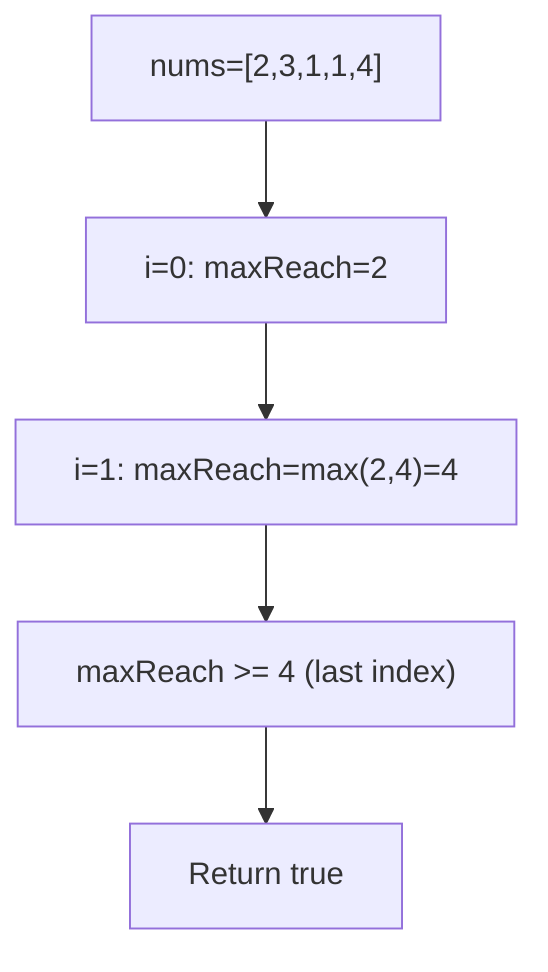

```java
public boolean canJump(int[] nums) {
    int maxReach = 0;
    for (int i = 0; i < nums.length; i++) {
        if (i > maxReach) return false;
        maxReach = Math.max(maxReach, i + nums[i]);
        if (maxReach >= nums.length - 1) return true;
    }
    return false;
}
```

**Edge Cases:**
- Single element: always true (already at end)
- First element 0 with more elements: false
- All zeros except last: depends
- Large jumps: works correctly

**Time Complexity**: O(n)
**Space Complexity**: O(1)

**Similar Pattern Problems:**
- Jump Game II (minimum jumps)
- Jump Game III (can reach zero)
- Jump Game VII (with constraints)

---

#### 3. **Gas Station**

**Problem Description:**
There are n gas stations in a circle. gas[i] is fuel at station i, cost[i] is fuel needed to travel from station i to i+1. Find the starting station index to complete the circle, or -1 if impossible.

**Simple Analogy:**
Like planning a road trip around a circular route. You need to find where to start so you never run out of gas.

**Example Walkthrough:**

Input: `gas = [1, 2, 3, 4, 5]`, `cost = [3, 4, 5, 1, 2]`
```
Expected Output: 3

Net gas at each station: [-2, -2, -2, 3, 3]

Start at 0: total = -2, current = -2 < 0 -> reset start=1
Start at 1: total = -4, current = -2 < 0 -> reset start=2
Start at 2: total = -6, current = -2 < 0 -> reset start=3
Start at 3: total = -3, current = 3 >= 0
Start at 4: total = 0, current = 6 >= 0
total >= 0 -> return start=3
```

Input: `gas = [2, 3, 4]`, `cost = [3, 4, 3]`
```
Expected Output: -1

Net: [-1, -1, 1]
Total = -1 < 0 -> impossible
Return -1
```

Input: `gas = [5, 1, 2, 3, 4]`, `cost = [4, 4, 1, 5, 1]`
```
Expected Output: 4

Net: [1, -3, 1, -2, 3]
Total = 0 >= 0

Start at 0: current=1
i=1: current=1-3=-2 < 0 -> reset start=2
i=2: current=1
i=3: current=1-2=-1 < 0 -> reset start=4
i=4: current=3
total=0 >= 0 -> return start=4
```

**Key Insight - Total and Current:**
- **Total**: sum of (gas[i] - cost[i]) over all stations. If total < 0, impossible.
- **Current**: running sum from the current starting candidate. If current < 0, no station from start to i can be the answer, so reset start to i+1.

**Why It Works:**
- If total gas >= total cost, a solution exists (and is unique)
- If current becomes negative at station i, starting anywhere between start and i will also fail
- This is because the deficit accumulates; starting later only makes it worse
- So we can greedily skip to i+1 as the new candidate start

**Visualization - Gas Station:**
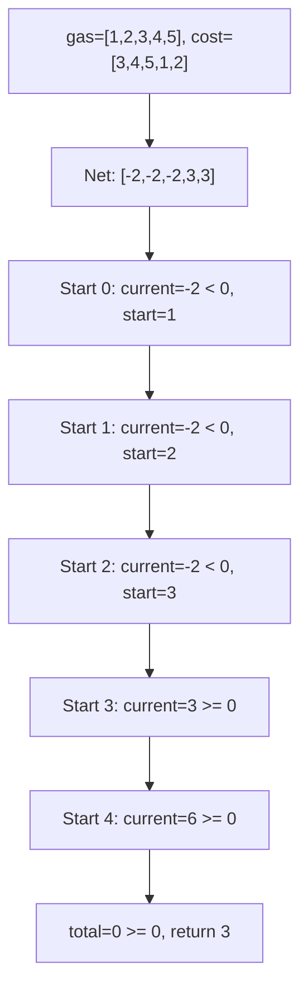

```java
public int canCompleteCircuit(int[] gas, int[] cost) {
    int total = 0, current = 0, start = 0;
    for (int i = 0; i < gas.length; i++) {
        total += gas[i] - cost[i];
        current += gas[i] - cost[i];
        if (current < 0) {
            current = 0;
            start = i + 1;
        }
    }
    return total >= 0 ? start : -1;
}
```

**Edge Cases:**
- Total gas < total cost: returns -1
- Single station with enough gas: returns 0
- Exactly enough gas: returns some valid start
- All stations have surplus: returns 0

**Time Complexity**: O(n)
**Space Complexity**: O(1)

**Similar Pattern Problems:**
- Gas Station II
- Circular Rotation

---

#### 4. **Best Time to Buy and Sell Stock**

**Problem Description:**
Given an array of stock prices, find the maximum profit from buying one day and selling on a later day. If no profit possible, return 0.

**Simple Analogy:**
Like buying and selling a stock. You want to buy low and sell high, but you must buy before you sell.

**Example Walkthrough:**

Input: `prices = [7, 1, 5, 3, 6, 4]`
```
Expected Output: 5 (buy at 1, sell at 6)

minPrice tracking:
i=0: minPrice=7, maxProfit=0
i=1: maxProfit=max(0, 1-7)=0, minPrice=1
i=2: maxProfit=max(0, 5-1)=4, minPrice=1
i=3: maxProfit=max(4, 3-1)=4, minPrice=1
i=4: maxProfit=max(4, 6-1)=5, minPrice=1
i=5: maxProfit=max(5, 4-1)=5, minPrice=1

Return 5
```

Input: `prices = [7, 6, 4, 3, 1]`
```
Expected Output: 0 (prices only decrease)

minPrice: 7, 6, 4, 3, 1
maxProfit: 0, 0, 0, 0, 0
Return 0
```

Input: `prices = [1, 2]`
```
Expected Output: 1

i=0: minPrice=1, maxProfit=0
i=1: maxProfit=max(0, 2-1)=1, minPrice=1
Return 1
```

**Key Insight - Track Minimum So Far:**
As you iterate, keep track of the minimum price seen so far (best buying opportunity). At each day, calculate profit if you sold today (current price - minPrice). Track the maximum profit.

**Why It Works:**
- The optimal buying day must come before the optimal selling day
- By tracking minimum price as you go, you always know the best buying opportunity up to current day
- For each selling day, compute the best possible profit
- Taking the maximum over all selling days gives the answer
- This is greedy because we only need to remember the best buy so far

**Visualization - Stock Profit:**
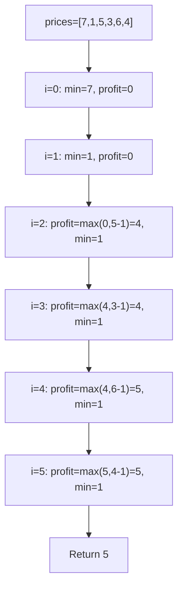

```java
public int maxProfit(int[] prices) {
    int minPrice = prices[0];
    int maxProfit = 0;
    for (int i = 1; i < prices.length; i++) {
        maxProfit = Math.max(maxProfit, prices[i] - minPrice);
        minPrice = Math.min(minPrice, prices[i]);
    }
    return maxProfit;
}
```

**Edge Cases:**
- Single day: no transaction possible, returns 0
- Decreasing prices: returns 0
- Increasing prices: returns last - first
- Same prices: returns 0

**Time Complexity**: O(n)
**Space Complexity**: O(1)

**Similar Pattern Problems:**
- Best Time to Buy and Sell Stock II (multiple transactions)
- Best Time to Buy and Sell Stock III (at most 2 transactions)
- Best Time to Buy and Sell Stock with Cooldown

---

### Medium

#### 5. **Partition Labels**

**Problem Description:**
Given a string s, partition it into as many parts as possible such that each letter appears in at most one part. Return the sizes of these parts.

**Simple Analogy:**
Like cutting a string into pieces where no letter is split across pieces. Each piece is "self-contained."

**Example Walkthrough:**

Input: `s = "ababcbacadefegdehijhklij"`
```
Expected Output: [9, 7, 8]

First, find last occurrence of each character:
a: 8, b: 5, c: 7, d: 14, e: 15, f: 11, g: 13, h: 19, i: 22, j: 23, k: 20, l: 21

Start at index 0 ('a'), last occurrence is 8, so end = 8
Scanning: i=0 to 8, update end if any char's last occurrence is beyond 8
At i=8, end=8, so first partition is [0..8] = 9 characters

Next partition starts at 9 ('d'), last occurrence is 14, end=14
At i=14, end=14, second partition is [9..14] = 6? Wait...
Let me recount: index 9 to 14 is 6 characters, but expected is 7.

Hmm, let me check: d:14, e:15, f:11, g:13
At i=9 ('d'), end=14
i=10 ('e'), end=max(14,15)=15
i=11 ('f'), end=max(15,11)=15
i=12 ('e'), end=15
i=13 ('g'), end=max(15,13)=15
i=14 ('d'), end=15
i=15 ('e'), end=15, i==end -> partition [9..15] = 7 characters

Then [16..22] = 8 characters? Let me verify.
Expected output is [9, 7, 8], total = 24, correct!
```

Input: `s = "eccbbbbdec"`
```
Expected Output: [10]

Last occurrences:
e: 8, c: 9, b: 5, d: 7
Start at 0 ('e'), end=8
i=0: end=max(8,8)=8
i=1 ('c'): end=max(8,9)=9
i=2 ('c'): end=9
i=3 ('b'): end=9
i=4 ('b'): end=9
i=5 ('b'): end=9
i=6 ('b'): end=9
i=7 ('d'): end=9
i=8 ('e'): end=9
i=9 ('c'): end=9, i==end -> partition of size 10

Return [10]
```

**Key Insight - Last Occurrence Tracking:**
Precompute the last occurrence index of each character. Then scan from left to right. For each partition, the end is the maximum last occurrence of all characters seen so far. When the current index equals this end, we've found a valid partition.

**Why It Works:**
- A partition is valid if it contains all occurrences of every character it includes
- The end of a partition must be at least the maximum last occurrence of all its characters
- As we scan, we extend the end to cover new characters
- When current index equals end, no character extends beyond, so partition is complete
- This greedy approach gives the maximum number of partitions

**Visualization - Partition Labels:**
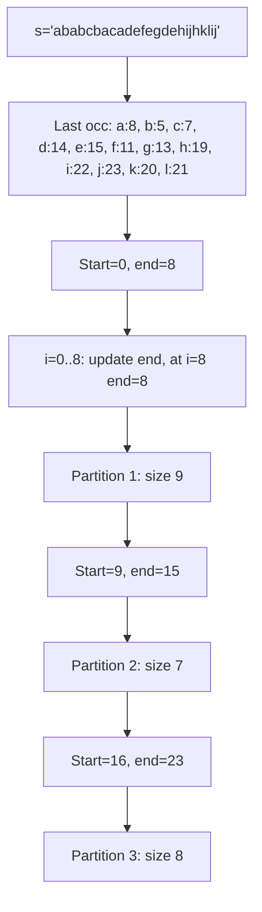

```java
public List<Integer> partitionLabels(String s) {
    int[] lastOccurrence = new int[26];
    for (int i = 0; i < s.length(); i++) {
        lastOccurrence[s.charAt(i) - 'a'] = i;
    }
    List<Integer> result = new ArrayList<>();
    int start = 0, end = 0;
    for (int i = 0; i < s.length(); i++) {
        end = Math.max(end, lastOccurrence[s.charAt(i) - 'a']);
        if (i == end) {
            result.add(end - start + 1);
            start = end + 1;
        }
    }
    return result;
}
```

**Edge Cases:**
- Empty string: returns []
- Single character: returns [1]
- All same characters: returns [length]
- All distinct characters: returns [1, 1, 1, ...]

**Time Complexity**: O(n)
**Space Complexity**: O(1) - fixed 26 characters

**Similar Pattern Problems:**
- Merge Intervals
- Video Stitching

---

#### 6. **Jump Game II**

**Problem Description:**
Given an array where nums[i] is the maximum jump length from position i, find the minimum number of jumps to reach the last index.

**Simple Analogy:**
Like the first Jump Game, but now you want the FEWEST jumps, not just any path.

**Example Walkthrough:**

Input: `nums = [2, 3, 1, 1, 4]`
```
Expected Output: 2

Jump 1: from index 0 to index 1 (or 2)
Jump 2: from index 1 to index 4 (last index)

jumps=0, farthest=0, endOfJump=0

i=0: farthest=max(0, 0+2)=2
     i==endOfJump (0==0)? YES -> jumps=1, endOfJump=2

i=1: farthest=max(2, 1+3)=4
     i==endOfJump (1==2)? NO

i=2: farthest=max(4, 2+1)=4
     i==endOfJump (2==2)? YES -> jumps=2, endOfJump=4

Loop ends (i < n-1 = 4, but we stop at i=3)
Actually loop is i < nums.length - 1, so i=0,1,2,3

i=3: farthest=max(4, 3+1)=4
     i==endOfJump (3==4)? NO

Return jumps=2
```

Input: `nums = [2, 3, 0, 1, 4]`
```
Expected Output: 2

Jump 1: 0 -> 1 (or 2)
Jump 2: 1 -> 4
Return 2
```

Input: `nums = [0]`
```
Expected Output: 0 (already at last index)
```

**Key Insight - BFS-like Level Tracking:**
Think of it like BFS levels. Each "level" is the range of indices reachable with the current number of jumps. When you reach the end of a level, you must jump again, and the new level extends to the farthest reachable index.

**Why It Works:**
- `farthest` = farthest index reachable with jumps+1 jumps
- `endOfJump` = last index reachable with current jumps
- When i reaches endOfJump, we need one more jump
- The new endOfJump becomes the farthest we could reach from the previous level
- This is greedy: always extend as far as possible before jumping

**Visualization - Jump Game II:**
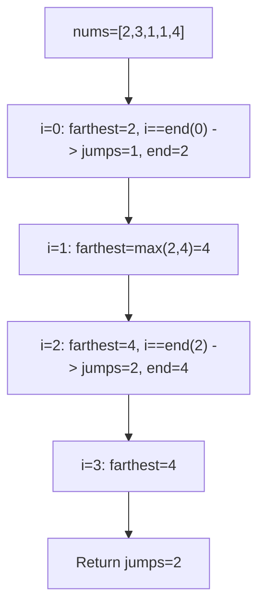

```java
public int jump(int[] nums) {
    int jumps = 0, farthest = 0, endOfJump = 0;
    for (int i = 0; i < nums.length - 1; i++) {
        farthest = Math.max(farthest, i + nums[i]);
        if (i == endOfJump) {
            jumps++;
            endOfJump = farthest;
        }
    }
    return jumps;
}
```

**Edge Cases:**
- Single element: returns 0
- Two elements with jump >= 1: returns 1
- All elements 1: returns n-1
- Large jumps: fewer jumps needed

**Time Complexity**: O(n)
**Space Complexity**: O(1)

**Similar Pattern Problems:**
- Jump Game (can reach end?)
- Jump Game with Obstacles
- Minimum Jumps

---

#### 7. **Task Scheduler**

**Problem Description:**
Given a list of tasks (characters) and a cooldown n, find the least number of intervals needed to complete all tasks. Same task must have at least n intervals between them.

**Simple Analogy:**
Like scheduling tasks on a CPU where the same task needs a cooldown period before it can run again. What's the minimum total time?

**Example Walkthrough:**

Input: `tasks = ["A","A","A","B","B","B"]`, `n = 2`
```
Expected Output: 8

Frequencies: A:3, B:3
maxFreq = 3

Formula: (maxFreq - 1) * (n + 1) + count_of_maxFreq
= (3-1) * (2+1) + 2
= 2 * 3 + 2
= 8

Schedule: A B _ A B _ A B (where _ is idle)
Intervals: 8

Let's verify: A B idle A B idle A B = 8 intervals
```

Input: `tasks = ["A","A","A","B","B","B"]`, `n = 0`
```
Expected Output: 6

No cooldown needed
Just run all tasks: A A A B B B = 6
```

Input: `tasks = ["A","A","A","A","A","A","B","C","D","E","F","G"]`, `n = 2`
```
Expected Output: 16

Frequencies: A:6, others:1
maxFreq = 6
Count of maxFreq = 1

Formula: (6-1) * (2+1) + 1 = 15 + 1 = 16

But wait, total tasks = 12, and formula gives 16 > 12, so answer is 16.

Schedule: A _ _ A _ _ A _ _ A _ _ A _ _ A
Plus B,C,D,E,F,G fill some gaps
Still 16 intervals minimum.
```

**Key Insight - Frequency-Based Formula:**
The most frequent task determines the structure. If maxFreq = f, we need (f-1) blocks of (n+1) intervals, plus one final interval for the last occurrence. If multiple tasks have maxFreq, add them to the last block.

**Why It Works:**
- The most frequent task creates "gaps" that must be filled
- Each gap between same tasks needs n other tasks or idle
- Total = (maxFreq - 1) * (n + 1) + (number of tasks with maxFreq)
- If total tasks > this formula, no idle needed (return tasks.length)
- This is the minimum because the most frequent task dictates the structure

**Visualization - Task Scheduler:**
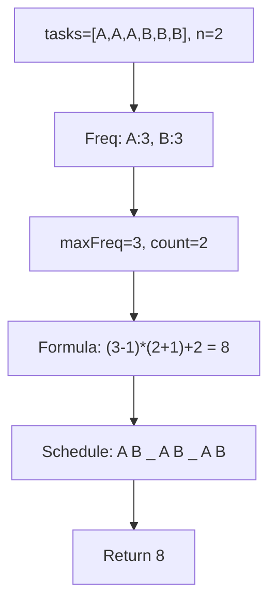

```java
public int leastInterval(char[] tasks, int n) {
    int[] freq = new int[26];
    for (char c : tasks) {
        freq[c - 'A']++;
    }
    Arrays.sort(freq);
    int maxFreq = freq[25];
    int intervals = (maxFreq - 1) * (n + 1);
    for (int i = 25; i >= 0 && freq[i] == maxFreq; i--) {
        intervals++;
    }
    return Math.max(intervals, tasks.length);
}
```

**Edge Cases:**
- Single task: returns 1
- All same tasks: formula applies
- n = 0: returns tasks.length
- Many different tasks: no idle needed

**Time Complexity**: O(n) - n = number of tasks
**Space Complexity**: O(1) - fixed 26 characters

**Similar Pattern Problems:**
- Scheduler
- Cooldown Scheduling
- Rearrange String k Distance Apart

---

#### 8. **Queue Reconstruction by Height**

**Problem Description:**
Given people with heights and k values (number of people in front with height >= current), reconstruct the queue.

**Simple Analogy:**
Like arranging people in a line based on "how many taller people are in front of me."

**Example Walkthrough:**

Input: `people = [[7,0],[4,4],[7,1],[5,0],[6,1],[5,2]]`
```
Expected Output: [[5,0],[7,0],[5,2],[6,1],[4,4],[7,1]]

Step 1: Sort by height descending, then k ascending
[[7,0],[7,1],[6,1],[5,0],[5,2],[4,4]]

Step 2: Insert each person at index k
Insert [7,0] at 0: [[7,0]]
Insert [7,1] at 1: [[7,0],[7,1]]
Insert [6,1] at 1: [[7,0],[6,1],[7,1]]
Insert [5,0] at 0: [[5,0],[7,0],[6,1],[7,1]]
Insert [5,2] at 2: [[5,0],[7,0],[5,2],[6,1],[7,1]]
Insert [4,4] at 4: [[5,0],[7,0],[5,2],[6,1],[4,4],[7,1]]

Result: [[5,0],[7,0],[5,2],[6,1],[4,4],[7,1]]
```

Input: `people = [[6,0],[5,0],[4,0],[3,2],[2,2],[1,4]]`
```
Expected Output: [[4,0],[5,0],[2,2],[3,2],[1,4],[6,0]]

Sorted: [[6,0],[5,0],[4,0],[3,2],[2,2],[1,4]]
Insert:
[6,0] at 0: [[6,0]]
[5,0] at 0: [[5,0],[6,0]]
[4,0] at 0: [[4,0],[5,0],[6,0]]
[3,2] at 2: [[4,0],[5,0],[3,2],[6,0]]
[2,2] at 2: [[4,0],[5,0],[2,2],[3,2],[6,0]]
[1,4] at 4: [[4,0],[5,0],[2,2],[3,2],[1,4],[6,0]]
```

**Key Insight - Process Tallest First:**
Sort by height descending, then k ascending. Insert each person at position k in the result list. Since taller people are already placed, the k value correctly represents how many taller people should be in front.

**Why It Works:**
- Tallest people are placed first; they don't care about shorter people
- When inserting a shorter person, all currently placed people are taller or equal
- So inserting at index k guarantees exactly k taller people in front
- This is greedy: process in order of decreasing height

**Visualization - Queue Reconstruction:**
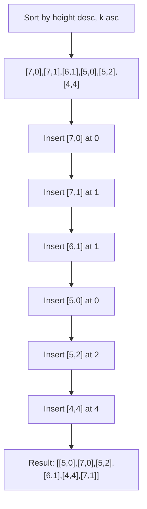

```java
public int[][] reconstructQueue(int[][] people) {
    Arrays.sort(people, (a, b) -> a[0] == b[0] ? a[1] - b[1] : b[0] - a[0]);
    List<int[]> result = new LinkedList<>();
    for (int[] person : people) {
        result.add(person[1], person);
    }
    return result.toArray(new int[result.size()][]);
}
```

**Edge Cases:**
- Single person: returns as-is
- All same height: sort by k, insert in order
- All different heights: works correctly
- k = 0 for all: tallest first

**Time Complexity**: O(n^2) - LinkedList insertion
**Space Complexity**: O(n)

**Similar Pattern Problems:**
- Height Sorting
- Queue Ordering

---

#### 9. **Candy**

**Problem Description:**
There are n children in a line with ratings. Each child must get at least 1 candy. Children with higher ratings than their neighbors must get more candies. Find minimum total candies.

**Simple Analogy:**
Like distributing candies to kids based on their "deservingness" ratings. Better-rated kids should get more than worse-rated neighbors.

**Example Walkthrough:**

Input: `ratings = [1, 0, 2]`
```
Expected Output: 5

Step 1: Give everyone 1 candy: [1, 1, 1]

Step 2: Left to right:
i=1: rating 0 < 1, no change
i=2: rating 2 > 0, candies[2] = candies[1] + 1 = 2
candies = [1, 1, 2]

Step 3: Right to left:
i=1: rating 0 < 2, no change
i=0: rating 1 > 0, candies[0] = max(1, candies[1]+1) = max(1, 2) = 2
candies = [2, 1, 2]

Total = 2 + 1 + 2 = 5
```

Input: `ratings = [1, 2, 2]`
```
Expected Output: 4

Step 1: [1, 1, 1]

Step 2: Left to right:
i=1: 2 > 1, candies[1] = 2
i=2: 2 == 2, no change
candies = [1, 2, 1]

Step 3: Right to left:
i=1: 2 == 2, no change
i=0: 1 < 2, no change
candies = [1, 2, 1]

Total = 4
```

Input: `ratings = [1, 3, 2, 2, 1]`
```
Expected Output: 7

Step 1: [1, 1, 1, 1, 1]

Step 2: Left to right:
i=1: 3 > 1, candies[1] = 2
i=2: 2 < 3, no change
i=3: 2 == 2, no change
i=4: 1 < 2, no change
candies = [1, 2, 1, 1, 1]

Step 3: Right to left:
i=3: 2 > 1, candies[3] = max(1, candies[4]+1) = 2
i=2: 2 == 2, no change
i=1: 3 > 2, candies[1] = max(2, candies[2]+1) = max(2, 2) = 2
i=0: 1 < 3, no change
candies = [1, 2, 2, 2, 1]

Wait, that doesn't seem right. Let me redo:
After step 2: [1, 2, 1, 1, 1]
Step 3 (right to left):
i=3: rating 2 > rating 1, candies[3] = max(1, candies[4]+1) = max(1, 2) = 2
     candies = [1, 2, 1, 2, 1]
i=2: rating 2 == rating 2, no change
i=1: rating 3 > rating 2, candies[1] = max(2, candies[2]+1) = max(2, 2) = 2
     candies = [1, 2, 1, 2, 1]
i=0: rating 1 < rating 3, no change

Total = 1 + 2 + 1 + 2 + 1 = 7
Correct!
```

**Key Insight - Two Passes:**
- First pass (left to right): ensure increasing ratings get more candies
- Second pass (right to left): ensure decreasing ratings get more candies
- Take max of both passes at each position
- This handles all neighbor relationships

**Why It Works:**
- Each child must satisfy constraints with both left and right neighbors
- Left-to-right pass handles left neighbor constraints
- Right-to-left pass handles right neighbor constraints
- Taking max ensures both constraints are satisfied
- Minimum total because we start with 1 and only increase when necessary

**Visualization - Candy Distribution:**
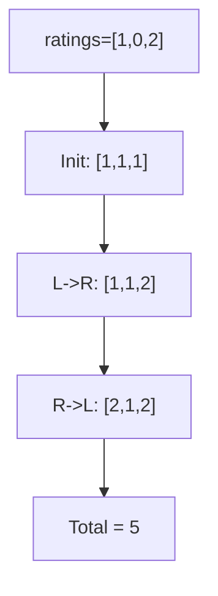

```java
public int candy(int[] ratings) {
    int n = ratings.length;
    int[] candies = new int[n];
    Arrays.fill(candies, 1);
    for (int i = 1; i < n; i++) {
        if (ratings[i] > ratings[i - 1]) {
            candies[i] = candies[i - 1] + 1;
        }
    }
    for (int i = n - 2; i >= 0; i--) {
        if (ratings[i] > ratings[i + 1]) {
            candies[i] = Math.max(candies[i], candies[i + 1] + 1);
        }
    }
    int total = 0;
    for (int candy : candies) total += candy;
    return total;
}
```

**Edge Cases:**
- Single child: returns 1
- All same ratings: returns n
- Strictly increasing: returns n(n+1)/2
- Strictly decreasing: returns n(n+1)/2

**Time Complexity**: O(n)
**Space Complexity**: O(n)

**Similar Pattern Problems:**
- Candy Distribution Variants
- Trapping Rain Water (similar two-pass idea)

---

### Hard

#### 10. **Merge Triplets to Form Target Triplet**

**Problem Description:**
Given triplets and a target triplet, determine if you can choose some triplets and merge them (taking element-wise max) to form the target.

**Simple Analogy:**
Like combining ingredients. You can mix different combinations, taking the maximum of each component, to get exactly the target.

**Example Walkthrough:**

Input: `triplets = [[2,5,3],[1,8,4],[1,7,5]]`, `target = [2,7,5]`
```
Expected Output: true

Consider [2,5,3]: all <= target? 2<=2, 5<=7, 3<=5 -> YES
current = max([0,0,0], [2,5,3]) = [2,5,3]

Consider [1,8,4]: 8 > 7 -> exceeds target, skip

Consider [1,7,5]: all <= target? 1<=2, 7<=7, 5<=5 -> YES
current = max([2,5,3], [1,7,5]) = [2,7,5]

current == target -> true
```

Input: `triplets = [[3,4,5],[4,5,6]]`, `target = [3,2,5]`
```
Expected Output: false

[3,4,5]: 4 > 2 -> exceeds, skip
[4,5,6]: 4 > 3 -> exceeds, skip

current = [0,0,0] != target
Return false
```

Input: `triplets = [[2,5,3],[2,3,4],[1,2,5],[5,2,3]]`, `target = [5,5,5]`
```
Expected Output: true

[2,5,3]: all <= 5 -> current = [2,5,3]
[2,3,4]: all <= 5 -> current = [2,5,4]
[1,2,5]: all <= 5 -> current = [2,5,5]
[5,2,3]: all <= 5 -> current = [5,5,5]

current == target -> true
```

**Key Insight - Only Consider Valid Triplets:**
A triplet is useful only if all its elements are <= corresponding target elements. Among useful triplets, take element-wise max. If the result equals target, return true.

**Why It Works:**
- If any element exceeds target, that triplet can't be used (would make result too large)
- Taking max of all valid triplets gives the best possible result
- If this max equals target, we can form target
- If not, no combination can form target (since we've taken the maximum possible)

**Visualization - Merge Triplets:**
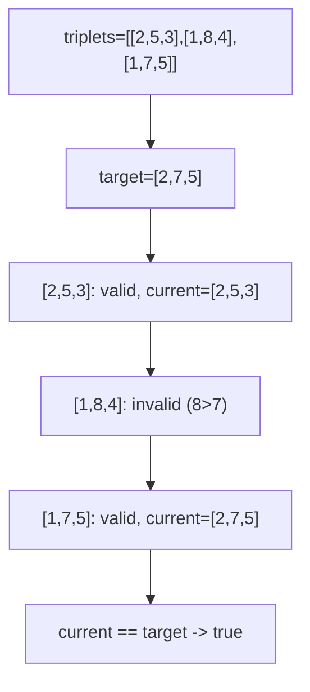

```java
public boolean mergeTriplets(int[][] triplets, int[] target) {
    int[] current = {0, 0, 0};
    for (int[] triplet : triplets) {
        if (triplet[0] <= target[0] && triplet[1] <= target[1] && triplet[2] <= target[2]) {
            current[0] = Math.max(current[0], triplet[0]);
            current[1] = Math.max(current[1], triplet[1]);
            current[2] = Math.max(current[2], triplet[2]);
        }
    }
    return Arrays.equals(current, target);
}
```

**Edge Cases:**
- Single triplet equals target: returns true
- No valid triplets: returns false
- Multiple valid triplets: works correctly
- Target has zeros: handled correctly

**Time Complexity**: O(n)
**Space Complexity**: O(1)

**Similar Pattern Problems:**
- Merge Pairs
- Greedy Selection

---

#### 11. **Minimum Number of Refueling Stops**

**Problem Description:**
A car starts with startFuel and needs to reach target. There are gas stations along the way. Find the minimum number of refueling stops needed, or -1 if impossible.

**Simple Analogy:**
Like planning a road trip with limited fuel. You can choose which gas stations to stop at. What's the minimum number of stops?

**Example Walkthrough:**

Input: `target = 100`, `startFuel = 10`, `stations = [[10,60],[20,30],[30,30],[60,40]]`
```
Expected Output: 2

Start with 10 fuel, can reach station at 10.
Stations within reach: [10,60] -> add 60 to heap
Heap: [60]

Need to go further. Pop 60, reach = 10 + 60 = 70, stops = 1
Now reach stations up to 70: [20,30], [30,30], [60,40]
Add all to heap: heap = [40, 30, 30, 60]? Actually max-heap: [60, 40, 30, 30]
Wait, [10,60] was already popped. New stations: 20,30,60
Heap: [40, 30, 30]

Pop 40, reach = 70 + 40 = 110 >= 100, stops = 2
Return 2
```

Input: `target = 100`, `startFuel = 50`, `stations = [[25,25],[50,50]]`
```
Expected Output: 1

Start with 50, can reach station at 25 and 50.
Stations within reach: [25,25], [50,50]
Heap: [50, 25]

Need to go further? reach=50 < 100
Pop 50, reach = 50 + 50 = 100 >= 100, stops = 1
Return 1
```

Input: `target = 100`, `startFuel = 10`, `stations = [[20,30]]`
```
Expected Output: -1

Start with 10, can't reach station at 20.
No stations within reach, heap empty -> return -1
```

**Key Insight - Greedy with Max-Heap:**
Drive as far as possible. When you can't reach further, use the best (largest fuel) station you've passed but didn't use. This is greedy because you always want the most fuel when you need it.

**Why It Works:**
- You should only refuel when necessary (to minimize stops)
- When you must refuel, choose the station with the most fuel (max-heap)
- This maximizes your reach with each stop
- If you can't reach any station and heap is empty, impossible
- This is like BFS where each "level" is a refueling stop

**Visualization - Refueling Stops:**
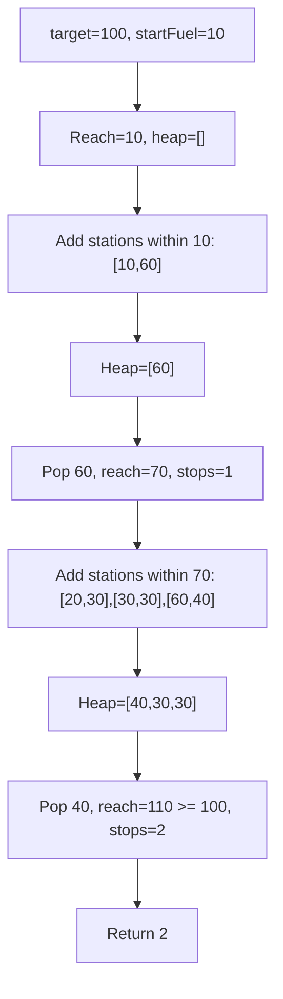

```java
public int minRefuelStops(int target, int startFuel, int[][] stations) {
    PriorityQueue<Integer> maxHeap = new PriorityQueue<>((a, b) -> b - a);
    int reach = startFuel, i = 0, stops = 0;
    while (reach < target) {
        while (i < stations.length && stations[i][0] <= reach) {
            maxHeap.offer(stations[i][1]);
            i++;
        }
        if (maxHeap.isEmpty()) return -1;
        reach += maxHeap.poll();
        stops++;
    }
    return stops;
}
```

**Edge Cases:**
- Start fuel >= target: returns 0
- No stations: returns -1 if can't reach
- Single station enough: returns 1
- Multiple stations needed: works correctly

**Time Complexity**: O(n log n) - heap operations
**Space Complexity**: O(n) - heap

**Similar Pattern Problems:**
- Refueling Stations
- Minimum Moves
- Jump Game with Fuel

---

## 📌 Key Patterns & Techniques

### 1. **Sorting for Greedy Order**
- Sort to establish optimal processing order
- Often by one criterion, break ties with another
- Examples: Assign Cookies, Queue Reconstruction

### 2. **Two Pointers**
- Sweep through array making greedy choices
- Often with sorted input
- Examples: Assign Cookies, Container with Most Water

### 3. **Priority Queue / Heap**
- Maintain best choices available
- Greedy selection from candidates
- Examples: Task Scheduler, Refueling Stops

### 4. **Simulation**
- Follow algorithm step by step
- Make optimal choice at each step
- Examples: Jump Game, Gas Station

### 5. **Two-Pass Technique**
- Process left to right, then right to left
- Combine results with max/min
- Examples: Candy, Trapping Rain Water

### 6. **Frequency-Based Formula**
- Use counts to derive answer directly
- Examples: Task Scheduler, Partition Labels

---

## 🎯 Common Pitfalls to Avoid

- Applying greedy without proving optimality (greedy can fail!)
- Not considering counter-examples before committing to greedy
- Wrong ordering/sorting criteria (always verify with examples)
- Not handling edge cases (empty, single element, all same)
- Greedily choosing locally without considering global impact
- Forgetting to sort when order matters
- Using greedy when DP is needed (check if local = global)
- Not using a heap when "best available" is needed
- Off-by-one errors in interval/partition problems
- Not considering all constraints when making greedy choice

---

## 🔹 Greedy Decision Flow

### Choosing the Right Approach

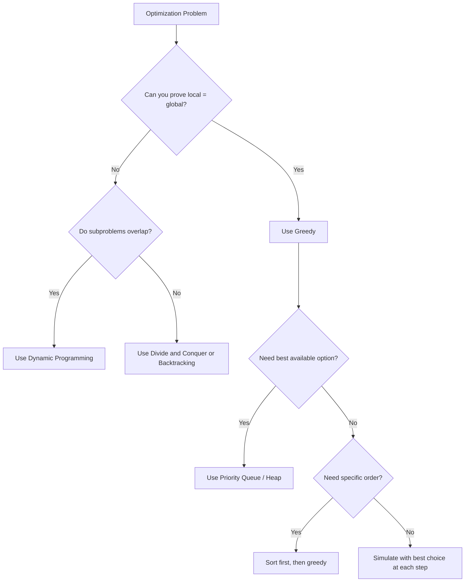

### Complexity Cheat Sheet

| Problem Type | Technique | Time | Space |
|--------------|-----------|------|-------|
| Assign Cookies | Sort + Two Pointers | O(n log n) | O(1) |
| Jump Game | Track Max Reach | O(n) | O(1) |
| Gas Station | Total + Current | O(n) | O(1) |
| Stock Profit | Track Min Price | O(n) | O(1) |
| Partition Labels | Last Occurrence | O(n) | O(1) |
| Jump Game II | BFS Levels | O(n) | O(1) |
| Task Scheduler | Frequency Formula | O(n) | O(1) |
| Queue Reconstruction | Sort + Insert | O(n^2) | O(n) |
| Candy | Two Passes | O(n) | O(n) |
| Merge Triplets | Track Max | O(n) | O(1) |
| Refueling Stops | Greedy + Heap | O(n log n) | O(n) |