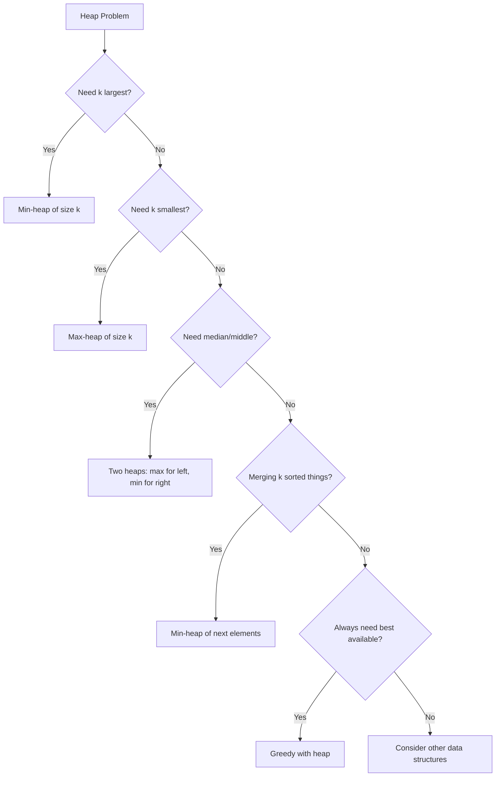
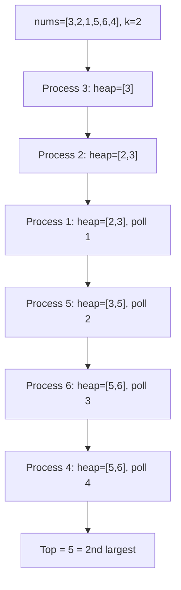
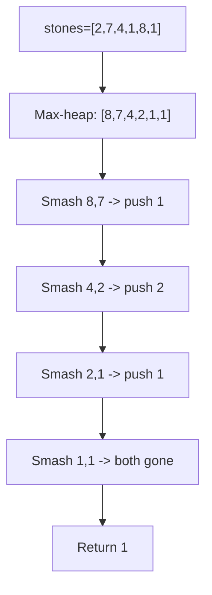
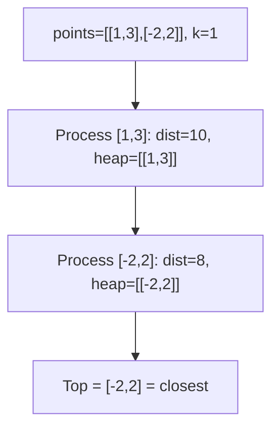
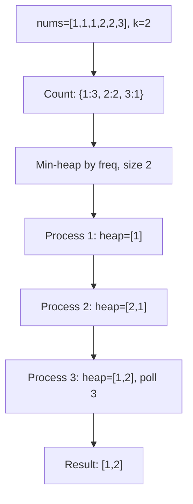
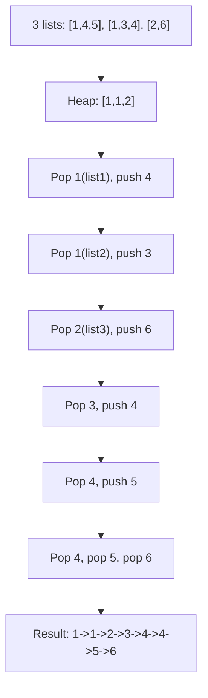
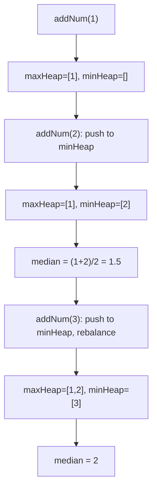
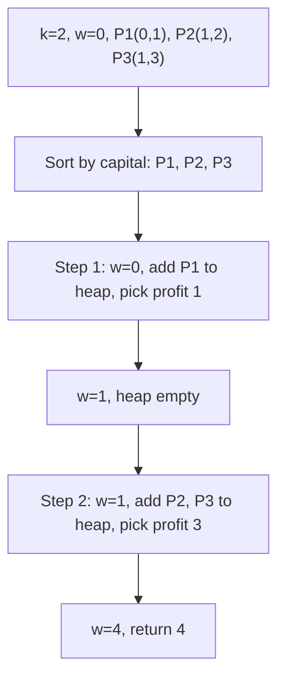

---
tags:
  - heap
  - priority-queue
  - top-k
  - two-heaps
  - neetcode-150
---

# Heap / Priority Queue

## What is a Heap? (Simple Explanation)
Imagine a hospital emergency room. Patients are not treated in the order they arrive — the most critical patient is treated first, regardless of when they arrived. That's a **priority queue**: a collection where each element has a "priority," and the highest (or lowest) priority element is always served first.

A **heap** is the most common way to implement a priority queue. It's like a special tree where:
- The smallest element is always at the top (min-heap), OR
- The largest element is always at the top (max-heap)

**Real-life analogies:**
- Hospital ER (treat most critical first)
- Task scheduler (most urgent task first)
- Merging multiple sorted playlists by "next song"
- Finding top 10 scores in a game

## Key Concepts (In Simple Terms)
- **Min Heap**: Parent is smaller than or equal to its children. Smallest element at the top. Like a pyramid where the smallest is at the peak.
- **Max Heap**: Parent is larger than or equal to its children. Largest element at the top. Like a pyramid where the largest is at the peak.
- **Priority Queue**: An abstract data type (ADT) where each element has a priority. We can always get the highest-priority element quickly.
- **Heapify**: The process of rearranging elements to restore the heap property (after insert or delete).
- **Array Representation**: Heaps are stored as arrays! No pointers needed.
  - Root at index 0
  - Left child of index i: `2*i + 1`
  - Right child of index i: `2*i + 2`
  - Parent of index i: `(i - 1) / 2`

**Important:** A heap is NOT a fully sorted array. It only guarantees that the top element is min (or max). The rest can be in any order that maintains the heap property.

## When to Use a Heap
- Find k largest/smallest elements
- Merge sorted lists/streams
- Scheduling problems (earliest deadline first)
- Huffman coding, Dijkstra's algorithm
- Load balancing, system design
- Running median of a data stream
- Top K frequent elements

## Complexity
| Operation | Time | Notes |
|-----------|------|-------|
| Build heap | O(n) | From unsorted array |
| Insert | O(log n) | Bubble up |
| Delete (extract top) | O(log n) | Bubble down |
| Peek (get top) | O(1) | Just look at root |
| Heapify | O(log n) | Restore property |
| Space | O(n) | Array storage |

## Java's PriorityQueue
```java
// Min-heap (default)
PriorityQueue<Integer> minHeap = new PriorityQueue<>();

// Max-heap (custom comparator)
PriorityQueue<Integer> maxHeap = new PriorityQueue<>((a, b) -> b - a);

// Min-heap with custom objects
PriorityQueue<int[]> pq = new PriorityQueue<>((a, b) -> a[0] - b[0]);
```

## Patterns / Techniques
- **K largest/smallest**: Use min-heap for k largest, max-heap for k smallest
- **Merge k collections**: Heap of "next element" from each collection
- **Two heaps**: Max-heap for left half, min-heap for right half (median)
- **Lazy deletion**: Mark items as deleted but keep in heap
- **Greedy with heap**: Always pick the best available option

---

## 🔹 Basic Templates

### Min-Heap Template
```java
PriorityQueue<Integer> minHeap = new PriorityQueue<>();
minHeap.offer(5);
minHeap.offer(2);
minHeap.offer(8);
int smallest = minHeap.peek();  // 2
int removed = minHeap.poll();   // 2
```

### Max-Heap Template
```java
PriorityQueue<Integer> maxHeap = new PriorityQueue<>((a, b) -> b - a);
maxHeap.offer(5);
maxHeap.offer(2);
maxHeap.offer(8);
int largest = maxHeap.peek();  // 8
```

### K Largest Elements Template
```java
public int[] kLargest(int[] nums, int k) {
    PriorityQueue<Integer> minHeap = new PriorityQueue<>();
    for (int num : nums) {
        minHeap.offer(num);
        if (minHeap.size() > k) {
            minHeap.poll();  // Remove smallest
        }
    }
    // minHeap now contains k largest
    int[] result = new int[k];
    for (int i = k - 1; i >= 0; i--) {
        result[i] = minHeap.poll();
    }
    return result;
}
```

### Heap Decision Flow


---

## 🔹 Practice Problems by Topic

### Easy

#### 1. **Kth Largest Element in Array**

**Problem Description:**
Given an integer array and an integer k, return the kth largest element in the array.

**Simple Analogy:**
Like finding the 3rd highest score in a game. You don't need to sort everything — just keep track of the top 3.

**Example Walkthrough:**

Input: `nums = [3, 2, 1, 5, 6, 4]`, `k = 2`
```
Expected Output: 5 (2nd largest is 5)

Sorted: [1, 2, 3, 4, 5, 6]
2nd largest = 5

Using min-heap of size k=2:
num=3: heap=[3]
num=2: heap=[2,3]
num=1: heap=[1,2,3] -> size>2, poll 1 -> heap=[2,3]
num=5: heap=[2,3,5] -> size>2, poll 2 -> heap=[3,5]
num=6: heap=[3,5,6] -> size>2, poll 3 -> heap=[5,6]
num=4: heap=[4,5,6] -> size>2, poll 4 -> heap=[5,6]

Heap top = 5 = 2nd largest
```

Input: `nums = [3, 2, 3, 1, 2, 4, 5, 5, 6]`, `k = 4`
```
Expected Output: 4 (4th largest)

Sorted: [1, 2, 2, 3, 3, 4, 5, 5, 6]
4th largest = 4

Min-heap of size 4:
Process all, keep top 4: [4, 5, 5, 6]
Heap top = 4 = 4th largest
```

Input: `nums = [1]`, `k = 1`
```
Expected Output: 1

Only one element, it's the 1st largest
```

**Key Insight - Min-Heap of Size K:**
To find the kth largest, keep a min-heap of the k largest elements seen so far. The top of the heap (smallest of these k) is the kth largest. If a new element is larger than the top, it belongs in the top k, so we remove the smallest and add the new one.

**Why It Works:**
- The heap always contains the k largest elements seen so far
- The smallest of these k is the kth largest
- Any element smaller than the heap top can't be in the top k
- Any element larger than the heap top should replace it
- This is greedy: always maintain the best k

**Visualization - Kth Largest:**


```java
public int findKthLargest(int[] nums, int k) {
    PriorityQueue<Integer> minHeap = new PriorityQueue<>();
    for (int num : nums) {
        minHeap.offer(num);
        if (minHeap.size() > k) {
            minHeap.poll();
        }
    }
    return minHeap.peek();
}
```

**Edge Cases:**
- k = 1: returns maximum
- k = n: returns minimum
- Duplicates: handled correctly
- Single element: returns that element

**Time Complexity**: O(n log k) - each insert/poll is O(log k)
**Space Complexity**: O(k) - heap size

**Similar Pattern Problems:**
- Kth Smallest Element (use max-heap)
- K Closest Points to Origin
- Top K Frequent Elements

---

#### 2. **Last Stone Weight**

**Problem Description:**
You have stones with weights. Repeatedly take the two heaviest stones. If they're equal, both are destroyed. If not, the lighter is destroyed and the heavier becomes their difference. Return the weight of the last stone, or 0 if none remain.

**Simple Analogy:**
Like a smash-up derby where cars of different sizes collide. Smaller car is destroyed, larger car loses size equal to smaller.

**Example Walkthrough:**

Input: `stones = [2, 7, 4, 1, 8, 1]`
```
Expected Output: 1

Max-heap: [8, 7, 4, 2, 1, 1]

Step 1: pop 8, 7 -> diff=1, push 1
        heap = [4, 2, 1, 1, 1]

Step 2: pop 4, 2 -> diff=2, push 2
        heap = [2, 1, 1, 1]

Step 3: pop 2, 1 -> diff=1, push 1
        heap = [1, 1, 1]

Step 4: pop 1, 1 -> diff=0, don't push
        heap = [1]

Return 1
```

Input: `stones = [1]`
```
Expected Output: 1

Only one stone, return its weight
```

Input: `stones = [2, 2]`
```
Expected Output: 0

pop 2, 2 -> equal, both destroyed
heap = []
Return 0
```

**Key Insight - Max-Heap for Heaviest:**
We always need the two heaviest stones. A max-heap gives us the heaviest in O(log n). After smashing, if there's a remainder, push it back.

**Why It Works:**
- Max-heap always gives the two largest in O(log n)
- Process repeats until 0 or 1 stone remains
- This simulates the process exactly
- Greedy: always take the two heaviest as the problem states

**Visualization - Last Stone Weight:**


```java
public int lastStoneWeight(int[] stones) {
    PriorityQueue<Integer> maxHeap = new PriorityQueue<>((a, b) -> b - a);
    for (int stone : stones) {
        maxHeap.offer(stone);
    }
    while (maxHeap.size() > 1) {
        int first = maxHeap.poll();
        int second = maxHeap.poll();
        if (first != second) {
            maxHeap.offer(first - second);
        }
    }
    return maxHeap.isEmpty() ? 0 : maxHeap.peek();
}
```

**Edge Cases:**
- Single stone: returns its weight
- Two equal stones: returns 0
- Two different stones: returns difference
- Many stones: works correctly

**Time Complexity**: O(n log n) - each smash is O(log n)
**Space Complexity**: O(n) - heap size

**Similar Pattern Problems:**
- Last Stone Weight II
- Relative Sort Array

---

### Medium

#### 3. **Kth Closest Points to Origin**

**Problem Description:**
Given an array of points and an integer k, return the k closest points to the origin (0, 0). Distance is Euclidean.

**Simple Analogy:**
Like finding the k nearest restaurants to your location. You don't need to sort all restaurants — just keep the k closest.

**Example Walkthrough:**

Input: `points = [[1,3],[-2,2]]`, `k = 1`
```
Expected Output: [[-2,2]]

Distances:
[1,3]: sqrt(1+9) = sqrt(10) ≈ 3.16
[-2,2]: sqrt(4+4) = sqrt(8) ≈ 2.83

Closest: [-2,2]
```

Input: `points = [[3,3],[5,-1],[-2,4]]`, `k = 2`
```
Expected Output: [[3,3],[-2,4]]

Distances:
[3,3]: 18
[5,-1]: 26
[-2,4]: 20

Two closest: [3,3] (18) and [-2,4] (20)
```

**Key Insight - Max-Heap of Size K:**
To find k closest, keep a max-heap of the k closest points seen so far. The top of the heap is the farthest among the k closest. If a new point is closer than the top, it belongs in the k closest.

**Why It Works:**
- We want the k smallest distances
- Max-heap keeps the k smallest, with the largest of these at top
- Any point farther than the top can't be in the k closest
- Any point closer than the top should replace it
- This is the mirror of Kth Largest

**Visualization - K Closest Points:**


```java
public int[][] kClosest(int[][] points, int k) {
    PriorityQueue<int[]> maxHeap = new PriorityQueue<>((a, b) ->
        (b[0] * b[0] + b[1] * b[1]) - (a[0] * a[0] + a[1] * a[1])
    );
    for (int[] point : points) {
        maxHeap.offer(point);
        if (maxHeap.size() > k) {
            maxHeap.poll();
        }
    }
    int[][] result = new int[k][2];
    int index = 0;
    while (!maxHeap.isEmpty()) {
        result[index++] = maxHeap.poll();
    }
    return result;
}
```

**Edge Cases:**
- k = 1: returns closest point
- k = n: returns all points
- Duplicate distances: any order works
- Origin itself: distance 0, always closest

**Time Complexity**: O(n log k)
**Space Complexity**: O(k)

**Similar Pattern Problems:**
- Top K Frequent Elements
- K Closest Elements
- Find K Pairs with Smallest Sums

---

#### 4. **Top K Frequent Elements**

**Problem Description:**
Given an integer array and an integer k, return the k most frequent elements in any order.

**Simple Analogy:**
Like finding the top k most popular songs in a playlist. First count how many times each song appears, then pick the top k.

**Example Walkthrough:**

Input: `nums = [1,1,1,2,2,3]`, `k = 2`
```
Expected Output: [1, 2]

Step 1: Count frequencies
freq = {1: 3, 2: 2, 3: 1}

Step 2: Min-heap of size k by frequency
num=1 (freq 3): heap=[1]
num=2 (freq 2): heap=[2,1] (sorted by freq)
num=3 (freq 1): heap=[3,1,2]? Wait...
Let me redo: heap is ordered by frequency
num=1 (freq 3): heap=[1]
num=2 (freq 2): heap=[2,1] -> but size=2=k, no poll
num=3 (freq 1): heap=[3,2,1]? Actually heap.add(3), size=3>2, poll min freq = 3
heap=[1,2]

Result: [1, 2]
```

Input: `nums = [1]`, `k = 1`
```
Expected Output: [1]

freq = {1: 1}
heap = [1]
Result = [1]
```

Input: `nums = [1,2,1,2,1,2,3,1,3,2]`, `k = 2`
```
Expected Output: [1, 2] (1 appears 4 times, 2 appears 4 times, 3 appears 2 times)

freq = {1: 4, 2: 4, 3: 2}
heap of size 2: [1, 2]
Result = [1, 2]
```

**Key Insight - Count Then Heap:**
First count frequencies using a HashMap. Then use a min-heap of size k, ordered by frequency. The heap keeps the k most frequent elements.

**Why It Works:**
- Frequency counting gives us the "priority" of each element
- Min-heap of size k keeps the k highest priorities (frequencies)
- The smallest frequency in the heap is the "threshold"
- Any element with higher frequency replaces the threshold
- This is the K Largest pattern with frequency as the key

**Visualization - Top K Frequent:**


```java
public int[] topKFrequent(int[] nums, int k) {
    Map<Integer, Integer> count = new HashMap<>();
    for (int num : nums) {
        count.put(num, count.getOrDefault(num, 0) + 1);
    }
    PriorityQueue<Integer> minHeap = new PriorityQueue<>((a, b) -> count.get(a) - count.get(b));
    for (int num : count.keySet()) {
        minHeap.offer(num);
        if (minHeap.size() > k) {
            minHeap.poll();
        }
    }
    int[] result = new int[k];
    int index = 0;
    while (!minHeap.isEmpty()) {
        result[index++] = minHeap.poll();
    }
    return result;
}
```

**Edge Cases:**
- k = 1: returns most frequent
- k = number of distinct elements: returns all
- All same frequency: any k elements
- Single element: returns that element

**Time Complexity**: O(n log k)
**Space Complexity**: O(n)

**Similar Pattern Problems:**
- Top K Frequent Words
- Rearrange String K Distance Apart
- Sort Characters by Frequency

---

#### 5. **Merge K Sorted Lists**

**Problem Description:**
Given an array of k sorted linked lists, merge them into one sorted linked list.

**Simple Analogy:**
Like merging k sorted playlists into one big sorted playlist. At each step, pick the smallest "next song" from all playlists.

**Example Walkthrough:**

Input: `lists = [[1,4,5],[1,3,4],[2,6]]`
```
Expected Output: [1,1,2,3,4,4,5,6]

Min-heap of first nodes: [1(from list1), 1(from list2), 2(from list3)]

Step 1: pop 1(list1), add to result, push next 4
        heap = [1(list2), 2(list3), 4(list1)]
Step 2: pop 1(list2), add to result, push next 3
        heap = [2(list3), 3(list2), 4(list1)]
Step 3: pop 2(list3), add to result, push next 6
        heap = [3(list2), 4(list1), 6(list3)]
Step 4: pop 3(list2), add to result, push next 4
        heap = [4(list1), 4(list2), 6(list3)]
Step 5: pop 4(list1), add to result, push next 5
        heap = [4(list2), 5(list1), 6(list3)]
Step 6: pop 4(list2), add to result, no next
        heap = [5(list1), 6(list3)]
Step 7: pop 5(list1), add to result, no next
        heap = [6(list3)]
Step 8: pop 6(list3), add to result, no next
        heap = []

Result: 1 -> 1 -> 2 -> 3 -> 4 -> 4 -> 5 -> 6
```

Input: `lists = []`
```
Expected Output: [] (empty)
```

Input: `lists = [[]]`
```
Expected Output: [] (single empty list)
```

**Key Insight - Heap of "Next" Nodes:**
Put the head of each list in a min-heap. Pop the smallest, add it to the result, and push its next node. Repeat until heap is empty.

**Why It Works:**
- The smallest unprocessed node must be the head of some list
- Min-heap gives us the smallest head in O(log k)
- After popping, the next node from that list becomes a candidate
- This is like merging 2 lists, but with k lists using a heap
- Total nodes processed = n, each O(log k)

**Visualization - Merge K Lists:**


```java
public ListNode mergeKLists(ListNode[] lists) {
    PriorityQueue<ListNode> minHeap = new PriorityQueue<>((a, b) -> a.val - b.val);
    for (ListNode list : lists) {
        if (list != null) {
            minHeap.offer(list);
        }
    }
    ListNode dummy = new ListNode(0);
    ListNode current = dummy;
    while (!minHeap.isEmpty()) {
        ListNode smallest = minHeap.poll();
        current.next = smallest;
        current = current.next;
        if (smallest.next != null) {
            minHeap.offer(smallest.next);
        }
    }
    return dummy.next;
}
```

**Edge Cases:**
- Empty array of lists: returns null
- All lists empty: returns null
- One list: returns it as-is
- Different lengths: works correctly

**Time Complexity**: O(n log k) where n = total nodes
**Space Complexity**: O(k) for heap

**Similar Pattern Problems:**
- Merge Sorted Array
- Merge K Sorted Arrays
- Smallest Range Covering K Lists

---

#### 6. **Find Median from Data Stream**

**Problem Description:**
Design a data structure that supports adding numbers and finding the median of all numbers added so far.

**Simple Analogy:**
Like a running median tracker. As numbers come in, you need to quickly answer "what's the middle value?"

**Example Walkthrough:**

Input:
```
addNum(1)
addNum(2)
findMedian() -> 1.5
addNum(3)
findMedian() -> 2
```

```
Step 1: addNum(1)
        maxHeap=[1], minHeap=[]
        median = 1

Step 2: addNum(2)
        2 > maxHeap.top(1), so push to minHeap
        maxHeap=[1], minHeap=[2]
        Sizes equal, median = (1+2)/2 = 1.5

Step 3: addNum(3)
        3 > maxHeap.top(1), push to minHeap
        minHeap=[2,3]
        minHeap.size(2) > maxHeap.size(1), move 2 to maxHeap
        maxHeap=[1,2], minHeap=[3]
        maxHeap.size(2) > minHeap.size(1), median = 2
```

Input:
```
addNum(5)
findMedian() -> 5
addNum(3)
findMedian() -> 4
addNum(8)
findMedian() -> 5
```

```
Step 1: addNum(5) -> maxHeap=[5], median=5
Step 2: addNum(3) -> 3<=5, maxHeap=[3,5], sizes: max=2, min=0
        Rebalance: move 5 to minHeap -> maxHeap=[3], minHeap=[5]
        median = (3+5)/2 = 4
Step 3: addNum(8) -> 8>3, minHeap=[5,8], sizes: max=1, min=2
        Rebalance: move 5 to maxHeap -> maxHeap=[3,5], minHeap=[8]
        median = 5
```

**Key Insight - Two Heaps:**
Maintain two heaps:
- **Max-heap (left)**: contains the smaller half of numbers
- **Min-heap (right)**: contains the larger half of numbers

Keep sizes balanced (differ by at most 1). The median is either the top of max-heap (odd count) or average of both tops (even count).

**Why It Works:**
- All elements in max-heap are <= all elements in min-heap
- Max-heap's top is the largest of the smaller half
- Min-heap's top is the smallest of the larger half
- If sizes are balanced, median is between these two
- If max-heap has one extra, its top is the median
- This gives O(log n) add and O(1) find

**Visualization - Median Finder:**


```java
class MedianFinder {
    private PriorityQueue<Integer> maxHeap;
    private PriorityQueue<Integer> minHeap;
    public MedianFinder() {
        maxHeap = new PriorityQueue<>((a, b) -> b - a);
        minHeap = new PriorityQueue<>();
    }
    public void addNum(int num) {
        if (maxHeap.isEmpty() || num <= maxHeap.peek()) {
            maxHeap.offer(num);
        } else {
            minHeap.offer(num);
        }
        if (maxHeap.size() > minHeap.size() + 1) {
            minHeap.offer(maxHeap.poll());
        }
        if (minHeap.size() > maxHeap.size()) {
            maxHeap.offer(minHeap.poll());
        }
    }
    public double findMedian() {
        if (maxHeap.size() > minHeap.size()) {
            return maxHeap.peek();
        }
        return (maxHeap.peek() + minHeap.peek()) / 2.0;
    }
}
```

**Edge Cases:**
- No numbers: invalid call
- Single number: returns it
- Two numbers: returns average
- All same numbers: works correctly

**Time Complexity**: O(log n) for addNum, O(1) for findMedian
**Space Complexity**: O(n)

**Similar Pattern Problems:**
- Find Median of BST
- Find Mode in BST
- Sliding Window Median

---

### Hard

#### 7. **IPO (Maximum Capital)**

**Problem Description:**
You have k projects to choose from. Each project has a capital requirement and a profit. You start with capital w. You can work on at most k projects (one at a time). After completing a project, its profit adds to your capital. Maximize your final capital.

**Simple Analogy:**
Like investing: you have some money, you can invest in projects you can afford, and each project gives you profit that you can reinvest.

**Example Walkthrough:**

Input: `k = 2`, `w = 0`, `profits = [1,2,3]`, `capital = [0,1,1]`
```
Expected Output: 4

Projects: (capital, profit)
P1: (0, 1)
P2: (1, 2)
P3: (1, 3)

Step 1: Capital=0, can afford P1 (capital 0)
        Choose P1 (profit 1), w = 0+1 = 1
Step 2: Capital=1, can afford P2 (capital 1) and P3 (capital 1)
        Choose P3 (profit 3), w = 1+3 = 4

Return 4
```

Input: `k = 3`, `w = 0`, `profits = [1,2,3]`, `capital = [0,1,2]`
```
Expected Output: 6

Step 1: Capital=0, choose P1 (profit 1), w=1
Step 2: Capital=1, choose P2 (profit 2), w=3
Step 3: Capital=3, choose P3 (profit 3), w=6

Return 6
```

Input: `k = 1`, `w = 0`, `profits = [1,2,3]`, `capital = [1,1,2]`
```
Expected Output: 0

Can't afford any project (all need capital >= 1)
Return 0
```

**Key Insight - Greedy with Two Heaps (or Sort + Heap):**
Sort projects by capital. Use a max-heap for profits of affordable projects. At each step:
1. Add all projects we can now afford to the max-heap
2. Pick the project with the highest profit
3. Add its profit to our capital
4. Repeat k times

**Why It Works:**
- At each step, we want the highest profit among affordable projects
- As capital increases, more projects become affordable
- Greedy works: always pick the best available project
- The heap gives us O(log n) selection of best profit
- We never need to "un-choose" a project

**Visualization - IPO:**


```java
public int findMaximizedCapital(int k, int w, int[] profits, int[] capital) {
    int n = profits.length;
    Project[] projects = new Project[n];
    for (int i = 0; i < n; i++) {
        projects[i] = new Project(capital[i], profits[i]);
    }
    Arrays.sort(projects, (a, b) -> a.capital - b.capital);
    PriorityQueue<Integer> maxHeap = new PriorityQueue<>((a, b) -> b - a);
    int i = 0;
    for (int j = 0; j < k; j++) {
        while (i < n && projects[i].capital <= w) {
            maxHeap.offer(projects[i++].profit);
        }
        if (maxHeap.isEmpty()) break;
        w += maxHeap.poll();
    }
    return w;
}

class Project {
    int capital, profit;
    Project(int capital, int profit) {
        this.capital = capital;
        this.profit = profit;
    }
}
```

**Edge Cases:**
- k = 0: returns w
- No affordable projects: returns w
- All projects affordable: picks k highest profits
- Single project: picks it if affordable

**Time Complexity**: O(n log n + k log n)
**Space Complexity**: O(n)

**Similar Pattern Problems:**
- Stock Market Prediction
- Resource Allocation
- Course Schedule III

---

## 📌 Key Patterns & Techniques

### 1. **K Largest/Smallest Pattern**
- **K largest**: Min-heap of size k. The top is the kth largest.
- **K smallest**: Max-heap of size k. The top is the kth smallest.
- Keep heap size <= k by polling when size exceeds k.
- Examples: Kth Largest, K Closest Points, Top K Frequent

### 2. **Merge K Collections**
- Put the first element of each collection in a min-heap
- Pop the smallest, add its next element
- Continue until heap is empty
- Examples: Merge K Sorted Lists, Merge K Sorted Arrays

### 3. **Two Heap Pattern**
- Max-heap for the "left half" (smaller elements)
- Min-heap for the "right half" (larger elements)
- Keep sizes balanced (differ by at most 1)
- Median = top of larger heap, or average of both tops
- Examples: Find Median from Data Stream, Sliding Window Median

### 4. **Greedy with Heap**
- At each step, pick the best available option
- Use heap to efficiently get the best
- Examples: IPO, Task Scheduler, Minimum Refueling Stops

### 5. **Lazy Deletion**
- Mark items as deleted but keep in heap
- Check validity when popping
- Saves deletion cost
- Examples: Sliding Window Maximum, Design Twitter

---

## 🎯 Common Pitfalls to Avoid

- Wrong comparator for min/max heap (e.g., `(a, b) -> a - b` for max-heap)
- Not handling heap size properly (forgetting to poll when size > k)
- Comparison with null values (in custom objects)
- Integer overflow in distance calculations (use long for squares)
- Not updating heap after peek (peek doesn't remove)
- Forgetting to balance two heaps (median problem)
- Using heap when a simple sort would suffice
- Not considering duplicates in frequency problems
- Forgetting that PriorityQueue in Java is min-heap by default
- Using `(a, b) -> b - a` for max-heap (works, but `(a, b) -> Integer.compare(b, a)` is safer for overflow)