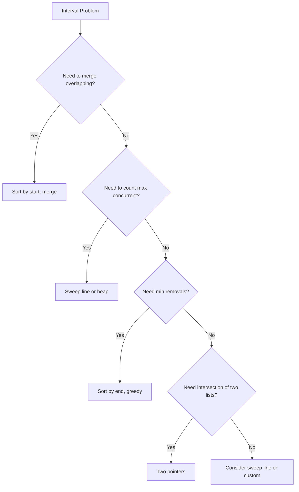
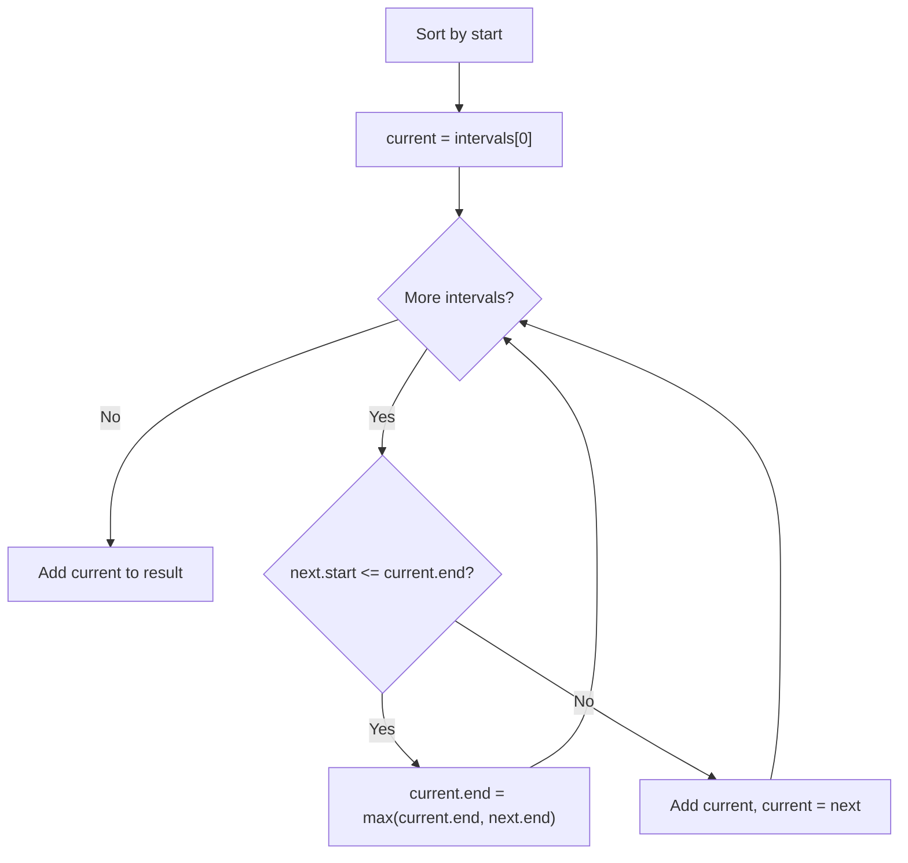
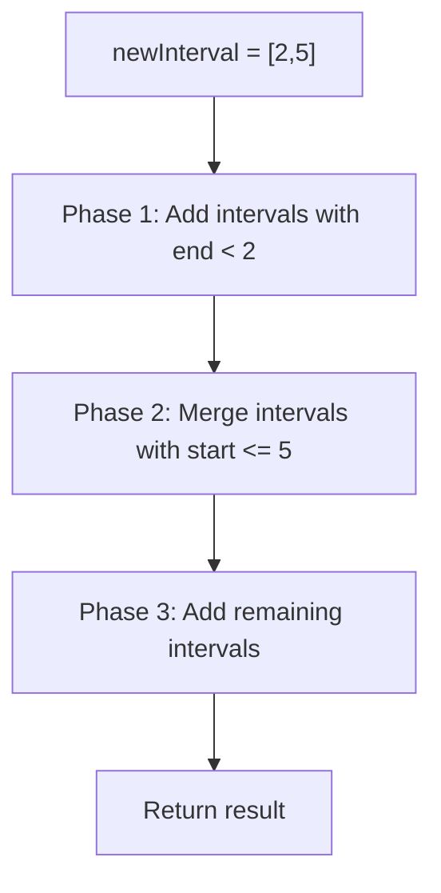
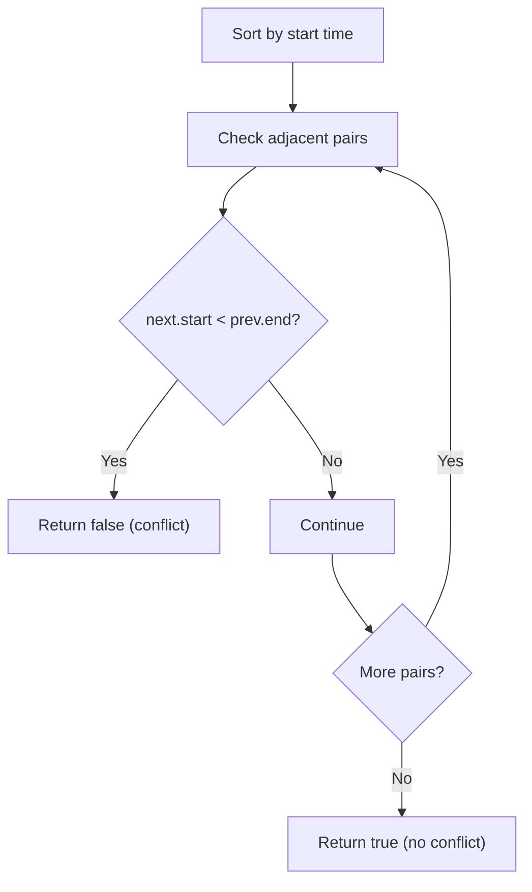
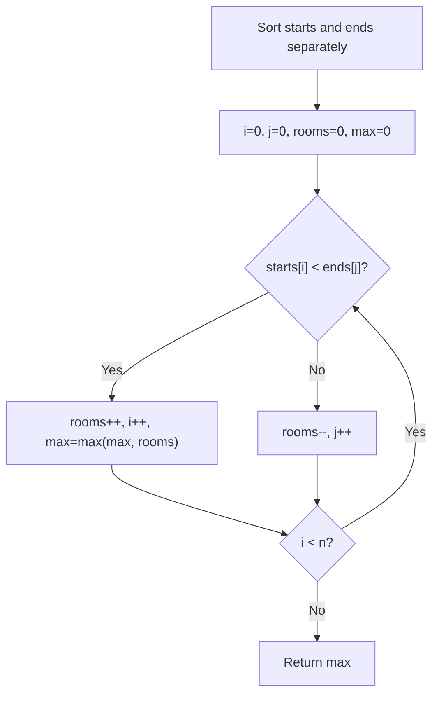
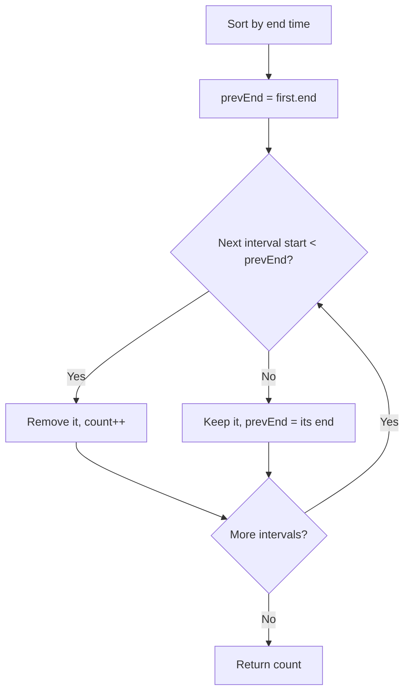
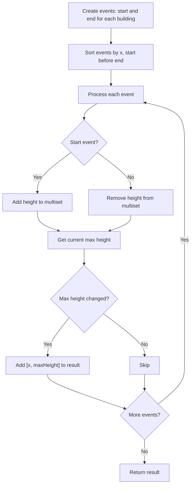

---
tags:
  - intervals
  - sorting
  - sweep-line
  - greedy
  - neetcode-150
---

# Intervals

## What are Intervals? (Simple Explanation)
An **interval** is just a range with a start and an end, like [2, 5]. Think of it as:
- A meeting from 2 PM to 5 PM
- A hotel room booked from day 2 to day 5
- A movie showing from minute 2 to minute 5

Intervals show up everywhere in real life:
- Calendar events (meetings, appointments)
- Resource bookings (rooms, cars, equipment)
- Time ranges (working hours, shifts)
- Geographic regions (a section of a road)

**The big question in interval problems:** Do these two intervals overlap? And if so, how do we combine them or count them?

## Key Concepts (In Simple Terms)
- **Interval**: A pair [start, end] representing a range of values
- **Overlap**: Two intervals overlap if one doesn't completely end before the other starts
- **Merge**: Combine two overlapping intervals into one bigger interval
- **Sort**: Most interval problems require sorting first (usually by start time)
- **Sweep Line**: Imagine a vertical line sweeping from left to right. At each point, we know which intervals are "active."
- **Events**: A start is an "open" event, an end is a "close" event

## Overlap Condition (The Most Important Rule!)

Two intervals **a = [a.start, a.end]** and **b = [b.start, b.end]**:

**NOT Overlapping** (they are separate):
```
a.end < b.start   OR   b.end < a.start
```
Visually:
```
a: |-----|
b:         |-----|    (b starts after a ends)
```

**Overlapping** (they share some region):
```
a.start <= b.end   AND   b.start <= a.end
```
Visually:
```
a: |-----|
b:     |-----|        (they share the middle part)
```

**Merged Interval** (when overlapping):
```
merged = [min(a.start, b.start), max(a.end, b.end)]
```

**Important:** Whether intervals that "touch" (a.end == b.start) are considered overlapping depends on the problem. For meetings, [1,3] and [3,5] usually don't overlap (one ends when the other starts). For inclusive ranges, they might.

## Common Problems
- Merge Intervals
- Insert Interval
- Meeting Rooms
- Meeting Rooms II (minimum rooms)
- Non-overlapping Intervals
- Skyline Problem
- Interval List Intersections

## Patterns / Techniques
1. **Sort & Merge**: Sort by start time, then merge adjacent overlapping intervals
2. **Sweep Line**: Create start/end events, process them in order
3. **Priority Queue**: Process intervals by end time or priority
4. **Two Pointers**: For finding intersections between two interval lists

## Complexity
| Operation | Time | Notes |
|-----------|------|-------|
| Sort | O(n log n) | Usually the bottleneck |
| Merge | O(n) | Single pass after sorting |
| Total | O(n log n) | Dominated by sort |
| Space | O(n) | For result or heap |

---

## 🔹 Basic Templates

### Merge Intervals Template
```java
public int[][] merge(int[][] intervals) {
    if (intervals.length <= 1) return intervals;
    Arrays.sort(intervals, (a, b) -> a[0] - b[0]);
    List<int[]> merged = new ArrayList<>();
    int[] current = intervals[0];
    for (int i = 1; i < intervals.length; i++) {
        if (intervals[i][0] <= current[1]) {
            current[1] = Math.max(current[1], intervals[i][1]);
        } else {
            merged.add(current);
            current = intervals[i];
        }
    }
    merged.add(current);
    return merged.toArray(new int[0][]);
}
```

### Overlap Check Template
```java
// Check if two intervals overlap (inclusive)
boolean overlaps(int[] a, int[] b) {
    return a[0] <= b[1] && b[0] <= a[1];
}

// Check if two intervals overlap (exclusive of touching)
boolean overlapsStrict(int[] a, int[] b) {
    return a[0] < b[1] && b[0] < a[1];
}
```

### Sweep Line Template
```java
// Create events: (time, type, data)
// type: 0 for start, 1 for end
List<int[]> events = new ArrayList<>();
for (int[] interval : intervals) {
    events.add(new int[]{interval[0], 0, interval[1]});
    events.add(new int[]{interval[1], 1, interval[1]});
}
// Sort by time, start before end
events.sort((a, b) -> a[0] == b[0] ? a[1] - b[1] : a[0] - b[0]);
// Process events in order
```

### Interval Decision Flow


---

## 🔹 Practice Problems by Topic

### Easy

#### 1. **Merge Intervals**

**Problem Description:**
Given a list of intervals, merge all overlapping intervals and return the result.

**Simple Analogy:**
Imagine you have several meetings scheduled. Some overlap. You want to combine them into blocks of continuous busy time.

**Example Walkthrough:**

Input: `intervals = [[1,3],[2,6],[8,10],[15,18]]`
```
Expected Output: [[1,6],[8,10],[15,18]]

Visual:
[1,3]: |---|
[2,6]:   |-----|
[8,10]:          |--|
[15,18]:                |---|

Step 1: Sort by start (already sorted)
[[1,3], [2,6], [8,10], [15,18]]

Step 2: current = [1,3]
i=1: [2,6] -> 2 <= 3? YES, overlap
     current = [1, max(3,6)] = [1,6]
i=2: [8,10] -> 8 <= 6? NO, no overlap
     Add [1,6] to result
     current = [8,10]
i=3: [15,18] -> 15 <= 10? NO
     Add [8,10] to result
     current = [15,18]

Step 3: Add [15,18] to result

Result: [[1,6], [8,10], [15,18]]
```

Input: `intervals = [[1,4],[4,5]]`
```
Expected Output: [[1,5]]

[1,4]: |----|
[4,5]:     |---|
They touch at 4. Since 4 <= 4, they overlap (merge).

current = [1,4]
i=1: [4,5] -> 4 <= 4? YES
     current = [1, max(4,5)] = [1,5]

Result: [[1,5]]
```

Input: `intervals = [[1,4],[0,4]]`
```
Expected Output: [[0,4]]

Sort: [[0,4],[1,4]]
current = [0,4]
i=1: [1,4] -> 1 <= 4? YES
     current = [0, max(4,4)] = [0,4]

Result: [[0,4]]
```

**Key Insight - Sort by Start, Then Merge:**
After sorting by start time, intervals that overlap will be adjacent. We keep a "current" interval and extend its end when we find an overlap. When we find a non-overlapping interval, we finalize the current one and start a new one.

**Why It Works:**
- Sorting ensures intervals are processed in order of start time
- If the next interval starts before or at current's end, they overlap
- Merging extends the end to cover both
- If the next interval starts after current's end, no future interval can overlap with current (since they're sorted by start)
- This is optimal and handles all cases in one pass

**Visualization - Merge Intervals:**


```java
public int[][] merge(int[][] intervals) {
    if (intervals.length <= 1) return intervals;
    Arrays.sort(intervals, (a, b) -> a[0] - b[0]);
    List<int[]> merged = new ArrayList<>();
    int[] current = intervals[0];
    for (int i = 1; i < intervals.length; i++) {
        if (intervals[i][0] <= current[1]) {
            current[1] = Math.max(current[1], intervals[i][1]);
        } else {
            merged.add(current);
            current = intervals[i];
        }
    }
    merged.add(current);
    return merged.toArray(new int[0][]);
}
```

**Edge Cases:**
- Empty array: returns empty
- Single interval: returns it as-is
- All overlapping: merges into one
- No overlapping: returns all unchanged
- Touching intervals (end == start): merged (inclusive)

**Time Complexity**: O(n log n) - sorting dominates
**Space Complexity**: O(n) - for result list

**Similar Pattern Problems:**
- Insert Interval
- Remove Interval Overlap
- Employee Free Time

---

#### 2. **Insert Interval**

**Problem Description:**
Given a sorted list of non-overlapping intervals, insert a new interval and merge if necessary.

**Simple Analogy:**
Like adding a new meeting to your calendar. It might overlap with existing meetings, so you need to merge them.

**Example Walkthrough:**

Input: `intervals = [[1,3],[6,9]]`, `newInterval = [2,5]`
```
Expected Output: [[1,5],[6,9]]

Visual:
[1,3]: |---|
[2,5]:   |-----|
[6,9]:         |---|

Step 1: Add intervals before newInterval (end < newStart)
[1,3].end=3 < 2? NO, so stop

Step 2: Merge overlapping (start <= newEnd)
[1,3].start=1 <= 5? YES -> newInterval = [min(1,2), max(3,5)] = [1,5]
[6,9].start=6 <= 5? NO -> stop

Step 3: Add newInterval [1,5]
Step 4: Add remaining [6,9]

Result: [[1,5],[6,9]]
```

Input: `intervals = [[1,2],[3,5],[6,7],[8,10],[12,16]]`, `newInterval = [4,8]`
```
Expected Output: [[1,2],[3,10],[12,16]]

Step 1: Before newInterval (end < 4)
[1,2] -> 2 < 4? YES, add to result
[3,5] -> 5 < 4? NO, stop
result = [[1,2]]

Step 2: Merge overlapping (start <= 8)
[3,5] -> 3 <= 8? YES -> newInterval = [min(3,4), max(5,8)] = [3,8]
[6,7] -> 6 <= 8? YES -> newInterval = [min(3,6), max(8,7)] = [3,8]
[8,10] -> 8 <= 8? YES -> newInterval = [min(3,8), max(8,10)] = [3,10]
[12,16] -> 12 <= 10? NO, stop

Step 3: Add newInterval [3,10]
result = [[1,2],[3,10]]

Step 4: Add remaining
[12,16] -> result = [[1,2],[3,10],[12,16]]

Result: [[1,2],[3,10],[12,16]]
```

Input: `intervals = [[1,5]]`, `newInterval = [2,3]`
```
Expected Output: [[1,5]]

Step 1: [1,5].end=5 < 2? NO, stop
Step 2: [1,5].start=1 <= 3? YES -> newInterval = [min(1,2), max(5,3)] = [1,5]
Step 3: Add [1,5]
Result: [[1,5]]
```

**Key Insight - Three Phases:**
The sorted input makes this easy. We have three phases:
1. **Before**: Intervals completely before newInterval (end < new.start). Add directly.
2. **Overlap**: Intervals overlapping with newInterval (start <= new.end). Merge by extending newInterval.
3. **After**: Intervals completely after newInterval. Add directly.

**Why It Works:**
- The input is already sorted, so we don't need to re-sort
- Phase 1 captures all intervals that end before newInterval starts
- Phase 2 merges all intervals that overlap with newInterval
- Phase 3 adds the rest
- One pass, O(n) time

**Visualization - Insert Interval:**


```java
public int[][] insert(int[][] intervals, int[] newInterval) {
    List<int[]> result = new ArrayList<>();
    int i = 0;
    while (i < intervals.length && intervals[i][1] < newInterval[0]) {
        result.add(intervals[i++]);
    }
    while (i < intervals.length && intervals[i][0] <= newInterval[1]) {
        newInterval[0] = Math.min(newInterval[0], intervals[i][0]);
        newInterval[1] = Math.max(newInterval[1], intervals[i][1]);
        i++;
    }
    result.add(newInterval);
    while (i < intervals.length) {
        result.add(intervals[i++]);
    }
    return result.toArray(new int[0][]);
}
```

**Edge Cases:**
- newInterval before all: added first
- newInterval after all: added last
- newInterval overlaps all: merges into one
- Empty intervals list: returns [newInterval]

**Time Complexity**: O(n) - single pass
**Space Complexity**: O(n) - for result

**Similar Pattern Problems:**
- Merge Intervals
- Insert Range
- Range Module

---

### Medium

#### 3. **Meeting Rooms**

**Problem Description:**
Given an array of meeting times, determine if a person can attend all meetings.

**Simple Analogy:**
Like checking if your calendar has any conflicts. If two meetings overlap, you can't attend both.

**Example Walkthrough:**

Input: `intervals = [[0,30],[5,10],[15,20]]`
```
Expected Output: false

[0,30]: |--------------------------|
[5,10]:     |---|
[15,20]:              |----|

[0,30] and [5,10] overlap -> can't attend both
Return false
```

Input: `intervals = [[7,10],[2,4]]`
```
Expected Output: true

Sort: [[2,4],[7,10]]

[2,4]:  |---|
[7,10]:      |---|

[2,4].end=4 < [7,10].start=7 -> no overlap
Return true
```

Input: `intervals = [[1,5],[5,10]]`
```
Expected Output: true (if touching is not overlap)

[1,5]: |----|
[5,10]:     |----|

5 < 5? NO -> no overlap
Return true
```

**Key Insight - Sort and Check Adjacent:**
After sorting by start time, just check if any meeting starts before the previous one ends. If so, there's an overlap.

**Why It Works:**
- Sorting puts meetings in chronological order
- If meeting i starts before meeting i-1 ends, they overlap
- We only need to check adjacent pairs (sorted order guarantees this)
- If no adjacent overlaps, no overlaps at all

**Visualization - Meeting Rooms:**


```java
public boolean canAttendMeetings(int[][] intervals) {
    Arrays.sort(intervals, (a, b) -> a[0] - b[0]);
    for (int i = 1; i < intervals.length; i++) {
        if (intervals[i][0] < intervals[i - 1][1]) {
            return false;
        }
    }
    return true;
}
```

**Edge Cases:**
- Empty list: returns true
- Single meeting: returns true
- Touching meetings: depends on definition
- All overlapping: returns false

**Time Complexity**: O(n log n)
**Space Complexity**: O(1)

**Similar Pattern Problems:**
- Meeting Rooms II
- Merge Intervals
- Non-overlapping Intervals

---

#### 4. **Meeting Rooms II (Minimum Rooms)**

**Problem Description:**
Given meeting times, find the minimum number of conference rooms needed to hold all meetings.

**Simple Analogy:**
Like scheduling classes in classrooms. How many classrooms do you need so no two classes conflict?

**Example Walkthrough:**

Input: `intervals = [[0,30],[5,10],[15,20]]`
```
Expected Output: 2

[0,30]: |--------------------------|
[5,10]:     |---|
[15,20]:              |----|

At time 5: meeting [0,30] and [5,10] both active -> 2 rooms
At time 15: [0,30] and [15,20] active -> 2 rooms
Max concurrent = 2

Method: sort starts and ends separately
starts = [0, 5, 15]
ends = [10, 20, 30]

i=0, j=0: starts[0]=0 < ends[0]=10 -> rooms=1, i=1, max=1
i=1, j=0: starts[1]=5 < ends[0]=10 -> rooms=2, i=2, max=2
i=2, j=0: starts[2]=15 < ends[0]=10? NO -> rooms=1, j=1
i=2, j=1: starts[2]=15 < ends[1]=20? YES -> rooms=2, i=3, max=2
i=3 -> loop ends

Return 2
```

Input: `intervals = [[7,10],[2,4]]`
```
Expected Output: 1

Sort: [[2,4],[7,10]]
starts = [2, 7]
ends = [4, 10]

i=0: 2 < 4 -> rooms=1, i=1
i=1: 7 < 4? NO -> rooms=0, j=1
i=1: 7 < 10 -> rooms=1, i=2
Loop ends
Max = 1

Return 1
```

Input: `intervals = [[1,5],[2,6],[3,7]]`
```
Expected Output: 3

All three overlap at time 3.
starts = [1,2,3]
ends = [5,6,7]

i=0: 1<5 -> rooms=1
i=1: 2<5 -> rooms=2
i=2: 3<5 -> rooms=3
Max = 3

Return 3
```

**Key Insight - Count Overlaps with Sweep:**
Think of time as a line. A meeting "opens" at start and "closes" at end. The maximum number of simultaneously open meetings is the answer. Sort starts and ends separately, then use two pointers.

**Why It Works:**
- Each start means a room is needed; each end means a room is freed
- If a start comes before the earliest end, we need a new room
- If an end comes before the next start, we free a room
- Max rooms ever needed = answer
- Two sorted arrays + two pointers = O(n log n)

**Visualization - Meeting Rooms II:**


```java
public int minMeetingRooms(int[][] intervals) {
    int[] starts = new int[intervals.length];
    int[] ends = new int[intervals.length];
    for (int i = 0; i < intervals.length; i++) {
        starts[i] = intervals[i][0];
        ends[i] = intervals[i][1];
    }
    Arrays.sort(starts);
    Arrays.sort(ends);
    int rooms = 0, maxRooms = 0;
    int i = 0, j = 0;
    while (i < intervals.length) {
        if (starts[i] < ends[j]) {
            rooms++;
            i++;
        } else {
            rooms--;
            j++;
        }
        maxRooms = Math.max(maxRooms, rooms);
    }
    return maxRooms;
}
```

**Edge Cases:**
- Empty list: returns 0
- Single meeting: returns 1
- All non-overlapping: returns 1
- All overlapping: returns n

**Time Complexity**: O(n log n)
**Space Complexity**: O(n) - for starts and ends arrays

**Similar Pattern Problems:**
- Minimum Flights to Connect All Cities
- Rooms Required
- Car Pooling

---

#### 5. **Non-overlapping Intervals**

**Problem Description:**
Given intervals, find the minimum number of intervals to remove so the rest are non-overlapping.

**Simple Analogy:**
Like scheduling as many meetings as possible in one room. You may need to decline some to avoid conflicts.

**Example Walkthrough:**

Input: `intervals = [[1,2],[2,3],[3,4],[1,3]]`
```
Expected Output: 1

Sort by end: [[1,2],[2,3],[1,3],[3,4]]

prevEnd = 2 (end of first)
i=1: [2,3] -> start=2 < prevEnd=2? NO -> keep, prevEnd=3
i=2: [1,3] -> start=1 < prevEnd=3? YES -> remove, count=1
i=3: [3,4] -> start=3 < prevEnd=3? NO -> keep, prevEnd=4

Removed: 1
```

Input: `intervals = [[1,2],[1,2],[1,2]]`
```
Expected Output: 2

Sort by end: [[1,2],[1,2],[1,2]]

prevEnd = 2
i=1: start=1 < 2 -> remove, count=1
i=2: start=1 < 2 -> remove, count=2

Removed: 2
```

Input: `intervals = [[1,2],[2,3]]`
```
Expected Output: 0

prevEnd = 2
i=1: start=2 < 2? NO -> keep

Removed: 0
```

**Key Insight - Sort by End, Greedy:**
To maximize non-overlapping intervals (equivalently, minimize removals), sort by END time. Always keep the interval that ends earliest. This leaves maximum room for future intervals.

**Why It Works:**
- The interval with the earliest end conflicts with the fewest future intervals
- By keeping it, we maximize the chance of fitting more intervals
- This greedy choice is provably optimal for interval scheduling
- Any interval we remove must be replaced by one that ends later (worse choice)

**Visualization - Non-overlapping Intervals:**


```java
public int eraseOverlapIntervals(int[][] intervals) {
    if (intervals.length <= 1) return 0;
    Arrays.sort(intervals, (a, b) -> a[1] - b[1]);
    int removed = 0;
    int prevEnd = intervals[0][1];
    for (int i = 1; i < intervals.length; i++) {
        if (intervals[i][0] < prevEnd) {
            removed++;
        } else {
            prevEnd = intervals[i][1];
        }
    }
    return removed;
}
```

**Edge Cases:**
- Empty list: returns 0
- Single interval: returns 0
- All same interval: returns n-1
- No overlaps: returns 0

**Time Complexity**: O(n log n)
**Space Complexity**: O(1)

**Similar Pattern Problems:**
- Maximum Non-overlapping Intervals
- Interval Scheduling
- Minimum Arrows to Burst Balloons

---

### Hard

#### 6. **Skyline Problem**

**Problem Description:**
Given buildings as [left, right, height], return the skyline (silhouette) as a list of key points [x, height].

**Simple Analogy:**
Like looking at a city's silhouette against the sunset. Where does the outline change height?

**Example Walkthrough:**

Input: `buildings = [[2,9,10],[3,7,15],[5,12,12],[15,20,10],[19,24,8]]`
```
Expected Output: [[2,10],[3,15],[7,12],[12,0],[15,10],[19,8],[24,0]]

Visual:
Building 1: [2,9,10]   |---------| height 10
Building 2: [3,7,15]     |-----|   height 15
Building 3: [5,12,12]      |------| height 12
Building 4: [15,20,10]                    |----| height 10
Building 5: [19,24,8]                       |----| height 8

Skyline changes:
x=2: height becomes 10
x=3: height becomes 15
x=7: height becomes 12 (building 2 ends)
x=12: height becomes 0 (building 3 ends)
x=15: height becomes 10
x=19: height becomes 8 (building 4 ends, building 5 starts)
x=24: height becomes 0

Result: [[2,10],[3,15],[7,12],[12,0],[15,10],[19,8],[24,0]]
```

Input: `buildings = [[0,2,3],[2,5,3]]`
```
Expected Output: [[0,3],[5,0]]

Two buildings of same height, touching at x=2.
No height change at x=2.
```

Input: `buildings = [[1,2,1],[1,2,2],[1,2,3]]`
```
Expected Output: [[1,3],[2,0]]

Three buildings all starting at 1, ending at 2, with heights 1,2,3.
Max height is 3 at x=1.
At x=2, all end, height becomes 0.
```

**Key Insight - Sweep Line with Max-Height Tracking:**
Treat each building as two events: a "start" event (building begins) and an "end" event (building ends). Process events left to right. At each event, update the count of active heights. The maximum active height is the current skyline height. Record whenever this max changes.

**Why It Works:**
- The skyline only changes at start or end of a building
- At each event, we know exactly which buildings are active
- The skyline height = max height among active buildings
- We record the x-coordinate whenever this max changes
- Using a TreeMap (or multiset) tracks heights efficiently

**Visualization - Skyline:**


```java
public List<List<Integer>> getSkyline(int[][] buildings) {
    List<List<Integer>> result = new ArrayList<>();
    List<int[]> events = new ArrayList<>();
    for (int[] b : buildings) {
        events.add(new int[]{b[0], 0, b[2]});
        events.add(new int[]{b[1], 1, b[2]});
    }
    events.sort((a, b) -> a[0] == b[0] ? a[1] - b[1] : a[0] - b[0]);
    TreeMap<Integer, Integer> heightCount = new TreeMap<>();
    heightCount.put(0, 1);
    int prevMaxHeight = 0;
    for (int[] event : events) {
        int x = event[0], type = event[1], h = event[2];
        if (type == 0) {
            heightCount.put(h, heightCount.getOrDefault(h, 0) + 1);
        } else {
            heightCount.put(h, heightCount.get(h) - 1);
            if (heightCount.get(h) == 0) heightCount.remove(h);
        }
        int maxHeight = heightCount.lastKey();
        if (maxHeight != prevMaxHeight) {
            result.add(Arrays.asList(x, maxHeight));
            prevMaxHeight = maxHeight;
        }
    }
    return result;
}
```

**Edge Cases:**
- Single building: two points (start and end)
- Overlapping buildings: skyline follows max heights
- Equal heights: no change recorded
- Touching buildings: handled by event sorting

**Time Complexity**: O(n log n) - sorting and TreeMap operations
**Space Complexity**: O(n)

**Similar Pattern Problems:**
- Rectangle Area II
- Largest Rectangle in Histogram
- The Skyline Problem

---

## 📌 Key Patterns & Techniques

### 1. **Merge Pattern**
- Sort by start time
- Keep "current" interval, extend when overlapping
- Add to result when no more overlap
- Examples: Merge Intervals, Insert Interval

### 2. **Sweep Line Pattern**
- Create events for start/end
- Sort events by position
- Process in order, tracking active state
- Examples: Meeting Rooms II, Skyline Problem

### 3. **Greedy Interval Selection**
- Sort by end time
- Pick interval, skip overlapping ones
- Maximizes non-overlapping count
- Examples: Non-overlapping Intervals, Activity Selection

### 4. **Two Pointers for Intersection**
- Given two sorted interval lists
- Use two pointers to find overlaps
- Advance the one that ends first
- Examples: Interval List Intersections

### 5. **Overlap Comparison Rules**
| Condition | Meaning |
|-----------|---------|
| `a.end < b.start` | a is completely before b |
| `a.end == b.start` | Touching (may or may not overlap) |
| `a.start <= b.end && b.start <= a.end` | Overlapping |
| `a.start < b.end && b.start < a.end` | Overlapping (strict) |

---

## 🎯 Common Pitfalls to Avoid

- Wrong overlap condition (using `<` vs `<=` incorrectly)
- Not handling edge cases (touching intervals, empty input)
- Forgetting to sort (or sorting by the wrong key)
- Incorrect comparison for interval sorting (start vs end)
- Off-by-one in merge condition
- Not considering inclusive vs exclusive ends
- Using start-time sort when end-time sort is needed (greedy problems)
- Forgetting that intervals may touch (end == start)
- Not handling single-interval or empty-list cases
- In sweep line, forgetting to process starts before ends at the same x
- Using `O(n^2)` overlap checks instead of sorting + single pass