---
tags:
  - linked-list
  - two-pointers
  - fast-slow-pointers
  - recursion
  - neetcode-150
---

# Linked List

## What is a Linked List? (Simple Explanation)
Imagine a treasure hunt where each clue tells you where to find the next clue. You can't jump directly to clue #5 — you must start at clue #1 and follow the chain. That's a linked list!

A linked list is a chain of "nodes," where each node contains:
- **Data** (the value)
- **A pointer/reference** to the next node

Unlike an array (where elements sit side-by-side in memory), linked list nodes can be scattered anywhere in memory. The "chain" is created by pointers.

**Real-life analogies:**
- A train where each car is connected to the next
- A scavenger hunt where each clue leads to the next
- A playlist where each song knows the next song

## Key Concepts (In Simple Terms)
- **Node**: A single element containing data and a pointer to the next node
- **Head**: The first node in the list (entry point)
- **Tail**: The last node (its next pointer is null)
- **No Random Access**: To reach the 5th element, you must traverse 1→2→3→4→5
- **Time Complexity**: O(1) insert/delete at known position, O(n) to search
- **Space Complexity**: O(n) for n nodes
- **Advantage over arrays**: Efficient insertions/deletions (no shifting needed)
- **Disadvantage**: No O(1) access by index

## Variants (Different Types)
- **Singly Linked List**: Each node points only to the next node. Like a one-way chain.
- **Doubly Linked List**: Each node points to both next and previous. Like a two-way chain. More memory but can traverse both directions.
- **Circular Linked List**: Last node points back to the first. Like a circle with no end.

## Common Problems
- Reverse a Linked List
- Detect Cycle (Floyd's Algorithm)
- Merge Two Sorted Lists
- Remove Nth Node From End
- Add Two Numbers
- Sort List
- Copy List with Random Pointer
- LRU Cache (uses linked list + hashmap)

## Patterns / Techniques
- **Fast and Slow Pointers**: Two pointers moving at different speeds
- **Dummy Node**: A fake node before head to simplify edge cases
- **Recursion**: Often elegant for linked list problems
- **Two-Pass Algorithm**: First pass gathers info, second pass uses it
- **Reversal**: Reverse the chain to change direction

---

## 🔹 Basic Templates

### Node Definition
```java
class ListNode {
    int val;
    ListNode next;
    ListNode(int val) {
        this.val = val;
        this.next = null;
    }
}
```

### Traverse Template
```java
ListNode curr = head;
while (curr != null) {
    // Process curr.val
    curr = curr.next;
}
```

### Dummy Node Template
```java
ListNode dummy = new ListNode(0);
dummy.next = head;
ListNode curr = dummy;
// ... build list using curr.next = ...
return dummy.next;
```

### Fast and Slow Pointer Template
```java
ListNode slow = head, fast = head;
while (fast != null && fast.next != null) {
    slow = slow.next;
    fast = fast.next.next;
}
// slow is now at middle
```

### Linked List Decision Flow
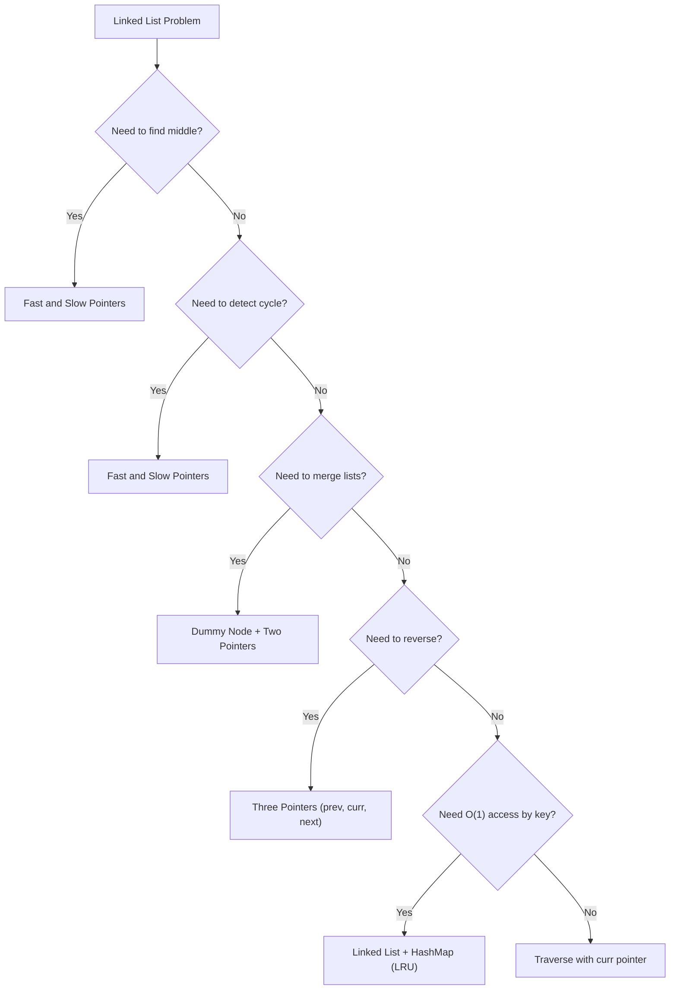

---

## 🔹 Practice Problems by Topic

### Easy

#### 1. **Reverse Linked List**

**Problem Description:**
Reverse a singly linked list and return the new head.

**Simple Analogy:**
Like reversing a chain of paper clips. Each clip's "hook" now points backward instead of forward.

**Example Walkthrough:**

Input: `1 -> 2 -> 3 -> 4 -> 5 -> null`
```
Expected Output: 5 -> 4 -> 3 -> 2 -> 1 -> null

Step-by-step:
Initial: prev=null, curr=1

Step 1: next=2, curr.next=prev(null), prev=1, curr=2
        1 -> null
Step 2: next=3, curr.next=prev(1), prev=2, curr=3
        2 -> 1 -> null
Step 3: next=4, curr.next=prev(2), prev=3, curr=4
        3 -> 2 -> 1 -> null
Step 4: next=5, curr.next=prev(3), prev=4, curr=5
        4 -> 3 -> 2 -> 1 -> null
Step 5: next=null, curr.next=prev(4), prev=5, curr=null
        5 -> 4 -> 3 -> 2 -> 1 -> null

Return prev (5)
```

Input: `null`
```
Expected Output: null
```

Input: `1 -> null`
```
Expected Output: 1 -> null
```

**Key Insight - Three Pointers:**
To reverse a link, we need to know the previous node. So we keep three pointers: prev (behind), curr (current), and next (ahead, saved before we break the link). We reverse curr's pointer to point to prev, then shift all three forward.

**Why It Works:**
- We process each node exactly once
- Before changing curr.next, we save the original next
- Then we point curr.next backward to prev
- Then we advance prev and curr
- When curr becomes null, prev is the new head

**Visualization - Reverse Linked List:**
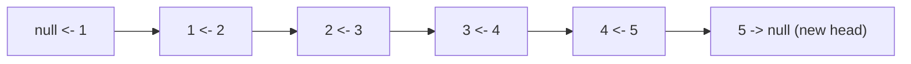

```java
public ListNode reverseList(ListNode head) {
    ListNode prev = null, curr = head;
    while (curr != null) {
        ListNode next = curr.next;
        curr.next = prev;
        prev = curr;
        curr = next;
    }
    return prev;
}
```

**Edge Cases:**
- Empty list: returns null
- Single node: returns that node
- Two nodes: swaps them
- Long list: works correctly

**Time Complexity**: O(n)
**Space Complexity**: O(1)

**Similar Pattern Problems:**
- Reverse List II (reverse between positions)
- Reverse Nodes in K-Group
- Palindrome Linked List

---

#### 2. **Merge Two Sorted Lists**

**Problem Description:**
Merge two sorted linked lists into one sorted list by splicing together their nodes.

**Simple Analogy:**
Like merging two sorted queues of people into one sorted queue. Compare the front of each, pick the smaller, move forward.

**Example Walkthrough:**

Input: `list1 = 1 -> 2 -> 4`, `list2 = 1 -> 3 -> 4`
```
Expected Output: 1 -> 1 -> 2 -> 3 -> 4 -> 4

Step 1: dummy -> null, curr=dummy
        list1=1, list2=1
        list1.val=1 <= list2.val=1 -> pick list1
        curr.next = 1, list1=2, curr=1

Step 2: list1=2, list2=1
        list2.val=1 < list1.val=2 -> pick list2
        curr.next = 1, list2=3, curr=1

Step 3: list1=2, list2=3
        list1.val=2 <= list2.val=3 -> pick list1
        curr.next = 2, list1=4, curr=2

Step 4: list1=4, list2=3
        list2.val=3 < list1.val=4 -> pick list2
        curr.next = 3, list2=4, curr=3

Step 5: list1=4, list2=4
        list1.val=4 <= list2.val=4 -> pick list1
        curr.next = 4, list1=null, curr=4

Step 6: list1=null, list2=4
        list1 is null -> attach remaining list2
        curr.next = 4, list2=null, curr=4

Result: dummy.next = 1 -> 1 -> 2 -> 3 -> 4 -> 4
```

Input: `list1 = null`, `list2 = 1 -> 2`
```
Expected Output: 1 -> 2

While loop doesn't execute
curr.next = list2 (since list1 is null)
Return dummy.next
```

Input: `list1 = 5`, `list2 = 1 -> 2 -> 3`
```
Expected Output: 1 -> 2 -> 3 -> 5

list1=5, list2=1: pick 1
list1=5, list2=2: pick 2
list1=5, list2=3: pick 3
list1=5, list2=null: attach 5
Result: 1 -> 2 -> 3 -> 5
```

**Key Insight - Dummy Node:**
The dummy node is a fake start that simplifies the code. We don't have to handle the "first node" case specially. We just build the merged list starting from dummy.next.

**Why It Works:**
- Both lists are sorted, so the smallest remaining element is always at one of the two heads
- Compare the two heads, pick the smaller, advance that list
- Dummy node avoids edge cases (empty result list)
- At the end, one list may still have nodes — attach them

**Visualization - Merge Two Sorted Lists:**
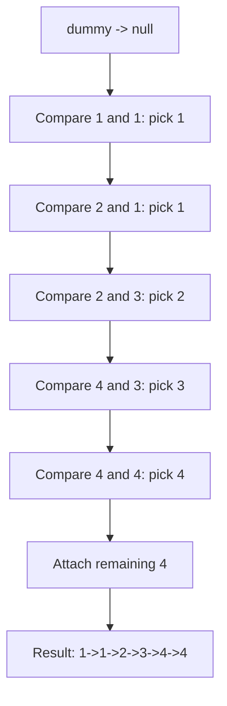

```java
public ListNode mergeTwoLists(ListNode list1, ListNode list2) {
    ListNode dummy = new ListNode(0);
    ListNode curr = dummy;
    while (list1 != null && list2 != null) {
        if (list1.val < list2.val) {
            curr.next = list1;
            list1 = list1.next;
        } else {
            curr.next = list2;
            list2 = list2.next;
        }
        curr = curr.next;
    }
    curr.next = (list1 != null) ? list1 : list2;
    return dummy.next;
}
```

**Edge Cases:**
- Both empty: returns null
- One empty: returns the other
- One element each: compares and merges
- Duplicate values: handled correctly

**Time Complexity**: O(m + n)
**Space Complexity**: O(1) - reusing existing nodes

**Similar Pattern Problems:**
- Merge K Sorted Lists
- Merge Sorted Array
- Merge Two Sorted Lists II

---

#### 3. **Delete Node in a Linked List**

**Problem Description:**
Delete a node from a singly linked list, given only that node. You don't have access to the head.

**Simple Analogy:**
Like removing a car from a train when you only know the car, not the engine. You can't go backward, so you must copy the next car's contents and skip it.

**Example Walkthrough:**

Input: `head = 4 -> 5 -> 1 -> 9`, `node = 5` (the node with value 5)
```
Expected Output: 4 -> 1 -> 9

Step 1: node.val = 5, node.next = 1
Step 2: Copy next node's value: node.val = 1
        List becomes: 4 -> 1 -> 1 -> 9 (we have two 1s)
Step 3: Skip next node: node.next = node.next.next
        List becomes: 4 -> 1 -> 9

Return (nothing, list modified in place)
```

Input: `head = 1 -> 2 -> 3`, `node = 2`
```
Expected Output: 1 -> 3

node.val = 3
node.next = null
List: 1 -> 3
```

Input: `head = 1 -> 2`, `node = 1`
```
Expected Output: 2

node.val = 2
node.next = null
List: 2
```

**Key Insight - Copy and Skip:**
Since we can't access the previous node, we can't just unlink the current node. Instead, we copy the next node's value into the current node, then remove the next node. This effectively "shifts" the next node's data into the current position.

**Why It Works:**
- We can only modify the current node and everything after it
- By copying the next node's value, the current node now "looks like" the next node
- By skipping the next node, we remove the duplicate
- The list is now correct (the deleted value is gone)

**Visualization - Delete Node:**
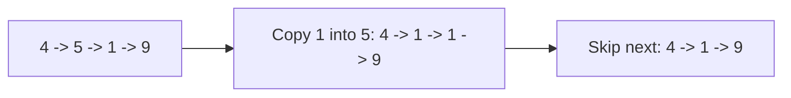

```java
public void deleteNode(ListNode node) {
    node.val = node.next.val;
    node.next = node.next.next;
}
```

**Edge Cases:**
- Node is the last node: problem guarantees it's not
- Node is the head: works (we don't need previous)
- Single node list: problem guarantees node is not last
- Multiple nodes: works correctly

**Time Complexity**: O(1)
**Space Complexity**: O(1)

**Similar Pattern Problems:**
- Delete Node II
- Unlink Nodes
- Remove Elements

---

#### 4. **Remove Nth Node From End of List**

**Problem Description:**
Given a linked list, remove the nth node from the end of the list and return its head.

**Simple Analogy:**
Like removing the 2nd book from the end of a shelf when you can only count from the front. Use two pointers to create a "window" of size n.

**Example Walkthrough:**

Input: `head = 1 -> 2 -> 3 -> 4 -> 5`, `n = 2`
```
Expected Output: 1 -> 2 -> 3 -> 5

Step 1: Create dummy: dummy -> 1 -> 2 -> 3 -> 4 -> 5
        fast = slow = dummy

Step 2: Move fast n+1=3 steps ahead
        fast = dummy -> 1 -> 2 -> 3

Step 3: Move both until fast reaches end
        fast=3, slow=dummy -> move
        fast=4, slow=1 -> move
        fast=5, slow=2 -> move
        fast=null, slow=3 -> stop

Step 4: slow.next = slow.next.next (skip node 4)
        1 -> 2 -> 3 -> 5

Return dummy.next = 1
```

Input: `head = 1`, `n = 1`
```
Expected Output: null (remove the only node)

dummy -> 1
fast moves 2 steps: fast=null
slow stays at dummy
slow.next = slow.next.next = null
Return dummy.next = null
```

Input: `head = 1 -> 2`, `n = 1`
```
Expected Output: 1

dummy -> 1 -> 2
fast moves 2 steps: fast=2
Move both: fast=null, slow=dummy
Wait, let me redo:
Move fast n+1=2 steps: dummy->1->2, fast=2
Move both: fast=null, slow=1
slow.next = slow.next.next = null
List: 1
Return 1
```

**Key Insight - Two Pointers with Gap:**
Maintain a gap of n+1 between fast and slow. When fast reaches the end, slow is exactly at the node BEFORE the one to remove. Then we can easily skip the target node.

**Why It Works:**
- Fast pointer creates a "lead" of n+1 steps
- When fast hits null, slow is at position (length - n - 1) from start
- That's exactly the node before the one we want to remove
- Using dummy handles the edge case of removing the head
- This is a one-pass solution

**Visualization - Remove Nth From End:**
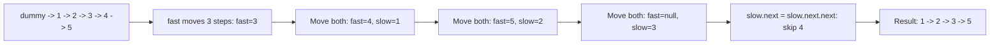

```java
public ListNode removeNthFromEnd(ListNode head, int n) {
    ListNode dummy = new ListNode(0);
    dummy.next = head;
    ListNode fast = dummy, slow = dummy;
    for (int i = 0; i <= n; i++) {
        fast = fast.next;
    }
    while (fast != null) {
        fast = fast.next;
        slow = slow.next;
    }
    slow.next = slow.next.next;
    return dummy.next;
}
```

**Edge Cases:**
- Remove head: dummy handles it
- Remove last node: works correctly
- Single node: removes it, returns null
- n larger than list: problem guarantees valid n

**Time Complexity**: O(n) - single pass
**Space Complexity**: O(1)

**Similar Pattern Problems:**
- Remove Kth Element
- Remove Elements
- Delete Middle Node

---

#### 5. **Linked List Cycle**

**Problem Description:**
Given the head of a linked list, determine if the list has a cycle (a node points back to a previous node).

**Simple Analogy:**
Like two runners on a circular track. One runs fast (2 steps), one runs slow (1 step). If there's a cycle, the fast runner will eventually "lap" the slow runner and they'll meet.

**Example Walkthrough:**

Input: `3 -> 2 -> 0 -> -4 -> (back to 2)`
```
Expected Output: true

Cycle exists: -4 points back to 2

Step 1: fast=3, slow=3
Step 2: fast=0 (3->2->0), slow=2 (3->2)
Step 3: fast=2 (0->-4->2), slow=0 (2->0)
Step 4: fast=0 (2->0->-4)? Wait, let me redo:
Actually: 3 -> 2 -> 0 -> -4 -> 2 -> 0 -> -4 -> ...
fast: 3 -> 0 -> 2 -> -4 -> 0 -> ...
slow: 3 -> 2 -> 0 -> -4 -> 2 -> ...

fast and slow will meet at some node
Return true
```

Input: `1 -> 2 -> null`
```
Expected Output: false

No cycle
fast: 1 -> null (fast.next is null, stop)
Return false
```

Input: `null`
```
Expected Output: false
```

**Key Insight - Floyd's Cycle Detection:**
If there's a cycle, a fast pointer (2 steps) will eventually catch up to a slow pointer (1 step) inside the cycle. If there's no cycle, the fast pointer will reach the end (null).

**Why It Works:**
- In a cycle, fast gains on slow by 1 node per step
- Eventually fast "laps" slow and they meet
- If no cycle, fast reaches null first
- This is O(n) time and O(1) space (no hashset needed!)
- Proof: distance between them decreases by 1 each step inside cycle

**Visualization - Cycle Detection:**
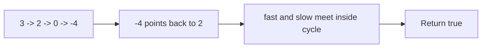

```java
public boolean hasCycle(ListNode head) {
    ListNode fast = head, slow = head;
    while (fast != null && fast.next != null) {
        fast = fast.next.next;
        slow = slow.next;
        if (fast == slow) {
            return true;
        }
    }
    return false;
}
```

**Edge Cases:**
- Empty list: returns false
- Single node, no cycle: returns false
- Single node pointing to itself: returns true
- Long list with cycle: correctly detects

**Time Complexity**: O(n)
**Space Complexity**: O(1)

**Similar Pattern Problems:**
- Detect Cycle II (find the start of cycle)
- Cycle Length
- Happy Number (uses same technique)

---

### Medium

#### 6. **Add Two Numbers**

**Problem Description:**
You are given two non-empty linked lists representing two non-negative integers. The digits are stored in reverse order. Add the two numbers and return the sum as a linked list.

**Simple Analogy:**
Like adding two numbers on paper, but the digits are written right-to-left. Start from the ones place, add with carry, move left.

**Example Walkthrough:**

Input: `l1 = 2 -> 4 -> 3` (represents 342), `l2 = 5 -> 6 -> 4` (represents 465)
```
Expected Output: 7 -> 0 -> 8 (represents 807)

342 + 465 = 807

Step 1: sum = 2 + 5 + 0 = 7, carry = 0, digit = 7
        result: 7
Step 2: sum = 4 + 6 + 0 = 10, carry = 1, digit = 0
        result: 7 -> 0
Step 3: sum = 3 + 4 + 1 = 8, carry = 0, digit = 8
        result: 7 -> 0 -> 8
Step 4: both lists null, carry=0 -> stop

Return 7 -> 0 -> 8
```

Input: `l1 = 9 -> 9`, `l2 = 1`
```
Expected Output: 0 -> 0 -> 1 (represents 100)

99 + 1 = 100

Step 1: sum = 9 + 1 + 0 = 10, carry = 1, digit = 0
Step 2: sum = 9 + 0 + 1 = 10, carry = 1, digit = 0
Step 3: l1=null, l2=null, carry=1 -> sum = 0+0+1=1, carry=0, digit=1
Result: 0 -> 0 -> 1
```

Input: `l1 = 0`, `l2 = 0`
```
Expected Output: 0
```

**Key Insight - Grade School Addition:**
Process both lists simultaneously, digit by digit. Keep a carry. Create a new node for each digit. Continue until both lists are exhausted AND carry is 0.

**Why It Works:**
- The lists are in reverse order, so the head is the ones place
- We can process both lists from head to tail simultaneously
- At each step, add the two digits plus any carry
- The new digit is sum % 10, the new carry is sum / 10
- If one list is shorter, treat missing digits as 0
- Final carry creates an extra node

**Visualization - Add Two Numbers:**
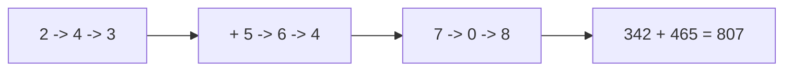

```java
public ListNode addTwoNumbers(ListNode l1, ListNode l2) {
    ListNode dummy = new ListNode(0);
    ListNode curr = dummy;
    int carry = 0;
    while (l1 != null || l2 != null || carry != 0) {
        int sum = (l1 != null ? l1.val : 0) + (l2 != null ? l2.val : 0) + carry;
        carry = sum / 10;
        curr.next = new ListNode(sum % 10);
        curr = curr.next;
        l1 = (l1 != null) ? l1.next : null;
        l2 = (l2 != null) ? l2.next : null;
    }
    return dummy.next;
}
```

**Edge Cases:**
- Different lengths: treat missing digits as 0
- Final carry: creates extra node
- Both zero: returns 0
- Large numbers: works correctly

**Time Complexity**: O(max(m, n))
**Space Complexity**: O(max(m, n)) for result

**Similar Pattern Problems:**
- Add Two Numbers II (digits in forward order)
- Multiply Two Lists
- Add Binary

---

#### 7. **Sort List (Merge Sort)**

**Problem Description:**
Sort a linked list in O(n log n) time and O(1) space (or O(log n) with recursion).

**Simple Analogy:**
Like sorting a deck of cards by splitting into two piles, sorting each, then merging. This is merge sort.

**Example Walkthrough:**

Input: `4 -> 2 -> 1 -> 3`
```
Expected Output: 1 -> 2 -> 3 -> 4

Step 1: Find middle (slow/fast)
        4 -> 2 -> 1 -> 3
        slow ends at 2, mid=2
        Split: left = 4 -> 2, right = 1 -> 3
        Actually, mid.next = null, so left = 4 -> 2, right = 1 -> 3

Step 2: Recursively sort left
        left = 4 -> 2
        mid = 4, split: left=4, right=2
        sort(4) = 4, sort(2) = 2
        merge(4, 2) = 2 -> 4

Step 3: Recursively sort right
        right = 1 -> 3
        merge(1, 3) = 1 -> 3

Step 4: Merge sorted halves
        merge(2->4, 1->3) = 1 -> 2 -> 3 -> 4

Return 1 -> 2 -> 3 -> 4
```

Input: `-1 -> 5 -> 3 -> 4 -> 0`
```
Expected Output: -1 -> 0 -> 3 -> 4 -> 5

Same process recursively
```

Input: `null`
```
Expected Output: null
```

**Key Insight - Merge Sort on Linked List:**
Merge sort is perfect for linked lists because:
1. Finding the middle is easy (slow/fast pointers)
2. Merging two sorted lists is O(n)
3. No random access needed (unlike quicksort)

**Why It Works:**
- Divide: Find middle, split into two halves
- Conquer: Recursively sort each half
- Combine: Merge two sorted halves into one
- Base case: list of 0 or 1 node is already sorted
- This gives O(n log n) time

**Visualization - Sort List:**
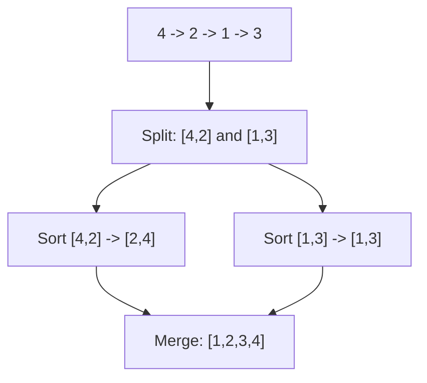

```java
public ListNode sortList(ListNode head) {
    if (head == null || head.next == null) return head;
    ListNode mid = getMid(head);
    ListNode midNext = mid.next;
    mid.next = null;
    ListNode left = sortList(head);
    ListNode right = sortList(midNext);
    return merge(left, right);
}

private ListNode getMid(ListNode head) {
    ListNode slow = head, fast = head;
    while (fast != null && fast.next != null) {
        slow = slow.next;
        fast = fast.next.next;
    }
    return slow;
}

private ListNode merge(ListNode l1, ListNode l2) {
    ListNode dummy = new ListNode(0);
    ListNode curr = dummy;
    while (l1 != null && l2 != null) {
        if (l1.val < l2.val) {
            curr.next = l1;
            l1 = l1.next;
        } else {
            curr.next = l2;
            l2 = l2.next;
        }
        curr = curr.next;
    }
    curr.next = (l1 != null) ? l1 : l2;
    return dummy.next;
}
```

**Edge Cases:**
- Empty list: returns null
- Single node: returns it
- Two nodes: sorts correctly
- Duplicates: handled correctly

**Time Complexity**: O(n log n)
**Space Complexity**: O(log n) for recursion stack

**Similar Pattern Problems:**
- Quick Sort Linked List
- Insertion Sort List
- Merge K Sorted Lists

---

#### 8. **Copy List with Random Pointer**

**Problem Description:**
A linked list has nodes with an extra "random" pointer that can point to any node or null. Create a deep copy of the list.

**Simple Analogy:**
Like photocopying a complex document where each page has a note pointing to another page. The copy must have its own notes pointing to the copied pages, not the originals.

**Example Walkthrough:**

Input: `7 -> 13 -> 11 -> 10 -> 1` with random pointers:
```
7.random = null
13.random = 7
11.random = 1
10.random = 11
1.random = 7

Step 1: First pass - create all copy nodes
        map = {7: copy7, 13: copy13, 11: copy11, 10: copy10, 1: copy1}

Step 2: Second pass - set next and random pointers
        copy7.next = map[13] = copy13
        copy7.random = map[null] = null
        copy13.next = map[11] = copy11
        copy13.random = map[7] = copy7
        ... and so on

Return copy7
```

Input: `null`
```
Expected Output: null
```

Input: `1 -> 2` with 1.random = 2, 2.random = 1
```
Expected Output: A deep copy with same structure

map = {1: copy1, 2: copy2}
copy1.next = copy2, copy1.random = copy2
copy2.next = null, copy2.random = copy1
Return copy1
```

**Key Insight - HashMap for Mapping:**
Use a HashMap to map each original node to its copy. First pass creates all copy nodes. Second pass sets the next and random pointers using the map.

**Why It Works:**
- We need to create entirely new nodes (deep copy)
- Random pointers can point anywhere, so we need to know all copies first
- HashMap gives O(1) lookup of copy for any original
- Two passes: one to create, one to link
- This handles random pointers elegantly

**Visualization - Copy List:**
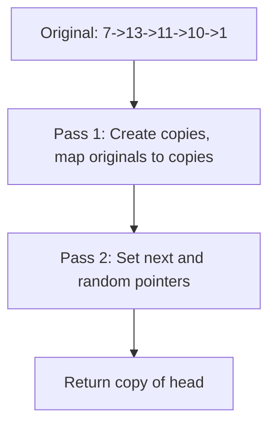

```java
public Node copyRandomList(Node head) {
    HashMap<Node, Node> map = new HashMap<>();
    Node curr = head;
    while (curr != null) {
        map.put(curr, new Node(curr.val));
        curr = curr.next;
    }
    curr = head;
    while (curr != null) {
        map.get(curr).next = map.get(curr.next);
        map.get(curr).random = map.get(curr.random);
        curr = curr.next;
    }
    return map.get(head);
}
```

**Edge Cases:**
- Empty list: returns null
- Single node: copies it, random can be null or self
- Random points to null: handled by map.get(null) = null
- Random points to self: handled by map

**Time Complexity**: O(n)
**Space Complexity**: O(n) for the map

**Similar Pattern Problems:**
- Deep Copy Graph
- Clone Tree
- Clone N-ary Tree

---

#### 9. **Reorder List**

**Problem Description:**
Given a singly linked list, reorder it as: first node, last node, second node, second-last node, etc.

**Simple Analogy:**
Like shuffling a deck by taking one from the top and one from the bottom, alternating.

**Example Walkthrough:**

Input: `1 -> 2 -> 3 -> 4`
```
Expected Output: 1 -> 4 -> 2 -> 3

Step 1: Find middle
        slow=2, fast=4 -> mid=2
        Split: left=1->2, right=3->4
        Actually, mid.next = null, so left=1->2, right=3->4

Step 2: Reverse second half
        right = 4 -> 3

Step 3: Merge alternately
        1 -> 4 -> 2 -> 3

Return 1 -> 4 -> 2 -> 3
```

Input: `1 -> 2 -> 3 -> 4 -> 5`
```
Expected Output: 1 -> 5 -> 2 -> 4 -> 3

Step 1: Find middle
        slow=3, fast=5 -> mid=3
        left=1->2->3, right=4->5

Step 2: Reverse right
        right = 5 -> 4

Step 3: Merge
        1 -> 5 -> 2 -> 4 -> 3
```

Input: `1`
```
Expected Output: 1
```

**Key Insight - Three Steps:**
1. Find the middle of the list
2. Reverse the second half
3. Merge the two halves alternately

**Why It Works:**
- Reordering needs to interleave first half (forward) with second half (backward)
- Finding middle with slow/fast pointers
- Reversing second half gives us the backward order
- Merging alternately produces the required order
- O(n) time, O(1) space

**Visualization - Reorder List:**
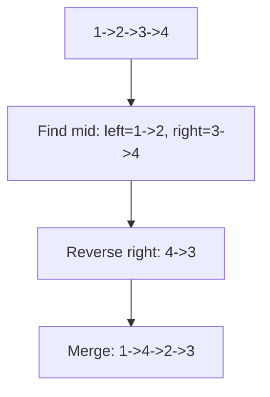

```java
public void reorderList(ListNode head) {
    ListNode mid = getMid(head);
    ListNode second = mid.next;
    mid.next = null;
    second = reverse(second);
    merge(head, second);
}

private void merge(ListNode l1, ListNode l2) {
    while (l1 != null) {
        ListNode l1Next = l1.next;
        ListNode l2Next = l2.next;
        l1.next = l2;
        l1 = l1Next;
        if (l1 != null) {
            l2.next = l1;
            l2 = l2Next;
        }
    }
}
```

**Edge Cases:**
- Empty list: returns immediately
- Single node: returns it
- Two nodes: reorders correctly
- Odd length: middle node stays in place

**Time Complexity**: O(n)
**Space Complexity**: O(1)

**Similar Pattern Problems:**
- Reorder Deque
- Zigzag Traversal
- Palindrome Linked List

---

### Hard

#### 10. **Merge k Sorted Lists**

**Problem Description:**
Given an array of k sorted linked lists, merge them into one sorted linked list.

**Simple Analogy:**
Like merging k sorted piles of cards into one sorted pile. At each step, pick the smallest card from the top of any pile.

**Example Walkthrough:**

Input: `lists = [1->4->5, 1->3->4, 2->6]`
```
Expected Output: 1 -> 1 -> 2 -> 3 -> 4 -> 4 -> 5 -> 6

Step 1: Put heads in min-heap: [1(list1), 1(list2), 2(list3)]

Step 2: Pop 1(list1), add to result, push next (4)
        heap = [1(list2), 2(list3), 4(list1)]
        result: 1

Step 3: Pop 1(list2), add to result, push next (3)
        heap = [2(list3), 3(list2), 4(list1)]
        result: 1 -> 1

Step 4: Pop 2(list3), add to result, push next (6)
        heap = [3(list2), 4(list1), 6(list3)]
        result: 1 -> 1 -> 2

Step 5: Pop 3(list2), add to result, push next (4)
        heap = [4(list1), 4(list2), 6(list3)]
        result: 1 -> 1 -> 2 -> 3

Step 6: Pop 4(list1), add to result, push next (5)
        heap = [4(list2), 5(list1), 6(list3)]
        result: 1 -> 1 -> 2 -> 3 -> 4

Step 7: Pop 4(list2), add to result, no next
        heap = [5(list1), 6(list3)]
        result: 1 -> 1 -> 2 -> 3 -> 4 -> 4

Step 8: Pop 5(list1), add to result, no next
        heap = [6(list3)]
        result: ... -> 5

Step 9: Pop 6(list3), add to result
        heap = []
        result: 1 -> 1 -> 2 -> 3 -> 4 -> 4 -> 5 -> 6

Return result
```

Input: `lists = []`
```
Expected Output: null (empty)
```

Input: `lists = [null, 1->2, null]`
```
Expected Output: 1 -> 2
```

**Key Insight - Min-Heap of Heads:**
The smallest remaining element is always one of the list heads. A min-heap of heads gives us the smallest in O(log k). After popping, the next node from that list becomes the new head.

**Why It Works:**
- Each list is sorted, so its smallest element is at the head
- The global smallest is among all heads
- Min-heap finds it in O(log k)
- After popping, the next from that list joins the heap
- Total: n nodes, each O(log k) = O(n log k)

**Visualization - Merge K Lists:**
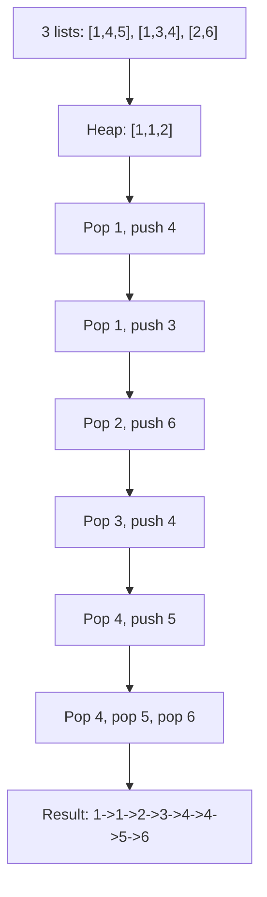

```java
public ListNode mergeKLists(ListNode[] lists) {
    PriorityQueue<ListNode> pq = new PriorityQueue<>((a, b) -> a.val - b.val);
    for (ListNode list : lists) {
        if (list != null) pq.offer(list);
    }
    ListNode dummy = new ListNode(0);
    ListNode curr = dummy;
    while (!pq.isEmpty()) {
        ListNode node = pq.poll();
        curr.next = node;
        curr = curr.next;
        if (node.next != null) {
            pq.offer(node.next);
        }
    }
    return dummy.next;
}
```

**Edge Cases:**
- Empty array: returns null
- All null lists: returns null
- One list: returns it
- Different lengths: works correctly

**Time Complexity**: O(n log k) where n = total nodes
**Space Complexity**: O(k) for the heap

**Similar Pattern Problems:**
- Merge Multiple Streams
- K-way Merge
- Smallest Range Covering K Lists

---

#### 11. **LRU Cache**

**Problem Description:**
Design a data structure that follows Least Recently Used (LRU) eviction policy. Support get(key) and put(key, value) in O(1) time.

**Simple Analogy:**
Like a small bookshelf that holds only 3 books. When you want to add a 4th, you remove the one you haven't touched in the longest time.

**Example Walkthrough:**

Input:
```
LRUCache cache = new LRUCache(2);
cache.put(1, 1);   // cache: {1=1}
cache.put(2, 2);   // cache: {1=1, 2=2}
cache.get(1);       // returns 1, cache: {1=1, 2=2} (1 is now most recent)
cache.put(3, 3);    // evicts 2, cache: {1=1, 3=3}
cache.get(2);       // returns -1 (not found)
cache.put(4, 4);    // evicts 1, cache: {3=3, 4=4}
cache.get(1);       // returns -1 (not found)
cache.get(3);       // returns 3
cache.get(4);       // returns 4
```

**Step-by-step:**
```
put(1,1): map={1:node1}, list=[1]
put(2,2): map={1:node1, 2:node2}, list=[2,1] (2 at front)
get(1):   returns 1, list=[1,2] (move 1 to front)
put(3,3): capacity full, evict 2 (last), map={1:node1, 3:node3}, list=[3,1]
get(2):   returns -1
put(4,4): evict 1, map={3:node3, 4:node4}, list=[4,3]
get(1):   returns -1
get(3):   returns 3, list=[3,4]
get(4):   returns 4, list=[4,3]
```

**Key Insight - HashMap + Doubly Linked List:**
- **HashMap**: O(1) lookup of node by key
- **Doubly Linked List**: O(1) move-to-front and remove-last
- Most recently used = front of list
- Least recently used = back of list
- When capacity exceeded, remove from back

**Why It Works:**
- HashMap gives O(1) access to any node
- Doubly linked list allows O(1) removal and insertion at any position
- We can move a node to front in O(1) (remove + add at front)
- We can remove the LRU node in O(1) (it's at the back)
- Combined: both operations in O(1)

**Visualization - LRU Cache:**
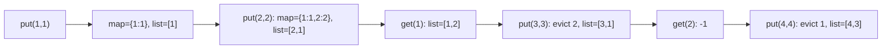

```java
class LRUCache {
    private int capacity;
    private HashMap<Integer, Node> map;
    private Node head, tail;
    class Node {
        int key, val;
        Node prev, next;
    }
    public LRUCache(int capacity) {
        this.capacity = capacity;
        this.map = new HashMap<>();
        this.head = new Node();
        this.tail = new Node();
        head.next = tail;
        tail.prev = head;
    }
    public int get(int key) {
        if (!map.containsKey(key)) return -1;
        Node node = map.get(key);
        moveToFront(node);
        return node.val;
    }
    public void put(int key, int value) {
        if (map.containsKey(key)) {
            Node node = map.get(key);
            node.val = value;
            moveToFront(node);
        } else {
            if (map.size() == capacity) {
                removeLast();
            }
            Node node = new Node();
            node.key = key;
            node.val = value;
            map.put(key, node);
            addToFront(node);
        }
    }
    private void moveToFront(Node node) {
        removeNode(node);
        addToFront(node);
    }
    private void addToFront(Node node) {
        node.next = head.next;
        node.prev = head;
        head.next.prev = node;
        head.next = node;
    }
    private void removeNode(Node node) {
        node.prev.next = node.next;
        node.next.prev = node.prev;
    }
    private void removeLast() {
        Node last = tail.prev;
        removeNode(last);
        map.remove(last.key);
    }
}
```

**Edge Cases:**
- Capacity 1: works correctly
- Get non-existent key: returns -1
- Put existing key: updates value, moves to front
- Put new key when full: evicts LRU

**Time Complexity**: O(1) for both get and put
**Space Complexity**: O(capacity)

**Similar Pattern Problems:**
- LFU Cache
- Time-based Key-Value Store
- Design Twitter

---

## 📌 Key Patterns & Techniques

### 1. **Fast and Slow Pointers**
- **Detect cycle**: Fast catches slow inside cycle
- **Find middle**: When fast reaches end, slow is at middle
- **Find kth from end**: Fast leads by k, when fast ends, slow is at target
- Fast moves 2 steps, slow moves 1

### 2. **Dummy Node**
- A fake node before head
- Simplifies edge cases (removing head, merging empty lists)
- Always return dummy.next
- Examples: Merge Two Lists, Remove Nth From End, Partition List

### 3. **Reversal**
- Three pointers: prev, curr, next
- Reverse links one by one
- Used in: Reverse List, Reorder List, Palindrome Check

### 4. **Two-Pass Algorithm**
- First pass gathers info (length, nodes)
- Second pass uses info to solve
- Examples: Remove Nth From End (two-pointer is one-pass alternative)

### 5. **HashMap + Linked List**
- Combine O(1) lookup with O(1) ordering
- Used in: LRU Cache, Copy List with Random Pointer

---

## 🎯 Common Pitfalls to Avoid

- Forgetting to handle null pointers (empty list, single node)
- Creating cycles accidentally (breaking links incorrectly)
- Not using dummy node when it simplifies edge cases
- Off-by-one errors with fast/slow pointers
- Not updating pointers correctly during reversal
- Losing reference to next node before changing curr.next
- Not handling the case where fast reaches end (odd vs even length)
- Forgetting to set the last node's next to null after reversal
- Modifying the list while iterating without saving next
- Assuming the list has a cycle when it doesn't (infinite loop)