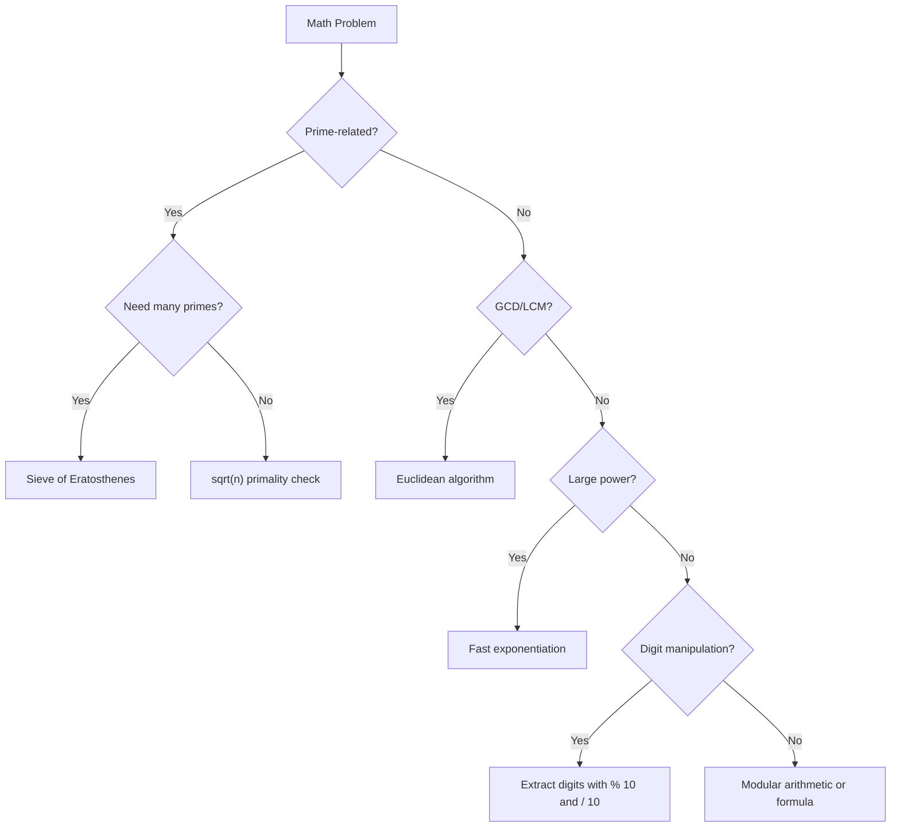
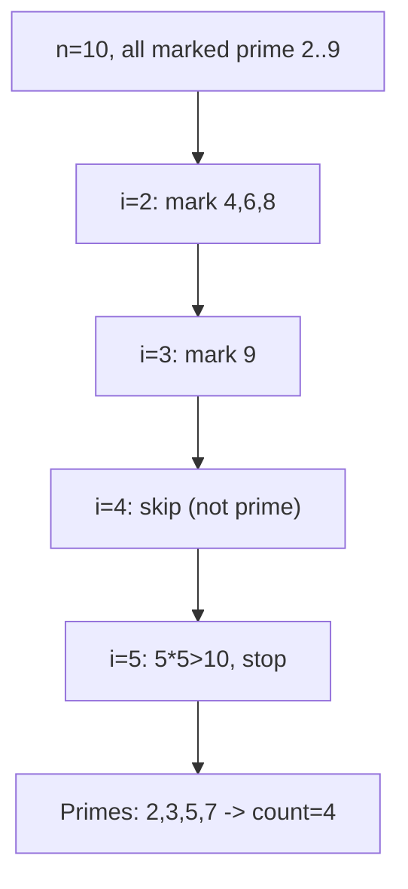
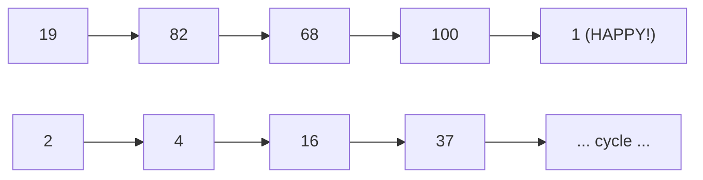
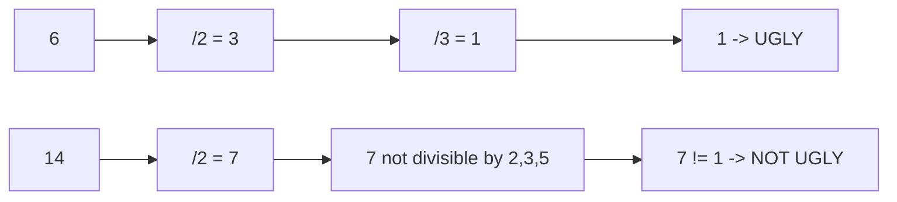
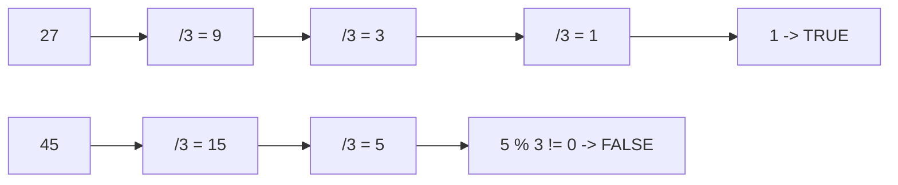
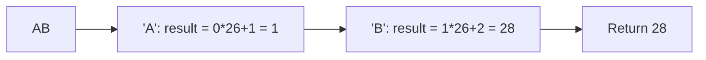
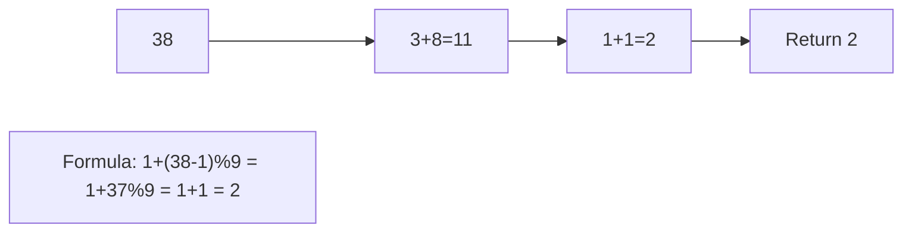
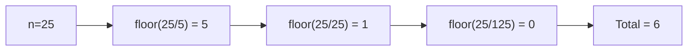
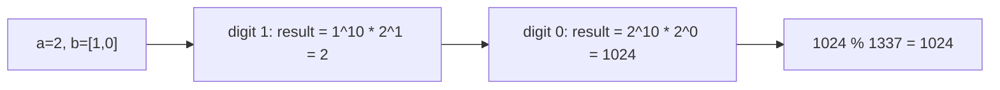

---
tags:
  - maths
  - number-theory
  - primes
  - gcd
  - modular-arithmetic
  - neetcode-150
---

# Maths

## What is this? (Simple Explanation)
Many coding problems are math problems in disguise. This topic covers the math tricks and formulas that show up again and again in interviews and competitive programming.

**Real-life analogies:**
- **GCD/LCM**: Finding the largest tile size that fits two rooms exactly
- **Prime numbers**: Building blocks of all numbers (like atoms for numbers)
- **Modulo arithmetic**: Clock arithmetic (13:00 = 1:00 on a 12-hour clock)
- **Digit manipulation**: Reading a number digit by digit like a phone number

## Key Concepts (In Simple Terms)
- **GCD (Greatest Common Divisor)**: The largest number that divides two numbers evenly. GCD(12, 8) = 4
- **LCM (Least Common Multiple)**: The smallest number that both numbers divide evenly. LCM(4, 6) = 12
- **Prime Number**: A number > 1 with only two divisors: 1 and itself. 2, 3, 5, 7, 11, ...
- **Composite**: A number with more than two divisors. 4, 6, 8, 9, ...
- **Modulo (%)**: Remainder after division. 17 % 5 = 2
- **Modular Arithmetic**: Math where numbers "wrap around" at a modulus (like a clock)
- **Fast Exponentiation**: Computing base^exp quickly (O(log exp) instead of O(exp))
- **Digital Root**: Summing digits until one remains. root(38) = 3+8 = 11 -> 1+1 = 2

## Common Problems
- Sieve of Eratosthenes (prime sieve)
- Modular Exponentiation (fast power)
- GCD and LCM calculations
- Prime factorization
- Digit operations
- Happy Number
- Ugly Number
- Excel Sheet Column Number
- Factorial Trailing Zeroes
- Integer to English Words
- Super Power

## Patterns / Techniques
- **Euclidean Algorithm**: Fast GCD using repeated modulo
- **Sieve of Eratosthenes**: Mark all primes up to n
- **Fast Exponentiation**: Binary exponentiation for base^exp % mod
- **Digit DP**: Dynamic programming on digits
- **Modular Arithmetic**: Keep numbers small with modulo

## Key Formulas (Cheat Sheet)
| Formula | Meaning |
|---------|---------|
| `gcd(a, b) = gcd(b, a % b)` | Euclidean algorithm |
| `lcm(a, b) = a * b / gcd(a, b)` | Relationship |
| `(a + b) % m = ((a % m) + (b % m)) % m` | Modular addition |
| `(a * b) % m = ((a % m) * (b % m)) % m` | Modular multiplication |
| `(a - b) % m = ((a % m) - (b % m) + m) % m` | Modular subtraction |
| `root(n) = 1 + (n - 1) % 9` (for n > 0) | Digital root |
| `trailingZeros(n!) = floor(n/5) + floor(n/25) + ...` | Count 5s |
| `base^exp % mod` via binary | Fast exponentiation |

---

## 🔹 Basic Templates

### GCD (Euclidean Algorithm)
```java
public int gcd(int a, int b) {
    while (b != 0) {
        int temp = b;
        b = a % b;
        a = temp;
    }
    return a;
}

// Recursive version
public int gcdRecursive(int a, int b) {
    return b == 0 ? a : gcdRecursive(b, a % b);
}
```

### LCM
```java
public int lcm(int a, int b) {
    return a / gcd(a, b) * b;  // Divide first to avoid overflow
}
```

### Fast Exponentiation (Modular)
```java
public long power(long base, long exp, long mod) {
    long result = 1;
    base %= mod;
    while (exp > 0) {
        if (exp % 2 == 1) {
            result = (result * base) % mod;
        }
        base = (base * base) % mod;
        exp /= 2;
    }
    return result;
}
```

### Prime Check (sqrt method)
```java
public boolean isPrime(int n) {
    if (n < 2) return false;
    for (int i = 2; i * i <= n; i++) {
        if (n % i == 0) return false;
    }
    return true;
}
```

### Maths Decision Flow


---

## 🔹 Practice Problems by Topic

### Easy

#### 1. **Count Primes**

**Problem Description:**
Given an integer n, count the number of prime numbers strictly less than n.

**Simple Analogy:**
Like finding all the "special" numbers up to n. Instead of checking each one individually (slow), we use a clever marking system.

**Example Walkthrough:**

Input: `n = 10`
```
Expected Output: 4 (primes less than 10: 2, 3, 5, 7)

Sieve of Eratosthenes:
Step 1: Mark all numbers 2..9 as potentially prime
        [F, F, T, T, T, T, T, T, T, T]  (index 0,1 are false)
        Actually: isPrime[2]=true, isPrime[3]=true, ..., isPrime[9]=true

Step 2: Start with i=2 (prime)
        Mark multiples of 2 starting from 4: 4, 6, 8 -> false
        [F, F, T, T, F, T, F, T, F, T]

Step 3: i=3 (still prime)
        Mark multiples of 3 starting from 9: 9 -> false
        [F, F, T, T, F, T, F, T, F, F]

Step 4: i=4 (not prime, skip)
        i=5 (5*5=25 > 10, stop)

Step 5: Count primes: 2, 3, 5, 7 -> 4

Return 4
```

Input: `n = 2`
```
Expected Output: 0 (no primes less than 2)
```

Input: `n = 20`
```
Expected Output: 8 (primes: 2, 3, 5, 7, 11, 13, 17, 19)
```

**Key Insight - Mark Multiples, Not Check Each:**
Instead of checking each number individually (O(n√n)), we start with 2 and mark all its multiples as non-prime. Then 3, then 5, etc. Each remaining unmarked number is prime.

**Why It Works:**
- Every composite number has a prime factor <= √n
- When we process prime i, all smaller primes have already marked their multiples
- So if isPrime[i] is still true, i must be prime
- We start marking from i*i because smaller multiples were marked by smaller primes
- Total work: O(n log log n) — very fast

**Visualization - Sieve of Eratosthenes:**


```java
public int countPrimes(int n) {
    if (n < 2) return 0;
    boolean[] isPrime = new boolean[n];
    for (int i = 2; i < n; i++) {
        isPrime[i] = true;
    }
    for (int i = 2; i * i < n; i++) {
        if (isPrime[i]) {
            for (int j = i * i; j < n; j += i) {
                isPrime[j] = false;
            }
        }
    }
    int count = 0;
    for (boolean prime : isPrime) {
        if (prime) count++;
    }
    return count;
}
```

**Edge Cases:**
- n = 0 or 1: returns 0
- n = 2: returns 0 (no primes less than 2)
- n = 3: returns 1 (only 2)
- Large n: sieve is efficient

**Time Complexity**: O(n log log n)
**Space Complexity**: O(n)

**Similar Pattern Problems:**
- Prime Factorization
- Smallest Prime Factor
- Count Primes in Range

---

#### 2. **Happy Number**

**Problem Description:**
A happy number is defined by: starting with any positive integer, replace it by the sum of the squares of its digits. Repeat until the number equals 1 (happy) or loops endlessly in a cycle (not happy).

**Simple Analogy:**
Like a digital chain reaction. Each number's digits are squared and summed. If you reach 1, you're happy. If you loop, you're not.

**Example Walkthrough:**

Input: `n = 19`
```
Expected Output: true

19 -> 1^2 + 9^2 = 1 + 81 = 82
82 -> 8^2 + 2^2 = 64 + 4 = 68
68 -> 6^2 + 8^2 = 36 + 64 = 100
100 -> 1^2 + 0^2 + 0^2 = 1
Reached 1 -> HAPPY!
```

Input: `n = 2`
```
Expected Output: false

2 -> 4
4 -> 16
16 -> 1 + 36 = 37
37 -> 9 + 49 = 58
58 -> 25 + 64 = 89
89 -> 64 + 64 = 128
128 -> 1 + 4 + 64 = 69
69 -> 36 + 81 = 117
117 -> 1 + 1 + 49 = 51
51 -> 25 + 1 = 26
26 -> 4 + 36 = 40
40 -> 16 + 0 = 16  <- We've seen 16 before! CYCLE!
Not happy -> return false
```

Input: `n = 1`
```
Expected Output: true (already 1)
```

Input: `n = 7`
```
Expected Output: true

7 -> 49 -> 97 -> 130 -> 10 -> 1
HAPPY!
```

**Key Insight - Cycle Detection:**
The process either reaches 1 or enters a cycle. We use a HashSet to track seen numbers. If we see a number again, we're in a cycle (not happy). If we reach 1, we're happy.

**Why It Works:**
- Every number eventually reaches 1 or enters a cycle
- HashSet detects the cycle
- No infinite loop possible
- This is like Floyd's cycle detection but with a set

**Visualization - Happy Number:**


```java
public boolean isHappy(int n) {
    HashSet<Integer> seen = new HashSet<>();
    while (n != 1 && !seen.contains(n)) {
        seen.add(n);
        int sum = 0;
        while (n > 0) {
            int digit = n % 10;
            sum += digit * digit;
            n /= 10;
        }
        n = sum;
    }
    return n == 1;
}
```

**Edge Cases:**
- n = 1: returns true
- n = 0: not a positive integer (problem guarantees positive)
- n = 2, 3, 4, 5, 6: all unhappy
- n = 7: happy

**Time Complexity**: O(log n) — number of digits
**Space Complexity**: O(log n) — for the set

**Similar Pattern Problems:**
- Digit Cycle Detection
- Sum of Digits
- Linked List Cycle (Floyd's)

---

#### 3. **Ugly Number**

**Problem Description:**
An ugly number is a positive integer whose prime factors are only 2, 3, and 5. Given an integer n, return true if n is ugly.

**Simple Analogy:**
Like checking if a number is made only from "building blocks" 2, 3, and 5. If any other prime sneaks in, it's not ugly.

**Example Walkthrough:**

Input: `n = 6`
```
Expected Output: true

6 = 2 * 3
Only factors are 2 and 3 -> ugly

Divide by 2: 6/2 = 3
Divide by 3: 3/3 = 1
Result is 1 -> true
```

Input: `n = 8`
```
Expected Output: true

8 = 2 * 2 * 2
Only factor is 2 -> ugly

8/2=4, 4/2=2, 2/2=1
Result 1 -> true
```

Input: `n = 14`
```
Expected Output: false

14 = 2 * 7
Factor 7 is not 2, 3, or 5 -> not ugly

14/2 = 7
7 is not divisible by 2, 3, or 5
7 != 1 -> false
```

Input: `n = 1`
```
Expected Output: true (1 has no prime factors, considered ugly)
```

Input: `n = 0`
```
Expected Output: false (not positive)
```

**Key Insight - Divide Out All 2s, 3s, 5s:**
Repeatedly divide n by 2, 3, and 5 as long as it's divisible. If we end up with 1, the original number had only these prime factors. If anything else remains, it's not ugly.

**Why It Works:**
- Any number with only prime factors 2, 3, 5 can be reduced to 1 by dividing these out
- If a different prime factor exists, it can't be divided out
- Order doesn't matter (commutative)
- This is prime factorization in disguise

**Visualization - Ugly Number:**


```java
public boolean isUgly(int n) {
    if (n <= 0) return false;
    while (n % 2 == 0) n /= 2;
    while (n % 3 == 0) n /= 3;
    while (n % 5 == 0) n /= 5;
    return n == 1;
}
```

**Edge Cases:**
- n = 0: returns false (not positive)
- n = 1: returns true (no prime factors)
- n negative: returns false
- n = 2, 3, 5: returns true

**Time Complexity**: O(log n) — number of divisions
**Space Complexity**: O(1)

**Similar Pattern Problems:**
- Ugly Number II (find nth ugly number)
- Super Ugly Number
- Prime Factorization

---

### Medium

#### 4. **Power of Three**

**Problem Description:**
Given an integer n, return true if it is a power of three.

**Simple Analogy:**
Like checking if a number can be repeatedly divided by 3 to reach 1.

**Example Walkthrough:**

Input: `n = 27`
```
Expected Output: true

27 / 3 = 9
9 / 3 = 3
3 / 3 = 1
Reached 1 -> true
```

Input: `n = 0`
```
Expected Output: false (0 is not a power of 3)
```

Input: `n = 45`
```
Expected Output: false

45 / 3 = 15
15 / 3 = 5
5 % 3 != 0, 5 != 1
Not a power of 3 -> false
```

Input: `n = 1`
```
Expected Output: true (3^0 = 1)
```

**Key Insight - Divide by 3 Until Not Divisible:**
Repeatedly divide n by 3 as long as it's divisible. If we end up with 1, it's a power of 3. Otherwise, it's not.

**Why It Works:**
- Any power of 3 can be reduced to 1 by dividing by 3
- Any non-power will have a remainder or reach a number not divisible by 3
- Order doesn't matter
- Simple and O(log n)

**Visualization - Power of Three:**


```java
public boolean isPowerOfThree(int n) {
    if (n <= 0) return false;
    while (n % 3 == 0) {
        n /= 3;
    }
    return n == 1;
}
```

**Edge Cases:**
- n = 0: returns false
- n = 1: returns true (3^0 = 1)
- n negative: returns false
- n = 3: returns true

**Time Complexity**: O(log n)
**Space Complexity**: O(1)

**Similar Pattern Problems:**
- Power of Two
- Power of Four
- Power of K

---

#### 5. **Excel Sheet Column Number**

**Problem Description:**
Given a column title as it appears in Excel (A, B, ..., Z, AA, AB, ..., ZZ, AAA, ...), return its corresponding column number.

**Simple Analogy:**
Like a base-26 number system, but instead of digits 0-25, we use letters A-Z representing 1-26.

**Example Walkthrough:**

Input: `columnTitle = "A"`
```
Expected Output: 1

result = 0 * 26 + (A - A + 1) = 1
Return 1
```

Input: `columnTitle = "AB"`
```
Expected Output: 28

Step 1: 'A' -> result = 0 * 26 + 1 = 1
Step 2: 'B' -> result = 1 * 26 + 2 = 28
Return 28
```

Input: `columnTitle = "ZY"`
```
Expected Output: 701

Step 1: 'Z' -> result = 0 * 26 + 26 = 26
Step 2: 'Y' -> result = 26 * 26 + 25 = 676 + 25 = 701
Return 701
```

Input: `columnTitle = "ZZZ"`
```
Expected Output: 18278

Z=26, Z=26, Z=26
result = 0
result = 0*26 + 26 = 26
result = 26*26 + 26 = 702
result = 702*26 + 26 = 18252 + 26 = 18278
Return 18278
```

**Key Insight - Base-26 Conversion:**
It's just like converting a base-26 number to decimal, except digits are 1-26 (not 0-25). Process characters left to right: result = result * 26 + (char - 'A' + 1).

**Why It Works:**
- Each character position represents a power of 26
- 'A' = 1, 'B' = 2, ..., 'Z' = 26
- Building left to right: shift existing value by one base-26 digit
- This is the same as converting any base to decimal

**Visualization - Excel Column:**


```java
public int titleToNumber(String columnTitle) {
    int result = 0;
    for (char c : columnTitle.toCharArray()) {
        result = result * 26 + (c - 'A' + 1);
    }
    return result;
}
```

**Edge Cases:**
- Single character: returns its position
- All Zs: returns large number
- "A": returns 1
- Empty string: not valid (problem guarantees non-empty)

**Time Complexity**: O(n) — n = string length
**Space Complexity**: O(1)

**Similar Pattern Problems:**
- Excel Sheet Column Title (reverse)
- Number to Excel
- Base Conversion

---

#### 6. **Add Digits**

**Problem Description:**
Given an integer num, repeatedly add all its digits until the result has only one digit. Return that digit.

**Simple Analogy:**
Like reducing a number to its "digital root." Example: 38 -> 3+8=11 -> 1+1=2.

**Example Walkthrough:**

Input: `num = 38`
```
Expected Output: 2

38 -> 3 + 8 = 11
11 -> 1 + 1 = 2
Return 2
```

Input: `num = 0`
```
Expected Output: 0
```

Input: `num = 9`
```
Expected Output: 9 (already single digit)
```

Input: `num = 12345`
```
Expected Output: 6

1+2+3+4+5 = 15
1+5 = 6
Return 6
```

**Key Insight - Digital Root Formula:**
The digital root of a number (for n > 0) is `1 + (n - 1) % 9`. This is a mathematical property: every number is congruent to its digit sum modulo 9.

**Why It Works:**
- Modulo 9, a number equals its digit sum
- Example: 38 mod 9 = 2, and 3+8=11, 1+1=2 ✓
- Special case: multiples of 9 have digital root 9, not 0
- Formula `1 + (n-1) % 9` handles this: n=9 -> 1+8%9=9, n=18 -> 1+17%9=9
- For n=0, return 0

**Visualization - Add Digits:**


```java
public int addDigits(int num) {
    while (num >= 10) {
        int sum = 0;
        while (num > 0) {
            sum += num % 10;
            num /= 10;
        }
        num = sum;
    }
    return num;
}

// Or one-liner formula:
// return num == 0 ? 0 : 1 + (num - 1) % 9;
```

**Edge Cases:**
- num = 0: returns 0
- num single digit: returns it
- num = 9: returns 9 (not 0)
- num = 18: returns 9

**Time Complexity**: O(log n) for loop, O(1) for formula
**Space Complexity**: O(1)

**Similar Pattern Problems:**
- Sum of Digits
- Digital Root Variants
- Repeated Digit Sum

---

#### 7. **Factorial Trailing Zeroes**

**Problem Description:**
Given an integer n, return the number of trailing zeroes in n! (n factorial).

**Simple Analogy:**
Trailing zeroes come from pairs of 2 and 5. Since there are always more 2s than 5s, we just count the 5s.

**Example Walkthrough:**

Input: `n = 5`
```
Expected Output: 1

5! = 120 -> one trailing zero

Count 5s: floor(5/5) = 1
Return 1
```

Input: `n = 10`
```
Expected Output: 2

10! = 3628800 -> two trailing zeros

floor(10/5) = 2
Return 2
```

Input: `n = 25`
```
Expected Output: 6

25! has 6 trailing zeros

floor(25/5) = 5
floor(25/25) = 1
Total = 6

Why 25? Because 25 = 5*5, contributing two 5s.
```

Input: `n = 100`
```
Expected Output: 24

floor(100/5) = 20
floor(100/25) = 4
floor(100/125) = 0
Total = 24
```

**Key Insight - Count Factors of 5:**
Trailing zeroes = number of times 10 divides n! = min(count of 2s, count of 5s). Since 2s are more abundant, just count 5s. Count = floor(n/5) + floor(n/25) + floor(n/125) + ...

**Why It Works:**
- 10 = 2 × 5
- Each pair of 2 and 5 creates a trailing zero
- Multiples of 5 contribute one 5 each
- Multiples of 25 contribute an extra 5
- Multiples of 125 contribute yet another 5
- So sum up floor(n/5), floor(n/25), floor(n/125), ...

**Visualization - Trailing Zeroes:**


```java
public int trailingZeroes(int n) {
    int count = 0;
    while (n > 0) {
        n /= 5;
        count += n;
    }
    return count;
}
```

**Edge Cases:**
- n = 0: returns 0
- n < 5: returns 0
- n = 5: returns 1
- Large n: use long for intermediate

**Time Complexity**: O(log n) — base 5
**Space Complexity**: O(1)

**Similar Pattern Problems:**
- Trailing Zeroes in Product
- Prime Factorization Count
- Count Factors

---

### Hard

#### 8. **Integer to English Words**

**Problem Description:**
Convert a non-negative integer to its English words representation.

**Simple Analogy:**
Like reading a number out loud in English. Break it into groups of three digits (ones, thousands, millions, billions).

**Example Walkthrough:**

Input: `num = 123`
```
Expected Output: "One Hundred Twenty Three"

123 -> "One Hundred" + "Twenty Three"
```

Input: `num = 12345`
```
Expected Output: "Twelve Thousand Three Hundred Forty Five"

12345 = 12 thousand + 345
= "Twelve Thousand" + "Three Hundred Forty Five"
```

Input: `num = 1234567`
```
Expected Output: "One Million Two Hundred Thirty Four Thousand Five Hundred Sixty Seven"

1234567 = 1 million + 234 thousand + 567
= "One Million" + "Two Hundred Thirty Four Thousand" + "Five Hundred Sixty Seven"
```

Input: `num = 0`
```
Expected Output: "Zero"
```

**Key Insight - Group by Thousands:**
Break the number into groups of 3 digits: ones, thousands, millions, billions. Convert each group to words, then append the scale word.

**Why It Works:**
- English numbers are structured in groups of 3 digits
- 1-19 have unique names
- 20-99 are tens + ones
- 100-999 are digit + "Hundred" + rest
- Each group gets a scale suffix (Thousand, Million, Billion)
- Combining these handles any number up to billions

**Visualization - Number to Words:**

```mermaid
graph TD
    A["1234567"] --> B["Group: 1 | 234 | 567"]
    B --> C["1 Million"]
    B --> D["234 Thousand"]
    B --> E["567"]
    C --> F["Combine: One Million Two Hundred Thirty Four Thousand Five Hundred Sixty Seven"]
    D --> F
    E --> F
```


```java
public String numberToWords(int num) {
    if (num == 0) return "Zero";
    String[] thousands = {"", "Thousand", "Million", "Billion"};
    String[] ones = {"", "One", "Two", "Three", "Four", "Five", "Six", "Seven", "Eight", "Nine"};
    String[] teens = {"Ten", "Eleven", "Twelve", "Thirteen", "Fourteen", "Fifteen",
                      "Sixteen", "Seventeen", "Eighteen", "Nineteen"};
    String[] tens = {"", "", "Twenty", "Thirty", "Forty", "Fifty", "Sixty", "Seventy", "Eighty", "Ninety"};
    List<String> result = new ArrayList<>();
    int groupIndex = 0;
    while (num > 0) {
        if (num % 1000 != 0) {
            result.add(0, convertHundred(num % 1000, ones, teens, tens) + thousands[groupIndex]);
        }
        num /= 1000;
        groupIndex++;
    }
    return String.join(" ", result).trim();
}

private String convertHundred(int num, String[] ones, String[] teens, String[] tens) {
    List<String> words = new ArrayList<>();
    if (num == 0) return "";
    if (num / 100 > 0) {
        words.add(ones[num / 100]);
        words.add("Hundred");
    }
    if (num % 100 >= 10 && num % 100 < 20) {
        words.add(teens[num % 100 - 10]);
    } else {
        if (num % 100 / 10 > 0) {
            words.add(tens[num % 100 / 10]);
        }
        if (num % 10 > 0) {
            words.add(ones[num % 10]);
        }
    }
    return String.join(" ", words);
}
```

**Edge Cases:**
- num = 0: returns "Zero"
- num = 100: returns "One Hundred"
- num = 1000000: returns "One Million"
- num with internal zeros: handled correctly

**Time Complexity**: O(1) — max 10 digits
**Space Complexity**: O(1)

**Similar Pattern Problems:**
- Roman to Integer
- Integer to Roman
- Number to Words (other languages)

---

#### 9. **Super Power**

**Problem Description:**
Calculate a^b mod 1337 where a is a positive integer and b is an extremely large positive integer given as an array of digits.

**Simple Analogy:**
Like computing a huge power on a clock with 1337 positions. We only care about where the hand lands, not how many full rotations.

**Example Walkthrough:**

Input: `a = 2`, `b = [3]`
```
Expected Output: 8

2^3 = 8, 8 % 1337 = 8
```

Input: `a = 2`, `b = [1, 0]`
```
Expected Output: 1024

2^10 = 1024, 1024 % 1337 = 1024
```

Input: `a = 1`, `b = [4, 3, 3, 8, 5, 2]`
```
Expected Output: 1

1^anything = 1
```

Input: `a = 2147483647`, `b = [2, 0, 0]`
```
Expected Output: 1198

2147483647^200 mod 1337
Process digits from left:
result = 1
digit 2: result = power(1, 10) * power(2147483647, 2) % 1337
...
```

**Key Insight - Process Digits Left to Right:**
Instead of computing the huge exponent directly, process the exponent digit by digit. For each new digit d:
`result = (result^10 * a^d) % mod`

**Why It Works:**
- If exponent = [d1, d2, d3], then exponent = d1*100 + d2*10 + d3
- a^(d1*100 + d2*10 + d3) = (a^100)^d1 * (a^10)^d2 * a^d3
- Processing left to right: `result = result^10 * a^digit`
- Modulo after each step keeps numbers small
- Fast exponentiation computes a^digit in O(log digit)

**Visualization - Super Power:**


```java
public int superPower(int base, int[] exponent) {
    int mod = 1337;
    int result = 1;
    for (int digit : exponent) {
        result = power(result, 10, mod);
        result = (result * power(base, digit, mod)) % mod;
    }
    return result;
}

private int power(int base, int exp, int mod) {
    int result = 1;
    base %= mod;
    while (exp > 0) {
        if (exp % 2 == 1) {
            result = (result * base) % mod;
        }
        base = (base * base) % mod;
        exp /= 2;
    }
    return result;
}
```

**Edge Cases:**
- a = 1: returns 1
- b = [0]: returns 1 (anything^0 = 1)
- Large a: base %= mod handles it
- Large b: processed digit by digit

**Time Complexity**: O(n) where n = number of digits
**Space Complexity**: O(1)

**Similar Pattern Problems:**
- Fast Exponentiation
- Modular Arithmetic
- Pow(x, n)

---

## 📌 Key Patterns & Techniques

### 1. **Sieve of Eratosthenes**
- Mark multiples of primes as non-prime
- Efficient for prime range queries
- Time: O(n log log n)
- Space: O(n)
- Examples: Count Primes, Prime Factorization

### 2. **Modular Arithmetic**
- `(a + b) % m = ((a % m) + (b % m)) % m`
- `(a * b) % m = ((a % m) * (b % m)) % m`
- `(a - b) % m = ((a % m) - (b % m) + m) % m`
- Use for preventing overflow in large calculations
- Examples: Super Power, Fast Exponentiation

### 3. **Fast Exponentiation**
- Compute `base^exp % mod` in O(log exp)
- Binary exponentiation: square base, halve exp
- Examples: Pow(x,n), Super Power

### 4. **Digit Manipulation**
- Extract last digit: `num % 10`
- Remove last digit: `num / 10`
- Process from right to left (or reverse string)
- Examples: Add Digits, Happy Number, Excel Column

### 5. **GCD (Euclidean Algorithm)**
- `gcd(a, b) = gcd(b, a % b)`
- Base case: `gcd(a, 0) = a`
- Time: O(log min(a, b))
- Examples: Fraction simplification, LCM

---

## 🎯 Common Pitfalls to Avoid

- Integer overflow in multiplication (use long)
- Not handling edge cases (0, 1, negative numbers)
- Inefficient prime checking (O(n) instead of O(√n))
- Wrong modulo application order (apply mod after each operation)
- Off-by-one in digit counting
- Forgetting that `a % b` can be negative in some languages
- Using `int` when `long` is needed for intermediate results
- Not handling special cases in digital root (multiples of 9)
- Forgetting that 1 is not a prime number
- Using `i * i <= n` instead of `i <= sqrt(n)` (same, but watch for overflow)