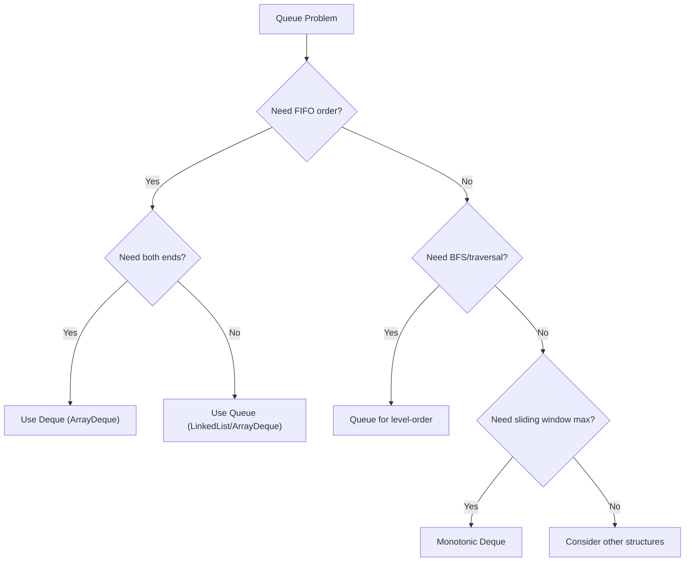
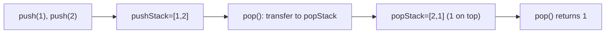
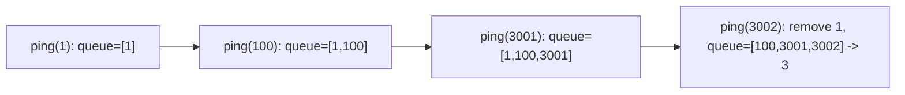
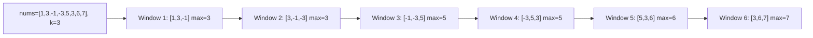
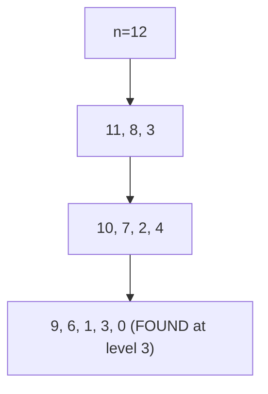
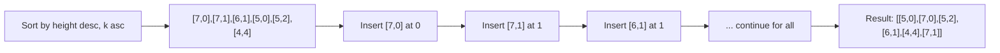
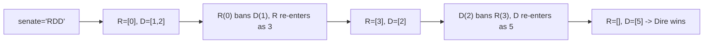

---
tags:
  - queue
  - deque
  - bfs
  - monotonic-queue
  - neetcode-150
---

# Queue

## What is a Queue? (Simple Explanation)
Imagine a line at a coffee shop. The first person in line gets served first, and new people join at the back. That's a **queue**!

A queue is a "First In, First Out" (FIFO) data structure:
- **Enqueue**: Add to the back (join the line)
- **Dequeue**: Remove from the front (get served)
- **Peek**: Look at the front without removing

**Real-life analogies:**
- Line at a ticket counter
- Printer queue (documents print in order)
- Customer service call queue
- BFS in graphs (explore level by level)

## Key Concepts (In Simple Terms)
- **FIFO**: First In, First Out — the first element added is the first removed
- **Front**: The exit point (where we remove)
- **Rear/Back**: The entry point (where we add)
- **Enqueue**: Add an element to the rear — O(1)
- **Dequeue**: Remove an element from the front — O(1)
- **Peek**: Look at the front element without removing — O(1)
- **Time Complexity**: O(1) for enqueue/dequeue/peek
- **Space Complexity**: O(n) for n elements

## Queue vs Stack (Quick Comparison)
| Feature | Queue | Stack |
|---------|-------|-------|
| Order | FIFO (First In First Out) | LIFO (Last In First Out) |
| Add | At rear | At top |
| Remove | From front | From top |
| Analogy | Line at store | Stack of plates |

## Variants (Different Types)
- **Simple Queue**: Basic FIFO, no size limit (or fixed)
- **Circular Queue**: Uses fixed array efficiently by wrapping around
- **Deque (Double-Ended Queue)**: Can add/remove from BOTH ends
- **Priority Queue**: Elements have priorities; highest priority served first

## Common Problems
- Implement Queue using Stacks
- Number of Recent Calls
- Sliding Window Maximum
- Perfect Squares (BFS)
- Reconstruct Queue by Height
- Dota2 Senate
- Design Circular Queue
- BFS in Graphs/Trees

## Patterns / Techniques
- **Two Stacks for Queue**: Simulate queue behavior with two stacks
- **Deque (Double-Ended Queue)**: Flexibility to add/remove from both ends
- **Level-order Traversal (BFS)**: Queue stores nodes to visit
- **Monotonic Queue**: Maintain increasing/decreasing order for sliding window

---

## 🔹 Basic Templates

### Queue Using Java's LinkedList
```java
Queue<Integer> queue = new LinkedList<>();
queue.offer(1);        // Enqueue (add to rear)
queue.offer(2);
int front = queue.peek();  // Peek front (returns 1)
int removed = queue.poll(); // Dequeue (removes 1)
boolean empty = queue.isEmpty();
```

### Queue Using ArrayDeque (Faster)
```java
Queue<Integer> queue = new ArrayDeque<>();
queue.offer(1);
queue.offer(2);
int front = queue.peek();
int removed = queue.poll();
```

### Deque (Double-Ended Queue)
```java
Deque<Integer> deque = new ArrayDeque<>();
deque.offerFirst(1);  // Add to front
deque.offerLast(2);   // Add to rear
deque.peekFirst();    // Look at front
deque.peekLast();     // Look at rear
deque.pollFirst();    // Remove from front
deque.pollLast();     // Remove from rear
```

### BFS Template
```java
public void bfs(Node start) {
    Queue<Node> queue = new LinkedList<>();
    Set<Node> visited = new HashSet<>();
    queue.offer(start);
    visited.add(start);
    while (!queue.isEmpty()) {
        Node curr = queue.poll();
        // Process curr
        for (Node neighbor : curr.neighbors) {
            if (!visited.contains(neighbor)) {
                visited.add(neighbor);
                queue.offer(neighbor);
            }
        }
    }
}
```

### Queue Decision Flow


---

## 🔹 Practice Problems by Topic

### Easy

#### 1. **Implement Queue using Stacks**

**Problem Description:**
Implement a FIFO queue using only two stacks. Support push, pop, peek, and empty.

**Simple Analogy:**
Like moving items between two piles. When you need to serve, flip the pile so the oldest item is on top.

**Example Walkthrough:**

Input:
```
MyQueue queue = new MyQueue();
queue.push(1);
queue.push(2);
queue.peek();  // returns 1
queue.pop();   // returns 1
queue.empty(); // returns false
```

**Step-by-step:**
```
Initial: pushStack=[], popStack=[]

push(1): pushStack=[1]
push(2): pushStack=[1, 2]

peek():
  popStack is empty -> transfer all from pushStack
  pushStack=[], popStack=[2, 1]  (1 is now on top)
  peek -> 1

pop():
  popStack=[2, 1] -> pop -> returns 1
  popStack=[2]

empty(): false (popStack has 2)
```

Input: `push(1), push(2), pop(), peek(), push(3), pop()`
```
push(1): pushStack=[1]
push(2): pushStack=[1,2]
pop():   transfer -> popStack=[2,1], pop -> 1, popStack=[2]
peek():  popStack=[2], peek -> 2
push(3): pushStack=[3]
pop():   popStack=[2], pop -> 2
```

**Key Insight - Two Stacks, Reversed:**
Stack1 (pushStack) is for adding new elements. Stack2 (popStack) is for removing. When popStack is empty, transfer all from pushStack to popStack — this reverses the order, so the oldest element ends up on top.

**Why It Works:**
- Stack reverses order (LIFO)
- Transferring from one stack to another reverses again
- Double reversal gives FIFO behavior
- Amortized O(1): each element transferred at most once
- If popStack has elements, just pop directly

**Visualization - Queue Using Stacks:**


```java
class MyQueue {
    private Stack<Integer> pushStack;
    private Stack<Integer> popStack;
    public MyQueue() {
        pushStack = new Stack<>();
        popStack = new Stack<>();
    }
    public void push(int x) {
        pushStack.push(x);
    }
    public int pop() {
        if (popStack.isEmpty()) {
            while (!pushStack.isEmpty()) {
                popStack.push(pushStack.pop());
            }
        }
        return popStack.pop();
    }
    public int peek() {
        if (popStack.isEmpty()) {
            while (!pushStack.isEmpty()) {
                popStack.push(pushStack.pop());
            }
        }
        return popStack.peek();
    }
    public boolean empty() {
        return pushStack.isEmpty() && popStack.isEmpty();
    }
}
```

**Edge Cases:**
- Pop from empty: problem guarantees valid calls
- Multiple pops in a row: works (popStack stays populated)
- Push after pop: new elements go to pushStack
- Peek after pop: same transfer logic

**Time Complexity**: O(1) amortized per operation
**Space Complexity**: O(n)

**Similar Pattern Problems:**
- Implement Deque using Arrays
- Stack using Queues
- Min Stack

---

#### 2. **Number of Recent Calls**

**Problem Description:**
Design a class that counts how many calls were made in the last 3000 milliseconds (including current). Each call comes with a timestamp t.

**Simple Analogy:**
Like a "recent activity" counter. When a new request arrives, count how many requests are within the last 3 seconds.

**Example Walkthrough:**

Input:
```
RecentCounter counter = new RecentCounter();
counter.ping(1);     // returns 1 (only [1])
counter.ping(100);   // returns 2 ([1, 100])
counter.ping(3001);  // returns 3 ([1, 100, 3001])
counter.ping(3002);  // returns 3 ([100, 3001, 3002] — 1 is too old)
```

**Step-by-step:**
```
ping(1): queue=[1], oldest=1, 1 >= 1-3000? Yes -> size=1
ping(100): queue=[1,100], oldest=1 >= -2900? Yes -> size=2
ping(3001): queue=[1,100,3001], oldest=1 >= 1? Yes -> size=3
            Wait, 1 >= 3001-3000=1? Yes -> keep
            Actually 1 is exactly at the boundary, keep
ping(3002): queue=[1,100,3001,3002], remove 1 (1 < 2) -> queue=[100,3001,3002]
            Return 3
```

Input: `ping(1), ping(2), ping(3), ping(3001)`
```
ping(1): [1] -> 1
ping(2): [1,2] -> 2
ping(3): [1,2,3] -> 3
ping(3001): add 3001, remove 1 (1 < 1)? No, 1 >= 1, keep
            queue=[1,2,3,3001] -> size=4
```

**Key Insight - Sliding Window with Queue:**
Maintain a queue of timestamps. When a new ping arrives, add it to the rear. Remove timestamps from the front that are older than t - 3000. The queue size is the answer.

**Why It Works:**
- Timestamps are increasing (guaranteed by problem)
- So the oldest timestamp is always at the front
- We only need to remove from the front (FIFO)
- All timestamps in the queue are within [t-3000, t]
- Queue size = number of recent calls

**Visualization - Recent Calls:**


```java
class RecentCounter {
    private Queue<Integer> queue;
    public RecentCounter() {
        queue = new LinkedList<>();
    }
    public int ping(int t) {
        queue.offer(t);
        while (!queue.isEmpty() && queue.peek() < t - 3000) {
            queue.poll();
        }
        return queue.size();
    }
}
```

**Edge Cases:**
- First ping: queue size 1
- Multiple pings at same timestamp: all counted
- Exactly 3000 ms apart: counted (boundary inclusive)
- Very large gap: old pings removed

**Time Complexity**: O(1) amortized per ping
**Space Complexity**: O(n) where n = number of pings in window

**Similar Pattern Problems:**
- Last N Orders
- Expiring Map
- Sliding Window Count

---

### Medium

#### 3. **Sliding Window Maximum**

**Problem Description:**
Given an array and a window size k, find the maximum value in each window as it slides from left to right.

**Simple Analogy:**
Like a security camera with a fixed-width view that slides across a scene. At each position, what's the tallest thing visible?

**Example Walkthrough:**

Input: `nums = [1,3,-1,-3,5,3,6,7]`, `k = 3`
```
Expected Output: [3,3,5,5,6,7]

Windows:
[1,3,-1] -> max=3
[3,-1,-3] -> max=3
[-1,-3,5] -> max=5
[-3,5,3] -> max=5
[5,3,6] -> max=6
[3,6,7] -> max=7

Deque (stores indices, decreasing by value):
i=0 (1): deque=[0]
i=1 (3): pop 0 (1<3), deque=[1]
i=2 (-1): deque=[1,2], window complete -> max=nums[1]=3
i=3 (-3): deque=[1,2,3], window complete -> max=nums[1]=3
         Wait, index 1 is at 1, window starts at 3-3+1=1, so keep
         Actually i=3, window=[1,2,3], start=1, index 1 is valid
i=4 (5): pop 3(-3), 2(-1), 1(3) -> deque=[4], window start=2
         max=nums[4]=5
i=5 (3): deque=[4,5], window start=3, max=nums[4]=5
i=6 (6): pop 5(3), 4(5) -> deque=[6], window start=4
         max=nums[6]=6
i=7 (7): pop 6(6) -> deque=[7], window start=5
         max=nums[7]=7

Result: [3,3,5,5,6,7]
```

Input: `nums = [1]`, `k = 1`
```
Expected Output: [1]
```

Input: `nums = [1,-1]`, `k = 1`
```
Expected Output: [1,-1]
```

**Key Insight - Monotonic Deque:**
Maintain a deque of indices where values are in decreasing order. The front of the deque is always the maximum of the current window. Before adding a new element, remove from the back any smaller elements (they can never be the max). Remove from the front any indices outside the window.

**Why It Works:**
- A smaller element behind a larger element can never be the max
- So we can safely discard smaller elements
- The deque maintains decreasing order of values
- Front is always the maximum of current window
- Each element added/removed at most once → O(n) total

**Visualization - Sliding Window Maximum:**


```java
public int[] maxSlidingWindow(int[] nums, int k) {
    int n = nums.length;
    int[] result = new int[n - k + 1];
    Deque<Integer> deque = new LinkedList<>();
    for (int i = 0; i < n; i++) {
        while (!deque.isEmpty() && deque.peekFirst() < i - k + 1) {
            deque.pollFirst();
        }
        while (!deque.isEmpty() && nums[deque.peekLast()] < nums[i]) {
            deque.pollLast();
        }
        deque.offerLast(i);
        if (i >= k - 1) {
            result[i - k + 1] = nums[deque.peekFirst()];
        }
    }
    return result;
}
```

**Edge Cases:**
- k = 1: every element is its own max
- k = n: single window, max of whole array
- All decreasing: deque grows to size k
- All increasing: deque size stays 1

**Time Complexity**: O(n) — each element added/removed once
**Space Complexity**: O(k) — deque size

**Similar Pattern Problems:**
- Maximum of Minimum Subarrays
- Max Consecutive Ones
- Shortest Subarray with Sum at Least K

---

#### 4. **Perfect Squares**

**Problem Description:**
Given a positive integer n, find the minimum number of perfect squares (1, 4, 9, 16, ...) that sum to n.

**Simple Analogy:**
Like making change for n using only square-number coins. What's the minimum number of coins?

**Example Walkthrough:**

Input: `n = 12`
```
Expected Output: 3 (12 = 4 + 4 + 4)

BFS approach:
Level 0: 12
Level 1: 12-1=11, 12-4=8, 12-9=3
Level 2: from 11: 10, 7, 2; from 8: 7, 4; from 3: 2
Level 3: from 2: 1; from 4: 3, 0 <- found!

12 -> 8 -> 4 -> 0 (3 steps)
Return 3
```

Input: `n = 13`
```
Expected Output: 2 (13 = 4 + 9)

BFS:
Level 0: 13
Level 1: 12, 9, 4
Level 2: from 9: 8, 5, 0 <- found!

13 -> 9 -> 0 (2 steps)
Return 2
```

Input: `n = 1`
```
Expected Output: 1 (1 = 1)
```

Input: `n = 4`
```
Expected Output: 1 (4 = 4)
```

**Key Insight - BFS on Numbers:**
Think of each number as a node. From number x, you can go to x - 1, x - 4, x - 9, ... (subtracting a perfect square). BFS finds the shortest path from n to 0.

**Why It Works:**
- Each edge represents subtracting a perfect square
- BFS explores all numbers reachable in k steps before k+1
- So first time we reach 0, we've used the minimum steps
- Visited set prevents revisiting (infinite loops)
- This is shortest path in an unweighted graph

**Visualization - Perfect Squares BFS:**


```java
public int numSquares(int n) {
    Queue<int[]> queue = new LinkedList<>();
    HashSet<Integer> visited = new HashSet<>();
    queue.offer(new int[]{n, 0});
    visited.add(n);
    while (!queue.isEmpty()) {
        int[] curr = queue.poll();
        int num = curr[0], steps = curr[1];
        if (num == 0) return steps;
        for (int i = 1; i * i <= num; i++) {
            int next = num - i * i;
            if (!visited.contains(next)) {
                visited.add(next);
                queue.offer(new int[]{next, steps + 1});
            }
        }
    }
    return -1;
}
```

**Edge Cases:**
- n = 0: returns 0 (no squares needed)
- n = 1: returns 1
- n perfect square: returns 1
- Large n: BFS still efficient with visited set

**Time Complexity**: O(n * √n)
**Space Complexity**: O(n)

**Similar Pattern Problems:**
- Minimum Path Sum
- Word Ladder
- Coin Change

---

#### 5. **Reconstruct Queue by Height**

**Problem Description:**
Given people with heights and k values (number of people in front with height >= current), reconstruct the queue.

**Simple Analogy:**
Like arranging people in a line based on "how many taller people are in front of me."

**Example Walkthrough:**

Input: `people = [[7,0],[4,4],[7,1],[5,0],[6,1],[5,2]]`
```
Expected Output: [[5,0],[7,0],[5,2],[6,1],[4,4],[7,1]]

Step 1: Sort by height descending, then k ascending
[[7,0],[7,1],[6,1],[5,0],[5,2],[4,4]]

Step 2: Insert each person at index k
Insert [7,0] at 0: [[7,0]]
Insert [7,1] at 1: [[7,0],[7,1]]
Insert [6,1] at 1: [[7,0],[6,1],[7,1]]
Insert [5,0] at 0: [[5,0],[7,0],[6,1],[7,1]]
Insert [5,2] at 2: [[5,0],[7,0],[5,2],[6,1],[7,1]]
Insert [4,4] at 4: [[5,0],[7,0],[5,2],[6,1],[4,4],[7,1]]

Result: [[5,0],[7,0],[5,2],[6,1],[4,4],[7,1]]
```

Input: `people = [[6,0],[5,0],[4,0],[3,2],[2,2],[1,4]]`
```
Expected Output: [[4,0],[5,0],[2,2],[3,2],[1,4],[6,0]]

Sorted: [[6,0],[5,0],[4,0],[3,2],[2,2],[1,4]]
Insert:
[6,0] at 0: [[6,0]]
[5,0] at 0: [[5,0],[6,0]]
[4,0] at 0: [[4,0],[5,0],[6,0]]
[3,2] at 2: [[4,0],[5,0],[3,2],[6,0]]
[2,2] at 2: [[4,0],[5,0],[2,2],[3,2],[6,0]]
[1,4] at 4: [[4,0],[5,0],[2,2],[3,2],[1,4],[6,0]]
```

**Key Insight - Process Tallest First:**
Sort by height descending, then k ascending. Insert each person at position k. Since taller people are already placed, the k value correctly represents how many taller people should be in front.

**Why It Works:**
- Tallest people are placed first; they don't care about shorter people
- When inserting a shorter person, all currently placed people are taller or equal
- So inserting at index k guarantees exactly k taller people in front
- This is greedy: process in order of decreasing height
- LinkedList gives O(1) insertion at position

**Visualization - Reconstruct Queue:**


```java
public int[][] reconstructQueue(int[][] people) {
    Arrays.sort(people, (a, b) ->
        a[0] == b[0] ? a[1] - b[1] : b[0] - a[0]
    );
    List<int[]> result = new LinkedList<>();
    for (int[] person : people) {
        result.add(person[1], person);
    }
    return result.toArray(new int[result.size()][]);
}
```

**Edge Cases:**
- Single person: returns as-is
- All same height: sort by k, insert in order
- All different heights: works correctly
- k = 0 for all: tallest first

**Time Complexity**: O(n²) — LinkedList insertion
**Space Complexity**: O(n)

**Similar Pattern Problems:**
- Create Sorted Array
- Process Queue by Conditions
- Height Sorting

---

### Hard

#### 6. **Dota2 Senate**

**Problem Description:**
In a senate, each senator belongs to Radiant (R) or Dire (D). They vote in rounds. Each senator can ban one opponent from voting. The party with the last remaining senator wins. Predict the winner.

**Simple Analogy:**
Like a political game where each senator can eliminate one opponent. Last party standing wins.

**Example Walkthrough:**

Input: `senate = "RD"`
```
Expected Output: "Radiant"

Queue: R=[0], D=[1]

Round 1: R at 0 vs D at 1
0 < 1, so R bans D (D's index 1 > R's index 0)
R stays in queue with index 0+2=2
D is removed

D is empty -> Radiant wins
```

Input: `senate = "RDD"`
```
Expected Output: "Dire"

Queue: R=[0], D=[1,2]

Round 1: R at 0 vs D at 1
0 < 1, R bans D (index 1)
R goes to back with index 0+3=3
D=[2]

Now R at 3 vs D at 2
2 < 3, D bans R (index 3)
D goes to back with index 2+3=5
R is removed

R empty -> Dire wins
```

Input: `senate = "RRDDD"`
```
Expected Output: "Radiant"

Queue: R=[0,1], D=[2,3,4]

Round 1:
R=0 bans D=2, R=0+5=5
R=1 bans D=3, R=1+5=6
D=4 bans R=5, D=4+5=9
R=6 vs D=9: R bans D

R remaining -> Radiant wins
```

**Key Insight - Queue with Re-entry:**
Use two queues: one for Radiant, one for Dire, storing indices. At each step, compare the front indices. The smaller index senator bans the other (since they vote first). The winner goes to the back of their queue with index + n (to represent next round).

**Why It Works:**
- Senators vote in order of their original indices
- A senator with a smaller index votes before a larger one
- So they can ban the opponent before being banned
- Adding n to the index represents going to the next round
- Compare indices to determine who votes first
- Loop until one party has no senators

**Visualization - Dota2 Senate:**


```java
public String predictPartyVictory(String senate) {
    Queue<Integer> radiant = new LinkedList<>();
    Queue<Integer> dire = new LinkedList<>();
    for (int i = 0; i < senate.length(); i++) {
        if (senate.charAt(i) == 'R') {
            radiant.offer(i);
        } else {
            dire.offer(i);
        }
    }
    while (!radiant.isEmpty() && !dire.isEmpty()) {
        int rIndex = radiant.poll();
        int dIndex = dire.poll();
        if (rIndex > dIndex) {
            radiant.offer(rIndex + senate.length());
        } else {
            dire.offer(dIndex + senate.length());
        }
    }
    return radiant.isEmpty() ? "Dire" : "Radiant";
}
```

**Edge Cases:**
- All same party: that party wins immediately
- Alternating R and D: depends on order
- Single senator: that party wins
- Equal numbers: first senator's party likely wins

**Time Complexity**: O(n) — each senator processed at most once per round
**Space Complexity**: O(n)

**Similar Pattern Problems:**
- Robot Returning to Origin
- Process Requests
- Task Scheduler

---

## 📌 Key Patterns & Techniques

### 1. **Two Stack Queue**
- Use two stacks to simulate queue behavior
- Enqueue pushes to stack1
- Dequeue transfers to stack2 if needed
- Amortized O(1) per operation
- Examples: Implement Queue using Stacks

### 2. **Deque (Double-Ended Queue)**
- Add/remove from both ends
- Used for: Sliding window, monotonic queue
- Java: `ArrayDeque` is faster than `LinkedList`
- Examples: Sliding Window Maximum

### 3. **BFS (Breadth-First Search)**
- Queue stores nodes to visit
- Explores level by level
- Used for: Shortest path, level-order traversal
- Examples: Perfect Squares, Word Ladder

### 4. **Monotonic Queue**
- Maintain specific order in deque
- Front is always max/min of window
- Used for: Sliding window max/min
- Examples: Sliding Window Maximum

### 5. **Queue with Re-entry**
- Elements can re-enter the queue
- Use index manipulation to track rounds
- Examples: Dota2 Senate

---

## 🎯 Common Pitfalls to Avoid

- Forgetting to check if queue is empty before peek/poll
- Confusing queue implementation (array vs linked list)
- Not maintaining proper deque invariants (monotonic order)
- Off-by-one errors in window tracking (`i - k + 1` vs `i - k`)
- Inefficient operations (avoid removals from middle)
- Using Stack instead of Queue for BFS (wrong order)
- Not using `ArrayDeque` for better performance
- Forgetting to mark visited in BFS (infinite loop)
- Modifying queue while iterating without using iterator
- Assuming FIFO when the problem needs priority order