---
tags:
  - string
  - hashing
  - sliding-window
  - two-pointers
  - palindrome
  - neetcode-150
---

# String

## What is a String? (Simple Explanation)
A string is just a sequence of characters — like a word, a sentence, or a whole book. In programming, strings are everywhere: names, messages, DNA sequences, URLs, code itself.

**Real-life analogies:**
- A string is like a necklace of beads, where each bead is a character
- A palindrome is like a mirror — "racecar" reads the same forward and backward
- An anagram is like rearranging Scrabble tiles — "listen" and "silent" use the same letters

**Important in Java:** Strings are **immutable** — once created, they can't be changed. Every "modification" actually creates a new string. For heavy modifications, use `StringBuilder`.

## Key Concepts (In Simple Terms)
- **Immutable**: Strings can't be changed after creation (Java)
- **StringBuilder**: A mutable (changeable) version for efficient building
- **Character Array**: `char[]` gives O(1) access and is mutable
- **Indexing**: `s.charAt(i)` gives the character at position i — O(1)
- **Substring**: `s.substring(i, j)` gives characters from i to j-1 — O(j-i)
- **Length**: `s.length()` — O(1)
- **Comparison**: Use `.equals()` not `==` (== compares references)

## String vs StringBuilder vs char[]
| Feature | String | StringBuilder | char[] |
|---------|--------|---------------|--------|
| Mutable? | No | Yes | Yes |
| Thread-safe? | Yes | No | No |
| Performance | Slow for changes | Fast for changes | Fastest |
| Use case | Fixed text | Building/modifying | Low-level ops |

## Common Problems
- Valid Anagram
- Valid Palindrome
- Reverse String
- First Unique Character
- Longest Substring Without Repeating Characters
- Longest Palindromic Substring
- Group Anagrams
- Edit Distance
- Minimum Window Substring
- Regular Expression Matching

## Patterns / Techniques
- **Sliding Window**: For substrings with constraints
- **Two Pointers**: For palindromes and reversals
- **Hashing**: Character frequency for anagrams
- **Dynamic Programming**: Edit distance, palindrome counting
- **Expand Around Center**: Palindrome detection

## Key Complexity Cheat Sheet
| Operation | Time | Notes |
|-----------|------|-------|
| `charAt(i)` | O(1) | Direct access |
| `length()` | O(1) | Stored internally |
| `substring(i,j)` | O(j-i) | Creates new string |
| `equals()` | O(n) | Character by character |
| `indexOf()` | O(n*m) | Naive search |
| Concatenation `+` | O(n+m) | Creates new string |
| StringBuilder append | O(1) amortized | Much faster |

---

## 🔹 Basic Templates

### Character Frequency Array (Lowercase)
```java
int[] count = new int[26];
for (char c : s.toCharArray()) {
    count[c - 'a']++;
}
// count[0] = number of 'a's, count[1] = number of 'b's, etc.
```

### Character Frequency Map (General)
```java
Map<Character, Integer> freq = new HashMap<>();
for (char c : s.toCharArray()) {
    freq.put(c, freq.getOrDefault(c, 0) + 1);
}
```

### Two Pointers (Palindrome)
```java
int left = 0, right = s.length() - 1;
while (left < right) {
    // Compare s.charAt(left) and s.charAt(right)
    left++;
    right--;
}
```

### Sliding Window (Substring)
```java
int left = 0;
for (int right = 0; right < s.length(); right++) {
    // Add s.charAt(right) to window
    while (windowInvalid()) {
        // Remove s.charAt(left) from window
        left++;
    }
    // Update answer
}
```

### StringBuilder Usage
```java
StringBuilder sb = new StringBuilder();
sb.append("hello");
sb.append(' ');
sb.append("world");
sb.insert(0, ">> ");
sb.reverse();
String result = sb.toString();
```

### String Decision Flow
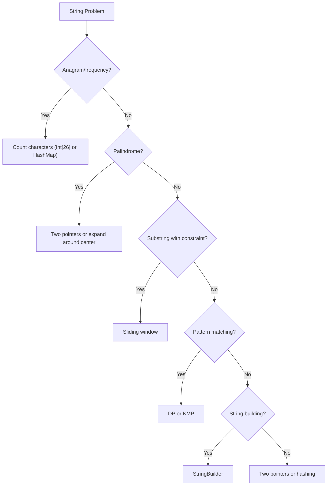

---

## 🔹 Practice Problems by Topic

### Easy

#### 1. **Valid Anagram**

**Problem Description:**
Given two strings s and t, return true if t is an anagram of s. An anagram uses exactly the same characters with the same frequencies.

**Simple Analogy:**
Like rearranging Scrabble tiles. "listen" and "silent" use the same letters.

**Example Walkthrough:**

Input: `s = "anagram"`, `t = "nagaram"`
```
Expected Output: true

Sort both:
s sorted: "aaagmnr"
t sorted: "aaagmnr"
Equal -> true

Or count frequencies:
s: a=3, n=1, g=1, r=1, m=1
t: n=1, a=3, g=1, r=1, m=1
Same counts -> true
```

Input: `s = "rat"`, `t = "car"`
```
Expected Output: false

s: r=1, a=1, t=1
t: c=1, a=1, r=1
Different (t vs c) -> false
```

Input: `s = "a"`, `t = "a"`
```
Expected Output: true
```

Input: `s = "ab"`, `t = "a"`
```
Expected Output: false (different lengths)
```

**Key Insight - Same Characters, Same Counts:**
Two strings are anagrams if and only if they have the same length and the same character frequencies. Either sort both and compare, or count frequencies.

**Why It Works:**
- Sorting groups identical characters together
- If sorted strings are equal, they have same characters
- Alternatively, frequency counting directly compares counts
- Frequency counting is O(n) vs sorting O(n log n)

**Visualization - Valid Anagram:**
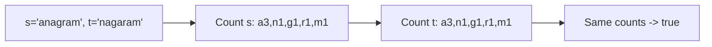

```java
public boolean isAnagram(String s, String t) {
    if (s.length() != t.length()) return false;
    int[] count = new int[26];
    for (int i = 0; i < s.length(); i++) {
        count[s.charAt(i) - 'a']++;
        count[t.charAt(i) - 'a']--;
    }
    for (int c : count) {
        if (c != 0) return false;
    }
    return true;
}
```

**Edge Cases:**
- Different lengths: returns false immediately
- Empty strings: returns true (both empty)
- Same characters different order: returns true
- Same length different chars: returns false

**Time Complexity**: O(n)
**Space Complexity**: O(1) — 26-element array

**Similar Pattern Problems:**
- Group Anagrams
- Find All Anagrams in a String
- Permutation in String

---

#### 2. **Implement strStr() - Find Substring**

**Problem Description:**
Given two strings haystack and needle, return the index of the first occurrence of needle in haystack, or -1 if not found.

**Simple Analogy:**
Like finding a word in a book using Ctrl+F.

**Example Walkthrough:**

Input: `haystack = "hello"`, `needle = "ll"`
```
Expected Output: 2

h e l l o
0 1 2 3 4

Check i=0: "he" vs "ll"? No
Check i=1: "el" vs "ll"? No
Check i=2: "ll" vs "ll"? Yes! Return 2
```

Input: `haystack = "aaaaa"`, `needle = "bba"`
```
Expected Output: -1

No occurrence of "bba"
```

Input: `haystack = ""`, `needle = ""`
```
Expected Output: 0 (empty needle found at start)
```

Input: `haystack = "abc"`, `needle = ""`
```
Expected Output: 0 (empty needle found at start)
```

**Key Insight - Check Every Position:**
For each position i in haystack (from 0 to n-m), check if the substring of length m starting at i equals needle.

**Why It Works:**
- Needle can only start at positions 0 to n-m
- At each position, compare character by character
- If all match, return i
- If no position matches, return -1
- Naive approach O(n*m); KMP gives O(n+m)

**Visualization - strStr:**
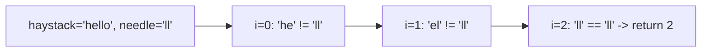

```java
public int strStr(String haystack, String needle) {
    if (needle.isEmpty()) return 0;
    for (int i = 0; i <= haystack.length() - needle.length(); i++) {
        if (haystack.substring(i, i + needle.length()).equals(needle)) {
            return i;
        }
    }
    return -1;
}
```

**Edge Cases:**
- Empty needle: returns 0
- Needle longer than haystack: returns -1
- Empty haystack: returns -1 (unless needle empty)
- Needle equals haystack: returns 0

**Time Complexity**: O(n*m) naive; O(n+m) with KMP
**Space Complexity**: O(1)

**Similar Pattern Problems:**
- Implement indexOf
- String Matching with Wildcards
- Repeated Substring Pattern

---

#### 3. **Reverse String**

**Problem Description:**
Write a function that reverses a string. The input string is given as a char array, and you must modify it in-place.

**Simple Analogy:**
Like flipping a word backward — "hello" becomes "olleh".

**Example Walkthrough:**

Input: `s = ['h','e','l','l','o']`
```
Expected Output: ['o','l','l','e','h']

left=0, right=4: swap h, o -> ['o','e','l','l','h']
left=1, right=3: swap e, l -> ['o','l','l','e','h']
left=2, right=2: stop (left >= right)
```

Input: `s = ['H','a','n','n','a','h']`
```
Expected Output: ['h','a','n','n','a','H']

left=0, right=5: swap H, h -> ['h','a','n','n','a','H']
left=1, right=4: swap a, a -> no change
left=2, right=3: swap n, n -> no change
Done
```

Input: `s = ['a']`
```
Expected Output: ['a'] (single char, nothing to swap)
```

**Key Insight - Two Pointers from Ends:**
Use two pointers, one at the start and one at the end. Swap characters, move pointers toward center, repeat until they meet.

**Why It Works:**
- Swapping symmetric positions reverses the string
- Each swap fixes two positions (left and right)
- When pointers meet or cross, all positions are fixed
- In-place, no extra space needed

**Visualization - Reverse String:**
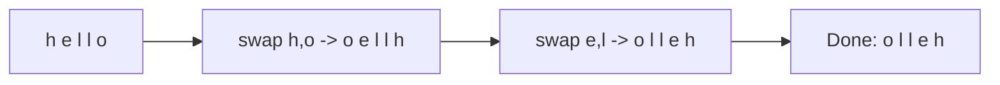

```java
public void reverseString(char[] s) {
    int left = 0, right = s.length - 1;
    while (left < right) {
        char temp = s[left];
        s[left] = s[right];
        s[right] = temp;
        left++;
        right--;
    }
}
```

**Edge Cases:**
- Empty array: nothing to do
- Single character: nothing to do
- Two characters: one swap
- Even/odd length: both work

**Time Complexity**: O(n)
**Space Complexity**: O(1)

**Similar Pattern Problems:**
- Reverse Words in a String
- Reverse Vowels of a String
- Reverse String II

---

#### 4. **First Unique Character in a String**

**Problem Description:**
Given a string s, find the first non-repeating character and return its index. If none exists, return -1.

**Simple Analogy:**
Like finding the first person in a crowd who's standing alone (no duplicate).

**Example Walkthrough:**

Input: `s = "leetcode"`
```
Expected Output: 0 ('l' appears once)

Count: l=1, e=3, t=1, c=1, o=1, d=1

Scan again:
i=0: 'l' count=1 -> return 0
```

Input: `s = "loveleetcode"`
```
Expected Output: 2 ('v' appears once)

Count: l=2, o=2, v=1, e=4, t=1, c=1, d=1

Scan:
i=0: 'l' count=2, skip
i=1: 'o' count=2, skip
i=2: 'v' count=1 -> return 2
```

Input: `s = "aabb"`
```
Expected Output: -1 (all characters repeat)

Count: a=2, b=2
No unique character -> return -1
```

**Key Insight - Two Passes:**
First pass: count frequencies of all characters. Second pass: scan in order and return the first character with count 1.

**Why It Works:**
- Need to know frequencies before deciding
- First pass builds the frequency map
- Second pass preserves original order
- First index with count 1 is the answer

**Visualization - First Unique Character:**
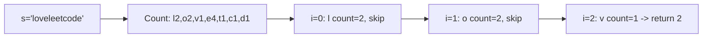

```java
public int firstUniqChar(String s) {
    int[] count = new int[26];
    for (char c : s.toCharArray()) {
        count[c - 'a']++;
    }
    for (int i = 0; i < s.length(); i++) {
        if (count[s.charAt(i) - 'a'] == 1) {
            return i;
        }
    }
    return -1;
}
```

**Edge Cases:**
- Empty string: returns -1
- Single character: returns 0
- All unique: returns 0
- All duplicates: returns -1

**Time Complexity**: O(n)
**Space Complexity**: O(1) — 26-element array

**Similar Pattern Problems:**
- First Unique Number
- First Missing Positive
- Find the Difference

---

#### 5. **Valid Palindrome**

**Problem Description:**
Given a string, determine if it's a palindrome considering only alphanumeric characters and ignoring case.

**Simple Analogy:**
Like checking if a sentence reads the same forward and backward, ignoring spaces and punctuation.

**Example Walkthrough:**

Input: `s = "A man, a plan, a canal: Panama"`
```
Expected Output: true

Remove non-alphanumeric, lowercase:
"amanaplanacanalpanama"
Read forward and backward: same -> true

Two pointers:
left=0 ('A'), right=29 ('a')
Skip non-alnum on both sides
Compare lowercase -> equal
Move inward, repeat
```

Input: `s = "race a car"`
```
Expected Output: false

Cleaned: "raceacar"
Reversed: "racaecar"
Not equal -> false

Two pointers:
left=0 ('r'), right=8 ('r') -> equal, move in
left=1 ('a'), right=7 ('a') -> equal, move in
left=2 ('c'), right=6 ('c') -> equal, move in
left=3 ('e'), right=5 ('a') -> NOT equal -> false
```

Input: `s = " "`
```
Expected Output: true (empty after cleaning)
```

**Key Insight - Two Pointers with Skipping:**
Use two pointers from both ends. Skip non-alphanumeric characters. Compare lowercase versions. If all match, it's a palindrome.

**Why It Works:**
- Only alphanumeric characters matter
- Case doesn't matter
- Two pointers check symmetric positions
- Skipping non-alnum avoids preprocessing
- O(n) time, O(1) space

**Visualization - Valid Palindrome:**
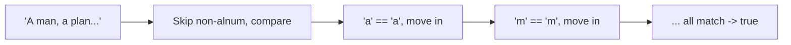

```java
public boolean isPalindrome(String s) {
    int left = 0, right = s.length() - 1;
    while (left < right) {
        while (left < right && !Character.isLetterOrDigit(s.charAt(left))) {
            left++;
        }
        while (left < right && !Character.isLetterOrDigit(s.charAt(right))) {
            right--;
        }
        if (Character.toLowerCase(s.charAt(left)) != Character.toLowerCase(s.charAt(right))) {
            return false;
        }
        left++;
        right--;
    }
    return true;
}
```

**Edge Cases:**
- Empty string: returns true
- Only non-alnum: returns true
- Single char: returns true
- Mixed case: handled by toLowerCase
- Numbers included: alphanumeric includes digits

**Time Complexity**: O(n)
**Space Complexity**: O(1)

**Similar Pattern Problems:**
- Valid Palindrome II (allow one deletion)
- Palindromic Substrings
- Palindrome Linked List

---

### Medium

#### 6. **Longest Substring Without Repeating Characters**

**Problem Description:**
Given a string s, find the length of the longest substring without repeating characters.

**Simple Analogy:**
Like reading a book and finding the longest stretch where no word repeats.

**Example Walkthrough:**

Input: `s = "abcabcbb"`
```
Expected Output: 3 ("abc")

right=0 ('a'): map={a:0}, maxLen=1
right=1 ('b'): map={a:0, b:1}, maxLen=2
right=2 ('c'): map={a:0, b:1, c:2}, maxLen=3
right=3 ('a'): 'a' at 0, left=max(0,0+1)=1
              map={a:3, b:1, c:2}, maxLen=max(3,3-1+1)=3
right=4 ('b'): 'b' at 1, left=max(1,1+1)=2
              map={a:3, b:4, c:2}, maxLen=max(3,4-2+1)=3
right=5 ('c'): 'c' at 2, left=max(2,2+1)=3
              map={a:3, b:4, c:5}, maxLen=max(3,5-3+1)=3
right=6 ('b'): 'b' at 4, left=max(3,4+1)=5
              map={a:3, b:6, c:5}, maxLen=max(3,6-5+1)=2
right=7 ('b'): 'b' at 6, left=max(5,6+1)=7
              map={a:3, b:7, c:5}, maxLen=max(3,7-7+1)=1

Return 3
```

Input: `s = "bbbbb"`
```
Expected Output: 1

right=0 ('b'): maxLen=1
right=1 ('b'): left=1, maxLen=1
...
Return 1
```

Input: `s = "pwwkew"`
```
Expected Output: 3 ("wke")

right=0 ('p'): maxLen=1
right=1 ('w'): maxLen=2
right=2 ('w'): 'w' at 1, left=2, maxLen=2
right=3 ('k'): maxLen=2
right=4 ('e'): maxLen=3
right=5 ('w'): 'w' at 2, left=max(2,2+1)=3, maxLen=3

Return 3
```

**Key Insight - Sliding Window with Last Index Map:**
Store the last index of each character. When we see a duplicate, jump the left pointer to (lastIndex + 1) if that's greater than current left. Track max window size.

**Why It Works:**
- Map tells us where we last saw each character
- When we see a duplicate, the window must start after the previous occurrence
- We take max of current left and lastIndex+1 (can't go backward)
- Window [left, right] always has unique characters
- Track max window size

**Visualization - Longest Substring:**
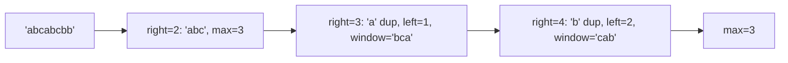

```java
public int lengthOfLongestSubstring(String s) {
    Map<Character, Integer> lastIndex = new HashMap<>();
    int left = 0, maxLen = 0;
    for (int right = 0; right < s.length(); right++) {
        char c = s.charAt(right);
        if (lastIndex.containsKey(c)) {
            left = Math.max(left, lastIndex.get(c) + 1);
        }
        lastIndex.put(c, right);
        maxLen = Math.max(maxLen, right - left + 1);
    }
    return maxLen;
}
```

**Edge Cases:**
- Empty string: returns 0
- All same characters: returns 1
- All distinct: returns n
- Single character: returns 1

**Time Complexity**: O(n)
**Space Complexity**: O(min(n, charset))

**Similar Pattern Problems:**
- Longest Repeating Character Replacement
- Substring with K Distinct Characters
- Fruit Into Baskets

---

#### 7. **Longest Palindromic Substring**

**Problem Description:**
Given a string s, return the longest palindromic substring.

**Simple Analogy:**
Like finding the longest mirror-like stretch in a word.

**Example Walkthrough:**

Input: `s = "babad"`
```
Expected Output: "bab" (or "aba")

Expand around each center:
i=0: odd "b" -> expand: left=-1, right=1 -> len=1
     even "ba" -> no match -> len=0
i=1: odd "a" -> expand: "bab" -> len=3
     even "ab" -> no match -> len=0
i=2: odd "b" -> expand: "aba" -> len=3
     even "ba" -> no match -> len=0
i=3: odd "a" -> expand: len=1
     even "ad" -> no match
i=4: odd "d" -> len=1

Max len=3, start=0 or 1
Return "bab" (or "aba")
```

Input: `s = "cbbd"`
```
Expected Output: "bb"

i=0: "c", len=1
i=1: "b", even "bb" -> len=2, odd "b" -> len=1
i=2: "b", even "bd" -> no
i=3: "d", len=1

Max = "bb"
```

Input: `s = "a"`
```
Expected Output: "a"
```

**Key Insight - Expand Around Center:**
Every palindrome has a center. For odd-length, center is a character. For even-length, center is between two characters. Expand outward from each center while characters match.

**Why It Works:**
- 2n-1 possible centers (n single chars, n-1 gaps)
- For each center, expand while palindrome
- Track the longest palindrome found
- O(n²) time, O(1) space
- Much simpler than DP approach

**Visualization - Longest Palindrome:**
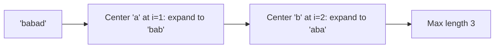

```java
public String longestPalindrome(String s) {
    if (s.length() < 2) return s;
    int maxLen = 0, start = 0;
    for (int i = 0; i < s.length(); i++) {
        int len1 = expandAroundCenter(s, i, i);
        int len2 = expandAroundCenter(s, i, i + 1);
        int len = Math.max(len1, len2);
        if (len > maxLen) {
            maxLen = len;
            start = i - (len - 1) / 2;
        }
    }
    return s.substring(start, start + maxLen);
}

private int expandAroundCenter(String s, int left, int right) {
    while (left >= 0 && right < s.length() && s.charAt(left) == s.charAt(right)) {
        left--;
        right++;
    }
    return right - left - 1;
}
```

**Edge Cases:**
- Single character: returns it
- Two same characters: returns both
- All same: returns whole string
- No palindrome > 1: returns first character

**Time Complexity**: O(n²)
**Space Complexity**: O(1)

**Similar Pattern Problems:**
- Palindromic Substrings (count)
- Longest Palindromic Subsequence
- Shortest Palindrome

---

#### 8. **Group Anagrams**

**Problem Description:**
Given an array of strings, group anagrams together.

**Simple Analogy:**
Like sorting Scrabble tiles into groups that can form the same word.

**Example Walkthrough:**

Input: `strs = ["eat","tea","tan","ate","nat","bat"]`
```
Expected Output: [["eat","tea","ate"],["tan","nat"],["bat"]]

Sort each string:
"eat" -> "aet"
"tea" -> "aet"
"tan" -> "ant"
"ate" -> "aet"
"nat" -> "ant"
"bat" -> "abt"

Group by sorted key:
"aet": ["eat", "tea", "ate"]
"ant": ["tan", "nat"]
"abt": ["bat"]
```

Input: `strs = [""]`
```
Expected Output: [[""]]
```

Input: `strs = ["a"]`
```
Expected Output: [["a"]]
```

**Key Insight - Sorted String as Key:**
Anagrams have the same characters, so sorting them gives the same string. Use this sorted string as a HashMap key to group anagrams.

**Why It Works:**
- Anagrams share the same sorted form
- HashMap groups strings by this canonical form
- All strings with same key are anagrams
- O(n * k log k) where k = max string length

**Visualization - Group Anagrams:**
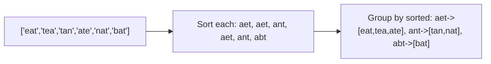

```java
public List<List<String>> groupAnagrams(String[] strs) {
    HashMap<String, List<String>> map = new HashMap<>();
    for (String str : strs) {
        char[] chars = str.toCharArray();
        Arrays.sort(chars);
        String sorted = new String(chars);
        map.putIfAbsent(sorted, new ArrayList<>());
        map.get(sorted).add(str);
    }
    return new ArrayList<>(map.values());
}
```

**Edge Cases:**
- Empty array: returns empty list
- Single string: returns single group
- All anagrams: returns one group
- No anagrams: each string own group

**Time Complexity**: O(n * k log k)
**Space Complexity**: O(n * k)

**Similar Pattern Problems:**
- Count Isomorphic Strings
- Word Patterns
- Find All Anagrams in a String

---

#### 9. **Edit Distance (Levenshtein Distance)**

**Problem Description:**
Given two strings word1 and word2, return the minimum number of operations (insert, delete, replace) to convert word1 to word2.

**Simple Analogy:**
Like fixing a typo with minimum keystrokes. How many edits to transform one word into another?

**Example Walkthrough:**

Input: `word1 = "horse"`, `word2 = "ros"`
```
Expected Output: 3

horse -> rorse (replace 'h' with 'r')
rorse -> rose (delete 'r')
rose -> ros (delete 'e')

DP table:
    ""  r  o  s
""   0  1  2  3
h    1  1  2  3
o    2  2  1  2
r    3  2  2  2
s    4  3  3  2
e    5  4  4  3

dp[5][3] = 3
```

Input: `word1 = "intention"`, `word2 = "execution"`
```
Expected Output: 5

intention -> inention (remove 't')
inention -> enention (replace 'i' with 'e')
enention -> exention (replace 'n' with 'x')
exention -> exection (replace 'n' with 'c')
exection -> execution (insert 'u')
```

Input: `word1 = ""`, `word2 = "abc"`
```
Expected Output: 3 (insert 3 chars)
```

Input: `word1 = "abc"`, `word2 = "abc"`
```
Expected Output: 0 (already equal)
```

**Key Insight - Three Operations:**
dp[i][j] = min operations to convert word1[0..i] to word2[0..j].
- If chars match: dp[i][j] = dp[i-1][j-1]
- If not: dp[i][j] = 1 + min(delete, insert, replace)

**Why It Works:**
- Optimal substructure: solution uses solutions of smaller prefixes
- Overlapping subproblems: many prefixes repeat
- Base cases: dp[i][0] = i (delete all), dp[0][j] = j (insert all)
- Each cell considers three operations
- O(m*n) time and space

**Visualization - Edit Distance:**
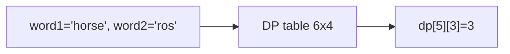

```java
public int minDistance(String word1, String word2) {
    int m = word1.length(), n = word2.length();
    int[][] dp = new int[m + 1][n + 1];
    for (int i = 0; i <= m; i++) dp[i][0] = i;
    for (int j = 0; j <= n; j++) dp[0][j] = j;
    for (int i = 1; i <= m; i++) {
        for (int j = 1; j <= n; j++) {
            if (word1.charAt(i - 1) == word2.charAt(j - 1)) {
                dp[i][j] = dp[i - 1][j - 1];
            } else {
                dp[i][j] = 1 + Math.min(dp[i - 1][j - 1],
                          Math.min(dp[i - 1][j], dp[i][j - 1]));
            }
        }
    }
    return dp[m][n];
}
```

**Edge Cases:**
- One empty: returns length of other
- Both empty: returns 0
- Identical: returns 0
- Completely different: returns max length

**Time Complexity**: O(m*n)
**Space Complexity**: O(m*n) — can optimize to O(min(m,n))

**Similar Pattern Problems:**
- Edit Distance II
- Minimum Window Substring
- Regular Expression Matching

---

#### 10. **Minimum Window Substring**

**Problem Description:**
Given strings s and t, find the minimum window substring of s that contains all characters of t (including duplicates).

**Simple Analogy:**
Like finding the smallest snippet of a newspaper containing all required words.

**Example Walkthrough:**

Input: `s = "ADOBECODEBANC"`, `t = "ABC"`
```
Expected Output: "BANC"

tCount = {A:1, B:1, C:1}, required=3

Expand right until all found:
"ADOBEC" -> all found, formed=3
Shrink left:
remove A -> "DOBEC" -> missing A, formed=2
Expand right until A again:
"DOBECODEBA" -> formed=3
Shrink:
remove D -> "OBECODEBA"
remove O -> "BECODEBA"
remove B -> "ECODEBA" -> missing B, formed=2
... continue
Final window "BANC" is minimum.
```

Input: `s = "a"`, `t = "a"`
```
Expected Output: "a"
```

Input: `s = "a"`, `t = "aa"`
```
Expected Output: "" (impossible)
```

Input: `s = "aa"`, `t = "aa"`
```
Expected Output: "aa"
```

**Key Insight - Expand Until Valid, Shrink While Valid:**
Expand right until window contains all of t. Then shrink left while still valid, tracking minimum length.

**Why It Works:**
- Need a window containing all characters of t
- Expand until valid (formed == required)
- Once valid, try to shrink to find smaller valid windows
- Track minimum valid window
- `formed` counts fully satisfied characters

**Visualization - Minimum Window:**
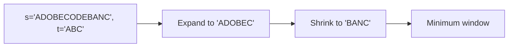

```java
public String minWindow(String s, String t) {
    if (t.isEmpty()) return "";
    HashMap<Character, Integer> needed = new HashMap<>();
    for (char c : t.toCharArray()) {
        needed.put(c, needed.getOrDefault(c, 0) + 1);
    }
    int formed = 0, left = 0, minLen = Integer.MAX_VALUE, minStart = 0;
    HashMap<Character, Integer> window = new HashMap<>();
    for (int right = 0; right < s.length(); right++) {
        char c = s.charAt(right);
        window.put(c, window.getOrDefault(c, 0) + 1);
        if (needed.containsKey(c) && window.get(c).equals(needed.get(c))) {
            formed++;
        }
        while (left <= right && formed == needed.size()) {
            if (right - left + 1 < minLen) {
                minLen = right - left + 1;
                minStart = left;
            }
            char leftChar = s.charAt(left);
            window.put(leftChar, window.get(leftChar) - 1);
            if (needed.containsKey(leftChar) && window.get(leftChar) < needed.get(leftChar)) {
                formed--;
            }
            left++;
        }
    }
    return minLen == Integer.MAX_VALUE ? "" : s.substring(minStart, minStart + minLen);
}
```

**Edge Cases:**
- t longer than s: returns ""
- t has chars not in s: returns ""
- Exact match: returns s
- Multiple valid windows: returns smallest

**Time Complexity**: O(m + n)
**Space Complexity**: O(charset)

**Similar Pattern Problems:**
- Permutation in String
- Anagrams in Array
- Smallest Range

---

### Hard

#### 11. **Regular Expression Matching**

**Problem Description:**
Implement regular expression matching with support for '.' (matches any single character) and '*' (matches zero or more of the preceding element).

**Simple Analogy:**
Like pattern matching in search/replace, but with wildcards.

**Example Walkthrough:**

Input: `s = "aa"`, `p = "a"`
```
Expected Output: false

"a" doesn't match "aa" (missing second a)
```

Input: `s = "aa"`, `p = "a*"`
```
Expected Output: true

"a*" means zero or more 'a's
"aa" matches (two a's)
```

Input: `s = "ab"`, `p = ".*"`
```
Expected Output: true

".*" means zero or more of any character
Matches any string
```

Input: `s = "aab"`, `p = "c*a*b"`
```
Expected Output: true

"c*" matches zero c's
"a*" matches two a's
"b" matches b
Total: "aab" matches
```

Input: `s = "mississippi"`, `p = "mis*is*p*."`
```
Expected Output: false
```

**Key Insight - DP on Two Strings:**
dp[i][j] = true if s[0..i-1] matches p[0..j-1].
- If p[j-1] is normal char or '.': match if s[i-1] matches p[j-1] and dp[i-1][j-1]
- If p[j-1] is '*': two cases:
  - Zero occurrences: dp[i][j-2]
  - One or more: match previous char and dp[i-1][j]

**Why It Works:**
- Build solution from smaller prefixes
- '*' has two interpretations (zero or more)
- '.' matches any character
- Base case: empty pattern matches empty string
- Handle '*' at start of pattern carefully

**Visualization - Regex Matching:**
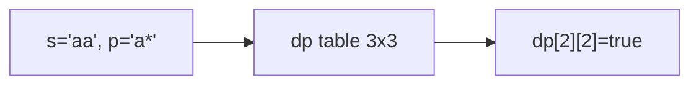

```java
public boolean isMatch(String s, String p) {
    int m = s.length(), n = p.length();
    boolean[][] dp = new boolean[m + 1][n + 1];
    dp[0][0] = true;
    for (int j = 1; j <= n; j++) {
        if (p.charAt(j - 1) == '*') {
            dp[0][j] = dp[0][j - 2];
        }
    }
    for (int i = 1; i <= m; i++) {
        for (int j = 1; j <= n; j++) {
            if (p.charAt(j - 1) == '*') {
                dp[i][j] = dp[i][j - 2] ||
                           (dp[i - 1][j] && (p.charAt(j - 2) == '.' || p.charAt(j - 2) == s.charAt(i - 1)));
            } else {
                dp[i][j] = dp[i - 1][j - 1] &&
                           (p.charAt(j - 1) == '.' || p.charAt(j - 1) == s.charAt(i - 1));
            }
        }
    }
    return dp[m][n];
}
```

**Edge Cases:**
- Empty pattern: matches empty string only
- Empty string: pattern must be all '*'
- ".*" pattern: matches anything
- Multiple '*': handled by DP

**Time Complexity**: O(m*n)
**Space Complexity**: O(m*n)

**Similar Pattern Problems:**
- Wildcard Matching
- Word Pattern Matching
- Glob Matching

---

## 📌 Key Patterns & Techniques

### 1. **Sliding Window**
- Maintain window of characters
- Expand/contract based on condition
- Used for: Substrings, character frequency
- Examples: Longest Substring Without Repeating

### 2. **Two Pointers**
- Start from opposite ends
- Move towards center
- Used for: Palindromes, validation, reversal
- Examples: Valid Palindrome, Reverse String

### 3. **Dynamic Programming**
- Build solution from smaller subproblems
- Used for: Edit distance, pattern matching
- Examples: Edit Distance, Regular Expression Matching

### 4. **Hashing (Frequency Counting)**
- Character frequency maps
- Canonical forms for anagrams
- Used for: Anagrams, duplicates, unique characters
- Examples: Valid Anagram, Group Anagrams

### 5. **Expand Around Center**
- For each possible center, expand outward
- Used for: Palindromic substrings
- Examples: Longest Palindromic Substring

---

## 🎯 Common Pitfalls to Avoid

- Not handling empty strings
- Case sensitivity issues (use toLowerCase)
- Not considering special characters (use isLetterOrDigit)
- String concatenation in loops (use StringBuilder)
- Inefficient string comparisons (use .equals, not ==)
- Forgetting that Strings are immutable in Java
- Not handling Unicode or multi-byte characters
- Off-by-one errors in substring indices (end is exclusive)
- Not considering all edge cases for regex ('*' at start)
- Using `charAt` when char array would be faster for repeated access