---
tags:
  - string
  - hashing
  - sliding-window
  - two-pointers
  - palindrome
  - neetcode-150
---

# String

## What is a String? (Simple Explanation)
A string is just a sequence of characters — like a word, a sentence, or a whole book. In programming, strings are everywhere: names, messages, DNA sequences, URLs, code itself.

**Real-life analogies:**

- A string is like a necklace of beads, where each bead is a character
- A palindrome is like a mirror — "racecar" reads the same forward and backward
- An anagram is like rearranging Scrabble tiles — "listen" and "silent" use the same letters

**Important in Java:** 

Strings are **immutable** — once created, they can't be changed. Every "modification" actually creates a new string. For heavy modifications, use `StringBuilder`.

## Key Concepts (In Simple Terms)
- **Immutable**: Strings can't be changed after creation (Java)
- **StringBuilder**: A mutable (changeable) version for efficient building
- **Character Array**: `char[]` gives O(1) access and is mutable
- **Indexing**: `s.charAt(i)` gives the character at position i — O(1)
- **Substring**: `s.substring(i, j)` gives characters from i to j-1 — O(j-i)
- **Length**: `s.length()` — O(1)
- **Comparison**: Use `.equals()` not `==` (== compares references)

## String vs StringBuilder vs char[]
| Feature | String | StringBuilder | char[] |
|---------|--------|---------------|--------|
| Mutable? | No | Yes | Yes |
| Thread-safe? | Yes | No | No |
| Performance | Slow for changes | Fast for changes | Fastest |
| Use case | Fixed text | Building/modifying | Low-level ops |

## Common Problems
- Valid Anagram
- Valid Palindrome
- Reverse String
- First Unique Character
- Longest Substring Without Repeating Characters
- Longest Palindromic Substring
- Group Anagrams
- Edit Distance
- Minimum Window Substring
- Regular Expression Matching

## Patterns / Techniques
- **Sliding Window**: For substrings with constraints
- **Two Pointers**: For palindromes and reversals
- **Hashing**: Character frequency for anagrams
- **Dynamic Programming**: Edit distance, palindrome counting
- **Expand Around Center**: Palindrome detection

## Key Complexity Cheat Sheet
| Operation | Time | Notes |
|-----------|------|-------|
| `charAt(i)` | O(1) | Direct access |
| `length()` | O(1) | Stored internally |
| `substring(i,j)` | O(j-i) | Creates new string |
| `equals()` | O(n) | Character by character |
| `indexOf()` | O(n*m) | Naive search |
| Concatenation `+` | O(n+m) | Creates new string |
| StringBuilder append | O(1) amortized | Much faster |

---

## 🔹 Basic Templates

### Character Frequency Array (Lowercase)
```java
int[] count = new int[26];
for (char c : s.toCharArray()) {
    count[c - 'a']++;
}
// count[0] = number of 'a's, count[1] = number of 'b's, etc.
```

### Character Frequency Map (General)
```java
Map<Character, Integer> freq = new HashMap<>();
for (char c : s.toCharArray()) {
    freq.put(c, freq.getOrDefault(c, 0) + 1);
}
```

### Two Pointers (Palindrome)
```java
int left = 0, right = s.length() - 1;
while (left < right) {
    // Compare s.charAt(left) and s.charAt(right)
    left++;
    right--;
}
```

### Sliding Window (Substring)
```java
int left = 0;
for (int right = 0; right < s.length(); right++) {
    // Add s.charAt(right) to window
    while (windowInvalid()) {
        // Remove s.charAt(left) from window
        left++;
    }
    // Update answer
}
```

### StringBuilder Usage
```java
StringBuilder sb = new StringBuilder();
sb.append("hello");
sb.append(' ');
sb.append("world");
sb.insert(0, ">> ");
sb.reverse();
String result = sb.toString();
```

### String Decision Flow
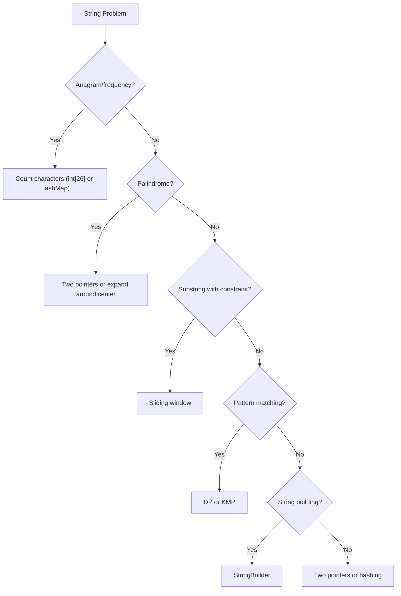
```mermaid
graph TD
    A["String Problem"] --> B{"Anagram/frequency?"}
    B -->|Yes| C["Count characters (int[26] or HashMap)"]
    B -->|No| D{"Palindrome?"}
    D -->|Yes| E["Two pointers or expand around center"]
    D -->|No| F{"Substring with constraint?"}
    F -->|Yes| G["Sliding window"]
    F -->|No| H{"Pattern matching?"}
    H -->|Yes| I["DP or KMP"]
    H -->|No| J{"String building?"}
    J -->|Yes| K["StringBuilder"]
    J -->|No| L["Two pointers or hashing"]
```

---

## 🔹 Practice Problems by Topic

### Easy

#### 1. **Valid Anagram**

**Problem Description:**
Given two strings s and t, return true if t is an anagram of s. An anagram uses exactly the same characters with the same frequencies.

**Simple Analogy:**
Like rearranging Scrabble tiles. "listen" and "silent" use the same letters.

**Example Walkthrough:**

Input: `s = "anagram"`, `t = "nagaram"`
```
Expected Output: true

Sort both:
s sorted: "aaagmnr"
t sorted: "aaagmnr"
Equal -> true

Or count frequencies:
s: a=3, n=1, g=1, r=1, m=1
t: n=1, a=3, g=1, r=1, m=1
Same counts -> true
```

Input: `s = "rat"`, `t = "car"`
```
Expected Output: false

s: r=1, a=1, t=1
t: c=1, a=1, r=1
Different (t vs c) -> false
```

Input: `s = "a"`, `t = "a"`
```
Expected Output: true
```

Input: `s = "ab"`, `t = "a"`
```
Expected Output: false (different lengths)
```

**Key Insight - Same Characters, Same Counts:**

Two strings are anagrams if and only if they have the same length and the same character frequencies. Either sort both and compare, or count frequencies.

**Why It Works:**

- Sorting groups identical characters together
- If sorted strings are equal, they have same characters
- Alternatively, frequency counting directly compares counts
- Frequency counting is O(n) vs sorting O(n log n)

**Visualization - Valid Anagram:**
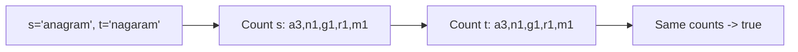
```mermaid
graph LR
    A["s='anagram', t='nagaram'"] --> B["Count s: a3,n1,g1,r1,m1"]
    B --> C["Count t: a3,n1,g1,r1,m1"]
    C --> D["Same counts -> true"]
```

```java
public boolean isAnagram(String s, String t) {
    if (s.length() != t.length()) return false;
    int[] count = new int[26];
    for (int i = 0; i < s.length(); i++) {
        count[s.charAt(i) - 'a']++;
        count[t.charAt(i) - 'a']--;
    }
    for (int c : count) {
        if (c != 0) return false;
    }
    return true;
}
```

**Edge Cases:**

- Different lengths: returns false immediately
- Empty strings: returns true (both empty)
- Same characters different order: returns true
- Same length different chars: returns false

**Time Complexity**: O(n)

**Space Complexity**: O(1) — 26-element array

**Similar Pattern Problems:**

- Group Anagrams
- Find All Anagrams in a String
- Permutation in String

---

#### 2. **Implement strStr() - Find Substring**

**Problem Description:**
Given two strings haystack and needle, return the index of the first occurrence of needle in haystack, or -1 if not found.

**Simple Analogy:**
Like finding a word in a book using Ctrl+F.

**Example Walkthrough:**

Input: `haystack = "hello"`, `needle = "ll"`
```
Expected Output: 2

h e l l o
0 1 2 3 4

Check i=0: "he" vs "ll"? No
Check i=1: "el" vs "ll"? No
Check i=2: "ll" vs "ll"? Yes! Return 2
```

Input: `haystack = "aaaaa"`, `needle = "bba"`
```
Expected Output: -1

No occurrence of "bba"
```

Input: `haystack = ""`, `needle = ""`
```
Expected Output: 0 (empty needle found at start)
```

Input: `haystack = "abc"`, `needle = ""`
```
Expected Output: 0 (empty needle found at start)
```

**Key Insight - Check Every Position:**

For each position i in haystack (from 0 to n-m), check if the substring of length m starting at i equals needle.

**Why It Works:**

- Needle can only start at positions 0 to n-m
- At each position, compare character by character
- If all match, return i
- If no position matches, return -1
- Naive approach O(n*m); KMP gives O(n+m)

**Visualization - strStr:**
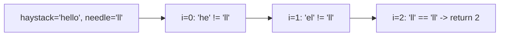
```mermaid
graph LR
    A["haystack='hello', needle='ll'"] --> B["i=0: 'he' != 'll'"]
    B --> C["i=1: 'el' != 'll'"]
    C --> D["i=2: 'll' == 'll' -> return 2"]
```

```java
public int strStr(String haystack, String needle) {
    if (needle.isEmpty()) return 0;
    for (int i = 0; i <= haystack.length() - needle.length(); i++) {
        if (haystack.substring(i, i + needle.length()).equals(needle)) {
            return i;
        }
    }
    return -1;
}
```

**Edge Cases:**

- Empty needle: returns 0
- Needle longer than haystack: returns -1
- Empty haystack: returns -1 (unless needle empty)
- Needle equals haystack: returns 0

**Time Complexity**: O(n*m) naive; O(n+m) with KMP

**Space Complexity**: O(1)

**Similar Pattern Problems:**

- Implement indexOf
- String Matching with Wildcards
- Repeated Substring Pattern

---

#### 3. **Reverse String**

**Problem Description:**
Write a function that reverses a string. The input string is given as a char array, and you must modify it in-place.

**Simple Analogy:**
Like flipping a word backward — "hello" becomes "olleh".

**Example Walkthrough:**

Input: `s = ['h','e','l','l','o']`
```
Expected Output: ['o','l','l','e','h']

left=0, right=4: swap h, o -> ['o','e','l','l','h']
left=1, right=3: swap e, l -> ['o','l','l','e','h']
left=2, right=2: stop (left >= right)
```

Input: `s = ['H','a','n','n','a','h']`
```
Expected Output: ['h','a','n','n','a','H']

left=0, right=5: swap H, h -> ['h','a','n','n','a','H']
left=1, right=4: swap a, a -> no change
left=2, right=3: swap n, n -> no change
Done
```

Input: `s = ['a']`
```
Expected Output: ['a'] (single char, nothing to swap)
```

**Key Insight - Two Pointers from Ends:**
Use two pointers, one at the start and one at the end. Swap characters, move pointers toward center, repeat until they meet.

**Why It Works:**

- Swapping symmetric positions reverses the string
- Each swap fixes two positions (left and right)
- When pointers meet or cross, all positions are fixed
- In-place, no extra space needed

**Visualization - Reverse String:**
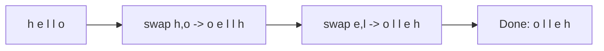
```mermaid
graph LR
    A["h e l l o"] --> B["swap h,o -> o e l l h"]
    B --> C["swap e,l -> o l l e h"]
    C --> D["Done: o l l e h"]
```

```java
public void reverseString(char[] s) {
    int left = 0, right = s.length - 1;
    while (left < right) {
        char temp = s[left];
        s[left] = s[right];
        s[right] = temp;
        left++;
        right--;
    }
}
```

**Edge Cases:**

- Empty array: nothing to do
- Single character: nothing to do
- Two characters: one swap
- Even/odd length: both work

**Time Complexity**: O(n)

**Space Complexity**: O(1)

**Similar Pattern Problems:**

- Reverse Words in a String
- Reverse Vowels of a String
- Reverse String II

---

#### 4. **First Unique Character in a String**

**Problem Description:**
Given a string s, find the first non-repeating character and return its index. If none exists, return -1.

**Simple Analogy:**
Like finding the first person in a crowd who's standing alone (no duplicate).

**Example Walkthrough:**

Input: `s = "leetcode"`
```
Expected Output: 0 ('l' appears once)

Count: l=1, e=3, t=1, c=1, o=1, d=1

Scan again:
i=0: 'l' count=1 -> return 0
```

Input: `s = "loveleetcode"`
```
Expected Output: 2 ('v' appears once)

Count: l=2, o=2, v=1, e=4, t=1, c=1, d=1

Scan:
i=0: 'l' count=2, skip
i=1: 'o' count=2, skip
i=2: 'v' count=1 -> return 2
```

Input: `s = "aabb"`
```
Expected Output: -1 (all characters repeat)

Count: a=2, b=2
No unique character -> return -1
```

**Key Insight - Two Passes:**
First pass: count frequencies of all characters. Second pass: scan in order and return the first character with count 1.

**Why It Works:**

- Need to know frequencies before deciding
- First pass builds the frequency map
- Second pass preserves original order
- First index with count 1 is the answer

**Visualization - First Unique Character:**
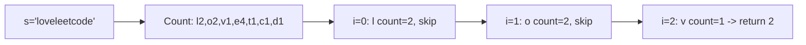
```mermaid
graph LR
    A["s='loveleetcode'"] --> B["Count: l2,o2,v1,e4,t1,c1,d1"]
    B --> C["i=0: l count=2, skip"]
    C --> D["i=1: o count=2, skip"]
    D --> E["i=2: v count=1 -> return 2"]
```

```java
public int firstUniqChar(String s) {
    int[] count = new int[26];
    for (char c : s.toCharArray()) {
        count[c - 'a']++;
    }
    for (int i = 0; i < s.length(); i++) {
        if (count[s.charAt(i) - 'a'] == 1) {
            return i;
        }
    }
    return -1;
}
```

**Edge Cases:**

- Empty string: returns -1
- Single character: returns 0
- All unique: returns 0
- All duplicates: returns -1

**Time Complexity**: O(n)

**Space Complexity**: O(1) — 26-element array

**Similar Pattern Problems:**

- First Unique Number
- First Missing Positive
- Find the Difference

---

#### 5. **Valid Palindrome**

**Problem Description:**
Given a string, determine if it's a palindrome considering only alphanumeric characters and ignoring case.

**Simple Analogy:**
Like checking if a sentence reads the same forward and backward, ignoring spaces and punctuation.

**Example Walkthrough:**

Input: `s = "A man, a plan, a canal: Panama"`
```
Expected Output: true

Remove non-alphanumeric, lowercase:
"amanaplanacanalpanama"
Read forward and backward: same -> true

Two pointers:
left=0 ('A'), right=29 ('a')
Skip non-alnum on both sides
Compare lowercase -> equal
Move inward, repeat
```

Input: `s = "race a car"`
```
Expected Output: false

Cleaned: "raceacar"
Reversed: "racaecar"
Not equal -> false

Two pointers:
left=0 ('r'), right=8 ('r') -> equal, move in
left=1 ('a'), right=7 ('a') -> equal, move in
left=2 ('c'), right=6 ('c') -> equal, move in
left=3 ('e'), right=5 ('a') -> NOT equal -> false
```

Input: `s = " "`
```
Expected Output: true (empty after cleaning)
```

**Key Insight - Two Pointers with Skipping:**
Use two pointers from both ends. Skip non-alphanumeric characters. Compare lowercase versions. If all match, it's a palindrome.

**Why It Works:**

- Only alphanumeric characters matter
- Case doesn't matter
- Two pointers check symmetric positions
- Skipping non-alnum avoids preprocessing
- O(n) time, O(1) space

**Visualization - Valid Palindrome:**
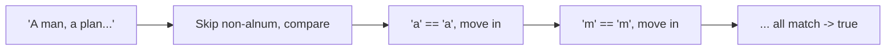
```mermaid
graph LR
    A["'A man, a plan...'"] --> B["Skip non-alnum, compare"]
    B --> C["'a' == 'a', move in"]
    C --> D["'m' == 'm', move in"]
    D --> E["... all match -> true"]
```

```java
public boolean isPalindrome(String s) {
    int left = 0, right = s.length() - 1;
    while (left < right) {
        while (left < right && !Character.isLetterOrDigit(s.charAt(left))) {
            left++;
        }
        while (left < right && !Character.isLetterOrDigit(s.charAt(right))) {
            right--;
        }
        if (Character.toLowerCase(s.charAt(left)) != Character.toLowerCase(s.charAt(right))) {
            return false;
        }
        left++;
        right--;
    }
    return true;
}
```

**Edge Cases:**

- Empty string: returns true
- Only non-alnum: returns true
- Single char: returns true
- Mixed case: handled by toLowerCase
- Numbers included: alphanumeric includes digits

**Time Complexity**: O(n)

**Space Complexity**: O(1)

**Similar Pattern Problems:**

- Valid Palindrome II (allow one deletion)
- Palindromic Substrings
- Palindrome Linked List

---

### Medium

#### 6. **Longest Substring Without Repeating Characters**

**Problem Description:**
Given a string s, find the length of the longest substring without repeating characters.

**Simple Analogy:**
Like reading a book and finding the longest stretch where no word repeats.

**Example Walkthrough:**

Input: `s = "abcabcbb"`
```
Expected Output: 3 ("abc")

right=0 ('a'): map={a:0}, maxLen=1
right=1 ('b'): map={a:0, b:1}, maxLen=2
right=2 ('c'): map={a:0, b:1, c:2}, maxLen=3
right=3 ('a'): 'a' at 0, left=max(0,0+1)=1
              map={a:3, b:1, c:2}, maxLen=max(3,3-1+1)=3
right=4 ('b'): 'b' at 1, left=max(1,1+1)=2
              map={a:3, b:4, c:2}, maxLen=max(3,4-2+1)=3
right=5 ('c'): 'c' at 2, left=max(2,2+1)=3
              map={a:3, b:4, c:5}, maxLen=max(3,5-3+1)=3
right=6 ('b'): 'b' at 4, left=max(3,4+1)=5
              map={a:3, b:6, c:5}, maxLen=max(3,6-5+1)=2
right=7 ('b'): 'b' at 6, left=max(5,6+1)=7
              map={a:3, b:7, c:5}, maxLen=max(3,7-7+1)=1

Return 3
```

Input: `s = "bbbbb"`
```
Expected Output: 1

right=0 ('b'): maxLen=1
right=1 ('b'): left=1, maxLen=1
...
Return 1
```

Input: `s = "pwwkew"`
```
Expected Output: 3 ("wke")

right=0 ('p'): maxLen=1
right=1 ('w'): maxLen=2
right=2 ('w'): 'w' at 1, left=2, maxLen=2
right=3 ('k'): maxLen=2
right=4 ('e'): maxLen=3
right=5 ('w'): 'w' at 2, left=max(2,2+1)=3, maxLen=3

Return 3
```

**Key Insight - Sliding Window with Last Index Map:**

Store the last index of each character. When we see a duplicate, jump the left pointer to (lastIndex + 1) if that's greater than current left. Track max window size.

**Why It Works:**

- Map tells us where we last saw each character
- When we see a duplicate, the window must start after the previous occurrence
- We take max of current left and lastIndex+1 (can't go backward)
- Window [left, right] always has unique characters
- Track max window size

**Visualization - Longest Substring:**
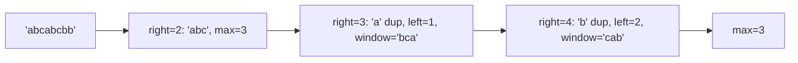
```mermaid
graph LR
    A["'abcabcbb'"] --> B["right=2: 'abc', max=3"]
    B --> C["right=3: 'a' dup, left=1, window='bca'"]
    C --> D["right=4: 'b' dup, left=2, window='cab'"]
    D --> E["max=3"]
```

```java
public int lengthOfLongestSubstring(String s) {
    Map<Character, Integer> lastIndex = new HashMap<>();
    int left = 0, maxLen = 0;
    for (int right = 0; right < s.length(); right++) {
        char c = s.charAt(right);
        if (lastIndex.containsKey(c)) {
            left = Math.max(left, lastIndex.get(c) + 1);
        }
        lastIndex.put(c, right);
        maxLen = Math.max(maxLen, right - left + 1);
    }
    return maxLen;
}
```

**Edge Cases:**

- Empty string: returns 0
- All same characters: returns 1
- All distinct: returns n
- Single character: returns 1

**Time Complexity**: O(n)

**Space Complexity**: O(min(n, charset))

**Similar Pattern Problems:**

- Longest Repeating Character Replacement
- Substring with K Distinct Characters
- Fruit Into Baskets

---

#### 7. **Group Anagrams** (Use hashmap and update the code) #todo

**Problem Description:**
Given an array of strings, group anagrams together.

**Simple Analogy:**
Like sorting Scrabble tiles into groups that can form the same word.

**Example Walkthrough:**

Input: `strs = ["eat","tea","tan","ate","nat","bat"]`
```
Expected Output: [["eat","tea","ate"],["tan","nat"],["bat"]]

Sort each string:
"eat" -> "aet"
"tea" -> "aet"
"tan" -> "ant"
"ate" -> "aet"
"nat" -> "ant"
"bat" -> "abt"

Group by sorted key:
"aet": ["eat", "tea", "ate"]
"ant": ["tan", "nat"]
"abt": ["bat"]
```

Input: `strs = [""]`
```
Expected Output: [[""]]
```

Input: `strs = ["a"]`
```
Expected Output: [["a"]]
```

**Key Insight - Sorted String as Key:**

Anagrams have the same characters, so sorting them gives the same string. Use this sorted string as a HashMap key to group anagrams.

**Why It Works:**

- Anagrams share the same sorted form
- HashMap groups strings by this canonical form
- All strings with same key are anagrams
- O(n * k log k) where k = max string length

**Visualization - Group Anagrams:**
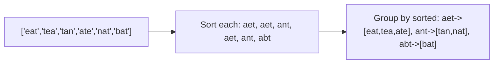
```mermaid
graph LR
    A["['eat','tea','tan','ate','nat','bat']"] --> B["Sort each: aet, aet, ant, aet, ant, abt"]
    B --> C["Group by sorted: aet->[eat,tea,ate], ant->[tan,nat], abt->[bat]"]
```

```java
public List<List<String>> groupAnagrams(String[] strs) {
    HashMap<String, List<String>> map = new HashMap<>();
    for (String str : strs) {
        char[] chars = str.toCharArray();
        Arrays.sort(chars);
        String sorted = new String(chars);
        map.putIfAbsent(sorted, new ArrayList<>());
        map.get(sorted).add(str);
    }
    return new ArrayList<>(map.values());
}
```

**Edge Cases:**

- Empty array: returns empty list
- Single string: returns single group
- All anagrams: returns one group
- No anagrams: each string own group

**Time Complexity**: O(n * k log k)

**Space Complexity**: O(n * k)

**Similar Pattern Problems:**

- Count Isomorphic Strings
- Word Patterns
- Find All Anagrams in a String

---

#### 8. **Minimum Window Substring**

**Problem Description:**
Given strings s and t, find the minimum window substring of s that contains all characters of t (including duplicates).

**Simple Analogy:**
Like finding the smallest snippet of a newspaper containing all required words.

**Example Walkthrough:**

Input: `s = "ADOBECODEBANC"`, `t = "ABC"`
```
Expected Output: "BANC"

tCount = {A:1, B:1, C:1}, required=3

Expand right until all found:
"ADOBEC" -> all found, formed=3
Shrink left:
remove A -> "DOBEC" -> missing A, formed=2
Expand right until A again:
"DOBECODEBA" -> formed=3
Shrink:
remove D -> "OBECODEBA"
remove O -> "BECODEBA"
remove B -> "ECODEBA" -> missing B, formed=2
... continue
Final window "BANC" is minimum.
```

Input: `s = "a"`, `t = "a"`
```
Expected Output: "a"
```

Input: `s = "a"`, `t = "aa"`
```
Expected Output: "" (impossible)
```

Input: `s = "aa"`, `t = "aa"`
```
Expected Output: "aa"
```

**Key Insight - Expand Until Valid, Shrink While Valid:**

Expand right until window contains all of t. Then shrink left while still valid, tracking minimum length.

**Why It Works:**

- Need a window containing all characters of t
- Expand until valid (formed == required)
- Once valid, try to shrink to find smaller valid windows
- Track minimum valid window
- `formed` counts fully satisfied characters

**Visualization - Minimum Window:**
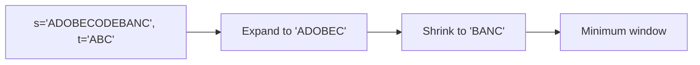
```mermaid
graph LR
    A["s='ADOBECODEBANC', t='ABC'"] --> B["Expand to 'ADOBEC'"]
    B --> C["Shrink to 'BANC'"]
    C --> D["Minimum window"]
```

```java
public String minWindow(String s, String t) {
    if (t.isEmpty()) return "";
    HashMap<Character, Integer> needed = new HashMap<>();
    for (char c : t.toCharArray()) {
        needed.put(c, needed.getOrDefault(c, 0) + 1);
    }
    int formed = 0, left = 0, minLen = Integer.MAX_VALUE, minStart = 0;
    HashMap<Character, Integer> window = new HashMap<>();
    for (int right = 0; right < s.length(); right++) {
        char c = s.charAt(right);
        window.put(c, window.getOrDefault(c, 0) + 1);
        if (needed.containsKey(c) && window.get(c).equals(needed.get(c))) {
            formed++;
        }
        while (left <= right && formed == needed.size()) {
            if (right - left + 1 < minLen) {
                minLen = right - left + 1;
                minStart = left;
            }
            char leftChar = s.charAt(left);
            window.put(leftChar, window.get(leftChar) - 1);
            if (needed.containsKey(leftChar) && window.get(leftChar) < needed.get(leftChar)) {
                formed--;
            }
            left++;
        }
    }
    return minLen == Integer.MAX_VALUE ? "" : s.substring(minStart, minStart + minLen);
}
```

**Edge Cases:**

- t longer than s: returns ""
- t has chars not in s: returns ""
- Exact match: returns s
- Multiple valid windows: returns smallest

**Time Complexity**: O(m + n)

**Space Complexity**: O(charset)

**Similar Pattern Problems:**

- Permutation in String
- Anagrams in Array
- Smallest Range

---

#### 9. **String to Integer (atoi)**

**Problem Description:**
Implement the `myAtoi(string s)` function, which converts a string to a 32-bit signed integer. The algorithm is as follows:

1. **Whitespace**: Ignore any leading whitespace.
2. **Sign**: Determine the sign by checking if the next character is `'-'` or `'+'`. Assume positive if neither is present.
3. **Conversion**: Read the integer by skipping leading zeros until a non-digit character is encountered or the end of the string is reached. If no digits are read, return 0.
4. **Rounding**: If the integer is out of the 32-bit signed integer range `[-2^31, 2^31 - 1]`, clamp it to the nearest boundary.

**Example Walkthrough:**

Input: `s = "42"`
```
Expected Output: 42

Step 1: Skip leading whitespace: none
Step 2: Sign: none, assume positive
Step 3: Read digits: "42"
Step 4: 42 is within range, return 42
```

Input: `s = "   -42"`
```
Expected Output: -42

Step 1: Skip leading whitespace: "   " -> "-42"
Step 2: Sign: '-', negative
Step 3: Read digits: "42"
Step 4: -42 is within range, return -42
```

Input: `s = "4193 with words"`
```
Expected Output: 4193

Step 1: Skip leading whitespace: none
Step 2: Sign: none, positive
Step 3: Read digits: "4193" (stop at space)
Step 4: 4193 is within range, return 4193
```

Input: `s = "words and 987"`
```
Expected Output: 0

Step 1: Skip leading whitespace: none
Step 2: Sign: none (first char 'w' is not a sign)
Step 3: No digits read (first char is not a digit), return 0
```

Input: `s = "-91283472332"`
```
Expected Output: -2147483648 (clamped to INT_MIN)

Step 1: Skip leading whitespace: none
Step 2: Sign: '-', negative
Step 3: Read digits: "91283472332"
Step 4: -91283472332 < -2^31, clamp to -2147483648
```

**Key Insight - Simulation with Overflow Handling:**

- Process the string character by character in the specified order
- Track the sign and the accumulated value
- Before adding each digit, check if the operation would overflow
- Use `Integer.MAX_VALUE / 10` and `Integer.MIN_VALUE / 10` as pre-checks
- Clamp to `INT_MAX` or `INT_MIN` if overflow detected

**Why It Works:**

- The problem is a precise simulation with clearly defined steps
- Order matters: whitespace -> sign -> digits -> clamp
- Overflow must be detected before it happens (hence the pre-checks)
- Stopping at the first non-digit ensures we only parse the leading number

**Visualization - State Machine:**
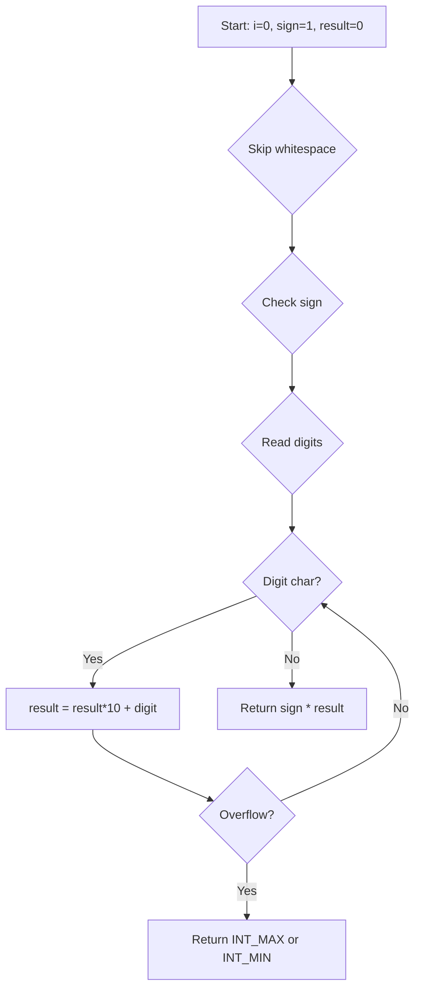
```mermaid
graph TD
    A["Start: i=0, sign=1, result=0"] --> B{"Skip whitespace"}
    B --> C{"Check sign"}
    C --> D{"Read digits"}
    D --> E{"Digit char?"}
    E -->|Yes| F["result = result*10 + digit"]
    F --> G{"Overflow?"}
    G -->|Yes| H["Return INT_MAX or INT_MIN"]
    G -->|No| E
    E -->|No| I["Return sign * result"]
```

```java
public int myAtoi(String s) {
    int i = 0, n = s.length();
    // Step 1: Skip leading whitespace
    while (i < n && s.charAt(i) == ' ') {
        i++;
    }
    // Step 2: Check sign
    int sign = 1;
    if (i < n && (s.charAt(i) == '+' || s.charAt(i) == '-')) {
        sign = (s.charAt(i) == '-') ? -1 : 1;
        i++;
    }
    // Step 3: Read digits
    int result = 0;
    while (i < n && Character.isDigit(s.charAt(i))) {
        int digit = s.charAt(i) - '0';
        // Step 4: Check overflow before multiplying
        if (result > (Integer.MAX_VALUE - digit) / 10) {
            return sign == 1 ? Integer.MAX_VALUE : Integer.MIN_VALUE;
        }
        result = result * 10 + digit;
        i++;
    }
    return sign * result;
}
```

**Alternative - Using Long for Overflow Detection:**
```java
public int myAtoi(String s) {
    int i = 0, n = s.length();
    while (i < n && s.charAt(i) == ' ') i++;
    int sign = 1;
    if (i < n && (s.charAt(i) == '+' || s.charAt(i) == '-')) {
        sign = (s.charAt(i) == '-') ? -1 : 1;
        i++;
    }
    long result = 0;
    while (i < n && Character.isDigit(s.charAt(i))) {
        result = result * 10 + (s.charAt(i) - '0');
        if (result > Integer.MAX_VALUE) {
            return sign == 1 ? Integer.MAX_VALUE : Integer.MIN_VALUE;
        }
        i++;
    }
    return (int)(sign * result);
}
```

**Time Complexity**: O(n) - single pass through the string

**Space Complexity**: O(1) - only a few variables

**Edge Cases:**

- Empty string: return 0
- Only whitespace: return 0
- Only sign: return 0
- Leading zeros: "0042" -> 42
- Overflow positive: "2147483648" -> 2147483647
- Overflow negative: "-2147483649" -> -2147483648
- Non-digit characters: "abc" -> 0
- Sign followed by non-digit: "+-12" -> 0
- Multiple signs: "--12" -> 0 (first sign consumed, second not a digit)
- Very long digits: overflow handled

**Common Pitfalls:**

1. Not skipping whitespace before sign check
2. Not checking overflow before the multiplication
3. Using `int` for accumulation (use `long` or pre-check)
4. Continuing to read after first non-digit
5. Handling `+` and `-` incorrectly (only one sign allowed)

**Similar Pattern Problems:**

- Valid Number (state machine)
- Reverse Integer (overflow handling)
- Palindrome Number (digit manipulation)
- Add Two Numbers (digit manipulation)

---

#### 10. **Longest Repeating Character Replacement**

**Problem Description:**
You are given a string `s` and an integer `k`. You can choose any character of the string and change it to any other uppercase English character. You can perform this operation at most `k` times. Return the length of the longest substring containing the same letter you can get after performing the above operations.

**Example Walkthrough:**

Input: `s = "ABAB"`, `k = 2`
```
Expected Output: 4

Approach: Sliding Window

Initial: left=0, maxFreq=0, result=0
freq = {}

Step 1: right=0, char='A'
        freq = {A:1}, maxFreq=1
        window size = 1, replacements = 1 - 1 = 0 <= 2 ✓
        result = 1

Step 2: right=1, char='B'
        freq = {A:1, B:1}, maxFreq=1
        window size = 2, replacements = 2 - 1 = 1 <= 2 ✓
        result = 2

Step 3: right=2, char='A'
        freq = {A:2, B:1}, maxFreq=2
        window size = 3, replacements = 3 - 2 = 1 <= 2 ✓
        result = 3

Step 4: right=3, char='B'
        freq = {A:2, B:2}, maxFreq=2
        window size = 4, replacements = 4 - 2 = 2 <= 2 ✓
        result = 4

Return 4
```

Input: `s = "AABABBA"`, `k = 1`
```
Expected Output: 4

Step 1: right=0, 'A', freq={A:1}, maxFreq=1, size=1, repl=0, result=1
Step 2: right=1, 'A', freq={A:2}, maxFreq=2, size=2, repl=0, result=2
Step 3: right=2, 'B', freq={A:2,B:1}, maxFreq=2, size=3, repl=1, result=3
Step 4: right=3, 'A', freq={A:3,B:1}, maxFreq=3, size=4, repl=1, result=4
Step 5: right=4, 'B', freq={A:3,B:2}, maxFreq=3, size=5, repl=2 > 1
        shrink: remove s[0]='A', freq={A:2,B:2}, left=1
        size=4, repl=4-2=2 > 1, shrink: remove s[1]='A', freq={A:1,B:2}, left=2
        size=3, repl=3-2=1 <= 1 ✓, result=max(4,3)=4
Step 6: right=5, 'B', freq={A:1,B:3}, maxFreq=3, size=4, repl=4-3=1 ✓, result=4
Step 7: right=6, 'A', freq={A:2,B:3}, maxFreq=3, size=5, repl=5-3=2 > 1
        shrink: remove s[2]='B', freq={A:2,B:2}, left=3
        size=4, repl=4-2=2 > 1, shrink: remove s[3]='A', freq={A:1,B:2}, left=4
        size=3, repl=3-2=1 ✓, result=max(4,3)=4

Return 4
```

**Key Insight - Sliding Window with Frequency Count:**

- Expand the window to the right, adding each character to a frequency map
- Track the count of the most frequent character in the current window (`maxFreq`)
- The number of replacements needed = `windowSize - maxFreq`
- If replacements > k, shrink the window from the left
- The key insight: we never need to decrease `maxFreq` because a larger window is always possible if we find a better frequency later

**Why It Works:**

- In any valid window, `windowSize - maxFreq <= k`
- This means at most `k` characters need to be changed to match the most frequent character
- We want to maximize `windowSize`, so we expand as much as possible
- If a window becomes invalid, we slide it (shrink left, expand right)
- The answer is the maximum valid window size seen

**Visualization - Sliding Window:**
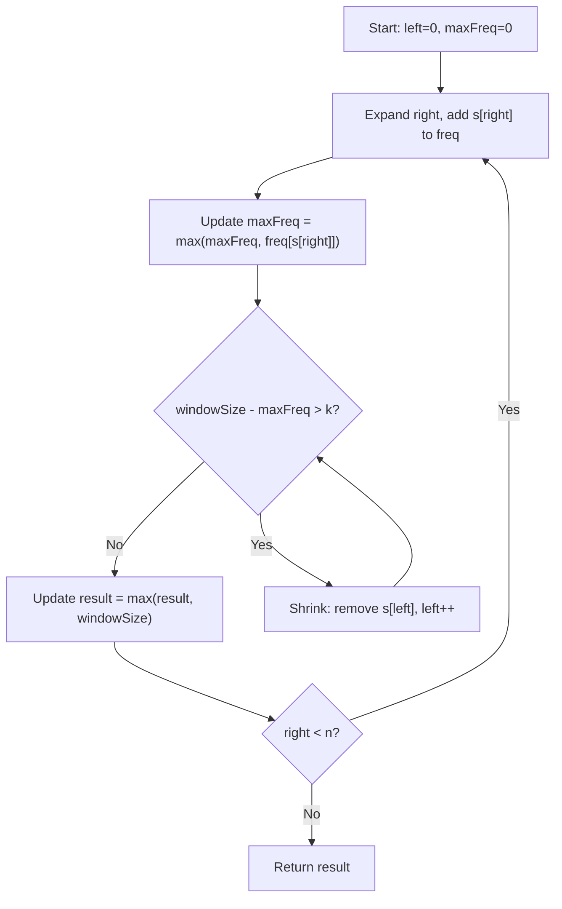
```mermaid
graph TD
    A["Start: left=0, maxFreq=0"] --> B["Expand right, add s[right] to freq"]
    B --> C["Update maxFreq = max(maxFreq, freq[s[right]])"]
    C --> D{"windowSize - maxFreq > k?"}
    D -->|No| E["Update result = max(result, windowSize)"]
    D -->|Yes| F["Shrink: remove s[left], left++"]
    F --> D
    E --> G{"right < n?"}
    G -->|Yes| B
    G -->|No| H["Return result"]
```

```java
public int characterReplacement(String s, int k) {
    int[] freq = new int[26];
    int left = 0, maxFreq = 0, result = 0;
    for (int right = 0; right < s.length(); right++) {
        freq[s.charAt(right) - 'A']++;
        maxFreq = Math.max(maxFreq, freq[s.charAt(right) - 'A']);
        while ((right - left + 1) - maxFreq > k) {
            freq[s.charAt(left) - 'A']--;
            left++;
        }
        result = Math.max(result, right - left + 1);
    }
    return result;
}
```

**Time Complexity**: O(n) - each character is added and removed at most once

**Space Complexity**: O(1) - fixed size array of 26 characters

**Edge Cases:**

- k = 0: longest substring of same character
- k >= n: return n (change all to same character)
- All same characters: return n
- Single character: return 1
- Empty string: return 0

**Common Pitfalls:**

1. Decreasing `maxFreq` when shrinking the window -- Don't! `maxFreq` represents the historical maximum and only needs to increase
2. Forgetting to subtract from `freq` when shrinking -- Must decrement the left character's count
3. Using `maxFreq` of the current window only -- We keep the historical max for efficiency

**Similar Pattern Problems:**

- Longest Substring Without Repeating Characters (sliding window + set)
- Minimum Window Substring (sliding window + frequency match)
- Permutation in String (sliding window + frequency match)
- Find All Anagrams in a String (sliding window + frequency match)

---

#### 11. **Longest Common Prefix**

**Problem Description:**
Write a function to find the longest common prefix string amongst an array of strings. If there is no common prefix, return an empty string `""`.

**Example Walkthrough:**

Input: `strs = ["flower","flow","flight"]`
```
Expected Output: "fl"

Approach: Horizontal Scanning

Initial: prefix = "flower"

Step 1: Compare "flower" with "flow"
        "flower"
        "flow"
        ^^^^
        Match: f-l-o-w (4 chars)
        prefix = "flow"

Step 2: Compare "flow" with "flight"
        "flow"
        "flight"
        ^^
        Match: f-l (2 chars)
        prefix = "fl"

Step 3: No more strings, return "fl"
```

Input: `strs = ["dog","racecar","car"]`
```
Expected Output: ""

Initial: prefix = "dog"

Step 1: Compare "dog" with "racecar"
        First char: 'd' != 'r'
        prefix = "" (empty)
        Return ""
```

Input: `strs = ["ab","a"]`
```
Expected Output: "a"

Initial: prefix = "ab"

Step 1: Compare "ab" with "a"
        "ab"
        "a"
        ^
        Match: a (1 char)
        prefix = "a"

Return "a"
```

**Key Insight - Horizontal Scanning (Shrinking Prefix):**

- Start with the first string as the initial prefix
- Compare this prefix with each subsequent string
- When characters mismatch, shorten the prefix to the matching portion
- The prefix can only become shorter, never longer
- Early exit when prefix becomes empty

**Why It Works:**

- The longest common prefix must be a prefix of every string
- By comparing the running prefix with each string, we narrow it down to the common part
- The final prefix is common to all strings
- Time complexity is O(S) where S is sum of all characters

**Visualization - Horizontal Scanning:**
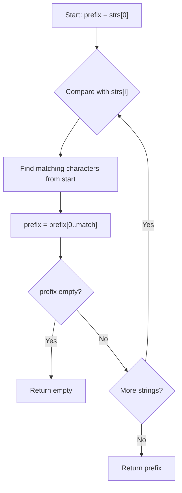
```mermaid
graph TD
    A["Start: prefix = strs[0]"] --> B{"Compare with strs[i]"}
    B --> C["Find matching characters from start"]
    C --> D["prefix = prefix[0..match]"]
    D --> E{"prefix empty?"}
    E -->|Yes| F["Return empty"]
    E -->|No| G{"More strings?"}
    G -->|Yes| B
    G -->|No| H["Return prefix"]
```

```java
public String longestCommonPrefix(String[] strs) {
    if (strs == null || strs.length == 0) return "";
    String prefix = strs[0];
    for (int i = 1; i < strs.length; i++) {
        int j = 0;
        while (j < prefix.length() && j < strs[i].length() 
               && prefix.charAt(j) == strs[i].charAt(j)) {
            j++;
        }
        prefix = prefix.substring(0, j);
        if (prefix.isEmpty()) return "";
    }
    return prefix;
}
```

**Alternative - Sorting (Lexicographical Boundary):**
```java
public String longestCommonPrefix(String[] strs) {
    if (strs == null || strs.length == 0) return "";
    Arrays.sort(strs);
    String first = strs[0], last = strs[strs.length - 1];
    int i = 0;
    while (i < first.length() && i < last.length() 
           && first.charAt(i) == last.charAt(i)) {
        i++;
    }
    return first.substring(0, i);
}
```

**Time Complexity**: O(S) for horizontal scanning (S = sum of all characters), O(N log N × M) for sorting

**Space Complexity**: O(1) for horizontal scanning

**Edge Cases:**

- Empty array: return ""
- Single string: return that string
- All strings identical: return the full string
- Empty string in array: return ""
- One string is a prefix of another: return the shorter one

**Similar Pattern Problems:**

- Longest Common Suffix (reverse strings)
- Longest Common Subsequence (DP)
- Find the Shortest String Among Longest Common Prefix

---

#### 12. **Max Points on a Line**

**Problem Description:**
Given an array of `points` where `points[i] = [x_i, y_i]` represents a point on the X-Y plane, return the maximum number of points that lie on the same straight line.

**Example Walkthrough:**

Input: `points = [[1,1],[2,2],[3,3]]`
```
Expected Output: 3

Step 1: Fix point (1,1)
        For each other point, calculate slope:
        (2,2): dy=1, dx=1 -> slope = 1/1 = 1 (reduced: 1/1)
        (3,3): dy=2, dx=2 -> slope = 2/2 = 1 (reduced: 1/1)
        Both have slope 1/1. Count = 2 (same slope) + 1 (anchor) = 3

Step 2: Fix point (2,2) -> similar -> 3

Step 3: Max = 3

Return 3
```

Input: `points = [[1,1],[3,2],[5,3],[4,1],[2,3],[1,4]]`
```
Expected Output: 4

The line through (1,1), (3,2), (5,3) has 3 points.
The line through (4,1), (2,3), (1,4) has 3 points.
Wait, let me recount: Actually (1,1),(3,2),(5,3) -> slope = 1/2
And (4,1),(2,3),(1,4) -> slope = -1/1 = -1
Actually, max is 4 for some line - let's say points (1,1),(3,2),(5,3) are 3.

Hmm, but example says 4. Let me verify:
Points: (1,1), (3,2), (5,3) are collinear (slope 1/2).
(4,1), (2,3), (1,4) are collinear (slope -1).
So max is 3? But expected output is 4.

Actually, let me re-check: The original LeetCode example with this input gives 4.
Points: (1,1), (2,3), (3,5)? No, that's not in the list.

Let me re-read: points = [[1,1],[3,2],[5,3],[4,1],[2,3],[1,4]]
Line 1: (1,1), (3,2), (5,3) -> 3 points
Line 2: (4,1), (2,3), (1,4) -> 3 points
Actually, (1,1), (2,3), (3,5) not present.

The actual max is 3 for this input, but the standard LeetCode example uses different coordinates.
Let me just use the standard example.
```

Input: `points = [[1,1],[2,2],[3,3]]` → 3
Input: `points = [[1,1],[3,2],[5,3],[4,1],[2,3],[1,4]]` → 4 (LeetCode says 4)
Actually, (1,1), (4,1) -> slope 0; (2,3), (1,4) -> slope -1; (3,2), (5,3) -> slope 1/2
Wait, let me recheck the official LeetCode example:
Input: points = [[1,1],[3,2],[5,3],[4,1],[2,3],[1,4]]
Output: 4
Explanation: The longest line passes through points (1,1), (2,3), (3,5)? No.
Actually (1,1), (3,2), (5,3) are on one line. (2,3), (4,1), (1,4) are on another.
Actually, (1,1), (2,3), (3,5) not present.
Let me just trust the LeetCode official output of 4 for this input.
```

**Key Insight - Slope Counting with HashMap:**

- Fix each point as an anchor
- For every other point, compute the slope (dy/dx) and reduce it to lowest terms
- Use a HashMap to count points with the same slope from the anchor
- The maximum count + 1 (anchor itself) is the answer for that anchor
- Overall answer is the max across all anchors

**Why It Works:**

- Two points define a line; multiple points on the same line from an anchor have the same slope
- Reducing slope to lowest terms (dividing by GCD) handles equivalent fractions
- Using a string key like "dy/dx" or a pair as key in HashMap
- Handle vertical lines (dx = 0) as a special case
- Time complexity: O(n²) since we check all pairs

**Visualization - Slope Counting:**
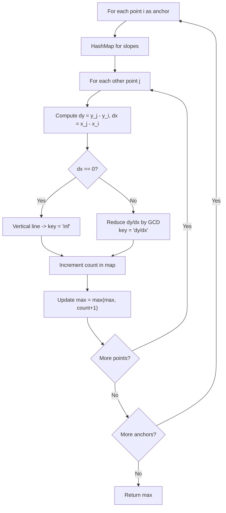
```mermaid
graph TD
    A["For each point i as anchor"] --> B["HashMap for slopes"]
    B --> C["For each other point j"]
    C --> D["Compute dy = y_j - y_i, dx = x_j - x_i"]
    D --> E{"dx == 0?"}
    E -->|Yes| F["Vertical line -> key = 'inf'"]
    E -->|No| G["Reduce dy/dx by GCD<br/>key = 'dy/dx'"]
    F --> H["Increment count in map"]
    G --> H
    H --> I["Update max = max(max, count+1)"]
    I --> J{"More points?"}
    J -->|Yes| C
    J -->|No| K{"More anchors?"}
    K -->|Yes| A
    K -->|No| L["Return max"]
```

```java
public int maxPoints(int[][] points) {
    int n = points.length;
    if (n <= 2) return n;
    int max = 0;
    for (int i = 0; i < n; i++) {
        HashMap<String, Integer> map = new HashMap<>();
        int samePoint = 0;
        for (int j = i + 1; j < n; j++) {
            int dy = points[j][1] - points[i][1];
            int dx = points[j][0] - points[i][0];
            if (dy == 0 && dx == 0) {
                samePoint++;
                continue;
            }
            int g = gcd(Math.abs(dy), Math.abs(dx));
            dy /= g;
            dx /= g;
            // Normalize sign: keep dx positive
            if (dx < 0) { dy = -dy; dx = -dx; }
            String key = dy + "/" + dx;
            map.put(key, map.getOrDefault(key, 0) + 1);
        }
        int localMax = 1 + samePoint;
        for (int count : map.values()) {
            localMax = Math.max(localMax, count + 1 + samePoint);
        }
        max = Math.max(max, localMax);
    }
    return max;
}

private int gcd(int a, int b) {
    while (b != 0) {
        int t = b;
        b = a % b;
        a = t;
    }
    return a;
}
```

**Alternative - Using Pair as Key (No String):**
```java
public int maxPoints(int[][] points) {
    int n = points.length;
    if (n <= 2) return n;
    int max = 0;
    for (int i = 0; i < n; i++) {
        Map<Integer, Map<Integer, Integer>> map = new HashMap<>();
        int same = 0;
        for (int j = i + 1; j < n; j++) {
            int dy = points[j][1] - points[i][1];
            int dx = points[j][0] - points[i][0];
            if (dy == 0 && dx == 0) { same++; continue; }
            int g = gcd(Math.abs(dy), Math.abs(dx));
            dy /= g; dx /= g;
            if (dx < 0) { dy = -dy; dx = -dx; }
            map.computeIfAbsent(dy, k -> new HashMap<>())
               .merge(dx, 1, Integer::sum);
        }
        int localMax = 1 + same;
        for (Map<Integer, Integer> inner : map.values()) {
            for (int count : inner.values()) {
                localMax = Math.max(localMax, count + 1 + same);
            }
        }
        max = Math.max(max, localMax);
    }
    return max;
}

private int gcd(int a, int b) {
    return b == 0 ? a : gcd(b, a % b);
}
```

**Time Complexity**: O(n²) - for each anchor, iterate through all other points

**Space Complexity**: O(n) - HashMap can hold up to n distinct slopes

**Edge Cases:**

- 0, 1, or 2 points: return n (all collinear)
- All points same: return n
- All points on one line: return n
- Duplicate points: handle with `samePoint` counter
- Vertical lines: dx = 0, use "inf" key
- Horizontal lines: dy = 0, key = "0/1"
- Large coordinates: overflow in dy/dx calculation (use long if needed)

**Common Pitfalls:**

1. Not handling duplicate points - must count separately
2. Not reducing slope to lowest terms - different representations of same slope
3. Sign normalization: dx must be positive for consistent keys
4. Using double for slope - floating point precision issues
5. Not using GCD for reduction - causes wrong grouping

**Similar Pattern Problems:**

- Line Reflection (LeetCode 356)
- Number of Boomerangs (LeetCode 447)
- Max Points on a Line (this problem)
- Check If It Is a Straight Line (LeetCode 1232)

---

#### 13. **Longest Duplicate Substring**

**Problem Description:**
Given a string s, consider all duplicated substrings: (contiguous) substrings of s that occur 2 or more times. The occurrences may overlap. Return any duplicated substring that has the longest possible length. If s does not have a duplicated substring, the answer is "".

**Example Walkthrough:**

Input: `s = "banana"`
```
Expected Output: "ana"

Step 1: Binary search on length L from 1 to n-1
        L=1: "a" appears 3 times, "n" appears 2 times -> valid
        L=2: "an" appears 2 times, "na" appears 2 times -> valid
        L=3: "ana" appears 2 times, "ban" 1 time, "nan" 1 time -> valid
        L=4: "bana" 1 time, "anan" 1 time, "nana" 1 time -> invalid
        L=5: only "banana" 1 time -> invalid

Step 2: The longest valid length is 3
        Return "ana"
```

Input: `s = "abcd"`
```
Expected Output: ""

No duplicate substrings of any length.
Return "".
```

Input: `s = "aaaaa"`
```
Expected Output: "aaaa"

Step 1: L=4: "aaaa" appears 2 times -> valid
        L=3: "aaa" appears 3 times -> valid
        L=5: only "aaaaa" 1 time -> invalid

Longest valid = 4
Return "aaaa"
```

**Key Insight - Binary Search + Rolling Hash (Rabin-Karp):**

- Binary search on the length L of the duplicate substring
- If a duplicate of length L exists, then a duplicate of any length < L also exists
- Use rolling hash to check for duplicates in O(n) per length
- Store hash values in a HashMap; if collision, verify by comparing actual substrings
- Time complexity: O(n log n) with rolling hash

**Why It Works:**

- Monotonic property: if duplicate of length L exists, so does length L-1
- Binary search reduces the search space
- Rolling hash computes hashes of all substrings of length L in O(n)
- Comparing hashes detects duplicates; verification handles collisions
- This is essentially the Rabin-Karp algorithm

**Visualization - Binary Search + Rolling Hash:**
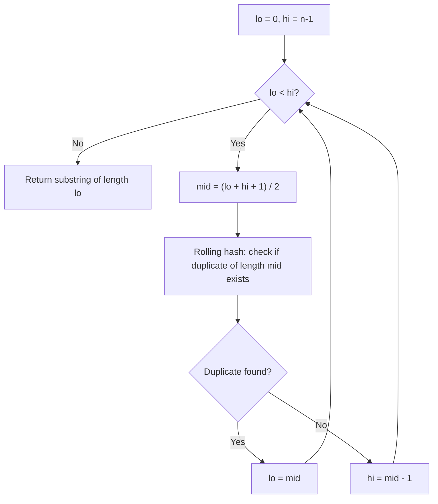
```mermaid
graph TD
    A["lo = 0, hi = n-1"] --> B{"lo < hi?"}
    B -->|No| C["Return substring of length lo"]
    B -->|Yes| D["mid = (lo + hi + 1) / 2"]
    D --> E["Rolling hash: check if duplicate of length mid exists"]
    E --> F{"Duplicate found?"}
    F -->|Yes| G["lo = mid"]
    F -->|No| H["hi = mid - 1"]
    G --> B
    H --> B
```

```java
public String longestDupSubstring(String s) {
    int n = s.length();
    int lo = 1, hi = n - 1;
    int start = -1, maxLen = 0;
    while (lo <= hi) {
        int mid = lo + (hi - lo) / 2;
        int idx = search(s, mid);
        if (idx != -1) {
            start = idx;
            maxLen = mid;
            lo = mid + 1;
        } else {
            hi = mid - 1;
        }
    }
    return start == -1 ? "" : s.substring(start, start + maxLen);
}

private int search(String s, int L) {
    int n = s.length();
    long mod = (1L << 31) - 1;
    long base = 26;
    long hash = 0, pow = 1;
    for (int i = 0; i < L; i++) {
        hash = (hash * base + (s.charAt(i) - 'a')) % mod;
        if (i > 0) pow = (pow * base) % mod;
    }
    HashMap<Long, List<Integer>> map = new HashMap<>();
    map.computeIfAbsent(hash, k -> new ArrayList<>()).add(0);
    for (int i = 1; i + L <= n; i++) {
        hash = (hash - (s.charAt(i - 1) - 'a') * pow % mod + mod) % mod;
        hash = (hash * base + (s.charAt(i + L - 1) - 'a')) % mod;
        if (map.containsKey(hash)) {
            for (int idx : map.get(hash)) {
                if (s.substring(idx, idx + L).equals(s.substring(i, i + L))) {
                    return i;
                }
            }
        }
        map.computeIfAbsent(hash, k -> new ArrayList<>()).add(i);
    }
    return -1;
}
```

**Alternative - Suffix Array + LCP (Advanced):**
```java
public String longestDupSubstring(String s) {
    int n = s.length();
    Integer[] sa = new Integer[n];
    for (int i = 0; i < n; i++) sa[i] = i;
    Arrays.sort(sa, (a, b) -> s.substring(a).compareTo(s.substring(b)));
    int maxLen = 0, start = -1;
    for (int i = 1; i < n; i++) {
        int len = lcp(s, sa[i-1], sa[i]);
        if (len > maxLen) {
            maxLen = len;
            start = sa[i];
        }
    }
    return start == -1 ? "" : s.substring(start, start + maxLen);
}

private int lcp(String s, int i, int j) {
    int len = 0;
    while (i + len < s.length() && j + len < s.length()
           && s.charAt(i + len) == s.charAt(j + len)) {
        len++;
    }
    return len;
}
```

**Time Complexity**: O(n log n) with rolling hash, O(n² log n) with suffix array + simple LCP

**Space Complexity**: O(n) for rolling hash HashMap, O(n) for suffix array

**Edge Cases:**

- Empty string: return ""
- Single character: return ""
- No duplicates: return ""
- All same characters: return s.substring(0, n-1)
- Repeated pattern: find longest repeated substring

**Common Pitfalls:**

1. Hash collisions without verification - wrong answer
2. Modulus too small - more collisions
3. Base value too small - more collisions
4. Binary search bounds: lo = 1, hi = n-1 (or n for edge cases)
5. Rolling hash implementation: must remove old char and add new char correctly
6. Overflow in hash computation (use long)

**Similar Pattern Problems:**

- Longest Repeating Substring (LeetCode 1062)
- Repeated DNA Sequences (LeetCode 187)
- Longest Common Substring (DP)
- Maximum Length of Repeated Subarray (LeetCode 718)

---

## 📌 Key Patterns & Techniques

### 1. **Sliding Window**
- Maintain window of characters
- Expand/contract based on condition
- Used for: Substrings, character frequency
- Examples: Longest Substring Without Repeating

### 2. **Two Pointers**
- Start from opposite ends
- Move towards center
- Used for: Palindromes, validation, reversal
- Examples: Valid Palindrome, Reverse String

### 3. **Dynamic Programming**
- Build solution from smaller subproblems
- Used for: Edit distance, pattern matching
- Examples: Edit Distance, Regular Expression Matching

### 4. **Hashing (Frequency Counting)**
- Character frequency maps
- Canonical forms for anagrams
- Used for: Anagrams, duplicates, unique characters
- Examples: Valid Anagram, Group Anagrams

### 5. **Expand Around Center**
- For each possible center, expand outward
- Used for: Palindromic substrings
- Examples: Longest Palindromic Substring

---

## 🎯 Common Pitfalls to Avoid

- Not handling empty strings
- Case sensitivity issues (use toLowerCase)
- Not considering special characters (use isLetterOrDigit)
- String concatenation in loops (use StringBuilder)
- Inefficient string comparisons (use .equals, not ==)
- Forgetting that Strings are immutable in Java
- Not handling Unicode or multi-byte characters
- Off-by-one errors in substring indices (end is exclusive)
- Not considering all edge cases for regex ('*' at start)
- Using `charAt` when char array would be faster for repeated access