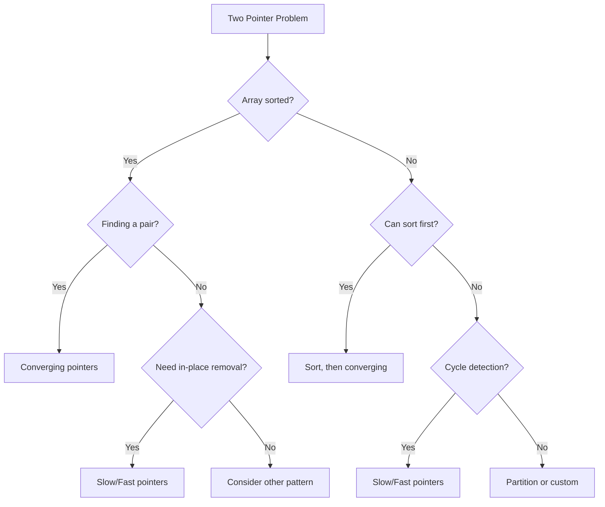
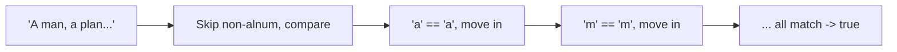
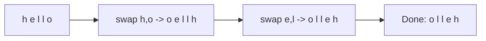
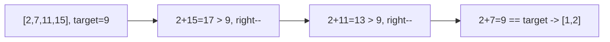
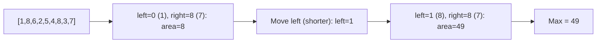
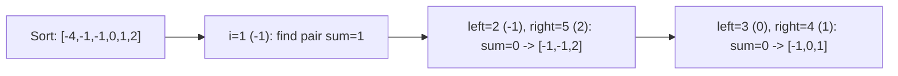
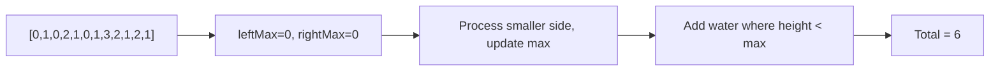

---
tags:
  - two-pointers
  - array
  - string
  - sorting
  - neetcode-150
---

# Two Pointers

## What is Two Pointers? (Simple Explanation)
Imagine you're reading a book and want to find two pages that together have a specific word count. Instead of checking every pair of pages (slow!), you use two fingers — one at the start and one at the end — and move them smartly toward each other.

That's the **two pointers** technique: using two indices to traverse data efficiently, usually in O(n) instead of O(n²).

**Real-life analogies:**
- Two people walking toward each other on a road
- A tortoise and hare racing around a track
- Two ends of a rope being pulled together
- Reading a sentence with your left and right index fingers

**Why it's fast:** Instead of nested loops (O(n²)), two pointers let you solve many problems in a single pass (O(n)).

## Key Concepts (In Simple Terms)
- **Two Pointers**: Two indices that move through the data
- **Converging**: Left and right move toward each other (start at ends)
- **Diverging**: Both start at center and move outward
- **Following Pace (Slow/Fast)**: One moves faster than the other
- **Partition**: Separate elements by a condition, swapping when needed
- **Array must be sorted** for most converging-pointer problems

## When to Use Two Pointers
- Sorted array/list problems
- Finding pairs/triplets with conditions (sum, difference, product)
- Reversing sequences
- Removing duplicates/elements in-place
- Cycle detection in linked lists
- Container/water trapping problems

## Types of Two Pointer Patterns
| Pattern | Start Position | Movement | Example |
|---------|---------------|----------|---------|
| **Converging** | Ends | Toward center | Two Sum II, Container With Most Water |
| **Diverging** | Center | Away from center | Longest Palindromic Substring |
| **Same Direction (Slow/Fast)** | Start | Same direction, different speed | Cycle detection, Remove Duplicates |
| **Partition** | Ends | Swap based on condition | Sort Colors, Move Zeroes |

## Complexity
| Aspect | Complexity | Notes |
|--------|------------|-------|
| Time | O(n) | Each element visited at most once (or twice) |
| Space | O(1) | No extra data structures |
| Sorting (if needed) | O(n log n) | Only if array isn't already sorted |

---

## 🔹 Basic Templates

### Converging Pointers Template
```java
public int converging(int[] nums) {
    int left = 0, right = nums.length - 1;
    while (left < right) {
        // Process nums[left] and nums[right]
        if (condition) {
            left++;
        } else {
            right--;
        }
    }
    return result;
}
```

### Same Direction (Slow/Fast) Template
```java
public int sameDirection(int[] nums) {
    int slow = 0;
    for (int fast = 0; fast < nums.length; fast++) {
        if (condition) {
            nums[slow] = nums[fast];
            slow++;
        }
    }
    return slow;
}
```

### Slow/Fast (Linked List Cycle) Template
```java
public boolean hasCycle(ListNode head) {
    ListNode slow = head, fast = head;
    while (fast != null && fast.next != null) {
        slow = slow.next;
        fast = fast.next.next;
        if (slow == fast) return true;
    }
    return false;
}
```

### Two Pointers Decision Flow


---

## 🔹 Practice Problems by Topic

### Easy

#### 1. **Valid Palindrome**

**Problem Description:**
Given a string, determine if it's a palindrome considering only alphanumeric characters and ignoring case.

**Simple Analogy:**
Like checking if a sentence reads the same forward and backward, ignoring spaces and punctuation.

**Example Walkthrough:**

Input: `s = "A man, a plan, a canal: Panama"`
```
Expected Output: true

Clean: "amanaplanacanalpanama"
Compare: forward == backward -> true

Two pointers:
left=0 ('A'), right=29 ('a')
Skip non-alnum on both sides
Compare lowercase: 'a' == 'a' -> move in
Repeat until pointers meet
```

Input: `s = "race a car"`
```
Expected Output: false

Clean: "raceacar"
Reversed: "racaecar"
Not equal

Two pointers:
left=0 ('r'), right=8 ('r') -> equal, move in
left=1 ('a'), right=7 ('a') -> equal, move in
left=2 ('c'), right=6 ('c') -> equal, move in
left=3 ('e'), right=5 ('a') -> NOT equal -> false
```

Input: `s = " "`
```
Expected Output: true (empty after cleaning)
```

Input: `s = "0P"`
```
Expected Output: false

Two pointers:
left=0 ('0'), right=1 ('P')
Compare lowercase: '0' != 'p' -> false
```

**Key Insight - Two Pointers with Skipping:**
Use two pointers from both ends. Skip non-alphanumeric characters. Compare lowercase versions. If all match, it's a palindrome.

**Why It Works:**
- Only alphanumeric characters matter
- Case doesn't matter
- Two pointers check symmetric positions
- Skipping non-alnum avoids preprocessing (saves space)
- O(n) time, O(1) space

**Visualization - Valid Palindrome:**


```java
public boolean isPalindrome(String s) {
    int left = 0, right = s.length() - 1;
    while (left < right) {
        while (left < right && !Character.isLetterOrDigit(s.charAt(left))) {
            left++;
        }
        while (left < right && !Character.isLetterOrDigit(s.charAt(right))) {
            right--;
        }
        if (Character.toLowerCase(s.charAt(left)) != Character.toLowerCase(s.charAt(right))) {
            return false;
        }
        left++;
        right--;
    }
    return true;
}
```

**Edge Cases:**
- Empty string: returns true
- Only non-alnum: returns true
- Single char: returns true
- Mixed case: handled by toLowerCase
- Numbers included: isLetterOrDigit handles

**Time Complexity**: O(n)
**Space Complexity**: O(1)

**Similar Pattern Problems:**
- Valid Palindrome II (allow one deletion)
- Palindromic Substrings
- Palindrome Linked List

---

#### 2. **Reverse String**

**Problem Description:**
Write a function that reverses a string in-place. The input is a char array.

**Simple Analogy:**
Like flipping a word backward — "hello" becomes "olleh".

**Example Walkthrough:**

Input: `s = ['h','e','l','l','o']`
```
Expected Output: ['o','l','l','e','h']

left=0, right=4: swap h, o -> ['o','e','l','l','h']
left=1, right=3: swap e, l -> ['o','l','l','e','h']
left=2, right=2: stop (left >= right)
```

Input: `s = ['H','a','n','n','a','h']`
```
Expected Output: ['h','a','n','n','a','H']

left=0, right=5: swap H, h -> ['h','a','n','n','a','H']
left=1, right=4: swap a, a -> no change
left=2, right=3: swap n, n -> no change
Done
```

Input: `s = ['a']`
```
Expected Output: ['a'] (single char)
```

**Key Insight - Swap from Both Ends:**
Use two pointers, one at the start and one at the end. Swap characters, move pointers toward center, repeat until they meet.

**Why It Works:**
- Swapping symmetric positions reverses the string
- Each swap fixes two positions (left and right)
- When pointers meet or cross, all positions are fixed
- In-place, no extra space needed

**Visualization - Reverse String:**


```java
public void reverseString(char[] s) {
    int left = 0, right = s.length - 1;
    while (left < right) {
        char temp = s[left];
        s[left] = s[right];
        s[right] = temp;
        left++;
        right--;
    }
}
```

**Edge Cases:**
- Empty array: nothing to do
- Single character: nothing to do
- Two characters: one swap
- Even/odd length: both work

**Time Complexity**: O(n)
**Space Complexity**: O(1)

**Similar Pattern Problems:**
- Reverse Words in a String
- Reverse Vowels of a String
- Reverse String II

---

### Medium

#### 3. **Two Sum II (Sorted Array)**

**Problem Description:**
Given a 1-indexed sorted array and a target, find two numbers that add up to target. Return their 1-indexed positions.

**Simple Analogy:**
Like finding two prices in a sorted menu that add up to your budget.

**Example Walkthrough:**

Input: `numbers = [2, 7, 11, 15]`, `target = 9`
```
Expected Output: [1, 2]

left=0 (2), right=3 (15): sum=17 > 9 -> right--
left=0 (2), right=2 (11): sum=13 > 9 -> right--
left=0 (2), right=1 (7): sum=9 == target -> return [1, 2]
```

Input: `numbers = [2, 3, 4]`, `target = 6`
```
Expected Output: [1, 3]

left=0 (2), right=2 (4): sum=6 == target -> return [1, 3]
```

Input: `numbers = [-1, 0]`, `target = -1`
```
Expected Output: [1, 2]

left=0 (-1), right=1 (0): sum=-1 == target -> return [1, 2]
```

**Key Insight - Move Based on Sum:**
If sum < target, we need a larger number, so move left right. If sum > target, we need a smaller number, so move right left. If sum == target, found it.

**Why It Works:**
- Array is sorted, so left is smallest, right is largest
- If sum too small, increasing left gives a larger sum
- If sum too large, decreasing right gives a smaller sum
- Each step eliminates one element
- O(n) time, O(1) space

**Visualization - Two Sum II:**


```java
public int[] twoSum(int[] numbers, int target) {
    int left = 0, right = numbers.length - 1;
    while (left < right) {
        int sum = numbers[left] + numbers[right];
        if (sum == target) {
            return new int[]{left + 1, right + 1};
        } else if (sum < target) {
            left++;
        } else {
            right--;
        }
    }
    return new int[]{};
}
```

**Edge Cases:**
- Exactly two elements: works
- Negative numbers: works
- Duplicates: works (sorted)
- No solution: returns empty (problem guarantees solution)

**Time Complexity**: O(n)
**Space Complexity**: O(1)

**Similar Pattern Problems:**
- Two Sum (unsorted, use HashMap)
- 3Sum
- 4Sum

---

#### 4. **Container With Most Water**

**Problem Description:**
Given an array of heights, find two lines that together with the x-axis form a container holding the most water.

**Simple Analogy:**
Like finding the widest and tallest bucket from a set of walls.

**Example Walkthrough:**

Input: `height = [1,8,6,2,5,4,8,3,7]`
```
Expected Output: 49

left=0 (1), right=8 (7): area = min(1,7) * 8 = 8
  height[left] < height[right] -> left++
left=1 (8), right=8 (7): area = min(8,7) * 7 = 49
  height[left] > height[right] -> right--
left=1 (8), right=7 (3): area = min(8,3) * 6 = 18
  right--
... (no larger found)
Max = 49
```

Input: `height = [1,1]`
```
Expected Output: 1

left=0 (1), right=1 (1): area = min(1,1) * 1 = 1
```

Input: `height = [4,3,2,1,4]`
```
Expected Output: 16

left=0 (4), right=4 (4): area = min(4,4) * 4 = 16
```

**Key Insight - Move the Shorter Side:**
The area is limited by the shorter line. Moving the taller side inward can only decrease width (worse). Moving the shorter side inward might find a taller line, increasing area.

**Why It Works:**
- Area = min(height[left], height[right]) * width
- Width decreases as we move inward
- To increase area, we must increase the minimum height
- So we move the shorter side (which is the limiting factor)
- This greedy choice explores all potentially better pairs
- O(n) time, O(1) space

**Visualization - Container With Most Water:**


```java
public int maxArea(int[] height) {
    int left = 0, right = height.length - 1;
    int maxArea = 0;
    while (left < right) {
        int width = right - left;
        int currentHeight = Math.min(height[left], height[right]);
        int area = width * currentHeight;
        maxArea = Math.max(maxArea, area);
        if (height[left] < height[right]) {
            left++;
        } else {
            right--;
        }
    }
    return maxArea;
}
```

**Edge Cases:**
- Two elements: returns min * 1
- All same height: returns height * (n-1)
- Increasing heights: works
- Decreasing heights: works

**Time Complexity**: O(n)
**Space Complexity**: O(1)

**Similar Pattern Problems:**
- Trapping Rain Water
- Pour Water Between Buckets
- Largest Rectangle in Histogram

---

#### 5. **3Sum**

**Problem Description:**
Given an integer array, find all unique triplets that sum to zero.

**Simple Analogy:**
Like finding three friends whose ages add up to exactly 0 (with negative and positive ages).

**Example Walkthrough:**

Input: `nums = [-1, 0, 1, 2, -1, -4]`
```
Expected Output: [[-1,-1,2], [-1,0,1]]

Sort: [-4, -1, -1, 0, 1, 2]

i=0 (-4): left=1, right=5
  sum = -4 + (-1) + 2 = -3 < 0 -> left++
  sum = -4 + (-1) + 2 = -3 < 0 -> left++
  sum = -4 + 0 + 2 = -2 < 0 -> left++
  sum = -4 + 1 + 2 = -1 < 0 -> left++
  left >= right -> done

i=1 (-1): left=2, right=5
  sum = -1 + (-1) + 2 = 0 -> add [-1,-1,2]
  skip dup left, skip dup right, left++, right--
  sum = -1 + 0 + 1 = 0 -> add [-1,0,1]
  left++, right-- -> done

i=2 (-1): skip (duplicate)
i=3 (0): left=4, right=5
  sum = 0 + 1 + 2 = 3 > 0 -> right--
  left >= right -> done

Result: [[-1,-1,2], [-1,0,1]]
```

Input: `nums = [0, 0, 0]`
```
Expected Output: [[0,0,0]]

i=0 (0): left=1, right=2
  sum = 0+0+0 = 0 -> add [0,0,0]
```

Input: `nums = [1, 2, -2, -1]`
```
Expected Output: [] (no triplets sum to 0)
```

**Key Insight - Fix One, Two Pointers on Rest:**
Sort the array first. Fix one element (i). Then use two pointers (left, right) on the remaining subarray to find pairs summing to -nums[i]. Skip duplicates to avoid repeated triplets.

**Why It Works:**
- Sorting enables two-pointer technique and duplicate skipping
- Fixing one element reduces 3Sum to Two Sum II
- Two pointers find pairs in O(n)
- Total O(n²) — much better than O(n³) brute force
- Duplicate skipping ensures unique triplets

**Visualization - 3Sum:**


```java
public List<List<Integer>> threeSum(int[] nums) {
    List<List<Integer>> result = new ArrayList<>();
    Arrays.sort(nums);
    for (int i = 0; i < nums.length - 2; i++) {
        if (i > 0 && nums[i] == nums[i - 1]) continue;
        if (nums[i] > 0) break;
        int left = i + 1, right = nums.length - 1;
        while (left < right) {
            int sum = nums[i] + nums[left] + nums[right];
            if (sum == 0) {
                result.add(Arrays.asList(nums[i], nums[left], nums[right]));
                while (left < right && nums[left] == nums[left + 1]) left++;
                while (left < right && nums[right] == nums[right - 1]) right--;
                left++;
                right--;
            } else if (sum < 0) {
                left++;
            } else {
                right--;
            }
        }
    }
    return result;
}
```

**Edge Cases:**
- Less than 3 elements: returns empty
- All zeros: returns [[0,0,0]] once
- No valid triplets: returns empty
- Multiple duplicates: correctly skipped

**Time Complexity**: O(n²)
**Space Complexity**: O(1) excluding output

**Similar Pattern Problems:**
- 3Sum Closest
- 4Sum
- 3Sum Smaller

---

### Hard

#### 6. **Trapping Rain Water**

**Problem Description:**
Given elevation heights, compute how much water can be trapped after raining.

**Simple Analogy:**
Like water collecting between buildings after rain. Water is trapped where there's a taller building on both sides.

**Example Walkthrough:**

Input: `height = [0,1,0,2,1,0,1,3,2,1,2,1]`
```
Expected Output: 6

Water trapped:
i=2 (0): min(1,3) - 0 = 1
i=4 (1): min(2,3) - 1 = 1
i=5 (0): min(2,3) - 0 = 2
i=6 (1): min(2,3) - 1 = 1
i=9 (1): min(3,2) - 1 = 1
Total = 6

Two pointers:
left=0, right=11
leftMax=0, rightMax=0
i=0 (0): leftMax=0, rightMax=0
  height[left] < height[right]? 0 < 1 -> yes
  height[left] >= leftMax? 0 >= 0 -> leftMax=0
  left++
i=1 (1): 1 < 1? No
  height[right] >= rightMax? 1 >= 0 -> rightMax=1
  right--
... continues
```

Input: `height = [4,2,0,3,2,5]`
```
Expected Output: 9

Water at indices 1,2,3,4: 2+4+1+2 = 9
```

Input: `height = [1,2,3,4,5]`
```
Expected Output: 0 (no water trapped, increasing)
```

**Key Insight - Two Pointers with Max Tracking:**
Track the maximum height seen from the left and right. The water at any position is min(leftMax, rightMax) - height[i]. Using two pointers, we always process the side with the smaller max.

**Why It Works:**
- Water trapped at i = min(maxLeft, maxRight) - height[i]
- If we know the smaller max side, we can compute water immediately
- Moving the pointer with smaller max is safe
- Because the other side's max is already larger
- O(n) time, O(1) space (vs O(n) space for prefix arrays)

**Visualization - Trapping Rain Water:**


```java
public int trap(int[] height) {
    if (height == null || height.length == 0) return 0;
    int left = 0, right = height.length - 1;
    int leftMax = 0, rightMax = 0;
    int water = 0;
    while (left < right) {
        if (height[left] < height[right]) {
            if (height[left] >= leftMax) {
                leftMax = height[left];
            } else {
                water += leftMax - height[left];
            }
            left++;
        } else {
            if (height[right] >= rightMax) {
                rightMax = height[right];
            } else {
                water += rightMax - height[right];
            }
            right--;
        }
    }
    return water;
}
```

**Edge Cases:**
- Less than 3 bars: no water
- All same height: no water
- Increasing: no water
- Decreasing: no water
- V-shape: water in the middle

**Time Complexity**: O(n)
**Space Complexity**: O(1)

**Similar Pattern Problems:**
- Rain Water II (2D version)
- Trapping Rain Water III
- Largest Rectangle in Histogram

---

## 📌 Key Patterns & Techniques

### 1. **Converging Pointers**
- Start: left at 0, right at end
- Move: toward center
- Use: Sorted array problems, pair finding
- Examples: Two Sum II, Container With Most Water

### 2. **Diverging Pointers**
- Start: both at center
- Move: away from center
- Use: Expanding/window problems
- Examples: Longest Palindromic Substring

### 3. **Following Pace (Slow/Fast)**
- Slow: moves 1 step
- Fast: moves 2 steps
- Use: Cycle detection, finding middle
- Examples: Linked List Cycle, Find Middle

### 4. **Partition Pattern**
- Separate elements by condition
- Two pointers from ends
- Swap when needed
- Examples: Sort Colors, Move Zeroes

### 5. **Same Direction (Slow/Fast)**
- Both start at beginning
- Slow tracks "write" position
- Fast tracks "read" position
- Examples: Remove Duplicates, Remove Element

---

## 🎯 Common Pitfalls to Avoid

- Forgetting array must be sorted (for converging pointers)
- Moving pointers in wrong direction (based on sum comparison)
- Not handling duplicates (in 3Sum, skip `nums[i] == nums[i-1]`)
- Off-by-one errors in boundary checks (`left < right` vs `left <= right`)
- Incorrect pointer initialization (`left = 0, right = n-1`)
- Not comparing values correctly (use `==` for ints, `.equals()` for objects)
- Forgetting that left and right can cross (stop when `left >= right`)
- Using two pointers when array isn't sorted and can't be sorted
- Not considering the "move shorter side" rule in area problems
- Mixing up slow/fast pointer speeds (1 step vs 2 steps)