# Graph

## What is a Graph? (Simple Explanation)
Imagine a map of cities connected by roads:
- **Cities** = Vertices (also called nodes)
- **Roads** = Edges (connections between cities)

A graph is just a way to represent connections between things. It could be:
- Friends on social media (who knows whom)
- Web pages linking to each other
- Flights between airports
- Prerequisites between courses

## Key Concepts (In Simple Terms)
- **Vertex (Node)**: A single point/entity in the graph
- **Edge**: A connection between two vertices
- **Directed Graph**: Roads are one-way (like a one-way street)
- **Undirected Graph**: Roads are two-way (like a normal street)
- **Weighted Graph**: Each road has a cost/distance/time
- **Path**: A sequence of vertices connected by edges
- **Cycle**: A path that starts and ends at the same vertex (like a round trip)
- **Connected Component**: A group of vertices where everyone can reach everyone else
- **DAG**: Directed Acyclic Graph - directed graph with no cycles (like a family tree)

## How to Store a Graph (Representation)

### 1. Adjacency List (Most Common)
Think of it like a contact list: for each person, list who they know.
```
0 -> [1, 2]
1 -> [0, 3]
2 -> [0]
3 -> [1]
```
Uses less memory. Best for sparse graphs.

### 2. Adjacency Matrix
Think of it like a table with checkmarks: row i, column j = 1 if connected.
```
   0  1  2  3
0  0  1  1  0
1  1  0  0  1
2  1  0  0  0
3  0  1  0  0
```
Fast to check "are these connected?" but uses O(V^2) memory.

### 3. Edge List
Just a list of all connections.
```
[[0,1], [0,2], [1,3]]
```
Useful for algorithms like Kruskal's.

## Common Algorithms (What They Do)

| Algorithm | What It Does | Real-Life Analogy |
|-----------|--------------|-------------------|
| BFS | Explores level by level | Ripples in water |
| DFS | Goes deep before coming back | Exploring a maze |
| Dijkstra | Shortest path with weights | GPS navigation |
| Union-Find | Groups connected things | Merging friend circles |
| Topological Sort | Orders tasks by dependencies | Course prerequisites |

## Patterns / Techniques
- BFS for shortest path (unweighted)
- DFS for cycle detection and connectivity
- Union-Find for grouping/merging
- Heap for Dijkstra
- Graph coloring for bipartite checks
- Backtracking for finding all paths

---

## 🔹 Basic Templates

### BFS Template
```java
public void bfs(int start, List<List<Integer>> graph) {
    Queue<Integer> queue = new LinkedList<>();
    boolean[] visited = new boolean[graph.size()];
    queue.offer(start);
    visited[start] = true;
    while (!queue.isEmpty()) {
        int node = queue.poll();
        for (int neighbor : graph.get(node)) {
            if (!visited[neighbor]) {
                visited[neighbor] = true;
                queue.offer(neighbor);
            }
        }
    }
}
```

### DFS Template
```java
public void dfs(int node, List<List<Integer>> graph, boolean[] visited) {
    visited[node] = true;
    for (int neighbor : graph.get(node)) {
        if (!visited[neighbor]) {
            dfs(neighbor, graph, visited);
        }
    }
}
```

### BFS vs DFS Decision Flow
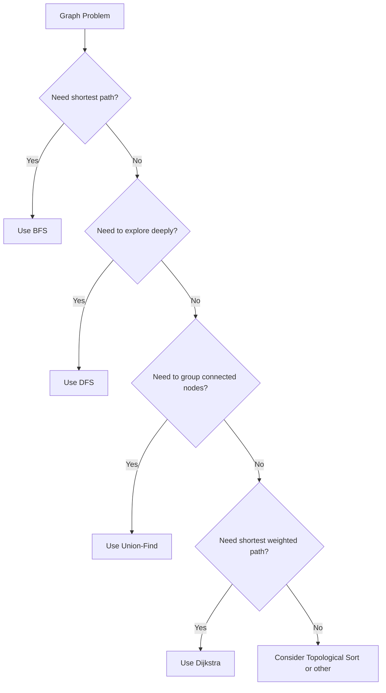

---

## 🔹 Practice Problems by Topic

### Easy

#### 1. **Number of Islands**

**Problem Description:**
You have a 2D grid of '1's (land) and '0's (water). Count how many islands there are. An island is land connected horizontally or vertically (not diagonally).

**Simple Analogy:**
Imagine a map where '1' is land and '0' is water. You want to count how many separate landmasses exist.

**Example Walkthrough:**

Input:
```
grid = [
  ['1','1','0','0','0'],
  ['1','1','0','0','0'],
  ['0','0','1','0','0'],
  ['0','0','0','1','1']
]
```
```
Expected Output: 3

Visual:
1 1 0 0 0
1 1 0 0 0     <- Island 1 (top-left block)
0 0 1 0 0     <- Island 2 (single cell)
0 0 0 1 1     <- Island 3 (bottom-right pair)

How DFS works:
Start at (0,0) = '1':
  Mark as '0' (visited)
  Explore all 4 directions recursively
  This visits the entire top-left island
  count = 1

Continue scanning:
(0,1) already '0' (visited)
(0,2) = '0' skip
...
(2,2) = '1':
  Mark as '0', explore -> just one cell
  count = 2

(3,3) = '1':
  Mark as '0', explore -> visits (3,4) too
  count = 3

Return 3
```

Input:
```
grid = [
  ['1','1','1'],
  ['0','1','0'],
  ['1','1','1']
]
```
```
Expected Output: 1 (all land is connected)

1 1 1
0 1 0     <- All connected through center
1 1 1
```

**Key Insight - Sink the Island:**
When we find land ('1'), we start a DFS that "sinks" the entire island by changing all connected '1's to '0's. Then we count how many times we had to start a new DFS.

**Why It Works:**
- Each DFS call marks an entire connected component
- After marking, those cells won't trigger another count
- Number of DFS calls = number of islands
- Grid boundaries and '0' cells stop the recursion

**Visualization - Island Counting:**
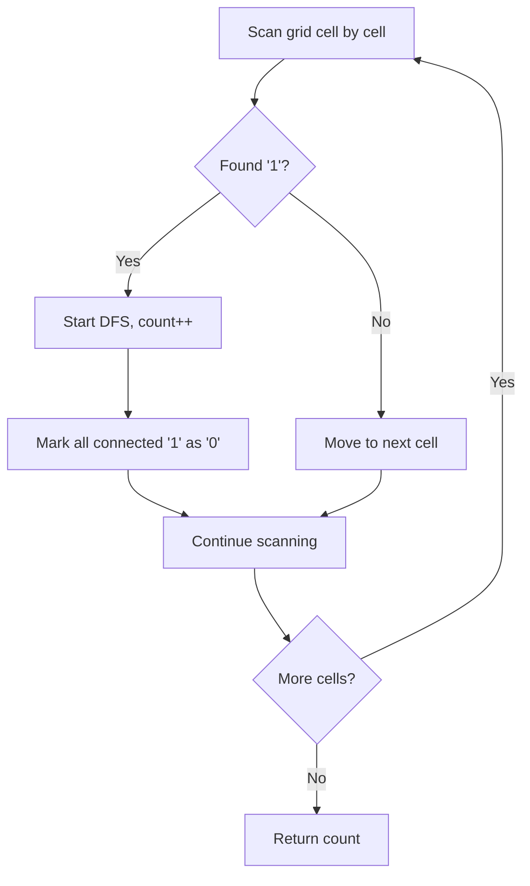

```java
public int numIslands(char[][] grid) {
    if (grid == null || grid.length == 0) return 0;
    int count = 0;
    for (int i = 0; i < grid.length; i++) {
        for (int j = 0; j < grid[0].length; j++) {
            if (grid[i][j] == '1') {
                dfs(grid, i, j);
                count++;
            }
        }
    }
    return count;
}

private void dfs(char[][] grid, int i, int j) {
    if (i < 0 || i >= grid.length || j < 0 || j >= grid[0].length || grid[i][j] == '0') {
        return;
    }
    grid[i][j] = '0';
    dfs(grid, i + 1, j);
    dfs(grid, i - 1, j);
    dfs(grid, i, j + 1);
    dfs(grid, i, j - 1);
}
```

**Edge Cases:**
- Empty grid: returns 0
- All water: returns 0
- All land: returns 1
- Single cell '1': returns 1

**Time Complexity**: O(m * n) - visit each cell once
**Space Complexity**: O(m * n) - recursion stack in worst case

**Similar Pattern Problems:**
- Max Area of Island
- Number of Connected Components
- Surrounded Regions

---

#### 2. **Flood Fill**

**Problem Description:**
You have an image (2D grid of colors). Starting from a pixel, change its color and the color of all connected pixels of the same original color to a new color. Like the paint bucket tool in MS Paint.

**Simple Analogy:**
Think of clicking "fill" in a drawing app. The color spreads to all connected same-colored pixels.

**Example Walkthrough:**

Input: `image = [[1,1,1],[1,1,0],[1,0,1]]`, `sr = 1, sc = 1`, `color = 2`
```
Expected Output: [[2,2,2],[2,2,0],[2,0,1]]

Original:
1 1 1
1 1 0
1 0 1

Start at (1,1) which is 1, change to 2:
DFS spreads to all connected 1s:

2 2 2
2 2 0
2 0 1

The '0's and the bottom-right '1' (not connected) stay unchanged.
```

Input: `image = [[0,0,0],[0,0,0]]`, `sr = 0, sc = 0`, `color = 0`
```
Expected Output: [[0,0,0],[0,0,0]]

Original color = 0, new color = 0
No change needed (already the target color)
```

**Key Insight - Same as Island Counting:**
This is almost identical to Number of Islands. Instead of counting, we just change colors. The key check is: only change pixels that match the ORIGINAL color.

**Why It Works:**
- Start DFS from the given pixel
- Change its color to new color
- Recursively visit all 4 neighbors
- Only continue if neighbor has the original color
- This naturally spreads to the entire connected region

**Visualization - Flood Fill:**
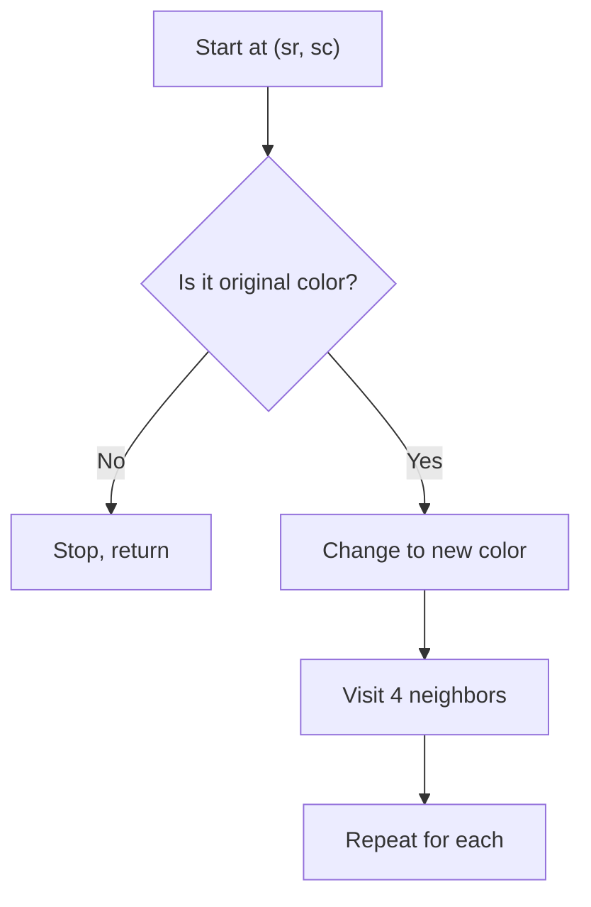

```java
public int[][] floodFill(int[][] image, int sr, int sc, int color) {
    int original = image[sr][sc];
    if (original != color) {
        dfs(image, sr, sc, original, color);
    }
    return image;
}

private void dfs(int[][] image, int i, int j, int original, int color) {
    if (i < 0 || i >= image.length || j < 0 || j >= image[0].length || image[i][j] != original) {
        return;
    }
    image[i][j] = color;
    dfs(image, i + 1, j, original, color);
    dfs(image, i - 1, j, original, color);
    dfs(image, i, j + 1, original, color);
    dfs(image, i, j - 1, original, color);
}
```

**Edge Cases:**
- New color same as original: return unchanged (avoid infinite loop)
- Single pixel: changes it
- All same color: changes all
- No matching neighbors: changes only the starting pixel

**Time Complexity**: O(m * n)
**Space Complexity**: O(m * n) recursion stack

**Similar Pattern Problems:**
- Surrounded Regions
- Pacific Atlantic Water Flow
- Number of Islands

---

#### 3. **Clone Graph**

**Problem Description:**
Given a reference to a node in a connected undirected graph, return a deep copy (clone) of the graph. Each node has a value and a list of neighbors.

**Simple Analogy:**
Like photocopying a network of friends. You need to create entirely new nodes, not just reference the old ones.

**Example Walkthrough:**

Input:
```
Graph: 1 -- 2
       |    |
       4 -- 3

adjList = [[2,4],[1,3],[2,4],[1,3]]
```
```
Expected Output: A deep copy of the same graph structure with new node objects

Step 1: Start at node 1
        Not in map -> create copy, put in map
        map = {1: copy1}

Step 2: Visit neighbor 2
        Not in map -> create copy, put in map
        map = {1: copy1, 2: copy2}
        copy1.neighbors.add(copy2)

Step 3: Visit neighbor 4 (from node 2's perspective)
        Not in map -> create copy
        map = {1: copy1, 2: copy2, 4: copy4}
        copy2.neighbors.add(copy4)

Step 4: Visit neighbor 1 (from node 4)
        Already in map -> use copy1
        copy4.neighbors.add(copy1)

... continues until all nodes visited
```

Input:
```
Graph: 1 (single node, no neighbors)

adjList = [[]]
```
```
Expected Output: A single node with no neighbors

Step 1: Create copy of node 1
        Return copy
```

**Key Insight - HashMap to Track Copies:**
Use a HashMap that maps original nodes to their copies. Before creating a copy, check if it already exists. This prevents infinite loops in cyclic graphs.

**Why It Works:**
- HashMap ensures we create exactly one copy per original node
- When we encounter an already-copied node, we reuse the copy
- DFS or BFS both work; DFS is simpler
- Handles cycles naturally because we check the map first

**Visualization - Clone Graph:**
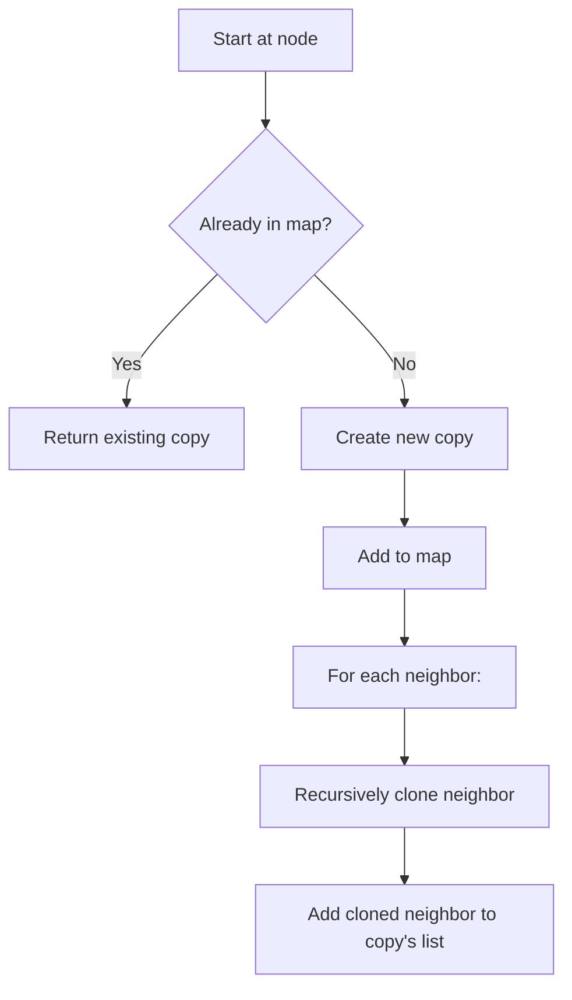

```java
public Node cloneGraph(Node node) {
    if (node == null) return null;
    Map<Node, Node> map = new HashMap<>();
    return dfs(node, map);
}

private Node dfs(Node node, Map<Node, Node> map) {
    if (map.containsKey(node)) return map.get(node);
    Node copy = new Node(node.val);
    map.put(node, copy);
    for (Node neighbor : node.neighbors) {
        copy.neighbors.add(dfs(neighbor, map));
    }
    return copy;
}
```

**Edge Cases:**
- Null node: return null
- Single node: return single copy
- Cyclic graph: handled by map
- Self-loop: handled by map

**Time Complexity**: O(V + E)
**Space Complexity**: O(V) for the map

**Similar Pattern Problems:**
- Copy List with Random Pointer
- Deep Copy of Binary Tree

---

#### 4. **Find the Town Judge**

**Problem Description:**
In a town of n people, the judge is someone who:
- Trusts nobody
- Is trusted by everyone else (n-1 people)

Given trust relationships trust[i] = [a, b] means a trusts b. Find the judge, or -1 if no judge.

**Simple Analogy:**
Like finding the most popular person who doesn't follow anyone back.

**Example Walkthrough:**

Input: `n = 3`, `trust = [[1,3],[2,3]]`
```
Expected Output: 3

Person 1 trusts 3
Person 2 trusts 3
Person 3 trusts nobody

Check person 3:
- Trusted by 2 people (1 and 2) = n-1 = 2 ✓
- Trusts 0 people ✓
Judge is 3
```

Input: `n = 3`, `trust = [[1,3],[2,3],[3,1]]`
```
Expected Output: -1

Person 1 trusts 3
Person 2 trusts 3
Person 3 trusts 1

Person 3 is trusted by 2 people BUT also trusts 1
So not a judge.
No other person is trusted by everyone.
Return -1
```

Input: `n = 1`, `trust = []`
```
Expected Output: 1

Only one person, trusts nobody, trusted by everyone (vacuously)
Person 1 is the judge.
```

**Key Insight - Two Counters:**
Track two things per person:
1. How many people they trust (out-degree)
2. How many people trust them (in-degree)

The judge has out-degree 0 and in-degree n-1.

**Why It Works:**
- Judge trusts nobody -> out-degree = 0
- Everyone else trusts judge -> in-degree = n-1
- Only one person can satisfy both conditions
- Simple counting, no graph traversal needed

**Visualization - Town Judge:**
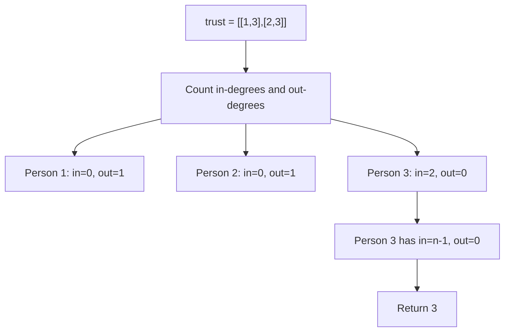

```java
public int findJudge(int n, int[][] trust) {
    int[] trustCount = new int[n + 1];
    int[] trustedCount = new int[n + 1];
    for (int[] t : trust) {
        trustedCount[t[0]]++;
        trustCount[t[1]]++;
    }
    for (int i = 1; i <= n; i++) {
        if (trustedCount[i] == 0 && trustCount[i] == n - 1) {
            return i;
        }
    }
    return -1;
}
```

**Edge Cases:**
- n = 1, no trust: returns 1
- No judge exists: returns -1
- Multiple potential judges: impossible (only one can have in-degree n-1)
- Self-trust: ignored (judge trusts nobody)

**Time Complexity**: O(n + E)
**Space Complexity**: O(n)

**Similar Pattern Problems:**
- Celebrity Problem
- Single Number

---

### Medium

#### 5. **Course Schedule (Cycle Detection)**

**Problem Description:**
You have numCourses courses to take. Some courses have prerequisites: [a, b] means you must take b before a. Can you finish all courses? (i.e., is there a valid ordering with no cycles?)

**Simple Analogy:**
Like checking if a set of tasks with dependencies can be completed. If A needs B and B needs A, it's impossible.

**Example Walkthrough:**

Input: `numCourses = 4`, `prerequisites = [[1,0],[2,1],[3,2]]`
```
Expected Output: true

Course 0 -> Course 1 -> Course 2 -> Course 3
(0 has no prereqs, then 1, then 2, then 3)

Step-by-step (Kahn's algorithm / BFS):
In-degrees: 0:0, 1:1, 2:1, 3:1

Queue initially: [0]
Process 0: count=1, reduce in-degree of 1 -> 0, add 1 to queue
Process 1: count=2, reduce in-degree of 2 -> 0, add 2 to queue
Process 2: count=3, reduce in-degree of 3 -> 0, add 3 to queue
Process 3: count=4, queue empty

count (4) == numCourses (4) -> Return true
```

Input: `numCourses = 2`, `prerequisites = [[1,0],[0,1]]`
```
Expected Output: false

Course 1 needs 0, Course 0 needs 1
Circular dependency!

In-degrees: 0:1, 1:1
Queue initially: [] (no course has in-degree 0)
count = 0 != 2 -> Return false
```

**Key Insight - In-Degree and Queue:**
Think of courses as nodes and prerequisites as directed edges. A course with no prerequisites (in-degree 0) can be taken first. Remove it, which might free up other courses. If we can remove all courses, no cycle.

**Why It Works:**
- A cycle means some courses can never have in-degree 0
- Kahn's algorithm removes nodes with in-degree 0 one by one
- If we process all nodes, no cycle exists (can finish)
- If some remain, there's a cycle (can't finish)
- This is topological sorting in disguise

**Visualization - Course Schedule:**
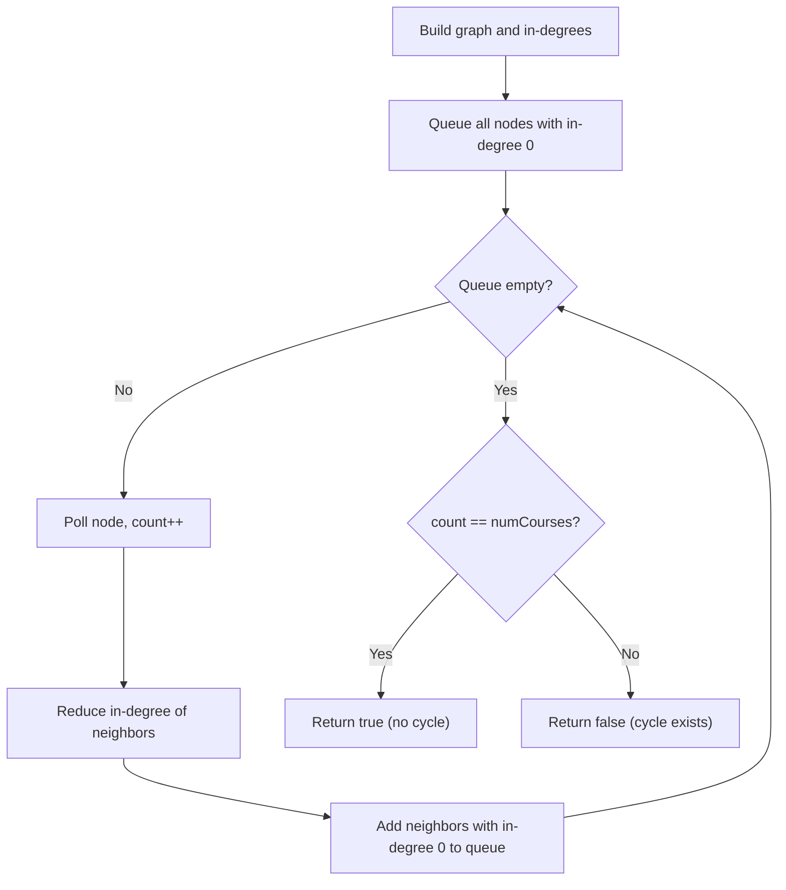

```java
public boolean canFinish(int numCourses, int[][] prerequisites) {
    int[] inDegree = new int[numCourses];
    List<List<Integer>> graph = new ArrayList<>();
    for (int i = 0; i < numCourses; i++) {
        graph.add(new ArrayList<>());
    }
    for (int[] prereq : prerequisites) {
        graph.get(prereq[1]).add(prereq[0]);
        inDegree[prereq[0]]++;
    }
    Queue<Integer> queue = new LinkedList<>();
    for (int i = 0; i < numCourses; i++) {
        if (inDegree[i] == 0) queue.offer(i);
    }
    int count = 0;
    while (!queue.isEmpty()) {
        int course = queue.poll();
        count++;
        for (int next : graph.get(course)) {
            inDegree[next]--;
            if (inDegree[next] == 0) queue.offer(next);
        }
    }
    return count == numCourses;
}
```

**Edge Cases:**
- No prerequisites: all courses can be taken
- Self-loop [0,0]: impossible
- Disconnected graph: still works
- Linear chain: always possible

**Time Complexity**: O(V + E)
**Space Complexity**: O(V + E)

**Similar Pattern Problems:**
- Course Schedule II (return the order)
- Alien Dictionary
- Topological Sort

---

#### 6. **Pacific Atlantic Water Flow**

**Problem Description:**
Given a 2D grid of heights, water can flow from a cell to adjacent cells with height <= current. The Pacific Ocean touches the top and left edges. The Atlantic touches the bottom and right edges. Find all cells where water can flow to BOTH oceans.

**Simple Analogy:**
Imagine rain falling on mountains. Water flows downhill. Which peaks can drain to both the west coast (Pacific) and east coast (Atlantic)?

**Example Walkthrough:**

Input:
```
heights = [
  [1,2,2,3,5],
  [3,2,3,4,4],
  [2,4,5,3,1],
  [6,7,1,4,5],
  [5,1,1,2,4]
]
```
```
Expected Output: [[0,4],[1,3],[1,4],[2,2],[3,0],[3,1],[4,0]]

Key insight: Work backwards!
Instead of checking if water can flow from each cell to ocean,
start from ocean edges and see which cells can reach them.

Pacific (top + left edges):
Start DFS from all top row and left column cells
Water can flow TO these cells from higher neighbors
Mark all reachable cells

Atlantic (bottom + right edges):
Start DFS from all bottom row and right column cells
Mark all reachable cells

Cells marked by both = answer

Pacific reachable:
Row 0: all
Col 0: all
Plus cells reachable from these going uphill

Atlantic reachable:
Row 4: all
Col 4: all
Plus cells reachable going uphill

Intersection = [[0,4],[1,3],[1,4],[2,2],[3,0],[3,1],[4,0]]
```

Input:
```
heights = [[1]]
```
```
Expected Output: [[0,0]]

Single cell touches both oceans (corner)
```

**Key Insight - Reverse Thinking (Start from Ocean):**
Instead of checking each cell (which would be expensive), start DFS from the ocean borders and move INWARD to higher or equal cells. A cell can reach the ocean if the ocean can reach it (going uphill).

**Why It Works:**
- Water flows from high to low
- Reverse: we can flow from low to high (going uphill from ocean)
- If ocean can reach a cell going uphill, water can flow from that cell to ocean
- Two separate DFS passes (one per ocean) mark reachable cells
- Intersection gives cells that reach both

**Visualization - Pacific Atlantic:**
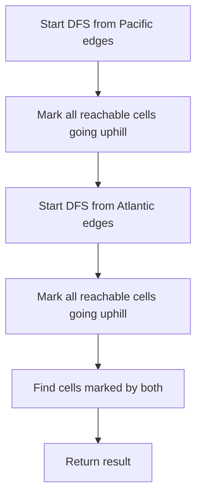

```java
public List<List<Integer>> pacificAtlantic(int[][] heights) {
    List<List<Integer>> result = new ArrayList<>();
    int m = heights.length, n = heights[0].length;
    boolean[][] pacific = new boolean[m][n];
    boolean[][] atlantic = new boolean[m][n];
    for (int i = 0; i < m; i++) {
        dfs(heights, pacific, i, 0);
    }
    for (int j = 0; j < n; j++) {
        dfs(heights, pacific, 0, j);
    }
    for (int i = 0; i < m; i++) {
        dfs(heights, atlantic, i, n - 1);
    }
    for (int j = 0; j < n; j++) {
        dfs(heights, atlantic, m - 1, j);
    }
    for (int i = 0; i < m; i++) {
        for (int j = 0; j < n; j++) {
            if (pacific[i][j] && atlantic[i][j]) {
                result.add(Arrays.asList(i, j));
            }
        }
    }
    return result;
}

private void dfs(int[][] heights, boolean[][] visited, int i, int j) {
    if (i < 0 || i >= heights.length || j < 0 || j >= heights[0].length || visited[i][j]) {
        return;
    }
    visited[i][j] = true;
    int[][] dirs = {{0, 1}, {0, -1}, {1, 0}, {-1, 0}};
    for (int[] dir : dirs) {
        int ni = i + dir[0], nj = j + dir[1];
        if (ni >= 0 && ni < heights.length && nj >= 0 && nj < heights[0].length &&
            heights[ni][nj] >= heights[i][j]) {
            dfs(heights, visited, ni, nj);
        }
    }
}
```

**Edge Cases:**
- Single row: all cells touch both oceans (top = Pacific, bottom = Atlantic)
- Single column: all cells touch both
- All same height: all cells reach both oceans
- Single cell: touches both

**Time Complexity**: O(m * n)
**Space Complexity**: O(m * n)

**Similar Pattern Problems:**
- Number of Islands
- Surrounded Regions
- Walls and Gates

---

#### 7. **Word Ladder**

**Problem Description:**
Given two words (beginWord and endWord) and a dictionary, find the length of the shortest transformation sequence from beginWord to endWord. Each step can change exactly one letter, and each intermediate word must be in the dictionary.

**Simple Analogy:**
Like a word puzzle: change "hit" to "cog" one letter at a time, where each intermediate word is valid.

**Example Walkthrough:**

Input: `beginWord = "hit"`, `endWord = "cog"`, `wordList = ["hot","dot","dog","lot","log","cog"]`
```
Expected Output: 5

Shortest path:
hit -> hot -> dot -> dog -> cog
(change 1 letter each time)

BFS level by level:
Level 1: hit (start)
Level 2: hot (change i->o)
Level 3: dot, lot (change h->d or h->l)
Level 4: dog, log (change t->g)
Level 5: cog (change d->c or l->c) = endWord!

Return 5
```

Input: `beginWord = "hit"`, `endWord = "cog"`, `wordList = ["hot","dot","dog","lot","log"]`
```
Expected Output: 0

"cog" is not in wordList
Can't reach endWord
Return 0
```

**Key Insight - BFS for Shortest Path:**
Each word is a node. Two words are connected if they differ by exactly one letter. BFS finds the shortest path because BFS explores level by level (all words 1 step away, then 2 steps away, etc.).

**Why It Works:**
- BFS guarantees shortest path in unweighted graphs
- Each transformation = one edge
- Level in BFS = number of transformations
- Removing words from the set prevents revisiting (optimization)
- Early return when endWord found gives minimum

**Visualization - Word Ladder:**
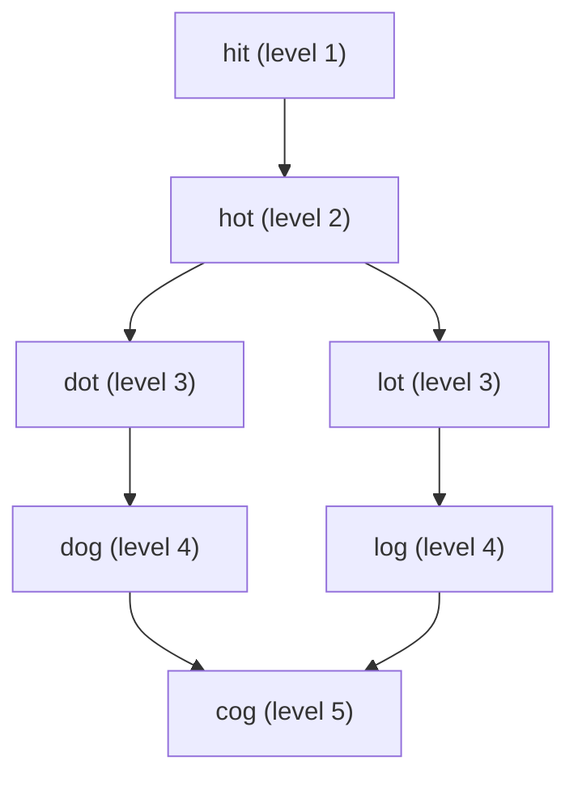

```java
public int ladderLength(String beginWord, String endWord, List<String> wordList) {
    Set<String> words = new HashSet<>(wordList);
    if (!words.contains(endWord)) return 0;
    Queue<String> queue = new LinkedList<>();
    queue.offer(beginWord);
    words.remove(beginWord);
    int steps = 1;
    while (!queue.isEmpty()) {
        int size = queue.size();
        for (int i = 0; i < size; i++) {
            String curr = queue.poll();
            if (curr.equals(endWord)) return steps;
            for (String neighbor : getNeighbors(curr, words)) {
                queue.offer(neighbor);
                words.remove(neighbor);
            }
        }
        steps++;
    }
    return 0;
}

private List<String> getNeighbors(String word, Set<String> words) {
    List<String> neighbors = new ArrayList<>();
    char[] chars = word.toCharArray();
    for (int i = 0; i < chars.length; i++) {
        char original = chars[i];
        for (char c = 'a'; c <= 'z'; c++) {
            if (c == original) continue;
            chars[i] = c;
            String neighbor = new String(chars);
            if (words.contains(neighbor)) {
                neighbors.add(neighbor);
            }
        }
        chars[i] = original;
    }
    return neighbors;
}
```

**Edge Cases:**
- endWord not in list: returns 0
- beginWord == endWord: returns 1 (or 0 depending on definition)
- No valid path: returns 0
- Single character words: works

**Time Complexity**: O(N * L^2) where N = words, L = word length
**Space Complexity**: O(N * L)

**Similar Pattern Problems:**
- Word Ladder II (find all shortest paths)
- Minimum Genetic Mutation
- Open the Lock

---

### Hard

#### 8. **Critical Connections in Network (Bridges)**

**Problem Description:**
In a network of n servers connected by undirected edges, find all critical connections (bridges). A bridge is an edge that, if removed, disconnects the network.

**Simple Analogy:**
Like finding weak links in a chain. If removing a link breaks the chain into two pieces, it's critical.

**Example Walkthrough:**

Input: `n = 4`, `connections = [[0,1],[1,2],[2,0],[1,3]]`
```
Expected Output: [[1,3]]

Visual:
0 --- 1 --- 3
 \   /
  \ /
   2

Edge 0-1: removing it? 0 still connects via 2-1. Not a bridge.
Edge 1-2: removing it? 1 still connects via 0-2. Not a bridge.
Edge 2-0: removing it? 2 still connects via 1-0. Not a bridge.
Edge 1-3: removing it? 3 becomes isolated! BRIDGE.

Return [[1,3]]
```

Input: `n = 2`, `connections = [[0,1]]`
```
Expected Output: [[0,1]]

Only one edge, removing it disconnects
```

**Key Insight - Discovery Time and Low Value:**
Tarjan's algorithm uses two values per node:
- **disc[u]**: When was u first discovered? (timestamp)
- **low[u]**: What's the earliest discovered node reachable from u's subtree?

An edge (u, v) is a bridge if low[v] > disc[u], meaning v's subtree can't reach any ancestor of u.

**Why It Works:**
- If v's subtree has a back edge to u or higher, low[v] <= disc[u]
- If no back edge exists, low[v] > disc[u], meaning removing (u,v) disconnects v's subtree
- DFS explores all edges, tracking discovery times
- Back edges (to ancestors) update low values

**Visualization - Finding Bridges:**
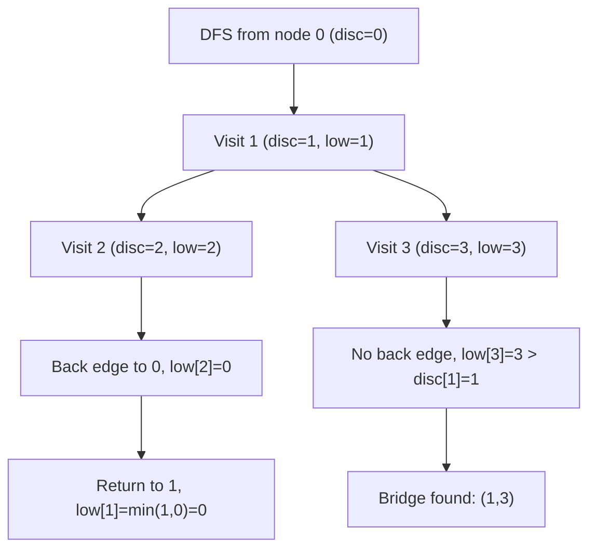

```java
public List<List<Integer>> criticalConnections(int n, List<List<Integer>> connections) {
    List<List<Integer>> result = new ArrayList<>();
    List<Integer>[] graph = new ArrayList[n];
    for (int i = 0; i < n; i++) {
        graph[i] = new ArrayList<>();
    }
    for (List<Integer> conn : connections) {
        graph[conn.get(0)].add(conn.get(1));
        graph[conn.get(1)].add(conn.get(0));
    }
    int[] disc = new int[n];
    int[] low = new int[n];
    boolean[] visited = new boolean[n];
    int[] time = {0};
    for (int i = 0; i < n; i++) {
        if (!visited[i]) {
            dfs(i, -1, disc, low, visited, graph, time, result);
        }
    }
    return result;
}

private void dfs(int u, int parent, int[] disc, int[] low, boolean[] visited,
                 List<Integer>[] graph, int[] time, List<List<Integer>> result) {
    visited[u] = true;
    disc[u] = low[u] = time[0]++;
    for (int v : graph[u]) {
        if (!visited[v]) {
            dfs(v, u, disc, low, visited, graph, time, result);
            low[u] = Math.min(low[u], low[v]);
            if (low[v] > disc[u]) {
                result.add(Arrays.asList(u, v));
            }
        } else if (v != parent) {
            low[u] = Math.min(low[u], disc[v]);
        }
    }
}
```

**Edge Cases:**
- Single edge: it's a bridge
- No edges: no bridges
- Fully connected: no bridges
- Tree structure: all edges are bridges

**Time Complexity**: O(V + E)
**Space Complexity**: O(V)

**Similar Pattern Problems:**
- Minimum Height Trees
- Network Delay Time
- Articulation Points

---

#### 9. **Shortest Path with Obstacles Elimination**

**Problem Description:**
Given an m x n grid where 1 = obstacle and 0 = empty, find the shortest path from (0,0) to (m-1,n-1). You can eliminate at most k obstacles.

**Simple Analogy:**
Like navigating a maze where you can break through at most k walls.

**Example Walkthrough:**

Input: `grid = [[0,0,0],[1,1,0],[0,0,0],[0,1,1],[0,0,0]]`, `k = 1`
```
Expected Output: 6

Path: (0,0) -> (0,1) -> (0,2) -> (1,2) -> (2,2) -> (3,2) -> (4,2)
Eliminated 1 obstacle at (3,2)? No, (3,2) is 1 but we go through (2,2) to (3,2)?
Wait, let me trace:
(0,0) 0
(0,1) 0
(0,2) 0
(1,2) 0
(2,2) 0
(3,2) 1 -> eliminate this obstacle
(4,2) 0
Total steps: 6
```

Input: `grid = [[0,1,1],[1,1,1],[1,1,0]]`, `k = 1`
```
Expected Output: -1

Too many obstacles, can't reach with only 1 elimination
```

**Key Insight - BFS with Extra State:**
Regular BFS state is (row, col). Here we need (row, col, obstacles_used). We track visited[row][col][obstacles] to avoid revisiting the same state.

**Why It Works:**
- BFS guarantees shortest path in unweighted graphs
- Extra dimension tracks how many obstacles we've eliminated
- We can visit the same cell with different obstacle counts
- Pruning: if k >= m+n-2, we can always reach (just go through obstacles)
- Early termination when reaching destination

**Visualization - Shortest Path with Obstacles:**
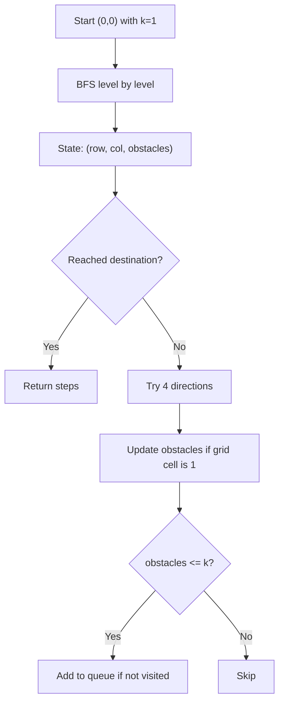

```java
public int shortestPath(int[][] grid, int k) {
    int m = grid.length, n = grid[0].length;
    if (k >= m - 1 + n - 1) return m - 1 + n - 1;
    Queue<int[]> queue = new LinkedList<>();
    queue.offer(new int[]{0, 0, 0});
    int[][][] visited = new int[m][n][k + 1];
    visited[0][0][0] = 1;
    int steps = 0;
    int[][] dirs = {{0, 1}, {0, -1}, {1, 0}, {-1, 0}};
    while (!queue.isEmpty()) {
        int size = queue.size();
        for (int i = 0; i < size; i++) {
            int[] curr = queue.poll();
            int row = curr[0], col = curr[1], obstacles = curr[2];
            if (row == m - 1 && col == n - 1) return steps;
            for (int[] dir : dirs) {
                int nr = row + dir[0], nc = col + dir[1];
                if (nr >= 0 && nr < m && nc >= 0 && nc < n) {
                    int newObstacles = obstacles + grid[nr][nc];
                    if (newObstacles <= k && visited[nr][nc][newObstacles] == 0) {
                        visited[nr][nc][newObstacles] = 1;
                        queue.offer(new int[]{nr, nc, newObstacles});
                    }
                }
            }
        }
        steps++;
    }
    return -1;
}
```

**Edge Cases:**
- Start == end: returns 0
- No obstacles: standard BFS
- Too many obstacles: returns -1
- k large enough: shortest path without detours

**Time Complexity**: O(m * n * k)
**Space Complexity**: O(m * n * k)

**Similar Pattern Problems:**
- Shortest Path in Matrix
- Path with Minimum Effort
- Minimum Obstacle Removal to Reach Corner

---

#### 10. **Topological Sort (DFS)**

**Problem Description:**
Given a directed acyclic graph (DAG), return a linear ordering of vertices such that for every edge (u, v), u comes before v.

**Simple Analogy:**
Like ordering courses: you must take prerequisites before advanced courses. Topological sort gives a valid order.

**Example Walkthrough:**

Input: `n = 6`, `edges = [[5,2],[5,0],[4,0],[4,1],[2,3],[3,1]]`
```
Expected Output: [5,4,2,3,1,0] (or any valid topological order)

Graph:
5 -> 2 -> 3 -> 1
5 -> 0
4 -> 0
4 -> 1

DFS from 5: visit 5, then 2, then 3, then 1
Post-order: 1, 3, 2, 0? No, let me trace:
dfs(5): mark 5
  dfs(2): mark 2
    dfs(3): mark 3
      dfs(1): mark 1
      push 1
    push 3
  push 2
  dfs(0): mark 0
  push 0
push 5

Stack: [1, 3, 2, 0, 5] (bottom to top)
Result: [5, 0, 2, 3, 1] (reverse)

dfs(4): mark 4
  dfs(0): already visited
  dfs(1): already visited
  push 4

Final stack: [1, 3, 2, 0, 5, 4]
Result: [4, 5, 0, 2, 3, 1]

Valid order: 4 before 0 and 1, 5 before 2 and 0, etc.
```

Input: `n = 3`, `edges = [[0,1],[1,2],[2,0]]`
```
Expected Output: [] (cycle detected)

This is a cycle! Topological sort only works on DAG.
```

**Key Insight - Post-Order Reversal:**
DFS finishes a node only after all its descendants are finished. So the last node to finish has no outgoing edges to unvisited nodes. If we push nodes onto a stack as they finish, popping gives topological order.

**Why It Works:**
- DFS explores all descendants before finishing a node
- A node is finished only after all reachable nodes are processed
- Pushing to stack at finish time and reversing gives topological order
- For edge (u, v): u is pushed before v finishes? No, v finishes first, so v is pushed first, then u. Reversed: u comes before v. Correct!

**Visualization - Topological Sort:**
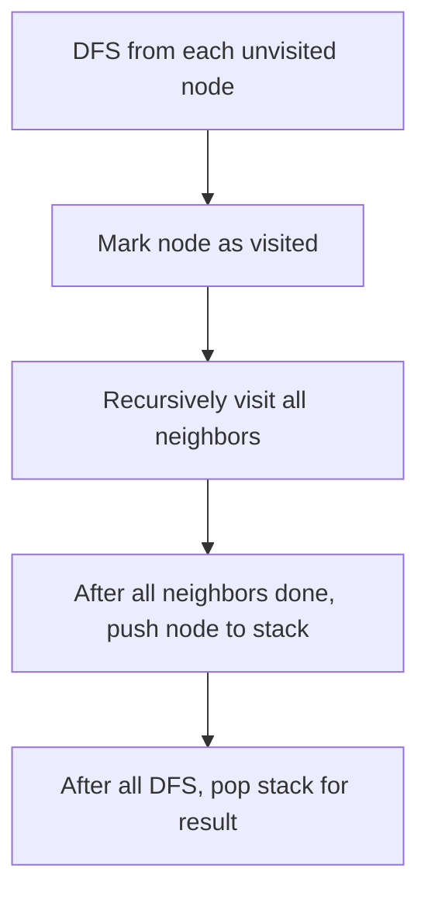

```java
public List<Integer> topologicalSort(int n, int[][] edges) {
    List<Integer>[] graph = new ArrayList[n];
    for (int i = 0; i < n; i++) {
        graph[i] = new ArrayList<>();
    }
    for (int[] edge : edges) {
        graph[edge[0]].add(edge[1]);
    }
    boolean[] visited = new boolean[n];
    Stack<Integer> stack = new Stack<>();
    for (int i = 0; i < n; i++) {
        if (!visited[i]) {
            dfs(i, visited, graph, stack);
        }
    }
    List<Integer> result = new ArrayList<>();
    while (!stack.isEmpty()) {
        result.add(stack.pop());
    }
    return result;
}

private void dfs(int node, boolean[] visited, List<Integer>[] graph, Stack<Integer> stack) {
    visited[node] = true;
    for (int neighbor : graph[node]) {
        if (!visited[neighbor]) {
            dfs(neighbor, visited, graph, stack);
        }
    }
    stack.push(node);
}
```

**Edge Cases:**
- No edges: any order works
- Linear chain: only one valid order
- Multiple components: each sorted independently
- Cycle: no valid topological order

**Time Complexity**: O(V + E)
**Space Complexity**: O(V)

**Similar Pattern Problems:**
- Course Schedule
- Alien Dictionary
- Build Order

---

#### 11. **Union-Find (Disjoint Set)**

**Problem Description:**
A data structure that tracks elements partitioned into disjoint sets. Supports two operations: find (which set?) and union (merge two sets).

**Simple Analogy:**
Like managing friend groups. When two people become friends, merge their groups. Find tells you which group someone belongs to.

**Example Walkthrough:**

Input: `n = 5`, operations:
```
union(0, 1)
union(2, 3)
union(1, 3)
find(0) == find(3)? Yes (all connected)
countComponents() = 2 (groups: {0,1,2,3}, {4})
```

**Step-by-step:**
```
Initial: parent = [0, 1, 2, 3, 4], rank = [0, 0, 0, 0, 0]

union(0, 1): find(0)=0, find(1)=1, parent[1]=0
parent = [0, 0, 2, 3, 4]

union(2, 3): find(2)=2, find(3)=3, parent[3]=2
parent = [0, 0, 2, 2, 4]

union(1, 3): find(1)=0, find(3)=2, parent[2]=0
parent = [0, 0, 0, 2, 4]
After path compression: parent[3]=0
parent = [0, 0, 0, 0, 4]

find(0) = 0, find(3) = 0 -> Same group!

countComponents: roots = {0, 4} -> 2
```

**Key Insight - Path Compression + Union by Rank:**
- **Path compression**: When finding root, make all nodes on path point directly to root
- **Union by rank**: Attach smaller tree under larger tree
- Together they give nearly O(1) amortized operations

**Why It Works:**
- Each set is a tree with a root
- find(x) follows parent pointers to root
- union merges two trees by attaching one root to another
- Path compression flattens the tree for faster future finds
- Union by rank keeps trees balanced

**Visualization - Union-Find:**
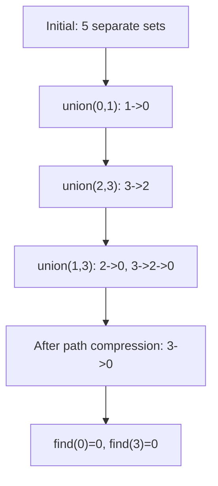

```java
class UnionFind {
    int[] parent, rank;
    public UnionFind(int n) {
        parent = new int[n];
        rank = new int[n];
        for (int i = 0; i < n; i++) {
            parent[i] = i;
        }
    }
    public int find(int x) {
        if (parent[x] != x) {
            parent[x] = find(parent[x]);
        }
        return parent[x];
    }
    public boolean union(int x, int y) {
        int px = find(x), py = find(y);
        if (px == py) return false;
        if (rank[px] < rank[py]) {
            parent[px] = py;
        } else if (rank[px] > rank[py]) {
            parent[py] = px;
        } else {
            parent[py] = px;
            rank[px]++;
        }
        return true;
    }
    public int countComponents(int n) {
        Set<Integer> roots = new HashSet<>();
        for (int i = 0; i < n; i++) {
            roots.add(find(i));
        }
        return roots.size();
    }
}
```

**Edge Cases:**
- Single element: one component
- No unions: n components
- All unions: 1 component
- Union same set: returns false

**Time Complexity**: O(α(n)) amortized per operation (α is inverse Ackermann, nearly constant)
**Space Complexity**: O(n)

**Similar Pattern Problems:**
- Accounts Merge
- Friends of Appropriate Ages
- Smallest String with Swaps

---

#### 12. **Minimum Spanning Tree - Kruskal's Algorithm**

**Problem Description:**
Given a connected weighted undirected graph, find the Minimum Spanning Tree (MST) - a subset of edges that connects all vertices with minimum total weight.

**Simple Analogy:**
Like connecting cities with roads at minimum cost, ensuring all cities are connected.

**Example Walkthrough:**

Input: `n = 3`, `connections = [[1,2,5],[1,3,6],[2,3,1]]`
```
Expected Output: 6

Edges sorted by weight:
[2,3,1] - weight 1
[1,2,5] - weight 5
[1,3,6] - weight 6

Process:
1. Add [2,3,1]: 2 and 3 connected, total=1
2. Add [1,2,5]: 1 connected to {2,3}, total=6
3. [1,3,6]: already connected (would form cycle), skip

MST edges: [2,3,1] + [1,2,5] = total weight 6
```

Input: `n = 4`, `connections = [[1,2,3],[3,4,4]]`
```
Expected Output: -1

Graph is not connected
Can't form spanning tree
```

**Key Insight - Sort Edges + Union-Find:**
- Sort all edges by weight
- Process from smallest to largest
- Add edge if it doesn't form a cycle (Union-Find check)
- Stop when we have n-1 edges (spanning tree complete)

**Why It Works:**
- Greedy works for MST (unlike many problems)
- Smallest edge that doesn't create cycle must be in some MST
- Union-Find efficiently detects cycles
- n-1 edges connect n vertices without cycles

**Visualization - Kruskal's:**
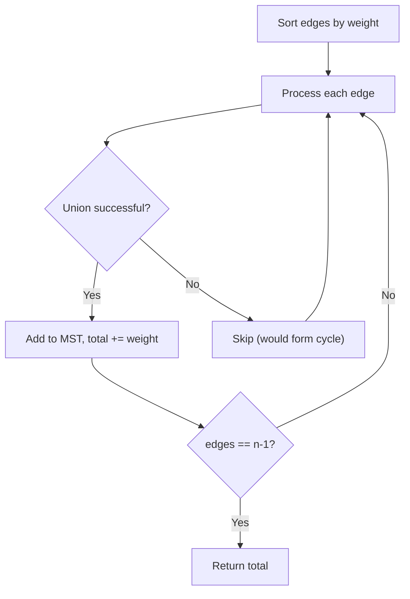

```java
public int minimumCost(int n, int[][] connections) {
    Arrays.sort(connections, (a, b) -> a[2] - b[2]);
    UnionFind uf = new UnionFind(n + 1);
    int totalCost = 0;
    int edgesUsed = 0;
    for (int[] edge : connections) {
        if (uf.union(edge[0], edge[1])) {
            totalCost += edge[2];
            edgesUsed++;
            if (edgesUsed == n - 1) break;
        }
    }
    return edgesUsed == n - 1 ? totalCost : -1;
}
```

**Edge Cases:**
- Already connected: processes until n-1 edges
- Disconnected: returns -1
- Single node: returns 0
- All same weights: works correctly

**Time Complexity**: O(E log E) for sorting
**Space Complexity**: O(V) for Union-Find

**Similar Pattern Problems:**
- Connect All Points
- Min Cost to Connect Sticks
- Optimize Water Distribution

---

## 📌 Key Patterns & Techniques

### 1. **Graph Representation**
- **Adjacency list**: Best for most problems (sparse graphs)
- **Adjacency matrix**: When you need O(1) edge lookup
- **Edge list**: For Kruskal's and similar algorithms

### 2. **Traversal Patterns**
- **BFS**: Shortest path (unweighted), level-order, spreading (islands)
- **DFS**: Topological sort, cycle detection, connectivity, backtracking

### 3. **Cycle Detection**
- **Directed**: Use colors (white=unvisited, gray=in-progress, black=done)
- **Undirected**: DFS with parent tracking, or Union-Find

### 4. **Shortest Path**
- **Unweighted**: BFS
- **Weighted (non-negative)**: Dijkstra
- **Weighted (general)**: Bellman-Ford
- **All pairs**: Floyd-Warshall

### 5. **Union-Find Applications**
- Connected components
- Cycle detection in undirected graphs
- Minimum spanning tree (Kruskal's)
- Dynamic connectivity

### 6. **Topological Sort Applications**
- Course prerequisites
- Build order
- Alien dictionary
- Task scheduling

---

## 🎯 Common Pitfalls to Avoid

- Not distinguishing directed vs undirected edges
- Forgetting to mark nodes as visited (infinite loops!)
- Wrong graph representation for problem type
- Not handling disconnected components
- Integer overflow in path weights (use long)
- Assuming positive weights when not guaranteed
- Incorrect Union-Find implementation (path compression + union by rank)
- Topological sort on cyclic graph (not possible!)
- Not handling edge cases (empty graph, single node)
- Confusing BFS and DFS use cases
- Forgetting that BFS gives shortest path only for unweighted graphs