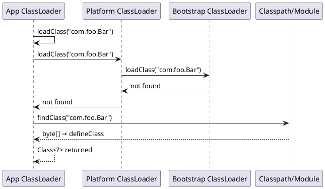

# JVM Architecture

> **JDK context:** The JVM spec has evolved steadily; major changes include
> invokedynamic (Java 7), the Metaspace replacing PermGen (Java 8),
> and modular runtime images + jlink (Java 9+).

## Mental Model

The JVM is a **specification**, not a program. It describes how `.class` files
must behave. Different vendors (HotSpot, OpenJ9, GraalVM, Azul Zulu) implement
that spec differently. What you actually run is an **implementation**.

Three layers, remember them as **compile → load → execute**:

```d2
direction: right

src: "MyClass.java" {
  shape: document
  style.fill: "#e3f2fd"
}

bytecode: "MyClass.class\n(bytecode)" {
  shape: document
  style.fill: "#fff9c4"
}

loader: "ClassLoader\n(Bootstrap → App)" {
  shape: hexagon
  style.fill: "#c8e6c9"
}

mem: "JVM Memory\n(Heap, Metaspace, Stacks)" {
  shape: cylinder
  style.fill: "#ffe0b2"
}

engine: "Execution Engine\n(Interpreter + JIT)" {
  shape: hexagon
  style.fill: "#f8bbd0"
}

native: "Native Code\n(CPU)" {
  shape: cylinder
  style.fill: "#d1c4e9"
}

src -> bytecode: "javac"
bytecode -> loader: "load"
loader -> mem: "link + init"
mem -> engine: "execute"
engine -> native: "compile hot paths"
```

---

## JDK vs JRE vs JVM

```d2
direction: down

jdk: JDK {
  style.fill: "#e3f2fd"
  style.stroke: "#1565c0"

  tools: "Dev Tools\njavac, jshell, javadoc,\njdb, jlink, javap" {
    style.fill: "#bbdefb"
  }
  jre: JRE {
    style.fill: "#c8e6c9"

    libs: "Core Libraries\njava.lang, java.util,\njava.io, java.nio..." {
      style.fill: "#a5d6a7"
    }
    jvm: JVM {
      style.fill: "#fff9c4"
      desc: "Runtime engine\nExecutes bytecode"
    }
  }
}
```

| Component | Contains | Who needs it |
|-----------|----------|--------------|
| **JVM** | Runtime engine that executes bytecode | Everyone running Java |
| **JRE** | JVM + core class libraries (`java.lang`, `java.util`, etc.) | End users running Java apps |
| **JDK** | JRE + compiler (`javac`), `jshell`, `javadoc`, `jdb`, tools | Developers |

Since Java 9, JRE and JDK are modular — you can build a **custom runtime image**
with `jlink` containing only the modules your app needs.

```bash
jlink --add-modules java.base,java.sql --output myjre
```

---

## Class Loaders

Class loaders are responsible for loading `.class` bytes into the JVM and
producing a `Class<?>` object. Java uses a **delegation hierarchy**:

```d2
direction: down

hierarchy: ClassLoader Hierarchy {
  style.fill: "#f5f5f5"

  bootstrap: "Bootstrap ClassLoader\n(loads java.base)\nnull reference" {
    style.fill: "#ffcdd2"
    style.stroke: "#c62828"
  }

  platform: "Platform ClassLoader\n(Java 9+, formerly Extension)\nJDK modules" {
    style.fill: "#fff9c4"
    style.stroke: "#f9a825"
  }

  app: "Application ClassLoader\n(Classpath)\nYour app + libs" {
    style.fill: "#c8e6c9"
    style.stroke: "#2e7d32"
  }

  custom: "Custom ClassLoaders\nPlugins, OSGi, Tomcat webapps" {
    style.fill: "#bbdefb"
    style.stroke: "#1565c0"
  }

  hierarchy.app -> hierarchy.platform: "delegates up"
  hierarchy.platform -> hierarchy.bootstrap: "delegates up"
  hierarchy.custom -> hierarchy.app: "delegates up"
}
```

**Delegation model:** When a classloader is asked for a class, it first asks its
parent. Only if the parent fails does it try to load the class itself.
This prevents user code from shadowing `java.lang.String`.



Key methods:

```java
protected Class<?> loadClass(String name, boolean resolve)
protected Class<?> findClass(String name)
protected Class<?> defineClass(String name, byte[] b, int off, int len)
```

- `loadClass` implements delegation — override with care.
- `findClass` is where you fetch bytes (usually network or disk).
- `defineClass` converts bytes → `Class<?>` — cannot be overridden.

### Writing a Custom ClassLoader

```java
public class MyLoader extends ClassLoader {
    private final Path root;

    public MyLoader(Path root) {
        super(MyLoader.class.getClassLoader()); // app loader as parent
        this.root = root;
    }

    @Override
    protected Class<?> findClass(String name) throws ClassNotFoundException {
        try {
            byte[] bytes = Files.readAllBytes(
                root.resolve(name.replace('.', '/') + ".class"));
            return defineClass(name, bytes, 0, bytes.length);
        } catch (IOException e) {
            throw new ClassNotFoundException(name, e);
        }
    }
}
```

**Use cases:** plugin systems, hot reload, bytecode instrumentation (agents),
isolating conflicting dependency versions (OSGi, Tomcat's webapp loaders).

---

## Runtime Data Areas

The JVM memory is split into areas with different lifetimes and sharing rules.

```d2
direction: down

jvm: JVM Runtime {
  style.fill: "#e3f2fd"

  shared: "Shared (all threads)" {
    style.fill: "#bbdefb"

    heap: "Heap" {
      style.fill: "#c8e6c9"
      desc: "All objects & arrays\nGC-managed"
    }
    meta: "Metaspace" {
      style.fill: "#c8e6c9"
      desc: "Class metadata, method bytecode\n(native memory since Java 8)"
    }
  }

  perthread: "Per-Thread" {
    style.fill: "#ffe0b2"

    stack: "JVM Stack" {
      style.fill: "#ffcc80"
      desc: "Frames: locals, operand stack, return address"
    }
    pc: "PC Register" {
      style.fill: "#ffcc80"
    }
    native: "Native Method Stack" {
      style.fill: "#ffcc80"
    }
  }
}
```

| Area | Scope | Contents | GC? |
|------|-------|----------|-----|
| **Heap** | Shared | All objects, arrays | ✅ |
| **Metaspace** | Shared | Class metadata, method bytecode, constant pool | ✅ (class unloading) |
| **JVM Stack** | Per thread | Frames: locals, operand stack, return address | ❌ (frames pop on return) |
| **PC Register** | Per thread | Address of current bytecode instruction | ❌ |
| **Native Method Stack** | Per thread | Frames for native (JNI) methods | ❌ |

### Heap Layout (HotSpot, generational)

```d2
direction: right

heap: Heap {
  style.fill: "#e8f5e9"

  young: "Young Generation" {
    style.fill: "#c8e6c9"

    eden: "Eden\n(new objects here)" {
      style.fill: "#a5d6a7"
    }
    s0: "Survivor 0" {
      style.fill: "#81c784"
    }
    s1: "Survivor 1" {
      style.fill: "#81c784"
    }
  }

  old: "Old (Tenured) Generation\n(after 15 promotions)" {
    style.fill: "#ffe0b2"
  }
}

heap.young.eden -> heap.young.s0: "minor GC"
heap.young.s0 -> heap.young.s1: "survives again"
heap.young.s1 -> heap.old: "after N promotions"
```

- New objects → **Eden**
- Survive a minor GC → copied to a **Survivor** space (S0/S1 alternate)
- After N promotions (default 15) → **Old Gen**
- Large objects may go directly to Old Gen (via TLAB bypass or `-XX:PretenureSizeThreshold`)

### Stack Frames

Every method call pushes a frame with four logical regions:

```d2
direction: right

l: "Locals"
o: "OperandStack"
d: "DynamicLinking"
r: "ReturnAddress"

l -> o
o -> d
d -> r
```

- **Locals** — holds `this`, method parameters, and local variables (slot-based).
- **Operand Stack** — where bytecode instructions push/pop values.
- **Dynamic Linking** — resolves constant-pool references at runtime.
- **Return Address** — where control returns after the method completes.

Stack size is fixed at thread creation (`-Xss`, default ~512 KB–1 MB). Deep
recursion → `StackOverflowError`.

### Metaspace vs PermGen

| | PermGen (≤ Java 7) | Metaspace (Java 8+) |
|---|---|---|
| Location | Inside heap | Native memory |
| Size | Fixed (`-XX:MaxPermSize`) | Grows dynamically (`-XX:MaxMetaspaceSize`) |
| Failure | `OutOfMemoryError: PermGen` | `OutOfMemoryError: Metaspace` |

PermGen was removed because its fixed size caused frequent OOMs in
app servers loading many classes.

---

## Execution Engine

Two ways to run bytecode:

1. **Interpreter** — reads and executes bytecode instruction-by-instruction.
   Fast to start, slow for hot loops.
2. **JIT Compiler** — compiles hot methods to native code.

```d2
direction: down

tiered: "Tiered Compilation" {
  style.fill: "#f5f5f5"

  src: "Bytecode" {
    style.fill: "#e3f2fd"
  }

  interp: "Interpreter (Level 0)\nExecutes instruction-by-instruction\nFast startup, slow for loops" {
    style.fill: "#fff9c4"
  }

  c1: "C1 Compiled (Level 1-3)\nFast compile, light optimization\nCollects profiling data" {
    style.fill: "#ffe0b2"
  }

  c2: "C2 Compiled (Level 4)\nSlow compile, aggressive optimization\nPeak throughput" {
    style.fill: "#a5d6a7"
  }

  tiered.src -> tiered.interp: "first run"
  tiered.interp -> tiered.c1: "after N invocations\n(~1500 by default)"
  tiered.c1 -> tiered.c2: "method hot +\nprofiling useful"
}
```

HotSpot contains **two JIT compilers**:

| Compiler | Level | Use |
|----------|-------|-----|
| **C1 (Client)** | Fast compile, less optimization | Quick startup |
| **C2 (Server)** | Slower compile, aggressive optimization | Peak throughput |

Control with:
```bash
-XX:+TieredCompilation          # default on
-XX:TieredStopAtLevel=1         # C1 only (fast startup)
-XX:CompileThreshold=10000      # invocations before JIT
```

### Common JIT Optimizations

- **Inlining** — the single biggest win. Small methods are copied into callers.
- **Escape analysis** — objects that never escape a method can be stack-allocated or scalar-replaced.
- **Loop unrolling** — reduces branch overhead.
- **Dead code elimination** — removes unreachable branches after inlining.
- **Lock elision / coarsening** — removes unnecessary synchronization.

---

## Bytecode — A Peek

```java
public int add(int a, int b) { return a + b; }
```

```text
0: iload_1
1: iload_2
2: iadd
3: ireturn
```

Read with:
```bash
javap -c MyClass.class
```

Key instruction families:
- `iload/aload/fload` — push local onto stack
- `iadd/isub/imul` — arithmetic
- `invokevirtual/invokestatic/invokespecial/invokeinterface/invokedynamic` — invocation
- `new/dup/invokespecial <init>` — the "create object" idiom

---

## Tricky Corners ⚠️

**`invokedynamic` (Java 7)** exists because lambda translation needed a
call-site-specific mechanism. `invokestatic`/`invokevirtual` couldn't express
"create a lambda class whose behavior depends on the capturing context."
Lambdas use `LambdaMetafactory` + `invokedynamic` — the actual implementation
class is generated at runtime.

**String constant pool lives in the heap (Java 7+).** Before Java 7 it was in
PermGen, which meant huge `intern()` usage could OOM PermGen. Java 7 moved it
to the heap.

**`OutOfMemoryError: Metaspace`** usually means a classloader leak — e.g.,
redeploying a webapp repeatedly without releasing old classloaders, so each
redeploy adds a fresh set of classes that are never unloaded.

**`StackOverflowError`** is not an OOM. It happens per thread when the call
stack exceeds `-Xss`. Deep recursion on a single thread is the classic cause.

**Custom classloaders break `==` on Class objects.** Two classloaders loading
the same `.class` bytes produce two distinct `Class<?>` instances. `instanceof`
and casts across them fail with `ClassCastException` — a common source of
plugin-system bugs.

**Bootstrap classloader is `null` in Java.** `String.class.getClassLoader()`
returns `null`, not a `ClassLoader` object. Code that assumes otherwise breaks.

---

## Common Pitfalls

- Confusing JVM (spec) with HotSpot (implementation).
- Assuming Metaspace has a fixed size — it grows until native memory runs out
  unless you set `-XX:MaxMetaspaceSize`.
- Calling `System.gc()` expecting deterministic collection — it's a *hint*.
- Believing `-Xmx` alone controls memory — total JVM RSS ≈ heap + metaspace +
  thread stacks + JIT code cache + direct buffers.

---

## Key Interview Tips

- Draw the classloader delegation diagram — it appears in 1 in 3 JVM interviews.
- Know heap vs stack vs metaspace and *what lives where*.
- Explain tiered compilation in one sentence: "Interpret, then C1 with profiling,
  then C2 for hot methods."
- Be ready to explain why PermGen was replaced by Metaspace.
- Mention that a custom classloader is the standard answer to "how does Tomcat
  isolate webapps?"

---

## Related

- [Object Lifecycle](object-lifecycle.md) — how objects are born and die
- [Memory References](../advanced/memory-references.md) — GC tuning & reference types
- [Reflection & Classloaders](../advanced/reflection-and-classloaders.md) — deeper classloader discussion