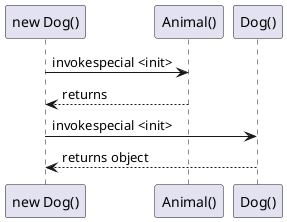
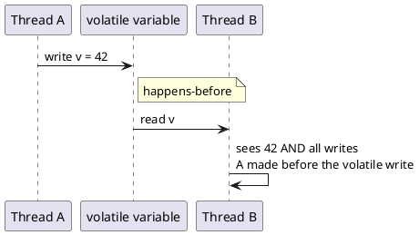

# Keyword Deep Dive

> **JDK context:** `var` arrived in Java 10. `transient` and `volatile` have
> been with us since Java 1.1. Their semantics haven't changed — but modern
> concurrency utilities (java.util.concurrent) make them easier to misuse
> by accident.

## Mental Model

Java keywords are **contracts with the compiler and JVM**. Some are enforced
at compile time (`final`, `static`), some at class-load time (`volatile`,
`transient`), some at runtime (`synchronized`). Understand which layer enforces
each rule, and you understand the keyword.

```d2
direction: right

kw: Java Keywords {
  style.fill: "#f5f5f5"

  compile: "Compile-time\n(final, static, this, super)" {
    style.fill: "#bbdefb"
  }
  classload: "Class-load / Runtime\n(volatile, transient)" {
    style.fill: "#c8e6c9"
  }
  runtime: "Runtime Semantics\n(var: syntactic only)" {
    style.fill: "#ffe0b2"
  }

  kw.compile -> kw.classload: "layered enforcement"
  kw.classload -> kw.runtime: "layered enforcement"
}
```

---

## `final` — Three Different Jobs

`final` means "cannot be changed" — but *what* cannot be changed depends on
where you apply it.

| Applied to | Means | Enforced by |
|---|---|---|
| **Variable** | Cannot be reassigned | Compiler |
| **Method** | Cannot be overridden | Compiler |
| **Class** | Cannot be extended | Compiler |

### `final` on variables

```java
final int x = 10;
x = 20;              // compile error

final List<String> list = new ArrayList<>();
list.add("a");       // OK — the reference is final, not the contents
list = new ArrayList<>();  // compile error
```

**The classic mistake:** `final` on a reference does **not** make the object
immutable. It prevents reassignment. `final List` can still be mutated.

For truly immutable contents, use `List.of(...)`, `Collections.unmodifiableList(...)`,
or a record.

### `final` on methods

Prevents overriding. Used to lock down behavior that subclasses must not change.

```java
class Base {
    public final void authenticate() { /* security-critical */ }
}
class Sub extends Base {
    // public void authenticate() {}  // compile error
}
```

JIT can also devirtualize `final` methods — a performance win.

### `final` on classes

Prevents extension. `String`, `Integer`, `BigDecimal` are `final`.

```java
public final class ImmutableValue { /* ... */ }
```

### `final` and JMM (Java Memory Model)

A `final` field has a **special initialization guarantee**: as long as the
object isn't leaked from the constructor, any thread that sees the object will
see the fully initialized `final` field — even without synchronization.

```java
class Safe {
    final int x;
    Safe(int x) { this.x = x; }
    // No synchronization needed for readers of x
}
```

This is a subtle but important guarantee for immutable objects.

---

## `super` — Explicit Superclass Access

`super` refers to the **immediate superclass**. Used for:

1. Calling a superclass constructor: `super(args)`
2. Calling a superclass method the subclass overrides: `super.method()`
3. Accessing a superclass field: `super.field`

### Constructor chain

```java
class Animal {
    Animal() { System.out.println("Animal"); }
}
class Dog extends Animal {
    Dog() {
        super();   // implicit if omitted
        System.out.println("Dog");
    }
}
```



### `super.method()` — bypassing override

```java
class Parent { void greet() { System.out.println("parent"); } }
class Child extends Parent {
    @Override void greet() {
        super.greet();     // call parent version
        System.out.println("child");
    }
}
```

### `super` in interfaces (Java 8+)

When two interfaces provide conflicting default methods, disambiguate:

```java
interface A { default void foo() { } }
interface B { default void foo() { } }
class C implements A, B {
    public void foo() { A.super.foo(); }   // InterfaceName.super.method()
}
```

### Tricky

- `super.super.method()` is **not valid** — you cannot skip a level.
- `super` is not a real object reference — it's a compiler construct that
  emits `invokespecial` instead of `invokevirtual`.
- Calling `super()` must be the **first statement** in a constructor.

---

## `this` — Reference to Current Instance

Covered in [Object Lifecycle](object-lifecycle.md#this--what-it-really-is).
Summary:

- Exists only inside instance methods and constructors.
- Slot 0 in the bytecode local variable table (`aload_0`).
- `this` in a **lambda** refers to the enclosing instance.
- `this` in an **anonymous class** refers to the anonymous instance.

See also [Nested Classes](nested-classes.md) for `Outer.this`.

---

## `static` — Class-Level, Not Instance-Level

`static` means "belongs to the class, not to any instance."

| Applied to | Effect |
|---|---|
| **Field** | One copy shared by all instances |
| **Method** | Can be called without an instance |
| **Block** | Runs once when the class is loaded |
| **Nested class** | No implicit outer instance (see [Nested Classes](nested-classes.md)) |

### Memory model

```d2
direction: down

memory: Memory Model {
  style.fill: "#f5f5f5"

  metaspace: "Metaspace" {
    style.fill: "#c8e6c9"
    desc: "One copy per class:\nstatic fields live here"
  }

  heap: Heap {
    style.fill: "#ffe0b2"
    desc: "One copy per instance:\ninstance fields live here"
  }
}
```

### Initialization order

```java
class Foo {
    static int a = init("static a");   // 1
    static int b;                      // 2

    static {                           // 3 (runs in order with field inits)
        b = init("static block");
    }

    int c = init("instance c");        // 4 (per instance)

    Foo() {                            // 5 (per instance)
        init("constructor");
    }

    static int init(String tag) {
        System.out.println(tag);
        return 0;
    }
}
```

Static initialization runs **once per classloader**, at first use (not
necessarily at program start). Order: static fields + static blocks in
textual order, then instance fields + constructor per instance.

### Tricky corners

**Can you override a static method?** No. You can **hide** it:

```java
class Parent { static void greet() { System.out.println("P"); } }
class Child extends Parent { static void greet() { System.out.println("C"); } }

Parent p = new Child();
p.greet();   // prints "P" — resolved on static type
```

**Can you access a static member via a null reference?**

```java
Foo f = null;
f.staticMethod();    // works! Compiler rewrites to Foo.staticMethod()
System.out.println(f.staticField);  // works too
```

The compiler resolves `f.staticMethod()` to `Foo.staticMethod()` and the `null`
reference is never dereferenced. This compiles and runs fine — a classic
interview trap.

**Can you call a non-static method from a static context?** No. `static` context
has no `this`.

---

## `transient` — Skip Serialization

A `transient` field is **not serialized**. On deserialization, it gets its
**default value** (0, false, null) — not the value it had before serialization.

```java
class User implements Serializable {
    private String username;
    private transient String password;   // not written to stream
    private transient int sessionToken;  // resets to 0 on deserialize
}
```

### When to use `transient`

- **Sensitive data** — passwords, tokens, keys
- **Derived data** — cache fields recomputable from other fields
- **Non-serializable dependencies** — `Thread`, `Socket`, `InputStream`
- **Loggers** — `Logger` is serializable but you don't want to persist it

### Tricky corner

`transient` has **no effect** on `Externalizable`. With `Externalizable`, you
write each field manually in `writeExternal` — you simply omit the transient
field.

More in [Serialization Deep Dive](../io-serialization/serialization-deep-dive.md).

---

## `volatile` — Visibility, Not Atomicity

`volatile` guarantees:

1. **Visibility** — writes are immediately visible to all threads
2. **Ordering** — happens-before relationship between write and subsequent read
3. **No atomicity** — `volatile int x; x++` is still not atomic

### The visibility problem

```java
class Worker {
    private boolean running = true;   // NOT volatile
    public void stop() { running = false; }
    public void run() {
        while (running) { /* do work */ }   // may never see the update!
    }
}
```

Without `volatile`, the JIT may cache `running` in a register and never re-read
from memory. The loop runs forever even after `stop()`.

Fix: `private volatile boolean running = true;`

### When `volatile` is enough

- **Simple flag** — start/stop signals
- **Publishing an immutable object reference**
- **Double-checked locking singleton** (with the caveat below)

### When `volatile` is NOT enough

Any read-modify-write operation:

```java
volatile int counter = 0;
counter++;   // three operations: read, +1, write — NOT atomic
```

Use `AtomicInteger` or `synchronized`.

### Does it work on `ArrayList`?

```java
volatile List<String> list = new ArrayList<>();
list.add("a");    // NOT thread-safe — the list itself isn't synchronized
```

`volatile` on a reference only guarantees that the *reference* is visible.
The object's internal state is not protected. This is a common mistake — do
**not** use `volatile ArrayList` and expect thread safety.

Use `CopyOnWriteArrayList` or `Collections.synchronizedList`.

### Happens-before in one picture



`volatile` is a **synchronization point**, but only for a single variable.

---

## `var` — Type Inference (Java 10+)

`var` is a **local variable type inference** feature. Not a dynamic type. The
compiler infers the type from the initializer, and it's fixed for the
variable's lifetime.

```java
var list = new ArrayList<String>();   // list is ArrayList<String>
var count = 10;                        // count is int
var name = "hello";                    // name is String
```

### Where `var` can be used

- Local variables with an initializer
- Enhanced for-loop variables
- try-with-resources variables
- Lambda parameters (Java 11+)

### Where `var` cannot be used

- Fields
- Method parameters
- Method return types
- Without an initializer (`var x;` — illegal)
- With `null` (`var x = null;` — illegal, no type to infer)
- In multi-variable declarations (`var a = 1, b = 2;` — illegal)

### `var var = "text";` — legal?

**Yes.** `var` is not a reserved keyword — it's a **contextual keyword**.
So `var var = "text";` is a valid Java 10+ statement declaring a variable
named `var` of type `String`.

```java
var var = "text";           // legal
System.out.println(var);    // prints text
```

Confusing but allowed. Don't do it in real code.

### `var` is not `dynamic`

```java
var x = 10;
x = "hello";   // compile error — x is int
```

### `var` in lambdas (Java 11+)

```java
list.forEach((var item) -> System.out.println(item));
```

Why? To allow annotations:

```java
list.forEach((@NonNull var item) -> ...);
```

Without `var`, you couldn't annotate a lambda parameter.

### `var` and readability

Use `var` when the type is **obvious from the right-hand side**:

```java
var users = new ArrayList<User>();     // obvious
var response = client.send(request);   // less obvious — prefer explicit type
```

---

## Tricky Corners Summary

| Question | Answer |
|---|---|
| Can you override a final method? | No |
| Can you override a static method? | No — it's hidden, not overridden |
| Can you access a static member via a null reference? | Yes — compiler rewrites |
| Does `final` make the object immutable? | No — only prevents reassignment |
| Does `volatile` make `i++` atomic? | No |
| Does `transient` on a field in `Externalizable` have effect? | No — you omit it manually |
| Does `var` make the variable dynamically typed? | No — compiler infers, fixed |
| Is `var var = "text";` legal? | Yes |
| Can you use `var` without an initializer? | No |
| Can you use `var` for fields or method params? | No |

---

## Common Pitfalls

- Assuming `final List` is immutable.
- Using `volatile` for compound operations (read-modify-write).
- Thinking `static` method dispatch is polymorphic — it's resolved at compile time.
- Forgetting `transient` fields reset to default after deserialization.
- Using `var` where the type is unclear from the RHS.

---

## Key Interview Tips

- Explain `final`'s three roles and the JMM initialization guarantee.
- Draw the visibility problem for `volatile` — why a non-volatile flag breaks.
- Know that `volatile` + `ArrayList` doesn't make the list thread-safe.
- Mention `super` is a compiler construct, not a reference.
- For `var`, remember: local-only, needs initializer, no `null`, contextual keyword.

---

## Related

- [Object Lifecycle](object-lifecycle.md) — `this`, GC, references
- [Nested Classes](nested-classes.md) — `static` nested vs inner, `Outer.this`
- [Synchronization](../concurrency/synchronization.md) — `volatile`, `synchronized`, JMM
- [Serialization Deep Dive](../io-serialization/serialization-deep-dive.md) — `transient` and serialization mechanics