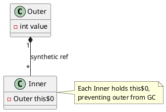

# Nested Classes

> **JDK context:** Nested classes have existed since Java 1.1. Java 8 introduced
> lambdas as a lighter-weight alternative to anonymous classes. Records (16)
> can be declared inside classes as static nested types.

## Mental Model

Java has **four kinds of nested classes**, distinguished by two questions:

1. Is it `static`?
2. Where is it declared?

```d2
direction: down

root: "Nested Classes" {
  style.fill: "#f5f5f5"

  static: "Static Nested Class" {
    style.fill: "#bbdefb"
    desc: "Declared static inside a class\nNo implicit outer instance"
  }

  inner: "Inner (Non-Static) Class" {
    style.fill: "#c8e6c9"
    desc: "Declared non-static inside a class\nHolds implicit Outer.this"
  }

  local: "Local Class" {
    style.fill: "#fff9c4"
    desc: "Declared inside a method/block\nScoped to the block"
  }

  anon: "Anonymous Class" {
    style.fill: "#ffe0b2"
    desc: "Declared inline, no name\nCaptures effectively-final locals"
  }
}
```

The single most important distinction: **static nested vs inner**. Everything
else follows from that plus scoping rules.

---

## Static Nested Class

```java
class Outer {
    private static int sharedValue = 10;

    static class Nested {
        void print() {
            System.out.println(sharedValue);   // can access private static members
        }
    }
}

// Usage — no outer instance required
Outer.Nested n = new Outer.Nested();
```

### Characteristics

- **No implicit reference** to an outer instance
- Can access **static** members of the outer class (including private)
- Cannot access **instance** members of the outer class directly
- Effectively a top-level class packaged inside another class for namespace grouping
- Can be `final`, `abstract`, extend, implement — like any top-level class

### When to use

- Grouping related helpers (`Map.Entry`, `Builder`)
- Reducing top-level clutter
- Preferring a nested type over a top-level one because it's only meaningful in context

```d2
direction: down

outer: "Outer Class" {
  style.fill: "#e3f2fd"

  nested: "Static Nested\n(no outer ref)" {
    style.fill: "#bbdefb"
  }
}
```

---

## Inner (Non-Static) Class

```java
class Outer {
    private int value = 42;

    class Inner {
        void print() {
            System.out.println(value);        // implicit Outer.this.value
            System.out.println(Outer.this.value);  // explicit form
        }
    }
}

// Usage — needs an outer instance
Outer outer = new Outer();
Outer.Inner inner = outer.new Inner();
```

### Characteristics

- **Holds an implicit reference** to the outer instance (`Outer.this`)
- Can access **all** members of the outer class, including private instance fields
- Each `Inner` instance is tied to a specific `Outer` instance
- The compiler generates a synthetic field `this$0` in the inner class

### How the compiler sees it

Your source code:

```java
class Outer {
    private int value = 42;
    class Inner {
        int getValue() { return value; }
    }
}
```

Compiled bytecode (decompiled view):

```java
class Outer {
    private int value = 42;

    public int access$000() { return value; }   // synthetic accessor

    class Inner {
        final Outer this$0;                     // synthetic outer reference

        Inner(Outer outer) {
            this.this$0 = outer;
        }

        int getValue() { return this.this$0.access$000(); }
    }
}
```

### Memory implications

Every `Inner` instance holds a strong reference to its `Outer`. That means:

- An `Inner` instance keeps the `Outer` instance alive as long as it lives
- Long-lived inner instances (e.g., stored in a static collection) leak the outer instance



**This is the classic "inner class memory leak"** — usually seen with listeners
or callbacks registered on a long-lived object.

### Usage syntax

```java
// Inside the outer class:
Inner inner = new Inner();           // implicit Outer.this

// Outside:
Outer o = new Outer();
Outer.Inner i = o.new Inner();       // note the odd syntax
```

The `outer.new Inner()` syntax is unusual and easy to forget in interviews.

---

## Local Class

Declared **inside a method** or block. Scoped to that block.

```java
void process() {
    int local = 10;   // effectively final

    class Helper {
        void print() {
            System.out.println(local);   // captures local
        }
    }

    Helper h = new Helper();
    h.print();
}
```

### Characteristics

- Scoped to the block where it's declared
- **Cannot be `static`** — local classes are never static
- Can access **effectively final** local variables of the enclosing method
- Has access to the enclosing instance's members (if in an instance method)
- Cannot have `static` members (except constants)

### Effectively final

A local variable is **effectively final** if it's never reassigned after
initialization:

```java
int x = 10;           // effectively final
x = 20;               // now NOT effectively final

// Later in the same method:
class Helper {
    void print() { System.out.println(x); }   // compile error if x was reassigned
}
```

This is why lambdas inside loops need a copy:

```java
for (int i = 0; i < 10; i++) {
    int copy = i;             // effectively final
    Runnable r = () -> System.out.println(copy);   // OK
    // Runnable r = () -> System.out.println(i);   // compile error
}
```

---

## Anonymous Class

Declared **inline**, no name. Combines declaration and instantiation in one
expression.

```java
Runnable r = new Runnable() {
    @Override
    public void run() {
        System.out.println("running");
    }
};
```

### Characteristics

- Extends a class or implements an interface
- Can override methods
- Can have instance initializers, fields, and methods
- **Cannot have constructors** (no name → no constructor name)
- Captures effectively final locals like local classes
- Has access to `Outer.this` (like an inner class)

### Syntax variants

```java
// Implement an interface
Comparator<String> c = new Comparator<String>() {
    public int compare(String a, String b) { return a.length() - b.length(); }
};

// Extend a class
Thread t = new Thread() {
    @Override public void run() { /* ... */ }
};

// With instance initializer (poor man's constructor)
Runnable r = new Runnable() {
    { System.out.println("init"); }   // instance initializer, not constructor
    public void run() { }
};
```

### The `this` trap — anonymous vs lambda

```java
class Outer {
    private int value = 42;

    Runnable anon = new Runnable() {
        @Override public void run() {
            System.out.println(this);            // the anonymous Runnable
            System.out.println(Outer.this.value); // 42 — reach into outer
        }
    };

    Runnable lambda = () -> {
        System.out.println(this);        // the Outer instance itself
        System.out.println(value);        // 42
    };
}
```

| Context | `this` refers to |
|---|---|
| Anonymous class | The anonymous instance |
| Lambda | The enclosing instance |

This trips people up because both look similar.

### Anonymous class vs lambda

| Feature | Anonymous class | Lambda |
|---|---|---|
| Can extend a class | ✅ | ❌ (interfaces only) |
| Can declare multiple methods | ✅ | ❌ (one SAM) |
| Has its own `this` | ✅ | ❌ (uses enclosing) |
| Can declare fields | ✅ | ❌ |
| Has instance initializer | ✅ | ❌ |
| Compiled to | `Outer$1.class` | `invokedynamic` + synthetic method |
| Overhead | New class per use | Cheaper (no class file) |

Use lambdas when the target is a functional interface. Use anonymous classes when
you need a class body or when the SAM isn't a functional interface.

---

## Full Comparison Table

| | Static Nested | Inner | Local | Anonymous |
|---|---|---|---|---|
| Modifier `static` | ✅ | ❌ | ❌ | ❌ |
| Implicit outer ref | ❌ | ✅ | ✅ (if in instance method) | ✅ |
| Can declare constructors | ✅ | ✅ | ✅ | ❌ |
| Can declare static members | ✅ | ✅ (constants only) | ✅ (constants only) | ✅ (constants only) |
| Declared inside method | ❌ | ❌ | ✅ | ✅ |
| Has a name | ✅ | ✅ | ✅ | ❌ |
| Access outer `private` | ✅ (static only) | ✅ | ✅ | ✅ |
| Effectively-final capture | ❌ | ❌ | ✅ | ✅ |

---

## When to Choose Which

```d2
direction: down

decision: "Which nested type?" {
  style.fill: "#f5f5f5"

  q1: "Need outer instance?" {
    style.fill: "#bbdefb"
  }
  q2: "Used in one method only?" {
    style.fill: "#c8e6c9"
  }
  q3: "Needs multiple methods?" {
    style.fill: "#fff9c4"
  }

  static: "Static Nested" {
    style.fill: "#a5d6a7"
  }
  inner: "Inner" {
    style.fill: "#81c784"
  }
  local: "Local" {
    style.fill: "#ffe082"
  }
  anon: "Anonymous" {
    style.fill: "#ffcc80"
  }
  lambda: "Lambda" {
    style.fill: "#ffb74d"
  }

  decision.q1 -> decision.static: "no"
  decision.q1 -> decision.q2: "yes"
  decision.q2 -> decision.local: "yes (with name)"
  decision.q2 -> decision.q3: "no"
  decision.q3 -> decision.inner: "yes"
  decision.q3 -> decision.anon: "no"
  decision.q3 -> decision.lambda: "if functional interface"
}
```

**Rule of thumb:**

1. Default to **static nested** — it has no hidden coupling.
2. Use **inner** only when you genuinely need the outer instance.
3. Prefer **lambdas** over anonymous classes when the target is functional.
4. Use **local classes** sparingly — they're hard to read.

---

## Tricky Corners ⚠️

**Inner classes hold a strong reference to the outer instance.** Long-lived
inner instances (listeners, callbacks) leak the outer. Use static nested + a
weak reference if the outer must not be kept alive.

**Anonymous classes cannot have constructors.** Use an instance initializer
`{ ... }` if you need initialization logic.

**`this` differs between lambda and anonymous class.** Interviewer favorite.

**Static nested classes are the only nested classes that can have static
members.** Inner, local, and anonymous classes can only have `static final`
constants.

**Local and anonymous classes capture locals by value.** If the local isn't
effectively final, compile error. This is why the "copy to a final local"
idiom exists in pre-Java-8 code.

**`Outer.this` syntax is required to refer to the outer instance when the
inner class shadows a member with the same name.**

```java
class Outer {
    String name = "outer";
    class Inner {
        String name = "inner";
        void print() {
            System.out.println(name);         // "inner"
            System.out.println(Outer.this.name);   // "outer"
        }
    }
}
```

**Anonymous class files are named `Outer$1.class`, `Outer$2.class`, ...** This
matters for stack traces and for tools that count class files.

**Records (Java 16) cannot be declared as inner classes.** They can be static
nested, local, or member — but not non-static inner.

---

## Common Pitfalls

- Using an inner class where a static nested class would do — accidental coupling.
- Holding inner instances in static collections — memory leak via `this$0`.
- Assuming `final` local capture is a runtime thing — it's compile-time.
- Confusing `this` in lambda vs anonymous class.
- Forgetting `outer.new Inner()` syntax.

---

## Key Interview Tips

- Name the **four** types of nested classes without hesitation.
- Explain `this$0` — the synthetic outer reference — and its memory implication.
- Draw the `this` comparison for lambda vs anonymous class.
- Know that anonymous classes cannot have constructors.
- Mention that static nested is the default choice for grouping helpers.

---

## Related

- [Keywords Deep Dive](keywords-deep-dive.md) — `static`, `final`, `this`
- [Object Lifecycle](object-lifecycle.md) — `this` semantics, GC reachability
- [Memory References](../advanced/memory-references.md) — avoiding leaks from inner classes