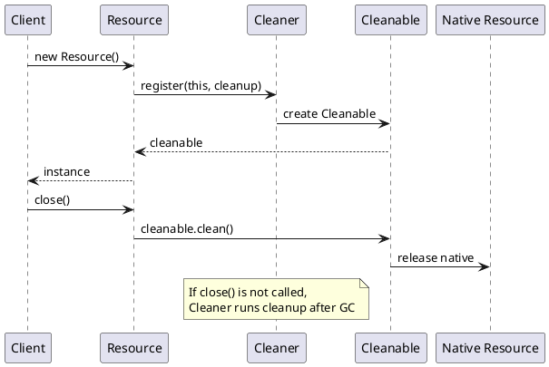

# Object Lifecycle

> **JDK context:** `Cleaner` (Java 9) replaced `finalize()` as the recommended
> cleanup mechanism. `finalize()` is deprecated for removal since Java 18.

## Mental Model

An object's life: **allocation → initialization → reachable → unreachable →
reclaimed**. You control the first two. The GC controls the last two.

```d2
direction: right

new: "new Foo()" {
  shape: hexagon
  style.fill: "#e3f2fd"
}
init: "<init>\nconstructor runs" {
  shape: rectangle
  style.fill: "#bbdefb"
}
reach: Reachable {
  shape: rectangle
  style.fill: "#c8e6c9"
  desc: "Reachable from GC root"
}
unreach: Unreachable {
  shape: rectangle
  style.fill: "#fff9c4"
  desc: "No path from any GC root"
}
gc: "GC\ncollects" {
  shape: hexagon
  style.fill: "#ffe0b2"
}
reclaimed: "Memory\nreclaimed" {
  shape: cylinder
  style.fill: "#f8bbd0"
}

new -> init -> reach -> unreach -> gc -> reclaimed
```

---

## Ways to Create an Object

Most engineers know `new`. Interviewers care about the *other* ways.

| Method | Example | Notes |
|--------|---------|-------|
| `new` | `new Foo()` | The standard path |
| Reflection | `Foo.class.getDeclaredConstructor().newInstance()` | Bypasses compile-time checks |
| `clone()` | `foo.clone()` | Requires `Cloneable`; shallow by default |
| Deserialization | `ois.readObject()` | `Constructor` is **not** called |
| Factory methods | `Integer.valueOf(5)`, `List.of(...)` | May return cached instances |
| `Unsafe.allocateInstance` | `sun.misc.Unsafe` | Skips constructor entirely |

### Tricky: Deserialization bypasses constructors

```java
class Foo implements Serializable {
    Foo() { System.out.println("constructor called"); }
}
```

When you deserialize a `Foo`, the constructor is **not** invoked. If you have
invariants enforced in the constructor, they can be violated by malicious or
corrupted streams. Use `readObject` to re-validate:

```java
private void readObject(ObjectInputStream in)
        throws IOException, ClassNotFoundException {
    in.defaultReadObject();
    if (age < 0) throw new InvalidObjectException("bad age");
}
```

---

## Object Header

Every object on the heap has a header:

```d2
direction: right

obj: Heap Object {
  style.fill: "#e3f2fd"

  mark: "Mark Word\n8 bytes" {
    style.fill: "#bbdefb"
    desc: "hashCode, GC age,\nlock state, biased-lock bits"
  }
  klass: "Klass Pointer\n4 bytes (compressed)" {
    style.fill: "#c8e6c9"
    desc: "Points to class metadata"
  }
  len: "Array Length\n4 bytes (arrays only)" {
    style.fill: "#fff9c4"
  }
  pad: Padding {
    style.fill: "#f8bbd0"
    desc: "Align to 8-byte boundary"
  }
  data: "Field Data" {
    style.fill: "#ffe0b2"
  }
}

mark -> klass -> len -> pad -> data
```

| Component | Size (typical, 64-bit) | Contents |
|-----------|------------------------|----------|
| Mark word | 8 bytes | hashCode, GC age, lock state, biased-lock bits |
| Klass pointer | 4 bytes (compressed) | Pointer to class metadata |
| Array length | 4 bytes (arrays only) | Number of elements |
| Padding | variable | Align to 8-byte boundary |

Consequences:
- An empty `new Object()` costs **16 bytes** on a 64-bit HotSpot JVM.
- A `new int[0]` costs 16 bytes (header) + 0 data.
- Field reordering by the JIT can change actual memory footprint.

---

## `this` — What It Really Is

`this` is a reference to the current instance. It exists **only inside instance
methods and constructors** — not in static context.

```java
class Foo {
    int x;
    Foo(int x) { this.x = x; }   // disambiguates
}
```

Bytecode-wise, `this` is slot 0 in the local variable table. In an instance
method `void m()`, `this` is implicitly `aload_0`.

**Tricky corners:**

- In a constructor, `this` is available *after* the superclass constructor
  completes. Before that, using `this` is a compile error.
- In an inner class, `Outer.this` refers to the enclosing instance.
- In a lambda, `this` refers to the **enclosing instance**, not the lambda —
  unlike an anonymous class, where `this` is the anonymous instance itself.

```java
class Outer {
    Runnable lambda = () -> System.out.println(this);       // Outer instance
    Runnable anon   = new Runnable() {
        public void run() { System.out.println(this); }     // anonymous Runnable
    };
}
```

```d2
direction: right

outer: Outer {
  style.fill: "#e3f2fd"

  lambda: Lambda {
    style.fill: "#c8e6c9"
    desc: "this = Outer instance"
  }
  anon: Anonymous Class {
    style.fill: "#ffe0b2"
    desc: "this = anonymous instance"
  }
}
```

That difference shows up in interviews constantly.

---

## Reachability and GC Roots

The GC does not count references. It asks: **is this object reachable from a
GC root?**

```d2
direction: down

roots: GC Roots {
  style.fill: "#ffcdd2"
  style.stroke: "#c62828"

  r1: Local vars in thread stacks
  r2: Static fields
  r3: JNI references
  r4: Active threads
  r5: Held monitors
}

o1: Object A {
  style.fill: "#c8e6c9"
}
o2: Object B {
  style.fill: "#c8e6c9"
}
o3: Object C {
  style.fill: "#c8e6c9"
}
orphan: Object D {
  style.fill: "#e0e0e0"
  desc: "No path from any root\n→ eligible for GC"
}

roots.r1 -> o1
roots.r2 -> o2
o1 -> o3
```

GC roots include:

- Local variables in live thread stacks
- Static fields of loaded classes
- JNI references
- Active threads themselves
- Synchronization monitors held
- Class objects loaded by the bootstrap loader

An object is eligible for GC when **no path exists** from any root.

### Reference Types (the four flavors)

```d2
direction: right

strength: Reference Strength {
  style.fill: "#e3f2fd"

  strong: Strong {
    style.fill: "#c8e6c9"
    desc: "Normal refs\nCollected: never while reachable"
  }
  soft: Soft {
    style.fill: "#fff9c4"
    desc: "SoftReference\nCollected: under memory pressure"
  }
  weak: Weak {
    style.fill: "#ffe0b2"
    desc: "WeakReference\nCollected: next GC cycle"
  }
  phantom: Phantom {
    style.fill: "#ffcdd2"
    desc: "PhantomReference\nCollected: after finalization"
  }
}

strong -> soft: "weaker"
soft -> weak: "weaker"
weak -> phantom: "weakest"
```

| Type | Class | Collected when | Use case |
|------|-------|----------------|----------|
| **Strong** | (normal refs) | Never while reachable | Regular objects |
| **Soft** | `SoftReference<T>` | Only under memory pressure | Memory-sensitive caches |
| **Weak** | `WeakReference<T>` | Next GC cycle | Canonicalizing maps, listeners |
| **Phantom** | `PhantomReference<T>` | After finalization, before reclaim | Precise cleanup scheduling |

```java
Map<Key, Value> cache = new WeakHashMap<>();
```

A `WeakHashMap` holds keys weakly. When the only reference to a key is the map
itself, the entry becomes eligible for GC. Classic use: attaching metadata to
objects without preventing their collection.

**Soft vs Weak — the interview line:** soft references are kept until memory is
tight; weak references are cleared on the very next GC regardless of pressure.

See [Memory References](../advanced/memory-references.md) for depth.

---

## Garbage Collection — The High-Level View

Every HotSpot collector is a variation on the same idea:
**generational hypothesis** — most objects die young.

| Collector | Best for | Pause behavior |
|-----------|----------|----------------|
| **Serial** | Small heaps, single-core | Stop-the-world, small |
| **Parallel** | Throughput-oriented batch jobs | Stop-the-world, parallel |
| **CMS** (deprecated, removed in 14) | Low latency, older | Mostly concurrent |
| **G1** (default since 9) | Balanced, general purpose | Region-based, predictable pauses |
| **ZGC** (15+) | Very large heaps, ultra-low pause | Sub-millisecond pauses |
| **Shenandoah** (12+) | Similar to ZGC | Concurrent compaction |

### G1 in one paragraph

Heap is split into ~2048 equal **regions**. Regions are dynamically tagged as
Eden, Survivor, Old, or Humongous (large objects). G1 collects the *garbage-first*:
regions with the most garbage are collected first, hitting a pause target
(`-XX:MaxGCPauseMillis`). This makes pauses predictable without scanning the
whole heap.

```d2
direction: right

g1: G1 Heap {
  style.fill: "#e8f5e9"

  row1: {
    e1: Eden { style.fill: "#a5d6a7" }
    e2: Eden { style.fill: "#a5d6a7" }
    s1: S { style.fill: "#81c784" }
    o1: Old { style.fill: "#ffe0b2" }
    h1: Humongous { style.fill: "#ffcdd2" }
  }
  row2: {
    o2: Old { style.fill: "#ffe0b2" }
    e3: Eden { style.fill: "#a5d6a7" }
    o3: Old { style.fill: "#ffe0b2" }
    s2: S { style.fill: "#81c784" }
    free1: Free { style.fill: "#eeeeee" }
  }
  row3: {
    free2: Free { style.fill: "#eeeeee" }
    o4: Old { style.fill: "#ffe0b2" }
    e4: Eden { style.fill: "#a5d6a7" }
    free3: Free { style.fill: "#eeeeee" }
    o5: Old { style.fill: "#ffe0b2" }
  }
}
```

---

## `finalize()` — Why It's Dead

`finalize()` is called by the GC before reclaiming an object, *at most once*.

Problems:
- No guarantee of execution time (or execution at all).
- Can resurrect objects.
- Runs on a single finalizer thread → easily a bottleneck.
- Exceptions thrown are silently swallowed.

**Modern replacement:** `java.lang.ref.Cleaner` (Java 9+).

```java
class Resource implements AutoCloseable {
    private static final Cleaner CLEANER = Cleaner.create();
    private final Cleaner.Cleanable cleanable;

    Resource() {
        this.cleanable = CLEANER.register(this, () -> closeNative());
    }

    @Override public void close() { cleanable.clean(); }

    private static void closeNative() { /* release native resource */ }
}
```



`Cleaner` is safer: no resurrection, no `finalize` chain, decoupled cleanup.

---

## Tricky Corners ⚠️

**`System.gc()` is a hint, not a command.** With `-XX:+DisableExplicitGC` it is
ignored entirely (except for NIO direct buffer cleanup — HotSpot has a special
path for that).

**Objects with a non-trivial `finalize()` take two GC cycles.** First cycle
enqueues them for finalization; second cycle actually reclaims. In HotSpot, an
entire generation may be forced to survive if it contains finalizable objects.

**An object can be "collected" while still referenced** — if the reference
lives in a local variable that the JIT determines is dead. This breaks naive
`finalize()`-based cleanup (hence `Reference.reachabilityFence`).

**`OutOfMemoryError: GC overhead limit exceeded`** — the JVM gives up when more
than 98% of time is spent GCing and less than 2% of heap is recovered.

**Strongly reachable from a `ThreadLocal`** keeps an object alive as long as the
thread does. In thread-pool applications, `ThreadLocal` leaks are a top cause
of "why isn't this being collected."

---

## Common Pitfalls

- Relying on `finalize()` for cleanup — use try-with-resources or `Cleaner`.
- Leaking through `ThreadLocal` in pooled threads.
- Assuming `System.gc()` frees memory instantly.
- Using `WeakHashMap` for values that reference their own keys — creates a
  self-loop that prevents collection.

---

## Key Interview Tips

- Explain the four reference types in one table (above).
- Mention `Cleaner` when asked "how do you clean up after `finalize`?"
- Know that deserialization skips constructors.
- Differentiate `this` in lambda vs anonymous class — a favorite trap.
- For "how many objects," see [String Internals](../strings/string-internals.md) —
  similar counting logic applies here (autoboxing caches, etc.).

---

## Related

- [JVM Architecture](jvm-architecture.md) — where objects live
- [Memory References](../advanced/memory-references.md) — deep dive on refs + GC tuning
- [Serialization Deep Dive](../io-serialization/serialization-deep-dive.md) — deserialization path