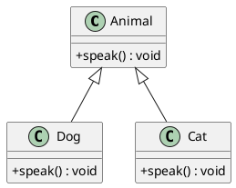
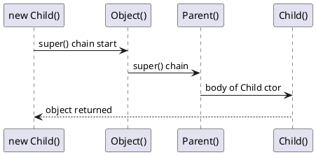
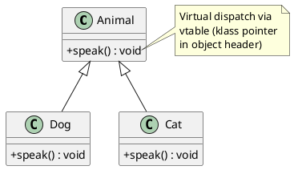

# OOP Principles

> **JDK context:** Modern Java (8+) added default/static/private methods in
> interfaces, blurring the line with abstract classes. Records (16) and sealed
> classes (17) add new tools for modeling.

## Mental Model

OOP in Java is four pillars + two design tools:

- **Encapsulation** — hide state, expose behavior
- **Inheritance** — reuse via `extends`
- **Polymorphism** — one interface, many forms
- **Abstraction** — expose what, hide how

Design tools: **composition** (has-a) and **interfaces** (contracts).

```d2
direction: right

oop: OOP Pillars {
  style.fill: "#e3f2fd"

  enc: Encapsulation {
    style.fill: "#bbdefb"
  }
  inh: Inheritance {
    style.fill: "#bbdefb"
  }
  poly: Polymorphism {
    style.fill: "#bbdefb"
  }
  abs: Abstraction {
    style.fill: "#bbdefb"
  }
}

tools: Design Tools {
  style.fill: "#fff3e0"

  comp: Composition (has-a) {
    style.fill: "#ffe0b2"
  }
  iface: Interfaces (contracts) {
    style.fill: "#ffe0b2"
  }
}

oop.enc -> tools.comp: "often combined"
oop.abs -> tools.iface: "implemented via"
```

---

## Encapsulation

Bundle state + behavior, restrict access to internals.

```java
public class BankAccount {
    private BigDecimal balance;  // hidden

    public void deposit(BigDecimal amount) {   // controlled mutation
        if (amount.signum() <= 0) throw new IllegalArgumentException();
        balance = balance.add(amount);
    }

    public BigDecimal getBalance() { return balance; }  // read-only view
}
```

Java gives us four access levels:

| Modifier | Class | Package | Subclass (other pkg) | World |
|----------|:-----:|:-------:|:--------------------:|:-----:|
| `private` | ✅ | ❌ | ❌ | ❌ |
| *(package-private)* | ✅ | ✅ | ❌ | ❌ |
| `protected` | ✅ | ✅ | ✅ | ❌ |
| `public` | ✅ | ✅ | ✅ | ✅ |

```d2
direction: right

public: public {
  style.fill: "#c8e6c9"
}
protected: protected {
  style.fill: "#fff9c4"
}
pkg: package-private {
  style.fill: "#ffe0b2"
}
private: private {
  style.fill: "#ffcdd2"
}

public -> protected: "narrower"
protected -> pkg: "narrower"
pkg -> private: "narrowest"
```

**Interview nuance:** `protected` is *weaker* than package-private in one
respect — a subclass in a different package can only access the inherited
`protected` member through `this`, not through another instance.

```java
package a;
public class Parent { protected int x; }

package b;
public class Child extends Parent {
    void m(Parent p) {
        // this.x = 1;   OK
        // p.x = 1;      compile error
    }
}
```

That rule exists to prevent breaking encapsulation of unrelated instances.

---

## Inheritance

```java
class Animal { void speak() {} }
class Dog extends Animal { @Override void speak() { System.out.println("Woof"); } }
```

**Single inheritance only** for classes. You can extend one class, implement
many interfaces.



### Why Java doesn't support multiple inheritance of classes

The diamond problem:

```d2
direction: down

A: A { 
  shape: class
  +foo()
}
B: B {
  shape: class
  +foo()
}
C: C {
  shape: class
  +foo()
}
D: D {
  shape: class
  +foo() ???
}

A -> B
A -> C
B -> D
C -> D
```

C++ resolves this with virtual inheritance; Java chose simplicity and safety.
Multiple inheritance of **type** is allowed via interfaces, and since Java 8,
interfaces can have default methods — but the compiler **forces you to
disambiguate**:

```java
interface A { default void foo() {} }
interface B { default void foo() {} }
class C implements A, B {
    @Override public void foo() { A.super.foo(); }  // explicit
}
```

If a class inherits the same method from a superclass and an interface, the
**superclass wins** — no error.

### Constructor chain

When you `new Child()`:
1. `Object()` constructor runs
2. `Parent()` constructor runs
3. `Child()` constructor runs



Every constructor must call `super(...)` explicitly, or the compiler inserts a
no-arg `super()` as the first statement. If the parent has no no-arg
constructor and you don't call `super(args)`, compile error.

**Tricky:** Calling an overridden method from a constructor runs the child's
version before the child's fields are initialized.

```java
class Parent {
    Parent() { print(); }        // calls Child.print()
    void print() { System.out.println("parent"); }
}
class Child extends Parent {
    int x = 42;
    @Override void print() { System.out.println(x); }  // prints 0!
}
```

`new Child()` prints **0**, not 42 — the field initializer hasn't run yet.
Never call overridable methods from a constructor.

---

## Polymorphism

Two forms:

**Compile-time (static)** — method overloading. The method chosen is fixed at
compile time based on **static types** of the arguments.

**Runtime (dynamic)** — method overriding. The method chosen at runtime based
on the **actual type** of the receiver.

```d2
direction: down

poly: Polymorphism {
  style.fill: "#e8eaf6"

  ct: Compile-time {
    style.fill: "#c5cae9"
    desc: "Method Overloading\nChosen at compile time\nBased on static types"
  }
  rt: Runtime {
    style.fill: "#9fa8da"
    desc: "Method Overriding\nChosen at runtime\nBased on actual type (vtable)"
  }
}
```

```java
Animal a = new Dog();
a.speak();   // Dog.speak() at runtime
```



### Method overloading — the tricky rules

Overload resolution happens in three phases:

1. **Phase 1** — no boxing/unboxing, no varargs. Only widening primitive
   conversions allowed.
2. **Phase 2** — allow boxing/unboxing.
3. **Phase 3** — allow varargs.

```java
void m(long x)  { System.out.println("long"); }
void m(Integer x) { System.out.println("Integer"); }

m(5);   // prints "long" — Phase 1 picks widening over boxing
```

More traps:

```java
void m(Object o) { }
void m(String s) { }
m(null);   // most specific → String wins
```

If two overloads are equally specific (e.g., `String` and `Integer` for
`null`), compile error: *reference to m is ambiguous*.

### Method overriding — the rules

- Same name, same parameter types
- Return type must be **covariant** (same or subtype)
- Cannot reduce visibility
- Cannot throw broader checked exceptions
- `@Override` catches typos at compile time — always use it

### Can we override static methods?

**No.** Static methods are bound at compile time. A subclass can declare a
static method with the same signature — that's **method hiding**, not
overriding.

```java
class Parent { static void greet() { System.out.println("P"); } }
class Child extends Parent { static void greet() { System.out.println("C"); } }

Parent p = new Child();
p.greet();   // prints "P" — resolved on static type, not runtime type
```

This trips people up because it looks polymorphic but isn't.

### Can we override a final method?

No. `final` methods cannot be overridden. `final` classes cannot be extended.

---

## Upcasting and Downcasting

**Upcasting** — subclass → superclass. Always safe, implicit.

```java
Animal a = new Dog();  // upcast
```

**Downcasting** — superclass → subclass. Requires explicit cast, may fail at
runtime with `ClassCastException`.

```java
Animal a = new Dog();
Dog d = (Dog) a;       // OK
Cat c = (Cat) a;       // ClassCastException
```

**Pattern matching for `instanceof` (Java 16+) — do not skip this:**

```java
if (a instanceof Dog d) {
    d.bark();          // d is in scope, already cast
}
```

Combines check + cast. Especially powerful with sealed classes and pattern
switching (Java 21).

---

## Composition vs Inheritance

**Inheritance is the tightest coupling** in OOP. Use it only when the subtype
truly *is-a* specialization of the parent.

**Composition** — hold a reference to another object and delegate:

```java
class Engine { void start() { } }

class Car {
    private final Engine engine = new Engine();   // has-a

    void start() { engine.start(); }              // delegate
}
```

**Rule of thumb:** prefer composition. Inheritance exposes the entire parent
API — including things that may change — and forces you to accept every parent
method as part of your contract.

The classic textbook illustration is `Stack extends Vector` in `java.util`.
This was a design mistake because a Stack inherits `add(int, E)` and can be
misused. It's why modern `ArrayDeque` doesn't extend `Vector`.

---

## Abstract Class vs Interface

| Aspect | Abstract Class | Interface |
|--------|----------------|-----------|
| Multiple inheritance | ❌ (single) | ✅ |
| State (fields) | ✅ (any) | ⚠️ only `public static final` |
| Constructors | ✅ | ❌ |
| Method bodies | ✅ | ✅ (default / static since 8; private since 9) |
| Access modifiers on methods | any | only `public` (or `private` since 9) |
| When to use | shared state + partial impl | pure contract / capability |

**"When to choose which" — the interview answer:**

Use an **interface** when you're describing *what* something can do, and you
expect unrelated classes to implement it. Use an **abstract class** when
you're sharing *state and partial implementation* across tightly related
classes.

Since Java 8, the line has blurred — interfaces can now carry default
implementations. The remaining distinction: **abstract classes can have
state** (instance fields), interfaces cannot.

### Diamond resolution example

```java
interface A { default void foo() { System.out.println("A"); } }
interface B { default void foo() { System.out.println("B"); } }

// class C implements A, B { }              // compile error — conflict
class C implements A, B {
    @Override public void foo() { A.super.foo(); }   // explicit choice
}
```

If a superclass provides the method and an interface also provides it as
default, the **superclass wins**.

### Modern alternatives — sealed classes and records

Java 17's **sealed classes** restrict which classes can extend a type —
useful when you want a closed hierarchy (like an algebraic data type):

```java
public sealed interface Shape permits Circle, Square { }
record Circle(double radius) implements Shape { }
record Square(double side) implements Shape { }
```

Java 16's **records** provide concise immutable data holders — a replacement
for many small abstract class patterns.

---

## Common Pitfalls

- Assuming `final` on a class makes all its fields immutable.
- Confusing method overloading (compile-time) with overriding (runtime).
- Forgetting that constructors call an overridable method before subclass
  fields are initialized.
- Using `protected` on fields (breaks encapsulation — prefer `private` +
  getters/setters).
- Assuming interface methods are all abstract since Java 8 — they may have
  default implementations.
- Using inheritance purely for code reuse rather than modeling *is-a*.

---

## Key Interview Tips

- Recite the four pillars without hesitation.
- Explain the difference between overriding and hiding with an example.
- Know the **overload resolution order**: widening → boxing → varargs.
- Say "prefer composition over inheritance" with the `Stack extends Vector`
  example.
- Know the abstract-class vs interface table cold.
- Mention that `instanceof` pattern matching (16+) and switch patterns (21)
  change how you write polymorphic code.

---

## Related

- [Nested Classes](nested-classes.md) — inner classes, `this$0`
- [Records & Enums](records-and-enums.md) — modern data modeling
- [Keywords Deep Dive](keywords-deep-dive.md) — `final`, `static`, `super`
- [Patterns in Java](../design-patterns-java/patterns-in-java.md) — Strategy, Template Method