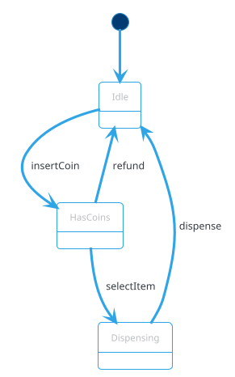

# Behavioral Patterns

Behavioral patterns deal with **communication between objects** — how they interact, who calls whom, and how responsibilities are distributed. They're the patterns you'll use most in LLD interviews.

**Strategy**, **Observer**, and **State** are the workhorses. **Command** appears in undo/redo. **Template Method** structures algorithms. **Chain of Responsibility** handles sequential processing. **Iterator** is fundamental to collections.

---

## 📐 Why Behavioral Patterns?

- **Encapsulate varying behavior** — Strategy
- **Decouple publishers from subscribers** — Observer
- **Model state transitions cleanly** — State
- **Encapsulate requests** — Command
- **Share algorithm skeletons** — Template Method
- **Traverse collections uniformly** — Iterator
- **Pass requests along handlers** — Chain of Responsibility

---

## 1. Strategy

**Define a family of algorithms, encapsulate each, and make them interchangeable.**

### Problem

Multiple algorithms solve the same problem (pricing, allocation, encoding). You want to **swap them at runtime** without `if/else` chains.

### ❌ Without Strategy

```java
public Money calculateFee(Ticket t, String pricingType) {
    if (pricingType.equals("HOURLY")) {
        return Money.of(2.0 * t.hours(), "USD");
    } else if (pricingType.equals("FLAT")) {
        return Money.of(5.0, "USD");
    } else if (pricingType.equals("SURGE")) {
        return Money.of(3.0 * t.hours() * 1.5, "USD");
    }
    throw new IllegalArgumentException("Unknown pricing: " + pricingType);
}
```

**Problem:** Every new pricing rule requires editing this method (violates OCP).

### ✅ With Strategy

```java
public interface PricingStrategy {
    Money calculateFee(Ticket ticket);
}

public final class HourlyPricing implements PricingStrategy {
    private final Money perHour;
    public HourlyPricing(Money perHour) { this.perHour = perHour; }
    @Override public Money calculateFee(Ticket t) {
        return perHour.multiply(t.hours());
    }
}

public final class FlatPricing implements PricingStrategy {
    private final Money flat;
    public FlatPricing(Money flat) { this.flat = flat; }
    @Override public Money calculateFee(Ticket t) { return flat; }
}

public final class SurgePricing implements PricingStrategy {
    private final PricingStrategy base;
    private final double multiplier;
    public SurgePricing(PricingStrategy base, double multiplier) {
        this.base = base; this.multiplier = multiplier;
    }
    @Override public Money calculateFee(Ticket t) {
        return base.calculateFee(t).multiply(multiplier);
    }
}
```

**Usage:**
```java
PricingStrategy pricing = new SurgePricing(new HourlyPricing(Money.of(2.0, "USD")), 1.5);
Money fee = pricing.calculateFee(ticket);
```

### Benefits

- **OCP** — add new strategies without editing existing code
- **Runtime swap** — change behavior dynamically
- **Testability** — each strategy tested in isolation
- **Composition** — combine strategies (Surge wraps Hourly)

### When to Use Strategy

✅ **Multiple algorithms** for the same problem
✅ **Runtime selection** based on config/context
✅ **Avoid conditional** complexity
✅ **Family of interchangeable** behaviors

❌ Only one algorithm → no strategy
❌ Behavior doesn't vary → keep it simple

### In LLD Problems

Strategy is **the single most-used pattern** in LLD:

- **Parking Lot** — pricing, allocation
- **Vending Machine** — payment
- **Chess** — piece movement
- **Rate Limiter** — algorithms (token bucket, leaky bucket)
- **Cache** — eviction (LRU, LFU, FIFO)
- **Logger** — formatting, filtering
- **Splitwise** — split algorithms (equal, exact, percentage)

### Strategy vs State

| Aspect | Strategy | State |
|---|---|---|
| Intent | Swap algorithms | Change behavior with state |
| Transitions | External (client picks) | Internal (state drives) |
| Typical use | Pricing, encoding | Order lifecycle, vending |
| Awareness of next | No | Yes (state transitions) |

**Rule of thumb:** If the "next behavior" depends on the current one, it's **State**. If the client picks, it's **Strategy**.

---

## 2. Observer

**Define a one-to-many dependency so that when one object changes state, all dependents are notified.**

### Problem

Multiple components (display, metrics, logger, cache) need to **react to changes** in another object. Hard-coding them creates tight coupling.

### ❌ Without Observer

```java
public class ParkingLot {
    private final DisplayBoard display;
    private final MetricsCollector metrics;

    public void onSpotChanged(ParkingSpot spot) {
        display.update(spot);
        metrics.record(spot);
        // Adding a new listener requires editing ParkingLot
    }
}
```

**Problem:** `ParkingLot` knows about every observer. Adding one requires modifying `ParkingLot`.

### ✅ With Observer

```java
public interface ParkingObserver {
    void onSpotChanged(ParkingSpot spot);
}

public class ParkingLot {
    private final List<ParkingObserver> observers = new CopyOnWriteArrayList<>();

    public void registerObserver(ParkingObserver o) { observers.add(o); }
    public void unregisterObserver(ParkingObserver o) { observers.remove(o); }

    private void notifyObservers(ParkingSpot spot) {
        for (ParkingObserver o : observers) {
            try {
                o.onSpotChanged(spot);
            } catch (Exception e) {
                // log; don't let one observer break others
            }
        }
    }

    public Ticket enter(Vehicle v) {
        // ... allocate spot
        notifyObservers(spot);
        return ticket;
    }
}
```

**Usage:**
```java
lot.registerObserver(new DisplayBoard());
lot.registerObserver(new MetricsCollector());
lot.registerObserver(new AuditLog());
```

### Push vs Pull

**Push** — observer receives the changed data:
```java
void onSpotChanged(ParkingSpot spot);
```

**Pull** — observer queries the subject:
```java
void onEvent(EventType type, Object source);
```

**Push is simpler** for a few event types. **Pull is more flexible** for many.

### Synchronous vs Asynchronous

**Synchronous** — notify within the caller's thread:
```java
private void notifyObservers(ParkingSpot spot) {
    for (ParkingObserver o : observers) o.onSpotChanged(spot);
}
```
- Pros: Simple; ordering guaranteed
- Cons: Slow observer blocks the publisher

**Asynchronous** — notify on a separate thread:
```java
private final ExecutorService notifier = Executors.newVirtualThreadPerTaskExecutor();

private void notifyObservers(ParkingSpot spot) {
    for (ParkingObserver o : observers) {
        notifier.submit(() -> o.onSpotChanged(spot));
    }
}
```
- Pros: Publisher is never blocked
- Cons: Ordering not guaranteed; errors harder to propagate

**Recommendation:** Synchronous for in-process events with fast observers; asynchronous for slow observers (I/O).

### Error Isolation

**One observer's failure must not break others:**

```java
for (ParkingObserver o : observers) {
    try {
        o.onSpotChanged(spot);
    } catch (Exception e) {
        log.error("Observer failed: {}", o, e);
    }
}
```

### Thread Safety

- Use **`CopyOnWriteArrayList`** for the observers list (safe iteration while adding/removing)
- Or **`ConcurrentHashMap.newKeySet()`** for deduplication
- **Never** iterate a plain `ArrayList` while another thread modifies it

### Weak References

Long-lived subjects holding strong references to short-lived observers → **memory leaks**. Consider `WeakReference<Observer>` when appropriate. Usually not needed in LLD.

### When to Use Observer

✅ **One-to-many** notification
✅ **Decoupling** publisher from subscribers
✅ **Event-driven** design
✅ **Multiple reactions** to one event

❌ Single subscriber → direct call
❌ Rarely changes → direct call

### In LLD Problems

Observer appears in almost every LLD problem that has "notification":

- **Parking Lot** — display boards, metrics
- **Elevator** — floor displays, arrival notifications
- **Order** — confirmation email, SMS, analytics
- **Pub-Sub** — the canonical observer pattern
- **Chat** — message delivery to subscribers
- **Stock Trading** — price change notifications

### Observer vs Pub-Sub

| Aspect | Observer | Pub-Sub |
|---|---|---|
| Coupling | Subject knows observers | Broker decouples both |
| Communication | Direct method call | Via broker (queue) |
| Async | Optional | Usually async |
| Cross-process | No (in-process) | Yes |

**Observer** is the in-process version; **Pub-Sub** adds a broker for distribution.

---

## 3. State

**Allow an object to alter its behavior when its internal state changes. The object appears to change its class.**

### Problem

An object behaves differently based on its state. Encoding this with `if/else` on a state enum leads to complexity.

### ❌ Without State

```java
public class VendingMachine {
    private String state = "IDLE";
    private int coins = 0;

    public void insertCoin(int amount) {
        if (state.equals("IDLE")) {
            coins += amount;
            state = "HAS_COINS";
        } else if (state.equals("HAS_COINS")) {
            coins += amount;
        } else if (state.equals("DISPENSING")) {
            throw new IllegalStateException("Cannot insert coin while dispensing");
        }
    }

    public void selectItem(String item) {
        if (state.equals("IDLE")) {
            throw new IllegalStateException("Insert coin first");
        } else if (state.equals("HAS_COINS")) {
            if (coins >= price) {
                state = "DISPENSING";
                // ... dispense
            }
        }
        // ...
    }
}
```

**Problem:** Every method needs a state check. Adding a state touches many methods.

### ✅ With State

```java
public interface VendingState {
    void insertCoin(VendingMachine m, int amount);
    void selectItem(VendingMachine m, String item);
    void dispense(VendingMachine m);
    void refund(VendingMachine m);
}

public final class IdleState implements VendingState {
    public void insertCoin(VendingMachine m, int amount) {
        m.addCoins(amount);
        m.setState(new HasCoinsState());
    }
    public void selectItem(VendingMachine m, String item) {
        throw new IllegalStateException("Insert coin first");
    }
    public void dispense(VendingMachine m) { throw new IllegalStateException("No item selected"); }
    public void refund(VendingMachine m) { /* nothing */ }
}

public final class HasCoinsState implements VendingState {
    public void insertCoin(VendingMachine m, int amount) { m.addCoins(amount); }
    public void selectItem(VendingMachine m, String item) {
        if (m.coins() < m.priceOf(item)) throw new IllegalStateException("Insufficient");
        m.setSelectedItem(item);
        m.setState(new DispensingState());
    }
    public void dispense(VendingMachine m) { throw new IllegalStateException("No item selected"); }
    public void refund(VendingMachine m) { m.refundCoins(); m.setState(new IdleState()); }
}

public final class DispensingState implements VendingState {
    public void insertCoin(VendingMachine m, int amount) { throw new IllegalStateException("Dispensing"); }
    public void selectItem(VendingMachine m, String item) { throw new IllegalStateException("Dispensing"); }
    public void dispense(VendingMachine m) {
        m.dispenseItem();
        m.setChange(m.coins() - m.priceOf(m.selectedItem()));
        m.setState(new IdleState());
    }
    public void refund(VendingMachine m) { throw new IllegalStateException("Dispensing"); }
}

public class VendingMachine {
    private VendingState state = new IdleState();
    // ... other fields

    public void insertCoin(int amount) { state.insertCoin(this, amount); }
    public void selectItem(String item) { state.selectItem(this, item); }
    public void dispense() { state.dispense(this); }
    public void refund() { state.refund(this); }

    void setState(VendingState s) { this.state = s; }
    // ...
}
```

**Benefits:**
- Each state is a class — isolated, testable
- Adding a state adds a class (OCP)
- Transitions explicit and visible
- No `if/else` spaghetti

### Alternative: Enum-Based State

For small state machines, use an enum with methods:

```java
public enum VendingState {
    IDLE {
        void insertCoin(VendingMachine m, int amt) { m.addCoins(amt); m.setState(HAS_COINS); }
    },
    HAS_COINS {
        void insertCoin(VendingMachine m, int amt) { m.addCoins(amt); }
    };
    abstract void insertCoin(VendingMachine m, int amt);
}
```

**Trade-off:** Compact but harder to extend with new methods.

### When to Use State

✅ **Clear lifecycle** with many transitions
✅ Behavior differs **based on state**
✅ State transitions are non-trivial
✅ Enum + `if/else` becomes unmanageable

❌ 2-3 states with simple logic → keep the enum
❌ Behavior doesn't vary → not state

### In LLD Problems

State is the **second most-used pattern** after Strategy:

- **Vending Machine** — Idle, HasCoins, Dispensing
- **ATM** — Idle, CardInserted, PINEntered, Transaction
- **Elevator** — Idle, MovingUp, MovingDown, DoorOpen
- **Order** — Pending, Confirmed, Shipped, Delivered, Cancelled
- **Ticket** — Open, Paid, Lost
- **Booking** — Reserved, Confirmed, Paid, Cancelled
- **Traffic Light** — Red, Yellow, Green

### State Diagram

State patterns pair beautifully with UML state diagrams (see [UML Basics](../uml-basics.md#5-state-diagrams-bonus)):



### State vs Strategy

| Aspect | State | Strategy |
|---|---|---|
| Intent | Change behavior on state | Swap algorithms |
| Transition | Automatic (state-driven) | Explicit (client picks) |
| Awareness | Each state knows next | Strategies unaware |
| Typical use | Lifecycle | Algorithm choice |

---

## 4. Command

**Encapsulate a request as an object, allowing parameterization, queueing, logging, and undo.**

### Problem

You want to:
- **Queue** operations
- **Log** operations
- **Undo** operations
- **Parameterize** callers with different actions

### Example: Chess Moves with Undo

```java
public interface Command {
    void execute();
    void undo();
}

public class MovePiece implements Command {
    private final Board board;
    private final Square from;
    private final Square to;
    private Piece capturedPiece;

    public MovePiece(Board board, Square from, Square to) {
        this.board = board; this.from = from; this.to = to;
    }

    @Override
    public void execute() {
        capturedPiece = board.pieceAt(to);   // save for undo
        board.movePiece(from, to);
    }

    @Override
    public void undo() {
        board.movePiece(to, from);
        if (capturedPiece != null) {
            board.place(capturedPiece, to);
        }
    }
}

public class Game {
    private final Deque<Command> history = new ArrayDeque<>();

    public void play(Command c) {
        c.execute();
        history.push(c);
    }

    public void undoLast() {
        if (!history.isEmpty()) {
            history.pop().undo();
        }
    }
}
```

### Example: Task Queue

```java
public class TaskQueue {
    private final BlockingQueue<Command> queue = new LinkedBlockingQueue<>();
    private final ExecutorService workers = Executors.newFixedThreadPool(4);

    public void submit(Command c) {
        queue.offer(c);
    }

    public void start() {
        for (int i = 0; i < 4; i++) {
            workers.submit(() -> {
                while (true) {
                    try {
                        queue.take().execute();
                    } catch (InterruptedException e) { return; }
                }
            });
        }
    }
}
```

### When to Use Command

✅ **Undo/redo** (text editors, games)
✅ **Queue/queue** operations (task queues)
✅ **Log operations** (audit)
✅ **Transactional** operations (all-or-nothing)
✅ **Macro commands** (composite commands)

❌ Simple method call → don't wrap

### In LLD Problems

- **Chess** — moves as commands (undo)
- **Text Editor** — insert/delete as commands (undo/redo)
- **Task Scheduler** — jobs as commands
- **Shopping Cart** — add/remove as commands (undo)
- **Remote Control** — button as command

---

## 5. Template Method

**Define the skeleton of an algorithm in a method, deferring some steps to subclasses.**

### Problem

Multiple algorithms share the same **structure** but differ in **specific steps**.

### Example: Data Processing Pipeline

```java
public abstract class DataProcessor {
    // Template method — final so subclasses can't change the structure
    public final void process() {
        readData();
        transformData();
        validateData();
        writeData();
    }

    protected abstract void readData();
    protected abstract void transformData();
    protected void validateData() { /* default: no-op */ }
    protected abstract void writeData();
}

public class CsvProcessor extends DataProcessor {
    protected void readData() { /* read CSV */ }
    protected void transformData() { /* parse CSV */ }
    protected void validateData() { /* CSV-specific validation */ }
    protected void writeData() { /* write to DB */ }
}

public class JsonProcessor extends DataProcessor {
    protected void readData() { /* read JSON */ }
    protected void transformData() { /* parse JSON */ }
    protected void writeData() { /* write to DB */ }
}
```

### Hooks

Optional steps that subclasses **may** override:

```java
public abstract class Beverage {
    public final void prepare() {
        boilWater();
        brew();
        pourInCup();
        if (customerWantsCondiments()) {   // hook
            addCondiments();
        }
    }

    protected abstract void brew();
    protected abstract void addCondiments();
    protected void boilWater() { /* default */ }
    protected void pourInCup() { /* default */ }
    protected boolean customerWantsCondiments() { return true; }   // hook
}
```

### When to Use Template Method

✅ **Shared structure** with varying steps
✅ **Framework design** — callers override specific hooks
✅ **Avoid code duplication** in algorithm skeleton

❌ Algorithm differs entirely → Strategy
❌ Few or no shared steps → no template

### Template Method vs Strategy

| Aspect | Template Method | Strategy |
|---|---|---|
| Variation point | Subclass (inheritance) | Object composition |
| Algorithm structure | Fixed | Fully swappable |
| Flexibility | Limited (compile-time) | Full (runtime) |
| Coupling | Subclass tightly coupled | Loosely coupled |

**Modern preference:** Strategy > Template Method, because composition beats inheritance. But Template Method is still useful when the structure is truly fixed.

### In LLD Problems

- **Coffee Machine** — prepare() template with brew/condiment steps
- **Logger** — format + emit skeleton
- **Data Pipeline** — read/transform/write
- **Game Loop** — initialize/update/render

---

## 6. Iterator

**Provide a way to access elements of a collection sequentially without exposing its internal structure.**

### Why It Matters

- **Uniform traversal** — same code for array, list, tree, graph
- **Encapsulation** — collection's internals hidden
- **Multiple concurrent traversals** — each iterator has its own state

### Java's `Iterator`

Java's `java.util.Iterator<T>` is the canonical implementation:

```java
public interface Iterator<E> {
    boolean hasNext();
    E next();
    default void remove() { throw new UnsupportedOperationException(); }
}

public interface Iterable<E> {
    Iterator<E> iterator();
}
```

**Usage:**
```java
List<String> list = List.of("a", "b", "c");
Iterator<String> it = list.iterator();
while (it.hasNext()) {
    System.out.println(it.next());
}
```

### Custom Iterator

For custom data structures (skip list, tree, graph):

```java
public class BinaryTree<T> implements Iterable<T> {
    private Node<T> root;

    @Override
    public Iterator<T> iterator() {
        return new InOrderIterator<>(root);
    }

    private static class InOrderIterator<T> implements Iterator<T> {
        private final Deque<Node<T>> stack = new ArrayDeque<>();

        InOrderIterator(Node<T> root) {
            pushLeft(root);
        }

        private void pushLeft(Node<T> node) {
            while (node != null) { stack.push(node); node = node.left; }
        }

        @Override
        public boolean hasNext() { return !stack.isEmpty(); }

        @Override
        public T next() {
            if (!hasNext()) throw new NoSuchElementException();
            Node<T> n = stack.pop();
            pushLeft(n.right);
            return n.value;
        }
    }
}
```

### When to Use Iterator

✅ **Custom data structures** (tree, graph, skip list)
✅ **Lazy generation** (streaming large datasets)
✅ **Multiple traversal algorithms** (in-order, pre-order, BFS)
✅ **Hiding internals** of a complex data structure

❌ Simple array/list → use `for` loop or built-in iterator

### In LLD Problems

- **Cache** — iterate entries for eviction
- **Library** — iterate books by category
- **Graph** — BFS/DFS iterators
- **Composite** — iterate tree nodes

---

## 7. Chain of Responsibility

**Pass a request along a chain of handlers. Each handler decides to process, pass along, or stop.**

### Problem

Multiple handlers may process a request. The **order** matters, and handlers can be added/removed dynamically.

### Example: Logger with Levels

```java
public abstract class LogHandler {
    protected LogHandler next;
    protected LogLevel level;

    public LogHandler setNext(LogHandler next) {
        this.next = next;
        return next;
    }

    public void log(LogLevel level, String message) {
        if (this.level.ordinal() <= level.ordinal()) {
            write(message);
        }
        if (next != null) {
            next.log(level, message);
        }
    }

    protected abstract void write(String message);
}

public class ConsoleHandler extends LogHandler {
    public ConsoleHandler() { this.level = LogLevel.DEBUG; }
    protected void write(String message) { System.out.println("[CONSOLE] " + message); }
}

public class FileHandler extends LogHandler {
    public FileHandler() { this.level = LogLevel.INFO; }
    protected void write(String message) { /* write to file */ }
}

public class ErrorHandler extends LogHandler {
    public ErrorHandler() { this.level = LogLevel.ERROR; }
    protected void write(String message) { /* send to alerting */ }
}
```

**Usage:**
```java
LogHandler chain = new ConsoleHandler();
chain.setNext(new FileHandler())
     .setNext(new ErrorHandler());

chain.log(LogLevel.INFO, "Server started");
```

### Example: ATM Cash Dispensing

```java
public abstract class CashDispenser {
    protected CashDispenser next;

    public void setNext(CashDispenser next) { this.next = next; }

    public void dispense(int amount) {
        if (canDispense(amount)) {
            int count = amount / denomination();
            amount %= denomination();
            System.out.println("Dispensing " + count + " x " + denomination());
        }
        if (amount > 0 && next != null) next.dispense(amount);
    }

    protected abstract int denomination();
    protected boolean canDispense(int amount) { return amount >= denomination(); }
}

public class TwoThousandDispenser extends CashDispenser {
    protected int denomination() { return 2000; }
}
public class FiveHundredDispenser extends CashDispenser {
    protected int denomination() { return 500; }
}
public class HundredDispenser extends CashDispenser {
    protected int denomination() { return 100; }
}
```

### When to Use Chain of Responsibility

✅ **Multiple handlers** may process
✅ **Order matters** and can change dynamically
✅ **Each handler** decides to process or pass
✅ **Decoupling** sender from specific receiver

❌ Single handler → no chain
❌ Order doesn't matter → dispatch by type instead

### In LLD Problems

- **Logger** — level-based handlers
- **ATM** — cash dispensing (2000 → 500 → 100)
- **Support Tickets** — L1 → L2 → L3
- **Middleware** — auth → rate limit → validation → handler
- **Expense Approval** — manager → director → VP

---

## 8. Mediator

**Define an object that encapsulates how a set of objects interact.**

### Problem

Objects communicate in a mesh — every object references every other. **N^2 relationships.**

### ✅ With Mediator

All communication goes through a mediator:

```java
public interface ChatMediator {
    void sendMessage(String msg, User sender);
    void addUser(User user);
}

public class ChatRoom implements ChatMediator {
    private final List<User> users = new ArrayList<>();

    public void addUser(User user) { users.add(user); }

    public void sendMessage(String msg, User sender) {
        for (User u : users) {
            if (u != sender) u.receive(msg, sender);
        }
    }
}

public class User {
    private final String name;
    private final ChatMediator mediator;

    public User(String name, ChatMediator mediator) {
        this.name = name;
        this.mediator = mediator;
        mediator.addUser(this);
    }

    public void send(String msg) { mediator.sendMessage(msg, this); }
    public void receive(String msg, User from) {
        System.out.println(name + " received from " + from.name + ": " + msg);
    }
}
```

### When to Use Mediator

✅ **Many-to-many** interactions
✅ Centralize **complex communication**
✅ Reduce coupling between components

❌ Few objects → direct communication is fine
❌ Mediator becomes god object → split it

### In LLD Problems

- **Chat Room** — users via mediator
- **Aircraft Control** — planes via tower
- **UI Dialogs** — widgets via dialog
- **Event Bus** — publishers via bus

**Note:** Pub-Sub is a specialized form of Mediator (with a broker).

---

## 9. Memento

**Capture and restore an object's internal state without violating encapsulation.**

### Example: Editor Undo

```java
public class EditorMemento {
    private final String content;
    private final int cursorPosition;

    public EditorMemento(String content, int cursorPosition) {
        this.content = content;
        this.cursorPosition = cursorPosition;
    }
    // package-private getters; only Editor can read
    String content() { return content; }
    int cursorPosition() { return cursorPosition; }
}

public class Editor {
    private String content = "";
    private int cursorPosition = 0;

    public void type(String text) {
        content = content.substring(0, cursorPosition) + text + content.substring(cursorPosition);
        cursorPosition += text.length();
    }

    public EditorMemento save() {
        return new EditorMemento(content, cursorPosition);
    }

    public void restore(EditorMemento memento) {
        this.content = memento.content();
        this.cursorPosition = memento.cursorPosition();
    }
}

public class History {
    private final Deque<EditorMemento> states = new ArrayDeque<>();
    public void push(EditorMemento m) { states.push(m); }
    public EditorMemento pop() { return states.pop(); }
}
```

### When to Use Memento

✅ **Undo/redo** for objects
✅ **Snapshots** without exposing internals
✅ **Checkpoints** in transactions/games

❌ State is small → just store fields
❌ Deep copy is expensive → use command pattern instead

### In LLD Problems

- **Text Editor** — undo/redo
- **Chess** — board snapshots
- **Game** — save/load
- **Transaction** — rollback

---

## 10. Visitor

**Represent an operation to be performed on elements of an object structure. Add new operations without modifying the classes.**

### Example: Shape Area + Draw

```java
public interface Shape {
    void accept(ShapeVisitor v);
}

public class Circle implements Shape {
    public double radius;
    public void accept(ShapeVisitor v) { v.visit(this); }
}

public class Square implements Shape {
    public double side;
    public void accept(ShapeVisitor v) { v.visit(this); }
}

public interface ShapeVisitor {
    void visit(Circle c);
    void visit(Square s);
}

public class AreaCalculator implements ShapeVisitor {
    public void visit(Circle c) { System.out.println(Math.PI * c.radius * c.radius); }
    public void visit(Square s) { System.out.println(s.side * s.side); }
}

public class Drawer implements ShapeVisitor {
    public void visit(Circle c) { /* draw circle */ }
    public void visit(Square s) { /* draw square */ }
}
```

### When to Use Visitor

✅ **Stable class hierarchy**, **growing operations**
✅ Operations span multiple classes
✅ You want to add operations without touching classes

❌ **Growing class hierarchy** → Visitor becomes a maintenance burden (every new class requires updating all visitors)
❌ Simple operations → just add methods

### In LLD Problems

Visitor is **rare in LLD interviews**. Appears in compilers, expression trees, and document exporters.

---

## 🎯 Choosing a Behavioral Pattern

| Situation | Pattern |
|---|---|
| Interchangeable algorithms | Strategy |
| Multiple notifications of change | Observer |
| Behavior changes with state | State |
| Undo/redo, queue, log operations | Command |
| Shared algorithm skeleton | Template Method |
| Traverse custom collection | Iterator |
| Sequential handlers | Chain of Responsibility |
| Many-to-many communication | Mediator |
| Snapshots for undo | Memento |
| Add operations to a stable hierarchy | Visitor |

---

## ⚠️ Common Pitfalls

| Pattern | Pitfall |
|---|---|
| Strategy | Over-engineering when 1-2 branches are fine |
| Observer | Memory leak if observers not removed |
| Observer | Synchronous notify blocks publisher |
| Observer | Failure in one observer breaking others — wrap in try/catch |
| State | Forgetting to make state classes stateless (shared instance is fine) |
| State | Missing transitions → illegal state errors |
| Command | Storing commands forever → memory leak |
| Template Method | Fragile base class problem — prefer Strategy |
| Iterator | Concurrent modification during iteration |
| Chain | Forgetting default handler → request silently dropped |

---

## 🔗 Related Sections

- [Design Patterns Index](index.md) — all categories
- [Creational Patterns](creational.md) — Singleton, Factory, Builder
- [Structural Patterns](structural.md) — Adapter, Decorator, Facade, Proxy
- [SOLID Principles](../solid-principles.md) — Strategy/Observer = OCP + DIP
- [UML Basics](../uml-basics.md) — state diagrams pair with State pattern
- [Concurrency Basics](../concurrency-basics.md) — Observer thread safety

---

## 📌 Key Takeaways

- **Strategy** — the #1 LLD pattern; encapsulate interchangeable algorithms
- **Observer** — the #2 pattern; decouple publishers from subscribers
- **State** — model lifecycles cleanly; each state is a class
- **Command** — encapsulate requests; enables undo/redo/queue
- **Template Method** — fixed skeleton, varying steps; prefer Strategy when flexible
- **Iterator** — traverse custom collections uniformly
- **Chain of Responsibility** — sequential handlers; ATM, logger
- **Mediator** — centralize many-to-many communication
- **Memento** — snapshots for undo; encapsulate state
- **Visitor** — add operations to stable hierarchies
- **Strategy vs State** — algorithms vs lifecycle
- **Observer vs Pub-Sub** — in-process vs brokered
- **Decorator vs Proxy** — enhance vs control access