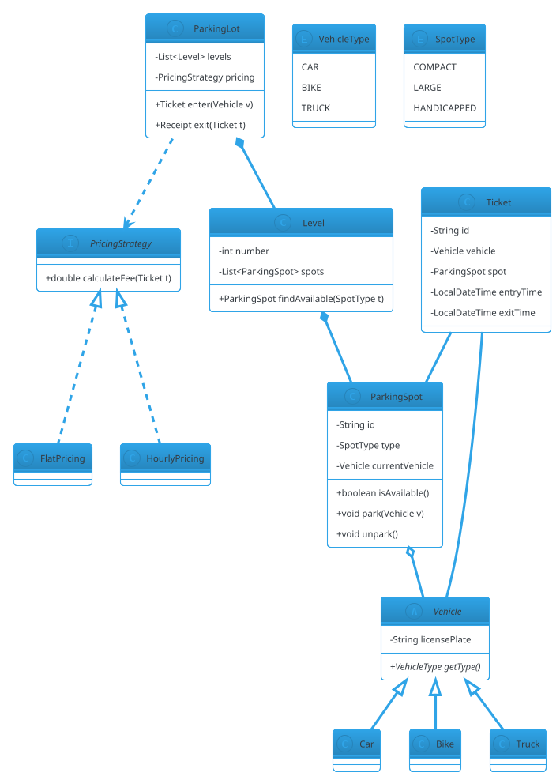

# How to Approach LLD

Low-Level Design (LLD) interviews test your ability to translate a vague problem statement into a clean, working, extensible object-oriented design — usually in 45-90 minutes. Unlike HLD (which is about distributed systems and scale), LLD is about **classes, interfaces, relationships, design patterns, and correctness**.

This guide gives you a **repeatable 6-step framework** that works for any LLD problem — from Parking Lot to Chess to a Thread-Safe LRU Cache.

---

## 🎯 The 6-Step LLD Framework

| Step | Time (45-min) | What You Do |
|---|---|---|
| 1. Clarify Requirements | 5 min | Ask questions; define scope |
| 2. Identify Core Entities | 5 min | Nouns → classes |
| 3. Define Relationships & Interfaces | 10 min | Inheritance vs composition; APIs |
| 4. Apply Design Patterns | 5 min | Justify each pattern |
| 5. Class Diagram + Code Skeleton | 15 min | UML + Java interfaces/stubs |
| 6. Deep Dive on 2-3 Areas | 10 min | Concurrency, extensibility, edge cases |

**Time-boxing matters.** If you spend 20 minutes on Step 1, you'll run out of time for the actual design.

---

## Step 1 — Clarify Requirements (5 min)

### Why

Every LLD problem is intentionally **underspecified**. The interviewer wants to see if you ask the right questions and make reasonable assumptions.

### What to Ask

**Functional requirements:**
- What must the system do? (core use cases)
- Who are the actors? (user types, external systems)
- What are the boundaries? (single machine vs distributed — usually single for LLD)

**Non-functional requirements:**
- Concurrency? (multi-threaded?)
- Persistence? (in-memory or DB?)
- Extensibility? (how likely are new features?)
- Scale? (usually not the focus in LLD, but clarify)

**Out of scope:**
- What are we explicitly NOT building?
- (State this to avoid scope creep)

### Example — Parking Lot

```
❌ Vague: "Design a parking lot."

✅ Clarified:
  Functional:
    - Multi-level parking lot
    - Vehicle types: Car, Bike, Truck
    - Spot types: Compact, Large, Handicapped
    - Entry/exit with ticketing
    - Payment: hourly, card/cash
    - Show available spots per level

  Non-functional:
    - Thread-safe (concurrent entries/exits)
    - Extensible (new vehicle types, pricing)

  Out of scope:
    - Distributed parking chain
    - Real payment gateway
    - Physical hardware (barriers)
```

### What NOT to Do

- Don't ask 30 questions. Ask 5-8 targeted ones.
- Don't over-clarify trivial things ("Should a car have 4 wheels?").
- Don't assume silently — state your assumptions out loud.

---

## Step 2 — Identify Core Entities (5 min)

### Why

LLD is fundamentally about **objects and their interactions**. The fastest way to start is to find the **nouns** in the problem.

### Technique

1. **Underline the nouns** in the problem statement and your clarifications.
2. **Group related nouns** — some become attributes, others become classes.
3. **Separate entities from values** — `Car` is an entity; `Color` is a value (enum).

### Example — Parking Lot

```
Nouns:
  ParkingLot, Level, ParkingSpot, Vehicle, Car, Bike, Truck,
  Ticket, EntryGate, ExitGate, Payment, PricingStrategy, User, Receipt

Entities (classes):
  - ParkingLot (top-level)
  - Level (has many spots)
  - ParkingSpot (has a type, may hold a vehicle)
  - Vehicle (abstract) → Car, Bike, Truck
  - Ticket (created on entry)
  - Payment (completed on exit)

Values (enums):
  - VehicleType (CAR, BIKE, TRUCK)
  - SpotType (COMPACT, LARGE, HANDICAPPED)

Services (orchestrators):
  - ParkingService (entry/exit logic)
  - PricingStrategy (algorithm)
  - PaymentProcessor (charge)

Ignore for now (out of scope):
  - User (no auth in scope)
  - EntryGate / ExitGate (physical, not modeled)
```

### Heuristics

- **Nouns that have behavior** → classes.
- **Nouns that are just data** → attributes or enums.
- **Nouns that represent actions** → methods, not classes.
- **Verbs** → methods (e.g., "park", "pay", "exit").

### Anti-Pattern: God Classes

Don't put everything in one class. Split by responsibility:
- `ParkingLot` = top-level container
- `ParkingService` = orchestration logic
- `PricingStrategy` = algorithm

---

## Step 3 — Define Relationships & Interfaces (10 min)

### Why

Classes don't live alone. Their **relationships** (has-a, is-a, uses-a) determine whether your design is clean or a tangle.

### Types of Relationships

| Relationship | UML | Meaning | Java |
|---|---|---|---|
| **Inheritance** | `─▷` | is-a | `extends` |
| **Implementation** | `┈▷` | can-do | `implements` |
| **Composition** | `◆─` | owns-a (strong) | Field + `new` |
| **Aggregation** | `◇─` | has-a (weak) | Field passed in |
| **Association** | `─` | uses-a | Field or param |
| **Dependency** | `┈>` | depends-on | Param or local |

### Prefer Composition over Inheritance

**Inheritance** is fine when:
- Truly is-a (`Car` is-a `Vehicle`)
- Behavior is stable
- No diamond problem

**Composition** is better when:
- Behavior might change (pricing, algorithms)
- Multiple behaviors combine
- You want runtime flexibility

### Example — Parking Lot

```
ParkingLot ◆─ Level          (composition: lot owns levels)
Level ◆─ ParkingSpot          (composition: level owns spots)
ParkingSpot ◇─ Vehicle        (aggregation: spot may hold vehicle)
Vehicle ◁─ Car, Bike, Truck   (inheritance)
ParkingService ─ PricingStrategy  (strategy pattern)
PricingStrategy ◁─ HourlyPricing, FlatPricing  (inheritance)
```

### Define Key Interfaces

Sketch the **public API** of your main classes:

```java
public interface PricingStrategy {
    double calculateFee(Ticket ticket);
}

public class ParkingLot {
    public Ticket enter(Vehicle vehicle, LocalDateTime time);
    public Receipt exit(Ticket ticket, LocalDateTime time, PaymentMethod method);
    public List<ParkingSpot> findAvailable(SpotType type);
}

public abstract class Vehicle {
    protected final String licensePlate;
    protected final VehicleType type;
    public abstract VehicleType getType();
}
```

### Checklist

- [ ] Every class has a **single clear responsibility**?
- [ ] No circular dependencies?
- [ ] Interfaces are **small** (interface segregation)?
- [ ] Composition used where behavior varies?
- [ ] Public API is **minimal** (only what's needed)?

---

## Step 4 — Apply Design Patterns (5 min)

### Why

Design patterns are **named solutions to recurring problems**. Using them shows experience and makes your design self-documenting.

### The Patterns You'll Use 90% of the Time

| Pattern | When to Use | LLD Examples |
|---|---|---|
| **Strategy** | Algorithm can vary | Pricing, moves, eviction, rate limit |
| **Factory** | Complex object creation | Vehicle creation, logger appenders |
| **Singleton** | One global instance | Logger, config, cache manager |
| **Observer** | Notify on state change | Order events, elevator arrivals |
| **State** | Behavior changes with state | Vending machine, ATM, order |
| **Command** | Encapsulate request | Chess moves, undo/redo |
| **Template Method** | Algorithm skeleton | Coffee brewing, data pipeline |
| **Chain of Responsibility** | Sequential handlers | Log levels, ATM cash dispensing |
| **Builder** | Complex object construction | Query builders, HTTP requests |
| **Decorator** | Add behavior dynamically | Logger formatters, pizza toppings |

### When NOT to Pattern-Stuff

**Rule:** Every pattern should solve a **specific pain point** you can name. If you can't explain why the pattern is better than the naive approach, don't use it.

❌ Bad: "I'll use a Factory here because Factories are good."
✅ Good: "I'll use a Factory because creating a `Vehicle` requires knowing the type at runtime from a license plate lookup, and we may add new vehicle types."

### Example — Parking Lot

```
Strategy: PricingStrategy (HourlyPricing, FlatPricing, SurgePricing)
  → Pricing rules may change; don't hardcode.

Strategy: SpotAllocationStrategy (NearestFirst, RandomFirst)
  → Allocation algorithm may change.

Factory: VehicleFactory.createFromLicensePlate()
  → Type inferred from format; centralizes creation.

Singleton: ParkingLot instance (single lot per process)
  → Avoid duplicate instances; global access.

Observer: ParkingLot notifies FloorDisplayBoard on occupancy change
  → Multiple displays; decoupled.
```

**Justify each pattern in one sentence.** If you can't, drop it.

---

## Step 5 — Class Diagram + Code Skeleton (15 min)

### Class Diagram

Draw the UML class diagram on paper or PlantUML.

**Include:**
- Class names
- Key attributes (not all — just the important ones)
- Key methods (public API)
- Relationships (composition, inheritance, etc.)
- Multiplicities (1..*, 0..1, etc.)

**Skip:**
- Getters/setters (assumed)
- Private helper methods
- Trivial attributes
ß
### Example — Parking Lot (abbreviated)



### Code Skeleton

Write **interfaces and class stubs** — not full implementations yet:

```java
public enum VehicleType { CAR, BIKE, TRUCK }
public enum SpotType { COMPACT, LARGE, HANDICAPPED }

public abstract class Vehicle {
    protected final String licensePlate;
    protected Vehicle(String licensePlate) { this.licensePlate = licensePlate; }
    public abstract VehicleType getType();
}

public class Car extends Vehicle {
    public Car(String licensePlate) { super(licensePlate); }
    @Override public VehicleType getType() { return VehicleType.CAR; }
}

public class ParkingSpot {
    private final String id;
    private final SpotType type;
    private Vehicle currentVehicle;

    public ParkingSpot(String id, SpotType type) { /* ... */ }
    public boolean isAvailable() { return currentVehicle == null; }
    public synchronized void park(Vehicle v) { /* ... */ }
    public synchronized void unpark() { /* ... */ }
}

public class Ticket {
    private final String id;
    private final Vehicle vehicle;
    private final ParkingSpot spot;
    private final LocalDateTime entryTime;
    private LocalDateTime exitTime;
    // constructor, getters
}

public interface PricingStrategy {
    double calculateFee(Ticket ticket);
}

public class HourlyPricing implements PricingStrategy {
    @Override public double calculateFee(Ticket t) { /* ... */ }
}

public class ParkingLot {
    private final List<Level> levels;
    private final PricingStrategy pricing;

    public Ticket enter(Vehicle v) { /* find spot, create ticket */ }
    public Receipt exit(Ticket t) { /* compute fee, free spot */ }
}
```

### Why Skeleton First

- **Forces you to commit** to interfaces early
- **Reveals design flaws** before writing 500 lines
- **Interviewer sees structure** and can course-correct
- **Easy to extend** — fill in methods after validation

### Interview Tip

**Narrate as you write.** "I'm making `PricingStrategy` an interface so we can swap pricing algorithms — this satisfies Open-Closed Principle."

---

## Step 6 — Deep Dive on 2-3 Areas (10 min)

### Why

Interviewers want to see **depth** — how you handle the tricky parts. Pick 2-3 and go deep.

### Areas to Deep Dive

| Area | What to Discuss |
|---|---|
| **Concurrency** | What's shared? What's mutable? Which locks? |
| **Extensibility** | How to add a new type/feature without breaking? |
| **Edge cases** | Full lot, invalid ticket, duplicate entry, timeout |
| **Performance** | Where's the bottleneck? Any caching? |
| **Testing** | What would you unit test? Mocks? |
| **Persistence** | If DB needed, which tables? Indexes? |

### Example — Parking Lot

**Deep Dive 1 — Concurrency**

> "Two threads may try to park in the same spot. I'll use `synchronized` on `ParkingSpot.park()` with a check-then-act inside the lock. Also, `Level.findAvailable` needs a lock or a concurrent data structure to avoid two threads getting the same spot. I'll use a `BlockingQueue<ParkingSpot>` per spot type — `poll()` is atomic."

**Deep Dive 2 — Extensibility**

> "To add a new vehicle type (e.g., EV), I add a subclass of `Vehicle`, extend `VehicleType` enum, add a `SpotType` (EV with charger) if needed, and update the pricing strategy if EV gets different rates. No existing code changes."

**Deep Dive 3 — Edge Cases**

> - Full lot → `enter()` throws `NoSpotAvailableException`
> - Duplicate entry (same license plate) → reject via a `Set<String>` of active plates
> - Lost ticket → charge maximum daily rate
> - Exit after midnight → pricing uses duration, not clock time

### The Magic Formula

For each deep dive, use:

1. **State the risk** — "Two threads may collide"
2. **Explain your fix** — "I'll use a BlockingQueue"
3. **Trade-off** — "This costs memory but ensures atomicity"

---

## 📋 Interview Checklist

Before you finish, verify:

- [ ] Requirements clarified (functional, non-functional, out of scope)
- [ ] Core entities identified (classes, enums, values)
- [ ] Relationships defined (composition > inheritance where possible)
- [ ] Interfaces small and cohesive
- [ ] Design patterns used with justification
- [ ] Class diagram drawn
- [ ] Code skeleton committed (interfaces + stubs)
- [ ] At least 2 deep dives on concurrency, extensibility, or edge cases
- [ ] SOLID principles mentioned where relevant
- [ ] Time-boxed — didn't over-invest in one step

---

## ⚠️ Common Mistakes

| Mistake | Fix |
|---|---|
| Starting to code immediately | Spend 5 min on requirements first |
| One giant class | Split by responsibility |
| Deep inheritance hierarchies | Prefer composition |
| Patterns everywhere | Only use patterns with a named pain point |
| Ignoring concurrency | Always ask "multi-threaded?" |
| Not asking clarifying questions | Ask 5-8 targeted questions |
| Over-engineering | Design for stated scope, note extensions separately |
| Silent assumptions | State them out loud |
| Running out of time | Time-box each step |
| No diagram | Always sketch UML |

---

## 🎯 Practice Plan

1. **Week 1** — Do 5 problems using this framework. Time yourself.
2. **Week 2** — Focus on **concurrency** problems (Producer-Consumer, LRU, Thread Pool).
3. **Week 3** — Focus on **state machine** problems (Vending Machine, ATM, Elevator).
4. **Week 4** — Mock interviews. Have a friend give you a random problem, 45 min.

---

## 🔗 Related Sections

- [SOLID Principles](solid-principles.md) — the "why" behind good design
- [Design Patterns](design-patterns/index.md) — the "how" of common solutions
- [UML Basics](uml-basics.md) — how to draw your design
- [Concurrency Basics](concurrency-basics.md) — threads, locks, Java utilities
- [Problem 01 — Parking Lot](problems/01-parking-lot.md) — this framework applied

---

## 📌 Key Takeaways

- **6 steps, time-boxed** — Clarify (5), Entities (5), Relationships (10), Patterns (5), Diagram+Code (15), Deep Dive (10)
- **Clarify first** — vague problems need shape before code
- **Nouns → classes; verbs → methods** — the fastest way to find entities
- **Prefer composition over inheritance** — especially for varying behavior
- **Patterns solve named problems** — don't pattern-stuff
- **Skeleton first** — interfaces before implementations
- **Narrate** — the interviewer grades your thinking, not just the final code
- **Deep dive 2-3 areas** — concurrency, extensibility, edge cases
- **Time-box** — a complete design beats a perfect partial one