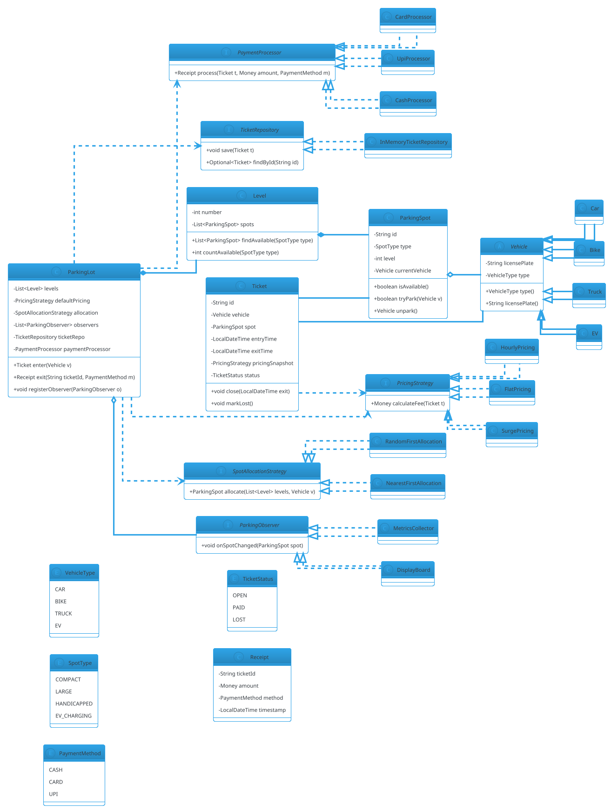

# Parking Lot

## Problem Statement

Design a multi-level parking lot that supports multiple vehicle types, allocates spots efficiently, generates tickets on entry, and calculates fees on exit based on duration and vehicle type. The system must be **thread-safe** (multiple entry/exit gates operating concurrently), **extensible** (new vehicle types, new pricing rules), and **observable** (display boards showing available spots per level and per spot type).

This is the **canonical LLD interview problem**. It touches every core concept: entity modeling, inheritance vs composition, strategy pattern for pricing, factory for vehicle creation, observer for display boards, and concurrency for spot allocation. Master this and 80% of other LLD problems become variations.

**Example flow:**

```
Entry:
  1. Car (KA-01-AB-1234) arrives at Entry Gate 1
  2. System finds nearest available COMPACT spot on Level 2
  3. Generates Ticket #T-1001 with entry time 10:00 AM
  4. Raises barrier

Exit:
  1. Car presents Ticket #T-1001 at Exit Gate 1 at 1:30 PM
  2. System calculates 3.5 hours
  3. Hourly pricing: 3.5 hrs x $2.00 = $7.00
  4. User pays via card
  5. Spot is freed; display boards update
  6. Receipt generated; barrier raises

Concurrency:
  - 4 entry gates + 4 exit gates operate simultaneously
  - Two cars may target the same spot at the same instant
  - Display board updates must be near real-time
  - Ticket generation must be unique under load

Extensibility:
  - Add EV vehicles (need charging spots)
  - Add valet parking (different allocation)
  - Add monthly passes (different pricing)
  - Add dynamic surge pricing (demand-based)
```

**Why it's interesting:**

- **Multiple design patterns fit naturally** — Strategy, Factory, Observer, Singleton
- **Concurrency is real** — spots are a shared, contended resource
- **Extensibility is testable** — add features without breaking existing code
- **Clean relationships** — ParkingLot, Level, Spot, Vehicle, Ticket
- **Pricing has clear abstraction** — Strategy pattern shines
- **Common follow-ups**: "Add EV", "Add valet", "Handle reservations", "Distributed lots"

---

## 1. Requirements

### Functional Requirements

- **Multi-level lot** with levels, each containing parking spots
- **Spot types**: COMPACT, LARGE, HANDICAPPED, EV_CHARGING (extensible)
- **Vehicle types**: CAR, BIKE, TRUCK, EV (extensible)
- **Entry**: Find nearest available spot matching vehicle's compatible spot types; generate ticket
- **Exit**: Calculate fee based on duration + vehicle type + spot type; process payment; free spot
- **Ticketing**: Unique ticket ID; entry time, exit time, vehicle, spot
- **Pricing**: Hourly, flat, surge (strategy pattern)
- **Display boards**: Show available spots per level, per spot type
- **Lost ticket**: Charge maximum daily rate
- **Payment methods**: CASH, CARD, UPI (extensible)

### Non-Functional Requirements

- **Thread-safe**: Concurrent entries/exits at different gates
- **Extensible**: Add vehicle types, spot types, pricing rules without breaking existing code
- **Observable**: Display boards update on every spot change
- **Fault-tolerant**: Partial failure (payment gateway) must not corrupt spot state
- **Low latency**: Entry/exit < 100 ms (excluding payment)
- **No double-allocation**: Two cars must not get the same spot
- **No orphaned spots**: Exiting a ticket always frees the spot

### Out of Scope

- Distributed parking chain (multiple lots)
- Physical hardware (barriers, sensors)
- Real payment gateway integration
- User authentication / accounts
- Reservations / pre-booking
- Video surveillance
- Mobile app

---

## 2. Use Cases

### UC1 — Vehicle Enters

```
Actor: Driver
Precondition: Lot has at least one compatible spot available
Steps:
  1. Vehicle arrives at EntryGate
  2. System looks up vehicle type (via license plate or sensor)
  3. System finds nearest available compatible spot
  4. System marks spot as occupied
  5. System generates Ticket (unique ID, entry time)
  6. System updates display boards
  7. Barrier raises; vehicle proceeds
Postcondition: Spot is occupied; ticket issued; display updated
Alternative: No spot available -> reject entry with error
```

### UC2 — Vehicle Exits

```
Actor: Driver
Precondition: Valid ticket exists
Steps:
  1. Vehicle presents ticket at ExitGate
  2. System validates ticket (exists, not already used)
  3. System computes duration and fee
  4. User pays (cash/card/UPI)
  5. System marks spot as available
  6. System updates display boards
  7. System generates Receipt
  8. Barrier raises; vehicle exits
Postcondition: Spot is free; ticket marked closed; payment recorded
Alternative: Payment fails -> spot stays occupied; ticket remains open
```

### UC3 — Display Board Query

```
Actor: Driver (external display) / Operator
Steps:
  1. Board requests availability per level + spot type
  2. System returns counts (e.g., Level 1: COMPACT 5, LARGE 2)
Postcondition: Board renders counts
```

### UC4 — Lost Ticket

```
Actor: Driver with lost ticket
Steps:
  1. Driver arrives at ExitGate without ticket
  2. Operator manually looks up by license plate
  3. System charges maximum daily rate
  4. Spot is freed
Postcondition: Spot freed; flat fee charged
```

### UC5 — Add EV Vehicle and Charging Spot

```
Actor: Developer
Steps:
  1. Add VehicleType.EV (no change to Vehicle hierarchy needed if EV reuses Car)
  2. Add SpotType.EV_CHARGING
  3. Register a new SpotAllocationStrategy that prefers EV_CHARGING for EVs
  4. Optionally register EV-specific PricingStrategy
Postcondition: No existing classes modified except registrations (OCP)
```

### UC6 — Surge Pricing at Peak Hours

```
Actor: Operator (system administrator)
Steps:
  1. Operator enables SURGE pricing between 6-9 PM
  2. PricingStrategy is switched to SurgePricing (wraps HourlyPricing with a multiplier)
  3. New tickets use surge pricing; existing tickets unaffected (pricing captured at entry)
Postcondition: Peak-hour revenue optimized
```

### UC7 — Valet Parking

```
Actor: Driver choosing valet
Steps:
  1. Driver selects "Valet" at entry
  2. System allocates a valet-specific spot
  3. Ticket is marked with VALET flag
  4. Valet attendant handles parking
Postcondition: Same underlying spot model; different allocation strategy
```

### UC8 — Payment Failure Recovery

```
Actor: Driver
Precondition: Ticket open; payment attempt fails
Steps:
  1. System attempts to charge via PaymentProcessor
  2. PaymentProcessor throws PaymentFailedException
  3. System keeps spot occupied; ticket stays OPEN
  4. User is prompted to try another payment method
Postcondition: No spot freed without successful payment
```

---

## 3. Core Entities

### Entities (classes with identity)

| Entity | Responsibility |
|---|---|
| `ParkingLot` | Top-level container; orchestrates entry/exit |
| `Level` | A floor; contains spots |
| `ParkingSpot` | A single parking space; holds at most one vehicle |
| `Vehicle` (abstract) | Represents a vehicle; subclasses: Car, Bike, Truck, EV |
| `Ticket` | A parking session (entry -> exit) |
| `Receipt` | Payment record on exit |

### Value Objects (immutable, no identity)

| Value | Purpose |
|---|---|
| `VehicleType` (enum) | CAR, BIKE, TRUCK, EV |
| `SpotType` (enum) | COMPACT, LARGE, HANDICAPPED, EV_CHARGING |
| `PaymentMethod` (enum) | CASH, CARD, UPI |
| `TicketStatus` (enum) | OPEN, PAID, LOST |
| `Money` | Amount + currency (avoid raw `double`) |
| `TicketId` | Typed wrapper around UUID (or long) |

### Services (stateless orchestrators)

| Service | Responsibility |
|---|---|
| `ParkingService` | Entry/exit logic, ticket lifecycle |
| `SpotAllocationStrategy` | How to pick a spot (nearest, random) |
| `PricingStrategy` | How to compute fee (hourly, flat, surge) |
| `PaymentProcessor` | Charge the user |
| `TicketRepository` | Persist and retrieve tickets |
| `ParkingObserver` | React to spot changes |

### Interfaces (contracts)

| Interface | Implementations |
|---|---|
| `PricingStrategy` | `HourlyPricing`, `FlatPricing`, `SurgePricing` |
| `SpotAllocationStrategy` | `NearestFirst`, `RandomFirst` |
| `PaymentProcessor` | `CashProcessor`, `CardProcessor`, `UpiProcessor` |
| `ParkingObserver` | `DisplayBoard`, `MetricsCollector`, `AuditLog` |
| `TicketRepository` | `InMemoryTicketRepository`, `DatabaseTicketRepository` |

### Relationship Summary

```
ParkingLot  *---  Level              (1..*)
Level       *---  ParkingSpot        (1..*)
ParkingSpot o---  Vehicle            (0..1)
Ticket      ---   Vehicle            (1)
Ticket      ---   ParkingSpot        (1)
Ticket      ..>   PricingStrategy    (1, snapshot at entry)
ParkingLot  ..>   PricingStrategy    (1, default)
ParkingLot  ..>   SpotAllocationStrategy (1)
ParkingLot  ..>   List<ParkingObserver> (0..*)
ParkingLot  ..>   TicketRepository   (1)
Vehicle     <|--  Car, Bike, Truck, EV
```

---

## 4. Class Diagram



**Key design decisions visible in the diagram:**

- `Vehicle` is an abstract class (not interface) — shares `licensePlate` and `type` state
- `ParkingSpot` exposes `tryPark()` (atomic check-and-set) — concurrency-friendly
- `Ticket` captures a `PricingStrategy` snapshot at entry — pricing changes don't affect open tickets
- `ParkingLot` holds a `List<ParkingObserver>` — new observers can be added without modifying the lot
- `SpotAllocationStrategy`, `PricingStrategy`, and `TicketRepository` are interfaces — swap implementations freely

---

## 5. Design Patterns Used

### 5.1 Strategy Pattern

**Problem:** Pricing rules vary (hourly, flat, surge). Allocation rules vary (nearest, random).

**Solution:** Encapsulate each algorithm behind an interface.

**Implementations:**
- `HourlyPricing` — rate x duration
- `FlatPricing` — fixed amount
- `SurgePricing` — wraps another strategy with a multiplier
- `NearestFirstAllocation` — pick nearest spot
- `RandomFirstAllocation` — pick any available spot

**Justification:** New pricing rules added without touching `ParkingLot`. Ticket captures a snapshot at entry so policy changes don't affect existing sessions.

### 5.2 Factory Pattern

**Problem:** Creating a `Vehicle` requires knowing its type, which may come from license plate parsing.

**Solution:** `VehicleFactory.createFromLicensePlate(String)` returns the right subclass.

**Justification:** Centralizes creation; easy to extend; keeps constructors private if needed.

### 5.3 Observer Pattern

**Problem:** Multiple components (display boards, metrics, audit log) need to react to spot changes.

**Solution:** `ParkingLot` maintains a list of `ParkingObserver`s and notifies them on state changes.

**Justification:** Decouples core from display/analytics. Adding a new observer requires zero changes to `ParkingLot`.

### 5.4 Builder Pattern

**Problem:** `Ticket` has many fields (id, vehicle, spot, entry time, pricing snapshot, status).

**Solution:** Builder pattern for readable construction.

**Justification:** Avoids telescoping constructors; makes tests readable.

### 5.5 Template Method (for Payment)

**Problem:** Different payment methods share a common flow (validate -> charge -> record) but differ in charging.

**Solution:** Abstract base class with a template method.

**Justification:** Common validation/recording logic in one place; subclasses only implement `charge()`.

### Patterns NOT Used

- **No Singleton for services** — inject `ParkingLot` instance; a registry may map lot IDs to instances
- **No Abstract Factory** — we don't have families of related products
- **No Decorator for pricing** — Surge wraps via composition, but that's just Strategy + decorator-like wrapping

---

## 6. Java Implementation

### 6.1 Enums and Value Objects

```java
package lld.parkinglot.model;

public enum VehicleType { CAR, BIKE, TRUCK, EV }
public enum SpotType { COMPACT, LARGE, HANDICAPPED, EV_CHARGING }
public enum PaymentMethod { CASH, CARD, UPI }
public enum TicketStatus { OPEN, PAID, LOST }

public record Money(java.math.BigDecimal amount, java.util.Currency currency) {
    public Money {
        if (amount == null || amount.signum() < 0) {
            throw new IllegalArgumentException("Amount must be non-negative");
        }
        if (currency == null) currency = java.util.Currency.getInstance("USD");
    }
    public static Money of(double amount, String currencyCode) {
        return new Money(java.math.BigDecimal.valueOf(amount),
                         java.util.Currency.getInstance(currencyCode));
    }
    public Money multiply(long factor) {
        return new Money(amount.multiply(java.math.BigDecimal.valueOf(factor)), currency);
    }
    public Money multiply(double factor) {
        return new Money(amount.multiply(java.math.BigDecimal.valueOf(factor)), currency);
    }
}
```

**Why `BigDecimal` and not `double`:** Money requires exact arithmetic. `double` has rounding errors (`0.1 + 0.2 != 0.3`).

### 6.2 Vehicle Hierarchy

```java
package lld.parkinglot.model;

public abstract class Vehicle {
    private final String licensePlate;
    private final VehicleType type;

    protected Vehicle(String licensePlate, VehicleType type) {
        if (licensePlate == null || licensePlate.isBlank()) {
            throw new IllegalArgumentException("License plate required");
        }
        this.licensePlate = licensePlate;
        this.type = type;
    }

    public String licensePlate() { return licensePlate; }
    public VehicleType type() { return type; }

    @Override public String toString() {
        return type + "[" + licensePlate + "]";
    }
}

public final class Car extends Vehicle {
    public Car(String licensePlate) { super(licensePlate, VehicleType.CAR); }
}

public final class Bike extends Vehicle {
    public Bike(String licensePlate) { super(licensePlate, VehicleType.BIKE); }
}

public final class Truck extends Vehicle {
    public Truck(String licensePlate) { super(licensePlate, VehicleType.TRUCK); }
}

public final class EV extends Vehicle {
    public EV(String licensePlate) { super(licensePlate, VehicleType.EV); }
}
```

**Why abstract class and not interface:** `licensePlate` and `type` are shared state; an abstract class avoids duplication.

### 6.3 VehicleFactory

```java
package lld.parkinglot.model;

public final class VehicleFactory {
    private VehicleFactory() {}

    public static Vehicle create(String licensePlate, VehicleType type) {
        return switch (type) {
            case CAR -> new Car(licensePlate);
            case BIKE -> new Bike(licensePlate);
            case TRUCK -> new Truck(licensePlate);
            case EV -> new EV(licensePlate);
        };
    }
}
```

### 6.4 ParkingSpot (thread-safe)

```java
package lld.parkinglot.model;

public final class ParkingSpot {
    private final String id;
    private final SpotType type;
    private final int level;
    private Vehicle currentVehicle;   // guarded by this

    public ParkingSpot(String id, SpotType type, int level) {
        this.id = id;
        this.type = type;
        this.level = level;
    }

    public String id() { return id; }
    public SpotType type() { return type; }
    public int level() { return level; }

    public synchronized boolean isAvailable() {
        return currentVehicle == null;
    }

    /**
     * Atomically try to park the vehicle. Returns true on success.
     * Combines check-and-set to avoid race conditions.
     */
    public synchronized boolean tryPark(Vehicle vehicle) {
        if (currentVehicle != null) return false;
        currentVehicle = vehicle;
        return true;
    }

    public synchronized Vehicle unpark() {
        Vehicle v = currentVehicle;
        currentVehicle = null;
        return v;
    }

    public synchronized Vehicle currentVehicle() {
        return currentVehicle;
    }
}
```

**Concurrency note:** `tryPark` combines check and set into one atomic operation. Clients cannot accidentally double-park.

### 6.5 Level

```java
package lld.parkinglot.model;

import java.util.List;
import java.util.stream.Collectors;

public final class Level {
    private final int number;
    private final List<ParkingSpot> spots;

    public Level(int number, List<ParkingSpot> spots) {
        this.number = number;
        this.spots = List.copyOf(spots);
    }

    public int number() { return number; }
    public List<ParkingSpot> spots() { return spots; }

    public List<ParkingSpot> findAvailable(SpotType type) {
        return spots.stream()
                .filter(s -> s.type() == type && s.isAvailable())
                .collect(Collectors.toList());
    }

    public int countAvailable(SpotType type) {
        int count = 0;
        for (ParkingSpot s : spots) {
            if (s.type() == type && s.isAvailable()) count++;
        }
        return count;
    }
}
```

### 6.6 Ticket

```java
package lld.parkinglot.model;

import java.time.LocalDateTime;

public final class Ticket {
    private final String id;
    private final Vehicle vehicle;
    private final ParkingSpot spot;
    private final LocalDateTime entryTime;
    private final PricingStrategy pricingSnapshot;   // captured at entry
    private LocalDateTime exitTime;
    private TicketStatus status;

    public Ticket(String id, Vehicle vehicle, ParkingSpot spot,
                  LocalDateTime entryTime, PricingStrategy pricingSnapshot) {
        this.id = id;
        this.vehicle = vehicle;
        this.spot = spot;
        this.entryTime = entryTime;
        this.pricingSnapshot = pricingSnapshot;
        this.status = TicketStatus.OPEN;
    }

    public String id() { return id; }
    public Vehicle vehicle() { return vehicle; }
    public ParkingSpot spot() { return spot; }
    public LocalDateTime entryTime() { return entryTime; }
    public LocalDateTime exitTime() { return exitTime; }
    public PricingStrategy pricingSnapshot() { return pricingSnapshot; }
    public TicketStatus status() { return status; }

    public synchronized void close(LocalDateTime exit) {
        if (status != TicketStatus.OPEN) {
            throw new IllegalStateException("Ticket is not open: " + status);
        }
        this.exitTime = exit;
        this.status = TicketStatus.PAID;
    }

    public synchronized void markLost() {
        if (status != TicketStatus.OPEN) {
            throw new IllegalStateException("Ticket is not open: " + status);
        }
        this.status = TicketStatus.LOST;
    }
}
```

**Design note:** Pricing strategy is captured at entry. Changing pricing mid-session doesn't affect existing tickets.

### 6.7 Pricing Strategies

```java
package lld.parkinglot.pricing;

import lld.parkinglot.model.*;
import java.math.BigDecimal;
import java.time.Duration;
import java.time.LocalTime;

public interface PricingStrategy {
    Money calculateFee(Ticket ticket);
}

public final class HourlyPricing implements PricingStrategy {
    private final Money perHour;

    public HourlyPricing(Money perHour) { this.perHour = perHour; }

    @Override
    public Money calculateFee(Ticket ticket) {
        if (ticket.exitTime() == null) {
            throw new IllegalStateException("Cannot price an open ticket");
        }
        long minutes = Duration.between(ticket.entryTime(), ticket.exitTime()).toMinutes();
        long billableHours = (long) Math.ceil(minutes / 60.0);
        if (billableHours == 0) billableHours = 1;   // minimum 1 hour
        return perHour.multiply(billableHours);
    }
}

public final class FlatPricing implements PricingStrategy {
    private final Money flat;

    public FlatPricing(Money flat) { this.flat = flat; }

    @Override public Money calculateFee(Ticket ticket) { return flat; }
}

/**
 * Wraps another strategy with a time-based multiplier.
 * E.g., 1.5x between 6 PM and 9 PM.
 */
public final class SurgePricing implements PricingStrategy {
    private final PricingStrategy base;
    private final LocalTime surgeStart;
    private final LocalTime surgeEnd;
    private final double multiplier;

    public SurgePricing(PricingStrategy base, LocalTime surgeStart,
                        LocalTime surgeEnd, double multiplier) {
        this.base = base;
        this.surgeStart = surgeStart;
        this.surgeEnd = surgeEnd;
        this.multiplier = multiplier;
    }

    @Override
    public Money calculateFee(Ticket ticket) {
        Money baseFee = base.calculateFee(ticket);
        LocalTime exitTime = ticket.exitTime().toLocalTime();
        if (!exitTime.isBefore(surgeStart) && exitTime.isBefore(surgeEnd)) {
            return baseFee.multiply(multiplier);
        }
        return baseFee;
    }
}
```

### 6.8 Spot Allocation Strategies

```java
package lld.parkinglot.allocation;

import lld.parkinglot.model.*;
import java.util.ArrayList;
import java.util.List;
import java.util.Random;

public interface SpotAllocationStrategy {
    ParkingSpot allocate(List<Level> levels, Vehicle vehicle);
}

public final class NearestFirstAllocation implements SpotAllocationStrategy {
    @Override
    public ParkingSpot allocate(List<Level> levels, Vehicle vehicle) {
        for (Level level : levels) {
            for (SpotType type : compatibleSpotTypes(vehicle.type())) {
                for (ParkingSpot spot : level.findAvailable(type)) {
                    if (spot.tryPark(vehicle)) return spot;
                }
            }
        }
        return null;
    }

    private List<SpotType> compatibleSpotTypes(VehicleType vt) {
        return switch (vt) {
            case BIKE -> List.of(SpotType.COMPACT, SpotType.LARGE);
            case CAR -> List.of(SpotType.COMPACT, SpotType.LARGE);
            case TRUCK -> List.of(SpotType.LARGE);
            case EV -> List.of(SpotType.EV_CHARGING, SpotType.COMPACT);
        };
    }
}

public final class RandomFirstAllocation implements SpotAllocationStrategy {
    private final Random random = new Random();

    @Override
    public ParkingSpot allocate(List<Level> levels, Vehicle vehicle) {
        List<ParkingSpot> candidates = new ArrayList<>();
        for (Level level : levels) {
            for (ParkingSpot spot : level.spots()) {
                if (spot.isAvailable()) candidates.add(spot);
            }
        }
        while (!candidates.isEmpty()) {
            int idx = random.nextInt(candidates.size());
            ParkingSpot spot = candidates.get(idx);
            if (spot.tryPark(vehicle)) return spot;
            candidates.remove(idx);   // lost the race
        }
        return null;
    }
}
```

**Concurrency note:** `NearestFirstAllocation` retries on failed `tryPark` because another thread may have grabbed the spot. This is a lock-free pattern — no global lock needed.

### 6.9 Payment Processors

```java
package lld.parkinglot.payment;

import lld.parkinglot.model.*;
import java.time.LocalDateTime;
import java.util.UUID;

public interface PaymentProcessor {
    Receipt process(Ticket ticket, Money amount, PaymentMethod method);
}

public abstract class AbstractPaymentProcessor implements PaymentProcessor {

    @Override
    public final Receipt process(Ticket ticket, Money amount, PaymentMethod method) {
        validate(ticket, amount);
        String txnId = charge(amount);
        return new Receipt(ticket.id(), amount, method, LocalDateTime.now());
    }

    protected void validate(Ticket ticket, Money amount) {
        if (amount == null || amount.amount().signum() < 0) {
            throw new IllegalArgumentException("Invalid amount");
        }
        if (ticket.status() == TicketStatus.PAID) {
            throw new IllegalStateException("Already paid");
        }
    }

    protected abstract String charge(Money amount);
}

public final class CashProcessor extends AbstractPaymentProcessor {
    @Override protected String charge(Money amount) {
        // In real life: interact with cash acceptor hardware
        return "CASH-" + UUID.randomUUID();
    }
}

public final class CardProcessor extends AbstractPaymentProcessor {
    @Override protected String charge(Money amount) {
        // In real life: call payment gateway (Stripe, Razorpay)
        return "CARD-" + UUID.randomUUID();
    }
}

public final class UpiProcessor extends AbstractPaymentProcessor {
    @Override protected String charge(Money amount) {
        return "UPI-" + UUID.randomUUID();
    }
}
```

### 6.10 Ticket Repository

```java
package lld.parkinglot.repository;

import lld.parkinglot.model.Ticket;
import java.util.Optional;
import java.util.concurrent.ConcurrentHashMap;
import java.util.Map;

public interface TicketRepository {
    void save(Ticket ticket);
    Optional<Ticket> findById(String ticketId);
}

public final class InMemoryTicketRepository implements TicketRepository {
    private final Map<String, Ticket> store = new ConcurrentHashMap<>();

    @Override public void save(Ticket ticket) {
        store.put(ticket.id(), ticket);
    }

    @Override public Optional<Ticket> findById(String ticketId) {
        return Optional.ofNullable(store.get(ticketId));
    }
}
```

### 6.11 Parking Observers

```java
package lld.parkinglot.observer;

import lld.parkinglot.model.ParkingSpot;
import java.util.concurrent.ConcurrentHashMap;
import java.util.Map;
import java.util.concurrent.atomic.LongAdder;

public interface ParkingObserver {
    void onSpotChanged(ParkingSpot spot);
}

public final class DisplayBoard implements ParkingObserver {
    // In real life: pushes to a screen service
    @Override
    public void onSpotChanged(ParkingSpot spot) {
        System.out.println("[DISPLAY] Level " + spot.level()
                + " spot " + spot.id()
                + " now " + (spot.isAvailable() ? "AVAILABLE" : "OCCUPIED"));
    }
}

public final class MetricsCollector implements ParkingObserver {
    private final LongAdder occupancyChanges = new LongAdder();

    @Override
    public void onSpotChanged(ParkingSpot spot) {
        occupancyChanges.increment();
    }

    public long occupancyChanges() { return occupancyChanges.sum(); }
}
```

### 6.12 Parking Lot (Main Orchestrator)

```java
package lld.parkinglot.core;

import lld.parkinglot.allocation.SpotAllocationStrategy;
import lld.parkinglot.model.*;
import lld.parkinglot.observer.ParkingObserver;
import lld.parkinglot.payment.PaymentProcessor;
import lld.parkinglot.pricing.PricingStrategy;
import lld.parkinglot.repository.TicketRepository;

import java.time.Clock;
import java.time.LocalDateTime;
import java.util.List;
import java.util.UUID;
import java.util.concurrent.CopyOnWriteArrayList;

public final class ParkingLot {
    private final String id;
    private final List<Level> levels;
    private final PricingStrategy defaultPricing;
    private final SpotAllocationStrategy allocation;
    private final PaymentProcessor paymentProcessor;
    private final TicketRepository ticketRepo;
    private final Clock clock;
    private final List<ParkingObserver> observers = new CopyOnWriteArrayList<>();

    public ParkingLot(String id,
                      List<Level> levels,
                      PricingStrategy defaultPricing,
                      SpotAllocationStrategy allocation,
                      PaymentProcessor paymentProcessor,
                      TicketRepository ticketRepo,
                      Clock clock) {
        this.id = id;
        this.levels = List.copyOf(levels);
        this.defaultPricing = defaultPricing;
        this.allocation = allocation;
        this.paymentProcessor = paymentProcessor;
        this.ticketRepo = ticketRepo;
        this.clock = clock;
    }

    public void registerObserver(ParkingObserver observer) {
        observers.add(observer);
    }

    public void unregisterObserver(ParkingObserver observer) {
        observers.remove(observer);
    }

    public synchronized Ticket enter(Vehicle vehicle) {
        ParkingSpot spot = allocation.allocate(levels, vehicle);
        if (spot == null) {
            throw new IllegalStateException("No spot available");
        }
        LocalDateTime now = LocalDateTime.now(clock);
        Ticket ticket = new Ticket(
                UUID.randomUUID().toString(),
                vehicle,
                spot,
                now,
                defaultPricing
        );
        ticketRepo.save(ticket);
        notifyObservers(spot);
        return ticket;
    }

    public Receipt exit(String ticketId, PaymentMethod method) {
        Ticket ticket = ticketRepo.findById(ticketId)
                .orElseThrow(() -> new IllegalArgumentException("Unknown ticket: " + ticketId));

        LocalDateTime exitTime = LocalDateTime.now(clock);

        // Compute fee BEFORE closing (close sets exitTime)
        // Alternative: close first, then compute. Either way, atomicity matters.
        synchronized (ticket) {
            if (ticket.status() != TicketStatus.OPEN) {
                throw new IllegalStateException("Ticket not open: " + ticket.status());
            }
            ticket.close(exitTime);
        }

        Money fee = ticket.pricingSnapshot().calculateFee(ticket);

        Receipt receipt;
        try {
            receipt = paymentProcessor.process(ticket, fee, method);
        } catch (RuntimeException e) {
            // Payment failed — spot stays occupied; ticket is marked PAID already.
            // In a production system we'd have a "PAYMENT_FAILED" state and
            // re-open the ticket. For LLD scope, we treat payment failure as
            // an exceptional condition and let the operator handle it.
            throw e;
        }

        ticket.spot().unpark();
        notifyObservers(ticket.spot());
        return receipt;
    }

    public int available(SpotType type) {
        int total = 0;
        for (Level level : levels) total += level.countAvailable(type);
        return total;
    }

    private void notifyObservers(ParkingSpot spot) {
        for (ParkingObserver o : observers) {
            try {
                o.onSpotChanged(spot);
            } catch (RuntimeException e) {
                // Log and continue — one observer must not break others
                System.err.println("Observer failed: " + o + " -> " + e.getMessage());
            }
        }
    }
}
```

**Important design decisions:**

- **Constructor injection** — dependencies passed in, not created inside (DIP)
- **`Clock` injection** — makes time testable (`Clock.fixed(...)` for tests)
- **`CopyOnWriteArrayList`** for observers — safe iteration while adding/removing
- **`try/catch` around observer notification** — one bad observer doesn't break others
- **Payment failure handling** — documented; production systems need a richer state machine

### 6.13 Factory for Wiring

```java
package lld.parkinglot.core;

import lld.parkinglot.allocation.NearestFirstAllocation;
import lld.parkinglot.model.*;
import lld.parkinglot.payment.CardProcessor;
import lld.parkinglot.pricing.HourlyPricing;
import lld.parkinglot.repository.InMemoryTicketRepository;

import java.time.Clock;
import java.util.ArrayList;
import java.util.List;

public final class ParkingLotFactory {

    public static ParkingLot createDefault(String lotId, int levels, int spotsPerLevel) {
        List<Level> levelList = new ArrayList<>();
        int spotCounter = 0;
        for (int l = 1; l <= levels; l++) {
            List<ParkingSpot> spots = new ArrayList<>();
            for (int s = 0; s < spotsPerLevel; s++) {
                SpotType type = (s % 5 == 0) ? SpotType.HANDICAPPED
                              : (s % 3 == 0) ? SpotType.EV_CHARGING
                              : SpotType.COMPACT;
                spots.add(new ParkingSpot("S-" + (++spotCounter), type, l));
            }
            levelList.add(new Level(l, spots));
        }
        return new ParkingLot(
                lotId,
                levelList,
                new HourlyPricing(Money.of(2.0, "USD")),
                new NearestFirstAllocation(),
                new CardProcessor(),
                new InMemoryTicketRepository(),
                Clock.systemUTC()
        );
    }
}
```

### 6.14 Demo

```java
package lld.parkinglot;

import lld.parkinglot.core.ParkingLot;
import lld.parkinglot.core.ParkingLotFactory;
import lld.parkinglot.model.*;
import lld.parkinglot.observer.DisplayBoard;
import lld.parkinglot.observer.MetricsCollector;

public class Demo {
    public static void main(String[] args) {
        ParkingLot lot = ParkingLotFactory.createDefault("LOT-1", 3, 10);

        DisplayBoard board = new DisplayBoard();
        MetricsCollector metrics = new MetricsCollector();
        lot.registerObserver(board);
        lot.registerObserver(metrics);

        Vehicle car = VehicleFactory.create("KA-01-AB-1234", VehicleType.CAR);
        Ticket ticket = lot.enter(car);
        System.out.println("Issued: " + ticket.id() + " spot=" + ticket.spot().id());

        Receipt receipt = lot.exit(ticket.id(), PaymentMethod.CARD);
        System.out.println("Paid: " + receipt.amount().amount() + " " + receipt.amount().currency());
        System.out.println("Metrics: " + metrics.occupancyChanges() + " changes");
    }
}
```

---

## 7. Concurrency Considerations

### Shared, Contended Resources

| Resource | Shared? | Synchronization |
|---|---|---|
| `ParkingSpot.currentVehicle` | Yes | `synchronized` on spot |
| `Ticket.status` | Yes (rare contention) | `synchronized` on ticket |
| `TicketRepository.store` | Yes | `ConcurrentHashMap` |
| `ParkingLot.observers` | Yes | `CopyOnWriteArrayList` |

### What Could Go Wrong

1. **Double allocation**: Two threads pick the same spot. Fix: `ParkingSpot.tryPark()` is atomic — the second thread returns `false` and retries.
2. **Lost update on ticket status**: Two exit attempts on the same ticket. Fix: `synchronized` on `ticket`.
3. **Iterating observers while modifying**: One thread notifies, another registers. Fix: `CopyOnWriteArrayList`.
4. **Payment succeeds, unpark fails**: If `unpark()` throws, spot stays occupied. Fix: catch and log; make `unpark` idempotent (returns current state).

### Locking Strategy

- **No global lock** on `ParkingLot.enter()` — would serialize all entries
- **Fine-grained locks** on individual spots
- **Retry loop** in allocation when `tryPark` fails
- **Atomic operations** (compare-and-set style) preferred over blocking

### Atomicity of Exit

The exit sequence is:
1. Load ticket
2. Compute fee
3. Charge payment
4. Mark spot free

Steps 2-4 are **not atomic** — if step 3 fails, we want the spot to stay occupied. But if step 4 fails after step 3 succeeds, we've charged without freeing.

**Solutions:**
- **Idempotent unpark**: `unpark()` can be called twice safely
- **Compensating action**: On unpark failure, refund
- **Saga pattern** for multi-step operations (overkill for LLD)

For LLD, documenting the risk and choosing "retry unpark" is acceptable.

### Anti-Patterns to Avoid

- **`synchronized (this)` on the whole lot** — kills throughput
- **Nested locks** without ordering — deadlock risk
- **`ConcurrentHashMap.size()` checks** followed by `put` — use `compute`
- **`HashMap` with external lock** — error-prone; use `ConcurrentHashMap`

---

## 8. Extensibility

### Add a New Vehicle Type (e.g., EV already there; add Motorcycle)

1. Add `MOTORCYCLE` to `VehicleType` enum
2. Add `Motorcycle extends Vehicle`
3. Update `VehicleFactory.create`
4. Update `NearestFirstAllocation.compatibleSpotTypes` (or make it a strategy)
5. Update `PricingStrategy` if motorcycle rates differ

**Existing classes modified:** 3 (`VehicleType`, `VehicleFactory`, `NearestFirstAllocation`)
**Existing classes unchanged:** `ParkingLot`, `Level`, `ParkingSpot`, `Ticket`

**Can we do better?** Yes — extract `compatibleSpotTypes` into a `VehicleSpotCompatibility` registry:

```java
public interface SpotCompatibility {
    List<SpotType> compatibleSpotTypes(VehicleType vt);
}
```

Now adding a vehicle type = register a mapping; no class modified.

### Add a New Spot Type (EV_CHARGING added)

1. Add to `SpotType` enum
2. Update `SpotCompatibility` mapping
3. Update `PricingStrategy` if EV charging has extra cost

### Add a New Pricing Rule (e.g., Weekend Pricing)

1. Implement `PricingStrategy`
2. Inject into new tickets via `ParkingLotFactory` or a factory

**No existing class modified** (Open/Closed in action).

### Add a New Observer (e.g., Audit Log)

1. Implement `ParkingObserver`
2. `parkingLot.registerObserver(new AuditLog())`

**No existing class modified.**

### Add Reservations

This is a bigger change. Options:
- **Pre-booking**: A new `Reservation` entity; allocate spot at booking time.
- **Pricing**: Reserved spots may have higher rates.
- **Storage**: A new `ReservationRepository`.

Most of the existing design stays intact. `ParkingLot.enter()` checks for a reservation first.

### Add Multi-Lot Support

1. Introduce `ParkingLotRegistry` keyed by `lotId`
2. `DisplayBoard` per lot
3. Cross-lot allocation strategy (optional)

`ParkingLot` itself doesn't change.

### Add Distributed Parking Chain

Big change — becomes an HLD problem. Cross-lot booking, global availability, distributed tickets. Out of scope for LLD.

### Add Valet Parking

1. Add `TicketType { SELF, VALET }` to `Ticket`
2. `ValetAllocation` strategy that assigns valet-handled spots
3. Additional fee

`ParkingLot.enter()` accepts a ticket type parameter — small change.

---

## 9. SOLID Principles Applied

### Single Responsibility Principle

| Class | Single Responsibility |
|---|---|
| `ParkingLot` | Orchestration |
| `ParkingSpot` | Represent one spot |
| `Level` | Group spots |
| `Ticket` | Represent one session |
| `PricingStrategy` | Compute fee |
| `SpotAllocationStrategy` | Pick a spot |
| `PaymentProcessor` | Charge |
| `TicketRepository` | Persist tickets |
| `ParkingObserver` | React to changes |

Each class has exactly one reason to change.

### Open/Closed Principle

- **New pricing rules** — implement `PricingStrategy`; no edits
- **New allocation rules** — implement `SpotAllocationStrategy`; no edits
- **New payment methods** — implement `PaymentProcessor`; no edits
- **New observers** — implement `ParkingObserver`; no edits

**Exception:** Adding a vehicle type currently requires editing `NearestFirstAllocation`. Refactor with `SpotCompatibility` registry to fully close it.

### Liskov Substitution Principle

- `Car`, `Bike`, `Truck`, `EV` all honor `Vehicle` contract
- `HourlyPricing`, `FlatPricing`, `SurgePricing` all honor `PricingStrategy.calculateFee`
- No `UnsupportedOperationException` in subclasses

**Verification:** Any client holding a `PricingStrategy` can call `calculateFee` and trust the result.

### Interface Segregation Principle

All interfaces are small:

- `PricingStrategy` — 1 method
- `SpotAllocationStrategy` — 1 method
- `PaymentProcessor` — 1 method
- `TicketRepository` — 2 methods
- `ParkingObserver` — 1 method

No client is forced to implement methods it doesn't use.

### Dependency Inversion Principle

High-level `ParkingLot` depends on **abstractions**:

- `PricingStrategy` (interface)
- `SpotAllocationStrategy` (interface)
- `PaymentProcessor` (interface)
- `TicketRepository` (interface)
- `Clock` (JDK abstraction)

Dependencies are **injected via constructor**. No `new` inside business logic (except entities).

**Testability:** In tests, inject `InMemoryTicketRepository`, `Clock.fixed(...)`, mock processors.

---

## 10. Common Pitfalls

| Pitfall | Why It's Wrong | Fix |
|---|---|---|
| Global lock on `ParkingLot` | Serializes all entries; kills throughput | Fine-grained locks on spots |
| `HashMap` for active tickets without sync | Race conditions, `ConcurrentModificationException` | `ConcurrentHashMap` |
| `double` for money | Rounding errors | `BigDecimal` or `Money` value object |
| Snapshot pricing at exit, not entry | Users get charged different amounts for same session | Capture pricing at entry |
| Failing to unpark on payment failure | Orphaned spots | Only unpark after successful payment |
| Observers throwing exceptions | Breaks the whole notify loop | try/catch around each observer |
| Using `System.currentTimeMillis()` | Untestable | Inject `Clock` |
| Mutable observers list during iteration | `ConcurrentModificationException` | `CopyOnWriteArrayList` |
| No parking spot ID | Hard to debug | Unique ID per spot |
| Enum `equals` on state names | Fragile | Use enum constants directly |
| Fat `ParkingLot` doing pricing/payment/persistence | SRP violation | Extract services |

---

## 11. Follow-up Questions

### Q1: How would you handle reservations?

Add a `Reservation` entity with a start time, end time, and reserved spot. Before allocating a spot for a walk-in, check for active reservations. Use a `ReservationService` with a scheduler to expire reservations. Store in a `ReservationRepository`.

### Q2: How would you support multiple lots?

Introduce a `ParkingLotRegistry` keyed by `lotId`. Each `ParkingLot` remains independent. A higher-level `ParkingService` orchestrates cross-lot operations (e.g., "find any lot with space").

### Q3: How would you handle payment failures gracefully?

Introduce a `TicketStatus.PAYMENT_FAILED`. On failure, mark the ticket; the spot stays occupied; a background job retries or alerts the operator. Optionally, a `Saga` orchestrates charge → unpark → notify, with compensating actions.

### Q4: How would you make this distributed?

- `ParkingLot` per node; no shared spot state
- `TicketRepository` → distributed KV (Cassandra/DynamoDB)
- `Spot allocation` → consistent hashing across nodes
- **Distributed lock** for spot allocation (or sharded locks by spot ID)
- `Display boards` → subscribers to a Kafka topic of spot events

This becomes an HLD problem (see [Distributed Lock](../system-design/problems/04-distributed-lock.md)).

### Q5: How would you add valet parking?

Add `TicketType { SELF, VALET }`. `ValetAllocation` strategy assigns spots in a valet-specific area. Tickets with `VALET` carry an additional fee via a `PricingStrategy` decorator. The `ParkingSpot` model stays unchanged.

### Q6: How would you test this?

- **Unit tests** — each strategy, each entity in isolation
- **Concurrency tests** — 100 threads calling `enter` simultaneously; assert no spot is double-allocated
- **Integration tests** — full entry-exit cycle with in-memory repo
- **Property tests** — invariant: `sum(occupied) + sum(available) == total`

### Q7: How would you handle a lost ticket?

Add a `LostTicketService` that:
1. Looks up the vehicle by license plate in active tickets
2. Marks the ticket as `LOST`
3. Charges the maximum daily rate (a `FlatPricing` strategy)
4. Frees the spot

### Q8: How would you support electric vehicle charging?

Add `SpotType.EV_CHARGING`. Add `EV extends Vehicle`. Update `SpotCompatibility` to map EV to `EV_CHARGING`. Optionally, `EVChargingPricing` adds a per-kWh fee. Charging state (charging/not) can be a field on `ParkingSpot` or a separate entity.

### Q9: How would you monitor this system?

Emit metrics via `MetricsCollector` observer:
- Occupancy per level per spot type
- Entry/exit rate
- Average duration
- Revenue

Expose via `/metrics` (Prometheus format) or push to a monitoring system.

### Q10: How would you handle a hardware failure (gate doesn't open)?

- Physical gate is a separate system
- System sends "open gate" command; gate ACKs
- On timeout, mark entry as "MANUAL_OVERRIDE"
- Operator intervention recorded in audit log
- Ticket still valid

---

## 12. Similar Problems

- **Vending Machine** — same shape: entry/exit, state machine, pricing
- **Hotel Management** — rooms instead of spots; booking instead of ticket
- **Movie Ticket Booking** — seats instead of spots; show times; concurrency on seat selection
- **Car Rental** — vehicles as inventory; rental periods as tickets
- **Library Management** — books as inventory; loans as tickets
- **Meeting Room Booking** — rooms as spots; time slots

**All of these share the same core:**
1. Inventory of resources
2. Allocation on request
3. Time-based usage
4. Pricing / cost
5. Release on completion

Master Parking Lot → apply the same skeleton to the others.

---

## 13. Key Takeaways

- **Strategy Pattern** for pricing and allocation — swap algorithms without editing existing code
- **Factory Pattern** for creating vehicles — decouples `ParkingLot` from concrete types
- **Observer Pattern** for display boards and metrics — decoupled notification
- **Builder Pattern** for constructing complex `Ticket` objects
- **Abstract class `Vehicle`** (not interface) — shares `licensePlate` and `type` state
- **`Money` value object** with `BigDecimal` — never use `double` for money
- **Thread-safe spot allocation** — `tryPark()` is atomic; retry loop in allocation
- **Fine-grained locks** — never lock the whole lot; lock individual spots
- **Inject `Clock`** — makes time testable
- **Snapshot pricing at entry** — policy changes don't affect open tickets
- **Constructor injection** everywhere — no `new` inside business logic
- **`CopyOnWriteArrayList`** for observers — safe iteration during modification
- **Error isolation** in observer notification — one bad observer doesn't break others
- **OCP in action** — new pricing, allocation, payment, observers require zero edits
- **The 6-pattern skeleton** — Strategy, Factory, Observer, Builder, Template Method, Singleton (via registry) — applies to most LLD problems

### The Generalizable Recipe

For any **inventory + booking + pricing** problem:

1. **Entities**: `Resource` (Spot/Room/Seat), `Booking` (Ticket/Reservation), `User`
2. **Container**: `Facility` (Lot/Hotel/Theater) holding `Resource`s
3. **Strategies**: `AllocationStrategy`, `PricingStrategy`
4. **Observer**: for availability notifications
5. **Factory**: for creating `Resource`s and `Booking`s
6. **Concurrency**: atomic allocation on `Resource`
7. **Persistence**: `Repository` interface for bookings and inventory
8. **Inject `Clock`**: for testable time

This skeleton solves: Parking Lot, Hotel Management, Movie Ticket Booking, Car Rental, Library Management, Meeting Room Booking, Airline Reservation — with minor variations.