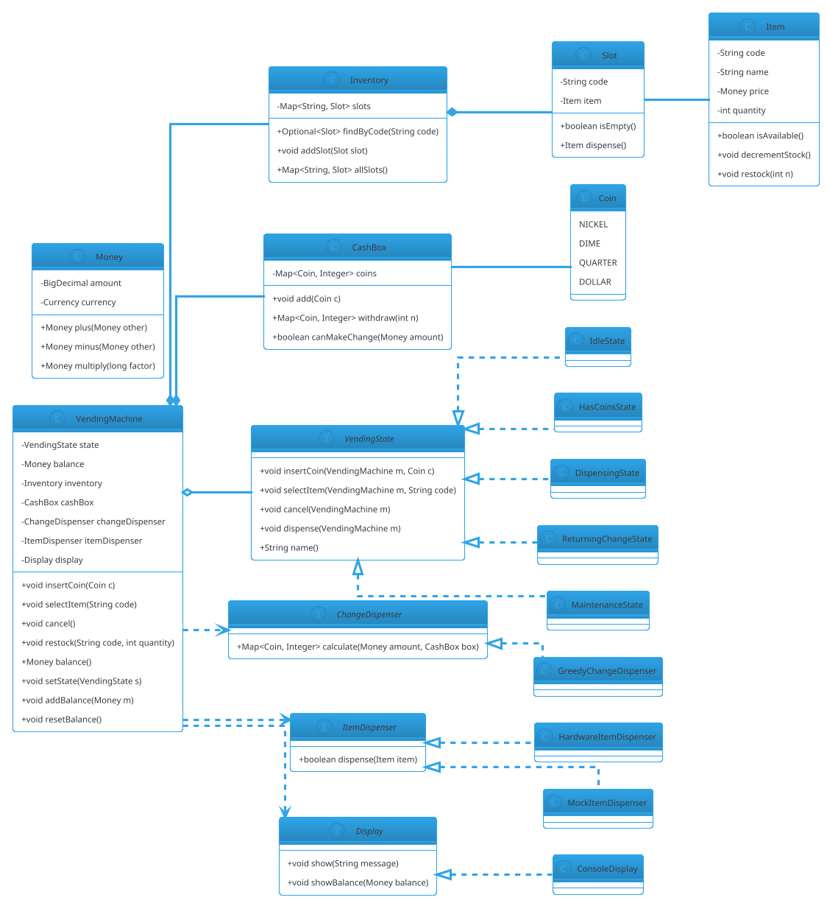

# Vending Machine

## Problem Statement

Design a vending machine that sells snacks and drinks. The machine accepts coins and notes, lets the user select an item, dispenses it, and returns change if needed. It must be **state-driven** (idle -> has coins -> item selected -> dispensing), **thread-safe** (two users pressing buttons concurrently), **extensible** (new payment methods, new item categories), and **fault-tolerant** (out of stock, insufficient funds, hardware failure).

This is the **second most-asked LLD problem** after Parking Lot. It's smaller but introduces one critical new concept: **the State pattern** — the machine's behavior depends on its internal state.

**Example flow:**

```
Happy path:

  1. User inserts $1.00
     -> State: IDLE -> HAS_COINS
     -> Balance: $1.00

  2. User presses A1 (Chips, $1.50)
     -> State: HAS_COINS -> ...
     -> Insufficient funds -> display "Insert $0.50 more"
     -> State remains HAS_COINS

  3. User inserts $1.00 more
     -> Balance: $2.00

  4. User presses A1 again
     -> State: HAS_COINS -> DISPENSING
     -> Machine dispenses Chips
     -> Balance: $0.50 (change owed)
     -> State: DISPENSING -> RETURNING_CHANGE

  5. Machine returns $0.50
     -> Balance: $0.00
     -> State: RETURNING_CHANGE -> IDLE

Failure paths:

  - Item out of stock -> display "Out of stock", stay HAS_COINS
  - User presses Cancel -> return all coins, back to IDLE
  - Hardware dispense failure -> refund, alert operator
  - User inserts invalid coin -> return immediately

Concurrency:
  - 2 users inserting coins into different slots simultaneously
  - One user cancels while another presses item
  - Maintenance opens the machine while it's in use

Extensibility:
  - Add card / UPI payments
  - Add new item categories (fresh food)
  - Add discounts (buy 2 get 1)
  - Add loyalty points
  - Remote inventory monitoring
```

**Why it's interesting:**

- **State pattern is the star** — each state is a class
- **Money handling** — coins/notes, change calculation, exact arithmetic
- **Concurrency on shared state** — balance, inventory, hardware
- **Extensibility** — new payment methods, item types, features
- **Fault tolerance** — hardware failure mid-dispense
- **Common follow-ups**: "Add card", "Add discounts", "Remote monitoring", "Make it distributed"

---

## 1. Requirements

### Functional Requirements

- **Accept coins**: nickel (5c), dime (10c), quarter (25c), dollar ($1)
- **Accept notes**: $1, $5, $10 (configurable)
- **Select item**: by code (e.g., A1, B2); display name and price
- **Dispense item**: only if in stock and enough balance
- **Return change**: optimal coin/note combination
- **Refund**: on cancel or failure
- **Restock**: admin can refill items
- **Cash collection**: admin can empty cash box
- **Inventory tracking**: quantity per item
- **Display**: current balance, item prices, messages
- **Extensible payment**: CARD, UPI (optional)

### Non-Functional Requirements

- **Thread-safe**: concurrent coin inserts and item selections
- **Extensible**: new payment methods, item types, pricing rules without breaking existing code
- **Fault-tolerant**: hardware failures don't corrupt state; refunds issued
- **Exact money math**: no floating-point
- **Low latency**: < 100 ms per operation (excluding physical dispense)
- **Idempotent**: pressing cancel twice doesn't double-refund
- **Auditable**: log every transaction

### Out of Scope

- Real hardware (coin validators, motors)
- Distributed vending machines (chain network)
- User accounts / loyalty
- Refrigeration / food safety
- Mobile app
- Physical machine design

---

## 2. Use Cases

### UC1 — Insert Coin

```
Actor: User
Precondition: Machine is in IDLE or HAS_COINS state
Steps:
  1. User inserts a coin
  2. Coin validator identifies denomination
  3. If valid: add to balance, transition to HAS_COINS
  4. If invalid: return coin immediately, stay in current state
Postcondition: Balance increased; state updated
```

### UC2 — Select Item (Sufficient Balance, In Stock)

```
Actor: User
Precondition: HAS_COINS state; balance >= price; item in stock
Steps:
  1. User presses code (e.g., A1)
  2. Machine validates item exists and is in stock
  3. Machine checks balance >= price
  4. State: HAS_COINS -> DISPENSING
  5. Machine dispenses item
  6. Machine calculates change (balance - price)
  7. State: DISPENSING -> RETURNING_CHANGE (if change > 0) or IDLE
Postcondition: Item dispensed; balance updated
```

### UC3 — Select Item (Insufficient Balance)

```
Actor: User
Precondition: HAS_COINS state; balance < price
Steps:
  1. User presses code
  2. Machine checks balance < price
  3. Display "Insert $X more"
  4. State remains HAS_COINS
Postcondition: No dispense; balance unchanged
```

### UC4 — Select Item (Out of Stock)

```
Actor: User
Precondition: HAS_COINS state; item out of stock
Steps:
  1. User presses code
  2. Machine detects out of stock
  3. Display "Out of stock"
  4. State remains HAS_COINS
Postcondition: No dispense; balance unchanged
```

### UC5 — Cancel / Refund

```
Actor: User
Precondition: HAS_COINS state
Steps:
  1. User presses Cancel
  2. Machine returns all coins/notes (balance)
  3. State: HAS_COINS -> IDLE
  4. Balance reset to zero
Postcondition: Full refund; state reset
```

### UC6 — Dispense Failure (Hardware)

```
Actor: System
Precondition: DISPENSING state; hardware fails
Steps:
  1. Dispense motor reports failure
  2. Machine marks item as "requires service"
  3. Machine refunds full balance
  4. State: DISPENSING -> IDLE
  5. Alert operator
Postcondition: User refunded; item flagged for maintenance
```

### UC7 — Restock (Admin)

```
Actor: Operator (admin)
Precondition: Maintenance mode
Steps:
  1. Admin opens machine
  2. Adds items to slots
  3. Updates inventory counts
  4. Closes machine; exits maintenance mode
Postcondition: Inventory updated
```

### UC8 — Add a New Payment Method (Extensibility)

```
Actor: Developer
Steps:
  1. Implement PaymentMethod interface (e.g., CardPayment)
  2. Register with VendingMachine
  3. Machine transitions to hasCoins when card is tapped
Postcondition: No existing classes modified (OCP)
```

---

## 3. Core Entities

### Entities (classes with identity)

| Entity | Responsibility |
|---|---|
| `VendingMachine` | Top-level orchestrator; holds state and inventory |
| `Inventory` | Maps item codes to slots and quantities |
| `Slot` | Holds one item type; tracks quantity |
| `Item` | A purchasable product (name, price, code) |
| `Transaction` | One purchase attempt; balance, selected item |
| `CashBox` | Stores accepted coins/notes |

### Value Objects (immutable, no identity)

| Value | Purpose |
|---|---|
| `Money` | Amount + currency (BigDecimal-based) |
| `Coin` (enum) | NICKEL, DIME, QUARTER, DOLLAR |
| `ItemCode` | Typed wrapper for "A1", "B2", etc. |
| `MachineState` (enum-ish) | IDLE, HAS_COINS, DISPENSING, RETURNING_CHANGE, MAINTENANCE |

### State Classes (State pattern)

| State | Behavior |
|---|---|
| `IdleState` | Accept coins; reject item selection |
| `HasCoinsState` | Accept coins; allow item selection; allow cancel |
| `DispensingState` | Reject new input; dispense item; return change |
| `ReturningChangeState` | Return change; transition to IDLE |
| `MaintenanceState` | Reject all user input; allow restock |

### Services (stateless or stateful orchestrators)

| Service | Responsibility |
|---|---|
| `CoinValidator` | Validate inserted coins |
| `ChangeCalculator` | Compute optimal change |
| `Dispenser` | Physically dispense item |
| `Display` | Show balance, messages |
| `InventoryManager` | Track and restock items |
| `PaymentMethod` (interface) | Accept payment (coins, card, UPI) |

### Interfaces

| Interface | Implementations |
|---|---|
| `VendingState` | IdleState, HasCoinsState, DispensingState, ReturningChangeState, MaintenanceState |
| `PaymentMethod` | CoinPayment, CardPayment (extensible) |
| `ChangeDispenser` | GreedyChangeDispenser |
| `ItemDispenser` | HardwareItemDispenser, MockItemDispenser |
| `Display` | ConsoleDisplay, NullDisplay |

---

## 4. Class Diagram



**Key design decisions:**

- `VendingMachine` holds a `VendingState` — behavior delegates to the current state
- Each state is a **stateless singleton** (only one instance needed)
- `Inventory` maps codes to `Slot`s; each `Slot` holds an `Item` and quantity
- `CashBox` tracks coins for change calculation
- `ChangeDispenser` and `ItemDispenser` are interfaces — swap hardware for mocks in tests

---

## 5. Design Patterns Used

### 5.1 State Pattern

**The central pattern for this problem.** Vending machine behavior depends entirely on its state.

**States:**
- `IdleState` — only accepts coins
- `HasCoinsState` — accepts coins, allows item selection and cancel
- `DispensingState` — no new input; dispenses item; transitions out
- `ReturningChangeState` — returns change; back to IDLE
- `MaintenanceState` — rejects all user input; allows restock

**Justification:** Encapsulating each state in a class eliminates `if/else` on a `String state` field. Transitions are explicit. Adding a new state = new class (OCP).

### 5.2 Strategy Pattern

**For payment, change dispensation, item dispensation.**

- `PaymentMethod` — Coin vs Card (extensible)
- `ChangeDispenser` — Greedy vs exact DP
- `ItemDispenser` — Real hardware vs mock

**Justification:** Different algorithms/implementations; swap at runtime.

### 5.3 Singleton Pattern

**Each state class is a singleton** (stateless, one instance shared):

```java
public final class IdleState implements VendingState {
    public static final IdleState INSTANCE = new IdleState();
    private IdleState() {}
    // ...
}
```

**Justification:** States have no state themselves. One instance is enough.

### 5.4 Factory Pattern

**`SlotFactory` or `InventoryFactory`** for creating slots from config.

**Justification:** Centralize creation; easy to extend with new slot types.

### 5.5 Observer Pattern (Optional)

**For admin alerts** — notify operator on low stock, dispense failure, cash box full.

### Patterns NOT Used

- **No Builder** — objects are simple
- **No Decorator** — no need for dynamic behavior addition
- **No Abstract Factory** — one family of slots

---

## 6. Java Implementation

### 6.1 Enums and Value Objects

```java
package lld.vending.model;

public enum Coin {
    NICKEL(5), DIME(10), QUARTER(25), DOLLAR(100);

    private final int cents;

    Coin(int cents) { this.cents = cents; }
    public int cents() { return cents; }
}
```

```java
package lld.vending.model;

import java.math.BigDecimal;
import java.util.Currency;

public record Money(BigDecimal amount, Currency currency) {

    public Money {
        if (amount == null || amount.signum() < 0) {
            throw new IllegalArgumentException("Amount must be non-negative");
        }
        if (currency == null) currency = Currency.getInstance("USD");
    }

    public static Money usd(double amount) {
        return new Money(BigDecimal.valueOf(amount), Currency.getInstance("USD"));
    }

    public static Money ofCents(int cents) {
        return new Money(BigDecimal.valueOf(cents, 2), Currency.getInstance("USD"));
    }

    public Money plus(Money other) {
        checkCurrency(other);
        return new Money(amount.add(other.amount), currency);
    }

    public Money minus(Money other) {
        checkCurrency(other);
        return new Money(amount.subtract(other.amount), currency);
    }

    public Money multiply(long factor) {
        return new Money(amount.multiply(BigDecimal.valueOf(factor)), currency);
    }

    public boolean isGreaterThanOrEqual(Money other) {
        checkCurrency(other);
        return amount.compareTo(other.amount) >= 0;
    }

    public boolean isZero() { return amount.signum() == 0; }

    private void checkCurrency(Money other) {
        if (!currency.equals(other.currency)) {
            throw new IllegalArgumentException("Currency mismatch");
        }
    }
}
```

**Key points:**
- `BigDecimal` for exact money
- `record` for immutability
- Currency check on all operations
- `isGreaterThanOrEqual` uses `compareTo` (not `equals` — `BigDecimal.equals` is scale-sensitive)

### 6.2 Item and Slot

```java
package lld.vending.model;

public final class Item {
    private final String code;
    private final String name;
    private final Money price;
    private int quantity;

    public Item(String code, String name, Money price, int quantity) {
        if (code == null || code.isBlank()) throw new IllegalArgumentException("Code required");
        if (name == null || name.isBlank()) throw new IllegalArgumentException("Name required");
        if (price == null || price.isZero()) throw new IllegalArgumentException("Price must be positive");
        if (quantity < 0) throw new IllegalArgumentException("Quantity must be non-negative");
        this.code = code;
        this.name = name;
        this.price = price;
        this.quantity = quantity;
    }

    public String code() { return code; }
    public String name() { return name; }
    public Money price() { return price; }

    public synchronized int quantity() { return quantity; }
    public synchronized boolean isAvailable() { return quantity > 0; }
    public synchronized void decrementStock() {
        if (quantity == 0) throw new IllegalStateException("Out of stock");
        quantity--;
    }
    public synchronized void restock(int n) {
        if (n < 0) throw new IllegalArgumentException("Restock quantity must be non-negative");
        quantity += n;
    }
}
```

```java
package lld.vending.model;

public final class Slot {
    private final String code;
    private final Item item;

    public Slot(String code, Item item) {
        this.code = code;
        this.item = item;
    }

    public String code() { return code; }
    public Item item() { return item; }
    public boolean isEmpty() { return !item.isAvailable(); }
}
```

### 6.3 Inventory

```java
package lld.vending.model;

import java.util.Map;
import java.util.Optional;
import java.util.concurrent.ConcurrentHashMap;

public final class Inventory {
    private final Map<String, Slot> slots = new ConcurrentHashMap<>();

    public void addSlot(Slot slot) {
        if (slots.putIfAbsent(slot.code(), slot) != null) {
            throw new IllegalStateException("Duplicate slot: " + slot.code());
        }
    }

    public Optional<Slot> findByCode(String code) {
        return Optional.ofNullable(slots.get(code));
    }

    public Map<String, Slot> allSlots() {
        return Map.copyOf(slots);
    }
}
```

### 6.4 CashBox

```java
package lld.vending.model;

import java.util.EnumMap;
import java.util.Map;
import java.util.concurrent.locks.ReentrantLock;

public final class CashBox {
    private final Map<Coin, Integer> coins = new EnumMap<>(Coin.class);
    private final ReentrantLock lock = new ReentrantLock();

    public CashBox() {
        for (Coin c : Coin.values()) coins.put(c, 0);
    }

    public void add(Coin coin) {
        lock.lock();
        try {
            coins.merge(coin, 1, Integer::sum);
        } finally {
            lock.unlock();
        }
    }

    public void remove(Map<Coin, Integer> toRemove) {
        lock.lock();
        try {
            for (Map.Entry<Coin, Integer> e : toRemove.entrySet()) {
                int current = coins.getOrDefault(e.getKey(), 0);
                if (current < e.getValue()) {
                    throw new IllegalStateException("Not enough " + e.getKey());
                }
                coins.put(e.getKey(), current - e.getValue());
            }
        } finally {
            lock.unlock();
        }
    }

    public boolean canMakeChange(Money amount) {
        lock.lock();
        try {
            return greedyChange(amount).values().stream().mapToInt(Integer::intValue).sum() >= 0;
        } finally {
            lock.unlock();
        }
    }

    public Map<Coin, Integer> greedyChange(Money amount) {
        Map<Coin, Integer> result = new EnumMap<>(Coin.class);
        int remaining = amount.amount().movePointRight(2).intValueExact();
        Coin[] descending = {Coin.DOLLAR, Coin.QUARTER, Coin.DIME, Coin.NICKEL};
        for (Coin c : descending) {
            int available = coins.getOrDefault(c, 0);
            int needed = remaining / c.cents();
            int use = Math.min(available, needed);
            if (use > 0) {
                result.put(c, use);
                remaining -= use * c.cents();
            }
        }
        if (remaining > 0) {
            throw new IllegalStateException("Cannot make exact change: remaining " + remaining + " cents");
        }
        return result;
    }

    public Map<Coin, Integer> snapshot() {
        lock.lock();
        try { return new EnumMap<>(coins); }
        finally { lock.unlock(); }
    }
}
```

**Concurrency note:** `ReentrantLock` protects the coins map. `greedyChange` computes optimal change using a fixed denomination order (works for US coins: 1, 5, 10, 25 — powers of 5).

### 6.5 ChangeDispenser (Strategy)

```java
package lld.vending.service;

import lld.vending.model.CashBox;
import lld.vending.model.Coin;
import lld.vending.model.Money;

import java.util.Map;

public interface ChangeDispenser {
    Map<Coin, Integer> calculate(Money amount, CashBox box);
}

public final class GreedyChangeDispenser implements ChangeDispenser {
    @Override
    public Map<Coin, Integer> calculate(Money amount, CashBox box) {
        return box.greedyChange(amount);
    }
}
```

### 6.6 ItemDispenser (Strategy)

```java
package lld.vending.service;

import lld.vending.model.Item;

public interface ItemDispenser {
    boolean dispense(Item item);
}

public final class HardwareItemDispenser implements ItemDispenser {
    @Override
    public boolean dispense(Item item) {
        // In real life: command motor, wait for sensor, detect jams
        return true;
    }
}

public final class MockItemDispenser implements ItemDispenser {
    private final boolean shouldFail;
    public MockItemDispenser(boolean shouldFail) { this.shouldFail = shouldFail; }
    @Override public boolean dispense(Item item) { return !shouldFail; }
}
```

### 6.7 Display

```java
package lld.vending.service;

import lld.vending.model.Money;

public interface Display {
    void show(String message);
    void showBalance(Money balance);
}

public final class ConsoleDisplay implements Display {
    @Override public void show(String message) {
        System.out.println("[VM] " + message);
    }
    @Override public void showBalance(Money balance) {
        System.out.println("[VM] Balance: $" + balance.amount());
    }
}
```

### 6.8 State Interface and Implementations

```java
package lld.vending.state;

import lld.vending.core.VendingMachine;
import lld.vending.model.Coin;

public interface VendingState {
    void insertCoin(VendingMachine machine, Coin coin);
    void selectItem(VendingMachine machine, String code);
    void cancel(VendingMachine machine);
    void dispense(VendingMachine machine);
    String name();
}
```

```java
package lld.vending.state;

import lld.vending.core.VendingMachine;
import lld.vending.model.Coin;
import lld.vending.model.Money;

public final class IdleState implements VendingState {
    public static final IdleState INSTANCE = new IdleState();
    private IdleState() {}

    @Override
    public void insertCoin(VendingMachine m, Coin coin) {
        m.addBalance(Money.ofCents(coin.cents()));
        m.getDisplay().showBalance(m.balance());
        m.setState(HasCoinsState.INSTANCE);
    }

    @Override
    public void selectItem(VendingMachine m, String code) {
        m.getDisplay().show("Insert coin first");
    }

    @Override
    public void cancel(VendingMachine m) {
        m.getDisplay().show("Nothing to cancel");
    }

    @Override
    public void dispense(VendingMachine m) {
        m.getDisplay().show("Nothing selected");
    }

    @Override public String name() { return "IDLE"; }
}
```

```java
package lld.vending.state;

import lld.vending.core.VendingMachine;
import lld.vending.model.*;

public final class HasCoinsState implements VendingState {
    public static final HasCoinsState INSTANCE = new HasCoinsState();
    private HasCoinsState() {}

    @Override
    public void insertCoin(VendingMachine m, Coin coin) {
        m.addBalance(Money.ofCents(coin.cents()));
        m.getDisplay().showBalance(m.balance());
        // stay in HAS_COINS
    }

    @Override
    public void selectItem(VendingMachine m, String code) {
        var slotOpt = m.getInventory().findByCode(code);
        if (slotOpt.isEmpty()) {
            m.getDisplay().show("Invalid code: " + code);
            return;
        }
        Slot slot = slotOpt.get();
        Item item = slot.item();

        if (!item.isAvailable()) {
            m.getDisplay().show("Out of stock: " + item.name());
            return;
        }
        if (!m.balance().isGreaterThanOrEqual(item.price())) {
            Money shortfall = item.price().minus(m.balance());
            m.getDisplay().show("Insert $" + shortfall.amount() + " more");
            return;
        }

        // Enough balance, in stock -> transition
        m.setSelectedItem(item);
        m.setState(DispensingState.INSTANCE);
        m.dispense();   // trigger dispense logic
    }

    @Override
    public void cancel(VendingMachine m) {
        Money refund = m.balance();
        m.getDisplay().show("Refunding $" + refund.amount());
        m.resetBalance();
        m.setState(IdleState.INSTANCE);
    }

    @Override
    public void dispense(VendingMachine m) {
        m.getDisplay().show("Select an item first");
    }

    @Override public String name() { return "HAS_COINS"; }
}
```

```java
package lld.vending.state;

import lld.vending.core.VendingMachine;
import lld.vending.model.*;

public final class DispensingState implements VendingState {
    public static final DispensingState INSTANCE = new DispensingState();
    private DispensingState() {}

    @Override
    public void insertCoin(VendingMachine m, Coin coin) {
        m.getDisplay().show("Please wait, dispensing...");
        // Reject new coins during dispense
    }

    @Override
    public void selectItem(VendingMachine m, String code) {
        m.getDisplay().show("Please wait, dispensing...");
    }

    @Override
    public void cancel(VendingMachine m) {
        m.getDisplay().show("Cannot cancel during dispense");
    }

    @Override
    public void dispense(VendingMachine m) {
        Item item = m.getSelectedItem();
        if (item == null) {
            m.setState(HasCoinsState.INSTANCE);
            return;
        }

        boolean ok = m.getItemDispenser().dispense(item);
        if (!ok) {
            m.getDisplay().show("Dispense failed; refunding");
            m.refundBalance();
            m.clearSelectedItem();
            m.setState(IdleState.INSTANCE);
            return;
        }

        // Deduct stock and balance
        item.decrementStock();
        Money change = m.balance().minus(item.price());
        m.resetBalance();

        if (change.isZero()) {
            m.clearSelectedItem();
            m.setState(IdleState.INSTANCE);
        } else {
            m.setBalance(change);
            m.setState(ReturningChangeState.INSTANCE);
            m.dispense();   // delegate to ReturnChange state
        }
    }

    @Override public String name() { return "DISPENSING"; }
}
```

```java
package lld.vending.state;

import lld.vending.core.VendingMachine;
import lld.vending.model.*;

public final class ReturningChangeState implements VendingState {
    public static final ReturningChangeState INSTANCE = new ReturningChangeState();
    private ReturningChangeState() {}

    @Override public void insertCoin(VendingMachine m, Coin coin) {
        m.getDisplay().show("Please wait, returning change");
    }

    @Override public void selectItem(VendingMachine m, String code) {
        m.getDisplay().show("Please wait, returning change");
    }

    @Override public void cancel(VendingMachine m) {
        m.getDisplay().show("Please wait, returning change");
    }

    @Override
    public void dispense(VendingMachine m) {
        Money change = m.balance();
        try {
            var coins = m.getChangeDispenser().calculate(change, m.getCashBox());
            m.getCashBox().remove(coins);
            m.getDisplay().show("Returned change: $" + change.amount());
        } catch (IllegalStateException e) {
            // Cannot make exact change - refund full and flag issue
            m.getDisplay().show("Cannot make exact change; see operator");
            // In a production system, we'd keep the machine in an error state
        }
        m.resetBalance();
        m.clearSelectedItem();
        m.setState(IdleState.INSTANCE);
    }

    @Override public String name() { return "RETURNING_CHANGE"; }
}
```

```java
package lld.vending.state;

import lld.vending.core.VendingMachine;
import lld.vending.model.Coin;

public final class MaintenanceState implements VendingState {
    public static final MaintenanceState INSTANCE = new MaintenanceState();
    private MaintenanceState() {}

    @Override public void insertCoin(VendingMachine m, Coin coin) {
        m.getDisplay().show("Machine under maintenance");
    }
    @Override public void selectItem(VendingMachine m, String code) {
        m.getDisplay().show("Machine under maintenance");
    }
    @Override public void cancel(VendingMachine m) { /* no-op */ }
    @Override public void dispense(VendingMachine m) { /* no-op */ }
    @Override public String name() { return "MAINTENANCE"; }
}
```

### 6.9 VendingMachine (Orchestrator)

```java
package lld.vending.core;

import lld.vending.model.*;
import lld.vending.service.ChangeDispenser;
import lld.vending.service.Display;
import lld.vending.service.ItemDispenser;
import lld.vending.state.IdleState;
import lld.vending.state.VendingState;

import java.util.concurrent.locks.ReentrantLock;

public final class VendingMachine {
    private final Inventory inventory;
    private final CashBox cashBox;
    private final ChangeDispenser changeDispenser;
    private final ItemDispenser itemDispenser;
    private final Display display;

    // Mutable state guarded by lock
    private final ReentrantLock lock = new ReentrantLock();
    private VendingState state = IdleState.INSTANCE;
    private Money balance = Money.usd(0);
    private Item selectedItem;

    public VendingMachine(Inventory inventory,
                          CashBox cashBox,
                          ChangeDispenser changeDispenser,
                          ItemDispenser itemDispenser,
                          Display display) {
        this.inventory = inventory;
        this.cashBox = cashBox;
        this.changeDispenser = changeDispenser;
        this.itemDispenser = itemDispenser;
        this.display = display;
    }

    // ----- Public API -----

    public void insertCoin(Coin coin) {
        lock.lock();
        try { state.insertCoin(this, coin); }
        finally { lock.unlock(); }
    }

    public void selectItem(String code) {
        lock.lock();
        try { state.selectItem(this, code); }
        finally { lock.unlock(); }
    }

    public void cancel() {
        lock.lock();
        try { state.cancel(this); }
        finally { lock.unlock(); }
    }

    public void dispense() {
        lock.lock();
        try { state.dispense(this); }
        finally { lock.unlock(); }
    }

    // ----- Admin API -----

    public void restock(String code, int quantity) {
        lock.lock();
        try {
            Slot slot = inventory.findByCode(code)
                    .orElseThrow(() -> new IllegalArgumentException("Unknown code: " + code));
            slot.item().restock(quantity);
        } finally { lock.unlock(); }
    }

    // ----- Accessors used by state classes -----

    VendingState getState() { return state; }
    void setState(VendingState s) { this.state = s; }

    Money balance() { return balance; }
    void setBalance(Money m) { this.balance = m; }
    void addBalance(Money m) { this.balance = balance.plus(m); }
    void resetBalance() { this.balance = Money.usd(0); }
    void refundBalance() {
        Money refund = balance;
        // In real life: physically return coins; here, just log
        resetBalance();
    }

    Item getSelectedItem() { return selectedItem; }
    void setSelectedItem(Item item) { this.selectedItem = item; }
    void clearSelectedItem() { this.selectedItem = null; }

    Inventory getInventory() { return inventory; }
    CashBox getCashBox() { return cashBox; }
    ChangeDispenser getChangeDispenser() { return changeDispenser; }
    ItemDispenser getItemDispenser() { return itemDispenser; }
    Display getDisplay() { return display; }
}
```

**Key concurrency decisions:**

- **One lock per machine** — vending machines have very low contention; a single lock is fine and simplest
- **State classes are stateless singletons** — safe to share
- **`Item.decrementStock()` is synchronized** — protects inventory counts from concurrent access (in case a future feature allows parallel vends)

### 6.10 Demo

```java
package lld.vending;

import lld.vending.core.VendingMachine;
import lld.vending.model.*;
import lld.vending.service.*;

public class Demo {
    public static void main(String[] args) {
        Inventory inv = new Inventory();
        inv.addSlot(new Slot("A1", new Item("A1", "Chips", Money.usd(1.50), 10)));
        inv.addSlot(new Slot("A2", new Item("A2", "Cola", Money.usd(2.00), 5)));
        inv.addSlot(new Slot("B1", new Item("B1", "Candy", Money.usd(0.75), 0))); // out of stock

        VendingMachine vm = new VendingMachine(
                inv,
                new CashBox(),
                new GreedyChangeDispenser(),
                new MockItemDispenser(false),
                new ConsoleDisplay()
        );

        System.out.println("--- Buy Chips with exact change ---");
        vm.insertCoin(Coin.DOLLAR);
        vm.insertCoin(Coin.QUARTER);
        vm.insertCoin(Coin.QUARTER);
        vm.selectItem("A1");   // $1.50
        // Expected: dispense A1, no change (balance was $1.50)

        System.out.println("\n--- Buy Cola, insufficient funds ---");
        vm.insertCoin(Coin.DOLLAR);
        vm.selectItem("A2");   // $2.00, only $1
        vm.insertCoin(Coin.DOLLAR);
        vm.selectItem("A2");   // now $2, dispense

        System.out.println("\n--- Cancel transaction ---");
        vm.insertCoin(Coin.DOLLAR);
        vm.cancel();

        System.out.println("\n--- Select out-of-stock item ---");
        vm.insertCoin(Coin.DOLLAR);
        vm.selectItem("B1");
        vm.cancel();
    }
}
```

**Expected output:**
```
--- Buy Chips with exact change ---
[VM] Balance: $1.00
[VM] Balance: $1.25
[VM] Balance: $1.50
[VM] Balance: $0.00

--- Buy Cola, insufficient funds ---
[VM] Balance: $1.00
[VM] Insert $1.00 more
[VM] Balance: $2.00
[VM] Balance: $0.00

--- Cancel transaction ---
[VM] Balance: $1.00
[VM] Refunding $1.00

--- Select out-of-stock item ---
[VM] Balance: $1.00
[VM] Out of stock: Candy
[VM] Refunding $1.00
```

---

## 7. Concurrency Considerations

### Shared Resources

| Resource | Shared? | Synchronization |
|---|---|---|
| `state` | Yes | Guarded by `ReentrantLock` on `VendingMachine` |
| `balance` | Yes | Guarded by same lock |
| `selectedItem` | Yes | Guarded by same lock |
| `Item.quantity` | Yes | `synchronized` on `Item` |
| `CashBox.coins` | Yes | `ReentrantLock` on `CashBox` |
| `Inventory.slots` | Read-mostly | `ConcurrentHashMap` |

### Why One Lock per Machine

- **Low contention** — typically one user at a time
- **Simple reasoning** — no deadlock risk between multiple locks
- **Critical section is short** — no long-running operation inside the lock

**Trade-off:** If we ever add concurrent operations (e.g., two users pressing item buttons simultaneously), throughput is limited. But for vending, this is fine.

### Lock Ordering (Deadlock Prevention)

If we ever split into multiple locks, define a global order:

```
1. VendingMachine.lock  (outermost)
2. CashBox.lock
3. Item.lock
```

**Always acquire in this order.** Never hold `Item.lock` while acquiring `VendingMachine.lock`.

### Atomicity of Dispense

The dispense operation involves:
1. Hardware command (I/O, slow)
2. Stock decrement
3. Balance deduction
4. Change calculation
5. Change return

**Issue:** Holding `VendingMachine.lock` during hardware I/O blocks all other operations.

**Solutions:**
- **Async dispense**: Transition to `DISPENSING`, release lock, run hardware command, reacquire to update state
- **Timeout**: If hardware doesn't respond in N seconds, treat as failure
- **Hardware ACK**: Only decrement stock after sensor confirms dispense

For LLD, keeping it synchronous is acceptable — mention the async approach in follow-ups.

### Idempotent Cancel

If user presses cancel twice quickly:
- First press: refund, transition to IDLE
- Second press: `IdleState.cancel` is a no-op

**Idempotent by design.**

### CashBox Race

Two machines could share a cash box (unusual but possible in some setups). `CashBox` uses its own `ReentrantLock` — safe.

### Testing Concurrent Access

```java
@Test
void concurrentCoinInserts() throws InterruptedException {
    VendingMachine vm = /* ... */;
    int threads = 100;
    CountDownLatch latch = new CountDownLatch(1);
    ExecutorService pool = Executors.newFixedThreadPool(threads);

    for (int i = 0; i < threads; i++) {
        pool.submit(() -> {
            try { latch.await(); } catch (InterruptedException e) { return; }
            vm.insertCoin(Coin.QUARTER);
        });
    }

    latch.countDown();
    pool.shutdown();
    pool.awaitTermination(5, TimeUnit.SECONDS);

    assertEquals(Money.usd(25.00), vm.balance());
}
```

---

## 8. Extensibility

### Add a New Payment Method (Card)

**Current design:** `Coin` enum + `VendingMachine.insertCoin()`.

**Extension:**

1. Introduce `PaymentMethod` interface:
   ```java
   public interface PaymentMethod {
       Money amount();
       boolean isComplete();
   }
   ```

2. Add `CardPayment implements PaymentMethod`.

3. Add `VendingMachine.insertPayment(PaymentMethod)` that delegates to `state.insertPayment(...)`.

4. `IdleState.insertPayment` and `HasCoinsState.insertPayment` accept the new method.

**Existing classes modified:** state classes (add method), `VendingMachine` (add method). **Everything else unchanged.**

**Better design:** Push the abstraction from the start:

```java
public interface PaymentMethod {
    Money amount();
}

public record CashPayment(Money amount) implements PaymentMethod {}
public record CardPayment(Money amount, String txnId) implements PaymentMethod {}
```

Then `VendingMachine.acceptPayment(PaymentMethod)` is the single entry point.

### Add a New Item Type (e.g., Fresh Food)

Just add to inventory — no code change. `Item` is generic.

If fresh food requires **expiration tracking**:
- Add `expiryDate` to `Item`
- Add `isExpired()` check
- `HasCoinsState.selectItem` rejects expired items

**Existing classes modified:** `Item`, `HasCoinsState`. Everything else unchanged.

### Add a Discount Rule (Buy 2 Get 1)

1. Introduce `PricingStrategy`:
   ```java
   public interface PricingStrategy {
       Money priceFor(Item item, int quantity);
   }
   ```

2. Implement `BuyTwoGetOneFree`.

3. `VendingMachine` uses it in `selectItem`.

**Existing classes modified:** `VendingMachine` (add strategy field), state classes if needed.

**No change** to `Item`, `Slot`, `Inventory`, `CashBox`.

### Add Remote Monitoring

**Observer pattern:**

1. Implement `VendingObserver`:
   ```java
   public interface VendingObserver {
       void onEvent(VendingEvent event);
   }
   ```

2. Notify on: `COIN_INSERTED`, `ITEM_DISPENSED`, `OUT_OF_STOCK`, `HARDWARE_FAILURE`.

3. Observer pushes to a remote service (HTTP, MQTT).

**No changes** to core logic — observers are notified from `VendingMachine`.

### Make It Distributed

A "chain" of vending machines with central inventory and reporting:

- Each machine has a `machineId`
- Machines report to a central server via MQTT/HTTP
- Central server tracks inventory across the chain
- Restock requests dispatched automatically
- **Becomes an HLD problem**

### Add Maintenance Mode

Already have `MaintenanceState`. Admin toggles:

```java
public void enterMaintenance() { setState(MaintenanceState.INSTANCE); }
public void exitMaintenance() { setState(IdleState.INSTANCE); }
```

### Add Multi-Currency

`Money` already has a `Currency`. Extend:

- `Coin` enum gets currency
- CashBox tracks per-currency
- Change calculator handles currency

**Existing classes modified:** `Money` (no change), `Coin`, `CashBox`.

---

## 9. SOLID Principles Applied

### Single Responsibility Principle

| Class | Single Responsibility |
|---|---|
| `VendingMachine` | Orchestration |
| `IdleState` | Behavior when idle |
| `HasCoinsState` | Behavior when coins inserted |
| `DispensingState` | Behavior while dispensing |
| `Inventory` | Track slots |
| `Item` | Represent one item |
| `CashBox` | Store coins |
| `ChangeDispenser` | Compute change |
| `ItemDispenser` | Physically dispense |
| `Display` | Show messages |

Each class has exactly one reason to change.

### Open/Closed Principle

- **New state** — add a class implementing `VendingState`; no edits to existing states
- **New payment method** — implement `PaymentMethod`; extend state classes
- **New change algorithm** — implement `ChangeDispenser`; no edits
- **New item type** — add to inventory; no code change
- **New observer** — implement `VendingObserver`; no edits

**Goal:** State classes may need method additions for new payment types (unavoidable in a state machine), but the core `VendingMachine`, `Inventory`, `CashBox` don't change.

### Liskov Substitution Principle

- `IdleState`, `HasCoinsState`, `DispensingState`, `ReturningChangeState`, `MaintenanceState` all honor `VendingState` contract
- `GreedyChangeDispenser` honors `ChangeDispenser` contract
- No subclass throws `UnsupportedOperationException`

**Verification:** Any state can be assigned to `VendingState state` and behaves as documented.

### Interface Segregation Principle

All interfaces are small:

- `VendingState` — 5 methods (one per operation)
- `ChangeDispenser` — 1 method
- `ItemDispenser` — 1 method
- `Display` — 2 methods

No client implements unused methods.

### Dependency Inversion Principle

`VendingMachine` depends on abstractions:

- `ChangeDispenser` (interface)
- `ItemDispenser` (interface)
- `Display` (interface)
- `VendingState` (interface)

Dependencies are **constructor-injected**. No `new` inside `VendingMachine`.

**Testability:** Inject `MockItemDispenser`, `NullDisplay`, fake `ChangeDispenser` in tests.

---

## 10. Common Pitfalls

| Pitfall | Why It's Wrong | Fix |
|---|---|---|
| `String state = "IDLE"` with `if/else` | Spaghetti; hard to add states | State pattern |
| `double` for money | Rounding errors | `BigDecimal` / `Money` |
| Global lock around hardware I/O | Blocks all ops during dispense | Async dispense; release lock |
| State classes with mutable fields | Thread safety issues | Stateless state classes |
| `Money.equals` for comparison | Scale-sensitive (`1.0 != 1.00`) | Use `compareTo` |
| Cash box under-provisioned for change | Can't make change | Track minimum float; alert operator |
| Cancel after dispense started | Refund after item released | `DispensingState.cancel` is no-op |
| No exact-change check | Dispenses item, then can't refund | Check `canMakeChange` before dispensing |
| Duplicate slot codes | Silent overwrite | `Inventory.addSlot` throws on duplicate |
| Observer throwing exceptions | Breaks notify loop | try/catch around each observer |
| No test clock | Untestable time logic | Inject `Clock` if needed |
| Item.quantity race | Concurrent decrements | `synchronized` on `Item` |

---

## 11. Follow-up Questions

### Q1: How would you handle a user inserting coins after selecting an item?

**Answer:** During `DispensingState`, new coin inserts are rejected with "Please wait". After dispense completes, `ReturningChangeState` also rejects. Only `IdleState` and `HasCoinsState` accept coins.

### Q2: What if the machine can't make exact change?

**Answer:** Before dispensing, check `CashBox.canMakeChange(balance - price)`. If not, display "Exact change only" and reject the transaction. Alternative: dispense and give a credit note (bad UX).

### Q3: How would you implement "exact change only" mode?

**Answer:** Add a flag `exactChangeOnly` on the machine. When true, `HasCoinsState.selectItem` requires `balance == price` (not just `>=`). The flag is toggled by the operator when the cash box is low.

### Q4: How would you handle a power failure mid-transaction?

**Answer:** Persist transaction state to durable storage (small file or NV-RAM) before each critical step. On boot, check for interrupted transactions and refund. This is where LLD meets reliability engineering.

### Q5: How would you test this?

- **Unit tests** — each state class in isolation (drive transitions)
- **Integration tests** — full flow (insert coins, select, dispense, change)
- **Concurrency tests** — 100 threads inserting coins simultaneously
- **Edge cases** — exact change, insufficient balance, out of stock, invalid code
- **Hardware mocks** — `MockItemDispenser` for failure scenarios

### Q6: How would you add card payments?

**Answer:** Introduce `PaymentMethod` interface. `VendingMachine.acceptPayment(PaymentMethod)` is the new entry point. `IdleState.acceptPayment` transitions to `HasCoinsState` if the payment amount is non-zero. Refunds via `PaymentMethod.refund()` for card, or via physical coins for cash.

### Q7: How would you add discounts (buy 2 get 1 free)?

**Answer:** Introduce `PricingStrategy`. `VendingMachine` holds one; `HasCoinsState.selectItem` uses it to compute the actual price. `BuyTwoGetOneFree` reads the transaction history to determine the discount. Add a `Transaction` entity to track history.

### Q8: How would you support reservations (mobile app pre-order)?

**Answer:** Add a `Reservation` entity with an expiry. `VendingMachine` holds active reservations. `HasCoinsState.selectItem` checks for a reservation first. Reserved items are held until expiry or pickup. Timer (ScheduledExecutorService) expires them.

### Q9: How would you make this distributed?

**Answer:** Each machine reports to a central server via MQTT:
- Machine ID, inventory levels, transactions, errors
- Server aggregates across the chain
- Restock requests dispatched to operators
- Analytics: which items sell fastest, peak hours, revenue

The central server is an HLD problem — think Kafka + ClickHouse + analytics dashboard.

### Q10: How would you handle a jammed dispenser?

**Answer:** `ItemDispenser.dispense` returns `false` on failure. `DispensingState`:
1. Marks the item as "requires service"
2. Refunds full balance
3. Transitions to `MaintenanceState` for that slot (or the machine)
4. Notifies operator

The item is not decremented from stock (it's still physically there, just inaccessible).

---

## 12. Similar Problems

- **Parking Lot** — same skeleton: inventory (spots), allocation, pricing, release
- **ATM** — state machine (idle, card-inserted, PIN, transaction); cash dispenser strategy
- **Elevator** — state machine (idle, moving); scheduling strategy
- **Coffee Machine** — state machine (idle, brewing); recipe strategy
- **Ticket Dispenser** — state machine; inventory of tickets
- **Self-Checkout Kiosk** — state machine; payment; inventory; tax

**Shared skeleton:**

1. **State machine** — Idle, In-Progress, Finalizing
2. **Inventory** — items or slots
3. **Payment** — accept, refund
4. **Hardware abstraction** — dispense, validate
5. **Pricing** — strategy for price calculation
6. **Concurrency** — single lock for simplicity
7. **Observer** — notify on low stock, failure

Master Vending Machine → apply the same skeleton to the others.

---

## 13. Key Takeaways

- **State Pattern is the star** — each state is a class; transitions are explicit
- **Stateless state singletons** — safe to share; no per-instance state
- **`Money` value object** with `BigDecimal` — never use `double`
- **`CashBox` with `ReentrantLock`** — protects shared coin inventory
- **One lock per machine** — low contention; simple reasoning
- **Async dispense** — release lock during hardware I/O in production
- **`Inventory` uses `ConcurrentHashMap`** — safe concurrent reads
- **`Item.quantity` is `synchronized`** — protects stock counts
- **Idempotent cancel** — pressing twice doesn't double-refund
- **Exact-change check** — before dispensing, not after
- **`PaymentMethod` interface** for extension — cash today, card tomorrow
- **Hardware abstracted behind interfaces** — `ItemDispenser`, `Display`
- **Every state handles all 5 operations** — no `UnsupportedOperationException`
- **Constructor injection** — no `new` in `VendingMachine`
- **The state machine + strategy + inventory skeleton** — applies to ATM, Elevator, Coffee Machine

### The Generalizable Recipe

For any **state-machine + inventory** problem:

1. **States as classes** — one class per state
2. **Transitions explicit** — `setState()` calls inside state methods
3. **Hardware abstracted** — interfaces for dispense, display, cash
4. **Inventory with concurrency** — `synchronized` or `ConcurrentHashMap`
5. **Money value object** — `BigDecimal`, immutable
6. **Strategies for variation** — change calculation, dispense, pricing
7. **One lock for simplicity** — split only if contention demands
8. **Idempotent operations** — cancel, refund can be called twice safely

This skeleton solves: Vending Machine, ATM, Elevator, Coffee Machine, Parking Lot (with inventory), Ticket Dispenser, Self-Checkout — with variations in states, hardware, and pricing.