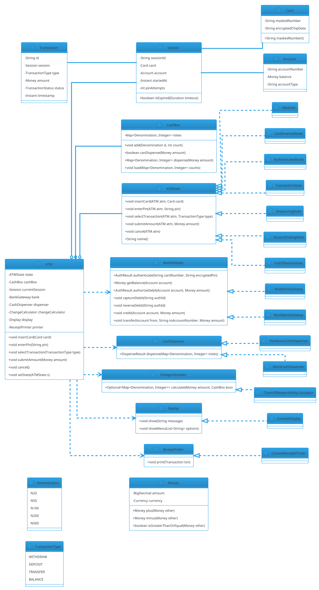

# ATM

## Problem Statement

Design an ATM (Automated Teller Machine) that supports the full banking workflow: card insertion, PIN verification, balance inquiry, cash withdrawal, deposit, and fund transfer. The machine must interact with a **bank backend** (for authentication and account operations), manage **cash inventory** with optimal note dispensation, handle **hardware failures** gracefully, and remain **thread-safe** if multiple operations race.

This problem reinforces the **State pattern** (from Vending Machine) but adds a **Chain of Responsibility** for cash dispensing, and a **Repository/Adapter** pattern for talking to the bank. It's a favorite because it's small enough to design in 45 minutes but rich enough to expose weakness in abstraction.

**Example flow:**

```
Happy path — withdrawal:

  1. User inserts card
     -> State: IDLE -> CARD_INSERTED

  2. User enters PIN
     -> Bank auth call (async, 2 s)
     -> State: CARD_INSERTED -> AUTHENTICATED

  3. User selects "Withdraw"
     -> State: AUTHENTICATED -> TRANSACTION

  4. User enters amount: $270
     -> System checks account balance >= $270
     -> System checks cash box can dispense $270
       - e.g., 2x$100, 1x$50, 1x$20
     -> Bank debits account
     -> Machine dispenses cash
     -> State: TRANSACTION -> DISPENSING
     -> State: DISPENSING -> IDLE
     -> Card ejected

Failure paths:

  - Invalid PIN (3 attempts) -> card retained -> IDLE
  - Insufficient funds -> display message -> back to AUTHENTICATED
  - Cash box can't make exact amount -> offer nearest alternative
  - Bank backend timeout -> display error -> back to AUTHENTICATED
  - Dispense jam -> refund, alert operator, retain card

Concurrency:
  - Single ATM, single user at a time
  - But backend calls are async; a state must not transition twice

Extensibility:
  - Add deposit (cheque, cash)
  - Add fund transfer to another account
  - Add mini-statement printing
  - Add UPI / QR withdrawal
  - Multi-currency
```

**Why it's interesting:**

- **State pattern with more states** than Vending Machine
- **Chain of Responsibility** for cash note dispensation (2000 -> 500 -> 200 -> 100 -> 50 -> 20)
- **Repository pattern** for abstracting the bank
- **Adapter pattern** for talking to legacy bank SOAP/ISO-8583 APIs
- **Money handling** with BigDecimal
- **Two-phase operations** (authorize -> dispense -> confirm)
- **Failure recovery** (bank debit but dispense fails)
- **Common follow-ups**: "Add deposit", "Add transfer", "Handle network failure", "Multi-currency"

---

## 1. Requirements

### Functional Requirements

- **Insert card**: magnetic stripe or chip
- **PIN entry**: 4-digit, encrypted in transit
- **Authentication**: 3 attempts; card retained after 3 failures
- **Balance inquiry**: display available balance
- **Cash withdrawal**: denominations $20, $50, $100, $200, $500
- **Deposit**: cash (and optionally cheque)
- **Fund transfer**: to another account (same bank, optionally inter-bank)
- **Mini statement**: last N transactions
- **Change PIN**: at ATM
- **Receipt**: printed on transaction completion
- **Card eject**: on completion or cancel
- **Cash box management**: track denominations, refill
- **Backend integration**: auth, debit, credit, query

### Non-Functional Requirements

- **Thread-safe**: single user, but async bank calls; state must not race
- **Extensible**: add deposit, transfer, new denominations without breaking existing code
- **Fault-tolerant**: bank timeout, dispense jam, network failure
- **Exactly-once**: a withdrawal must not double-debit
- **Idempotent**: retries on network failure must not duplicate
- **Auditable**: log every transaction (masked card)
- **Secure**: PIN never stored plain, encrypted in transit
- **Low latency**: < 2 sec for balance, < 5 sec for withdrawal (excluding dispense)

### Out of Scope

- Physical card reader / dispenser hardware
- Actual bank core banking integration
- ATM location / cash replenishment logistics
- Fraud detection (adjacent service)
- Multi-language UI
- Accessibility (card reader for blind)

---

## 2. Use Cases

### UC1 — Authenticate

```
Actor: User
Precondition: ATM is IDLE
Steps:
  1. User inserts card
  2. ATM reads card number + chip data
  3. ATM prompts for PIN
  4. User enters 4-digit PIN
  5. ATM sends auth request to bank
  6. Bank validates; returns session token
  7. ATM transitions to AUTHENTICATED
Postcondition: User authenticated; session active
Alternative: Invalid PIN -> increment attempt counter; after 3 -> retain card
Alternative: Card blocked -> display message; eject card
```

### UC2 — Balance Inquiry

```
Actor: Authenticated user
Steps:
  1. User selects "Balance"
  2. ATM queries bank
  3. ATM displays balance (available + ledger)
  4. Ask "Another transaction?"
  5. Yes -> back to transaction menu; No -> eject card
Postcondition: Balance displayed
```

### UC3 — Cash Withdrawal (Happy Path)

```
Actor: Authenticated user
Precondition: Sufficient balance; cash box can make amount
Steps:
  1. User selects "Withdraw"
  2. User enters amount (e.g., $270)
  3. ATM validates amount is multiple of $20
  4. ATM checks account balance via bank
  5. ATM checks cash box can dispense
  6. Bank debits account (authorize)
  7. ATM dispenses cash
  8. Bank confirms transaction (capture)
  9. ATM prints receipt
 10. Card ejected
Postcondition: Cash dispensed; account debited
Alternative: Insufficient funds -> back to transaction menu
Alternative: Cash box can't make amount -> suggest alternatives
Alternative: Dispense fails -> refund (reverse debit); alert operator
```

### UC4 — Cash Deposit

```
Actor: Authenticated user
Steps:
  1. User selects "Deposit"
  2. ATM prompts to insert cash
  3. User inserts notes
  4. ATM validates notes (counterfeit check)
  5. ATM displays counted amount; confirms
  6. Bank credits account
  7. Receipt printed
Postcondition: Account credited
Alternative: Invalid note -> returned; transaction cancelled
```

### UC5 — Fund Transfer

```
Actor: Authenticated user
Steps:
  1. User selects "Transfer"
  2. User enters recipient account number
  3. User enters amount
  4. ATM verifies recipient account exists
  5. Bank debits sender, credits recipient (atomic)
  6. Receipt printed
Postcondition: Transfer complete
Alternative: Insufficient funds or invalid recipient -> error
```

### UC6 — Cancel / Timeout

```
Actor: User or System
Precondition: Any non-IDLE state
Steps:
  1. User presses Cancel, OR no activity for 60 s
  2. ATM cancels pending operation
  3. ATM returns any inserted cash/card
  4. ATM transitions to IDLE
Postcondition: Session terminated
```

### UC7 — Dispense Failure

```
Actor: System
Precondition: Cash dispensed partially or jammed
Steps:
  1. Dispenser reports failure
  2. ATM reverses bank debit (refund)
  3. ATM flags cash box for service
  4. Displays "Service unavailable"
  5. Alerts operator
Postcondition: No net debit; user refunded
```

---

## 3. Core Entities

### Entities (classes with identity)

| Entity | Responsibility |
|---|---|
| `ATM` | Top-level machine; holds state and hardware |
| `Card` | Inserted card (number, chip data) |
| `Account` | Bank account (number, balance, type) |
| `Session` | An authenticated user session (card, token, timestamp) |
| `Transaction` | A single operation (withdraw, deposit, etc.) |
| `CashBox` | Stores note inventory |
| `Note` (value object) | A denomination + count |

### Value Objects (immutable, no identity)

| Value | Purpose |
|---|---|
| `Money` | BigDecimal + currency |
| `Denomination` (enum) | N20, N50, N100, N200, N500 |
| `PIN` | Encrypted PIN wrapper |
| `CardNumber` | Typed wrapper (with masking for logs) |
| `TransactionId` | Typed wrapper around UUID |
| `TransactionType` (enum) | WITHDRAW, DEPOSIT, TRANSFER, BALANCE |

### State Classes (State pattern)

| State | Behavior |
|---|---|
| `IdleState` | Accept card insert |
| `CardInsertedState` | Prompt for PIN; validate |
| `AuthenticatedState` | Show menu; handle transaction selection |
| `TransactionState` | Handle specific transaction (withdraw, deposit, transfer, balance) |
| `DispensingState` | Dispense cash; handle failure |
| `SessionEndingState` | Print receipt, eject card, transition to IDLE |
| `OutOfServiceState` | Hardware failure; reject all user input |

### Services (interfaces)

| Service | Responsibility |
|---|---|
| `BankGateway` | Talk to bank backend (auth, debit, credit, query) |
| `CashDispenser` | Physically dispense notes |
| `CardReader` | Read card data |
| `ReceiptPrinter` | Print receipt |
| `Display` | Show messages |
| `PinPad` | Read PIN |
| `ChangeCalculator` | Compute note combination (Chain of Responsibility) |

### Interfaces (contracts)

| Interface | Implementations |
|---|---|
| `ATMState` | IdleState, CardInsertedState, AuthenticatedState, ..., OutOfServiceState |
| `BankGateway` | RestBankGateway, MockBankGateway |
| `CashDispenser` | HardwareCashDispenser, MockCashDispenser |
| `ChangeCalculator` | ChainOfResponsibilityCalculator |
| `Display` | ConsoleDisplay, NullDisplay |
| `ReceiptPrinter` | ConsolePrinter, NullPrinter |

### Relationship Summary

```
ATM          *---  ATMState           (1)
ATM          *---  CashBox            (1)
ATM          ..>   BankGateway        (1)
ATM          ..>   CashDispenser      (1)
ATM          ..>   CardReader         (1)
ATM          ..>   Display            (1)
ATM          ..>   ReceiptPrinter     (1)
ATM          ..>   ChangeCalculator   (1)
ATM          o---  Session            (0..1)
Session      ---   Card               (1)
Session      ---   Account            (1)
Transaction  ---   Session            (1)
Transaction  ..>   Money              (1)
CashBox      *---  Denomination       (1..*)
```

---

## 4. Class Diagram



---

## 5. Design Patterns Used

### 5.1 State Pattern

**The core pattern.** ATM behavior changes with state.

**States:** Idle, CardInserted, Authenticated, Transaction, Dispensing, SessionEnding, OutOfService.

**Justification:** Each state handles a specific set of inputs. Transitions are explicit. Adding a new state (e.g., "ChequeDeposit") = new class, no edits to existing states.

### 5.2 Chain of Responsibility (for Cash Dispensing)

**Problem:** The cash box holds $20, $50, $100, $200, $500 notes. Given an amount, we need to pick a valid combination.

**Solution:** A chain of "dispenser handlers" — one per denomination. Each handler:
- Takes as many notes as it can (up to available count)
- Passes the remaining amount to the next handler
- If the chain finishes with $0 remaining, success; otherwise, failure

**Justification:** Adding a new denomination = adding a handler to the chain. Each handler is small and focused.

### 5.3 Repository / Gateway Pattern

**Problem:** `ATM` needs to talk to the bank, but we don't want to couple to a specific bank API.

**Solution:** `BankGateway` interface. `RestBankGateway` for production; `MockBankGateway` for tests.

**Justification:** DIP. Testability. Swap banks without touching ATM.

### 5.4 Adapter Pattern

**Problem:** Legacy banks use ISO-8583 or SOAP; our `BankGateway` interface is clean.

**Solution:** `Iso8583Adapter` implements `BankGateway` and translates to/from legacy protocol.

**Justification:** Decouples domain from external protocol; legacy system unchanged.

### 5.5 Template Method (for Bank Operations)

**Problem:** Every bank call needs: log request, call API, log response, handle errors.

**Solution:** Abstract base class `AbstractBankGateway` with a template method that wraps the API call.

**Justification:** Common cross-cutting concerns in one place.

### 5.6 Singleton (Selective)

**Problem:** Some services (e.g., `AuditLogger`) should be single-instance.

**Solution:** Enum-based singleton for `AuditLogger`.

**Justification:** Ensures consistent logging; thread-safe; serialization-safe.

### Patterns NOT Used

- **No Observer** — ATM has no external notification in LLD scope
- **No Builder** — entities are simple
- **No Factory for entities** — direct `new` is clear

---

## 6. Java Implementation

### 6.1 Enums and Value Objects

```java
package lld.atm.model;

import java.math.BigDecimal;
import java.util.Currency;

public enum Denomination {
    N20(20),
    N50(50),
    N100(100),
    N200(200),
    N500(500);

    private final int value;

    Denomination(int value) { this.value = value; }
    public int value() { return value; }
}

public enum TransactionType {
    WITHDRAW, DEPOSIT, TRANSFER, BALANCE
}

public enum TransactionStatus {
    PENDING, SUCCESS, FAILED, REVERSED
}
```

```java
package lld.atm.model;

import java.math.BigDecimal;
import java.util.Currency;

public record Money(BigDecimal amount, Currency currency) {

    public Money {
        if (amount == null || amount.signum() < 0) {
            throw new IllegalArgumentException("Amount must be non-negative");
        }
        if (currency == null) currency = Currency.getInstance("USD");
    }

    public static Money usd(double amount) {
        return new Money(BigDecimal.valueOf(amount), Currency.getInstance("USD"));
    }

    public static Money ofCents(long cents) {
        return new Money(BigDecimal.valueOf(cents, 2), Currency.getInstance("USD"));
    }

    public Money plus(Money other) {
        checkCurrency(other);
        return new Money(amount.add(other.amount), currency);
    }

    public Money minus(Money other) {
        checkCurrency(other);
        return new Money(amount.subtract(other.amount), currency);
    }

    public boolean isGreaterThanOrEqual(Money other) {
        checkCurrency(other);
        return amount.compareTo(other.amount) >= 0;
    }

    public boolean isZero() { return amount.signum() == 0; }

    public boolean isMultipleOf(int unit) {
        return amount.remainder(BigDecimal.valueOf(unit)).signum() == 0;
    }

    public int toIntValue() {
        return amount.intValueExact();
    }

    private void checkCurrency(Money other) {
        if (!currency.equals(other.currency)) {
            throw new IllegalArgumentException("Currency mismatch");
        }
    }
}
```

**Key design:**
- `Money` is a `record` — immutable
- `BigDecimal` for exact arithmetic
- `isMultipleOf` enforces multiples of the smallest denomination (typically $20)
- `toIntValue` used for converting to note counts

### 6.2 Card, Account, Session

```java
package lld.atm.model;

public final class Card {
    private final String maskedNumber;   // e.g., "**** **** **** 1234"
    private final String encryptedChipData;
    private final String cardNumberForBank;   // full number, never logged

    public Card(String cardNumber, String encryptedChipData) {
        if (cardNumber == null || cardNumber.length() < 4) {
            throw new IllegalArgumentException("Invalid card number");
        }
        this.cardNumberForBank = cardNumber;
        this.maskedNumber = "**** **** **** " + cardNumber.substring(cardNumber.length() - 4);
        this.encryptedChipData = encryptedChipData;
    }

    public String maskedNumber() { return maskedNumber; }

    /** Only call from BankGateway — never log this. */
    public String cardNumberForBank() { return cardNumberForBank; }

    public String encryptedChipData() { return encryptedChipData; }

    @Override public String toString() { return maskedNumber; }
}
```

```java
package lld.atm.model;

public final class Account {
    private final String accountNumber;
    private final String accountType;

    public Account(String accountNumber, String accountType) {
        this.accountNumber = accountNumber;
        this.accountType = accountType;
    }

    public String accountNumber() { return accountNumber; }
    public String accountType() { return accountType; }
}
```

```java
package lld.atm.model;

import java.time.Duration;
import java.time.Instant;

public final class Session {
    private final String sessionId;
    private final Card card;
    private final Account account;
    private final Instant startedAt;
    private int pinAttempts;
    private boolean active = true;

    public Session(String sessionId, Card card, Account account, Instant startedAt) {
        this.sessionId = sessionId;
        this.card = card;
        this.account = account;
        this.startedAt = startedAt;
    }

    public String sessionId() { return sessionId; }
    public Card card() { return card; }
    public Account account() { return account; }
    public Instant startedAt() { return startedAt; }
    public boolean isActive() { return active; }

    public int pinAttempts() { return pinAttempts; }
    public int incrementPinAttempts() { return ++pinAttempts; }

    public boolean isExpired(Duration timeout) {
        return Instant.now().isAfter(startedAt.plus(timeout));
    }

    public synchronized void terminate() { this.active = false; }
}
```

### 6.3 Transaction

```java
package lld.atm.model;

import java.time.Instant;

public final class Transaction {
    private final String id;
    private final String sessionId;
    private final TransactionType type;
    private final Money amount;
    private final Instant timestamp;
    private TransactionStatus status;

    public Transaction(String id, String sessionId, TransactionType type, Money amount) {
        this.id = id;
        this.sessionId = sessionId;
        this.type = type;
        this.amount = amount;
        this.timestamp = Instant.now();
        this.status = TransactionStatus.PENDING;
    }

    public String id() { return id; }
    public String sessionId() { return sessionId; }
    public TransactionType type() { return type; }
    public Money amount() { return amount; }
    public Instant timestamp() { return timestamp; }

    public synchronized TransactionStatus status() { return status; }
    public synchronized void markSuccess() { this.status = TransactionStatus.SUCCESS; }
    public synchronized void markFailed() { this.status = TransactionStatus.FAILED; }
    public synchronized void markReversed() { this.status = TransactionStatus.REVERSED; }
}
```

### 6.4 CashBox

```java
package lld.atm.model;

import java.util.EnumMap;
import java.util.Map;
import java.util.concurrent.locks.ReentrantLock;

public final class CashBox {
    private final Map<Denomination, Integer> notes = new EnumMap<>(Denomination.class);
    private final ReentrantLock lock = new ReentrantLock();

    public CashBox() {
        for (Denomination d : Denomination.values()) notes.put(d, 0);
    }

    public void load(Map<Denomination, Integer> counts) {
        lock.lock();
        try {
            for (Map.Entry<Denomination, Integer> e : counts.entrySet()) {
                notes.put(e.getKey(), e.getValue());
            }
        } finally { lock.unlock(); }
    }

    public void add(Denomination d, int count) {
        lock.lock();
        try { notes.merge(d, count, Integer::sum); }
        finally { lock.unlock(); }
    }

    public boolean canDispense(Map<Denomination, Integer> requested) {
        lock.lock();
        try {
            for (Map.Entry<Denomination, Integer> e : requested.entrySet()) {
                if (notes.getOrDefault(e.getKey(), 0) < e.getValue()) return false;
            }
            return true;
        } finally { lock.unlock(); }
    }

    public void dispense(Map<Denomination, Integer> requested) {
        lock.lock();
        try {
            if (!canDispenseLocked(requested)) {
                throw new IllegalStateException("Not enough notes");
            }
            for (Map.Entry<Denomination, Integer> e : requested.entrySet()) {
                notes.put(e.getKey(), notes.get(e.getKey()) - e.getValue());
            }
        } finally { lock.unlock(); }
    }

    public Map<Denomination, Integer> snapshot() {
        lock.lock();
        try { return new EnumMap<>(notes); }
        finally { lock.unlock(); }
    }

    public Money totalValue() {
        lock.lock();
        try {
            long total = 0;
            for (Map.Entry<Denomination, Integer> e : notes.entrySet()) {
                total += (long) e.getKey().value() * e.getValue();
            }
            return Money.usd(total);
        } finally { lock.unlock(); }
    }

    private boolean canDispenseLocked(Map<Denomination, Integer> requested) {
        for (Map.Entry<Denomination, Integer> e : requested.entrySet()) {
            if (notes.getOrDefault(e.getKey(), 0) < e.getValue()) return false;
        }
        return true;
    }
}
```

**Concurrency note:** `CashBox` uses its own `ReentrantLock`. `canDispense` and `dispense` are separate public methods for flexibility, but a real ATM would use a single atomic "try dispense" to avoid TOCTOU races.

### 6.5 Change Calculator (Chain of Responsibility)

```java
package lld.atm.service;

import lld.atm.model.CashBox;
import lld.atm.model.Denomination;
import lld.atm.model.Money;

import java.util.EnumMap;
import java.util.Map;
import java.util.Optional;

public interface ChangeCalculator {
    Optional<Map<Denomination, Integer>> calculate(Money amount, CashBox box);
}

public final class ChainOfResponsibilityCalculator implements ChangeCalculator {

    @Override
    public Optional<Map<Denomination, Integer>> calculate(Money amount, CashBox box) {
        Map<Denomination, Integer> inventory = box.snapshot();
        Map<Denomination, Integer> result = new EnumMap<>(Denomination.class);

        // Build chain from largest to smallest
        DenominationHandler head = buildChain();
        boolean ok = head.handle(amount.toIntValue(), inventory, result);

        return ok ? Optional.of(result) : Optional.empty();
    }

    private DenominationHandler buildChain() {
        DenominationHandler head = new DenominationHandler(Denomination.N500);
        DenominationHandler current = head;
        for (Denomination d : new Denomination[]{Denomination.N200, Denomination.N100,
                                                  Denomination.N50,  Denomination.N20}) {
            DenominationHandler next = new DenominationHandler(d);
            current.setNext(next);
            current = next;
        }
        return head;
    }

    /** A handler in the chain for one denomination. */
    static final class DenominationHandler {
        private final Denomination denomination;
        private DenominationHandler next;

        DenominationHandler(Denomination denomination) {
            this.denomination = denomination;
        }

        void setNext(DenominationHandler next) { this.next = next; }

        /**
         * Tries to use as many of this denomination as possible, then delegates
         * the remaining amount to the next handler.
         *
         * @return true if the remaining amount can be made by the rest of the chain
         */
        boolean handle(int remainingAmount, Map<Denomination, Integer> inventory,
                       Map<Denomination, Integer> result) {
            int available = inventory.getOrDefault(denomination, 0);
            int use = Math.min(available, remainingAmount / denomination.value());

            if (use > 0) {
                result.put(denomination, use);
                remainingAmount -= use * denomination.value();
            }

            if (remainingAmount == 0) return true;
            if (next == null) return false;

            // Try with this many notes
            boolean ok = next.handle(remainingAmount, inventory, result);
            if (ok) return true;

            // Backtrack: use fewer of this denomination and retry
            while (use > 0) {
                use--;
                remainingAmount += denomination.value();
                if (use > 0) result.put(denomination, use);
                else result.remove(denomination);

                if (next.handle(remainingAmount, inventory, result)) return true;
            }
            return false;
        }
    }
}
```

**Design note:** This is a **backtracking** version of Chain of Responsibility. The naive greedy approach (take as many as possible) doesn't always work for arbitrary denominations. Backtracking ensures correctness — e.g., amount 60 with notes 50, 20, 20, 20: greedy fails (takes 50, can't make 10), backtracking finds 20+20+20.

### 6.6 Bank Gateway

```java
package lld.atm.gateway;

import lld.atm.model.Account;
import lld.atm.model.Money;

public interface BankGateway {

    record AuthResult(boolean success, String authToken, Account account, String message) {
        public static AuthResult failure(String message) {
            return new AuthResult(false, null, null, message);
        }
    }

    record DebitResult(boolean success, String authId, String message) {
        public static DebitResult failure(String message) {
            return new DebitResult(false, null, message);
        }
    }

    AuthResult authenticate(String cardNumber, String encryptedPin);
    Money getBalance(Account account);
    DebitResult authorizeDebit(Account account, Money amount);
    void captureDebit(String authId);
    void reverseDebit(String authId);
    void credit(Account account, Money amount);
    void transfer(Account from, String toAccountNumber, Money amount);
}
```

```java
package lld.atm.gateway;

import lld.atm.model.Account;
import lld.atm.model.Money;

import java.util.Map;
import java.util.UUID;
import java.util.concurrent.ConcurrentHashMap;

/** For tests and local development. */
public final class MockBankGateway implements BankGateway {

    private final Map<String, Account> accounts = new ConcurrentHashMap<>();
    private final Map<String, String> pins = new ConcurrentHashMap<>();   // card -> encrypted pin
    private final Map<String, DebitResult> authStore = new ConcurrentHashMap<>();

    public void registerAccount(String cardNumber, String encryptedPin, Account account) {
        accounts.put(cardNumber, account);
        pins.put(cardNumber, encryptedPin);
    }

    @Override
    public AuthResult authenticate(String cardNumber, String encryptedPin) {
        Account account = accounts.get(cardNumber);
        if (account == null) return AuthResult.failure("Unknown card");
        if (!encryptedPin.equals(pins.get(cardNumber))) {
            return AuthResult.failure("Invalid PIN");
        }
        return new AuthResult(true, UUID.randomUUID().toString(), account, "OK");
    }

    @Override
    public Money getBalance(Account account) {
        return Money.usd(1000.0);   // fixed for demo
    }

    @Override
    public DebitResult authorizeDebit(Account account, Money amount) {
        // In real life: reserve funds, return authId
        String authId = UUID.randomUUID().toString();
        DebitResult result = new DebitResult(true, authId, "Authorized");
        authStore.put(authId, result);
        return result;
    }

    @Override public void captureDebit(String authId) { /* confirm */ }

    @Override public void reverseDebit(String authId) { /* refund */ }

    @Override public void credit(Account account, Money amount) { /* ... */ }

    @Override public void transfer(Account from, String toAccountNumber, Money amount) { /* ... */ }
}
```

### 6.7 Cash Dispenser

```java
package lld.atm.service;

import lld.atm.model.Denomination;

import java.util.Map;

public interface CashDispenser {
    record DispenseResult(boolean success, String message) {
        public static DispenseResult ok() { return new DispenseResult(true, "OK"); }
        public static DispenseResult failure(String msg) { return new DispenseResult(false, msg); }
    }

    DispenseResult dispense(Map<Denomination, Integer> notes);
}

public final class HardwareCashDispenser implements CashDispenser {
    @Override
    public DispenseResult dispense(Map<Denomination, Integer> notes) {
        // In real life: drive motors, sense note delivery
        return DispenseResult.ok();
    }
}

public final class MockCashDispenser implements CashDispenser {
    private final boolean shouldFail;
    public MockCashDispenser(boolean shouldFail) { this.shouldFail = shouldFail; }
    @Override
    public DispenseResult dispense(Map<Denomination, Integer> notes) {
        return shouldFail ? DispenseResult.failure("Jam") : DispenseResult.ok();
    }
}
```

### 6.8 Display and Receipt

```java
package lld.atm.service;

public interface Display {
    void show(String message);
    void showMenu(String... options);
}

public final class ConsoleDisplay implements Display {
    @Override public void show(String msg) { System.out.println("[ATM] " + msg); }
    @Override public void showMenu(String... options) {
        System.out.println("[ATM] Menu:");
        for (int i = 0; i < options.length; i++) {
            System.out.println("  " + (i + 1) + ". " + options[i]);
        }
    }
}
```

```java
package lld.atm.service;

import lld.atm.model.Transaction;

public interface ReceiptPrinter {
    void print(Transaction txn);
}

public final class ConsoleReceiptPrinter implements ReceiptPrinter {
    @Override
    public void print(Transaction txn) {
        System.out.println("[RECEIPT] txn=" + txn.id()
                + " type=" + txn.type()
                + " amount=" + txn.amount().amount()
                + " status=" + txn.status());
    }
}
```

### 6.9 State Interface and Implementations

```java
package lld.atm.state;

import lld.atm.core.ATM;
import lld.atm.model.Card;
import lld.atm.model.Money;
import lld.atm.model.TransactionType;

public interface ATMState {
    void insertCard(ATM atm, Card card);
    void enterPin(ATM atm, String pin);
    void selectTransaction(ATM atm, TransactionType type);
    void submitAmount(ATM atm, Money amount);
    void cancel(ATM atm);
    String name();
}
```

```java
package lld.atm.state;

import lld.atm.core.ATM;
import lld.atm.model.*;

public final class IdleState implements ATMState {
    public static final IdleState INSTANCE = new IdleState();
    private IdleState() {}

    @Override
    public void insertCard(ATM atm, Card card) {
        atm.getDisplay().show("Card read: " + card.maskedNumber());
        atm.setPendingCard(card);
        atm.setState(CardInsertedState.INSTANCE);
        atm.getDisplay().show("Enter PIN");
    }

    @Override public void enterPin(ATM atm, String pin) {
        atm.getDisplay().show("Insert card first");
    }
    @Override public void selectTransaction(ATM atm, TransactionType t) {
        atm.getDisplay().show("Insert card first");
    }
    @Override public void submitAmount(ATM atm, Money a) {
        atm.getDisplay().show("Insert card first");
    }
    @Override public void cancel(ATM atm) {
        atm.getDisplay().show("Nothing to cancel");
    }
    @Override public String name() { return "IDLE"; }
}
```

```java
package lld.atm.state;

import lld.atm.core.ATM;
import lld.atm.gateway.BankGateway;
import lld.atm.model.*;

public final class CardInsertedState implements ATMState {
    public static final CardInsertedState INSTANCE = new CardInsertedState();
    private CardInsertedState() {}

    @Override public void insertCard(ATM atm, Card card) {
        atm.getDisplay().show("Card already inserted");
    }

    @Override
    public void enterPin(ATM atm, String pin) {
        BankGateway.AuthResult result = atm.getBank()
                .authenticate(atm.getPendingCard().cardNumberForBank(), pin);

        if (!result.success()) {
            atm.incrementPinAttempts();
            if (atm.getPinAttempts() >= 3) {
                atm.getDisplay().show("Too many attempts. Retaining card.");
                atm.retainCard();
                atm.setState(IdleState.INSTANCE);
            } else {
                atm.getDisplay().show("Invalid PIN. Attempts left: "
                        + (3 - atm.getPinAttempts()));
            }
            return;
        }

        Session session = new Session(
                result.authToken(),
                atm.getPendingCard(),
                result.account(),
                java.time.Instant.now()
        );
        atm.setSession(session);
        atm.setState(AuthenticatedState.INSTANCE);
        atm.getDisplay().showMenu("Balance", "Withdraw", "Deposit", "Transfer", "Exit");
    }

    @Override public void selectTransaction(ATM atm, TransactionType t) {
        atm.getDisplay().show("Enter PIN first");
    }
    @Override public void submitAmount(ATM atm, Money a) {
        atm.getDisplay().show("Enter PIN first");
    }
    @Override
    public void cancel(ATM atm) {
        atm.getDisplay().show("Cancelling");
        atm.ejectCard();
        atm.setState(IdleState.INSTANCE);
    }
    @Override public String name() { return "CARD_INSERTED"; }
}
```

```java
package lld.atm.state;

import lld.atm.core.ATM;
import lld.atm.model.*;

public final class AuthenticatedState implements ATMState {
    public static final AuthenticatedState INSTANCE = new AuthenticatedState();
    private AuthenticatedState() {}

    @Override public void insertCard(ATM atm, Card card) {
        atm.getDisplay().show("Session already active");
    }
    @Override public void enterPin(ATM atm, String pin) {
        atm.getDisplay().show("Already authenticated");
    }

    @Override
    public void selectTransaction(ATM atm, TransactionType type) {
        atm.setPendingTransactionType(type);
        atm.setState(TransactionState.INSTANCE);
        switch (type) {
            case WITHDRAW -> atm.getDisplay().show("Enter amount (multiples of 20)");
            case DEPOSIT -> atm.getDisplay().show("Insert cash");
            case TRANSFER -> atm.getDisplay().show("Enter recipient and amount");
            case BALANCE -> atm.getDisplay().show("Fetching balance...");
        }
    }

    @Override public void submitAmount(ATM atm, Money amount) {
        atm.getDisplay().show("Select a transaction first");
    }
    @Override
    public void cancel(ATM atm) {
        atm.getDisplay().show("Session ended");
        atm.endSession();
        atm.setState(SessionEndingState.INSTANCE);
    }
    @Override public String name() { return "AUTHENTICATED"; }
}
```

```java
package lld.atm.state;

import lld.atm.core.ATM;
import lld.atm.gateway.BankGateway;
import lld.atm.model.*;
import lld.atm.service.CashDispenser;

import java.util.Map;
import java.util.Optional;

public final class TransactionState implements ATMState {
    public static final TransactionState INSTANCE = new TransactionState();
    private TransactionState() {}

    @Override public void insertCard(ATM atm, Card card) {
        atm.getDisplay().show("Transaction in progress");
    }
    @Override public void enterPin(ATM atm, String pin) { /* no-op */ }
    @Override public void selectTransaction(ATM atm, TransactionType t) {
        atm.getDisplay().show("Finish current transaction");
    }

    @Override
    public void submitAmount(ATM atm, Money amount) {
        TransactionType type = atm.getPendingTransactionType();
        switch (type) {
            case BALANCE -> handleBalance(atm);
            case WITHDRAW -> handleWithdraw(atm, amount);
            case DEPOSIT -> handleDeposit(atm, amount);
            case TRANSFER -> handleTransfer(atm, amount);
        }
    }

    private void handleBalance(ATM atm) {
        Money balance = atm.getBank().getBalance(atm.getSession().account());
        atm.getDisplay().show("Balance: $" + balance.amount());
        atm.setState(AuthenticatedState.INSTANCE);
    }

    private void handleWithdraw(ATM atm, Money amount) {
        if (!amount.isMultipleOf(20)) {
            atm.getDisplay().show("Amount must be multiple of $20");
            return;
        }
        if (!amount.isGreaterThanOrEqual(Money.usd(20))) {
            atm.getDisplay().show("Minimum $20");
            return;
        }

        // Compute note combination
        Optional<Map<Denomination, Integer>> noteOpt =
                atm.getChangeCalculator().calculate(amount, atm.getCashBox());

        if (noteOpt.isEmpty()) {
            atm.getDisplay().show("ATM cannot dispense that amount. Try another.");
            return;
        }

        // Authorize with bank (reserve funds)
        BankGateway.DebitResult debit = atm.getBank()
                .authorizeDebit(atm.getSession().account(), amount);

        if (!debit.success()) {
            atm.getDisplay().show("Declined: " + debit.message());
            atm.setState(AuthenticatedState.INSTANCE);
            return;
        }

        // Transition to dispensing
        atm.setPendingAuthId(debit.authId());
        atm.setPendingNotes(noteOpt.get());
        atm.setPendingAmount(amount);
        atm.setState(DispensingState.INSTANCE);
        atm.submitAmount(null);   // triggers dispense in new state
    }

    private void handleDeposit(ATM atm, Money amount) {
        atm.getBank().credit(atm.getSession().account(), amount);
        atm.getDisplay().show("Deposited $" + amount.amount());
        atm.setState(AuthenticatedState.INSTANCE);
    }

    private void handleTransfer(ATM atm, Money amount) {
        // Simplified — recipient would be captured earlier
        atm.getDisplay().show("Transfer not implemented in demo");
        atm.setState(AuthenticatedState.INSTANCE);
    }

    @Override
    public void cancel(ATM atm) {
        atm.getDisplay().show("Transaction cancelled");
        atm.setState(AuthenticatedState.INSTANCE);
    }

    @Override public String name() { return "TRANSACTION"; }
}
```

```java
package lld.atm.state;

import lld.atm.core.ATM;
import lld.atm.model.*;
import lld.atm.service.CashDispenser;

import java.util.Map;

public final class DispensingState implements ATMState {
    public static final DispensingState INSTANCE = new DispensingState();
    private DispensingState() {}

    @Override public void insertCard(ATM atm, Card c) { /* no-op */ }
    @Override public void enterPin(ATM atm, String p) { /* no-op */ }
    @Override public void selectTransaction(ATM atm, TransactionType t) { /* no-op */ }

    @Override
    public void submitAmount(ATM atm, Money ignored) {
        Map<Denomination, Integer> notes = atm.getPendingNotes();
        Money amount = atm.getPendingAmount();
        String authId = atm.getPendingAuthId();

        // Debit from cash box
        try {
            atm.getCashBox().dispense(notes);
        } catch (IllegalStateException e) {
            // Cash box race — reverse the bank auth
            atm.getBank().reverseDebit(authId);
            atm.getDisplay().show("Cannot dispense. Refunded.");
            atm.setState(AuthenticatedState.INSTANCE);
            return;
        }

        // Physical dispense
        CashDispenser.DispenseResult result = atm.getDispenser().dispense(notes);
        if (!result.success()) {
            // Hardware jam — reverse bank auth, restore cash box
            atm.getBank().reverseDebit(authId);
            for (Map.Entry<Denomination, Integer> e : notes.entrySet()) {
                atm.getCashBox().add(e.getKey(), e.getValue());
            }
            atm.getDisplay().show("Dispense failed. Refunded. See operator.");
            atm.setState(AuthenticatedState.INSTANCE);
            return;
        }

        // Confirm debit
        atm.getBank().captureDebit(authId);
        Transaction txn = atm.createTransaction(TransactionType.WITHDRAW, amount);
        txn.markSuccess();
        atm.getPrinter().print(txn);
        atm.getDisplay().show("Please take your cash: $" + amount.amount());
        atm.clearPending();
        atm.setState(AuthenticatedState.INSTANCE);
    }

    @Override
    public void cancel(ATM atm) {
        atm.getDisplay().show("Cannot cancel during dispense");
    }

    @Override public String name() { return "DISPENSING"; }
}
```

```java
package lld.atm.state;

import lld.atm.core.ATM;
import lld.atm.model.*;

public final class SessionEndingState implements ATMState {
    public static final SessionEndingState INSTANCE = new SessionEndingState();
    private SessionEndingState() {}

    @Override public void insertCard(ATM atm, Card c) { atm.getDisplay().show("Session ending"); }
    @Override public void enterPin(ATM atm, String p) { atm.getDisplay().show("Session ending"); }
    @Override public void selectTransaction(ATM atm, TransactionType t) { atm.getDisplay().show("Session ending"); }
    @Override public void submitAmount(ATM atm, Money a) { atm.getDisplay().show("Session ending"); }
    @Override public void cancel(ATM atm) { /* no-op */ }

    /** Called by ATM after ejecting card. */
    public static void complete(ATM atm) {
        atm.setState(IdleState.INSTANCE);
    }

    @Override public String name() { return "SESSION_ENDING"; }
}
```

```java
package lld.atm.state;

import lld.atm.core.ATM;
import lld.atm.model.*;

public final class OutOfServiceState implements ATMState {
    public static final OutOfServiceState INSTANCE = new OutOfServiceState();
    private OutOfServiceState() {}

    @Override public void insertCard(ATM atm, Card c) { atm.getDisplay().show("Out of service"); }
    @Override public void enterPin(ATM atm, String p) { atm.getDisplay().show("Out of service"); }
    @Override public void selectTransaction(ATM atm, TransactionType t) { atm.getDisplay().show("Out of service"); }
    @Override public void submitAmount(ATM atm, Money a) { atm.getDisplay().show("Out of service"); }
    @Override public void cancel(ATM atm) { /* no-op */ }
    @Override public String name() { return "OUT_OF_SERVICE"; }
}
```

### 6.10 ATM (Orchestrator)

```java
package lld.atm.core;

import lld.atm.gateway.BankGateway;
import lld.atm.model.*;
import lld.atm.service.*;
import lld.atm.state.IdleState;
import lld.atm.state.ATMState;

import java.util.Map;
import java.util.UUID;
import java.util.concurrent.locks.ReentrantLock;

public final class ATM {
    private final String atmId;
    private final CashBox cashBox;
    private final BankGateway bank;
    private final CashDispenser dispenser;
    private final ChangeCalculator changeCalculator;
    private final Display display;
    private final ReceiptPrinter printer;

    private final ReentrantLock lock = new ReentrantLock();

    // Mutable state guarded by lock
    private ATMState state = IdleState.INSTANCE;
    private Card pendingCard;
    private Session currentSession;
    private int pinAttempts;

    // Pending transaction context
    private TransactionType pendingTransactionType;
    private Money pendingAmount;
    private Map<Denomination, Integer> pendingNotes;
    private String pendingAuthId;

    public ATM(String atmId,
               CashBox cashBox,
               BankGateway bank,
               CashDispenser dispenser,
               ChangeCalculator changeCalculator,
               Display display,
               ReceiptPrinter printer) {
        this.atmId = atmId;
        this.cashBox = cashBox;
        this.bank = bank;
        this.dispenser = dispenser;
        this.changeCalculator = changeCalculator;
        this.display = display;
        this.printer = printer;
    }

    // ----- Public API -----

    public void insertCard(Card card) {
        lock.lock();
        try { state.insertCard(this, card); }
        finally { lock.unlock(); }
    }

    public void enterPin(String pin) {
        lock.lock();
        try { state.enterPin(this, pin); }
        finally { lock.unlock(); }
    }

    public void selectTransaction(TransactionType type) {
        lock.lock();
        try { state.selectTransaction(this, type); }
        finally { lock.unlock(); }
    }

    public void submitAmount(Money amount) {
        lock.lock();
        try { state.submitAmount(this, amount); }
        finally { lock.unlock(); }
    }

    public void cancel() {
        lock.lock();
        try { state.cancel(this); }
        finally { lock.unlock(); }
    }

    // ----- Accessors used by state classes -----

    ATMState getState() { return state; }
    void setState(ATMState s) { this.state = s; }

    Card getPendingCard() { return pendingCard; }
    void setPendingCard(Card c) { this.pendingCard = c; }

    Session getSession() { return currentSession; }
    void setSession(Session s) { this.currentSession = s; }

    int getPinAttempts() { return pinAttempts; }
    void incrementPinAttempts() { pinAttempts++; }

    TransactionType getPendingTransactionType() { return pendingTransactionType; }
    void setPendingTransactionType(TransactionType t) { this.pendingTransactionType = t; }

    Money getPendingAmount() { return pendingAmount; }
    void setPendingAmount(Money m) { this.pendingAmount = m; }

    Map<Denomination, Integer> getPendingNotes() { return pendingNotes; }
    void setPendingNotes(Map<Denomination, Integer> n) { this.pendingNotes = n; }

    String getPendingAuthId() { return pendingAuthId; }
    void setPendingAuthId(String id) { this.pendingAuthId = id; }

    CashBox getCashBox() { return cashBox; }
    BankGateway getBank() { return bank; }
    CashDispenser getDispenser() { return dispenser; }
    ChangeCalculator getChangeCalculator() { return changeCalculator; }
    Display getDisplay() { return display; }
    ReceiptPrinter getPrinter() { return printer; }

    void ejectCard() {
        display.show("Ejecting card");
        pendingCard = null;
    }

    void retainCard() {
        display.show("Card retained. Contact your bank.");
        pendingCard = null;
    }

    void endSession() {
        if (currentSession != null) {
            currentSession.terminate();
            currentSession = null;
        }
        pinAttempts = 0;
    }

    Transaction createTransaction(TransactionType type, Money amount) {
        return new Transaction(UUID.randomUUID().toString(),
                currentSession != null ? currentSession.sessionId() : "no-session",
                type, amount);
    }

    void clearPending() {
        pendingTransactionType = null;
        pendingAmount = null;
        pendingNotes = null;
        pendingAuthId = null;
    }
}
```

### 6.11 Demo

```java
package lld.atm;

import lld.atm.core.ATM;
import lld.atm.gateway.MockBankGateway;
import lld.atm.model.*;
import lld.atm.service.*;
import lld.atm.state.OutOfServiceState;

import java.util.Map;

public class Demo {
    public static void main(String[] args) {
        MockBankGateway bank = new MockBankGateway();
        bank.registerAccount(
                "1234567890123456",
                "encrypted-pin-1234",
                new Account("ACC-001", "SAVINGS")
        );

        CashBox cashBox = new CashBox();
        cashBox.load(Map.of(
                Denomination.N500, 10,
                Denomination.N200, 10,
                Denomination.N100, 20,
                Denomination.N50, 20,
                Denomination.N20, 50
        ));

        ATM atm = new ATM(
                "ATM-001",
                cashBox,
                bank,
                new MockCashDispenser(false),
                new ChainOfResponsibilityCalculator(),
                new ConsoleDisplay(),
                new ConsoleReceiptPrinter()
        );

        System.out.println("--- Insert card ---");
        Card card = new Card("1234567890123456", "chip-data");
        atm.insertCard(card);

        System.out.println("\n--- Wrong PIN (attempt 1) ---");
        atm.enterPin("wrong-pin");

        System.out.println("\n--- Correct PIN ---");
        atm.enterPin("encrypted-pin-1234");

        System.out.println("\n--- Withdraw $270 ---");
        atm.selectTransaction(TransactionType.WITHDRAW);
        atm.submitAmount(Money.usd(270));

        System.out.println("\n--- Cancel ---");
        atm.cancel();
    }
}
```

**Expected output:**
```
--- Insert card ---
[ATM] Card read: **** **** **** 3456
[ATM] Enter PIN

--- Wrong PIN (attempt 1) ---
[ATM] Invalid PIN. Attempts left: 2

--- Correct PIN ---
[ATM] Menu:
  1. Balance
  2. Withdraw
  3. Deposit
  4. Transfer
  5. Exit

--- Withdraw $270 ---
[ATM] Enter amount (multiples of 20)
[ATM] Please take your cash: $270.0
[RECEIPT] txn=... type=WITHDRAW amount=270.0 status=SUCCESS

--- Cancel ---
[ATM] Session ended
[ATM] Ejecting card
```

---

## 7. Concurrency Considerations

### Shared Resources

| Resource | Shared? | Synchronization |
|---|---|---|
| `ATM.state` | Yes | `ReentrantLock` on ATM |
| `ATM` pending fields | Yes | Same lock |
| `CashBox.notes` | Yes | `ReentrantLock` on CashBox |
| `Session.active` | Yes | `synchronized` on Session |
| `Transaction.status` | Yes | `synchronized` on Transaction |

### Why a Single ATM lock is OK

An ATM serves **one user at a time**. Contention comes only from:
- User input events (sequential)
- Bank responses (async but serialized through the state machine)

A single `ReentrantLock` serializes all state transitions. Throughput isn't the goal — **correctness is**.

### Two-Phase Operations

Withdrawal is a **two-phase commit**:
1. **Authorize** (reserve funds on bank)
2. **Capture** (confirm the debit) after dispense succeeds

If dispense fails, we **reverse** the auth. If capture fails (network), we reverse and log.

**Idempotency:** Every bank operation takes an `authId`. Retries with the same `authId` are idempotent.

### State Transition Atomicity

A state transition happens **inside** the lock. Bank calls also happen inside the lock. This means the ATM is blocked during the bank call.

**Trade-off:** Simpler correctness at the cost of throughput. For an ATM, fine.

**Alternative (production):** Release the lock during bank calls, use a `TransactionToken` to guard against duplicate transitions. More complex.

### Session Timeout

A **scheduled task** (using `ScheduledExecutorService`) can check for expired sessions:

```java
ScheduledExecutorService scheduler = Executors.newSingleThreadScheduledExecutor();
scheduler.scheduleAtFixedRate(() -> {
    atm.cancelIfExpired(Duration.ofSeconds(60));
}, 10, 10, TimeUnit.SECONDS);
```

`cancelIfExpired` checks `currentSession.isExpired(timeout)` under the lock and calls `cancel()`.

### Cash Box Consistency

`CashBox.dispense` uses its own lock. The check-then-dispense pattern is protected by the lock:

```java
lock.lock();
try {
    if (!canDispenseLocked(requested)) throw new IllegalStateException(...);
    for (...) notes.put(...);
} finally { lock.unlock(); }
```

**TOCTOU safety:** Inside the lock, no other thread can change the notes. ✅

---

## 8. Extensibility

### Add a New Transaction Type (Deposit Cheque)

1. Add `DEPOSIT_CHEQUE` to `TransactionType`
2. `TransactionState.submitAmount` case:
   ```java
   case DEPOSIT_CHEQUE -> handleChequeDeposit(atm, amount);
   ```
3. `handleChequeDeposit` calls a new `ChequeScanner` service + `BankGateway.depositCheque`

**Existing classes modified:** `TransactionType`, `TransactionState`, `BankGateway`.
**Existing classes unchanged:** `ATM`, `CashBox`, `ChangeCalculator`, all other states.

### Add a New Denomination (e.g., $1000 note)

1. Add `N1000` to `Denomination`
2. `ChainOfResponsibilityCalculator.buildChain` includes `N1000`
3. `CashBox` pre-initializes `N1000` count

**No existing behavior changes.** ✅ Open/Closed.

### Add Multi-Currency Support

1. `Money` already has `Currency`
2. `CashBox` becomes `Map<Currency, Map<Denomination, Integer>>`
3. `Denomination` gets a `currency` field
4. `ChangeCalculator` filters by currency
5. `BankGateway` handles currency exchange

**Existing classes modified:** `CashBox`, `Denomination`, `ChangeCalculator`.
**Existing classes unchanged:** States, `ATM`, `Transaction`.

### Add UPI / QR Withdrawal

1. New interface `AlternativePaymentMethod` with `authorize(amount)` and `confirm()`
2. New state `QrWithdrawalState` (or reuse `TransactionState` with a flag)
3. `ATM` accepts a `QrPaymentMethod` alongside card

**Additive — no edits to existing states.**

### Add Fraud Detection

1. New service `FraudDetector`
2. Called from `TransactionState.submitAmount` before `authorizeDebit`
3. Returns allow/deny/challenge
4. Integration with `BankGateway`

**Cross-cutting — inject into `ATM` and call from state.**

### Add Hardware Watchdog

1. New service `HardwareHealthMonitor`
2. On detection of a failure (jam, low cash, network down), call `atm.setState(OutOfServiceState.INSTANCE)`
3. Recover when hardware is repaired

**Existing classes modified:** None. Just inject and let it drive state.

---

## 9. SOLID Principles Applied

### Single Responsibility Principle

| Class | Single Responsibility |
|---|---|
| `ATM` | Orchestration |
| `IdleState` | Behavior when idle |
| `CardInsertedState` | PIN entry behavior |
| `AuthenticatedState` | Menu behavior |
| `TransactionState` | Execute one transaction |
| `DispensingState` | Dispense cash; handle failure |
| `CashBox` | Track note inventory |
| `ChainOfResponsibilityCalculator` | Compute note combination |
| `BankGateway` | Talk to bank |
| `Display` | Show messages |
| `ReceiptPrinter` | Print receipts |

Each class has exactly one reason to change.

### Open/Closed Principle

- **New transaction type** — add to enum + one case in `TransactionState`
- **New denomination** — add to enum + one line in chain
- **New payment method** — new state or strategy
- **New bank** — implement `BankGateway`

No existing behavior changes when extending.

### Liskov Substitution Principle

- All `ATMState` implementations honor the `ATMState` contract
- No state throws `UnsupportedOperationException`
- States that don't handle a message log and return (don't crash)
- `MockBankGateway` and future `RestBankGateway` are interchangeable

### Interface Segregation Principle

All interfaces are small:
- `ATMState` — 6 methods (one per operation)
- `BankGateway` — 7 methods (cohesive banking ops)
- `CashDispenser` — 1 method
- `ChangeCalculator` — 1 method
- `Display` — 2 methods

No client implements unused methods.

### Dependency Inversion Principle

`ATM` depends on **abstractions**:
- `BankGateway`
- `CashDispenser`
- `ChangeCalculator`
- `Display`
- `ReceiptPrinter`
- `ATMState`

All injected via constructor. `ATM` never `new`s a concrete implementation.

**Testability:** Inject `MockBankGateway`, `MockCashDispenser`, `NullDisplay` in tests.

---

## 10. Common Pitfalls

| Pitfall | Why It's Wrong | Fix |
|---|---|---|
| `double` for money | Rounding errors | `BigDecimal` / `Money` |
| Greedy change calculator | Fails for some denomination sets | Backtracking chain |
| Two-step (check, then dispense) without lock | TOCTOU race | Single locked method |
| Not reversing bank debit on dispense failure | User loses money | Reverse in `catch` |
| Storing PIN in plain text | Security breach | Encrypted in transit; never logged |
| Logging full card number | PCI violation | Log masked only |
| State with mutable fields | Thread safety | Stateless state classes |
| Infinite loop in state transitions | Lock starvation | Validate transitions; document next state |
| Ignoring hardware failure | User loses money | Always reverse on failure |
| No idempotency in bank calls | Double debit on retry | Use `authId` for every op |
| Blocking lock during bank call | ATM unresponsive | Release lock or accept latency |
| Forgetting to eject card | User stranded | Always transition to `SessionEnding` |

---

## 11. Follow-up Questions

### Q1: How would you handle bank timeout?

**Answer:** Retry with exponential backoff (up to 3 attempts). If all fail, display "Service unavailable" and return to `AuthenticatedState` (session still valid). The user can retry or cancel. If the operation was a debit and the timeout occurred **after** the bank actually debited, an idempotent retry with the same `authId` prevents double-debit.

### Q2: How would you prevent double-debit on network failure?

**Answer:** Every debit operation carries a client-generated `authId`. The bank uses it to deduplicate: the second request with the same `authId` returns the previous result. This is the **idempotency key** pattern — see [Payment System](../system-design/problems/41-payment-system.md).

### Q3: How would you implement deposit?

**Answer:** Add `DEPOSIT` to `TransactionType`. `TransactionState.submitAmount` handles it. `CashCounter` counts inserted notes (with counterfeit detection). `BankGateway.credit` is called. Receipt printed. For cheque deposits, add a `ChequeScanner` service.

### Q4: How would you test this?

- **Unit tests** for each state (drive transitions)
- **Integration tests** for full flow (insert card -> PIN -> withdraw -> eject)
- **Concurrency tests** — 100 threads calling `submitAmount` simultaneously; assert single dispense
- **Failure injection** — mock bank returns timeout; assert reverse on dispense fail
- **Property test** — invariant: `cashBox.totalValue + dispensed == initialValue`

### Q5: How would you support multi-currency?

**Answer:** 
- Add `currency` to `Denomination`
- `CashBox` becomes `Map<Currency, Map<Denomination, Integer>>`
- `Account` has a preferred currency
- `BankGateway` handles conversion
- `ChangeCalculator` filters by currency

### Q6: How would you handle cash box running low?

**Answer:** Emit a metric or alert when any denomination count falls below a threshold. The operator dashboard (out of LLD scope) tracks this. During dispense, if notes run out mid-operation, the transaction is reversed.

### Q7: How would you prevent card skimming?

**Answer:** Out of LLD scope, but mention: encrypted chip (EMV), tamper-evident casing, random PIN pad layout, no camera over PIN entry, jitter in card reader.

### Q8: How would you add fraud detection?

**Answer:** Add a `FraudDetector` service. Before each transaction, call `fraudDetector.check(session, transactionType, amount)`. If flagged, either:
- Deny the transaction
- Challenge with additional verification (SMS OTP)
- Silently flag for review

The `ATM` delegates to a `FraudDetectionState` if the transaction needs review.

### Q9: How would you handle simultaneous transactions on the same account from two ATMs?

**Answer:** This is a **backend** concern, not the ATM's. The bank uses optimistic concurrency (version field on account) or pessimistic locking (SELECT FOR UPDATE) to prevent double-spend. If two withdrawals race, one succeeds, the other returns "insufficient funds" after the debit.

### Q10: How would you support "cardless withdrawal" (mobile app generates a code)?

**Answer:** Add a `CardlessSession` state. User enters a one-time code from the app. `BankGateway.authenticateByCode` verifies. Session proceeds normally. The card is not required.

---

## 12. Similar Problems

- **Vending Machine** — same skeleton: state machine + inventory + payment
- **Parking Lot** — state machine (idle -> occupied) + inventory (spots)
- **Elevator** — state machine (idle, moving) + request queue
- **Coffee Machine** — state machine (idle, brewing) + recipe + payment
- **Self-Checkout Kiosk** — state machine + inventory + payment + receipt
- **Fuel Dispenser** — state machine + inventory (fuel) + payment + receipt
- **Ticketing Kiosk** — state machine + inventory (seats) + payment

**Shared skeleton:**
1. **State machine** — Idle, In-Progress, Finalizing
2. **Inventory** — cash, items, or tickets
3. **Payment / authorization** — two-phase (authorize, capture)
4. **Hardware abstraction** — dispense, print, read
5. **Persistence** — transaction log, audit
6. **Failure recovery** — reverse on failure
7. **Idempotency** — authId for retries

Master ATM → apply the same skeleton to the others.

---

## 13. Key Takeaways

- **State pattern with 7 states** — Idle, CardInserted, Authenticated, Transaction, Dispensing, SessionEnding, OutOfService
- **Chain of Responsibility (with backtracking)** for cash dispensation — handles arbitrary denominations correctly
- **Two-phase bank operations** — authorize, then capture (or reverse)
- **Idempotency keys** (`authId`) for safe retries on network failure
- **`Money` value object** with `BigDecimal` — never `double`
- **`CashBox` with `ReentrantLock`** — thread-safe note inventory
- **Single ATM lock** — correctness over throughput; ATM serves one user
- **State classes are stateless singletons** — safe to share
- **Hardware abstracted** — `BankGateway`, `CashDispenser`, `Display`, `ReceiptPrinter`
- **`BankGateway`** — Repository + Adapter; swap real bank for mock in tests
- **Cancel path always available** (except during dispense) — user is never trapped
- **Session timeout** via scheduler — automatic logout after inactivity
- **Card masking** — never log full card number
- **Reverse on failure** — no net debit if dispense fails
- **Constructor injection** — no `new` inside `ATM`
- **`MockBankGateway`** — makes the whole system testable without a bank

### The Generalizable Recipe

For any **transactional kiosk** problem:

1. **State machine** — one class per state, transitions explicit
2. **Hardware abstractions** — Bank, Dispenser, Printer, Reader, Display
3. **Two-phase ops** — authorize, capture, reverse
4. **Idempotency keys** — every op carries a unique ID
5. **Money value object** — BigDecimal, immutable
6. **Inventory with lock** — CashBox, seats, fuel
7. **Chain of Responsibility** — for multi-step dispensing
8. **Session** — auth token, timeout, termination
9. **Recovery path** — reverse on any failure
10. **Audit log** — every operation

This skeleton solves: ATM, Vending Machine, Parking Lot, Coffee Machine, Fuel Dispenser, Ticketing Kiosk, Self-Checkout — with variations in states, hardware, and inventory.