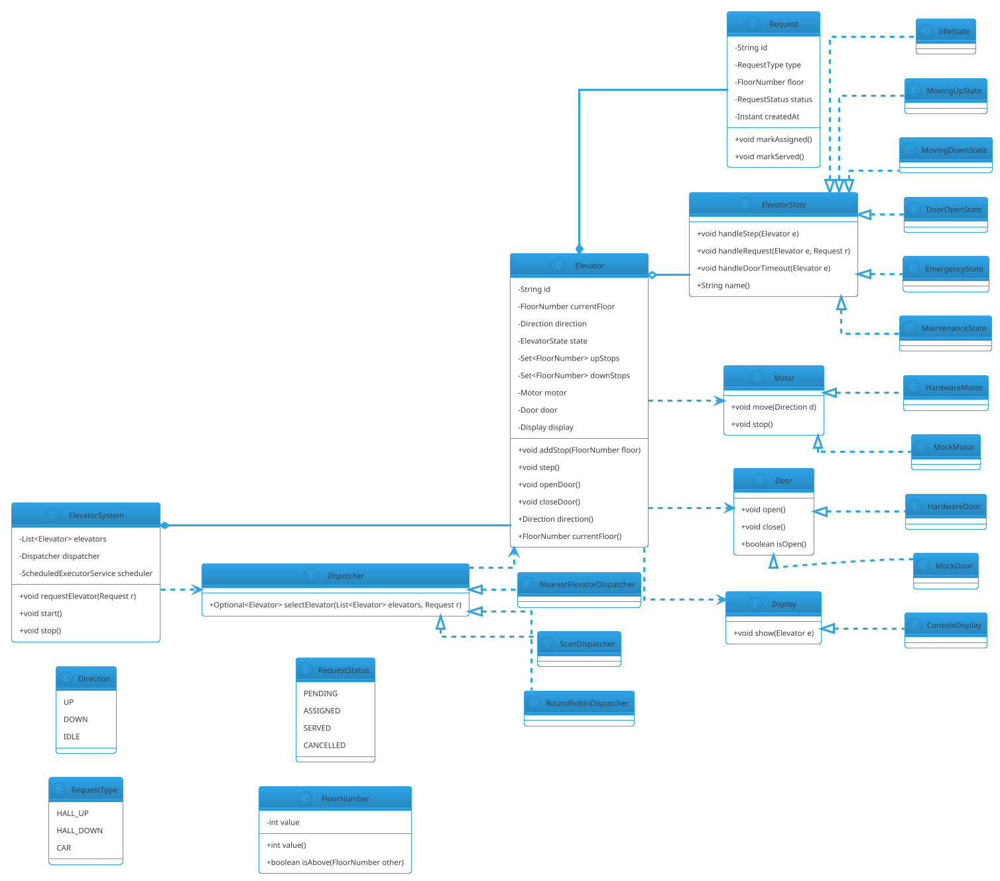

# Elevator System

## Problem Statement

Design an elevator system for a multi-story building. The system must handle requests from passengers (both inside the car and on each floor), dispatch elevators efficiently, minimize wait time and travel distance, and remain **thread-safe** under concurrent requests. It's one of the classic LLD problems because it exposes **scheduling algorithms** (FCFS, SCAN, LOOK, SSTF), **state machines** (idle, moving, door open), and **observer notifications** (floor displays, arrival indicators).

This is also a favorite for testing **extensibility**: adding more elevators, changing dispatch strategy, supporting priority (VIP) requests, or handling emergency mode — all without rewriting the core.

**Example flow:**

```
Multi-elevator building, 10 floors, 3 elevators:

Scenario 1 — Single request:
  1. Passenger on floor 5 presses "Up"
     -> System assigns Elevator 1 (nearest idle going in that direction)
  2. Elevator 1 moves from floor 2 to floor 5
  3. Door opens; passenger boards
  4. Passenger presses "9"
     -> Elevator 1 continues up to 9
  5. Door opens at floor 9; passenger exits

Scenario 2 — Concurrent requests:
  1. User A on floor 3 presses "Up"
  2. User B on floor 7 presses "Down"
  3. User C inside Elevator 1 presses "2"
  4. Dispatcher assigns:
     - Elevator 1 -> handles user C (already inside)
     - Elevator 2 -> handles user A (moving up)
     - Elevator 3 -> handles user B (moving down)

Scenario 3 — Directional efficiency (SCAN):
  Elevator moving up from 1 to 10:
     - Stops at every up-request along the way
     - Ignores down-requests until it reaches 10, then reverses
     - Standard "elevator algorithm" (SCAN/LOOK)

Concurrency:
  - Multiple floor buttons pressed simultaneously
  - Multiple car buttons pressed simultaneously
  - Door open/close timer fires while new requests arrive

Extensibility:
  - Add more elevators
  - VIP priority
  - Fire alarm / emergency mode
  - Scheduled maintenance mode
  - Energy-saving idle parking
```

**Why it's interesting:**

- **Scheduling is non-trivial** — the "elevator algorithm" (SCAN/LOOK) is classic
- **State machine per elevator** — Idle, MovingUp, MovingDown, DoorOpen
- **Dispatcher** — assigns requests to elevators
- **Observer** — floor displays, hall lanterns
- **Concurrency** — many buttons pressed at once
- **Extensibility** — new dispatch strategies without touching elevators
- **Common follow-ups**: "Add VIP", "Prioritize", "Handle fire alarm", "Optimize for energy"

---

## 1. Requirements

### Functional Requirements

- **N elevators** in a building of M floors (configurable)
- **Floor buttons**: up/down call buttons on each floor (except top/bottom)
- **Car buttons**: floor selector inside each elevator
- **Door open/close**: manual open, close, and auto-timeout
- **Emergency stop**: halt the car
- **Alarm**: ring bell for help
- **Displays**: current floor and direction in each car; hall lanterns on each floor
- **Request queue**: each elevator maintains its own set of pending stops
- **Dispatch strategy**: assign floor requests to the best elevator
- **Idle parking**: when idle, return to a configured floor (lobby) or stay

### Non-Functional Requirements

- **Thread-safe**: concurrent button presses; dispatcher handles multiple requests
- **Extensible**: new dispatch strategies without changing elevator internals
- **Observable**: displays update on every state change
- **Fault-tolerant**: elevator failure removed from pool; alarm doesn't break dispatch
- **Efficient**: minimize average wait time and travel distance
- **Fair**: no starvation (a request shouldn't wait indefinitely)
- **Latency**: button press to display update < 200 ms
- **Auditable**: log every request and state transition

### Out of Scope

- Physical motor / door hardware
- Building-wide fire systems (mentioned in extensions)
- CCTV / security integration
- Traffic prediction (rush hour)
- Multi-building / distributed elevators

---

## 2. Use Cases

### UC1 — Hall Call (Floor Button)

```
Actor: Passenger on floor F
Precondition: Elevator system is running
Steps:
  1. Passenger presses Up or Down button on floor F
  2. Dispatcher selects the best elevator
  3. Selected elevator is assigned to stop at floor F (in that direction)
  4. Hall lantern lights up to indicate assignment
  5. Elevator arrives; doors open; passenger boards
Postcondition: Request handled; elevator schedule updated
```

### UC2 — Car Call (Floor Selector)

```
Actor: Passenger inside elevator
Steps:
  1. Passenger presses button for floor X
  2. Elevator adds X to its destination set
  3. Elevator continues to X (respecting current direction)
  4. Doors open; passenger exits
Postcondition: Stop added; schedule updated
```

### UC3 — Directional Stop (SCAN/LOOK)

```
Actor: System
Precondition: Elevator moving up; multiple up-requests pending
Steps:
  1. Elevator visits floors in ascending order
  2. Stops at each requested floor going up
  3. Ignores down-requests until it reaches the top of its queue
  4. Reverses direction; serves down-requests
Postcondition: Efficient sweep; no ping-ponging
```

### UC4 — Door Operations

```
Actor: System or Passenger
Steps:
  1. Elevator arrives at a requested floor
  2. Door opens (motor + sensor)
  3. Wait 3-5 sec (configurable); "Door Open" button extends
  4. Door closes
  5. Elevator continues
Postcondition: Door state machine transitions cleanly
Alternative: Obstacle detected -> door reopens
```

### UC5 — Emergency Stop

```
Actor: Passenger
Steps:
  1. Passenger presses STOP
  2. Elevator halts immediately
  3. System enters emergency mode for that elevator
  4. Operators alerted
Postcondition: Elevator out of service until reset
```

### UC6 — Idle Parking

```
Actor: System
Precondition: Elevator is idle
Steps:
  1. After idle timeout, elevator returns to parking floor (e.g., lobby)
  2. Saves energy; positioned for common traffic
Postcondition: Elevator parked
```

### UC7 — Dispatcher Reassignment

```
Actor: System
Precondition: Elevator goes out of service while requests are pending
Steps:
  1. Elevator X fails
  2. Dispatcher removes X from pool
  3. Pending requests for X are reassigned to other elevators
  4. Displays update; passengers notified
Postcondition: No request is lost
```

### UC8 — VIP Priority (Extensibility)

```
Actor: VIP passenger
Steps:
  1. VIP badges into a special reader (out of scope)
  2. Their request is marked VIP
  3. Dispatcher prioritizes VIP requests
Postcondition: VIP served sooner; no starvation of normal requests
```

---

## 3. Core Entities

### Entities (classes with identity)

| Entity | Responsibility |
|---|---|
| `ElevatorSystem` | Top-level orchestrator; holds dispatcher + elevators |
| `Elevator` | A single car; holds state + queue + hardware |
| `Floor` | A building floor; has call buttons + displays |
| `Request` | A single call (hall or car) |
| `CarButton` / `HallButton` | Physical buttons |

### Value Objects (immutable)

| Value | Purpose |
|---|---|
| `Direction` (enum) | UP, DOWN, IDLE |
| `ElevatorId` | Typed wrapper |
| `FloorNumber` | Typed wrapper (int with validation) |
| `RequestType` (enum) | HALL_UP, HALL_DOWN, CAR |
| `RequestStatus` (enum) | PENDING, ASSIGNED, SERVED, CANCELLED |

### State Classes (State pattern)

| State | Behavior |
|---|---|
| `IdleState` | No pending requests; respond to new requests |
| `MovingUpState` | Move up; serve up-requests; reverse at top of queue |
| `MovingDownState` | Move down; serve down-requests; reverse at bottom |
| `DoorOpenState` | Door open; accept new car calls; wait for timeout or close |
| `EmergencyState` | Halted; reject new requests; requires manual reset |
| `MaintenanceState` | Out of service; reject all input |

### Services (interfaces)

| Service | Responsibility |
|---|---|
| `Dispatcher` | Assign requests to elevators |
| `Motor` | Move elevator up/down |
| `Door` | Open/close door |
| `Display` | Show floor + direction |
| `Scheduler` | Timing (door timeout, idle parking) |

### Interfaces (contracts)

| Interface | Implementations |
|---|---|
| `ElevatorState` | IdleState, MovingUpState, MovingDownState, DoorOpenState, EmergencyState, MaintenanceState |
| `Dispatcher` | NearestElevatorDispatcher, ScanDispatcher, RoundRobinDispatcher |
| `Motor` | HardwareMotor, MockMotor |
| `Door` | HardwareDoor, MockDoor |
| `Display` | ConsoleDisplay, NullDisplay |

---

## 4. Class Diagram



**Key design decisions:**

- `Elevator` holds **two sets** of pending stops: `upStops`, `downStops` — this makes SCAN/LOOK trivial
- `ElevatorState` delegates step and request handling
- `Dispatcher` is a strategy — swap algorithms at runtime
- **`step()`** is the heartbeat: called periodically (e.g., 500 ms); the state decides whether to move, stop, or open door
- `Motor` and `Door` are hardware abstractions — mockable

---

## 5. Design Patterns Used

### 5.1 State Pattern

**Each elevator has a state** that determines behavior. States: Idle, MovingUp, MovingDown, DoorOpen, Emergency, Maintenance.

**Justification:** Eliminates `if/else` on a state field. Transitions explicit. Adding a state (e.g., "FireMode") = new class.

### 5.2 Strategy Pattern

**Dispatcher is a strategy.** Implementations:
- `NearestElevatorDispatcher` — picks the closest idle elevator
- `ScanDispatcher` — considers direction + distance (SCAN/LOOK)
- `RoundRobinDispatcher` — for testing

**Justification:** Swap dispatch algorithm at runtime. Different buildings have different needs (office vs residential).

### 5.3 Observer Pattern

**Displays observe elevator state changes.** When an elevator moves or opens its door, all displays (car, hall lanterns) are notified.

**Justification:** Decoupled updates; new displays add without touching `Elevator`.

### 5.4 Template Method (Optional, for Motor)

**Motor operations share structure:** start, hold, stop, verify.

**Justification:** If hardware-specific quirks are common, factor them into a base class.

### 5.5 Singleton (Selective)

**`ElevatorSystem` is often a singleton per building.** Use a registry keyed by building ID, or an enum.

### Patterns NOT Used

- **No Factory** — elevators are created once at startup
- **No Builder** — entities are simple
- **No Command** — requests are simple data

---

## 6. Java Implementation

### 6.1 Enums and Value Objects

```java
package lld.elevator.model;

public enum Direction {
    UP, DOWN, IDLE
}

public enum RequestType {
    HALL_UP, HALL_DOWN, CAR
}

public enum RequestStatus {
    PENDING, ASSIGNED, SERVED, CANCELLED
}
```

```java
package lld.elevator.model;

public record FloorNumber(int value) {
    public FloorNumber {
        if (value < 0) throw new IllegalArgumentException("Floor must be non-negative");
    }
    public boolean isAbove(FloorNumber other) { return value > other.value; }
    public boolean isBelow(FloorNumber other) { return value < other.value; }
    public FloorNumber increment() { return new FloorNumber(value + 1); }
    public FloorNumber decrement() { return new FloorNumber(value - 1); }
}
```

```java
package lld.elevator.model;

import java.time.Instant;
import java.util.UUID;

public final class Request {
    private final String id;
    private final RequestType type;
    private final FloorNumber floor;
    private final Instant createdAt;
    private RequestStatus status;

    public Request(RequestType type, FloorNumber floor) {
        this.id = UUID.randomUUID().toString();
        this.type = type;
        this.floor = floor;
        this.createdAt = Instant.now();
        this.status = RequestStatus.PENDING;
    }

    public String id() { return id; }
    public RequestType type() { return type; }
    public FloorNumber floor() { return floor; }
    public Instant createdAt() { return createdAt; }
    public synchronized RequestStatus status() { return status; }

    public synchronized void markAssigned() { this.status = RequestStatus.ASSIGNED; }
    public synchronized void markServed() { this.status = RequestStatus.SERVED; }

    /** Direction the passenger wants to go. */
    public Direction desiredDirection() {
        return switch (type) {
            case HALL_UP, CAR -> Direction.UP;
            case HALL_DOWN -> Direction.DOWN;
        };
    }
}
```

**Note:** `CAR` requests indicate a passenger inside the car wants to go to `floor`. The desired direction depends on the floor relative to current — the elevator state determines that.

### 6.2 Motor, Door, Display

```java
package lld.elevator.service;

import lld.elevator.model.Direction;

public interface Motor {
    void move(Direction d);
    void stop();
}

public final class MockMotor implements Motor {
    @Override public void move(Direction d) { /* no-op */ }
    @Override public void stop() { /* no-op */ }
}
```

```java
package lld.elevator.service;

public interface Door {
    void open();
    void close();
    boolean isOpen();
}

public final class MockDoor implements Door {
    private boolean open = false;
    @Override public void open() { open = true; }
    @Override public void close() { open = false; }
    @Override public boolean isOpen() { return open; }
}
```

```java
package lld.elevator.service;

import lld.elevator.model.Elevator;

public interface Display {
    void show(Elevator elevator);
}

public final class ConsoleDisplay implements Display {
    @Override
    public void show(Elevator e) {
        System.out.println("[ELEV " + e.id() + "] Floor=" + e.currentFloor().value()
                + " Direction=" + e.direction()
                + " State=" + e.stateName()
                + " UpStops=" + e.upStops()
                + " DownStops=" + e.downStops());
    }
}
```

### 6.3 State Interface and Implementations

```java
package lld.elevator.state;

import lld.elevator.model.Elevator;
import lld.elevator.model.Request;

public interface ElevatorState {
    void handleStep(Elevator elevator);
    void handleRequest(Elevator elevator, Request request);
    void handleDoorTimeout(Elevator elevator);
    String name();
}
```

```java
package lld.elevator.state;

import lld.elevator.model.*;

public final class IdleState implements ElevatorState {
    public static final IdleState INSTANCE = new IdleState();
    private IdleState() {}

    @Override
    public void handleStep(Elevator e) {
        // Nothing to do; wait for requests
    }

    @Override
    public void handleRequest(Elevator e, Request r) {
        if (r.floor().value() == e.currentFloor().value()) {
            // Already at requested floor; open door
            e.setState(DoorOpenState.INSTANCE);
            e.openDoor();
            return;
        }
        if (r.floor().isAbove(e.currentFloor())) {
            e.addUpStop(r.floor());
            e.setState(MovingUpState.INSTANCE);
        } else {
            e.addDownStop(r.floor());
            e.setState(MovingDownState.INSTANCE);
        }
    }

    @Override public void handleDoorTimeout(Elevator e) { /* no-op */ }
    @Override public String name() { return "IDLE"; }
}
```

```java
package lld.elevator.state;

import lld.elevator.model.*;

public final class MovingUpState implements ElevatorState {
    public static final MovingUpState INSTANCE = new MovingUpState();
    private MovingUpState() {}

    @Override
    public void handleStep(Elevator e) {
        if (e.upStops().isEmpty() && e.downStops().isEmpty()) {
            e.setState(IdleState.INSTANCE);
            e.setDirection(Direction.IDLE);
            e.stopMotor();
            return;
        }

        if (e.upStops().isEmpty()) {
            // No more up stops; switch to down
            e.setState(MovingDownState.INSTANCE);
            e.setDirection(Direction.DOWN);
            return;
        }

        FloorNumber nextStop = e.upStops().first();   // TreeSet sorted ascending
        if (e.currentFloor().value() == nextStop.value()) {
            e.removeUpStop(nextStop);
            e.setState(DoorOpenState.INSTANCE);
            e.openDoor();
            return;
        }

        e.setDirection(Direction.UP);
        e.moveOneStep();
    }

    @Override
    public void handleRequest(Elevator e, Request r) {
        // Add to appropriate set
        if (r.floor().isAbove(e.currentFloor())) {
            e.addUpStop(r.floor());
        } else {
            e.addDownStop(r.floor());
        }
    }

    @Override public void handleDoorTimeout(Elevator e) { /* no-op */ }
    @Override public String name() { return "MOVING_UP"; }
}
```

```java
package lld.elevator.state;

import lld.elevator.model.*;

public final class MovingDownState implements ElevatorState {
    public static final MovingDownState INSTANCE = new MovingDownState();
    private MovingDownState() {}

    @Override
    public void handleStep(Elevator e) {
        if (e.upStops().isEmpty() && e.downStops().isEmpty()) {
            e.setState(IdleState.INSTANCE);
            e.setDirection(Direction.IDLE);
            e.stopMotor();
            return;
        }

        if (e.downStops().isEmpty()) {
            e.setState(MovingUpState.INSTANCE);
            e.setDirection(Direction.UP);
            return;
        }

        FloorNumber nextStop = e.downStops().last();   // TreeSet sorted descending
        if (e.currentFloor().value() == nextStop.value()) {
            e.removeDownStop(nextStop);
            e.setState(DoorOpenState.INSTANCE);
            e.openDoor();
            return;
        }

        e.setDirection(Direction.DOWN);
        e.moveOneStep();
    }

    @Override
    public void handleRequest(Elevator e, Request r) {
        if (r.floor().isBelow(e.currentFloor())) {
            e.addDownStop(r.floor());
        } else {
            e.addUpStop(r.floor());
        }
    }

    @Override public void handleDoorTimeout(Elevator e) { /* no-op */ }
    @Override public String name() { return "MOVING_DOWN"; }
}
```

```java
package lld.elevator.state;

import lld.elevator.model.*;

public final class DoorOpenState implements ElevatorState {
    public static final DoorOpenState INSTANCE = new DoorOpenState();
    private DoorOpenState() {}

    @Override
    public void handleStep(Elevator e) {
        // Door is open; no movement
    }

    @Override
    public void handleRequest(Elevator e, Request r) {
        // Add to appropriate set for later
        if (r.floor().value() == e.currentFloor().value()) {
            // Already here; ignore (or reset timer)
            return;
        }
        if (r.floor().isAbove(e.currentFloor())) {
            e.addUpStop(r.floor());
        } else {
            e.addDownStop(r.floor());
        }
    }

    @Override
    public void handleDoorTimeout(Elevator e) {
        e.closeDoor();
        if (e.upStops().isEmpty() && e.downStops().isEmpty()) {
            e.setState(IdleState.INSTANCE);
            e.setDirection(Direction.IDLE);
        } else if (!e.upStops().isEmpty()) {
            e.setState(MovingUpState.INSTANCE);
        } else {
            e.setState(MovingDownState.INSTANCE);
        }
    }

    @Override public String name() { return "DOOR_OPEN"; }
}
```

```java
package lld.elevator.state;

import lld.elevator.model.Elevator;
import lld.elevator.model.Request;

public final class EmergencyState implements ElevatorState {
    public static final EmergencyState INSTANCE = new EmergencyState();
    private EmergencyState() {}

    @Override public void handleStep(Elevator e) { /* halted */ }
    @Override public void handleRequest(Elevator e, Request r) { /* reject */ }
    @Override public void handleDoorTimeout(Elevator e) { /* no-op */ }
    @Override public String name() { return "EMERGENCY"; }
}
```

```java
package lld.elevator.state;

import lld.elevator.model.Elevator;
import lld.elevator.model.Request;

public final class MaintenanceState implements ElevatorState {
    public static final MaintenanceState INSTANCE = new MaintenanceState();
    private MaintenanceState() {}

    @Override public void handleStep(Elevator e) { /* no-op */ }
    @Override public void handleRequest(Elevator e, Request r) { /* reject */ }
    @Override public void handleDoorTimeout(Elevator e) { /* no-op */ }
    @Override public String name() { return "MAINTENANCE"; }
}
```

### 6.4 Elevator

```java
package lld.elevator.model;

import lld.elevator.service.Display;
import lld.elevator.service.Door;
import lld.elevator.service.Motor;
import lld.elevator.state.ElevatorState;
import lld.elevator.state.IdleState;

import java.util.Collections;
import java.util.Set;
import java.util.TreeSet;
import java.util.concurrent.locks.ReentrantLock;

public final class Elevator {
    private final String id;
    private final Motor motor;
    private final Door door;
    private final Display display;

    private final ReentrantLock lock = new ReentrantLock();

    // Guarded by lock
    private FloorNumber currentFloor;
    private Direction direction = Direction.IDLE;
    private ElevatorState state = IdleState.INSTANCE;
    private final TreeSet<FloorNumber> upStops = new TreeSet<>((a, b) -> Integer.compare(a.value(), b.value()));
    private final TreeSet<FloorNumber> downStops = new TreeSet<>((a, b) -> Integer.compare(b.value(), a.value())); // reversed

    public Elevator(String id, FloorNumber startFloor, Motor motor, Door door, Display display) {
        this.id = id;
        this.currentFloor = startFloor;
        this.motor = motor;
        this.door = door;
        this.display = display;
    }

    public String id() { return id; }
    public FloorNumber currentFloor() { return currentFloor; }
    public Direction direction() { return direction; }
    public String stateName() { return state.name(); }

    public Set<FloorNumber> upStops() { return Collections.unmodifiableSet(upStops); }
    public Set<FloorNumber> downStops() { return Collections.unmodifiableSet(downStops); }

    // ----- Public API -----

    public void step() {
        lock.lock();
        try {
            state.handleStep(this);
            display.show(this);
        } finally { lock.unlock(); }
    }

    public void addRequest(Request r) {
        lock.lock();
        try { state.handleRequest(this, r); }
        finally { lock.unlock(); }
    }

    public void onDoorTimeout() {
        lock.lock();
        try { state.handleDoorTimeout(this); }
        finally { lock.unlock(); }
    }

    // ----- Internal operations (called by state) -----

    void setState(ElevatorState s) { this.state = s; }
    void setDirection(Direction d) { this.direction = d; }

    void addUpStop(FloorNumber f) { upStops.add(f); }
    void addDownStop(FloorNumber f) { downStops.add(f); }
    void removeUpStop(FloorNumber f) { upStops.remove(f); }
    void removeDownStop(FloorNumber f) { downStops.remove(f); }

    void moveOneStep() {
        if (direction == Direction.UP) {
            currentFloor = currentFloor.increment();
        } else if (direction == Direction.DOWN) {
            currentFloor = currentFloor.decrement();
        }
        motor.move(direction);
    }

    void openDoor() { door.open(); }
    void closeDoor() { door.close(); }
    void stopMotor() { motor.stop(); }

    public boolean isIdle() {
        lock.lock();
        try { return state == IdleState.INSTANCE; }
        finally { lock.unlock(); }
    }

    /** Distance to a floor (for dispatcher scoring). */
    public int distanceTo(FloorNumber floor) {
        return Math.abs(floor.value() - currentFloor.value());
    }
}
```

**Key concurrency decisions:**
- **One lock per elevator** — protects state, stops, direction
- **`step()` is the heartbeat** — called by `ElevatorSystem` on a scheduler
- **Stops stored as `TreeSet`** — sorted ascending for up, descending for down (natural SCAN order)

### 6.5 Dispatcher

```java
package lld.elevator.service;

import lld.elevator.model.Elevator;
import lld.elevator.model.Request;

import java.util.List;
import java.util.Optional;

public interface Dispatcher {
    Optional<Elevator> selectElevator(List<Elevator> elevators, Request request);
}
```

```java
package lld.elevator.service;

import lld.elevator.model.*;

import java.util.Comparator;
import java.util.List;
import java.util.Optional;

/**
 * Picks the elevator that minimizes a cost function:
 *   - Distance to request floor
 *   - Bonus if already moving in the same direction
 *   - Penalty if moving in the opposite direction
 */
public final class ScanDispatcher implements Dispatcher {

    @Override
    public Optional<Elevator> selectElevator(List<Elevator> elevators, Request r) {
        return elevators.stream()
                .filter(e -> !isUnavailable(e))
                .min(Comparator.comparingInt(e -> score(e, r)));
    }

    private boolean isUnavailable(Elevator e) {
        String s = e.stateName();
        return "EMERGENCY".equals(s) || "MAINTENANCE".equals(s);
    }

    private int score(Elevator e, Request r) {
        int distance = e.distanceTo(r.floor());
        Direction d = e.direction();
        Direction desired = r.desiredDirection();

        int score = distance * 10;

        if (d == Direction.IDLE) {
            // Idle elevators are great candidates
            score -= 5;
        } else if (d == desired) {
            // Same direction; check if request is ahead
            boolean ahead = (d == Direction.UP && r.floor().isAbove(e.currentFloor()))
                         || (d == Direction.DOWN && r.floor().isBelow(e.currentFloor()));
            if (ahead) score -= 20;   // strong preference
            else score += 30;         // it will pass the floor later
        } else {
            // Moving opposite direction
            score += 50;
        }

        return score;
    }
}
```

```java
package lld.elevator.service;

import lld.elevator.model.Elevator;
import lld.elevator.model.Request;

import java.util.Comparator;
import java.util.List;
import java.util.Optional;

/** Simplest dispatcher: always pick the closest idle elevator. */
public final class NearestElevatorDispatcher implements Dispatcher {
    @Override
    public Optional<Elevator> selectElevator(List<Elevator> elevators, Request r) {
        return elevators.stream()
                .filter(Elevator::isIdle)
                .min(Comparator.comparingInt(e -> e.distanceTo(r.floor())));
    }
}
```

### 6.6 ElevatorSystem

```java
package lld.elevator.core;

import lld.elevator.model.Elevator;
import lld.elevator.model.Request;
import lld.elevator.service.Dispatcher;

import java.util.List;
import java.util.Optional;
import java.util.concurrent.Executors;
import java.util.concurrent.ScheduledExecutorService;
import java.util.concurrent.TimeUnit;
import java.util.concurrent.locks.ReentrantLock;

public final class ElevatorSystem {
    private final String buildingId;
    private final List<Elevator> elevators;
    private final Dispatcher dispatcher;
    private final ScheduledExecutorService scheduler =
            Executors.newSingleThreadScheduledExecutor(r -> {
                Thread t = new Thread(r, "elevator-tick");
                t.setDaemon(true);
                return t;
            });

    private final ReentrantLock lock = new ReentrantLock();
    private volatile boolean running = false;

    public ElevatorSystem(String buildingId, List<Elevator> elevators, Dispatcher dispatcher) {
        this.buildingId = buildingId;
        this.elevators = List.copyOf(elevators);
        this.dispatcher = dispatcher;
    }

    public void start() {
        if (running) return;
        running = true;
        // Tick every 500 ms; each tick advances each elevator one "step"
        scheduler.scheduleAtFixedRate(this::tick, 0, 500, TimeUnit.MILLISECONDS);
    }

    public void stop() {
        running = false;
        scheduler.shutdown();
    }

    public void requestElevator(Request r) {
        lock.lock();
        try {
            Optional<Elevator> selected = dispatcher.selectElevator(elevators, r);
            if (selected.isEmpty()) {
                System.out.println("[SYSTEM] No available elevator for request " + r.id());
                return;
            }
            Elevator e = selected.get();
            r.markAssigned();
            e.addRequest(r);
            System.out.println("[SYSTEM] Assigned request floor=" + r.floor().value()
                    + " to elevator " + e.id());
        } finally { lock.unlock(); }
    }

    public List<Elevator> elevators() { return elevators; }

    private void tick() {
        if (!running) return;
        for (Elevator e : elevators) {
            try {
                e.step();
            } catch (RuntimeException ex) {
                System.err.println("[SYSTEM] Elevator " + e.id() + " step failed: " + ex.getMessage());
            }
        }
    }
}
```

**Concurrency notes:**
- **One scheduled thread** drives all elevators — deterministic, no thread per elevator
- **Tick rate** = 500 ms; adjustable
- **Dispatcher lock** protects request assignment
- **Per-elevator lock** protects individual state

### 6.7 Demo

```java
package lld.elevator;

import lld.elevator.core.ElevatorSystem;
import lld.elevator.model.*;
import lld.elevator.service.*;
import lld.elevator.state.ElevatorState;

import java.util.List;

public class Demo {
    public static void main(String[] args) throws InterruptedException {
        Display display = new ConsoleDisplay();

        Elevator e1 = new Elevator("E1", new FloorNumber(0), new MockMotor(), new MockDoor(), display);
        Elevator e2 = new Elevator("E2", new FloorNumber(0), new MockMotor(), new MockDoor(), display);
        Elevator e3 = new Elevator("E3", new FloorNumber(0), new MockMotor(), new MockDoor(), display);

        ElevatorSystem system = new ElevatorSystem(
                "BUILDING-1",
                List.of(e1, e2, e3),
                new ScanDispatcher()
        );

        system.start();

        System.out.println("--- User on floor 5 wants UP ---");
        system.requestElevator(new Request(RequestType.HALL_UP, new FloorNumber(5)));

        Thread.sleep(3000);

        System.out.println("--- User on floor 8 wants DOWN ---");
        system.requestElevator(new Request(RequestType.HALL_DOWN, new FloorNumber(8)));

        Thread.sleep(3000);

        System.out.println("--- Passenger inside E1 wants floor 9 ---");
        e1.addRequest(new Request(RequestType.CAR, new FloorNumber(9)));

        Thread.sleep(5000);

        system.stop();
        System.out.println("--- Done ---");
    }
}
```

**Expected behavior:**
- E1 takes floor 5 (nearest idle)
- E2 takes floor 8
- E1 gets car request for floor 9 (continues up)
- Both stop, open doors, continue/return to idle

---

## 7. Concurrency Considerations

### Shared Resources

| Resource | Shared? | Synchronization |
|---|---|---|
| `Elevator.state`, `direction`, `currentFloor`, stops | Yes | `ReentrantLock` on Elevator |
| `ElevatorSystem.elevators` | Read-only after start | `List.copyOf` |
| Request assignment | Yes | `ReentrantLock` on System |
| Door hardware | Yes | Guarded by Elevator lock |
| Motor hardware | Yes | Guarded by Elevator lock |

### Why One Lock per Elevator

- **No cross-elevator contention** — each elevator is independent
- **Tick thread** calls `e.step()` — under lock
- **Request handler** calls `e.addRequest()` — under lock

**Trade-off:** A long `step()` blocks new requests for that elevator briefly. Fine because `step()` is O(1).

### Tick-Driven State Machine

The system uses a **heartbeat** (tick) rather than event-driven:
- Every 500 ms, each elevator advances one step
- State decides: move, stop, open door, idle
- **Deterministic** — same inputs → same outputs
- **No busy-waiting** — the elevator only does work when there's something to do

**Alternative:** Event-driven (each event triggers a step). More complex, marginal benefit.

### Race: Request arrives while elevator is stepping

- `step()` holds the elevator lock
- `addRequest()` waits for the lock
- After step finishes, request is processed next tick

**No lost requests.**

### Race: Dispatcher picks an elevator, but it just went idle

- Dispatcher scoring uses a **snapshot** of state
- By the time we call `e.addRequest()`, the elevator may have moved
- `e.addRequest()` handles this — the state adds the stop to the correct set
- If the elevator is at the requested floor, door opens immediately

**Slight sub-optimality** (dispatcher may have picked a different elevator if it knew), but correctness holds.

### Race: Two requests in flight

- Dispatcher lock serializes assignments
- Each request assigned to one elevator
- No double-assignment

### Emergency Stop

- `EmergencyState` rejects all steps
- Other elevators continue
- System continues to serve requests via healthy elevators

### Scheduler Thread Crash

If the tick thread dies:
- Wrapped in `try/catch` per elevator
- `ScheduledExecutorService` reschedules automatically

### Testing Concurrency

```java
@Test
void concurrentRequests() throws InterruptedException {
    ElevatorSystem system = /* ... */;
    int threads = 100;
    CountDownLatch latch = new CountDownLatch(1);
    ExecutorService pool = Executors.newFixedThreadPool(threads);

    for (int i = 0; i < threads; i++) {
        final int floor = i % 10;
        pool.submit(() -> {
            try { latch.await(); } catch (InterruptedException ignored) { return; }
            system.requestElevator(new Request(RequestType.HALL_UP, new FloorNumber(floor)));
        });
    }

    latch.countDown();
    pool.shutdown();
    pool.awaitTermination(5, TimeUnit.SECONDS);

    // Assert: no request lost, all assigned
    long pending = system.elevators().stream()
            .flatMap(e -> e.upStops().stream().map(f -> 1))
            .count();
    // Assert invariants on total stops across elevators
}
```

---

## 8. Extensibility

### Add a New Dispatch Strategy

Implement `Dispatcher`:

```java
public final class VipPriorityDispatcher implements Dispatcher {
    @Override
    public Optional<Elevator> selectElevator(List<Elevator> elevators, Request r) {
        // VIP requests go to nearest elevator regardless of state
        // Normal requests use standard scoring
    }
}
```

**No existing code changes.** ✅

### Add Emergency / Fire Mode

Add `FireModeState implements ElevatorState`:

```java
public final class FireModeState implements ElevatorState {
    @Override
    public void handleStep(Elevator e) {
        // Return to ground floor, open doors, stay
        if (e.currentFloor().value() != 0) {
            e.setDirection(Direction.DOWN);
            e.moveOneStep();
        } else {
            e.openDoor();
        }
    }
    // reject new requests
}
```

Trigger via `system.enterFireMode()` which calls `e.setState(FireModeState.INSTANCE)` on all elevators.

**No existing state changes.** ✅

### Add Scheduled Maintenance

Add a `MaintenanceScheduler` that:
1. Checks calendar
2. Marks elevator as `MaintenanceState` at scheduled time
3. Restores to `IdleState` after

**No existing classes modified.** ✅

### Add Energy-Saving Parking

After idle timeout (e.g., 60 sec), `IdleState` transitions to parking:

```java
@Override
public void handleStep(Elevator e) {
    if (e.idleTicks() > 120 && e.currentFloor().value() != PARKING_FLOOR) {
        e.setDirection(PARKING_FLOOR > e.currentFloor().value() ? Direction.UP : Direction.DOWN);
        e.moveOneStep();
    }
}
```

Add a hook in `IdleState`. Or new `ParkingState`.

### Add Priority Requests

Add `priority` field to `Request`:

```java
public final class Request {
    private final Priority priority;   // NORMAL, VIP, EMERGENCY
}
```

`Dispatcher` scores with priority weight. `Elevator` may insert priority stops at the front of the set.

### Add Real-Time Monitoring

Observers on `Elevator`:

```java
public interface ElevatorObserver {
    void onStateChange(Elevator e, ElevatorState old, ElevatorState now);
}
```

Push metrics to monitoring. **No existing code changes.**

### Add Multi-Building Support

Introduce `BuildingRegistry`:

```java
public final class BuildingRegistry {
    private final Map<String, ElevatorSystem> buildings = new ConcurrentHashMap<>();
    public ElevatorSystem getOrCreate(String buildingId, Supplier<ElevatorSystem> factory) {
        return buildings.computeIfAbsent(buildingId, id -> factory.get());
    }
}
```

**No change** to `ElevatorSystem` itself.

### Add Predictive Dispatch (ML)

Future direction: use historical traffic patterns to pre-position elevators. The dispatcher interface allows injecting an ML model.

---

## 9. SOLID Principles Applied

### Single Responsibility Principle

| Class | Single Responsibility |
|---|---|
| `ElevatorSystem` | Orchestration + ticking |
| `Elevator` | State, stops, hardware |
| `IdleState` | Behavior when idle |
| `MovingUpState` | Behavior when moving up |
| `DoorOpenState` | Behavior when door is open |
| `Dispatcher` | Assign requests |
| `Motor` | Hardware abstraction |
| `Door` | Hardware abstraction |
| `Display` | Render state |

Each class has exactly one reason to change.

### Open/Closed Principle

- **New state** — add class implementing `ElevatorState`
- **New dispatcher** — implement `Dispatcher`
- **New observer** — implement `ElevatorObserver`
- **New hardware** — implement `Motor`, `Door`

No existing behavior modified when extending.

### Liskov Substitution Principle

- All `ElevatorState` implementations honor the contract
- `MockMotor` and `HardwareMotor` are interchangeable
- `MockDoor` and `HardwareDoor` are interchangeable
- No state throws `UnsupportedOperationException`

### Interface Segregation Principle

Small interfaces:
- `ElevatorState` — 3 methods + `name()`
- `Dispatcher` — 1 method
- `Motor` — 2 methods
- `Door` — 3 methods
- `Display` — 1 method

No fat interfaces. Clients don't implement unused methods.

### Dependency Inversion Principle

`Elevator` depends on:
- `Motor` (interface)
- `Door` (interface)
- `Display` (interface)
- `ElevatorState` (interface)

`ElevatorSystem` depends on:
- `Dispatcher` (interface)
- `Elevator` (concrete, but no circular deps)

All injected via constructor.

---

## 10. Common Pitfalls

| Pitfall | Why It's Wrong | Fix |
|---|---|---|
| `if/else` on state strings | Spaghetti; hard to extend | State pattern |
| Single queue per elevator | Doesn't distinguish up/down | Two sets (up, down) |
| Sorting stops on every tick | O(n log n) per tick | Sorted set (`TreeSet`) |
| Dispatcher picks by distance only | Ignores direction; ping-ponging | Score with direction bonus |
| Starving far requests | Far floors wait forever | Fair scoring; occasional direct dispatch |
| No door timeout | Door stays open forever | `handleDoorTimeout` in state |
| Ignoring emergency | Continuing to serve requests during emergency | `EmergencyState` |
| Ignoring hardware failure | Dispatching to broken elevator | Filter by state |
| Lock contention across elevators | Serializing unrelated elevators | Per-elevator lock |
| Blocking tick thread | Whole system stalls | try/catch per elevator |
| Forgetting to notify display | Users don't know where elevator is | Observer |
| No idle parking | Elevators scattered; inefficient | Idle timeout → parking floor |

---

## 11. Follow-up Questions

### Q1: How would you optimize for rush hour?

**Answer:** 
- **Morning rush**: Most traffic is from lobby up. Pre-position elevators at lobby during predicted rush.
- **Evening rush**: Most traffic is down to lobby. Pre-position at top floors.
- **Predictive dispatch**: Use historical patterns (ML) to position idle elevators.

Implement via `IdleState` transitions to a `PrePositionState` based on time-of-day.

### Q2: How would you handle N elevators efficiently?

**Answer:** Same architecture works for N elevators — the dispatcher picks the best one from the pool. Cost is `O(N)` per request for scoring, which is fine for N < 100. For larger N, use indexing by floor.

### Q3: What if two passengers request the same floor?

**Answer:** The set of stops deduplicates automatically (`TreeSet`). Both requests are served by the same stop. Each request is marked served when the door opens.

### Q4: How would you handle priority (VIP, emergency, service)?

**Answer:** Add `priority` to `Request`. Dispatcher scores with priority weight. For emergency (e.g., fire alarm), a global state transition puts all elevators into a special mode.

### Q5: How would you test this?

- **Unit tests** for each state (drive transitions)
- **Integration tests** for full flow (request → move → door → continue)
- **Concurrency tests** — many requests; assert no loss
- **Property test** — invariant: total stops across elevators + served == total requested
- **Timing tests** — average wait time under load

### Q6: How would you scale to a building with 100 floors and 20 elevators?

**Answer:** 
- Same architecture scales (O(N) dispatcher)
- **Zone-based dispatch** — partition floors into zones, each served by a subset of elevators
- **Sky lobby** — express elevators to sky lobbies, local elevators from there
- **Destination dispatch** — passengers enter destination at hall call; system groups by destination

### Q7: How would you handle a fire alarm?

**Answer:** 
- Trigger `system.enterFireMode()` 
- All elevators transition to `FireModeState`
- They move to ground floor, open doors, stay
- Reject new requests
- Displays show "FIRE ALARM"
- Firefighters use a special key to override

### Q8: How would you support accessibility (longer door open)?

**Answer:** Add `requestLongerDoorOpen()` on `Elevator`. `DoorOpenState` extends timeout when this flag is set. Verified by a special card swipe (out of LLD scope) or a dedicated button on the car panel.

### Q9: How would you know which elevator to send if all are busy?

**Answer:** Dispatcher scoring handles this — pick the one with the least additional cost (considering current direction, queued stops, and travel distance). This is essentially a **traveling salesman-ish** heuristic. For fairness, occasionally rotate.

### Q10: How would you persist state across a power outage?

**Answer:** 
- Each elevator writes state to non-volatile memory (or a small DB) on each step
- On boot, `ElevatorSystem` reads state and resumes
- Requests in flight are re-dispatched
- Optional: `ScheduledExecutorService` runs a "checkpoint" every N ticks

---

## 12. Similar Problems

- **Vending Machine** — state machine + inventory
- **ATM** — state machine + hardware + two-phase ops
- **Parking Lot** — inventory + allocation strategy + concurrency
- **Coffee Machine** — state machine + recipe + hardware
- **Printer Spooler** — queue + dispatch + fair scheduling
- **Task Scheduler** — queue + priority + worker dispatch
- **Cache** — state machine + eviction + concurrency
- **Traffic Light** — state machine + timing + observers

**Shared skeleton:**
1. **State machine** — Idle, Moving, DoorOpen
2. **Queue / Set of pending requests** — per elevator, per direction
3. **Dispatcher** — assigns requests
4. **Hardware abstractions** — Motor, Door, Display
5. **Tick / heartbeat** — advances state
6. **Observer** — displays on state change
7. **Concurrency** — per-object locks
8. **Extensibility** — new state or dispatcher

Master Elevator → apply the same skeleton to the others.

---

## 13. Key Takeaways

- **State pattern with 6 states** — Idle, MovingUp, MovingDown, DoorOpen, Emergency, Maintenance
- **Strategy pattern for dispatcher** — swap algorithms at runtime
- **Two stop sets (up, down)** — makes SCAN/LOOK trivial and efficient
- **`TreeSet` for stops** — sorted, deduplicated, O(log n) insert
- **Tick-driven heartbeat** — every 500 ms, each elevator steps
- **One lock per elevator** — no cross-elevator contention
- **One lock for dispatcher** — serializes request assignment
- **`MockMotor` / `MockDoor`** — makes the system testable without hardware
- **`ScanDispatcher`** — scores by distance, direction, and current state
- **Idle parking** — cheap extension that improves energy efficiency
- **Fire / emergency mode** — additive; no changes to existing states
- **Observers for displays** — decoupled updates
- **Constructor injection** — no `new` for services inside `Elevator`
- **Deterministic tick** — reproducible behavior; no busy-waiting
- **Priority requests** — easy to add via a `priority` field + scoring weight

### The Generalizable Recipe

For any **state-machine + scheduler** problem:

1. **State machine per entity** — one class per state
2. **Queue of pending work** — per entity, per priority/direction
3. **Dispatcher** — assigns work to entities
4. **Heartbeat / tick** — advances state
5. **Hardware abstractions** — Motor, Door, Display
6. **Observer** — notify on state changes
7. **Per-entity lock** — no cross-entity contention
8. **Extensibility hooks** — strategy for dispatch, state for behavior
9. **Scoring function** — for dispatcher; tunable weights
10. **Idle behavior** — parking, timeout, cleanup

This skeleton solves: Elevator, Printer Spooler, Task Scheduler, Cache Eviction, Traffic Signal, Warehouse Robot, Vending Machine (with resupply) — with variations in state, dispatch, and hardware.