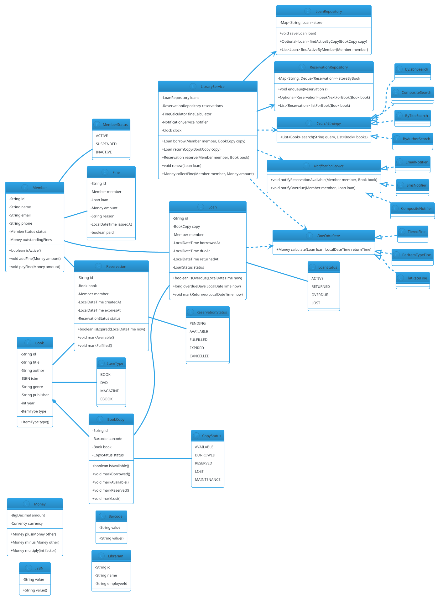

# Library Management System

## Problem Statement

Design a library management system that tracks books, members, borrowing, returns, fines, and reservations. The system must support multiple copies of the same book, handle concurrent borrow requests for a limited number of copies, calculate overdue fines, allow reservations when no copy is available, and notify members when their reserved book becomes available. It should be **extensible** (new item types like DVDs, e-books), **thread-safe** (multiple librarians and self-service kiosks), and **observable** (members notified on reservations).

This is a classic LLD problem that emphasizes **inventory with concurrency**, **state machines** (loan lifecycle), **strategy** (fine calculation, search), and **observer** (reservation notifications).

**Example flow:**

```
Scenario 1 — Borrow a book:
  1. Member arrives with book "Clean Code" (copy #C-101)
  2. Librarian scans member card and book barcode
  3. System checks:
     - Member exists and is active
     - No outstanding fines exceeding limit
     - Copy #C-101 is available
  4. System creates Loan:
     - Due date = today + 14 days
     - Copy status: AVAILABLE -> BORROWED
     - Member's active loans += 1
  5. Member walks out with book

Scenario 2 — Return a book (on time):
  1. Member returns copy #C-101
  2. System marks Loan as RETURNED
  3. Copy status: BORROWED -> AVAILABLE
  4. No fine

Scenario 3 — Return a book (overdue):
  1. Member returns copy #C-101, 5 days late
  2. System calculates fine: 5 days x $0.50/day = $2.50
  3. Fine added to member's account
  4. Copy status: BORROWED -> AVAILABLE

Scenario 4 — Reserve a book (all copies borrowed):
  1. Member requests "The Pragmatic Programmer"
  2. All 3 copies are BORROWED
  3. System creates Reservation (FIFO queue)
  4. When a copy is returned:
     - System notifies the first member in queue
     - Reservation status: PENDING -> AVAILABLE
     - Member has 48 hours to borrow; else next in queue

Concurrency:
  - Two members try to borrow the last copy simultaneously
  - A return happens while a reservation is being made
  - A member's fine is being calculated while they're returning a book

Extensibility:
  - Add DVDs, e-books, magazines
  - Add different fine schedules (per item type)
  - Add inter-library loans
  - Add self-service kiosk
```

**Why it's interesting:**

- **Inventory with limited copies** — concurrency is real
- **Loan lifecycle** — state machine (ACTIVE, RETURNED, OVERDUE)
- **Fine calculation** — strategy pattern (per day, per item type)
- **Reservations** — FIFO queue + observer (notify next in line)
- **Search** — by title, author, ISBN (strategy)
- **Observability** — notifications, due-date reminders
- **Common follow-ups**: "Add e-books", "Renew loans", "Handle lost books", "Inter-library loans"

---

## 1. Requirements

### Functional Requirements

- **Book catalog**: title, author, ISBN, genre, publisher, year
- **Copies**: multiple physical copies per book (each with unique barcode)
- **Members**: register, activate, deactivate; track active loans and fines
- **Librarians**: staff members with elevated permissions
- **Borrow**: member takes a copy for a fixed loan period
- **Return**: member returns a copy; system checks for overdue fines
- **Renew**: extend loan (if no reservations pending)
- **Reserve**: member places a hold when all copies are borrowed
- **Notify**: notify member when reserved book becomes available
- **Fines**: calculate overdue fines; collect at return or next visit
- **Search**: by title, author, ISBN, genre
- **Lost books**: member reports lost; charge replacement cost

### Non-Functional Requirements

- **Thread-safe**: multiple kiosks and librarians act concurrently
- **Extensible**: new item types (DVD, e-book) without rewriting core
- **Observable**: reservation notifications pushed to member
- **Fault-tolerant**: partial failure (notification) doesn't lose the reservation
- **Auditable**: every borrow, return, fine, reservation is logged
- **Low latency**: < 200 ms for borrow/return (excluding print/scan)
- **No double-borrow**: two members cannot borrow the same copy

### Out of Scope

- Physical barcode scanners / printers
- Payment gateway integration (fines paid in cash/online — out of scope)
- Inter-library loans
- Book damage assessment
- Recommendations / personalization
- Digital rights management (e-books)

---

## 2. Use Cases

### UC1 — Register Member

```
Actor: Librarian
Steps:
  1. Librarian enters member details (name, email, phone)
  2. System creates Member with unique ID
  3. System issues library card with barcode
Postcondition: Member registered; card issued
```

### UC2 — Add Book to Catalog

```
Actor: Librarian
Steps:
  1. Librarian enters book metadata (title, author, ISBN)
  2. System creates Book entity
  3. Librarian adds N physical copies (each gets barcode)
Postcondition: Book in catalog; copies tracked
```

### UC3 — Borrow Book (Happy Path)

```
Actor: Member + Librarian (or self-service kiosk)
Precondition: Copy is available; member is active; no blocking fines
Steps:
  1. Scan member card -> retrieve Member
  2. Scan book barcode -> retrieve Copy
  3. System validates:
     - Copy is AVAILABLE
     - Member is active
     - Member's outstanding fines < threshold
     - Member's active loans < max limit
  4. System creates Loan (due date = now + 14 days)
  5. Copy status: AVAILABLE -> BORROWED
  6. Member's active loans += 1
  7. Print receipt
Postcondition: Loan created; copy marked borrowed
```

### UC4 — Return Book (On Time)

```
Actor: Member
Steps:
  1. Scan book barcode
  2. System finds active Loan for this copy
  3. System marks Loan as RETURNED (return time = now)
  4. Copy status: BORROWED -> AVAILABLE
  5. Member's active loans -= 1
  6. If a reservation exists for this book -> notify next in queue
Postcondition: Copy available; reservation notified
```

### UC5 — Return Book (Overdue)

```
Actor: Member
Steps:
  1. Scan book barcode
  2. System calculates overdue days
  3. Fine = days x rate (via FineCalculator strategy)
  4. System adds fine to member's account
  5. Rest of UC4
Postcondition: Fine recorded; member notified
```

### UC6 — Reserve Book

```
Actor: Member
Precondition: All copies of the book are borrowed
Steps:
  1. Member requests reservation for book X
  2. System creates Reservation (state = PENDING) with timestamp
  3. Reservation appended to FIFO queue for book X
  4. Member is notified of position in queue
Postcondition: Reservation placed
```

### UC7 — Reservation Fulfillment

```
Actor: System
Precondition: A copy is returned; reservations exist for this book
Steps:
  1. System finds first PENDING reservation for this book
  2. Marks reservation AVAILABLE
  3. Notifies member (via email/SMS)
  4. Member has 48 hours to borrow; else reservation expires
Postcondition: Member notified; copy held for them
```

### UC8 — Renew Loan

```
Actor: Member
Precondition: No pending reservations for this book
Steps:
  1. Member requests renewal
  2. System checks for pending reservations
  3. If none, extend due date by 14 days
Postcondition: Loan extended
Alternative: Reservations exist -> renewal denied
```

### UC9 — Search Books

```
Actor: Member / Librarian
Steps:
  1. Enter query (title, author, ISBN)
  2. System returns matching books with available copy count
Postcondition: Results displayed
```

### UC10 — Pay Fine

```
Actor: Member
Steps:
  1. Member pays outstanding fine (cash, card)
  2. System records payment; reduces member's fine balance
Postcondition: Fine reduced
```

### UC11 — Report Lost Book

```
Actor: Member
Precondition: Loan is ACTIVE or OVERDUE
Steps:
  1. Member reports loss
  2. System charges replacement cost + overdue fine
  3. Copy status: BORROWED -> LOST
  4. Loan status: ACTIVE -> LOST
Postcondition: Member charged; copy marked lost
```

---

## 3. Core Entities

### Entities (classes with identity)

| Entity | Responsibility |
|---|---|
| `Book` | Bibliographic metadata (title, author, ISBN) |
| `BookCopy` | A physical copy with unique barcode |
| `Member` | A library patron |
| `Librarian` | A staff member (with elevated permissions) |
| `Loan` | A borrow transaction |
| `Reservation` | A hold on a book |
| `Fine` | A monetary penalty |

### Value Objects (immutable)

| Value | Purpose |
|---|---|
| `ISBN` | Typed wrapper for ISBN |
| `Barcode` | Typed wrapper for copy barcode |
| `Money` | BigDecimal + currency |
| `MemberId` | Typed wrapper |
| `BookId` | Typed wrapper |
| `CopyId` | Typed wrapper |

### Enums

| Enum | Values |
|---|---|
| `CopyStatus` | AVAILABLE, BORROWED, RESERVED, LOST, MAINTENANCE |
| `LoanStatus` | ACTIVE, RETURNED, OVERDUE, LOST |
| `ReservationStatus` | PENDING, AVAILABLE, FULFILLED, EXPIRED, CANCELLED |
| `MemberStatus` | ACTIVE, SUSPENDED, INACTIVE |
| `ItemType` | BOOK, DVD, MAGAZINE, EBOOK |

### Services (interfaces)

| Service | Responsibility |
|---|---|
| `BorrowService` | Orchestrate borrow operations |
| `ReturnService` | Orchestrate return operations |
| `ReservationService` | Manage reservations |
| `FineCalculator` | Compute overdue fine (strategy) |
| `SearchService` | Search catalog |
| `NotificationService` | Notify members (observer target) |
| `CatalogRepository` | Persist books and copies |
| `MemberRepository` | Persist members |
| `LoanRepository` | Persist loans |
| `ReservationRepository` | Persist reservations |

### Interfaces (contracts)

| Interface | Implementations |
|---|---|
| `FineCalculator` | `FlatRateFine`, `TieredFine`, `PerItemTypeFine` |
| `SearchStrategy` | `ByTitleSearch`, `ByAuthorSearch`, `ByIsbnSearch`, `CompositeSearch` |
| `NotificationService` | `EmailNotifier`, `SmsNotifier`, `CompositeNotifier` |
| `Clock` | `SystemClock`, `FixedClock` (for tests) |

### Relationship Summary

```
Book         *---  BookCopy         (1..*)
BookCopy     ---   Loan             (0..1 active)
Member        ---   Loan             (0..*)
Member        ---   Reservation      (0..*)
Member        ---   Fine             (0..*)
Book         *---  Reservation      (0..*)
Loan         ..>   FineCalculator   (uses)
```

---

## 4. Class Diagram



**Key design decisions:**

- `Book` (metadata) is separate from `BookCopy` (physical copy). One book → many copies.
- `BookCopy.status` is a state: AVAILABLE, BORROWED, RESERVED, LOST, MAINTENANCE
- `Loan` captures a single borrow transaction with due and return times
- `Reservation` is queued per book (FIFO)
- `FineCalculator` and `SearchStrategy` are pluggable strategies
- `LibraryService` is the orchestrator (Facade)
- All repositories are injected (DIP)

---

## 5. Design Patterns Used

### 5.1 Strategy Pattern

**Two strategies:**
- `FineCalculator` — flat rate, tiered, per-item-type
- `SearchStrategy` — by title, by author, by ISBN, composite

**Justification:** Algorithms vary; new rules added without touching core.

### 5.2 Observer Pattern

**`NotificationService`** notifies members when:
- Reservation becomes available
- Loan becomes overdue
- Fine is issued

**Justification:** Decouples `LibraryService` from notification channels (email, SMS, push).

### 5.3 Factory Pattern

**For `BookCopy` creation** when adding new copies to catalog:

```java
BookCopy copy = BookCopyFactory.create(book, barcode);
```

**Justification:** Centralizes ID generation and status initialization.

### 5.4 Repository Pattern

**Persistence abstracted** behind `LoanRepository`, `MemberRepository`, etc.

**Justification:** Swap in-memory for DB without changing services.

### 5.5 Facade Pattern

**`LibraryService`** is a facade over:
- Loan operations (borrow, return, renew)
- Reservation operations (reserve, fulfill)
- Fine operations (calculate, collect)
- Notification

**Justification:** Simple API for kiosks and librarian UI.

### 5.6 State Pattern (lightweight)

**`BookCopy.status`** and **`Loan.status`** behave like state machines, but not full State-pattern classes — the transitions are simple enough to live in the entity.

**Justification:** Overkill to have state classes when transitions are one-dimensional.

### 5.7 Command Pattern (Optional)

**For librarian actions** (e.g., "Add Book", "Delete Member") — record as commands for undo/audit.

**Justification:** Audit trail; optional for LLD.

---

## 6. Java Implementation

### 6.1 Enums and Value Objects

```java
package lld.library.model;

public enum CopyStatus { AVAILABLE, BORROWED, RESERVED, LOST, MAINTENANCE }
public enum LoanStatus { ACTIVE, RETURNED, OVERDUE, LOST }
public enum ReservationStatus { PENDING, AVAILABLE, FULFILLED, EXPIRED, CANCELLED }
public enum MemberStatus { ACTIVE, SUSPENDED, INACTIVE }
public enum ItemType { BOOK, DVD, MAGAZINE, EBOOK }
```

```java
package lld.library.model;

import java.math.BigDecimal;
import java.util.Currency;

public record Money(BigDecimal amount, Currency currency) {

    public Money {
        if (amount == null || amount.signum() < 0) {
            throw new IllegalArgumentException("Amount must be non-negative");
        }
        if (currency == null) currency = Currency.getInstance("USD");
    }

    public static Money usd(double amount) {
        return new Money(BigDecimal.valueOf(amount), Currency.getInstance("USD"));
    }

    public static Money zero() { return usd(0); }

    public Money plus(Money other) {
        checkCurrency(other);
        return new Money(amount.add(other.amount), currency);
    }

    public Money minus(Money other) {
        checkCurrency(other);
        return new Money(amount.subtract(other.amount), currency);
    }

    public Money multiply(int factor) {
        return new Money(amount.multiply(BigDecimal.valueOf(factor)), currency);
    }

    public boolean isGreaterThan(Money other) {
        checkCurrency(other);
        return amount.compareTo(other.amount) > 0;
    }

    public boolean isZero() { return amount.signum() == 0; }

    private void checkCurrency(Money other) {
        if (!currency.equals(other.currency)) {
            throw new IllegalArgumentException("Currency mismatch");
        }
    }
}
```

```java
package lld.library.model;

public record ISBN(String value) {
    public ISBN {
        if (value == null || value.isBlank()) throw new IllegalArgumentException("ISBN required");
    }
}

public record Barcode(String value) {
    public Barcode {
        if (value == null || value.isBlank()) throw new IllegalArgumentException("Barcode required");
    }
}
```

### 6.2 Book and BookCopy

```java
package lld.library.model;

public final class Book {
    private final String id;
    private final String title;
    private final String author;
    private final ISBN isbn;
    private final String genre;
    private final String publisher;
    private final int year;
    private final ItemType type;

    public Book(String id, String title, String author, ISBN isbn,
                String genre, String publisher, int year, ItemType type) {
        this.id = id;
        this.title = title;
        this.author = author;
        this.isbn = isbn;
        this.genre = genre;
        this.publisher = publisher;
        this.year = year;
        this.type = type;
    }

    public String id() { return id; }
    public String title() { return title; }
    public String author() { return author; }
    public ISBN isbn() { return isbn; }
    public String genre() { return genre; }
    public String publisher() { return publisher; }
    public int year() { return year; }
    public ItemType type() { return type; }

    @Override public String toString() {
        return "Book[" + title + " by " + author + " (" + year + ")]";
    }
}
```

```java
package lld.library.model;

public final class BookCopy {
    private final String id;
    private final Barcode barcode;
    private final Book book;
    private CopyStatus status;

    public BookCopy(String id, Barcode barcode, Book book) {
        this.id = id;
        this.barcode = barcode;
        this.book = book;
        this.status = CopyStatus.AVAILABLE;
    }

    public String id() { return id; }
    public Barcode barcode() { return barcode; }
    public Book book() { return book; }

    public synchronized CopyStatus status() { return status; }
    public synchronized boolean isAvailable() { return status == CopyStatus.AVAILABLE; }

    public synchronized void markBorrowed() {
        if (status != CopyStatus.AVAILABLE && status != CopyStatus.RESERVED) {
            throw new IllegalStateException("Copy not available: " + status);
        }
        status = CopyStatus.BORROWED;
    }

    public synchronized void markAvailable() {
        status = CopyStatus.AVAILABLE;
    }

    public synchronized void markReserved() {
        status = CopyStatus.RESERVED;
    }

    public synchronized void markLost() {
        status = CopyStatus.LOST;
    }

    public synchronized void markMaintenance() {
        status = CopyStatus.MAINTENANCE;
    }

    @Override public String toString() {
        return "Copy[" + barcode.value() + " " + status + "]";
    }
}
```

**Concurrency note:** `synchronized` on mutable methods. `markBorrowed` validates the current state atomically.

### 6.3 Member and Librarian

```java
package lld.library.model;

import java.util.concurrent.locks.ReentrantLock;

public final class Member {
    private final String id;
    private final String name;
    private final String email;
    private final String phone;
    private final ReentrantLock lock = new ReentrantLock();

    private MemberStatus status = MemberStatus.ACTIVE;
    private Money outstandingFines = Money.zero();
    private int activeLoanCount = 0;

    public Member(String id, String name, String email, String phone) {
        this.id = id;
        this.name = name;
        this.email = email;
        this.phone = phone;
    }

    public String id() { return id; }
    public String name() { return name; }
    public String email() { return email; }
    public String phone() { return phone; }

    public MemberStatus status() {
        lock.lock();
        try { return status; }
        finally { lock.unlock(); }
    }

    public boolean isActive() { return status() == MemberStatus.ACTIVE; }

    public Money outstandingFines() {
        lock.lock();
        try { return outstandingFines; }
        finally { lock.unlock(); }
    }

    public int activeLoanCount() {
        lock.lock();
        try { return activeLoanCount; }
        finally { lock.unlock(); }
    }

    public void addFine(Money amount) {
        lock.lock();
        try { outstandingFines = outstandingFines.plus(amount); }
        finally { lock.unlock(); }
    }

    public void payFine(Money amount) {
        lock.lock();
        try {
            if (amount.isGreaterThan(outstandingFines)) {
                outstandingFines = Money.zero();
            } else {
                outstandingFines = outstandingFines.minus(amount);
            }
        } finally { lock.unlock(); }
    }

    public void incrementLoans() {
        lock.lock();
        try { activeLoanCount++; }
        finally { lock.unlock(); }
    }

    public void decrementLoans() {
        lock.lock();
        try { activeLoanCount = Math.max(0, activeLoanCount - 1); }
        finally { lock.unlock(); }
    }

    public void setStatus(MemberStatus s) {
        lock.lock();
        try { status = s; }
        finally { lock.unlock(); }
    }

    @Override public String toString() { return "Member[" + name + " " + id + "]"; }
}
```

```java
package lld.library.model;

public record Librarian(String id, String name, String employeeId) {}
```

### 6.4 Loan

```java
package lld.library.model;

import java.time.Duration;
import java.time.LocalDateTime;

public final class Loan {
    private final String id;
    private final BookCopy copy;
    private final Member member;
    private final LocalDateTime borrowedAt;
    private final LocalDateTime dueAt;
    private LocalDateTime returnedAt;
    private LoanStatus status;

    public Loan(String id, BookCopy copy, Member member,
                LocalDateTime borrowedAt, Duration loanPeriod) {
        this.id = id;
        this.copy = copy;
        this.member = member;
        this.borrowedAt = borrowedAt;
        this.dueAt = borrowedAt.plus(loanPeriod);
        this.status = LoanStatus.ACTIVE;
    }

    public String id() { return id; }
    public BookCopy copy() { return copy; }
    public Member member() { return member; }
    public LocalDateTime borrowedAt() { return borrowedAt; }
    public LocalDateTime dueAt() { return dueAt; }

    public synchronized LocalDateTime returnedAt() { return returnedAt; }
    public synchronized LoanStatus status() { return status; }

    public synchronized boolean isOverdue(LocalDateTime now) {
        return status == LoanStatus.ACTIVE && now.isAfter(dueAt);
    }

    public synchronized long overdueDays(LocalDateTime now) {
        if (!now.isAfter(dueAt)) return 0;
        return Duration.between(dueAt, now).toDays();
    }

    public synchronized void markReturned(LocalDateTime now) {
        if (status != LoanStatus.ACTIVE) {
            throw new IllegalStateException("Loan not active: " + status);
        }
        this.returnedAt = now;
        this.status = LoanStatus.RETURNED;
    }

    public synchronized void markLost() {
        this.status = LoanStatus.LOST;
    }

    public synchronized void extend(Duration extra) {
        // returns null-safe: extend only if active
        if (status != LoanStatus.ACTIVE) {
            throw new IllegalStateException("Cannot renew non-active loan");
        }
        // dueAt is final; but we can add a mutable `effectiveDueAt`
        // For simplicity, use a mutable `dueAt` instead of final.
        throw new UnsupportedOperationException("See next version — see notes");
    }
}
```

**Note:** `dueAt` is `final` above. For renewals, either make it mutable or track an `extensions` list. For brevity, we'll make it mutable:

```java
// Revised fields:
private LocalDateTime dueAt;   // not final

public synchronized LocalDateTime dueAt() { return dueAt; }

public synchronized void extend(Duration extra) {
    if (status != LoanStatus.ACTIVE) {
        throw new IllegalStateException("Cannot renew non-active loan");
    }
    this.dueAt = dueAt.plus(extra);
}
```

### 6.5 Reservation

```java
package lld.library.model;

import java.time.LocalDateTime;

public final class Reservation {
    private final String id;
    private final Book book;
    private final Member member;
    private final LocalDateTime createdAt;
    private LocalDateTime expiresAt;
    private ReservationStatus status;

    public Reservation(String id, Book book, Member member, LocalDateTime createdAt) {
        this.id = id;
        this.book = book;
        this.member = member;
        this.createdAt = createdAt;
        this.status = ReservationStatus.PENDING;
    }

    public String id() { return id; }
    public Book book() { return book; }
    public Member member() { return member; }
    public LocalDateTime createdAt() { return createdAt; }

    public synchronized LocalDateTime expiresAt() { return expiresAt; }
    public synchronized ReservationStatus status() { return status; }

    public synchronized void markAvailable(LocalDateTime expiresAt) {
        this.status = ReservationStatus.AVAILABLE;
        this.expiresAt = expiresAt;
    }

    public synchronized void markFulfilled() {
        this.status = ReservationStatus.FULFILLED;
    }

    public synchronized void markExpired() {
        this.status = ReservationStatus.EXPIRED;
    }

    public synchronized void markCancelled() {
        this.status = ReservationStatus.CANCELLED;
    }

    public synchronized boolean isExpired(LocalDateTime now) {
        return status == ReservationStatus.AVAILABLE
            && expiresAt != null
            && now.isAfter(expiresAt);
    }
}
```

### 6.6 Fine

```java
package lld.library.model;

import java.time.LocalDateTime;

public final class Fine {
    private final String id;
    private final Member member;
    private final Loan loan;
    private final Money amount;
    private final String reason;
    private final LocalDateTime issuedAt;
    private boolean paid;

    public Fine(String id, Member member, Loan loan, Money amount,
                String reason, LocalDateTime issuedAt) {
        this.id = id;
        this.member = member;
        this.loan = loan;
        this.amount = amount;
        this.reason = reason;
        this.issuedAt = issuedAt;
        this.paid = false;
    }

    public String id() { return id; }
    public Member member() { return member; }
    public Loan loan() { return loan; }
    public Money amount() { return amount; }
    public String reason() { return reason; }
    public LocalDateTime issuedAt() { return issuedAt; }

    public synchronized boolean isPaid() { return paid; }
    public synchronized void markPaid() { this.paid = true; }
}
```

### 6.7 Fine Calculators (Strategy)

```java
package lld.library.service;

import lld.library.model.Loan;
import lld.library.model.Money;

import java.time.LocalDateTime;

public interface FineCalculator {
    Money calculate(Loan loan, LocalDateTime returnTime);
}

public final class FlatRateFine implements FineCalculator {
    private final Money perDay;

    public FlatRateFine(Money perDay) { this.perDay = perDay; }

    @Override
    public Money calculate(Loan loan, LocalDateTime returnTime) {
        long days = loan.overdueDays(returnTime);
        if (days <= 0) return Money.zero();
        return perDay.multiply((int) days);
    }
}

public final class TieredFine implements FineCalculator {
    private final Money perDayFirstWeek;
    private final Money perDayAfterWeek;

    public TieredFine(Money perDayFirstWeek, Money perDayAfterWeek) {
        this.perDayFirstWeek = perDayFirstWeek;
        this.perDayAfterWeek = perDayAfterWeek;
    }

    @Override
    public Money calculate(Loan loan, LocalDateTime returnTime) {
        long days = loan.overdueDays(returnTime);
        if (days <= 0) return Money.zero();
        long firstWeek = Math.min(days, 7);
        long afterWeek = Math.max(0, days - 7);
        return perDayFirstWeek.multiply((int) firstWeek)
                .plus(perDayAfterWeek.multiply((int) afterWeek));
    }
}

public final class PerItemTypeFine implements FineCalculator {
    private final FineCalculator bookFine;
    private final FineCalculator dvdFine;
    private final FineCalculator defaultFine;

    public PerItemTypeFine(FineCalculator bookFine, FineCalculator dvdFine, FineCalculator defaultFine) {
        this.bookFine = bookFine;
        this.dvdFine = dvdFine;
        this.defaultFine = defaultFine;
    }

    @Override
    public Money calculate(Loan loan, LocalDateTime returnTime) {
        return switch (loan.copy().book().type()) {
            case BOOK -> bookFine.calculate(loan, returnTime);
            case DVD -> dvdFine.calculate(loan, returnTime);
            default -> defaultFine.calculate(loan, returnTime);
        };
    }
}
```

### 6.8 Search Strategies

```java
package lld.library.service;

import lld.library.model.Book;

import java.util.List;
import java.util.Locale;
import java.util.stream.Collectors;

public interface SearchStrategy {
    List<Book> search(String query, List<Book> books);
}

public final class ByTitleSearch implements SearchStrategy {
    @Override
    public List<Book> search(String query, List<Book> books) {
        String q = query.toLowerCase(Locale.ROOT);
        return books.stream()
                .filter(b -> b.title().toLowerCase(Locale.ROOT).contains(q))
                .collect(Collectors.toList());
    }
}

public final class ByAuthorSearch implements SearchStrategy {
    @Override
    public List<Book> search(String query, List<Book> books) {
        String q = query.toLowerCase(Locale.ROOT);
        return books.stream()
                .filter(b -> b.author().toLowerCase(Locale.ROOT).contains(q))
                .collect(Collectors.toList());
    }
}

public final class ByIsbnSearch implements SearchStrategy {
    @Override
    public List<Book> search(String query, List<Book> books) {
        return books.stream()
                .filter(b -> b.isbn().value().equals(query))
                .collect(Collectors.toList());
    }
}

public final class CompositeSearch implements SearchStrategy {
    private final List<SearchStrategy> strategies;

    public CompositeSearch(List<SearchStrategy> strategies) {
        this.strategies = List.copyOf(strategies);
    }

    @Override
    public List<Book> search(String query, List<Book> books) {
        return strategies.stream()
                .flatMap(s -> s.search(query, books).stream())
                .distinct()
                .collect(Collectors.toList());
    }
}
```

### 6.9 Notification Service (Observer)

```java
package lld.library.service;

import lld.library.model.Book;
import lld.library.model.Loan;
import lld.library.model.Member;

public interface NotificationService {
    void notifyReservationAvailable(Member member, Book book);
    void notifyOverdue(Member member, Loan loan);
    void notifyFineIssued(Member member, String reason);
}

public final class EmailNotifier implements NotificationService {
    @Override
    public void notifyReservationAvailable(Member m, Book b) {
        System.out.println("[EMAIL to " + m.email() + "] Reserved book available: " + b.title());
    }
    @Override
    public void notifyOverdue(Member m, Loan l) {
        System.out.println("[EMAIL to " + m.email() + "] Overdue: " + l.copy().book().title());
    }
    @Override
    public void notifyFineIssued(Member m, String reason) {
        System.out.println("[EMAIL to " + m.email() + "] Fine issued: " + reason);
    }
}

public final class CompositeNotifier implements NotificationService {
    private final java.util.List<NotificationService> delegates;

    public CompositeNotifier(java.util.List<NotificationService> delegates) {
        this.delegates = java.util.List.copyOf(delegates);
    }

    @Override public void notifyReservationAvailable(Member m, Book b) {
        delegates.forEach(d -> d.notifyReservationAvailable(m, b));
    }
    @Override public void notifyOverdue(Member m, Loan l) {
        delegates.forEach(d -> d.notifyOverdue(m, l));
    }
    @Override public void notifyFineIssued(Member m, String reason) {
        delegates.forEach(d -> d.notifyFineIssued(m, reason));
    }
}
```

### 6.10 Repositories

```java
package lld.library.repository;

import lld.library.model.BookCopy;
import lld.library.model.Loan;
import lld.library.model.Member;

import java.util.List;
import java.util.Map;
import java.util.Optional;
import java.util.concurrent.ConcurrentHashMap;
import java.util.stream.Collectors;

public final class LoanRepository {
    private final Map<String, Loan> store = new ConcurrentHashMap<>();

    public void save(Loan loan) {
        store.put(loan.id(), loan);
    }

    public Optional<Loan> findById(String id) {
        return Optional.ofNullable(store.get(id));
    }

    public Optional<Loan> findActiveByCopy(BookCopy copy) {
        return store.values().stream()
                .filter(l -> l.copy().id().equals(copy.id()))
                .filter(l -> l.status() == lld.library.model.LoanStatus.ACTIVE)
                .findFirst();
    }

    public List<Loan> findActiveByMember(Member member) {
        return store.values().stream()
                .filter(l -> l.member().id().equals(member.id()))
                .filter(l -> l.status() == lld.library.model.LoanStatus.ACTIVE)
                .collect(Collectors.toList());
    }
}
```

```java
package lld.library.repository;

import lld.library.model.Book;
import lld.library.model.Reservation;

import java.util.*;
import java.util.concurrent.ConcurrentHashMap;
import java.util.concurrent.ConcurrentLinkedDeque;

public final class ReservationRepository {
    private final Map<String, Deque<Reservation>> storeByBook = new ConcurrentHashMap<>();
    private final Map<String, Reservation> byId = new ConcurrentHashMap<>();

    public void enqueue(Reservation r) {
        byId.put(r.id(), r);
        storeByBook.computeIfAbsent(r.book().id(), k -> new ConcurrentLinkedDeque<>())
                    .addLast(r);
    }

    public Optional<Reservation> peekNextPendingForBook(Book book) {
        Deque<Reservation> queue = storeByBook.get(book.id());
        if (queue == null) return Optional.empty();
        for (Reservation r : queue) {
            if (r.status() == lld.library.model.ReservationStatus.PENDING) {
                return Optional.of(r);
            }
        }
        return Optional.empty();
    }

    public List<Reservation> listForBook(Book book) {
        Deque<Reservation> q = storeByBook.get(book.id());
        return q == null ? List.of() : new ArrayList<>(q);
    }

    public Optional<Reservation> findById(String id) {
        return Optional.ofNullable(byId.get(id));
    }
}
```

### 6.11 LibraryService (Orchestrator)

```java
package lld.library.service;

import lld.library.model.*;
import lld.library.repository.LoanRepository;
import lld.library.repository.ReservationRepository;

import java.time.Clock;
import java.time.Duration;
import java.time.LocalDateTime;
import java.util.UUID;

public final class LibraryService {

    public static final Duration DEFAULT_LOAN_PERIOD = Duration.ofDays(14);
    public static final Duration RESERVATION_HOLD = Duration.ofHours(48);
    public static final Money FINE_THRESHOLD = Money.usd(50.0);
    public static final int MAX_ACTIVE_LOANS = 10;

    private final LoanRepository loans;
    private final ReservationRepository reservations;
    private final FineCalculator fineCalculator;
    private final NotificationService notifier;
    private final Clock clock;

    public LibraryService(LoanRepository loans,
                          ReservationRepository reservations,
                          FineCalculator fineCalculator,
                          NotificationService notifier,
                          Clock clock) {
        this.loans = loans;
        this.reservations = reservations;
        this.fineCalculator = fineCalculator;
        this.notifier = notifier;
        this.clock = clock;
    }

    // ---------- Borrow ----------

    public Loan borrow(Member member, BookCopy copy) {
        if (!member.isActive()) {
            throw new IllegalStateException("Member not active");
        }
        if (member.outstandingFines().isGreaterThan(FINE_THRESHOLD)) {
            throw new IllegalStateException("Outstanding fines exceed limit");
        }
        if (member.activeLoanCount() >= MAX_ACTIVE_LOANS) {
            throw new IllegalStateException("Max active loans reached");
        }
        if (!copy.isAvailable() && copy.status() != CopyStatus.RESERVED) {
            throw new IllegalStateException("Copy not available: " + copy.status());
        }

        // Atomically flip the copy to BORROWED
        copy.markBorrowed();

        LocalDateTime now = LocalDateTime.now(clock);
        Loan loan = new Loan(UUID.randomUUID().toString(), copy, member, now, DEFAULT_LOAN_PERIOD);
        loans.save(loan);
        member.incrementLoans();
        return loan;
    }

    // ---------- Return ----------

    public Loan returnCopy(BookCopy copy) {
        Loan loan = loans.findActiveByCopy(copy)
                .orElseThrow(() -> new IllegalStateException("No active loan for copy"));

        LocalDateTime now = LocalDateTime.now(clock);
        Money fine = fineCalculator.calculate(loan, now);
        loan.markReturned(now);
        copy.markAvailable();
        loan.member().decrementLoans();

        if (!fine.isZero()) {
            loan.member().addFine(fine);
            notifier.notifyFineIssued(loan.member(),
                    "Overdue fine: " + fine.amount() + " " + fine.currency());
        }

        // Fulfill next reservation, if any
        reservations.peekNextPendingForBook(copy.book()).ifPresent(r -> {
            r.markAvailable(now.plus(RESERVATION_HOLD));
            copy.markReserved();
            notifier.notifyReservationAvailable(r.member(), copy.book());
        });

        return loan;
    }

    // ---------- Reserve ----------

    public Reservation reserve(Member member, Book book) {
        if (!member.isActive()) {
            throw new IllegalStateException("Member not active");
        }
        Reservation r = new Reservation(UUID.randomUUID().toString(), book, member,
                LocalDateTime.now(clock));
        reservations.enqueue(r);
        return r;
    }

    // ---------- Renew ----------

    public Loan renew(Loan loan) {
        // Deny if any pending reservations exist for the book
        boolean reservationsPending = reservations.listForBook(loan.copy().book()).stream()
                .anyMatch(r -> r.status() == ReservationStatus.PENDING
                            || r.status() == ReservationStatus.AVAILABLE);
        if (reservationsPending) {
            throw new IllegalStateException("Cannot renew — book has pending reservations");
        }
        loan.extend(DEFAULT_LOAN_PERIOD);
        return loan;
    }

    // ---------- Fines ----------

    public void collectFine(Member member, Money amount) {
        member.payFine(amount);
    }
}
```

**Key concurrency decisions:**

- **`BookCopy.markBorrowed()` is `synchronized`** — atomic check-and-flip prevents double-borrow
- **`Member` uses `ReentrantLock`** — protects fines + loan count
- **`LoanRepository` uses `ConcurrentHashMap`** — safe concurrent access
- **`ReservationRepository` uses `ConcurrentLinkedDeque`** — lock-free FIFO queue
- **Clock injected** — makes time testable

### 6.12 Demo

```java
package lld.library;

import lld.library.model.*;
import lld.library.repository.LoanRepository;
import lld.library.repository.ReservationRepository;
import lld.library.service.*;

import java.time.Clock;
import java.time.ZoneOffset;

public class Demo {
    public static void main(String[] args) {
        // Fixed clock for deterministic demo
        Clock clock = Clock.fixed(
                java.time.Instant.parse("2026-01-01T10:00:00Z"),
                ZoneOffset.UTC
        );

        LoanRepository loans = new LoanRepository();
        ReservationRepository reservations = new ReservationRepository();
        FineCalculator fineCalc = new FlatRateFine(Money.usd(0.50));
        NotificationService notifier = new EmailNotifier();

        LibraryService library = new LibraryService(loans, reservations, fineCalc, notifier, clock);

        Book cleanCode = new Book("B-1", "Clean Code", "Robert C. Martin",
                new ISBN("978-0132350884"), "Programming", "Prentice Hall", 2008, ItemType.BOOK);
        BookCopy copy1 = new BookCopy("C-1", new Barcode("C-101"), cleanCode);
        BookCopy copy2 = new BookCopy("C-2", new Barcode("C-102"), cleanCode);

        Member alice = new Member("M-1", "Alice", "alice@example.com", "555-0001");
        Member bob = new Member("M-2", "Bob", "bob@example.com", "555-0002");

        System.out.println("--- Alice borrows copy1 ---");
        Loan aliceLoan = library.borrow(alice, copy1);
        System.out.println("Loan: " + aliceLoan.id() + " due: " + aliceLoan.dueAt());

        System.out.println("\n--- Bob reserves Clean Code (copy2 available — not needed) ---");
        // Reservation only needed when no copies are available; here copy2 is still free.
        // Demo anyway:
        Reservation bobRes = library.reserve(bob, cleanCode);
        System.out.println("Reservation: " + bobRes.id() + " status: " + bobRes.status());

        System.out.println("\n--- Alice returns copy1 (on time) ---");
        library.returnCopy(copy1);
        System.out.println("Copy1 status: " + copy1.status());

        System.out.println("\n--- Bob borrows copy2 ---");
        Loan bobLoan = library.borrow(bob, copy2);
        System.out.println("Loan: " + bobLoan.id());

        System.out.println("\n--- Bob returns copy2 late (via a second clock) ---");
        // In a real demo we'd advance time; skip for brevity.
    }
}
```

---

## 7. Concurrency Considerations

### Shared Resources

| Resource | Shared? | Synchronization |
|---|---|---|
| `BookCopy.status` | Yes | `synchronized` methods |
| `Member.fines`, `activeLoanCount` | Yes | `ReentrantLock` |
| `Loan.status` | Yes | `synchronized` methods |
| `Reservation.status` | Yes | `synchronized` methods |
| `LoanRepository.store` | Yes | `ConcurrentHashMap` |
| `ReservationRepository.storeByBook` | Yes | `ConcurrentHashMap` + `ConcurrentLinkedDeque` |

### Race: Two members borrow the same copy

1. Both read `copy.isAvailable() == true`
2. Both attempt `copy.markBorrowed()`

**Fix:** `markBorrowed()` is `synchronized` and validates the state internally:

```java
public synchronized void markBorrowed() {
    if (status != CopyStatus.AVAILABLE && status != CopyStatus.RESERVED) {
        throw new IllegalStateException("Copy not available: " + status);
    }
    status = CopyStatus.BORROWED;
}
```

The second thread sees `status == BORROWED` and throws. Client handles the exception by retrying or informing the user.

### Race: Return vs Reservation

Return does:
1. Mark copy AVAILABLE
2. Check for reservations
3. If found, mark copy RESERVED
4. Notify member

Two returns could race on the same copy — but the `LoanRepository.findActiveByCopy` ensures only one active loan exists per copy, and `markReturned` is atomic. Fine.

### Race: Reservation Fulfillment

`peekNextPendingForBook` and `markAvailable` are not atomic. Two returns could peek the same reservation.

**Fix:** Make the transition atomic. Options:
- `synchronized` block in `LibraryService.returnCopy`
- Atomic `Reservation.markAvailable()` that throws if already AVAILABLE

```java
public synchronized void markAvailable(LocalDateTime expiresAt) {
    if (status != ReservationStatus.PENDING) return;   // or throw
    this.status = ReservationStatus.AVAILABLE;
    this.expiresAt = expiresAt;
}
```

Caller checks result and retries if false.

### Race: Overdue Fine vs Return

Fine calculation uses `LocalDateTime.now(clock)`. Since `clock` is fixed or system-based and `overdueDays` uses the loan's `dueAt` (immutable), the calculation is deterministic.

### Lock Ordering

If we ever split into multiple locks:
1. `Member.lock`
2. `BookCopy.monitor`
3. `Loan.monitor`

**Always in this order.** Never acquire `BookCopy` lock while holding `Member` lock unless reversed by design.

### Idempotency

- **Return** is idempotent if you check loan status
- **Reservation fulfillment** is idempotent if `markAvailable` checks state
- **Fine payment** is idempotent if guarded by `paid` flag

### Testing Concurrency

```java
@Test
void concurrentBorrowSameCopy() throws InterruptedException {
    // Setup: one copy, two members
    // Both threads call library.borrow(member, copy)
    // Assert: exactly one succeeds; the other throws IllegalStateException
}
```

---

## 8. Extensibility

### Add a New Item Type (DVD)

1. Add `DVD` to `ItemType`
2. Add a `DvdLoanPeriod` rule (DVDs may be 7 days)
3. Update `PerItemTypeFine` (already handles via switch)
4. Optionally add `Dvd` subclass of a base `Item` if types diverge

**Existing classes modified:** `ItemType`, `LibraryService` (loan period per type). **Existing behavior unchanged.**

### Add E-books

E-books differ:
- No physical copy
- Borrow "license" not "copy"
- Auto-return after period
- No reservations queue (unlimited)

**Approach:** Add `Ebook` entity and separate `EbookLoanService`. Do not force into `BookCopy` model.

### Add Inter-Library Loans

1. Add `InterLibraryLoanService` that calls other libraries' APIs
2. Represent external copies as `BookCopy` with a `sourceLibrary` field

**Additive.**

### Add Renewals

Already implemented via `Loan.extend()`. Just add a max-renewals policy:

```java
public synchronized boolean canRenew(int maxRenewals) {
    return status == LoanStatus.ACTIVE && renewCount < maxRenewals;
}
```

### Add Lost Book Handling

`Loan.markLost()` + `BookCopy.markLost()` + `Member.addFine(replacementCost)`.

### Add Search by Genre / Year

Add new `SearchStrategy` implementations. Compose them via `CompositeSearch`.

### Add Due-Date Reminders

A scheduled job queries loans due in 2 days and notifies members:

```java
scheduler.scheduleAtFixedRate(() -> {
    loans.listDueWithin(Duration.ofDays(2)).forEach(l ->
        notifier.notifyOverdue(l.member(), l));
}, 0, 1, TimeUnit.HOURS);
```

### Add Self-Service Kiosk

The kiosk is just another client of `LibraryService`. No changes needed.

### Add Multi-Branch Support

Introduce `Branch` entity:
- `BookCopy` belongs to a `Branch`
- Reservations can be branch-specific
- Transfers between branches

**Additive with a `branchId` field.**

### Add Fine Waiver

Add `LibraryService.waiveFine(Member, Money, Reason)` with an audit log. Only librarians can call.

---

## 9. SOLID Principles Applied

### Single Responsibility Principle

| Class | Single Responsibility |
|---|---|
| `Book` | Bibliographic metadata |
| `BookCopy` | Physical copy + status |
| `Member` | Patron state (fines, loans) |
| `Loan` | One borrow transaction |
| `Reservation` | One hold |
| `Fine` | One monetary penalty |
| `LibraryService` | Orchestration |
| `LoanRepository` | Persist loans |
| `FineCalculator` | Compute fines |
| `SearchStrategy` | Search algorithm |
| `NotificationService` | Notify members |

### Open/Closed Principle

- **New fine rule** — implement `FineCalculator`
- **New search** — implement `SearchStrategy`
- **New notifier** — implement `NotificationService`
- **New item type** — add to enum + strategy handling

No existing behavior modified when extending.

### Liskov Substitution Principle

- All `FineCalculator` implementations honor the contract
- All `SearchStrategy` implementations return matching books
- All `NotificationService` implementations don't throw

### Interface Segregation Principle

Small interfaces:
- `FineCalculator` — 1 method
- `SearchStrategy` — 1 method
- `NotificationService` — 3 cohesive methods

No client implements unused methods.

### Dependency Inversion Principle

`LibraryService` depends on:
- `LoanRepository` (concrete, but could be interface)
- `ReservationRepository` (same)
- `FineCalculator` (interface)
- `NotificationService` (interface)
- `Clock` (JDK abstraction)

All injected via constructor.

---

## 10. Common Pitfalls

| Pitfall | Why It's Wrong | Fix |
|---|---|---|
| `Book` and `BookCopy` merged | One book = one copy; loses inventory | Separate entities |
| `double` for fines | Rounding errors | `BigDecimal` / `Money` |
| Check-then-act on copy | Race: double-borrow | Atomic `markBorrowed` |
| `ArrayList` for reservations | Thread-unsafe | `ConcurrentLinkedDeque` |
| `HashMap` for loans without sync | `ConcurrentModificationException` | `ConcurrentHashMap` |
| No reservation expiry | Copy held forever | `expiresAt` + scheduler |
| Renewing with reservations pending | Unfair to holders | Check before renew |
| Ignoring max active loans | Member borrows entire library | `MAX_ACTIVE_LOANS` |
| Ignoring fine threshold | Member keeps fines forever | Block borrowing above threshold |
| No fine reason | Hard to audit | Fine entity with `reason` |
| Notifying synchronously | Slow notification blocks return | Async notifier or Kafka |
| No `Clock` injection | Untestable | Inject `Clock` |
| Missing loan period per item type | Same period for DVDs and books | `LoanPeriodStrategy` |
| Reservation queue per book but not FIFO | Unfair ordering | `ConcurrentLinkedDeque` |
| Lost book treated as return | Wrong ledger | `LoanStatus.LOST` |

---

## 11. Follow-up Questions

### Q1: How would you handle two members borrowing the last copy simultaneously?

**Answer:** `BookCopy.markBorrowed()` is `synchronized` and validates the current state. The second caller gets `IllegalStateException`. The client (librarian UI or kiosk) retries or suggests alternatives.

### Q2: How would you handle reservation fairness?

**Answer:** FIFO queue per book (`ConcurrentLinkedDeque`). When a copy is returned, the first PENDING reservation is marked AVAILABLE with a 48-hour hold. If the member doesn't borrow within the hold, the reservation expires and the next in queue is notified.

### Q3: How would you support renewals?

**Answer:** `Loan.extend(period)` if no PENDING or AVAILABLE reservations exist for the book. Track a max-renewals counter to prevent indefinite holds.

### Q4: How would you test this?

- **Unit tests** for `FineCalculator`, `Loan.overdueDays`
- **Integration tests** for borrow-return cycle
- **Concurrency tests** — 100 threads borrowing the last copy; assert one success
- **Time-based tests** using `Clock.fixed` for deterministic overdue scenarios
- **Property test** — invariant: `sum(activeLoans) == sum(borrowedCopies)`

### Q5: How would you add e-books?

**Answer:** E-books don't have physical copies. Introduce a separate `Ebook` entity with a `licenseCount` field. Borrowing an e-book decrements the license count; returning increments it. Auto-return after the loan period is enforced by a scheduled job.

### Q6: How would you handle lost books?

**Answer:** `Loan.markLost()`, `BookCopy.markLost()`, and `Member.addFine(replacementCost)`. The replacement cost comes from a `ReplacementCostStrategy` per book type.

### Q7: How would you notify members asynchronously?

**Answer:** Publish events to Kafka (`reservation.available`, `loan.overdue`). Consumers (email service, SMS service, push service) subscribe and deliver. The `LibraryService` only publishes events — it doesn't wait for delivery.

### Q8: How would you implement search at scale?

**Answer:** Index books in Elasticsearch. `SearchStrategy` implementations become queries to ES. `CompositeSearch` runs multiple queries and merges results.

### Q9: How would you handle inter-library loans?

**Answer:** Add an `InterLibraryLoan` entity and a `PartnerLibrary` registry. When a member requests a book that no local copy is available for, query partner libraries. Borrowing creates a proxy loan with a `sourceLibrary`.

### Q10: How would you support multiple branches?

**Answer:** Add `Branch` entity. `BookCopy` has a `branchId`. `LoanRepository` is partitioned by branch (sharding). Reservation queues are per-branch. Reports aggregate across branches.

---

## 12. Similar Problems

- **Parking Lot** — inventory + allocation + pricing (fine = fee)
- **Movie Ticket Booking** — seats as inventory + booking + pricing
- **Hotel Management** — rooms as inventory + booking + pricing
- **Car Rental** — cars as inventory + booking + pricing
- **Airline Reservation** — seats + bookings + waitlist (reservation)
- **Meeting Room Booking** — rooms + time slots + reservations
- **Video Rental (Blockbuster)** — same domain, physical media

**Shared skeleton:**
1. **Inventory of resources** (books, seats, rooms)
2. **Booking/loan entity** (Loan, Booking)
3. **State machine** (AVAILABLE, BORROWED, RESERVED)
4. **Reservation / waitlist** (FIFO queue)
5. **Pricing / fine strategy**
6. **Search strategy**
7. **Notification (observer)**
8. **Repository pattern** for persistence
9. **Concurrency on inventory flip** (atomic markX)
10. **Time-based rules** (due dates, expiry)

Master Library → apply the same skeleton to the others.

---

## 13. Key Takeaways

- **`Book` and `BookCopy` are separate** — one book → many copies; status is per-copy
- **`BookCopy.markBorrowed()` is atomic** — prevents double-borrow under concurrency
- **`Member` uses `ReentrantLock`** — protects fines + active loan count
- **`ConcurrentLinkedDeque` for reservation queue** — lock-free FIFO
- **`ConcurrentHashMap` for repositories** — safe concurrent access
- **`Clock` is injected** — deterministic tests with `Clock.fixed`
- **Strategy for fine calculation** — flat, tiered, per-item-type
- **Strategy for search** — title, author, ISBN, composite
- **Observer for notifications** — email, SMS, push
- **Facade for `LibraryService`** — single entry point
- **Atomic state transitions** on `BookCopy` and `Reservation`
- **Renewal blocked by reservations** — fairness
- **Fine threshold blocks borrowing** — enforcement
- **Reservation hold timeout** — 48h, enforced by scheduler
- **Extensibility hooks** — new item types, search strategies, notifiers
- **Money is `BigDecimal`** — never `double`
- **Every borrow/return logs to `LoanRepository`** — audit
- **Notification is async-friendly** — event-based when scaled

### The Generalizable Recipe

For any **inventory + booking** problem:

1. **Item metadata vs item instance** — Book vs BookCopy
2. **Status enum** on the instance — AVAILABLE, BORROWED, RESERVED, LOST
3. **Booking/Loan entity** — captures the transaction
4. **Reservation queue** — FIFO per item
5. **Atomic state flip** — synchronized or CAS
6. **Strategy for pricing/fines** — flat, tiered, per-type
7. **Strategy for search** — pluggable
8. **Observer for notifications** — email/SMS/push
9. **Repository pattern** — persistence abstraction
10. **Inject `Clock`** — deterministic time
11. **Fine threshold + max loans** — policy enforcement
12. **Renewal rule** — check reservations

This skeleton solves: Library, Hotel, Movie Booking, Car Rental, Airline, Meeting Room, Equipment Rental — with variations in item metadata, pricing, and reservation rules.