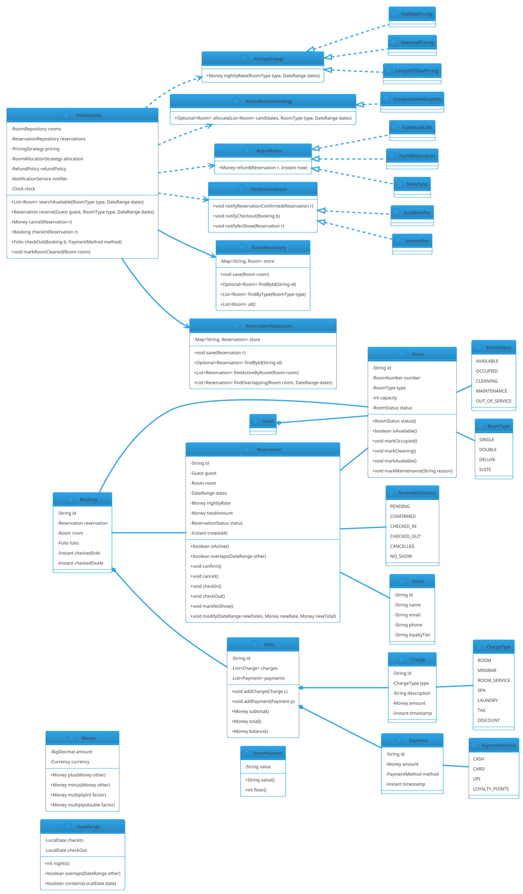

# Hotel Management System

## Problem Statement

Design a hotel management system that handles room inventory, reservations, check-in/check-out, billing, housekeeping, and multiple room categories. The system must support concurrent bookings (two guests competing for the last room), handle overbooking policies, calculate dynamic pricing (per night, per room type, seasonal), and manage the full lifecycle of a stay — from reservation through checkout. It should be **extensible** (new room types, new billing rules), **thread-safe** (multiple front desks, online bookings), and **observable** (housekeeping status, guest notifications).

This is a rich LLD problem that combines **inventory management**, **date-range booking** (overlaps, availability), **state machines** (room and booking lifecycle), **strategy** (pricing, allocation), and **observer** (housekeeping, guest notifications).

**Example flow:**

```
Scenario 1 — Make a reservation:
  1. Guest requests a Deluxe room for 3 nights (Jan 10-13)
  2. System searches for available Deluxe rooms in that date range
  3. Finds room #502 (Deluxe, floor 5)
  4. Creates Reservation (status = CONFIRMED, total = $180/night x 3 = $540)
  5. Guest pays deposit; reservation locked

Scenario 2 — Check-in:
  1. Guest arrives on Jan 10 with reservation ID
  2. System validates reservation (dates, guest, room available)
  3. Assigns room #502 to the guest
  4. Room status: AVAILABLE -> OCCUPIED
  5. Booking status: CONFIRMED -> CHECKED_IN
  6. Room key issued

Scenario 3 — Check-out:
  1. Guest checks out on Jan 13
  2. System computes final bill:
     - 3 nights x $180 = $540
     - Minibar: $25
     - Room service: $40
     - Taxes: 12%
     - Total: $605 x 1.12 = $677.60
  3. Guest pays remaining balance
  4. Room status: OCCUPIED -> CLEANING
  5. Housekeeping notified; after cleaning -> AVAILABLE

Scenario 4 — Cancel:
  1. Guest cancels 24h before check-in
  2. System releases reservation (status = CANCELLED)
  3. Refund policy applied (full/partial/none)

Concurrency:
  - Two guests book the last Deluxe room for overlapping dates
  - A guest checks in while housekeeping is cleaning the room
  - A guest extends stay while another tries to book the same room

Extensibility:
  - New room types (Suite, Presidential)
  - Seasonal pricing (dynamic rates)
  - Loyalty discounts
  - Multi-property chains
  - Add-on services (spa, dining)
```

**Why it's interesting:**

- **Date-range booking** — overlap detection, availability queries
- **Inventory with concurrency** — last-room race
- **State machines** — Room (AVAILABLE, OCCUPIED, CLEANING, MAINTENANCE), Booking (PENDING, CONFIRMED, CHECKED_IN, CHECKED_OUT, CANCELLED)
- **Dynamic pricing** — strategy pattern
- **Billing** — itemized, tax, discounts
- **Observer** — housekeeping, guest notifications
- **Common follow-ups**: "Add loyalty", "Add overbooking", "Add multi-property", "Handle no-shows"

---

## 1. Requirements

### Functional Requirements

- **Room inventory**: rooms with number, floor, type, capacity, amenities
- **Room types**: SINGLE, DOUBLE, DELUXE, SUITE (extensible)
- **Search availability**: given date range + room type, find available rooms
- **Make reservation**: guest books a room for date range; gets confirmation ID
- **Cancel reservation**: before or after check-in (with refund policy)
- **Modify reservation**: change dates or room type (subject to availability)
- **Check-in**: guest arrives; assign room; change status to OCCUPIED
- **Check-out**: compute bill; free room; change status to CLEANING
- **Billing**: nightly rate x nights + add-ons + tax - discounts
- **Payment**: deposit at booking; balance at checkout
- **Housekeeping**: track cleaning status; mark room available after cleaning
- **Maintenance**: take room out of service for repairs
- **Guest profile**: name, email, phone, loyalty tier
- **Pricing**: dynamic per room type, season, length of stay

### Non-Functional Requirements

- **Thread-safe**: concurrent bookings, check-ins, and housekeeping
- **Extensible**: new room types, pricing rules, add-ons without breaking core
- **Observable**: housekeeping notified on checkout; guest notified on confirmation
- **Fault-tolerant**: payment failure doesn't corrupt inventory; partial refunds handled
- **No double-booking**: two guests cannot book the same room for overlapping dates
- **Auditable**: every booking, payment, status change logged
- **Low latency**: search < 500 ms; booking < 1 sec

### Out of Scope

- Physical room key systems (magnetic cards)
- Actual payment gateway integration
- Channel manager (Expedia, Booking.com) integration
- Revenue management / yield optimization
- Loyalty program internals
- Restaurant / spa bookings (mentioned in add-ons)
- Housekeeping staff scheduling

---

## 2. Use Cases

### UC1 — Search Availability

```
Actor: Guest / Front desk
Steps:
  1. Enter dates (check-in, check-out) and room type (optional)
  2. System queries inventory for rooms not booked in that range
  3. Returns list of available rooms with prices
Postcondition: Available rooms displayed
```

### UC2 — Make Reservation

```
Actor: Guest
Precondition: At least one room of requested type is available for the dates
Steps:
  1. Guest selects room type and dates
  2. System picks a specific room
  3. System computes total price
  4. Guest pays deposit (or full amount)
  5. System creates Reservation (status = CONFIRMED)
  6. Guest receives confirmation (email/SMS)
Postcondition: Room reserved; guest notified
Alternative: No room available -> suggest alternative types or dates
```

### UC3 — Cancel Reservation

```
Actor: Guest
Precondition: Reservation is CONFIRMED (not yet checked in)
Steps:
  1. Guest requests cancellation
  2. System applies refund policy based on time-to-checkin
  3. Reservation status: CONFIRMED -> CANCELLED
  4. Room released back to inventory
  5. Refund processed
Postcondition: Reservation cancelled; refund issued
```

### UC4 — Modify Reservation

```
Actor: Guest
Precondition: Reservation is CONFIRMED
Steps:
  1. Guest requests new dates (or room type)
  2. System checks availability for new range
  3. If available: update reservation; recompute price
  4. If not: suggest alternatives
Postcondition: Reservation updated
```

### UC5 — Check-In

```
Actor: Guest + Front desk
Precondition: Reservation is CONFIRMED; today is check-in date
Steps:
  1. Guest provides reservation ID or name
  2. System validates reservation
  3. System verifies room is AVAILABLE
  4. Room status: AVAILABLE -> OCCUPIED
  5. Reservation status: CONFIRMED -> CHECKED_IN
  6. Room key issued; guest goes to room
Postcondition: Guest checked in; room occupied
Alternative: Room not ready -> guest waits in lobby
```

### UC6 — Add Charges During Stay

```
Actor: Guest / Staff
Steps:
  1. Guest orders room service / minibar
  2. Staff adds charge to the folio
  3. Folio updated with item and price
Postcondition: Charge recorded
```

### UC7 — Check-Out

```
Actor: Guest + Front desk
Precondition: Reservation status = CHECKED_IN
Steps:
  1. Guest requests checkout
  2. System computes final bill (nights + charges + tax - discounts)
  3. Guest pays remaining balance (deposit deducted)
  4. Receipt printed
  5. Reservation status: CHECKED_IN -> CHECKED_OUT
  6. Room status: OCCUPIED -> CLEANING
  7. Housekeeping notified
Postcondition: Room being cleaned; folio closed
```

### UC8 — Housekeeping

```
Actor: Housekeeper
Steps:
  1. Housekeeper sees CLEANING rooms on their list
  2. Cleans room; marks CLEAN
  3. Room status: CLEANING -> AVAILABLE
Postcondition: Room ready for next guest
```

### UC9 — Maintenance

```
Actor: Maintenance staff
Steps:
  1. Mark room as MAINTENANCE with reason
  2. Room unavailable for bookings
  3. When fixed, mark back to AVAILABLE
Postcondition: Room out / back in service
```

### UC10 — Report No-Show

```
Actor: Front desk
Precondition: Reservation date passed; guest didn't check in
Steps:
  1. After a grace period (e.g., midnight), mark reservation as NO_SHOW
  2. Apply no-show fee (typically first night)
  3. Release room to inventory
Postcondition: Reservation closed; fee charged
```

---

## 3. Core Entities

### Entities (classes with identity)

| Entity | Responsibility |
|---|---|
| `Hotel` | Top-level container; holds rooms and configuration |
| `Room` | A physical room (number, floor, type) |
| `RoomType` | Category (SINGLE, DOUBLE, DELUXE, SUITE) |
| `Guest` | A person staying or reserving |
| `Reservation` | A booking for a date range |
| `Booking` | An active stay (created at check-in) |
| `Folio` | Bill for a stay (charges + payments) |
| `Charge` | A line item on the folio |
| `Payment` | A payment against the folio |

### Value Objects (immutable)

| Value | Purpose |
|---|---|
| `DateRange` | Check-in + check-out |
| `Money` | BigDecimal + currency |
| `RoomNumber` | Typed wrapper (e.g., "502") |
| `ReservationId` | Typed wrapper |
| `GuestId` | Typed wrapper |

### Enums

| Enum | Values |
|---|---|
| `RoomStatus` | AVAILABLE, OCCUPIED, CLEANING, MAINTENANCE, OUT_OF_SERVICE |
| `ReservationStatus` | PENDING, CONFIRMED, CHECKED_IN, CHECKED_OUT, CANCELLED, NO_SHOW |
| `RoomType` | SINGLE, DOUBLE, DELUXE, SUITE |
| `ChargeType` | ROOM, MINIBAR, ROOM_SERVICE, SPA, LAUNDRY, TAX, DISCOUNT |
| `PaymentMethod` | CASH, CARD, UPI, LOYALTY_POINTS |

### Services (interfaces)

| Service | Responsibility |
|---|---|
| `ReservationService` | Search, book, cancel, modify |
| `CheckInService` | Check-in workflow |
| `CheckOutService` | Check-out + billing |
| `PricingStrategy` | Compute nightly rate (dynamic) |
| `BillingService` | Compute total from folio |
| `HousekeepingService` | Track cleaning status |
| `NotificationService` | Notify guests |
| `RoomAllocationStrategy` | Pick a specific room given type |

### Interfaces (contracts)

| Interface | Implementations |
|---|---|
| `PricingStrategy` | `FlatRatePricing`, `SeasonalPricing`, `LengthOfStayPricing` |
| `RoomAllocationStrategy` | `FirstAvailableAllocation`, `PreferredFloorAllocation` |
| `NotificationService` | `EmailNotifier`, `SmsNotifier`, `CompositeNotifier` |
| `RefundPolicy` | `FullRefund24h`, `PartialRefund24h`, `NoRefund` |
| `RoomRepository` | `InMemoryRoomRepository` |
| `ReservationRepository` | `InMemoryReservationRepository` |

### Relationship Summary

```
Hotel         *---  Room             (1..*)
Room          ---   RoomType         (1)
Reservation   ---   Guest            (1)
Reservation   ---   Room             (1)
Booking       ---   Reservation      (1)
Booking       ---   Room             (1)
Folio         *---  Charge           (0..*)
Folio         *---  Payment          (0..*)
Booking       ---   Folio            (1)
```

---

## 4. Class Diagram



**Key design decisions:**

- **`Reservation` is distinct from `Booking`** — Reservation is the intent; Booking is the active stay after check-in
- **`Room.status`** covers physical state; **`Reservation.status`** covers booking lifecycle
- **`Folio`** captures all charges and payments; **`Charge`** and **`Payment`** are immutable line items
- **`DateRange.overlaps()`** is the core primitive for availability
- **Strategies** for pricing, allocation, refund — all pluggable
- **`HotelService`** orchestrates everything

---

## 5. Design Patterns Used

### 5.1 Strategy Pattern

**Three strategies:**
- `PricingStrategy` — flat, seasonal, length-of-stay
- `RoomAllocationStrategy` — first available, preferred floor
- `RefundPolicy` — full, partial, none

**Justification:** Business rules vary by hotel, season, guest tier; new rules added without changing core.

### 5.2 State Pattern (lightweight)

**`Room.status` and `Reservation.status` are state machines.** Transitions are simple enough to live in the entity, but valid transitions are enforced:

```java
public void markOccupied() {
    if (status != RoomStatus.AVAILABLE) {
        throw new IllegalStateException("Room not available: " + status);
    }
    status = RoomStatus.OCCUPIED;
}
```

**Justification:** Full State pattern would be overkill; entity-level guards suffice.

### 5.3 Observer Pattern

**`NotificationService`** notifies guests on:
- Reservation confirmed
- Check-in successful
- Check-out / bill ready
- No-show

**Justification:** Decouples `HotelService` from email/SMS/push channels.

### 5.4 Repository Pattern

**`RoomRepository`, `ReservationRepository`** abstract persistence.

**Justification:** Swap in-memory for a real DB without changing services.

### 5.5 Facade Pattern

**`HotelService`** is a facade over:
- Search
- Booking
- Cancellation
- Check-in/out
- Housekeeping

**Justification:** Single entry point for front desk and online booking.

### 5.6 Factory Pattern (for Room creation)

**`RoomFactory.create(number, type, floor)`** centralizes room construction.

**Justification:** Validates number format; easy to add new room types.

### 5.7 Chain of Responsibility (Optional, for Billing)

**Billing can be modeled as a chain:**
- Room charges
- Add-ons (minibar, spa)
- Taxes
- Discounts

Each handler adds to the folio.

**Justification:** Modular billing pipeline.

---

## 6. Java Implementation

### 6.1 Enums and Value Objects

```java
package lld.hotel.model;

public enum RoomStatus {
    AVAILABLE, OCCUPIED, CLEANING, MAINTENANCE, OUT_OF_SERVICE
}

public enum ReservationStatus {
    PENDING, CONFIRMED, CHECKED_IN, CHECKED_OUT, CANCELLED, NO_SHOW
}

public enum RoomType {
    SINGLE, DOUBLE, DELUXE, SUITE
}

public enum ChargeType {
    ROOM, MINIBAR, ROOM_SERVICE, SPA, LAUNDRY, TAX, DISCOUNT
}

public enum PaymentMethod {
    CASH, CARD, UPI, LOYALTY_POINTS
}
```

```java
package lld.hotel.model;

import java.math.BigDecimal;
import java.util.Currency;

public record Money(BigDecimal amount, Currency currency) {

    public Money {
        if (amount == null || amount.signum() < 0) {
            throw new IllegalArgumentException("Amount must be non-negative");
        }
        if (currency == null) currency = Currency.getInstance("USD");
    }

    public static Money usd(double amount) {
        return new Money(BigDecimal.valueOf(amount), Currency.getInstance("USD"));
    }

    public static Money zero() { return usd(0); }

    public Money plus(Money other) {
        checkCurrency(other);
        return new Money(amount.add(other.amount), currency);
    }

    public Money minus(Money other) {
        checkCurrency(other);
        return new Money(amount.subtract(other.amount), currency);
    }

    public Money multiply(int factor) {
        return new Money(amount.multiply(BigDecimal.valueOf(factor)), currency);
    }

    public Money multiply(double factor) {
        return new Money(amount.multiply(BigDecimal.valueOf(factor)), currency);
    }

    public boolean isGreaterThan(Money other) {
        checkCurrency(other);
        return amount.compareTo(other.amount) > 0;
    }

    public boolean isZero() { return amount.signum() == 0; }

    private void checkCurrency(Money other) {
        if (!currency.equals(other.currency)) {
            throw new IllegalArgumentException("Currency mismatch");
        }
    }
}
```

```java
package lld.hotel.model;

import java.time.LocalDate;
import java.time.temporal.ChronoUnit;

public record DateRange(LocalDate checkIn, LocalDate checkOut) {

    public DateRange {
        if (checkIn == null || checkOut == null) {
            throw new IllegalArgumentException("Dates required");
        }
        if (!checkOut.isAfter(checkIn)) {
            throw new IllegalArgumentException("Check-out must be after check-in");
        }
    }

    public int nights() {
        return (int) ChronoUnit.DAYS.between(checkIn, checkOut);
    }

    /** Standard hotel overlap: [checkIn, checkOut) intervals. */
    public boolean overlaps(DateRange other) {
        return this.checkIn.isBefore(other.checkOut)
            && other.checkIn.isBefore(this.checkOut);
    }

    public boolean contains(LocalDate date) {
        return !date.isBefore(checkIn) && date.isBefore(checkOut);
    }
}
```

**Key design:** The interval is **[checkIn, checkOut)** — meaning a checkout on day X and a checkin on day X do **not** overlap. This matches hotel conventions (rooms can be reoccupied the same day).

```java
package lld.hotel.model;

public record RoomNumber(String value) {
    public RoomNumber {
        if (value == null || value.isBlank()) throw new IllegalArgumentException("Room number required");
    }
    /** Convention: 502 -> floor 5. */
    public int floor() {
        if (value.length() < 3) return 0;
        return Character.getNumericValue(value.charAt(0));
    }
}
```

### 6.2 Room

```java
package lld.hotel.model;

public final class Room {
    private final String id;
    private final RoomNumber number;
    private final RoomType type;
    private final int capacity;
    private RoomStatus status;

    public Room(String id, RoomNumber number, RoomType type, int capacity) {
        this.id = id;
        this.number = number;
        this.type = type;
        this.capacity = capacity;
        this.status = RoomStatus.AVAILABLE;
    }

    public String id() { return id; }
    public RoomNumber number() { return number; }
    public RoomType type() { return type; }
    public int capacity() { return capacity; }

    public synchronized RoomStatus status() { return status; }
    public synchronized boolean isAvailable() { return status == RoomStatus.AVAILABLE; }

    public synchronized void markOccupied() {
        if (status != RoomStatus.AVAILABLE) {
            throw new IllegalStateException("Room not available: " + status);
        }
        status = RoomStatus.OCCUPIED;
    }

    public synchronized void markCleaning() {
        if (status != RoomStatus.OCCUPIED) {
            throw new IllegalStateException("Room not occupied: " + status);
        }
        status = RoomStatus.CLEANING;
    }

    public synchronized void markAvailable() {
        if (status != RoomStatus.CLEANING && status != RoomStatus.MAINTENANCE) {
            throw new IllegalStateException("Room not ready: " + status);
        }
        status = RoomStatus.AVAILABLE;
    }

    public synchronized void markMaintenance(String reason) {
        if (status == RoomStatus.OCCUPIED) {
            throw new IllegalStateException("Cannot take occupied room out of service");
        }
        status = RoomStatus.MAINTENANCE;
    }

    @Override public String toString() {
        return "Room[" + number.value() + " " + type + " " + status + "]";
    }
}
```

### 6.3 Guest, Reservation, Booking

```java
package lld.hotel.model;

public record Guest(String id, String name, String email, String phone, String loyaltyTier) {}
```

```java
package lld.hotel.model;

import java.time.Instant;

public final class Reservation {
    private final String id;
    private final Guest guest;
    private final Room room;
    private DateRange dates;
    private Money nightlyRate;
    private Money totalAmount;
    private final Instant createdAt;
    private ReservationStatus status;

    public Reservation(String id, Guest guest, Room room, DateRange dates,
                       Money nightlyRate, Money totalAmount, Instant createdAt) {
        this.id = id;
        this.guest = guest;
        this.room = room;
        this.dates = dates;
        this.nightlyRate = nightlyRate;
        this.totalAmount = totalAmount;
        this.createdAt = createdAt;
        this.status = ReservationStatus.CONFIRMED;
    }

    public String id() { return id; }
    public Guest guest() { return guest; }
    public Room room() { return room; }

    public synchronized DateRange dates() { return dates; }
    public synchronized Money nightlyRate() { return nightlyRate; }
    public synchronized Money totalAmount() { return totalAmount; }
    public Instant createdAt() { return createdAt; }
    public synchronized ReservationStatus status() { return status; }

    public synchronized boolean isActive() {
        return status == ReservationStatus.CONFIRMED;
    }

    public synchronized boolean overlaps(DateRange other) {
        return dates.overlaps(other);
    }

    public synchronized void confirm() { this.status = ReservationStatus.CONFIRMED; }

    public synchronized void cancel() {
        if (status != ReservationStatus.CONFIRMED) {
            throw new IllegalStateException("Cannot cancel: " + status);
        }
        this.status = ReservationStatus.CANCELLED;
    }

    public synchronized void checkIn() {
        if (status != ReservationStatus.CONFIRMED) {
            throw new IllegalStateException("Cannot check in: " + status);
        }
        this.status = ReservationStatus.CHECKED_IN;
    }

    public synchronized void checkOut() {
        if (status != ReservationStatus.CHECKED_IN) {
            throw new IllegalStateException("Cannot check out: " + status);
        }
        this.status = ReservationStatus.CHECKED_OUT;
    }

    public synchronized void markNoShow() {
        if (status != ReservationStatus.CONFIRMED) {
            throw new IllegalStateException("Cannot mark no-show: " + status);
        }
        this.status = ReservationStatus.NO_SHOW;
    }

    public synchronized void modify(DateRange newDates, Money newRate, Money newTotal) {
        if (status != ReservationStatus.CONFIRMED) {
            throw new IllegalStateException("Cannot modify: " + status);
        }
        this.dates = newDates;
        this.nightlyRate = newRate;
        this.totalAmount = newTotal;
    }
}
```

```java
package lld.hotel.model;

import java.time.Instant;

public final class Booking {
    private final String id;
    private final Reservation reservation;
    private final Room room;
    private final Folio folio;
    private final Instant checkedInAt;
    private Instant checkedOutAt;

    public Booking(String id, Reservation reservation, Room room, Folio folio,
                   Instant checkedInAt) {
        this.id = id;
        this.reservation = reservation;
        this.room = room;
        this.folio = folio;
        this.checkedInAt = checkedInAt;
    }

    public String id() { return id; }
    public Reservation reservation() { return reservation; }
    public Room room() { return room; }
    public Folio folio() { return folio; }
    public Instant checkedInAt() { return checkedInAt; }
    public synchronized Instant checkedOutAt() { return checkedOutAt; }

    public synchronized void markCheckedOut(Instant when) {
        this.checkedOutAt = when;
    }
}
```

### 6.4 Folio, Charge, Payment

```java
package lld.hotel.model;

import java.time.Instant;

public final class Charge {
    private final String id;
    private final ChargeType type;
    private final String description;
    private final Money amount;
    private final Instant timestamp;

    public Charge(String id, ChargeType type, String description, Money amount, Instant timestamp) {
        this.id = id;
        this.type = type;
        this.description = description;
        this.amount = amount;
        this.timestamp = timestamp;
    }

    public String id() { return id; }
    public ChargeType type() { return type; }
    public String description() { return description; }
    public Money amount() { return amount; }
    public Instant timestamp() { return timestamp; }
}
```

```java
package lld.hotel.model;

import java.time.Instant;

public final class Payment {
    private final String id;
    private final Money amount;
    private final PaymentMethod method;
    private final Instant timestamp;

    public Payment(String id, Money amount, PaymentMethod method, Instant timestamp) {
        this.id = id;
        this.amount = amount;
        this.method = method;
        this.timestamp = timestamp;
    }

    public String id() { return id; }
    public Money amount() { return amount; }
    public PaymentMethod method() { return method; }
    public Instant timestamp() { return timestamp; }
}
```

```java
package lld.hotel.model;

import java.util.ArrayList;
import java.util.List;

public final class Folio {
    private final String id;
    private final List<Charge> charges = new ArrayList<>();
    private final List<Payment> payments = new ArrayList<>();

    public Folio(String id) { this.id = id; }

    public String id() { return id; }

    public synchronized void addCharge(Charge c) { charges.add(c); }
    public synchronized void addPayment(Payment p) { payments.add(p); }

    public synchronized List<Charge> charges() { return List.copyOf(charges); }
    public synchronized List<Payment> payments() { return List.copyOf(payments); }

    public synchronized Money subtotal() {
        Money sum = Money.zero();
        for (Charge c : charges) {
            if (c.type() == ChargeType.DISCOUNT) sum = sum.minus(c.amount());
            else sum = sum.plus(c.amount());
        }
        return sum;
    }

    public synchronized Money total() {
        Money sum = Money.zero();
        for (Charge c : charges) {
            if (c.type() == ChargeType.DISCOUNT) sum = sum.minus(c.amount());
            else sum = sum.plus(c.amount());
        }
        return sum;
    }

    public synchronized Money paid() {
        Money sum = Money.zero();
        for (Payment p : payments) sum = sum.plus(p.amount());
        return sum;
    }

    public synchronized Money balance() {
        Money bal = total().minus(paid());
        return bal.isZero() ? Money.zero() : bal;
    }
}
```

### 6.5 Pricing Strategies

```java
package lld.hotel.service;

import lld.hotel.model.DateRange;
import lld.hotel.model.Money;
import lld.hotel.model.RoomType;

public interface PricingStrategy {
    Money nightlyRate(RoomType type, DateRange dates);
}
```

```java
package lld.hotel.service;

import lld.hotel.model.DateRange;
import lld.hotel.model.Money;
import lld.hotel.model.RoomType;

import java.util.Map;

public final class FlatRatePricing implements PricingStrategy {
    private final Map<RoomType, Money> rates;

    public FlatRatePricing(Map<RoomType, Money> rates) {
        this.rates = Map.copyOf(rates);
    }

    @Override
    public Money nightlyRate(RoomType type, DateRange dates) {
        Money rate = rates.get(type);
        if (rate == null) throw new IllegalArgumentException("No rate for " + type);
        return rate;
    }
}
```

```java
package lld.hotel.service;

import lld.hotel.model.DateRange;
import lld.hotel.model.Money;
import lld.hotel.model.RoomType;

import java.time.Month;
import java.util.Map;

public final class SeasonalPricing implements PricingStrategy {
    private final Map<RoomType, Money> baseRates;
    private final double peakMultiplier;
    private final Month peakStartMonth;
    private final Month peakEndMonth;

    public SeasonalPricing(Map<RoomType, Money> baseRates,
                           double peakMultiplier,
                           Month peakStartMonth, Month peakEndMonth) {
        this.baseRates = Map.copyOf(baseRates);
        this.peakMultiplier = peakMultiplier;
        this.peakStartMonth = peakStartMonth;
        this.peakEndMonth = peakEndMonth;
    }

    @Override
    public Money nightlyRate(RoomType type, DateRange dates) {
        Money base = baseRates.get(type);
        if (base == null) throw new IllegalArgumentException("No rate for " + type);

        Month m = dates.checkIn().getMonth();
        boolean peak = !m.isBefore(peakStartMonth) && !m.isAfter(peakEndMonth);
        return peak ? base.multiply(peakMultiplier) : base;
    }
}
```

```java
package lld.hotel.service;

import lld.hotel.model.DateRange;
import lld.hotel.model.Money;
import lld.hotel.model.RoomType;

public final class LengthOfStayPricing implements PricingStrategy {
    private final PricingStrategy base;
    private final int discountThresholdNights;
    private final double discountMultiplier;

    public LengthOfStayPricing(PricingStrategy base,
                               int discountThresholdNights,
                               double discountMultiplier) {
        this.base = base;
        this.discountThresholdNights = discountThresholdNights;
        this.discountMultiplier = discountMultiplier;
    }

    @Override
    public Money nightlyRate(RoomType type, DateRange dates) {
        Money rate = base.nightlyRate(type, dates);
        if (dates.nights() >= discountThresholdNights) {
            return rate.multiply(discountMultiplier);
        }
        return rate;
    }
}
```

### 6.6 Room Allocation Strategy

```java
package lld.hotel.service;

import lld.hotel.model.DateRange;
import lld.hotel.model.Room;
import lld.hotel.model.RoomType;

import java.util.Comparator;
import java.util.List;
import java.util.Optional;

public interface RoomAllocationStrategy {
    Optional<Room> allocate(List<Room> candidates, RoomType type, DateRange dates);
}

public final class FirstAvailableAllocation implements RoomAllocationStrategy {
    @Override
    public Optional<Room> allocate(List<Room> candidates, RoomType type, DateRange dates) {
        return candidates.stream()
                .filter(r -> r.type() == type)
                .min(Comparator.comparing(r -> r.number().value()));
    }
}
```

### 6.7 Refund Policies

```java
package lld.hotel.service;

import lld.hotel.model.Money;
import lld.hotel.model.Reservation;

import java.time.Duration;
import java.time.Instant;

public interface RefundPolicy {
    Money refund(Reservation r, Instant now);
}

public final class FullRefund24h implements RefundPolicy {
    @Override
    public Money refund(Reservation r, Instant now) {
        long hours = Duration.between(now, r.createdAt()).toHours();
        // For demo: assume full refund if more than 24h before check-in
        return r.totalAmount();
    }
}

public final class PartialRefund24h implements RefundPolicy {
    private final double refundFraction;

    public PartialRefund24h(double refundFraction) {
        this.refundFraction = refundFraction;
    }

    @Override
    public Money refund(Reservation r, Instant now) {
        return r.totalAmount().multiply(refundFraction);
    }
}

public final class NoRefund implements RefundPolicy {
    @Override
    public Money refund(Reservation r, Instant now) { return Money.zero(); }
}
```

### 6.8 Notification Service

```java
package lld.hotel.service;

import lld.hotel.model.Booking;
import lld.hotel.model.Reservation;

public interface NotificationService {
    void notifyReservationConfirmed(Reservation r);
    void notifyCheckout(Booking b);
    void notifyNoShow(Reservation r);
}

public final class EmailNotifier implements NotificationService {
    @Override
    public void notifyReservationConfirmed(Reservation r) {
        System.out.println("[EMAIL to " + r.guest().email() + "] Reservation confirmed: " + r.id());
    }
    @Override
    public void notifyCheckout(Booking b) {
        System.out.println("[EMAIL to " + b.reservation().guest().email()
                + "] Checkout complete. Bill: " + b.folio().total().amount());
    }
    @Override
    public void notifyNoShow(Reservation r) {
        System.out.println("[EMAIL to " + r.guest().email() + "] No-show: " + r.id());
    }
}

public final class SmsNotifier implements NotificationService {
    @Override
    public void notifyReservationConfirmed(Reservation r) {
        System.out.println("[SMS to " + r.guest().phone() + "] Reservation confirmed: " + r.id());
    }
    @Override
    public void notifyCheckout(Booking b) {
        System.out.println("[SMS to " + b.reservation().guest().phone() + "] Checkout complete");
    }
    @Override
    public void notifyNoShow(Reservation r) {
        System.out.println("[SMS to " + r.guest().phone() + "] No-show");
    }
}
```

### 6.9 Repositories

```java
package lld.hotel.repository;

import lld.hotel.model.Room;
import lld.hotel.model.RoomType;

import java.util.List;
import java.util.Map;
import java.util.Optional;
import java.util.concurrent.ConcurrentHashMap;
import java.util.stream.Collectors;

public final class RoomRepository {
    private final Map<String, Room> store = new ConcurrentHashMap<>();

    public void save(Room room) { store.put(room.id(), room); }

    public Optional<Room> findById(String id) {
        return Optional.ofNullable(store.get(id));
    }

    public List<Room> findByType(RoomType type) {
        return store.values().stream()
                .filter(r -> r.type() == type)
                .collect(Collectors.toList());
    }

    public List<Room> all() { return List.copyOf(store.values()); }
}
```

```java
package lld.hotel.repository;

import lld.hotel.model.DateRange;
import lld.hotel.model.Reservation;
import lld.hotel.model.ReservationStatus;
import lld.hotel.model.Room;

import java.util.List;
import java.util.Map;
import java.util.Optional;
import java.util.concurrent.ConcurrentHashMap;
import java.util.stream.Collectors;

public final class ReservationRepository {
    private final Map<String, Reservation> store = new ConcurrentHashMap<>();

    public void save(Reservation r) { store.put(r.id(), r); }

    public Optional<Reservation> findById(String id) {
        return Optional.ofNullable(store.get(id));
    }

    public List<Reservation> findActiveByRoom(Room room) {
        return store.values().stream()
                .filter(r -> r.room().id().equals(room.id()))
                .filter(r -> r.status() == ReservationStatus.CONFIRMED
                          || r.status() == ReservationStatus.CHECKED_IN)
                .collect(Collectors.toList());
    }

    public List<Reservation> findOverlapping(Room room, DateRange dates) {
        return store.values().stream()
                .filter(r -> r.room().id().equals(room.id()))
                .filter(r -> r.status() == ReservationStatus.CONFIRMED
                          || r.status() == ReservationStatus.CHECKED_IN)
                .filter(r -> r.overlaps(dates))
                .collect(Collectors.toList());
    }
}
```

### 6.10 HotelService

```java
package lld.hotel.service;

import lld.hotel.model.*;
import lld.hotel.repository.ReservationRepository;
import lld.hotel.repository.RoomRepository;

import java.time.Clock;
import java.time.Instant;
import java.util.ArrayList;
import java.util.List;
import java.util.UUID;

public final class HotelService {
    private final RoomRepository rooms;
    private final ReservationRepository reservations;
    private final PricingStrategy pricing;
    private final RoomAllocationStrategy allocation;
    private final RefundPolicy refundPolicy;
    private final NotificationService notifier;
    private final Clock clock;

    public HotelService(RoomRepository rooms,
                        ReservationRepository reservations,
                        PricingStrategy pricing,
                        RoomAllocationStrategy allocation,
                        RefundPolicy refundPolicy,
                        NotificationService notifier,
                        Clock clock) {
        this.rooms = rooms;
        this.reservations = reservations;
        this.pricing = pricing;
        this.allocation = allocation;
        this.refundPolicy = refundPolicy;
        this.notifier = notifier;
        this.clock = clock;
    }

    // -------- Search --------

    public List<Room> searchAvailable(RoomType type, DateRange dates) {
        List<Room> candidates = rooms.findByType(type);
        List<Room> available = new ArrayList<>();
        for (Room r : candidates) {
            if (isAvailable(r, dates)) available.add(r);
        }
        return available;
    }

    private boolean isAvailable(Room room, DateRange dates) {
        if (room.status() == RoomStatus.MAINTENANCE
                || room.status() == RoomStatus.OUT_OF_SERVICE) {
            return false;
        }
        return reservations.findOverlapping(room, dates).isEmpty();
    }

    // -------- Reserve --------

    public Reservation reserve(Guest guest, RoomType type, DateRange dates) {
        List<Room> available = searchAvailable(type, dates);
        Room room = allocation.allocate(available, type, dates)
                .orElseThrow(() -> new IllegalStateException("No " + type + " available for " + dates));

        Money rate = pricing.nightlyRate(type, dates);
        Money total = rate.multiply(dates.nights());

        Reservation r = new Reservation(
                UUID.randomUUID().toString(),
                guest, room, dates, rate, total,
                Instant.now(clock)
        );

        // Guard against race: re-check just before saving
        synchronized (this) {
            if (!reservations.findOverlapping(room, dates).isEmpty()) {
                throw new IllegalStateException("Room just booked by another guest");
            }
            reservations.save(r);
        }

        notifier.notifyReservationConfirmed(r);
        return r;
    }

    // -------- Cancel --------

    public Money cancel(Reservation r) {
        r.cancel();
        Money refund = refundPolicy.refund(r, Instant.now(clock));
        return refund;
    }

    // -------- Modify --------

    public Reservation modify(Reservation r, DateRange newDates) {
        // Ensure new range doesn't conflict with other reservations for same room
        List<Reservation> overlapping = reservations.findOverlapping(r.room(), newDates).stream()
                .filter(other -> !other.id().equals(r.id()))
                .toList();
        if (!overlapping.isEmpty()) {
            throw new IllegalStateException("Room not available for new dates");
        }
        Money rate = pricing.nightlyRate(r.room().type(), newDates);
        Money total = rate.multiply(newDates.nights());
        r.modify(newDates, rate, total);
        return r;
    }

    // -------- Check-in --------

    public Booking checkIn(Reservation r) {
        r.checkIn();
        r.room().markOccupied();

        Folio folio = new Folio(UUID.randomUUID().toString());

        // Add room charges
        folio.addCharge(new Charge(
                UUID.randomUUID().toString(),
                ChargeType.ROOM,
                r.dates().nights() + " nights at " + r.nightlyRate().amount(),
                r.totalAmount(),
                Instant.now(clock)
        ));

        // Add tax
        Money tax = r.totalAmount().multiply(0.12);
        folio.addCharge(new Charge(
                UUID.randomUUID().toString(),
                ChargeType.TAX,
                "12% tax",
                tax,
                Instant.now(clock)
        ));

        return new Booking(UUID.randomUUID().toString(), r, r.room(), folio, Instant.now(clock));
    }

    // -------- Add charge during stay --------

    public void addCharge(Booking b, ChargeType type, String desc, Money amount) {
        b.folio().addCharge(new Charge(
                UUID.randomUUID().toString(), type, desc, amount, Instant.now(clock)));
    }

    // -------- Check-out --------

    public Folio checkOut(Booking b, PaymentMethod method) {
        Money balance = b.folio().balance();
        if (!balance.isZero()) {
            b.folio().addPayment(new Payment(
                    UUID.randomUUID().toString(), balance, method, Instant.now(clock)));
        }

        b.reservation().checkOut();
        b.room().markCleaning();
        b.markCheckedOut(Instant.now(clock));

        notifier.notifyCheckout(b);
        return b.folio();
    }

    // -------- Housekeeping --------

    public void markRoomCleaned(Room room) {
        room.markAvailable();
    }
}
```

### 6.11 Demo

```java
package lld.hotel;

import lld.hotel.model.*;
import lld.hotel.repository.ReservationRepository;
import lld.hotel.repository.RoomRepository;
import lld.hotel.service.*;

import java.time.Clock;
import java.time.LocalDate;
import java.time.ZoneOffset;
import java.util.List;
import java.util.Map;

public class Demo {
    public static void main(String[] args) {
        Clock clock = Clock.fixed(
                java.time.Instant.parse("2026-01-05T10:00:00Z"),
                ZoneOffset.UTC
        );

        RoomRepository rooms = new RoomRepository();
        rooms.save(new Room("R-101", new RoomNumber("101"), RoomType.SINGLE, 1));
        rooms.save(new Room("R-102", new RoomNumber("102"), RoomType.DOUBLE, 2));
        rooms.save(new Room("R-501", new RoomNumber("501"), RoomType.DELUXE, 2));
        rooms.save(new Room("R-502", new RoomNumber("502"), RoomType.DELUXE, 2));

        ReservationRepository reservations = new ReservationRepository();

        PricingStrategy pricing = new FlatRatePricing(Map.of(
                RoomType.SINGLE, Money.usd(100),
                RoomType.DOUBLE, Money.usd(150),
                RoomType.DELUXE, Money.usd(180),
                RoomType.SUITE,  Money.usd(400)
        ));

        HotelService hotel = new HotelService(
                rooms,
                reservations,
                pricing,
                new FirstAvailableAllocation(),
                new FullRefund24h(),
                new EmailNotifier(),
                clock
        );

        Guest alice = new Guest("G-1", "Alice", "alice@example.com", "555-0001", "GOLD");

        DateRange dates = new DateRange(
                LocalDate.of(2026, 1, 10),
                LocalDate.of(2026, 1, 13)
        );

        System.out.println("--- Search DELUXE ---");
        List<Room> available = hotel.searchAvailable(RoomType.DELUXE, dates);
        System.out.println("Available: " + available);

        System.out.println("\n--- Reserve first DELUXE ---");
        Reservation res = hotel.reserve(alice, RoomType.DELUXE, dates);
        System.out.println("Reservation: " + res.id() + " total: " + res.totalAmount().amount());

        System.out.println("\n--- Check-in ---");
        Booking booking = hotel.checkIn(res);
        System.out.println("Booking: " + booking.id());

        System.out.println("\n--- Add minibar charge $25 ---");
        hotel.addCharge(booking, ChargeType.MINIBAR, "Minibar", Money.usd(25));

        System.out.println("\n--- Check-out ---");
        Folio folio = hotel.checkOut(booking, PaymentMethod.CARD);
        System.out.println("Total: " + folio.total().amount());
        System.out.println("Paid:  " + folio.paid().amount());
        System.out.println("Balance: " + folio.balance().amount());

        System.out.println("\n--- Housekeeping marks room cleaned ---");
        hotel.markRoomCleaned(res.room());
        System.out.println("Room status: " + res.room().status());
    }
}
```

**Expected output (abridged):**
```
--- Search DELUXE ---
Available: [Room[501 DELUXE AVAILABLE], Room[502 DELUXE AVAILABLE]]

--- Reserve first DELUXE ---
[EMAIL to alice@example.com] Reservation confirmed: ...
Reservation: ... total: 540.0

--- Check-in ---
Booking: ...

--- Add minibar charge $25 ---

--- Check-out ---
[EMAIL to alice@example.com] Checkout complete. Bill: 629.8
Total: 629.8
Paid:  629.8
Balance: 0.0

--- Housekeeping marks room cleaned ---
Room status: AVAILABLE
```

---

## 7. Concurrency Considerations

### Shared Resources

| Resource | Shared? | Synchronization |
|---|---|---|
| `Room.status` | Yes | `synchronized` methods |
| `Reservation.status` | Yes | `synchronized` methods |
| `Folio.charges`, `Folio.payments` | Yes | `synchronized` methods |
| `RoomRepository.store` | Yes | `ConcurrentHashMap` |
| `ReservationRepository.store` | Yes | `ConcurrentHashMap` |
| `HotelService.reserve` critical section | Yes | `synchronized (this)` |

### Race: Two guests book the last room for overlapping dates

The check "is this room available?" and "save reservation" must be atomic.

**Fix:** In `HotelService.reserve`:
```java
synchronized (this) {
    if (!reservations.findOverlapping(room, dates).isEmpty()) {
        throw new IllegalStateException("Room just booked by another guest");
    }
    reservations.save(r);
}
```

The `synchronized (this)` block covers the read-check-write sequence. The second caller sees the first reservation and fails.

**Trade-off:** Global lock on `HotelService`. For a single hotel with moderate booking rate, fine. For high throughput, shard by room ID or use optimistic concurrency (version field).

### Alternative: Pessimistic lock on Room

```java
synchronized (room) {
    if (!reservations.findOverlapping(room, dates).isEmpty()) {
        throw new IllegalStateException(...);
    }
    reservations.save(r);
}
```

Better granularity: two bookings for different rooms proceed in parallel.

**Recommendation:** Lock the room, not the service.

### Race: Check-in while housekeeping finishing

Room status transitions are `synchronized`. A room in CLEANING cannot be checked into (guest gets "room not ready"). Housekeeping's `markAvailable` and guest's `markOccupied` serialize.

### Race: Add charge while checking out

`Folio.addCharge` and `Folio.balance` are `synchronized`. If a charge races with checkout, either:
- Charge is added before balance computed (guest pays for it)
- Charge is added after payment (guest billed later — bad)

**Fix:** Lock the folio during checkout:
```java
synchronized (b.folio()) {
    Money balance = b.folio().balance();
    if (!balance.isZero()) { /* charge payment */ }
}
```

### Race: Modify reservation while another books same room

`modify` checks overlapping reservations for the new date range and rejects if any. Combined with `reserve`'s check, no double-booking.

### Session Timeout (No-Show)

A scheduled task runs periodically:
```java
scheduler.scheduleAtFixedRate(() -> {
    for (Reservation r : reservations.findAllConfirmed()) {
        if (shouldMarkNoShow(r, Instant.now(clock))) {
            r.markNoShow();
            notifier.notifyNoShow(r);
        }
    }
}, 0, 1, TimeUnit.HOURS);
```

### Idempotency

- **cancel** is idempotent (already CANCELLED → throws; client handles)
- **checkOut** is idempotent (already CHECKED_OUT → throws)
- **markRoomCleaned** is idempotent (already AVAILABLE → throws; caller handles)

### Testing Concurrency

```java
@Test
void concurrentBookingSameRoom() throws InterruptedException {
    // Setup: one DELUXE room, same dates
    // Two threads call reserve(guest, DELUXE, dates)
    // Assert: one succeeds, one throws IllegalStateException
}
```

---

## 8. Extensibility

### Add a New Room Type (Presidential Suite)

1. Add `PRESIDENTIAL` to `RoomType`
2. Add rate in `FlatRatePricing` map
3. Update `PerItemTypeFine` if it applies (N/A here)
4. Optionally add `RoomFactory.create` case

**No existing behavior changes.**

### Add Seasonal Pricing

Replace `FlatRatePricing` with `SeasonalPricing` (or wrap it). Same `PricingStrategy` interface.

**No change to HotelService.**

### Add Loyalty Discounts

1. Add `loyaltyTier` to `Guest` (already there)
2. Introduce `LoyaltyPricingStrategy` wrapper:
   ```java
   public final class LoyaltyPricing implements PricingStrategy {
       @Override
       public Money nightlyRate(RoomType type, DateRange dates) {
           Money base = basePricing.nightlyRate(type, dates);
           return multiplierFor(currentGuest) * base;
       }
   }
   ```
3. Or add a `Discount` charge line in `Folio` at check-in.

### Add Multi-Property Chains

Introduce `Hotel` with `hotelId`:
- `Room` has `hotelId`
- `ReservationRepository` sharded by `hotelId`
- `HotelService` becomes per-hotel or accepts `hotelId`

**Additive with a `hotelId` field.**

### Add Add-On Services (Spa, Dining)

Already supported via `addCharge(Booking, ChargeType.SPA, ...)`. Add new `ChargeType` values as needed.

### Add Overbooking

Deliberate policy: allow booking beyond capacity up to a configurable overbooking factor. When checking in, if room unavailable, "walk" the guest to a partner hotel.

**Approach:** Add `overbookingFactor` to `HotelService`. `reserve` allows bookings up to `totalRooms * factor`. `checkIn` may fail if overbooked.

### Add Channel Manager Integration

External APIs (Booking.com, Expedia) call `HotelService.reserve`. The service doesn't care about the source. Add a `source` field to `Reservation` for reporting.

### Add No-Show Handling

Already discussed: scheduled task marks CONFIRMED reservations past midnight as NO_SHOW.

### Add Payment Retry

Payment failures during checkout: `HotelService.checkOut` catches `PaymentFailedException`, leaves folio open, allows retry. Add `PaymentStatus` if needed.

### Add Multi-Currency

`Money` already has `Currency`. `PricingStrategy` returns `Money` in the hotel's currency. Display converts via a `CurrencyConverter` service.

---

## 9. SOLID Principles Applied

### Single Responsibility Principle

| Class | Single Responsibility |
|---|---|
| `Room` | Physical room + status |
| `Reservation` | Booking lifecycle |
| `Booking` | Active stay |
| `Folio` | Bill |
| `Charge`, `Payment` | Line items |
| `HotelService` | Orchestration |
| `PricingStrategy` | Rate computation |
| `RoomAllocationStrategy` | Room selection |
| `RefundPolicy` | Refund rules |
| `NotificationService` | Guest notifications |
| `RoomRepository`, `ReservationRepository` | Persistence |

### Open/Closed Principle

- **New pricing rule** — implement `PricingStrategy`
- **New allocation** — implement `RoomAllocationStrategy`
- **New refund rule** — implement `RefundPolicy`
- **New room type** — add enum + rate
- **New payment method** — add enum

No existing behavior modified when extending.

### Liskov Substitution Principle

- All `PricingStrategy` implementations honor the contract
- All `RefundPolicy` implementations honor the contract
- `Room` status transitions enforce valid states
- No method throws `UnsupportedOperationException` for valid inputs

### Interface Segregation Principle

Small interfaces:
- `PricingStrategy` — 1 method
- `RoomAllocationStrategy` — 1 method
- `RefundPolicy` — 1 method
- `NotificationService` — 3 cohesive methods

### Dependency Inversion Principle

`HotelService` depends on abstractions:
- `PricingStrategy`
- `RoomAllocationStrategy`
- `RefundPolicy`
- `NotificationService`
- `RoomRepository`, `ReservationRepository`
- `Clock`

All constructor-injected. No `new` in business logic.

---

## 10. Common Pitfalls

| Pitfall | Why It's Wrong | Fix |
|---|---|---|
| `double` for money | Rounding errors | `BigDecimal` / `Money` |
| Inclusive `[checkIn, checkOut]` ranges | Overlaps on transition day | Use `[checkIn, checkOut)` |
| Check-then-act without lock | Double-booking | `synchronized (room)` in reserve |
| Status enum with no guards | Invalid transitions | Throw on invalid transitions |
| `HashMap` for repositories | Race conditions | `ConcurrentHashMap` |
| Ignoring `Room.status` at booking | Book a MAINTENANCE room | `isAvailable` checks status |
| Allowing modify to overlap existing | Double-booked room | Check overlap in `modify` |
| No no-show handling | Room wasted | Scheduler + `markNoShow` |
| Reusing `Reservation` for `Booking` | Loses history | Separate entities |
| No tax separation in folio | Hard to audit | `ChargeType.TAX` line |
| Payments not recorded | No audit trail | `Payment` entity |
| Notifying synchronously | Slow checkout | Async notifier or event bus |
| `Clock` not injected | Untestable | Inject `Clock` |
| No idempotency on checkout | Double payment | Check booking status |

---

## 11. Follow-up Questions

### Q1: How do you prevent double-booking?

**Answer:** `HotelService.reserve` does a check-and-save inside `synchronized (room)`. The overlap check runs, then the reservation is saved, atomically. A second caller for the same room fails with `IllegalStateException`.

### Q2: How would you handle overbooking?

**Answer:** Add `overbookingFactor` to `HotelService.reserve` — allow bookings up to `totalRooms * factor`. At check-in, if no room is available, "walk" the guest to a partner hotel (compensation + transport). Track walk events for analytics.

### Q3: How would you handle extending a stay mid-booking?

**Answer:** Call `modify(reservation, newDateRange)`. It checks overlap for the new range (excluding the current reservation). If free, updates the reservation. If the room is already booked for the extension, offers to move the guest to another room.

### Q4: How would you implement multi-night pricing with weekend surcharge?

**Answer:** Modify `PricingStrategy` to return a total (not just nightly rate), or iterate nights in `HotelService.reserve`:

```java
Money total = Money.zero();
for (LocalDate d = dates.checkIn(); d.isBefore(dates.checkOut()); d = d.plusDays(1)) {
    total = total.plus(pricing.nightlyRate(type, d));
}
```

Weekend nights get a multiplier.

### Q5: How would you handle a payment failure during checkout?

**Answer:** `checkOut` catches `PaymentFailedException`, leaves `Folio` open, and returns the folio with a non-zero balance. The guest settles later. Optionally, mark the booking as `PENDING_PAYMENT` in the state machine.

### Q6: How would you test this?

- **Unit tests** for `DateRange.overlaps`, `PricingStrategy`, `Folio.balance`
- **Integration tests** for full flow (search → reserve → check-in → add charges → check-out)
- **Concurrency tests** — many threads booking the same room; assert one success
- **Time-based tests** with `Clock.fixed` for check-in, check-out, no-show scenarios
- **Property test** — invariant: `sum(booked rooms for date D) <= total rooms`

### Q7: How would you support multi-property chains?

**Answer:** Add `hotelId` to `Room` and `Reservation`. Shard `RoomRepository` and `ReservationRepository` by `hotelId`. `HotelService` takes a `hotelId`. A `ChainService` can search across all hotels.

### Q8: How would you handle a guest who doesn't check in (no-show)?

**Answer:** A scheduled task at midnight checks CONFIRMED reservations whose check-in date has passed. Marks them `NO_SHOW`, charges the first-night fee (or per policy), and releases the room. Notifies the guest.

### Q9: How would you add loyalty program discounts?

**Answer:** Either:
- Wrap `PricingStrategy` with a `LoyaltyPricing` that applies a discount based on `guest.loyaltyTier`
- Add a `DISCOUNT` charge to the folio at check-out

Either approach is composable with existing strategies.

### Q10: How would you scale search?

**Answer:** For a single hotel, in-memory search is fine. For a chain, index reservations in a database or Elasticsearch. Query available rooms for date ranges via a range query on `[checkIn, checkOut)` overlaps.

---

## 12. Similar Problems

- **Library Management** — items + loans + reservations; same skeleton
- **Parking Lot** — spots + tickets + pricing; same skeleton
- **Movie Ticket Booking** — seats + shows + payment; date-range variant
- **Car Rental** — cars + bookings + pricing; date-range variant
- **Airline Reservation** — seats + flights + waitlist
- **Meeting Room Booking** — rooms + time slots + availability
- **Equipment Rental** — items + loans + pricing

**Shared skeleton:**
1. **Inventory of resources** (rooms, books, cars, seats)
2. **Booking entity** with date range
3. **State machine** for resource and booking
4. **Overlap check** on date range
5. **Atomic reservation** (lock or optimistic)
6. **Pricing strategy** (flat, dynamic, seasonal)
7. **Billing / folio** with line items
8. **Observer** for notifications
9. **Repository pattern** for persistence
10. **Refund / cancellation policy** as strategy

Master Hotel → apply the same skeleton to the others.

---

## 13. Key Takeaways

- **`Reservation` ≠ `Booking`** — intent vs. active stay
- **`DateRange` is `[checkIn, checkOut)`** — no overlap on transition day
- **Atomic reserve** — `synchronized (room)` around check-and-save
- **`Room.status` state machine** — guards every transition
- **`Folio` with `Charge` + `Payment`** — itemized billing
- **Strategies** for pricing, allocation, refund — all pluggable
- **Repository pattern** — swap in-memory for DB
- **Observer for notifications** — email, SMS, push
- **`Clock` injected** — deterministic tests with `Clock.fixed`
- **Money is `BigDecimal`** — never `double`
- **`ConcurrentHashMap` for repositories** — safe concurrent access
- **Scheduled task for no-shows** — automatic lifecycle management
- **Idempotency guards** — cancel, checkout, clean are safe to retry
- **Extensibility hooks** — room types, pricing rules, refund policies
- **Billing line items** — `ROOM`, `TAX`, `DISCOUNT`, `MINIBAR` etc.
- **Multi-property ready** — add `hotelId` and shard
- **The generalizable recipe** — inventory + booking + pricing + states + strategies + repositories + observers + concurrency + extensibility

### The Generalizable Recipe

For any **inventory + date-range booking** problem:

1. **Resource entity** (Room, Book, Car) with **status**
2. **Booking entity** with **DateRange** and **status**
3. **Overlap check** — `[start, end)` intervals
4. **Atomic reservation** — lock the resource
5. **PricingStrategy** — flat, seasonal, length-of-stay
6. **RefundPolicy** — full, partial, none
7. **Folio / bill** — itemized charges + payments
8. **Observer** — notifications
9. **Repository** — persist resources and bookings
10. **Inject Clock** — deterministic time
11. **Scheduler** — no-shows, expirations
12. **State machine guards** — invalid transitions throw

This skeleton solves: Hotel, Library, Parking Lot, Movie Booking, Car Rental, Airline, Meeting Room, Equipment Rental — with variations in item metadata, pricing, and states.