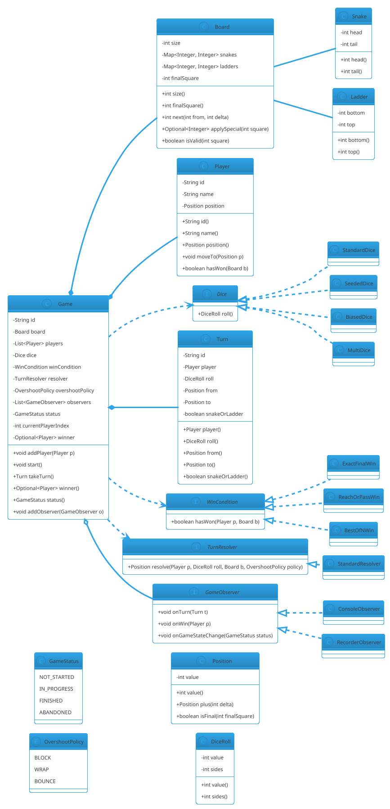

# Snake and Ladder

## Problem Statement

Design a Snake and Ladder game (also known as Chutes and Ladders) for **N players** on an M×M board. The board has snakes (which move a player down) and ladders (which move a player up). Players take turns rolling a die and moving their token; the first to reach the final square (typically 100) wins. The system must handle turn order, dice rolling, snake/ladder transitions, winning detection, and **extensibility** for variants (custom boards, multiple dice, power-ups).

Unlike most LLD problems, Snake and Ladder is **turn-based and deterministic in structure** — which makes it an excellent exercise in **state machines**, **strategy** (dice, board rules), and **observer** (game events). It's also small enough to design in 30 minutes, leaving room for deep dives on extensibility.

**Example flow:**

```
Board: 10x10 (squares 1-100)
Snakes: {16->6, 47->26, 49->11, 56->53, 62->19, 64->60, 87->24, 93->73, 95->75, 98->78}
Ladders: {1->38, 4->14, 9->31, 21->42, 28->84, 36->44, 51->67, 71->91, 80->100}

Players: Alice, Bob, Carol

Turn 1 — Alice:
  Rolls 4 -> moves from 0 (start) to 4
  Square 4 has a ladder -> climbs to 14
  Alice at 14

Turn 2 — Bob:
  Rolls 6 -> moves from 0 to 6
  Square 6 has no special
  Bob at 6

Turn 3 — Carol:
  Rolls 3 -> moves from 0 to 3
  Carol at 3

Turn 4 — Alice:
  Rolls 5 -> moves from 14 to 19
  Alice at 19

...

Turn N — Alice:
  Rolls 6 -> moves from 94 to 100
  Alice wins!

Variants:
  - Custom board sizes (8x8, 12x12)
  - Multiple dice (2 dice → 2-12)
  - Must land exactly on final square (no overshoot)
  - Power-ups (extra turn, skip turn, teleport)
  - Ladders can be used only once

Concurrency:
  - Turn-based → no true concurrency, but timers and disconnects matter
  - Multiple games can run concurrently (each isolated)

Extensibility:
  - New dice types (biased, multi-sided)
  - New board rules (periodic snakes, moving ladders)
  - New victory conditions (first to 3 wins)
  - New players (AI, remote)
```

**Why it's interesting:**

- **Turn-based state machine** — whose turn, what phase
- **Dice as strategy** — random, biased, deterministic (for tests)
- **Board as a graph** — squares connected by normal moves + snakes/ladders
- **Observer pattern** — game events (rolled, moved, won) broadcast to UI/log
- **Extensibility is real** — many variants
- **Small enough for LLD** — can be fully designed in 45 min

---

## 1. Requirements

### Functional Requirements

- **Board**: M×M grid, numbered 1 to M² (boustrophedon numbering: left-to-right on odd rows, right-to-left on even rows)
- **Snakes**: map head → tail (down)
- **Ladders**: map bottom → top (up)
- **Players**: 2 to N players, each with a token at position 0 (off-board) initially
- **Turn order**: round-robin starting with the first player
- **Dice**: roll to determine move (default d6: 1-6)
- **Move**: advance player by dice value, then apply snake/ladder if landing on one
- **Win**: first player to reach the final square wins
- **Skip**: if roll would overshoot final square, player stays (configurable)
- **Game over**: no more turns after a winner

### Non-Functional Requirements

- **Thread-safe**: games run independently; turn transitions must be atomic
- **Extensible**: new dice, board rules, victory conditions without breaking core
- **Observable**: game events (roll, move, snake, ladder, win) broadcast
- **Deterministic**: with a seeded dice, the same game replays identically (for tests)
- **Low latency**: turn resolution < 100 ms (excluding UI delays)
- **Auditable**: log every turn (player, roll, from, to)

### Out of Scope

- Network multiplayer (turn synchronization over WebSocket)
- AI players
- UI rendering
- Persistent game state (save/load)
- Matchmaking
- Chat / emotes

---

## 2. Use Cases

### UC1 — Create Game

```
Actor: Host
Steps:
  1. Host configures board (size, snakes, ladders) and dice (sides, count)
  2. Host adds players (2-N)
  3. System creates Game (status = NOT_STARTED)
Postcondition: Game ready to start
```

### UC2 — Start Game

```
Actor: Host
Precondition: Game has ≥ 2 players
Steps:
  1. Host calls start()
  2. System sets current player = first
  3. System sets status = IN_PROGRESS
  4. Notifies observers "game started"
Postcondition: Turn 1 ready
```

### UC3 — Take Turn (Normal Roll)

```
Actor: Current player
Precondition: Game IN_PROGRESS
Steps:
  1. Player calls roll()
  2. Dice produces value v
  3. Compute new position = current + v
  4. If new position > FINAL: stay (or wrap depending on rules)
  5. Apply snake/ladder if new position has one
  6. Update player position
  7. Check win condition
  8. If won: mark winner; status = FINISHED
  9. Else: advance turn to next player
Postcondition: Turn resolved
```

### UC4 — Win Condition

```
Actor: System
Precondition: A player's new position == FINAL
Steps:
  1. Mark player as winner
  2. Set game status = FINISHED
  3. Notify observers "player won"
Postcondition: Game over
```

### UC5 — Overshoot Handling

```
Actor: System
Precondition: Player's roll would move past FINAL
Steps (two policies):
  - Block: player stays put; turn passes
  - Wrap: player moves to FINAL - overshoot (backwards)
  - Bounce: player moves to FINAL then back by overshoot
Postcondition: Turn resolved per policy
```

### UC6 — Add/Remove Player Mid-Game (Optional)

```
Actor: Host
Precondition: Game IN_PROGRESS
Steps:
  1. Host adds a player
  2. New player joins after the last player in turn order
  3. Or host removes a disconnected player
Postcondition: Turn order updated
```

### UC7 — End Game Early

```
Actor: Host
Steps:
  1. Host calls stop() or all players leave
  2. System sets status = ABANDONED
  3. Notifies observers
Postcondition: Game ended
```

### UC8 — Replay with Same Seed (Deterministic)

```
Actor: Tester
Steps:
  1. Create game with seed=42
  2. Run to completion
  3. Recreate game with seed=42
  4. Replay same rolls
Postcondition: Same sequence of outcomes
```

---

## 3. Core Entities

### Entities (classes with identity)

| Entity | Responsibility |
|---|---|
| `Game` | Top-level orchestrator; players, board, turn order |
| `Board` | Grid + snakes + ladders; validates positions |
| `Player` | A player with a token position |
| `Dice` | Roll generator (d6, d20, 2d6, …) |
| `Turn` | A single turn's record (player, roll, from, to) |

### Value Objects (immutable)

| Value | Purpose |
|---|---|
| `Position` | Square number (0 = start, 1..N = board) |
| `DiceRoll` | Result of a roll (value + sides) |
| `Snake` | Head + tail positions |
| `Ladder` | Bottom + top positions |
| `PlayerId` | Typed wrapper |

### Enums

| Enum | Values |
|---|---|
| `GameStatus` | NOT_STARTED, IN_PROGRESS, FINISHED, ABANDONED |
| `OvershootPolicy` | BLOCK, WRAP, BOUNCE |

### Services (interfaces)

| Service | Responsibility |
|---|---|
| `Dice` | Produce a roll |
| `TurnResolver` | Compute new position after roll |
| `GameObserver` | Receive game events |
| `WinCondition` | Determine if a player has won |

### Interfaces (contracts)

| Interface | Implementations |
|---|---|
| `Dice` | `StandardDice`, `SeededDice`, `BiasedDice`, `MultiDice` |
| `GameObserver` | `ConsoleObserver`, `RecorderObserver`, `CompositeObserver` |
| `WinCondition` | `ExactFinalWin`, `ReachOrPassWin`, `BestOfNWin` |
| `TurnResolver` | `StandardResolver` (applies snakes/ladders), `CustomResolver` |

---

## 4. Class Diagram



**Key design decisions:**

- **`Position` is a value object** — its `value()` is the square number (0 = start, 1..N = board squares)
- **`Board` holds snakes and ladders as maps** — square → destination
- **`Dice` is a strategy** — swap for deterministic, biased, or multi-die
- **`TurnResolver` encapsulates move + special application** — swap for custom rules
- **`WinCondition` is a strategy** — exact landing vs. reach-or-pass vs. best-of-N
- **`GameObserver`** — broadcast game events
- **`Turn`** is a record of what happened — good for replay and logging

---

## 5. Design Patterns Used

### 5.1 Strategy Pattern

**Three strategies:**
- `Dice` — standard, seeded, biased, multi
- `WinCondition` — exact, reach-or-pass, best-of-N
- `TurnResolver` — standard resolver, custom resolver

**Justification:** Variants plug in without changing core; testing uses `SeededDice`.

### 5.2 Observer Pattern

**`GameObserver`** receives:
- `onTurn(Turn)` — after each turn
- `onWin(Player)` — when a player wins
- `onGameStateChange(GameStatus)` — on start, finish, abandon

**Justification:** Decouples game logic from UI/logging/metrics.

### 5.3 State Pattern (lightweight)

**`GameStatus`** transitions:
- `NOT_STARTED → IN_PROGRESS` (start)
- `IN_PROGRESS → FINISHED` (win)
- `IN_PROGRESS → ABANDONED` (stop)

Guarded transitions in `Game`.

### 5.4 Factory Pattern (for Dice)

**`DiceFactory.create("d6")`, `DiceFactory.create("2d6")`** — parse dice strings into implementations.

**Justification:** Centralizes creation; easy to add new dice.

### 5.5 Builder Pattern (for Board)

**`BoardBuilder`** with methods:
```java
Board board = new BoardBuilder(10)
    .snake(16, 6)
    .snake(47, 26)
    .ladder(1, 38)
    .ladder(4, 14)
    .build();
```

**Justification:** Board setup is verbose; builder reads well.

### 5.6 Composite Pattern (for Observers)

**`CompositeObserver`** broadcasts to a list of observers.

**Justification:** Multiple observers with one registration.

---

## 6. Java Implementation

### 6.1 Enums and Value Objects

```java
package lld.snakeladder.model;

public enum GameStatus {
    NOT_STARTED, IN_PROGRESS, FINISHED, ABANDONED
}

public enum OvershootPolicy {
    BLOCK, WRAP, BOUNCE
}
```

```java
package lld.snakeladder.model;

public record Position(int value) {

    public Position {
        if (value < 0) throw new IllegalArgumentException("Position must be non-negative");
    }

    public static Position start() { return new Position(0); }

    public Position plus(int delta) { return new Position(value + delta); }

    public boolean isFinal(int finalSquare) { return value == finalSquare; }

    public boolean isPast(int finalSquare) { return value > finalSquare; }
}
```

```java
package lld.snakeladder.model;

public record Snake(int head, int tail) {
    public Snake {
        if (head <= tail) throw new IllegalArgumentException("Snake must go down");
    }
}

public record Ladder(int bottom, int top) {
    public Ladder {
        if (top <= bottom) throw new IllegalArgumentException("Ladder must go up");
    }
}
```

```java
package lld.snakeladder.model;

public record DiceRoll(int value, int sides) {
    public DiceRoll {
        if (value < 1 || value > sides) {
            throw new IllegalArgumentException("Dice value must be 1..sides");
        }
    }
}
```

### 6.2 Board

```java
package lld.snakeladder.model;

import java.util.Collections;
import java.util.Map;
import java.util.Optional;

public final class Board {
    private final int size;                       // e.g., 10 for a 10x10 board
    private final int finalSquare;                // size * size
    private final Map<Integer, Integer> snakes;   // head -> tail
    private final Map<Integer, Integer> ladders;  // bottom -> top

    public Board(int size, Map<Integer, Integer> snakes, Map<Integer, Integer> ladders) {
        if (size < 2) throw new IllegalArgumentException("Board size must be >= 2");
        this.size = size;
        this.finalSquare = size * size;
        this.snakes = Collections.unmodifiableMap(snakes);
        this.ladders = Collections.unmodifiableMap(ladders);

        // Validate: no square is both snake head and ladder bottom
        for (Integer h : snakes.keySet()) {
            if (ladders.containsKey(h)) {
                throw new IllegalArgumentException("Square " + h + " is both snake and ladder");
            }
        }
        // Validate: destinations are valid and don't create infinite loops
        // (skip full cycle detection for brevity)
    }

    public int size() { return size; }
    public int finalSquare() { return finalSquare; }

    public boolean isValid(int square) {
        return square >= 0 && square <= finalSquare;
    }

    /** Next raw position after moving delta from a square. */
    public int rawNext(int from, int delta) { return from + delta; }

    /** Apply snake or ladder if the square has one. */
    public Optional<Integer> applySpecial(int square) {
        if (snakes.containsKey(square)) return Optional.of(snakes.get(square));
        if (ladders.containsKey(square)) return Optional.of(ladders.get(square));
        return Optional.empty();
    }

    public Map<Integer, Integer> snakes() { return snakes; }
    public Map<Integer, Integer> ladders() { return ladders; }
}
```

### 6.3 Player

```java
package lld.snakeladder.model;

public final class Player {
    private final String id;
    private final String name;
    private Position position;

    public Player(String id, String name) {
        this.id = id;
        this.name = name;
        this.position = Position.start();
    }

    public String id() { return id; }
    public String name() { return name; }
    public synchronized Position position() { return position; }

    public synchronized void moveTo(Position p) { this.position = p; }

    public boolean hasWon(Board b) {
        return position().isFinal(b.finalSquare());
    }

    @Override public String toString() { return name + "@" + position.value(); }
}
```

### 6.4 Dice

```java
package lld.snakeladder.service;

import lld.snakeladder.model.DiceRoll;

public interface Dice {
    DiceRoll roll();
}
```

```java
package lld.snakeladder.service;

import lld.snakeladder.model.DiceRoll;

import java.util.concurrent.ThreadLocalRandom;

public final class StandardDice implements Dice {
    private final int sides;

    public StandardDice(int sides) {
        if (sides < 2) throw new IllegalArgumentException("Dice must have >= 2 sides");
        this.sides = sides;
    }

    @Override
    public DiceRoll roll() {
        int value = ThreadLocalRandom.current().nextInt(1, sides + 1);
        return new DiceRoll(value, sides);
    }
}
```

```java
package lld.snakeladder.service;

import lld.snakeladder.model.DiceRoll;

import java.util.Random;

/** Deterministic dice for testing and replay. */
public final class SeededDice implements Dice {
    private final int sides;
    private final Random random;

    public SeededDice(int sides, long seed) {
        this.sides = sides;
        this.random = new Random(seed);
    }

    @Override
    public synchronized DiceRoll roll() {
        int value = random.nextInt(sides) + 1;
        return new DiceRoll(value, sides);
    }
}
```

```java
package lld.snakeladder.service;

import lld.snakeladder.model.DiceRoll;

import java.util.Random;

/** Favors certain values (e.g., higher rolls). */
public final class BiasedDice implements Dice {
    private final int sides;
    private final double highRollProbability;   // e.g., 0.6 -> 60% chance of top half

    public BiasedDice(int sides, double highRollProbability) {
        this.sides = sides;
        this.highRollProbability = highRollProbability;
    }

    @Override
    public DiceRoll roll() {
        ThreadLocalRandom rnd = ThreadLocalRandom.current();
        boolean high = rnd.nextDouble() < highRollProbability;
        int half = sides / 2;
        int value = high
                ? rnd.nextInt(half + 1, sides + 1)
                : rnd.nextInt(1, half + 1);
        return new DiceRoll(value, sides);
    }
}
```

```java
package lld.snakeladder.service;

import lld.snakeladder.model.DiceRoll;

import java.util.List;

/** Sums multiple dice (e.g., 2d6 = 2..12). */
public final class MultiDice implements Dice {
    private final List<Dice> dice;
    private final int sidesPerDie;

    public MultiDice(List<Dice> dice, int sidesPerDie) {
        this.dice = List.copyOf(dice);
        this.sidesPerDie = sidesPerDie;
    }

    @Override
    public DiceRoll roll() {
        int sum = 0;
        for (Dice d : dice) sum += d.roll().value();
        return new DiceRoll(sum, dice.size() * sidesPerDie);
    }
}
```

### 6.5 Turn Resolver

```java
package lld.snakeladder.service;

import lld.snakeladder.model.*;

import java.util.Optional;

public interface TurnResolver {
    Position resolve(Player player, DiceRoll roll, Board board, OvershootPolicy policy);
}
```

```java
package lld.snakeladder.service;

import lld.snakeladder.model.*;

import java.util.Optional;

public final class StandardResolver implements TurnResolver {

    @Override
    public Position resolve(Player player, DiceRoll roll, Board board, OvershootPolicy policy) {
        int from = player.position().value();
        int raw = board.rawNext(from, roll.value());
        int final_ = board.finalSquare();

        if (raw > final_) {
            switch (policy) {
                case BLOCK -> raw = from;
                case WRAP  -> raw = final_ - (raw - final_);
                case BOUNCE -> raw = final_ - (raw - final_);
            }
        }

        int landed = Math.max(0, Math.min(raw, final_));

        // Apply snake / ladder
        Optional<Integer> special = board.applySpecial(landed);
        int finalPos = special.orElse(landed);

        return new Position(finalPos);
    }
}
```

### 6.6 Win Condition

```java
package lld.snakeladder.service;

import lld.snakeladder.model.Board;
import lld.snakeladder.model.Player;

public interface WinCondition {
    boolean hasWon(Player player, Board board);
}
```

```java
package lld.snakeladder.service;

import lld.snakeladder.model.Board;
import lld.snakeladder.model.Player;

public final class ExactFinalWin implements WinCondition {
    @Override
    public boolean hasWon(Player player, Board board) {
        return player.position().isFinal(board.finalSquare());
    }
}
```

```java
package lld.snakeladder.service;

import lld.snakeladder.model.Board;
import lld.snakeladder.model.Player;

public final class ReachOrPassWin implements WinCondition {
    @Override
    public boolean hasWon(Player player, Board board) {
        return player.position().value() >= board.finalSquare();
    }
}
```

### 6.7 Turn and Game

```java
package lld.snakeladder.model;

public final class Turn {
    private final String id;
    private final Player player;
    private final DiceRoll roll;
    private final Position from;
    private final Position to;
    private final boolean usedSnakeOrLadder;

    public Turn(String id, Player player, DiceRoll roll, Position from,
                Position to, boolean usedSnakeOrLadder) {
        this.id = id;
        this.player = player;
        this.roll = roll;
        this.from = from;
        this.to = to;
        this.usedSnakeOrLadder = usedSnakeOrLadder;
    }

    public String id() { return id; }
    public Player player() { return player; }
    public DiceRoll roll() { return roll; }
    public Position from() { return from; }
    public Position to() { return to; }
    public boolean usedSnakeOrLadder() { return usedSnakeOrLadder; }
}
```

```java
package lld.snakeladder.service;

import lld.snakeladder.model.GameStatus;
import lld.snakeladder.model.Player;
import lld.snakeladder.model.Turn;

public interface GameObserver {
    void onTurn(Turn t);
    void onWin(Player p);
    void onGameStateChange(GameStatus status);
}
```

```java
package lld.snakeladder.service;

import lld.snakeladder.model.GameStatus;
import lld.snakeladder.model.Player;
import lld.snakeladder.model.Turn;

public final class ConsoleObserver implements GameObserver {
    @Override
    public void onTurn(Turn t) {
        System.out.println("[TURN] " + t.player().name()
                + " rolled " + t.roll().value()
                + " -> " + t.from().value() + " -> " + t.to().value()
                + (t.usedSnakeOrLadder() ? " (snake/ladder)" : ""));
    }
    @Override public void onWin(Player p) {
        System.out.println("[WIN] " + p.name() + " wins!");
    }
    @Override public void onGameStateChange(GameStatus status) {
        System.out.println("[GAME] " + status);
    }
}
```

```java
package lld.snakeladder.core;

import lld.snakeladder.model.*;
import lld.snakeladder.service.*;

import java.util.ArrayList;
import java.util.List;
import java.util.Optional;
import java.util.UUID;
import java.util.concurrent.CopyOnWriteArrayList;
import java.util.concurrent.locks.ReentrantLock;

public final class Game {
    private final String id;
    private final Board board;
    private final Dice dice;
    private final WinCondition winCondition;
    private final TurnResolver resolver;
    private final OvershootPolicy overshootPolicy;
    private final List<Player> players = new ArrayList<>();
    private final List<GameObserver> observers = new CopyOnWriteArrayList<>();

    private final ReentrantLock lock = new ReentrantLock();
    private GameStatus status = GameStatus.NOT_STARTED;
    private int currentPlayerIndex = 0;
    private Player winner;

    public Game(String id, Board board, Dice dice, WinCondition winCondition,
                TurnResolver resolver, OvershootPolicy overshootPolicy) {
        this.id = id;
        this.board = board;
        this.dice = dice;
        this.winCondition = winCondition;
        this.resolver = resolver;
        this.overshootPolicy = overshootPolicy;
    }

    public String id() { return id; }
    public Board board() { return board; }

    public void addPlayer(Player p) {
        lock.lock();
        try {
            if (status != GameStatus.NOT_STARTED) {
                throw new IllegalStateException("Cannot add players after start");
            }
            players.add(p);
        } finally { lock.unlock(); }
    }

    public void addObserver(GameObserver o) {
        observers.add(o);
    }

    public void start() {
        lock.lock();
        try {
            if (status != GameStatus.NOT_STARTED) {
                throw new IllegalStateException("Game already started");
            }
            if (players.size() < 2) {
                throw new IllegalStateException("Need at least 2 players");
            }
            status = GameStatus.IN_PROGRESS;
            currentPlayerIndex = 0;
            notifyStateChange();
        } finally { lock.unlock(); }
    }

    public Turn takeTurn() {
        lock.lock();
        try {
            if (status != GameStatus.IN_PROGRESS) {
                throw new IllegalStateException("Game not in progress: " + status);
            }

            Player current = players.get(currentPlayerIndex);
            DiceRoll roll = dice.roll();
            Position from = current.position();

            Position to = resolver.resolve(current, roll, board, overshootPolicy);
            current.moveTo(to);

            boolean usedSpecial = to.value() != from.value() + roll.value();
            Turn turn = new Turn(UUID.randomUUID().toString(), current, roll, from, to, usedSpecial);
            notifyTurn(turn);

            if (winCondition.hasWon(current, board)) {
                winner = current;
                status = GameStatus.FINISHED;
                notifyWin(current);
                notifyStateChange();
            } else {
                currentPlayerIndex = (currentPlayerIndex + 1) % players.size();
            }

            return turn;
        } finally { lock.unlock(); }
    }

    public GameStatus status() {
        lock.lock();
        try { return status; }
        finally { lock.unlock(); }
    }

    public Optional<Player> winner() {
        lock.lock();
        try { return Optional.ofNullable(winner); }
        finally { lock.unlock(); }
    }

    public Player currentPlayer() {
        lock.lock();
        try { return players.get(currentPlayerIndex); }
        finally { lock.unlock(); }
    }

    private void notifyTurn(Turn t) {
        for (GameObserver o : observers) {
            try { o.onTurn(t); } catch (RuntimeException ex) { /* log and continue */ }
        }
    }

    private void notifyWin(Player p) {
        for (GameObserver o : observers) {
            try { o.onWin(p); } catch (RuntimeException ex) { /* log and continue */ }
        }
    }

    private void notifyStateChange() {
        for (GameObserver o : observers) {
            try { o.onGameStateChange(status); } catch (RuntimeException ex) { /* log */ }
        }
    }
}
```

### 6.8 Builder for Board

```java
package lld.snakeladder.core;

import lld.snakeladder.model.Board;
import lld.snakeladder.model.Ladder;
import lld.snakeladder.model.Snake;

import java.util.HashMap;
import java.util.Map;

public final class BoardBuilder {
    private final int size;
    private final Map<Integer, Integer> snakes = new HashMap<>();
    private final Map<Integer, Integer> ladders = new HashMap<>();

    public BoardBuilder(int size) { this.size = size; }

    public BoardBuilder snake(int head, int tail) {
        new Snake(head, tail);   // validate
        snakes.put(head, tail);
        return this;
    }

    public BoardBuilder ladder(int bottom, int top) {
        new Ladder(bottom, top);   // validate
        ladders.put(bottom, top);
        return this;
    }

    public Board build() {
        return new Board(size, snakes, ladders);
    }
}
```

### 6.9 Demo

```java
package lld.snakeladder;

import lld.snakeladder.core.BoardBuilder;
import lld.snakeladder.core.Game;
import lld.snakeladder.model.*;
import lld.snakeladder.service.*;

import java.util.UUID;

public class Demo {
    public static void main(String[] args) {
        Board board = new BoardBuilder(10)
                .snake(16, 6).snake(47, 26).snake(49, 11).snake(56, 53)
                .snake(62, 19).snake(64, 60).snake(87, 24).snake(93, 73)
                .snake(95, 75).snake(98, 78)
                .ladder(1, 38).ladder(4, 14).ladder(9, 31).ladder(21, 42)
                .ladder(28, 84).ladder(36, 44).ladder(51, 67).ladder(71, 91)
                .ladder(80, 100)
                .build();

        Dice dice = new SeededDice(6, 42);   // deterministic
        Game game = new Game(
                UUID.randomUUID().toString(),
                board,
                dice,
                new ExactFinalWin(),
                new StandardResolver(),
                OvershootPolicy.BLOCK
        );

        game.addObserver(new ConsoleObserver());

        game.addPlayer(new Player("P1", "Alice"));
        game.addPlayer(new Player("P2", "Bob"));
        game.addPlayer(new Player("P3", "Carol"));

        game.start();

        int safety = 1000;
        while (game.status() == GameStatus.IN_PROGRESS && safety-- > 0) {
            game.takeTurn();
        }

        game.winner().ifPresent(w ->
            System.out.println("Final winner: " + w.name()));
    }
}
```

**Expected output (abridged):**
```
[GAME] IN_PROGRESS
[TURN] Alice rolled 5 -> 0 -> 5
[TURN] Bob rolled 4 -> 0 -> 4 (snake/ladder)
[TURN] Carol rolled 6 -> 0 -> 6
...
[TURN] Alice rolled 3 -> 98 -> 78 (snake/ladder)
...
[TURN] Alice rolled 6 -> 94 -> 100
[WIN] Alice wins!
[GAME] FINISHED
Final winner: Alice
```

---

## 7. Concurrency Considerations

### Turn-Based, Not Parallel

Snake and Ladder is **inherently sequential** — one player rolls at a time. The concurrency concern is **turn transition atomicity**, not parallel moves.

### Race: Two clients trigger roll for the same player

If two UI threads call `game.takeTurn()` simultaneously:

- Both see the same `currentPlayerIndex`
- Both roll, both move the same player
- **Double-advance bug**

**Fix:** `takeTurn` is `synchronized` (via `ReentrantLock`). Only one thread executes at a time.

### Race: Observer throws during notification

One observer's exception shouldn't break the game loop.

**Fix:** Wrap each `o.onTurn(...)` in try/catch.

### Race: Player disconnected mid-turn

For network play: if a player disconnects, the host can remove them or the game skips their turn.

**Fix:** `Game` holds a list; removal is under the lock. Skipping logic checks a `Player.isActive()` flag.

### Race: Reentrant turn

A player is not allowed to `takeTurn` twice in a row. The `currentPlayerIndex` update inside the lock ensures fairness.

### Multiple Games, No Shared State

Each `Game` is independent. No shared mutable state between games (each has its own `Board`, `Player`s, `Dice`). Multiple games run concurrently without locks between them.

### Determinism for Tests

Use `SeededDice` with a fixed seed. Same seed + same config → same outcome. This makes concurrency tests deterministic too.

### Testing Concurrency

```java
@Test
void concurrentTurnsDoNotDoubleAdvance() throws InterruptedException {
    Game game = createTestGame();
    game.start();

    int threads = 10;
    CountDownLatch latch = new CountDownLatch(1);
    ExecutorService pool = Executors.newFixedThreadPool(threads);

    for (int i = 0; i < threads; i++) {
        pool.submit(() -> {
            try { latch.await(); } catch (InterruptedException ignored) { return; }
            try { game.takeTurn(); } catch (IllegalStateException ignored) { }
        });
    }

    latch.countDown();
    pool.shutdown();
    pool.awaitTermination(5, TimeUnit.SECONDS);

    // Assert: total turns taken == number of successful calls
    // Assert: positions are consistent (sum of moves == sum of rolls)
}
```

---

## 8. Extensibility

### Add a New Dice Type (d20)

```java
Dice d20 = new StandardDice(20);
Game game = new Game(..., d20, ...);
```

**No existing code changed.** ✅

### Add Multiple Dice (2d6)

```java
Dice twoD6 = new MultiDice(
    List.of(new StandardDice(6), new StandardDice(6)),
    6
);
```

**No existing code changed.** ✅

### Add a Biased Dice (Rigged for Testing)

```java
Dice rigged = new BiasedDice(6, 0.9);   // 90% chance of 4-6
```

### Add a New Win Condition (Best of 3)

```java
public final class BestOfNWin implements WinCondition {
    private final Map<String, Integer> wins = new ConcurrentHashMap<>();
    private final int target;
    // ...
}
```

**No existing code changed** — inject the new condition into `Game`.

### Add Power-Ups

Add a new layer to `TurnResolver`:

```java
public final class PowerUpResolver implements TurnResolver {
    private final TurnResolver base;
    private final Map<Integer, PowerUp> powerUps;

    @Override
    public Position resolve(Player p, DiceRoll roll, Board b, OvershootPolicy policy) {
        Position pos = base.resolve(p, roll, b, policy);
        PowerUp pu = powerUps.get(pos.value());
        if (pu != null) pu.apply(p);
        return p.position();
    }
}
```

**No existing code changed.**

### Add "Ladders Only Once" Rule

Add a `Set<PlayerId>` per ladder in `TurnResolver`. When a player uses a ladder, mark it as used for them.

### Add a Custom Board Shape

If the board isn't M×M (e.g., circular), introduce a `BoardLayout` interface:

```java
public interface BoardLayout {
    int next(int from, int delta);
    int finalSquare();
}
```

`Board` uses a `BoardLayout` instead of hardcoding M×M.

### Add Turn Timer

Wrap `takeTurn` with a watchdog: if the current player doesn't roll within N seconds, auto-skip or auto-roll. Implement via `ScheduledExecutorService`.

### Add Replay

`Turn` records are enough to replay. A `GameReplayer` reads a list of `Turn`s and rebuilds state.

### Add Network Multiplayer

Introduce a `GameServer` that accepts WebSocket connections. Each client sends `roll` commands; server calls `takeTurn` and broadcasts the resulting `Turn` to observers.

**The core `Game` doesn't change** — it stays synchronous.

### Add Persistence

Serialize `Game` state (JSON, DB) after every turn. `Board`, `Player`, `GameStatus` are all serializable.

### Add AI Players

`Player` becomes an interface with `PlayStrategy`:

```java
public interface PlayerStrategy {
    int chooseAction(GameState state);
}
```

Human, Random, Greedy implementations.

---

## 9. SOLID Principles Applied

### Single Responsibility Principle

| Class | Single Responsibility |
|---|---|
| `Game` | Turn orchestration |
| `Board` | Square lookup + specials |
| `Player` | Player identity + position |
| `Dice` | Random / deterministic number generation |
| `TurnResolver` | Move + apply snake/ladder |
| `WinCondition` | Determine victory |
| `GameObserver` | Receive events |
| `Turn` | Record one turn |

### Open/Closed Principle

- **New dice** — implement `Dice`
- **New win condition** — implement `WinCondition`
- **New resolver** — implement `TurnResolver`
- **New observer** — implement `GameObserver`

No existing behavior modified.

### Liskov Substitution Principle

- All `Dice` implementations honor `roll()` contract
- All `WinCondition` implementations return a boolean without side effects
- All `TurnResolver` implementations return a valid `Position`

### Interface Segregation Principle

Small interfaces:
- `Dice` — 1 method
- `WinCondition` — 1 method
- `TurnResolver` — 1 method
- `GameObserver` — 3 methods (cohesive event callbacks)

### Dependency Inversion Principle

`Game` depends on abstractions:
- `Dice`
- `WinCondition`
- `TurnResolver`
- `GameObserver`
- `Board` (concrete, but simple value container)

All injected via constructor.

---

## 10. Common Pitfalls

| Pitfall | Why It's Wrong | Fix |
|---|---|---|
| No lock on `takeTurn` | Two clients can double-advance | `synchronized` or lock |
| Hardcoded dice | Can't test or add variants | `Dice` interface |
| Hardcoded board | Can't change size | `BoardBuilder` + config |
| Snakes and ladders in `Game` | Bloats Game | Encapsulate in `Board` |
| Winner logic in `Game` | Couples victory rules | `WinCondition` strategy |
| Not recording turns | No replay / audit | `Turn` entity |
| Observer exception breaks game | One bad observer kills loop | try/catch around notify |
| Overshoot not handled | Player position > final | `OvershootPolicy` |
| `int` instead of `Position` | No validation | Typed value object |
| Mutable board after start | Mid-game changes | Immutable `Board` |
| Single dice instance shared across games | Thread-safety risk | Per-game dice or thread-safe dice |
| `equals` for `Position` comparing raw ints | Type confusion | Use the value object |

---

## 11. Follow-up Questions

### Q1: How would you handle a player rolling three 6s in a row (common house rule)?

**Answer:** Add a `ConsecutiveSixPenalty` rule in the `TurnResolver`: if a player rolls 6 three times consecutively, their token returns to start (or they lose the turn). Track `consecutiveSixes` on `Player` or in `Game`.

### Q2: How would you add multiplayer over the network?

**Answer:** Wrap `Game` in a `GameServer` that handles WebSocket connections. Clients send `roll` commands; server calls `takeTurn` and broadcasts `Turn` events. `Game` itself stays synchronous and unaware of networking.

### Q3: How would you persist game state?

**Answer:** After every `takeTurn`, serialize `Game` to JSON (or DB). `Board`, `Player`, `GameStatus` are all POJOs. Resume by deserializing and continuing from `currentPlayerIndex`.

### Q4: How would you replay a game?

**Answer:** Store the sequence of `Turn`s. To replay, create a fresh `Game` with the same board and initial positions, then apply each turn's roll.

### Q5: How would you test this?

- **Unit tests** for `Board.applySpecial`, `Position.plus`, `TurnResolver.resolve`
- **Integration tests** for a full game with `SeededDice` — deterministic result
- **Concurrency tests** — multiple threads calling `takeTurn`; assert no double-advance
- **Property tests** — invariant: `sum(moves) == sum(rolls)` for players who didn't hit overshoot
- **Replay test** — same seed → same winner

### Q6: How would you support a variable board size?

**Answer:** Already supported — `BoardBuilder(size)` and `Board` compute `finalSquare = size * size`. Snakes and ladders are provided by the builder, not hardcoded.

### Q7: How would you add power-ups?

**Answer:** Add a `PowerUp` interface and store a `Map<Integer, PowerUp>` on the board. Wrap `TurnResolver` with a `PowerUpResolver` that applies power-ups after landing. No changes to `Game` or `Board`.

### Q8: How would you handle a player disconnecting mid-game?

**Answer:** `Game.removePlayer(Player)` under lock. If the removed player was the current player, `currentPlayerIndex` is adjusted. If fewer than 2 players remain, `status = ABANDONED`.

### Q9: How would you implement AI players?

**Answer:** `Player` becomes an interface. `HumanPlayer` waits for external `roll`. `AIPlayer` chooses a move via a `PlayerStrategy`. `Game.takeTurn` calls `currentPlayer.strategy().chooseMove()`.

### Q10: How would you handle a "must land exactly" rule?

**Answer:** Use `ExactFinalWin` + `OvershootPolicy.BLOCK`. If the roll would overshoot, the player stays. Only an exact landing wins.

### Q11: How would you implement "Ladders can only be used once per player"?

**Answer:** Add `Map<PlayerId, Set<Integer>>` in `TurnResolver`. When a ladder is used, mark it. On subsequent visits, skip the ladder.

### Q12: How would you handle biased dice for engagement?

**Answer:** Implement `BiasedDice` with a configurable probability distribution. Inject into `Game`. Same interface, no changes elsewhere.

---

## 12. Similar Problems

- **Tic-Tac-Toe** — turn-based, win detection, board
- **Chess** — turn-based, move validation, win detection
- **Ludo** — turn-based, dice, movement rules
- **Snakes and Ladders (this)** — turn-based, dice, board specials
- **Monopoly** — turn-based, dice, board, properties
- **Solitaire** — single-player card game
- **Poker** — turn-based, betting rounds, hand evaluation

**Shared skeleton:**
1. **Board / state** — the game world
2. **Player** — token with position
3. **Turn loop** — current player, next player
4. **Move validator / resolver** — apply rules
5. **Win condition** — determine victory
6. **Observer** — broadcast events
7. **Randomness source** (dice, shuffle) as strategy
8. **Determinism** for testing (seed)

Master Snake and Ladder → apply the same skeleton to the others.

---

## 13. Key Takeaways

- **Turn-based state machine** — `GameStatus` (NOT_STARTED, IN_PROGRESS, FINISHED, ABANDONED)
- **Strategy for dice** — `StandardDice`, `SeededDice`, `BiasedDice`, `MultiDice`
- **Strategy for win conditions** — `ExactFinalWin`, `ReachOrPassWin`, `BestOfNWin`
- **Strategy for turn resolution** — `TurnResolver` encapsulates movement + specials
- **Observer for events** — `onTurn`, `onWin`, `onGameStateChange`
- **Typed value objects** — `Position`, `DiceRoll`, `Snake`, `Ladder` instead of raw ints
- **Immutable board** — configured once, never mutated
- **Builder for board** — `BoardBuilder(10).snake(16,6).ladder(1,38).build()`
- **`synchronized` `takeTurn`** — one turn at a time
- **Observer exception isolation** — one bad observer doesn't kill the loop
- **Deterministic tests** — `SeededDice` reproduces the same game
- **Extensible** — new dice, win conditions, resolvers without touching core
- **Overshoot policy** — `BLOCK`, `WRAP`, `BOUNCE`
- **Replay-ready** — `Turn` records are enough to reconstruct
- **Network-ready** — wrap `Game` in a `GameServer`; core stays synchronous
- **The generalizable recipe** — board + player + turn loop + resolver + win condition + observer + dice strategy

### The Generalizable Recipe

For any **turn-based board game**:

1. **Board / state** — the game world
2. **Player** — token with position, alive/active flag
3. **Turn loop** — round-robin with skip on disconnect
4. **Move resolver** — apply movement rules (dice, cards, etc.)
5. **Win condition** — strategy for victory
6. **Observer** — broadcast events to UI, logs, metrics
7. **Randomness** as strategy — dice, shuffle, deck
8. **Determinism** — seed-based for tests and replay
9. **Typed value objects** — Position, Roll, Move instead of raw primitives
10. **Turn record** — for audit and replay
11. **Locking** — one turn at a time
12. **Extensibility hooks** — new rules, dice, win conditions

This skeleton solves: Snake and Ladder, Tic-Tac-Toe, Chess, Ludo, Monopoly, Poker, most card games — with variations in board representation, move rules, and win conditions.