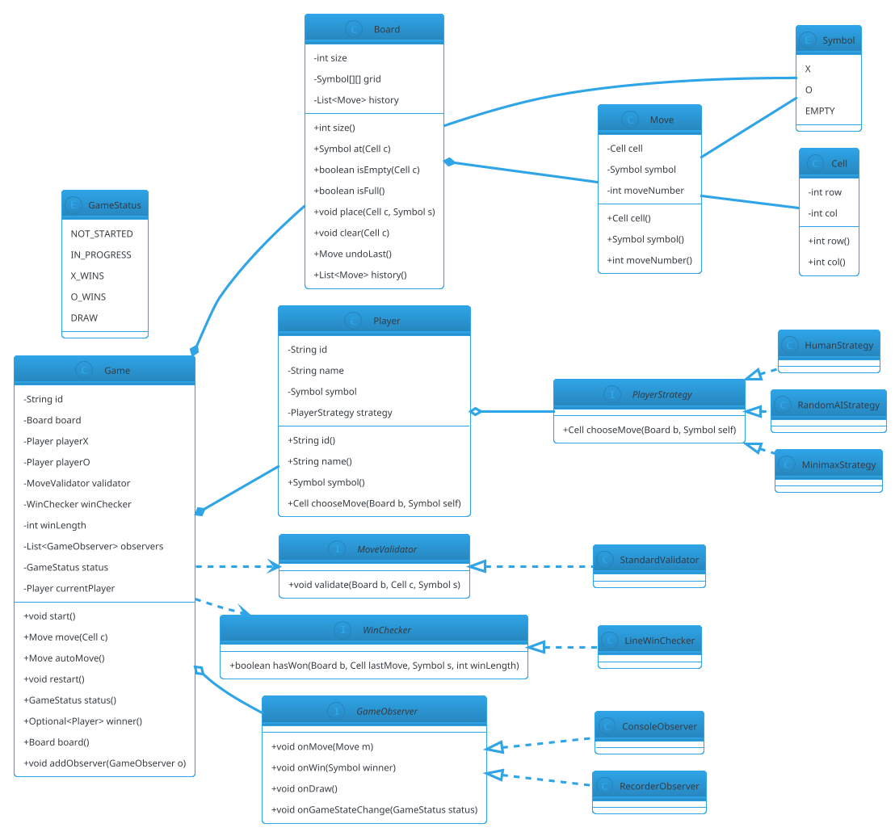

# Tic-Tac-Toe

## Problem Statement

Design a Tic-Tac-Toe game for **two players** on a 3×3 board (extensible to N×N). Players take turns placing their mark (X or O) in an empty cell. The first to get N-in-a-row (3 for classic) wins. If the board fills without a winner, it's a draw. The system must handle turn order, move validation, win detection, draw detection, and **extensibility** for variants (larger boards, custom win length, AI opponents, undo).

Tic-Tac-Toe is the **smallest complete board game** — it's often used as a warm-up for LLD interviews because the entire design fits in your head, but it still exposes **state machines**, **strategy** (win condition, move validation), **observer** (game events), and the classic **MVC-ish separation** of game logic from player input.

**Example flow:**

```
Board coordinates: rows 0-2, cols 0-2

Player X goes first.

Turn 1 — X plays (0,0):
  X | . | .
  . | . | .
  . | . | .

Turn 2 — O plays (1,1):
  X | . | .
  . | O | .
  . | . | .

Turn 3 — X plays (0,1):
  X | X | .
  . | O | .
  . | . | .

Turn 4 — O plays (2,2):
  X | X | .
  . | O | .
  . | . | O

Turn 5 — X plays (0,2):
  X | X | X   <- X wins on the top row
  . | O | .
  . | . | O

Variants:
  - 4x4 board with 4-in-a-row
  - 5x5 board with 5-in-a-row
  - Gomoku (15x15 with 5-in-a-row)
  - Custom win length (e.g., 4x4 board, 3-in-a-row)
  - AI opponent (random, minimax, alpha-beta)
  - Undo / redo
  - Best of 3 or 5
  - Timed moves

Concurrency:
  - Turn-based → sequential moves
  - Network play → ensure only one client can move per turn
  - AI vs human → human UI must wait for AI to move

Extensibility:
  - New board sizes
  - New win lengths
  - New move validators (e.g., no center on first turn)
  - New player types (human, AI, remote)
```

**Why it's interesting:**

- **Canonical board game LLD** — small enough to fully design
- **Win detection is non-trivial** — rows, columns, diagonals, custom sizes
- **State machine** — X's turn → O's turn → game over
- **Strategy for players** — human, AI, remote
- **Observer for UI** — board changes, win events
- **Extensibility is clean** — new board sizes and win lengths
- **Common follow-ups**: "Add AI", "Add undo", "Make it N×N", "Add network play"

---

## 1. Requirements

### Functional Requirements

- **Board**: N×N grid (default 3×3), cells initially empty
- **Two players**: X and O; X goes first
- **Move**: player marks an empty cell with their symbol
- **Turn order**: alternate after each valid move
- **Move validation**: cell must exist and be empty
- **Win detection**: N-in-a-row (default 3) horizontally, vertically, or diagonally
- **Draw detection**: board full with no winner
- **Game over**: no further moves accepted after win or draw
- **Restart**: reset board for a new game
- **Move history**: record every move (for undo/replay)

### Non-Functional Requirements

- **Thread-safe**: moves serialized; only current player can move
- **Extensible**: N×N board, custom win length, new player types without breaking core
- **Observable**: UI/logging reacts to moves, wins, draws
- **Deterministic**: with a seeded AI, the same game replays identically
- **Low latency**: move resolution < 10 ms
- **Auditable**: full move log

### Out of Scope

- Network transport (WebSocket protocol)
- UI rendering
- Persistent storage of games
- Matchmaking
- AI training / ML models (only simple AI)

---

## 2. Use Cases

### UC1 — Create Game

```
Actor: Host
Steps:
  1. Host configures board size (default 3) and win length (default 3)
  2. Host adds two players (X and O)
  3. System creates Game (status = NOT_STARTED)
Postcondition: Game ready to start
```

### UC2 — Start Game

```
Actor: Host
Precondition: Game has exactly 2 players
Steps:
  1. Host calls start()
  2. System sets current player = X
  3. System sets status = IN_PROGRESS
  4. Notifies observers "game started"
Postcondition: Turn 1 ready
```

### UC3 — Make a Move

```
Actor: Current player
Precondition: Game IN_PROGRESS
Steps:
  1. Player specifies (row, col)
  2. System validates:
     - Cell exists within board bounds
     - Cell is empty
  3. System places symbol
  4. System records move
  5. System checks win condition
  6. If win: mark winner; status = FINISHED
  7. Else: check draw
  8. If draw: status = DRAW
  9. Else: switch current player
Postcondition: Move resolved
Alternative: Invalid move -> reject with exception
```

### UC4 — Win Detection

```
Actor: System
Precondition: Just placed a symbol
Steps:
  1. Check row containing the move for N-in-a-row
  2. Check column containing the move for N-in-a-row
  3. Check both diagonals (if applicable) for N-in-a-row
  4. If any direction has N-in-a-row of the same symbol -> win
Postcondition: Winner determined (or not)
```

### UC5 — Draw Detection

```
Actor: System
Precondition: Just placed a symbol; no win
Steps:
  1. Check if board is full
  2. If full -> status = DRAW
Postcondition: Draw detected
```

### UC6 — Restart Game

```
Actor: Host
Precondition: Any status
Steps:
  1. Reset board to empty
  2. Reset move history
  3. Set status = NOT_STARTED
  4. Ready for start() again
Postcondition: Fresh game
```

### UC7 — Undo Last Move (Optional)

```
Actor: Current player or Host
Precondition: At least one move has been made
Steps:
  1. Pop last move from history
  2. Clear that cell
  3. Reset status if it was FINISHED or DRAW
  4. Switch back to the player who made the move
Postcondition: Move undone
```

### UC8 — AI Move

```
Actor: AI player
Precondition: AI's turn
Steps:
  1. AI inspects board
  2. AI picks an empty cell (per strategy)
  3. Calls move(row, col)
Postcondition: AI has moved
```

### UC9 — Determine Winner from Move Only (Optimization)

```
Actor: System
Precondition: Board is large (e.g., 15x15 Gomoku)
Steps:
  1. After placing a symbol at (r, c), only check lines through (r, c)
  2. No need to check the entire board
Postcondition: O(win_length) per move instead of O(N²)
```

---

## 3. Core Entities

### Entities (classes with identity)

| Entity | Responsibility |
|---|---|
| `Game` | Top-level orchestrator; turn order, status |
| `Board` | N×N grid + move history |
| `Player` | A participant; has a symbol and a strategy |
| `Move` | A single placement (row, col, symbol) |

### Value Objects (immutable)

| Value | Purpose |
|---|---|
| `Cell` | Row + col coordinates |
| `Symbol` (enum) | X or O (or EMPTY for cells) |
| `PlayerId` | Typed wrapper |

### Enums

| Enum | Values |
|---|---|
| `Symbol` | X, O, EMPTY |
| `GameStatus` | NOT_STARTED, IN_PROGRESS, X_WINS, O_WINS, DRAW |

### Services (interfaces)

| Service | Responsibility |
|---|---|
| `MoveValidator` | Validate a move (bounds, empty, turn) |
| `WinChecker` | Detect N-in-a-row |
| `PlayerStrategy` | Choose next move (human, random, minimax) |
| `GameObserver` | Receive game events |

### Interfaces (contracts)

| Interface | Implementations |
|---|---|
| `WinChecker` | `LineWinChecker` (row/col/diagonal) |
| `PlayerStrategy` | `HumanStrategy`, `RandomAIStrategy`, `MinimaxStrategy` |
| `GameObserver` | `ConsoleObserver`, `RecorderObserver`, `CompositeObserver` |
| `MoveValidator` | `StandardValidator` |

---

## 4. Class Diagram



**Key design decisions:**

- **`Board` owns the grid and move history** — no separate "list of moves" outside
- **`MoveValidator`** — validates bounds, emptiness, turn
- **`WinChecker`** — only checks lines through the last move (O(win_length), not O(N²))
- **`PlayerStrategy`** — Human, Random AI, Minimax AI
- **`GameObserver`** — UI, recorder, analytics
- **`Game`** is the orchestrator — turn order, state machine

---

## 5. Design Patterns Used

### 5.1 Strategy Pattern

**Two strategies:**
- `PlayerStrategy` — Human (waits for external move), Random AI, Minimax
- `WinChecker` — Line-based checker; could be swapped for "k-in-a-row with obstacles" etc.

**Justification:** AI types are pluggable; win rules vary across games (Gomoku 5-in-a-row).

### 5.2 Observer Pattern

**`GameObserver`** receives:
- `onMove(Move)` — after each move
- `onWin(Symbol)` — when a player wins
- `onDraw()` — when board fills
- `onGameStateChange(GameStatus)` — on transitions

**Justification:** Decouples game logic from UI, logging, analytics.

### 5.3 State Pattern (lightweight)

**`GameStatus`** transitions:
- `NOT_STARTED → IN_PROGRESS` (start)
- `IN_PROGRESS → X_WINS | O_WINS | DRAW` (move)

Guarded transitions in `Game`.

### 5.4 Template Method (Optional, for AI)

**AI strategies share structure:** enumerate legal moves, score each, pick best.

```java
public abstract class AbstractAIStrategy implements PlayerStrategy {
    @Override
    public final Cell chooseMove(Board b, Symbol self) {
        List<Cell> moves = legalMoves(b);
        return moves.stream()
                .max(Comparator.comparingInt(m -> score(b, m, self)))
                .orElseThrow();
    }
    protected abstract int score(Board b, Cell m, Symbol self);
}
```

`MinimaxStrategy` extends it.

### 5.5 Command Pattern (Optional, for Undo)

**Each `Move` is a command** that can be undone. `Board.undoLast()` reverses the last move.

### 5.6 Factory Pattern (for Player Strategy)

**`StrategyFactory.create("human")`, `StrategyFactory.create("random")`, `StrategyFactory.create("minimax")`** — build strategies from strings.

---

## 6. Java Implementation

### 6.1 Enums and Value Objects

```java
package lld.tictactoe.model;

public enum Symbol {
    X, O, EMPTY;

    public Symbol opponent() {
        return this == X ? O : X;
    }
}

public enum GameStatus {
    NOT_STARTED, IN_PROGRESS, X_WINS, O_WINS, DRAW
}
```

```java
package lld.tictactoe.model;

public record Cell(int row, int col) {
    public Cell {
        if (row < 0 || col < 0) {
            throw new IllegalArgumentException("Cell coordinates must be non-negative");
        }
    }
}
```

```java
package lld.tictactoe.model;

public record Move(Cell cell, Symbol symbol, int moveNumber) {
    public Move {
        if (cell == null) throw new IllegalArgumentException("Cell required");
        if (symbol == null || symbol == Symbol.EMPTY) {
            throw new IllegalArgumentException("Move symbol must be X or O");
        }
        if (moveNumber < 1) throw new IllegalArgumentException("Move number must be >= 1");
    }
}
```

### 6.2 Board

```java
package lld.tictactoe.model;

import java.util.ArrayList;
import java.util.List;

public final class Board {
    private final int size;
    private final Symbol[][] grid;
    private final List<Move> history = new ArrayList<>();

    public Board(int size) {
        if (size < 3) throw new IllegalArgumentException("Board size must be >= 3");
        this.size = size;
        this.grid = new Symbol[size][size];
        for (int r = 0; r < size; r++) {
            for (int c = 0; c < size; c++) {
                grid[r][c] = Symbol.EMPTY;
            }
        }
    }

    public int size() { return size; }

    public Symbol at(Cell c) {
        checkBounds(c);
        return grid[c.row()][c.col()];
    }

    public boolean isEmpty(Cell c) {
        return at(c) == Symbol.EMPTY;
    }

    public boolean isFull() {
        for (int r = 0; r < size; r++) {
            for (int c = 0; c < size; c++) {
                if (grid[r][c] == Symbol.EMPTY) return false;
            }
        }
        return true;
    }

    public void place(Cell c, Symbol s) {
        checkBounds(c);
        if (s == null || s == Symbol.EMPTY) {
            throw new IllegalArgumentException("Cannot place EMPTY");
        }
        if (!isEmpty(c)) {
            throw new IllegalStateException("Cell already occupied: " + c);
        }
        grid[c.row()][c.col()] = s;
        history.add(new Move(c, s, history.size() + 1));
    }

    public Move undoLast() {
        if (history.isEmpty()) throw new IllegalStateException("No moves to undo");
        Move last = history.remove(history.size() - 1);
        grid[last.cell().row()][last.cell().col()] = Symbol.EMPTY;
        return last;
    }

    public List<Move> history() { return List.copyOf(history); }

    public List<Cell> emptyCells() {
        List<Cell> cells = new ArrayList<>();
        for (int r = 0; r < size; r++) {
            for (int c = 0; c < size; c++) {
                if (grid[r][c] == Symbol.EMPTY) cells.add(new Cell(r, c));
            }
        }
        return cells;
    }

    private void checkBounds(Cell c) {
        if (c.row() >= size || c.col() >= size) {
            throw new IllegalArgumentException("Cell out of bounds: " + c);
        }
    }
}
```

### 6.3 Move Validator

```java
package lld.tictactoe.service;

import lld.tictactoe.model.Board;
import lld.tictactoe.model.Cell;
import lld.tictactoe.model.Symbol;

public interface MoveValidator {
    void validate(Board b, Cell c, Symbol s);
}
```

```java
package lld.tictactoe.service;

import lld.tictactoe.model.Board;
import lld.tictactoe.model.Cell;
import lld.tictactoe.model.Symbol;

public final class StandardValidator implements MoveValidator {
    @Override
    public void validate(Board b, Cell c, Symbol s) {
        if (c == null) throw new IllegalArgumentException("Cell required");
        if (c.row() < 0 || c.col() < 0 || c.row() >= b.size() || c.col() >= b.size()) {
            throw new IllegalArgumentException("Cell out of bounds: " + c);
        }
        if (!b.isEmpty(c)) {
            throw new IllegalArgumentException("Cell already occupied: " + c);
        }
        if (s == null || s == Symbol.EMPTY) {
            throw new IllegalArgumentException("Symbol must be X or O");
        }
    }
}
```

### 6.4 Win Checker

```java
package lld.tictactoe.service;

import lld.tictactoe.model.Board;
import lld.tictactoe.model.Cell;
import lld.tictactoe.model.Symbol;

public interface WinChecker {
    boolean hasWon(Board b, Cell lastMove, Symbol s, int winLength);
}
```

```java
package lld.tictactoe.service;

import lld.tictactoe.model.Board;
import lld.tictactoe.model.Cell;
import lld.tictactoe.model.Symbol;

/**
 * Checks four directions through the last move.
 * O(4 * winLength) instead of O(N^2).
 */
public final class LineWinChecker implements WinChecker {

    private static final int[][] DIRECTIONS = {
            {0, 1},    // horizontal
            {1, 0},    // vertical
            {1, 1},    // diagonal down-right
            {1, -1},   // diagonal down-left
    };

    @Override
    public boolean hasWon(Board b, Cell lastMove, Symbol s, int winLength) {
        for (int[] dir : DIRECTIONS) {
            int count = 1
                    + countDirection(b, lastMove, s, dir[0], dir[1])
                    + countDirection(b, lastMove, s, -dir[0], -dir[1]);
            if (count >= winLength) return true;
        }
        return false;
    }

    private int countDirection(Board b, Cell from, Symbol s, int dr, int dc) {
        int count = 0;
        int r = from.row() + dr;
        int c = from.col() + dc;
        while (r >= 0 && r < b.size() && c >= 0 && c < b.size() && b.at(new Cell(r, c)) == s) {
            count++;
            r += dr;
            c += dc;
        }
        return count;
    }
}
```

### 6.5 Player Strategies

```java
package lld.tictactoe.service;

import lld.tictactoe.model.Board;
import lld.tictactoe.model.Cell;
import lld.tictactoe.model.Symbol;

public interface PlayerStrategy {
    Cell chooseMove(Board b, Symbol self);
}
```

```java
package lld.tictactoe.service;

import lld.tictactoe.model.Board;
import lld.tictactoe.model.Cell;
import lld.tictactoe.model.Symbol;

import java.util.Scanner;

/** Reads a move from standard input. */
public final class HumanStrategy implements PlayerStrategy {
    private final Scanner scanner;

    public HumanStrategy(Scanner scanner) { this.scanner = scanner; }

    @Override
    public Cell chooseMove(Board b, Symbol self) {
        System.out.print(self + "'s turn. Enter row col: ");
        int row = scanner.nextInt();
        int col = scanner.nextInt();
        return new Cell(row, col);
    }
}
```

```java
package lld.tictactoe.service;

import lld.tictactoe.model.Board;
import lld.tictactoe.model.Cell;
import lld.tictactoe.model.Symbol;

import java.util.List;
import java.util.Random;

public final class RandomAIStrategy implements PlayerStrategy {
    private final Random random;

    public RandomAIStrategy(long seed) { this.random = new Random(seed); }

    @Override
    public Cell chooseMove(Board b, Symbol self) {
        List<Cell> empties = b.emptyCells();
        if (empties.isEmpty()) throw new IllegalStateException("No moves available");
        return empties.get(random.nextInt(empties.size()));
    }
}
```

```java
package lld.tictactoe.service;

import lld.tictactoe.model.Board;
import lld.tictactoe.model.Cell;
import lld.tictactoe.model.Symbol;

/**
 * Minimax with alpha-beta pruning.
 * Assumes winLength = 3 (classic Tic-Tac-Toe).
 */
public final class MinimaxStrategy implements PlayerStrategy {

    private static final int WIN_SCORE = 10;

    @Override
    public Cell chooseMove(Board b, Symbol self) {
        int bestScore = Integer.MIN_VALUE;
        Cell bestMove = null;

        for (Cell c : b.emptyCells()) {
            b.place(c, self);
            int score = minimax(b, self.opponent(), false, 0, Integer.MIN_VALUE, Integer.MAX_VALUE, self);
            b.undoLast();

            if (score > bestScore) {
                bestScore = score;
                bestMove = c;
            }
        }
        return bestMove;
    }

    private int minimax(Board b, Symbol toMove, boolean isMax, int depth,
                        int alpha, int beta, Symbol maximizer) {
        Symbol winner = evaluateWinner(b);
        if (winner == maximizer) return WIN_SCORE - depth;
        if (winner == maximizer.opponent()) return -WIN_SCORE + depth;
        if (b.isFull()) return 0;

        if (isMax) {
            int best = Integer.MIN_VALUE;
            for (Cell c : b.emptyCells()) {
                b.place(c, toMove);
                int score = minimax(b, toMove.opponent(), false, depth + 1, alpha, beta, maximizer);
                b.undoLast();
                best = Math.max(best, score);
                alpha = Math.max(alpha, score);
                if (beta <= alpha) break;
            }
            return best;
        } else {
            int best = Integer.MAX_VALUE;
            for (Cell c : b.emptyCells()) {
                b.place(c, toMove);
                int score = minimax(b, toMove.opponent(), true, depth + 1, alpha, beta, maximizer);
                b.undoLast();
                best = Math.min(best, score);
                beta = Math.min(beta, score);
                if (beta <= alpha) break;
            }
            return best;
        }
    }

    private Symbol evaluateWinner(Board b) {
        LineWinChecker checker = new LineWinChecker();
        for (var move : b.history()) {
            if (checker.hasWon(b, move.cell(), move.symbol(), 3)) {
                return move.symbol();
            }
        }
        return null;
    }
}
```

**Note:** `MinimaxStrategy` is included for completeness. In real Tic-Tac-Toe, the game tree is small enough that minimax is instant. For larger boards (Gomoku 15×15), use heuristics + limited depth.

### 6.6 Player

```java
package lld.tictactoe.model;

import lld.tictactoe.service.PlayerStrategy;

public final class Player {
    private final String id;
    private final String name;
    private final Symbol symbol;
    private final PlayerStrategy strategy;

    public Player(String id, String name, Symbol symbol, PlayerStrategy strategy) {
        if (symbol == Symbol.EMPTY) throw new IllegalArgumentException("Player symbol cannot be EMPTY");
        this.id = id;
        this.name = name;
        this.symbol = symbol;
        this.strategy = strategy;
    }

    public String id() { return id; }
    public String name() { return name; }
    public Symbol symbol() { return symbol; }
    public PlayerStrategy strategy() { return strategy; }

    public Cell chooseMove(Board b) {
        return strategy.chooseMove(b, symbol);
    }

    @Override public String toString() { return name + "(" + symbol + ")"; }
}
```

### 6.7 Game Observer

```java
package lld.tictactoe.service;

import lld.tictactoe.model.GameStatus;
import lld.tictactoe.model.Move;
import lld.tictactoe.model.Symbol;

public interface GameObserver {
    void onMove(Move m);
    void onWin(Symbol winner);
    void onDraw();
    void onGameStateChange(GameStatus status);
}
```

```java
package lld.tictactoe.service;

import lld.tictactoe.model.GameStatus;
import lld.tictactoe.model.Move;
import lld.tictactoe.model.Symbol;

public final class ConsoleObserver implements GameObserver {
    @Override public void onMove(Move m) {
        System.out.println("[MOVE] " + m.symbol()
                + " played (" + m.cell().row() + "," + m.cell().col() + ")");
    }
    @Override public void onWin(Symbol winner) {
        System.out.println("[WIN] " + winner + " wins!");
    }
    @Override public void onDraw() {
        System.out.println("[DRAW] Board full.");
    }
    @Override public void onGameStateChange(GameStatus status) {
        System.out.println("[GAME] " + status);
    }
}
```

### 6.8 Game

```java
package lld.tictactoe.core;

import lld.tictactoe.model.*;
import lld.tictactoe.service.*;

import java.util.List;
import java.util.Optional;
import java.util.UUID;
import java.util.concurrent.CopyOnWriteArrayList;
import java.util.concurrent.locks.ReentrantLock;

public final class Game {
    private final String id;
    private final Board board;
    private final Player playerX;
    private final Player playerO;
    private final MoveValidator validator;
    private final WinChecker winChecker;
    private final int winLength;
    private final List<GameObserver> observers = new CopyOnWriteArrayList<>();

    private final ReentrantLock lock = new ReentrantLock();
    private GameStatus status = GameStatus.NOT_STARTED;
    private Player currentPlayer;
    private Player winner;

    public Game(Board board, Player playerX, Player playerO,
                MoveValidator validator, WinChecker winChecker, int winLength) {
        if (playerX.symbol() != Symbol.X) throw new IllegalArgumentException("playerX must be X");
        if (playerO.symbol() != Symbol.O) throw new IllegalArgumentException("playerO must be O");
        this.id = UUID.randomUUID().toString();
        this.board = board;
        this.playerX = playerX;
        this.playerO = playerO;
        this.validator = validator;
        this.winChecker = winChecker;
        this.winLength = winLength;
    }

    public String id() { return id; }
    public Board board() { return board; }

    public void addObserver(GameObserver o) {
        observers.add(o);
    }

    public void start() {
        lock.lock();
        try {
            if (status != GameStatus.NOT_STARTED && status != GameStatus.DRAW
                    && status != GameStatus.X_WINS && status != GameStatus.O_WINS) {
                throw new IllegalStateException("Cannot start from status: " + status);
            }
            status = GameStatus.IN_PROGRESS;
            currentPlayer = playerX;
            winner = null;
            notifyStateChange();
        } finally { lock.unlock(); }
    }

    public Move move(Cell c) {
        lock.lock();
        try {
            if (status != GameStatus.IN_PROGRESS) {
                throw new IllegalStateException("Game not in progress: " + status);
            }
            validator.validate(board, c, currentPlayer.symbol());
            board.place(c, currentPlayer.symbol());
            Move move = board.history().get(board.history().size() - 1);
            notifyMove(move);

            // Win detection
            if (winChecker.hasWon(board, c, currentPlayer.symbol(), winLength)) {
                winner = currentPlayer;
                status = currentPlayer.symbol() == Symbol.X ? GameStatus.X_WINS : GameStatus.O_WINS;
                notifyWin(currentPlayer.symbol());
                notifyStateChange();
                return move;
            }

            // Draw detection
            if (board.isFull()) {
                status = GameStatus.DRAW;
                notifyDraw();
                notifyStateChange();
                return move;
            }

            // Next turn
            currentPlayer = (currentPlayer == playerX) ? playerO : playerX;
            return move;
        } finally { lock.unlock(); }
    }

    /** For AI players: play the current player's move automatically. */
    public Move autoMove() {
        lock.lock();
        try {
            if (status != GameStatus.IN_PROGRESS) {
                throw new IllegalStateException("Game not in progress: " + status);
            }
            Cell c = currentPlayer.chooseMove(board);
            return move(c);   // re-enters the lock — safe because ReentrantLock
        } finally { lock.unlock(); }
    }

    public void restart() {
        lock.lock();
        try {
            while (!board.history().isEmpty()) board.undoLast();
            status = GameStatus.NOT_STARTED;
            currentPlayer = null;
            winner = null;
            notifyStateChange();
        } finally { lock.unlock(); }
    }

    public GameStatus status() {
        lock.lock();
        try { return status; }
        finally { lock.unlock(); }
    }

    public Optional<Player> winner() {
        lock.lock();
        try { return Optional.ofNullable(winner); }
        finally { lock.unlock(); }
    }

    public Player currentPlayer() {
        lock.lock();
        try { return currentPlayer; }
        finally { lock.unlock(); }
    }

    private void notifyMove(Move m) {
        for (GameObserver o : observers) {
            try { o.onMove(m); } catch (RuntimeException ex) { /* log and continue */ }
        }
    }
    private void notifyWin(Symbol w) {
        for (GameObserver o : observers) {
            try { o.onWin(w); } catch (RuntimeException ex) { /* log */ }
        }
    }
    private void notifyDraw() {
        for (GameObserver o : observers) {
            try { o.onDraw(); } catch (RuntimeException ex) { /* log */ }
        }
    }
    private void notifyStateChange() {
        for (GameObserver o : observers) {
            try { o.onGameStateChange(status); } catch (RuntimeException ex) { /* log */ }
        }
    }
}
```

**Note:** `autoMove()` calls `move(c)` which reenters the lock. `ReentrantLock` allows this — a thread holding the lock can reacquire it.

### 6.9 Demo

```java
package lld.tictactoe;

import lld.tictactoe.core.Game;
import lld.tictactoe.model.*;
import lld.tictactoe.service.*;

import java.util.Scanner;

public class Demo {
    public static void main(String[] args) {
        Board board = new Board(3);

        // X is random AI, O is minimax AI — game plays itself deterministically
        Player x = new Player("P1", "Randy", Symbol.X, new RandomAIStrategy(42));
        Player o = new Player("P2", "Mini", Symbol.O, new MinimaxStrategy());

        Game game = new Game(board, x, o, new StandardValidator(), new LineWinChecker(), 3);
        game.addObserver(new ConsoleObserver());
        game.start();

        while (game.status() == GameStatus.IN_PROGRESS) {
            game.autoMove();
        }

        game.winner().ifPresentOrElse(
                w -> System.out.println("Winner: " + w.name()),
                () -> System.out.println("Draw")
        );
    }
}
```

**Expected output:**
```
[GAME] IN_PROGRESS
[MOVE] X played (0,0)
[MOVE] O played (1,1)
[MOVE] X played (2,2)
...
[WIN] O wins!
[GAME] O_WINS
Winner: Mini
```

---

## 7. Concurrency Considerations

### Turn-Based, Sequential

Tic-Tac-Toe is inherently turn-based. The only concurrency concerns are:

1. **Atomic turn transition** — two threads calling `move()` shouldn't both succeed for the same player
2. **Observer notification atomicity** — a bad observer shouldn't break the game loop
3. **Restart during a move** — must not corrupt state

### Race: Two threads call `move()` simultaneously

Both see `currentPlayer == X`, both validate `(0,0)` as empty, both attempt to place → one wins, one throws.

**Fix:** `move()` is under `ReentrantLock`. Second caller blocks, then sees updated state (possibly occupied cell → exception).

### Race: Restart while a move is in-flight

`restart()` also acquires the lock. Whichever runs first completes; the other sees consistent state.

### Race: Observer throws during `notifyMove`

**Fix:** `try/catch` around each `o.onX(...)` call. One bad observer doesn't stop the game.

### Race: AI move takes long

If `autoMove()` calls a slow AI, the lock is held. Other threads (UI) block on `move()`.

**Trade-off:** For Tic-Tac-Toe with minimax, the AI is instant. For deeper search (Gomoku), consider running the AI outside the lock and re-validating before committing.

**Fix pattern:**
```java
Cell c;
lock.unlock();  // release
try { c = ai.chooseMove(board); }
finally { lock.lock(); }
// Re-validate and place
```

Or use a copy of the board for AI search.

### Testing Concurrency

```java
@Test
void concurrentMovesDoNotCorruptState() throws InterruptedException {
    Game game = /* setup */;
    game.start();

    int threads = 10;
    CountDownLatch latch = new CountDownLatch(1);
    ExecutorService pool = Executors.newFixedThreadPool(threads);

    for (int i = 0; i < threads; i++) {
        final int r = i / 3, c = i % 3;
        pool.submit(() -> {
            try { latch.await(); } catch (InterruptedException ignored) { return; }
            try { game.move(new Cell(r, c)); } catch (IllegalArgumentException | IllegalStateException ignored) { }
        });
    }

    latch.countDown();
    pool.shutdown();
    pool.awaitTermination(5, TimeUnit.SECONDS);

    // Assert: board has exactly the expected number of successful moves
    // Assert: no two moves share a cell
}
```

---

## 8. Extensibility

### Add a Larger Board (4×4)

```java
Board board = new Board(4);
Game game = new Game(board, x, o, validator, checker, 4);   // winLength=4
```

**No existing code changed.**

### Add Custom Win Length (3-in-a-row on 5×5)

```java
Board board = new Board(5);
Game game = new Game(board, x, o, validator, checker, 3);
```

### Add Gomoku (15×15, 5-in-a-row)

```java
Board board = new Board(15);
Game game = new Game(board, x, o, validator, checker, 5);
```

**Minimax won't scale** — use a heuristic AI with limited depth.

### Add a New AI (Heuristic)

```java
public final class HeuristicStrategy implements PlayerStrategy {
    @Override
    public Cell chooseMove(Board b, Symbol self) {
        // 1. If I can win, play it
        // 2. If opponent can win, block it
        // 3. Otherwise pick center/corner/edge heuristics
    }
}
```

**No existing code changed** — inject into a `Player`.

### Add Undo

Already implemented at the `Board` level. Expose via `Game`:

```java
public Move undo() {
    lock.lock();
    try {
        Move m = board.undoLast();
        if (status == GameStatus.X_WINS || status == GameStatus.O_WINS
                || status == GameStatus.DRAW) {
            status = GameStatus.IN_PROGRESS;
            winner = null;
        }
        currentPlayer = (currentPlayer == playerX) ? playerO : playerX;
        return m;
    } finally { lock.unlock(); }
}
```

**No changes to other classes.**

### Add Best-of-N

Wrap `Game` in a `MatchService` that creates a new `Game` per round, tracks wins, and declares the match winner.

### Add a Move Timer

Wrap `Game.move()` with a watchdog: if the current player doesn't move within N seconds, auto-forfeit.

**Approach:** `ScheduledExecutorService` fires a timeout task that acquires the lock and forces a skip.

### Add Move Validation Rules

Introduce new `MoveValidator` implementations:

```java
public final class NoCenterFirstValidator implements MoveValidator {
    @Override
    public void validate(Board b, Cell c, Symbol s) {
        if (b.history().isEmpty() && c.row() == 1 && c.col() == 1) {
            throw new IllegalArgumentException("Cannot play center first");
        }
    }
}
```

**No changes to `Game`.**

### Add Different Win Patterns (e.g., four corners)

Introduce `WinChecker` implementations:

```java
public final class FourCornersWinChecker implements WinChecker {
    @Override
    public boolean hasWon(Board b, Cell lastMove, Symbol s, int winLength) {
        return b.at(new Cell(0, 0)) == s
            && b.at(new Cell(0, b.size() - 1)) == s
            && b.at(new Cell(b.size() - 1, 0)) == s
            && b.at(new Cell(b.size() - 1, b.size() - 1)) == s;
    }
}
```

**No changes to `Game`.**

### Add Network Play

Introduce a `GameServer` that:
1. Hosts a `Game`
2. Accepts WebSocket connections
3. On `move` message, calls `game.move(cell)`
4. Broadcasts `Move` events to all connected clients

**`Game` stays synchronous; only the transport is new.**

### Add Persistence

Serialize `Board` state (grid + history) to JSON after each move. Resume by deserializing.

**No changes to core.**

### Add Save/Load

Serialize `Game` state (board, players' symbols, current player, status).

**Approach:** Add `toSnapshot()` and `fromSnapshot()` methods or a `GameSerializer` service.

---

## 9. SOLID Principles Applied

### Single Responsibility Principle

| Class | Single Responsibility |
|---|---|
| `Game` | Turn orchestration |
| `Board` | Grid + move history |
| `Player` | Player identity + strategy binding |
| `MoveValidator` | Validate moves |
| `WinChecker` | Detect wins |
| `PlayerStrategy` | Choose moves |
| `GameObserver` | Receive events |
| `Move` | Record one move |

### Open/Closed Principle

- **New AI** — implement `PlayerStrategy`
- **New win rule** — implement `WinChecker`
- **New move validator** — implement `MoveValidator`
- **New observer** — implement `GameObserver`

No existing behavior modified.

### Liskov Substitution Principle

- All `PlayerStrategy` implementations return a valid `Cell` (or throw)
- All `WinChecker` implementations return a boolean without side effects
- All `MoveValidator` implementations throw on invalid moves, return on valid

### Interface Segregation Principle

Small interfaces:
- `PlayerStrategy` — 1 method
- `WinChecker` — 1 method
- `MoveValidator` — 1 method
- `GameObserver` — 4 cohesive methods

### Dependency Inversion Principle

`Game` depends on abstractions:
- `MoveValidator`
- `WinChecker`
- `GameObserver`

All injected via constructor.

---

## 10. Common Pitfalls

| Pitfall | Why It's Wrong | Fix |
|---|---|---|
| Checking entire board for win | O(N²) per move | Only check lines through last move |
| Hardcoded 3×3 | Can't extend to Gomoku | Parameterize `size` and `winLength` |
| Win check uses `==` on arrays | Reference comparison | Use `Symbol` enum + `.equals()` or `==` on enums |
| No lock on `move` | Two threads can race | `ReentrantLock` |
| Observer exception breaks game | One bad observer kills loop | try/catch around each notify |
| Mutating board while AI searches | AI sees inconsistent state | Copy board or lock during AI |
| No turn enforcement | Player can move twice | Check `currentPlayer` in `move` |
| `move()` after game over | Illegal state | Status guard |
| `equals`/`hashCode` missing on `Cell` | Set/map issues | Use records |
| Not recording moves | No undo, no replay | `Board.history` |
| Win check assumes contiguous | Non-adjacent wins are illegal | Enforce contiguity in `LineWinChecker` |
| Comparing player names | Fragile | Compare `Symbol` |
| Restart doesn't clear history | Stale state | `undoLast` in loop |
| `int` for board cells | Type confusion | `Symbol` enum |

---

## 11. Follow-up Questions

### Q1: How would you check for a win efficiently on a 15×15 Gomoku board?

**Answer:** Only check the four lines through the last move — horizontal, vertical, two diagonals. Each check is O(winLength) = O(5). Total: O(20). No need to scan the entire board.

### Q2: How would you scale AI for Gomoku?

**Answer:** Minimax over 225 cells is infeasible. Use:
- **Heuristic eval** — score positions based on threat patterns (open three, four, etc.)
- **Limited depth** — search 2-4 plies with alpha-beta
- **Move ordering** — try promising moves first
- **Threat-space search** — only consider moves near existing stones

### Q3: How would you support undo for a finished game?

**Answer:** `Board.undoLast()` reverses the last move. `Game.undo()` resets status from `X_WINS`/`O_WINS`/`DRAW` back to `IN_PROGRESS`, clears `winner`, and switches `currentPlayer` back.

### Q4: How would you implement a "best of 5" match?

**Answer:** Introduce `Match` with a list of `Game`s. `Match.playRound()` creates a new `Game`, plays to completion, and tracks scores. First to 3 wins.

### Q5: How would you test this?

- **Unit tests** for `Board.place`, `Board.undoLast`, `LineWinChecker`
- **Integration tests** for a full game with deterministic AI
- **Concurrency tests** — many threads calling `move`; assert no corruption
- **Property tests** — invariant: board never contains more than one symbol per cell
- **Win scenario tests** — X wins row, column, diagonal; draw case

### Q6: How would you handle a player disconnecting mid-game?

**Answer:** Mark the player as forfeited; declare the other player winner. Or pause the game and wait for reconnection (with a timeout). Either way, the `Game` state machine adds a new status like `PAUSED` or `FORFEITED`.

### Q7: How would you prevent a player from moving out of turn?

**Answer:** `Game.move()` checks `currentPlayer` against the mover. If a network client sends a move, the server validates that the message came from the current player's connection. The client's symbol is compared to `game.currentPlayer().symbol()`.

### Q8: How would you support custom board shapes?

**Answer:** Introduce a `BoardLayout` interface:

```java
public interface BoardLayout {
    int size();
    boolean isValid(Cell c);
}
```

`Board` uses a `BoardLayout`. For L-shaped or hexagonal boards, provide a custom layout. `LineWinChecker` might not apply; use a custom `WinChecker`.

### Q9: How would you add a move timer?

**Answer:** `ScheduledExecutorService` schedules a task per turn. If the task fires before the move is registered, it forces a forfeit:

```java
scheduler.schedule(() -> {
    lock.lock();
    try {
        if (status == IN_PROGRESS && currentPlayer == timedPlayer) {
            winner = otherPlayer;
            status = ...;
        }
    } finally { lock.unlock(); }
}, 30, TimeUnit.SECONDS);
```

Cancel the task when the player moves.

### Q10: How would you integrate with a UI?

**Answer:** The UI implements `GameObserver` and re-renders on `onMove`, `onWin`, `onDraw`. Moves are submitted by calling `game.move(cell)`. The UI doesn't know about the lock — it just sends moves.

### Q11: How would you make this into a REST API?

**Answer:**
- `POST /games` — create game
- `POST /games/{id}/moves` — body `{row, col}`; returns move result
- `GET /games/{id}` — current state
- `DELETE /games/{id}` — restart or abandon

Each `Game` is stored in a `Map<String, Game>` on the server; locking is inside `Game`.

### Q12: How would you add a "swap players after each game" feature?

**Answer:** Wrap `Game` in a `Match`. After each game, swap the `Player` objects' symbols (or create new `Player` objects with the opposite symbol) and start a fresh `Game`.

---

## 12. Similar Problems

- **Snake and Ladder** — turn-based, dice, board
- **Chess** — turn-based, move validation, win detection
- **Checkers** — turn-based, capture rules, win detection
- **Connect Four** — turn-based, gravity, N-in-a-row
- **Gomoku** — larger board, longer win
- **Reversi / Othello** — turn-based, flip rules
- **Ludo** — turn-based, dice, multiple tokens

**Shared skeleton:**
1. **Board** — grid + state
2. **Player** — symbol / token with a strategy
3. **Turn loop** — current player, next player
4. **Move validator** — bounds, occupancy, rules
5. **Win checker** — lines, patterns, conditions
6. **Observer** — UI, logging, metrics
7. **State machine** — NOT_STARTED, IN_PROGRESS, WIN, DRAW
8. **Move history** — undo, replay, audit
9. **Concurrency** — one move at a time

Master Tic-Tac-Toe → apply the same skeleton to Chess, Checkers, Connect Four, Gomoku, etc.

---

## 13. Key Takeaways

- **Board is the state** — grid + move history
- **`WinChecker` checks only lines through the last move** — O(winLength), not O(N²)
- **`MoveValidator`** — bounds, occupancy, turn
- **`PlayerStrategy`** — Human, Random AI, Minimax AI (pluggable)
- **`GameObserver`** — onMove, onWin, onDraw, onGameStateChange
- **`Game` is the orchestrator** — turn order, status, current player
- **`ReentrantLock`** — one move at a time
- **Observer exception isolation** — one bad observer doesn't break the game
- **Typed value objects** — `Cell`, `Move`, `Symbol` (no raw ints or chars)
- **Configurable** — board size and win length are parameters, not hardcoded
- **Extensible** — new AI, new win rules, new validators without touching core
- **Replay-friendly** — move history enables undo and audit
- **Network-ready** — wrap `Game` in a server; core stays synchronous
- **Deterministic tests** — seeded AI reproduces the same game
- **The generalizable recipe** — board + player + turn loop + validator + win checker + observer + state machine

### The Generalizable Recipe

For any **turn-based board game**:

1. **Board** — grid or graph of positions; store state
2. **Player** — symbol/token with a strategy
3. **Move** — record every move (for undo, replay, audit)
4. **Turn loop** — alternate between players; enforce current player
5. **Move validator** — bounds, occupancy, legality
6. **Win checker** — check only around the last move; configurable win length
7. **Draw condition** — board full, no winner
8. **Observer** — UI, logging, metrics
9. **State machine** — NOT_STARTED, IN_PROGRESS, X_WINS, O_WINS, DRAW
10. **Locking** — one move at a time
11. **AI as strategy** — human, random, minimax, heuristic
12. **Extensibility** — new board sizes, win conditions, validators, AI

This skeleton solves: Tic-Tac-Toe, Snake and Ladder, Chess, Checkers, Connect Four, Gomoku, Reversi — with variations in board representation, move validation, and win conditions.