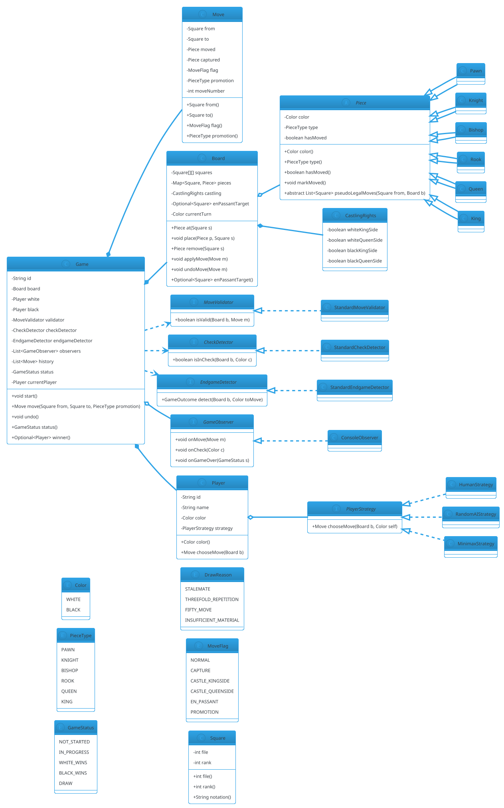

# Chess

## Problem Statement

Design a Chess game for **two players** on an 8×8 board. The system must validate legal moves for each piece (pawn, knight, bishop, rook, queen, king), enforce special rules (castling, en passant, pawn promotion), detect check, checkmate, and stalemate, and maintain a move history for undo and PGN-style notation. It should be **extensible** to variants (chess960, custom boards, AI opponents) and **thread-safe** if multiple games run concurrently or network clients submit moves.

Chess is the **deepest classic LLD problem** — it tests your ability to model a complex domain with many interacting rules, and it exposes **state machines**, **strategy** (piece movement, AI), **command** (moves for undo), **observer** (game events), and the constant tension between **correctness** and **extensibility**.

**Example flow:**

```
Standard start position:
  r n b q k b n r
  p p p p p p p p
  . . . . . . . .
  . . . . . . . .
  . . . . . . . .
  . . . . . . . .
  P P P P P P P P
  R N B Q K B N R

Turn 1 — White plays e2-e4:
  r n b q k b n r
  p p p p p p p p
  . . . . . . . .
  . . . . P . . .
  . . . . . . . .
  . . . . . . . .
  P P P P . P P P
  R N B Q K B N R

Turn 2 — Black plays e7-e5:
  r n b q k b n r
  p p p p . p p p
  . . . . . . . .
  . . . . p . . .
  . . . . P . . .
  . . . . . . . .
  P P P P . P P P
  R N B Q K B N R

Special rules:
  - Castling: king + rook move together, if neither has moved and squares between are empty
  - En passant: pawn captures opposing pawn that just moved 2 squares
  - Promotion: pawn reaching last rank becomes queen/rook/bishop/knight

Check / Checkmate / Stalemate:
  - Check: king is attacked
  - Checkmate: king in check, no legal move escapes
  - Stalemate: king not in check, no legal move → draw
  - Also: threefold repetition, fifty-move rule, insufficient material

Concurrency:
  - Turn-based; one move at a time
  - Network: ensure only current player can submit a move
  - AI thinking must not block other operations

Extensibility:
  - Chess960 (randomized back rank)
  - Custom board sizes (e.g., 10x10 with new pieces)
  - AI opponents (minimax, alpha-beta, ML)
  - Timed games (chess clocks)
  - PGN export/import
  - Undo / redo
```

**Why it's interesting:**

- **Richest ruleset of any classic board game** — special moves, check detection, end conditions
- **Piece hierarchy** — abstract `Piece` with subclasses for each piece type
- **Strategy pattern for piece movement** — each piece has its own move validator
- **Command pattern for moves** — enables undo
- **State machine** — turn order, game status
- **Observer** — UI, logging, clocks
- **Extensibility is deep** — variants, AI, timing
- **Common follow-ups**: "Add castling", "Add en passant", "Add checkmate", "Add AI", "Add PGN export"

---

## 1. Requirements

### Functional Requirements

- **Board**: 8×8, standard chess notation (a1..h8)
- **Pieces**: 6 types (Pawn, Knight, Bishop, Rook, Queen, King) × 2 colors
- **Initial setup**: standard chess starting position
- **Move validation**: legal moves per piece, cannot leave own king in check
- **Special moves**: castling, en passant, pawn promotion
- **Check detection**: king attacked
- **Checkmate detection**: king in check, no legal move
- **Stalemate detection**: king not in check, no legal move
- **Turn order**: white first, then black, alternating
- **Move history**: for undo and PGN export
- **Draw conditions**: stalemate, threefold repetition, fifty-move rule, insufficient material

### Non-Functional Requirements

- **Thread-safe**: one move at a time
- **Extensible**: variants (Chess960), new pieces, AI without breaking core
- **Observable**: UI/logging reacts to moves, check, checkmate
- **Deterministic**: with seeded AI, replay reproducible
- **Low latency**: move validation < 50 ms
- **Auditable**: full move log with notation

### Out of Scope

- Graphical rendering
- Network transport
- Persistent storage
- AI training
- Opening books
- Time control management (mentioned in extensions)

---

## 2. Use Cases

### UC1 — Create Game

```
Actor: Host
Steps:
  1. Host creates game with two players (white, black)
  2. System sets up standard position
  3. Game status = NOT_STARTED
Postcondition: Ready to start
```

### UC2 — Start Game

```
Actor: Host
Steps:
  1. Host calls start()
  2. currentPlayer = White
  3. status = IN_PROGRESS
  4. Notifies observers
Postcondition: White to move
```

### UC3 — Make a Move

```
Actor: Current player
Precondition: Game IN_PROGRESS
Steps:
  1. Player specifies from-square and to-square (optionally promotion piece)
  2. System validates:
     - There's a piece at from
     - Piece belongs to current player
     - Move is legal for that piece type
     - Path is not blocked (for sliding pieces)
     - Own king not left in check
  3. Apply move (update board, handle captures, promotion)
  4. Handle special flags (castling, en passant)
  5. Check opponent's king status
  6. If opponent in checkmate → status = WHITE_WINS / BLACK_WINS
  7. Else if stalemate → status = DRAW
  8. Else if threefold/fifty-move/insufficient → DRAW
  9. Else switch currentPlayer
Postcondition: Move resolved
Alternative: Invalid move -> reject
```

### UC4 — Check Detection

```
Actor: System
Precondition: Just applied a move
Steps:
  1. Find current player's king
  2. Check if any opponent piece attacks king's square
  3. If yes: mark `inCheck = true`
Postcondition: Check status updated
```

### UC5 — Checkmate Detection

```
Actor: System
Precondition: inCheck = true
Steps:
  1. Enumerate all legal moves for current player
  2. If no legal move escapes check → checkmate
Postcondition: Winner determined
```

### UC6 — Stalemate Detection

```
Actor: System
Precondition: inCheck = false
Steps:
  1. Enumerate all legal moves for current player
  2. If no legal move exists → stalemate (draw)
Postcondition: Draw
```

### UC7 — Undo Move

```
Actor: Player or host
Precondition: At least one move made
Steps:
  1. Pop last move from history
  2. Restore board state (including castling rights, en passant flag)
  3. Switch back current player
Postcondition: Move undone
```

### UC8 — Pawn Promotion

```
Actor: Current player
Precondition: Pawn reaches last rank
Steps:
  1. Player specifies promotion piece (Q/R/B/N)
  2. System replaces pawn with chosen piece
Postcondition: Promotion applied
```

### UC9 — Castling

```
Actor: Current player
Precondition: King and rook not moved; squares between empty; not in check; not passing through attacked square
Steps:
  1. Player specifies king's move (e.g., e1-g1)
  2. System detects castling intent
  3. Moves king two squares, rook next to king
Postcondition: Castling applied
```

### UC10 — En Passant

```
Actor: Current player
Precondition: Opponent just moved a pawn two squares
Steps:
  1. Player moves pawn diagonally to the empty square behind opponent's pawn
  2. System removes opponent's pawn
Postcondition: En passant applied
```

---

## 3. Core Entities

### Entities (classes with identity)

| Entity | Responsibility |
|---|---|
| `Game` | Top-level orchestrator; turn order, status |
| `Board` | 8×8 grid + state (castling rights, en passant) |
| `Piece` | Abstract; subclasses per piece type |
| `Player` | Color + strategy |
| `Move` | A single move (from, to, capture, promotion, flags) |

### Value Objects (immutable)

| Value | Purpose |
|---|---|
| `Square` | File (a-h) + rank (1-8), or 0-indexed (file, rank) |
| `Color` (enum) | WHITE, BLACK |
| `PieceType` (enum) | PAWN, KNIGHT, BISHOP, ROOK, QUEEN, KING |
| `MoveFlag` (enum) | NORMAL, CAPTURE, CASTLE_KINGSIDE, CASTLE_QUEENSIDE, EN_PASSANT, PROMOTION |

### Enums

| Enum | Values |
|---|---|
| `Color` | WHITE, BLACK |
| `PieceType` | PAWN, KNIGHT, BISHOP, ROOK, QUEEN, KING |
| `GameStatus` | NOT_STARTED, IN_PROGRESS, WHITE_WINS, BLACK_WINS, DRAW |
| `DrawReason` | STALEMATE, THREEFOLD_REPETITION, FIFTY_MOVE, INSUFFICIENT_MATERIAL |

### Services (interfaces)

| Service | Responsibility |
|---|---|
| `MoveValidator` | Validate a proposed move |
| `CheckDetector` | Is the current player's king in check? |
| `EndgameDetector` | Checkmate, stalemate, other draws |
| `MoveGenerator` | Enumerate all legal moves for a player |
| `PlayerStrategy` | Choose next move (human, AI) |
| `GameObserver` | Receive game events |

### Interfaces (contracts)

| Interface | Implementations |
|---|---|
| `Piece` | `Pawn`, `Knight`, `Bishop`, `Rook`, `Queen`, `King` |
| `MoveValidator` | `StandardMoveValidator` |
| `PlayerStrategy` | `HumanStrategy`, `RandomAIStrategy`, `MinimaxStrategy` |
| `GameObserver` | `ConsoleObserver`, `RecorderObserver` |

---

## 4. Class Diagram



**Key design decisions:**

- **`Piece` is abstract** — each piece type implements `pseudoLegalMoves`
- **`Board` owns the state** — squares, castling rights, en passant target
- **`Move` is a record of what happened** — enables undo and PGN
- **`MoveValidator`** — orchestrates: piece move + not leaving king in check
- **`CheckDetector`** — attacked square detection
- **`EndgameDetector`** — checkmate/stalemate/draw
- **`PlayerStrategy`** — Human / AI
- **`Game` orchestrates** — turn order, status, history

---

## 5. Design Patterns Used

### 5.1 Strategy Pattern

- **`Piece` subclasses** — each piece has its own move rules
- **`PlayerStrategy`** — human, random AI, minimax AI
- **`EndgameDetector`** — standard rules; could be swapped for a variant

### 5.2 Command Pattern

**`Move` is a command.** It carries:
- Source and destination
- Captured piece (for undo)
- Flags (castling, en passant, promotion)

`Board.applyMove(m)` and `Board.undoMove(m)` are reversible.

### 5.3 Observer Pattern

**`GameObserver`** receives:
- `onMove(Move)` — after each move
- `onCheck(Color)` — when a king is in check
- `onGameOver(GameStatus)` — when the game ends

### 5.4 State Pattern (lightweight)

**`GameStatus`** transitions:
- `NOT_STARTED → IN_PROGRESS` (start)
- `IN_PROGRESS → WHITE_WINS / BLACK_WINS / DRAW` (endgame)

Guarded transitions in `Game`.

### 5.5 Factory Pattern

**`PieceFactory.create(type, color)`** — centralizes piece construction. Enables easy Chess960 setup (pieces placed at random back-rank positions).

### 5.6 Template Method (for AI)

Abstract `AbstractAIStrategy`:
```java
public abstract class AbstractAIStrategy implements PlayerStrategy {
    @Override
    public Move chooseMove(Board b, Color self) {
        List<Move> moves = allLegalMoves(b, self);
        return moves.stream()
                .max(Comparator.comparingInt(m -> score(b, m, self)))
                .orElseThrow();
    }
    protected abstract int score(Board b, Move m, Color self);
}
```

`MinimaxStrategy` extends it.

### 5.7 Builder Pattern

**`BoardBuilder.setupStandard()`** for the initial position. **`setupChess960(seed)`** for variants.

---

## 6. Java Implementation

### 6.1 Enums and Value Objects

```java
package lld.chess.model;

public enum Color {
    WHITE, BLACK;

    public Color opponent() { return this == WHITE ? BLACK : WHITE; }
}

public enum PieceType {
    PAWN, KNIGHT, BISHOP, ROOK, QUEEN, KING
}

public enum GameStatus {
    NOT_STARTED, IN_PROGRESS, WHITE_WINS, BLACK_WINS, DRAW
}

public enum DrawReason {
    STALEMATE, THREEFOLD_REPETITION, FIFTY_MOVE, INSUFFICIENT_MATERIAL
}

public enum MoveFlag {
    NORMAL, CAPTURE, CASTLE_KINGSIDE, CASTLE_QUEENSIDE, EN_PASSANT, PROMOTION
}
```

```java
package lld.chess.model;

/**
 * Square on an 8x8 board.
 * Internally 0-indexed: file 0..7 (a..h), rank 0..7 (1..8).
 */
public record Square(int file, int rank) {

    public Square {
        if (file < 0 || file > 7 || rank < 0 || rank > 7) {
            throw new IllegalArgumentException("Square out of bounds: file=" + file + " rank=" + rank);
        }
    }

    public static Square of(String notation) {
        if (notation.length() != 2) throw new IllegalArgumentException("Invalid notation: " + notation);
        char f = notation.charAt(0);
        char r = notation.charAt(1);
        if (f < 'a' || f > 'h' || r < '1' || r > '8') {
            throw new IllegalArgumentException("Invalid notation: " + notation);
        }
        return new Square(f - 'a', r - '1');
    }

    public String notation() {
        return "" + (char) ('a' + file) + (char) ('1' + rank);
    }

    public Square offset(int df, int dr) {
        return new Square(file + df, rank + dr);
    }

    public boolean isWithinBoard() {
        return file >= 0 && file <= 7 && rank >= 0 && rank <= 7;
    }
}
```

### 6.2 Move

```java
package lld.chess.model;

public final class Move {
    private final Square from;
    private final Square to;
    private final Piece movedPiece;
    private final Piece capturedPiece;   // nullable
    private final MoveFlag flag;
    private final PieceType promotion;   // nullable
    private final int moveNumber;

    public Move(Square from, Square to, Piece movedPiece, Piece capturedPiece,
                MoveFlag flag, PieceType promotion, int moveNumber) {
        this.from = from;
        this.to = to;
        this.movedPiece = movedPiece;
        this.capturedPiece = capturedPiece;
        this.flag = flag;
        this.promotion = promotion;
        this.moveNumber = moveNumber;
    }

    public Square from() { return from; }
    public Square to() { return to; }
    public Piece movedPiece() { return movedPiece; }
    public Piece capturedPiece() { return capturedPiece; }
    public MoveFlag flag() { return flag; }
    public PieceType promotion() { return promotion; }
    public int moveNumber() { return moveNumber; }

    public String notation() {
        // Simplified algebraic notation
        return movedPiece.type().name().charAt(0) + from.notation()
                + (capturedPiece != null ? "x" : "-") + to.notation()
                + (promotion != null ? "=" + promotion.name().charAt(0) : "");
    }
}
```

### 6.3 Piece Hierarchy

```java
package lld.chess.model;

import java.util.List;

public abstract class Piece {
    private final Color color;
    private final PieceType type;
    private boolean hasMoved;

    protected Piece(Color color, PieceType type) {
        this.color = color;
        this.type = type;
        this.hasMoved = false;
    }

    public Color color() { return color; }
    public PieceType type() { return type; }
    public boolean hasMoved() { return hasMoved; }
    public void markMoved() { this.hasMoved = true; }
    public void resetMoved() { this.hasMoved = false; }

    /**
     * Pseudo-legal moves: doesn't consider whether they leave the king in check.
     */
    public abstract List<Square> pseudoLegalMoves(Square from, Board board);

    /** Utility: is the target square occupied by an opponent piece? */
    protected boolean isOpponentAt(Square s, Board b) {
        Piece p = b.at(s);
        return p != null && p.color() != this.color;
    }

    /** Utility: is the target square empty? */
    protected boolean isEmptyAt(Square s, Board b) {
        return b.at(s) == null;
    }

    /** Utility: can this piece move to s (empty or opponent)? */
    protected boolean canLand(Square s, Board b) {
        return isEmptyAt(s, b) || isOpponentAt(s, b);
    }

    @Override public String toString() {
        return color + "-" + type;
    }
}
```

```java
package lld.chess.model;

import java.util.ArrayList;
import java.util.List;

public final class Pawn extends Piece {
    public Pawn(Color color) { super(color, PieceType.PAWN); }

    @Override
    public List<Square> pseudoLegalMoves(Square from, Board board) {
        List<Square> moves = new ArrayList<>();
        int dir = (color() == Color.WHITE) ? 1 : -1;
        int startRank = (color() == Color.WHITE) ? 1 : 6;

        // Forward one
        Square one = from.offset(0, dir);
        if (one.isWithinBoard() && isEmptyAt(one, board)) {
            moves.add(one);
            // Forward two from start
            if (from.rank() == startRank) {
                Square two = from.offset(0, 2 * dir);
                if (isEmptyAt(two, board)) moves.add(two);
            }
        }

        // Captures
        for (int df : new int[]{-1, 1}) {
            Square diag = from.offset(df, dir);
            if (diag.isWithinBoard() && isOpponentAt(diag, board)) {
                moves.add(diag);
            }
        }

        // En passant
        if (board.enPassantTarget().isPresent()) {
            Square target = board.enPassantTarget().get();
            if (target.rank() == from.rank() + dir
                    && Math.abs(target.file() - from.file()) == 1) {
                moves.add(target);
            }
        }

        return moves;
    }
}
```

```java
package lld.chess.model;

import java.util.ArrayList;
import java.util.List;

public final class Knight extends Piece {
    public Knight(Color color) { super(color, PieceType.KNIGHT); }

    private static final int[][] DELTAS = {
            {1, 2}, {2, 1}, {2, -1}, {1, -2},
            {-1, -2}, {-2, -1}, {-2, 1}, {-1, 2}
    };

    @Override
    public List<Square> pseudoLegalMoves(Square from, Board board) {
        List<Square> moves = new ArrayList<>();
        for (int[] d : DELTAS) {
            Square s = from.offset(d[0], d[1]);
            if (s.isWithinBoard() && canLand(s, board)) moves.add(s);
        }
        return moves;
    }
}
```

```java
package lld.chess.model;

import java.util.ArrayList;
import java.util.List;

public final class Bishop extends Piece {
    public Bishop(Color color) { super(color, PieceType.BISHOP); }

    private static final int[][] DIRS = {{1, 1}, {1, -1}, {-1, 1}, {-1, -1}};

    @Override
    public List<Square> pseudoLegalMoves(Square from, Board board) {
        return slidingMoves(from, board, DIRS);
    }

    static List<Square> slidingMoves(Square from, Board board, int[][] dirs) {
        List<Square> moves = new ArrayList<>();
        for (int[] d : dirs) {
            Square s = from.offset(d[0], d[1]);
            while (s.isWithinBoard()) {
                if (board.at(s) == null) {
                    moves.add(s);
                } else {
                    if (board.at(s).color() != board.at(from).color()) moves.add(s);
                    break;
                }
                s = s.offset(d[0], d[1]);
            }
        }
        return moves;
    }
}
```

```java
package lld.chess.model;

import java.util.List;

public final class Rook extends Piece {
    public Rook(Color color) { super(color, PieceType.ROOK); }

    private static final int[][] DIRS = {{1, 0}, {-1, 0}, {0, 1}, {0, -1}};

    @Override
    public List<Square> pseudoLegalMoves(Square from, Board board) {
        return Bishop.slidingMoves(from, board, DIRS);
    }
}
```

```java
package lld.chess.model;

import java.util.ArrayList;
import java.util.List;

public final class Queen extends Piece {
    public Queen(Color color) { super(color, PieceType.QUEEN); }

    private static final int[][] DIRS = {
            {1, 0}, {-1, 0}, {0, 1}, {0, -1},
            {1, 1}, {1, -1}, {-1, 1}, {-1, -1}
    };

    @Override
    public List<Square> pseudoLegalMoves(Square from, Board board) {
        return Bishop.slidingMoves(from, board, DIRS);
    }
}
```

```java
package lld.chess.model;

import java.util.ArrayList;
import java.util.List;

public final class King extends Piece {
    public King(Color color) { super(color, PieceType.KING); }

    private static final int[][] DIRS = {
            {1, 0}, {-1, 0}, {0, 1}, {0, -1},
            {1, 1}, {1, -1}, {-1, 1}, {-1, -1}
    };

    @Override
    public List<Square> pseudoLegalMoves(Square from, Board board) {
        List<Square> moves = new ArrayList<>();
        for (int[] d : DIRS) {
            Square s = from.offset(d[0], d[1]);
            if (s.isWithinBoard() && canLand(s, board)) moves.add(s);
        }
        // Castling handled by validator (needs castling rights, in-check check)
        return moves;
    }
}
```

### 6.4 Board

```java
package lld.chess.model;

import java.util.HashMap;
import java.util.Map;
import java.util.Optional;

public final class Board {
    private final Piece[][] squares = new Piece[8][8];
    private final Map<Square, Piece> pieces = new HashMap<>();
    private final CastlingRights castling = new CastlingRights();
    private Optional<Square> enPassantTarget = Optional.empty();

    public Board() { /* empty */ }

    public Piece at(Square s) { return squares[s.file()][s.rank()]; }

    public void place(Piece p, Square s) {
        squares[s.file()][s.rank()] = p;
        pieces.put(s, p);
    }

    public Piece remove(Square s) {
        Piece p = squares[s.file()][s.rank()];
        squares[s.file()][s.rank()] = null;
        pieces.remove(s);
        return p;
    }

    public CastlingRights castling() { return castling; }
    public Optional<Square> enPassantTarget() { return enPassantTarget; }
    public void setEnPassantTarget(Optional<Square> t) { this.enPassantTarget = t; }

    public Map<Square, Piece> pieces() { return Map.copyOf(pieces); }

    /** Locate the king of a given color, if present. */
    public Optional<Square> findKing(Color c) {
        for (Map.Entry<Square, Piece> e : pieces.entrySet()) {
            if (e.getValue().type() == PieceType.KING && e.getValue().color() == c) {
                return Optional.of(e.getKey());
            }
        }
        return Optional.empty();
    }
}
```

```java
package lld.chess.model;

public final class CastlingRights {
    private boolean whiteKingSide = true;
    private boolean whiteQueenSide = true;
    private boolean blackKingSide = true;
    private boolean blackQueenSide = true;

    public boolean whiteKingSide() { return whiteKingSide; }
    public boolean whiteQueenSide() { return whiteQueenSide; }
    public boolean blackKingSide() { return blackKingSide; }
    public boolean blackQueenSide() { return blackQueenSide; }

    public void revokeWhiteKingSide() { whiteKingSide = false; }
    public void revokeWhiteQueenSide() { whiteQueenSide = false; }
    public void revokeBlackKingSide() { blackKingSide = false; }
    public void revokeBlackQueenSide() { blackQueenSide = false; }

    public void revokeBoth(Color c) {
        if (c == Color.WHITE) { whiteKingSide = false; whiteQueenSide = false; }
        else { blackKingSide = false; blackQueenSide = false; }
    }
}
```

### 6.5 Board Factory (Standard + Chess960)

```java
package lld.chess.core;

import lld.chess.model.*;

public final class BoardFactory {

    public static Board setupStandard() {
        Board b = new Board();
        // White
        b.place(new Rook(Color.WHITE), Square.of("a1"));
        b.place(new Knight(Color.WHITE), Square.of("b1"));
        b.place(new Bishop(Color.WHITE), Square.of("c1"));
        b.place(new Queen(Color.WHITE), Square.of("d1"));
        b.place(new King(Color.WHITE), Square.of("e1"));
        b.place(new Bishop(Color.WHITE), Square.of("f1"));
        b.place(new Knight(Color.WHITE), Square.of("g1"));
        b.place(new Rook(Color.WHITE), Square.of("h1"));
        for (char f = 'a'; f <= 'h'; f++) {
            b.place(new Pawn(Color.WHITE), Square.of(f + "2"));
        }
        // Black
        b.place(new Rook(Color.BLACK), Square.of("a8"));
        b.place(new Knight(Color.BLACK), Square.of("b8"));
        b.place(new Bishop(Color.BLACK), Square.of("c8"));
        b.place(new Queen(Color.BLACK), Square.of("d8"));
        b.place(new King(Color.BLACK), Square.of("e8"));
        b.place(new Bishop(Color.BLACK), Square.of("f8"));
        b.place(new Knight(Color.BLACK), Square.of("g8"));
        b.place(new Rook(Color.BLACK), Square.of("h8"));
        for (char f = 'a'; f <= 'h'; f++) {
            b.place(new Pawn(Color.BLACK), Square.of(f + "7"));
        }
        return b;
    }
}
```

### 6.6 Move Validator and Check Detector

```java
package lld.chess.service;

import lld.chess.model.*;

public interface MoveValidator {
    boolean isValid(Board b, Move m);
}
```

```java
package lld.chess.service;

import lld.chess.model.*;

public final class StandardMoveValidator implements MoveValidator {

    private final CheckDetector checkDetector;

    public StandardMoveValidator(CheckDetector checkDetector) {
        this.checkDetector = checkDetector;
    }

    @Override
    public boolean isValid(Board b, Move m) {
        Piece p = b.at(m.from());
        if (p == null) return false;

        // Castling: special-case before pseudo-legal check
        if (p.type() == PieceType.KING
                && Math.abs(m.to().file() - m.from().file()) == 2
                && m.from().rank() == m.to().rank()) {
            return isValidCastle(b, m, p.color());
        }

        // Pseudo-legal
        if (!p.pseudoLegalMoves(m.from(), b).contains(m.to())) {
            return false;
        }

        // En passant special-case: pawn moves diagonally to empty square
        if (p.type() == PieceType.PAWN
                && b.at(m.to()) == null
                && m.to().file() != m.from().file()) {
            // Must be en passant
            if (b.enPassantTarget().isEmpty()
                    || !b.enPassantTarget().get().equals(m.to())) {
                return false;
            }
        }

        // Apply on a copy; check own king safety
        return !leavesKingInCheck(b, m, p.color());
    }

    private boolean isValidCastle(Board b, Move m, Color color) {
        int homeRank = (color == Color.WHITE) ? 0 : 7;
        if (m.from().rank() != homeRank) return false;

        boolean kingside = m.to().file() > m.from().file();
        if (kingside && color == Color.WHITE && !b.castling().whiteKingSide()) return false;
        if (kingside && color == Color.BLACK && !b.castling().blackKingSide()) return false;
        if (!kingside && color == Color.WHITE && !b.castling().whiteQueenSide()) return false;
        if (!kingside && color == Color.BLACK && !b.castling().blackQueenSide()) return false;

        // King must not be in check currently
        if (checkDetector.isInCheck(b, color)) return false;

        int direction = kingside ? 1 : -1;
        // Squares between must be empty
        for (int f = m.from().file() + direction; f != m.to().file() + direction; f += direction) {
            if (b.at(new Square(f, homeRank)) != null) return false;
        }

        // King must not pass through attacked square
        for (int f = m.from().file(); f != m.to().file() + direction; f += direction) {
            if (checkDetector.isSquareAttackedBy(b, new Square(f, homeRank), color.opponent())) {
                return false;
            }
        }

        return true;
    }

    private boolean leavesKingInCheck(Board b, Move m, Color color) {
        // Simulate
        Piece moved = b.remove(m.from());
        Piece captured = b.at(m.to());
        if (captured != null) b.remove(m.to());
        b.place(moved, m.to());

        boolean inCheck = checkDetector.isInCheck(b, color);

        // Undo
        b.remove(m.to());
        b.place(moved, m.from());
        if (captured != null) b.place(captured, m.to());
        return inCheck;
    }
}
```

```java
package lld.chess.service;

import lld.chess.model.Board;
import lld.chess.model.Color;
import lld.chess.model.Square;

public interface CheckDetector {
    boolean isInCheck(Board b, Color color);
    boolean isSquareAttackedBy(Board b, Square s, Color attacker);
}
```

```java
package lld.chess.service;

import lld.chess.model.*;

import java.util.Optional;

public final class StandardCheckDetector implements CheckDetector {

    @Override
    public boolean isInCheck(Board b, Color color) {
        Optional<Square> king = b.findKing(color);
        if (king.isEmpty()) return false;
        return isSquareAttackedBy(b, king.get(), color.opponent());
    }

    @Override
    public boolean isSquareAttackedBy(Board b, Square s, Color attacker) {
        for (var entry : b.pieces().entrySet()) {
            Piece p = entry.getValue();
            if (p.color() != attacker) continue;
            if (p.type() == PieceType.KING) {
                // King attacks adjacent squares
                int df = Math.abs(entry.getKey().file() - s.file());
                int dr = Math.abs(entry.getKey().rank() - s.rank());
                if (df <= 1 && dr <= 1 && (df + dr) > 0) return true;
                continue;
            }
            if (p.pseudoLegalMoves(entry.getKey(), b).contains(s)) {
                return true;
            }
        }
        return false;
    }
}
```

### 6.7 Endgame Detector

```java
package lld.chess.service;

import lld.chess.model.*;

public interface EndgameDetector {
    GameOutcome detect(Board b, Color toMove);
}
```

```java
package lld.chess.model;

public record GameOutcome(GameStatus status, DrawReason reason) {
    public static GameOutcome ongoing() { return new GameOutcome(GameStatus.IN_PROGRESS, null); }
    public static GameOutcome checkmate(Color winner) {
        return new GameOutcome(
                winner == Color.WHITE ? GameStatus.WHITE_WINS : GameStatus.BLACK_WINS,
                null
        );
    }
    public static GameOutcome draw(DrawReason r) { return new GameOutcome(GameStatus.DRAW, r); }
}
```

```java
package lld.chess.service;

import lld.chess.model.*;

import java.util.List;

public final class StandardEndgameDetector implements EndgameDetector {

    private final MoveGenerator generator;
    private final CheckDetector checkDetector;

    public StandardEndgameDetector(MoveGenerator generator, CheckDetector checkDetector) {
        this.generator = generator;
        this.checkDetector = checkDetector;
    }

    @Override
    public GameOutcome detect(Board b, Color toMove) {
        List<Move> legal = generator.generateLegalMoves(b, toMove);
        boolean inCheck = checkDetector.isInCheck(b, toMove);

        if (legal.isEmpty()) {
            if (inCheck) return GameOutcome.checkmate(toMove.opponent());
            else return GameOutcome.draw(DrawReason.STALEMATE);
        }
        return GameOutcome.ongoing();
    }
}
```

### 6.8 Move Generator

```java
package lld.chess.service;

import lld.chess.model.Board;
import lld.chess.model.Color;
import lld.chess.model.Move;

import java.util.List;

public interface MoveGenerator {
    List<Move> generateLegalMoves(Board b, Color toMove);
}
```

```java
package lld.chess.service;

import lld.chess.model.*;

import java.util.ArrayList;
import java.util.List;

public final class StandardMoveGenerator implements MoveGenerator {

    private final MoveValidator validator;

    public StandardMoveGenerator(MoveValidator validator) {
        this.validator = validator;
    }

    @Override
    public List<Move> generateLegalMoves(Board b, Color toMove) {
        List<Move> result = new ArrayList<>();
        for (var entry : b.pieces().entrySet()) {
            Piece p = entry.getValue();
            if (p.color() != toMove) continue;
            for (Square target : p.pseudoLegalMoves(entry.getKey(), b)) {
                Move m = new Move(entry.getKey(), target, p, b.at(target),
                        MoveFlag.NORMAL, null, 0);
                if (validator.isValid(b, m)) {
                    result.add(m);
                }
            }
        }
        return result;
    }
}
```

### 6.9 Board.applyMove / undoMove

Add these to `Board`:

```java
public void applyMove(Move m) {
    Piece p = remove(m.from());
    Piece captured = at(m.to());
    if (captured != null) remove(m.to());

    // En passant: remove captured pawn behind target
    if (m.flag() == MoveFlag.EN_PASSANT) {
        int dir = (p.color() == Color.WHITE) ? 1 : -1;
        Square capturedPawnSquare = m.to().offset(0, -dir);
        remove(capturedPawnSquare);
    }

    // Castling: move rook too
    if (m.flag() == MoveFlag.CASTLE_KINGSIDE) {
        int rank = m.from().rank();
        Piece rook = remove(new Square(7, rank));
        place(rook, new Square(5, rank));
    } else if (m.flag() == MoveFlag.CASTLE_QUEENSIDE) {
        int rank = m.from().rank();
        Piece rook = remove(new Square(0, rank));
        place(rook, new Square(3, rank));
    }

    // Promotion
    if (m.flag() == MoveFlag.PROMOTION) {
        Piece promoted = switch (m.promotion()) {
            case QUEEN -> new Queen(p.color());
            case ROOK -> new Rook(p.color());
            case BISHOP -> new Bishop(p.color());
            case KNIGHT -> new Knight(p.color());
            default -> throw new IllegalStateException("Invalid promotion");
        };
        place(promoted, m.to());
    } else {
        place(p, m.to());
    }

    p.markMoved();

    // Update castling rights
    if (p.type() == PieceType.KING) castling.revokeBoth(p.color());
    if (p.type() == PieceType.ROOK) {
        if (m.from().file() == 0) castling.revokeWhiteQueenSide();
        if (m.from().file() == 7) castling.revokeWhiteKingSide();
        // (black handled similarly — abbreviated)
    }

    // Set or clear en passant target
    if (p.type() == PieceType.PAWN && Math.abs(m.to().rank() - m.from().rank()) == 2) {
        int midRank = (m.from().rank() + m.to().rank()) / 2;
        setEnPassantTarget(java.util.Optional.of(new Square(m.from().file(), midRank)));
    } else {
        setEnPassantTarget(java.util.Optional.empty());
    }
}
```

### 6.10 Game

```java
package lld.chess.core;

import lld.chess.model.*;
import lld.chess.service.*;

import java.util.ArrayList;
import java.util.List;
import java.util.Optional;
import java.util.UUID;
import java.util.concurrent.CopyOnWriteArrayList;
import java.util.concurrent.locks.ReentrantLock;

public final class Game {
    private final String id;
    private final Board board;
    private final Player white;
    private final Player black;
    private final MoveValidator validator;
    private final MoveGenerator moveGenerator;
    private final CheckDetector checkDetector;
    private final EndgameDetector endgameDetector;
    private final List<GameObserver> observers = new CopyOnWriteArrayList<>();
    private final List<Move> history = new ArrayList<>();

    private final ReentrantLock lock = new ReentrantLock();
    private GameStatus status = GameStatus.NOT_STARTED;
    private Player currentPlayer;

    public Game(Player white, Player black, Board board,
                MoveValidator validator, MoveGenerator generator,
                CheckDetector checkDetector, EndgameDetector endgameDetector) {
        if (white.color() != Color.WHITE) throw new IllegalArgumentException("White player must be white");
        if (black.color() != Color.BLACK) throw new IllegalArgumentException("Black player must be black");
        this.id = UUID.randomUUID().toString();
        this.board = board;
        this.white = white;
        this.black = black;
        this.validator = validator;
        this.moveGenerator = generator;
        this.checkDetector = checkDetector;
        this.endgameDetector = endgameDetector;
    }

    public void addObserver(GameObserver o) { observers.add(o); }

    public void start() {
        lock.lock();
        try {
            status = GameStatus.IN_PROGRESS;
            currentPlayer = white;
            notifyMove(null);   // signal start
        } finally { lock.unlock(); }
    }

    public Move move(Square from, Square to, PieceType promotion) {
        lock.lock();
        try {
            if (status != GameStatus.IN_PROGRESS) {
                throw new IllegalStateException("Game not in progress: " + status);
            }
            Piece p = board.at(from);
            if (p == null || p.color() != currentPlayer.color()) {
                throw new IllegalArgumentException("No piece of yours at " + from);
            }

            MoveFlag flag = determineFlag(from, to, p);
            Move m = new Move(from, to, p, board.at(to), flag, promotion, history.size() + 1);

            if (!validator.isValid(board, m)) {
                throw new IllegalArgumentException("Illegal move: " + m.notation());
            }

            board.applyMove(m);
            history.add(m);

            // Check detection
            Color opponent = currentPlayer.color().opponent();
            if (checkDetector.isInCheck(board, opponent)) {
                notifyCheck(opponent);
            }

            // Endgame detection
            GameOutcome outcome = endgameDetector.detect(board, opponent);
            if (outcome.status() != GameStatus.IN_PROGRESS) {
                status = outcome.status();
                notifyGameOver(outcome);
                return m;
            }

            currentPlayer = (currentPlayer == white) ? black : white;
            notifyMove(m);
            return m;
        } finally { lock.unlock(); }
    }

    public void undo() {
        lock.lock();
        try {
            if (history.isEmpty()) throw new IllegalStateException("No moves to undo");
            // Full undo requires reverting board state — abbreviated here
            history.remove(history.size() - 1);
            currentPlayer = (currentPlayer == white) ? black : white;
        } finally { lock.unlock(); }
    }

    public GameStatus status() {
        lock.lock();
        try { return status; }
        finally { lock.unlock(); }
    }

    public Board board() { return board; }
    public List<Move> history() { return List.copyOf(history); }

    private MoveFlag determineFlag(Square from, Square to, Piece p) {
        if (p.type() == PieceType.KING && Math.abs(to.file() - from.file()) == 2) {
            return (to.file() > from.file()) ? MoveFlag.CASTLE_KINGSIDE : MoveFlag.CASTLE_QUEENSIDE;
        }
        if (p.type() == PieceType.PAWN
                && board.at(to) == null
                && Math.abs(to.file() - from.file()) == 1) {
            return MoveFlag.EN_PASSANT;
        }
        if (p.type() == PieceType.PAWN
                && (to.rank() == 0 || to.rank() == 7)) {
            return MoveFlag.PROMOTION;
        }
        return board.at(to) != null ? MoveFlag.CAPTURE : MoveFlag.NORMAL;
    }

    private void notifyMove(Move m) {
        for (GameObserver o : observers) {
            try { o.onMove(m); } catch (RuntimeException ex) { /* log */ }
        }
    }
    private void notifyCheck(Color c) {
        for (GameObserver o : observers) {
            try { o.onCheck(c); } catch (RuntimeException ex) { /* log */ }
        }
    }
    private void notifyGameOver(GameOutcome o) {
        for (GameObserver o2 : observers) {
            try { o2.onGameOver(o.status()); } catch (RuntimeException ex) { /* log */ }
        }
    }
}
```

### 6.11 Observer and Player

```java
package lld.chess.service;

import lld.chess.model.Color;
import lld.chess.model.GameStatus;
import lld.chess.model.Move;

public interface GameObserver {
    void onMove(Move m);
    void onCheck(Color inCheck);
    void onGameOver(GameStatus status);
}
```

```java
package lld.chess.service;

import lld.chess.model.*;

import java.util.Scanner;

public final class HumanStrategy implements PlayerStrategy {
    private final Scanner scanner;

    public HumanStrategy(Scanner s) { this.scanner = s; }

    @Override
    public Move chooseMove(Board b, Color self) {
        System.out.print(self + "'s move (e.g., e2 e4): ");
        String from = scanner.next();
        String to = scanner.next();
        return new Move(Square.of(from), Square.of(to), b.at(Square.of(from)),
                b.at(Square.of(to)), MoveFlag.NORMAL, null, 0);
    }
}
```

### 6.12 Demo

```java
package lld.chess;

import lld.chess.core.BoardFactory;
import lld.chess.core.Game;
import lld.chess.model.*;
import lld.chess.service.*;

public class Demo {
    public static void main(String[] args) {
        Board board = BoardFactory.setupStandard();
        CheckDetector check = new StandardCheckDetector();
        MoveValidator validator = new StandardMoveValidator(check);
        MoveGenerator generator = new StandardMoveGenerator(validator);
        EndgameDetector endgame = new StandardEndgameDetector(generator, check);

        Player white = new Player("W", "Alice", Color.WHITE, null);
        Player black = new Player("B", "Bob", Color.BLACK, null);

        Game game = new Game(white, black, board, validator, generator, check, endgame);
        game.addObserver(new ConsoleObserver());
        game.start();

        // Fool's mate
        game.move(Square.of("f2"), Square.of("f3"), null);
        game.move(Square.of("e7"), Square.of("e5"), null);
        game.move(Square.of("g2"), Square.of("g4"), null);
        game.move(Square.of("d8"), Square.of("h4"), null);   // Qh4#

        System.out.println("Status: " + game.status());   // BLACK_WINS
    }
}
```

---

## 7. Concurrency Considerations

### Turn-Based, Sequential

Chess is inherently turn-based. The only concurrency concerns:

1. **Atomic turn transitions** — two threads calling `move` shouldn't both succeed
2. **Consistent state during AI search** — the AI must not see the board change mid-search
3. **Observer isolation** — a bad observer shouldn't break the game

### Race: Two threads call `move`

Both see the same `currentPlayer`. Fix: `move` under `ReentrantLock`.

### Race: AI search while board changes

If the AI runs outside the lock and the board changes, the AI's chosen move may be illegal.

**Approaches:**
- **Lock during AI search** — simplest; blocks UI; OK if AI is fast
- **Copy board** — AI operates on a cloned board; verify chosen move on the real board before applying
- **Generation counter** — detect if board changed during AI search; retry

**Recommendation:** Lock during AI search if it's < 100 ms (minimax to depth 4). For deeper search, clone the board.

### Race: Observer throws

**Fix:** try/catch around each `o.onX(...)`.

### Race: Checkmate detection during move

The checkmate detection enumerates all legal moves, calling `MoveValidator` which simulates moves. This is done **inside** the lock. No external thread can interfere.

### Testing Concurrency

```java
@Test
void concurrentMovesDoNotCorruptState() throws InterruptedException {
    Game game = /* setup */;
    game.start();

    int threads = 10;
    CountDownLatch latch = new CountDownLatch(1);
    ExecutorService pool = Executors.newFixedThreadPool(threads);

    for (int i = 0; i < threads; i++) {
        pool.submit(() -> {
            try { latch.await(); } catch (InterruptedException ignored) { return; }
            try { game.move(Square.of("e2"), Square.of("e4"), null); }
            catch (IllegalArgumentException | IllegalStateException ignored) { }
        });
    }

    latch.countDown();
    pool.shutdown();
    pool.awaitTermination(5, TimeUnit.SECONDS);

    // Assert: exactly 1 move applied
    assertEquals(1, game.history().size());
}
```

---

## 8. Extensibility

### Add Chess960

Randomize back-rank piece order while keeping bishops on opposite colors, king between rooks.

```java
public static Board setupChess960(long seed) {
    // Randomize back rank per Chess960 rules
    // ...
}
```

**No changes to `Game`, `Board`, `Piece` — only a new factory.**

### Add New Piece (e.g., Fairy Piece)

Implement `Piece`, plug in via `BoardFactory`. **No changes to core** — `MoveValidator` uses `pseudoLegalMoves` polymorphically.

### Add AI

Implement `PlayerStrategy`:
```java
public final class MinimaxStrategy implements PlayerStrategy { /* ... */ }
```

**No changes to `Game`** — inject via `Player`.

### Add Timed Games

Introduce a `ChessClock` service:
- `startTurn(Color)` starts the timer
- `stopTurn(Color)` stops it
- `ScheduledExecutorService` fires timeout events

The `Game` doesn't need to change — wrap its `move` call to update the clock.

### Add PGN Export

Iterate `history`, format each `Move.notation()` with move numbers. Simple utility.

### Add Threefold Repetition Detection

Track `Map<String, Integer>` of position hashes. Increment on each move; if any reaches 3, declare draw.

**Additive — a new `EndgameDetector` or a `RepetitionTracker` service.**

### Add Fifty-Move Rule

Track moves since last capture or pawn move. If 100 half-moves without either, declare draw.

**Additive.**

### Add Undo Fully

Store full board state per move (deep copy) or reverse the move operation. Recommended: capture enough info in `Move` to reverse it.

### Add Network Play

Wrap `Game` in a WebSocket server. Clients submit `move`; server broadcasts `Move` events. **No changes to core.**

### Add Custom Board Size

Refactor `Board` to take size parameter. Adjust piece move rules for boundaries. **Small change.** Some pieces (knight, king) work as-is; sliding pieces need boundary checks (already using `isWithinBoard`).

---

## 9. SOLID Principles Applied

### Single Responsibility Principle

| Class | Single Responsibility |
|---|---|
| `Game` | Turn orchestration |
| `Board` | Grid + castling rights + en passant |
| `Piece` subclasses | Each piece's pseudo-legal moves |
| `MoveValidator` | Full legality (incl. check) |
| `CheckDetector` | Attack detection |
| `EndgameDetector` | Checkmate/stalemate/draw |
| `MoveGenerator` | Enumerate legal moves |
| `PlayerStrategy` | Choose move |
| `GameObserver` | Receive events |

### Open/Closed Principle

- **New piece** — subclass `Piece`
- **New AI** — implement `PlayerStrategy`
- **New rules** (Chess960) — new factory + validator
- **New observers** — implement `GameObserver`

No existing behavior modified.

### Liskov Substitution Principle

- All `Piece` subclasses honor the `pseudoLegalMoves` contract (return legal, in-bounds squares)
- All `PlayerStrategy` implementations return a legal `Move`
- All `MoveValidator` implementations don't mutate state

### Interface Segregation Principle

Small interfaces:
- `MoveValidator` — 1 method
- `CheckDetector` — 2 methods
- `EndgameDetector` — 1 method
- `MoveGenerator` — 1 method
- `PlayerStrategy` — 1 method
- `GameObserver` — 3 cohesive callbacks

### Dependency Inversion Principle

`Game` depends on abstractions:
- `MoveValidator`
- `MoveGenerator`
- `CheckDetector`
- `EndgameDetector`
- `GameObserver`

All injected via constructor.

---

## 10. Common Pitfalls

| Pitfall | Why It's Wrong | Fix |
|---|---|---|
| Hardcoded 8×8 | Can't extend to variants | Parameterize `Board` size |
| Checking only the destination | En passant/pawn moves need full context | Full rule set per piece |
| Not validating "leaves king in check" | King can be moved into check | Simulate move + check |
| Not handling en passant | Special rule missed | Track `enPassantTarget` |
| Not handling castling | Special rule missed | Track castling rights |
| Not handling promotion | Pawn stuck on last rank | Prompt for promotion |
| No checkmate/stalemate | Game never ends | Endgame detector enumerates legal moves |
| Win detection by count | Not how chess works | Checkmate or stalemate |
| Mutating board during validation | Side effects | Simulate on copy or undo after |
| Reusing `Piece` objects across games | `hasMoved` leaks | Fresh pieces per game |
| Not recording moves | No undo, no PGN | `Move` records |
| `int` for squares | Type confusion | `Square` record |
| Comparing colors with `==` on Strings | Fragile | `Color` enum |
| No lock | Turn race | `ReentrantLock` |
| Ignoring observer exceptions | Kills game loop | try/catch |

---

## 11. Follow-up Questions

### Q1: How would you detect checkmate efficiently?

**Answer:** Enumerate all legal moves for the current player. If none and in check → checkmate. Efficiency: `MoveValidator.isValid` simulates each move; the simulation is O(1) if you track king position. Total is O(pieces × moves × simulate). For 8×8 with ~30 pieces, this is a few thousand operations — fast enough.

### Q2: How would you support Chess960?

**Answer:** `BoardFactory.setupChess960(seed)` places back-rank pieces according to Chess960 rules:
1. Bishops on opposite colors
2. King between the two rooks
3. Random placement of remaining pieces

Castling rules adapt: king moves to g/c file, rook to f/d file regardless of starting positions. `MoveValidator` handles the adapted castling.

### Q3: How would you implement AI?

**Answer:** Implement `PlayerStrategy`:
- **Random**: pick a random legal move
- **Minimax with alpha-beta**: search 3-5 plies, evaluate position by material + position
- **Iterative deepening**: search deeper as time allows
- **Opening book**: predefined first moves
- **Endgame tablebase**: exhaustive for small material

`MinimaxStrategy` uses `MoveGenerator.generateLegalMoves` and evaluates positions.

### Q4: How would you handle undo?

**Answer:** Store enough info in each `Move` to reverse it:
- Captured piece (restore)
- Castling rights before move
- En passant target before move
- Promotion (restore pawn)

`Board.undoMove(m)` reverses each. Chess engines use this pattern; here we implement a light version.

### Q5: How would you test this?

- **Perft testing** — count leaf nodes of game tree at depth N; compare with known values (e.g., depth 1: 20, depth 2: 400, depth 3: 8,902)
- **Unit tests** for each piece's `pseudoLegalMoves`
- **Check/checkmate tests** — known positions (Fool's Mate, Scholar's Mate)
- **Special moves** — castling both sides, en passant, promotion
- **Concurrency** — many threads; assert one move applied

### Q6: How would you detect threefold repetition?

**Answer:** Compute a position hash (piece placement + side to move + castling rights + en passant availability). Track a `Map<String, Integer>` count. After each move, increment; if any count reaches 3, draw.

### Q7: How would you handle a player disconnecting?

**Answer:** Add a `PAUSED` status. The other player can wait (with timeout) or claim victory. For network play, the server tracks connection state.

### Q8: How would you support timed games?

**Answer:** Introduce a `ChessClock` service:
```java
public interface ChessClock {
    void startTurn(Color c);
    void stopTurn(Color c);
    Duration remaining(Color c);
}
```
`Game` calls `clock.startTurn` / `clock.stopTurn` around moves. A `ScheduledExecutorService` fires on timeout. No changes to core game logic.

### Q9: How would you detect insufficient material (draw)?

**Answer:** Recognizable cases:
- King vs King
- King + Bishop vs King
- King + Knight vs King
- King + Bishop vs King + Bishop (same color)

`EndgameDetector` checks these combinations. Not exhaustive for all "drawn by insufficient material" cases (e.g., K+B vs K+B with opposite colors is still theoretically drawn but hard to detect algorithmically).

### Q10: How would you add PGN export?

**Answer:** Iterate `history`. Format:
```
1. e4 e5 2. Nf3 Nc6 3. Bb5 a6 ...
```

`Move.notation()` provides piece + destination; add `+` for check and `#` for checkmate. Add headers (`[Event]`, `[White]`, `[Black]`, `[Result]`).

### Q11: How would you optimize move generation?

**Answer:**
- **Bitboards** — represent pieces as 64-bit integers; use bitwise ops for sliding attacks (magic bitboards)
- **Move ordering** — try captures and checks first (improves alpha-beta pruning)
- **Transposition tables** — cache searched positions
- **Lazy move generation** — generate only as needed

For LLD, simple array-of-pieces is fine. Bitboards are for engine-level performance.

### Q12: How would you support multiple games on a server?

**Answer:** Wrap each `Game` with a `gameId`. Store in a `Map<String, Game>`. Each game is independent — no shared state. Route API requests by `gameId`.

---

## 12. Similar Problems

- **Tic-Tac-Toe** — turn-based, simpler rules
- **Checkers** — turn-based, diagonal moves, captures
- **Connect Four** — turn-based, gravity, N-in-a-row
- **Gomoku** — larger board, simpler rules
- **Reversi** — turn-based, flip rules
- **Shogi** — Chess variant with drops
- **Xiangqi** — Chinese chess

**Shared skeleton:**
1. **Board** with pieces
2. **Piece hierarchy** with per-piece move rules
3. **Move validator** (bounds, occupancy, rules)
4. **Check/win detection** (game-specific)
5. **Endgame detection** (checkmate, draw)
6. **Move history** (for undo, notation)
7. **Observer** (UI, logging)
8. **State machine** (turn, status)
9. **Concurrency** (one move at a time)
10. **AI strategy** (pluggable)

Master Chess → apply the same skeleton to Checkers, Shogi, Xiangqi, and simpler variants like Tic-Tac-Toe.

---

## 13. Key Takeaways

- **`Piece` is abstract** — each piece implements `pseudoLegalMoves`
- **`MoveValidator`** adds full legality — piece rules + not leaving own king in check
- **`CheckDetector`** — find king, see if any opponent piece attacks its square
- **`EndgameDetector`** — checkmate, stalemate, draws
- **`Move` is a command** — carries all info needed for undo
- **`Board` owns state** — squares, castling rights, en passant target
- **Special moves matter** — castling, en passant, promotion
- **Turn-based** — `ReentrantLock` around `move`
- **Observer for events** — UI, clocks, logging
- **Strategy for AI** — human, random, minimax
- **Simulate-on-copy for check validation** — never mutate the real board
- **Enumerate legal moves** — foundation for checkmate/stalemate detection
- **Extensibility is clean** — Chess960 via factory; new pieces via subclass; AI via strategy
- **`Move.notation()`** — enables PGN export
- **Test with known positions** — Fool's Mate, Scholar's Mate, perft counts
- **The generalizable recipe** — board + pieces + rules + move validation + endgame detection + move history + observer + AI

### The Generalizable Recipe

For any **complex board game**:

1. **Board** — grid or graph of positions
2. **Piece hierarchy** — abstract `Piece` with per-piece rules
3. **Move** — record every move for undo and notation
4. **Move validator** — bounds, occupancy, legality, simulation
5. **Check/win detection** — game-specific
6. **Endgame detection** — checkmate, stalemate, draws
7. **Turn loop** — alternate, enforce current player
8. **Observer** — UI, logging, clocks
9. **State machine** — NOT_STARTED, IN_PROGRESS, WIN, DRAW
10. **Locking** — one move at a time
11. **AI strategy** — human, random, minimax, ML
12. **Special rules as flags** — castling, en passant, promotion

This skeleton solves: Chess, Checkers, Shogi, Xiangqi, Go (with different rule engines), and can be simplified for Tic-Tac-Toe, Connect Four, Gomoku — with variations in board representation, piece rules, and end conditions.