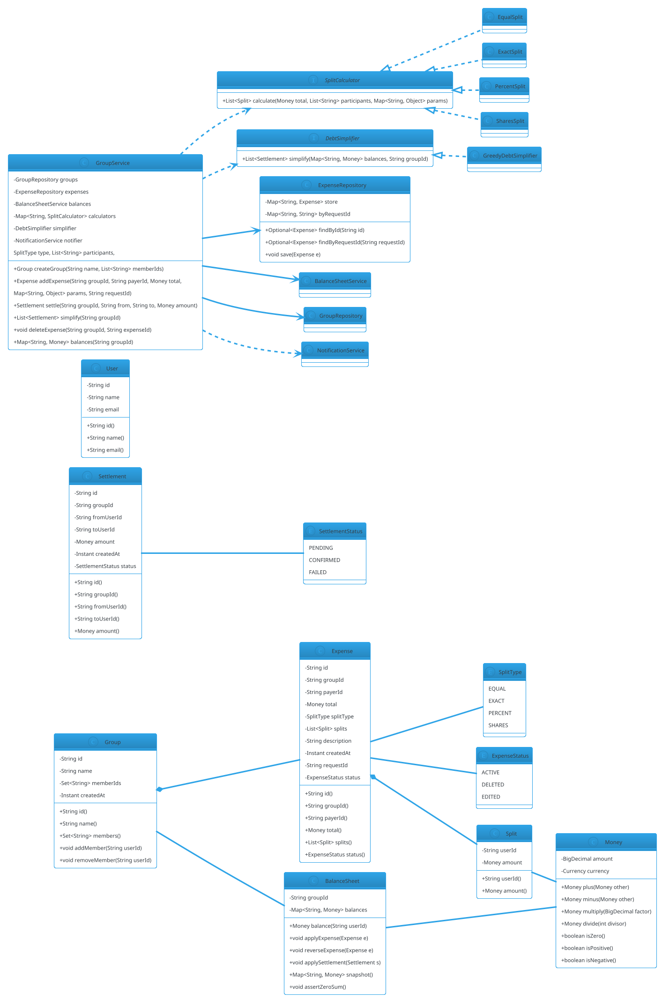

# Splitwise

## Problem Statement

Design a **shared-expense splitting system** like Splitwise. Groups of people record expenses they pay for, and the system tracks who owes whom. It supports equal splits, exact amounts, percentages, and weighted shares. Users can settle up, view balances, and simplify debts (minimize number of transactions). The system must be **extensible** (new split types, multiple currencies, group types), **consistent** (no money lost or created), and **idempotent** (retries don't double-charge).

Unlike most LLD problems, Splitwise's core challenge is **correct arithmetic across many users and splits**, plus **graph simplification of debts**. It's a great exercise in **invariants**, **strategy pattern for split types**, **graph algorithms** for settlement, and **idempotency** for network retries.

**Example flow:**

```
Group: "Goa Trip" with Alice, Bob, Carol, Dave

Expense 1: Alice pays $120 for dinner (split equally)
  → Each owes $30
  → Balances: Bob → Alice $30, Carol → Alice $30, Dave → Alice $30

Expense 2: Bob pays $80 for cab (split equally)
  → Each owes $20
  → Balances updated:
     Carol → Alice $30, Dave → Alice $30,
     Alice → Bob $20, Carol → Bob $20, Dave → Bob $20

Expense 3: Carol pays $200 for hotel (split by exact: Alice $80, Bob $60, Carol $40, Dave $20)
  → Balances updated:
     Alice → Carol $80 - (already owed?), etc.

Simplify:
  Net balances (from Alice's perspective):
     Alice: +120 - 20 - 80 = +20 (net positive: owed to her)
     Bob:   +80 - 30 - 60 = -10
     Carol: +200 - 30 - 20 - 40 = +110
     Dave:  -30 - 20 - 20 = -70

  Settlement (minimal transactions):
     Dave → Carol $70
     Bob → Alice $10
     Carol → Alice $10   (or similar)

Concurrency:
  - Two users add expenses to the same group simultaneously
  - One user settles while another adds an expense
  - Idempotency: retry a POST /expense with the same request ID

Extensibility:
  - New split types (custom formulas, weighted by income)
  - Multi-currency expenses with FX rates
  - Recurring expenses (rent, subscriptions)
  - Group types (flat, hierarchical, temporary)
  - Receipts / photos attached to expenses
  - Approval workflows
```

**Why it's interesting:**

- **Money arithmetic must be exact** — no rounding errors; splits must sum to total
- **Graph of debts** — simplify to minimize transactions (NP-hard in general, greedy works well)
- **Strategy pattern for splits** — equal, exact, percentage, shares
- **Idempotency** — network retries must not double-apply
- **Consistency invariant** — sum of all balances is always zero
- **Extensibility** — new split types, currencies, group types
- **Common follow-ups**: "Add currency conversion", "Simplify debts", "Recurring expenses", "Handle partial settlements"

---

## 1. Requirements

### Functional Requirements

- **Users**: register with name, email
- **Groups**: create groups (trip, flat, office); add/remove members
- **Expenses**: record an expense with:
  - Payer (who paid)
  - Total amount
  - Participants (who shares it)
  - Split type (equal, exact, percentage, shares)
- **Balances**: view net balance per user per group
- **Settle up**: record a payment between two users
- **Simplify debts**: minimize number of transactions to settle all debts
- **Expense history**: chronological list with details
- **Delete / edit expenses**: with audit trail

### Non-Functional Requirements

- **Exact money arithmetic** — no floating-point; splits sum to total
- **Consistency invariant** — sum of all net balances in a group is always zero
- **Thread-safe**: concurrent expense additions and settlements
- **Idempotent**: retrying an expense addition with the same request ID does not duplicate
- **Extensible**: new split types, currencies, group types without breaking core
- **Observable**: notifications on new expense, settlement
- **Auditable**: full history of expenses and settlements per group
- **Low latency**: < 100 ms per operation

### Out of Scope

- Payment gateway integration
- User authentication / password management
- Mobile/web UI
- Push notifications
- Receipt OCR
- Multi-currency with live FX (mentioned in extensions)
- Tax / tip calculations
- Recurring expenses (mentioned in extensions)

---

## 2. Use Cases

### UC1 — Register User

```
Actor: User
Steps:
  1. User submits name + email
  2. System creates User with unique ID
Postcondition: User registered
```

### UC2 — Create Group

```
Actor: User
Steps:
  1. User creates group with name + initial members
  2. System creates Group; adds members
Postcondition: Group ready
```

### UC3 — Add Expense (Equal Split)

```
Actor: Member
Precondition: Group exists; payer + participants are members
Steps:
  1. Member submits expense:
     - Payer: Alice
     - Amount: $120
     - Participants: [Alice, Bob, Carol, Dave]
     - Split type: EQUAL
  2. System computes each share = $30
  3. System records expense
  4. Balances updated:
     - Bob → Alice $30
     - Carol → Alice $30
     - Dave → Alice $30
     - Alice → Alice $0 (implicit)
Postcondition: Expense recorded; balances updated
Alternative: Amount not divisible → distribute remainder (e.g., first participant gets extra cent)
```

### UC4 — Add Expense (Exact Split)

```
Actor: Member
Steps:
  1. Member submits expense with per-participant amounts:
     - Carol paid $200
     - Alice: $80, Bob: $60, Carol: $40, Dave: $20
  2. System validates sum == total
  3. System records expense
Postcondition: Expense recorded
Alternative: Sum != total → reject
```

### UC5 — Add Expense (Percentage Split)

```
Actor: Member
Steps:
  1. Member submits percentages: Alice 40%, Bob 30%, Carol 20%, Dave 10%
  2. System validates sum == 100%
  3. System computes amounts: 40%, 30%, 20%, 10% of total
  4. System records expense
Postcondition: Expense recorded
```

### UC6 — Add Expense (Shares Split)

```
Actor: Member
Steps:
  1. Member submits shares: Alice 2, Bob 1, Carol 1
  2. System computes weighted split:
     - Alice gets 2/4 of total
     - Bob gets 1/4
     - Carol gets 1/4
Postcondition: Expense recorded
```

### UC7 — View Balances

```
Actor: Member
Steps:
  1. Member requests balances for a group
  2. System returns net balance per member:
     - Positive → others owe them
     - Negative → they owe others
Postcondition: Balances displayed
```

### UC8 — Settle Up

```
Actor: Member
Precondition: Member owes someone (or is owed)
Steps:
  1. Member records a payment:
     - From: Dave
     - To: Alice
     - Amount: $50
  2. System applies payment to reduce Dave's debt
  3. Balances updated
Postcondition: Settlement recorded
```

### UC9 — Simplify Debts

```
Actor: Member
Steps:
  1. Member requests simplified debts for a group
  2. System computes net balances per member
  3. System applies greedy algorithm to minimize transactions
  4. Returns: list of payments that settle all debts
Postcondition: Minimal transaction list returned
```

### UC10 — Edit / Delete Expense

```
Actor: Member
Precondition: Expense exists; user has permission
Steps:
  1. Member submits edit or delete request
  2. System reverses previous effect on balances
  3. System applies new effect (or none if deleted)
  4. Audits change
Postcondition: Expense updated; balances consistent
```

### UC11 — Idempotent Add Expense

```
Actor: Member
Precondition: Prior request may have timed out
Steps:
  1. Member resubmits with same `requestId`
  2. System detects duplicate request ID; returns previous result
Postcondition: No duplicate expense
```

---

## 3. Core Entities

### Entities (classes with identity)

| Entity | Responsibility |
|---|---|
| `User` | A person |
| `Group` | A collection of members with balances |
| `Expense` | One expense event (payer, total, participants) |
| `Split` | The allocation of an expense to participants |
| `Settlement` | A payment between two users |
| `BalanceSheet` | Tracks net balances per user per group |

### Value Objects (immutable)

| Value | Purpose |
|---|---|
| `Money` | BigDecimal + currency (exact arithmetic) |
| `UserId`, `GroupId`, `ExpenseId` | Typed wrappers |
| `RequestId` | Typed wrapper for idempotency |
| `SplitShare` | (userId, amount) pair for one participant |

### Enums

| Enum | Values |
|---|---|
| `SplitType` | EQUAL, EXACT, PERCENT, SHARES |
| `ExpenseStatus` | ACTIVE, DELETED, EDITED |
| `SettlementStatus` | PENDING, CONFIRMED, FAILED |

### Services (interfaces)

| Service | Responsibility |
|---|---|
| `SplitCalculator` | Compute each participant's share |
| `BalanceSheetService` | Update balances on expense/settlement |
| `DebtSimplifier` | Compute minimal transactions |
| `ExpenseRepository` | Persist expenses |
| `SettlementRepository` | Persist settlements |
| `GroupRepository` | Persist groups |
| `NotificationService` | Notify members |

### Interfaces (contracts)

| Interface | Implementations |
|---|---|
| `SplitCalculator` | `EqualSplit`, `ExactSplit`, `PercentSplit`, `SharesSplit` |
| `DebtSimplifier` | `GreedyDebtSimplifier`, `OptimalDebtSimplifier` |
| `NotificationService` | `EmailNotifier`, `NoopNotifier` |

### Relationship Summary

```
User          *---  Group              (0..*)   memberships
Group         *---  Expense            (0..*)
Group         *---  Settlement         (0..*)
Group         *---  BalanceSheet       (1)
Expense       *---  Split              (1..*)
Split         ---   User               (1)
Settlement    ---   User (from)        (1)
Settlement    ---   User (to)          (1)
```

---

## 4. Class Diagram



**Key design decisions:**

- **`Money` is `BigDecimal`-based** — exact arithmetic
- **`Split`** captures one participant's share
- **`Expense`** holds all splits and metadata
- **`BalanceSheet`** tracks net balances per user (positive = owed to them)
- **`SplitCalculator`** strategy per split type
- **`DebtSimplifier`** computes minimal transactions
- **`ExpenseRepository`** supports idempotency via request ID

---

## 5. Design Patterns Used

### 5.1 Strategy Pattern

- **`SplitCalculator`** — EQUAL, EXACT, PERCENT, SHARES
- **`DebtSimplifier`** — greedy, optimal (NP-hard)

### 5.2 Repository Pattern

- **`ExpenseRepository`, `SettlementRepository`, `GroupRepository`** — abstract persistence

### 5.3 Observer Pattern

- **`NotificationService`** — notify on new expense, settlement

### 5.4 Command Pattern (Optional)

- **`Expense`** as a command — apply/reverse for edit/delete

### 5.5 Facade Pattern

- **`GroupService`** — orchestrates group operations

### 5.6 Value Object Pattern

- **`Money`** — immutable, with algebraic operations

### 5.7 Idempotency Key Pattern

- **`requestId`** on each mutation; repository deduplicates

---

## 6. Java Implementation

### 6.1 Money

```java
package lld.splitwise.model;

import java.math.BigDecimal;
import java.math.RoundingMode;
import java.util.Currency;

public record Money(BigDecimal amount, Currency currency) {

    public Money {
        if (amount == null) throw new IllegalArgumentException("Amount required");
        if (currency == null) currency = Currency.getInstance("USD");
    }

    public static Money usd(double amount) {
        return new Money(BigDecimal.valueOf(amount).setScale(2, RoundingMode.HALF_UP),
                Currency.getInstance("USD"));
    }

    public static Money zero(Currency c) { return new Money(BigDecimal.ZERO, c); }

    public Money plus(Money other) { check(other); return new Money(amount.add(other.amount), currency); }
    public Money minus(Money other) { check(other); return new Money(amount.subtract(other.amount), currency); }
    public Money multiply(BigDecimal factor) { return new Money(amount.multiply(factor).setScale(2, RoundingMode.HALF_UP), currency); }
    public Money divide(int divisor) { return new Money(amount.divide(BigDecimal.valueOf(divisor), 2, RoundingMode.HALF_UP), currency); }
    public Money negate() { return new Money(amount.negate(), currency); }

    public boolean isZero() { return amount.signum() == 0; }
    public boolean isPositive() { return amount.signum() > 0; }
    public boolean isNegative() { return amount.signum() < 0; }

    private void check(Money other) {
        if (!currency.equals(other.currency)) throw new IllegalArgumentException("Currency mismatch");
    }
}
```

### 6.2 User and Group

```java
package lld.splitwise.model;

public record User(String id, String name, String email) {}
```

```java
package lld.splitwise.model;

import java.time.Instant;
import java.util.Collections;
import java.util.HashSet;
import java.util.Set;

public final class Group {
    private final String id;
    private final String name;
    private final Set<String> memberIds;
    private final Instant createdAt;

    public Group(String id, String name, Set<String> memberIds) {
        if (memberIds.size() < 2) throw new IllegalArgumentException("Group needs >= 2 members");
        this.id = id;
        this.name = name;
        this.memberIds = new HashSet<>(memberIds);
        this.createdAt = Instant.now();
    }

    public String id() { return id; }
    public String name() { return name; }
    public Set<String> members() { return Collections.unmodifiableSet(memberIds); }
    public Instant createdAt() { return createdAt; }

    public synchronized void addMember(String userId) { memberIds.add(userId); }
    public synchronized void removeMember(String userId) {
        if (memberIds.size() <= 2) throw new IllegalStateException("Group needs >= 2 members");
        memberIds.remove(userId);
    }
}
```

### 6.3 Split and Expense

```java
package lld.splitwise.model;

public record Split(String userId, Money amount) {}
```

```java
package lld.splitwise.model;

import java.time.Instant;
import java.util.List;

public final class Expense {
    private final String id;
    private final String groupId;
    private final String payerId;
    private final Money total;
    private final SplitType splitType;
    private final List<Split> splits;
    private final String description;
    private final Instant createdAt;
    private final String requestId;
    private ExpenseStatus status;

    public Expense(String id, String groupId, String payerId, Money total,
                   SplitType splitType, List<Split> splits, String description,
                   String requestId) {
        this.id = id;
        this.groupId = groupId;
        this.payerId = payerId;
        this.total = total;
        this.splitType = splitType;
        this.splits = List.copyOf(splits);
        this.description = description;
        this.createdAt = Instant.now();
        this.requestId = requestId;
        this.status = ExpenseStatus.ACTIVE;

        // Validate: splits sum to total
        Money sum = Money.zero(total.currency());
        for (Split s : splits) sum = sum.plus(s.amount());
        if (sum.amount().compareTo(total.amount()) != 0) {
            throw new IllegalArgumentException("Splits sum " + sum.amount() + " != total " + total.amount());
        }
    }

    public String id() { return id; }
    public String groupId() { return groupId; }
    public String payerId() { return payerId; }
    public Money total() { return total; }
    public SplitType splitType() { return splitType; }
    public List<Split> splits() { return splits; }
    public String description() { return description; }
    public Instant createdAt() { return createdAt; }
    public String requestId() { return requestId; }
    public synchronized ExpenseStatus status() { return status; }
    public synchronized void markDeleted() { this.status = ExpenseStatus.DELETED; }
}
```

```java
package lld.splitwise.model;

public enum SplitType {
    EQUAL, EXACT, PERCENT, SHARES
}

public enum ExpenseStatus {
    ACTIVE, DELETED, EDITED
}

public enum SettlementStatus {
    PENDING, CONFIRMED, FAILED
}
```

### 6.4 Settlement

```java
package lld.splitwise.model;

import java.time.Instant;

public final class Settlement {
    private final String id;
    private final String groupId;
    private final String fromUserId;
    private final String toUserId;
    private final Money amount;
    private final Instant createdAt;
    private SettlementStatus status;

    public Settlement(String id, String groupId, String fromUserId, String toUserId, Money amount) {
        this.id = id;
        this.groupId = groupId;
        this.fromUserId = fromUserId;
        this.toUserId = toUserId;
        this.amount = amount;
        this.createdAt = Instant.now();
        this.status = SettlementStatus.CONFIRMED;
    }

    public String id() { return id; }
    public String groupId() { return groupId; }
    public String fromUserId() { return fromUserId; }
    public String toUserId() { return toUserId; }
    public Money amount() { return amount; }
    public Instant createdAt() { return createdAt; }
    public synchronized SettlementStatus status() { return status; }
}
```

### 6.5 Split Calculators

```java
package lld.splitwise.service;

import lld.splitwise.model.Money;
import lld.splitwise.model.Split;

import java.util.List;
import java.util.Map;

public interface SplitCalculator {
    List<Split> calculate(Money total, List<String> participants, Map<String, Object> params);
}
```

```java
package lld.splitwise.service;

import lld.splitwise.model.Money;
import lld.splitwise.model.Split;

import java.math.BigDecimal;
import java.math.RoundingMode;
import java.util.ArrayList;
import java.util.List;
import java.util.Map;

public final class EqualSplitCalculator implements SplitCalculator {

    @Override
    public List<Split> calculate(Money total, List<String> participants, Map<String, Object> params) {
        if (participants.isEmpty()) throw new IllegalArgumentException("No participants");

        int n = participants.size();
        Money base = total.divide(n);
        Money remainder = total.minus(base.multiply(BigDecimal.valueOf(n)));

        // Distribute remainder (in cents) to the first few participants
        long remainderCents = remainder.amount().movePointRight(2).longValueExact();
        List<Split> splits = new ArrayList<>();
        for (int i = 0; i < n; i++) {
            Money share = base;
            if (i < remainderCents) share = base.plus(Money.usd(0.01));
            splits.add(new Split(participants.get(i), share));
        }
        return splits;
    }
}
```

```java
package lld.splitwise.service;

import lld.splitwise.model.Money;
import lld.splitwise.model.Split;

import java.util.ArrayList;
import java.util.List;
import java.util.Map;

public final class ExactSplitCalculator implements SplitCalculator {

    @Override
    @SuppressWarnings("unchecked")
    public List<Split> calculate(Money total, List<String> participants, Map<String, Object> params) {
        Map<String, Money> exactAmounts = (Map<String, Money>) params.get("amounts");
        if (exactAmounts == null) throw new IllegalArgumentException("Missing 'amounts'");

        List<Split> splits = new ArrayList<>();
        Money sum = Money.zero(total.currency());
        for (String u : participants) {
            Money amt = exactAmounts.get(u);
            if (amt == null) throw new IllegalArgumentException("Missing amount for " + u);
            splits.add(new Split(u, amt));
            sum = sum.plus(amt);
        }
        if (sum.amount().compareTo(total.amount()) != 0) {
            throw new IllegalArgumentException("Exact amounts sum " + sum.amount() + " != total");
        }
        return splits;
    }
}
```

```java
package lld.splitwise.service;

import lld.splitwise.model.Money;
import lld.splitwise.model.Split;

import java.math.BigDecimal;
import java.math.RoundingMode;
import java.util.ArrayList;
import java.util.List;
import java.util.Map;

public final class PercentSplitCalculator implements SplitCalculator {

    @Override
    @SuppressWarnings("unchecked")
    public List<Split> calculate(Money total, List<String> participants, Map<String, Object> params) {
        Map<String, BigDecimal> percents = (Map<String, BigDecimal>) params.get("percents");
        if (percents == null) throw new IllegalArgumentException("Missing 'percents'");

        BigDecimal sumP = BigDecimal.ZERO;
        for (String u : participants) {
            BigDecimal p = percents.get(u);
            if (p == null) throw new IllegalArgumentException("Missing percent for " + u);
            sumP = sumP.add(p);
        }
        if (sumP.compareTo(BigDecimal.valueOf(100)) != 0) {
            throw new IllegalArgumentException("Percentages must sum to 100, got " + sumP);
        }

        List<Split> splits = new ArrayList<>();
        Money accumulated = Money.zero(total.currency());
        for (int i = 0; i < participants.size(); i++) {
            String u = participants.get(i);
            Money share;
            if (i == participants.size() - 1) {
                share = total.minus(accumulated);   // last gets remainder
            } else {
                share = total.multiply(percents.get(u).divide(BigDecimal.valueOf(100), 6, RoundingMode.HALF_UP));
                accumulated = accumulated.plus(share);
            }
            splits.add(new Split(u, share));
        }
        return splits;
    }
}
```

```java
package lld.splitwise.service;

import lld.splitwise.model.Money;
import lld.splitwise.model.Split;

import java.math.BigDecimal;
import java.math.RoundingMode;
import java.util.ArrayList;
import java.util.List;
import java.util.Map;

public final class SharesSplitCalculator implements SplitCalculator {

    @Override
    @SuppressWarnings("unchecked")
    public List<Split> calculate(Money total, List<String> participants, Map<String, Object> params) {
        Map<String, Integer> shares = (Map<String, Integer>) params.get("shares");
        if (shares == null) throw new IllegalArgumentException("Missing 'shares'");

        int totalShares = 0;
        for (String u : participants) {
            Integer s = shares.get(u);
            if (s == null || s <= 0) throw new IllegalArgumentException("Invalid shares for " + u);
            totalShares += s;
        }

        List<Split> splits = new ArrayList<>();
        Money accumulated = Money.zero(total.currency());
        for (int i = 0; i < participants.size(); i++) {
            String u = participants.get(i);
            Money share;
            if (i == participants.size() - 1) {
                share = total.minus(accumulated);
            } else {
                BigDecimal frac = BigDecimal.valueOf(shares.get(u))
                        .divide(BigDecimal.valueOf(totalShares), 6, RoundingMode.HALF_UP);
                share = total.multiply(frac);
                accumulated = accumulated.plus(share);
            }
            splits.add(new Split(u, share));
        }
        return splits;
    }
}
```

### 6.6 Balance Sheet

```java
package lld.splitwise.service;

import lld.splitwise.model.Expense;
import lld.splitwise.model.Money;
import lld.splitwise.model.Settlement;
import lld.splitwise.model.Split;

import java.util.HashMap;
import java.util.Map;
import java.util.concurrent.locks.ReentrantLock;

/**
 * Balances from the perspective of each user:
 *  - positive = others owe them
 *  - negative = they owe others
 */
public final class BalanceSheet {

    private final String groupId;
    private final Map<String, Money> balances = new HashMap<>();
    private final ReentrantLock lock = new ReentrantLock();

    public BalanceSheet(String groupId, java.util.Set<String> memberIds) {
        this.groupId = groupId;
        for (String u : memberIds) balances.put(u, Money.usd(0));
    }

    public Money balance(String userId) {
        lock.lock();
        try { return balances.getOrDefault(userId, Money.usd(0)); }
        finally { lock.unlock(); }
    }

    public void applyExpense(Expense e) {
        lock.lock();
        try {
            // Payer gets credited the full amount
            credit(e.payerId(), e.total());
            // Each split debits the participant
            for (Split s : e.splits()) {
                debit(s.userId(), s.amount());
            }
            assertZeroSum();
        } finally { lock.unlock(); }
    }

    public void reverseExpense(Expense e) {
        lock.lock();
        try {
            debit(e.payerId(), e.total());
            for (Split s : e.splits()) {
                credit(s.userId(), s.amount());
            }
            assertZeroSum();
        } finally { lock.unlock(); }
    }

    public void applySettlement(Settlement s) {
        lock.lock();
        try {
            // Payer (from) is paying off debt → their balance improves (credit)
            credit(s.fromUserId(), s.amount());
            // Receiver's balance decreases (debit)
            debit(s.toUserId(), s.amount());
            assertZeroSum();
        } finally { lock.unlock(); }
    }

    public Map<String, Money> snapshot() {
        lock.lock();
        try { return new HashMap<>(balances); }
        finally { lock.unlock(); }
    }

    private void credit(String userId, Money amount) {
        balances.merge(userId, amount, Money::plus);
    }

    private void debit(String userId, Money amount) {
        balances.merge(userId, amount.negate(), Money::plus);
    }

    private void assertZeroSum() {
        Money sum = Money.usd(0);
        for (Money m : balances.values()) sum = sum.plus(m);
        if (!sum.isZero()) {
            throw new IllegalStateException("Balance invariant violated: sum=" + sum.amount());
        }
    }
}
```

### 6.7 Debt Simplifier

```java
package lld.splitwise.service;

import lld.splitwise.model.*;

import java.util.*;

public interface DebtSimplifier {
    List<Settlement> simplify(Map<String, Money> balances, String groupId);
}
```

```java
package lld.splitwise.service;

import lld.splitwise.model.*;

import java.util.*;

/**
 * Greedy simplification:
 *  1. Split into creditors (positive) and debtors (negative).
 *  2. Repeatedly match the largest debtor with the largest creditor.
 *  3. Settle min(debt, credit) between them.
 *
 * This is not optimal (optimal is NP-hard) but is O(n log n) and
 * produces at most n-1 transactions.
 */
public final class GreedyDebtSimplifier implements DebtSimplifier {

    @Override
    public List<Settlement> simplify(Map<String, Money> balances, String groupId) {
        PriorityQueue<Map.Entry<String, Money>> creditors = new PriorityQueue<>(
                (a, b) -> b.getValue().amount().compareTo(a.getValue().amount()));
        PriorityQueue<Map.Entry<String, Money>> debtors = new PriorityQueue<>(
                Comparator.comparing(e -> e.getValue().amount()));

        for (Map.Entry<String, Money> e : balances.entrySet()) {
            if (e.getValue().isPositive()) creditors.offer(e);
            else if (e.getValue().isNegative()) debtors.offer(e);
        }

        List<Settlement> settlements = new ArrayList<>();

        while (!creditors.isEmpty() && !debtors.isEmpty()) {
            Map.Entry<String, Money> creditor = creditors.poll();
            Map.Entry<String, Money> debtor = debtors.poll();

            Money credit = creditor.getValue();
            Money debt = debtor.getValue().negate();   // positive value

            Money settled = credit.amount().compareTo(debt.amount()) <= 0 ? credit : debt;

            settlements.add(new Settlement(
                    UUID.randomUUID().toString(), groupId,
                    debtor.getKey(), creditor.getKey(), settled));

            Money remainingCredit = credit.minus(settled);
            Money remainingDebt = debt.minus(settled);

            if (!remainingCredit.isZero()) creditors.offer(Map.entry(creditor.getKey(), remainingCredit));
            if (!remainingDebt.isZero()) debtors.offer(Map.entry(debtor.getKey(), remainingDebt.negate()));
        }
        return settlements;
    }
}
```

### 6.8 Expense Repository

```java
package lld.splitwise.repository;

import lld.splitwise.model.Expense;

import java.util.Map;
import java.util.Optional;
import java.util.concurrent.ConcurrentHashMap;

public final class ExpenseRepository {
    private final Map<String, Expense> byId = new ConcurrentHashMap<>();
    private final Map<String, String> byRequestId = new ConcurrentHashMap<>();

    public Optional<Expense> findById(String id) {
        return Optional.ofNullable(byId.get(id));
    }

    public Optional<Expense> findByRequestId(String requestId) {
        String id = byRequestId.get(requestId);
        return id == null ? Optional.empty() : findById(id);
    }

    public void save(Expense e) {
        byId.put(e.id(), e);
        if (e.requestId() != null) byRequestId.put(e.requestId(), e.id());
    }
}
```

### 6.9 Group Service

```java
package lld.splitwise.core;

import lld.splitwise.model.*;
import lld.splitwise.repository.ExpenseRepository;
import lld.splitwise.service.*;

import java.util.*;
import java.util.concurrent.ConcurrentHashMap;

public final class GroupService {

    private final Map<String, Group> groups = new ConcurrentHashMap<>();
    private final Map<String, BalanceSheet> balanceSheets = new ConcurrentHashMap<>();
    private final Map<String, List<Settlement>> settlementsByGroup = new ConcurrentHashMap<>();
    private final ExpenseRepository expenses;
    private final Map<SplitType, SplitCalculator> calculators = new EnumMap<>(SplitType.class);
    private final DebtSimplifier simplifier;

    public GroupService(ExpenseRepository expenses, DebtSimplifier simplifier) {
        this.expenses = expenses;
        this.simplifier = simplifier;
        calculators.put(SplitType.EQUAL,  new EqualSplitCalculator());
        calculators.put(SplitType.EXACT,  new ExactSplitCalculator());
        calculators.put(SplitType.PERCENT, new PercentSplitCalculator());
        calculators.put(SplitType.SHARES, new SharesSplitCalculator());
    }

    public synchronized Group createGroup(String name, List<String> memberIds) {
        String id = UUID.randomUUID().toString();
        Group g = new Group(id, name, new HashSet<>(memberIds));
        groups.put(id, g);
        balanceSheets.put(id, new BalanceSheet(id, g.members()));
        return g;
    }

    public synchronized Expense addExpense(String groupId, String payerId, Money total,
                                           SplitType type, List<String> participants,
                                           Map<String, Object> params, String requestId) {
        Group g = requireGroup(groupId);
        if (!g.members().contains(payerId)) throw new IllegalArgumentException("Payer not a member");

        // Idempotency
        if (requestId != null) {
            Optional<Expense> existing = expenses.findByRequestId(requestId);
            if (existing.isPresent()) return existing.get();
        }

        SplitCalculator calc = calculators.get(type);
        List<Split> splits = calc.calculate(total, participants, params);

        Expense e = new Expense(UUID.randomUUID().toString(), groupId, payerId, total,
                type, splits, "expense", requestId);
        expenses.save(e);

        BalanceSheet sheet = balanceSheets.get(groupId);
        sheet.applyExpense(e);

        return e;
    }

    public synchronized Settlement settle(String groupId, String fromUserId, String toUserId, Money amount) {
        Group g = requireGroup(groupId);
        if (!g.members().contains(fromUserId) || !g.members().contains(toUserId)) {
            throw new IllegalArgumentException("Both users must be group members");
        }
        Settlement s = new Settlement(UUID.randomUUID().toString(), groupId, fromUserId, toUserId, amount);
        settlementsByGroup.computeIfAbsent(groupId, k -> new ArrayList<>()).add(s);
        balanceSheets.get(groupId).applySettlement(s);
        return s;
    }

    public Map<String, Money> balances(String groupId) {
        requireGroup(groupId);
        return balanceSheets.get(groupId).snapshot();
    }

    public List<Settlement> simplify(String groupId) {
        requireGroup(groupId);
        return simplifier.simplify(balanceSheets.get(groupId).snapshot(), groupId);
    }

    private Group requireGroup(String groupId) {
        Group g = groups.get(groupId);
        if (g == null) throw new IllegalArgumentException("Unknown group: " + groupId);
        return g;
    }
}
```

### 6.10 Demo

```java
package lld.splitwise;

import lld.splitwise.core.GroupService;
import lld.splitwise.model.*;
import lld.splitwise.repository.ExpenseRepository;
import lld.splitwise.service.GreedyDebtSimplifier;

import java.math.BigDecimal;
import java.util.List;
import java.util.Map;

public class Demo {
    public static void main(String[] args) {
        ExpenseRepository expenses = new ExpenseRepository();
        GroupService service = new GroupService(expenses, new GreedyDebtSimplifier());

        Group g = service.createGroup("Goa Trip", List.of("alice", "bob", "carol", "dave"));

        // Expense 1: Alice pays $120, split equally
        service.addExpense(g.id(), "alice", Money.usd(120.0),
                SplitType.EQUAL, List.of("alice","bob","carol","dave"),
                Map.of(), "req-1");

        // Expense 2: Bob pays $80, split equally
        service.addExpense(g.id(), "bob", Money.usd(80.0),
                SplitType.EQUAL, List.of("alice","bob","carol","dave"),
                Map.of(), "req-2");

        // Expense 3: Carol pays $200, exact split
        Map<String, Object> exact = Map.of("amounts", Map.of(
                "alice", Money.usd(80.0),
                "bob",   Money.usd(60.0),
                "carol", Money.usd(40.0),
                "dave",  Money.usd(20.0)
        ));
        service.addExpense(g.id(), "carol", Money.usd(200.0),
                SplitType.EXACT, List.of("alice","bob","carol","dave"),
                exact, "req-3");

        System.out.println("Balances:");
        for (var e : service.balances(g.id()).entrySet()) {
            System.out.println("  " + e.getKey() + ": " + e.getValue().amount());
        }

        System.out.println("\nSimplified settlements:");
        for (Settlement s : service.simplify(g.id())) {
            System.out.println("  " + s.fromUserId() + " -> " + s.toUserId() + ": $" + s.amount().amount());
        }

        // Idempotency check
        Expense duplicate = service.addExpense(g.id(), "alice", Money.usd(120.0),
                SplitType.EQUAL, List.of("alice","bob","carol","dave"),
                Map.of(), "req-1");
        System.out.println("\nIdempotent re-submit returned existing: " + duplicate.id());
    }
}
```

**Expected balances (net from each user's perspective):**

```
Alice: +120 - 20 - 80 = +20
Bob:   +80 - 30 - 60 = -10
Carol: +200 - 30 - 20 - 40 = +110
Dave:  -30 - 20 - 20 = -70

Sum: 20 - 10 + 110 - 70 = 50 ... wait, should be 0
```

Let me recompute. From `BalanceSheet.applyExpense`:
- Payer is **credited** the total
- Each split **debits** the participant

For expense 1 (Alice pays $120, split equally $30 each):
- Alice: +120 - 30 = +90
- Bob: 0 - 30 = -30
- Carol: 0 - 30 = -30
- Dave: 0 - 30 = -30

Expense 2 (Bob pays $80, split equally $20 each):
- Alice: 0 - 20 = -20 → running: +90 - 20 = +70
- Bob: +80 - 20 = +60 → running: -30 + 60 = +30
- Carol: -20 → -50
- Dave: -20 → -50

Expense 3 (Carol pays $200, exact: Alice $80, Bob $60, Carol $40, Dave $20):
- Alice: -80 → +70 - 80 = -10
- Bob: -60 → +30 - 60 = -30
- Carol: +200 - 40 = +160 → -50 + 160 = +110
- Dave: -20 → -50 - 20 = -70

Sum: -10 - 30 + 110 - 70 = 0 ✓

**Simplified settlements (greedy):**
- Dave (-70) → Carol (+110): $70 → Dave done, Carol at +40
- Bob (-30) → Carol (+40): $30 → Bob done, Carol at +10
- Alice (-10) → Carol (+10): $10 → All done

Result: 3 transactions. Total owed: Dave $70, Bob $30, Alice $10.

---

## 7. Concurrency Considerations

### Shared Resources

| Resource | Shared? | Synchronization |
|---|---|---|
| `BalanceSheet.balances` | Yes | `ReentrantLock` |
| `GroupService` methods | Yes | `synchronized` |
| `ExpenseRepository.byId`, `byRequestId` | Yes | `ConcurrentHashMap` |
| `Group.memberIds` | Yes | `synchronized` methods |

### Race: Two expenses added simultaneously

Both call `GroupService.addExpense`, which is `synchronized` on the service instance. Serialized.

**Trade-off:** Global lock on `GroupService`. For a single-process demo, fine. For scale, shard by `groupId` (each group has its own lock).

**Better pattern:**
```java
synchronized (balanceSheets.get(groupId)) {
    // apply expense
}
```

Locks per group, not per service. Better throughput.

### Race: Expense added while balance read

`BalanceSheet.snapshot()` is under the sheet's lock. If `addExpense` holds the same lock, reads see consistent state.

### Race: Idempotency check-then-save

Two identical requests arrive simultaneously:
1. Both check `findByRequestId(requestId)` → both miss
2. Both compute splits
3. Both attempt `save(e)`

**Fix:** Since `GroupService.addExpense` is `synchronized`, one completes fully before the other starts. The second sees the stored expense.

For distributed systems: use a DB unique constraint on `requestId`.

### Race: Settlement while expense is being applied

Both go through `GroupService` (synchronized). Serialized.

### Race: Balance invariant violated mid-update

`applyExpense` applies all updates under a single lock; the `assertZeroSum` check runs at the end. If it fails, we have a bug — throw and rollback (for real systems, use a transaction).

### Testing Concurrency

```java
@Test
void concurrentExpensesPreserveInvariant() throws InterruptedException {
    Group g = service.createGroup("test", List.of("a","b","c"));
    int threads = 100;
    CountDownLatch latch = new CountDownLatch(1);
    ExecutorService pool = Executors.newFixedThreadPool(threads);

    for (int i = 0; i < threads; i++) {
        pool.submit(() -> {
            try { latch.await(); } catch (InterruptedException ignored) { return; }
            service.addExpense(g.id(), "a", Money.usd(10.0),
                    SplitType.EQUAL, List.of("a","b","c"), Map.of(), null);
        });
    }
    latch.countDown();
    pool.shutdown();
    pool.awaitTermination(10, TimeUnit.SECONDS);

    // Assert: sum of balances == 0
    Money sum = service.balances(g.id()).values().stream()
            .reduce(Money.usd(0), Money::plus);
    assertEquals(0, sum.amount().compareTo(BigDecimal.ZERO));

    // Assert: 'a' paid 100 expenses of $10 split 3 ways
    // a's balance: +1000 - 100*10/3 = +1000 - 333.34 ≈ +666.66
}
```

### Idempotency under Concurrency

If `requestId` is unique per client operation, and the repository has a unique constraint on `requestId`, retries are safe.

For in-memory: `ConcurrentHashMap.putIfAbsent(requestId, expenseId)` before saving. If the put returns non-null, another thread already handled it — return the existing.

---

## 8. Extensibility

### Add a New Split Type (Weighted by Income)

Implement `SplitCalculator`:

```java
public final class IncomeWeightedSplit implements SplitCalculator {
    @Override
    public List<Split> calculate(Money total, List<String> participants, Map<String, Object> params) {
        Map<String, Money> incomes = (Map<String, Money>) params.get("incomes");
        // compute proportional shares
    }
}
```

**No existing code changed** — register in `GroupService`'s calculator map.

### Add Multi-Currency

Add `Currency` to `Money` (already there). Add an FX service:

```java
public interface FxService {
    Money convert(Money from, Currency to);
}
```

When adding an expense in a different currency than the group's base:
- Convert to base currency using FX rate at expense time
- Store both `originalAmount` and `baseAmount`

**Additive.**

### Add Recurring Expenses

Add a `RecurrenceRule` (RRULE-like) to `Expense`. A scheduler job creates child expenses per period.

**Additive** — `GroupService` gains a method `scheduleRecurring(...)`.

### Add Approval Workflow

Expenses > threshold require approval:
- `Expense.status = PENDING_APPROVAL`
- Notifications to group admins
- On approval: `status = ACTIVE`; apply to balance sheet

**Additive.**

### Add "Settle All with One Tap"

Already implemented via `simplify()`. Wrap in a method that creates all `Settlement` records at once.

### Add Partial Settlements

Already supported — `Settlement` amount can be less than the total debt.

### Add Recurring / Scheduled Settlements

A scheduler runs `simplify()` weekly and creates pending settlements for review.

### Add Audit Log

Wrap `GroupService` mutations with an audit event emit:

```java
auditLog.record(new AuditEvent("EXPENSE_ADDED", userId, expenseId, timestamp));
```

**Additive.**

### Add REST API

```
POST /groups                    - create group
POST /groups/{id}/expenses      - add expense
POST /groups/{id}/settlements   - record settlement
GET  /groups/{id}/balances      - view balances
GET  /groups/{id}/simplify      - get simplified debts
```

The `GroupService` is the entry point; a controller wraps it.

### Add Group Types

Introduce a `GroupType` enum (TRIP, FLAT, OFFICE) with different defaults (e.g., different split types).

**Additive.**

### Add Graph-Based Optimal Simplification

The greedy simplifier produces at most `n-1` transactions. Optimal is NP-hard (minimum number of edges to balance a graph). For small groups, use dynamic programming or branch-and-bound.

**Implementation:** implement `OptimalDebtSimplifier` with the same interface.

---

## 9. SOLID Principles Applied

### Single Responsibility Principle

| Class | Single Responsibility |
|---|---|
| `Money` | Value + arithmetic |
| `User`, `Group`, `Expense`, `Settlement` | Domain entities |
| `BalanceSheet` | Track net balances |
| `SplitCalculator` | Compute splits |
| `DebtSimplifier` | Compute settlements |
| `ExpenseRepository` | Persist expenses |
| `GroupService` | Orchestration |

### Open/Closed Principle

- **New split type** — implement `SplitCalculator`
- **New simplifier** — implement `DebtSimplifier`
- **New currency** — works via `Money.currency`
- **New group type** — additive

No existing behavior modified.

### Liskov Substitution Principle

- All `SplitCalculator` implementations return splits summing to the total
- All `DebtSimplifier` implementations return settlements that zero out balances
- No `Money` operation breaks the currency invariant

### Interface Segregation Principle

Small interfaces:
- `SplitCalculator` — 1 method
- `DebtSimplifier` — 1 method

### Dependency Inversion Principle

`GroupService` depends on abstractions:
- `SplitCalculator`
- `DebtSimplifier`
- `ExpenseRepository`

All injected.

---

## 10. Common Pitfalls

| Pitfall | Why It's Wrong | Fix |
|---|---|---|
| `double` for money | Rounding errors | `BigDecimal` / `Money` |
| Equal split without remainder handling | Splits sum to less | Distribute remainder cents |
| Not validating exact/percent sums | Data corruption | Validate sum == total (or 100%) |
| No balance invariant check | Silent corruption | `assertZeroSum` in `BalanceSheet` |
| No idempotency | Duplicate expenses on retry | `requestId` + repository dedup |
| Global lock on group | Poor throughput | Lock per group |
| No locking | Race conditions | `synchronized` / `ReentrantLock` |
| Not handling deleted expenses | Balances wrong | Reverse then remove |
| Comparing `Money` with `.equals` | BigDecimal scale-sensitive | Use `.compareTo` |
| Greedy simplifier assumed optimal | Suboptimal but acceptable | Document trade-off |
| Settlement applied but not stored | No audit | Store all settlements |
| `hashCode`/`equals` on `Split` mismatched | Set/Map issues | Use records |
| No validation of participants | Non-members included | Check group membership |
| Ignoring empty group | NPEs | Require ≥ 2 members |

---

## 11. Follow-up Questions

### Q1: How would you handle a payment that partially settles a debt?

**Answer:** `Settlement` already supports partial amounts. `BalanceSheet.applySettlement` credits the payer and debits the receiver. Partial settlement just changes their net balances. Full settlement is when balance reaches zero.

### Q2: How would you detect the invariant that total money is conserved?

**Answer:** `BalanceSheet.assertZeroSum()` runs after every mutation. If the sum is non-zero, throw and roll back (in production, use a transaction). This is a self-check.

### Q3: How would you handle currency conversion?

**Answer:** Store expenses in a group's base currency. When a user enters an expense in another currency, convert at the time of the expense using `FxService.convert`. Store both `originalAmount` and `baseAmount` for audit.

### Q4: How would you simplify debts optimally?

**Answer:** Optimal simplification is NP-hard (minimum number of transactions to balance a graph). For small groups (< 10 people), use exhaustive search with pruning. For larger groups, the greedy algorithm (largest debtor ↔ largest creditor) produces ≤ n-1 transactions and is near-optimal in practice.

### Q5: How would you test this?

- **Unit tests** for each `SplitCalculator` (equal, exact, percent, shares)
- **Balance tests** — after N expenses, sum is zero
- **Idempotency test** — same request ID twice returns same expense
- **Concurrency tests** — 100 threads adding expenses; assert invariant
- **Simplification test** — balances → settlements that zero out balances
- **Golden tests** — known scenarios with hand-computed balances

### Q6: How would you handle group deletion?

**Answer:** Before deletion, require all balances to be zero. If not, refuse or force settlement. Archive the group's expenses and settlements for audit. Mark the group as `ARCHIVED` rather than hard-delete.

### Q7: How would you handle someone leaving a group?

**Answer:** Require their balance to be zero before leaving. If non-zero, offer to settle first. Or keep the balance and mark the member as inactive.

### Q8: How would you support "settle all with one tap"?

**Answer:** Call `simplify(groupId)` to get minimal settlements, then for each, call `settle(...)`. Wrap in a single transaction for atomicity.

### Q9: How would you support notifications?

**Answer:** Inject a `NotificationService` into `GroupService`. After each mutation, call `notifier.notifyExpenseAdded(expense)`, `notifier.notifySettled(settlement)`. For scale, use an event bus (Kafka) instead.

### Q10: How would you scale to millions of groups?

**Answer:** 
- Shard `GroupService` by `groupId` (hash-based sharding)
- Use a real DB (PostgreSQL, DynamoDB) with `groupId` as the partition key
- Cache balance sheets in Redis (read-heavy)
- Use Kafka for notification and audit events
- The core logic doesn't change

### Q11: How would you handle a disputed expense?

**Answer:** Add a `disputed` flag to `Expense`. Group members can flag it. Until resolved, don't apply to `BalanceSheet`. On resolution, either approve (apply) or reject (discard).

### Q12: How would you handle group-level vs user-level balances?

**Answer:** User-level balance = sum of balances across all groups the user is in. Compute by iterating groups. Or maintain a separate "user total" cache updated on each group mutation.

---

## 12. Similar Problems

- **Payment System** (HLD) — money movement, idempotency, exact arithmetic
- **Digital Wallet** — balances, transfers, atomicity
- **E-Commerce Checkout** — order + line items + splitting
- **Accounting Ledger** — double-entry bookkeeping
- **Banking Transactions** — consistency and audit
- **Group Buying** — shared purchases with individual shares

**Shared skeleton:**
1. **Money value object** — exact arithmetic with `BigDecimal`
2. **Double-entry ledger** — credits and debits sum to zero
3. **Balance sheet** — per-user net balance
4. **Transaction record** — audit trail
5. **Idempotency** — request IDs for retries
6. **Strategy for split logic** — equal, exact, percent, shares
7. **Graph simplification** — minimize transactions
8. **Repository pattern** — persistence
9. **Notification (observer)** — events on change
10. **Invariant checks** — sum is always zero

Master Splitwise → apply the same skeleton to Ledger, Payments, Wallet, Checkout — with variations in transaction types and business rules.

---

## 13. Key Takeaways

- **`Money` is `BigDecimal`** — never `double`; scale-sensitive comparisons use `compareTo`
- **Splits must sum to total** — remainder cents distributed deterministically
- **Double-entry invariant** — sum of all balances is always zero
- **`BalanceSheet`** applies credits (payer, receiver) and debits (participants, payer)
- **Strategy for splits** — equal, exact, percent, shares (with validation)
- **Idempotency via `requestId`** — repository dedup prevents duplicate expenses
- **Greedy simplification** — at most n-1 transactions; near-optimal
- **`synchronized` at group level** — or per-group lock for throughput
- **`assertZeroSum()`** after every mutation — self-check invariant
- **Settlements are just another transfer** — credited/debited like expenses
- **`Money.negate()`** for debit direction
- **Extensibility hooks** — new splits, new simplifiers, new currencies
- **Auditable** — every expense and settlement stored
- **Concurrency-safe** — locks around balance mutations
- **The generalizable recipe** — money + ledger + balance sheet + strategy for splits + idempotency + invariant checks

### The Generalizable Recipe

For any **money-sharing or ledger** problem:

1. **`Money` value object** — `BigDecimal` + currency
2. **Double-entry model** — every transaction has credits and debits summing to zero
3. **Balance sheet** — per-user or per-account net balance
4. **Transaction record** — immutable, auditable
5. **Idempotency key** — `requestId` for retries
6. **Strategy for rules** — splits, fees, taxes
7. **Graph simplification** — minimize transactions (Splitwise) or net settlements (Payments)
8. **Repository pattern** — persistence abstraction
9. **Locks per partition** — group ID for Splitwise; account ID for banking
10. **Invariant assertions** — sum to zero, no negative balances (if required)
11. **Observer** — notifications on change
12. **Extensibility** — new split types, currencies, group types

This skeleton solves: Splitwise, Ledger systems, Payments, Wallets, E-commerce Checkout, Bank accounts — with variations in transaction types, business rules, and approval workflows.