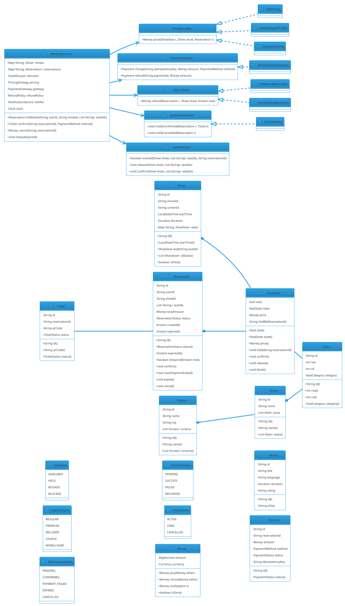

# Movie Ticket Booking

## Problem Statement

Design a movie ticket booking system like BookMyShow, Fandango, or AMC Theatres. The system must let users browse movies, view showtimes, select seats on a seat map, hold seats temporarily during payment, and confirm bookings. It must handle **concurrent seat selection** (two users competing for the same seat), **payment failures**, **cancellations with refunds**, and **dynamic pricing** (premium seats, weekend surcharges). It should be **extensible** (new seat types, new pricing rules, new cities/theatres), and **thread-safe** under high concurrency.

This is one of the **highest-concurrency LLD problems** — Black Friday for movies (new Marvel release) means millions of users fighting for the same seat on opening night. The system must never double-book a seat, must not lose holds on crashes, and must release seats that aren't paid for within a hold window.

**Example flow:**

```
Scenario 1 — Book a ticket:
  1. User opens app; browses movies in Mumbai
  2. Selects "Oppenheimer" at PVR Icon, 7:30 PM show
  3. System shows seat map for Screen 3 (20 rows x 15 cols)
  4. User selects seats: G7, G8 (Regular, $12 each)
  5. System HOLDS seats for 10 minutes:
     - G7.status = HELD
     - G8.status = HELD
     - Reservation created (status = PENDING, expiresAt = now+10min)
  6. User pays $24 + tax
  7. System confirms:
     - G7.status = BOOKED
     - G8.status = BOOKED
     - Reservation.status = CONFIRMED
  8. Ticket issued (QR code)

Scenario 2 — Hold expires:
  1. User selects H10 but doesn't pay within 10 min
  2. Scheduler sweeps H10's reservation; marks HELD → AVAILABLE
  3. Another user can now book H10

Scenario 3 — Payment failure:
  1. User selects seats; payment gateway declines
  2. System marks reservation as PAYMENT_FAILED
  3. Seats remain HELD until hold window expires (or release immediately if user cancels)
  4. User retries payment with another method

Scenario 4 — Concurrent booking:
  1. User A and User B both select seat K5 at the same instant
  2. Only one succeeds in holding; other gets "Seat no longer available"
  3. Failed user is offered nearest alternatives

Concurrency:
  - Thousands of users hitting the same show
  - Seat holds must be atomic
  - Payment must be idempotent
  - Hold expiry must be precise
  - Cancellations must release seats

Extensibility:
  - New seat types (Recliner, Couple, Wheelchair)
  - New pricing rules (matinee, weekday, loyalty)
  - New cities / theatres / screens
  - Add-ons (food, drinks)
  - Multi-currency
  - Refund policies
```

**Why it's interesting:**

- **Massive concurrency** — every seat is a contended resource
- **Holds with timeouts** — reservation lifecycle
- **Atomic seat state** — AVAILABLE → HELD → BOOKED (and back)
- **Idempotent payments** — retries must not double-charge
- **Dynamic pricing** — strategy pattern
- **Distributed locks** — for multi-node deployments
- **Cancellations** — release seats, compute refunds
- **Common follow-ups**: "Add waitlist", "Add food ordering", "Handle seat upgrades", "Multi-city"

---

## 1. Requirements

### Functional Requirements

- **Browse**: movies by city, language, genre, rating
- **Showtimes**: by movie, theatre, date
- **Seat map**: for a show; seat states (AVAILABLE, HELD, BOOKED, BLOCKED)
- **Select seats**: hold them temporarily (10 min default)
- **Payment**: process payment; convert holds to bookings
- **Ticket**: digital ticket with QR code
- **Cancel booking**: refund per policy; release seats
- **Add-ons**: food, beverages (optional)
- **Search**: by movie, theatre, location, time
- **User profile**: bookings, history
- **Admin**: manage movies, theatres, screens, shows, pricing

### Non-Functional Requirements

- **Thread-safe**: concurrent holds and bookings
- **No double-booking**: two users cannot book the same seat for the same show
- **Idempotent**: payment retries don't double-charge
- **Extensible**: new seat types, pricing rules, cities
- **Observable**: notifications, metrics
- **Fault-tolerant**: hold expiry, payment failure, crash recovery
- **Low latency**: seat hold < 500 ms; booking < 5 sec (incl. payment)
- **Consistency**: seat state is always consistent
- **Auditable**: every hold, booking, cancellation logged
- **Scalable**: millions of concurrent users on opening weekends

### Out of Scope

- Physical ticketing at the venue (scanners)
- Actual payment gateway integration
- Recommendation engine (adjacent)
- Streaming / OTT integration
- Food delivery integration

---

## 2. Use Cases

### UC1 — Browse Movies

```
Actor: User
Steps:
  1. User selects city
  2. System returns movies currently showing
  3. User selects a movie
  4. System shows theatres + showtimes
Postcondition: Movies displayed
```

### UC2 — View Seat Map

```
Actor: User
Precondition: Show exists; not past
Steps:
  1. User selects a showtime
  2. System returns seat map with current states
  3. Seats: AVAILABLE, HELD, BOOKED, BLOCKED
Postcondition: Seat map displayed
```

### UC3 — Hold Seats

```
Actor: User
Precondition: Selected seats are AVAILABLE
Steps:
  1. User selects up to N seats (e.g., 10)
  2. System attempts to atomically mark them HELD
  3. If any seat conflicts, fail the whole request
  4. Create Reservation (status = PENDING, expiresAt = now + 10 min)
  5. Return Reservation ID to user
Postcondition: Seats held
Alternative: If any seat is taken, reject or suggest alternatives
```

### UC4 — Confirm Booking (Payment Success)

```
Actor: User
Precondition: Reservation is PENDING and not expired
Steps:
  1. User submits payment details
  2. System charges via payment gateway (idempotent)
  3. On success:
     - Seats: HELD → BOOKED
     - Reservation: PENDING → CONFIRMED
     - Generate ticket with QR
  4. Send confirmation (email/SMS)
Postcondition: Booking confirmed
```

### UC5 — Payment Failure

```
Actor: System
Precondition: Payment failed
Steps:
  1. System marks Reservation as PAYMENT_FAILED
  2. Seats remain HELD until hold expires
  3. User can retry payment (within hold window)
  4. If hold expires, seats released
Postcondition: No seat leak
```

### UC6 — Hold Expiry

```
Actor: System (scheduler)
Precondition: Reservation is PENDING and past expiresAt
Steps:
  1. Scheduler picks expired reservations
  2. Seats: HELD → AVAILABLE
  3. Reservation: PENDING → EXPIRED
Postcondition: Seats released
```

### UC7 — Cancel Booking

```
Actor: User
Precondition: Reservation is CONFIRMED
Steps:
  1. User requests cancellation
  2. System applies refund policy (based on time-to-show)
  3. Seats: BOOKED → AVAILABLE (or BLOCKED for admin review)
  4. Reservation: CONFIRMED → CANCELLED
  5. Refund issued
Postcondition: Booking cancelled
```

### UC8 — Admin: Add Show

```
Actor: Admin
Steps:
  1. Admin defines show: movie, screen, start time, base price
  2. System creates Show
  3. Seat map initialized from screen's layout
Postcondition: Show available for booking
```

### UC9 — Add-Ons

```
Actor: User (during booking)
Steps:
  1. User adds food items to reservation
  2. System adds to total price
  3. Payment includes add-ons
  4. Ticket includes food voucher
Postcondition: Add-ons recorded
```

### UC10 — Waitlist

```
Actor: User
Precondition: Show is sold out
Steps:
  1. User joins waitlist for the show (or specific seat row)
  2. When a cancellation occurs, first-in-line is notified
  3. User has 5 minutes to book; else next is notified
Postcondition: Waitlist queue managed
```

---

## 3. Core Entities

### Entities (classes with identity)

| Entity | Responsibility |
|---|---|
| `City` | City where theatres exist |
| `Theatre` | A physical venue |
| `Screen` | A hall within a theatre with a seat layout |
| `Movie` | A film |
| `Show` | A specific screening (movie + screen + time) |
| `Seat` | A physical seat within a screen |
| `ShowSeat` | A seat's state for a particular show |
| `Reservation` | A hold/booking transaction |
| `Ticket` | Confirmed booking artifact |
| `Payment` | Payment record |
| `User` | A customer |

### Value Objects (immutable)

| Value | Purpose |
|---|---|
| `Money` | BigDecimal + currency |
| `SeatId` | Typed wrapper (e.g., "G7") |
| `ReservationId`, `ShowId`, `PaymentId` | Typed wrappers |
| `TimeRange` | Show start + duration |
| `SeatCategory` (enum) | REGULAR, PREMIUM, RECLINER, COUPLE, WHEELCHAIR |

### Enums

| Enum | Values |
|---|---|
| `SeatState` | AVAILABLE, HELD, BOOKED, BLOCKED |
| `ReservationStatus` | PENDING, CONFIRMED, PAYMENT_FAILED, EXPIRED, CANCELLED |
| `PaymentStatus` | PENDING, SUCCESS, FAILED, REFUNDED |
| `TicketStatus` | ACTIVE, USED, CANCELLED |
| `PaymentMethod` | CARD, UPI, WALLET |

### Services (interfaces)

| Service | Responsibility |
|---|---|
| `SeatAllocator` | Atomically hold/release seats |
| `PricingStrategy` | Compute seat + show price |
| `PaymentGateway` | Charge payments (idempotent) |
| `RefundPolicy` | Compute refund amount |
| `NotificationService` | Confirm/cancel notifications |
| `HoldExpiryScheduler` | Release expired holds |

### Interfaces (contracts)

| Interface | Implementations |
|---|---|
| `PricingStrategy` | `FlatPricing`, `SeatCategoryPricing`, `DynamicPricing` |
| `PaymentGateway` | `MockPaymentGateway`, `StripeGateway` (stub) |
| `RefundPolicy` | `FullRefundBefore24h`, `PartialRefundBefore2h`, `NoRefundAfterStart` |
| `NotificationService` | `EmailNotifier`, `SmsNotifier`, `CompositeNotifier` |

### Relationship Summary

```
City          *---  Theatre            (1..*)
Theatre       *---  Screen             (1..*)
Screen        *---  Seat               (1..*)
Movie         *---  Show               (0..*)
Show          *---  ShowSeat           (1..*)
ShowSeat      ---   Seat               (1)
User          *---  Reservation        (0..*)
Reservation   *---  ShowSeat           (1..*)
Reservation   ---   Show               (1)
Reservation   ---   Payment            (0..1)
Reservation   ---   Ticket             (0..1)
```

---

## 4. Class Diagram



**Key design decisions:**

- **`Seat` vs `ShowSeat`** — `Seat` is physical; `ShowSeat` tracks state per show
- **`ShowSeat` state machine** — AVAILABLE, HELD, BOOKED, BLOCKED
- **`SeatAllocator`** — atomic multi-seat hold/release
- **`Reservation`** — a hold or booking with expiry
- **`Payment`** — idempotent by `idempotencyKey`
- **Strategies** for pricing, refund
- **`BookingService`** orchestrates everything

---

## 5. Design Patterns Used

### 5.1 Strategy Pattern

- **`PricingStrategy`** — flat, seat-category, dynamic
- **`RefundPolicy`** — full, partial, none
- **`PaymentGateway`** — mock, real

### 5.2 State Pattern (lightweight)

**`ShowSeat.state`** transitions:
- AVAILABLE → HELD (on hold)
- HELD → BOOKED (on confirm)
- HELD → AVAILABLE (on expiry or cancel)
- BOOKED → AVAILABLE (on cancel)
- AVAILABLE → BLOCKED (admin)
- BLOCKED → AVAILABLE (admin)

Guarded transitions in `ShowSeat`.

### 5.3 Repository Pattern

**`ShowRepository`, `ReservationRepository`, `PaymentRepository`** abstract persistence.

### 5.4 Observer Pattern

**`NotificationService`** notifies on confirm/cancel.

### 5.5 Facade Pattern

**`BookingService`** — single entry point for hold, confirm, cancel.

### 5.6 Builder Pattern

**`ShowBuilder`** — configure a show with screen + movie + time + seat map.

### 5.7 Idempotency Key

**`Payment.idempotencyKey`** — client-generated; gateway deduplicates.

### 5.8 Scheduler

**`HoldExpiryScheduler`** — periodically sweeps expired holds.

---

## 6. Java Implementation

### 6.1 Enums and Value Objects

```java
package lld.movie.model;

public enum SeatState { AVAILABLE, HELD, BOOKED, BLOCKED }
public enum SeatCategory { REGULAR, PREMIUM, RECLINER, COUPLE, WHEELCHAIR }
public enum ReservationStatus { PENDING, CONFIRMED, PAYMENT_FAILED, EXPIRED, CANCELLED }
public enum PaymentStatus { PENDING, SUCCESS, FAILED, REFUNDED }
public enum TicketStatus { ACTIVE, USED, CANCELLED }
public enum PaymentMethod { CARD, UPI, WALLET }
```

```java
package lld.movie.model;

import java.math.BigDecimal;
import java.util.Currency;

public record Money(BigDecimal amount, Currency currency) {

    public Money {
        if (amount == null || amount.signum() < 0) {
            throw new IllegalArgumentException("Amount must be non-negative");
        }
        if (currency == null) currency = Currency.getInstance("USD");
    }

    public static Money usd(double v) {
        return new Money(BigDecimal.valueOf(v), Currency.getInstance("USD"));
    }

    public static Money zero() { return usd(0); }

    public Money plus(Money o) { check(o); return new Money(amount.add(o.amount), currency); }
    public Money minus(Money o) { check(o); return new Money(amount.subtract(o.amount), currency); }
    public Money multiply(int n) { return new Money(amount.multiply(BigDecimal.valueOf(n)), currency); }
    public Money multiply(double f) { return new Money(amount.multiply(BigDecimal.valueOf(f)), currency); }

    public boolean isZero() { return amount.signum() == 0; }

    private void check(Money o) {
        if (!currency.equals(o.currency)) throw new IllegalArgumentException("Currency mismatch");
    }
}
```

### 6.2 Seat, Screen, Theatre

```java
package lld.movie.model;

public record Seat(String id, int row, int col, SeatCategory category) {
    public Seat {
        if (id == null || id.isBlank()) throw new IllegalArgumentException("Seat id required");
        if (row < 0 || col < 0) throw new IllegalArgumentException("Negative coordinates");
        if (category == null) throw new IllegalArgumentException("Category required");
    }
}
```

```java
package lld.movie.model;

import java.util.List;

public final class Screen {
    private final String id;
    private final String name;
    private final List<Seat> seats;

    public Screen(String id, String name, List<Seat> seats) {
        if (seats.isEmpty()) throw new IllegalArgumentException("Screen needs seats");
        this.id = id;
        this.name = name;
        this.seats = List.copyOf(seats);
    }

    public String id() { return id; }
    public String name() { return name; }
    public List<Seat> seats() { return seats; }
}
```

```java
package lld.movie.model;

import java.util.List;

public final class Theatre {
    private final String id;
    private final String name;
    private final String city;
    private final List<Screen> screens;

    public Theatre(String id, String name, String city, List<Screen> screens) {
        this.id = id;
        this.name = name;
        this.city = city;
        this.screens = List.copyOf(screens);
    }

    public String id() { return id; }
    public String name() { return name; }
    public String city() { return city; }
    public List<Screen> screens() { return screens; }
}
```

### 6.3 Movie and Show

```java
package lld.movie.model;

import java.time.Duration;

public record Movie(String id, String title, String language, Duration duration, String rating) {}
```

```java
package lld.movie.model;

import java.time.Duration;
import java.time.LocalDateTime;
import java.util.HashMap;
import java.util.List;
import java.util.Map;

public final class Show {
    private final String id;
    private final String movieId;
    private final String screenId;
    private final LocalDateTime startTime;
    private final Duration duration;
    private final Map<String, ShowSeat> seats = new HashMap<>();

    public Show(String id, String movieId, String screenId,
                LocalDateTime startTime, Duration duration, List<ShowSeat> showSeats) {
        this.id = id;
        this.movieId = movieId;
        this.screenId = screenId;
        this.startTime = startTime;
        this.duration = duration;
        for (ShowSeat s : showSeats) seats.put(s.seat().id(), s);
    }

    public String id() { return id; }
    public String movieId() { return movieId; }
    public String screenId() { return screenId; }
    public LocalDateTime startTime() { return startTime; }
    public Duration duration() { return duration; }

    public ShowSeat seat(String seatId) {
        ShowSeat s = seats.get(seatId);
        if (s == null) throw new IllegalArgumentException("Unknown seat: " + seatId);
        return s;
    }

    public List<ShowSeat> allSeats() { return List.copyOf(seats.values()); }

    public boolean isPast() {
        return LocalDateTime.now().isAfter(startTime.plus(duration));
    }
}
```

### 6.4 ShowSeat (state machine)

```java
package lld.movie.model;

public final class ShowSeat {
    private final Seat seat;
    private SeatState state;
    private Money price;
    private String heldByReservationId;

    public ShowSeat(Seat seat, Money price) {
        this.seat = seat;
        this.price = price;
        this.state = SeatState.AVAILABLE;
    }

    public Seat seat() { return seat; }
    public synchronized SeatState state() { return state; }
    public synchronized Money price() { return price; }
    public synchronized String heldByReservationId() { return heldByReservationId; }

    public synchronized void hold(String reservationId) {
        if (state != SeatState.AVAILABLE) {
            throw new IllegalStateException("Seat not available: " + state);
        }
        state = SeatState.HELD;
        heldByReservationId = reservationId;
    }

    public synchronized void confirm() {
        if (state != SeatState.HELD) {
            throw new IllegalStateException("Seat not held: " + state);
        }
        state = SeatState.BOOKED;
        heldByReservationId = null;
    }

    public synchronized void release() {
        if (state == SeatState.BOOKED) {
            throw new IllegalStateException("Cannot release a booked seat");
        }
        state = SeatState.AVAILABLE;
        heldByReservationId = null;
    }

    public synchronized void block() {
        if (state == SeatState.BOOKED) {
            throw new IllegalStateException("Cannot block a booked seat");
        }
        state = SeatState.BLOCKED;
        heldByReservationId = null;
    }

    public synchronized void unblock() {
        if (state != SeatState.BLOCKED) {
            throw new IllegalStateException("Seat not blocked: " + state);
        }
        state = SeatState.AVAILABLE;
    }

    public synchronized void updatePrice(Money newPrice) {
        if (newPrice == null) throw new IllegalArgumentException("Price required");
        this.price = newPrice;
    }
}
```

### 6.5 Reservation, Payment, Ticket

```java
package lld.movie.model;

import java.time.Instant;
import java.util.List;
import java.util.concurrent.locks.ReentrantLock;

public final class Reservation {
    private final String id;
    private final String userId;
    private final String showId;
    private final List<String> seatIds;
    private final Money totalAmount;
    private final Instant createdAt;
    private final Instant expiresAt;
    private final ReentrantLock lock = new ReentrantLock();
    private ReservationStatus status;

    public Reservation(String id, String userId, String showId,
                       List<String> seatIds, Money totalAmount,
                       Instant createdAt, Instant expiresAt) {
        this.id = id;
        this.userId = userId;
        this.showId = showId;
        this.seatIds = List.copyOf(seatIds);
        this.totalAmount = totalAmount;
        this.createdAt = createdAt;
        this.expiresAt = expiresAt;
        this.status = ReservationStatus.PENDING;
    }

    public String id() { return id; }
    public String userId() { return userId; }
    public String showId() { return showId; }
    public List<String> seatIds() { return seatIds; }
    public Money totalAmount() { return totalAmount; }
    public Instant createdAt() { return createdAt; }
    public Instant expiresAt() { return expiresAt; }

    public ReservationStatus status() {
        lock.lock();
        try { return status; }
        finally { lock.unlock(); }
    }

    public boolean isExpired(Instant now) {
        return now.isAfter(expiresAt) && status() == ReservationStatus.PENDING;
    }

    public void confirm() {
        lock.lock();
        try {
            if (status != ReservationStatus.PENDING
                    && status != ReservationStatus.PAYMENT_FAILED) {
                throw new IllegalStateException("Cannot confirm: " + status);
            }
            status = ReservationStatus.CONFIRMED;
        } finally { lock.unlock(); }
    }

    public void markPaymentFailed() {
        lock.lock();
        try {
            if (status == ReservationStatus.PENDING) {
                status = ReservationStatus.PAYMENT_FAILED;
            }
        } finally { lock.unlock(); }
    }

    public void expire() {
        lock.lock();
        try {
            if (status == ReservationStatus.PENDING
                    || status == ReservationStatus.PAYMENT_FAILED) {
                status = ReservationStatus.EXPIRED;
            }
        } finally { lock.unlock(); }
    }

    public void cancel() {
        lock.lock();
        try {
            if (status != ReservationStatus.CONFIRMED) {
                throw new IllegalStateException("Cannot cancel: " + status);
            }
            status = ReservationStatus.CANCELLED;
        } finally { lock.unlock(); }
    }
}
```

```java
package lld.movie.model;

import java.time.Instant;

public final class Payment {
    private final String id;
    private final String reservationId;
    private final Money amount;
    private final PaymentMethod method;
    private final String idempotencyKey;
    private final Instant createdAt;
    private PaymentStatus status;

    public Payment(String id, String reservationId, Money amount,
                   PaymentMethod method, String idempotencyKey, Instant createdAt) {
        this.id = id;
        this.reservationId = reservationId;
        this.amount = amount;
        this.method = method;
        this.idempotencyKey = idempotencyKey;
        this.createdAt = createdAt;
        this.status = PaymentStatus.PENDING;
    }

    public String id() { return id; }
    public String reservationId() { return reservationId; }
    public Money amount() { return amount; }
    public PaymentMethod method() { return method; }
    public String idempotencyKey() { return idempotencyKey; }
    public Instant createdAt() { return createdAt; }

    public synchronized PaymentStatus status() { return status; }
    public synchronized void markSuccess() { status = PaymentStatus.SUCCESS; }
    public synchronized void markFailed() { status = PaymentStatus.FAILED; }
    public synchronized void markRefunded() { status = PaymentStatus.REFUNDED; }
}
```

```java
package lld.movie.model;

public final class Ticket {
    private final String id;
    private final String reservationId;
    private final String qrCode;
    private TicketStatus status;

    public Ticket(String id, String reservationId, String qrCode) {
        this.id = id;
        this.reservationId = reservationId;
        this.qrCode = qrCode;
        this.status = TicketStatus.ACTIVE;
    }

    public String id() { return id; }
    public String reservationId() { return reservationId; }
    public String qrCode() { return qrCode; }
    public synchronized TicketStatus status() { return status; }
    public synchronized void markUsed() { status = TicketStatus.USED; }
    public synchronized void markCancelled() { status = TicketStatus.CANCELLED; }
}
```

### 6.6 SeatAllocator (atomic multi-seat operations)

```java
package lld.movie.service;

import lld.movie.model.Show;
import lld.movie.model.ShowSeat;
import lld.movie.model.SeatState;

import java.util.ArrayList;
import java.util.List;

public final class SeatAllocator {

    /**
     * Atomically hold all seats. If any seat is unavailable, rollback
     * previously held seats and return false.
     */
    public boolean tryHold(Show show, List<String> seatIds, String reservationId) {
        List<ShowSeat> held = new ArrayList<>();
        for (String id : seatIds) {
            ShowSeat seat = show.seat(id);
            try {
                seat.hold(reservationId);
                held.add(seat);
            } catch (IllegalStateException e) {
                // Rollback
                for (ShowSeat s : held) {
                    s.release();
                }
                return false;
            }
        }
        return true;
    }

    public void confirm(Show show, List<String> seatIds) {
        for (String id : seatIds) show.seat(id).confirm();
    }

    public void release(Show show, List<String> seatIds) {
        for (String id : seatIds) {
            ShowSeat seat = show.seat(id);
            if (seat.state() == SeatState.HELD) seat.release();
        }
    }
}
```

**Race consideration:** `tryHold` is not fully atomic across seats if another thread interleaves. For strict atomicity, synchronize on the `Show` object or use a per-show lock:

```java
public boolean tryHold(Show show, List<String> seatIds, String reservationId) {
    synchronized (show) {
        // ... same body
    }
}
```

The `Show` instance acts as the per-show lock. Concurrent holds for different shows proceed in parallel. **This is the recommended pattern.**

### 6.7 Pricing Strategies

```java
package lld.movie.service;

import lld.movie.model.Money;
import lld.movie.model.ShowSeat;

public interface PricingStrategy {
    Money price(ShowSeat seat);
}
```

```java
package lld.movie.service;

import lld.movie.model.Money;
import lld.movie.model.ShowSeat;

public final class FlatPricing implements PricingStrategy {
    private final Money basePrice;

    public FlatPricing(Money basePrice) { this.basePrice = basePrice; }

    @Override public Money price(ShowSeat seat) { return basePrice; }
}
```

```java
package lld.movie.service;

import lld.movie.model.Money;
import lld.movie.model.SeatCategory;
import lld.movie.model.ShowSeat;

import java.util.Map;

public final class SeatCategoryPricing implements PricingStrategy {
    private final Map<SeatCategory, Money> priceByCategory;

    public SeatCategoryPricing(Map<SeatCategory, Money> priceByCategory) {
        this.priceByCategory = Map.copyOf(priceByCategory);
    }

    @Override
    public Money price(ShowSeat seat) {
        Money p = priceByCategory.get(seat.seat().category());
        if (p == null) throw new IllegalArgumentException("No price for " + seat.seat().category());
        return p;
    }
}
```

```java
package lld.movie.service;

import lld.movie.model.Money;
import lld.movie.model.ShowSeat;

/**
 * Dynamic pricing: base × multiplier by time-of-day / day-of-week.
 * The multiplier is computed from the show's start time and passed in.
 */
public final class DynamicPricing implements PricingStrategy {
    private final PricingStrategy base;
    private final double multiplier;

    public DynamicPricing(PricingStrategy base, double multiplier) {
        this.base = base;
        this.multiplier = multiplier;
    }

    @Override
    public Money price(ShowSeat seat) {
        return base.price(seat).multiply(multiplier);
    }
}
```

### 6.8 Payment Gateway (idempotent)

```java
package lld.movie.service;

import lld.movie.model.Money;
import lld.movie.model.Payment;
import lld.movie.model.PaymentMethod;

public interface PaymentGateway {
    Payment charge(String idempotencyKey, Money amount, PaymentMethod method);
    Payment refund(String paymentId, Money amount);
}
```

```java
package lld.movie.service;

import lld.movie.model.*;

import java.time.Instant;
import java.util.Map;
import java.util.UUID;
import java.util.concurrent.ConcurrentHashMap;

/**
 * Mock gateway: always succeeds. Deduplicates by idempotencyKey.
 */
public final class MockPaymentGateway implements PaymentGateway {

    private final Map<String, Payment> byKey = new ConcurrentHashMap<>();

    @Override
    public Payment charge(String idempotencyKey, Money amount, PaymentMethod method) {
        return byKey.computeIfAbsent(idempotencyKey, key -> {
            Payment p = new Payment(UUID.randomUUID().toString(), null,
                    amount, method, idempotencyKey, Instant.now());
            p.markSuccess();
            return p;
        });
    }

    @Override
    public Payment refund(String paymentId, Money amount) {
        Payment p = new Payment(UUID.randomUUID().toString(), null,
                amount, null, "refund-" + paymentId, Instant.now());
        p.markRefunded();
        return p;
    }
}
```

**Idempotency:** `computeIfAbsent(idempotencyKey, ...)` ensures only one payment is created per key, even under concurrent calls.

### 6.9 Refund Policies

```java
package lld.movie.service;

import lld.movie.model.Money;
import lld.movie.model.Reservation;
import lld.movie.model.Show;

import java.time.Duration;
import java.time.Instant;

public interface RefundPolicy {
    Money refund(Reservation r, Show show, Instant now);
}
```

```java
package lld.movie.service;

import lld.movie.model.*;

import java.time.Duration;
import java.time.ZoneId;
import java.time.Instant;

public final class FullRefundBefore24h implements RefundPolicy {
    @Override
    public Money refund(Reservation r, Show show, Instant now) {
        Instant showStart = show.startTime().atZone(ZoneId.systemDefault()).toInstant();
        long hoursUntilShow = Duration.between(now, showStart).toHours();
        return hoursUntilShow >= 24 ? r.totalAmount() : Money.zero();
    }
}
```

```java
package lld.movie.service;

import lld.movie.model.*;

import java.time.Duration;
import java.time.ZoneId;
import java.time.Instant;

public final class PartialRefundBefore2h implements RefundPolicy {
    private final double refundFraction;

    public PartialRefundBefore2h(double refundFraction) {
        this.refundFraction = refundFraction;
    }

    @Override
    public Money refund(Reservation r, Show show, Instant now) {
        Instant showStart = show.startTime().atZone(ZoneId.systemDefault()).toInstant();
        long hoursUntilShow = Duration.between(now, showStart).toHours();
        if (hoursUntilShow >= 24) return r.totalAmount();
        if (hoursUntilShow >= 2) return r.totalAmount().multiply(refundFraction);
        return Money.zero();
    }
}
```

### 6.10 Notification Service

```java
package lld.movie.service;

import lld.movie.model.Reservation;
import lld.movie.model.Ticket;

public interface NotificationService {
    void notifyConfirmed(Reservation r, Ticket t);
    void notifyCancelled(Reservation r);
    void notifyHoldExpiring(Reservation r);
}
```

```java
package lld.movie.service;

import lld.movie.model.Reservation;
import lld.movie.model.Ticket;

public final class EmailNotifier implements NotificationService {
    @Override public void notifyConfirmed(Reservation r, Ticket t) {
        System.out.println("[EMAIL] Booking confirmed for user " + r.userId()
                + " reservation " + r.id());
    }
    @Override public void notifyCancelled(Reservation r) {
        System.out.println("[EMAIL] Booking cancelled: " + r.id());
    }
    @Override public void notifyHoldExpiring(Reservation r) {
        System.out.println("[EMAIL] Hold expiring soon: " + r.id());
    }
}
```

### 6.11 Booking Service

```java
package lld.movie.core;

import lld.movie.model.*;
import lld.movie.service.*;

import java.time.Clock;
import java.time.Duration;
import java.time.Instant;
import java.util.*;
import java.util.concurrent.ConcurrentHashMap;

public final class BookingService {

    public static final Duration HOLD_DURATION = Duration.ofMinutes(10);

    private final Map<String, Show> shows = new ConcurrentHashMap<>();
    private final Map<String, Reservation> reservations = new ConcurrentHashMap<>();
    private final Map<String, Payment> payments = new ConcurrentHashMap<>();
    private final Map<String, Ticket> tickets = new ConcurrentHashMap<>();
    private final SeatAllocator allocator;
    private final PricingStrategy pricing;
    private final PaymentGateway gateway;
    private final RefundPolicy refundPolicy;
    private final NotificationService notifier;
    private final Clock clock;

    public BookingService(SeatAllocator allocator, PricingStrategy pricing,
                          PaymentGateway gateway, RefundPolicy refundPolicy,
                          NotificationService notifier, Clock clock) {
        this.allocator = allocator;
        this.pricing = pricing;
        this.gateway = gateway;
        this.refundPolicy = refundPolicy;
        this.notifier = notifier;
        this.clock = clock;
    }

    public void addShow(Show show) {
        shows.put(show.id(), show);
    }

    public Show show(String showId) {
        Show s = shows.get(showId);
        if (s == null) throw new IllegalArgumentException("Unknown show: " + showId);
        return s;
    }

    // -------- Hold --------

    public Reservation holdSeats(String userId, String showId, List<String> seatIds) {
        Show show = show(showId);
        if (show.isPast()) throw new IllegalStateException("Show already past");

        Reservation reservation = new Reservation(
                UUID.randomUUID().toString(), userId, showId, seatIds,
                Money.zero(),
                Instant.now(clock),
                Instant.now(clock).plus(HOLD_DURATION)
        );

        // Compute total price
        Money total = Money.zero();
        for (String id : seatIds) total = total.plus(pricing.price(show.seat(id)));

        // Atomic hold
        boolean held = allocator.tryHold(show, seatIds, reservation.id());
        if (!held) {
            throw new IllegalStateException("One or more seats are unavailable");
        }

        // Store reservation with price
        Reservation priced = new Reservation(
                reservation.id(), userId, showId, seatIds,
                total,
                reservation.createdAt(),
                reservation.expiresAt()
        );
        reservations.put(priced.id(), priced);
        return priced;
    }

    // -------- Confirm (pay) --------

    public Ticket confirm(String reservationId, PaymentMethod method, String idempotencyKey) {
        Reservation r = requireReservation(reservationId);
        if (r.status() != ReservationStatus.PENDING
                && r.status() != ReservationStatus.PAYMENT_FAILED) {
            throw new IllegalStateException("Reservation not payable: " + r.status());
        }
        if (r.isExpired(Instant.now(clock))) {
            releaseExpired();
            throw new IllegalStateException("Reservation expired");
        }

        // Idempotent charge
        Payment payment = gateway.charge(idempotencyKey, r.totalAmount(), method);
        payments.put(payment.id(), payment);

        if (payment.status() != PaymentStatus.SUCCESS) {
            r.markPaymentFailed();
            throw new IllegalStateException("Payment failed");
        }

        // Confirm seats + reservation
        Show show = show(r.showId());
        synchronized (show) {
            allocator.confirm(show, r.seatIds());
        }
        r.confirm();

        // Issue ticket
        Ticket ticket = new Ticket(
                UUID.randomUUID().toString(),
                r.id(),
                "QR-" + r.id() + "-" + UUID.randomUUID()
        );
        tickets.put(ticket.id(), ticket);

        notifier.notifyConfirmed(r, ticket);
        return ticket;
    }

    // -------- Cancel --------

    public Money cancel(String reservationId) {
        Reservation r = requireReservation(reservationId);
        if (r.status() != ReservationStatus.CONFIRMED) {
            throw new IllegalStateException("Only confirmed reservations can be cancelled");
        }
        Show show = show(r.showId());

        Money refund = refundPolicy.refund(r, show, Instant.now(clock));

        synchronized (show) {
            for (String id : r.seatIds()) {
                show.seat(id).release();
            }
        }
        r.cancel();

        // Mark ticket cancelled
        tickets.values().stream()
                .filter(t -> t.reservationId().equals(r.id()))
                .forEach(Ticket::markCancelled);

        notifier.notifyCancelled(r);
        return refund;
    }

    // -------- Scheduler: release expired holds --------

    public synchronized void releaseExpired() {
        Instant now = Instant.now(clock);
        for (Reservation r : reservations.values()) {
            if (r.isExpired(now)) {
                Show show = show(r.showId());
                synchronized (show) {
                    allocator.release(show, r.seatIds());
                }
                r.expire();
            }
        }
    }

    private Reservation requireReservation(String id) {
        Reservation r = reservations.get(id);
        if (r == null) throw new IllegalArgumentException("Unknown reservation: " + id);
        return r;
    }
}
```

### 6.12 Demo

```java
package lld.movie;

import lld.movie.core.BookingService;
import lld.movie.model.*;
import lld.movie.service.*;

import java.time.Clock;
import java.time.Duration;
import java.time.LocalDateTime;
import java.time.ZoneOffset;
import java.util.ArrayList;
import java.util.List;
import java.util.Map;

public class Demo {
    public static void main(String[] args) {
        // Build screen with 5 rows x 5 cols
        List<Seat> seats = new ArrayList<>();
        for (int r = 0; r < 5; r++) {
            for (int c = 0; c < 5; c++) {
                SeatCategory cat = (r < 2) ? SeatCategory.PREMIUM : SeatCategory.REGULAR;
                seats.add(new Seat("" + (char)('A' + r) + (c + 1), r, c, cat));
            }
        }
        Screen screen = new Screen("S1", "Screen 1", seats);

        // Show: Oppenheimer at 7:30 PM
        List<ShowSeat> showSeats = new ArrayList<>();
        for (Seat s : seats) {
            Money price = s.category() == SeatCategory.PREMIUM ? Money.usd(18) : Money.usd(12);
            showSeats.add(new ShowSeat(s, price));
        }
        Show show = new Show(
                "SHOW-1", "MOVIE-1", screen.id(),
                LocalDateTime.now().plusHours(6),
                Duration.ofMinutes(180),
                showSeats
        );

        // Build services
        BookingService service = new BookingService(
                new SeatAllocator(),
                new SeatCategoryPricing(Map.of(
                        SeatCategory.PREMIUM, Money.usd(18),
                        SeatCategory.REGULAR, Money.usd(12)
                )),
                new MockPaymentGateway(),
                new FullRefundBefore24h(),
                new EmailNotifier(),
                Clock.systemUTC()
        );
        service.addShow(show);

        // User holds seats B3, B4
        Reservation r = service.holdSeats("alice", "SHOW-1", List.of("B3", "B4"));
        System.out.println("Held: " + r.id() + " total: " + r.totalAmount().amount());

        // Confirm with payment
        Ticket t = service.confirm(r.id(), PaymentMethod.CARD, "key-123");
        System.out.println("Ticket: " + t.qrCode());

        // Cancel
        Money refund = service.cancel(r.id());
        System.out.println("Refunded: " + refund.amount());

        // Concurrent hold for same seat
        try {
            service.holdSeats("bob", "SHOW-1", List.of("B3"));
        } catch (IllegalStateException e) {
            System.out.println("Expected: " + e.getMessage());
        }
    }
}
```

---

## 7. Concurrency Considerations

### Shared Resources

| Resource | Shared? | Synchronization |
|---|---|---|
| `ShowSeat.state` | Yes | `synchronized` methods |
| `Show.seats` map | Yes | `ConcurrentHashMap` |
| `Reservation.status` | Yes | `ReentrantLock` |
| Multi-seat hold | Yes | `synchronized (show)` in `SeatAllocator.tryHold` |
| `BookingService` maps | Yes | `ConcurrentHashMap` |
| `Payment` charge | Yes | Idempotent via gateway `computeIfAbsent` |

### Race: Two users hold the same seat

`SeatAllocator.tryHold` synchronizes on the `Show`:

```java
synchronized (show) {
    for (String id : seatIds) {
        ShowSeat seat = show.seat(id);
        if (seat.state() != SeatState.AVAILABLE) {
            // rollback
            return false;
        }
    }
    for (String id : seatIds) show.seat(id).hold(reservationId);
    return true;
}
```

Only one thread can execute this block at a time for a given show. Different shows proceed in parallel.

### Race: Multi-seat hold partial failure

If seat 3 fails, seats 1 and 2 must be rolled back. Done inside the synchronized block. No external thread can observe the intermediate state.

### Race: Payment concurrent with hold expiry

Scenario: user starts payment 1 second before hold expires. Scheduler fires, releases seats. Payment succeeds.

**Fix:** Confirm payment **inside** the hold window. If `now > expiresAt`, reject before charging. Or: extend the hold by 2 minutes when the user initiates payment. Or: after payment, re-check seat state; if expired, refund.

**Recommended:** 
1. Check `isExpired` before charging
2. After charge, re-verify under `synchronized (show)` and release seats back if expired
3. Refund the charge if re-verification fails

### Race: Idempotency under concurrency

Two simultaneous `confirm` calls with the same `idempotencyKey`:
- Both call `gateway.charge(key, ...)`
- `computeIfAbsent` ensures only one `Payment` created; the other returns the existing one
- Both then proceed to `allocator.confirm`; the first succeeds, the second sees already `BOOKED` — need to handle gracefully

**Fix:** After `gateway.charge`, check if the reservation is already `CONFIRMED`; if so, return the existing ticket.

### Race: Cancel during payment

If cancel is called while payment is in-flight, the reservation status may be inconsistent.

**Fix:** All mutations on the reservation go through `Reservation.lock`. Cancel requires `CONFIRMED`; if payment is in-flight, it's `PENDING` or `PAYMENT_FAILED` — cancel rejects.

### Scheduler Safety

`releaseExpired` is `synchronized` on the service. Multiple schedulers (if any) run one at a time.

### Distributed Deployment

For multi-node deployments, the in-process locks aren't enough. Use:
- **Distributed lock** (Redis `SET NX` with TTL) per show
- **Database transactions** with row-level locks for seat state
- **Optimistic concurrency** — version field on `ShowSeat`; CAS updates

The design pattern stays the same; the lock implementation changes.

### Testing Concurrency

```java
@Test
void concurrentHoldsOnlyOneSucceeds() throws InterruptedException {
    Show show = /* setup with 1 seat */;
    BookingService service = /* ... */;
    service.addShow(show);

    int threads = 100;
    CountDownLatch latch = new CountDownLatch(1);
    ExecutorService pool = Executors.newFixedThreadPool(threads);
    AtomicInteger successes = new AtomicInteger();

    for (int i = 0; i < threads; i++) {
        final String user = "user-" + i;
        pool.submit(() -> {
            try { latch.await(); } catch (InterruptedException ignored) { return; }
            try {
                service.holdSeats(user, show.id(), List.of("A1"));
                successes.incrementAndGet();
            } catch (IllegalStateException ignored) { }
        });
    }
    latch.countDown();
    pool.shutdown();
    pool.awaitTermination(10, TimeUnit.SECONDS);

    assertEquals(1, successes.get());
}
```

---

## 8. Extensibility

### Add a New Seat Category (Recliner)

1. Add `RECLINER` to `SeatCategory`
2. Update pricing map
3. Update screen layout creation

**No existing behavior modified.**

### Add Dynamic Pricing (Weekend Surcharge)

```java
PricingStrategy base = new SeatCategoryPricing(priceMap);
PricingStrategy dynamic = new DynamicPricing(base, 1.5);   // 50% surcharge
```

**No changes to core.**

### Add a New Payment Method

1. Add to `PaymentMethod` enum
2. Update gateway to handle it

**No changes to booking flow.**

### Add a Refund Policy

```java
public final class StaggeredRefund implements RefundPolicy {
    // more than 7 days: 100%
    // 24h-7days: 75%
    // 2h-24h: 50%
    // < 2h: 0%
}
```

**No changes to core.**

### Add Food Add-Ons

1. Add `AddOn` entity to `Reservation`
2. Extend `holdSeats` to accept add-ons
3. Include in total
4. Pass to kitchen/fulfillment service

**Additive.**

### Add Waitlist

1. `Waitlist` per `Show`
2. On `cancel`, enqueue first waiting user
3. Notify them with a time limit

**Additive.**

### Add Loyalty Points

1. Track points on `User`
2. Earn on confirm; redeem on hold
3. Add `PointsDiscount` to price

**Additive.**

### Add Multi-City / Multi-Theatre Support

Already supported via `Theatre.city` and `Show.screenId`. Add a search service for cities and theatres.

### Add Seat Upgrade (Mid-Show)

Different problem — allow changing seat during the show. Requires 2-phase swap. **Additive.**

### Add PVR-Style Recliner Pricing

Add `RECLINER` category with its own price in the pricing strategy.

### Add "Book for Friend" Flow

Add a `beneficiaryUserId` to `Reservation`. Purchase still belongs to the buyer.

### Add Real-Time Seat Map Updates

Use WebSocket to push seat state changes to connected clients. `BookingService` notifies a `SeatMapBroadcaster` on state change.

**Additive via Observer pattern.**

### Distributed Deployment

Replace in-process locks with:
- **Redis distributed lock** per show
- **Database row locks** on `ShowSeat`
- **Idempotency keys** in a `Payment` table with unique constraint

The core business logic stays the same.

### Multi-Region

- **Regional Booking Services** per geography
- **Global user directory** for cross-region bookings
- **Distributed lock** for shared shows (rare)
- **Eventual consistency** for seat maps (near-real-time sync)

---

## 9. SOLID Principles Applied

### Single Responsibility Principle

| Class | Single Responsibility |
|---|---|
| `Seat` | Physical seat |
| `ShowSeat` | Per-show seat state |
| `Show` | A screening |
| `Reservation` | A hold/booking |
| `Payment` | A charge |
| `Ticket` | A confirmed booking artifact |
| `SeatAllocator` | Atomic seat operations |
| `BookingService` | Orchestration |

### Open/Closed Principle

- **New pricing rule** — implement `PricingStrategy`
- **New refund policy** — implement `RefundPolicy`
- **New payment method** — extend enum + gateway
- **New seat category** — extend enum + pricing

No existing behavior modified.

### Liskov Substitution Principle

- All `PricingStrategy` implementations return a valid `Money`
- All `RefundPolicy` implementations return a refund ≤ total
- All `PaymentGateway` implementations are idempotent

### Interface Segregation Principle

Small interfaces:
- `PricingStrategy` — 1 method
- `RefundPolicy` — 1 method
- `PaymentGateway` — 2 methods
- `NotificationService` — 3 cohesive methods

### Dependency Inversion Principle

`BookingService` depends on abstractions:
- `SeatAllocator`
- `PricingStrategy`
- `PaymentGateway`
- `RefundPolicy`
- `NotificationService`
- `Clock`

All injected.

---

## 10. Common Pitfalls

| Pitfall | Why It's Wrong | Fix |
|---|---|---|
| No atomic multi-seat hold | Partial holds leak seats | `synchronized (show)` around try-hold |
| Global lock on BookingService | Poor throughput | Lock per show |
| Hold without expiry | Seats stuck forever | Reservation `expiresAt` + scheduler |
| Payment not idempotent | Double-charge on retry | `idempotencyKey` + gateway dedup |
| Payment succeeds but seat released | User charged without seat | Re-verify under lock after charge; refund on failure |
| Cancel during payment | Inconsistent state | Status guards; reject cancel unless CONFIRMED |
| `double` for money | Rounding errors | `Money` with `BigDecimal` |
| Not checking show.isPast | Book past shows | Reject in `holdSeats` |
| No multi-seat rollback | Partial holds | Rollback loop on failure |
| Scheduler not idempotent | Double-release or missed | `Reservation.expire` guards status |
| No idempotent ticket creation | Duplicate tickets on retry | Check reservation status before issuing |
| Booking with more than N seats | Abuse | Limit in `holdSeats` |
| Not releasing seats on cancel | Seat leak | `SeatAllocator.release` in `cancel` |
| Ignoring `Clock` | Untestable time logic | Inject `Clock` |
| `HashMap` for shows | Race conditions | `ConcurrentHashMap` |
| No back-reference from ticket to reservation | Hard to cancel ticket | `Ticket.reservationId` |

---

## 11. Follow-up Questions

### Q1: How do you prevent double-booking under high concurrency?

**Answer:** Lock the `Show` object during seat state changes. In a single-process deployment, `synchronized (show)` suffices. In a distributed deployment, use a Redis distributed lock or DB row locks with transactions. The critical section is small (a few seat state checks + writes), so contention is low even under load.

### Q2: How do you handle payment failure after the hold expires?

**Answer:** Before charging, check `reservation.isExpired(now)`. If expired, reject. After charging, re-verify under lock: if the reservation was released (by the scheduler), refund the charge and return failure. This handles the edge case where the hold expires during the payment round-trip.

### Q3: How do you support seat holds across multiple devices?

**Answer:** Same user holds seats from phone and laptop. Track `userId` on the reservation. Either allow both or restrict one active reservation per user per show. Common practice: one active hold per user per show; a second hold cancels the first.

### Q4: How do you handle a partial refund policy?

**Answer:** `RefundPolicy` is a strategy. Compute based on `now` vs `show.startTime`:
- ≥ 24h: 100%
- 2-24h: 75% (configurable)
- < 2h: 0%

No changes to `BookingService` — inject a different policy.

### Q5: How do you test concurrency?

**Answer:** 
- Unit tests for `SeatAllocator` with a single-seat race (100 threads, 1 seat, assert 1 success)
- Multi-seat hold with one seat pre-booked (assert full rollback)
- Idempotent payment test (same key twice, assert 1 charge)
- Scheduler test with `Clock.fixed` — expire holds, assert release
- Full integration test: hold → confirm → cancel with concurrency

### Q6: How do you handle group bookings (10+ seats)?

**Answer:** Same as normal, but with a higher `maxSeatsPerReservation`. Group bookings may require payment by a single payer; other members reimburse outside the system. Optionally, integrate Splitwise.

### Q7: How do you scale to multiple cities?

**Answer:** The `Theatre` has a `city` field. Add a `CityService` to list cities. Shard `BookingService` by `cityId` or `showId` for throughput. Users in one city don't contend with users in another.

### Q8: How do you handle refunds with a real payment gateway?

**Answer:** `PaymentGateway.refund(paymentId, amount)` is a stub here. In production, call the gateway's refund API with the original payment's transaction ID. Keep the `idempotencyKey` for the refund call to prevent double refunds. The gateway returns a refund ID; store it for audit.

### Q9: How do you handle seat upgrades (mid-booking)?

**Answer:** 
1. User has held seats A1, A2
2. User wants to upgrade to B1, B2
3. In one atomic transaction: release A1, A2; hold B1, B2
4. If B is not available, keep A
5. Recompute price

This requires a "swap seats" method on `BookingService` that takes a synchronized lock on the show.

### Q10: How would you handle a crash mid-hold?

**Answer:** Persist reservations to a DB with `expiresAt`. On startup, a recovery job scans `PENDING` reservations that have expired and releases their seats. If using in-memory only, restart loses holds — acceptable for a demo but not production.

### Q11: How would you support "waitlist"?

**Answer:** 
- Per-show `Waitlist` (FIFO)
- On cancel, notify the first user in line with a 5-minute window to book
- If they don't book within the window, notify the next
- Implement as a scheduler task

### Q12: How would you support "seat upgrade during the show"?

**Answer:** Rare; usually out of scope. If needed:
1. User requests upgrade
2. System checks availability of target seats
3. In one transaction: release current seats (make them AVAILABLE for others), hold target seats, charge difference
4. Race: someone else may book the released seats; that's fine — the user is upgrading anyway

### Q13: How do you handle no-shows?

**Answer:** No-shows don't affect the system — the seat was paid for. For analytics, track ticket scans; unused tickets are no-shows.

### Q14: How do you support "partial booking" (some seats unavailable)?

**Answer:** Return which seats are unavailable; ask the user to re-select. Alternatively, hold the available ones and leave the rest. Common UX: reject the whole request and let the user retry.

### Q15: How do you implement "seat preference" (aisle, window)?

**Answer:** Add attributes to `Seat` (e.g., `isAisle`, `isWindow`). Filter or sort seat suggestions by preference.

---

## 12. Similar Problems

- **Hotel Management** — rooms as resources, dates as time, same skeleton
- **Library Management** — books + loans, similar inventory pattern
- **Parking Lot** — spots as resources, allocation strategy
- **Airline Reservation** — seats + multi-leg; more complex
- **Train Booking (IRCTC)** — berths + waiting list + RAC
- **Event Ticketing (Ticketmaster)** — seats + holds + dynamic pricing
- **Restaurant Reservation** — tables + times + party size

**Shared skeleton:**
1. **Resource inventory** — seats, rooms, books
2. **Resource state** — AVAILABLE, HELD, BOOKED, BLOCKED
3. **Reservation** — with lifecycle (PENDING, CONFIRMED, EXPIRED, CANCELLED)
4. **Atomic hold** — lock per resource group (show, room block)
5. **Hold expiry** — scheduler releases
6. **Idempotent payment** — key-based dedup
7. **Pricing strategy** — dynamic, category-based
8. **Refund policy** — time-based
9. **Notification** — on confirm/cancel
10. **State machine** — guarded transitions

Master Movie Ticket Booking → apply the same skeleton to Hotel, Airline, Train, Event Ticketing, Restaurant Reservation — with variations in resource structure and pricing rules.

---

## 13. Key Takeaways

- **`Seat` vs `ShowSeat`** — physical seat vs per-show state
- **`ShowSeat` state machine** — AVAILABLE, HELD, BOOKED, BLOCKED
- **Atomic multi-seat hold** — `synchronized (show)` around the whole hold or rollback
- **`Reservation` lifecycle** — PENDING → CONFIRMED / EXPIRED / CANCELLED
- **Hold expiry** — `expiresAt` + scheduler releases seats
- **Idempotent payment** — `idempotencyKey` + gateway dedup
- **Re-verify after charge** — release + refund if hold expired during payment
- **Pricing as strategy** — flat, category-based, dynamic
- **Refund as strategy** — full, partial, none
- **Lock per show** — not per service; different shows proceed in parallel
- **`ConcurrentHashMap` for maps** — safe concurrent access
- **`ReentrantLock` on Reservation** — protects status transitions
- **Observers for notifications** — confirm, cancel, expiry
- **No double-booking** — atomic hold + status guards
- **Extensibility hooks** — new seat categories, pricing, refund policies, payment methods
- **The generalizable recipe** — resource + state + reservation + hold + expiry + idempotent payment + strategies

### The Generalizable Recipe

For any **resource booking** problem:

1. **Resource entity** — seat, room, book, ticket
2. **Per-transaction state** — ShowSeat, RoomBooking, Loan
3. **State machine** — AVAILABLE, HELD, BOOKED, BLOCKED
4. **Reservation** — holds resource(s) with expiry
5. **Atomic multi-resource hold** — lock per parent (show, room block)
6. **Hold expiry** — `expiresAt` + scheduler
7. **Idempotent payment** — key-based dedup at gateway
8. **Re-verification after payment** — handle expiry race
9. **Pricing strategy** — flat, category, dynamic
10. **Refund policy** — time-based
11. **Notification** — confirm, cancel, expiry
12. **Guarded transitions** — no invalid state changes
13. **Injectable `Clock`** — deterministic time
14. **Extensibility** — new categories, pricing, refund, payment

This skeleton solves: Movie Ticket Booking, Hotel, Airline, Train, Event Ticketing, Restaurant Reservation, Conference Seat Booking — with variations in resource structure, pricing, and rules.