# Cab Booking

## Problem Statement

Design a cab booking system like Uber, Lyft, Ola, or Bolt. The system matches riders with nearby available drivers in real time, computes ETAs and fares, tracks live location during the ride, and handles payments, ratings, cancellations, and surge pricing. It must be **geo-aware** (find drivers within X km), **real-time** (location updates every few seconds), **thread-safe** (thousands of riders requesting simultaneously), and **fault-tolerant** (driver disconnects, rider cancels).

This is one of the **highest-concurrency and most geo-intensive** LLD problems. It combines **spatial indexing** (geohash, quadtree, R-tree), **real-time matching**, **state machines** (ride lifecycle, driver state), **pricing strategy** (base + distance + time + surge), and **observer** (live tracking, notifications).

**Example flow:**

```
Scenario 1 — Book a ride:
  1. Rider opens app at (19.0760, 72.8777) — Mumbai
  2. Sets destination (19.0896, 72.8656) — Bandra
  3. System queries nearby AVAILABLE drivers within 3 km
  4. Finds 5 candidates; ranks by ETA to rider
  5. Sends ride request to nearest driver (Ravi)
  6. Ravi accepts within 15 s
  7. Ride state: REQUESTED → ACCEPTED
  8. Ravi's driver state: AVAILABLE → EN_ROUTE
  9. Rider sees live ETA; driver heads to pickup
 10. Ravi arrives: state → ARRIVED
 11. Rider boards: state → IN_PROGRESS
 12. During ride: live tracking, fare accrues
 13. Arrive at destination: state → COMPLETED
 14. Fare computed; payment processed
 15. Both parties rate each other
 16. Ravi's state: EN_ROUTE → AVAILABLE

Scenario 2 — No driver accepts:
  1. Ride request sent to 5 drivers
  2. None accept within 15 s (busy, no signal, ignore)
  3. System retries with next batch
  4. After 3 attempts → ride state: NO_DRIVER_FOUND
  5. Rider notified; offered alternatives

Scenario 3 — Surge pricing:
  1. Rainy evening; demand 3x supply in Andheri
  2. System detects surge; price multiplier = 2.5x
  3. New rides in that geo-fence see surge price
  4. Rider notified before confirming

Scenario 4 — Cancellation:
  1. Rider cancels 2 min after booking (driver en route)
  2. Cancellation fee applies (₹50)
  3. Ride: CANCELLED
  4. Ravi: EN_ROUTE → AVAILABLE

Scenario 5 — Driver disconnect:
  1. Ravi's phone loses signal mid-ride
  2. System detects no location update for 30 s
  3. Alerts rider; attempts to reconnect
  4. If 5 min no contact → emergency protocol
  5. If recovered → resume; else assign new driver or refund

Concurrency:
  - Thousands of riders requesting simultaneously
  - Thousands of drivers updating location every 3 s
  - Matching must be fair and fast
  - Fare computation must be exact

Extensibility:
  - New vehicle types (bike, auto, premium, XL)
  - New pricing rules (time, distance, surge, promo)
  - Carpooling
  - Scheduled rides
  - Multi-stop rides
  - Shared rides (Uber Pool)
  - Inter-city
```

**Why it's interesting:**

- **Spatial indexing** — geohash, quadtree, R-tree
- **Real-time matching** — send offer, wait, retry, fallback
- **State machines** — Ride + Driver lifecycles
- **Geofencing** — surge zones, no-service zones
- **Live tracking** — WebSocket for location updates
- **Idempotency** — ride request retries
- **Distributed lock** — for driver assignment
- **Common follow-ups**: "Add carpooling", "Add scheduled rides", "Scale to 10 cities", "Handle driver rating"

---

## 1. Requirements

### Functional Requirements

- **Rider registration**: name, phone, payment method
- **Driver registration**: name, vehicle, license, documents
- **Book a ride**: rider specifies pickup + dropoff + vehicle type
- **Match driver**: find nearest available driver; send offer; accept/reject
- **Live tracking**: rider sees driver location; driver sees pickup location
- **Fare calculation**: base + distance + time + surge − promo
- **Payment**: at ride completion (card, cash, wallet)
- **Cancel ride**: by rider or driver; cancellation fee policy
- **Rate driver/rider**: after ride completion
- **Surge pricing**: dynamic multiplier by zone + demand/supply
- **Scheduled rides**: book for a future time
- **Ride history**: list of past rides

### Non-Functional Requirements

- **Scale**: 100K concurrent rides, 1M drivers
- **Latency**: match < 10 s; location update < 500 ms
- **Availability**: 99.99%
- **Thread-safe**: concurrent match, cancel, complete
- **Extensible**: new vehicle types, pricing rules, cities
- **Fault-tolerant**: driver disconnect, payment failure
- **Geo-aware**: efficient proximity queries
- **Auditable**: full ride log
- **Idempotent**: booking retries don't create duplicate rides

### Out of Scope

- Physical dispatch hardware
- Actual payment gateway integration
- Routing engine (mentioned in HLD)
- ML-based demand prediction (mentioned)
- Regulatory compliance per country
- Driver onboarding / KYC
- In-app chat / calls

---

## 2. Use Cases

### UC1 — Register Driver

```
Actor: Driver
Steps:
  1. Driver submits details: name, phone, vehicle (type, plate)
  2. System creates Driver; state = OFFLINE
  3. Driver goes online → state = AVAILABLE
Postcondition: Driver ready to accept rides
```

### UC2 — Update Driver Location

```
Actor: Driver app
Steps:
  1. App sends GPS every 3 s
  2. System updates driver's location in spatial index
  3. Subscribers to this driver's ride get live update
Postcondition: Location index updated
```

### UC3 — Book a Ride

```
Actor: Rider
Precondition: Rider logged in; pickup + dropoff valid
Steps:
  1. Rider submits ride request:
     - Pickup: (lat, lng)
     - Dropoff: (lat, lng)
     - Vehicle type: REGULAR / PREMIUM / XL
  2. System computes estimated fare (base + distance + surge)
  3. Rider confirms; system creates Ride (state = REQUESTED)
  4. System finds nearby available drivers (within 3 km)
  5. Ranks by ETA to pickup
  6. Sends offer to top driver (15 s timeout)
  7. If accepted: state = ACCEPTED; driver state = EN_ROUTE
  8. If rejected/timeout: try next driver; repeat up to 3 batches
  9. If no driver: state = NO_DRIVER_FOUND
Postcondition: Ride matched or failed
```

### UC4 — Driver Arrives at Pickup

```
Actor: Driver
Precondition: Ride in ACCEPTED state; driver near pickup
Steps:
  1. Driver app detects arrival (geofence)
  2. System marks ride: ACCEPTED → ARRIVED
  3. Rider notified "driver has arrived"
Postcondition: Rider informed
```

### UC5 — Start Ride

```
Actor: Rider (or driver)
Precondition: Ride state = ARRIVED
Steps:
  1. Driver taps "Start Ride" (or rider confirms with OTP)
  2. System marks ride: ARRIVED → IN_PROGRESS
  3. Live tracking begins; fare meter starts
Postcondition: Ride in progress
```

### UC6 — Complete Ride

```
Actor: Driver
Precondition: Ride state = IN_PROGRESS; near dropoff
Steps:
  1. Driver taps "Complete Ride"
  2. System computes final fare (base + distance + time + surge − promo)
  3. System charges payment
  4. System marks ride: IN_PROGRESS → COMPLETED
  5. Driver state: EN_ROUTE → AVAILABLE (if not on another ride)
  6. Rider rates driver; driver rates rider
Postcondition: Ride closed; payment processed
```

### UC7 — Cancel Ride (Rider)

```
Actor: Rider
Precondition: Ride state ∈ {REQUESTED, ACCEPTED, ARRIVED}
Steps:
  1. Rider cancels
  2. System applies cancellation policy:
     - REQUESTED: no fee
     - ACCEPTED: fee (₹50) after 2 min
     - ARRIVED: full fee
  3. Ride: → CANCELLED
  4. If driver assigned: driver state → AVAILABLE
  5. Notify driver
Postcondition: Cancellation recorded
```

### UC8 — Cancel Ride (Driver)

```
Actor: Driver
Precondition: Ride state = ACCEPTED (not yet arrived)
Steps:
  1. Driver cancels
  2. System re-assigns to next driver
  3. If no driver: ride → NO_DRIVER_FOUND
  4. Notify rider
Postcondition: Re-assignment attempted
```

### UC9 — Surge Pricing

```
Actor: System
Precondition: Zone demand/supply ratio > threshold
Steps:
  1. System computes supply (AVAILABLE drivers) and demand (REQUESTED rides) per zone
  2. If demand / supply > 2 → surge multiplier rises
  3. Multiplier published per zone (refreshed every 5 min)
  4. New ride requests in zone see surge price
Postcondition: Surge applied
```

### UC10 — Scheduled Ride

```
Actor: Rider
Steps:
  1. Rider picks a future pickup time
  2. System creates ScheduledRide (state = SCHEDULED)
  3. A scheduler triggers the booking process 15 min before
  4. Normal matching flow
Postcondition: Ride scheduled
```

### UC11 — Rate Driver

```
Actor: Rider
Precondition: Ride state = COMPLETED
Steps:
  1. Rider submits rating (1-5) + optional comment
  2. System updates driver's average rating
Postcondition: Rating recorded
```

---

## 3. Core Entities

### Entities (classes with identity)

| Entity | Responsibility |
|---|---|
| `Rider` | A customer |
| `Driver` | A driver with a vehicle |
| `Vehicle` | A vehicle (type, plate, capacity) |
| `Ride` | One ride transaction |
| `RideOffer` | An offer sent to a driver |
| `Payment` | Payment record |
| `Rating` | A rating given by rider/driver |
| `Zone` | A geographic zone for surge pricing |

### Value Objects (immutable)

| Value | Purpose |
|---|---|
| `Location` | (lat, lng) |
| `Money` | BigDecimal + currency |
| `GeoHash` | Encoded cell for spatial indexing |
| `RideId`, `DriverId`, `RiderId` | Typed wrappers |
| `IdempotencyKey` | Client-generated key |

### Enums

| Enum | Values |
|---|---|
| `DriverState` | OFFLINE, AVAILABLE, EN_ROUTE, ON_TRIP, ON_BREAK |
| `RideState` | REQUESTED, ACCEPTED, ARRIVED, IN_PROGRESS, COMPLETED, CANCELLED, NO_DRIVER_FOUND |
| `VehicleType` | REGULAR, PREMIUM, XL, BIKE, AUTO |
| `PaymentMethod` | CARD, CASH, WALLET, UPI |
| `CancellationReason` | RIDER_CANCEL, DRIVER_CANCEL, TIMEOUT, NO_DRIVER |

### Services (interfaces)

| Service | Responsibility |
|---|---|
| `SpatialIndex` | Find nearby drivers |
| `DriverMatcher` | Send offers, manage retries |
| `FareCalculator` | Compute fare (base + distance + time + surge) |
| `SurgeService` | Compute surge multiplier per zone |
| `PaymentGateway` | Charge payment |
| `RouteService` | ETA + distance (calls routing) |
| `NotificationService` | Notify rider/driver |
| `RatingService` | Record ratings |

### Interfaces (contracts)

| Interface | Implementations |
|---|---|
| `SpatialIndex` | `GeohashIndex`, `QuadtreeIndex`, `RedisGeoIndex` |
| `FareCalculator` | `StandardFare`, `SurgeFare`, `PromoFare` |
| `SurgeService` | `DemandSupplySurge`, `MLSurge` |
| `DriverMatcher` | `NearestFirstMatcher`, `RoundRobinMatcher` |
| `PaymentGateway` | `MockGateway`, `StripeGateway` |
| `NotificationService` | `PushNotifier`, `SmsNotifier`, `CompositeNotifier` |

### Relationship Summary

```
Rider         *---  Ride                 (0..*)
Driver        *---  Ride                 (0..*)
Ride          ---   Driver               (0..1)
Ride          ---   Rider                (1)
Ride          *---  RideOffer            (0..*)
Ride          ---   Payment              (0..1)
Ride          ---   Rating               (0..2)
Zone          *---  SurgeMultiplier      (0..1)
```

---

## 4. Class Diagram

```plantuml
@startuml
!theme cerulean-outline
skinparam backgroundColor white
skinparam shadowing false
skinparam classAttributeIconSize 0
left to right direction
skinparam nodesep 20
skinparam ranksep 30

enum DriverState {
  OFFLINE
  AVAILABLE
  EN_ROUTE
  ON_TRIP
  ON_BREAK
}

enum RideState {
  REQUESTED
  ACCEPTED
  ARRIVED
  IN_PROGRESS
  COMPLETED
  CANCELLED
  NO_DRIVER_FOUND
}

enum VehicleType {
  REGULAR
  PREMIUM
  XL
  BIKE
  AUTO
}

enum PaymentMethod {
  CARD
  CASH
  WALLET
  UPI
}

enum CancellationReason {
  RIDER_CANCEL
  DRIVER_CANCEL
  TIMEOUT
  NO_DRIVER
}

class Location {
  - double lat
  - double lng
  + double lat()
  + double lng()
  + double distanceTo(Location other)
}

class Money {
  - BigDecimal amount
  - Currency currency
  + Money plus(Money other)
  + Money minus(Money other)
  + Money multiply(double f)
}

class Vehicle {
  - String plate
  - VehicleType type
  - int capacity
  + String plate()
  + VehicleType type()
}

class Rider {
  - String id
  - String name
  - String phone
  - PaymentMethod preferredPayment
  + String id()
}

class Driver {
  - String id
  - String name
  - String phone
  - Vehicle vehicle
  - DriverState state
  - Location lastLocation
  - double averageRating
  + String id()
  + DriverState state()
  + Location lastLocation()
  + void updateLocation(Location loc)
  + void setState(DriverState s)
  + void updateRating(double r)
}

class RideOffer {
  - String id
  - String rideId
  - String driverId
  - Instant sentAt
  - Instant expiresAt
  - OfferStatus status
  + OfferStatus status()
  + void accept()
  + void reject()
  + void expire()
}

enum OfferStatus {
  SENT
  ACCEPTED
  REJECTED
  EXPIRED
}

class Ride {
  - String id
  - String riderId
  - String driverId
  - Location pickup
  - Location dropoff
  - VehicleType requestedType
  - RideState state
  - Instant requestedAt
  - Instant acceptedAt
  - Instant startedAt
  - Instant completedAt
  - Money estimatedFare
  - Money finalFare
  - double distanceKm
  - double surgeMultiplier
  - String idempotencyKey
  + String id()
  + RideState state()
  + void markAccepted(String driverId)
  + void markArrived()
  + void markInProgress()
  + void markCompleted(Money fare, double distance)
  + void markCancelled(CancellationReason reason)
  + void markNoDriver()
}

class Payment {
  - String id
  - String rideId
  - Money amount
  - PaymentMethod method
  - PaymentStatus status
  + String id()
  + PaymentStatus status()
}

enum PaymentStatus {
  PENDING
  SUCCESS
  FAILED
  REFUNDED
}

interface SpatialIndex {
  + void upsertDriver(String driverId, Location loc)
  + void removeDriver(String driverId)
  + List<String> findNearby(Location center, double radiusKm, int limit)
}

class GeohashIndex implements SpatialIndex

interface DriverMatcher {
  + Optional<String> match(Ride ride, List<String> candidateDriverIds)
}

class NearestFirstMatcher implements DriverMatcher
class BatchOfferMatcher implements DriverMatcher

interface FareCalculator {
  + Money estimate(Ride ride, double distanceKm, double durationMin, double surge)
  + Money finalFare(Ride ride, double actualDistanceKm, double actualDurationMin, double surge)
}

class StandardFare implements FareCalculator

interface SurgeService {
  + double multiplier(Location loc)
  + void recompute()
}

class DemandSupplySurge implements SurgeService

interface PaymentGateway {
  + Payment charge(String idempotencyKey, Money amount, PaymentMethod method)
}

class MockPaymentGateway implements PaymentGateway

interface NotificationService {
  + void notifyRider(Ride ride, String message)
  + void notifyDriver(Ride ride, String message)
}

class PushNotifier implements NotificationService

class Rating {
  - String rideId
  - String raterId
  - String rateeId
  - int stars
  - String comment
  + int stars()
}

class RatingService {
  + void rate(String rideId, String raterId, String rateeId, int stars, String comment)
}

class CabBookingService {
  - Map<String, Driver> drivers
  - Map<String, Ride> rides
  - SpatialIndex spatialIndex
  - DriverMatcher matcher
  - FareCalculator fareCalculator
  - SurgeService surge
  - PaymentGateway paymentGateway
  - NotificationService notifier
  - RatingService ratingService
  - Clock clock
  + Ride bookRide(String riderId, Location pickup, Location dropoff,
                  VehicleType type, String idempotencyKey)
  + void driverAccepts(String rideId, String driverId)
  + void driverRejects(String rideId, String driverId)
  + void driverArrived(String rideId)
  + void startRide(String rideId)
  + void completeRide(String rideId)
  + void cancelRide(String rideId, CancellationReason reason)
  + void updateDriverLocation(String driverId, Location loc)
}

CabBookingService --> SpatialIndex
CabBookingService --> DriverMatcher
CabBookingService --> FareCalculator
CabBookingService --> SurgeService
CabBookingService --> PaymentGateway
CabBookingService --> NotificationService
CabBookingService --> RatingService
Ride *-- RideOffer
Driver -- Vehicle
Ride -- Payment
Ride -- Rating
Driver -- DriverState
Ride -- RideState
@enduml
```



**Key design decisions:**

- **`Driver.state`** and **`Ride.state`** are separate state machines
- **`SpatialIndex`** abstracts proximity queries (geohash, quadtree, Redis GEO)
- **`DriverMatcher`** handles offer/accept/retry logic
- **`FareCalculator`** and **`SurgeService`** are pluggable
- **`Ride.idempotencyKey`** prevents duplicate bookings on retry
- **`RideOffer`** models the offer to a driver with expiry

---

## 5. Design Patterns Used

### 5.1 Strategy Pattern

- **`SpatialIndex`** — geohash, quadtree, Redis GEO
- **`DriverMatcher`** — nearest-first, batch offer, round-robin
- **`FareCalculator`** — standard, surge, promo
- **`SurgeService`** — demand/supply, ML
- **`PaymentGateway`** — mock, Stripe

### 5.2 State Pattern (lightweight)

**`Driver.state`** and **`Ride.state`** are state machines with guarded transitions.

### 5.3 Observer Pattern

**`NotificationService`** notifies rider and driver on state changes. `BookingService` may also publish to a `LiveTracker` for WebSocket broadcasts.

### 5.4 Repository Pattern

**`RideRepository`, `DriverRepository`** abstract persistence.

### 5.5 Facade Pattern

**`CabBookingService`** — single entry point for all operations.

### 5.6 Idempotency Key

**`Ride.idempotencyKey`** prevents duplicate rides on client retry.

### 5.7 Scheduler

**Surge recomputation** and **scheduled rides** run periodically.

### 5.8 Geofence Pattern

**`Zone`** represents geographic boundaries with a `surgeMultiplier`.

---

## 6. Java Implementation

### 6.1 Enums and Value Objects

```java
public enum DriverState { OFFLINE, AVAILABLE, EN_ROUTE, ON_TRIP, ON_BREAK }
public enum RideState { REQUESTED, ACCEPTED, ARRIVED, IN_PROGRESS, COMPLETED, CANCELLED, NO_DRIVER_FOUND }
public enum VehicleType { REGULAR, PREMIUM, XL, BIKE, AUTO }
public enum PaymentMethod { CARD, CASH, WALLET, UPI }
public enum PaymentStatus { PENDING, SUCCESS, FAILED, REFUNDED }
public enum CancellationReason { RIDER_CANCEL, DRIVER_CANCEL, TIMEOUT, NO_DRIVER }
public enum OfferStatus { SENT, ACCEPTED, REJECTED, EXPIRED }
```

```java
public record Location(double lat, double lng) {

    public Location {
        if (lat < -90 || lat > 90) throw new IllegalArgumentException("Invalid lat");
        if (lng < -180 || lng > 180) throw new IllegalArgumentException("Invalid lng");
    }

    /** Haversine distance in kilometers. */
    public double distanceTo(Location other) {
        final double R = 6371.0;
        double dLat = Math.toRadians(other.lat - lat);
        double dLng = Math.toRadians(other.lng - lng);
        double a = Math.sin(dLat / 2) * Math.sin(dLat / 2)
                 + Math.cos(Math.toRadians(lat)) * Math.cos(Math.toRadians(other.lat))
                 * Math.sin(dLng / 2) * Math.sin(dLng / 2);
        double c = 2 * Math.atan2(Math.sqrt(a), Math.sqrt(1 - a));
        return R * c;
    }
}
```

```java
public record Money(java.math.BigDecimal amount, java.util.Currency currency) {

    public Money {
        if (amount == null || amount.signum() < 0) throw new IllegalArgumentException("Amount must be non-negative");
        if (currency == null) currency = java.util.Currency.getInstance("USD");
    }

    public static Money usd(double v) { return new Money(java.math.BigDecimal.valueOf(v), java.util.Currency.getInstance("USD")); }
    public static Money zero() { return usd(0); }

    public Money plus(Money o) { check(o); return new Money(amount.add(o.amount), currency); }
    public Money minus(Money o) { check(o); return new Money(amount.subtract(o.amount), currency); }
    public Money multiply(double f) { return new Money(amount.multiply(java.math.BigDecimal.valueOf(f)), currency); }
    public boolean isZero() { return amount.signum() == 0; }

    private void check(Money o) { if (!currency.equals(o.currency)) throw new IllegalArgumentException("Currency mismatch"); }
}
```

### 6.2 Vehicle, Driver, Rider

```java
public record Vehicle(String plate, VehicleType type, int capacity) {
    public Vehicle {
        if (plate == null || plate.isBlank()) throw new IllegalArgumentException("Plate required");
        if (capacity <= 0) throw new IllegalArgumentException("Capacity must be positive");
    }
}
```

```java
public final class Rider {
    private final String id;
    private final String name;
    private final String phone;
    private final PaymentMethod preferredPayment;

    public Rider(String id, String name, String phone, PaymentMethod preferredPayment) {
        this.id = id;
        this.name = name;
        this.phone = phone;
        this.preferredPayment = preferredPayment;
    }

    public String id() { return id; }
    public String name() { return name; }
    public String phone() { return phone; }
    public PaymentMethod preferredPayment() { return preferredPayment; }
}
```

```java
public final class Driver {
    private final String id;
    private final String name;
    private final String phone;
    private final Vehicle vehicle;
    private final java.util.concurrent.locks.ReentrantLock lock = new java.util.concurrent.locks.ReentrantLock();

    private DriverState state;
    private Location lastLocation;
    private double ratingSum;
    private long ratingCount;

    public Driver(String id, String name, String phone, Vehicle vehicle) {
        this.id = id;
        this.name = name;
        this.phone = phone;
        this.vehicle = vehicle;
        this.state = DriverState.OFFLINE;
    }

    public String id() { return id; }
    public String name() { return name; }
    public String phone() { return phone; }
    public Vehicle vehicle() { return vehicle; }

    public DriverState state() {
        lock.lock();
        try { return state; }
        finally { lock.unlock(); }
    }

    public Location lastLocation() {
        lock.lock();
        try { return lastLocation; }
        finally { lock.unlock(); }
    }

    public void setState(DriverState s) {
        lock.lock();
        try { this.state = s; }
        finally { lock.unlock(); }
    }

    /** Guarded transition: only succeeds if current state matches. */
    public boolean tryTransition(DriverState from, DriverState to) {
        lock.lock();
        try {
            if (state != from) return false;
            state = to;
            return true;
        } finally { lock.unlock(); }
    }

    public void updateLocation(Location loc) {
        lock.lock();
        try { this.lastLocation = loc; }
        finally { lock.unlock(); }
    }

    public double averageRating() {
        lock.lock();
        try { return ratingCount == 0 ? 0.0 : ratingSum / ratingCount; }
        finally { lock.unlock(); }
    }

    public void addRating(int stars) {
        lock.lock();
        try {
            if (stars < 1 || stars > 5) throw new IllegalArgumentException("Rating must be 1-5");
            ratingSum += stars;
            ratingCount++;
        } finally { lock.unlock(); }
    }
}
```

### 6.3 Spatial Index

```java
public interface SpatialIndex {
    void upsertDriver(String driverId, Location loc);
    void removeDriver(String driverId);
    java.util.List<String> findNearby(Location center, double radiusKm, int limit);
}
```

```java
/**
 * Geohash-based spatial index.
 * - Encode driver location to a geohash prefix (precision based on radius)
 * - Bucket drivers by prefix
 * - Nearby search: query the bucket + 8 neighbors, filter by actual distance
 */
public final class GeohashIndex implements SpatialIndex {

    private final java.util.Map<String, java.util.Map<String, Location>> buckets =
            new java.util.concurrent.ConcurrentHashMap<>();
    private final int precision;

    public GeohashIndex(int precision) {
        this.precision = precision;
    }

    @Override
    public synchronized void upsertDriver(String driverId, Location loc) {
        String hash = encode(loc, precision);
        // Remove from any old bucket
        for (var e : buckets.entrySet()) {
            e.getValue().remove(driverId);
        }
        buckets.computeIfAbsent(hash, k -> new java.util.concurrent.ConcurrentHashMap<>())
                .put(driverId, loc);
    }

    @Override
    public synchronized void removeDriver(String driverId) {
        for (var e : buckets.entrySet()) {
            e.getValue().remove(driverId);
        }
    }

    @Override
    public synchronized java.util.List<String> findNearby(Location center, double radiusKm, int limit) {
        String centerHash = encode(center, precision);
        java.util.List<String> neighbors = neighboringHashes(centerHash);
        java.util.List<java.util.Map.Entry<String, Double>> candidates = new java.util.ArrayList<>();

        for (String hash : neighbors) {
            var bucket = buckets.get(hash);
            if (bucket == null) continue;
            for (var entry : bucket.entrySet()) {
                double d = entry.getValue().distanceTo(center);
                if (d <= radiusKm) {
                    candidates.add(java.util.Map.entry(entry.getKey(), d));
                }
            }
        }
        candidates.sort(java.util.Comparator.comparingDouble(java.util.Map.Entry::getValue));
        return candidates.stream().limit(limit).map(java.util.Map.Entry::getKey).toList();
    }

    // -- simplified geohash encoding --
    private String encode(Location loc, int precision) {
        // In production: proper geohash algorithm
        // Here: coarse bucket by lat/lng rounded to precision digits
        double scale = Math.pow(10, precision);
        long latKey = (long) (loc.lat() * scale);
        long lngKey = (long) (loc.lng() * scale);
        return latKey + ":" + lngKey;
    }

    private java.util.List<String> neighboringHashes(String centerHash) {
        String[] parts = centerHash.split(":");
        long latKey = Long.parseLong(parts[0]);
        long lngKey = Long.parseLong(parts[1]);
        java.util.List<String> result = new java.util.ArrayList<>();
        for (int dLat = -1; dLat <= 1; dLat++) {
            for (int dLng = -1; dLng <= 1; dLng++) {
                result.add((latKey + dLat) + ":" + (lngKey + dLng));
            }
        }
        return result;
    }
}
```

### 6.4 Ride Offer

```java
public final class RideOffer {
    private final String id;
    private final String rideId;
    private final String driverId;
    private final java.time.Instant sentAt;
    private final java.time.Instant expiresAt;
    private OfferStatus status;

    public RideOffer(String id, String rideId, String driverId,
                     java.time.Instant sentAt, java.time.Instant expiresAt) {
        this.id = id;
        this.rideId = rideId;
        this.driverId = driverId;
        this.sentAt = sentAt;
        this.expiresAt = expiresAt;
        this.status = OfferStatus.SENT;
    }

    public String id() { return id; }
    public String rideId() { return rideId; }
    public String driverId() { return driverId; }
    public java.time.Instant sentAt() { return sentAt; }
    public java.time.Instant expiresAt() { return expiresAt; }
    public synchronized OfferStatus status() { return status; }

    public synchronized boolean accept() {
        if (status != OfferStatus.SENT) return false;
        status = OfferStatus.ACCEPTED;
        return true;
    }

    public synchronized boolean reject() {
        if (status != OfferStatus.SENT) return false;
        status = OfferStatus.REJECTED;
        return true;
    }

    public synchronized boolean expire() {
        if (status != OfferStatus.SENT) return false;
        status = OfferStatus.EXPIRED;
        return true;
    }
}
```

### 6.5 Ride (state machine)

```java
public final class Ride {
    private final String id;
    private final String riderId;
    private final Location pickup;
    private final Location dropoff;
    private final VehicleType requestedType;
    private final java.time.Instant requestedAt;
    private final String idempotencyKey;
    private final java.util.concurrent.locks.ReentrantLock lock = new java.util.concurrent.locks.ReentrantLock();

    private String driverId;
    private RideState state;
    private java.time.Instant acceptedAt;
    private java.time.Instant arrivedAt;
    private java.time.Instant startedAt;
    private java.time.Instant completedAt;
    private Money estimatedFare;
    private Money finalFare;
    private double distanceKm;
    private double surgeMultiplier;
    private CancellationReason cancellationReason;

    public Ride(String id, String riderId, Location pickup, Location dropoff,
                VehicleType requestedType, Money estimatedFare,
                double surgeMultiplier, String idempotencyKey) {
        this.id = id;
        this.riderId = riderId;
        this.pickup = pickup;
        this.dropoff = dropoff;
        this.requestedType = requestedType;
        this.requestedAt = java.time.Instant.now();
        this.estimatedFare = estimatedFare;
        this.surgeMultiplier = surgeMultiplier;
        this.idempotencyKey = idempotencyKey;
        this.state = RideState.REQUESTED;
    }

    public String id() { return id; }
    public String riderId() { return riderId; }
    public String driverId() { lock.lock(); try { return driverId; } finally { lock.unlock(); } }
    public Location pickup() { return pickup; }
    public Location dropoff() { return dropoff; }
    public VehicleType requestedType() { return requestedType; }
    public java.time.Instant requestedAt() { return requestedAt; }
    public String idempotencyKey() { return idempotencyKey; }
    public Money estimatedFare() { return estimatedFare; }
    public double surgeMultiplier() { return surgeMultiplier; }

    public RideState state() { lock.lock(); try { return state; } finally { lock.unlock(); } }
    public Money finalFare() { lock.lock(); try { return finalFare; } finally { lock.unlock(); } }
    public double distanceKm() { lock.lock(); try { return distanceKm; } finally { lock.unlock(); } }
    public java.time.Instant startedAt() { lock.lock(); try { return startedAt; } finally { lock.unlock(); } }
    public CancellationReason cancellationReason() { lock.lock(); try { return cancellationReason; } finally { lock.unlock(); } }

    public void markAccepted(String driverId) {
        lock.lock();
        try {
            if (state != RideState.REQUESTED) throw new IllegalStateException("Not requested");
            this.driverId = driverId;
            this.acceptedAt = java.time.Instant.now();
            this.state = RideState.ACCEPTED;
        } finally { lock.unlock(); }
    }

    public void markArrived() {
        lock.lock();
        try {
            if (state != RideState.ACCEPTED) throw new IllegalStateException("Not accepted");
            this.arrivedAt = java.time.Instant.now();
            this.state = RideState.ARRIVED;
        } finally { lock.unlock(); }
    }

    public void markInProgress() {
        lock.lock();
        try {
            if (state != RideState.ARRIVED) throw new IllegalStateException("Not arrived");
            this.startedAt = java.time.Instant.now();
            this.state = RideState.IN_PROGRESS;
        } finally { lock.unlock(); }
    }

    public void markCompleted(Money fare, double distanceKm) {
        lock.lock();
        try {
            if (state != RideState.IN_PROGRESS) throw new IllegalStateException("Not in progress");
            this.completedAt = java.time.Instant.now();
            this.finalFare = fare;
            this.distanceKm = distanceKm;
            this.state = RideState.COMPLETED;
        } finally { lock.unlock(); }
    }

    public void markCancelled(CancellationReason reason) {
        lock.lock();
        try {
            if (state == RideState.COMPLETED || state == RideState.CANCELLED) {
                throw new IllegalStateException("Cannot cancel: " + state);
            }
            this.cancellationReason = reason;
            this.state = RideState.CANCELLED;
        } finally { lock.unlock(); }
    }

    public void markNoDriver() {
        lock.lock();
        try {
            if (state != RideState.REQUESTED) return;
            this.state = RideState.NO_DRIVER_FOUND;
        } finally { lock.unlock(); }
    }

    public double durationMinutes() {
        lock.lock();
        try {
            if (startedAt == null) return 0;
            java.time.Instant end = completedAt != null ? completedAt : java.time.Instant.now();
            return java.time.Duration.between(startedAt, end).toMinutes();
        } finally { lock.unlock(); }
    }
}
```

### 6.6 Fare Calculator

```java
public interface FareCalculator {
    Money estimate(Ride ride, double estimatedDistanceKm, double estimatedDurationMin, double surgeMultiplier);
    Money finalFare(Ride ride, double actualDistanceKm, double actualDurationMin, double surgeMultiplier);
}
```

```java
public final class StandardFare implements FareCalculator {

    private final Money baseFare;
    private final Money perKm;
    private final Money perMinute;
    private final Money minimumFare;

    public StandardFare(Money baseFare, Money perKm, Money perMinute, Money minimumFare) {
        this.baseFare = baseFare;
        this.perKm = perKm;
        this.perMinute = perMinute;
        this.minimumFare = minimumFare;
    }

    @Override
    public Money estimate(Ride ride, double estimatedDistanceKm, double estimatedDurationMin, double surgeMultiplier) {
        return compute(estimatedDistanceKm, estimatedDurationMin, surgeMultiplier);
    }

    @Override
    public Money finalFare(Ride ride, double actualDistanceKm, double actualDurationMin, double surgeMultiplier) {
        return compute(actualDistanceKm, actualDurationMin, surgeMultiplier);
    }

    private Money compute(double distanceKm, double durationMin, double surge) {
        Money fare = baseFare
                .plus(perKm.multiply(distanceKm))
                .plus(perMinute.multiply(durationMin));
        fare = fare.multiply(surge);
        if (fare.amount().compareTo(minimumFare.amount()) < 0) fare = minimumFare;
        return fare;
    }
}
```

### 6.7 Surge Service

```java
public interface SurgeService {
    double multiplier(Location loc);
    void recompute();
}
```

```java
public final class DemandSupplySurge implements SurgeService {

    private final java.util.Map<String, ZoneStats> zones = new java.util.concurrent.ConcurrentHashMap<>();
    private final double demandSupplyThreshold;
    private final double maxSurge;

    public DemandSupplySurge(double demandSupplyThreshold, double maxSurge) {
        this.demandSupplyThreshold = demandSupplyThreshold;
        this.maxSurge = maxSurge;
    }

    @Override
    public double multiplier(Location loc) {
        String zone = zoneKey(loc);
        ZoneStats z = zones.get(zone);
        if (z == null || z.supply == 0) return 1.0;

        double ratio = (double) z.demand / z.supply;
        if (ratio < demandSupplyThreshold) return 1.0;

        double surge = Math.min(1.0 + (ratio - demandSupplyThreshold) * 0.5, maxSurge);
        return surge;
    }

    @Override
    public void recompute() {
        // In production: recompute from DB snapshot of AVAILABLE drivers + REQUESTED rides
        // For demo, values are updated externally via setStats.
    }

    public void setStats(String zoneKey, int demand, int supply) {
        zones.put(zoneKey, new ZoneStats(demand, supply));
    }

    private String zoneKey(Location loc) {
        // Coarse geohash for zone
        return String.format("%.2f:%.2f", loc.lat(), loc.lng());
    }

    private record ZoneStats(int demand, int supply) {}
}
```

### 6.8 Payment Gateway

```java
public interface PaymentGateway {
    Payment charge(String idempotencyKey, Money amount, PaymentMethod method);
}
```

```java
public final class Payment {
    private final String id;
    private final String rideId;
    private final Money amount;
    private final PaymentMethod method;
    private final java.time.Instant createdAt;
    private PaymentStatus status;

    public Payment(String id, String rideId, Money amount, PaymentMethod method) {
        this.id = id;
        this.rideId = rideId;
        this.amount = amount;
        this.method = method;
        this.createdAt = java.time.Instant.now();
        this.status = PaymentStatus.PENDING;
    }

    public String id() { return id; }
    public String rideId() { return rideId; }
    public Money amount() { return amount; }
    public PaymentMethod method() { return method; }
    public synchronized PaymentStatus status() { return status; }
    public synchronized void markSuccess() { status = PaymentStatus.SUCCESS; }
    public synchronized void markFailed() { status = PaymentStatus.FAILED; }
}
```

```java
public final class MockPaymentGateway implements PaymentGateway {

    private final java.util.Map<String, Payment> byKey = new java.util.concurrent.ConcurrentHashMap<>();

    @Override
    public Payment charge(String idempotencyKey, Money amount, PaymentMethod method) {
        return byKey.computeIfAbsent(idempotencyKey, key -> {
            Payment p = new Payment(java.util.UUID.randomUUID().toString(), null, amount, method);
            p.markSuccess();
            return p;
        });
    }
}
```

### 6.9 Notification Service

```java
public interface NotificationService {
    void notifyRider(String riderId, String message);
    void notifyDriver(String driverId, String message);
}
```

```java
public final class PushNotifier implements NotificationService {
    @Override public void notifyRider(String riderId, String message) {
        System.out.println("[PUSH->RIDER " + riderId + "] " + message);
    }
    @Override public void notifyDriver(String driverId, String message) {
        System.out.println("[PUSH->DRIVER " + driverId + "] " + message);
    }
}
```

### 6.10 Cab Booking Service

```java
public final class CabBookingService {

    public static final java.time.Duration OFFER_TIMEOUT = java.time.Duration.ofSeconds(15);
    public static final int OFFERS_PER_BATCH = 5;
    public static final int MAX_BATCHES = 3;

    private final java.util.Map<String, Driver> drivers = new java.util.concurrent.ConcurrentHashMap<>();
    private final java.util.Map<String, Rider> riders = new java.util.concurrent.ConcurrentHashMap<>();
    private final java.util.Map<String, Ride> rides = new java.util.concurrent.ConcurrentHashMap<>();
    private final java.util.Map<String, String> ridesByKey = new java.util.concurrent.ConcurrentHashMap<>();
    private final java.util.Map<String, Payment> payments = new java.util.concurrent.ConcurrentHashMap<>();
    private final java.util.Map<String, RideOffer> offers = new java.util.concurrent.ConcurrentHashMap<>();

    private final SpatialIndex spatialIndex;
    private final FareCalculator fareCalculator;
    private final SurgeService surgeService;
    private final PaymentGateway paymentGateway;
    private final NotificationService notifier;
    private final java.time.Clock clock;

    public CabBookingService(SpatialIndex spatialIndex, FareCalculator fareCalculator,
                             SurgeService surgeService, PaymentGateway paymentGateway,
                             NotificationService notifier, java.time.Clock clock) {
        this.spatialIndex = spatialIndex;
        this.fareCalculator = fareCalculator;
        this.surgeService = surgeService;
        this.paymentGateway = paymentGateway;
        this.notifier = notifier;
        this.clock = clock;
    }

    // ----- Registration -----

    public void registerRider(Rider rider) { riders.put(rider.id(), rider); }

    public void registerDriver(Driver driver) {
        drivers.put(driver.id(), driver);
        driver.setState(DriverState.AVAILABLE);
        if (driver.lastLocation() != null) {
            spatialIndex.upsertDriver(driver.id(), driver.lastLocation());
        }
    }

    // ----- Location updates -----

    public void updateDriverLocation(String driverId, Location loc) {
        Driver d = requireDriver(driverId);
        d.updateLocation(loc);
        if (d.state() == DriverState.AVAILABLE) {
            spatialIndex.upsertDriver(driverId, loc);
        }
    }

    // ----- Book ride -----

    public Ride bookRide(String riderId, Location pickup, Location dropoff,
                         VehicleType type, String idempotencyKey) {
        requireRider(riderId);

        // Idempotency
        String existingId = ridesByKey.get(idempotencyKey);
        if (existingId != null) return rides.get(existingId);

        // Compute estimated fare with surge
        double surge = surgeService.multiplier(pickup);
        double estDistance = pickup.distanceTo(dropoff) * 1.3;   // road factor
        double estDurationMin = estDistance * 2;                 // 30 km/h avg
        Money estFare = fareCalculator.estimate(null, estDistance, estDurationMin, surge);

        Ride ride = new Ride(java.util.UUID.randomUUID().toString(), riderId,
                pickup, dropoff, type, estFare, surge, idempotencyKey);
        rides.put(ride.id(), ride);
        ridesByKey.put(idempotencyKey, ride.id());

        notifier.notifyRider(riderId, "Ride requested. Estimated fare: " + estFare.amount()
                + (surge > 1.0 ? " (surge x" + surge + ")" : ""));

        // Try matching
        if (!attemptMatch(ride)) {
            ride.markNoDriver();
            notifier.notifyRider(riderId, "No driver available. Please try again.");
        }
        return ride;
    }

    private boolean attemptMatch(Ride ride) {
        for (int batch = 0; batch < MAX_BATCHES; batch++) {
            java.util.List<String> candidates = spatialIndex.findNearby(
                    ride.pickup(), 3.0, OFFERS_PER_BATCH);

            if (candidates.isEmpty()) return false;

            for (String driverId : candidates) {
                Driver d = requireDriver(driverId);
                if (!d.tryTransition(DriverState.AVAILABLE, DriverState.EN_ROUTE)) continue;

                // Send offer
                RideOffer offer = new RideOffer(java.util.UUID.randomUUID().toString(),
                        ride.id(), driverId,
                        java.time.Instant.now(clock),
                        java.time.Instant.now(clock).plus(OFFER_TIMEOUT));
                offers.put(offer.id(), offer);
                notifier.notifyDriver(driverId, "New ride request: " + ride.id());

                // In production: async; the driver's accept() would trigger driverAccepts
                // For this demo, we assume synchronous accept after a short wait
                // The caller decides via driverAccepts()/driverRejects()
                return true;
            }
        }
        return false;
    }

    // ----- Driver response -----

    public void driverAccepts(String rideId, String driverId) {
        Ride ride = requireRide(rideId);
        Driver driver = requireDriver(driverId);

        synchronized (ride) {
            if (ride.state() != RideState.REQUESTED) return;
            ride.markAccepted(driverId);
            spatialIndex.removeDriver(driverId);
        }

        driver.setState(DriverState.EN_ROUTE);
        notifier.notifyRider(ride.riderId(), "Driver " + driver.name() + " is on the way");
    }

    public void driverRejects(String rideId, String driverId) {
        Driver driver = requireDriver(driverId);
        driver.tryTransition(DriverState.EN_ROUTE, DriverState.AVAILABLE);
        // Retry with next batch (out of scope for brevity)
    }

    // ----- Ride lifecycle -----

    public void driverArrived(String rideId) {
        Ride ride = requireRide(rideId);
        ride.markArrived();
        notifier.notifyRider(ride.riderId(), "Driver has arrived");
    }

    public void startRide(String rideId) {
        Ride ride = requireRide(rideId);
        ride.markInProgress();
        String driverId = ride.driverId();
        if (driverId != null) requireDriver(driverId).setState(DriverState.ON_TRIP);
        notifier.notifyRider(ride.riderId(), "Ride started");
    }

    public void completeRide(String rideId) {
        Ride ride = requireRide(rideId);

        double actualDistanceKm = ride.pickup().distanceTo(ride.dropoff()) * 1.3;
        double actualDurationMin = ride.durationMinutes();
        Money finalFare = fareCalculator.finalFare(ride, actualDistanceKm, actualDurationMin,
                ride.surgeMultiplier());

        ride.markCompleted(finalFare, actualDistanceKm);

        // Charge
        String key = "ride-" + ride.id();
        Payment payment = paymentGateway.charge(key, finalFare, PaymentMethod.CARD);
        payments.put(payment.id(), payment);

        // Driver back to available
        String driverId = ride.driverId();
        if (driverId != null) {
            Driver driver = requireDriver(driverId);
            driver.setState(DriverState.AVAILABLE);
            Location last = driver.lastLocation();
            if (last != null) spatialIndex.upsertDriver(driverId, last);
        }

        notifier.notifyRider(ride.riderId(), "Ride completed. Fare: " + finalFare.amount());
    }

    public void cancelRide(String rideId, CancellationReason reason) {
        Ride ride = requireRide(rideId);
        ride.markCancelled(reason);

        String driverId = ride.driverId();
        if (driverId != null) {
            Driver driver = requireDriver(driverId);
            driver.setState(DriverState.AVAILABLE);
            Location last = driver.lastLocation();
            if (last != null) spatialIndex.upsertDriver(driverId, last);
            notifier.notifyDriver(driverId, "Ride " + rideId + " was cancelled");
        }
        notifier.notifyRider(ride.riderId(), "Ride cancelled");
    }

    // ----- Helpers -----

    private Driver requireDriver(String id) {
        Driver d = drivers.get(id);
        if (d == null) throw new IllegalArgumentException("Unknown driver: " + id);
        return d;
    }
    private Rider requireRider(String id) {
        Rider r = riders.get(id);
        if (r == null) throw new IllegalArgumentException("Unknown rider: " + id);
        return r;
    }
    private Ride requireRide(String id) {
        Ride r = rides.get(id);
        if (r == null) throw new IllegalArgumentException("Unknown ride: " + id);
        return r;
    }
}
```

### 6.11 Demo

```java
public class Demo {
    public static void main(String[] args) {
        SpatialIndex index = new GeohashIndex(2);
        FareCalculator fare = new StandardFare(
                Money.usd(2.0), Money.usd(0.8), Money.usd(0.15), Money.usd(5.0));
        SurgeService surge = new DemandSupplySurge(2.0, 3.0);
        PaymentGateway gateway = new MockPaymentGateway();
        NotificationService notifier = new PushNotifier();

        CabBookingService service = new CabBookingService(
                index, fare, surge, gateway, notifier, java.time.Clock.systemUTC());

        // Register riders and drivers
        service.registerRider(new Rider("R1", "Alice", "555-0001", PaymentMethod.CARD));

        Driver d1 = new Driver("D1", "Ravi", "555-1001",
                new Vehicle("MH-01-AB-1234", VehicleType.REGULAR, 4));
        d1.updateLocation(new Location(19.0770, 72.8780));
        service.registerDriver(d1);

        Driver d2 = new Driver("D2", "Suresh", "555-1002",
                new Vehicle("MH-01-CD-5678", VehicleType.REGULAR, 4));
        d2.updateLocation(new Location(19.0800, 72.8800));
        service.registerDriver(d2);

        // Book a ride
        Ride ride = service.bookRide("R1",
                new Location(19.0760, 72.8777),
                new Location(19.0896, 72.8656),
                VehicleType.REGULAR,
                "key-123");

        System.out.println("Ride: " + ride.id() + " est: " + ride.estimatedFare().amount());

        // Driver accepts
        service.driverAccepts(ride.id(), "D1");
        System.out.println("After accept: " + ride.state());

        // Arrive, start, complete
        service.driverArrived(ride.id());
        service.startRide(ride.id());
        service.completeRide(ride.id());

        System.out.println("Final: " + ride.state() + " fare: " + ride.finalFare().amount());

        // Idempotent re-book
        Ride dup = service.bookRide("R1",
                new Location(19.0760, 72.8777),
                new Location(19.0896, 72.8656),
                VehicleType.REGULAR,
                "key-123");
        System.out.println("Idempotent: same ride? " + dup.id().equals(ride.id()));
    }
}
```

---

## 7. Concurrency Considerations

### Shared Resources

| Resource | Shared? | Synchronization |
|---|---|---|
| `Driver.state`, `lastLocation`, ratings | Yes | `ReentrantLock` |
| `Ride.state` and fields | Yes | `ReentrantLock` |
| `RideOffer.status` | Yes | `synchronized` |
| Spatial index buckets | Yes | `ConcurrentHashMap` + `synchronized` on writes |
| `CabBookingService` maps | Yes | `ConcurrentHashMap` |
| Driver assignment | Yes | `synchronized (ride)` during `driverAccepts` |
| Payment charge | Yes | Idempotent via gateway `computeIfAbsent` |

### Race: Two drivers accept the same ride

`driverAccepts` synchronizes on the `Ride`:

```java
synchronized (ride) {
    if (ride.state() != RideState.REQUESTED) return;
    ride.markAccepted(driverId);
}
```

The first driver wins; the second sees `state != REQUESTED` and returns. The second driver's `tryTransition(AVAILABLE, EN_ROUTE)` may have succeeded earlier — need to revert.

**Fix:** Move the `tryTransition` **inside** the synchronized block on ride:

```java
synchronized (ride) {
    if (ride.state() != RideState.REQUESTED) return;
    if (!driver.tryTransition(DriverState.AVAILABLE, DriverState.EN_ROUTE)) return;
    ride.markAccepted(driverId);
    spatialIndex.removeDriver(driverId);
}
```

### Race: Location update while matching

Location updates come every 3 seconds. Matching happens once per book. If the driver moves between offer-send and accept, the pickup may be slightly stale. That's fine.

### Race: Cancellation while driver accepts

Rider cancels while driver is about to accept:
- Cancel sets ride to `CANCELLED`
- Accept sees `state != REQUESTED`, returns
- Driver's `tryTransition` may have succeeded — revert to `AVAILABLE`

Handled by the same `synchronized (ride)` block.

### Race: Idempotent booking

Two simultaneous `bookRide` calls with the same `idempotencyKey`:
- Both check `ridesByKey.get(key)` → both miss
- Both create a Ride → two rides

**Fix:** Use `ridesByKey.computeIfAbsent`:

```java
String rideId = ridesByKey.computeIfAbsent(idempotencyKey, key -> {
    Ride r = new Ride(...);
    rides.put(r.id(), r);
    return r.id();
});
return rides.get(rideId);
```

Or synchronize on the service. For distributed: use a DB unique constraint.

### Race: Surge recomputation while booking

Surge is read from `SurgeService.multiplier(loc)` — a read-only snapshot. Recomputation replaces zone values atomically. Rides use the surge at book time; later surge changes don't affect existing rides.

### Race: Driver goes OFFLINE mid-ride

If the driver sets state to OFFLINE during an active ride, the ride is orphaned.

**Fix:** Guard `tryTransition` to reject `ON_TRIP → OFFLINE`. Only allow `OFFLINE` from `AVAILABLE` or `ON_BREAK`.

### Race: Two services (distributed)

For multi-node deployments:
- **Distributed lock** per ride (Redis `SET NX PX`) during accept
- **Distributed lock** per driver during state transition
- **Spatial index** in Redis GEO (shared across nodes)
- **Ride repository** in a shared DB with optimistic versioning

The design pattern stays the same; only the lock implementation changes.

### Testing Concurrency

```java
@Test
void twoDriversAcceptSameRide_onlyOneWins() throws InterruptedException {
    CabBookingService service = setup();
    Ride ride = service.bookRide(...);

    CountDownLatch latch = new CountDownLatch(1);
    ExecutorService pool = Executors.newFixedThreadPool(2);
    AtomicInteger successes = new AtomicInteger();

    for (String driver : List.of("D1", "D2")) {
        pool.submit(() -> {
            try { latch.await(); } catch (InterruptedException ignored) { return; }
            try {
                service.driverAccepts(ride.id(), driver);
                successes.incrementAndGet();
            } catch (Exception ignored) { }
        });
    }
    latch.countDown();
    pool.shutdown();
    pool.awaitTermination(5, TimeUnit.SECONDS);

    // Note: even if both call succeed, only one driver is set on the ride
    // A stricter test checks ride.driverId() matches exactly one driver.
    assertEquals(1, successes.get());   // depends on implementation
}
```

---

## 8. Extensibility

### Add a New Vehicle Type (Bike)

1. Add `BIKE` to `VehicleType`
2. Add a pricing rule for bike (usually cheaper)
3. Filter drivers by type in `findNearby` — index drivers by `(type, location)`

**No changes to core.**

### Add Carpooling (Uber Pool)

1. Add `Ride.poolable` flag
2. Matching allows adding a rider to an existing `IN_PROGRESS` ride if route overlaps
3. Fare splits among riders
4. Requires route matching algorithm

**Additive.**

### Add Scheduled Rides

1. Add `RideState.SCHEDULED`
2. Store future pickup time
3. Scheduler triggers `attemptMatch` at `pickupTime - 15 min`

**Additive.**

### Add Multi-Stop Rides

1. Add `List<Location> stops` to `Ride`
2. Fare = sum of segments
3. Route service returns multi-leg path

**Additive.**

### Add Promo Codes

1. `PromoService` with code → discount mapping
2. `FareCalculator` wrapper `PromoFare` applies discount after computing base
3. Discount applied at completion

**Additive.**

### Add Driver Tiers

1. `Driver.tier` field: BRONZE, SILVER, GOLD, PLATINUM
2. Higher tiers get priority in matching (score boost)
3. Requirements: rating, number of rides

**Additive.**

### Add Multi-City Support

1. `City` entity; `Driver.cityId` and `Rider.cityId`
2. Shard the spatial index by city
3. Route booking requests to the city's matching service

**Additive with a city dimension.**

### Add Surge by Time-of-Day

Extend `SurgeService` to consider time-of-day history:

```java
double surge = baseSurge * timeOfDayMultiplier(LocalTime.now());
```

**Additive.**

### Add Vehicle Health / Maintenance

`Vehicle` gets a `lastServiceDate`. `Driver` can't go online if vehicle overdue.

### Add Rating-Based Matching

Matcher prefers drivers with higher ratings, all else equal. Modify `NearestFirstMatcher` scoring.

### Add Tipping

`Ride` gets a `tipAmount` field. `Payment` includes tip. UI asks after completion.

### Add Support for Cash Payments

Already supported — `PaymentMethod.CASH` is an enum value. Just skip the gateway charge when CASH.

### Add Real-Time Location Push

WebSocket server pushes `Location` updates to riders tracking a driver. `CabBookingService.updateDriverLocation` triggers a broadcast.

### Add Emergency SOS

`RideState.EMERGENCY` state + `NotificationService` alerts authorities and emergency contacts.

### Add Driver Break Scheduling

`DriverState.ON_BREAK` plus a scheduler to enforce breaks after N hours.

### Add OTP-Based Ride Start

`Ride` gets a `startOtp`. Rider shares OTP with driver; driver enters to start ride. Prevents wrong passenger pickup.

### Add Referral Program

`Rider` gets referral code; new riders credit referrer. Track in a `Referral` entity.

### Add Multi-Language Support

All notifier messages use `MessageSource` with locale.

### Add Analytics / Demand Prediction

Offline batch job analyses ride history to predict surge and driver positioning. Feeds `SurgeService`.

### Distributed Deployment

- **Redis** for spatial index (Redis GEO) and distributed locks
- **Kafka** for events (ride requested, driver matched, ride completed)
- **PostgreSQL/DynamoDB** for ride records
- **Regional shards** by city

The core logic doesn't change.

---

## 9. SOLID Principles Applied

### Single Responsibility Principle

| Class | Single Responsibility |
|---|---|
| `Rider`, `Driver`, `Vehicle` | Identity + attributes |
| `Ride` | One ride's lifecycle |
| `RideOffer` | One offer to a driver |
| `SpatialIndex` | Proximity queries |
| `DriverMatcher` | Matching logic |
| `FareCalculator` | Fare computation |
| `SurgeService` | Surge multiplier |
| `PaymentGateway` | Charging |
| `NotificationService` | Notifications |
| `CabBookingService` | Orchestration |

### Open/Closed Principle

- **New pricing** — implement `FareCalculator`
- **New spatial index** — implement `SpatialIndex`
- **New matcher** — implement `DriverMatcher`
- **New surge** — implement `SurgeService`
- **New vehicle type** — extend enum + pricing

No existing behavior modified.

### Liskov Substitution Principle

- All `SpatialIndex` implementations return nearby driver IDs in order
- All `FareCalculator` implementations return non-negative `Money`
- All `DriverMatcher` implementations return a valid driver ID or empty

### Interface Segregation Principle

Small interfaces:
- `SpatialIndex` — 3 methods
- `FareCalculator` — 2 methods
- `SurgeService` — 2 methods
- `DriverMatcher` — 1 method
- `PaymentGateway` — 1 method
- `NotificationService` — 2 methods

### Dependency Inversion Principle

`CabBookingService` depends on abstractions:
- `SpatialIndex`
- `FareCalculator`
- `SurgeService`
- `PaymentGateway`
- `NotificationService`
- `Clock`

All injected.

---

## 10. Common Pitfalls

| Pitfall | Wrong | Fix |
|---|---|---|
| Linear scan for nearby drivers | O(N) per booking | Spatial index (geohash, quadtree) |
| Global lock on matching | Poor throughput | Lock per ride for assignment; per driver for state |
| No idempotency for booking | Duplicate rides on retry | `idempotencyKey` + dedup map |
| Ignoring surge changes during booking | Inconsistent fare | Capture surge at book time on Ride |
| Race on driver accept | Two drivers accept same ride | `synchronized (ride)` + guarded transition |
| Driver goes OFFLINE mid-trip | Orphan ride | Guarded transitions |
| Location updates block other operations | Latency | Async update + non-blocking index |
| Not removing driver from index on accept | Driver appears available | `spatialIndex.removeDriver` on accept |
| Fare rounding errors | Double-based arithmetic | `Money` with `BigDecimal` |
| Not checking driver state before offer | Offering to unavailable drivers | Filter by `AVAILABLE` |
| No offer expiry | Stale offers accepted late | `RideOffer.expiresAt` + scheduler |
| Payment not idempotent | Double-charge on retry | Idempotency key at gateway |
| Driver rating not updated | Stale averages | `Driver.addRating` after completion |
| Not handling driver disconnect | Ride hangs | Heartbeat + scheduler to detect stale drivers |
| Ignoring cancellation policies | Wrong charges | `CancellationPolicy` strategy |

---

## 11. Follow-up Questions

### Q1: How do you find nearby drivers efficiently?

**Answer:** Use a spatial index. Options:
- **Geohash**: encode location into a base32 string; nearby cells share prefixes; query cell + 8 neighbors.
- **Quadtree**: recursive subdivision of space; query by bounding box.
- **R-tree**: balanced tree of rectangles; used by PostGIS.
- **Redis GEO**: built-in geohash-based commands (`GEOADD`, `GEOSEARCH`).

For 1M drivers and 3 km radius, geohash precision 6 (≈ 1.2 km × 0.6 km cells) is standard. Query ~9 cells, filter by haversine.

### Q2: How do you handle two drivers accepting the same ride?

**Answer:** Lock per ride during accept. In-process: `synchronized (ride)`. Distributed: Redis lock `SET ride:{id}:lock NX PX 5000`. Inside the lock, check `ride.state == REQUESTED` before assigning. The first driver wins; the second gets `state != REQUESTED` and is reverted to `AVAILABLE`.

### Q3: How do you handle driver disconnects mid-ride?

**Answer:** 
1. Driver app sends heartbeat every 5 s. If no heartbeat for 30 s, mark driver `STALE`.
2. Alert rider "attempting to reconnect".
3. Try to reach driver via push/SMS.
4. If 5 min no contact, mark ride `INTERRUPTED`; contact emergency protocol.
5. On reconnect, resume if possible; else refund rider and cancel ride.

### Q4: How do you implement surge pricing?

**Answer:** 
1. Divide the map into zones (geohash cells at precision ~5).
2. Every 5 min, compute supply (AVAILABLE drivers) and demand (REQUESTED rides) per zone.
3. If `demand / supply > threshold`, surge = `min(1 + (ratio - threshold) * k, maxSurge)`.
4. Publish per-zone multiplier to `SurgeService`.
5. On `bookRide`, `SurgeService.multiplier(pickup)` returns current multiplier.
6. Surge captured on `Ride` at booking time; doesn't change during ride.

### Q5: How would you add carpooling?

**Answer:** 
1. `Ride` has `maxPassengers` and `currentPassengers`.
2. Matching service checks for `IN_PROGRESS` rides whose route passes near the new rider's pickup and dropoff.
3. Fare computed per passenger; discounts for shared.
4. Route optimization (TSP variant) recalculates after each pickup/dropoff.

This is significantly more complex; usually a separate service in production.

### Q6: How do you test this?

- **Unit tests** for `SpatialIndex.findNearby`, `FareCalculator`, `SurgeService`
- **State machine tests** — every legal and illegal transition for `Ride` and `Driver`
- **Concurrency tests** — two drivers accept same ride; assert one wins
- **Idempotency tests** — same key twice → same ride
- **Integration tests** — full flow: book → accept → arrive → start → complete
- **Property tests** — invariant: no ride has two accepted drivers; no driver is on two rides

### Q7: How do you scale to 10 million drivers?

**Answer:**
- **Shard spatial index** by region (city, state). Each shard holds a subset of drivers.
- **Regional booking services** per shard; global user/rider registry.
- **Event streaming** via Kafka for ride lifecycle.
- **Redis GEO** for hot shards; DB with geo index for cold.
- **Cache** driver availability in a fast store.

The core algorithm stays the same; the deployment shards by geography.

### Q8: How do you handle a driver who is on a ride but goes OFFLINE?

**Answer:** Guard transitions: `ON_TRIP → OFFLINE` is rejected. Only `AVAILABLE` or `ON_BREAK` can go `OFFLINE`. If the driver app crashes during a ride, the heartbeat monitor detects staleness and triggers the disconnect protocol. The driver's state stays `ON_TRIP` until resolved.

### Q9: How do you compute ETA to pickup?

**Answer:** 
- Call `RouteService.getEta(driverLocation, pickup)` — uses a routing engine (Dijkstra, A*, CH).
- ETA depends on real-time traffic (see HLD Maps & Routing).
- For LLD, we abstract this as `RouteService`.

### Q10: How do you support scheduled rides?

**Answer:** 
1. `RideState.SCHEDULED` with `scheduledPickupTime`.
2. Scheduler runs every minute; for rides with `scheduledPickupTime - 15 min <= now`, transition to `REQUESTED` and start matching.
3. If no driver found by `scheduledPickupTime - 5 min`, alert rider.
4. Same matching flow as on-demand.

### Q11: How do you handle fare disputes?

**Answer:** 
- Store fare breakdown: base, per-km, per-min, surge, promo, tip.
- On dispute, show breakdown to support.
- Allow manual adjustment (credit/refund) via `PaymentGateway`.
- Track disputes in analytics to detect fraud.

### Q12: How do you handle multi-city surge zones?

**Answer:** Each zone key includes the city: `"mumbai:" + geohash`. Surge computed per zone independently. Zone boundaries can align with city limits for marketing clarity.

### Q13: How do you prevent driver fraud (fake trips)?

**Answer:** 
- Track actual distance traveled vs. reported route.
- Compare GPS trace to expected route.
- Flag anomalies (huge detours, no movement, same rider/driver pairing repeatedly).
- Cross-check payment history.
- ML-based fraud detection service.

### Q14: How do you handle a rider who doesn't show up?

**Answer:** After driver arrives, if rider doesn't board within N minutes (5-10), driver can cancel with reason `RIDER_NO_SHOW`. Rider is charged a no-show fee (per policy). Driver becomes `AVAILABLE` again.

### Q15: How do you implement in-app chat?

**Answer:** Separate `ChatService` with WebSocket between rider and driver during a ride. Out of scope for this design, but the `Ride` could expose a `chatRoomId` created on accept.

---

## 12. Similar Problems

- **Food Delivery (DoorDash, Swiggy)** — 3-sided matching (customer, restaurant, driver); similar dispatch
- **Ride Booking** — this problem
- **Proximity Service (Yelp)** — nearby search; same spatial index
- **Maps & Routing** — ETA, route computation
- **Distributed Task Scheduler** — job assignment; similar matching logic
- **Proximity Matchmaking (Tinder)** — nearest match; same spatial primitives
- **Delivery Route Optimization** — TSP variant for multi-stop

**Shared skeleton:**
1. **Spatial index** — geohash, quadtree, Redis GEO
2. **Real-time matching** — offer/accept/retry
3. **State machines** — resource + transaction
4. **Location streaming** — periodic updates
5. **Fare/pricing strategy** — base + distance + time + surge
6. **Idempotency** — key-based dedup
7. **Guarded transitions** — no invalid states
8. **Notification (observer)** — push to rider/driver
9. **Locks per resource** — per ride, per driver
10. **Extensibility** — new vehicle types, pricing, matchers

Master Cab Booking → apply the same skeleton to Food Delivery, Proximity Services, Delivery Route Optimization — with variations in the number of parties and matching rules.

---

## 13. Key Takeaways

- **Spatial index** is the foundation — geohash, quadtree, or Redis GEO
- **Driver state machine** — OFFLINE, AVAILABLE, EN_ROUTE, ON_TRIP, ON_BREAK
- **Ride state machine** — REQUESTED, ACCEPTED, ARRIVED, IN_PROGRESS, COMPLETED, CANCELLED
- **Guarded transitions** — `tryTransition(from, to)` prevents races
- **Lock per ride** — for driver assignment (`synchronized (ride)`)
- **Lock per driver** — for state changes (`ReentrantLock` on `Driver`)
- **Idempotent booking** — `idempotencyKey` + dedup map
- **`RideOffer`** — models the offer to a driver with expiry
- **Fare = base + perKm + perMin, × surge, floor minimum** — `FareCalculator`
- **Surge** computed per zone from demand/supply ratio
- **`SpatialIndex.removeDriver`** on accept — no stale availability
- **Re-verify after cancel** — driver reverts to AVAILABLE
- **Heartbeat** to detect disconnects
- **Notification (observer)** — rider + driver push
- **Rating** after completion — driver averages
- **`Money` is `BigDecimal`** — never `double`
- **`Clock` injected** — deterministic time in tests
- **Extensibility** — new vehicle types, matchers, pricing rules, surge models

### The Generalizable Recipe

For any **real-time matching** problem:

1. **Entity with location** — drivers, riders, couriers
2. **Spatial index** — proximity queries
3. **Matching service** — offer/accept/retry
4. **State machine** — resource (driver) and transaction (ride)
5. **Guarded transitions** — prevent races
6. **Lock per transaction** — for assignment
7. **Lock per resource** — for state
8. **Idempotent operations** — key-based dedup
9. **Location streaming** — periodic updates
10. **Pricing strategy** — base + distance + time + surge
11. **Surge service** — per zone from demand/supply
12. **Notification (observer)** — push updates
13. **Rating** — after completion
14. **Injectable `Clock`**
15. **Extensibility** — new types, matchers, pricing, spatial indices

This skeleton solves: Cab Booking, Food Delivery, Package Delivery, Proximity Matchmaking, Home Services (Urban Company), Pet Sitting — with variations in the number of parties and matching rules.