# Food Delivery Order Management

## Problem Statement

Design a food delivery order system like Swiggy, Zomato, DoorDash, or Uber Eats. The platform connects three parties — **customers** (who order), **restaurants** (who prepare), and **delivery partners** (who pick up and drop off). When a customer places an order, the system must:

1. Route the order to the restaurant and get acceptance
2. Match a delivery partner who will pick up the food
3. Coordinate prep time + pickup ETA so the driver doesn't arrive too early (cold food) or too late (cold food)
4. Track the driver from restaurant to customer
5. Handle payments, cancellations, refunds, and ratings

It's the **3-sided marketplace** version of Cab Booking (see `12-cab-booking.md`). Shared primitives — spatial indexing, real-time matching, state machines, guarded transitions, idempotency — are identical. The **new** dimensions are:

- **Menu / cart domain** — restaurants have menus with items, prices, availability
- **Restaurant handshake** — accept/reject orders, prep time commitment
- **Two-leg routing** — pickup (driver → restaurant) then dropoff (restaurant → customer)
- **Prep-time coordination** — driver dispatched so they arrive right when food is ready
- **Partner assignment** — drivers may batch multiple orders (multi-pickup, multi-dropoff)
- **Order-level state machine** — from `PLACED` to `DELIVERED` with many intermediate states

**Example flow:**

```
Happy path — order food:

  1. Priya opens app, browses restaurants near (19.0760, 72.8777)
  2. Selects "Spice Garden" (4.5★, 1.2 km away)
  3. Adds to cart: Paneer Tikka ₹280, Naan ₹40 x2, Dal Makhani ₹220
  4. Cart total: ₹580 + taxes ₹58 + delivery fee ₹30 = ₹668
  5. Applies promo SAVE50 → discount ₹50; final ₹618
  6. Priya confirms order; payment authorized
  7. Order created (state = PLACED)
  8. Restaurant notified; kitchen accepts in 30 s
     → state = ACCEPTED, prepTime = 20 min
  9. System matches a delivery partner:
     - Finds drivers within 2 km of restaurant
     - Ranks by ETA to restaurant
     - Ravi accepts
     → state = DRIVER_ASSIGNED
 10. Ravi heads to restaurant (driver → restaurant leg)
     → state = DRIVER_EN_ROUTE_TO_RESTAURANT
 11. Food ready; Ravi arrives; picks up
     → state = PICKED_UP
 12. Ravi heads to Priya (restaurant → customer leg)
     → state = EN_ROUTE_TO_CUSTOMER
 13. Ravi arrives at Priya's location
     → state = DELIVERED
 14. Priya confirms delivery (OTP); payment captured
 15. Priya rates restaurant + driver; driver rates customer

Failure modes:

  - Restaurant rejects → refund, notify customer
  - No driver found in 5 min → cancel + refund
  - Customer cancels before accept → refund
  - Customer cancels after accept → partial refund (food may be prepared)
  - Driver cancels after pickup → emergency reassignment + refund
  - Driver delays → customer notification + compensation

Concurrency:
  - Thousands of customers ordering simultaneously
  - Multiple restaurants accepting in parallel
  - Driver matching races (two drivers accept same order)
  - Prep time vs driver arrival coordination
  - Batched deliveries (one driver, multiple orders)

Extensibility:
  - New cuisine types / restaurant categories
  - Scheduled orders (order now, deliver later)
  - Subscription (free deliveries, priority)
  - Group ordering (split bill)
  - Dine-in / takeaway
  - Cloud kitchens with multiple brands
  - Multi-currency / multi-city
```

**Why it's interesting:**

- **3-sided matching** — customer, restaurant, driver all interact
- **Two-leg routing** — pickup then dropoff; each leg has its own ETA
- **Prep-time coordination** — dispatch driver to arrive when food is ready
- **Menu domain** — items, availability, modifiers, prices
- **Order state machine** — more states than a simple ride
- **Batched deliveries** — driver with multiple orders
- **Idempotency** — order retries, payment retries
- **Common follow-ups**: "Batch orders", "Scheduled orders", "Handle refunds", "Add subscriptions"

---

## 1. Requirements

### Functional Requirements

- **Browse restaurants**: by location, cuisine, rating, ETA
- **View restaurant**: menu with categories, items, prices, availability
- **Cart**: add/remove items; quantity; special instructions
- **Pricing**: item total + taxes + delivery fee + surge − promo
- **Place order**: customer confirms; payment authorized
- **Restaurant handshake**: accept/reject; commit prep time
- **Driver matching**: find nearby driver; assign; driver accepts
- **Two-leg tracking**: driver → restaurant → customer
- **Delivery confirmation**: OTP + photo (optional)
- **Payment**: authorize at order, capture at delivery
- **Cancellation**: by customer, restaurant, or driver; refunds per policy
- **Ratings**: customer rates restaurant + driver; driver rates customer
- **Order history**: view past orders

### Non-Functional Requirements

- **Scale**: 100K concurrent orders, 1M drivers, 100K restaurants
- **Latency**: restaurant accept < 60 s; driver match < 5 min
- **Availability**: 99.99%
- **Thread-safe**: concurrent orders, driver matching, cancellations
- **Extensible**: new cuisines, cities, promotions
- **Fault-tolerant**: restaurant timeout, driver disconnect, payment failure
- **Geo-aware**: efficient restaurant and driver queries
- **Auditable**: full order lifecycle log
- **Idempotent**: order retries don't duplicate

### Out of Scope

- Menu management (restaurant admin app; separate service)
- Photo moderation
- Real payment gateway integration
- Route engine (shared with Cab Booking / Maps)
- ML-based demand prediction
- Driver onboarding / KYC
- In-app chat

---

## 2. Use Cases

### UC1 — Browse Restaurants

```
Actor: Customer
Steps:
  1. Customer provides location
  2. System queries restaurants within radius (e.g., 5 km)
  3. Filters by open, delivers to address
  4. Returns ranked list (rating × distance × delivery time)
Postcondition: Restaurants displayed
```

### UC2 — View Menu

```
Actor: Customer
Steps:
  1. Customer selects restaurant
  2. System returns menu: categories + items + prices + availability
Postcondition: Menu displayed
```

### UC3 — Add to Cart

```
Actor: Customer
Steps:
  1. Customer selects item + quantity + modifiers
  2. System validates item available
  3. Cart updated with line item
Postcondition: Cart updated
Alternative: Cross-restaurant cart not allowed (single-restaurant order)
```

### UC4 — Place Order

```
Actor: Customer
Precondition: Cart non-empty; delivery address valid; payment method set
Steps:
  1. System computes price breakdown:
     - Item total
     - Taxes (GST)
     - Delivery fee (based on distance + surge)
     - Packaging charges
     - Promo discount
     - Total
  2. Customer confirms; payment authorized (not captured)
  3. Order created (state = PLACED, idempotency key)
  4. Order pushed to restaurant
Postcondition: Order placed; restaurant notified
```

### UC5 — Restaurant Accepts

```
Actor: Restaurant
Precondition: Order state = PLACED
Steps:
  1. Restaurant accepts within 60 s
  2. Provides prep time (e.g., 20 min)
  3. Order state: PLACED → ACCEPTED
  4. System starts driver matching
Postcondition: Order accepted; matching begins
Alternative: Restaurant rejects or times out → refund
```

### UC6 — Driver Matching

```
Actor: System
Precondition: Order state = ACCEPTED
Steps:
  1. Find drivers within 2 km of restaurant
  2. Rank by ETA to restaurant
  3. Send offer to top driver (15 s timeout)
  4. Repeat up to 3 batches
  5. On accept: order state → DRIVER_ASSIGNED
Postcondition: Driver assigned or order cancelled
Alternative: No driver → refund + cancel
```

### UC7 — Driver Picks Up Food

```
Actor: Driver
Precondition: Order state = DRIVER_ASSIGNED; driver near restaurant
Steps:
  1. Order state → DRIVER_AT_RESTAURANT
  2. Driver confirms pickup (or restaurant confirms)
  3. Order state → PICKED_UP
Postcondition: Food in transit
```

### UC8 — Deliver to Customer

```
Actor: Driver
Precondition: Order state = PICKED_UP; driver near customer
Steps:
  1. Order state → EN_ROUTE_TO_CUSTOMER
  2. Driver arrives
  3. Customer shares OTP (or app confirms)
  4. Order state → DELIVERED
  5. Payment captured
Postcondition: Delivery confirmed
```

### UC9 — Cancel Order (Customer)

```
Actor: Customer
Precondition: Order not yet delivered
Steps:
  1. Customer cancels
  2. Refund policy applied based on state:
     - PLACED: full refund
     - ACCEPTED: refund minus restaurant fee (if food started)
     - DRIVER_ASSIGNED+: partial refund
     - PICKED_UP: no refund
  3. Order state → CANCELLED
  4. Notify restaurant + driver
Postcondition: Cancellation processed
```

### UC10 — Restaurant Rejects

```
Actor: Restaurant
Precondition: Order state = PLACED
Steps:
  1. Restaurant rejects (out of stock, closing soon)
  2. Order state → REJECTED_BY_RESTAURANT
  3. Full refund to customer
  4. Customer notified
Postcondition: Order rejected
```

### UC11 — Driver Cancels After Pickup

```
Actor: Driver
Precondition: Order state = PICKED_UP
Steps:
  1. Driver cancels (rare; emergency)
  2. System alerts rider
  3. Attempts to reassign to another driver (hard)
  4. If no reassignment, refund + compensation
Postcondition: Emergency protocol
```

### UC12 — Rate Order

```
Actor: Customer
Precondition: Order state = DELIVERED
Steps:
  1. Customer rates restaurant (1-5) + driver (1-5)
  2. System updates averages
Postcondition: Rating recorded
```

### UC13 — Scheduled Order

```
Actor: Customer
Steps:
  1. Customer picks future delivery time (e.g., tomorrow 1 PM)
  2. Order state = SCHEDULED with `scheduledDeliveryTime`
  3. Scheduler triggers the normal flow at the right time
Postcondition: Order scheduled
```

### UC14 — Batched Delivery

```
Actor: System
Precondition: Multiple orders from same restaurant, similar destinations
Steps:
  1. System offers driver multiple orders at once
  2. Driver accepts batch
  3. Driver picks up multiple, drops off in optimized order
Postcondition: Batched delivery completed
```

---

## 3. Core Entities

### Entities (classes with identity)

| Entity | Responsibility |
|---|---|
| `Customer` | A person ordering food |
| `Restaurant` | A food establishment |
| `MenuItem` | An item on a restaurant's menu |
| `Cart` | A customer's pre-order cart |
| `CartItem` | One line in the cart |
| `Order` | A placed order |
| `OrderItem` | One line in an order (snapshot of MenuItem) |
| `DeliveryPartner` | A driver (reuses Cab Booking's `Driver`) |
| `Payment` | Payment record |
| `Rating` | Customer/driver rating |

### Value Objects (immutable)

| Value | Purpose |
|---|---|
| `Money` | BigDecimal + currency |
| `Location` | (lat, lng) |
| `Address` | Location + label + pincode |
| `OrderId`, `RestaurantId`, `DriverId` | Typed wrappers |
| `IdempotencyKey` | Client-generated key |

### Enums

| Enum | Values |
|---|---|
| `OrderState` | PLACED, ACCEPTED, REJECTED_BY_RESTAURANT, DRIVER_ASSIGNED, DRIVER_AT_RESTAURANT, PICKED_UP, EN_ROUTE_TO_CUSTOMER, DELIVERED, CANCELLED_BY_CUSTOMER, CANCELLED_BY_DRIVER, FAILED_NO_DRIVER, SCHEDULED |
| `PaymentStatus` | AUTHORIZED, CAPTURED, REFUNDED, FAILED |
| `CuisineType` | INDIAN, CHINESE, ITALIAN, MEXICAN, THAI, JAPANESE, ... |
| `CancellationReason` | CUSTOMER_CANCEL, RESTAURANT_REJECT, DRIVER_CANCEL, NO_DRIVER, TIMEOUT |

### Services (interfaces)

| Service | Responsibility |
|---|---|
| `RestaurantSearch` | Find restaurants near location |
| `MenuService` | Get menu with availability |
| `CartService` | Manage cart |
| `PricingService` | Compute order total |
| `OrderService` | Orchestrate order lifecycle |
| `RestaurantHandshake` | Send order to restaurant; get accept/reject |
| `DriverMatcher` | Assign driver to order (shared with Cab Booking) |
| `DeliveryRouter` | Compute two-leg ETA |
| `PaymentService` | Authorize + capture payment |
| `NotificationService` | Push notifications |
| `RatingService` | Record ratings |

### Interfaces (contracts)

| Interface | Implementations |
|---|---|
| `SpatialIndex` | `GeohashIndex`, `RedisGeoIndex` (same as Cab Booking) |
| `DriverMatcher` | `NearestFirstMatcher`, `BatchOfferMatcher` |
| `PricingStrategy` | `StandardPricing`, `SurgePricing`, `PromoPricing` |
| `RefundPolicy` | `FullRefund`, `PartialRefund`, `NoRefund` |
| `DeliveryRouter` | `SimpleRouter` (haversine), `TrafficAwareRouter` |
| `PaymentGateway` | `MockGateway`, `StripeGateway` |
| `NotificationService` | `PushNotifier`, `CompositeNotifier` |

### Relationship Summary

```
Customer           *---  Cart              (0..1 active)
Cart               *---  CartItem          (0..*)
Customer           *---  Order             (0..*)
Restaurant         *---  MenuItem          (1..*)
Restaurant         *---  Order             (0..*)
Order              *---  OrderItem         (1..*)
Order              ---   Restaurant        (1)
Order              ---   Customer          (1)
Order              ---   DeliveryPartner   (0..1)
Order              ---   Payment           (1)
Order              *---  Rating            (0..2)
```

---

## 4. Class Diagram

```plantuml
@startuml
!theme cerulean-outline
skinparam backgroundColor white
skinparam shadowing false
skinparam classAttributeIconSize 0
left to right direction
skinparam nodesep 20
skinparam ranksep 30

enum OrderState {
  PLACED
  ACCEPTED
  REJECTED_BY_RESTAURANT
  DRIVER_ASSIGNED
  DRIVER_AT_RESTAURANT
  PICKED_UP
  EN_ROUTE_TO_CUSTOMER
  DELIVERED
  CANCELLED_BY_CUSTOMER
  CANCELLED_BY_DRIVER
  FAILED_NO_DRIVER
  SCHEDULED
}

enum CuisineType {
  INDIAN
  CHINESE
  ITALIAN
  MEXICAN
  THAI
  JAPANESE
}

class Money {
  - BigDecimal amount
  - Currency currency
  + Money plus(Money other)
  + Money minus(Money other)
  + Money multiply(double f)
}

class Location {
  - double lat
  - double lng
  + double distanceTo(Location other)
}

class Address {
  - Location location
  - String label
  - String pincode
}

class MenuItem {
  - String id
  - String name
  - Money price
  - boolean available
  - CuisineType cuisine
  - String category
  + boolean isAvailable()
  + void setAvailable(boolean v)
}

class Restaurant {
  - String id
  - String name
  - Location location
  - CuisineType cuisine
  - double rating
  - boolean open
  - Map<String, MenuItem> menu
  + String id()
  + boolean isOpen()
  + List<MenuItem> menuItems()
  + MenuItem menuItem(String itemId)
}

class CartItem {
  - String itemId
  - String name
  - Money unitPrice
  - int quantity
  - String instructions
  + Money subtotal()
}

class Cart {
  - String customerId
  - String restaurantId
  - List<CartItem> items
  + void addItem(CartItem item)
  + void removeItem(String itemId)
  + void clear()
  + boolean isEmpty()
  + Money subtotal()
}

class OrderItem {
  - String itemId
  - String name
  - Money unitPrice
  - int quantity
  - String instructions
  + Money subtotal()
}

class Order {
  - String id
  - String customerId
  - String restaurantId
  - String driverId
  - List<OrderItem> items
  - Address deliveryAddress
  - Money subtotal
  - Money tax
  - Money deliveryFee
  - Money packagingCharge
  - Money discount
  - Money total
  - OrderState state
  - Instant placedAt
  - Instant acceptedAt
  - Instant pickupAt
  - Instant deliveredAt
  - Duration prepTime
  - String idempotencyKey
  - String otp
  + String id()
  + OrderState state()
  + void markAccepted(Duration prepTime)
  + void markDriverAssigned(String driverId)
  + void markDriverAtRestaurant()
  + void markPickedUp()
  + void markEnRouteToCustomer()
  + void markDelivered()
  + void cancel(CancellationReason reason)
  + void rejectByRestaurant()
  + void failNoDriver()
}

class DeliveryPartner {
  - String id
  - String name
  - String phone
  - Location lastLocation
  - DriverState state
  - double rating
  + String id()
  + Location lastLocation()
  + DriverState state()
}

enum DriverState {
  OFFLINE
  AVAILABLE
  EN_ROUTE_TO_RESTAURANT
  AT_RESTAURANT
  EN_ROUTE_TO_CUSTOMER
  ON_BREAK
}

interface SpatialIndex {
  + void upsert(String id, Location loc)
  + void remove(String id)
  + List<String> findNearby(Location center, double radiusKm, int limit)
}

class GeohashIndex implements SpatialIndex

interface RestaurantSearch {
  + List<String> searchNearby(Location center, double radiusKm, int limit)
}

interface DriverMatcher {
  + Optional<String> match(Order order, List<String> candidates)
}

class NearestFirstMatcher implements DriverMatcher

interface PricingService {
  + OrderPrice compute(Cart cart, Restaurant restaurant, Address address, String promoCode)
}

class OrderPrice {
  - Money subtotal
  - Money tax
  - Money deliveryFee
  - Money packaging
  - Money discount
  - Money total
}

interface DeliveryRouter {
  + RouteEta etaToRestaurant(Location driver, Location restaurant)
  + RouteEta etaToCustomer(Location restaurant, Location customer)
}

class RouteEta {
  - double distanceKm
  - double durationMin
}

interface RefundPolicy {
  + Money refund(Order order, Instant now)
}

class StateAwareRefund implements RefundPolicy

interface PaymentGateway {
  + PaymentResult authorize(String idempotencyKey, Money amount)
  + PaymentResult capture(String authId, Money amount)
  + PaymentResult refund(String authId, Money amount)
}

class Payment {
  - String id
  - String orderId
  - Money amount
  - PaymentStatus status
  - String authId
  + String id()
  + PaymentStatus status()
}

enum PaymentStatus {
  AUTHORIZED
  CAPTURED
  REFUNDED
  FAILED
}

interface NotificationService {
  + void notifyCustomer(String customerId, String message)
  + void notifyRestaurant(String restaurantId, String message)
  + void notifyDriver(String driverId, String message)
}

class Rating {
  - String orderId
  - String raterId
  - String rateeId
  - int stars
  - String comment
}

class FoodDeliveryService {
  - Map<String, Customer> customers
  - Map<String, Restaurant> restaurants
  - Map<String, DeliveryPartner> drivers
  - Map<String, Order> orders
  - Map<String, Cart> carts
  - Map<String, String> ordersByKey
  - SpatialIndex driverIndex
  - SpatialIndex restaurantIndex
  - RestaurantSearch restaurantSearch
  - DriverMatcher driverMatcher
  - PricingService pricing
  - DeliveryRouter router
  - RefundPolicy refundPolicy
  - PaymentGateway paymentGateway
  - NotificationService notifier
  - Clock clock
  + Order placeOrder(String customerId, Cart cart, Address address, String promoCode, String idempotencyKey)
  + void restaurantAccepts(String orderId, Duration prepTime)
  + void restaurantRejects(String orderId)
  + void driverAccepts(String orderId, String driverId)
  + void driverArrivedAtRestaurant(String orderId)
  + void driverPickedUp(String orderId)
  + void driverArrivedAtCustomer(String orderId)
  + void customerConfirmsDelivery(String orderId, String otp)
  + void cancelOrder(String orderId, CancellationReason reason)
  + List<Order> customerOrders(String customerId)
}

FoodDeliveryService --> SpatialIndex
FoodDeliveryService --> RestaurantSearch
FoodDeliveryService --> DriverMatcher
FoodDeliveryService --> PricingService
FoodDeliveryService --> DeliveryRouter
FoodDeliveryService --> RefundPolicy
FoodDeliveryService --> PaymentGateway
FoodDeliveryService --> NotificationService
Order *-- OrderItem
Cart *-- CartItem
Order -- Payment
Order -- Rating
Restaurant *-- MenuItem
@enduml
```



**Key design decisions:**

- **`MenuItem` vs `OrderItem`** — menu is live; order item is a snapshot at order time (price changes don't affect past orders)
- **`Cart`** belongs to `(customerId, restaurantId)` — one cart per restaurant per customer
- **`Order.state`** is a rich state machine (12 states)
- **Shared primitives with Cab Booking**: `SpatialIndex`, `DriverMatcher`, `Location`, `Money`, `PaymentGateway`
- **New primitives for Food Delivery**: `Menu`, `Cart`, `Order`, `DeliveryRouter` (two-leg), `RestaurantSearch`

---

## 5. Design Patterns Used

### 5.1 Strategy Pattern

- **`PricingService`** — standard, surge, promo
- **`RefundPolicy`** — state-aware, partial
- **`DriverMatcher`** — nearest-first, batch
- **`DeliveryRouter`** — simple, traffic-aware

### 5.2 State Pattern (lightweight)

**`Order.state`** — 12 states with guarded transitions.

### 5.3 Observer Pattern

**`NotificationService`** — push updates to customer, restaurant, driver.

### 5.4 Repository Pattern

**`OrderRepository`, `RestaurantRepository`** abstract persistence.

### 5.5 Facade Pattern

**`FoodDeliveryService`** — single entry point.

### 5.6 Idempotency Key

**`Order.idempotencyKey`** prevents duplicate orders.

### 5.7 Scheduler

**Prep-time coordination** — dispatch driver at the right time.

### 5.8 Snapshot Pattern

**`OrderItem`** snapshots `MenuItem` at order time — price changes don't affect past orders.

---

## 6. Java Implementation

### 6.1 Enums and Value Objects

```java
public enum OrderState {
    PLACED, ACCEPTED, REJECTED_BY_RESTAURANT,
    DRIVER_ASSIGNED, DRIVER_AT_RESTAURANT, PICKED_UP,
    EN_ROUTE_TO_CUSTOMER, DELIVERED,
    CANCELLED_BY_CUSTOMER, CANCELLED_BY_DRIVER,
    FAILED_NO_DRIVER, SCHEDULED
}

public enum PaymentStatus { AUTHORIZED, CAPTURED, REFUNDED, FAILED }
public enum CuisineType { INDIAN, CHINESE, ITALIAN, MEXICAN, THAI, JAPANESE }

public enum CancellationReason {
    CUSTOMER_CANCEL, RESTAURANT_REJECT, DRIVER_CANCEL, NO_DRIVER, TIMEOUT
}

public enum DriverState {
    OFFLINE, AVAILABLE, EN_ROUTE_TO_RESTAURANT, AT_RESTAURANT,
    EN_ROUTE_TO_CUSTOMER, ON_BREAK
}
```

```java
public record Location(double lat, double lng) {
    public Location {
        if (lat < -90 || lat > 90) throw new IllegalArgumentException("Invalid lat");
        if (lng < -180 || lng > 180) throw new IllegalArgumentException("Invalid lng");
    }
    public double distanceTo(Location other) {
        final double R = 6371.0;
        double dLat = Math.toRadians(other.lat - lat);
        double dLng = Math.toRadians(other.lng - lng);
        double a = Math.sin(dLat / 2) * Math.sin(dLat / 2)
                 + Math.cos(Math.toRadians(lat)) * Math.cos(Math.toRadians(other.lat))
                 * Math.sin(dLng / 2) * Math.sin(dLng / 2);
        return 2 * R * Math.atan2(Math.sqrt(a), Math.sqrt(1 - a));
    }
}

public record Address(Location location, String label, String pincode) {
    public Address {
        if (location == null) throw new IllegalArgumentException("Location required");
    }
}

public record Money(java.math.BigDecimal amount, java.util.Currency currency) {
    public Money {
        if (amount == null || amount.signum() < 0) throw new IllegalArgumentException("Amount must be non-negative");
        if (currency == null) currency = java.util.Currency.getInstance("USD");
    }
    public static Money usd(double v) { return new Money(java.math.BigDecimal.valueOf(v), java.util.Currency.getInstance("USD")); }
    public static Money zero() { return usd(0); }
    public Money plus(Money o) { check(o); return new Money(amount.add(o.amount), currency); }
    public Money minus(Money o) { check(o); return new Money(amount.subtract(o.amount), currency); }
    public Money multiply(double f) { return new Money(amount.multiply(java.math.BigDecimal.valueOf(f)), currency); }
    public boolean isZero() { return amount.signum() == 0; }
    private void check(Money o) { if (!currency.equals(o.currency)) throw new IllegalArgumentException("Currency mismatch"); }
}
```

### 6.2 Menu, Restaurant

```java
public final class MenuItem {
    private final String id;
    private final String name;
    private final Money price;
    private final CuisineType cuisine;
    private final String category;
    private volatile boolean available;

    public MenuItem(String id, String name, Money price, CuisineType cuisine, String category) {
        this.id = id;
        this.name = name;
        this.price = price;
        this.cuisine = cuisine;
        this.category = category;
        this.available = true;
    }

    public String id() { return id; }
    public String name() { return name; }
    public Money price() { return price; }
    public CuisineType cuisine() { return cuisine; }
    public String category() { return category; }
    public boolean isAvailable() { return available; }
    public void setAvailable(boolean v) { this.available = v; }
}
```

```java
public final class Restaurant {
    private final String id;
    private final String name;
    private final Location location;
    private final CuisineType cuisine;
    private final java.util.Map<String, MenuItem> menu = new java.util.concurrent.ConcurrentHashMap();
    private volatile double rating;
    private volatile boolean open;

    public Restaurant(String id, String name, Location location, CuisineType cuisine) {
        this.id = id;
        this.name = name;
        this.location = location;
        this.cuisine = cuisine;
        this.open = true;
    }

    public String id() { return id; }
    public String name() { return name; }
    public Location location() { return location; }
    public CuisineType cuisine() { return cuisine; }
    public double rating() { return rating; }
    public boolean isOpen() { return open; }
    public void setOpen(boolean v) { this.open = v; }
    public void setRating(double r) { this.rating = r; }

    public void addMenuItem(MenuItem item) { menu.put(item.id(), item); }
    public MenuItem menuItem(String itemId) {
        MenuItem m = menu.get(itemId);
        if (m == null) throw new IllegalArgumentException("Unknown item: " + itemId);
        return m;
    }
    public java.util.List<MenuItem> menuItems() { return java.util.List.copyOf(menu.values()); }
}
```

### 6.3 Cart

```java
public record CartItem(String itemId, String name, Money unitPrice, int quantity, String instructions) {
    public CartItem {
        if (quantity <= 0) throw new IllegalArgumentException("Quantity must be positive");
    }
    public Money subtotal() { return unitPrice.multiply(quantity); }
}
```

```java
public final class Cart {
    private final String customerId;
    private String restaurantId;
    private final java.util.List<CartItem> items = new java.util.ArrayList<>();

    public Cart(String customerId) { this.customerId = customerId; }

    public String customerId() { return customerId; }

    public synchronized String restaurantId() { return restaurantId; }

    public synchronized void addItem(String restaurantId, CartItem item) {
        if (this.restaurantId != null && !this.restaurantId.equals(restaurantId)) {
            throw new IllegalStateException("Cart contains items from another restaurant");
        }
        this.restaurantId = restaurantId;
        items.add(item);
    }

    public synchronized void removeItem(String itemId) {
        items.removeIf(i -> i.itemId().equals(itemId));
        if (items.isEmpty()) restaurantId = null;
    }

    public synchronized void clear() {
        items.clear();
        restaurantId = null;
    }

    public synchronized boolean isEmpty() { return items.isEmpty(); }

    public synchronized java.util.List<CartItem> items() { return java.util.List.copyOf(items); }

    public synchronized Money subtotal() {
        Money sum = Money.zero();
        for (CartItem i : items) sum = sum.plus(i.subtotal());
        return sum;
    }
}
```

### 6.4 Order

```java
public record OrderItem(String itemId, String name, Money unitPrice, int quantity, String instructions) {
    public OrderItem {
        if (quantity <= 0) throw new IllegalArgumentException("Quantity must be positive");
    }
    public Money subtotal() { return unitPrice.multiply(quantity); }
}
```

```java
public final class Order {
    private final String id;
    private final String customerId;
    private final String restaurantId;
    private final java.util.List<OrderItem> items;
    private final Address deliveryAddress;
    private final Money subtotal;
    private final Money tax;
    private final Money deliveryFee;
    private final Money packagingCharge;
    private final Money discount;
    private final Money total;
    private final java.time.Instant placedAt;
    private final String idempotencyKey;
    private final String otp;
    private final java.util.concurrent.locks.ReentrantLock lock = new java.util.concurrent.locks.ReentrantLock();

    private String driverId;
    private OrderState state;
    private java.time.Instant acceptedAt;
    private java.time.Instant pickupAt;
    private java.time.Instant deliveredAt;
    private java.time.Duration prepTime;
    private CancellationReason cancellationReason;

    public Order(String id, String customerId, String restaurantId,
                 java.util.List<OrderItem> items, Address deliveryAddress,
                 Money subtotal, Money tax, Money deliveryFee,
                 Money packagingCharge, Money discount, Money total,
                 String idempotencyKey, String otp) {
        this.id = id;
        this.customerId = customerId;
        this.restaurantId = restaurantId;
        this.items = java.util.List.copyOf(items);
        this.deliveryAddress = deliveryAddress;
        this.subtotal = subtotal;
        this.tax = tax;
        this.deliveryFee = deliveryFee;
        this.packagingCharge = packagingCharge;
        this.discount = discount;
        this.total = total;
        this.placedAt = java.time.Instant.now();
        this.idempotencyKey = idempotencyKey;
        this.otp = otp;
        this.state = OrderState.PLACED;
    }

    public String id() { return id; }
    public String customerId() { return customerId; }
    public String restaurantId() { return restaurantId; }
    public String driverId() { lock.lock(); try { return driverId; } finally { lock.unlock(); } }
    public java.util.List<OrderItem> items() { return items; }
    public Address deliveryAddress() { return deliveryAddress; }
    public Money subtotal() { return subtotal; }
    public Money tax() { return tax; }
    public Money deliveryFee() { return deliveryFee; }
    public Money packagingCharge() { return packagingCharge; }
    public Money discount() { return discount; }
    public Money total() { return total; }
    public java.time.Instant placedAt() { return placedAt; }
    public String idempotencyKey() { return idempotencyKey; }
    public String otp() { return otp; }
    public OrderState state() { lock.lock(); try { return state; } finally { lock.unlock(); } }
    public java.time.Duration prepTime() { lock.lock(); try { return prepTime; } finally { lock.unlock(); } }
    public CancellationReason cancellationReason() { lock.lock(); try { return cancellationReason; } finally { lock.unlock(); } }
    public java.time.Instant pickedUpAt() { lock.lock(); try { return pickupAt; } finally { lock.unlock(); } }
    public java.time.Instant deliveredAt() { lock.lock(); try { return deliveredAt; } finally { lock.unlock(); } }

    public void markAccepted(java.time.Duration prepTime) {
        lock.lock();
        try {
            if (state != OrderState.PLACED) throw new IllegalStateException("Not placed: " + state);
            this.prepTime = prepTime;
            this.acceptedAt = java.time.Instant.now();
            this.state = OrderState.ACCEPTED;
        } finally { lock.unlock(); }
    }

    public void markDriverAssigned(String driverId) {
        lock.lock();
        try {
            if (state != OrderState.ACCEPTED) throw new IllegalStateException("Not accepted: " + state);
            this.driverId = driverId;
            this.state = OrderState.DRIVER_ASSIGNED;
        } finally { lock.unlock(); }
    }

    public void markDriverAtRestaurant() {
        lock.lock();
        try {
            if (state != OrderState.DRIVER_ASSIGNED) throw new IllegalStateException("Not assigned: " + state);
            this.state = OrderState.DRIVER_AT_RESTAURANT;
        } finally { lock.unlock(); }
    }

    public void markPickedUp() {
        lock.lock();
        try {
            if (state != OrderState.DRIVER_AT_RESTAURANT) throw new IllegalStateException("Not at restaurant: " + state);
            this.pickupAt = java.time.Instant.now();
            this.state = OrderState.PICKED_UP;
        } finally { lock.unlock(); }
    }

    public void markEnRouteToCustomer() {
        lock.lock();
        try {
            if (state != OrderState.PICKED_UP) throw new IllegalStateException("Not picked up: " + state);
            this.state = OrderState.EN_ROUTE_TO_CUSTOMER;
        } finally { lock.unlock(); }
    }

    public void markDelivered() {
        lock.lock();
        try {
            if (state != OrderState.EN_ROUTE_TO_CUSTOMER && state != OrderState.PICKED_UP) {
                throw new IllegalStateException("Not in transit: " + state);
            }
            this.deliveredAt = java.time.Instant.now();
            this.state = OrderState.DELIVERED;
        } finally { lock.unlock(); }
    }

    public void cancel(CancellationReason reason) {
        lock.lock();
        try {
            if (state == OrderState.DELIVERED || state == OrderState.CANCELLED_BY_CUSTOMER
                    || state == OrderState.CANCELLED_BY_DRIVER || state == OrderState.REJECTED_BY_RESTAURANT
                    || state == OrderState.FAILED_NO_DRIVER) {
                throw new IllegalStateException("Cannot cancel: " + state);
            }
            this.cancellationReason = reason;
            this.state = switch (reason) {
                case CUSTOMER_CANCEL -> OrderState.CANCELLED_BY_CUSTOMER;
                case DRIVER_CANCEL -> OrderState.CANCELLED_BY_DRIVER;
                case RESTAURANT_REJECT -> OrderState.REJECTED_BY_RESTAURANT;
                case NO_DRIVER, TIMEOUT -> OrderState.FAILED_NO_DRIVER;
            };
        } finally { lock.unlock(); }
    }

    public void rejectByRestaurant() {
        cancel(CancellationReason.RESTAURANT_REJECT);
    }

    public void failNoDriver() {
        cancel(CancellationReason.NO_DRIVER);
    }
}
```

### 6.5 DeliveryPartner

```java
public final class DeliveryPartner {
    private final String id;
    private final String name;
    private final String phone;
    private final java.util.concurrent.locks.ReentrantLock lock = new java.util.concurrent.locks.ReentrantLock();

    private Location lastLocation;
    private DriverState state;
    private double ratingSum;
    private long ratingCount;

    public DeliveryPartner(String id, String name, String phone) {
        this.id = id;
        this.name = name;
        this.phone = phone;
        this.state = DriverState.OFFLINE;
    }

    public String id() { return id; }
    public String name() { return name; }
    public String phone() { return phone; }

    public Location lastLocation() { lock.lock(); try { return lastLocation; } finally { lock.unlock(); } }
    public DriverState state() { lock.lock(); try { return state; } finally { lock.unlock(); } }

    public void setState(DriverState s) { lock.lock(); try { this.state = s; } finally { lock.unlock(); } }

    public boolean tryTransition(DriverState from, DriverState to) {
        lock.lock();
        try {
            if (state != from) return false;
            state = to;
            return true;
        } finally { lock.unlock(); }
    }

    public void updateLocation(Location loc) { lock.lock(); try { this.lastLocation = loc; } finally { lock.unlock(); } }

    public double averageRating() {
        lock.lock();
        try { return ratingCount == 0 ? 0.0 : ratingSum / ratingCount; }
        finally { lock.unlock(); }
    }

    public void addRating(int stars) {
        lock.lock();
        try {
            if (stars < 1 || stars > 5) throw new IllegalArgumentException("Stars 1-5");
            ratingSum += stars; ratingCount++;
        } finally { lock.unlock(); }
    }
}
```

### 6.6 Spatial Index (same as Cab Booking)

```java
public interface SpatialIndex {
    void upsert(String id, Location loc);
    void remove(String id);
    java.util.List<String> findNearby(Location center, double radiusKm, int limit);
}
```

For a complete implementation of `GeohashIndex` / `RedisGeoIndex`, see **`12-cab-booking.md` §6.3**. It's identical.

### 6.7 Pricing Service

```java
public interface PricingService {
    OrderPrice compute(Cart cart, Restaurant restaurant, Address address, String promoCode);
}
```

```java
public final class OrderPrice {
    private final Money subtotal;
    private final Money tax;
    private final Money deliveryFee;
    private final Money packaging;
    private final Money discount;
    private final Money total;

    public OrderPrice(Money subtotal, Money tax, Money deliveryFee,
                      Money packaging, Money discount, Money total) {
        this.subtotal = subtotal;
        this.tax = tax;
        this.deliveryFee = deliveryFee;
        this.packaging = packaging;
        this.discount = discount;
        this.total = total;
    }

    public Money subtotal() { return subtotal; }
    public Money tax() { return tax; }
    public Money deliveryFee() { return deliveryFee; }
    public Money packaging() { return packaging; }
    public Money discount() { return discount; }
    public Money total() { return total; }
}
```

```java
public final class StandardPricing implements PricingService {

    private static final double TAX_RATE = 0.05;
    private static final Money PACKAGING_PER_ITEM = Money.usd(0.20);

    private final double baseDeliveryFee;
    private final double perKmDeliveryFee;
    private final java.util.Map<String, Money> promoCodes;

    public StandardPricing(double baseDeliveryFee, double perKmDeliveryFee,
                           java.util.Map<String, Money> promoCodes) {
        this.baseDeliveryFee = baseDeliveryFee;
        this.perKmDeliveryFee = perKmDeliveryFee;
        this.promoCodes = java.util.Map.copyOf(promoCodes);
    }

    @Override
    public OrderPrice compute(Cart cart, Restaurant restaurant, Address address, String promoCode) {
        Money subtotal = cart.subtotal();

        Money tax = subtotal.multiply(TAX_RATE);

        // Delivery fee: base + perKm * distance(restaurant → customer)
        double distanceKm = restaurant.location().distanceTo(address.location());
        Money deliveryFee = Money.usd(baseDeliveryFee + perKmDeliveryFee * distanceKm);

        // Packaging: per item
        int itemCount = cart.items().stream().mapToInt(CartItem::quantity).sum();
        Money packaging = PACKAGING_PER_ITEM.multiply(itemCount);

        // Promo discount
        Money discount = Money.zero();
        if (promoCode != null && promoCodes.containsKey(promoCode)) {
            discount = promoCodes.get(promoCode);
            if (discount.amount().compareTo(subtotal.amount()) > 0) {
                discount = subtotal;   // cap discount at subtotal
            }
        }

        Money total = subtotal.plus(tax).plus(deliveryFee).plus(packaging).minus(discount);
        return new OrderPrice(subtotal, tax, deliveryFee, packaging, discount, total);
    }
}
```

### 6.8 Delivery Router (two-leg)

```java
public record RouteEta(double distanceKm, double durationMin) {}
```

```java
public interface DeliveryRouter {
    RouteEta etaToRestaurant(Location driver, Location restaurant);
    RouteEta etaToCustomer(Location restaurant, Location customer);
}
```

```java
public final class SimpleRouter implements DeliveryRouter {

    private static final double AVG_SPEED_KMH = 25.0;   // city traffic
    private static final double ROAD_FACTOR = 1.3;      // haversine → road distance

    @Override
    public RouteEta etaToRestaurant(Location driver, Location restaurant) {
        return eta(driver, restaurant);
    }

    @Override
    public RouteEta etaToCustomer(Location restaurant, Location customer) {
        return eta(restaurant, customer);
    }

    private RouteEta eta(Location from, Location to) {
        double straight = from.distanceTo(to);
        double roadKm = straight * ROAD_FACTOR;
        double durationMin = (roadKm / AVG_SPEED_KMH) * 60;
        return new RouteEta(roadKm, durationMin);
    }
}
```

### 6.9 Refund Policy

```java
public interface RefundPolicy {
    Money refund(Order order, java.time.Instant now);
}
```

```java
public final class StateAwareRefund implements RefundPolicy {

    private final double restaurantFeeFraction;   // e.g., 0.3 if food started

    public StateAwareRefund(double restaurantFeeFraction) {
        this.restaurantFeeFraction = restaurantFeeFraction;
    }

    @Override
    public Money refund(Order order, java.time.Instant now) {
        return switch (order.state()) {
            case PLACED -> order.total();                                    // full refund
            case ACCEPTED -> order.total().multiply(1.0 - restaurantFeeFraction);   // partial
            case DRIVER_ASSIGNED, DRIVER_AT_RESTAURANT -> order.total().multiply(0.5);
            case PICKED_UP, EN_ROUTE_TO_CUSTOMER -> Money.zero();
            default -> Money.zero();
        };
    }
}
```

### 6.10 Payment Gateway

```java
public record PaymentResult(boolean success, String authId, String message) {
    public static PaymentResult ok(String authId) { return new PaymentResult(true, authId, "OK"); }
    public static PaymentResult failure(String msg) { return new PaymentResult(false, null, msg); }
}
```

```java
public interface PaymentGateway {
    PaymentResult authorize(String idempotencyKey, Money amount);
    PaymentResult capture(String authId, Money amount);
    PaymentResult refund(String authId, Money amount);
}
```

```java
public final class MockPaymentGateway implements PaymentGateway {

    private final java.util.Map<String, PaymentResult> authorizations = new java.util.concurrent.ConcurrentHashMap<>();

    @Override
    public PaymentResult authorize(String idempotencyKey, Money amount) {
        return authorizations.computeIfAbsent(idempotencyKey, k -> PaymentResult.ok(java.util.UUID.randomUUID().toString()));
    }

    @Override
    public PaymentResult capture(String authId, Money amount) { return PaymentResult.ok(authId); }

    @Override
    public PaymentResult refund(String authId, Money amount) { return PaymentResult.ok(authId); }
}
```

### 6.11 Payment

```java
public final class Payment {
    private final String id;
    private final String orderId;
    private final Money amount;
    private final String authId;
    private PaymentStatus status;

    public Payment(String id, String orderId, Money amount, String authId) {
        this.id = id;
        this.orderId = orderId;
        this.amount = amount;
        this.authId = authId;
        this.status = PaymentStatus.AUTHORIZED;
    }

    public String id() { return id; }
    public String orderId() { return orderId; }
    public Money amount() { return amount; }
    public String authId() { return authId; }
    public synchronized PaymentStatus status() { return status; }
    public synchronized void markCaptured() { status = PaymentStatus.CAPTURED; }
    public synchronized void markRefunded() { status = PaymentStatus.REFUNDED; }
    public synchronized void markFailed() { status = PaymentStatus.FAILED; }
}
```

### 6.12 Notification Service

```java
public interface NotificationService {
    void notifyCustomer(String customerId, String message);
    void notifyRestaurant(String restaurantId, String message);
    void notifyDriver(String driverId, String message);
}
```

```java
public final class PushNotifier implements NotificationService {
    @Override public void notifyCustomer(String c, String m) { System.out.println("[PUSH->CUSTOMER " + c + "] " + m); }
    @Override public void notifyRestaurant(String r, String m) { System.out.println("[PUSH->RESTAURANT " + r + "] " + m); }
    @Override public void notifyDriver(String d, String m) { System.out.println("[PUSH->DRIVER " + d + "] " + m); }
}
```

### 6.13 Food Delivery Service

```java
public final class FoodDeliveryService {

    public static final java.time.Duration RESTAURANT_ACCEPT_TIMEOUT = java.time.Duration.ofSeconds(60);
    public static final java.time.Duration OFFER_TIMEOUT = java.time.Duration.ofSeconds(15);
    public static final int OFFERS_PER_BATCH = 5;
    public static final int MAX_BATCHES = 3;
    public static final double DRIVER_SEARCH_RADIUS_KM = 2.0;

    private final java.util.Map<String, Restaurant> restaurants = new java.util.concurrent.ConcurrentHashMap<>();
    private final java.util.Map<String, DeliveryPartner> drivers = new java.util.concurrent.ConcurrentHashMap<>();
    private final java.util.Map<String, Order> orders = new java.util.concurrent.ConcurrentHashMap<>();
    private final java.util.Map<String, Cart> carts = new java.util.concurrent.ConcurrentHashMap<>();
    private final java.util.Map<String, String> ordersByKey = new java.util.concurrent.ConcurrentHashMap<>();
    private final java.util.Map<String, Payment> paymentsByOrder = new java.util.concurrent.ConcurrentHashMap<>();

    private final SpatialIndex restaurantIndex;
    private final SpatialIndex driverIndex;
    private final DriverMatcher matcher;
    private final PricingService pricing;
    private final DeliveryRouter router;
    private final RefundPolicy refundPolicy;
    private final PaymentGateway paymentGateway;
    private final NotificationService notifier;
    private final java.time.Clock clock;

    public FoodDeliveryService(SpatialIndex restaurantIndex, SpatialIndex driverIndex,
                               DriverMatcher matcher, PricingService pricing,
                               DeliveryRouter router, RefundPolicy refundPolicy,
                               PaymentGateway paymentGateway, NotificationService notifier,
                               java.time.Clock clock) {
        this.restaurantIndex = restaurantIndex;
        this.driverIndex = driverIndex;
        this.matcher = matcher;
        this.pricing = pricing;
        this.router = router;
        this.refundPolicy = refundPolicy;
        this.paymentGateway = paymentGateway;
        this.notifier = notifier;
        this.clock = clock;
    }

    // ----- Registration -----

    public void registerRestaurant(Restaurant r) {
        restaurants.put(r.id(), r);
        restaurantIndex.upsert(r.id(), r.location());
    }

    public void registerDriver(DeliveryPartner d) {
        drivers.put(d.id(), d);
        d.setState(DriverState.AVAILABLE);
        if (d.lastLocation() != null) driverIndex.upsert(d.id(), d.lastLocation());
    }

    public void updateDriverLocation(String driverId, Location loc) {
        DeliveryPartner d = requireDriver(driverId);
        d.updateLocation(loc);
        if (d.state() == DriverState.AVAILABLE) driverIndex.upsert(driverId, loc);
    }

    public Cart cart(String customerId) {
        return carts.computeIfAbsent(customerId, Cart::new);
    }

    // ----- Place order -----

    public Order placeOrder(String customerId, Cart cart, Address deliveryAddress,
                            String promoCode, String idempotencyKey) {
        if (cart.isEmpty()) throw new IllegalStateException("Cart is empty");

        // Idempotency
        String existingId = ordersByKey.get(idempotencyKey);
        if (existingId != null) return orders.get(existingId);

        Restaurant r = requireRestaurant(cart.restaurantId());
        if (!r.isOpen()) throw new IllegalStateException("Restaurant is closed");

        // Validate item availability
        for (CartItem ci : cart.items()) {
            MenuItem m = r.menuItem(ci.itemId());
            if (!m.isAvailable()) throw new IllegalStateException("Item unavailable: " + ci.name());
        }

        // Price
        OrderPrice price = pricing.compute(cart, r, deliveryAddress, promoCode);

        // Authorize payment
        PaymentResult auth = paymentGateway.authorize(idempotencyKey, price.total());
        if (!auth.success()) throw new IllegalStateException("Payment authorization failed: " + auth.message());

        // Build order items (snapshot)
        java.util.List<OrderItem> orderItems = new java.util.ArrayList<>();
        for (CartItem ci : cart.items()) {
            orderItems.add(new OrderItem(ci.itemId(), ci.name(), ci.unitPrice(), ci.quantity(), ci.instructions()));
        }

        // OTP for delivery
        String otp = String.format("%04d", (int) (Math.random() * 10000));

        Order order = new Order(java.util.UUID.randomUUID().toString(), customerId, r.id(),
                orderItems, deliveryAddress,
                price.subtotal(), price.tax(), price.deliveryFee(),
                price.packaging(), price.discount(), price.total(),
                idempotencyKey, otp);
        orders.put(order.id(), order);
        ordersByKey.put(idempotencyKey, order.id());

        Payment payment = new Payment(java.util.UUID.randomUUID().toString(), order.id(),
                price.total(), auth.authId());
        paymentsByOrder.put(order.id(), payment);

        cart.clear();

        // Notify restaurant
        notifier.notifyRestaurant(r.id(), "New order " + order.id());

        // Schedule timeout: if restaurant doesn't accept in 60s, cancel
        scheduleRestaurantTimeout(order);

        return order;
    }

    private void scheduleRestaurantTimeout(Order order) {
        // In production: use a ScheduledExecutorService
        // For demo, just note the intent
    }

    // ----- Restaurant handshake -----

    public void restaurantAccepts(String orderId, java.time.Duration prepTime) {
        Order order = requireOrder(orderId);
        order.markAccepted(prepTime);
        notifier.notifyCustomer(order.customerId(), "Restaurant accepted your order");
        // Start driver matching
        attemptMatch(order);
    }

    public void restaurantRejects(String orderId) {
        Order order = requireOrder(orderId);
        order.rejectByRestaurant();

        Payment p = paymentsByOrder.get(orderId);
        if (p != null) {
            paymentGateway.refund(p.authId(), p.amount());
            p.markRefunded();
        }
        notifier.notifyCustomer(order.customerId(), "Order rejected by restaurant. Refund issued.");
    }

    // ----- Driver matching -----

    private boolean attemptMatch(Order order) {
        Restaurant r = requireRestaurant(order.restaurantId());

        for (int batch = 0; batch < MAX_BATCHES; batch++) {
            java.util.List<String> candidates = driverIndex.findNearby(
                    r.location(), DRIVER_SEARCH_RADIUS_KM, OFFERS_PER_BATCH);
            if (candidates.isEmpty()) return false;

            for (String driverId : candidates) {
                DeliveryPartner d = requireDriver(driverId);
                if (!d.tryTransition(DriverState.AVAILABLE, DriverState.EN_ROUTE_TO_RESTAURANT)) continue;
                driverIndex.remove(driverId);

                notifier.notifyDriver(driverId, "New delivery: order " + order.id());
                // For demo, assume accept. In production, the driver's accept()
                // triggers driverAccepts(orderId, driverId).
                return true;
            }
        }
        return false;
    }

    public void driverAccepts(String orderId, String driverId) {
        Order order = requireOrder(orderId);
        DeliveryPartner d = requireDriver(driverId);

        synchronized (order) {
            if (order.state() != OrderState.ACCEPTED) return;
            if (!d.tryTransition(DriverState.EN_ROUTE_TO_RESTAURANT, DriverState.EN_ROUTE_TO_RESTAURANT)) {
                // Already in this state; ok
            }
            order.markDriverAssigned(driverId);
        }
        notifier.notifyCustomer(order.customerId(), "A delivery partner is on the way to the restaurant");
    }

    public void driverArrivedAtRestaurant(String orderId) {
        Order order = requireOrder(orderId);
        order.markDriverAtRestaurant();
        String driverId = order.driverId();
        if (driverId != null) requireDriver(driverId).setState(DriverState.AT_RESTAURANT);
        notifier.notifyCustomer(order.customerId(), "Your delivery partner has arrived at the restaurant");
    }

    public void driverPickedUp(String orderId) {
        Order order = requireOrder(orderId);
        order.markPickedUp();
        String driverId = order.driverId();
        if (driverId != null) requireDriver(driverId).setState(DriverState.EN_ROUTE_TO_CUSTOMER);
        notifier.notifyCustomer(order.customerId(), "Food picked up. On the way!");
    }

    public void driverArrivedAtCustomer(String orderId) {
        Order order = requireOrder(orderId);
        order.markEnRouteToCustomer();
        notifier.notifyCustomer(order.customerId(), "Delivery partner arrived. Share OTP: ****");
    }

    // ----- Delivery confirmation -----

    public void customerConfirmsDelivery(String orderId, String otp) {
        Order order = requireOrder(orderId);
        if (!order.otp().equals(otp)) {
            throw new IllegalArgumentException("Invalid OTP");
        }
        order.markDelivered();

        // Capture payment
        Payment p = paymentsByOrder.get(orderId);
        if (p != null && p.status() == PaymentStatus.AUTHORIZED) {
            PaymentResult capture = paymentGateway.capture(p.authId(), p.amount());
            if (capture.success()) p.markCaptured();
        }

        // Release driver
        String driverId = order.driverId();
        if (driverId != null) {
            DeliveryPartner d = requireDriver(driverId);
            d.setState(DriverState.AVAILABLE);
            Location last = d.lastLocation();
            if (last != null) driverIndex.upsert(driverId, last);
        }

        notifier.notifyCustomer(order.customerId(), "Order delivered. Enjoy!");
    }

    // ----- Cancellation -----

    public Money cancelOrder(String orderId, CancellationReason reason) {
        Order order = requireOrder(orderId);
        Money refund = refundPolicy.refund(order, java.time.Instant.now(clock));
        order.cancel(reason);

        // Refund payment
        Payment p = paymentsByOrder.get(orderId);
        if (p != null && !refund.isZero()) {
            paymentGateway.refund(p.authId(), refund);
            p.markRefunded();
        }

        // Release driver
        String driverId = order.driverId();
        if (driverId != null) {
            DeliveryPartner d = requireDriver(driverId);
            d.setState(DriverState.AVAILABLE);
            Location last = d.lastLocation();
            if (last != null) driverIndex.upsert(driverId, last);
        }

        notifier.notifyCustomer(order.customerId(), "Order cancelled. Refund: $" + refund.amount());
        return refund;
    }

    // ----- Helpers -----

    private Restaurant requireRestaurant(String id) {
        Restaurant r = restaurants.get(id);
        if (r == null) throw new IllegalArgumentException("Unknown restaurant: " + id);
        return r;
    }
    private DeliveryPartner requireDriver(String id) {
        DeliveryPartner d = drivers.get(id);
        if (d == null) throw new IllegalArgumentException("Unknown driver: " + id);
        return d;
    }
    private Order requireOrder(String id) {
        Order o = orders.get(id);
        if (o == null) throw new IllegalArgumentException("Unknown order: " + id);
        return o;
    }
}
```

### 6.14 Driver Matcher (interface)

```java
public interface DriverMatcher {
    java.util.Optional<String> match(Order order, java.util.List<String> candidateIds);
}
```

```java
public final class NearestFirstMatcher implements DriverMatcher {
    @Override
    public java.util.Optional<String> match(Order order, java.util.List<String> candidateIds) {
        return candidateIds.isEmpty() ? java.util.Optional.empty() : java.util.Optional.of(candidateIds.get(0));
    }
}
```

For a full `DriverMatcher` implementation with scoring (ETA, rating, current load), see **`12-cab-booking.md` §6.4**.

### 6.15 Demo

```java
public class Demo {
    public static void main(String[] args) {
        SpatialIndex restaurantIndex = new GeohashIndex(2);
        SpatialIndex driverIndex = new GeohashIndex(2);
        DriverMatcher matcher = new NearestFirstMatcher();
        PricingService pricing = new StandardPricing(2.0, 0.5,
                java.util.Map.of("SAVE50", Money.usd(50)));
        DeliveryRouter router = new SimpleRouter();
        RefundPolicy refundPolicy = new StateAwareRefund(0.3);
        PaymentGateway gateway = new MockPaymentGateway();
        NotificationService notifier = new PushNotifier();

        FoodDeliveryService service = new FoodDeliveryService(
                restaurantIndex, driverIndex, matcher, pricing, router,
                refundPolicy, gateway, notifier, java.time.Clock.systemUTC());

        // Register restaurant
        Restaurant spiceGarden = new Restaurant("R1", "Spice Garden",
                new Location(19.0770, 72.8780), CuisineType.INDIAN);
        spiceGarden.addMenuItem(new MenuItem("M1", "Paneer Tikka", Money.usd(3.5), CuisineType.INDIAN, "Starters"));
        spiceGarden.addMenuItem(new MenuItem("M2", "Naan", Money.usd(0.5), CuisineType.INDIAN, "Breads"));
        spiceGarden.addMenuItem(new MenuItem("M3", "Dal Makhani", Money.usd(2.8), CuisineType.INDIAN, "Mains"));
        service.registerRestaurant(spiceGarden);

        // Register driver
        DeliveryPartner ravi = new DeliveryPartner("D1", "Ravi", "555-1001");
        ravi.updateLocation(new Location(19.0790, 72.8790));
        service.registerDriver(ravi);

        // Customer builds cart
        Cart cart = service.cart("C1");
        cart.addItem("R1", new CartItem("M1", "Paneer Tikka", Money.usd(3.5), 1, ""));
        cart.addItem("R1", new CartItem("M2", "Naan", Money.usd(0.5), 2, ""));
        cart.addItem("R1", new CartItem("M3", "Dal Makhani", Money.usd(2.8), 1, ""));

        // Place order
        Address address = new Address(new Location(19.0896, 72.8656), "Home", "400050");
        Order order = service.placeOrder("C1", cart, address, "SAVE50", "key-order-1");
        System.out.println("Order: " + order.id() + " total: $" + order.total().amount());

        // Restaurant accepts
        service.restaurantAccepts(order.id(), java.time.Duration.ofMinutes(20));
        System.out.println("State after accept: " + order.state());

        // Driver accepts
        service.driverAccepts(order.id(), "D1");
        System.out.println("State: " + order.state());

        // Lifecycle
        service.driverArrivedAtRestaurant(order.id());
        service.driverPickedUp(order.id());
        service.driverArrivedAtCustomer(order.id());

        // Customer confirms
        service.customerConfirmsDelivery(order.id(), order.otp());
        System.out.println("Final: " + order.state());

        // Idempotent retry
        Order dup = service.placeOrder("C1", cart, address, "SAVE50", "key-order-1");
        // Note: cart was cleared, so this would fail in a real system; demo shows idempotency path
        System.out.println("Idempotent same order? " + dup.id().equals(order.id()));
    }
}
```

---

## 7. Concurrency Considerations

Food delivery shares **all primitives** with Cab Booking (see `12-cab-booking.md §7` for a full treatment): `ReentrantLock` on entities, `synchronized (order)` for driver assignment, `ConcurrentHashMap` for repositories, idempotency keys, guarded transitions.

**New concerns specific to Food Delivery:**

### Race: Restaurant accepts after customer cancels

Customer cancels at the same instant restaurant accepts.

**Fix:** Both `restaurantAccepts` and `cancelOrder` go through `Order`'s lock. Guarded transitions: `cancel` requires state ∈ {PLACED, ACCEPTED, ...}; `markAccepted` requires state == PLACED. Only one wins.

### Race: Driver assigned while order is being cancelled

Same pattern — `synchronized (order)` around driver assignment; `Order`'s lock around cancel. One wins.

### Race: Driver accepts after order timeout

Timeout fires, order marked `FAILED_NO_DRIVER`. Driver later accepts — `markDriverAssigned` requires state == ACCEPTED, so it fails.

### Race: Two drivers accept same order

Same as Cab Booking: `synchronized (order)` during accept. First wins.

### Prep-time coordination

Driver may arrive **before** food is ready. Should we:
- (a) Dispatch driver anyway; they wait at restaurant
- (b) Delay dispatch so driver arrives right when food is ready
- (c) Dispatch now, but notify driver of "expected ready time"

**Recommendation: (c).** Dispatch when restaurant accepts, but the driver offer includes an "expected ready time". Driver can time their departure. If they arrive early, they wait.

### Batching (multi-order)

A driver may carry multiple orders. Assignment needs to be atomic across the batch. Lock per **driver** for the assignment.

```java
synchronized (driver) {
    if (driver.batchSize() >= MAX_BATCH) return false;
    driver.addOrder(order);
    order.markDriverAssigned(driver.id());
}
```

### Race: Driver cancels while another order is being assigned to them

Lock per driver for state changes. If driver is cancelling, transition state first; incoming assignments see `state != AVAILABLE`.

### Payment capture vs refund race

Capture happens at delivery; refund happens at cancellation. Both use `Payment`'s lock. Guarded transitions:
- `markCaptured` requires status == AUTHORIZED
- `markRefunded` requires status ∈ {AUTHORIZED, CAPTURED}

### Testing

```java
@Test
void twoDriversAcceptSameOrder_onlyOneWins() throws InterruptedException {
    // ... setup order in ACCEPTED state
    CountDownLatch latch = new CountDownLatch(1);
    AtomicInteger successes = new AtomicInteger();
    ExecutorService pool = Executors.newFixedThreadPool(2);

    for (String driverId : List.of("D1", "D2")) {
        pool.submit(() -> {
            try { latch.await(); } catch (InterruptedException ignored) { return; }
            try { service.driverAccepts(order.id(), driverId); successes.incrementAndGet(); }
            catch (Exception ignored) { }
        });
    }
    latch.countDown();
    pool.shutdown();
    pool.awaitTermination(5, TimeUnit.SECONDS);

    assertEquals(1, successes.get());
}
```

---

## 8. Extensibility

### Add Scheduled Orders

1. Add `OrderState.SCHEDULED`
2. Store `scheduledDeliveryTime` on `Order`
3. Scheduler triggers `restaurantAccepts` → matching at the right time
4. Same flow as on-demand

### Add Subscriptions

1. `Subscription` entity: customer + plan (free delivery, priority)
2. `PricingService` checks subscription → waives delivery fee
3. `DriverMatcher` gives priority to subscribers

**Additive.**

### Add Group Ordering

1. `GroupCart` — multiple customers contribute items
2. Split bill proportionally
3. Single `Order` with multiple `customerId`s

**Additive.**

### Add Restaurant Prep-Time Estimation (ML)

Replace static `prepTime` parameter with ML model:
- Inputs: order items, restaurant historical prep times, current kitchen load
- Output: predicted prep time

`RestaurantAccepts` still captures the committed prep time.

### Add Batching

1. `DriverMatcher` groups orders from nearby restaurants to nearby customers
2. `DeliveryPartner.batch` list of `OrderId`s
3. Driver picks up multiple, drops off in optimized order
4. Route optimization per batch

**Additive with a batch abstraction.**

### Add Multi-Currency

`Money` already has `Currency`. `PricingService` returns in local currency. `PaymentGateway` handles conversion.

### Add Dine-In / Takeaway

Add `OrderMode` enum: DELIVERY, TAKEAWAY, DINE_IN. Different state machines (no driver for takeaway).

### Add Cloud Kitchens

Multiple brands within one kitchen. Same `Restaurant` model with a `brandId` field; matching based on `kitchenLocation`.

### Add Promotions Engine

Replace static promo map with a `PromotionService`:
- Evaluate rules (min order, first order, cuisine-specific)
- Stack discounts
- Limit per user

**Additive.**

### Add Real-Time Tracking

WebSocket server pushes:
- Driver location every 5 s
- Order state changes
- ETA updates

`FoodDeliveryService` notifies a `TrackingBroadcaster` on every event.

### Add Ratings Flow

Already modeled. `RatingService` records and updates averages.

### Add Refunds Workflow

For complex refunds (partial, disputed), add a `RefundService` with states (REQUESTED, APPROVED, PROCESSED). `RefundPolicy` becomes the initial computation.

### Add Fraud Detection

ML model on order patterns to detect:
- Coupon abuse
- Fake orders
- Driver fraud (fake deliveries)

**Additive as a hook.**

### Distributed Deployment

- **Shard** by city or restaurant ID
- **Redis GEO** for spatial indexes
- **Kafka** for order events
- **DB with row-level locks** for orders and driver state
- **Regional services** per city

The core logic stays the same.

---

## 9. SOLID Principles Applied

### Single Responsibility Principle

| Class | Single Responsibility |
|---|---|
| `Restaurant`, `MenuItem` | Restaurant metadata + menu |
| `Cart`, `CartItem` | Pre-order state |
| `Order`, `OrderItem` | Order state + line items |
| `DeliveryPartner` | Driver state |
| `PricingService` | Price computation |
| `DeliveryRouter` | ETA computation |
| `DriverMatcher` | Assignment logic |
| `RefundPolicy` | Refund computation |
| `PaymentGateway` | Charging |
| `FoodDeliveryService` | Orchestration |

### Open/Closed Principle

- **New pricing rule** — implement `PricingService`
- **New refund rule** — implement `RefundPolicy`
- **New matcher** — implement `DriverMatcher`
- **New router** — implement `DeliveryRouter`

No existing behavior modified.

### Liskov Substitution Principle

- All `PricingService` implementations return a valid `OrderPrice` with `total ≥ 0`
- All `RefundPolicy` implementations return a refund ≤ order total
- All `DriverMatcher` implementations return a valid driver ID or empty

### Interface Segregation Principle

Small interfaces:
- `PricingService` — 1 method
- `RefundPolicy` — 1 method
- `DriverMatcher` — 1 method
- `DeliveryRouter` — 2 methods
- `PaymentGateway` — 3 methods
- `NotificationService` — 3 cohesive methods

### Dependency Inversion Principle

`FoodDeliveryService` depends on abstractions: `SpatialIndex`, `DriverMatcher`, `PricingService`, `DeliveryRouter`, `RefundPolicy`, `PaymentGateway`, `NotificationService`, `Clock`. All injected.

---

## 10. Common Pitfalls

| Pitfall | Wrong | Fix |
|---|---|---|
| Order total from live menu | Prices change mid-order | Snapshot in `OrderItem` |
| Cart across restaurants | Items from 2 restaurants | Enforce single-restaurant cart |
| Restaurant accept without timeout | Order hangs forever | 60 s timeout → cancel + refund |
| Dispatch driver at accept time | Driver arrives before food | Include expected-ready-time in offer |
| No idempotency for order placement | Duplicate orders on retry | `idempotencyKey` + dedup map |
| Refund on `PICKED_UP` | Food already prepared | No refund after pickup |
| Payment captured at order | Cash flow issue; refund needed | Authorize at order; capture at delivery |
| Driver assigned but restaurant rejects | Orphan assignment | Cancel + release driver |
| Driver goes offline mid-delivery | Orphan order | Heartbeat + emergency protocol |
| `double` for money | Rounding errors | `Money` with `BigDecimal` |
| Global lock on matching | Poor throughput | Lock per order/driver |
| Not releasing driver on cancel | Driver stuck | `driver.setState(AVAILABLE)` + reindex |
| OTP bypass | Delivery not confirmed | Enforce OTP check |
| Not handling partial delivery | Missing items | Track per-item; refund missing |
| Same discount applied twice | Over-discount | Cap at subtotal; single application |

---

## 11. Follow-up Questions

### Q1: How do you handle two drivers accepting the same order?

**Answer:** Lock per order. `synchronized (order)` around the assignment. First driver wins; second sees `state != ACCEPTED` and returns. For distributed: Redis lock `SET order:{id}:lock NX PX 5000`.

### Q2: How do you coordinate prep time with driver arrival?

**Answer:** 
- Restaurant commits a `prepTime` (e.g., 20 min) at accept
- Driver matching starts immediately
- Driver's offer includes "expected ready at T"
- Driver heads to restaurant based on their own ETA
- If driver arrives early, they wait
- If driver is late, customer is notified and compensated

### Q3: How do you handle restaurant rejection?

**Answer:** 
- Order state: PLACED → REJECTED_BY_RESTAURANT
- Full refund via `PaymentGateway.refund`
- Customer notified with alternatives ("Try another restaurant?")
- Restaurant's rejection rate is tracked (bad for ranking)

### Q4: How do you handle a driver cancelling after pickup?

**Answer:** 
- Order state: PICKED_UP → CANCELLED_BY_DRIVER
- Attempt immediate reassignment: find another driver near the current location
- If no reassignment within 5 min, refund customer + compensation
- Driver's cancellation is heavily penalized (rating drop, temporary suspension)

### Q5: How do you support batching (one driver, multiple orders)?

**Answer:** 
- `DeliveryPartner.batch` is a list of orders
- `DriverMatcher` groups orders from same restaurant (or nearby restaurants) with similar destinations
- Route optimizer computes optimal pickup + dropoff sequence (TSP variant)
- Each order has its own timer; delays affect all
- Only for drivers with high capacity (bike with box, car)

### Q6: How do you test this?

- **Unit tests** for `PricingService`, `RefundPolicy`, `DeliveryRouter`
- **State machine tests** for every legal and illegal `OrderState` transition
- **Concurrency tests** — two drivers accept; restaurant accepts while customer cancels
- **Idempotency tests** — same order key twice → same order
- **Integration tests** — full flow: place → accept → assign → pickup → deliver
- **Property tests** — invariant: order.total == subtotal + tax + fee + packaging − discount; sum of splits == total

### Q7: How do you scale to 10M orders/day?

**Answer:**
- **Shard by city** — orders in Mumbai don't touch orders in Delhi
- **Redis GEO** for spatial indexes
- **Kafka** for order lifecycle events
- **CQRS** — write path (order state) separate from read path (customer order history)
- **Cache** restaurant menus (rarely change)
- **Async** notifications and analytics
- The core algorithm is unchanged

### Q8: How do you prevent fraud (fake orders, refund abuse)?

**Answer:**
- Track refund frequency per customer
- Flag abnormal patterns (many cancels, sudden spikes)
- Verify delivery with OTP + photo
- Machine learning model on user behavior
- Restrict COD for high-risk users

### Q9: How do you handle out-of-stock items?

**Answer:** 
- If restaurant rejects individual items at accept time: remove from order, recalculate total, notify customer
- If customer accepts adjusted order: proceed
- If customer rejects: cancel order entirely, full refund

### Q10: How do you handle scheduled orders?

**Answer:** 
- Order created with `scheduledDeliveryTime`
- State = SCHEDULED
- Scheduler wakes up at `scheduledDeliveryTime − prepTime − driverETA` and starts the normal flow
- If no driver available: notify customer with alternatives

### Q11: How do you handle a customer who doesn't respond to delivery?

**Answer:** 
- Driver waits 5 min, calls customer, sends push
- If no response: driver can leave at door (if permitted) or return to restaurant
- Order marked `DELIVERED_LEFT_AT_DOOR` or `UNDELIVERED`
- Payment captured either way (no refund for customer no-show)

### Q12: How do you compute delivery fee?

**Answer:** 
- Base fee + per-km × distance(restaurant, customer)
- Surge multiplier during peak hours or bad weather
- Free for subscribers
- Waived above a minimum order value (promotional)

### Q13: How do you handle multi-restaurant orders (rare)?

**Answer:** Usually forbidden. If allowed (e.g., "order mains from A, dessert from B"):
- Multiple sub-orders, one per restaurant
- Each has its own state machine
- One delivery driver picks up from both
- Higher delivery fee

### Q14: How do you handle driver acceptance rate?

**Answer:** 
- Track per driver: `offersReceived`, `offersAccepted`
- Acceptance rate = accepted / received
- Low acceptance rate → deprioritized in matching
- High acceptance rate + high rating → priority

### Q15: How do you handle tax per region?

**Answer:** 
- `TaxService` per region (city, state)
- Different rates for food vs. beverages vs. packaging
- Add to `PricingService`

---

## 12. Similar Problems

- **Cab Booking** (see `12-cab-booking.md`) — 2-sided matching; this is 3-sided
- **Grocery Delivery (Blinkit, Instacart)** — same skeleton; different inventory
- **Package Delivery (UPS, FedEx)** — multi-stop routing
- **Home Services (Urban Company)** — booking + technician assignment
- **Restaurant Reservation (OpenTable)** — booking without delivery
- **Event Ticketing** — same reservation + payment flow

**Shared skeleton:**
1. **Spatial index** for restaurants + drivers
2. **Menu / catalog** with availability
3. **Cart** (single-restaurant constraint)
4. **Order** with rich state machine
5. **Restaurant handshake** with timeout
6. **Driver matching** (reused from Cab Booking)
7. **Two-leg routing** (pickup + dropoff)
8. **Prep-time coordination**
9. **Idempotent payment** (authorize + capture)
10. **State-aware refund policy**
11. **Observer** for multi-party notifications
12. **Guarded transitions** to prevent races
13. **Injectable `Clock`** for tests

Master Food Delivery → apply the same skeleton to Grocery, Package Delivery, Home Services — with variations in catalog, two-leg timing, and batching rules.

---

## 13. Key Takeaways

- **3-sided problem** — customer, restaurant, driver; each has a state machine
- **Menu domain** — items with availability; **snapshot in `OrderItem`** so price changes don't affect past orders
- **`Cart`** — single-restaurant constraint; enforced at add time
- **`Order.state`** — 12 states; guarded transitions
- **Restaurant handshake** — accept with `prepTime`; timeout → refund
- **Driver matching** — shared with Cab Booking (`SpatialIndex`, `DriverMatcher`)
- **Two-leg routing** — pickup (driver → restaurant) and dropoff (restaurant → customer)
- **Prep-time coordination** — dispatch driver at accept; include expected-ready-time in offer
- **Authorize + capture** — authorize at order, capture at delivery
- **Idempotency** — order key + payment auth key
- **State-aware refund** — full / partial / none based on order state
- **OTP at delivery** — confirms handoff
- **Guarded transitions** — race conditions prevented at every mutation
- **Locks per entity** — order, driver; not global
- **Notification** — separate pushes to customer, restaurant, driver
- **Rating** — customer rates restaurant + driver; driver rates customer
- **Extensibility** — scheduled orders, subscriptions, batching, cloud kitchens
- **`Money` is `BigDecimal`** — never `double`
- **`Clock` injected** — deterministic tests

### The Generalizable Recipe

For any **3-sided marketplace** problem:

1. **Three party entities** — buyer, supplier, courier
2. **Catalog** — items with availability
3. **Cart** — pre-order state; single-supplier constraint
4. **Order** — rich state machine (10+ states)
5. **Supplier handshake** — accept/reject with committed time
6. **Two-leg routing** — pickup + dropoff; two ETAs
7. **Courier matching** — reused spatial index + matcher
8. **Prep-time coordination** — dispatch time from committed prep + ETA
9. **Idempotent payment** — authorize + capture + refund
10. **State-aware refund** — full / partial / none
11. **OTP** — confirms delivery
12. **Observer** — multi-party notifications
13. **Guarded transitions** — every state change validated
14. **Locks per entity** — order, courier
15. **Extensibility** — scheduled, subscriptions, batching

This skeleton solves: Food Delivery, Grocery Delivery, Package Delivery, Home Services, Ride Booking (with minor variations), Event Ticketing, Restaurant Reservation — with different catalogs and party structures.