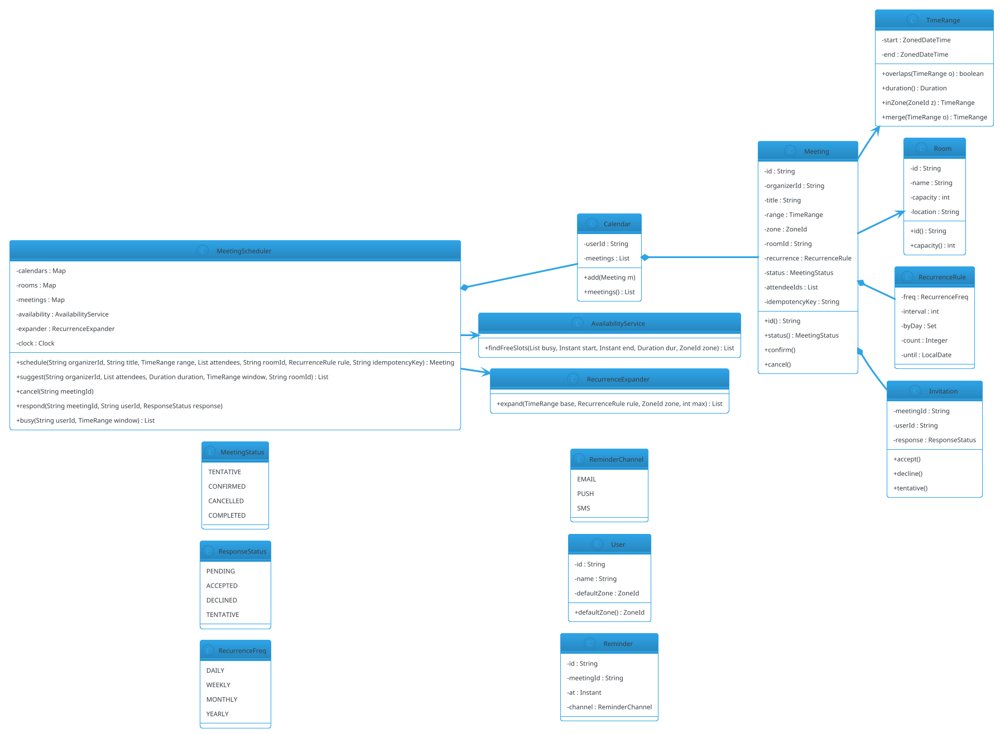

# Meeting Scheduler

## Problem Statement

Design a meeting scheduler that lets users book meetings with other attendees and reserve rooms, handling **date-time ranges**, **time zones**, **recurring events**, and **cross-attendee availability**. Users see a calendar, propose meeting times, and the system finds a slot where all attendees and a room are free.

**Reused primitives (see reference files):**
- Date-range overlap: `06-hotel-management.md` §6.1 (`DateRange.overlaps`)
- Reservation/hold lifecycle: `11-movie-ticket-booking.md` §6.5 (state machine, holds)
- Resource allocation: `11-movie-ticket-booking.md` §6.6 (`SeatAllocator` pattern)

**New concepts unique to this problem:**
1. **Time zones** — DST, UTC vs local, cross-region meetings
2. **Recurrence** — RRULE (RFC 5545) for repeating events
3. **N-way availability intersection** — find a slot free for all attendees + room
4. **Buffer times** — prep/cleanup windows around meetings
5. **Attendee responses** — accept / decline / tentative per invitee

---

## 1. Requirements

### Functional
- **Users**: register; each has a calendar
- **Events**: create with title, attendees, time range, timezone, room (optional)
- **Recurrence**: daily/weekly/monthly rules with exceptions
- **Availability**: query free/busy for one or more users over a range
- **Slot suggestion**: given attendees + duration, propose free slots
- **Room booking**: rooms as resources; conflict detection
- **Invitations**: attendees accept/decline/tentative
- **Reminders**: notify at T-15 min, T-5 min
- **Update/cancel**: modify or cancel events; propagate to attendees

### Non-Functional
- **Thread-safe**: concurrent booking, concurrent accept/decline
- **Time-zone-correct**: DST-safe, cross-region meetings correct
- **Extensible**: new recurrence rules, new reminder channels
- **Idempotent**: event creation retries safe
- **Auditable**: event history
- **Latency**: slot suggestion < 500 ms for 10 attendees × 1-week window

### Out of Scope
- Video conferencing (separate; see `29-video-conferencing.md`)
- Calendar sync with external providers (Google, Outlook)
- Natural language parsing ("next Tuesday at 3")
- ML-based meeting length prediction

---

## 2. Use Cases (brief)

| # | Use Case | Actor |
|---|---|---|
| UC1 | Create single event | Organizer |
| UC2 | Create recurring event | Organizer |
| UC3 | Modify/cancel an occurrence | Organizer |
| UC4 | Query free/busy for user(s) | Any user |
| UC5 | Suggest slots for attendees + duration | Organizer |
| UC6 | Book room + attendees atomically | Organizer |
| UC7 | Attendee accepts/declines | Attendee |
| UC8 | Send reminder | System (scheduler) |

---

## 3. Core Entities (delta)

Entities reused from references:

- `Money` (n/a here), `Location` (n/a) — not needed
- `Reservation` / state machine — analogous to `Meeting` lifecycle
- `DateRange` — extended to `TimeRange` with `ZonedDateTime`

**New entities:**

| Entity | Responsibility |
|---|---|
| `TimeRange` | Zoned start + end; DST-aware |
| `User` | Identity + calendar + timezone |
| `Calendar` | Owns events for a user |
| `Room` | Resource with capacity + location |
| `Meeting` | One event (single or one occurrence of a recurring event) |
| `RecurrenceRule` | RRULE (FREQ, INTERVAL, BYDAY, COUNT, UNTIL) |
| `Invitation` | (meetingId, userId, response) |
| `Reminder` | (meetingId, at, channel) |
| `FreeBusy` | Aggregated busy intervals for a user |
| `AvailabilityResult` | Free slots for a set of users + duration |

**Enums:**

| Enum | Values |
|---|---|
| `MeetingStatus` | TENTATIVE, CONFIRMED, CANCELLED, COMPLETED |
| `ResponseStatus` | PENDING, ACCEPTED, DECLINED, TENTATIVE |
| `RecurrenceFreq` | DAILY, WEEKLY, MONTHLY, YEARLY |
| `ReminderChannel` | EMAIL, PUSH, SMS |

---

## 4. What's New — the Three Hard Parts

### 4.1 Time Zones (DST-safe ranges)

A meeting stored in UTC but displayed in local time must round-trip correctly across DST boundaries.

**Rules:**

- Store times as **`ZonedDateTime`** with explicit zone — not `LocalDateTime`.
- Overlaps computed in **UTC** (`Instant`) to avoid DST ambiguity.
- When suggesting slots for attendees in different zones, convert to a **common zone** (organizer's) for comparison.
- Handle **non-existent** and **ambiguous** local times during DST transitions (spring forward / fall back).

**TimeRange:**

```java
public record TimeRange(java.time.ZonedDateTime start, java.time.ZonedDateTime end) {

    public TimeRange {
        if (start == null || end == null) throw new IllegalArgumentException("start/end required");
        if (!end.isAfter(start)) throw new IllegalArgumentException("end must be after start");
    }

    /** Overlap check in UTC to be DST-safe. */
    public boolean overlaps(TimeRange other) {
        java.time.Instant s1 = start.toInstant();
        java.time.Instant e1 = end.toInstant();
        java.time.Instant s2 = other.start.toInstant();
        java.time.Instant e2 = other.end.toInstant();
        return s1.isBefore(e2) && s2.isBefore(e1);
    }

    public boolean containsInstant(java.time.Instant t) {
        return !t.isBefore(start.toInstant()) && t.isBefore(end.toInstant());
    }

    public java.time.Duration duration() {
        return java.time.Duration.between(start.toInstant(), end.toInstant());
    }

    public TimeRange inZone(java.time.ZoneId zone) {
        return new TimeRange(start.withZoneSameInstant(zone), end.withZoneSameInstant(zone));
    }

    /** Merge this with an overlapping or adjacent range. */
    public TimeRange merge(TimeRange other) {
        java.time.Instant minStart = start.toInstant().isBefore(other.start.toInstant())
                ? start.toInstant() : other.start.toInstant();
        java.time.Instant maxEnd = end.toInstant().isAfter(other.end.toInstant())
                ? end.toInstant() : other.end.toInstant();
        return new TimeRange(
                minStart.atZone(start.getZone()),
                maxEnd.atZone(start.getZone())
        );
    }
}
```

**DST rules applied:**

- **Spring forward**: 02:30 local doesn't exist. When parsing, adjust to 03:30.
- **Fall back**: 01:30 local occurs twice. Java picks the earlier by default; UI should ask user which one.
- **Recurring events** across DST: keep wall-clock time in the event's zone (e.g., every Monday 9:00 AM local), then convert to UTC per occurrence.

**Storing zone:**

- Each `Meeting` has a `zone` field (organizer's TZ).
- Recurrence expands in `zone`; UTC conversion done per occurrence.

### 4.2 Recurrence (RRULE simplified)

A **recurrence rule** describes how to expand a base meeting into occurrences.

**Subset of RFC 5545 for LLD:**

| Field | Meaning | Example |
|---|---|---|
| `FREQ` | DAILY / WEEKLY / MONTHLY / YEARLY | WEEKLY |
| `INTERVAL` | Every N periods | 2 (every 2 weeks) |
| `BYDAY` | Days of week (for WEEKLY) | MO,WE,FR |
| `COUNT` | Total occurrences | 10 |
| `UNTIL` | End date | 2026-12-31 |
| `EXDATE` | Excluded dates | 2026-01-01 |
| `RDATE` | Added dates | — |

**Expansion:**

```java
public record RecurrenceRule(
        RecurrenceFreq freq,
        int interval,
        java.util.Set<java.time.DayOfWeek> byDay,
        java.time.Integer count,
        java.time.LocalDate until
) {}
```

**Expander:**

```java
public final class RecurrenceExpander {

    public java.util.List<TimeRange> expand(TimeRange base, RecurrenceRule rule,
                                            java.time.ZoneId zone, int maxOccurrences) {
        java.util.List<TimeRange> occurrences = new java.util.ArrayList<>();
        java.time.ZonedDateTime cursor = base.start();
        int emitted = 0;

        while (emitted < maxOccurrences) {
            if (rule.count() != null && emitted >= rule.count()) break;
            if (rule.until() != null && cursor.toLocalDate().isAfter(rule.until())) break;

            boolean emit = switch (rule.freq()) {
                case DAILY -> true;
                case WEEKLY -> rule.byDay() == null
                        || rule.byDay().contains(cursor.getDayOfWeek());
                case MONTHLY -> cursor.getDayOfMonth() == base.start().getDayOfMonth();
                case YEARLY -> cursor.getDayOfYear() == base.start().getDayOfYear();
            };

            if (emit) {
                java.time.Duration dur = base.duration();
                occurrences.add(new TimeRange(cursor, cursor.plus(dur)));
                emitted++;
            }
            cursor = advance(cursor, rule);
        }
        return occurrences;
    }

    private java.time.ZonedDateTime advance(java.time.ZonedDateTime cursor, RecurrenceRule rule) {
        return switch (rule.freq()) {
            case DAILY -> cursor.plusDays(rule.interval());
            case WEEKLY -> cursor.plusWeeks(1);   // step one day at a time when BYDAY set
            case MONTHLY -> cursor.plusMonths(rule.interval());
            case YEARLY -> cursor.plusYears(rule.interval());
        };
    }
}
```

**Simplification notes:**
- `WEEKLY` with `BYDAY` steps daily, emitting on matching days.
- `EXDATE` filtered post-expansion.
- Max occurrences cap (e.g., 1000) to prevent runaway.
- Recurrence expansion is **lazy** — expand on query, not on create.

### 4.3 N-way Availability Intersection

Given N attendees + duration + a date window, find free slots.

**Approach:**

1. For each attendee, fetch their **busy intervals** in the window.
2. Merge overlapping busy intervals → **minimal disjoint busy set**.
3. Compute **free intervals** = window − merged busy.
4. Intersect free intervals across all attendees → common free intervals.
5. Filter to those long enough for the duration.
6. If a room is required, intersect with the room's free intervals too.
7. Return candidates sorted by earliest start.

**Implementation:**

```java
public record Interval(java.time.Instant start, java.time.Instant end) {
    public boolean overlaps(Interval other) {
        return start.isBefore(other.end) && other.start.isBefore(end);
    }
}

public final class AvailabilityService {

    /**
     * Find common free slots for N users within [windowStart, windowEnd)
     * that fit the given duration.
     */
    public java.util.List<TimeRange> findFreeSlots(
            java.util.List<java.util.List<Interval>> busyPerUser,
            java.time.Instant windowStart,
            java.time.Instant windowEnd,
            java.time.Duration duration,
            java.time.ZoneId displayZone) {

        // Merge each user's busy intervals
        java.util.List<java.util.List<Interval>> merged = busyPerUser.stream()
                .map(this::mergeIntervals)
                .toList();

        // Intersect busy across users (union of busy = attendees' combined busy)
        java.util.List<Interval> combinedBusy = unionIntervals(merged);

        // Compute free intervals within window
        java.util.List<Interval> free = freeIntervals(windowStart, windowEnd, combinedBusy);

        // Filter by duration
        java.util.List<TimeRange> result = new java.util.ArrayList<>();
        for (Interval f : free) {
            java.time.Duration d = java.time.Duration.between(f.start(), f.end());
            if (d.compareTo(duration) >= 0) {
                result.add(new TimeRange(
                        f.start().atZone(displayZone),
                        f.end().atZone(displayZone)));
            }
        }
        return result;
    }

    private java.util.List<Interval> mergeIntervals(java.util.List<Interval> intervals) {
        if (intervals.isEmpty()) return java.util.List.of();
        java.util.List<Interval> sorted = new java.util.ArrayList<>(intervals);
        sorted.sort(java.util.Comparator.comparing(Interval::start));
        java.util.List<Interval> merged = new java.util.ArrayList<>();
        Interval current = sorted.get(0);
        for (int i = 1; i < sorted.size(); i++) {
            Interval next = sorted.get(i);
            if (!current.end().isBefore(next.start())) {
                current = new Interval(current.start(),
                        current.end().isAfter(next.end()) ? current.end() : next.end());
            } else {
                merged.add(current);
                current = next;
            }
        }
        merged.add(current);
        return merged;
    }

    private java.util.List<Interval> unionIntervals(java.util.List<java.util.List<Interval>> sets) {
        java.util.List<Interval> all = new java.util.ArrayList<>();
        for (var s : sets) all.addAll(s);
        return mergeIntervals(all);
    }

    private java.util.List<Interval> freeIntervals(java.time.Instant start,
                                                    java.time.Instant end,
                                                    java.util.List<Interval> busy) {
        java.util.List<Interval> free = new java.util.ArrayList<>();
        java.time.Instant cursor = start;
        for (Interval b : busy) {
            if (b.end().isBefore(cursor)) continue;      // entirely before window
            if (b.start().isAfter(end)) break;           // entirely after window
            if (b.start().isAfter(cursor)) {
                free.add(new Interval(cursor, b.start()));
            }
            if (b.end().isAfter(cursor)) cursor = b.end();
        }
        if (cursor.isBefore(end)) free.add(new Interval(cursor, end));
        return free;
    }
}
```

**Complexity:** O(N × M log M) where M = average events per user in window.

**Buffer times:** before merging, extend each busy interval by `bufferBefore` and `bufferAfter`. This prevents back-to-back meetings.

---

## 5. Class Diagram (delta)



---

## 6. Java Implementation (new parts only)

### 6.1 Meeting (state machine)

```java
public final class Meeting {
    private final String id;
    private final String organizerId;
    private final String title;
    private final TimeRange range;
    private final java.time.ZoneId zone;
    private final String roomId;
    private final RecurrenceRule recurrence;
    private final java.util.List<String> attendeeIds;
    private final String idempotencyKey;
    private final java.util.concurrent.locks.ReentrantLock lock = new java.util.concurrent.locks.ReentrantLock();

    private MeetingStatus status;

    public Meeting(String id, String organizerId, String title, TimeRange range,
                   java.time.ZoneId zone, String roomId, RecurrenceRule recurrence,
                   java.util.List<String> attendeeIds, String idempotencyKey) {
        this.id = id;
        this.organizerId = organizerId;
        this.title = title;
        this.range = range;
        this.zone = zone;
        this.roomId = roomId;
        this.recurrence = recurrence;
        this.attendeeIds = java.util.List.copyOf(attendeeIds);
        this.idempotencyKey = idempotencyKey;
        this.status = MeetingStatus.TENTATIVE;
    }

    public String id() { return id; }
    public String organizerId() { return organizerId; }
    public String title() { return title; }
    public TimeRange range() { return range; }
    public java.time.ZoneId zone() { return zone; }
    public String roomId() { return roomId; }
    public RecurrenceRule recurrence() { return recurrence; }
    public java.util.List<String> attendeeIds() { return attendeeIds; }
    public String idempotencyKey() { return idempotencyKey; }

    public MeetingStatus status() { lock.lock(); try { return status; } finally { lock.unlock(); } }

    public void confirm() {
        lock.lock();
        try {
            if (status == MeetingStatus.CANCELLED) throw new IllegalStateException("Cancelled");
            status = MeetingStatus.CONFIRMED;
        } finally { lock.unlock(); }
    }

    public void cancel() {
        lock.lock();
        try {
            if (status == MeetingStatus.COMPLETED) throw new IllegalStateException("Already completed");
            status = MeetingStatus.CANCELLED;
        } finally { lock.unlock(); }
    }
}
```

### 6.2 Meeting Scheduler

```java
public final class MeetingScheduler {

    private final java.util.Map<String, Calendar> calendars = new java.util.concurrent.ConcurrentHashMap<>();
    private final java.util.Map<String, Room> rooms = new java.util.concurrent.ConcurrentHashMap<>();
    private final java.util.Map<String, Meeting> meetings = new java.util.concurrent.ConcurrentHashMap<>();
    private final java.util.Map<String, String> meetingsByKey = new java.util.concurrent.ConcurrentHashMap<>();
    private final java.util.Map<String, java.util.Map<String, java.util.List<Interval>>> roomBusy = new java.util.concurrent.ConcurrentHashMap<>();

    private final AvailabilityService availability;
    private final RecurrenceExpander expander;
    private final java.time.Clock clock;

    public MeetingScheduler(AvailabilityService availability, RecurrenceExpander expander,
                            java.time.Clock clock) {
        this.availability = availability;
        this.expander = expander;
        this.clock = clock;
    }

    // ----- Calendar / Room registration -----

    public Calendar calendar(String userId) {
        return calendars.computeIfAbsent(userId, Calendar::new);
    }

    public void addRoom(Room room) {
        rooms.put(room.id(), room);
        roomBusy.put(room.id(), new java.util.concurrent.ConcurrentHashMap<>());
    }

    // ----- Busy intervals -----

    public java.util.List<Interval> busy(String userId, TimeRange window) {
        Calendar cal = calendars.get(userId);
        if (cal == null) return java.util.List.of();
        return cal.meetings().stream()
                .filter(m -> m.status() != MeetingStatus.CANCELLED)
                .filter(m -> m.range().overlaps(window))
                .map(m -> new Interval(m.range().start().toInstant(), m.range().end().toInstant()))
                .toList();
    }

    public java.util.List<Interval> roomBusy(String roomId, TimeRange window) {
        java.util.Map<String, java.util.List<Interval>> map = roomBusy.get(roomId);
        if (map == null) return java.util.List.of();
        java.util.List<Interval> all = new java.util.ArrayList<>();
        for (var list : map.values()) all.addAll(list);
        return all.stream()
                .filter(i -> !i.end().isBefore(window.start().toInstant())
                          && i.start().isBefore(window.end().toInstant()))
                .toList();
    }

    // ----- Suggest -----

    public java.util.List<TimeRange> suggest(String organizerId, java.util.List<String> attendees,
                                             java.time.Duration duration, TimeRange window,
                                             String roomId) {
        java.util.List<String> allUsers = new java.util.ArrayList<>(attendees);
        if (!allUsers.contains(organizerId)) allUsers.add(organizerId);

        java.util.List<java.util.List<Interval>> busyPerUser = new java.util.ArrayList<>();
        for (String u : allUsers) busyPerUser.add(busy(u, window));
        if (roomId != null) busyPerUser.add(roomBusy(roomId, window));

        return availability.findFreeSlots(busyPerUser,
                window.start().toInstant(), window.end().toInstant(),
                duration, window.start().getZone());
    }

    // ----- Schedule -----

    public Meeting schedule(String organizerId, String title, TimeRange range,
                            java.util.List<String> attendees, String roomId,
                            RecurrenceRule rule, String idempotencyKey) {

        // Idempotency
        String existingId = meetingsByKey.get(idempotencyKey);
        if (existingId != null) return meetings.get(existingId);

        // Conflict check for attendees
        java.util.List<String> allUsers = new java.util.ArrayList<>(attendees);
        if (!allUsers.contains(organizerId)) allUsers.add(organizerId);

        for (String u : allUsers) {
            for (Interval busy : busy(u, range)) {
                if (busy.overlaps(new Interval(range.start().toInstant(), range.end().toInstant()))) {
                    throw new IllegalStateException("Conflict for user " + u);
                }
            }
        }

        // Room conflict check
        if (roomId != null) {
            if (!rooms.containsKey(roomId)) throw new IllegalArgumentException("Unknown room: " + roomId);
            for (Interval busy : roomBusy(roomId, range)) {
                if (busy.overlaps(new Interval(range.start().toInstant(), range.end().toInstant()))) {
                    throw new IllegalStateException("Room already booked: " + roomId);
                }
            }
        }

        Meeting meeting = new Meeting(java.util.UUID.randomUUID().toString(),
                organizerId, title, range, range.start().getZone(), roomId, rule,
                attendees, idempotencyKey);
        meetings.put(meeting.id(), meeting);
        meetingsByKey.put(idempotencyKey, meeting.id());

        // Add to each attendee's calendar
        calendar(organizerId).add(meeting);
        for (String u : attendees) calendar(u).add(meeting);

        // Book room
        if (roomId != null) {
            roomBusy.get(roomId)
                    .computeIfAbsent(meeting.id(), k -> new java.util.ArrayList<>())
                    .add(new Interval(range.start().toInstant(), range.end().toInstant()));
        }

        meeting.confirm();
        return meeting;
    }

    public void cancel(String meetingId) {
        Meeting m = meetings.get(meetingId);
        if (m == null) throw new IllegalArgumentException("Unknown meeting");
        m.cancel();
        if (m.roomId() != null) {
            var map = roomBusy.get(m.roomId());
            if (map != null) map.remove(meetingId);
        }
    }
}
```

### 6.3 Calendar (simple holder)

```java
public final class Calendar {
    private final String userId;
    private final java.util.List<Meeting> meetings = new java.util.concurrent.CopyOnWriteArrayList<>();

    public Calendar(String userId) { this.userId = userId; }
    public String userId() { return userId; }
    public void add(Meeting m) { meetings.add(m); }
    public java.util.List<Meeting> meetings() { return java.util.List.copyOf(meetings); }
}
```

### 6.4 Demo

```java
public class Demo {
    public static void main(String[] args) {
        MeetingScheduler scheduler = new MeetingScheduler(
                new AvailabilityService(), new RecurrenceExpander(), java.time.Clock.systemUTC());

        scheduler.calendar("alice");
        scheduler.calendar("bob");
        scheduler.calendar("carol");

        scheduler.addRoom(new Room("R1", "Boardroom", 10, "Floor 5"));

        // Bob has a busy slot 10-11 AM
        TimeRange bobBusy = new TimeRange(
                java.time.ZonedDateTime.parse("2026-01-15T10:00:00+05:30[Asia/Kolkata]"),
                java.time.ZonedDateTime.parse("2026-01-15T11:00:00+05:30[Asia/Kolkata]"));
        scheduler.schedule("bob", "1:1", bobBusy, java.util.List.of(), null, null, "key-busy-bob");

        // Suggest a slot for Alice + Bob + Carol, 30 min, on Jan 15
        TimeRange window = new TimeRange(
                java.time.ZonedDateTime.parse("2026-01-15T09:00:00+05:30[Asia/Kolkata]"),
                java.time.ZonedDateTime.parse("2026-01-15T18:00:00+05:30[Asia/Kolkata]"));

        var slots = scheduler.suggest("alice", java.util.List.of("bob", "carol"),
                java.time.Duration.ofMinutes(30), window, "R1");

        System.out.println("Suggested slots (first 3):");
        slots.stream().limit(3).forEach(s -> System.out.println("  " + s.start() + " -> " + s.end()));
    }
}
```

---

## 7. Concurrency Considerations

Reused from `12-cab-booking.md` §7:
- `ReentrantLock` on entities (`Meeting`)
- `ConcurrentHashMap` for maps
- Idempotency key dedup for schedule
- Lock per resource (room) during booking

**New to Meeting Scheduler:**

- **Booking a meeting locks both attendees' calendars and the room.** Order: sort keys alphabetically (`user:alice`, `user:bob`, `room:R1`) and lock in that order to avoid deadlock.
- **Recurrence expansion is read-only** — no lock needed; the underlying `Calendar` is a `CopyOnWriteArrayList`.
- **Room busy map is per-room** — `synchronized (roomBusy.get(roomId))` during booking to serialize the check-and-insert.
- **Cross-time-zone booking** doesn't change lock semantics; overlap checks use `Instant` (UTC).

Recommended locking pattern for `schedule`:

```java
synchronized (lockFor(organizerId)) {
    for (String u : sortedAttendees) {
        synchronized (lockFor(u)) {
            // check + insert
        }
    }
}
```

Or simpler: **lock all participant keys in sorted order**:

```java
List<String> keys = allKeysSorted();
for (String k : keys) locks.get(k).lock();
try {
    // check + insert
} finally {
    for (int i = keys.size() - 1; i >= 0; i--) locks.get(keys.get(i)).unlock();
}
```

---

## 8. Extensibility

| Feature | Change |
|---|---|
| New recurrence rule | Extend `RecurrenceFreq`; update `RecurrenceExpander` |
| New reminder channel | Extend `ReminderChannel`; add notifier |
| External calendar sync (Google, Outlook) | Add `CalendarSyncAdapter` (Adapter pattern, see `structural.md`) |
| Video conference link | Add `videoLink` field to `Meeting`; generate on confirm |
| Multi-room booking | `Meeting` holds `List<String> roomIds`; book all |
| Time-zone-aware display | Already supported; the `TimeRange.inZone()` method |
| Working hours constraint | Add `workingHours` per user; exclude slots outside |

---

## 9. Common Pitfalls

| Pitfall | Fix |
|---|---|
| Using `LocalDateTime` | Use `ZonedDateTime`; convert to `Instant` for comparisons |
| Not handling DST spring-forward | Reject/adjust non-existent local times |
| Not handling DST fall-back | Ask user which instance; or default to earlier |
| Storing recurrence, not occurrences | Expand lazily per query |
| No max-occurrence cap | Cap at 1000 to prevent runaway |
| Buffer ignored | Extend busy intervals by buffer minutes before merging |
| Locking only one calendar | Lock all attendee calendars + room in sorted order |
| Assuming single time zone | Always convert to a common zone for display |

---

## 10. Follow-ups

### Q1: How do you handle DST correctly?

**Answer:** Store as `ZonedDateTime`. Overlap checks use `toInstant()` (UTC). Recurring events keep wall-clock time in their zone, so a "9 AM Monday" meeting stays 9 AM local even if DST shifts. When parsing a user-entered local time that falls in a DST gap, adjust forward by the gap.

### Q2: How do you find a slot for 10 people across 3 time zones?

**Answer:** Convert all busy intervals to UTC. Intersect. Convert free slots back to each attendee's zone for display. Same algorithm — time zones only affect presentation, not the intersection math.

### Q3: How do you handle recurring event edits?

**Answer:** Three modes: "this occurrence", "this and future", "all occurrences". Implementation: for "this", add `EXDATE` to the rule. For "this and future", split the recurrence at the edit point into two rules. For "all", modify the base rule.

### Q4: How would you test this?

- **Unit tests** for `AvailabilityService` (merge, free intervals), `RecurrenceExpander` (weekly, monthly, count, until)
- **DST tests** — event across spring/fall transition; parse a non-existent local time
- **Time zone tests** — meeting 9 AM IST ↔ 7:30 AM PST
- **Concurrency test** — many simultaneous bookings of the same room
- **Property test** — invariant: no two confirmed meetings for the same user or room overlap

### Q5: How do you handle a meeting that crosses midnight?

**Answer:** Nothing special — `TimeRange` accepts any start/end. Overlap math is time-agnostic. Only display should clarify "ends next day".

---

## 11. Similar Problems

- **Hotel Booking** (`06-hotel-management.md`) — date-range overlap; no time zone or recurrence
- **Movie Booking** (`11-movie-ticket-booking.md`) — resource hold with expiry
- **Library Management** (`05-library-management.md`) — resource loan with due dates
- **Cab Booking** (`12-cab-booking.md`) — real-time resource assignment

Meeting Scheduler's unique additions: **time zones**, **recurrence**, **N-way intersection**, **buffers**.

---

## 12. Key Takeaways

- **Use `ZonedDateTime` + `Instant`** — never raw `LocalDateTime` for cross-zone logic
- **Overlap math in UTC** — convert once; compare in `Instant`
- **Recurrence is lazy** — store the rule, expand on query
- **Max occurrences cap** — prevent runaway expansion
- **RRULE subset** — FREQ, INTERVAL, BYDAY, COUNT, UNTIL, EXDATE is enough for LLD
- **N-way intersection** — merge busy per user, union across users, complement of window = free
- **Buffer times** — extend busy intervals before merging
- **Room is just another attendee** for availability purposes
- **Lock all participant keys in sorted order** — avoid deadlock
- **Idempotency key** on `schedule` — safe retries
- **Recurrence edits** — this / this and future / all (implemented via EXDATE or rule split)
- **Room booking race** — serialize with a lock per room + re-check

### The Delta Recipe

For any **calendar / time-range booking** problem:

1. **`TimeRange` with `ZonedDateTime`** — UTC for compare, local for display
2. **Recurrence as a rule** — not materialized occurrences
3. **Busy/free intervals** — merge busy, subtract from window
4. **N-way intersection** — union busy across attendees; complement against window
5. **Buffer times** — expand busy before merging
6. **Sorted locking** — lock attendee calendars + room in alphabetical key order
7. **Idempotency key** — dedup on schedule
8. **Three-edit modes for recurrence** — this / future / all

This delta plus the resource-booking skeleton from #11 solves: Meeting Scheduler, Calendar systems, Room Booking, Interview Scheduling, Appointment Booking (with variations in recurrence and cross-zone needs).