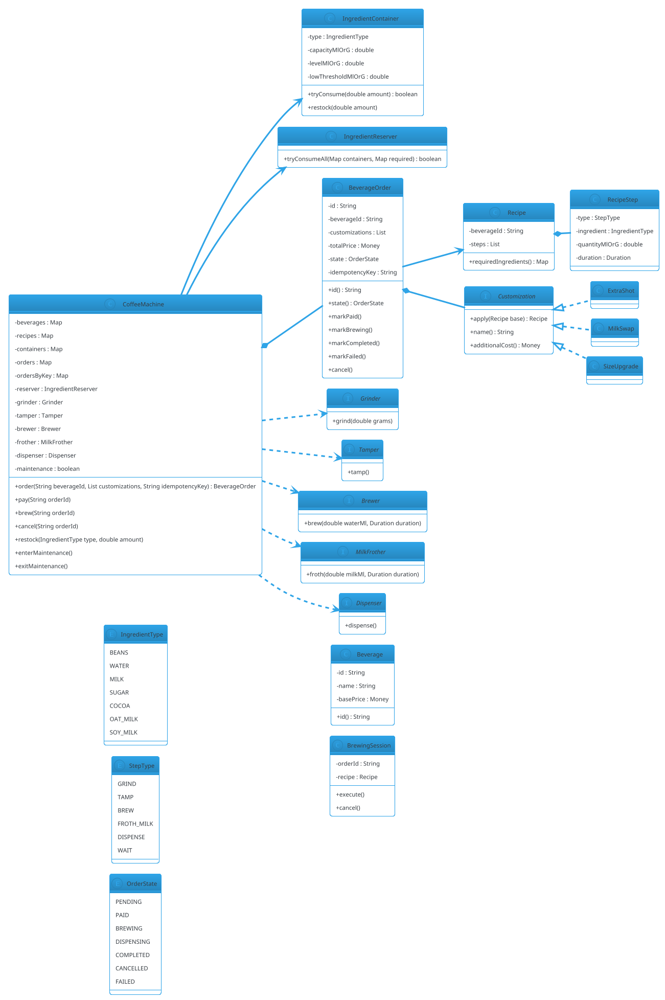

# Coffee Machine

## Problem Statement

Design a coffee machine (like a Nespresso, Keurig, or commercial espresso machine) that accepts user selections, dispenses beverages from configurable recipes, tracks ingredient inventory, handles concurrent requests, and manages hardware operations (grinding, brewing, frothing). It supports multiple beverage types (Espresso, Latte, Cappuccino, etc.), customizations (extra shot, milk alternatives, sweetness), and maintenance cycles (descaling, cleaning).

**Reused primitives (see reference files):**
- State machine (Idle → Selecting → Brewing → Dispensing): `02-vending-machine.md` §4-6
- Inventory with atomic decrement: `02-vending-machine.md` §6.2 and `11-movie-ticket-booking.md` §6.6
- Money handling: `03-atm.md` §6.1
- Hardware abstraction (motor, dispenser): `02-vending-machine.md` §6.6
- Observer for notifications: `04-elevator-system.md` §5.3

**New concepts unique to this problem:**
1. **Recipes** — declarative beverage definitions (ingredient quantities + brew steps)
2. **Ingredient inventory** — beans, water, milk, sugar, cocoa; each with its own container and threshold
3. **Recipe execution pipeline** — sequential steps (grind → tamp → brew → froth → dispense)
4. **Multi-container dispensing** — one beverage pulls from multiple ingredient containers
5. **Customizations** — modifiers that mutate the base recipe (extra shot, oat milk, less sugar)
6. **Maintenance cycles** — descaling, cleaning; blocks new orders
7. **Waste tracking** — grounds, spilled milk; some recipes produce waste
8. **Concurrent beverages** — a commercial machine can brew 2 beverages simultaneously on different heads (rare in home machines; common in cafés)

---

## 1. Requirements

### Functional Requirements

- **Beverage catalog**: list of beverages with prices
- **Recipes**: each beverage maps to ingredient quantities + brew steps
- **Customizations**: size (S/M/L), strength (mild/normal/strong), milk type (regular/oat/soy/almond), extra shot
- **Select beverage**: user picks from menu; may customize
- **Payment**: coins, card, mobile wallet (reuse from ATM)
- **Brew**: execute recipe steps in order, dispensing ingredients
- **Inventory tracking**: per-ingredient container with level
- **Low inventory alerts**: notify operator when below threshold
- **Maintenance mode**: descale / clean; blocks orders
- **Admin**: restock ingredients, update recipes, add beverages
- **Concurrent brewing**: 2 beverages at once (commercial); 1 for home
- **Cancellation**: user can cancel before brewing starts
- **Refund**: on failure (out of ingredient, hardware error)
- **Cup detection**: sensor detects cup presence

### Non-Functional Requirements

- **Thread-safe**: concurrent orders on commercial machines
- **Extensible**: new beverages, ingredients, customizations without code changes
- **Fault-tolerant**: ingredient empty, hardware jam, water low
- **Low latency**: brew start < 2 s after payment
- **Auditable**: every beverage logged (type, customizations, timestamp)
- **Idempotent**: user retry doesn't double-brew

### Out of Scope

- Physical hardware control (motor protocols)
- Coffee quality / temperature control loops
- Mobile app
- Loyalty programs
- Multi-machine coordination

---

## 2. Use Cases (brief)

| # | Use Case | Actor |
|---|---|---|
| UC1 | Browse beverages | User |
| UC2 | Select beverage + customizations | User |
| UC3 | Pay | User |
| UC4 | Brew | System |
| UC5 | Cancel before brewing | User |
| UC6 | Restock ingredient | Admin |
| UC7 | Update recipe | Admin |
| UC8 | Add beverage | Admin |
| UC9 | Run maintenance cycle | Admin |
| UC10 | Low-inventory alert | System |

---

## 3. Core Entities (delta)

**New entities:**

| Entity | Responsibility |
|---|---|
| `Beverage` | A menu item (name, price, base recipe) |
| `Recipe` | Ordered steps + ingredient quantities |
| `RecipeStep` | One step (grind, brew, froth, dispense, wait) |
| `Ingredient` | A consumable (beans, water, milk, sugar, cocoa) |
| `IngredientContainer` | Physical container: level, capacity, threshold |
| `Customization` | Modifiers applied to base recipe |
| `BeverageOrder` | A user request (beverage + customizations + state) |
| `BrewingSession` | Active execution of a recipe |
| `MaintenanceMode` | Descale / clean cycle |

**Enums:**

| Enum | Values |
|---|---|
| `IngredientType` | BEANS, WATER, MILK, SUGAR, COCOA, OAT_MILK, SOY_MILK |
| `BeverageType` | ESPRESSO, LATTE, CAPPUCCINO, AMERICANO, MOCHA, HOT_WATER |
| `OrderState` | PENDING, PAID, BREWING, DISPENSING, COMPLETED, CANCELLED, FAILED |
| `StepType` | GRIND, TAMP, BREW, FROTH_MILK, DISPENSE, WAIT |

---

## 4. What's New — the Four Hard Parts

### 4.1 Recipes as Data

**Recipes are data, not code.** A recipe is a list of steps, each with ingredient quantities. Adding a new beverage = adding a recipe, no code change.

```java
public record RecipeStep(
        StepType type,
        IngredientType ingredient,     // nullable for WAIT
        double quantityMlOrG,          // amount (ml for liquids, g for beans/sugar)
        java.time.Duration duration    // for WAIT or brew time
) {}
```

```java
public final class Recipe {
    private final String beverageId;
    private final java.util.List<RecipeStep> steps;

    public Recipe(String beverageId, java.util.List<RecipeStep> steps) {
        if (steps == null || steps.isEmpty()) throw new IllegalArgumentException("Steps required");
        this.beverageId = beverageId;
        this.steps = java.util.List.copyOf(steps);
    }

    public String beverageId() { return beverageId; }
    public java.util.List<RecipeStep> steps() { return steps; }

    /** Total required ingredient amounts (sum across steps). */
    public java.util.Map<IngredientType, Double> requiredIngredients() {
        java.util.Map<IngredientType, Double> req = new java.util.EnumMap<>(IngredientType.class);
        for (RecipeStep s : steps) {
            if (s.ingredient() != null) {
                req.merge(s.ingredient(), s.quantityMlOrG(), Double::sum);
            }
        }
        return req;
    }
}
```

**Example recipes:**

```java
Recipe espresso = new Recipe("ESPRESSO", java.util.List.of(
        new RecipeStep(StepType.GRIND, IngredientType.BEANS, 18, null),
        new RecipeStep(StepType.TAMP, null, 0, null),
        new RecipeStep(StepType.BREW, IngredientType.WATER, 30, java.time.Duration.ofSeconds(25)),
        new RecipeStep(StepType.DISPENSE, null, 0, null)
));

Recipe latte = new Recipe("LATTE", java.util.List.of(
        new RecipeStep(StepType.GRIND, IngredientType.BEANS, 18, null),
        new RecipeStep(StepType.TAMP, null, 0, null),
        new RecipeStep(StepType.BREW, IngredientType.WATER, 30, java.time.Duration.ofSeconds(25)),
        new RecipeStep(StepType.FROTH_MILK, IngredientType.MILK, 150, java.time.Duration.ofSeconds(10)),
        new RecipeStep(StepType.DISPENSE, null, 0, null)
));
```

**Why this matters:** New beverages (flat white, macchiato, cortado) are just new `Recipe` entries. The brewing engine iterates steps generically.

### 4.2 Customizations as Recipe Transforms

Customizations are **transformations** on the base recipe. This keeps the menu small and the customization logic centralized.

```java
public interface Customization {
    Recipe apply(Recipe base);
    String name();
    Money additionalCost();
}
```

**Examples:**

```java
public final class ExtraShot implements Customization {
    @Override
    public Recipe apply(Recipe base) {
        java.util.List<RecipeStep> steps = new java.util.ArrayList<>(base.steps());
        // Insert an extra grind+brew+dispense at the beginning
        steps.add(0, new RecipeStep(StepType.GRIND, IngredientType.BEANS, 18, null));
        steps.add(1, new RecipeStep(StepType.BREW, IngredientType.WATER, 30, java.time.Duration.ofSeconds(25)));
        return new Recipe(base.beverageId() + "+EXTRA_SHOT", steps);
    }
    @Override public String name() { return "Extra Shot"; }
    @Override public Money additionalCost() { return Money.usd(0.75); }
}

public final class MilkSwap implements Customization {
    private final IngredientType from;
    private final IngredientType to;

    public MilkSwap(IngredientType from, IngredientType to) {
        this.from = from;
        this.to = to;
    }

    @Override
    public Recipe apply(Recipe base) {
        java.util.List<RecipeStep> steps = base.steps().stream()
                .map(s -> s.ingredient() == from
                        ? new RecipeStep(s.type(), to, s.quantityMlOrG(), s.duration())
                        : s)
                .toList();
        return new Recipe(base.beverageId() + "+" + to, steps);
    }
    @Override public String name() { return "Milk → " + to; }
    @Override public Money additionalCost() { return Money.usd(0.50); }
}

public final class SizeUpgrade implements Customization {
    private final double multiplier;
    public SizeUpgrade(double multiplier) { this.multiplier = multiplier; }

    @Override
    public Recipe apply(Recipe base) {
        java.util.List<RecipeStep> steps = base.steps().stream()
                .map(s -> new RecipeStep(s.type(), s.ingredient(),
                        s.quantityMlOrG() * multiplier, s.duration()))
                .toList();
        return new Recipe(base.beverageId() + "+LARGE", steps);
    }
    @Override public String name() { return "Large"; }
    @Override public Money additionalCost() { return Money.usd(1.00); }
}
```

**Composition:** Multiple customizations compose:

```java
Recipe customized = base;
for (Customization c : customizations) customized = c.apply(customized);
```

### 4.3 Ingredient Inventory with Atomic Multi-Ingredient Reservation

Same pattern as Airline's multi-cell reservation, but applied to ingredients instead of seats.

**Model:**

```java
public final class IngredientContainer {
    private final IngredientType type;
    private final double capacityMlOrG;
    private final java.util.concurrent.locks.ReentrantLock lock = new java.util.concurrent.locks.ReentrantLock();

    private double levelMlOrG;
    private final double lowThresholdMlOrG;

    public IngredientContainer(IngredientType type, double capacityMlOrG, double lowThresholdMlOrG) {
        this.type = type;
        this.capacityMlOrG = capacityMlOrG;
        this.lowThresholdMlOrG = lowThresholdMlOrG;
        this.levelMlOrG = capacityMlOrG;
    }

    public IngredientType type() { return type; }
    public double level() { lock.lock(); try { return levelMlOrG; } finally { lock.unlock(); } }
    public boolean isLow() { return level() < lowThresholdMlOrG; }

    /** Atomically reserve `amount`. Returns true iff level was sufficient. */
    public boolean tryConsume(double amount) {
        lock.lock();
        try {
            if (levelMlOrG < amount) return false;
            levelMlOrG -= amount;
            return true;
        } finally { lock.unlock(); }
    }

    public void restock(double amount) {
        lock.lock();
        try { levelMlOrG = Math.min(capacityMlOrG, levelMlOrG + amount); }
        finally { lock.unlock(); }
    }

    public void refill() {
        lock.lock();
        try { levelMlOrG = capacityMlOrG; }
        finally { lock.unlock(); }
    }
}
```

**Multi-ingredient reservation:**

```java
public final class IngredientReserver {

    /** Try to consume all required ingredients. Rollback on any failure. */
    public boolean tryConsumeAll(java.util.Map<IngredientType, IngredientContainer> containers,
                                 java.util.Map<IngredientType, Double> required) {
        java.util.Map<IngredientType, Double> consumed = new java.util.EnumMap<>(IngredientType.class);

        for (var entry : required.entrySet()) {
            IngredientContainer c = containers.get(entry.getKey());
            if (c == null || !c.tryConsume(entry.getValue())) {
                // Rollback
                for (var c2 : consumed.entrySet()) {
                    containers.get(c2.getKey()).restock(c2.getValue());
                }
                return false;
            }
            consumed.put(entry.getKey(), entry.getValue());
        }
        return true;
    }
}
```

**Why:** A latte needs beans + water + milk. If milk is out, we shouldn't have consumed beans already. Rollback restores state.

### 4.4 Recipe Execution Pipeline

Brewing is a sequence of steps. The engine iterates them, delegating to hardware abstractions. If any step fails, the whole beverage fails (and inventory is rolled back).

**Hardware interfaces:**

```java
public interface Grinder { void grind(double grams); }
public interface Tamper { void tamp(); }
public interface Brewer { void brew(double waterMl, java.time.Duration duration); }
public interface MilkFrother { void froth(double milkMl, java.time.Duration duration); }
public interface Dispenser { void dispense(); }
```

**Brewer (state machine):**

```java
public final class BrewingSession {
    private final String orderId;
    private final Recipe recipe;
    private final Grinder grinder;
    private final Tamper tamper;
    private final Brewer brewer;
    private final MilkFrother frother;
    private final Dispenser dispenser;
    private volatile boolean cancelled;

    public BrewingSession(String orderId, Recipe recipe,
                          Grinder grinder, Tamper tamper, Brewer brewer,
                          MilkFrother frother, Dispenser dispenser) {
        this.orderId = orderId;
        this.recipe = recipe;
        this.grinder = grinder;
        this.tamper = tamper;
        this.brewer = brewer;
        this.frother = frother;
        this.dispenser = dispenser;
    }

    public void cancel() { cancelled = true; }

    /** Runs all steps sequentially. Throws on failure. */
    public void execute() {
        for (RecipeStep step : recipe.steps()) {
            if (cancelled) throw new IllegalStateException("Brewing cancelled");
            switch (step.type()) {
                case GRIND -> grinder.grind(step.quantityMlOrG());
                case TAMP -> tamper.tamp();
                case BREW -> brewer.brew(step.quantityMlOrG(), step.duration());
                case FROTH_MILK -> frother.froth(step.quantityMlOrG(), step.duration());
                case DISPENSE -> dispenser.dispense();
                case WAIT -> sleep(step.duration());
            }
        }
    }

    private void sleep(java.time.Duration d) {
        try { Thread.sleep(d.toMillis()); } catch (InterruptedException e) { Thread.currentThread().interrupt(); }
    }
}
```

**Execution is sequential.** Real machines are also sequential per head (grind → tamp → brew → froth). Parallelism (multiple heads) is handled at the machine level, not the session level.

---

## 5. Class Diagram (delta)



---

## 6. Java Implementation (new parts only)

### 6.1 Beverage

```java
public final class Beverage {
    private final String id;
    private final String name;
    private final Money basePrice;

    public Beverage(String id, String name, Money basePrice) {
        this.id = id;
        this.name = name;
        this.basePrice = basePrice;
    }

    public String id() { return id; }
    public String name() { return name; }
    public Money basePrice() { return basePrice; }
}
```

### 6.2 BeverageOrder

```java
public final class BeverageOrder {
    private final String id;
    private final String beverageId;
    private final java.util.List<Customization> customizations;
    private final Money totalPrice;
    private final String idempotencyKey;
    private final java.util.concurrent.locks.ReentrantLock lock = new java.util.concurrent.locks.ReentrantLock();

    private OrderState state;

    public BeverageOrder(String id, String beverageId,
                         java.util.List<Customization> customizations,
                         Money totalPrice, String idempotencyKey) {
        this.id = id;
        this.beverageId = beverageId;
        this.customizations = java.util.List.copyOf(customizations);
        this.totalPrice = totalPrice;
        this.idempotencyKey = idempotencyKey;
        this.state = OrderState.PENDING;
    }

    public String id() { return id; }
    public String beverageId() { return beverageId; }
    public java.util.List<Customization> customizations() { return customizations; }
    public Money totalPrice() { return totalPrice; }
    public String idempotencyKey() { return idempotencyKey; }
    public OrderState state() { lock.lock(); try { return state; } finally { lock.unlock(); } }

    public void markPaid() {
        lock.lock();
        try {
            if (state != OrderState.PENDING) throw new IllegalStateException("Not pending");
            state = OrderState.PAID;
        } finally { lock.unlock(); }
    }

    public void markBrewing() {
        lock.lock();
        try {
            if (state != OrderState.PAID) throw new IllegalStateException("Not paid");
            state = OrderState.BREWING;
        } finally { lock.unlock(); }
    }

    public void markCompleted() {
        lock.lock();
        try { state = OrderState.COMPLETED; }
        finally { lock.unlock(); }
    }

    public void markFailed() {
        lock.lock();
        try { state = OrderState.FAILED; }
        finally { lock.unlock(); }
    }

    public void cancel() {
        lock.lock();
        try {
            if (state != OrderState.PENDING) throw new IllegalStateException("Cannot cancel: " + state);
            state = OrderState.CANCELLED;
        } finally { lock.unlock(); }
    }
}
```

### 6.3 CoffeeMachine

```java
public final class CoffeeMachine {

    public static final int MAX_CONCURRENT_BREWS = 1;   // home machine; commercial = 2+

    private final java.util.Map<String, Beverage> beverages = new java.util.concurrent.ConcurrentHashMap<>();
    private final java.util.Map<String, Recipe> recipes = new java.util.concurrent.ConcurrentHashMap<>();
    private final java.util.Map<IngredientType, IngredientContainer> containers = new java.util.concurrent.ConcurrentHashMap<>();
    private final java.util.Map<String, BeverageOrder> orders = new java.util.concurrent.ConcurrentHashMap<>();
    private final java.util.Map<String, String> ordersByKey = new java.util.concurrent.ConcurrentHashMap<>();

    private final IngredientReserver reserver;
    private final Grinder grinder;
    private final Tamper tamper;
    private final Brewer brewer;
    private final MilkFrother frother;
    private final Dispenser dispenser;

    private final java.util.concurrent.Semaphore brewSlots = new java.util.concurrent.Semaphore(MAX_CONCURRENT_BREWS);
    private volatile boolean maintenance = false;

    public CoffeeMachine(IngredientReserver reserver,
                         Grinder grinder, Tamper tamper, Brewer brewer,
                         MilkFrother frother, Dispenser dispenser) {
        this.reserver = reserver;
        this.grinder = grinder;
        this.tamper = tamper;
        this.brewer = brewer;
        this.frother = frother;
        this.dispenser = dispenser;
    }

    // ----- Admin -----

    public void addBeverage(Beverage b, Recipe r) {
        beverages.put(b.id(), b);
        recipes.put(b.id(), r);
    }

    public void addContainer(IngredientContainer c) {
        containers.put(c.type(), c);
    }

    public void restock(IngredientType type, double amount) {
        IngredientContainer c = containers.get(type);
        if (c == null) throw new IllegalArgumentException("Unknown ingredient: " + type);
        c.restock(amount);
    }

    public void enterMaintenance() { maintenance = true; }
    public void exitMaintenance() { maintenance = false; }

    // ----- Order -----

    public BeverageOrder order(String beverageId, java.util.List<Customization> customizations,
                               String idempotencyKey) {
        if (maintenance) throw new IllegalStateException("Maintenance in progress");

        String existingId = ordersByKey.get(idempotencyKey);
        if (existingId != null) return orders.get(existingId);

        Beverage b = beverages.get(beverageId);
        if (b == null) throw new IllegalArgumentException("Unknown beverage: " + beverageId);
        Recipe base = recipes.get(beverageId);

        // Apply customizations
        Recipe customized = base;
        Money total = b.basePrice();
        for (Customization c : customizations) {
            customized = c.apply(customized);
            total = total.plus(c.additionalCost());
        }

        BeverageOrder order = new BeverageOrder(java.util.UUID.randomUUID().toString(),
                beverageId, customizations, total, idempotencyKey);
        orders.put(order.id(), order);
        ordersByKey.put(idempotencyKey, order.id());
        return order;
    }

    // ----- Pay -----

    public void pay(String orderId) {
        BeverageOrder order = requireOrder(orderId);
        order.markPaid();
    }

    // ----- Brew -----

    public void brew(String orderId) {
        BeverageOrder order = requireOrder(orderId);
        if (order.state() != OrderState.PAID) throw new IllegalStateException("Not paid");

        // Try to acquire brew slot
        try {
            if (!brewSlots.tryAcquire(5, java.util.concurrent.TimeUnit.SECONDS)) {
                throw new IllegalStateException("Machine busy");
            }
        } catch (InterruptedException e) {
            Thread.currentThread().interrupt();
            throw new IllegalStateException("Interrupted");
        }

        try {
            // Compute required ingredients
            Recipe base = recipes.get(order.beverageId());
            Recipe customized = base;
            for (Customization c : order.customizations()) customized = c.apply(customized);
            java.util.Map<IngredientType, Double> required = customized.requiredIngredients();

            // Reserve
            if (!reserver.tryConsumeAll(containers, required)) {
                order.markFailed();
                throw new IllegalStateException("Insufficient ingredients");
            }

            order.markBrewing();

            // Execute recipe
            BrewingSession session = new BrewingSession(order.id(), customized,
                    grinder, tamper, brewer, frother, dispenser);
            try {
                session.execute();
                order.markCompleted();
            } catch (Exception e) {
                // Rollback ingredients
                for (var entry : required.entrySet()) {
                    containers.get(entry.getKey()).restock(entry.getValue());
                }
                order.markFailed();
                throw new RuntimeException("Brewing failed: " + e.getMessage(), e);
            }
        } finally {
            brewSlots.release();
        }
    }

    public void cancel(String orderId) {
        BeverageOrder order = requireOrder(orderId);
        order.cancel();
    }

    private BeverageOrder requireOrder(String id) {
        BeverageOrder o = orders.get(id);
        if (o == null) throw new IllegalArgumentException("Unknown order: " + id);
        return o;
    }
}
```

### 6.4 Hardware Mocks

```java
public interface Grinder { void grind(double grams); }
public interface Tamper { void tamp(); }
public interface Brewer { void brew(double waterMl, java.time.Duration duration); }
public interface MilkFrother { void froth(double milkMl, java.time.Duration duration); }
public interface Dispenser { void dispense(); }
```

**Mock implementations for tests** just log and sleep briefly. In production, they talk to embedded firmware.

### 6.5 Demo

```java
public class Demo {
    public static void main(String[] args) {
        IngredientReserver reserver = new IngredientReserver();

        CoffeeMachine machine = new CoffeeMachine(reserver,
                grams -> System.out.println("[GRIND] " + grams + "g"),
                () -> System.out.println("[TAMP]"),
                (ml, d) -> System.out.println("[BREW] " + ml + "ml for " + d),
                (ml, d) -> System.out.println("[FROTH] " + ml + "ml for " + d),
                () -> System.out.println("[DISPENSE]"));

        machine.addContainer(new IngredientContainer(IngredientType.BEANS, 1000, 200));
        machine.addContainer(new IngredientContainer(IngredientType.WATER, 2000, 500));
        machine.addContainer(new IngredientContainer(IngredientType.MILK, 1500, 300));

        Beverage espresso = new Beverage("ESPRESSO", "Espresso", Money.usd(2.50));
        Recipe espressoRecipe = new Recipe("ESPRESSO", java.util.List.of(
                new RecipeStep(StepType.GRIND, IngredientType.BEANS, 18, null),
                new RecipeStep(StepType.TAMP, null, 0, null),
                new RecipeStep(StepType.BREW, IngredientType.WATER, 30, java.time.Duration.ofSeconds(2)),
                new RecipeStep(StepType.DISPENSE, null, 0, null)));
        machine.addBeverage(espresso, espressoRecipe);

        Beverage latte = new Beverage("LATTE", "Latte", Money.usd(4.00));
        Recipe latteRecipe = new Recipe("LATTE", java.util.List.of(
                new RecipeStep(StepType.GRIND, IngredientType.BEANS, 18, null),
                new RecipeStep(StepType.TAMP, null, 0, null),
                new RecipeStep(StepType.BREW, IngredientType.WATER, 30, java.time.Duration.ofSeconds(2)),
                new RecipeStep(StepType.FROTH_MILK, IngredientType.MILK, 150, java.time.Duration.ofSeconds(2)),
                new RecipeStep(StepType.DISPENSE, null, 0, null)));
        machine.addBeverage(latte, latteRecipe);

        // Order a latte with extra shot and oat milk
        BeverageOrder order = machine.order("LATTE", java.util.List.of(
                new ExtraShot(),
                new MilkSwap(IngredientType.MILK, IngredientType.OAT_MILK)
        ), "key-1");
        System.out.println("Order: " + order.id() + " total: $" + order.totalPrice().amount());

        // Need to add oat milk container
        machine.addContainer(new IngredientContainer(IngredientType.OAT_MILK, 1000, 200));

        machine.pay(order.id());
        machine.brew(order.id());
        System.out.println("Final: " + order.state());
    }
}
```

---

## 7. Concurrency Considerations

Reused from `02-vending-machine.md` §7:
- `ReentrantLock` or `synchronized` on shared state
- `ConcurrentHashMap` for maps
- Observer isolation (try/catch around each)

**New to Coffee Machine:**

- **Multi-ingredient atomic reservation** — same two-phase-commit pattern as Airline's `InventoryReserver` (see `15-airline-reservation.md` §4.4). Rollback on failure.
- **Semaphore for brew slots** — `MAX_CONCURRENT_BREWS` controls how many beverages can brew simultaneously. Home machines = 1; commercial = 2-4 heads.
- **Maintenance mode** — a volatile flag checked at order time; blocks new orders during descale/clean.
- **Ingredient containers** — each is independently locked; the reserver locks multiple in a deterministic order (sort by `IngredientType` ordinal) to avoid deadlock.
- **Cancellation during brewing** — `BrewingSession.cancel()` sets a flag; the session checks between steps. Cancellation after ingredients consumed → inventory not rolled back (real-world: it's wasted). Business decision.

**Lock ordering:**

For multi-container reservation, iterate ingredients in **sorted enum order** (BEANS, WATER, MILK, ...) to ensure consistent acquisition order.

---

## 8. Extensibility

| Feature | Change |
|---|---|
| New beverage | Add `Beverage` + `Recipe`; no code change |
| New ingredient | Add to `IngredientType`; add container |
| New customization | Implement `Customization`; plug into order |
| New brew step (e.g., steam) | Add `StepType` + handler in `BrewingSession` |
| Temperature control | Add `TemperatureStep` to `RecipeStep` |
| Cup sensor | Add `CupDetector` interface; check before brew |
| Loyalty / accounts | Add `User` + `LoyaltyAccount`; apply discount at order |
| Remote monitoring | Observer on `IngredientContainer` for low-level alerts |
| Multiple brew heads | Increase `MAX_CONCURRENT_BREWS`; hardware must support |

---

## 9. Common Pitfalls

| Pitfall | Fix |
|---|---|
| Hardcoded recipes in code | Recipes as data (`Recipe` + `RecipeStep`) |
| Modifying base recipe on customization | Apply transformations to a copy |
| Consuming ingredients without rollback | Two-phase reservation with rollback |
| No brew slot limit | `Semaphore` caps concurrent brews |
| Ignoring maintenance mode | Volatile flag blocks orders |
| Not locking ingredient containers | Each container has its own lock |
| Deadlock in multi-container lock | Sort by enum ordinal |
| Losing idempotency on order retry | `idempotencyKey` + dedup map |
| Cancellation after ingredient use | Document waste policy; don't rollback |
| Double-brew on payment retry | Order state machine guards |
| No low-inventory alerts | Observer or scheduler on `IngredientContainer` |

---

## 10. Follow-ups

### Q1: How do you handle customizations across multiple ingredients?

**Answer:** Customizations are `Recipe → Recipe` transforms. They operate on the `steps` list. `MilkSwap` replaces `IngredientType.MILK` steps with `OAT_MILK` steps. `SizeUpgrade` scales all quantities. Composing customizations means applying them in sequence. No special cross-ingredient logic — each customization handles its own concern.

### Q2: How do you handle a machine with 2 brew heads?

**Answer:** Set `MAX_CONCURRENT_BREWS = 2`. Each brew acquires a slot from the semaphore. Ingredient containers are shared — the reserver must handle concurrent consumption safely (each container's lock handles it). Hardware must support independent heads.

### Q3: How do you support scheduled brewing (brew at 7 AM)?

**Answer:** Add `scheduledAt` field to `BeverageOrder`. A scheduler triggers `brew` at the scheduled time. For a smart machine, the user schedules via app; the machine wakes up. Out of scope for LLD, but a clean extension.

### Q4: How do you test this?

- **Unit tests** for `Recipe.requiredIngredients`, `Customization.apply`
- **Rollback test** — reserve when one ingredient is low; assert no other ingredient was consumed
- **Concurrency test** — N threads ordering simultaneously; assert no over-consumption
- **Hardware failure test** — mock `Brewer` to throw; assert ingredients rolled back, order marked FAILED
- **Maintenance test** — enter maintenance; assert orders blocked

### Q5: How do you handle low-inventory alerts?

**Answer:** After each brew, check each affected container's level. If below threshold, emit an event via `NotificationService` (or push to operator dashboard). Alternatively, run a periodic scheduler that scans all containers. The first approach is immediate; the second is simpler.

---

## 11. Similar Problems

- **Vending Machine** (`02-vending-machine.md`) — state machine + inventory; no recipe
- **ATM** (`03-atm.md`) — state machine + hardware (cash dispenser)
- **Food Delivery** (`13-food-delivery-order.md`) — order state machine + kitchen prep
- **Smart Home Appliances** — same state machine + recipe pattern

Coffee Machine's unique additions: **recipes as data**, **customization transforms**, **multi-ingredient atomic reservation**, **brew slot concurrency**.

---

## 12. Key Takeaways

- **Recipes are data, not code** — `Recipe` + `RecipeStep`; new beverages are new entries
- **Customizations are transformations** — `Customization.apply(Recipe) → Recipe`; composable
- **Multi-ingredient reservation is atomic** — two-phase commit with rollback (same as Airline RBD booking)
- **Ingredient containers are independently locked** — sorted enum order to avoid deadlock
- **Brewing is sequential per head** — `BrewingSession.execute()` iterates recipe steps
- **Semaphore for concurrent brews** — `MAX_CONCURRENT_BREWS` controls parallelism
- **Maintenance mode blocks orders** — volatile flag at order time
- **Idempotency key** — safe order retries
- **Order state machine** — PENDING → PAID → BREWING → COMPLETED (or CANCELLED, FAILED)
- **Rollback on failure** — ingredients restored if any step fails
- **Cancel before brewing** — cheap; after ingredients consumed, policy-defined
- **Money via `BigDecimal`** — never `double`
- **`Clock` injectable** — for scheduling

### The Delta Recipe

For any **state-machine + inventory** problem:

1. **Recipe as data** — declarative steps (ingredients + durations + order)
2. **Customizations as transforms** — composable `Recipe → Recipe` functions
3. **Multi-ingredient atomic reserve** — two-phase commit with rollback
4. **Hardware abstractions** — `Grinder`, `Brewer`, etc.; mockable
5. **Semaphore for parallelism** — cap concurrent executions
6. **Order state machine** — PENDING → PAID → EXECUTING → COMPLETED
7. **Rollback on failure** — restore inventory
8. **Maintenance mode** — block new orders
9. **Low-inventory alerts** — observer or scheduler
10. **Idempotency key** — safe retries

This delta plus the vending-machine skeleton from #2 solves: Coffee Machine, Bread Maker, Ice Cream Machine, Juicer, Cooking Robot, Smart Appliance — with variations in recipe steps, hardware, and concurrency model.