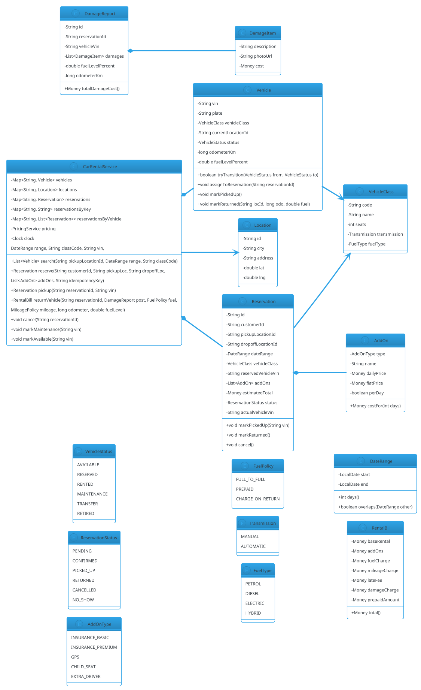

# Car Rental System

## Problem Statement

Design a car rental system like Hertz, Avis, Zoomcar, Turo, or Enterprise. Customers book vehicles for a date range at a pickup location, drive them, and return them (possibly to a different location). The system tracks a **fleet of vehicles** by category, handles **reservations with date ranges**, computes **dynamic pricing**, manages **insurance and add-ons**, processes **damage reports**, and enforces **return policies** (late fees, fuel charges).

**Reused primitives (see reference files):**
- Date-range overlap + reservation lifecycle: `06-hotel-management.md` §4, §6 (`DateRange.overlaps`, booking state machine)
- Resource inventory with atomic reservation: `11-movie-ticket-booking.md` §6.6 (`SeatAllocator` pattern)
- Pricing strategies: `06-hotel-management.md` §6.5 and `11-movie-ticket-booking.md` §6.7
- Payment authorize/capture: `15-airline-reservation.md` §6.4
- Refund policy: `11-movie-ticket-booking.md` §6.9

**New concepts unique to this problem:**
1. **Fleet of physical vehicles** — same category, different VINs, different conditions
2. **Pickup and dropoff locations** — often different (one-way rentals)
3. **Vehicle availability windows** — a car is unavailable during maintenance/cleaning/transfer
4. **Fleet utilization balancing** — move cars between locations to meet demand
5. **Add-ons** — insurance tiers, GPS, child seat, additional driver
6. **Fuel policy** — full-to-full, prepaid, or charge-on-return
7. **Damage inspection** — pre/post photos, condition assessment, charges
8. **Late return handling** — grace period, hourly late fees, next-reservation impact
9. **Vehicle classes** — Economy, Compact, Midsize, SUV, Luxury, Van
10. **Mileage limits** — unlimited vs. capped (per-day limit, overage charges)

---

## 1. Requirements

### Functional Requirements

- **Search vehicles**: by pickup location, dropoff location, date range, class
- **Vehicle catalog**: categories with attributes (seats, transmission, fuel type)
- **Reserve**: hold a specific vehicle (or a category) for a date range
- **Pickup**: verify license, authorize payment, inspect vehicle, hand over keys
- **Return**: inspect vehicle, compute final charges (late fee, fuel, mileage), release hold
- **Add-ons**: insurance, GPS, child seat, additional driver
- **Damage reporting**: record damage, assess cost, charge customer
- **One-way rentals**: pickup at A, return at B
- **Extend rental**: modify end date (subject to availability)
- **Cancel reservation**: with refund policy
- **Maintenance**: mark vehicle out-of-service; block bookings
- **Fleet balancing**: move vehicles between locations (admin)

### Non-Functional Requirements

- **Thread-safe**: concurrent reservations for the same vehicle
- **Date-range correct**: half-open intervals `[start, end)` (same as Hotel)
- **Idempotent**: reservation retries safe
- **Auditable**: full lifecycle log (booking, pickup, return, damage)
- **Extensible**: new classes, add-ons, pricing rules
- **Latency**: search < 500 ms; booking < 2 s
- **Location-aware**: search by city and near a point

### Out of Scope

- Real payment gateway
- Physical key handover hardware
- GPS tracking during rental (though optional)
- Insurance underwriting
- Roadside assistance
- Regulatory compliance per country

---

## 2. Use Cases (brief)

| # | Use Case | Actor |
|---|---|---|
| UC1 | Search vehicles | Customer |
| UC2 | Reserve vehicle | Customer |
| UC3 | Pick up vehicle | Customer + Agent |
| UC4 | Return vehicle | Customer + Agent |
| UC5 | Extend rental | Customer |
| UC6 | Cancel reservation | Customer |
| UC7 | Report damage | Agent |
| UC8 | Mark vehicle for maintenance | Admin |
| UC9 | Fleet balancing | Admin |
| UC10 | Complete payment | System |

---

## 3. Core Entities (delta)

**New entities:**

| Entity | Responsibility |
|---|---|
| `Vehicle` | A physical car (VIN, plate, class, location, condition) |
| `VehicleClass` | Category (Economy, Compact, SUV, Luxury) |
| `Location` | A pickup/dropoff site (city, address, geo) |
| `Reservation` | A booking for a vehicle (or class) + date range |
| `Rental` | An active rental (created at pickup; mirrors Reservation) |
| `AddOn` | Insurance tier, GPS, child seat, additional driver |
| `DamageReport` | Pre/post-rental inspection report |
| `MaintenanceWindow` | Vehicle out-of-service period |
| `FuelPolicy` | Full-to-full, prepaid, charge-on-return |
| `MileagePolicy` | Unlimited or capped + overage rate |

**Enums:**

| Enum | Values |
|---|---|
| `VehicleStatus` | AVAILABLE, RESERVED, RENTED, MAINTENANCE, TRANSFER, RETIRED |
| `ReservationStatus` | PENDING, CONFIRMED, PICKED_UP, RETURNED, CANCELLED, NO_SHOW |
| `AddOnType` | INSURANCE_BASIC, INSURANCE_PREMIUM, GPS, CHILD_SEAT, EXTRA_DRIVER |
| `FuelPolicy` | FULL_TO_FULL, PREPAID, CHARGE_ON_RETURN |
| `Transmission` | MANUAL, AUTOMATIC |
| `FuelType` | PETROL, DIESEL, ELECTRIC, HYBRID |

**Reused from references:**
- `Money` (see `03-atm.md` §6.1)
- `DateRange` (see `06-hotel-management.md` §6.1) — half-open `[start, end)` semantics
- `Payment` + `PaymentGateway` (see `15-airline-reservation.md` §6.4)
- `RefundPolicy` (see `11-movie-ticket-booking.md` §6.9)

---

## 4. What's New — the Four Hard Parts

### 4.1 Vehicle vs Vehicle Class

Unlike Hotel (where rooms are interchangeable within a class), rental cars are **physically distinct**:

- Each has a VIN, plate, mileage, condition
- Customers may be offered a class ("Economy or similar"), not a specific vehicle
- At pickup, a specific vehicle is assigned

**Model:**

```java
public final class VehicleClass {
    private final String code;              // ECONOMY, COMPACT, SUV, LUXURY
    private final String name;
    private final int seats;
    private final Transmission transmission;
    private final FuelType fuelType;

    public VehicleClass(String code, String name, int seats,
                        Transmission transmission, FuelType fuelType) {
        this.code = code;
        this.name = name;
        this.seats = seats;
        this.transmission = transmission;
        this.fuelType = fuelType;
    }

    public String code() { return code; }
    public String name() { return name; }
    public int seats() { return seats; }
    public Transmission transmission() { return transmission; }
    public FuelType fuelType() { return fuelType; }
}
```

```java
public final class Vehicle {
    private final String vin;
    private final String plate;
    private final VehicleClass vehicleClass;
    private final java.util.concurrent.locks.ReentrantLock lock = new java.util.concurrent.locks.ReentrantLock();

    private String currentLocationId;
    private VehicleStatus status;
    private long odometerKm;
    private double fuelLevelPercent;        // 0..100
    private String currentReservationId;    // null if not rented

    public Vehicle(String vin, String plate, VehicleClass vehicleClass,
                   String currentLocationId, long odometerKm) {
        this.vin = vin;
        this.plate = plate;
        this.vehicleClass = vehicleClass;
        this.currentLocationId = currentLocationId;
        this.odometerKm = odometerKm;
        this.fuelLevelPercent = 100.0;
        this.status = VehicleStatus.AVAILABLE;
    }

    public String vin() { return vin; }
    public String plate() { return plate; }
    public VehicleClass vehicleClass() { return vehicleClass; }

    public String currentLocationId() { lock.lock(); try { return currentLocationId; } finally { lock.unlock(); } }
    public VehicleStatus status() { lock.lock(); try { return status; } finally { lock.unlock(); } }
    public long odometerKm() { lock.lock(); try { return odometerKm; } finally { lock.unlock(); } }
    public double fuelLevelPercent() { lock.lock(); try { return fuelLevelPercent; } finally { lock.unlock(); } }
    public String currentReservationId() { lock.lock(); try { return currentReservationId; } finally { lock.unlock(); } }

    public boolean tryTransition(VehicleStatus from, VehicleStatus to) {
        lock.lock();
        try {
            if (status != from) return false;
            status = to;
            return true;
        } finally { lock.unlock(); }
    }

    public void assignToReservation(String reservationId) {
        lock.lock();
        try {
            if (status != VehicleStatus.AVAILABLE) throw new IllegalStateException("Not available: " + status);
            this.currentReservationId = reservationId;
            this.status = VehicleStatus.RESERVED;
        } finally { lock.unlock(); }
    }

    public void markPickedUp() {
        lock.lock();
        try {
            if (status != VehicleStatus.RESERVED) throw new IllegalStateException("Not reserved: " + status);
            this.status = VehicleStatus.RENTED;
        } finally { lock.unlock(); }
    }

    public void markReturned(String newLocationId, long odometer, double fuel) {
        lock.lock();
        try {
            if (status != VehicleStatus.RENTED) throw new IllegalStateException("Not rented: " + status);
            this.currentLocationId = newLocationId;
            this.odometerKm = odometer;
            this.fuelLevelPercent = fuel;
            this.status = VehicleStatus.AVAILABLE;
            this.currentReservationId = null;
        } finally { lock.unlock(); }
    }

    public void markMaintenance() {
        lock.lock();
        try {
            if (status == VehicleStatus.RENTED) throw new IllegalStateException("Cannot maintain while rented");
            this.status = VehicleStatus.MAINTENANCE;
        } finally { lock.unlock(); }
    }

    public void markAvailable() {
        lock.lock();
        try {
            this.status = VehicleStatus.AVAILABLE;
        } finally { lock.unlock(); }
    }
}
```

### 4.2 Reservation with Date Range

Same `DateRange` semantics as Hotel (`06-hotel-management.md` §6.1): `[start, end)` — a return on day X and pickup on day X don't conflict.

**Reservation at the class level or vehicle level?**

Two options:
- **Class-based**: reserve "Economy or similar"; assign a vehicle at pickup. More flexible; matches industry practice.
- **Vehicle-based**: reserve a specific VIN. Useful for premium/exotic rentals.

**Recommendation:** Support both. `Reservation` has an optional `vehicleVin`; if null, it's a class-level reservation.

```java
public final class Reservation {
    private final String id;
    private final String customerId;
    private final String pickupLocationId;
    private final String dropoffLocationId;
    private final DateRange dateRange;
    private final VehicleClass vehicleClass;
    private final String reservedVehicleVin;   // nullable = class-level
    private final java.util.List<AddOn> addOns;
    private final Money estimatedTotal;
    private final String idempotencyKey;
    private final java.time.Instant createdAt;
    private final java.util.concurrent.locks.ReentrantLock lock = new java.util.concurrent.locks.ReentrantLock();

    private ReservationStatus status;
    private String actualVehicleVin;           // assigned at pickup

    public Reservation(String id, String customerId, String pickupLocationId,
                       String dropoffLocationId, DateRange dateRange,
                       VehicleClass vehicleClass, String reservedVehicleVin,
                       java.util.List<AddOn> addOns, Money estimatedTotal,
                       String idempotencyKey) {
        this.id = id;
        this.customerId = customerId;
        this.pickupLocationId = pickupLocationId;
        this.dropoffLocationId = dropoffLocationId;
        this.dateRange = dateRange;
        this.vehicleClass = vehicleClass;
        this.reservedVehicleVin = reservedVehicleVin;
        this.addOns = java.util.List.copyOf(addOns);
        this.estimatedTotal = estimatedTotal;
        this.idempotencyKey = idempotencyKey;
        this.createdAt = java.time.Instant.now();
        this.status = ReservationStatus.CONFIRMED;
    }

    public String id() { return id; }
    public String customerId() { return customerId; }
    public String pickupLocationId() { return pickupLocationId; }
    public String dropoffLocationId() { return dropoffLocationId; }
    public DateRange dateRange() { return dateRange; }
    public VehicleClass vehicleClass() { return vehicleClass; }
    public String reservedVehicleVin() { return reservedVehicleVin; }
    public java.util.List<AddOn> addOns() { return addOns; }
    public Money estimatedTotal() { return estimatedTotal; }
    public String idempotencyKey() { return idempotencyKey; }
    public java.time.Instant createdAt() { return createdAt; }

    public ReservationStatus status() { lock.lock(); try { return status; } finally { lock.unlock(); } }
    public String actualVehicleVin() { lock.lock(); try { return actualVehicleVin; } finally { lock.unlock(); } }

    public void markPickedUp(String vin) {
        lock.lock();
        try {
            if (status != ReservationStatus.CONFIRMED) throw new IllegalStateException("Not confirmed");
            this.actualVehicleVin = vin;
            this.status = ReservationStatus.PICKED_UP;
        } finally { lock.unlock(); }
    }

    public void markReturned() {
        lock.lock();
        try {
            if (status != ReservationStatus.PICKED_UP) throw new IllegalStateException("Not picked up");
            this.status = ReservationStatus.RETURNED;
        } finally { lock.unlock(); }
    }

    public void cancel() {
        lock.lock();
        try {
            if (status != ReservationStatus.CONFIRMED) throw new IllegalStateException("Cannot cancel");
            this.status = ReservationStatus.CANCELLED;
        } finally { lock.unlock(); }
    }

    public void markNoShow() {
        lock.lock();
        try {
            if (status == ReservationStatus.CONFIRMED) this.status = ReservationStatus.NO_SHOW;
        } finally { lock.unlock(); }
    }
}
```

### 4.3 Add-Ons (Insurance, GPS, Child Seat)

Ancillaries — same model as Airline's ancillary concept (`15-airline-reservation.md` §4.5) but applied to rental.

```java
public final class AddOn {
    private final AddOnType type;
    private final String name;
    private final Money dailyPrice;       // per-day cost
    private final Money flatPrice;        // one-time cost
    private final boolean perDay;

    public AddOn(AddOnType type, String name, Money dailyPrice, Money flatPrice, boolean perDay) {
        this.type = type;
        this.name = name;
        this.dailyPrice = dailyPrice;
        this.flatPrice = flatPrice;
        this.perDay = perDay;
    }

    public AddOnType type() { return type; }
    public String name() { return name; }
    public Money dailyPrice() { return dailyPrice; }
    public Money flatPrice() { return flatPrice; }
    public boolean perDay() { return perDay; }

    public Money costFor(int days) {
        return perDay ? dailyPrice.multiply(days) : flatPrice;
    }
}
```

**Pricing:** Add-on total = sum of `addOn.costFor(nights)`.

### 4.4 Damage Report & Fuel Policy

**Damage inspection** at pickup and return:

```java
public final class DamageReport {
    private final String id;
    private final String reservationId;
    private final String vehicleVin;
    private final java.time.Instant inspectedAt;
    private final java.util.List<DamageItem> damages;
    private final double fuelLevelPercent;
    private final long odometerKm;

    public DamageReport(String id, String reservationId, String vehicleVin,
                        java.time.Instant inspectedAt,
                        java.util.List<DamageItem> damages,
                        double fuelLevelPercent, long odometerKm) {
        this.id = id;
        this.reservationId = reservationId;
        this.vehicleVin = vehicleVin;
        this.inspectedAt = inspectedAt;
        this.damages = java.util.List.copyOf(damages);
        this.fuelLevelPercent = fuelLevelPercent;
        this.odometerKm = odometerKm;
    }

    public String id() { return id; }
    public String reservationId() { return reservationId; }
    public String vehicleVin() { return vehicleVin; }
    public java.util.List<DamageItem> damages() { return damages; }
    public double fuelLevelPercent() { return fuelLevelPercent; }
    public long odometerKm() { return odometerKm; }

    public Money totalDamageCost() {
        Money sum = Money.zero();
        for (DamageItem d : damages) sum = sum.plus(d.cost());
        return sum;
    }
}

public record DamageItem(String description, String photoUrl, Money cost) {}
```

**Fuel policies** — computed at return:

```java
public enum FuelPolicy { FULL_TO_FULL, PREPAID, CHARGE_ON_RETURN }

public final class FuelChargeCalculator {

    public Money compute(FuelPolicy policy, double startFuelPercent,
                         double endFuelPercent, double tankCapacityLiters,
                         Money pricePerLiter) {
        return switch (policy) {
            case FULL_TO_FULL -> {
                double missing = Math.max(0, startFuelPercent - endFuelPercent);
                double liters = (missing / 100.0) * tankCapacityLiters;
                yield pricePerLiter.multiply(liters);
            }
            case PREPAID -> Money.zero();   // fuel prepaid; no charge
            case CHARGE_ON_RETURN -> {
                double missing = Math.max(0, 100 - endFuelPercent);
                double liters = (missing / 100.0) * tankCapacityLiters;
                // charge at a premium (2x) if not returned full
                yield pricePerLiter.multiply(liters * 2);
            }
        };
    }
}
```

**Mileage policy:**

```java
public record MileagePolicy(boolean unlimited, long dailyCapKm, Money overagePerKm) {}

public final class MileageChargeCalculator {
    public Money compute(MileagePolicy policy, int days, long actualKm) {
        if (policy.unlimited()) return Money.zero();
        long allowed = policy.dailyCapKm() * days;
        long over = Math.max(0, actualKm - allowed);
        return policy.overagePerKm().multiply(over);
    }
}
```

### 4.5 Pricing Composition

Final charges = base rental + add-ons + fuel + mileage + late fee + damage − prepaid.

```java
public final class RentalBill {
    private final Money baseRental;
    private final Money addOns;
    private final Money fuelCharge;
    private final Money mileageCharge;
    private final Money lateFee;
    private final Money damageCharge;
    private final Money prepaidAmount;

    public RentalBill(Money baseRental, Money addOns, Money fuelCharge,
                      Money mileageCharge, Money lateFee, Money damageCharge,
                      Money prepaidAmount) {
        this.baseRental = baseRental;
        this.addOns = addOns;
        this.fuelCharge = fuelCharge;
        this.mileageCharge = mileageCharge;
        this.lateFee = lateFee;
        this.damageCharge = damageCharge;
        this.prepaidAmount = prepaidAmount;
    }

    public Money total() {
        return baseRental.plus(addOns).plus(fuelCharge).plus(mileageCharge)
                .plus(lateFee).plus(damageCharge).minus(prepaidAmount);
    }
}
```

**Late fee:**

- **Grace period** (e.g., 30 min): no charge
- **Hourly** up to a daily max: `min(hoursLate × hourlyRate, dailyRate)`
- **Additional day** if late > 24h

```java
public final class LateFeeCalculator {
    private final java.time.Duration grace;
    private final Money perHour;
    private final Money perDay;

    public LateFeeCalculator(java.time.Duration grace, Money perHour, Money perDay) {
        this.grace = grace;
        this.perHour = perHour;
        this.perDay = perDay;
    }

    public Money compute(java.time.Instant expected, java.time.Instant actual) {
        java.time.Duration late = java.time.Duration.between(expected, actual);
        if (late.compareTo(grace) <= 0) return Money.zero();
        long hours = late.toHours();
        Money byHour = perHour.multiply(hours);
        Money byDay = perDay.multiply((long) Math.ceil(hours / 24.0));
        return byHour.amount().compareTo(byDay.amount()) < 0 ? byHour : byDay;
    }
}
```

---

## 5. Class Diagram (delta)



---

## 6. Java Implementation (new parts only)

### 6.1 DateRange (reuse from Hotel)

Use `06-hotel-management.md` §6.1 directly — same `[start, end)` semantics.

### 6.2 Location & VehicleClass

```java
public record Location(String id, String city, String address, double lat, double lng) {}
```

```java
public final class VehicleClass {
    private final String code;
    private final String name;
    private final int seats;
    private final Transmission transmission;
    private final FuelType fuelType;

    public VehicleClass(String code, String name, int seats,
                        Transmission transmission, FuelType fuelType) {
        this.code = code;
        this.name = name;
        this.seats = seats;
        this.transmission = transmission;
        this.fuelType = fuelType;
    }

    public String code() { return code; }
    public String name() { return name; }
    public int seats() { return seats; }
    public Transmission transmission() { return transmission; }
    public FuelType fuelType() { return fuelType; }
}
```

### 6.3 Pricing Service

```java
public interface PricingService {
    Money estimate(VehicleClass vehicleClass, DateRange range, java.util.List<AddOn> addOns);
}
```

```java
public final class StandardPricing implements PricingService {

    private final java.util.Map<String, Money> dailyRateByClass;

    public StandardPricing(java.util.Map<String, Money> dailyRateByClass) {
        this.dailyRateByClass = java.util.Map.copyOf(dailyRateByClass);
    }

    @Override
    public Money estimate(VehicleClass vehicleClass, DateRange range, java.util.List<AddOn> addOns) {
        Money daily = dailyRateByClass.get(vehicleClass.code());
        if (daily == null) throw new IllegalArgumentException("No rate for " + vehicleClass.code());

        Money base = daily.multiply(range.days());
        Money addOnTotal = Money.zero();
        for (AddOn a : addOns) addOnTotal = addOnTotal.plus(a.costFor(range.days()));

        return base.plus(addOnTotal);
    }
}
```

### 6.4 Car Rental Service

```java
public final class CarRentalService {

    private final java.util.Map<String, Vehicle> vehicles = new java.util.concurrent.ConcurrentHashMap<>();
    private final java.util.Map<String, Location> locations = new java.util.concurrent.ConcurrentHashMap<>();
    private final java.util.Map<String, Reservation> reservations = new java.util.concurrent.ConcurrentHashMap<>();
    private final java.util.Map<String, String> reservationsByKey = new java.util.concurrent.ConcurrentHashMap<>();
    private final java.util.Map<String, java.util.List<Reservation>> reservationsByVin = new java.util.concurrent.ConcurrentHashMap<>();

    private final PricingService pricing;
    private final LateFeeCalculator lateFee;
    private final FuelChargeCalculator fuelCharge;
    private final MileageChargeCalculator mileageCharge;
    private final java.time.Clock clock;

    public CarRentalService(PricingService pricing, LateFeeCalculator lateFee,
                            FuelChargeCalculator fuelCharge, MileageChargeCalculator mileageCharge,
                            java.time.Clock clock) {
        this.pricing = pricing;
        this.lateFee = lateFee;
        this.fuelCharge = fuelCharge;
        this.mileageCharge = mileageCharge;
        this.clock = clock;
    }

    // ----- Admin -----

    public void addLocation(Location l) { locations.put(l.id(), l); }

    public void addVehicle(Vehicle v) { vehicles.put(v.vin(), v); }

    public void markMaintenance(String vin) {
        vehicles.get(vin).markMaintenance();
    }

    public void markAvailable(String vin) {
        vehicles.get(vin).markAvailable();
    }

    // ----- Search -----

    public java.util.List<Vehicle> search(String pickupLocationId, DateRange range, String classCode) {
        java.util.List<Vehicle> result = new java.util.ArrayList<>();
        for (Vehicle v : vehicles.values()) {
            if (!v.currentLocationId().equals(pickupLocationId)) continue;
            if (!v.vehicleClass().code().equals(classCode)) continue;
            if (v.status() != VehicleStatus.AVAILABLE) continue;
            if (isVehicleBooked(v.vin(), range)) continue;
            result.add(v);
        }
        return result;
    }

    private boolean isVehicleBooked(String vin, DateRange range) {
        java.util.List<Reservation> existing = reservationsByVin.getOrDefault(vin, java.util.List.of());
        for (Reservation r : existing) {
            if (r.status() == ReservationStatus.CANCELLED
                    || r.status() == ReservationStatus.RETURNED
                    || r.status() == ReservationStatus.NO_SHOW) continue;
            if (r.dateRange().overlaps(range)) return true;
        }
        return false;
    }

    // ----- Reserve -----

    public Reservation reserve(String customerId, String pickupLoc, String dropoffLoc,
                               DateRange range, String classCode, String preferredVin,
                               java.util.List<AddOn> addOns, String idempotencyKey) {

        // Idempotency
        String existingId = reservationsByKey.get(idempotencyKey);
        if (existingId != null) return reservations.get(existingId);

        // Get vehicle class
        VehicleClass vehicleClass = null;
        for (Vehicle v : vehicles.values()) {
            if (v.vehicleClass().code().equals(classCode)) { vehicleClass = v.vehicleClass(); break; }
        }
        if (vehicleClass == null) throw new IllegalArgumentException("Unknown class: " + classCode);

        // If preferred vehicle specified, verify availability
        if (preferredVin != null) {
            Vehicle v = vehicles.get(preferredVin);
            if (v == null) throw new IllegalArgumentException("Unknown vehicle: " + preferredVin);
            if (!v.vehicleClass().code().equals(classCode)) {
                throw new IllegalArgumentException("Vehicle class mismatch");
            }
            if (isVehicleBooked(preferredVin, range)) {
                throw new IllegalStateException("Vehicle not available for range");
            }
        } else {
            // Check at least one vehicle of the class is available
            boolean anyAvailable = false;
            for (Vehicle v : vehicles.values()) {
                if (v.vehicleClass().code().equals(classCode)
                        && v.currentLocationId().equals(pickupLoc)
                        && v.status() == VehicleStatus.AVAILABLE
                        && !isVehicleBooked(v.vin(), range)) {
                    anyAvailable = true;
                    break;
                }
            }
            if (!anyAvailable) throw new IllegalStateException("No vehicles available in class " + classCode);
        }

        Money estimate = pricing.estimate(vehicleClass, range, addOns);

        Reservation r = new Reservation(java.util.UUID.randomUUID().toString(),
                customerId, pickupLoc, dropoffLoc, range, vehicleClass, preferredVin,
                addOns, estimate, idempotencyKey);

        reservations.put(r.id(), r);
        reservationsByKey.put(idempotencyKey, r.id());
        if (preferredVin != null) {
            reservationsByVin.computeIfAbsent(preferredVin, k -> new java.util.concurrent.CopyOnWriteArrayList<>())
                    .add(r);
        }
        return r;
    }

    // ----- Pickup -----

    public Reservation pickup(String reservationId, String vin) {
        Reservation r = reservations.get(reservationId);
        if (r == null) throw new IllegalArgumentException("Unknown reservation");
        if (r.status() != ReservationStatus.CONFIRMED) throw new IllegalStateException("Not confirmed");

        Vehicle v = vehicles.get(vin);
        if (v == null) throw new IllegalArgumentException("Unknown vehicle");

        if (!v.vehicleClass().code().equals(r.vehicleClass().code())) {
            throw new IllegalStateException("Vehicle class mismatch");
        }
        if (!v.currentLocationId().equals(r.pickupLocationId())) {
            throw new IllegalStateException("Vehicle not at pickup location");
        }
        if (isVehicleBooked(vin, r.dateRange())) {
            throw new IllegalStateException("Vehicle already booked");
        }

        v.assignToReservation(r.id());
        v.markPickedUp();
        r.markPickedUp(vin);
        return r;
    }

    // ----- Return -----

    public RentalBill returnVehicle(String reservationId, DamageReport post,
                                    FuelPolicy fuelPolicy, MileagePolicy mileagePolicy,
                                    long odometerEnd, double fuelEndPercent) {
        Reservation r = reservations.get(reservationId);
        if (r == null) throw new IllegalArgumentException("Unknown reservation");
        if (r.status() != ReservationStatus.PICKED_UP) throw new IllegalStateException("Not picked up");

        Vehicle v = vehicles.get(r.actualVehicleVin());

        long kmDriven = odometerEnd - v.odometerKm();

        // Compute charges
        Money baseRental = r.estimatedTotal().minus(sumAddOns(r));
        Money addOnTotal = sumAddOns(r);
        Money fuelChargeAmt = fuelCharge.compute(fuelPolicy, v.fuelLevelPercent(), fuelEndPercent,
                50.0, Money.usd(1.5));
        Money mileageChargeAmt = mileageCharge.compute(mileagePolicy, r.dateRange().days(), kmDriven);
        Money lateFeeAmt = lateFee.compute(r.dateRange().end().atStartOfDay(java.time.ZoneOffset.UTC).toInstant(),
                java.time.Instant.now(clock));
        Money damageChargeAmt = post != null ? post.totalDamageCost() : Money.zero();

        RentalBill bill = new RentalBill(baseRental, addOnTotal, fuelChargeAmt,
                mileageChargeAmt, lateFeeAmt, damageChargeAmt, Money.zero());

        // Return vehicle
        v.markReturned(r.dropoffLocationId(), odometerEnd, fuelEndPercent);
        r.markReturned();

        return bill;
    }

    private Money sumAddOns(Reservation r) {
        Money sum = Money.zero();
        for (AddOn a : r.addOns()) sum = sum.plus(a.costFor(r.dateRange().days()));
        return sum;
    }

    public void cancel(String reservationId) {
        Reservation r = reservations.get(reservationId);
        if (r == null) throw new IllegalArgumentException("Unknown reservation");
        r.cancel();
    }
}
```

### 6.5 Demo

```java
public class Demo {
    public static void main(String[] args) {
        CarRentalService service = new CarRentalService(
                new StandardPricing(java.util.Map.of("ECONOMY", Money.usd(40), "SUV", Money.usd(80))),
                new LateFeeCalculator(java.time.Duration.ofMinutes(30), Money.usd(10), Money.usd(80)),
                new FuelChargeCalculator(),
                new MileageChargeCalculator(),
                java.time.Clock.systemUTC()
        );

        service.addLocation(new Location("L1", "Mumbai", "Bandra", 19.076, 72.877));
        service.addLocation(new Location("L2", "Pune", "Koregaon Park", 18.520, 73.856));

        VehicleClass economy = new VehicleClass("ECONOMY", "Economy", 5, Transmission.MANUAL, FuelType.PETROL);
        service.addVehicle(new Vehicle("VIN1", "MH-01-AB-1234", economy, "L1", 10000));
        service.addVehicle(new Vehicle("VIN2", "MH-01-CD-5678", economy, "L1", 20000));

        DateRange range = new DateRange(java.time.LocalDate.now().plusDays(1),
                java.time.LocalDate.now().plusDays(4));

        // Reserve
        Reservation r = service.reserve("C1", "L1", "L2", range, "ECONOMY", null,
                java.util.List.of(), "key-1");
        System.out.println("Reservation: " + r.id() + " estimate: " + r.estimatedTotal().amount());

        // Pickup
        service.pickup(r.id(), "VIN1");

        // Return
        DamageReport post = new DamageReport("DR1", r.id(), "VIN1",
                java.time.Instant.now(), java.util.List.of(), 75.0, 10250);
        MileagePolicy mileage = new MileagePolicy(false, 200, Money.usd(0.5));
        RentalBill bill = service.returnVehicle(r.id(), post, FuelPolicy.FULL_TO_FULL,
                mileage, 10250, 75.0);

        System.out.println("Total: " + bill.total().amount());
        System.out.println("Status: " + r.status());
    }
}
```

---

## 7. Concurrency Considerations

Reused from `06-hotel-management.md` §7 and `11-movie-ticket-booking.md` §7:
- `ReentrantLock` on entities (`Vehicle`, `Reservation`)
- `ConcurrentHashMap` for maps
- Guarded status transitions via `tryTransition`

**New to Car Rental:**

- **Date-range overlap check under lock** — before reserving a vehicle, check `isVehicleBooked(vin, range)`. Race: two callers both see "not booked" and both create reservations. Fix: `synchronized (vehicle)` around the check-and-insert.
- **Class-level reservation** — no specific vehicle; reserve against the class. Requires a lock per `(class, location, dateRange)` to prevent overbooking.
- **Pickup vs return race** — pickup assigns a vehicle; return releases it. Both via `Vehicle.lock`.
- **Maintenance vs booking race** — maintenance marks the vehicle out-of-service; concurrent reservation must see the new status. Lock ordering: acquire vehicle lock before writing reservation.
- **Late return affecting next reservation** — if a rental is returned late, the next reservation for the same vehicle may be impacted. On late return, notify the next reservation's customer and offer a different vehicle.

**Recommended locking for reserve:**

```java
synchronized (lockFor(classCode + ":" + pickupLoc + ":" + dateRangeKey)) {
    // Check availability, create reservation
}
```

For vehicle-specific reserve, `synchronized (vehicle)`.

**Distributed consideration:** In production, use DB with row-level locks or optimistic concurrency (version field). The pattern is identical.

---

## 8. Extensibility

| Feature | Change |
|---|---|
| New vehicle class (Electric) | Add `VehicleClass`; no code change |
| New add-on (Wi-Fi) | Add `AddOnType` + `AddOn`; no code change |
| New pricing rule (weekend) | Implement `PricingService` |
| Loyalty program | Add `Customer.loyaltyTier`; apply discount in pricing |
| One-way fee | Add surcharge if `pickupLoc != dropoffLoc`; compute in pricing |
| Minimum rental days | Validate at reserve |
| Driver age surcharge | Add to pricing based on `Customer.age` |
| Telematics integration | Observer on `Vehicle` for location/mileage updates |
| Multi-country | Add `Location.country`; regional pricing |

---

## 9. Common Pitfalls

| Pitfall | Fix |
|---|---|
| Date-range overlap race | Lock per vehicle (or per class + location + date key) during reserve |
| Class-level overbooking | Track count of active reservations vs available vehicles |
| Assigning wrong vehicle at pickup | Verify class + location + availability |
| Not handling one-way returns | Support `dropoffLocationId != pickupLocationId` |
| Fuel charge with wrong baseline | Store `fuelLevelPercent` at pickup |
| Mileage overage miscalc | Use `odometerEnd − odometerStart`, not raw odometer |
| Late fee without grace | Include grace period (30 min typical) |
| Damage without photos | Enforce `photoUrl` in `DamageItem` |
| Maintenance race with pickup | Lock vehicle during status transitions |
| Cancelling a returned reservation | Status guard: only `CONFIRMED` can cancel |
| Not marking reserved vehicles | On class-level reserve, don't mark a specific vehicle; only at pickup |

---

## 10. Follow-ups

### Q1: How do you handle class-level overbooking?

**Answer:** Track `availableCount` per `(class, location, dateRange)`. Decrement on reserve; increment on cancel/return. Alternatively, use a booking ledger and count overlapping reservations. For strict correctness, lock per `(class, location, dateKey)`.

### Q2: How do you handle late returns that impact the next reservation?

**Answer:** On return, if the vehicle is late:
1. Compute late fee.
2. Check the next reservation for this vehicle.
3. If the next reservation starts within N hours, notify its customer and offer alternatives (upgrade to another class, or a different vehicle).
4. If no alternative, refund the next reservation.

### Q3: How do you handle damage disputes?

**Answer:** 
- `DamageReport` has before/after photos.
- Damage items are assigned a cost from a standard repair cost table.
- Customer can dispute; the rental company reviews.
- Add `DamageDispute` entity with status (PENDING, RESOLVED, ESCALATED).

### Q4: How do you test this?

- **Unit tests** for `DateRange.overlaps`, pricing, fuel calculator, mileage calculator
- **Concurrency tests** — 100 threads reserving the same vehicle for overlapping dates; assert 1 success
- **State machine tests** — invalid transitions (e.g., pickup a returned reservation)
- **Edge cases** — one-way rental, late return, fuel below pickup level

### Q5: How do you support "search by distance"?

**Answer:** Add `Location.lat/lng`. Use haversine distance to filter locations within X km of a point. Reuse spatial index pattern from `12-cab-booking.md` §6.3 if the number of locations is large.

---

## 11. Similar Problems

- **Hotel Management** (`06-hotel-management.md`) — rooms as resources; same date-range + state machine
- **Library Management** (`05-library-management.md`) — loan lifecycle
- **Airline Reservation** (`15-airline-reservation.md`) — multi-segment with ancillary
- **Movie Ticket Booking** (`11-movie-ticket-booking.md`) — resource hold + add-ons
- **Parking Lot** (`01-parking-lot.md`) — spot allocation + duration

Car Rental's unique additions: **physical fleet with VINs**, **one-way rentals**, **damage inspection**, **fuel policy**, **mileage limits**, **late returns**.

---

## 12. Key Takeaways

- **Vehicle is a physical asset** — VIN, plate, odometer, fuel level; distinct from its class
- **Reservation at class or vehicle level** — both supported; class-level is more flexible
- **DateRange is half-open** `[start, end)` — same as Hotel
- **Add-ons are ancillary** — insurance, GPS, child seat; per-day or flat
- **Fuel policy** — full-to-full, prepaid, charge-on-return; compute at return
- **Mileage policy** — unlimited or capped; overage charges
- **Late fee** — grace period + hourly rate capped at daily rate
- **Damage report** — inspection at pickup + return; photos + cost
- **Lock per vehicle (or per class+location+date)** — prevent double-booking
- **Guarded transitions** — `VehicleStatus` via `tryTransition`
- **Idempotency key** — safe reserve retries
- **One-way fee** — surcharge when `pickupLoc != dropoffLoc`
- **Maintenance** — mark vehicle out-of-service; blocks bookings
- **Money is `BigDecimal`** — never `double`
- **`Clock` injected** — deterministic time in tests

### The Delta Recipe

For any **physical-asset rental** problem:

1. **Resource as physical entity** — VIN, plate, condition (not just a class)
2. **Resource class** — for search and pricing
3. **Date-range reservation** — reuse `DateRange` + overlap semantics
4. **Class-level or specific-instance reservation** — support both
5. **Pickup / return lifecycle** — state machine on resource
6. **Inspection report** — pre/post condition
7. **Fuel / mileage / late fee / damage** — ancillary charges
8. **Lock per resource** — prevent double-booking
9. **One-way support** — different pickup and dropoff locations
10. **Idempotency key** — safe retries

This delta plus the date-range skeleton from #6 and the resource-hold skeleton from #11 solves: Car Rental, Bike Rental, Equipment Rental, Boat Rental, RV Rental, Scooter Rental, Home/Apartment Rental — with variations in physical attributes, add-ons, and inspection requirements.