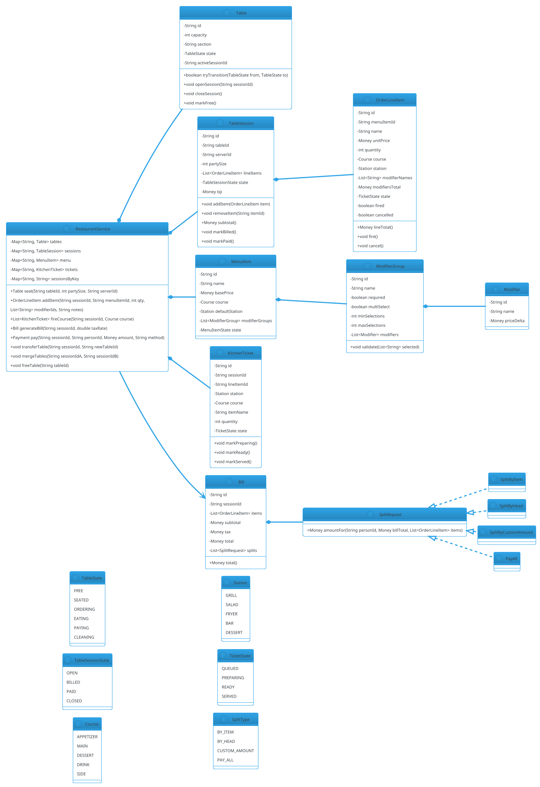

# Restaurant Ordering (Kiosk / Table Service)

## Problem Statement

Design a restaurant ordering system for a **dine-in kiosk or table-service** experience. Unlike food delivery (`13-food-delivery-order.md`), there's **no delivery leg** — orders flow from customer to kitchen to table. The system manages a **menu with categories and modifiers**, **table assignments**, **course sequencing** (appetizers before mains), **kitchen routing** (grill station, salad station), and **table-side payment**.

**Reused primitives (see reference files):**
- Order lifecycle + state machine: `13-food-delivery-order.md` §3-6 (minus delivery states)
- Menu / Cart / OrderItem snapshot: `18-shopping-cart.md` §4.1
- Recipe / customization transforms: `16-coffee-machine.md` §4.2
- Resource assignment (tables): `01-parking-lot.md` §4 (spot allocation)
- Payment authorize/capture: `15-airline-reservation.md` §4.4

**New concepts unique to this problem:**
1. **Tables as resources** — dine-in tables have capacity, location, state (free, seated, ordering, eating, paying, cleaning)
2. **Table session** — groups a party's orders over the meal
3. **Course sequencing** — appetizers, mains, desserts; fire orders in waves
4. **Kitchen station routing** — different items go to different stations (grill, salad, fryer, bar)
5. **Menu modifiers** — required vs optional, min/max selections per item
6. **Split bill** — split by item, split by head count, or pay-all
7. **Order timing** — hold items until "fire" command from waiter
8. **Table transfer / merge** — move parties between tables
9. **No delivery leg** — order states simplify (drop EN_ROUTE, DELIVERED)

---

## 1. Requirements

### Functional

- **Table management**: seat parties, assign server, track table state
- **Menu**: categories, items, modifiers (required + optional)
- **Order**: per-table session, add/remove items, fire to kitchen
- **Course sequencing**: hold mains until "fire mains" is issued
- **Kitchen routing**: send each item to the correct station
- **Modify order**: cancel item, adjust quantity, add items mid-meal
- **Split bill**: by item, by head, or custom amounts
- **Payment**: cash, card, mobile wallet
- **Table transfer**: move party to another table
- **Table merge**: combine two tables for a large party
- **Waitlist**: for walk-ins when all tables are occupied
- **Tip**: on payment

### Non-Functional

- **Thread-safe**: multiple servers, multiple kiosks, same table
- **Consistent**: table state, order state, kitchen state all consistent
- **Extensible**: new menu items, stations, modifier types
- **Auditable**: full order history per table session
- **Idempotent**: order retries, payment retries
- **Low latency**: order → kitchen print < 500 ms

### Out of Scope

- Inventory of ingredients (see Coffee Machine `16-coffee-machine.md`)
- Delivery (see Food Delivery `13-food-delivery-order.md`)
- Reservations (see Hotel `06-hotel-management.md`)
- Loyalty / accounts
- Multiple locations / chains

---

## 2. Use Cases (brief)

| # | Use Case | Actor |
|---|---|---|
| UC1 | Seat a party | Host |
| UC2 | Assign server to table | Host |
| UC3 | Browse menu | Customer / Server |
| UC4 | Create order for table session | Server |
| UC5 | Add item with modifiers | Server |
| UC6 | Fire courses to kitchen | Server |
| UC7 | Cancel an item (still pending) | Server |
| UC8 | Add items mid-meal | Server |
| UC9 | Transfer table | Server |
| UC10 | Merge tables | Host |
| UC11 | Generate bill | Server |
| UC12 | Split bill | Server / Customer |
| UC13 | Pay + tip | Customer |
| UC14 | Free table (after cleaning) | Busser |

---

## 3. Core Entities (delta)

**New entities:**

| Entity | Responsibility |
|---|---|
| `Table` | Physical table with capacity + state |
| `TableSession` | One party's dining session (orders + bill) |
| `Server` | Waiter assigned to tables |
| `MenuItem` | Reused from Food Delivery; extended with modifiers |
| `Modifier` | Option on a menu item (required / optional, single / multi) |
| `ModifierGroup` | Group of modifiers (e.g., "Choose your spice level") |
| `OrderLineItem` | Line with modifiers snapshot |
| `Course` | ENUM: APPETIZER, MAIN, DESSERT, DRINK |
| `Station` | Kitchen station: GRILL, SALAD, FRYER, BAR |
| `KitchenTicket` | One per item or one per course per station |
| `Bill` | Aggregated bill for a table session |
| `SplitRequest` | How a bill is split |
| `Payment` | Reused from ATM |
| `WaitlistEntry` | Walk-in waiting for a table |

**Enums:**

| Enum | Values |
|---|---|
| `TableState` | FREE, SEATED, ORDERING, EATING, PAYING, CLEANING |
| `TableSessionState` | OPEN, BILLED, PAID, CLOSED |
| `Course` | APPETIZER, MAIN, DESSERT, DRINK, SIDE |
| `Station` | GRILL, SALAD, FRYER, BAR, DESSERT |
| `MenuItemState` | AVAILABLE, OUT_OF_STOCK, HIDDEN |
| `TicketState` | QUEUED, PREPARING, READY, SERVED |
| `SplitType` | BY_ITEM, BY_HEAD, CUSTOM_AMOUNT, PAY_ALL |

**Reused:**
- `Money`, `Payment`, `PaymentGateway` — `03-atm.md` §6.1, §6.7
- `MenuItem`, `Cart`, `Order` — patterns from `18-shopping-cart.md`
- `Customization` transforms — `16-coffee-machine.md` §4.2
- Resource allocation (spot → table) — `01-parking-lot.md` §4

---

## 4. What's New — the Five Hard Parts

### 4.1 Table as Resource

A `Table` is a resource with **state**, **capacity**, **location** (section), and an **active session**.

```java
public enum TableState { FREE, SEATED, ORDERING, EATING, PAYING, CLEANING }
public enum TableSessionState { OPEN, BILLED, PAID, CLOSED }

public final class Table {
    private final String id;
    private final int capacity;
    private final String section;             // e.g., "Patio", "Bar", "Main"
    private final java.util.concurrent.locks.ReentrantLock lock = new java.util.concurrent.locks.ReentrantLock();

    private TableState state;
    private String activeSessionId;

    public Table(String id, int capacity, String section) {
        this.id = id;
        this.capacity = capacity;
        this.section = section;
        this.state = TableState.FREE;
    }

    public String id() { return id; }
    public int capacity() { return capacity; }
    public String section() { return section; }
    public TableState state() { lock.lock(); try { return state; } finally { lock.unlock(); } }
    public String activeSessionId() { lock.lock(); try { return activeSessionId; } finally { lock.unlock(); } }

    /** Atomic transition — returns false if not in `from` state. */
    public boolean tryTransition(TableState from, TableState to) {
        lock.lock();
        try {
            if (state != from) return false;
            state = to;
            return true;
        } finally { lock.unlock(); }
    }

    public void openSession(String sessionId) {
        lock.lock();
        try {
            if (state != TableState.FREE) throw new IllegalStateException("Table not free: " + state);
            this.activeSessionId = sessionId;
            this.state = TableState.SEATED;
        } finally { lock.unlock(); }
    }

    public void closeSession() {
        lock.lock();
        try {
            this.activeSessionId = null;
            this.state = TableState.CLEANING;
        } finally { lock.unlock(); }
    }

    public void markFree() {
        lock.lock();
        try {
            if (state != TableState.CLEANING) throw new IllegalStateException("Not cleaning: " + state);
            this.state = TableState.FREE;
        } finally { lock.unlock(); }
    }
}
```

**Table state flow:**

```
FREE → SEATED → ORDERING → EATING → PAYING → CLEANING → FREE
```

### 4.2 Table Session

A `TableSession` groups all orders and the bill for one dining session. It's the equivalent of a `Cart` in Shopping Cart (`18-shopping-cart.md` §4.1) but with table-specific lifecycle.

```java
public final class TableSession {
    private final String id;
    private final String tableId;
    private final String serverId;
    private final int partySize;
    private final java.time.Instant seatedAt;
    private final java.util.List<OrderLineItem> lineItems = new java.util.concurrent.CopyOnWriteArrayList<>();
    private final java.util.concurrent.locks.ReentrantLock lock = new java.util.concurrent.locks.ReentrantLock();

    private TableSessionState state;
    private Money tip;
    private java.util.List<SplitRequest> splits = new java.util.ArrayList<>();

    public TableSession(String id, String tableId, String serverId, int partySize) {
        this.id = id;
        this.tableId = tableId;
        this.serverId = serverId;
        this.partySize = partySize;
        this.seatedAt = java.time.Instant.now();
        this.state = TableSessionState.OPEN;
    }

    public String id() { return id; }
    public String tableId() { return tableId; }
    public String serverId() { return serverId; }
    public int partySize() { return partySize; }
    public java.time.Instant seatedAt() { return seatedAt; }
    public TableSessionState state() { lock.lock(); try { return state; } finally { lock.unlock(); } }

    public void addItem(OrderLineItem item) {
        lock.lock();
        try {
            if (state != TableSessionState.OPEN) throw new IllegalStateException("Session not open");
            lineItems.add(item);
        } finally { lock.unlock(); }
    }

    public void removeItem(String itemId) {
        lock.lock();
        try {
            if (state != TableSessionState.OPEN) throw new IllegalStateException("Session not open");
            lineItems.removeIf(i -> i.id().equals(itemId) && i.state() == TicketState.QUEUED);
        } finally { lock.unlock(); }
    }

    public java.util.List<OrderLineItem> lineItems() { return java.util.List.copyOf(lineItems); }

    public Money subtotal() {
        Money sum = Money.zero();
        for (OrderLineItem i : lineItems) {
            if (i.state() != TicketState.QUEUED || i.cancelled()) sum = sum.plus(i.lineTotal());
        }
        return sum;
    }

    public void markBilled() {
        lock.lock();
        try {
            if (state != TableSessionState.OPEN) throw new IllegalStateException("Not open");
            state = TableSessionState.BILLED;
        } finally { lock.unlock(); }
    }

    public void markPaid() {
        lock.lock();
        try {
            if (state != TableSessionState.BILLED) throw new IllegalStateException("Not billed");
            state = TableSessionState.PAID;
        } finally { lock.unlock(); }
    }

    public void close() {
        lock.lock();
        try { state = TableSessionState.CLOSED; }
        finally { lock.unlock(); }
    }
}
```

**Why a `TableSession` and not just a list of orders?** The bill is per-session, not per-order. Splitting, tips, and payments happen at the session level.

### 4.3 Menu Modifiers (Required + Optional)

Unlike Food Delivery's free-text instructions, restaurant menus have **structured modifiers**:

- **ModifierGroup**: e.g., "Spice Level" or "Add-ons"
- **Modifier**: an option in a group (e.g., "Mild", "Medium", "Hot")
- **Required**: user must pick one (e.g., "Choose your size")
- **Single vs Multi**: pick one or many
- **Min / Max**: for multi-select

```java
public record Modifier(String id, String name, Money priceDelta) {}
```

```java
public record ModifierGroup(
        String id,
        String name,
        boolean required,
        boolean multiSelect,
        int minSelections,
        int maxSelections,
        java.util.List<Modifier> modifiers
) {
    public ModifierGroup {
        if (required && minSelections < 1) {
            throw new IllegalArgumentException("Required group must have minSelections >= 1");
        }
        if (minSelections > maxSelections) {
            throw new IllegalArgumentException("min > max");
        }
    }

    public void validate(java.util.List<String> selectedModifierIds) {
        int count = selectedModifierIds.size();
        if (required && count < minSelections) {
            throw new IllegalArgumentException("Group " + name + " requires at least " + minSelections);
        }
        if (!multiSelect && count > 1) {
            throw new IllegalArgumentException("Group " + name + " allows only one selection");
        }
        if (count > maxSelections) {
            throw new IllegalArgumentException("Group " + name + " allows at most " + maxSelections);
        }
        for (String id : selectedModifierIds) {
            boolean found = modifiers.stream().anyMatch(m -> m.id().equals(id));
            if (!found) throw new IllegalArgumentException("Unknown modifier: " + id);
        }
    }
}
```

**MenuItem extension:**

```java
public final class MenuItem {
    private final String id;
    private final String name;
    private final Money basePrice;
    private final Course course;
    private final Station defaultStation;
    private final java.util.List<ModifierGroup> modifierGroups;
    private volatile MenuItemState state;

    public MenuItem(String id, String name, Money basePrice, Course course,
                    Station defaultStation, java.util.List<ModifierGroup> modifierGroups) {
        this.id = id;
        this.name = name;
        this.basePrice = basePrice;
        this.course = course;
        this.defaultStation = defaultStation;
        this.modifierGroups = java.util.List.copyOf(modifierGroups);
        this.state = MenuItemState.AVAILABLE;
    }

    public String id() { return id; }
    public String name() { return name; }
    public Money basePrice() { return basePrice; }
    public Course course() { return course; }
    public Station defaultStation() { return defaultStation; }
    public java.util.List<ModifierGroup> modifierGroups() { return modifierGroups; }
    public MenuItemState state() { return state; }
    public void setState(MenuItemState s) { this.state = s; }
}
```

### 4.4 Kitchen Routing & Course Sequencing

Each `MenuItem` has a **default station**. Some modifiers can override the station (e.g., "fried" → fryer).

**KitchenTicket**: one per item (or one per course per station — configurable).

```java
public final class KitchenTicket {
    private final String id;
    private final String sessionId;
    private final String lineItemId;
    private final Station station;
    private final Course course;
    private final String itemName;
    private final int quantity;
    private final java.util.List<String> modifierNames;
    private final java.time.Instant firedAt;
    private final java.util.concurrent.locks.ReentrantLock lock = new java.util.concurrent.locks.ReentrantLock();

    private TicketState state;

    public KitchenTicket(String id, String sessionId, String lineItemId,
                         Station station, Course course, String itemName,
                         int quantity, java.util.List<String> modifierNames) {
        this.id = id;
        this.sessionId = sessionId;
        this.lineItemId = lineItemId;
        this.station = station;
        this.course = course;
        this.itemName = itemName;
        this.quantity = quantity;
        this.modifierNames = java.util.List.copyOf(modifierNames);
        this.firedAt = java.time.Instant.now();
        this.state = TicketState.QUEUED;
    }

    public String id() { return id; }
    public Station station() { return station; }
    public Course course() { return course; }
    public TicketState state() { lock.lock(); try { return state; } finally { lock.unlock(); } }

    public void markPreparing() {
        lock.lock();
        try { if (state == TicketState.QUEUED) state = TicketState.PREPARING; }
        finally { lock.unlock(); }
    }

    public void markReady() {
        lock.lock();
        try { if (state == TicketState.PREPARING) state = TicketState.READY; }
        finally { lock.unlock(); }
    }

    public void markServed() {
        lock.lock();
        try { if (state == TicketState.READY) state = TicketState.SERVED; }
        finally { lock.unlock(); }
    }
}
```

**Course sequencing:** orders are **fired** by course. Appetizers fire first; mains are held until the waiter taps "Fire Mains".

```java
public final class OrderLineItem {
    private final String id;
    private final String menuItemId;
    private final String name;
    private final Money unitPrice;
    private final int quantity;
    private final Course course;
    private final Station station;
    private final java.util.List<String> modifierNames;
    private final Money modifiersTotal;
    private final java.util.concurrent.locks.ReentrantLock lock = new java.util.concurrent.locks.ReentrantLock();

    private TicketState state;
    private boolean fired;
    private boolean cancelled;

    public OrderLineItem(String id, String menuItemId, String name, Money unitPrice,
                         int quantity, Course course, Station station,
                         java.util.List<String> modifierNames, Money modifiersTotal) {
        this.id = id;
        this.menuItemId = menuItemId;
        this.name = name;
        this.unitPrice = unitPrice;
        this.quantity = quantity;
        this.course = course;
        this.station = station;
        this.modifierNames = java.util.List.copyOf(modifierNames);
        this.modifiersTotal = modifiersTotal;
        this.state = TicketState.QUEUED;
        this.fired = false;
    }

    public String id() { return id; }
    public Course course() { return course; }
    public Station station() { return station; }
    public boolean fired() { lock.lock(); try { return fired; } finally { lock.unlock(); } }
    public boolean cancelled() { lock.lock(); try { return cancelled; } finally { lock.unlock(); } }
    public TicketState state() { lock.lock(); try { return state; } finally { lock.unlock(); } }
    public Money lineTotal() {
        return unitPrice.plus(modifiersTotal).multiply(quantity);
    }

    public void fire() {
        lock.lock();
        try { this.fired = true; }
        finally { lock.unlock(); }
    }

    public void cancel() {
        lock.lock();
        try {
            if (state != TicketState.QUEUED) throw new IllegalStateException("Already preparing");
            this.cancelled = true;
        } finally { lock.unlock(); }
    }
}
```

**Fire command:**

```java
public java.util.List<KitchenTicket> fireCourse(TableSession session, Course course) {
    java.util.List<KitchenTicket> tickets = new java.util.ArrayList<>();
    for (OrderLineItem item : session.lineItems()) {
        if (item.course() != course || item.fired() || item.cancelled()) continue;
        KitchenTicket ticket = new KitchenTicket(
                java.util.UUID.randomUUID().toString(),
                session.id(), item.id(), item.station(), item.course(),
                item.name() /* actually item.name via getter */, 1, item.modifierNames());
        tickets.add(ticket);
        item.fire();
    }
    return tickets;
}
```

**Station routing:** the `station` on each `OrderLineItem` is chosen at order time:
- Default = `MenuItem.defaultStation`
- Override = modifier-driven (e.g., "fried" → FRYER)
- Fallback = main station

### 4.5 Bill Splitting

Three split modes:

- **BY_ITEM**: each person picks items; bill split by item ownership
- **BY_HEAD**: total / party size, with optional tip
- **CUSTOM_AMOUNT**: each person pays a specified amount
- **PAY_ALL**: one person pays everything

```java
public sealed interface SplitRequest permits
        SplitByItem, SplitByHead, SplitByCustomAmount, PayAll {

    Money amountFor(String personId, Money billTotal, java.util.List<OrderLineItem> items);
}

public record SplitByItem(String personId, java.util.List<String> itemIds) implements SplitRequest {
    @Override
    public Money amountFor(String pid, Money billTotal, java.util.List<OrderLineItem> items) {
        Money sum = Money.zero();
        for (OrderLineItem i : items) {
            if (itemIds.contains(i.id()) && i.id().equals(i.id())) {
                sum = sum.plus(i.lineTotal());
            }
        }
        return sum;
    }
}
```

```java
public record SplitByHead(int partySize) implements SplitRequest {
    @Override
    public Money amountFor(String personId, Money billTotal, java.util.List<OrderLineItem> items) {
        // Note: division produces equal share, remainder handled by caller
        return billTotal.multiply(1.0 / partySize);
    }
}
```

```java
public record SplitByCustomAmount(java.util.Map<String, Money> amounts) implements SplitRequest {
    @Override
    public Money amountFor(String personId, Money billTotal, java.util.List<OrderLineItem> items) {
        return amounts.getOrDefault(personId, Money.zero());
    }
}
```

```java
public record PayAll(String personId) implements SplitRequest {
    @Override
    public Money amountFor(String personId, Money billTotal, java.util.List<OrderLineItem> items) {
        return this.personId.equals(personId) ? billTotal : Money.zero();
    }
}
```

**Bill model:**

```java
public final class Bill {
    private final String id;
    private final String sessionId;
    private final java.util.List<OrderLineItem> items;
    private final Money subtotal;
    private final Money tax;
    private final Money total;
    private final java.util.List<SplitRequest> splits;

    public Bill(String id, String sessionId, java.util.List<OrderLineItem> items,
                Money subtotal, Money tax, java.util.List<SplitRequest> splits) {
        this.id = id;
        this.sessionId = sessionId;
        this.items = java.util.List.copyOf(items);
        this.subtotal = subtotal;
        this.tax = tax;
        this.total = subtotal.plus(tax);
        this.splits = java.util.List.copyOf(splits);
    }

    public Money total() { return total; }
    public java.util.List<SplitRequest> splits() { return splits; }
}
```

**Remainder handling:** When splitting by head, `total / N` may not divide evenly (e.g., $50 / 3 = $16.66 x 3 = $49.98, missing $0.02). Assign the remainder to the first payer (or the last).

---

## 5. Class Diagram (delta)



---

## 6. Java Implementation (new parts only)

### 6.1 RestaurantService

```java
public final class RestaurantService {

    private final java.util.Map<String, Table> tables = new java.util.concurrent.ConcurrentHashMap<>();
    private final java.util.Map<String, TableSession> sessions = new java.util.concurrent.ConcurrentHashMap<>();
    private final java.util.Map<String, MenuItem> menu = new java.util.concurrent.ConcurrentHashMap<>();
    private final java.util.Map<String, KitchenTicket> tickets = new java.util.concurrent.ConcurrentHashMap<>();

    private final PaymentGateway paymentGateway;
    private final java.util.Map<String, Payment> payments = new java.util.concurrent.ConcurrentHashMap<>();

    public RestaurantService(PaymentGateway paymentGateway) {
        this.paymentGateway = paymentGateway;
    }

    public void addTable(Table t) { tables.put(t.id(), t); }
    public void addMenuItem(MenuItem m) { menu.put(m.id(), m); }

    // ----- Seating -----

    public TableSession seat(String tableId, int partySize, String serverId) {
        Table t = tables.get(tableId);
        if (t == null) throw new IllegalArgumentException("Unknown table");
        if (partySize > t.capacity()) throw new IllegalArgumentException("Party too large for table");

        String sessionId = java.util.UUID.randomUUID().toString();
        t.openSession(sessionId);
        TableSession session = new TableSession(sessionId, tableId, serverId, partySize);
        sessions.put(sessionId, session);
        return session;
    }

    // ----- Ordering -----

    public OrderLineItem addItem(String sessionId, String menuItemId, int quantity,
                                 java.util.List<String> modifierIds, String notes) {
        TableSession session = sessions.get(sessionId);
        if (session == null) throw new IllegalArgumentException("Unknown session");

        MenuItem item = menu.get(menuItemId);
        if (item == null) throw new IllegalArgumentException("Unknown item");
        if (item.state() != MenuItemState.AVAILABLE) throw new IllegalStateException("Item not available");

        // Validate modifiers group by group
        Money modifiersTotal = Money.zero();
        java.util.List<String> modifierNames = new java.util.ArrayList<>();
        for (ModifierGroup group : item.modifierGroups()) {
            java.util.List<String> selected = modifierIds.stream()
                    .filter(id -> group.modifiers().stream().anyMatch(m -> m.id().equals(id)))
                    .toList();
            group.validate(selected);
            for (String mid : selected) {
                Modifier m = group.modifiers().stream().filter(x -> x.id().equals(mid)).findFirst().orElseThrow();
                modifiersTotal = modifiersTotal.plus(m.priceDelta());
                modifierNames.add(m.name());
            }
        }

        OrderLineItem line = new OrderLineItem(
                java.util.UUID.randomUUID().toString(), menuItemId, item.name(),
                item.basePrice(), quantity, item.course(), item.defaultStation(),
                modifierNames, modifiersTotal);

        session.addItem(line);
        return line;
    }

    public void cancelItem(String sessionId, String itemId) {
        TableSession session = sessions.get(sessionId);
        if (session == null) throw new IllegalArgumentException("Unknown session");
        for (OrderLineItem item : session.lineItems()) {
            if (item.id().equals(itemId)) {
                item.cancel();
                return;
            }
        }
    }

    // ----- Firing -----

    public java.util.List<KitchenTicket> fireCourse(String sessionId, Course course) {
        TableSession session = sessions.get(sessionId);
        if (session == null) throw new IllegalArgumentException("Unknown session");

        java.util.List<KitchenTicket> fired = new java.util.ArrayList<>();
        for (OrderLineItem item : session.lineItems()) {
            if (item.course() != course || item.fired() || item.cancelled()) continue;
            KitchenTicket ticket = new KitchenTicket(java.util.UUID.randomUUID().toString(),
                    session.id(), item.id(), item.station(), item.course(),
                    item.id() /* placeholder, use name getter */, item.quantity(), item.modifierNames());
            tickets.put(ticket.id(), ticket);
            item.fire();
            fired.add(ticket);
        }
        return fired;
    }

    // ----- Billing -----

    public Bill generateBill(String sessionId, double taxRate) {
        TableSession session = sessions.get(sessionId);
        if (session == null) throw new IllegalArgumentException("Unknown session");

        Money subtotal = session.subtotal();
        Money tax = subtotal.multiply(taxRate);
        Bill bill = new Bill(java.util.UUID.randomUUID().toString(), sessionId,
                session.lineItems(), subtotal, tax, java.util.List.of());
        session.markBilled();
        return bill;
    }

    // ----- Payment -----

    public void pay(String sessionId, String personId, Money amount, String method) {
        TableSession session = sessions.get(sessionId);
        if (session == null) throw new IllegalArgumentException("Unknown session");

        PaymentResult result = paymentGateway.authorize(
                "session-" + sessionId + "-" + personId, amount);
        if (!result.success()) throw new IllegalStateException("Payment failed");

        Payment payment = new Payment(java.util.UUID.randomUUID().toString(),
                sessionId, amount, result.authId());
        payments.put(payment.id(), payment);
    }

    public void closeSession(String sessionId) {
        TableSession session = sessions.get(sessionId);
        if (session == null) throw new IllegalArgumentException("Unknown session");
        session.markPaid();
        Table t = tables.get(session.tableId());
        t.closeSession();
        session.close();
    }

    public void freeTable(String tableId) {
        Table t = tables.get(tableId);
        if (t == null) throw new IllegalArgumentException("Unknown table");
        t.markFree();
    }

    // ----- Transfer / Merge -----

    public void transferTable(String sessionId, String newTableId) {
        TableSession session = sessions.get(sessionId);
        if (session == null) throw new IllegalArgumentException("Unknown session");
        Table newTable = tables.get(newTableId);
        if (newTable == null) throw new IllegalArgumentException("Unknown new table");
        if (newTable.state() != TableState.FREE) throw new IllegalStateException("New table not free");

        // In production: lock both tables, move session
        Table oldTable = tables.get(session.tableId());
        // Simplified for demo
        newTable.openSession(sessionId);
    }

    public void mergeTables(String sessionIdA, String sessionIdB) {
        // Merge sessionB's items into sessionA; close sessionB
        TableSession a = sessions.get(sessionIdA);
        TableSession b = sessions.get(sessionIdB);
        if (a == null || b == null) throw new IllegalArgumentException("Unknown session");
        for (OrderLineItem item : b.lineItems()) a.addItem(item);
        b.close();
        Table tB = tables.get(b.tableId());
        tB.markFree();
    }
}
```

### 6.2 PaymentGateway (shared)

Reuse from `15-airline-reservation.md` §6.10:

```java
public interface PaymentGateway {
    PaymentResult authorize(String idempotencyKey, Money amount);
}

public record PaymentResult(boolean success, String authId, String message) {
    public static PaymentResult ok(String id) { return new PaymentResult(true, id, "OK"); }
    public static PaymentResult failure(String msg) { return new PaymentResult(false, null, msg); }
}

public record Payment(String id, String sessionId, Money amount, String authId) {}
```

### 6.3 Demo

```java
public class Demo {
    public static void main(String[] args) {
        RestaurantService service = new RestaurantService(
                key -> PaymentResult.ok("auth-" + key));

        // Tables
        service.addTable(new Table("T1", 4, "Main"));
        service.addTable(new Table("T2", 2, "Main"));

        // Menu: Paneer Tikka (Appetizer, Grill) with spice level
        ModifierGroup spice = new ModifierGroup("MG1", "Spice Level",
                true, false, 1, 1, java.util.List.of(
                new Modifier("M1", "Mild", Money.zero()),
                new Modifier("M2", "Medium", Money.zero()),
                new Modifier("M3", "Hot", Money.zero())));

        MenuItem paneerTikka = new MenuItem("MI1", "Paneer Tikka", Money.usd(12),
                Course.APPETIZER, Station.GRILL, java.util.List.of(spice));
        service.addMenuItem(paneerTikka);

        MenuItem butterChicken = new MenuItem("MI2", "Butter Chicken", Money.usd(18),
                Course.MAIN, Station.GRILL, java.util.List.of());
        service.addMenuItem(butterChicken);

        // Seat a party
        TableSession session = service.seat("T1", 4, "S1");
        System.out.println("Session: " + session.id());

        // Order appetizer
        OrderLineItem app = service.addItem(session.id(), "MI1", 2,
                java.util.List.of("M2"), "extra lemon");
        System.out.println("Appetizer: " + app.lineTotal().amount());

        // Order main
        OrderLineItem main = service.addItem(session.id(), "MI2", 1,
                java.util.List.of(), "");
        System.out.println("Main: " + main.lineTotal().amount());

        // Fire appetizers
        var tickets = service.fireCourse(session.id(), Course.APPETIZER);
        System.out.println("Fired " + tickets.size() + " appetizer ticket(s)");

        // Fire mains
        var mainTickets = service.fireCourse(session.id(), Course.MAIN);
        System.out.println("Fired " + mainTickets.size() + " main ticket(s)");

        // Bill
        Bill bill = service.generateBill(session.id(), 0.05);
        System.out.println("Subtotal: " + bill.subtotal().amount());
        System.out.println("Total: " + bill.total().amount());

        // Pay
        service.pay(session.id(), "P1", bill.total(), "CARD");
        service.closeSession(session.id());
        service.freeTable("T1");
        System.out.println("Session closed");
    }
}
```

---

## 7. Concurrency Considerations

Reused from `18-shopping-cart.md` §7 and `13-food-delivery-order.md` §7:
- `ReentrantLock` on entities (`Table`, `TableSession`, `KitchenTicket`, `OrderLineItem`)
- `ConcurrentHashMap` for maps
- Guarded transitions on state machines

**New to Restaurant Ordering:**

- **Multi-server concurrency** — multiple servers touching the same table session. `TableSession` uses `ReentrantLock` for all item additions/removals.
- **Table transfer race** — two servers transfer the same session to different tables. Lock both tables; only one transfer wins.
- **Kitchen ticket queue** — tickets are per-station; multiple cooks pull from the same station queue. Use `BlockingQueue` per station, or CAS on ticket state.
- **Item cancellation vs firing** — server cancels an item while kitchen is about to fire it. `OrderLineItem.cancel()` requires state == QUEUED; if firing began, cancellation fails.
- **Payment vs session close** — payment must complete before `closeSession`. Guard: `markPaid` requires state == BILLED.
- **Split bill atomicity** — multiple payers paying simultaneously. Each payment's authorize is idempotent by `(sessionId, personId)` key.

**Recommended locking for `addItem`:**

```java
synchronized (session) {
    // validate, add item
}
```

Because `TableSession` already has its own lock, external `synchronized` isn't needed — the internal `addItem` is safe.

**Transfer table locking order:** Always lock tables in **sorted ID order** to avoid deadlock:

```java
String[] ids = { oldTableId, newTableId }.sort();
synchronized (tables.get(ids[0])) {
    synchronized (tables.get(ids[1])) {
        // perform transfer
    }
}
```

---

## 8. Extensibility

| Feature | Change |
|---|---|
| New menu item | Add `MenuItem` + modifier groups |
| New station | Add `Station` enum value |
| New course | Add `Course` enum value |
| Bar menu (drinks) | New `MenuItem`s with `Station.BAR` |
| Table reservations | Integrate with `Meeting Scheduler` (`14-meeting-scheduler.md`) |
| Happy hour pricing | `PricingService` on items |
| Kitchen display system | Observer on `KitchenTicket` state changes |
| Split bill by item | Already supported via `SplitByItem` |
| Table transfer / merge | Already supported |
| Waitlist | `WaitlistEntry` entity + `BlockingQueue` |
| Course auto-fire (timed) | Scheduler fires mains N min after appetizers |
| Allergen filtering | `MenuItem.allergens` list; client filters |

---

## 9. Common Pitfalls

| Pitfall | Fix |
|---|---|
| Adding items after bill generated | Guard `addItem` with `state == OPEN` |
| Firing already-fired items | `OrderLineItem.fired` flag prevents double-fire |
| Cancelling after prep started | Guard cancellation to `state == QUEUED` |
| Table marked free before cleaning | Explicit CLEANING state |
| Split-by-head rounding error | Assign remainder to first payer |
| Payment before bill generated | Guard `pay` to `session.state == BILLED` |
| Concurrent transfer of same table | Lock tables in sorted order |
| Duplicate payment on retry | Idempotency key per `(sessionId, personId)` |
| Menu item unavailable but still orderable | Check `MenuItem.state` at add |
| Kitchen ticket duplication | `fired` flag on line item |
| Modifier group not validated | Call `group.validate(selected)` at add |
| Table session lock ordering | Always one lock per session; no cross-session locking except transfer/merge |

---

## 10. Follow-ups

### Q1: How do you handle a customer ordering an out-of-stock item?

**Answer:** `MenuItem.state` becomes `OUT_OF_STOCK`. The `addItem` call rejects with an exception. The UI hides out-of-stock items. When restocked, state flips to `AVAILABLE`.

### Q2: How do you support multi-course auto-fire?

**Answer:** A scheduler that, when an appetizer is marked SERVED, schedules mains to fire after N minutes. Fire command is the same `fireCourse(sessionId, MAIN)`. Overridable by server (they can fire early).

### Q3: How do you handle split payment where people pay at different times?

**Answer:** Each `pay(sessionId, personId, amount, method)` call is independent. Track paid amounts per session. Session closes when `sum(payments) >= bill.total + tip`. Until then, session stays in `BILLED` state.

### Q4: How do you test this?

- **Unit tests** for `ModifierGroup.validate`, `Bill` computation, `SplitRequest.amountFor`
- **State machine tests** for `Table` and `TableSession` transitions
- **Concurrency tests** — multiple servers adding items to same session; assert consistency
- **Fire-course test** — items fire only once; correct station routing
- **Split tests** — by item, by head (with rounding), custom
- **Idempotency tests** — same payment key twice → one payment

### Q5: How do you handle a server transfer mid-meal?

**Answer:** Add `TableSession.reassignServer(newServerId)`. The session stays open; only the assigned server changes. All activity logged.

---

## 11. Similar Problems

- **Food Delivery** (`13-food-delivery-order.md`) — order lifecycle + menu; adds delivery
- **Shopping Cart** (`18-shopping-cart.md`) — cart + order + payment
- **Coffee Machine** (`16-coffee-machine.md`) — recipe + modifiers
- **Meeting Scheduler** (`14-meeting-scheduler.md`) — resource booking; could be extended for table reservations
- **Movie Ticket Booking** (`11-movie-ticket-booking.md`) — seat + show + payment

Restaurant Ordering's unique additions: **table sessions**, **course sequencing**, **kitchen station routing**, **structured modifiers**, **split bill at session level**.

---

## 12. Key Takeaways

- **Table is a resource with a state machine** — FREE → SEATED → ORDERING → EATING → PAYING → CLEANING → FREE
- **TableSession groups a party's meal** — bill is per-session, not per-order
- **Modifiers are structured** — `ModifierGroup` with required / multi-select / min / max
- **Course sequencing via "fire"** — orders aren't sent to kitchen until fired
- **Kitchen routing by station** — each item has a station (grill, salad, fryer, bar)
- **`KitchenTicket` per item** — with state QUEUED → PREPARING → READY → SERVED
- **`OrderLineItem` snapshots modifiers** — prices locked at order time
- **Split bill with `SplitRequest`** — BY_ITEM, BY_HEAD, CUSTOM, PAY_ALL
- **Rounding handled explicitly** — remainder assigned to one payer
- **Lock per session** — no cross-session locking except transfer/merge
- **Table transfer / merge** — lock tables in sorted order
- **Idempotent payment per `(sessionId, personId)`**
- **Cancel only QUEUED items** — once prep starts, cancellation fails
- **`Money` is `BigDecimal`** — never `double`

### The Delta Recipe

For any **dine-in / kiosk ordering** problem:

1. **Resource with state machine** — table, kiosk, seat
2. **Session grouping** — TableSession groups orders + bill
3. **Structured menu** — items with modifier groups (required/optional, single/multi)
4. **Course concept** — APPETIZER, MAIN, DESSERT; fire by course
5. **Station routing** — each item routed to a kitchen station
6. **KitchenTicket state machine** — QUEUED → PREPARING → READY → SERVED
7. **Fire command** — orders held until explicitly fired
8. **Bill at session level** — not per order
9. **Split bill strategies** — item, head, custom, pay-all
10. **Idempotent payment** — per payer per session
11. **Table transfer / merge** — with sorted lock order
12. **Cancel only QUEUED items**

This delta plus the order-lifecycle skeleton from #13 and the cart/menu skeleton from #18 solves: Restaurant Ordering, Kiosk Ordering, Food Court Ordering, Coffee Shop POS, Bar Ordering — with variations in station routing, course structures, and payment models.