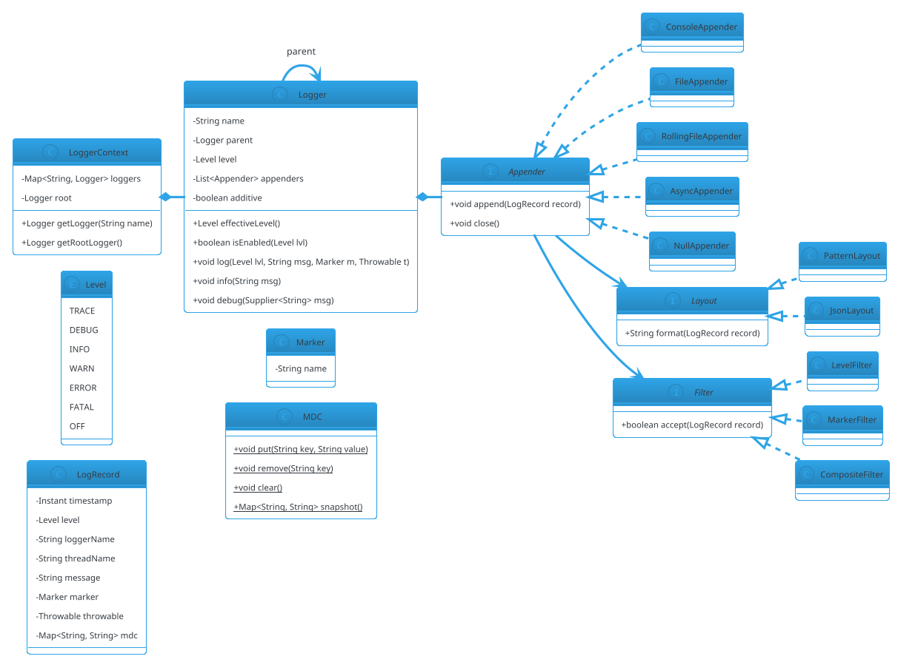

# Logging Framework

## Problem Statement

Design a logging framework like Log4j, SLF4J + Logback, or Java's `java.util.logging`. Applications call a logger to record events at different severity levels. The framework routes messages to **appenders** (console, file, network), formats them via **layouts**, filters them via **log levels and filters**, and handles **async delivery**, **log rotation**, **MDC (Mapped Diagnostic Context)**, and **structured logging**.

**Reused primitives (see reference files):**
- Singleton for the root logger: `design-patterns/creational.md` §1
- Strategy for layouts and appenders: `design-patterns/behavioral.md` §1
- Observer for appender fan-out: `design-patterns/behavioral.md` §2
- Chain of Responsibility for level filtering: `design-patterns/behavioral.md` §7
- Producer-Consumer for async logging: `22-producer-consumer.md` (upcoming)
- Decorator for filtering/wrapping appenders: `design-patterns/structural.md` §2

**New concepts unique to this problem:**
1. **Hierarchical loggers** — `com.foo.bar.Baz` inherits from `com.foo.bar` → `com.foo` → root
2. **Level inheritance** — effective level from nearest ancestor with explicit level
3. **Appenders attached to loggers** — additive by default; can be disabled
4. **Layouts** — Pattern, JSON, XML, custom
5. **Async appenders** — buffered queue + background thread (producer-consumer)
6. **Log rotation** — size-based or time-based; retention policy
7. **MDC (Mapped Diagnostic Context)** — per-thread key-value pairs (ThreadLocal)
8. **Filters** — accept/deny based on level, marker, MDC, custom predicate
9. **Structured logging** — key-value fields, not just strings
10. **Lazy evaluation** — `log.debug(() -> expensive())` to skip work when level disabled

---

## 1. Requirements

### Functional

- **Log levels**: TRACE < DEBUG < INFO < WARN < ERROR < FATAL
- **Logger hierarchy**: dotted names, inheritance of level + appenders
- **Appenders**: Console, File, RollingFile, Async, Socket, Syslog
- **Layouts**: Pattern (with conversion specifiers), JSON
- **Filters**: level-based, marker-based, custom
- **MDC**: per-thread key-value context
- **Structured logging**: key-value fields
- **Lazy logging**: `Supplier`-based parameters
- **Log rotation**: size-based, time-based, retention
- **Async logging**: non-blocking publish; buffered delivery
- **Configuration**: programmatic + file-based
- **Additivity**: logger inherits appenders from ancestors unless disabled

### Non-Functional

- **Thread-safe**: multiple threads logging simultaneously
- **Low overhead**: < 1 µs when level disabled (lazy evaluation)
- **Non-blocking**: async appenders use a background thread
- **Fault-tolerant**: appender failure doesn't crash the app
- **Extensible**: new appenders, layouts, filters without modifying core
- **Consistent**: log records are immutable snapshots
- **MDC-correct**: per-thread state; cleared between requests

### Out of Scope

- Log aggregation / shipping pipelines (that's Log Ingestion in HLD #49)
- Alerting / monitoring integration
- Log parsing / indexing (Elasticsearch)
- Centralized configuration
- Rate limiting per logger

---

## 2. Use Cases (brief)

| # | Use Case | Actor |
|---|---|---|
| UC1 | Log a message at a level | App code |
| UC2 | Configure logger levels | Operator |
| UC3 | Attach/detach appenders | Operator |
| UC4 | Set MDC context | Web filter / app |
| UC5 | Log structured event | App |
| UC6 | Rotate log file by size | RollingFileAppender |
| UC7 | Async publish | AsyncAppender |
| UC8 | Filter out noise | Filter |

---

## 3. Core Entities (delta)

**New entities:**

| Entity | Responsibility |
|---|---|
| `Logger` | Named logger; level, appenders, parent link |
| `LogRecord` | Immutable snapshot: level, message, MDC, timestamp, throwable |
| `Level` | TRACE / DEBUG / INFO / WARN / ERROR / FATAL |
| `Appender` | Destination for LogRecords (console, file, async) |
| `Layout` | Format a LogRecord into bytes/string |
| `Filter` | Accept/deny a LogRecord |
| `LoggerContext` | Registry of loggers; root logger; configuration |
| `MDC` | ThreadLocal map for diagnostic context |
| `Marker` | Named tag for categorization |

**Enums:**

| Enum | Values |
|---|---|
| `Level` | TRACE(0), DEBUG(1), INFO(2), WARN(3), ERROR(4), FATAL(5), OFF(6) |

**Interfaces (contracts):**

| Interface | Implementations |
|---|---|
| `Appender` | `ConsoleAppender`, `FileAppender`, `RollingFileAppender`, `AsyncAppender`, `NullAppender` |
| `Layout` | `PatternLayout`, `JsonLayout`, `XmlLayout` |
| `Filter` | `LevelFilter`, `MarkerFilter`, `CompositeFilter` |

**Reused:**
- Singleton — `design-patterns/creational.md` §1
- Strategy for layouts — `design-patterns/behavioral.md` §1
- Observer for appender fan-out — `design-patterns/behavioral.md` §2
- Chain of Responsibility for filters — `design-patterns/behavioral.md` §7
- Producer-Consumer for async appender — `22-producer-consumer.md` (upcoming)

---

## 4. What's New — the Four Hard Parts

### 4.1 Hierarchical Loggers with Level Inheritance

Loggers form a **tree** by dotted name:

```
root
└── com
    └── foo
        ├── bar
        │   └── Baz
        └── qux
```

Each logger has an **optional** level. Its **effective level** is the nearest ancestor with an explicit level (or root).

**Lookup:** `LoggerContext.getLogger("com.foo.bar.Baz")` walks up creating missing ancestors.

```java
public final class LoggerContext {

    private final java.util.concurrent.ConcurrentHashMap<String, Logger> loggers = new java.util.concurrent.ConcurrentHashMap<>();
    private final Logger root;

    public LoggerContext() {
        this.root = new Logger("root", null, this);
        loggers.put("root", root);
    }

    public Logger getLogger(String name) {
        return loggers.computeIfAbsent(name, n -> {
            int dot = n.lastIndexOf('.');
            String parentName = dot < 0 ? "root" : n.substring(0, dot);
            Logger parent = getLogger(parentName);
            return new Logger(n, parent, this);
        });
    }

    public Logger getRootLogger() { return root; }
}
```

```java
public final class Logger {
    private final String name;
    private final Logger parent;
    private final LoggerContext context;

    private volatile Level level;                        // null = inherit
    private final java.util.List<Appender> appenders = new java.util.concurrent.CopyOnWriteArrayList<>();
    private volatile boolean additive = true;

    public Logger(String name, Logger parent, LoggerContext context) {
        this.name = name;
        this.parent = parent;
        this.context = context;
    }

    public String name() { return name; }
    public Logger parent() { return parent; }

    public Level level() { return level; }
    public void setLevel(Level l) { this.level = l; }

    /** Effective level: nearest ancestor with explicit level, else root's. */
    public Level effectiveLevel() {
        Logger l = this;
        while (l != null) {
            if (l.level != null) return l.level;
            l = l.parent;
        }
        return Level.INFO;   // fallback
    }

    public void addAppender(Appender a) { appenders.add(a); }
    public void removeAppender(Appender a) { appenders.remove(a); }
    public java.util.List<Appender> appenders() { return java.util.List.copyOf(appenders); }
    public boolean additive() { return additive; }
    public void setAdditive(boolean a) { this.additive = a; }

    // ----- Logging methods -----

    public void trace(String msg) { log(Level.TRACE, msg, null, null); }
    public void debug(String msg) { log(Level.DEBUG, msg, null, null); }
    public void info(String msg)  { log(Level.INFO, msg, null, null); }
    public void warn(String msg)  { log(Level.WARN, msg, null, null); }
    public void error(String msg) { log(Level.ERROR, msg, null, null); }

    public void debug(java.util.function.Supplier<String> msg) {
        if (isEnabled(Level.DEBUG)) log(Level.DEBUG, msg.get(), null, null);
    }

    public void error(String msg, Throwable t) { log(Level.ERROR, msg, null, t); }

    public boolean isEnabled(Level lvl) { return lvl.ordinal() >= effectiveLevel().ordinal(); }

    /** The core method: fan out to appenders up the hierarchy (additive). */
    public void log(Level level, String message, Marker marker, Throwable t) {
        if (level.ordinal() < effectiveLevel().ordinal()) return;

        LogRecord record = new LogRecord(
                java.time.Instant.now(),
                level,
                name,
                Thread.currentThread().getName(),
                message,
                marker,
                t,
                MDC.snapshot()
        );

        // Call this logger's appenders, then ancestors (additive)
        Logger current = this;
        while (current != null) {
            for (Appender a : current.appenders) {
                try {
                    a.append(record);
                } catch (RuntimeException ex) {
                    // Swallow and continue — one bad appender must not break others
                    System.err.println("Appender failed: " + ex.getMessage());
                }
            }
            if (!current.additive) break;
            current = current.parent;
        }
    }
}
```

**Key points:**
- **Effective level** walks up the tree.
- **Additivity** — by default, appenders are inherited from ancestors.
- **Failure isolation** — one bad appender doesn't crash the app.
- **`isEnabled`** short-circuits to avoid building the record.

### 4.2 LogRecord (immutable snapshot)

```java
public final class LogRecord {
    private final java.time.Instant timestamp;
    private final Level level;
    private final String loggerName;
    private final String threadName;
    private final String message;
    private final Marker marker;
    private final Throwable throwable;
    private final java.util.Map<String, String> mdc;

    public LogRecord(java.time.Instant timestamp, Level level, String loggerName,
                     String threadName, String message, Marker marker,
                     Throwable throwable, java.util.Map<String, String> mdc) {
        this.timestamp = timestamp;
        this.level = level;
        this.loggerName = loggerName;
        this.threadName = threadName;
        this.message = message;
        this.marker = marker;
        this.throwable = throwable;
        this.mdc = java.util.Map.copyOf(mdc);
    }

    public java.time.Instant timestamp() { return timestamp; }
    public Level level() { return level; }
    public String loggerName() { return loggerName; }
    public String threadName() { return threadName; }
    public String message() { return message; }
    public Marker marker() { return marker; }
    public Throwable throwable() { return throwable; }
    public java.util.Map<String, String> mdc() { return mdc; }
}
```

**Why immutable:** A log record is queued asynchronously; if the caller mutates state after logging, the record must not change. Snapshot at creation.

**MDC snapshot:** captured at log time (not reference), so async appenders see the correct per-thread context.

### 4.3 MDC (Mapped Diagnostic Context)

Per-thread key-value store, typically used for request IDs, user IDs, tenant IDs.

```java
public final class MDC {
    private static final ThreadLocal<java.util.Map<String, String>> CONTEXT =
            ThreadLocal.withInitial(java.util.HashMap::new);

    public static void put(String key, String value) {
        CONTEXT.get().put(key, value);
    }

    public static void remove(String key) {
        CONTEXT.get().remove(key);
    }

    public static String get(String key) {
        return CONTEXT.get().get(key);
    }

    public static void clear() {
        CONTEXT.get().clear();
    }

    public static java.util.Map<String, String> snapshot() {
        return new java.util.HashMap<>(CONTEXT.get());
    }
}
```

**Usage pattern in a web filter:**

```java
try {
    MDC.put("requestId", UUID.randomUUID().toString());
    MDC.put("userId", currentUser.id());
    chain.doFilter(request, response);
} finally {
    MDC.clear();   // critical: avoid leak in thread pool
}
```

**Pitfall:** In a thread pool, forgetting `MDC.clear()` leaks context to the next request. This is the #1 MDC bug.

**Pattern layout usage:** `%X{requestId}` interpolates MDC values.

### 4.4 Layouts (Pattern + JSON)

A `Layout` converts a `LogRecord` to a string.

```java
public interface Layout {
    String format(LogRecord record);
}
```

**Pattern layout** — with conversion specifiers:

| Specifier | Meaning |
|---|---|
| `%d{pattern}` | Timestamp |
| `%p` / `%level` | Level |
| `%c` / `%logger` | Logger name |
| `%t` / `%thread` | Thread name |
| `%m` / `%msg` | Message |
| `%X{key}` | MDC value |
| `%n` | Newline |
| `%throwable` | Stack trace |

```java
public final class PatternLayout implements Layout {
    private final String pattern;

    public PatternLayout(String pattern) { this.pattern = pattern; }

    @Override
    public String format(LogRecord r) {
        String result = pattern
                .replace("%d", r.timestamp().toString())
                .replace("%p", r.level().name())
                .replace("%c", r.loggerName())
                .replace("%t", r.threadName())
                .replace("%m", r.message());
        // MDC interpolation
        java.util.regex.Matcher m = java.util.regex.Pattern.compile("%X\\{([^}]+)\\}").matcher(result);
        StringBuilder sb = new StringBuilder();
        while (m.find()) {
            String value = r.mdc().getOrDefault(m.group(1), "");
            m.appendReplacement(sb, java.util.regex.Matcher.quoteReplacement(value));
        }
        m.appendTail(sb);
        result = sb.toString();
        if (r.throwable() != null) {
            java.io.StringWriter sw = new java.io.StringWriter();
            r.throwable().printStackTrace(new java.io.PrintWriter(sw));
            result += "\n" + sw;
        }
        return result + System.lineSeparator();
    }
}
```

**JSON layout** — for structured logging pipelines:

```java
public final class JsonLayout implements Layout {
    @Override
    public String format(LogRecord r) {
        StringBuilder sb = new StringBuilder("{");
        sb.append("\"timestamp\":\"").append(r.timestamp()).append("\",");
        sb.append("\"level\":\"").append(r.level()).append("\",");
        sb.append("\"logger\":\"").append(escape(r.loggerName())).append("\",");
        sb.append("\"thread\":\"").append(escape(r.threadName())).append("\",");
        sb.append("\"message\":\"").append(escape(r.message())).append("\"");
        if (!r.mdc().isEmpty()) {
            sb.append(",\"mdc\":{");
            boolean first = true;
            for (var e : r.mdc().entrySet()) {
                if (!first) sb.append(",");
                sb.append("\"").append(escape(e.getKey())).append("\":\"")
                  .append(escape(e.getValue())).append("\"");
                first = false;
            }
            sb.append("}");
        }
        sb.append("}");
        return sb.toString() + System.lineSeparator();
    }

    private String escape(String s) {
        return s.replace("\\", "\\\\").replace("\"", "\\\"")
                .replace("\n", "\\n").replace("\r", "\\r");
    }
}
```

### 4.5 Appenders (Console, File, Rolling, Async)

```java
public interface Appender {
    void append(LogRecord record);
    void close();
}
```

```java
public final class ConsoleAppender implements Appender {
    private final Layout layout;

    public ConsoleAppender(Layout layout) { this.layout = layout; }

    @Override
    public void append(LogRecord record) {
        System.out.print(layout.format(record));
    }

    @Override public void close() {}
}
```

```java
public final class FileAppender implements Appender {
    private final Layout layout;
    private final java.io.PrintWriter writer;
    private final java.util.concurrent.locks.ReentrantLock lock = new java.util.concurrent.locks.ReentrantLock();

    public FileAppender(Layout layout, String filePath) throws java.io.IOException {
        this.layout = layout;
        this.writer = new java.io.PrintWriter(new java.io.FileWriter(filePath, true), true);
    }

    @Override
    public void append(LogRecord record) {
        lock.lock();
        try { writer.print(layout.format(record)); }
        finally { lock.unlock(); }
    }

    @Override
    public void close() {
        lock.lock();
        try { writer.close(); }
        finally { lock.unlock(); }
    }
}
```

**RollingFileAppender** — rotates based on size or time:

```java
public final class RollingFileAppender implements Appender {
    private final Layout layout;
    private final String baseFilePath;
    private final long maxFileSizeBytes;
    private final int maxBackups;
    private final java.util.concurrent.locks.ReentrantLock lock = new java.util.concurrent.locks.ReentrantLock();

    private java.io.PrintWriter writer;
    private long currentSizeBytes;

    public RollingFileAppender(Layout layout, String baseFilePath,
                               long maxFileSizeBytes, int maxBackups) throws java.io.IOException {
        this.layout = layout;
        this.baseFilePath = baseFilePath;
        this.maxFileSizeBytes = maxFileSizeBytes;
        this.maxBackups = maxBackups;
        openNewFile();
    }

    @Override
    public void append(LogRecord record) {
        String formatted = layout.format(record);
        lock.lock();
        try {
            if (currentSizeBytes + formatted.length() > maxFileSizeBytes) {
                rotate();
            }
            writer.print(formatted);
            currentSizeBytes += formatted.length();
        } finally { lock.unlock(); }
    }

    private void rotate() {
        try {
            writer.close();
            // Rename existing files: base.log.1, base.log.2, ...
            for (int i = maxBackups - 1; i >= 1; i--) {
                java.io.File old = new java.io.File(baseFilePath + "." + i);
                java.io.File next = new java.io.File(baseFilePath + "." + (i + 1));
                if (old.exists()) old.renameTo(next);
            }
            java.io.File current = new java.io.File(baseFilePath);
            if (current.exists()) current.renameTo(new java.io.File(baseFilePath + ".1"));
            openNewFile();
        } catch (java.io.IOException e) {
            System.err.println("Rotation failed: " + e.getMessage());
        }
    }

    private void openNewFile() throws java.io.IOException {
        this.writer = new java.io.PrintWriter(new java.io.FileWriter(baseFilePath, true), true);
        this.currentSizeBytes = new java.io.File(baseFilePath).length();
    }

    @Override
    public void close() {
        lock.lock();
        try { writer.close(); }
        finally { lock.unlock(); }
    }
}
```

**AsyncAppender** — producer-consumer pattern:

```java
public final class AsyncAppender implements Appender {
    private final Appender delegate;
    private final java.util.concurrent.BlockingQueue<LogRecord> queue;
    private final Thread worker;
    private volatile boolean running = true;

    public AsyncAppender(Appender delegate, int bufferSize) {
        this.delegate = delegate;
        this.queue = new java.util.concurrent.ArrayBlockingQueue<>(bufferSize);
        this.worker = new Thread(this::drain, "async-logger");
        this.worker.setDaemon(true);
        this.worker.start();
    }

    @Override
    public void append(LogRecord record) {
        // Offer (non-blocking); drop on overflow to protect the app
        if (!queue.offer(record)) {
            System.err.println("Async log queue full, dropping record");
        }
    }

    private void drain() {
        while (running || !queue.isEmpty()) {
            try {
                LogRecord r = queue.poll(100, java.util.concurrent.TimeUnit.MILLISECONDS);
                if (r != null) delegate.append(r);
            } catch (InterruptedException e) {
                Thread.currentThread().interrupt();
                return;
            } catch (RuntimeException e) {
                System.err.println("Async append failed: " + e.getMessage());
            }
        }
    }

    @Override
    public void close() {
        running = false;
        try { worker.join(5000); }
        catch (InterruptedException e) { Thread.currentThread().interrupt(); }
        delegate.close();
    }
}
```

**Key decisions:**
- **Non-blocking `offer`** — never block the caller. If the queue is full, drop the record (protects the app; losing logs is better than blocking).
- **Single worker thread** — preserves ordering; one background thread per async appender.
- **Drain on shutdown** — `close()` waits for the queue to empty.
- **Daemon thread** — doesn't prevent JVM shutdown.

For higher throughput, use multiple workers with a partitioned queue. For strict ordering, keep a single worker.

### 4.6 Filters

Filters decide whether a record is appended. Can be attached to appenders or loggers.

```java
public interface Filter {
    /** Return true to accept the record. */
    boolean accept(LogRecord record);
}
```

```java
public final class LevelFilter implements Filter {
    private final Level min;
    private final Level max;

    public LevelFilter(Level min, Level max) {
        this.min = min;
        this.max = max;
    }

    @Override
    public boolean accept(LogRecord r) {
        return r.level().ordinal() >= min.ordinal() && r.level().ordinal() <= max.ordinal();
    }
}
```

```java
public final class MarkerFilter implements Filter {
    private final String markerName;

    public MarkerFilter(String markerName) { this.markerName = markerName; }

    @Override
    public boolean accept(LogRecord r) {
        return r.marker() != null && r.marker().name().equals(markerName);
    }
}
```

**Composite filter (Chain of Responsibility):**

```java
public final class CompositeFilter implements Filter {
    private final java.util.List<Filter> filters;

    public CompositeFilter(java.util.List<Filter> filters) {
        this.filters = java.util.List.copyOf(filters);
    }

    @Override
    public boolean accept(LogRecord r) {
        for (Filter f : filters) {
            if (!f.accept(r)) return false;
        }
        return true;
    }
}
```

**Usage in appender:**

```java
public abstract class FilteredAppender implements Appender {
    protected final Filter filter;

    protected FilteredAppender(Filter filter) { this.filter = filter; }

    @Override
    public final void append(LogRecord record) {
        if (filter != null && !filter.accept(record)) return;
        doAppend(record);
    }

    protected abstract void doAppend(LogRecord record);
}
```

### 4.7 Marker

Named tag for categorization (e.g., "SECURITY", "AUDIT", "PERF").

```java
public record Marker(String name) {
    public Marker {
        if (name == null || name.isBlank()) throw new IllegalArgumentException("Marker name required");
    }
}
```

Logging with a marker:

```java
logger.log(Level.INFO, "User login failed", new Marker("SECURITY"), null);
```

Filters can route by marker (e.g., all `SECURITY` logs to a dedicated file).

---

## 5. Class Diagram (delta)



---

## 6. Java Implementation (new parts only)

Most code is shown in §4. Additional pieces:

### 6.1 NullAppender

```java
public final class NullAppender implements Appender {
    @Override public void append(LogRecord r) {}
    @Override public void close() {}
}
```

### 6.2 LoggerFactory (facade)

```java
public final class LoggerFactory {
    private static final LoggerContext CONTEXT = new LoggerContext();

    private LoggerFactory() {}

    public static Logger getLogger(Class<?> clazz) {
        return CONTEXT.getLogger(clazz.getName());
    }

    public static Logger getLogger(String name) {
        return CONTEXT.getLogger(name);
    }

    public static LoggerContext context() { return CONTEXT; }
}
```

### 6.3 Demo

```java
public class Demo {
    public static void main(String[] args) throws Exception {
        Logger root = LoggerFactory.context().getRootLogger();
        root.setLevel(Level.INFO);
        root.addAppender(new ConsoleAppender(
                new PatternLayout("%d %p [%t] %c - %m")));

        Logger appLogger = LoggerFactory.getLogger("com.example.app");
        Logger dbLogger = LoggerFactory.getLogger("com.example.app.db");
        dbLogger.setLevel(Level.DEBUG);

        appLogger.info("App started");
        dbLogger.debug("Connecting to DB");
        appLogger.warn("Cache miss for key=42");

        // MDC
        try {
            MDC.put("requestId", "req-123");
            MDC.put("userId", "u-456");
            Logger webLogger = LoggerFactory.getLogger("com.example.web");
            webLogger.setLevel(Level.INFO);
            webLogger.info("Handling request");
        } finally {
            MDC.clear();
        }

        // Structured JSON to file
        Logger jsonLogger = LoggerFactory.getLogger("com.example.audit");
        jsonLogger.setLevel(Level.INFO);
        jsonLogger.setAdditive(false);
        jsonLogger.addAppender(new FileAppender(new JsonLayout(), "/tmp/audit.log"));
        jsonLogger.info("User logged in");

        // Async wrapper
        Appender async = new AsyncAppender(
                new ConsoleAppender(new PatternLayout("%p - %m")), 1000);
        Logger asyncLogger = LoggerFactory.getLogger("com.example.async");
        asyncLogger.setLevel(Level.INFO);
        asyncLogger.setAdditive(false);
        asyncLogger.addAppender(async);
        asyncLogger.info("Async message 1");
        asyncLogger.info("Async message 2");

        Thread.sleep(500);
        async.close();
    }
}
```

---

## 7. Concurrency Considerations

Reused from `18-shopping-cart.md` §7 and `13-food-delivery-order.md` §7:
- `ReentrantLock` on stateful appenders (`FileAppender`, `RollingFileAppender`)
- `ConcurrentHashMap` for logger registry
- `CopyOnWriteArrayList` for appender list (rarely written, frequently read)
- Producer-Consumer via `BlockingQueue` (see `22-producer-consumer.md` upcoming)

**New to Logging Framework:**

- **Logger hierarchy creation is lazy but concurrent** — `getLogger("a.b.c")` may create `a`, `a.b`, `a.b.c`. `ConcurrentHashMap.computeIfAbsent` is recursive; potential recursive update issue. Use `Chm` carefully or a plain `synchronized` on the registry.
- **Additivity fan-out races** — as we walk up the tree calling appenders, another thread could add/remove appenders. `CopyOnWriteArrayList` on `Logger.appenders` handles it.
- **MDC is per-thread** — `ThreadLocal`; no cross-thread synchronization. `MDC.snapshot()` copies the map at log time.
- **Level changes are volatile** — `volatile Level level` so other threads see updates. Rare writes, frequent reads.
- **Async appender shutdown** — `close()` must drain the queue. Use `join(timeout)`.
- **Rolling file rotation** — locked; concurrent appends serialize. Rotation is rare.
- **Filter evaluation** — pure functions; no locking needed.
- **Appender failure isolation** — one bad appender caught; loop continues.

**Best practices:**
- **Never log inside a lock you hold** — could deadlock if the appender locks.
- **Never block the appender** — async to protect the caller.
- **Never leak MDC** — always `clear()` in a `finally`.

---

## 8. Extensibility

| Feature | Change |
|---|---|
| New appender | Implement `Appender` |
| New layout | Implement `Layout` |
| New filter | Implement `Filter` |
| New level | Extend `Level` enum |
| Syslog / Socket appender | New `Appender` implementation |
| Structured fields (beyond MDC) | Add `Map<String, Object> fields` to `LogRecord` |
| Log sampling | Add `SamplingAppender` (Decorator) |
| Log rate limiting | Add `RateLimitingAppender` (Decorator) |
| Configuration file (YAML/XML) | Add `ConfigurationParser` |
| JMX management | Expose loggers via JMX MBeans |
| Colored console output | `AnsiConsoleLayout` |

---

## 9. Common Pitfalls

| Pitfall | Fix |
|---|---|
| Logging at disabled level builds expensive string | Guard with `isEnabled` or use `Supplier` |
| MDC leak in thread pool | `MDC.clear()` in `finally` |
| Sync logging on hot path | `AsyncAppender` |
| Blocking async appender | `offer` (drop), not `put` (block) |
| Broken appender crashes app | try/catch around `append` per appender |
| Rotation loses in-flight records | Flush before rotate |
| Duplicated logs across appenders | `additive=false` on loggers with dedicated appenders |
| Level comparison using `==` on ordinals | Use `ordinal()` explicitly |
| Recursive `getLogger` deadlock | Careful with `computeIfAbsent` recursion (see note above) |
| Logging `LogRecord` mutability | Immutable; snapshot MDC |
| Non-daemon async thread blocks shutdown | `setDaemon(true)` |
| Not draining async queue on shutdown | `close()` waits for `queue` to empty |
| Reflection of the wrong logger class | `getLogger(Class)` uses `clazz.getName()` |
| Printing raw user input | Escape in JSON; sanitize in pattern |

---

## 10. Follow-ups

### Q1: How do you make async logging preserve order?

**Answer:** Use a **single** worker thread consuming a `BlockingQueue`. Records are enqueued in order and appended in the same order. Multiple workers would break ordering. If you need higher throughput with ordering, partition by `logger name` and use one worker per partition.

### Q2: How do you handle backpressure?

**Answer:** `AsyncAppender` uses `offer` with a fixed capacity queue. On overflow, drop the record (log a message to stderr). Alternatives: block the caller (bad), or dynamically grow the queue (bounded by memory). Dropping is the safest default for production.

### Q3: How do you support colored output?

**Answer:** `AnsiConsoleLayout` wraps a `Layout` and injects ANSI escape codes by level (red for ERROR, yellow for WARN). Detect terminal support (e.g., `System.console() != null` or env var).

### Q4: How do you test this?

- **Unit tests** for `Logger.effectiveLevel`, additivity, filters
- **MDC isolation test** — thread pool, MDC cleared between tasks
- **Concurrency tests** — 100 threads logging; assert no lost records
- **Rolling test** — write until rotation; assert correct number of backup files
- **Async test** — enqueue N records; `close()`; assert all written
- **Failure isolation test** — a throwing appender doesn't affect others

### Q5: How would you add a database appender?

**Answer:** Implement `DatabaseAppender` with a JDBC `DataSource`. Buffer records and batch-insert (e.g., every 100 records or every 1s). Guard with a `LevelFilter` to only write WARN+. Consider a dedicated `AsyncAppender` wrapper to decouple DB latency from the caller.

---

## 11. Similar Problems

- **Pub-Sub System (LLD)** (`30-pub-sub-lld.md` upcoming) — fan-out to subscribers
- **Producer-Consumer** (`22-producer-consumer.md` upcoming) — async queue pattern
- **Metrics / Monitoring** — counters and histograms (adjacent)
- **Notification System** (`21-notification-system.md` in HLD) — multi-channel delivery
- **Log Ingestion System** (`49-log-ingestion-system.md` in HLD) — shipping and aggregation

Logging Framework's unique additions: **hierarchical loggers**, **level inheritance**, **additivity**, **MDC**, **structured layouts**, **async appenders**.

---

## 12. Key Takeaways

- **Hierarchical loggers** — dotted names form a tree; effective level inherited from nearest ancestor
- **Additivity** — loggers inherit appenders from ancestors unless `additive=false`
- **LogRecord is immutable** — snapshot MDC, don't hold references
- **Level check first** — avoid building the record when disabled
- **Lazy logging with `Supplier`** — `log.debug(() -> expensive())`
- **MDC is ThreadLocal** — always `clear()` in a `finally`
- **Appenders as Strategy** — Console, File, Rolling, Async, Syslog
- **Layouts as Strategy** — Pattern, JSON, XML
- **Filters as Chain of Responsibility** — level, marker, custom
- **AsyncAppender uses Producer-Consumer** — `BlockingQueue`, single worker, `offer` (drop on overflow)
- **Failure isolation** — try/catch around each appender
- **Rolling file** — size/time based, with retention
- **Non-blocking** — never block the caller; async protects the app
- **Daemon worker thread** — doesn't prevent JVM shutdown
- **Drain on close** — `close()` waits for queue to empty
- **Facade** — `LoggerFactory` provides the API
- **Configurable** — programmatic and file-based

### The Delta Recipe

For any **logging / event emission** problem:

1. **Hierarchical naming** — dotted names with level inheritance
2. **Immutable event record** — snapshot at emit time
3. **Levels** — ordered enum for gating
4. **Strategy for outputs** — appenders (console, file, async)
5. **Strategy for formatting** — layouts (pattern, JSON)
6. **Chain of filters** — level, marker, custom
7. **Additivity** — inherit from ancestors unless disabled
8. **Producer-Consumer for async** — bounded queue, drop on overflow
9. **ThreadLocal context** — MDC for per-thread data
10. **Failure isolation** — one output failure doesn't crash the app
11. **Lazy evaluation** — `Supplier` for expensive messages
12. **Rolling / retention** — file management

This delta plus the Strategy/Observer patterns from the design-patterns section solves: Logging Framework, Metrics Emitter, Event Bus, Audit Logger, Telemetry SDK — with variations in output channels and structured fields.