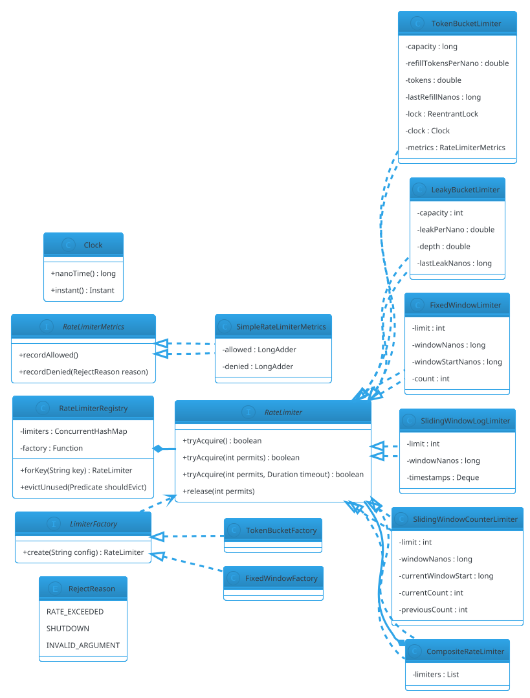

# Rate Limiter (LLD)

## Problem Statement

Design a **rate limiter library** — not a distributed service (that's HLD #02), but a **reusable in-process component** that any application can embed to throttle calls to methods, APIs, or resources. The library must be thread-safe, support multiple algorithms (token bucket, leaky bucket, fixed window, sliding window), allow per-key isolation (per user, per IP, per endpoint), and be composable without blocking callers unexpectedly.

**This is the entry to the Concurrency category.** From here on, the focus shifts from domain modeling to **thread coordination, atomicity, and low-level primitives**.

**Reused primitives (see reference files):**
- Concurrency primitives overview: `concurrency-basics.md` (§3-5)
- Strategy pattern for algorithms: `design-patterns/behavioral.md` §1
- Factory for creating limiters: `design-patterns/creational.md` §2
- Singleton for registry (optional): `design-patterns/creational.md` §1

**New concepts unique to this problem:**
1. **Four algorithms** — token bucket, leaky bucket, fixed window, sliding window
2. **Atomic check-and-consume** — must be lock-free or minimally locked
3. **Time-based algorithms** — refill, decay, window boundaries
4. **Per-key limiters** — one limiter per (user, endpoint) pair
5. **Non-blocking API** — return allow/deny, not wait
6. **Blocking API (optional)** — `acquire(timeout)` waits for a permit
7. **Composite limiters** — multiple rules (e.g., 10/sec AND 100/min)
8. **Observability** — metrics on allow/deny rate
9. **Warm-up / cool-down** — burst tolerance

---

## 1. Requirements

### Functional

- **`tryAcquire()`** — non-blocking; returns true if permit granted
- **`acquire(timeout)`** — blocking with timeout; returns true if permit granted before timeout
- **`tryAcquire(n)`** — request n permits at once
- **Per-key isolation** — `limiter.forKey("user:123")` returns a per-key view
- **Multiple algorithms** — token bucket, leaky bucket, fixed window, sliding window
- **Composite rules** — apply multiple limiters (e.g., 10/sec AND 100/min)
- **Metrics** — count of allowed / denied
- **Reset / dynamic config** — change rate at runtime (optional)

### Non-Functional

- **Thread-safe** — safe for concurrent calls
- **Low overhead** — < 1 µs per check when uncontended
- **Non-blocking by default** — never sleep in `tryAcquire`
- **Fair** — first-come, first-served within a limiter
- **Correct under contention** — no double-granting
- **Extensible** — new algorithms without modifying core
- **Testable** — injectable clock (see `14-meeting-scheduler.md` §4.1)

### Out of Scope

- Distributed rate limiting (Redis-backed) — that's HLD #02
- Persistence — this is in-process
- Config file loading — programmatic config
- HTTP filter integration — library only

---

## 2. Use Cases (brief)

| # | Use Case | Actor |
|---|---|---|
| UC1 | Allow if under limit | Caller |
| UC2 | Block until permit available | Caller |
| UC3 | Request N permits | Caller (batch) |
| UC4 | Per-user limits | Caller |
| UC5 | Combine 10/sec + 100/min | Caller |
| UC6 | Change rate at runtime | Admin |
| UC7 | Export metrics | Monitoring |

---

## 3. Core Entities (delta)

**New entities:**

| Entity | Responsibility |
|---|---|
| `RateLimiter` | Interface: `tryAcquire`, `acquire`, `tryAcquire(n)` |
| `TokenBucketLimiter` | Token bucket implementation |
| `LeakyBucketLimiter` | Leaky bucket (queue-based) |
| `FixedWindowLimiter` | Fixed window counter |
| `SlidingWindowLimiter` | Sliding window (log or counter) |
| `CompositeRateLimiter` | AND of multiple limiters |
| `RateLimiterRegistry` | Per-key limiter factory |
| `RateLimiterMetrics` | Allowed/denied counters |
| `Clock` | Injectable time source (reuse from `14-meeting-scheduler.md` §4.1) |

**Enums:**

| Enum | Values |
|---|---|
| `RejectReason` | RATE_EXCEEDED, SHUTDOWN, INVALID_ARGUMENT |

**Interfaces:**

| Interface | Implementations |
|---|---|
| `RateLimiter` | TokenBucket, LeakyBucket, FixedWindow, SlidingWindow, Composite |
| `LimiterFactory` | `TokenBucketFactory`, etc. |

---

## 4. What's New — the Four Algorithms

All four algorithms answer the same question: **"Is there capacity right now?"** — but with different semantics.

### 4.1 Token Bucket

**Concept:** A bucket holds up to `capacity` tokens. Tokens refill at `refillRate` per second. Each permit consumes one token.

**Pros:** Simple, allows bursts up to `capacity`, low memory (one state per key).

**Cons:** Doesn't enforce a strict average rate — a full bucket allows an immediate burst of `capacity`.

**State per limiter:** `tokens` (double), `lastRefillNanos` (long).

```java
public final class TokenBucketLimiter implements RateLimiter {

    private final long capacity;
    private final double refillTokensPerNano;
    private final Clock clock;
    private final RateLimiterMetrics metrics;

    // Guarded by this lock for atomicity of refill + consume
    private final java.util.concurrent.locks.ReentrantLock lock = new java.util.concurrent.locks.ReentrantLock();
    private double tokens;
    private long lastRefillNanos;

    public TokenBucketLimiter(long capacity, double refillRatePerSecond, Clock clock,
                              RateLimiterMetrics metrics) {
        if (capacity <= 0) throw new IllegalArgumentException("capacity must be > 0");
        if (refillRatePerSecond <= 0) throw new IllegalArgumentException("rate must be > 0");
        this.capacity = capacity;
        this.refillTokensPerNano = refillRatePerSecond / 1_000_000_000.0;
        this.clock = clock;
        this.metrics = metrics;
        this.tokens = capacity;
        this.lastRefillNanos = clock.nanoTime();
    }

    @Override
    public boolean tryAcquire(int permits) {
        if (permits <= 0) throw new IllegalArgumentException("permits must be > 0");
        lock.lock();
        try {
            refill();
            if (tokens >= permits) {
                tokens -= permits;
                metrics.recordAllowed();
                return true;
            }
            metrics.recordDenied(RejectReason.RATE_EXCEEDED);
            return false;
        } finally {
            lock.unlock();
        }
    }

    private void refill() {
        long now = clock.nanoTime();
        long elapsed = now - lastRefillNanos;
        if (elapsed > 0) {
            tokens = Math.min(capacity, tokens + elapsed * refillTokensPerNano);
            lastRefillNanos = now;
        }
    }

    @Override
    public boolean tryAcquire() { return tryAcquire(1); }
}
```

**Key decisions:**
- **`double tokens`** — fractional tokens accumulate between calls; using `long` would lose precision on sub-second refills.
- **Single lock around refill + consume** — `ReentrantLock` is fine here; contention is low because refill is cheap.
- **`lock.unlock()` in `finally`** — critical; forgetting it deadlocks the limiter.

**Alternative — lock-free with `AtomicLong` storing fractional bits:**

```java
// Store tokens as a fixed-point long (e.g., 1 token = 1_000_000 units).
// CAS loop to refill + consume atomically. Faster under high contention.
// More complex; use only if profiling shows lock contention.
```

### 4.2 Leaky Bucket

**Concept:** A bucket with a hole at the bottom. Requests fill the bucket; they "leak" out at a fixed rate. If the bucket is full, new requests are rejected.

**Pros:** Enforces a strict average rate; smooths bursts.

**Cons:** Rejects bursts even when the average rate would allow them.

**State:** `queueDepth` (int), `lastLeakNanos` (long).

```java
public final class LeakyBucketLimiter implements RateLimiter {

    private final int capacity;
    private final double leakPerNano;
    private final Clock clock;
    private final RateLimiterMetrics metrics;

    private final java.util.concurrent.locks.ReentrantLock lock = new java.util.concurrent.locks.ReentrantLock();
    private double depth;
    private long lastLeakNanos;

    public LeakyBucketLimiter(int capacity, double leakRatePerSecond,
                              Clock clock, RateLimiterMetrics metrics) {
        this.capacity = capacity;
        this.leakPerNano = leakRatePerSecond / 1_000_000_000.0;
        this.clock = clock;
        this.metrics = metrics;
        this.depth = 0;
        this.lastLeakNanos = clock.nanoTime();
    }

    @Override
    public boolean tryAcquire(int permits) {
        if (permits <= 0) throw new IllegalArgumentException("permits must be > 0");
        lock.lock();
        try {
            leak();
            if (depth + permits <= capacity) {
                depth += permits;
                metrics.recordAllowed();
                return true;
            }
            metrics.recordDenied(RejectReason.RATE_EXCEEDED);
            return false;
        } finally {
            lock.unlock();
        }
    }

    private void leak() {
        long now = clock.nanoTime();
        long elapsed = now - lastLeakNanos;
        if (elapsed > 0) {
            depth = Math.max(0, depth - elapsed * leakPerNano);
            lastLeakNanos = now;
        }
    }

    @Override public boolean tryAcquire() { return tryAcquire(1); }
}
```

**Key difference from token bucket:**
- **Token bucket:** refill ADDS tokens; consumption SUBTRACTS; burst allowed if tokens present.
- **Leaky bucket:** leak SUBTRACTS from depth; consumption ADDS; burst rejected if depth would exceed capacity.

Both are mathematically equivalent in steady state but differ in burst behavior.

### 4.3 Fixed Window

**Concept:** Divide time into fixed windows (e.g., 1-second buckets). Each window has a counter; permits increment it. If the counter exceeds the limit, reject. The counter resets at window boundary.

**Pros:** Simple, cheap, works well for most APIs.

**Cons:** **Boundary burst** — 100 requests at 0.99s + 100 at 1.01s = 200 in a 20 ms span, even if the limit is "100 per second".

**State:** `windowStartNanos` (long), `count` (int).

```java
public final class FixedWindowLimiter implements RateLimiter {

    private final int limit;
    private final long windowNanos;
    private final Clock clock;
    private final RateLimiterMetrics metrics;

    private final java.util.concurrent.locks.ReentrantLock lock = new java.util.concurrent.locks.ReentrantLock();
    private long windowStartNanos;
    private int count;

    public FixedWindowLimiter(int limit, java.time.Duration window,
                              Clock clock, RateLimiterMetrics metrics) {
        this.limit = limit;
        this.windowNanos = window.toNanos();
        this.clock = clock;
        this.metrics = metrics;
        this.windowStartNanos = clock.nanoTime();
        this.count = 0;
    }

    @Override
    public boolean tryAcquire(int permits) {
        if (permits <= 0) throw new IllegalArgumentException("permits must be > 0");
        lock.lock();
        try {
            rollWindowIfNeeded();
            if (count + permits <= limit) {
                count += permits;
                metrics.recordAllowed();
                return true;
            }
            metrics.recordDenied(RejectReason.RATE_EXCEEDED);
            return false;
        } finally {
            lock.unlock();
        }
    }

    private void rollWindowIfNeeded() {
        long now = clock.nanoTime();
        if (now - windowStartNanos >= windowNanos) {
            windowStartNanos = now;
            count = 0;
        }
    }

    @Override public boolean tryAcquire() { return tryAcquire(1); }
}
```

**Boundary problem illustration:** Limit = 100/sec. At t=0.99s, 100 requests succeed. At t=1.01s, 100 more succeed. The application sees 200 requests in 20 ms — far above the intended rate.

### 4.4 Sliding Window (Log)

**Concept:** Keep a **log** of timestamps for each granted permit. On a new request, remove timestamps older than the window, count remaining, and grant if under limit.

**Pros:** Smooth, no boundary burst.

**Cons:** **O(limit)** memory per key; costly for large limits.

**State:** `Deque<Long> timestamps`.

```java
public final class SlidingWindowLogLimiter implements RateLimiter {

    private final int limit;
    private final long windowNanos;
    private final Clock clock;
    private final RateLimiterMetrics metrics;

    private final java.util.concurrent.locks.ReentrantLock lock = new java.util.concurrent.locks.ReentrantLock();
    private final java.util.ArrayDeque<Long> timestamps = new java.util.ArrayDeque<>();

    public SlidingWindowLogLimiter(int limit, java.time.Duration window,
                                   Clock clock, RateLimiterMetrics metrics) {
        this.limit = limit;
        this.windowNanos = window.toNanos();
        this.clock = clock;
        this.metrics = metrics;
    }

    @Override
    public boolean tryAcquire(int permits) {
        if (permits <= 0) throw new IllegalArgumentException("permits must be > 0");
        lock.lock();
        try {
            long now = clock.nanoTime();
            long cutoff = now - windowNanos;
            while (!timestamps.isEmpty() && timestamps.peekFirst() <= cutoff) {
                timestamps.pollFirst();
            }
            if (timestamps.size() + permits <= limit) {
                for (int i = 0; i < permits; i++) timestamps.addLast(now);
                metrics.recordAllowed();
                return true;
            }
            metrics.recordDenied(RejectReason.RATE_EXCEEDED);
            return false;
        } finally {
            lock.unlock();
        }
    }

    @Override public boolean tryAcquire() { return tryAcquire(1); }
}
```

**Memory:** O(limit) longs per key. For limit=1000, ~8 KB per key. Acceptable for hundreds of keys, problematic for millions.

### 4.5 Sliding Window (Counter)

**Concept:** Approximation using **two fixed-window counters** (current and previous). The effective count is a weighted sum based on how far into the current window we are.

**Pros:** O(1) memory, no boundary burst.

**Cons:** Approximate — can over- or under-count by a small margin.

```java
public final class SlidingWindowCounterLimiter implements RateLimiter {

    private final int limit;
    private final long windowNanos;
    private final Clock clock;
    private final RateLimiterMetrics metrics;

    private final java.util.concurrent.locks.ReentrantLock lock = new java.util.concurrent.locks.ReentrantLock();
    private long currentWindowStart;
    private int currentCount;
    private int previousCount;

    public SlidingWindowCounterLimiter(int limit, java.time.Duration window,
                                       Clock clock, RateLimiterMetrics metrics) {
        this.limit = limit;
        this.windowNanos = window.toNanos();
        this.clock = clock;
        this.metrics = metrics;
        this.currentWindowStart = clock.nanoTime();
        this.currentCount = 0;
        this.previousCount = 0;
    }

    @Override
    public boolean tryAcquire(int permits) {
        if (permits <= 0) throw new IllegalArgumentException("permits must be > 0");
        lock.lock();
        try {
            rollWindowIfNeeded();
            long now = clock.nanoTime();
            double elapsedFraction = (double) (now - currentWindowStart) / windowNanos;
            double effective = previousCount * (1.0 - elapsedFraction) + currentCount;

            if (effective + permits <= limit) {
                currentCount += permits;
                metrics.recordAllowed();
                return true;
            }
            metrics.recordDenied(RejectReason.RATE_EXCEEDED);
            return false;
        } finally {
            lock.unlock();
        }
    }

    private void rollWindowIfNeeded() {
        long now = clock.nanoTime();
        if (now - currentWindowStart >= windowNanos) {
            long windowsPassed = (now - currentWindowStart) / windowNanos;
            if (windowsPassed >= 2) {
                previousCount = 0;
            } else {
                previousCount = currentCount;
            }
            currentCount = 0;
            currentWindowStart = now;
        }
    }

    @Override public boolean tryAcquire() { return tryAcquire(1); }
}
```

**Accuracy:** Within a few percent of the exact sliding window for typical limits. Preferred over log-based when memory matters.

### 4.6 Algorithm Comparison

| Algorithm | Memory | Burst tolerance | Boundary burst | Precision |
|---|---|---|---|---|
| Token bucket | O(1) | up to capacity | no | exact |
| Leaky bucket | O(1) | none | no | exact |
| Fixed window | O(1) | up to limit | **yes** | exact per window |
| Sliding window log | O(limit) | none | no | exact |
| Sliding window counter | O(1) | none | no | approximate (~few %) |

**Recommendation:**
- **Most APIs:** token bucket (burst tolerance is a feature)
- **Strict smoothing:** leaky bucket or sliding window counter
- **Legacy compatibility:** fixed window (simplest)
- **Small limits + strict:** sliding window log

---

## 5. Composite + Registry + Metrics

### 5.1 Composite Rate Limiter

Apply multiple limiters together — all must allow:

```java
public final class CompositeRateLimiter implements RateLimiter {

    private final java.util.List<RateLimiter> limiters;

    public CompositeRateLimiter(java.util.List<RateLimiter> limiters) {
        this.limiters = java.util.List.copyOf(limiters);
    }

    @Override
    public boolean tryAcquire(int permits) {
        java.util.List<RateLimiter> granted = new java.util.ArrayList<>();
        for (RateLimiter l : limiters) {
            if (l.tryAcquire(permits)) {
                granted.add(l);
            } else {
                // Rollback: return permits to limiters that already granted
                for (RateLimiter g : granted) g.release(permits);
                return false;
            }
        }
        return true;
    }

    @Override public boolean tryAcquire() { return tryAcquire(1); }
}
```

**Note:** `release` is not in the basic `RateLimiter` interface. For composite, we need it:

```java
public interface RateLimiter {
    boolean tryAcquire();
    boolean tryAcquire(int permits);
    default void release(int permits) {
        throw new UnsupportedOperationException("Release not supported by this limiter");
    }
}
```

**Alternative:** composite that doesn't rollback (accepts transient over-consumption) — simpler but less correct. Rollback is preferred for correctness.

### 5.2 Registry (Per-Key Limiters)

```java
public final class RateLimiterRegistry {

    private final java.util.function.Function<String, RateLimiter> factory;
    private final java.util.concurrent.ConcurrentHashMap<String, RateLimiter> limiters = new java.util.concurrent.ConcurrentHashMap<>();

    public RateLimiterRegistry(java.util.function.Function<String, RateLimiter> factory) {
        this.factory = factory;
    }

    public RateLimiter forKey(String key) {
        return limiters.computeIfAbsent(key, factory);
    }

    /** Periodic cleanup of idle keys (optional). */
    public void evictUnused(java.util.function.Predicate<String> shouldEvict) {
        limiters.entrySet().removeIf(e -> shouldEvict.test(e.getKey()));
    }
}
```

**Why per-key:** a rate limiter per user / IP / endpoint. Shared limiters would wrongly throttle unrelated callers.

**Memory concern:** unbounded keys grow the map. In production, use a TTL-based eviction (e.g., Guava `Cache` with `expireAfterAccess`). For LLD, a manual `evictUnused` is enough.

### 5.3 Metrics

```java
public interface RateLimiterMetrics {
    void recordAllowed();
    void recordDenied(RejectReason reason);
}

public enum RejectReason {
    RATE_EXCEEDED,
    SHUTDOWN,
    INVALID_ARGUMENT
}
```

```java
public final class SimpleRateLimiterMetrics implements RateLimiterMetrics {

    private final java.util.concurrent.atomic.LongAdder allowed = new java.util.concurrent.atomic.LongAdder();
    private final java.util.concurrent.atomic.LongAdder denied = new java.util.concurrent.atomic.LongAdder();

    @Override public void recordAllowed() { allowed.increment(); }
    @Override public void recordDenied(RejectReason reason) { denied.increment(); }

    public long allowedCount() { return allowed.sum(); }
    public long deniedCount() { return denied.sum(); }
}
```

**Why `LongAdder`:** under high concurrency, `AtomicLong` contentions degrade throughput. `LongAdder` uses striping for near-linear scaling.

### 5.4 Factory

```java
public interface LimiterFactory {
    RateLimiter create(String config);
}
```

```java
public final class TokenBucketFactory implements LimiterFactory {
    private final Clock clock;
    private final RateLimiterMetrics metrics;

    public TokenBucketFactory(Clock clock, RateLimiterMetrics metrics) {
        this.clock = clock;
        this.metrics = metrics;
    }

    @Override
    public RateLimiter create(String config) {
        // config format: "10/sec" or "100/min"
        String[] parts = config.split("/");
        long limit = Long.parseLong(parts[0]);
        double seconds = switch (parts[1].toLowerCase()) {
            case "sec", "second", "s" -> 1.0;
            case "min", "minute", "m" -> 60.0;
            case "hour", "h" -> 3600.0;
            default -> throw new IllegalArgumentException("Unknown unit: " + parts[1]);
        };
        return new TokenBucketLimiter(limit, limit / seconds, clock, metrics);
    }
}
```

---

## 6. Blocking API (`acquire(timeout)`)

Non-blocking `tryAcquire` is the default, but some callers want to **wait** for a permit instead of retrying.

```java
public interface RateLimiter {
    boolean tryAcquire();
    boolean tryAcquire(int permits);
    default void release(int permits) { throw new UnsupportedOperationException(); }

    /**
     * Blocks until a permit is available or the timeout expires.
     * Returns true if granted, false otherwise.
     */
    boolean tryAcquire(int permits, java.time.Duration timeout) throws InterruptedException;
}
```

**Implementation for token bucket:**

```java
@Override
public boolean tryAcquire(int permits, java.time.Duration timeout) throws InterruptedException {
    long deadline = System.nanoTime() + timeout.toNanos();
    while (true) {
        if (tryAcquire(permits)) return true;
        long remaining = deadline - System.nanoTime();
        if (remaining <= 0) return false;
        long sleepNanos = Math.min(remaining, 1_000_000);   // 1 ms poll
        java.util.concurrent.TimeUnit.NANOSECONDS.sleep(sleepNanos);
    }
}
```

**Better approach — use `Condition` with `signal` on refill:**

```java
// In TokenBucketLimiter:
private final java.util.concurrent.locks.Condition available = lock.newCondition();

// In refill, after adding tokens:
if (tokens >= 1) available.signalAll();

// In tryAcquire(timeout):
lock.lock();
try {
    long deadline = System.nanoTime() + timeout.toNanos();
    while (tokens < permits) {
        long remaining = deadline - System.nanoTime();
        if (remaining <= 0) return false;
        available.awaitNanos(remaining);   // wakes on signal OR timeout
    }
    tokens -= permits;
    return true;
} finally {
    lock.unlock();
}
```

**Trade-off:** `Condition` wakes waiters exactly when tokens arrive; polling wastes CPU but is simpler. For high-throughput limiters, use `Condition`.

---

## 7. Class Diagram (delta)



---

## 8. Java Implementation (support pieces)

### 8.1 Clock

```java
public interface Clock {
    long nanoTime();
    java.time.Instant instant();

    static Clock system() {
        return new Clock() {
            @Override public long nanoTime() { return System.nanoTime(); }
            @Override public java.time.Instant instant() { return java.time.Instant.now(); }
        };
    }

    static Clock fixed(long nanoTime, java.time.Instant instant) {
        return new Clock() {
            @Override public long nanoTime() { return nanoTime; }
            @Override public java.time.Instant instant() { return instant; }
        };
    }
}
```

### 8.2 Demo

```java
public class Demo {
    public static void main(String[] args) throws InterruptedException {
        RateLimiterMetrics metrics = new SimpleRateLimiterMetrics();
        Clock clock = Clock.system();

        // 10 requests per second, burst up to 10
        RateLimiter limiter = new TokenBucketLimiter(10, 10.0, clock, metrics);

        // Burst 15 requests
        int allowed = 0;
        for (int i = 0; i < 15; i++) {
            if (limiter.tryAcquire()) allowed++;
        }
        System.out.println("Burst: " + allowed + "/15 allowed");   // 10

        // Wait 1 second; check refill
        Thread.sleep(1000);
        System.out.println("After 1s: " + limiter.tryAcquire());   // true

        // Per-key registry
        RateLimiterRegistry registry = new RateLimiterRegistry(
                key -> new TokenBucketLimiter(5, 5.0, clock, metrics));

        RateLimiter alice = registry.forKey("user:alice");
        RateLimiter bob = registry.forKey("user:bob");

        for (int i = 0; i < 8; i++) alice.tryAcquire();
        for (int i = 0; i < 3; i++) bob.tryAcquire();

        // alice has exhausted her 5; bob has 2 left
        System.out.println("Alice over: " + alice.tryAcquire());   // false
        System.out.println("Bob under: " + bob.tryAcquire());      // true

        // Composite: 10/sec AND 100/min
        RateLimiter composite = new CompositeRateLimiter(java.util.List.of(
                new TokenBucketLimiter(10, 10.0, clock, metrics),
                new TokenBucketLimiter(100, 100.0 / 60.0, clock, metrics)
        ));
        for (int i = 0; i < 12; i++) composite.tryAcquire();       // 10 succeed
    }
}
```

---

## 9. Concurrency Considerations

Reused from `concurrency-basics.md`:
- `ReentrantLock` for critical sections
- `AtomicLong` / `LongAdder` for counters
- CAS loops for lock-free paths

**New to Rate Limiter:**

- **Per-limiter lock is fine** — each limiter protects its own state; no cross-limiter contention.
- **Contention is bounded** — even at 1M QPS on one limiter, the critical section is a handful of arithmetic ops.
- **Lock-free option** — for token bucket, use `AtomicLong` with fixed-point:
  ```java
  // Fixed-point: 1 token = 1_000_000 units
  private final AtomicLong state = new AtomicLong(capacity * 1_000_000L);
  // Refill: CAS loop that adds elapsed * rate, capped at capacity
  // Consume: CAS loop that subtracts if enough
  ```
  More complex, faster under high contention. Recommend `ReentrantLock` unless profiling demands otherwise.
- **Fairness** — `new ReentrantLock(true)` gives FIFO ordering to waiters (used in `acquire(timeout)`), at the cost of throughput.
- **Composite rollback** — if a composite limiter grants some permits and then fails on a later limiter, it must roll back. Requires `release(permits)` on all limiters.
- **Registry growth** — unbounded per-key limiters leak memory. Use TTL eviction in production.
- **Clock monotonicity** — use `System.nanoTime()` (monotonic), not `System.currentTimeMillis()` (subject to NTP jumps). `Clock.nanoTime()` enforces this.
- **Do NOT use `Instant` for refill math** — always `nanoTime`, which is monotonic.

### Testing

```java
@Test
void tokenBucketAllowsBurstThenRefills() throws InterruptedException {
    Clock clock = Clock.system();
    RateLimiter limiter = new TokenBucketLimiter(5, 5.0, clock, new SimpleRateLimiterMetrics());

    // Burst 5
    for (int i = 0; i < 5; i++) assertTrue(limiter.tryAcquire());
    // 6th denied
    assertFalse(limiter.tryAcquire());

    // Wait for refill
    Thread.sleep(1000);
    assertTrue(limiter.tryAcquire());
}

@Test
void concurrentAccessNeverDoubleGrants() throws InterruptedException {
    Clock clock = Clock.system();
    RateLimiter limiter = new TokenBucketLimiter(100, 0.1, clock, new SimpleRateLimiterMetrics());
    // Very low refill rate → effectively 100 permits total

    int threads = 200;
    var pool = java.util.concurrent.Executors.newFixedThreadPool(threads);
    var latch = new java.util.concurrent.CountDownLatch(1);
    var granted = new java.util.concurrent.atomic.AtomicInteger();

    for (int i = 0; i < threads; i++) {
        pool.submit(() -> {
            try { latch.await(); } catch (InterruptedException ignored) { return; }
            if (limiter.tryAcquire()) granted.incrementAndGet();
        });
    }
    latch.countDown();
    pool.shutdown();
    pool.awaitTermination(5, java.util.concurrent.TimeUnit.SECONDS);

    assertEquals(100, granted.get());
}
```

---

## 10. Extensibility

| Feature | Change |
|---|---|
| New algorithm (GCRA, etc.) | Implement `RateLimiter` |
| Distributed rate limiting | Back the limiter with Redis (`INCR` + `EXPIRE`); see HLD #02 |
| Warm-up | Adjust `capacity` and `refillRate` over time |
| Multi-tier limits | Composite limiter |
| Allow-list | Composite with a "always true" limiter for VIPs |
| Metrics export | Implement `RateLimiterMetrics` to push to Prometheus |
| Adaptive rate | Monitor deny rate; auto-adjust `refillRate` |
| Config-driven limits | YAML → `LimiterFactory` |
| Shutdown / drain | Add `shutdown()` to stop accepting; drain queue |
| TTL eviction for registry | Back with Guava `Cache` or `Caffeine` |

---

## 11. Common Pitfalls

| Pitfall | Fix |
|---|---|
| `tryAcquire` sleeps | Non-blocking by default; separate `acquire(timeout)` for blocking |
| `currentTimeMillis` for refill | Use `nanoTime` (monotonic) |
| Integer token count | Use `double` or fixed-point `long` — fractional tokens matter |
| Forgetting `lock.unlock()` | `try/finally` always |
| Global lock across limiters | One lock per limiter; no cross-limiter contention |
| Race in composite grant | Rollback granted permits on later failure |
| Unbounded registry | TTL eviction (Guava/Caffeine) |
| `AtomicLong` for metrics under load | Use `LongAdder` |
| `AtomicLong` CAS loops with heavy retry | Use `ReentrantLock` unless profiling says otherwise |
| Fixed window boundary burst | Use sliding window or leaky bucket |
| Sliding window log for high limit | Use sliding window counter (O(1) memory) |
| Deny without reason | Include `RejectReason` in metrics |
| `acquire` infinite block | Always enforce timeout |
| Not handling `InterruptedException` in `acquire` | Restore interrupt flag; return false or throw |
| Sharing limiter across keys | One limiter per key; use registry |
| Clock jumps backward | `nanoTime` avoids this; `currentTimeMillis` doesn't |

---

## 12. Follow-ups

### Q1: How do you make this distributed?

**Answer:** Back the limiter with Redis. Two approaches:
- **`INCR` + `EXPIRE`** — simple counter per key per window. Exact for fixed window; approximate for others.
- **Lua script** — implement the algorithm (token bucket, sliding window) atomically in Redis. Slower but exact.

Distributed limiters trade off precision (Redis latency + eventual consistency) for global correctness. Full treatment in HLD #02.

### Q2: How do you handle N permits atomically?

**Answer:** All four algorithms can be adapted:
- **Token bucket:** `if (tokens >= n) { tokens -= n; ... }` — atomic under lock.
- **Leaky bucket:** `if (depth + n <= capacity) { depth += n; ... }`.
- **Fixed/sliding window:** `if (count + n <= limit) { count += n; ... }`.

Reject the whole request if N permits aren't available — don't grant partially.

### Q3: What happens if a caller requests a permit but then fails?

**Answer:** Two policies:
- **Conservative:** the permit is consumed; the caller can't return it. Simple, safe.
- **`release(permits)`:** the caller can return permits. Necessary for **composite** limiters (to roll back).

For most APIs, conservative is fine. `release` is for advanced use cases.

### Q4: How would you test this?

- **Unit tests** per algorithm (burst behavior, refill, boundary conditions)
- **Time-based tests** with `Clock.fixed` — advance time programmatically; no `Thread.sleep`
- **Concurrency tests** — N threads racing for M permits; assert exactly M granted
- **Composite tests** — 10/sec AND 100/min; verify both constraints
- **Fairness test** — blocking `acquire` in FIFO order under `fair=true`

### Q5: How does this differ from HLD #02?

**Answer:** HLD #02 is a **distributed** rate limiter service — Redis-backed, sharded, with consistency trade-offs. This LLD is an **in-process library** — no network, one JVM, one limiter per key. Same algorithms, different scope. In production systems, you often use both: an in-process limiter for cheap local limits, and a distributed limiter for global per-user limits.

---

## 13. Similar Problems

- **HLD #02 Rate Limiter** — distributed version
- **Distributed Lock (LLD #04)** — different coordination primitive, same concurrency focus
- **Thread Pool (LLD #24)** — thread coordination
- **Producer-Consumer (LLD #22)** — blocking queue coordination
- **Reader-Writer Lock (LLD #25)** — low-level lock primitive

Rate Limiter LLD's unique additions: **algorithmic strategies**, **monotonic time**, **lock-free CAS patterns**, **composite rollback**.

---

## 14. Key Takeaways

- **Four algorithms**, each with a different burst/boundary trade-off:
  - Token bucket: burst-tolerant, O(1) memory
  - Leaky bucket: strict average, O(1) memory
  - Fixed window: simplest, **boundary burst problem**
  - Sliding window: smooth, O(limit) or O(1) memory (counter approximation)
- **Use `System.nanoTime()`, never `currentTimeMillis`** — monotonic
- **Double (or fixed-point long)** for tokens — fractional accumulation matters
- **`ReentrantLock` per limiter** — simple and fast
- **`AtomicLong` CAS** for lock-free token bucket — only if profiling demands
- **`LongAdder`** for metrics under high concurrency
- **`CompositeRateLimiter`** with rollback — all-or-nothing across rules
- **`RateLimiterRegistry`** for per-key limiters — with TTL eviction in production
- **Non-blocking by default** — `tryAcquire`; blocking is `acquire(timeout)`
- **`Condition` for blocking** — wakes waiters exactly; polling wastes CPU
- **Reject whole request** if N permits unavailable — no partial grants
- **Include `RejectReason`** in metrics
- **Injectable `Clock`** — deterministic tests

### The Generalizable Recipe

For any **rate-limiting or permit-allocation** problem:

1. **`RateLimiter` interface** — `tryAcquire`, `acquire(timeout)`, `release`
2. **Per-key registry** — one limiter per key (user/IP/endpoint)
3. **Algorithm as Strategy** — swap based on traffic pattern
4. **Monotonic time** — `nanoTime`, not wall clock
5. **Fractional state** — `double` or fixed-point `long`
6. **Lock per limiter** — not global
7. **Composite with rollback** — all-or-nothing
8. **Non-blocking default** — blocking is opt-in with timeout
9. **Metrics via `LongAdder`**
10. **Injectable `Clock`** — deterministic tests
11. **Config-driven via Factory**

This skeleton solves: Rate Limiter (in-process), Semaphore, Permit Allocator, Concurrency Controller, API Throttler, Backpressure Gate — with variations in algorithm and blocking behavior.