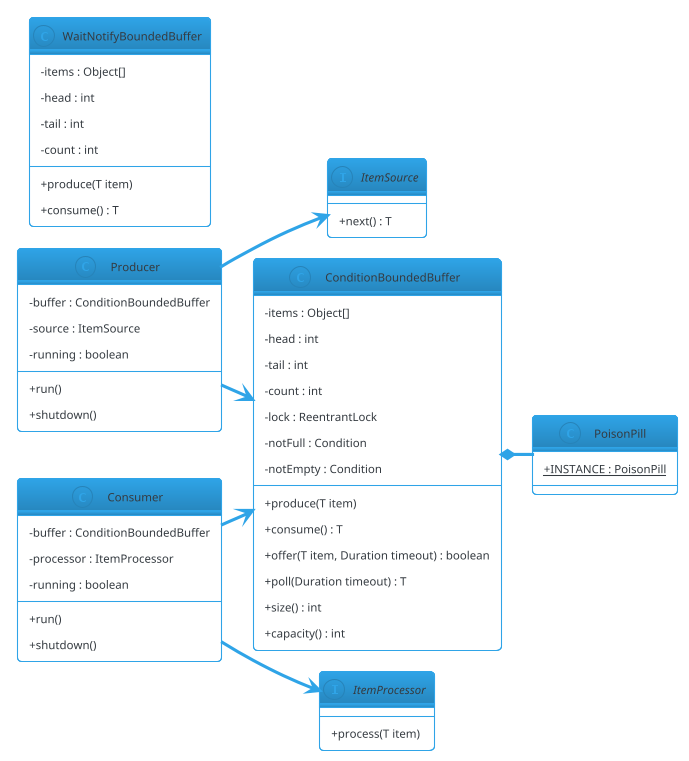

# Producer-Consumer

## Problem Statement

Design a **Producer-Consumer** system — the canonical concurrency pattern where one or more **producers** generate items and push them into a shared **buffer**, and one or more **consumers** pull items from the buffer and process them. The buffer is **bounded** (finite capacity), so producers block when full and consumers block when empty.

This is the **smallest concurrency problem** — but also the most foundational. Every async pipeline (message queues, thread pools, log shipping, event buses) is a Producer-Consumer at heart. The challenge is writing it **without busy-waiting, without races, without deadlock**, using the correct Java primitives.

**Reused primitives (see reference files):**
- Concurrency overview: `concurrency-basics.md` (§3-6)
- `BlockingQueue`, `wait/notify`, `Condition`: `concurrency-basics.md` §5.3
- Executors: `concurrency-basics.md` §6

**New concepts unique to this problem:**
1. **Bounded buffer** — finite capacity; blocks on full/empty
2. **The wait/notify pattern** — classic low-level coordination
3. **Two condition variables** — `notFull` and `notEmpty` (avoids spurious wakeups)
4. **Lock-free alternatives** — `BlockingQueue`, `Disruptor`, ring buffers
5. **Fairness** — FIFO ordering of blocked producers/consumers
6. **Poison pill** — graceful shutdown signal
7. **Multiple producers + consumers** — same as 1P1C but with contention
8. **Backpressure** — queue depth drives producer throttling

---

## 1. Requirements

### Functional

- **Bounded buffer** with capacity N
- **`produce(item)`** — block if full; return when slot available
- **`consume()`** — block if empty; return next item
- **`tryProduce(item)`** / **`tryConsume()`** — non-blocking variants
- **`produce(item, timeout)`** / **`consume(timeout)`** — bounded wait
- **Multiple producers**, multiple consumers
- **FIFO ordering** — items consumed in production order
- **Graceful shutdown** — signal end without dropping items
- **Size query** — current buffer size
- **Thread-safe** under all conditions

### Non-Functional

- **No busy-waiting** — block efficiently via `Condition` or `BlockingQueue`
- **No lost items** — every produced item is consumable
- **No deadlock** — even under unusual scheduling
- **Correct under spurious wakeups** — always loop on condition
- **Fair** — FIFO ordering of waiting producers/consumers
- **Low overhead** — uncontended ops < 100 ns

### Out of Scope

- Persistence / durability
- Distributed Producer-Consumer (that's Kafka — see HLD #06)
- Priority ordering (see PriorityBlockingQueue variant)
- Multi-topic routing (see Pub-Sub LLD #30)
- Delivery guarantees beyond FIFO

---

## 2. Use Cases (brief)

| # | Use Case | Actor |
|---|---|---|
| UC1 | Produce an item, block if full | Producer |
| UC2 | Consume an item, block if empty | Consumer |
| UC3 | Try produce, don't block | Producer |
| UC4 | Try consume, don't block | Consumer |
| UC5 | Bounded timeout produce/consume | Producer/Consumer |
| UC6 | Shut down gracefully | Owner |
| UC7 | Query buffer size | Monitoring |

---

## 3. Core Entities (delta)

**New entities:**

| Entity | Responsibility |
|---|---|
| `BoundedBuffer<T>` | The shared bounded queue |
| `Producer<T>` | Runnable that produces items |
| `Consumer<T>` | Runnable that consumes items |
| `PoisonPill` | Sentinel for shutdown |

**Enums:**

| Enum | Values |
|---|---|
| `BufferState` | OPEN, SHUTDOWN, DRAINED |

**Interfaces:**

| Interface | Implementations |
|---|---|
| `BoundedBuffer<T>` | `ConditionBoundedBuffer`, `WaitNotifyBoundedBuffer`, `ArrayBlockingQueueBuffer`, `LockFreeBuffer` |
| `ItemProcessor<T>` | Consumer-side processing logic |
| `ItemSource<T>` | Producer-side item source |

---

## 4. What's New — the Three Implementation Approaches

### 4.1 `wait/notify` (classic)

The **original** approach. Uses `Object.wait()` and `Object.notifyAll()`.

```java
public final class WaitNotifyBoundedBuffer<T> {

    private final Object[] items;
    private int head, tail, count;

    public WaitNotifyBoundedBuffer(int capacity) {
        if (capacity <= 0) throw new IllegalArgumentException("capacity must be > 0");
        this.items = new Object[capacity];
    }

    public synchronized void produce(T item) throws InterruptedException {
        while (count == items.length) {
            wait();                      // blocks until notified
        }
        items[tail] = item;
        tail = (tail + 1) % items.length;
        count++;
        notifyAll();                     // wake any waiting consumers
    }

    @SuppressWarnings("unchecked")
    public synchronized T consume() throws InterruptedException {
        while (count == 0) {
            wait();
        }
        T item = (T) items[head];
        items[head] = null;              // help GC
        head = (head + 1) % items.length;
        count--;
        notifyAll();                     // wake any waiting producers
        return item;
    }
}
```

**Critical details:**
- **`while` not `if`** — protects against spurious wakeups (OS may wake a thread without a real notification).
- **`notifyAll`, not `notify`** — with N producers and M consumers, a single `notify` may wake the wrong side. `notifyAll` is correct (though less efficient).
- **Single monitor lock** — producers and consumers contend for the same lock. Every wakeup re-checks the condition.

**Problems:**
- **Thundering herd** — `notifyAll` wakes everyone; only one makes progress; the rest re-wait.
- **Single monitor** — producers and consumers block each other even when the other side has capacity.

### 4.2 Two-Condition Lock (preferred)

Use a `ReentrantLock` with **two `Condition` variables** — one for "not full" (producers wait on this), one for "not empty" (consumers wait on this).

```java
public final class ConditionBoundedBuffer<T> {

    private final Object[] items;
    private int head, tail, count;

    private final java.util.concurrent.locks.ReentrantLock lock = new java.util.concurrent.locks.ReentrantLock();
    private final java.util.concurrent.locks.Condition notFull = lock.newCondition();
    private final java.util.concurrent.locks.Condition notEmpty = lock.newCondition();

    public ConditionBoundedBuffer(int capacity) {
        if (capacity <= 0) throw new IllegalArgumentException("capacity must be > 0");
        this.items = new Object[capacity];
    }

    public void produce(T item) throws InterruptedException {
        lock.lockInterruptibly();
        try {
            while (count == items.length) {
                notFull.await();
            }
            items[tail] = item;
            tail = (tail + 1) % items.length;
            count++;
            notEmpty.signal();           // wake ONE consumer (FIFO)
        } finally {
            lock.unlock();
        }
    }

    @SuppressWarnings("unchecked")
    public T consume() throws InterruptedException {
        lock.lockInterruptibly();
        try {
            while (count == 0) {
                notEmpty.await();
            }
            T item = (T) items[head];
            items[head] = null;
            head = (head + 1) % items.length;
            count--;
            notFull.signal();            // wake ONE producer
            return item;
        } finally {
            lock.unlock();
        }
    }

    public boolean offer(T item, java.time.Duration timeout) throws InterruptedException {
        lock.lockInterruptibly();
        try {
            long remaining = timeout.toNanos();
            while (count == items.length) {
                if (remaining <= 0) return false;
                remaining = notFull.awaitNanos(remaining);
            }
            items[tail] = item;
            tail = (tail + 1) % items.length;
            count++;
            notEmpty.signal();
            return true;
        } finally {
            lock.unlock();
        }
    }

    @SuppressWarnings("unchecked")
    public T poll(java.time.Duration timeout) throws InterruptedException {
        lock.lockInterruptibly();
        try {
            long remaining = timeout.toNanos();
            while (count == 0) {
                if (remaining <= 0) return null;
                remaining = notEmpty.awaitNanos(remaining);
            }
            T item = (T) items[head];
            items[head] = null;
            head = (head + 1) % items.length;
            count--;
            notFull.signal();
            return item;
        } finally {
            lock.unlock();
        }
    }

    public int size() {
        lock.lock();
        try { return count; }
        finally { lock.unlock(); }
    }

    public int capacity() { return items.length; }
}
```

**Why two conditions is better:**
- **Signal the right side** — `produce` signals a consumer, not a producer. `notifyAll` in the single-monitor version wakes both sides, but only one side can make progress. With two conditions, `signal()` wakes exactly the right thread.
- **No thundering herd** — one waiter per signal.
- **Better throughput** — producers and consumers rarely block each other except on the shared lock.

**`signal` vs `signalAll`:**
- `signal` wakes one waiting thread; the right side is chosen because we signal the correct condition.
- `signalAll` would wake all waiters on that condition; only one makes progress. Use `signal` for throughput, `signalAll` when in doubt.

**Fairness:** `new ReentrantLock(true)` gives FIFO ordering of lock acquisition. Usually not needed; default (unfair) is faster.

### 4.3 `ArrayBlockingQueue` (production)

The Java standard library provides `ArrayBlockingQueue`, `LinkedBlockingQueue`, `LinkedTransferQueue` — all thread-safe, well-tested, high-performance.

```java
java.util.concurrent.BlockingQueue<T> queue = new java.util.concurrent.ArrayBlockingQueue<>(100);

// Producer
queue.put(item);                             // block if full
boolean ok = queue.offer(item, 1, java.util.concurrent.TimeUnit.SECONDS);  // timeout

// Consumer
T item = queue.take();                       // block if empty
T item2 = queue.poll(1, java.util.concurrent.TimeUnit.SECONDS);
```

**For LLD discussions:** mention the hand-rolled `Condition` version to show understanding; mention `BlockingQueue` as the production choice.

### 4.4 Lock-Free Alternatives

**Disruptor (LMAX):** Ring buffer with sequence numbers, no locks. Achieves > 10M ops/sec. Complex; used for high-frequency trading, log shipping.

**`LinkedTransferQueue`:** lock-free transfer queue; `transfer()` hands off directly to a waiting consumer.

**Ring buffer with CAS:** producers and consumers advance separate sequence numbers atomically.

**For LLD:** not expected to implement these. Mention as production options.

### 4.5 Poison Pill for Shutdown

To stop consumers gracefully without losing in-flight items, push a **poison pill** (sentinel value) at the end:

```java
public final class PoisonPill {
    public static final PoisonPill INSTANCE = new PoisonPill();
    private PoisonPill() {}
}
```

```java
public final class Consumer<T> implements Runnable {

    private final ConditionBoundedBuffer<Object> buffer;
    private final ItemProcessor<T> processor;
    private volatile boolean running = true;

    public Consumer(ConditionBoundedBuffer<Object> buffer, ItemProcessor<T> processor) {
        this.buffer = buffer;
        this.processor = processor;
    }

    @Override
    @SuppressWarnings("unchecked")
    public void run() {
        while (running) {
            try {
                Object item = buffer.consume();
                if (item == PoisonPill.INSTANCE) {
                    running = false;
                    // Optionally re-enqueue for other consumers
                    continue;
                }
                processor.process((T) item);
            } catch (InterruptedException e) {
                Thread.currentThread().interrupt();
                running = false;
            }
        }
    }
}
```

**For multiple consumers:** either push one pill per consumer, or re-enqueue the pill after consuming it (so all consumers see it).

---

## 5. Class Diagram (delta)



---

## 6. Java Implementation (support pieces)

### 6.1 Producer

```java
public final class Producer<T> implements Runnable {

    private final ConditionBoundedBuffer<T> buffer;
    private final java.util.function.Supplier<T> source;
    private volatile boolean running = true;
    private final java.util.concurrent.atomic.LongAdder produced = new java.util.concurrent.atomic.LongAdder();

    public Producer(ConditionBoundedBuffer<T> buffer, java.util.function.Supplier<T> source) {
        this.buffer = buffer;
        this.source = source;
    }

    @Override
    public void run() {
        while (running) {
            T item = source.get();
            if (item == null) break;
            try {
                buffer.produce(item);
                produced.increment();
            } catch (InterruptedException e) {
                Thread.currentThread().interrupt();
                running = false;
            }
        }
        // Push poison pill on exit
        try {
            buffer.produce((T) PoisonPill.INSTANCE);
        } catch (InterruptedException e) {
            Thread.currentThread().interrupt();
        }
    }

    public void shutdown() { running = false; }
    public long producedCount() { return produced.sum(); }
}
```

### 6.2 Consumer

```java
public final class Consumer<T> implements Runnable {

    private final ConditionBoundedBuffer<Object> buffer;
    private final java.util.function.Consumer<T> processor;
    private final java.util.concurrent.atomic.LongAdder consumed = new java.util.concurrent.atomic.LongAdder();
    private final java.util.concurrent.atomic.AtomicBoolean running = new java.util.concurrent.atomic.AtomicBoolean(true);

    public Consumer(ConditionBoundedBuffer<Object> buffer, java.util.function.Consumer<T> processor) {
        this.buffer = buffer;
        this.processor = processor;
    }

    @Override
    @SuppressWarnings("unchecked")
    public void run() {
        while (running.get()) {
            try {
                Object item = buffer.consume();
                if (item == PoisonPill.INSTANCE) {
                    // Re-enqueue for other consumers, then exit
                    buffer.produce((Object) PoisonPill.INSTANCE);
                    running.set(false);
                    continue;
                }
                processor.accept((T) item);
                consumed.increment();
            } catch (InterruptedException e) {
                Thread.currentThread().interrupt();
                running.set(false);
            }
        }
    }

    public void shutdown() { running.set(false); }
    public long consumedCount() { return consumed.sum(); }
}
```

**Note on poison-pill re-enqueue:** when a consumer sees the pill, it re-enqueues it so other consumers also see it and shut down. This works but requires care — if a producer is also running, it may interleave and re-add items. For production, use `ExecutorService.shutdown()` + `awaitTermination()`.

### 6.3 Executor-Style Wrapper

```java
public final class ProducerConsumerPipeline<T> implements AutoCloseable {

    private final ConditionBoundedBuffer<Object> buffer;
    private final java.util.List<Thread> producerThreads = new java.util.ArrayList<>();
    private final java.util.List<Thread> consumerThreads = new java.util.ArrayList<>();

    public ProducerConsumerPipeline(int capacity, int numProducers, int numConsumers,
                                    java.util.function.Supplier<T> source,
                                    java.util.function.Consumer<T> processor) {
        this.buffer = new ConditionBoundedBuffer<>(capacity);
        for (int i = 0; i < numProducers; i++) {
            Thread t = new Thread(new Producer<>(buffer, source), "producer-" + i);
            t.start();
            producerThreads.add(t);
        }
        for (int i = 0; i < numConsumers; i++) {
            Thread t = new Thread(new Consumer<>(buffer, processor), "consumer-" + i);
            t.start();
            consumerThreads.add(t);
        }
    }

    public int size() { return buffer.size(); }

    @Override
    public void close() throws InterruptedException {
        // Send one poison pill per consumer
        for (int i = 0; i < consumerThreads.size(); i++) {
            buffer.produce(PoisonPill.INSTANCE);
        }
        for (Thread t : consumerThreads) t.join(5000);
        for (Thread t : producerThreads) t.join(5000);
    }
}
```

### 6.4 Demo

```java
public class Demo {
    public static void main(String[] args) throws InterruptedException {
        java.util.concurrent.atomic.AtomicInteger counter = new java.util.concurrent.atomic.AtomicInteger();

        // 3 producers, 2 consumers, buffer capacity 10
        ConditionBoundedBuffer<Integer> buffer = new ConditionBoundedBuffer<>(10);

        java.util.List<Thread> threads = new java.util.ArrayList<>();

        for (int p = 0; p < 3; p++) {
            Thread t = new Thread(() -> {
                try {
                    for (int i = 0; i < 100; i++) {
                        buffer.produce(counter.incrementAndGet());
                    }
                    buffer.produce((Integer)(Object) PoisonPill.INSTANCE);
                } catch (InterruptedException e) { Thread.currentThread().interrupt(); }
            });
            t.start();
            threads.add(t);
        }

        for (int c = 0; c < 2; c++) {
            Thread t = new Thread(() -> {
                int consumed = 0;
                try {
                    while (true) {
                        Object item = buffer.consume();
                        if (item == PoisonPill.INSTANCE) {
                            buffer.produce(PoisonPill.INSTANCE);   // re-enqueue
                            break;
                        }
                        System.out.println("Consumed: " + item);
                        consumed++;
                    }
                } catch (InterruptedException e) { Thread.currentThread().interrupt(); }
            });
            t.start();
            threads.add(t);
        }

        Thread.sleep(2000);
        System.out.println("Final buffer size: " + buffer.size());
    }
}
```

---

## 7. Concurrency Considerations

Reused from `concurrency-basics.md`:
- `ReentrantLock` + `Condition` for wait/notify pattern
- `synchronized` + `wait/notify` for classic
- `BlockingQueue` for production

**New to Producer-Consumer:**

- **Spurious wakeups** — the OS may wake a thread without a signal. **Always loop on the condition.** `while (count == items.length) notFull.await();` is correct. `if (...)` is a bug.
- **`notify` vs `notifyAll`** — with one condition and multiple waiter types, `notify` may wake the wrong type. Use `notifyAll` (with one condition) or `signal` on the correct condition (with two conditions).
- **Deadlock via lock ordering** — as long as we only hold one lock, no deadlock.
- **Interruption** — `lockInterruptibly` or `await` throws `InterruptedException`. Restore the interrupt flag.
- **Fair lock** — `new ReentrantLock(true)` gives FIFO ordering. Throughput drops ~30%.
- **Poison pill vs `shutdownNow`** — poison pills drain gracefully; `shutdownNow` interrupts. Choose based on whether in-flight items should be processed.
- **Multi-pill shutdown** — with N consumers, either push N pills (one per consumer) or re-enqueue.
- **Bounded queue sizing** — too small → producers block often; too large → memory pressure and latency. Rule: capacity ≈ throughput × acceptable latency.
- **Backpressure** — bounded buffer IS the backpressure mechanism. Producers naturally throttle when the queue is full.

### Testing

```java
@Test
void producerConsumerNeverLosesItems() throws InterruptedException {
    ConditionBoundedBuffer<Integer> buffer = new ConditionBoundedBuffer<>(50);
    int itemCount = 10_000;
    var received = new java.util.concurrent.ConcurrentLinkedQueue<Integer>();

    Thread producer = new Thread(() -> {
        try {
            for (int i = 0; i < itemCount; i++) buffer.produce(i);
        } catch (InterruptedException ignored) {}
    });

    Thread consumer = new Thread(() -> {
        try {
            for (int i = 0; i < itemCount; i++) received.add(buffer.consume());
        } catch (InterruptedException ignored) {}
    });

    producer.start();
    consumer.start();
    producer.join(5000);
    consumer.join(5000);

    assertEquals(itemCount, received.size());
    // Optionally check FIFO ordering
}

@Test
void concurrentProducersAndConsumers() throws InterruptedException {
    ConditionBoundedBuffer<Integer> buffer = new ConditionBoundedBuffer<>(20);
    int producers = 5, consumers = 5, itemsPerProducer = 1000;

    var consumed = new java.util.concurrent.atomic.AtomicInteger();
    var threads = new java.util.ArrayList<Thread>();

    for (int p = 0; p < producers; p++) {
        final int pid = p;
        threads.add(new Thread(() -> {
            try { for (int i = 0; i < itemsPerProducer; i++) buffer.produce(pid * itemsPerProducer + i); }
            catch (InterruptedException ignored) {}
        }));
    }
    for (int c = 0; c < consumers; c++) {
        threads.add(new Thread(() -> {
            try { while (consumed.get() < producers * itemsPerProducer) { buffer.consume(); consumed.incrementAndGet(); } }
            catch (InterruptedException ignored) {}
        }));
    }
    threads.forEach(Thread::start);
    for (Thread t : threads) t.join(10_000);

    assertEquals(producers * itemsPerProducer, consumed.get());
}
```

---

## 8. Extensibility

| Feature | Change |
|---|---|
| Priority ordering | Use `PriorityBlockingQueue` |
| Multiple topics | Route by key (see Pub-Sub LLD #30) |
| Batching | Consume `n` items at once (drain the queue) |
| Timeout per item | Track item timestamp; drop stale items |
| Metrics | `LongAdder` for produced/consumed counters |
| Persistence | Back with a durable log (Kafka-style) |
| Poison pill → shutdown flag | Use `AtomicBoolean` and `poll(timeout)` |
| Distributed | Kafka / RabbitMQ |

---

## 9. Common Pitfalls

| Pitfall | Fix |
|---|---|
| `if (count == capacity) wait();` | Must be `while` — spurious wakeups |
| `notify()` with mixed producers/consumers | `notifyAll()` or two conditions |
| Forgetting `lock.unlock()` | `try/finally` |
| Not restoring interrupt flag | `Thread.currentThread().interrupt()` in catch |
| Busy-waiting on a flag | Use `Condition.await` |
| Single condition for both sides | Two conditions (notFull, notEmpty) |
| Poison pill not re-enqueued | Re-enqueue or send one per consumer |
| Unbounded buffer | Bounded — otherwise memory grows |
| Sleeping instead of waiting | `Thread.sleep` + retry is bad; use `await` |
| `wait()` on the wrong object | `wait` on the same object as `synchronized` |
| `notify` before `wait` | Classic lost-wakeup — condition must be checked |
| Ignoring `InterruptedException` | Restore interrupt or propagate |
| FIFO not guaranteed with fair=false | Use fair lock if FIFO matters |

---

## 10. Follow-ups

### Q1: What's the difference between `wait/notify` and `Condition`?

**Answer:**
- `wait/notify` uses the object's monitor. One wait set; `notify` may wake the wrong thread.
- `Condition` (from `ReentrantLock`) allows **multiple** wait sets. `notFull` and `notEmpty` are separate, so `signal` wakes exactly the right type.

Multi-condition is almost always better for Producer-Consumer. `wait/notify` is fine for simple cases with one waiter type.

### Q2: How do you avoid the thundering herd?

**Answer:** Use two `Condition` variables and `signal` (not `signalAll`). Each signal wakes one waiter of the correct type.

### Q3: How do you shut down gracefully?

**Answer:** 
1. Producers stop adding items.
2. Push one poison pill per consumer.
3. Each consumer, on seeing a pill, re-enqueues it and exits.
4. Main thread joins all consumer threads with a timeout.

For a hard shutdown, use `Thread.interrupt()` — consumers `wait` interruptibly and exit.

### Q4: What buffer size should you use?

**Answer:** `capacity ≈ target_throughput × acceptable_latency`. 
- Too small → producers block; throughput drops.
- Too large → memory pressure; latency grows (items sit in the queue).

Typical starting point: `2 × average_production_rate_per_second`. Profile and tune.

### Q5: How do you scale to distributed Producer-Consumer?

**Answer:** Replace the in-process buffer with a distributed log (Kafka, Pulsar, RabbitMQ):
- Producers publish to a topic
- Consumers subscribe to a partition
- Broker handles ordering, replication, persistence

The concurrency primitives are the broker's concern; the producer and consumer code is the same. See HLD #06 for a distributed message queue.

### Q6: How does `ArrayBlockingQueue` differ from your hand-rolled version?

**Answer:** `ArrayBlockingQueue` uses the same two-condition design internally. Differences:
- It has a **fair** flag (`new ArrayBlockingQueue<>(cap, true)`).
- It's battle-tested across millions of use cases.
- It supports more operations (`drainTo`, `peek`, `remainingCapacity`).

For production, use `ArrayBlockingQueue`. For learning, write it yourself once.

---

## 11. Similar Problems

- **Rate Limiter (LLD #21)** — permit allocation with blocking
- **Thread Pool (LLD #24)** — producers (task submitters) and consumers (workers) with a task queue
- **Message Queue (LLD #28)** — durable Producer-Consumer
- **Pub-Sub (LLD #30)** — fan-out Producer-Consumer
- **Distributed Message Queue** — HLD #06

Producer-Consumer's unique additions: **bounded buffer**, **wait/notify**, **Condition variables**, **poison pill**, **backpressure**.

---

## 12. Key Takeaways

- **Bounded buffer** is the core primitive — capacity matters
- **Two conditions** (`notFull`, `notEmpty`) beat one monitor
- **`while` loop on condition** — always, no exceptions
- **`signal` (not `signalAll`)** when signaling a specific condition
- **`lockInterruptibly` + `try/finally`** — always restore interrupt
- **`ReentrantLock`** — not `synchronized` when you need multiple conditions
- **`Condition.awaitNanos`** for bounded-time waits
- **Poison pill** for graceful shutdown — one per consumer, re-enqueued
- **Bounded buffer = backpressure** — producers throttle naturally
- **`ArrayBlockingQueue`** is the production choice — use it unless you need custom behavior
- **Fair lock** for FIFO ordering, at a ~30% throughput cost
- **Memory barrier** — `await`/`signal` provide happens-before guarantees
- **Never busy-wait** — `await` blocks efficiently
- **Buffer size** ≈ throughput × acceptable latency

### The Generalizable Recipe

For any **Producer-Consumer / async pipeline** problem:

1. **Bounded buffer** with capacity N
2. **Two conditions** — `notFull`, `notEmpty`
3. **`while` loop** on condition — no `if`
4. **`signal`** the correct condition on state change
5. **`ReentrantLock` + `Condition`** — not `synchronized` + `wait`
6. **`lockInterruptibly`** for responsiveness
7. **Bounded timeouts** — `awaitNanos` for `poll/offer` with timeout
8. **Poison pill** for shutdown — one per consumer
9. **`BlockingQueue`** for production — hand-rolled is for LLD discussion
10. **Metrics** via `LongAdder` for produced/consumed counts
11. **Backpressure** is automatic with bounded buffer
12. **FIFO** — natural with array-based ring; fair lock if lock ordering matters

This skeleton plus the coordination primitives from `concurrency-basics.md` solves: Producer-Consumer, Thread Pool task queue, Message Queue (in-process), Log pipeline, Event Bus (single topic), Async Task Executor, Rate Limiter queue — with variations in routing, persistence, and priority.