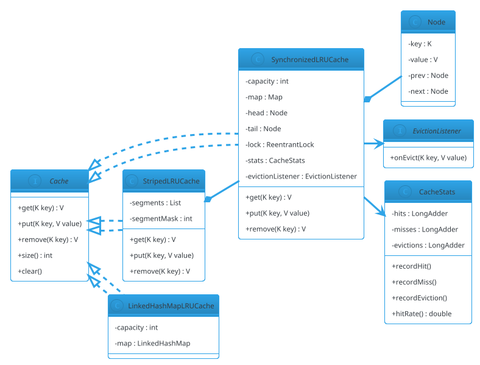

# Thread-Safe LRU Cache

## Problem Statement

Design a **thread-safe LRU (Least Recently Used) cache** — an in-memory bounded key-value store that evicts the least recently used entry when full. It supports `get`, `put`, `remove`, `size`, and `clear`, all callable from multiple threads with **correct LRU semantics** and **high concurrency**.

This is the canonical **data structure + concurrency** LLD problem. The data structure is simple (hash map + doubly-linked list, or `LinkedHashMap`), but making it thread-safe without sacrificing throughput requires careful design — one global lock works but scales poorly; per-segment locking or lock-free structures are more advanced.

**Reused primitives (see reference files):**
- Concurrency overview: `concurrency-basics.md` §3-6
- `ReentrantLock`, `ConcurrentHashMap`: `concurrency-basics.md` §3.2, §5.1
- Producer-Consumer for async eviction: `22-producer-consumer.md`
- Rate limiter lock patterns: `21-rate-limiter-lld.md`

**New concepts unique to this problem:**
1. **LRU ordering** — doubly-linked list or `LinkedHashMap` with `accessOrder=true`
2. **Eviction policy** — remove least recently used on `put` when full
3. **Thread-safe LRU** — coordinating access order + map under concurrency
4. **Segmented cache** — shard by key hash to reduce contention (like `ConcurrentHashMap`)
5. **Read vs write trade-off** — reads mutate LRU order, so pure read locks don't work
6. **Lock striping** — N segments, each with its own lock
7. **Eviction callbacks** — notify on evict (for resource cleanup)
8. **TTL support** — optional; entries expire after time
9. **Statistics** — hit/miss/eviction counters

---

## 1. Requirements

### Functional

- **`get(key)`** — return value or `null`; updates LRU order
- **`put(key, value)`** — insert/update; may evict LRU if full
- **`remove(key)`** — explicit removal
- **`size()`** — current entry count
- **`clear()`** — remove all
- **`containsKey(key)`** — membership without LRU update (optional)
- **Capacity-bounded** — evicts when exceeding capacity
- **Thread-safe** — safe for concurrent readers and writers
- **Eviction callback** — invoked on eviction with (key, value)

### Non-Functional

- **O(1) get and put**
- **Correct LRU order** — eviction removes the least recently accessed entry
- **High throughput** — must scale beyond one lock on multicore
- **Low latency** — uncontended get < 100 ns
- **Bounded memory** — no unbounded growth
- **Fair** — no starvation of threads
- **Extensible** — new policies (LFU, FIFO), TTL, callbacks

### Out of Scope

- Persistence / disk-backed cache
- Distributed cache (that's Redis/HLD #07)
- Cache coherence across processes
- Write-back / write-through to a backing store
- Serialization of values

---

## 2. Use Cases (brief)

| # | Use Case | Actor |
|---|---|---|
| UC1 | Cache lookup | Caller |
| UC2 | Cache insert | Caller |
| UC3 | Evict on capacity overflow | Cache (internal) |
| UC4 | Eviction callback for cleanup | Caller |
| UC5 | Clear cache | Admin |
| UC6 | Stats for monitoring | Monitoring |

---

## 3. Core Entities (delta)

**New entities:**

| Entity | Responsibility |
|---|---|
| `LRUCache<K, V>` | The cache interface |
| `SynchronizedLRUCache` | Single global lock; simplest |
| `StripedLRUCache` | Lock striping via N segments |
| `Node<K, V>` | Doubly-linked list node for LRU order |
| `CacheStats` | Hit/miss/eviction counters |
| `EvictionListener<K, V>` | Callback on eviction |

**Interfaces:**

| Interface | Implementations |
|---|---|
| `Cache<K, V>` | `SynchronizedLRUCache`, `StripedLRUCache`, `LinkedHashMapCache` |
| `EvictionListener<K, V>` | User-provided callback |

---

## 4. What's New — the Three Design Approaches

### 4.1 Data Structure: HashMap + Doubly-Linked List

The classic LRU implementation:

- **`HashMap<K, Node<K,V>>`** — O(1) lookup
- **Doubly-linked list** — LRU order; head = most recently used (MRU), tail = least recently used (LRU)
- **`get(k)`** — lookup; move node to head
- **`put(k, v)`** — insert or update; move to head; if size > capacity, remove tail

```java
public final class Node<K, V> {
    K key;
    V value;
    Node<K, V> prev;
    Node<K, V> next;

    Node(K key, V value) {
        this.key = key;
        this.value = value;
    }
}
```

**Sentinel nodes** (dummy head and tail) simplify edge cases:

```java
private final Node<K, V> head = new Node<>(null, null);   // most recently used
private final Node<K, V> tail = new Node<>(null, null);   // least recently used
// constructor: head.next = tail; tail.prev = head;
```

**List operations:**

```java
private void addToHead(Node<K, V> node) {
    node.next = head.next;
    node.prev = head;
    head.next.prev = node;
    head.next = node;
}

private void removeNode(Node<K, V> node) {
    node.prev.next = node.next;
    node.next.prev = node.prev;
}

private void moveToHead(Node<K, V> node) {
    removeNode(node);
    addToHead(node);
}
```

**Node operations are O(1)** — no scanning.

### 4.2 Approach 1 — Synchronized (Simple, Correct)

Single lock around the whole cache. Simplest correct implementation.

```java
public final class SynchronizedLRUCache<K, V> implements Cache<K, V> {

    private final int capacity;
    private final java.util.Map<K, Node<K, V>> map;
    private final Node<K, V> head = new Node<>(null, null);
    private final Node<K, V> tail = new Node<>(null, null);
    private final java.util.concurrent.locks.ReentrantLock lock = new java.util.concurrent.locks.ReentrantLock();
    private final CacheStats stats = new CacheStats();
    private final EvictionListener<K, V> evictionListener;

    public SynchronizedLRUCache(int capacity, EvictionListener<K, V> evictionListener) {
        if (capacity <= 0) throw new IllegalArgumentException("capacity must be > 0");
        this.capacity = capacity;
        this.map = new java.util.HashMap<>(capacity * 2);
        this.evictionListener = evictionListener;
        head.next = tail;
        tail.prev = head;
    }

    @Override
    public V get(K key) {
        lock.lock();
        try {
            Node<K, V> node = map.get(key);
            if (node == null) {
                stats.recordMiss();
                return null;
            }
            moveToHead(node);
            stats.recordHit();
            return node.value;
        } finally {
            lock.unlock();
        }
    }

    @Override
    public void put(K key, V value) {
        Node<K, V> toEvict = null;
        K evictedKey = null;
        V evictedValue = null;

        lock.lock();
        try {
            Node<K, V> node = map.get(key);
            if (node != null) {
                node.value = value;
                moveToHead(node);
                return;
            }

            if (map.size() >= capacity) {
                toEvict = tail.prev;             // LRU
                if (toEvict != head) {
                    removeNode(toEvict);
                    map.remove(toEvict.key);
                    evictedKey = toEvict.key;
                    evictedValue = toEvict.value;
                    stats.recordEviction();
                }
            }

            Node<K, V> newNode = new Node<>(key, value);
            addToHead(newNode);
            map.put(key, newNode);
        } finally {
            lock.unlock();
        }

        // Callback outside the lock to avoid holding it during user code
        if (evictedKey != null && evictionListener != null) {
            evictionListener.onEvict(evictedKey, evictedValue);
        }
    }

    @Override
    public V remove(K key) {
        Node<K, V> removed = null;
        lock.lock();
        try {
            Node<K, V> node = map.remove(key);
            if (node != null) {
                removeNode(node);
                removed = node;
            }
        } finally {
            lock.unlock();
        }
        return removed == null ? null : removed.value;
    }

    @Override
    public int size() {
        lock.lock();
        try { return map.size(); }
        finally { lock.unlock(); }
    }

    @Override
    public void clear() {
        lock.lock();
        try {
            map.clear();
            head.next = tail;
            tail.prev = head;
        } finally {
            lock.unlock();
        }
    }

    // Node helpers as before — addToHead, removeNode, moveToHead
    private void addToHead(Node<K, V> node) { /* ... */ }
    private void removeNode(Node<K, V> node) { /* ... */ }
    private void moveToHead(Node<K, V> node) { removeNode(node); addToHead(node); }

    public CacheStats stats() { return stats; }
}
```

**Pros:** simple, correct.
**Cons:** every `get` acquires an exclusive lock (because it mutates LRU order). Throughput doesn't scale with cores.

### 4.3 Approach 2 — Striped (Scalable)

Shard the cache into **N segments**, each its own `SynchronizedLRUCache`. Keys hash to segments; operations on different keys rarely contend.

```java
public final class StripedLRUCache<K, V> implements Cache<K, V> {

    private final java.util.List<SynchronizedLRUCache<K, V>> segments;
    private final int segmentMask;

    public StripedLRUCache(int capacity, int concurrencyLevel, EvictionListener<K, V> listener) {
        // Round concurrencyLevel up to power of 2 for mask-based hashing
        int n = 1;
        while (n < concurrencyLevel) n <<= 1;
        this.segmentMask = n - 1;
        int perSegmentCapacity = Math.max(1, capacity / n);

        java.util.List<SynchronizedLRUCache<K, V>> segs = new java.util.ArrayList<>(n);
        for (int i = 0; i < n; i++) {
            segs.add(new SynchronizedLRUCache<>(perSegmentCapacity, listener));
        }
        this.segments = java.util.List.copyOf(segs);
    }

    private SynchronizedLRUCache<K, V> segmentFor(K key) {
        int hash = spread(key.hashCode());
        return segments.get(hash & segmentMask);
    }

    /** Apply HashMap's hash spreading to reduce collisions. */
    private static int spread(int h) {
        return h ^ (h >>> 16);
    }

    @Override public V get(K key) { return segmentFor(key).get(key); }
    @Override public void put(K key, V value) { segmentFor(key).put(key, value); }
    @Override public V remove(K key) { return segmentFor(key).remove(key); }

    @Override
    public int size() {
        int total = 0;
        for (SynchronizedLRUCache<K, V> s : segments) total += s.size();
        return total;
    }

    @Override
    public void clear() {
        for (SynchronizedLRUCache<K, V> s : segments) s.clear();
    }
}
```

**Pros:** scales with cores — reads/writes to different segments run in parallel.
**Cons:**
- **Per-segment capacity** means the global LRU is approximate. An item may be evicted from a segment while another segment has capacity.
- **Not strictly LRU** across the whole cache. This is the classic trade-off: **exact LRU vs scalability**.
- **`size()` is approximate** if operations happen concurrently during the sum.

**When to use striped LRU:** when throughput matters more than exact LRU ordering — typical for read-heavy caches.

### 4.4 Approach 3 — `LinkedHashMap` with `accessOrder=true`

Java's `LinkedHashMap` supports LRU mode out of the box:

```java
public final class LinkedHashMapLRUCache<K, V> implements Cache<K, V> {

    private final int capacity;
    private final java.util.LinkedHashMap<K, V> map;

    public LinkedHashMapLRUCache(int capacity) {
        if (capacity <= 0) throw new IllegalArgumentException("capacity must be > 0");
        this.capacity = capacity;
        this.map = new java.util.LinkedHashMap<>(capacity, 0.75f, true) {   // accessOrder=true
            @Override
            protected boolean removeEldestEntry(java.util.Map.Entry<K, V> eldest) {
                return size() > LinkedHashMapLRUCache.this.capacity;
            }
        };
    }

    @Override public synchronized V get(K key) { return map.get(key); }
    @Override public synchronized void put(K key, V value) { map.put(key, value); }
    @Override public synchronized V remove(K key) { return map.remove(key); }
    @Override public synchronized int size() { return map.size(); }
    @Override public synchronized void clear() { map.clear(); }
}
```

**Pros:** trivial implementation; battle-tested by JDK; exposes eviction hook `removeEldestEntry`.
**Cons:**
- Still needs external synchronization for thread safety (map methods aren't thread-safe).
- Same single-lock throughput limits as Approach 1.
- **`accessOrder=true` mutates on `get`** — so even reads need a write lock.

**Use for:** simple, small caches. For high concurrency, use `StripedLRUCache`.

### 4.5 Comparison

| Approach | Correctness | Throughput | Complexity |
|---|---|---|---|
| `SynchronizedLRUCache` (single lock) | Exact LRU | Low | Low |
| `StripedLRUCache` (N segments) | Approximate LRU | High | Medium |
| `LinkedHashMap` + `synchronized` | Exact LRU | Low | Very low |
| Caffeine (production) | Near-exact | Very high | High |

**Recommendation:**
- **Simple/Low-traffic:** `LinkedHashMap` + `synchronized`
- **Balanced:** `SynchronizedLRUCache` (hand-rolled, uses two pointers)
- **High-throughput:** `StripedLRUCache`
- **Production:** **Caffeine** (Google's cache) — near-exact LRU, lock-free reads, W-TinyLFU eviction

### 4.6 Eviction Callback

Called **after** eviction, **outside the lock**, to avoid holding it during user code (which might reenter the cache → deadlock).

```java
public interface EvictionListener<K, V> {
    void onEvict(K key, V value);
}
```

**Why outside the lock:**
- User code might be slow (I/O, logging).
- User code might call back into the cache — `ReentrantLock` allows reentrancy, but if the callback triggers eviction of another key, you could violate LRU invariants mid-update.

**Pattern:** capture what needs to be evicted inside the lock; invoke the callback after releasing.

### 4.7 Cache Statistics

```java
public final class CacheStats {
    private final java.util.concurrent.atomic.LongAdder hits = new java.util.concurrent.atomic.LongAdder();
    private final java.util.concurrent.atomic.LongAdder misses = new java.util.concurrent.atomic.LongAdder();
    private final java.util.concurrent.atomic.LongAdder evictions = new java.util.concurrent.atomic.LongAdder();

    public void recordHit() { hits.increment(); }
    public void recordMiss() { misses.increment(); }
    public void recordEviction() { evictions.increment(); }

    public long hits() { return hits.sum(); }
    public long misses() { return misses.sum(); }
    public long evictions() { return evictions.sum(); }
    public double hitRate() {
        long h = hits.sum(), m = misses.sum();
        return (h + m == 0) ? 0.0 : (double) h / (h + m);
    }
}
```

**Why `LongAdder`:** under high concurrency, `AtomicLong` CAS contentions degrade throughput. `LongAdder` uses striping.

### 4.8 TTL Support (Optional)

Optional extension: entries expire after a TTL.

```java
public record CacheEntry<V>(V value, long expireAtNanos) {
    public boolean isExpired(long nowNanos) { return nowNanos >= expireAtNanos; }
}
```

**Approach 1 — lazy expiration:** check TTL on `get`; if expired, remove and treat as miss.
**Approach 2 — background sweeper:** a scheduled thread periodically removes expired entries.
**Approach 3 — both:** lazy check + periodic sweep.

For LLD, lazy is enough; mention the sweep for large caches.

---

## 5. Class Diagram (delta)



---

## 6. Java Implementation (support pieces)

### 6.1 Interface

```java
public interface Cache<K, V> {
    V get(K key);
    void put(K key, V value);
    V remove(K key);
    int size();
    void clear();
}
```

### 6.2 Demo

```java
public class Demo {
    public static void main(String[] args) {
        // Simple synchronized LRU with capacity 3
        Cache<String, String> cache = new SynchronizedLRUCache<>(3, (k, v) ->
                System.out.println("Evicted: " + k + "=" + v));

        cache.put("A", "1");
        cache.put("B", "2");
        cache.put("C", "3");

        cache.get("A");               // A is now MRU

        cache.put("D", "4");          // Evicts B (LRU)

        System.out.println(cache.get("A"));   // 1
        System.out.println(cache.get("B"));   // null (evicted)

        // Striped cache with 4 segments
        Cache<String, String> striped = new StripedLRUCache<>(16, 4, null);
        for (int i = 0; i < 100; i++) {
            striped.put("k" + i, "v" + i);
        }
        System.out.println("Striped size: " + striped.size());   // ~16 (per-segment sum)
    }
}
```

---

## 7. Concurrency Considerations

Reused from `concurrency-basics.md` and `21-rate-limiter-lld.md`:
- `ReentrantLock` for critical sections
- `LongAdder` for metrics
- `ConcurrentHashMap` when full-map iteration is needed

**New to LRU Cache:**

- **`get` mutates order** — unlike a normal map, `get` writes. This means we can't use `ReadWriteLock` naively (a read is a write). Options:
  - Accept the write cost (lock or CAS the order update).
  - Use **approximate LRU** (e.g., sample K entries, evict the LRU among them) — this is what Caffeine does; reads mostly don't mutate.
- **Eviction callback outside lock** — avoid user code under lock.
- **Striped segments are approximate LRU** — global order isn't maintained. Document this trade-off.
- **Iterator safety** — never iterate the map outside the lock; use `size()` etc. instead.
- **`LinkedHashMap` is not thread-safe** — always synchronize externally.
- **Node pooling** — under very high throughput, allocating a new `Node` per `put` causes GC pressure. A pool (or intrusive list) can help. Rarely needed for LLD.
- **Fairness** — `ReentrantLock(true)` gives FIFO ordering; not usually worth it for caches.
- **Starvation** — under heavy contention, some threads may be repeatedly preempted. Fair locks help; or use striped caches.

### Testing

```java
@Test
void lruEvictsLeastRecentlyUsed() {
    Cache<Integer, String> cache = new SynchronizedLRUCache<>(3, null);
    cache.put(1, "a");
    cache.put(2, "b");
    cache.put(3, "c");
    cache.get(1);                // 1 is MRU
    cache.put(4, "d");           // evicts 2
    assertNull(cache.get(2));
    assertEquals("a", cache.get(1));
    assertEquals("c", cache.get(3));
    assertEquals("d", cache.get(4));
}

@Test
void concurrentAccessIsSafe() throws InterruptedException {
    Cache<Integer, Integer> cache = new StripedLRUCache<>(1000, 8, null);
    int threads = 16;
    int opsPerThread = 10_000;

    var pool = java.util.concurrent.Executors.newFixedThreadPool(threads);
    var latch = new java.util.concurrent.CountDownLatch(1);

    for (int t = 0; t < threads; t++) {
        final int tid = t;
        pool.submit(() -> {
            try { latch.await(); } catch (InterruptedException ignored) { return; }
            var rnd = new java.util.Random(tid);
            for (int i = 0; i < opsPerThread; i++) {
                int key = rnd.nextInt(2000);
                if (rnd.nextBoolean()) cache.put(key, key * 2);
                else cache.get(key);
            }
        });
    }
    latch.countDown();
    pool.shutdown();
    assertTrue(pool.awaitTermination(30, java.util.concurrent.TimeUnit.SECONDS));
    assertTrue(cache.size() <= 1000 * 2);   // approx check; per-segment
}
```

---

## 8. Extensibility

| Feature | Change |
|---|---|
| LFU eviction | Track access count per entry; min-heap for eviction |
| FIFO eviction | Use `LinkedHashMap` with `accessOrder=false` |
| TTL | Store `expireAtNanos`; check on `get`; sweep periodically |
| Eviction callback | Already supported via `EvictionListener` |
| Weight-based capacity | Sum `entry.weight`; evict until under limit |
| Stats listener | Attach metrics collector; emit on hit/miss/evict |
| Refresh-ahead | On near-expiry `get`, schedule async refresh |
| Async loading | Wrap with `LoadingCache.get(key, loader)` — see Caffeine |
| Multi-level | L1 in-memory + L2 Redis |
| Persistence | Back with RocksDB |

---

## 9. Common Pitfalls

| Pitfall | Fix |
|---|---|
| Using `LinkedHashMap` without `synchronized` | Always synchronize externally |
| Assuming `get` is read-only | It mutates LRU order — needs write access |
| Eviction callback under lock | Invoke outside; may reenter cache |
| Iterating map without lock | Never iterate; use `size()` |
| Forgetting to remove from map on evict | Both list and map must be updated |
| Not moving node to head on `get` | LRU semantics broken |
| Forgetting sentinel nodes | Edge cases for empty list |
| `AtomicLong` for stats under load | Use `LongAdder` |
| `if (map.size() > capacity)` mid-put | Check before insert; capacity may be 0 |
| Striped cache claimed as exact LRU | It's approximate — document clearly |
| Using `HashMap` inside cache without accounting | `HashMap` rehash under size; use `ConcurrentHashMap` if iterating |
| Forgetting `finally { lock.unlock(); }` | Always unlock |
| Storing `null` values | Ambiguous with missing key — either disallow or use `Optional`/sentinel |
| Capacity 0 | Reject in constructor; not useful |

---

## 10. Follow-ups

### Q1: Why can't we use `ReadWriteLock`?

**Answer:** Because `get` mutates the LRU order (moves node to head). It's logically a write. `ReadWriteLock` would give no benefit — every `get` would need the write lock.

Approximate-LRU algorithms (like Caffeine's W-TinyLFU) avoid this: reads don't move the entry; instead they update a **frequency sketch** (probabilistic), and eviction samples a small window.

### Q2: How does Caffeine achieve near-exact LRU without locking reads?

**Answer:** Caffeine uses **W-TinyLFU**:
- A small admission window (LRU) for new entries
- A larger main region with a frequency sketch (Count-Min Sketch)
- Reads update the sketch (probabilistic, mostly lock-free)
- On eviction, the entry with the lowest frequency is chosen

The result is **near-optimal hit rate** with **lock-free reads**. It's the state of the art for JVM caches.

### Q3: How do you handle eviction callbacks that are slow?

**Answer:** Run them asynchronously. Push evicted entries to a bounded queue; a background thread invokes the callback. If the queue fills, either block producers or drop callbacks (depending on importance).

For LLD, calling outside the lock is enough; production uses async.

### Q4: How do you support TTL?

**Answer:** Store `expireAtNanos` on the node. On `get`, check expiry:
- If expired, remove and return null (miss).
- Optionally, a background thread periodically scans and evicts expired entries (needed if entries are never touched again — otherwise they sit forever).

Combination is common: lazy check on `get` + periodic sweep.

### Q5: What's the difference between LRU and LFU?

**Answer:**
- **LRU:** evicts the entry least recently accessed (by time).
- **LFU:** evicts the entry least frequently accessed (by count).

LRU is better for **temporal locality** (recent accesses predict future). LFU is better for **frequency-stable workloads** (popular items stay popular). Caffeine's W-TinyLFU combines both.

### Q6: How do you test concurrency correctness?

**Answer:** 
- **Stress test** — N threads doing M operations each on a random key distribution
- **Invariant check** — after each operation, assert list is consistent (forward/backward pointers match, map size == list size)
- **Linearisability check** — record operation history; replay with a linearisability checker (complex; skip for LLD)
- **Chaos test** — mix `get`, `put`, `remove`, `clear` from many threads

### Q7: How would you scale to billions of entries?

**Answer:** Can't — LRU needs the whole working set in memory. For large scale:
- **Redis** with `allkeys-lru` policy — Redis does approximate LRU with sampling.
- **Sharded caches** — hash keys to N nodes.
- **Persistent KV store** (RocksDB) with block cache.

At that scale, "LRU" is always approximate.

---

## 11. Similar Problems

- **Cache with Eviction Policies (LLD #27)** — generalizes LRU to LFU, FIFO, TinyLFU
- **Rate Limiter (LLD #21)** — bounded resource with time-based decisions
- **Producer-Consumer (LLD #22)** — coordination primitives
- **Distributed Cache (HLD #07)** — Redis, Memcached
- **Thread Pool (LLD #24)** — bounded task queue

LRU Cache's unique additions: **data structure + concurrency coupling**, **approximate LRU via striping**, **eviction callbacks**, **stats**.

---

## 12. Key Takeaways

- **Two structures** — `HashMap` for O(1) lookup + doubly-linked list for O(1) reorder
- **Sentinel head/tail** simplify edge cases
- **`get` mutates order** — it's not a read in LRU semantics
- **Single lock** = correct but poor throughput; **striped** = high throughput, approximate LRU
- **`LinkedHashMap(accessOrder=true)`** gives LRU for free — but still needs external sync
- **Eviction callback outside the lock** — avoid user code under lock
- **`LongAdder` for stats** — `AtomicLong` degrades under contention
- **Approximate LRU via striped segments** — trade exact ordering for scalability
- **Caffeine** is the state-of-the-art JVM cache — W-TinyLFU, lock-free reads
- **TTL is orthogonal** — store `expireAt`, check on `get`, sweep periodically
- **Never iterate map outside lock**
- **Capacity 0 is nonsense** — reject it
- **Test with concurrent stress** — invariant checks catch list corruption

### The Generalizable Recipe

For any **bounded in-memory cache** problem:

1. **Hash map + linked list** — O(1) lookup + O(1) order update
2. **Sentinel nodes** — clean edge cases
3. **Eviction policy as concept** — LRU, LFU, FIFO, TinyLFU
4. **Synchronization choice** — single lock, striped, lock-free
5. **Approximate vs exact** — scale needs approximation
6. **Eviction callback** — invoked outside the lock, ideally async
7. **Stats** — hits, misses, evictions; `LongAdder`
8. **TTL** — orthogonal; lazy + sweep
9. **Capacity validation** — reject ≤ 0
10. **Forbidden operations** — no iteration outside lock; no null values (or document)
11. **Stress test** — concurrency invariants
12. **Production pick** — Caffeine or Redis, depending on scope

This skeleton plus the coordination primitives from `concurrency-basics.md` solves: LRU Cache, LFU Cache, FIFO Cache, TTL Cache, Session Cache, Sharded Cache, Memoization Cache — with variations in eviction policy, TTL, and synchronous vs async loading.