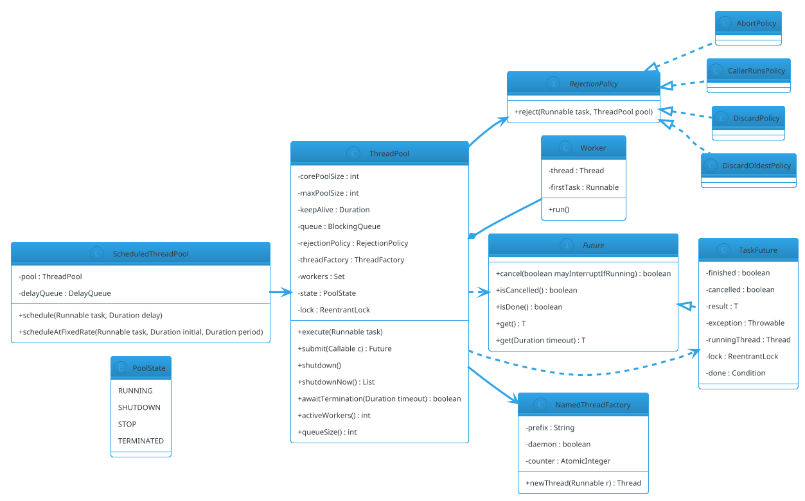

# Thread Pool Executor

## Problem Statement

Design a **thread pool executor** — a service that manages a fixed set of worker threads and a task queue. Callers submit tasks; the pool dispatches them to workers; workers execute tasks and return to the pool for more. The pool must handle **bounded queues**, **task rejection policies**, **graceful and forceful shutdown**, **task cancellation**, and **scheduling** (delayed/periodic execution).

This is the primitive that powers `ExecutorService`, gRPC server pools, Tomcat's request executor, and every async framework in Java. It's the **producer-consumer pattern with a worker pool** on the consumer side.

**Reused primitives (see reference files):**
- Producer-Consumer: `22-producer-consumer.md` (§4.1-4.3)
- Concurrency overview: `concurrency-basics.md` §3-6
- `BlockingQueue`, `ReentrantLock`, `Condition`: `concurrency-basics.md` §3-5

**New concepts unique to this problem:**
1. **Worker lifecycle** — create, idle, run, terminate
2. **Core vs max pool size** — elastic scaling with hysteresis
3. **Keep-alive timeout** — idle workers above core are reaped
4. **Bounded task queue** — with configurable capacity
5. **Rejection policies** — Abort, CallerRuns, Discard, DiscardOldest
6. **Graceful vs forceful shutdown** — drain queue vs interrupt
7. **`Future` result** — captured completion + exception
8. **Scheduled execution** — delayed + periodic tasks (via `ScheduledThreadPoolExecutor`)
9. **Thread factory** — named threads, daemon flag, uncaught handler

---

## 1. Requirements

### Functional

- **Fixed pool size** — always N workers
- **Configurable pool** — core, max, keep-alive, queue
- **`submit(task)`** — submit a `Runnable` or `Callable<T>`
- **`execute(task)`** — submit a `Runnable` without result
- **`shutdown()`** — graceful: stop accepting, drain queue, then terminate
- **`shutdownNow()`** — forceful: interrupt workers, return pending tasks
- **`awaitTermination(timeout)`** — wait for shutdown to complete
- **Task rejection** — when queue is full, apply policy
- **`Future.get(timeout)`** — wait for result
- **Task cancellation** — cancel a pending or running task
- **Named threads** — via `ThreadFactory`
- **Scheduled tasks** — `schedule(Runnable, delay)`, `scheduleAtFixedRate`

### Non-Functional

- **Bounded** — queue + pool both bounded
- **No task loss** — accepted tasks must run or be returned on forceful shutdown
- **Correct shutdown** — no new tasks after shutdown; in-flight tasks finish (graceful)
- **No deadlock** — tasks that submit other tasks don't deadlock (unless pool is exhausted)
- **Backpressure** — when full, reject rather than grow unbounded
- **Low overhead** — task dispatch < 10 µs
- **Observable** — active count, completed count, queue size, rejections

### Out of Scope

- Distributed task execution
- Task persistence / crash recovery
- Priority queues (mention as extension)
- ForkJoin (mention as alternative)
- Virtual threads (mention as Java 21 alternative)

---

## 2. Use Cases (brief)

| # | Use Case | Actor |
|---|---|---|
| UC1 | Submit a task, get a Future | Caller |
| UC2 | Submit a Runnable | Caller |
| UC3 | Queue is full → policy applies | Pool |
| UC4 | Worker idle → reaped above core | Pool |
| UC5 | Graceful shutdown | Admin |
| UC6 | Forceful shutdown | Admin |
| UC7 | Cancel a task | Caller |
| UC8 | Schedule a delayed task | Caller |
| UC9 | Monitor active/queued/completed | Monitoring |

---

## 3. Core Entities (delta)

**New entities:**

| Entity | Responsibility |
|---|---|
| `ThreadPool` | Manages workers + queue + lifecycle |
| `Worker` | Runnable that loops, taking tasks from queue |
| `Task<T>` | A unit of work with a `Future` result |
| `TaskQueue` | Bounded queue of tasks |
| `RejectionPolicy` | What to do when queue is full |
| `ThreadFactory` | Create named threads |
| `Future<T>` | Handle for task result |

**Enums:**

| Enum | Values |
|---|---|
| `PoolState` | RUNNING, SHUTDOWN, STOP, TERMINATED |
| `RejectionPolicy` | ABORT, CALLER_RUNS, DISCARD, DISCARD_OLDEST |

**Interfaces:**

| Interface | Implementations |
|---|---|
| `Task<T>` | `RunnableTask`, `CallableTask` |
| `Future<T>` | `TaskFuture` |
| `RejectionPolicy` | Four built-in policies |
| `ThreadFactory` | `NamedThreadFactory` |
| `ScheduledExecutor` | `ScheduledThreadPool` (extension) |

---

## 4. What's New — the Four Design Dimensions

### 4.1 Core vs Max Size + Keep-Alive

A thread pool has two size knobs:

- **corePoolSize** — minimum workers kept alive even when idle
- **maximumPoolSize** — maximum workers when load spikes
- **keepAliveTime** — how long workers above core can stay idle before being reaped

**Sizing behavior:**
1. On `submit`, if `activeWorkers < core` → **create a new worker immediately**, even if other workers are idle.
2. Else if queue not full → **enqueue the task**.
3. Else if `activeWorkers < max` → **create a new worker**.
4. Else → **reject** via policy.

This is the classic `ThreadPoolExecutor` algorithm.

```java
public final class ThreadPool implements AutoCloseable {

    private final int corePoolSize;
    private final int maxPoolSize;
    private final java.time.Duration keepAlive;
    private final java.util.concurrent.BlockingQueue<Runnable> queue;
    private final RejectionPolicy rejectionPolicy;
    private final java.util.concurrent.ThreadFactory threadFactory;

    private final java.util.concurrent.locks.ReentrantLock lock = new java.util.concurrent.locks.ReentrantLock();
    private final java.util.Set<Worker> workers = new java.util.HashSet<>();
    private volatile PoolState state = PoolState.RUNNING;

    public ThreadPool(int corePoolSize, int maxPoolSize, java.time.Duration keepAlive,
                      int queueCapacity, RejectionPolicy rejectionPolicy,
                      java.util.concurrent.ThreadFactory threadFactory) {
        if (corePoolSize < 0 || maxPoolSize < corePoolSize || queueCapacity <= 0) {
            throw new IllegalArgumentException("Invalid pool config");
        }
        this.corePoolSize = corePoolSize;
        this.maxPoolSize = maxPoolSize;
        this.keepAlive = keepAlive;
        this.queue = new java.util.concurrent.ArrayBlockingQueue<>(queueCapacity);
        this.rejectionPolicy = rejectionPolicy;
        this.threadFactory = threadFactory;
    }

    /** Submit a task for immediate execution. */
    public void execute(Runnable task) {
        if (task == null) throw new NullPointerException("task");
        lock.lock();
        try {
            if (state != PoolState.RUNNING) {
                rejectionPolicy.reject(task, this);
                return;
            }
            if (workers.size() < corePoolSize) {
                addWorker(task, true);
                return;
            }
            if (queue.offer(task)) {
                return;
            }
            // Queue full; try to spawn up to max
            if (workers.size() < maxPoolSize) {
                addWorker(task, false);
                return;
            }
            rejectionPolicy.reject(task, this);
        } finally {
            lock.unlock();
        }
    }

    private void addWorker(Runnable firstTask, boolean isCore) {
        Worker w = new Worker(firstTask);
        workers.add(w);
        Thread t = threadFactory.newThread(w);
        w.thread = t;
        t.start();
    }

    /** Graceful shutdown: no new tasks, run queued tasks, then terminate. */
    public void shutdown() {
        lock.lock();
        try {
            if (state != PoolState.RUNNING) return;
            state = PoolState.SHUTDOWN;
            for (Worker w : workers) w.thread.interrupt();
        } finally {
            lock.unlock();
        }
    }

    /** Forceful shutdown: interrupt workers, drain queue. */
    public java.util.List<Runnable> shutdownNow() {
        java.util.List<Runnable> pending = new java.util.ArrayList<>();
        lock.lock();
        try {
            if (state == PoolState.TERMINATED) return pending;
            state = PoolState.STOP;
            for (Worker w : workers) w.thread.interrupt();
        } finally {
            lock.unlock();
        }
        queue.drainTo(pending);
        return pending;
    }

    public boolean awaitTermination(java.time.Duration timeout) throws InterruptedException {
        long deadline = System.nanoTime() + timeout.toNanos();
        lock.lock();
        try {
            while (state != PoolState.TERMINATED) {
                long remaining = deadline - System.nanoTime();
                if (remaining <= 0) return false;
                // Use a Condition for the join to avoid busy-waiting; simplified here
                lock.unlock();
                Thread.sleep(Math.min(10, java.util.concurrent.TimeUnit.NANOSECONDS.toMillis(remaining)));
                lock.lock();
            }
            return true;
        } finally {
            lock.unlock();
        }
    }

    // ----- Worker -----

    private final class Worker implements Runnable {
        Thread thread;
        Runnable firstTask;

        Worker(Runnable firstTask) { this.firstTask = firstTask; }

        @Override
        public void run() {
            try {
                Runnable task = firstTask;
                firstTask = null;
                while (task != null || (task = getTask()) != null) {
                    try {
                        task.run();
                    } catch (Throwable t) {
                        // Log and continue; a failed task doesn't kill the worker
                        System.err.println("Task failed: " + t);
                    } finally {
                        task = null;
                    }
                }
            } finally {
                // Worker exits; remove from set
                lock.lock();
                try {
                    workers.remove(this);
                    if (state == PoolState.SHUTDOWN && workers.isEmpty()) {
                        state = PoolState.TERMINATED;
                    }
                } finally {
                    lock.unlock();
                }
            }
        }

        /** Fetch the next task, honoring state + keep-alive. */
        private Runnable getTask() {
            boolean timedOut = false;
            while (true) {
                lock.lock();
                try {
                    if (state == PoolState.STOP || state == PoolState.TERMINATED) return null;
                    if (state == PoolState.SHUTDOWN && queue.isEmpty()) return null;

                    boolean canTimeOut = workers.size() > corePoolSize || state == PoolState.SHUTDOWN;
                    if (!canTimeOut) {
                        // Block indefinitely
                        lock.unlock();
                        try { return queue.take(); }
                        catch (InterruptedException e) { return null; }
                        finally { lock.lock(); }
                    }
                } finally {
                    lock.unlock();
                }

                try {
                    Runnable r = queue.poll(keepAlive.toMillis(), java.util.concurrent.TimeUnit.MILLISECONDS);
                    if (r != null) return r;
                    // Timed out; re-check
                    lock.lock();
                    try {
                        if (state != PoolState.RUNNING) return null;
                        if (workers.size() > corePoolSize) {
                            workers.remove(this);
                            return null;    // worker dies
                        }
                    } finally {
                        lock.unlock();
                    }
                } catch (InterruptedException e) {
                    // Interrupted during shutdown
                    return null;
                }
            }
        }
    }

    // ----- Statistics -----

    public int activeWorkers() {
        lock.lock();
        try { return workers.size(); }
        finally { lock.unlock(); }
    }

    public int queueSize() { return queue.size(); }
    public int queueCapacity() { return ((java.util.concurrent.ArrayBlockingQueue<Runnable>) queue).remainingCapacity() + queue.size(); }

    @Override
    public void close() {
        shutdown();
        try { awaitTermination(java.time.Duration.ofSeconds(10)); }
        catch (InterruptedException e) { Thread.currentThread().interrupt(); }
    }
}
```

**Key behaviors:**
- **Core workers grow immediately** — first `core` tasks spawn workers, even if the queue is empty (classic TPE behavior).
- **Beyond core, queue first** — after core is saturated, tasks enqueue; workers are only added if the queue is full AND we're under max.
- **Idle reaping** — workers above core exit after `keepAlive` when no task arrives.
- **`finally` in `run()`** — always removes the worker from the set, even if `getTask()` throws.
- **Worker catches all throwables** — a task exception doesn't kill the worker; the loop continues.

### 4.2 Rejection Policies

When the queue is full and pool is at max, the pool invokes a rejection policy.

```java
public interface RejectionPolicy {
    void reject(Runnable task, ThreadPool pool);
}
```

```java
public final class AbortPolicy implements RejectionPolicy {
    @Override public void reject(Runnable task, ThreadPool pool) {
        throw new java.util.concurrent.RejectedExecutionException("Queue full, task rejected");
    }
}
```

```java
public final class CallerRunsPolicy implements RejectionPolicy {
    @Override public void reject(Runnable task, ThreadPool pool) {
        if (!pool.isShutdown()) {
            task.run();   // backpressure: caller executes the task itself
        }
    }
}
```

```java
public final class DiscardPolicy implements RejectionPolicy {
    @Override public void reject(Runnable task, ThreadPool pool) {
        // Silently drop
    }
}
```

```java
public final class DiscardOldestPolicy implements RejectionPolicy {
    @Override public void reject(Runnable task, ThreadPool pool) {
        if (!pool.isShutdown()) {
            pool.pollOldestAndDiscard();
            pool.execute(task);
        }
    }
}
```

**When to use which:**
- **Abort** — fail fast; caller handles the exception.
- **CallerRuns** — natural backpressure; slows producers when the pool is saturated. Common for server request handlers.
- **Discard** — for metrics/logs where losing some events is acceptable.
- **DiscardOldest** — keep newest; drop stale. Useful for time-sensitive tasks.

### 4.3 Futures and Callables

`Runnable` returns void; `Callable<T>` returns a value. Both need a `Future<T>` handle.

```java
public interface Future<T> {
    boolean cancel(boolean mayInterruptIfRunning);
    boolean isCancelled();
    boolean isDone();
    T get() throws InterruptedException, java.util.concurrent.ExecutionException;
    T get(java.time.Duration timeout) throws InterruptedException,
            java.util.concurrent.ExecutionException, java.util.concurrent.TimeoutException;
}
```

```java
public final class TaskFuture<T> implements Future<T> {

    private final java.util.concurrent.locks.ReentrantLock lock = new java.util.concurrent.locks.ReentrantLock();
    private final java.util.concurrent.locks.Condition done = lock.newCondition();

    private volatile boolean cancelled;
    private volatile boolean finished;
    private volatile T result;
    private volatile Throwable exception;
    private volatile Thread runningThread;

    @Override
    public T get() throws InterruptedException, java.util.concurrent.ExecutionException {
        lock.lock();
        try {
            while (!finished && !cancelled) done.await();
            if (cancelled) throw new java.util.concurrent.CancellationException();
            if (exception != null) throw new java.util.concurrent.ExecutionException(exception);
            return result;
        } finally {
            lock.unlock();
        }
    }

    @Override
    public T get(java.time.Duration timeout) throws InterruptedException,
            java.util.concurrent.ExecutionException, java.util.concurrent.TimeoutException {
        lock.lock();
        try {
            long remaining = timeout.toNanos();
            while (!finished && !cancelled) {
                if (remaining <= 0) throw new java.util.concurrent.TimeoutException();
                remaining = done.awaitNanos(remaining);
            }
            if (cancelled) throw new java.util.concurrent.CancellationException();
            if (exception != null) throw new java.util.concurrent.ExecutionException(exception);
            return result;
        } finally {
            lock.unlock();
        }
    }

    @Override
    public boolean cancel(boolean mayInterruptIfRunning) {
        lock.lock();
        try {
            if (finished) return false;
            cancelled = true;
            if (mayInterruptIfRunning && runningThread != null) {
                runningThread.interrupt();
            }
            done.signalAll();
            return true;
        } finally {
            lock.unlock();
        }
    }

    @Override public boolean isCancelled() { return cancelled; }
    @Override public boolean isDone() { return finished || cancelled; }

    /** Called by the worker after the task completes. */
    void complete(T result) {
        lock.lock();
        try {
            this.result = result;
            this.finished = true;
            done.signalAll();
        } finally { lock.unlock(); }
    }

    void completeExceptionally(Throwable t) {
        lock.lock();
        try {
            this.exception = t;
            this.finished = true;
            done.signalAll();
        } finally { lock.unlock(); }
    }

    void setRunningThread(Thread t) { this.runningThread = t; }
}
```

**`submit` methods on the pool:**

```java
public <T> Future<T> submit(java.util.concurrent.Callable<T> callable) {
    TaskFuture<T> future = new TaskFuture<>();
    Runnable wrapper = () -> {
        future.setRunningThread(Thread.currentThread());
        try {
            future.complete(callable.call());
        } catch (Throwable t) {
            future.completeExceptionally(t);
        }
    };
    execute(wrapper);
    return future;
}

public Future<?> submit(Runnable task) {
    return submit(() -> { task.run(); return null; });
}
```

**Design notes:**
- `Future` uses a `Condition` to block `get()` until the task finishes.
- `cancel(true)` interrupts the running thread — task must cooperate by checking interrupts or being interruptible.
- `setRunningThread` on the future is only needed for interruptible cancellation.

### 4.4 Thread Factory

```java
public final class NamedThreadFactory implements java.util.concurrent.ThreadFactory {

    private final String prefix;
    private final boolean daemon;
    private final java.util.concurrent.atomic.AtomicInteger counter = new java.util.concurrent.atomic.AtomicInteger();

    public NamedThreadFactory(String prefix, boolean daemon) {
        this.prefix = prefix;
        this.daemon = daemon;
    }

    @Override
    public Thread newThread(Runnable r) {
        Thread t = new Thread(r, prefix + "-" + counter.incrementAndGet());
        t.setDaemon(daemon);
        t.setUncaughtExceptionHandler((thread, ex) ->
                System.err.println("Uncaught in " + thread.getName() + ": " + ex));
        return t;
    }
}
```

**Why named threads:**
- Debuggable stack traces (`pool-1-thread-3` vs `http-worker-7`)
- Metrics per thread
- Thread dumps show origin

### 4.5 Scheduled Execution

Extend the pool with a **delay queue** to support scheduled tasks.

```java
public final class ScheduledThreadPool {

    private final ThreadPool pool;
    private final java.util.concurrent.DelayQueue<ScheduledTask> delayQueue = new java.util.concurrent.DelayQueue<>();

    public ScheduledThreadPool(ThreadPool pool) {
        this.pool = pool;
        startDispatcher();
    }

    public void schedule(Runnable task, java.time.Duration delay) {
        delayQueue.offer(new ScheduledTask(task, System.nanoTime() + delay.toNanos(), null));
    }

    public void scheduleAtFixedRate(Runnable task, java.time.Duration initialDelay,
                                    java.time.Duration period) {
        delayQueue.offer(new ScheduledTask(task,
                System.nanoTime() + initialDelay.toNanos(), period));
    }

    private void startDispatcher() {
        Thread t = new Thread(() -> {
            while (!Thread.currentThread().isInterrupted()) {
                try {
                    ScheduledTask st = delayQueue.take();
                    if (st.period != null) {
                        // Reschedule before running
                        delayQueue.offer(new ScheduledTask(st.task,
                                System.nanoTime() + st.period.toNanos(), st.period));
                    }
                    pool.execute(st.task);
                } catch (InterruptedException e) {
                    Thread.currentThread().interrupt();
                    return;
                }
            }
        }, "scheduler-dispatcher");
        t.setDaemon(true);
        t.start();
    }

    private static final class ScheduledTask implements Delayed {
        final Runnable task;
        final long runAtNanos;
        final java.time.Duration period;

        ScheduledTask(Runnable task, long runAtNanos, java.time.Duration period) {
            this.task = task;
            this.runAtNanos = runAtNanos;
            this.period = period;
        }

        @Override
        public long getDelay(java.util.concurrent.TimeUnit unit) {
            return unit.convert(runAtNanos - System.nanoTime(), java.util.concurrent.TimeUnit.NANOSECONDS);
        }

        @Override
        public int compareTo(Delayed other) {
            return Long.compare(runAtNanos, ((ScheduledTask) other).runAtNanos);
        }
    }
}
```

**Notes:**
- **Dispatcher thread** pulls from the delay queue and submits to the pool.
- **Fixed-rate** reschedules the next occurrence **before** running — ensures a fixed schedule regardless of task duration.
- **Fixed-delay** (not shown) reschedules **after** completion — useful when drift is acceptable but overlap isn't.
- For production, use `ScheduledThreadPoolExecutor` from the JDK.

---

## 5. Class Diagram (delta)



---

## 6. Java Implementation (support pieces)

### 6.1 Demo

```java
public class Demo {
    public static void main(String[] args) throws Exception {
        ThreadPool pool = new ThreadPool(
                2,                          // core
                4,                          // max
                java.time.Duration.ofSeconds(5),
                10,                         // queue capacity
                new CallerRunsPolicy(),
                new NamedThreadFactory("worker", true)
        );

        // Submit a few Callables
        var futures = new java.util.ArrayList<Future<Integer>>();
        for (int i = 0; i < 5; i++) {
            final int n = i;
            futures.add(pool.submit(() -> {
                Thread.sleep(200);
                return n * 10;
            }));
        }

        for (var f : futures) System.out.println("Result: " + f.get());

        System.out.println("Active workers: " + pool.activeWorkers());
        System.out.println("Queue size: " + pool.queueSize());

        // Scheduler
        ScheduledThreadPool scheduler = new ScheduledThreadPool(pool);
        scheduler.schedule(() -> System.out.println("Delayed hello"),
                java.time.Duration.ofMillis(500));
        scheduler.scheduleAtFixedRate(() -> System.out.println("Tick"),
                java.time.Duration.ofSeconds(1),
                java.time.Duration.ofSeconds(1));

        Thread.sleep(3500);
        pool.shutdown();
        pool.awaitTermination(java.time.Duration.ofSeconds(5));
        System.out.println("Pool terminated");
    }
}
```

---

## 7. Concurrency Considerations

Reused from `22-producer-consumer.md` and `21-rate-limiter-lld.md`:
- `BlockingQueue` for task storage
- `ReentrantLock` + `Condition` for state
- `LongAdder` for metrics

**New to Thread Pool:**

- **State machine + workers** — `RUNNING → SHUTDOWN → STOP → TERMINATED`. Every state transition is under the pool's lock.
- **Worker growth under lock** — deciding whether to spawn a new worker or enqueue requires the lock (checks `workers.size()` and queue state together).
- **Worker reaping above core** — idle workers `poll(keepAlive)`; on timeout, they exit if above core.
- **Graceful shutdown** — workers stop accepting new tasks, drain the queue, then exit. Requires the worker loop to distinguish `SHUTDOWN` (drain) from `STOP` (exit immediately).
- **Forceful shutdown** — interrupts workers; pending tasks drained from the queue and returned.
- **Task exception isolation** — one task's exception must not kill the worker or affect other tasks. Wrap `task.run()` in try/catch.
- **Reentrant submissions** — a task may submit other tasks to the same pool. This works **unless the pool is saturated** — then the outer task blocks waiting for the inner task's result, and the inner task waits for a worker, causing deadlock. Mitigation: `CallerRunsPolicy`, or use a separate pool for nested submissions.
- **Thread interruption during task** — the task must cooperate (check `Thread.interrupted()` or be interruptible). `Future.cancel(true)` triggers it.
- **Fairness** — `ReentrantLock(true)` gives FIFO scheduling; usually not needed.
- **Bounded queue** — unbounded queues break the max-pool-size logic: tasks never reject, so `maxPoolSize` is never used.
- **No task loss** — accepted tasks either run or are returned by `shutdownNow`. Rejected tasks are the caller's responsibility.

### Testing

```java
@Test
void tasksExecuteInOrder() throws Exception {
    ThreadPool pool = new ThreadPool(1, 1, java.time.Duration.ofSeconds(1),
            10, new AbortPolicy(), new NamedThreadFactory("t", true));
    var results = new java.util.concurrent.CopyOnWriteArrayList<Integer>();
    var futures = new java.util.ArrayList<Future<?>>();
    for (int i = 0; i < 5; i++) {
        final int n = i;
        futures.add(pool.submit(() -> results.add(n)));
    }
    for (var f : futures) f.get();
    assertEquals(java.util.List.of(0, 1, 2, 3, 4), results);
    pool.shutdown();
}

@Test
void poolGrowsUpToMax() throws Exception {
    ThreadPool pool = new ThreadPool(1, 3, java.time.Duration.ofSeconds(1),
            2, new AbortPolicy(), new NamedThreadFactory("t", true));

    // Submit 3 long-running tasks; queue capacity 2
    for (int i = 0; i < 3; i++) {
        pool.submit(() -> { Thread.sleep(500); return null; });
    }
    Thread.sleep(100);
    // Expect up to 3 workers active (core=1 + 2 spawned due to queue overflow)
    assertTrue(pool.activeWorkers() <= 3);
    pool.shutdownNow();
}

@Test
void callerRunsPolicyExecutes() {
    ThreadPool pool = new ThreadPool(1, 1, java.time.Duration.ofSeconds(1),
            1, new CallerRunsPolicy(), new NamedThreadFactory("t", true));
    var executed = new java.util.concurrent.atomic.AtomicInteger();
    Runnable slowTask = () -> { try { Thread.sleep(300); } catch (Exception ignored) {} };

    pool.submit(slowTask);   // occupies the worker
    pool.submit(slowTask);   // fills the queue
    pool.submit(() -> executed.incrementAndGet());   // rejected → caller runs
    assertEquals(1, executed.get());
    pool.shutdown();
}
```

---

## 8. Extensibility

| Feature | Change |
|---|---|
| Priority queue | Use `PriorityBlockingQueue<Runnable>` |
| Work stealing | Use `ForkJoinPool` |
| Virtual threads | Java 21: `Executors.newVirtualThreadPerTaskExecutor()` |
| Custom rejection | Implement `RejectionPolicy` |
| Per-task timeout | Wrap task with `Future.get(timeout)` in the caller |
| Metrics export | Attach to `LongAdder` counters; push to Prometheus |
| Dynamic sizing | Add `setCorePoolSize` / `setMaxPoolSize` |
| Pause/resume | Add `pause()` that stops taking from queue |
| Named queues | Separate queues for priority classes |
| Persistence | Persist tasks to disk; recover on restart (that's a durable queue) |

---

## 9. Common Pitfalls

| Pitfall | Fix |
|---|---|
| Unbounded queue | Bounded — otherwise maxPoolSize never used |
| Worker dies on task exception | try/catch around `task.run()` |
| Forgetting `finally { workers.remove(this); }` | Always remove worker on exit |
| `notifyAll` on pool state changes | Use `Condition` for shutdown waiters |
| Not restoring interrupt flag | `Thread.currentThread().interrupt()` |
| Blocking on a saturated pool | Use `CallerRunsPolicy` or separate pools |
| Iterating `workers` without lock | Always under lock |
| Not distinguishing SHUTDOWN vs STOP | Drain vs interrupt |
| Task loss on shutdownNow | Return pending tasks from `queue.drainTo` |
| Missing `awaitTermination` | Without it, JVM may exit with tasks in flight |
| Fairness misunderstanding | Default (unfair) is faster; fair only if FIFO matters |
| Threads not daemon → JVM hangs | `threadFactory` sets daemon explicitly |
| `queue.size()` for capacity planning | Track queue depth over time; not snapshot |
| Recursive `submit` deadlock | Use separate pool or `CallerRunsPolicy` |
| Calling `close()` in a task | Could deadlock if pool waits for the task to finish |

---

## 10. Follow-ups

### Q1: How do you avoid deadlock with nested submissions?

**Answer:** 
- **Option A:** `CallerRunsPolicy` — when the queue is full, the caller runs the task inline, breaking the deadlock.
- **Option B:** Separate pools for outer and inner tasks. The outer pool has a thread waiting for the inner result; the inner pool provides workers for the inner task. No circular wait.
- **Option C:** `ForkJoinPool` — worker threads can "help" run pending tasks when blocked. Detects and mitigates some deadlocks.

### Q2: What's the difference between `shutdown` and `shutdownNow`?

**Answer:**
- **`shutdown()`** — graceful. Stop accepting new tasks, run queued tasks to completion, then terminate. In-flight tasks finish.
- **`shutdownNow()`** — forceful. Stop accepting, interrupt running tasks, drain queue (returning pending tasks). Tasks that don't respond to interrupt keep running.

Choose graceful for correctness; forceful for fast shutdown.

### Q3: How do you detect an idle pool?

**Answer:** Track `activeWorkers()` (workers currently running a task) and `queueSize()`. When `activeWorkers == 0 && queueSize == 0`, the pool is idle. Optionally, shut down after an idle period (auto-scaling to zero).

### Q4: What pool size should I use?

**Answer:**
- **CPU-bound tasks:** `size ≈ number_of_cores + 1` (N+1 rule).
- **I/O-bound tasks:** `size ≈ cores × (1 + wait_time / compute_time)` — more threads to keep cores busy during I/O waits.
- **Mixed:** separate pools for CPU and I/O.

**Java 21 virtual threads** change the calculus: no tuning needed; one virtual thread per task.

### Q5: How does `ExecutorService` from the JDK differ from your implementation?

**Answer:** 
- **Battle-tested** — handles edge cases we didn't.
- **More features** — `invokeAll`, `invokeAny`, timed waits, `ScheduledThreadPoolExecutor`.
- **Better locking** — uses `AbstractQueuedSynchronizer` for performance.
- **Correctness guarantees** — the JDK has extensively tested shutdown, interruption, and rejection.

For LLD, write it once to understand; in production, always use `ExecutorService`.

### Q6: How do you handle long-running tasks blocking shutdown?

**Answer:** 
- `shutdownNow()` interrupts; task must cooperate.
- If the task ignores interrupts, the pool can't terminate. Add a **hard timeout** at the application level.
- For production, prefer tasks that respond to interrupt or run in separate, killable processes.

### Q7: How would you add priority scheduling?

**Answer:** Replace the `ArrayBlockingQueue` with a `PriorityBlockingQueue<Runnable>`. Wrap tasks with a `priority` field and implement `Comparable`. Workers take the highest-priority task.

**Caveat:** Priority queues can starve low-priority tasks. Add a **starvation-avoidance** mechanism (aging — increase priority over time).

---

## 11. Similar Problems

- **Producer-Consumer (LLD #22)** — the underlying pattern
- **Thread-Safe LRU Cache (LLD #23)** — bounded resource with eviction
- **Rate Limiter (LLD #21)** — admission control
- **Distributed Task Scheduler (HLD #48)** — cross-node scheduling
- **Message Queue (LLD #28)** — task dispatch at scale

Thread Pool's unique additions: **core/max scaling**, **keep-alive reaping**, **rejection policies**, **graceful vs forceful shutdown**, **Future results**, **scheduling**.

---

## 12. Key Takeaways

- **Producer-Consumer + worker pool** — bounded queue + N workers
- **core vs max** — grow to core immediately; beyond core, queue first; only grow further if queue is full
- **keep-alive** — idle workers above core are reaped after timeout
- **Bounded queue is essential** — unbounded queue makes maxSize meaningless
- **Rejection policies** — Abort, CallerRuns, Discard, DiscardOldest
- **CallerRunsPolicy gives backpressure** — slows producers naturally
- **Worker loop catches all throwables** — task exceptions don't kill workers
- **Graceful shutdown drains queue; forceful interrupts**
- **`Future` with `Condition`** — blocks on `get()`, wakes on completion
- **`NamedThreadFactory`** — debuggable thread names
- **Scheduled tasks via `DelayQueue` + dispatcher**
- **Avoid nested `submit` deadlock** — separate pools or `CallerRunsPolicy`
- **State machine under lock** — RUNNING → SHUTDOWN → STOP → TERMINATED
- **In production, use `ExecutorService`** — hand-rolled is for LLD understanding
- **Java 21 virtual threads** change the pool-sizing calculus — no tuning needed for I/O-bound

### The Generalizable Recipe

For any **worker pool / task executor** problem:

1. **Bounded task queue** — capacity matters
2. **Worker set** — managed under lock
3. **Core/max/keep-alive** — elastic sizing
4. **Worker loop** — take from queue, run, repeat; catch all
5. **Rejection policy as Strategy** — Abort/CallerRuns/Discard
6. **State machine** — RUNNING/SHUTDOWN/STOP/TERMINATED
7. **Graceful vs forceful shutdown**
8. **`Future<T>`** — handle for async results with `Condition`
9. **`ThreadFactory`** — named, daemon, uncaught handler
10. **Scheduling via `DelayQueue`** — dispatcher thread
11. **Backpressure** — CallerRunsPolicy
12. **Metrics** — active count, queue size, completed, rejected
13. **Production** — use `ExecutorService`

This skeleton plus the queue primitives from `22-producer-consumer.md` solves: Thread Pool, Executor Service, gRPC Server Pool, Web Server Request Pool, Async Task Runner, Scheduled Executor, Batch Processing Pool — with variations in sizing, scheduling, and priority.