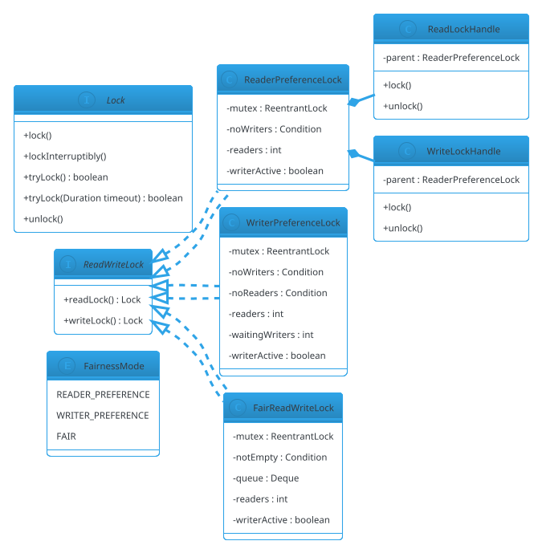

# Reader-Writer Lock

## Problem Statement

Design a **reader-writer lock** — a synchronization primitive that allows **multiple concurrent readers** OR **one exclusive writer**, but not both at the same time. Readers don't modify shared state, so they can proceed in parallel; writers need exclusive access.

This is the primitive that powers concurrent caches, configuration stores, routing tables, and read-heavy data structures. The challenge is **fairness vs throughput**: an unfair lock lets readers starve writers; a fair lock lets writers block readers, lowering throughput. There's no universal answer — the design is a choice.

**Reused primitives (see reference files):**
- Concurrency overview: `concurrency-basics.md` §3-6
- `ReentrantLock`, `Condition`: `concurrency-basics.md` §3.2
- Thread Pool state machine: `24-thread-pool.md` §4.1 (state + lock design)

**New concepts unique to this problem:**
1. **Shared vs exclusive locks** — multiple readers OR one writer
2. **Fairness policies** — reader-preference, writer-preference, fair (FIFO)
3. **Starvation** — writer starvation under reader-preference
4. **Writer preference** — prevent starvation; may reduce throughput
5. **Reentrancy** — writer reentrancy (safe); reader reentrancy with upgrade risk
6. **Upgrade/downgrade** — reader → writer upgrade (tricky; deadlock risk)
7. **Read-lock reentrancy** — permitting nested reads by the same thread
8. **The `StampedLock` alternative** — optimistic reads with validation

---

## 1. Requirements

### Functional

- **`readLock().lock()` / `unlock()`** — shared lock
- **`writeLock().lock()` / `unlock()`** — exclusive lock
- **Multiple readers concurrently allowed**
- **Writers exclude readers and other writers**
- **Fairness** — configurable: reader-preference, writer-preference, or FIFO
- **Reentrant** — writer can re-acquire; readers can re-acquire
- **`tryLock(timeout)`** — bounded acquire for both modes
- **`tryLock()`** — non-blocking
- **Interruptible** — `lockInterruptibly` for both modes
- **Statistics** — read/write lock counts, current readers

### Non-Functional

- **Correct** — no reader observes a concurrent writer's changes
- **No deadlock** — reentrant, timeout-protected
- **Scalable** — reads scale with cores
- **Low overhead** — uncontended lock/unlock < 100 ns
- **Configurable fairness** — trade throughput for starvation-freedom

### Out of Scope

- Cross-process locks
- Distributed locks (that's HLD #04)
- Priority inheritance
- Nested upgrade with rollback

---

## 2. Use Cases (brief)

| # | Use Case | Actor |
|---|---|---|
| UC1 | Acquire read lock, release | Reader |
| UC2 | Acquire write lock, release | Writer |
| UC3 | Nested read lock (reentrant) | Reader |
| UC4 | Nested write lock (reentrant) | Writer |
| UC5 | Timed try-lock | Caller |
| UC6 | Interruptible acquire | Caller |
| UC7 | Query stats | Monitoring |

---

## 3. Core Entities (delta)

**New entities:**

| Entity | Responsibility |
|---|---|
| `ReadWriteLock` | Interface for the lock pair |
| `ReadLock` | Shared lock handle |
| `WriteLock` | Exclusive lock handle |
| `FairReadWriteLock` | FIFO fairness implementation |
| `WriterPreferenceLock` | Writers get priority |
| `ReaderPreferenceLock` | Readers get priority (may starve writers) |
| `StampedLock` (mention) | Optimistic reads alternative |

**Enums:**

| Enum | Values |
|---|---|
| `FairnessMode` | READER_PREFERENCE, WRITER_PREFERENCE, FAIR |

**Interfaces:**

| Interface | Implementations |
|---|---|
| `ReadWriteLock` | Three fairness implementations |
| `Lock` | Standard lock interface (subset) |

---

## 4. What's New — the Three Fairness Policies

### 4.1 Reader Preference (Throughput-Optimized)

**Policy:** If any readers hold the lock, new readers may proceed even if writers are waiting.

**Pros:** Maximum read throughput.
**Cons:** **Writer starvation** under sustained read load.

**State:**
- `readers` (int) — current reader count
- `writerActive` (boolean) — writer holds the lock
- `waitingWriters` (int) — for stats only

```java
public final class ReaderPreferenceLock implements ReadWriteLock {

    private final ReentrantLock mutex = new ReentrantLock();
    private final Condition noWriters = mutex.newCondition();

    private int readers = 0;
    private boolean writerActive = false;

    @Override public Lock readLock() {
        return new Lock() {
            @Override public void lock() {
                mutex.lock();
                try {
                    // Readers proceed unless a writer is active
                    while (writerActive) noWriters.await();
                    readers++;
                } catch (InterruptedException e) {
                    Thread.currentThread().interrupt();
                } finally { mutex.unlock(); }
            }
            @Override public void unlock() {
                mutex.lock();
                try {
                    readers--;
                    if (readers == 0) noWriters.signalAll();  // wake writers
                } finally { mutex.unlock(); }
            }
        };
    }

    @Override public Lock writeLock() {
        return new Lock() {
            @Override public void lock() {
                mutex.lock();
                try {
                    while (writerActive || readers > 0) noWriters.await();
                    writerActive = true;
                } catch (InterruptedException e) {
                    Thread.currentThread().interrupt();
                } finally { mutex.unlock(); }
            }
            @Override public void unlock() {
                mutex.lock();
                try {
                    writerActive = false;
                    noWriters.signalAll();   // wake readers AND writers
                } finally { mutex.unlock(); }
            }
        };
    }
}
```

**Note:** the reader path holds the mutex very briefly — only to check `writerActive` and increment `readers`. The actual read work happens **outside** the lock.

**Why writer starvation:** if readers keep arriving while readers > 0, a waiting writer never sees `readers == 0`. Readers slip past it indefinitely.

### 4.2 Writer Preference (Starvation-Free)

**Policy:** New readers wait if any writer is waiting. Prevents writer starvation but lowers read throughput.

**State:** add `waitingWriters` (int).

```java
public final class WriterPreferenceLock implements ReadWriteLock {

    private final ReentrantLock mutex = new ReentrantLock();
    private final Condition noWriters = mutex.newCondition();
    private final Condition noReaders = mutex.newCondition();

    private int readers = 0;
    private int waitingWriters = 0;
    private boolean writerActive = false;

    @Override public Lock readLock() {
        return new Lock() {
            @Override public void lock() {
                mutex.lock();
                try {
                    // Block new readers if a writer is waiting
                    while (writerActive || waitingWriters > 0) noWriters.await();
                    readers++;
                } catch (InterruptedException e) {
                    Thread.currentThread().interrupt();
                } finally { mutex.unlock(); }
            }
            @Override public void unlock() {
                mutex.lock();
                try {
                    readers--;
                    if (readers == 0) noReaders.signalAll();
                } finally { mutex.unlock(); }
            }
        };
    }

    @Override public Lock writeLock() {
        return new Lock() {
            @Override public void lock() {
                mutex.lock();
                try {
                    waitingWriters++;
                    while (writerActive || readers > 0) noReaders.await();
                    waitingWriters--;
                    writerActive = true;
                } catch (InterruptedException e) {
                    Thread.currentThread().interrupt();
                } finally { mutex.unlock(); }
            }
            @Override public void unlock() {
                mutex.lock();
                try {
                    writerActive = false;
                    noWriters.signalAll();   // wake waiting readers
                    noReaders.signal();      // wake one waiting writer
                } finally { mutex.unlock(); }
            }
        };
    }
}
```

**Trade-off:** readers now wait whenever a writer is pending. If writers are frequent, read throughput collapses. But no starvation.

### 4.3 Fair (FIFO)

**Policy:** both readers and writers acquire in arrival order. A reader arriving after a writer must wait for the writer to finish, even if other readers are active.

**State:** a FIFO queue of waiters.

```java
public final class FairReadWriteLock implements ReadWriteLock {

    private final ReentrantLock mutex = new ReentrantLock();
    private final Condition notEmpty = mutex.newCondition();

    private int readers = 0;
    private boolean writerActive = false;
    private final java.util.ArrayDeque<Waiter> queue = new java.util.ArrayDeque<>();

    private enum WaiterType { READER, WRITER }

    private static final class Waiter {
        final WaiterType type;
        final Thread thread;
        boolean granted;
        Waiter(WaiterType type, Thread thread) { this.type = type; this.thread = thread; }
    }

    @Override public Lock readLock() {
        return new Lock() {
            @Override public void lock() {
                mutex.lock();
                try {
                    Waiter w = new Waiter(WaiterType.READER, Thread.currentThread());
                    queue.addLast(w);
                    while (!canGrantReader(w)) notEmpty.await();
                    w.granted = true;
                    queue.remove(w);
                    readers++;
                } catch (InterruptedException e) {
                    Thread.currentThread().interrupt();
                } finally { mutex.unlock(); }
            }
            @Override public void unlock() {
                mutex.lock();
                try {
                    readers--;
                    if (readers == 0) notEmpty.signalAll();
                } finally { mutex.unlock(); }
            }
        };
    }

    private boolean canGrantReader(Waiter w) {
        if (writerActive) return false;
        // Fair: a reader can proceed only if it's at the head,
        // or the head is also a reader.
        return queue.peekFirst() == w ||
                (queue.peekFirst() != null && queue.peekFirst().type == WaiterType.READER);
    }

    // Similar for writeLock — canGrantWriter requires queue head AND no readers AND no writer
}
```

**Note:** a full FIFO implementation is subtle. For LLD, describing the three policies and implementing **writer preference** is enough. The JDK's `ReentrantReadWriteLock(fair)` provides the FIFO variant.

### 4.4 Comparison

| Policy | Read Throughput | Writer Latency | Writer Starvation |
|---|---|---|---|
| Reader preference | Highest | High | **Yes** |
| Writer preference | Medium | Low | No |
| Fair (FIFO) | Medium-High | Low | No |
| JDK `ReentrantReadWriteLock` (default, unfair) | High | Medium | Rare |
| JDK `ReentrantReadWriteLock(true)` | Medium | Low | No |

**Recommendation:**
- **Read-heavy, occasional writers:** reader preference (but beware of starvation).
- **Write-heavy, latency-sensitive:** writer preference.
- **Mixed, need fairness:** use JDK's `ReentrantReadWriteLock(true)`.

### 4.5 Reentrancy

Writers can re-acquire the write lock (reentrant like `ReentrantLock`). Track a per-thread hold count.

Readers can also re-acquire the read lock — but the count is per-thread, and the final unlock must match the number of acquires.

**Danger:** reader → writer upgrade. A reader cannot upgrade to a writer while other readers hold the lock; doing so creates deadlock (the writer waits for all readers to release, including itself).

**Safe patterns:**
- **Downgrade:** writer → reader is safe (release write, acquire read).
- **Upgrade:** acquire write **before** releasing read **only** if no other readers are active. Otherwise, release read, acquire write, then re-acquire read.

**For LLD:** mention upgrade is unsafe; use downgrade or re-acquire pattern.

### 4.6 `tryLock` with Timeout

```java
@Override
public boolean tryLock(java.time.Duration timeout) throws InterruptedException {
    long deadline = System.nanoTime() + timeout.toNanos();
    mutex.lockInterruptibly();
    try {
        while (writerActive || readers > 0) {
            long remaining = deadline - System.nanoTime();
            if (remaining <= 0) return false;
            noReaders.awaitNanos(remaining);
        }
        writerActive = true;
        return true;
    } finally { mutex.unlock(); }
}
```

**Non-blocking `tryLock()`:** a single check, no wait.

---

## 5. Class Diagram (delta)



---

## 6. Java Implementation (support pieces)

### 6.1 Demo

```java
public class Demo {
    public static void main(String[] args) throws InterruptedException {
        ReadWriteLock rw = new WriterPreferenceLock();

        // Writer
        rw.writeLock().lock();
        try {
            System.out.println("Writer holds lock");
        } finally {
            rw.writeLock().unlock();
        }

        // Multiple readers
        for (int i = 0; i < 3; i++) {
            final int id = i;
            new Thread(() -> {
                rw.readLock().lock();
                try {
                    System.out.println("Reader " + id + " reading");
                    Thread.sleep(200);
                } catch (InterruptedException ignored) {
                } finally {
                    rw.readLock().unlock();
                }
            }).start();
        }
    }
}
```

---

## 7. Concurrency Considerations

Reused from `concurrency-basics.md` and `24-thread-pool.md`:
- `ReentrantLock` + `Condition`
- `while` loop on condition
- `lockInterruptibly` for responsiveness

**New to Reader-Writer Lock:**

- **Two wait sets** — one for "no writers", one for "no readers" (writer preference). Using one is possible but causes thundering herd.
- **Reader arrival doesn't need to block** if no writer is active or waiting (reader preference). Fast path: increment counter, no signal.
- **Spurious wakeups** — always loop.
- **Writer starvation** — reader-preference has no mechanism to prevent it. Writer-preference does.
- **Reentrancy** — must track per-thread holds for correctness. Skipped in the simplified code; production needs `ThreadLocal<Integer>` or a `Map<Thread, Integer>`.
- **Interrupt during acquire** — `lockInterruptibly` or `await` throwing `InterruptedException`. Restore interrupt flag.
- **Upgrade deadlock** — never upgrade; use downgrade or re-acquire.
- **Fairness bookkeeping** — a full FIFO queue is a small state machine. In production, use the JDK's implementation.
- **Memory barriers** — the release of a read or write lock provides happens-before for the next acquire.
- **The lock doesn't own the data** — the caller must ensure reads don't mutate and writes don't race. `ReadWriteLock` is a coordination primitive; correctness of the protected data is the caller's responsibility.

### Testing

```java
@Test
void readersRunConcurrently() throws InterruptedException {
    ReadWriteLock rw = new ReaderPreferenceLock();
    var concurrentReaders = new java.util.concurrent.atomic.AtomicInteger();
    var maxConcurrent = new java.util.concurrent.atomic.AtomicInteger();

    rw.readLock().lock();
    try {
        Thread t1 = new Thread(() -> {
            rw.readLock().lock();
            try {
                int c = concurrentReaders.incrementAndGet();
                maxConcurrent.updateAndGet(m -> Math.max(m, c));
                Thread.sleep(100);
                concurrentReaders.decrementAndGet();
            } catch (InterruptedException ignored) {
            } finally { rw.readLock().unlock(); }
        });
        t1.start();
        t1.join(500);
    } finally { rw.readLock().unlock(); }
    // maxConcurrent should be 2 (main + t1 held simultaneously)
    assertEquals(2, maxConcurrent.get());
}

@Test
void writerExcludesReaders() throws InterruptedException {
    ReadWriteLock rw = new WriterPreferenceLock();
    var writerActive = new java.util.concurrent.atomic.AtomicBoolean();

    rw.writeLock().lock();
    writerActive.set(true);
    try {
        Thread reader = new Thread(() -> {
            rw.readLock().lock();
            try {
                assertFalse(writerActive.get());
            } finally { rw.readLock().unlock(); }
        });
        reader.start();
        Thread.sleep(100);
        writerActive.set(false);
    } finally { rw.writeLock().unlock(); }
}
```

---

## 8. Extensibility

| Feature | Change |
|---|---|
| Optimistic read (StampedLock style) | New API: `tryOptimisticRead()` + `validate(stamp)` |
| Priority inheritance | Track waiters' priorities; wake highest |
| Condition variables on write lock | `writeLock().newCondition()` |
| Statistics | Track lock/unlock counts, contention, wait times |
| Named locks | Wrap with an identifier for debugging |
| Read-only vs read-write transactions | Add transaction abstraction |
| Distributed | Replace with Redis-based locks (see HLD #04) |

---

## 9. Common Pitfalls

| Pitfall | Fix |
|---|---|
| Using `if` instead of `while` on condition | Spurious wakeups |
| Upgrading read → write while other readers active | Deadlock; use downgrade or re-acquire |
| Reader-preference starves writers | Use writer-preference or fair |
| Writer-preference lowers read throughput | Choose per workload |
| Holding a read lock while writing | Data race; readers must not mutate |
| Holding a write lock while reading only | Wastes exclusivity; use read lock |
| Not reentrant | Track per-thread hold counts |
| Interrupt ignored | Restore interrupt flag |
| Lock released by different thread than acquired | Illegal; locks are thread-bound |
| Using `synchronized` for rw-lock semantics | Can't allow multiple readers |
| Iterating a map under read lock while another writer writes | Writer excluded by lock; safe |
| Not releasing lock in `finally` | Deadlock on next acquire |
| Choosing reader-pref by default | Starvation under load |
| Using rw-lock for tiny critical sections | Overhead not worth it; use plain lock |

---

## 10. Follow-ups

### Q1: When should I use reader-preference vs writer-preference?

**Answer:**
- **Read-heavy (95%+ reads):** reader-preference for max throughput. Accept that occasional writers may wait.
- **Balanced (70-90% reads):** writer-preference or fair. Prevent starvation.
- **Write-heavy (below 70% reads):** plain `ReentrantLock` — the rw-lock overhead isn't worth it.

### Q2: How does `StampedLock` differ?

**Answer:** `StampedLock` (Java 8+) offers:
- **Optimistic reads:** `tryOptimisticRead()` returns a stamp; read data; `validate(stamp)` checks if a write occurred. No lock held during read.
- **Higher throughput** for read-mostly workloads.
- **Non-reentrant** — you can't re-acquire.
- **No upgrade path** — must release and re-acquire.

If reads vastly outnumber writes and you can tolerate retry-on-write, `StampedLock` is fastest.

### Q3: How do I handle lock upgrades safely?

**Answer:** A reader cannot upgrade to a writer while other readers are active (deadlock). Safe patterns:
1. **Downgrade:** acquire write; do work; acquire read; release write.
2. **Re-acquire:** release read; acquire write; re-check data; if invalid, restart from read.
3. **Double-check:** re-read under write lock; if the data changed, redo.

For LLD, the re-acquire pattern is most common.

### Q4: What about lock fairness and throughput?

**Answer:** Fair locks (FIFO) have **~50-100x** lower throughput under contention because every release wakes all waiters and only one proceeds. Unfair locks let a barging thread jump the queue.

**Recommendation:** unfair by default; use fair only when starvation is a real concern.

### Q5: How would you test this under contention?

**Answer:** 
- **Stress test** — N readers + M writers running for a fixed duration
- **Invariant** — at no point should a reader observe a partially-written state
- **Fairness test** — writers shouldn't starve beyond a threshold (writer-preference lock)
- **Chaos test** — random lock/unlock with interruptions

Use a **shared counter** protected by the write lock; readers assert the counter is a multiple of 10 (if writers increment by 10). Any non-multiple read indicates a race.

### Q6: Can I use `ReentrantReadWriteLock` from the JDK instead?

**Answer:** Absolutely. The JDK's implementation:
- Handles reentrancy correctly (write and read hold counts)
- Supports `Condition` on the write lock
- Supports fair mode
- Is battle-tested

For LLD, implement your own once to understand; in production, always use `ReentrantReadWriteLock` or `StampedLock`.

---

## 11. Similar Problems

- **Concurrency Basics** — `concurrency-basics.md` §3.3
- **Thread-Safe LRU Cache (LLD #23)** — could use rw-lock for reads (but `get` mutates order)
- **Thread Pool (LLD #24)** — different coordination primitive
- **Rate Limiter (LLD #21)** — admission control
- **Distributed Lock (HLD #04)** — distributed equivalent

Reader-Writer Lock's unique additions: **shared vs exclusive access**, **three fairness policies**, **starvation**, **reentrancy per mode**, **upgrade/downgrade semantics**.

---

## 12. Key Takeaways

- **Multiple readers OR one writer** — never both
- **Three fairness policies**: reader-preference, writer-preference, fair (FIFO)
- **Reader preference risks writer starvation** under sustained read load
- **Writer preference lowers read throughput** but is starvation-free
- **Fair (FIFO) is a middle ground** but has lower throughput under contention
- **Two conditions** — `noWriters`, `noReaders` (or `notEmpty` for fair)
- **`while` loop on condition** — always
- **Reentrancy requires per-thread hold counts** — tracked for both read and write
- **Writer → reader downgrade is safe**; reader → writer upgrade is not
- **`StampedLock` (Java 8+)** — optimistic reads for read-mostly workloads; non-reentrant
- **In production, use `ReentrantReadWriteLock` or `StampedLock`**
- **Unfair locks are faster** — use fair only when starvation matters
- **Releases provide happens-before** — safe publication of writes
- **Read lock must not mutate shared state** — caller's responsibility

### The Generalizable Recipe

For any **shared vs exclusive access** problem:

1. **Two lock modes** — shared (read), exclusive (write)
2. **Counter for readers**, boolean for writer-active
3. **Fairness policy as Strategy** — reader-pref, writer-pref, fair
4. **Conditions for waiting** — one or two, depending on policy
5. **Reentrancy tracking** — per-thread hold counts
6. **Safe upgrade/downgrade** — downgrade only, or re-acquire
7. **Bounded timeouts** — `tryLock(timeout)`
8. **Interruptibility** — `lockInterruptibly`
9. **Statistics** — counts, contention, wait time
10. **`StampedLock` alternative** — when reads vastly outnumber writes
11. **Production** — use JDK's implementation

This skeleton plus the ReentrantLock/Condition primitives from `concurrency-basics.md` solves: Reader-Writer Lock, Shared-Exclusive Lock, Config Store (read-mostly), Routing Table, Cache Metadata, RW-Guarded Collections — with variations in fairness policy and optimistic-read support.