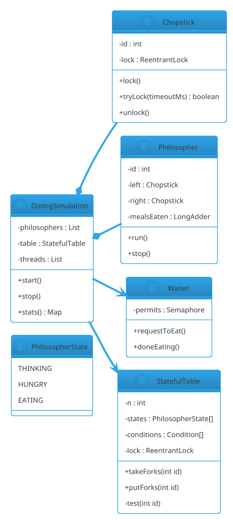

# Dining Philosophers

## Problem Statement

Design a solution to the **Dining Philosophers** problem — five philosophers sit at a round table with a bowl of rice and five chopsticks, one between each pair. A philosopher alternates between thinking and eating. To eat, they need **both** adjacent chopsticks. The challenge: design a protocol that lets each philosopher eat eventually **without deadlock, without livelock, and with fairness**.

This is the **canonical deadlock-prevention problem**. It's small enough to reason about fully, but its solution exposes deep concurrency techniques: **lock ordering, resource hierarchy, bounded waiting, waiter prioritization, and asymmetric solutions**.

**Reused primitives (see reference files):**
- Concurrency overview: `concurrency-basics.md` §3-8
- `ReentrantLock`, `Semaphore`, `Condition`: `concurrency-basics.md` §3.2, §3.5
- Deadlock detection + prevention: `concurrency-basics.md` §8.1
- Thread Pool patterns: `24-thread-pool.md` §4.1

**New concepts unique to this problem:**
1. **Circular wait** — the classic deadlock condition
2. **Lock ordering** — global order to break circular wait
3. **Resource hierarchy** — number the chopsticks
4. **Waiter / arbitrator** — a central coordinator
5. **Asymmetric solution** — one philosopher picks up right first
6. **Bounded waiting** — no starvation
7. **Concurrency limit** — 4 philosophers max at table
8. **Chandy-Misra** — distributed solution with message passing

---

## 1. Requirements

### Functional

- **5 philosophers**, **5 chopsticks** (one between each pair)
- Each philosopher alternates: **think** → **hungry** → **eat** → **think**
- To eat, philosopher acquires **left** and **right** chopsticks
- Chopsticks are **exclusive** — only one philosopher holds each at a time
- After eating, release both
- Run **indefinitely** without deadlock
- **Fair**: every hungry philosopher eventually eats

### Non-Functional

- **No deadlock** — even under arbitrary scheduling
- **No livelock** — no infinite retry loops without progress
- **No starvation** — bounded wait for every philosopher
- **Efficiency** — high throughput when eating is possible
- **Observable** — count meals per philosopher
- **Testable** — deterministic shutdown

### Out of Scope

- Distributed philosophers (across processes)
- Priority philosophers
- Variable eating time (assume bounded)
- Physics (chopstick weight, arm reach)

---

## 2. Use Cases (brief)

| # | Use Case | Actor |
|---|---|---|
| UC1 | Philosopher thinks | Philosopher |
| UC2 | Philosopher becomes hungry | Philosopher |
| UC3 | Philosopher acquires chopsticks | Philosopher |
| UC4 | Philosopher eats | Philosopher |
| UC5 | Philosopher releases chopsticks | Philosopher |
| UC6 | Monitor throughput | Observer |
| UC7 | Stop the simulation | Owner |

---

## 3. Core Entities (delta)

**New entities:**

| Entity | Responsibility |
|---|---|
| `Chopstick` | A lockable resource |
| `Philosopher` | A thread that thinks/eats |
| `Table` | Coordinates philosophers + chopsticks |
| `Arbitrator` | Central coordinator (waiter solution) |
| `Waiter` | Alternative name for arbitrator |
| `DeadlockDetector` | Optional monitor |

**Enums:**

| Enum | Values |
|---|---|
| `PhilosopherState` | THINKING, HUNGRY, EATING |

**Interfaces:**

| Interface | Implementations |
|---|---|
| `PhilosopherProtocol` | `LockOrderProtocol`, `ArbitratorProtocol`, `AsymmetricProtocol`, `ChandyMisraProtocol` |
| `Chopstick` | `ReentrantChopstick`, `SemaphoreChopstick` |

---

## 4. What's New — the Five Solutions

### 4.1 The Broken Naive Solution

**The bug:** each philosopher picks up left, then right. Under a specific interleaving, all five pick up their left chopstick simultaneously — and each waits for their right, held by their neighbor. **Circular wait = deadlock.**

```java
// BROKEN
public void eat() {
    chopsticks[left()].lock();
    chopsticks[right()].lock();    // DEADLOCK if every philosopher is at this line
    // eat
    chopsticks[right()].unlock();
    chopsticks[left()].unlock();
}
```

**Why it deadlocks:** all five conditions of Coffman hold:
1. **Mutual exclusion** — chopsticks are exclusive
2. **Hold and wait** — philosophers hold one while waiting for another
3. **No preemption** — chopsticks can't be taken
4. **Circular wait** — philosopher 0 waits for 1's left, 1 for 2's left, ..., 4 for 0's left

**Break any one → no deadlock.**

### 4.2 Solution A — Lock Ordering (Resource Hierarchy)

Number the chopsticks 0..4. Every philosopher acquires the **lower-numbered chopstick first**. For philosopher `i`, this means:
- If `i == 4` (last philosopher): right is 0, left is 4 → acquire **right** (0) first
- Otherwise: acquire **left** (i) first, then **right** (i+1)

**Why it works:** the ordering breaks circular wait. All philosophers try to acquire chopsticks in the same global order. The last philosopher (who would otherwise create the cycle) uses the reversed order.

```java
public final class Chopstick {
    private final int id;
    private final java.util.concurrent.locks.ReentrantLock lock = new java.util.concurrent.locks.ReentrantLock(true);

    public Chopstick(int id) { this.id = id; }
    public int id() { return id; }

    public void lock() { lock.lock(); }
    public boolean tryLock(long timeoutMillis) throws InterruptedException {
        return lock.tryLock(timeoutMillis, java.util.concurrent.TimeUnit.MILLISECONDS);
    }
    public void unlock() { lock.unlock(); }
}
```

```java
public final class OrderedPhilosopher implements Runnable {

    private final int id;
    private final Chopstick left;
    private final Chopstick right;
    private final java.util.concurrent.atomic.LongAdder mealsEaten;
    private volatile boolean running = true;

    public OrderedPhilosopher(int id, Chopstick left, Chopstick right,
                              java.util.concurrent.atomic.LongAdder mealsEaten) {
        this.id = id;
        this.left = left;
        this.right = right;
        this.mealsEaten = mealsEaten;
    }

    public void stop() { running = false; }

    @Override
    public void run() {
        while (running) {
            think();
            eat();
        }
    }

    private void think() {
        try { Thread.sleep(50); } catch (InterruptedException e) { Thread.currentThread().interrupt(); }
    }

    private void eat() {
        // Acquire in a global order: lower chopstick id first
        Chopstick first = (left.id() < right.id()) ? left : right;
        Chopstick second = (first == left) ? right : left;

        first.lock();
        try {
            second.lock();
            try {
                mealsEaten.increment();
            } finally {
                second.unlock();
            }
        } finally {
            first.unlock();
        }
    }
}
```

**Pros:** simple, no central coordinator, no starvation (fair locks), decentralized.
**Cons:** requires global ordering; in distributed settings, agreeing on order is hard.

### 4.3 Solution B — Arbitrator / Waiter

Introduce a **waiter** (or arbiter) that ensures at most **N-1** philosophers try to eat at once. With 4 philosophers, at least one has both chopsticks free — no deadlock possible.

```java
public final class Waiter {
    private final java.util.concurrent.Semaphore permits;

    public Waiter(int n) {
        // Allow at most n-1 to compete for chopsticks
        this.permits = new java.util.concurrent.Semaphore(n - 1, true);
    }

    public void requestToEat() throws InterruptedException {
        permits.acquire();
    }

    public void doneEating() {
        permits.release();
    }
}
```

```java
public final class WaiterPhilosopher implements Runnable {

    private final int id;
    private final Chopstick left;
    private final Chopstick right;
    private final Waiter waiter;
    private final java.util.concurrent.atomic.LongAdder mealsEaten;
    private volatile boolean running = true;

    public WaiterPhilosopher(int id, Chopstick left, Chopstick right, Waiter waiter,
                             java.util.concurrent.atomic.LongAdder mealsEaten) {
        this.id = id;
        this.left = left;
        this.right = right;
        this.waiter = waiter;
        this.mealsEaten = mealsEaten;
    }

    public void stop() { running = false; }

    @Override
    public void run() {
        while (running) {
            think();
            try {
                waiter.requestToEat();
                try {
                    left.lock();
                    try {
                        right.lock();
                        try {
                            mealsEaten.increment();
                        } finally { right.unlock(); }
                    } finally { left.unlock(); }
                } finally {
                    waiter.doneEating();
                }
            } catch (InterruptedException e) {
                Thread.currentThread().interrupt();
                return;
            }
        }
    }

    private void think() {
        try { Thread.sleep(50); } catch (InterruptedException e) { Thread.currentThread().interrupt(); }
    }
}
```

**Why it works:** with at most 4 philosophers competing for 5 chopsticks, at least one chopstick is always free. So at least one philosopher can acquire both — no circular wait.

**Pros:** simple; decentralized enough.
**Cons:** introduces a central point; can reduce parallelism (only 4 out of 5 can try).

### 4.4 Solution C — Asymmetric

Make **one philosopher (say #0)** acquire **right first, then left**. All others acquire **left then right**.

**Why it works:** philosopher #0 tries the opposite order from their neighbors, so a cycle can't form.

```java
public final class AsymmetricPhilosopher implements Runnable {
    private final int id;
    private final Chopstick left;
    private final Chopstick right;
    private final java.util.concurrent.atomic.LongAdder mealsEaten;
    private volatile boolean running = true;

    public AsymmetricPhilosopher(int id, Chopstick left, Chopstick right,
                                 java.util.concurrent.atomic.LongAdder mealsEaten) {
        this.id = id;
        this.left = left;
        this.right = right;
        this.mealsEaten = mealsEaten;
    }

    public void stop() { running = false; }

    @Override
    public void run() {
        while (running) {
            think();
            eat();
        }
    }

    private void eat() {
        if (id == 0) {
            // Asymmetric: pick right first
            right.lock();
            try {
                left.lock();
                try { mealsEaten.increment(); }
                finally { left.unlock(); }
            } finally { right.unlock(); }
        } else {
            left.lock();
            try {
                right.lock();
                try { mealsEaten.increment(); }
                finally { right.unlock(); }
            } finally { left.unlock(); }
        }
    }

    private void think() {
        try { Thread.sleep(50); } catch (InterruptedException e) { Thread.currentThread().interrupt(); }
    }
}
```

**Pros:** no central coordinator; simplest code.
**Cons:** asymmetric (one philosopher is "special"); slightly less elegant.

### 4.5 Solution D — Chandy-Misra (Distributed)

Used when philosophers are on different machines. Uses **message passing** — no shared chopsticks.

**Setup:**
- Each chopstick has a **dirty** or **clean** state
- A hungry philosopher sends "request" messages to neighbors
- If neighbor holds the chopstick and it's **dirty** (used since last cleaned), they **give it up**
- If **clean**, they hold it and add the requester to a queue

**Why it works:** a philosopher can hold a chopstick only if it hasn't used it since receiving it. This breaks the cycle by ensuring the chopstick "travels" between neighbors.

**For LLD:** describe it; full implementation is beyond scope. This is a **distributed** solution — useful when chopsticks aren't shareable memory.

### 4.6 Solution E — Condition Variable with State

Each philosopher has a state (`THINKING`, `HUNGRY`, `EATING`). A philosopher can eat only if both neighbors aren't eating.

```java
public final class StatefulTable {

    private final int n;
    private final PhilosopherState[] states;
    private final java.util.concurrent.locks.ReentrantLock lock = new java.util.concurrent.locks.ReentrantLock();
    private final java.util.concurrent.locks.Condition[] conditions;

    public StatefulTable(int n) {
        this.n = n;
        this.states = new PhilosopherState[n];
        this.conditions = new java.util.concurrent.locks.Condition[n];
        for (int i = 0; i < n; i++) {
            states[i] = PhilosopherState.THINKING;
            conditions[i] = lock.newCondition();
        }
    }

    public void takeForks(int id) throws InterruptedException {
        lock.lock();
        try {
            states[id] = PhilosopherState.HUNGRY;
            test(id);
            while (states[id] != PhilosopherState.EATING) {
                conditions[id].await();
            }
        } finally {
            lock.unlock();
        }
    }

    public void putForks(int id) {
        lock.lock();
        try {
            states[id] = PhilosopherState.THINKING;
            test(left(id));
            test(right(id));
        } finally {
            lock.unlock();
        }
    }

    /** If id is hungry and both neighbors are not eating, let them eat. */
    private void test(int id) {
        if (states[id] == PhilosopherState.HUNGRY
                && states[left(id)] != PhilosopherState.EATING
                && states[right(id)] != PhilosopherState.EATING) {
            states[id] = PhilosopherState.EATING;
            conditions[id].signal();
        }
    }

    private int left(int id) { return (id + n - 1) % n; }
    private int right(int id) { return (id + 1) % n; }
}
```

**Why it works:** a philosopher eats only if both neighbors aren't eating. This is guaranteed to make progress — the classical "monitor" solution (Dijkstra).

**Pros:** no busy-waiting; elegant; no asymmetric case; generalizes to any N.
**Cons:** all coordination goes through one lock + conditions; slightly less decentralized than `ReentrantLock` per chopstick.

**This is the "textbook" solution** and the one most commonly expected in LLD discussions. It's the same pattern as the Producer-Consumer two-condition design, but with multiple wait sets.

### 4.7 Comparison

| Solution | Deadlock-Free | Starvation-Free | Decentralized | Code Complexity |
|---|---|---|---|---|
| Naive | ❌ | ❌ | ✅ | Trivial |
| Lock ordering | ✅ | ✅ (fair locks) | ✅ | Low |
| Arbitrator | ✅ | ✅ | ❌ (central) | Low |
| Asymmetric | ✅ | ✅ | ✅ | Low |
| Chandy-Misra | ✅ | ✅ | ✅ | High (distributed) |
| Stateful monitor | ✅ | ✅ | Partial | Medium |

**Recommendation:**
- **Simple in-process:** lock ordering (Solution A)
- **Textbook:** stateful monitor (Solution E)
- **Distributed:** Chandy-Misra

---

## 5. Class Diagram (delta)



---

## 6. Java Implementation (support pieces)

### 6.1 StatefulTable Philosopher

```java
public final class StatefulPhilosopher implements Runnable {

    private final int id;
    private final StatefulTable table;
    private final java.util.concurrent.atomic.LongAdder mealsEaten;
    private volatile boolean running = true;

    public StatefulPhilosopher(int id, StatefulTable table,
                               java.util.concurrent.atomic.LongAdder mealsEaten) {
        this.id = id;
        this.table = table;
        this.mealsEaten = mealsEaten;
    }

    public void stop() { running = false; }

    @Override
    public void run() {
        while (running) {
            think();
            try {
                table.takeForks(id);
                try { mealsEaten.increment(); }
                finally { table.putForks(id); }
            } catch (InterruptedException e) {
                Thread.currentThread().interrupt();
                return;
            }
        }
    }

    private void think() {
        try { Thread.sleep(20); } catch (InterruptedException e) { Thread.currentThread().interrupt(); }
    }
}
```

### 6.2 Simulation

```java
public final class DiningSimulation {

    private final java.util.List<Thread> threads = new java.util.ArrayList<>();
    private final java.util.List<StatefulPhilosopher> philosophers = new java.util.ArrayList<>();
    private final java.util.Map<Integer, java.util.concurrent.atomic.LongAdder> meals = new java.util.concurrent.ConcurrentHashMap<>();

    public DiningSimulation(int n) {
        StatefulTable table = new StatefulTable(n);
        for (int i = 0; i < n; i++) {
            var mealsEaten = new java.util.concurrent.atomic.LongAdder();
            meals.put(i, mealsEaten);
            var p = new StatefulPhilosopher(i, table, mealsEaten);
            philosophers.add(p);
            threads.add(new Thread(p, "philosopher-" + i));
        }
    }

    public void start() { threads.forEach(Thread::start); }

    public void stop() throws InterruptedException {
        philosophers.forEach(StatefulPhilosopher::stop);
        for (Thread t : threads) t.interrupt();
        for (Thread t : threads) t.join(5000);
    }

    public java.util.Map<Integer, Long> stats() {
        java.util.Map<Integer, Long> out = new java.util.HashMap<>();
        meals.forEach((k, v) -> out.put(k, v.sum()));
        return out;
    }
}
```

### 6.3 Demo

```java
public class Demo {
    public static void main(String[] args) throws InterruptedException {
        DiningSimulation sim = new DiningSimulation(5);
        sim.start();

        Thread.sleep(3000);

        sim.stop();
        System.out.println("Meals per philosopher: " + sim.stats());
    }
}
```

**Expected output (approximately):**
```
Meals per philosopher: {0=42, 1=41, 2=43, 3=42, 4=42}
```

All philosophers eat roughly the same number of times — no starvation.

---

## 7. Concurrency Considerations

Reused from `concurrency-basics.md`:
- `ReentrantLock` for chopsticks
- `Condition` for waiting
- `Semaphore` for arbitrator
- `while` loop on condition

**New to Dining Philosophers:**

- **Circular wait is the failure mode** — break it via ordering, arbitration, or asymmetry.
- **Coffman conditions** — all four must hold for deadlock. Break any one.
- **Lock ordering is the simplest fix** — but requires global agreement.
- **Fair locks prevent starvation** — `new ReentrantLock(true)`. Without fairness, a philosopher may never win the race.
- **Condition-based solutions avoid per-chopstick locks** — a single table lock with per-philosopher conditions is more compact.
- **Spurious wakeups** — always loop (`while (!canEat) condition.await()`).
- **Interrupt during wait** — `await` throws `InterruptedException`; restore interrupt flag.
- **The `test` method pattern** — check neighbors' states, signal if eligible. Same pattern as Producer-Consumer.
- **No busy-waiting** — condition variables sleep the thread.
- **Shutdown** — set a `running` flag, interrupt threads, join with timeout.

### Testing

```java
@Test
void allPhilosophersEatWithoutDeadlock() throws InterruptedException {
    DiningSimulation sim = new DiningSimulation(5);
    sim.start();
    Thread.sleep(2000);
    sim.stop();

    var stats = sim.stats();
    // Every philosopher should have eaten at least once
    stats.forEach((id, meals) -> assertTrue(meals > 0, "Philosopher " + id + " starved"));
    // No philosopher should be wildly ahead (starving others)
    long max = stats.values().stream().mapToLong(Long::longValue).max().orElse(0);
    long min = stats.values().stream().mapToLong(Long::longValue).min().orElse(0);
    assertTrue(max - min <= 10, "Starvation suspected: max=" + max + " min=" + min);
}

@Test
void lockOrderingAvoidsDeadlock() throws InterruptedException {
    // Same test but with lock-ordering philosophers
    // Assert: no deadlock, roughly equal meals
}

@Test
void arbitratorLimitsConcurrentEaters() {
    // 5 philosophers, arbitrator with 4 permits
    // Verify at most 4 philosophers are in the "eating" state at any time
}
```

**Deadlock detection in test:** use a `ScheduledExecutorService` that fails the test if no progress is made within a timeout.

---

## 8. Extensibility

| Feature | Change |
|---|---|
| Variable number of philosophers | Parameterize N |
| Priority philosophers | Weighted arbitrator or priority queue |
| Variable eating time | Random sleep |
| Distributed (Chandy-Misra) | Message-passing protocol |
| Metrics per philosopher | Track think/eat time |
| Deadlock detection | Watchdog that checks for lack of progress |
| Fairness guarantees | Fair locks or FIFO arbitrator |
| Adaptive (learned patterns) | ML-predicted eating schedule |

---

## 9. Common Pitfalls

| Pitfall | Fix |
|---|---|
| Naive left-then-right acquire | Circular wait → deadlock |
| `if` instead of `while` on condition | Spurious wakeups |
| Not restoring interrupt flag | `Thread.currentThread().interrupt()` |
| Unfair locks under heavy load | Use `new ReentrantLock(true)` |
| Holding lock during think() | Never; lock only for eating |
| Not releasing lock in `finally` | Deadlock on next acquire |
| Forgetting to signal neighbors after eating | `test(left)` and `test(right)` |
| Busy-waiting on state | Use `Condition.await` |
| Assuming progress without fairness | A philosopher may starve |
| Not capping `Semaphore` to `n-1` | Deadlock remains possible |
| Arbitrator permits > n-1 | Same as naive |
| Asymmetric but wrong direction | Must be opposite of neighbors |

---

## 10. Follow-ups

### Q1: Why does `N-1` work for the arbitrator?

**Answer:** With 5 chopsticks and at most 4 philosophers competing, at least one chopstick is **always free**. So at least one philosopher can acquire both their chopsticks. No circular wait is possible, because a circular wait requires every philosopher to be blocked waiting for a neighbor — which requires 5 philosophers competing.

### Q2: What are the Coffman conditions?

**Answer:** Four conditions required for deadlock:
1. **Mutual exclusion** — resources can't be shared.
2. **Hold and wait** — a process holds a resource while waiting for another.
3. **No preemption** — resources can't be forcibly taken.
4. **Circular wait** — a cycle of waiting processes.

Break any one and deadlock is impossible.
- Mutual exclusion: shareable resources (not applicable to chopsticks).
- Hold and wait: acquire all at once (`tryLock` both, else release).
- No preemption: allow taking (not practical).
- Circular wait: **lock ordering** — the most practical fix.

### Q3: Is lock ordering always possible?

**Answer:** No. In distributed systems without a global view, ordering can't be agreed on. Chandy-Misra solves this without a global order.

In-process with fixed resource IDs, ordering is easy. In-process with dynamic resources, sort by some stable ID.

### Q4: How do you test for deadlock in a unit test?

**Answer:** Start the simulation, wait a bounded time (say 5 s), then check that each philosopher has made progress (incremented their meal counter). If any philosopher is stuck at zero, the test fails with a timeout.

Use `ScheduledExecutorService` to enforce the timeout:

```java
var scheduler = java.util.concurrent.Executors.newSingleThreadScheduledExecutor();
var future = scheduler.schedule(() -> fail("Deadlock suspected"), 5, TimeUnit.SECONDS);
// ... run simulation ...
future.cancel(false);
```

### Q5: How do you extend to K forks per philosopher?

**Answer:** Generalize the state machine: a philosopher is eligible to eat if all K required forks are available. The `test()` method checks K neighbors instead of 2. Lock ordering or arbitrator generalizes too.

For LLD, K=2 is enough; the pattern extends.

### Q6: How does this differ from Producer-Consumer?

**Answer:**
- **Producer-Consumer:** two roles, one shared buffer, wait/signal on fullness/emptiness.
- **Dining Philosophers:** five identical roles, five shared resources, need to prevent circular wait.

Both use `Condition` + state. Dining Philosophers has more resources and requires **coordination among peers**, not between producers and consumers.

### Q7: What about fairness in the arbitrator solution?

**Answer:** `Semaphore(n-1, true)` gives FIFO ordering to permit acquisition. Combined with fair chopstick locks, this ensures every philosopher eventually eats. Without fairness, a philosopher may repeatedly lose the race and starve.

---

## 11. Similar Problems

- **Rate Limiter (LLD #21)** — bounded resource with concurrent access
- **Thread-Safe LRU Cache (LLD #23)** — coordinating access to shared state
- **Thread Pool (LLD #24)** — worker coordination
- **Reader-Writer Lock (LLD #25)** — shared/exclusive access
- **Distributed Lock (HLD #04)** — cross-process coordination

Dining Philosophers' unique additions: **circular wait**, **lock ordering**, **arbitrator**, **asymmetry**, **monitor with conditions**, **deadlock-free protocols**.

---

## 12. Key Takeaways

- **Coffman conditions** — mutual exclusion, hold and wait, no preemption, circular wait — all four needed for deadlock. Break one.
- **Circular wait is the practical target** — lock ordering fixes it.
- **Lock ordering** — acquire lower-numbered chopstick first; last philosopher reverses.
- **Arbitrator with N-1 permits** — guarantees at least one philosopher can eat; simple.
- **Asymmetric** — one philosopher picks right first; simplest.
- **Stateful monitor** — one lock, per-philosopher conditions, `test()` on neighbors.
- **Chandy-Misra** — distributed; no shared memory; message passing.
- **Fair locks** — prevent starvation; `ReentrantLock(true)`, `Semaphore(n, true)`.
- **`while` on condition** — no `if`; spurious wakeups exist.
- **Interrupt-handling** — restore flag on `InterruptedException`.
- **Test with timeout** — a watchdog catches deadlock.
- **No busy-waiting** — use `Condition.await`.
- **Never hold locks during think()** — only during the critical section.
- **Simulate before asserting** — a short run + meal counter check catches most bugs.

### The Generalizable Recipe

For any **deadlock-prevention / resource-contention** problem:

1. **Identify all four Coffman conditions**
2. **Break one** — usually circular wait
3. **Lock ordering** — for in-process, fixed-ID resources
4. **Arbitrator / semaphore** — for N-1 access
5. **Asymmetry** — for elegant decentralized fix
6. **Monitor with conditions** — for general N-way coordination
7. **Message passing** — for distributed
8. **Fair locks** — prevent starvation
9. **`while` loop on condition** — spurious wakeups
10. **`tryLock(timeout)`** — bounded wait
11. **Interrupt handling** — restore flag
12. **Watchdog** — detect deadlock in tests
13. **Progress metric** — count completed cycles per actor

This skeleton plus the condition/lock primitives from `concurrency-basics.md` solves: Dining Philosophers, Bank Account Transfers, Resource Allocation, Distributed Transactions, Multi-Resource Locking, Deadlock-Free Databases — with variations in number of resources, distributed vs in-process, and fairness requirements.