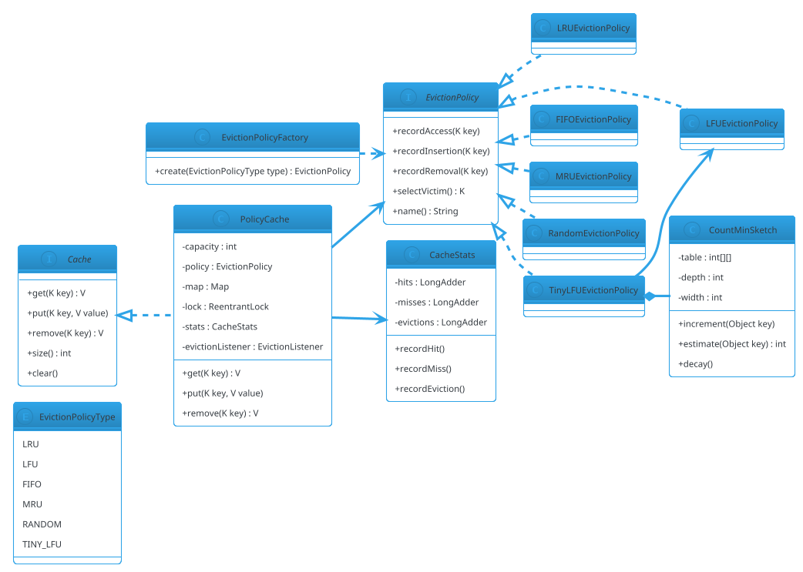

# Cache with Eviction Policies

## Problem Statement

Design a **cache** that supports multiple **eviction policies** — LRU, LFU, FIFO, MRU, Random, and TinyLFU — behind a common interface. Callers configure the policy at construction; the cache applies it uniformly. The design must be **thread-safe**, **extensible** (new policies added without modifying the cache), and **observable** (hit/miss/eviction metrics).

This generalizes the Thread-Safe LRU Cache (`23-lru-cache.md`) from one policy to many. Where `23` was about **concurrency of a single algorithm**, `27` is about **abstracting over algorithms** — a Strategy pattern applied to cache eviction.

**Reused primitives (see reference files):**
- Thread-Safe LRU Cache: `23-lru-cache.md` (§4.1 doubly-linked list + hash map, §4.2 synchronized, §4.3 striped)
- Strategy pattern: `design-patterns/behavioral.md` §1
- Factory pattern: `design-patterns/creational.md` §2
- Concurrency overview: `concurrency-basics.md` §3-5

**New concepts unique to this problem:**
1. **Eviction policy abstraction** — pluggable algorithm
2. **Policy-specific data structures** — heap (LFU), queue (FIFO), linked list (LRU)
3. **Admission policies** — TinyLFU admits only if frequency beats the victim
4. **Frequency sketches** — Count-Min Sketch for LFU (memory-efficient)
5. **Weight-based capacity** — evict by total weight, not count
6. **Eviction listeners** — callbacks outside the lock
7. **Statistics** — hits, misses, evictions, per-policy metrics

---

## 1. Requirements

### Functional

- **Common cache API**: `get`, `put`, `remove`, `size`, `clear`
- **Pluggable eviction policy**: LRU, LFU, FIFO, MRU, Random, TinyLFU
- **Capacity**: by entry count (weight-based as extension)
- **Eviction callback**: invoked on eviction
- **Statistics**: hits, misses, evictions
- **Thread-safe**: concurrent reads and writes

### Non-Functional

- **O(1) or O(log n)** per operation, depending on policy
- **Correct under concurrency**: no lost updates, no corruption
- **Extensible**: new policy without touching `Cache`
- **Bounded memory**: no unbounded growth
- **Observable**: metrics for tuning
- **Low overhead**: uncontended get/put < 200 ns

### Out of Scope

- Persistence / disk-backed cache
- TTL (mention as extension; see `23-lru-cache.md` §4.8)
- Distributed cache (Redis, HLD #07)
- Multi-level cache (L1 + L2)
- Async loading / refresh (mention as `LoadingCache`)

---

## 2. Use Cases (brief)

| # | Use Case | Actor |
|---|---|---|
| UC1 | Configure cache with policy | Admin |
| UC2 | Cache lookup (get) | Caller |
| UC3 | Cache insert (put) | Caller |
| UC4 | Policy-driven eviction | Cache |
| UC5 | Eviction callback | Caller |
| UC6 | Monitor stats | Monitoring |
| UC7 | Swap policy at runtime (optional) | Admin |

---

## 3. Core Entities (delta)

**New entities:**

| Entity | Responsibility |
|---|---|
| `Cache<K, V>` | Common interface |
| `PolicyCache<K, V>` | Cache that delegates eviction to a policy |
| `EvictionPolicy<K>` | Abstract policy: `recordAccess`, `recordInsertion`, `selectVictim` |
| `LRUEvictionPolicy` | Least Recently Used |
| `LFUEvictionPolicy` | Least Frequently Used |
| `FIFOEvictionPolicy` | First In, First Out |
| `MRUEvictionPolicy` | Most Recently Used |
| `RandomEvictionPolicy` | Uniform random |
| `TinyLFUEvictionPolicy` | Admission-filter + LFU (approximate) |
| `CacheStats` | Hit/miss/eviction counters |
| `EvictionListener<K, V>` | Callback |

**Enums:**

| Enum | Values |
|---|---|
| `EvictionPolicyType` | LRU, LFU, FIFO, MRU, RANDOM, TINY_LFU |

**Interfaces:**

| Interface | Implementations |
|---|---|
| `EvictionPolicy<K>` | Six built-in policies |
| `Cache<K, V>` | `PolicyCache` |
| `EvictionListener<K, V>` | User-provided |

---

## 4. What's New — Policy Abstraction + Five Policies

### 4.1 The Eviction Policy Interface

The core abstraction. Every policy answers three questions:

```java
public interface EvictionPolicy<K> {

    /** Called after a successful get or update. */
    void recordAccess(K key);

    /** Called after a new entry is inserted. */
    void recordInsertion(K key);

    /** Called after an entry is explicitly removed (not evicted). */
    void recordRemoval(K key);

    /** Return the key that should be evicted next, or null if none. */
    K selectVictim();

    /** Human-readable name for metrics. */
    String name();
}
```

**Design decisions:**
- **`selectVictim` returns a key, not the entry** — the policy doesn't own values.
- **No `onEviction` method** — the cache removes the victim from its own map and invokes listeners.
- **`recordAccess` and `recordInsertion` are separate** — LRU doesn't care about insertion order; FIFO doesn't care about access.
- **`recordRemoval`** — for policies that track per-key state (LFU frequencies, etc.), so they can clean up.

**Why this shape:**
- Policy is **stateless w.r.t. values** — only tracks keys and metadata.
- Cache owns the map and the lock; policy is a pure algorithmic helper.
- The cache can swap policies at runtime if it re-initializes policy state from the map.

### 4.2 The Policy Cache

```java
public final class PolicyCache<K, V> implements Cache<K, V> {

    private final int capacity;
    private final EvictionPolicy<K> policy;
    private final java.util.Map<K, V> map;
    private final java.util.concurrent.locks.ReentrantLock lock = new java.util.concurrent.locks.ReentrantLock();
    private final CacheStats stats = new CacheStats();
    private final EvictionListener<K, V> evictionListener;

    public PolicyCache(int capacity, EvictionPolicy<K> policy,
                       EvictionListener<K, V> evictionListener) {
        if (capacity <= 0) throw new IllegalArgumentException("capacity must be > 0");
        this.capacity = capacity;
        this.policy = policy;
        this.evictionListener = evictionListener;
        this.map = new java.util.HashMap<>(capacity * 2);
    }

    @Override
    public V get(K key) {
        lock.lock();
        try {
            V value = map.get(key);
            if (value == null) {
                stats.recordMiss();
                return null;
            }
            policy.recordAccess(key);
            stats.recordHit();
            return value;
        } finally {
            lock.unlock();
        }
    }

    @Override
    public void put(K key, V value) {
        K evictedKey = null;
        V evictedValue = null;

        lock.lock();
        try {
            if (map.containsKey(key)) {
                map.put(key, value);
                policy.recordAccess(key);
                return;
            }

            if (map.size() >= capacity) {
                evictedKey = policy.selectVictim();
                if (evictedKey != null) {
                    evictedValue = map.remove(evictedKey);
                    if (evictedValue != null) {
                        policy.recordRemoval(evictedKey);
                        stats.recordEviction();
                    } else {
                        evictedKey = null;
                    }
                }
            }

            map.put(key, value);
            policy.recordInsertion(key);
        } finally {
            lock.unlock();
        }

        // Listener outside the lock
        if (evictedKey != null && evictionListener != null) {
            evictionListener.onEvict(evictedKey, evictedValue);
        }
    }

    @Override
    public V remove(K key) {
        lock.lock();
        try {
            V old = map.remove(key);
            if (old != null) policy.recordRemoval(key);
            return old;
        } finally {
            lock.unlock();
        }
    }

    @Override
    public int size() {
        lock.lock();
        try { return map.size(); }
        finally { lock.unlock(); }
    }

    @Override
    public void clear() {
        lock.lock();
        try {
            map.clear();
            // Policy cleanup handled by re-creating; or provide policy.reset()
        } finally {
            lock.unlock();
        }
    }

    public CacheStats stats() { return stats; }
}
```

**Key decisions:**
- **Policy is called under the lock** — its state is not thread-safe by itself; the cache synchronizes.
- **Eviction listener invoked outside the lock** — avoids user code under lock.
- **Cache owns the map** — the policy doesn't know about values.
- **Single lock** — same as `SynchronizedLRUCache`. For striping, see `23-lru-cache.md` §4.3; a striped cache uses multiple `PolicyCache` instances.

### 4.3 Policy 1 — LRU (Least Recently Used)

Track access order via a doubly-linked list. Move node to head on access; victim is the tail.

```java
public final class LRUEvictionPolicy<K> implements EvictionPolicy<K> {

    private final java.util.Map<K, Node<K>> nodes = new java.util.HashMap<>();
    private final Node<K> head = new Node<>(null);   // MRU sentinel
    private final Node<K> tail = new Node<>(null);   // LRU sentinel

    public LRUEvictionPolicy() {
        head.next = tail;
        tail.prev = head;
    }

    @Override
    public void recordAccess(K key) {
        Node<K> n = nodes.get(key);
        if (n != null) moveToHead(n);
    }

    @Override
    public void recordInsertion(K key) {
        Node<K> n = new Node<>(key);
        nodes.put(key, n);
        addToHead(n);
    }

    @Override
    public void recordRemoval(K key) {
        Node<K> n = nodes.remove(key);
        if (n != null) removeNode(n);
    }

    @Override
    public K selectVictim() {
        return tail.prev == head ? null : tail.prev.key;
    }

    @Override public String name() { return "LRU"; }

    // ---- linked list helpers ----
    private void addToHead(Node<K> n) { /* ... */ }
    private void removeNode(Node<K> n) { /* ... */ }
    private void moveToHead(Node<K> n) { removeNode(n); addToHead(n); }

    private static final class Node<K> {
        K key;
        Node<K> prev, next;
        Node(K key) { this.key = key; }
    }
}
```

**Complexity:** O(1) for all operations.

### 4.4 Policy 2 — LFU (Least Frequently Used)

Track an access count per key. Victim is the key with the smallest count. Ties broken by LRU (least recently used among least frequent).

**Naive LFU** — O(n) victim selection (scan for min). **Optimized LFU** — O(1) with a per-frequency doubly-linked list.

For LLD, we implement the **optimized O(1) LFU**:

```java
public final class LFUEvictionPolicy<K> implements EvictionPolicy<K> {

    private final java.util.Map<K, Entry<K>> entries = new java.util.HashMap<>();
    private final java.util.Map<Long, FreqList<K>> freqLists = new java.util.HashMap<>();
    private long minFreq = 0;

    @Override
    public void recordAccess(K key) {
        Entry<K> e = entries.get(key);
        if (e == null) return;
        long oldFreq = e.freq;
        e.freq++;
        FreqList<K> oldList = freqLists.get(oldFreq);
        oldList.remove(e);
        if (oldList.isEmpty()) {
            freqLists.remove(oldFreq);
            if (minFreq == oldFreq) minFreq++;
        }
        FreqList<K> newList = freqLists.computeIfAbsent(e.freq, f -> new FreqList<>());
        newList.addFirst(e);
    }

    @Override
    public void recordInsertion(K key) {
        Entry<K> e = new Entry<>(key, 1);
        entries.put(key, e);
        freqLists.computeIfAbsent(1L, f -> new FreqList<>()).addFirst(e);
        minFreq = 1;
    }

    @Override
    public void recordRemoval(K key) {
        Entry<K> e = entries.remove(key);
        if (e != null) {
            FreqList<K> list = freqLists.get(e.freq);
            if (list != null) {
                list.remove(e);
                if (list.isEmpty()) freqLists.remove(e.freq);
            }
        }
    }

    @Override
    public K selectVictim() {
        FreqList<K> list = freqLists.get(minFreq);
        return (list == null || list.isEmpty()) ? null : list.tail.key;
    }

    @Override public String name() { return "LFU"; }

    private static final class Entry<K> {
        K key;
        long freq;
        Entry<K> prev, next;
        Entry(K key, long freq) { this.key = key; this.freq = freq; }
    }

    private static final class FreqList<K> {
        final Entry<K> head = new Entry<>(null, 0);
        final Entry<K> tail = new Entry<>(null, 0);
        FreqList() { head.next = tail; tail.prev = head; }
        boolean isEmpty() { return head.next == tail; }
        void addFirst(Entry<K> e) { /* insert after head */ }
        void remove(Entry<K> e) { /* unlink */ }
    }
}
```

**Complexity:** O(1) for all operations.
**Memory:** O(n) — one `Entry` per key, plus per-frequency lists.
**Tie-break:** within the min-frequency list, victim is the tail (LRU among least-frequent).

**LFU's weakness:** a once-popular item may hold onto a high frequency and never be evicted even when it's no longer used. Fix: **aging** — periodically decay frequencies. TinyLFU does this naturally.

### 4.5 Policy 3 — FIFO

Track insertion order. Victim is the oldest-inserted.

```java
public final class FIFOEvictionPolicy<K> implements EvictionPolicy<K> {

    private final java.util.Set<K> keys = java.util.Collections.newSetFromMap(new java.util.LinkedHashMap<>());

    @Override
    public void recordAccess(K key) {
        // FIFO ignores access
    }

    @Override
    public void recordInsertion(K key) {
        keys.add(key);
    }

    @Override
    public void recordRemoval(K key) {
        keys.remove(key);
    }

    @Override
    public K selectVictim() {
        var it = keys.iterator();
        return it.hasNext() ? it.next() : null;
    }

    @Override public String name() { return "FIFO"; }
}
```

**Complexity:** O(1) insertion/removal, O(1) victim (`LinkedHashMap` iteration order).
**Weakness:** ignores access frequency; a hot item may be evicted.

### 4.6 Policy 4 — MRU (Most Recently Used)

Inverse of LRU. Victim is the **most** recently accessed. Useful when the just-used item is unlikely to be reused.

```java
public final class MRUEvictionPolicy<K> implements EvictionPolicy<K> {

    // Same structure as LRU but victim is head.next instead of tail.prev
    private final LRUEvictionPolicy<K> lru = new LRUEvictionPolicy<>();

    @Override
    public void recordAccess(K key) { lru.recordAccess(key); }

    @Override
    public void recordInsertion(K key) { lru.recordInsertion(key); }

    @Override
    public void recordRemoval(K key) { lru.recordRemoval(key); }

    @Override
    public K selectVictim() {
        // Victim is the MRU (head.next) — reverse of LRU
        // Implemented via a mirrored LRUEvictionPolicy
        return lru.selectVictimMostRecent();
    }

    @Override public String name() { return "MRU"; }
}
```

**Better:** implement MRU directly with the same list but a different victim selector. Reuse the linked list, pick head instead of tail.

**Complexity:** O(1).
**Use case:** sequential scans where past is not predictive.

### 4.7 Policy 5 — Random

```java
public final class RandomEvictionPolicy<K> implements EvictionPolicy<K> {

    private final java.util.List<K> keys = new java.util.ArrayList<>();
    private final java.util.Map<K, Integer> index = new java.util.HashMap<>();
    private final java.util.Random rnd;

    public RandomEvictionPolicy(long seed) { this.rnd = new java.util.Random(seed); }

    @Override public void recordAccess(K key) { /* ignore */ }

    @Override
    public void recordInsertion(K key) {
        index.put(key, keys.size());
        keys.add(key);
    }

    @Override
    public void recordRemoval(K key) {
        Integer idx = index.remove(key);
        if (idx != null) {
            K last = keys.remove(keys.size() - 1);
            if (idx < keys.size()) {
                keys.set(idx, last);
                index.put(last, idx);
            }
        }
    }

    @Override
    public K selectVictim() {
        return keys.isEmpty() ? null : keys.get(rnd.nextInt(keys.size()));
    }

    @Override public String name() { return "RANDOM"; }
}
```

**Complexity:** O(1) with swap-removal trick.
**Use case:** uniform access patterns; simple baseline.

### 4.8 Policy 6 — TinyLFU (Admission Filter)

**The problem:** LRU degrades under scan workloads (one-time accesses evict hot items). LFU never forgets old frequencies. **TinyLFU** combines a frequency sketch with an admission policy:

- **Maintain a Count-Min Sketch** of access frequencies per key (approximate, memory-efficient).
- **On insertion**, if the cache is full, compare the new key's frequency against the victim's:
  - If new ≥ victim's frequency → admit new, evict victim.
  - Else → reject new (don't insert at all).
- Victim selection uses LFU within the main cache.

**Benefits:**
- Near-optimal hit rate (state of the art).
- O(1) memory per entry + a fixed-size sketch.
- Resistant to scan pollution.

**Simplified sketch:**

```java
public final class CountMinSketch {
    private final int[][] table;
    private final int depth;
    private final int width;
    private final long[] hashes;

    public CountMinSketch(int width, int depth) {
        this.width = width;
        this.depth = depth;
        this.table = new int[depth][width];
        this.hashes = new long[depth];
        var rnd = new java.util.Random(42);
        for (int i = 0; i < depth; i++) hashes[i] = rnd.nextLong();
    }

    public void increment(Object key) {
        int h = key.hashCode();
        for (int i = 0; i < depth; i++) {
            int idx = Math.abs((int) (hash(h, hashes[i]) % width));
            table[i][idx]++;
        }
    }

    public int estimate(Object key) {
        int h = key.hashCode();
        int min = Integer.MAX_VALUE;
        for (int i = 0; i < depth; i++) {
            int idx = Math.abs((int) (hash(h, hashes[i]) % width));
            min = Math.min(min, table[i][idx]);
        }
        return min;
    }

    /** Halve all counts; used for aging. */
    public void decay() {
        for (int[] row : table) for (int i = 0; i < row.length; i++) row[i] /= 2;
    }

    private long hash(int h, long salt) {
        long x = h ^ salt;
        x ^= (x >>> 33); x *= 0xff51afd7ed558ccdL;
        x ^= (x >>> 33);
        return x;
    }
}
```

```java
public final class TinyLFUEvictionPolicy<K> implements EvictionPolicy<K> {

    private final LFUEvictionPolicy<K> delegate = new LFUEvictionPolicy<>();
    private final CountMinSketch sketch;
    private final long decayInterval = 10_000;
    private long opCount = 0;

    public TinyLFUEvictionPolicy(int sketchWidth, int sketchDepth) {
        this.sketch = new CountMinSketch(sketchWidth, sketchDepth);
    }

    @Override
    public void recordAccess(K key) {
        sketch.increment(key);
        delegate.recordAccess(key);
        maybeDecay();
    }

    @Override
    public void recordInsertion(K key) {
        sketch.increment(key);
        delegate.recordInsertion(key);
        maybeDecay();
    }

    @Override
    public void recordRemoval(K key) {
        delegate.recordRemoval(key);
    }

    @Override
    public K selectVictim() {
        return delegate.selectVictim();
    }

    /** Should we admit key over the current victim? */
    public boolean shouldAdmit(K candidate, K victim) {
        if (victim == null) return true;
        return sketch.estimate(candidate) >= sketch.estimate(victim);
    }

    @Override public String name() { return "TINY_LFU"; }

    private void maybeDecay() {
        if (++opCount % decayInterval == 0) sketch.decay();
    }
}
```

**Integration with cache:** when the cache is full, `TinyLFUEvictionPolicy` exposes `shouldAdmit`. If false, the new key is rejected (not inserted). This requires a small change to the cache:

```java
if (policy instanceof TinyLFUEvictionPolicy<K> tiny) {
    K victim = tiny.selectVictim();
    if (victim != null && !tiny.shouldAdmit(key, victim)) {
        // Reject the insertion
        return;
    }
}
```

**Why it works:**
- **Count-Min Sketch** gives approximate frequencies with fixed memory.
- **Admission filter** prevents scan pollution (one-hit wonders don't evict hot items).
- **Aging (decay)** lets the sketch forget stale popularity.

This is the algorithm behind **Caffeine**, the state-of-the-art JVM cache.

### 4.9 Comparison

| Policy | Victim Selection | Complexity | Best For |
|---|---|---|---|
| LRU | Least recently used | O(1) | Temporal locality |
| LFU | Least frequently used | O(1) | Frequency-stable workloads |
| FIFO | Oldest inserted | O(1) | Simple, insertion-order-driven |
| MRU | Most recently used | O(1) | Sequential scans |
| Random | Uniform random | O(1) | Uniform access, simple baseline |
| TinyLFU | Sketch + LFU | O(1) | State of the art; scan-resistant |

**Recommendation:**
- **Default:** LRU (predictable, well-understood).
- **Hit-rate critical:** TinyLFU (via Caffeine).
- **Frequency-stable:** LFU.
- **Simple systems:** FIFO or Random.
- **Sequential scan:** MRU.

---

## 5. Class Diagram (delta)



---

## 6. Java Implementation (support pieces)

### 6.1 Factory

```java
public final class EvictionPolicyFactory {

    private EvictionPolicyFactory() {}

    public static <K> EvictionPolicy<K> create(EvictionPolicyType type) {
        return switch (type) {
            case LRU -> new LRUEvictionPolicy<>();
            case LFU -> new LFUEvictionPolicy<>();
            case FIFO -> new FIFOEvictionPolicy<>();
            case MRU -> new MRUEvictionPolicy<>();
            case RANDOM -> new RandomEvictionPolicy<>(42L);
            case TINY_LFU -> new TinyLFUEvictionPolicy<>(1024, 4);
        };
    }
}
```

### 6.2 CacheStats

```java
public final class CacheStats {
    private final java.util.concurrent.atomic.LongAdder hits = new java.util.concurrent.atomic.LongAdder();
    private final java.util.concurrent.atomic.LongAdder misses = new java.util.concurrent.atomic.LongAdder();
    private final java.util.concurrent.atomic.LongAdder evictions = new java.util.concurrent.atomic.LongAdder();

    public void recordHit() { hits.increment(); }
    public void recordMiss() { misses.increment(); }
    public void recordEviction() { evictions.increment(); }

    public long hits() { return hits.sum(); }
    public long misses() { return misses.sum(); }
    public long evictions() { return evictions.sum(); }
    public double hitRate() {
        long h = hits.sum(), m = misses.sum();
        return (h + m == 0) ? 0.0 : (double) h / (h + m);
    }
}
```

### 6.3 Demo

```java
public class Demo {
    public static void main(String[] args) {
        // LRU cache, capacity 3
        Cache<String, String> lru = new PolicyCache<>(3,
                EvictionPolicyFactory.create(EvictionPolicyType.LRU),
                (k, v) -> System.out.println("Evicted: " + k));

        lru.put("A", "1");
        lru.put("B", "2");
        lru.put("C", "3");
        lru.get("A");                // A now MRU
        lru.put("D", "4");           // evicts B (LRU)

        System.out.println(lru.get("A"));   // 1
        System.out.println(lru.get("B"));   // null

        // LFU cache, capacity 3
        Cache<String, String> lfu = new PolicyCache<>(3,
                EvictionPolicyFactory.create(EvictionPolicyType.LFU),
                null);
        lfu.put("X", "1");
        lfu.put("Y", "2");
        lfu.put("Z", "3");
        lfu.get("X"); lfu.get("X"); lfu.get("X");   // X freq = 4
        lfu.get("Y");                                // Y freq = 2
        lfu.put("W", "4");                           // evicts Z (freq 1)

        System.out.println(lfu.get("Z"));    // null
        System.out.println(lfu.get("X"));    // 1 (still there)

        // TinyLFU cache
        Cache<String, String> tiny = new PolicyCache<>(100,
                new TinyLFUEvictionPolicy<>(1024, 4),
                null);
        for (int i = 0; i < 1000; i++) tiny.put("hot", "value");
        for (int i = 0; i < 200; i++) tiny.put("scan-" + i, "value");

        // "hot" survives because its frequency dominates the scan keys
        System.out.println("Hot still there: " + (tiny.get("hot") != null));
    }
}
```

---

## 7. Concurrency Considerations

Reused from `23-lru-cache.md` §7:
- `ReentrantLock` around all operations
- Policy is called **inside the lock** (its state is not thread-safe)
- Eviction listener called **outside the lock**

**New to Cache with Eviction Policies:**

- **Policy is not thread-safe** — it's a helper. The cache serializes all policy method calls via its lock.
- **Policy does not know values** — only keys. This keeps the interface small and the cache owns the map.
- **Policy swap at runtime** — either recreate the policy from the current keys, or reset both.
- **TinyLFU admission inside lock** — the `shouldAdmit` check must be atomic with insertion. It runs under the cache lock.
- **Striping** — for high throughput, use multiple `PolicyCache` instances with independent policies (per-segment LRU). Same trade-off as `23-lru-cache.md` §4.3.
- **Eviction listener reentrancy** — listener runs outside the lock; if it calls `cache.put`, no deadlock (ReentrantLock allows reentrance anyway, but better to avoid). Document.
- **Memory of policy metadata** — for LRU and LFU, O(n) nodes. For TinyLFU, sketch is O(width × depth) fixed — good for bounded memory.

### Testing

```java
@Test
void lruPolicyEvictsLeastRecentlyUsed() {
    Cache<Integer, String> cache = new PolicyCache<>(3,
            EvictionPolicyFactory.create(EvictionPolicyType.LRU), null);
    cache.put(1, "a");
    cache.put(2, "b");
    cache.put(3, "c");
    cache.get(1);
    cache.put(4, "d");
    assertNull(cache.get(2));
    assertEquals("a", cache.get(1));
}

@Test
void lfuPolicyKeepsFrequent() {
    Cache<Integer, String> cache = new PolicyCache<>(3,
            EvictionPolicyFactory.create(EvictionPolicyType.LFU), null);
    cache.put(1, "a"); cache.put(2, "b"); cache.put(3, "c");
    for (int i = 0; i < 5; i++) cache.get(1);
    cache.put(4, "d");
    assertNull(cache.get(2));   // least frequent
    assertNotNull(cache.get(1));
}

@Test
void fifoPolicyEvictsOldestInserted() {
    Cache<Integer, String> cache = new PolicyCache<>(3,
            EvictionPolicyFactory.create(EvictionPolicyType.FIFO), null);
    cache.put(1, "a"); cache.put(2, "b"); cache.put(3, "c");
    cache.get(1);   // does not affect FIFO order
    cache.put(4, "d");
    assertNull(cache.get(1));   // oldest inserted
}

@Test
void tinyLfuResistsScanPollution() {
    Cache<String, String> cache = new PolicyCache<>(100,
            new TinyLFUEvictionPolicy<>(1024, 4), null);
    // Seed hot keys
    for (int i = 0; i < 50; i++) {
        cache.put("hot-" + i, "value");
        for (int j = 0; j < 10; j++) cache.get("hot-" + i);
    }
    // Scan with one-hit keys
    for (int i = 0; i < 500; i++) cache.put("scan-" + i, "value");
    // Hot keys should still be there
    assertEquals("value", cache.get("hot-0"));
}
```

---

## 8. Extensibility

| Feature | Change |
|---|---|
| TTL | Store `expireAt` per entry; lazy check on `get`; background sweeper |
| Weight-based capacity | Sum entry weights; evict until under weight |
| Two-level (SLRU) | Probation + protected segments; promote on second access |
| Priority | Weighted TinyLFU (frequency × priority) |
| Multi-level | L1 in-process + L2 Redis; check L1, fallback to L2 |
| Async loading | `LoadingCache.get(key, loader)` — see Caffeine |
| Refresh ahead | On near-expiry, trigger async reload |
| Persistence | Back with RocksDB |
| Metrics export | Push `CacheStats` to Prometheus |
| Policy hot-swap | `setPolicy(EvictionPolicy)` — rebuild from `map.keySet()` |

---

## 9. Common Pitfalls

| Pitfall | Fix |
|---|---|
| Policy accessed outside lock | Always call policy under the cache's lock |
| Policy holds values | Only keys; cache owns map |
| LFU without aging | Popular-then-idle keys never evicted; decay or use TinyLFU |
| LRU scan pollution | Hot items evicted by one-hit scans; use TinyLFU |
| Eviction callback under lock | Invoke outside lock |
| FIFO ignores access | Sometimes fine; document the behavior |
| Random without seed | Non-deterministic tests; seed for reproducibility |
| MRU confuses with LRU | Same structure, different victim |
| Sketch too small | More collisions → worse approximation; size to expected keys |
| Sketch never decays | Stale frequencies dominate; decay periodically |
| Stripe cache claimed exact policy | Per-segment LRU is approximate globally |
| Not resetting policy on `clear` | Clear both map and policy state |
| Statistics on `LongAdder` vs `AtomicLong` | `LongAdder` under contention |
| Not handling `null` values | Ambiguous with missing key; disallow or wrap |
| Skipping `recordRemoval` on explicit remove | Policy state leaks |

---

## 10. Follow-ups

### Q1: How does Caffeine achieve near-optimal hit rate?

**Answer:** Caffeine uses **W-TinyLFU**:
- **Admission window (LRU)** — new entries land here first.
- **Main region (SLRU)** — probation + protected segments.
- **Frequency sketch (Count-Min)** — tracks access frequencies.
- **Admission filter** — a new entry must beat the victim's frequency to enter the main region.

The combination resists scan pollution and adapts to access patterns, outperforming pure LRU on typical workloads.

### Q2: When would you use LFU over LRU?

**Answer:** When popularity is **stable over time** — e.g., a product catalog where top items stay top. LFU captures this better than LRU, which can evict a frequently-used item if it was recently idle.

**Caveat:** LFU suffers when popularity changes; use aging (decay) or TinyLFU.

### Q3: What's the best eviction policy?

**Answer:** There's no universal best. Choose based on workload:
- **Temporal locality** (recent items reused soon): LRU
- **Frequency-stable** (popular stays popular): LFU
- **Scan-heavy**: TinyLFU / SLRU
- **Sequential access**: MRU
- **Simple baseline**: FIFO or Random

For production, TinyLFU (Caffeine) tends to win.

### Q4: How do you swap policies at runtime?

**Answer:** 
1. Acquire the cache lock.
2. Clear the current policy's state.
3. Re-insert all current keys into the new policy (`recordInsertion` per key). Order matters — for LRU, use the current order; for LFU, you lose frequency history (start fresh).
4. Release the lock.

Useful for A/B testing or adaptivity. In practice, restarting the cache with a new policy is simpler.

### Q5: How do you test eviction policies?

**Answer:** Deterministic unit tests:
- Insert N keys, access in a known order, insert N+1, assert which key was evicted.
- For random, seed the RNG.
- For LFU, ensure frequency counts are deterministic.
- For TinyLFU, seed the sketch and verify admission decisions.

Also: **hit-rate benchmarks** against a workload trace (e.g., Twitter cache traces). Compare policies on the same trace.

### Q6: How would you support weighted entries?

**Answer:** Add `weight(key, value)` to the cache. Track total weight. On `put`, if `totalWeight + newWeight > capacityWeight`, evict until under. The policy still selects victims by its ordering; the cache decides whether to evict based on weight.

### Q7: How do you bound memory for LFU?

**Answer:** LFU's `Entry` per key uses O(n) memory. For fixed-size caches this is bounded. For **large** caches, LFU's metadata can dominate. **TinyLFU's Count-Min Sketch** is fixed-size (width × depth integers) — memory bounded regardless of key count. That's why it's preferred for large caches.

---

## 11. Similar Problems

- **Thread-Safe LRU Cache (LLD #23)** — specialized to one policy
- **Rate Limiter (LLD #21)** — bounded resource with time-based decisions
- **Thread Pool (LLD #24)** — worker pool with task queue
- **Distributed Cache (HLD #07)** — Redis, Memcached
- **CDN (HLD #10)** — edge cache with eviction

Cache with Eviction Policies' unique additions: **policy abstraction**, **six algorithms**, **TinyLFU admission**, **Count-Min Sketch**, **factory**.

---

## 12. Key Takeaways

- **Eviction policy is a Strategy** — pluggable algorithm behind a common interface
- **Policy doesn't know values** — only keys + metadata; cache owns the map
- **Policy called under cache lock** — it's not thread-safe by itself
- **Eviction callback outside the lock** — avoids user code under lock
- **LRU** — O(1); doubly-linked list + hash map
- **LFU** — O(1); per-frequency lists; aging prevents stale popularity
- **FIFO** — O(1); insertion order via `LinkedHashMap`
- **MRU** — inverse of LRU; useful for sequential scans
- **Random** — O(1) with swap-removal
- **TinyLFU** — Count-Min Sketch + LFU + admission; state of the art
- **Count-Min Sketch** — fixed-memory frequency estimation
- **Decay** — periodically halve sketch counts to forget stale data
- **Caffeine** — production JVM cache using W-TinyLFU
- **Striping** — multiple `PolicyCache` instances for high throughput, approximate policy globally
- **Statistics** — `LongAdder` for hits/misses/evictions
- **Factory** — create policy by enum
- **Policy swap** — rare; rebuild state or restart

### The Generalizable Recipe

For any **cache with pluggable eviction** problem:

1. **Common `Cache` interface** — get, put, remove, size, clear
2. **`EvictionPolicy` interface** — recordAccess, recordInsertion, recordRemoval, selectVictim
3. **Policy doesn't know values** — keys + metadata only
4. **Policy called under cache lock**
5. **Six policies** — LRU, LFU, FIFO, MRU, Random, TinyLFU
6. **O(1) or O(log n)** per operation
7. **TinyLFU** — Count-Min Sketch + admission filter + LFU
8. **Decay** for aging
9. **Factory** for policy creation
10. **Stats** — hits, misses, evictions
11. **Eviction listener outside lock**
12. **Striping** for throughput; approximate policy globally
13. **Production** — Caffeine for TinyLFU; Redis for distributed

This skeleton plus the LRU mechanics from `23-lru-cache.md` solves: LRU/LFU/FIFO/MRU/TinyLFU Cache, Session Store, Memoization Cache, CDN Edge Cache, DNS Cache, Database Buffer Pool — with variations in policy, weight, TTL, and distribution.