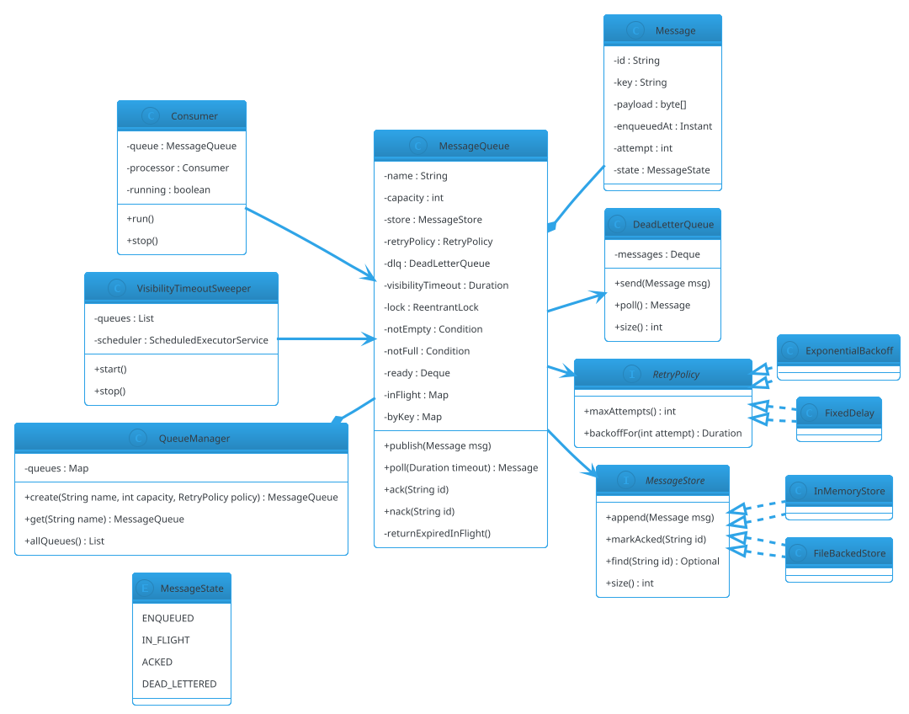

# Message Queue (LLD)

## Problem Statement

Design an **in-process message queue** with durable-like semantics — producers publish messages to a topic, consumers subscribe and process them, with support for **at-least-once delivery**, **acknowledgment**, **visibility timeout**, **dead-letter queue**, **retries with backoff**, **ordering**, and **bounded backpressure**.

Unlike the Producer-Consumer pattern (`22-producer-consumer.md`), which is a single in-memory buffer, a message queue models the full lifecycle of a message: **persistence**, **redelivery on failure**, **per-message acknowledgment**, and **failure isolation**. Unlike the distributed message queue in HLD #06 (Kafka), this is a **single-process** implementation focused on the concurrency and lifecycle semantics.

**Reused primitives (see reference files):**
- Producer-Consumer: `22-producer-consumer.md` (§4.1-4.5)
- Thread Pool: `24-thread-pool.md` (§4.1 state machine, §4.5 scheduled execution)
- Concurrency overview: `concurrency-basics.md` §3-5
- Idempotency: `15-airline-reservation.md` §4.4

**New concepts unique to this problem:**
1. **Message lifecycle** — enqueued → in-flight → acked / dead-lettered
2. **Acknowledgment** — consumer must explicitly ack
3. **Visibility timeout** — in-flight messages return to queue if not acked
4. **Dead-letter queue (DLQ)** — after N failures, message goes to DLQ
5. **Retry with backoff** — exponential backoff on failure
6. **Ordering** — FIFO per partition / per key
7. **At-least-once delivery** — duplicates possible; consumers must be idempotent
8. **Backpressure** — bounded queue, producer blocks or fails fast
9. **Durable log** — append-only storage (in-memory or file-backed)

---

## 1. Requirements

### Functional

- **`publish(message)`** — enqueue a message
- **`subscribe(consumer)`** — register a consumer
- **`poll(timeout)`** — retrieve next message
- **`ack(messageId)`** — acknowledge successful processing
- **`nack(messageId)`** — explicit failure; requeue
- **Visibility timeout** — unacked messages return after timeout
- **Retries** — with exponential backoff up to `maxAttempts`
- **Dead-letter queue** — messages exceeding `maxAttempts`
- **Ordering** — FIFO per topic (single consumer) or per key
- **Topics** — multiple logical queues
- **Metrics** — publish rate, ack rate, DLQ depth, in-flight count

### Non-Functional

- **Thread-safe** — concurrent producers and consumers
- **At-least-once** — a message is delivered until acked or DLQ'd
- **No lost messages** — ack before removing; visibility timeout redelivers
- **Bounded** — max queue size; backpressure
- **Low overhead** — publish < 10 µs, poll < 50 µs
- **Extensible** — new storage backends, retry policies, serializers

### Out of Scope

- Distributed brokers (Kafka, RabbitMQ) — that's HLD #06
- Cross-process transport
- Exactly-once (impossible in general; discuss in follow-ups)
- Message schemas / serialization (assume byte[] or String)
- Consumer groups with rebalancing

---

## 2. Use Cases (brief)

| # | Use Case | Actor |
|---|---|---|
| UC1 | Publish a message | Producer |
| UC2 | Poll for a message | Consumer |
| UC3 | Acknowledge success | Consumer |
| UC4 | Nack on failure | Consumer |
| UC5 | Visibility timeout returns unacked | System |
| UC6 | Retry with backoff | System |
| UC7 | After N failures, DLQ | System |
| UC8 | Monitor queue depth, DLQ | Admin |
| UC9 | Ordered delivery per key | Producer/Consumer |

---

## 3. Core Entities (delta)

**New entities:**

| Entity | Responsibility |
|---|---|
| `Message` | A unit of work with id, payload, metadata |
| `MessageQueue` | A single logical queue |
| `QueueManager` | Manages multiple named queues |
| `MessageState` | ENQUEUED, IN_FLIGHT, ACKED, DEAD_LETTERED |
| `Consumer` | A poller that processes messages |
| `RetryPolicy` | Backoff and max attempts |
| `DeadLetterQueue` | Overflow queue for failed messages |
| `VisibilityTimeoutManager` | Scheduler that returns unacked messages |
| `MessageStore` | Backing store (in-memory or file) |

**Enums:**

| Enum | Values |
|---|---|
| `MessageState` | ENQUEUED, IN_FLIGHT, ACKED, DEAD_LETTERED |
| `PollResult` | SUCCESS, EMPTY, TIMEOUT |

**Interfaces:**

| Interface | Implementations |
|---|---|
| `MessageStore` | `InMemoryStore`, `FileBackedStore` |
| `RetryPolicy` | `ExponentialBackoff`, `FixedDelay`, `NoRetry` |
| `DeadLetterHandler` | `LoggingDLQ`, `DiscardDLQ` |
| `Serializer` | `StringSerializer`, `JsonSerializer` |

---

## 4. What's New — the Message Lifecycle

### 4.1 Message Model

```java
public final class Message {
    private final String id;
    private final String key;            // for ordered delivery per key
    private final byte[] payload;
    private final java.time.Instant enqueuedAt;
    private final java.util.Map<String, String> headers;

    private volatile int attempt;
    private volatile MessageState state;

    public Message(String id, String key, byte[] payload, java.util.Map<String, String> headers) {
        this.id = id;
        this.key = key;
        this.payload = payload;
        this.headers = java.util.Map.copyOf(headers);
        this.enqueuedAt = java.time.Instant.now();
        this.attempt = 0;
        this.state = MessageState.ENQUEUED;
    }

    public String id() { return id; }
    public String key() { return key; }
    public byte[] payload() { return payload.clone(); }
    public java.time.Instant enqueuedAt() { return enqueuedAt; }
    public java.util.Map<String, String> headers() { return headers; }
    public int attempt() { return attempt; }
    public MessageState state() { return state; }

    void markInFlight() { this.state = MessageState.IN_FLIGHT; this.attempt++; }
    void markEnqueued() { this.state = MessageState.ENQUEUED; }
    void markAcked() { this.state = MessageState.ACKED; }
    void markDeadLettered() { this.state = MessageState.DEAD_LETTERED; }
}
```

**Why `byte[] payload`:** keeps the queue agnostic to payload type. Serialization is the producer's concern.

**Why `key`:** enables ordered delivery per key (e.g., all messages for user X go to the same partition). If `key == null`, order is per-queue global (best-effort).

**Why `attempt`:** counts deliveries; used by retry policy and DLQ.

### 4.2 Message State Machine

```
                 ┌──────────────┐
                 │   ENQUEUED   │
                 └──────┬───────┘
                        │ poll()
                        ▼
                 ┌──────────────┐
                 │   IN_FLIGHT  │ ◄── visibility timeout expires
                 └──────┬───────┘
                        │
        ┌───────────────┼────────────────┐
        │ ack()         │ nack()          │ maxAttempts exceeded
        ▼               ▼                 ▼
   ┌────────┐    ┌──────────────┐   ┌──────────────────┐
   │ ACKED  │    │  ENQUEUED    │   │ DEAD_LETTERED    │
   └────────┘    │  (retry)     │   └──────────────────┘
                 └──────────────┘
```

**Transitions:**
- `ENQUEUED → IN_FLIGHT` — on `poll()`
- `IN_FLIGHT → ACKED` — on `ack()`
- `IN_FLIGHT → ENQUEUED` — on `nack()` or visibility timeout
- `IN_FLIGHT → DEAD_LETTERED` — if `attempt >= maxAttempts`

The **state is authoritative**; the queue's storage reflects it.

### 4.3 Message Queue Core

```java
public final class MessageQueue {

    private final String name;
    private final int capacity;
    private final MessageStore store;
    private final RetryPolicy retryPolicy;
    private final DeadLetterQueue dlq;
    private final java.time.Duration visibilityTimeout;

    private final java.util.concurrent.locks.ReentrantLock lock = new java.util.concurrent.locks.ReentrantLock();
    private final java.util.concurrent.locks.Condition notEmpty = lock.newCondition();

    // State
    private final java.util.Deque<Message> ready = new java.util.ArrayDeque<>();
    private final java.util.Map<String, InFlight> inFlight = new java.util.HashMap<>();
    private final java.util.Map<String, java.util.Deque<Message>> byKey = new java.util.HashMap<>();

    private final QueueMetrics metrics;

    public MessageQueue(String name, int capacity, MessageStore store,
                        RetryPolicy retryPolicy, DeadLetterQueue dlq,
                        java.time.Duration visibilityTimeout, QueueMetrics metrics) {
        this.name = name;
        this.capacity = capacity;
        this.store = store;
        this.retryPolicy = retryPolicy;
        this.dlq = dlq;
        this.visibilityTimeout = visibilityTimeout;
        this.metrics = metrics;
    }

    /** Publish a message; blocks if queue is full. */
    public void publish(Message msg) throws InterruptedException {
        lock.lockInterruptibly();
        try {
            while (ready.size() + inFlight.size() >= capacity) {
                notEmpty.await();   // producer backpressure
            }
            ready.addLast(msg);
            store.append(msg);
            metrics.recordPublish();
            notEmpty.signal();
        } finally {
            lock.unlock();
        }
    }

    /** Poll for a message; returns null on timeout. */
    public Message poll(java.time.Duration timeout) throws InterruptedException {
        long deadline = System.nanoTime() + timeout.toNanos();
        lock.lockInterruptibly();
        try {
            while (ready.isEmpty()) {
                long remaining = deadline - System.nanoTime();
                if (remaining <= 0) return null;
                notEmpty.awaitNanos(remaining);
            }
            Message msg = ready.pollFirst();
            msg.markInFlight();
            inFlight.put(msg.id(), new InFlight(msg, System.nanoTime() + visibilityTimeout.toNanos()));
            metrics.recordPoll();
            return msg;
        } finally {
            lock.unlock();
        }
    }

    /** Acknowledge; removes from in-flight. */
    public void ack(String messageId) {
        lock.lock();
        try {
            InFlight flight = inFlight.remove(messageId);
            if (flight == null) return;   // already acked or expired
            flight.message.markAcked();
            store.markAcked(messageId);
            metrics.recordAck();
            notEmpty.signalAll();   // capacity freed
        } finally {
            lock.unlock();
        }
    }

    /** Nack; requeue or DLQ. */
    public void nack(String messageId) {
        lock.lock();
        try {
            InFlight flight = inFlight.remove(messageId);
            if (flight == null) return;
            Message msg = flight.message;

            if (msg.attempt() >= retryPolicy.maxAttempts()) {
                msg.markDeadLettered();
                dlq.send(msg);
                metrics.recordDlq();
                notEmpty.signalAll();
                return;
            }

            java.time.Duration backoff = retryPolicy.backoffFor(msg.attempt());
            // For LLD, we skip the delay and requeue immediately (production: schedule).
            msg.markEnqueued();
            ready.addLast(msg);
            metrics.recordRetry();
            notEmpty.signal();
        } finally {
            lock.unlock();
        }
    }

    /** Called by visibility timeout sweeper. */
    void returnExpiredInFlight() {
        long now = System.nanoTime();
        lock.lock();
        try {
            java.util.Iterator<java.util.Map.Entry<String, InFlight>> it = inFlight.entrySet().iterator();
            while (it.hasNext()) {
                var entry = it.next();
                if (entry.getValue().expiresAtNanos <= now) {
                    Message msg = entry.getValue().message;
                    it.remove();
                    if (msg.attempt() >= retryPolicy.maxAttempts()) {
                        msg.markDeadLettered();
                        dlq.send(msg);
                        metrics.recordDlq();
                    } else {
                        msg.markEnqueued();
                        ready.addLast(msg);
                        metrics.recordVisibilityTimeout();
                    }
                    notEmpty.signal();
                }
            }
        } finally {
            lock.unlock();
        }
    }

    public int size() {
        lock.lock();
        try { return ready.size() + inFlight.size(); }
        finally { lock.unlock(); }
    }

    public int readySize() {
        lock.lock();
        try { return ready.size(); }
        finally { lock.unlock(); }
    }

    public int inFlightSize() {
        lock.lock();
        try { return inFlight.size(); }
        finally { lock.unlock(); }
    }

    public String name() { return name; }

    private record InFlight(Message message, long expiresAtNanos) {}
}
```

**Key design points:**

1. **`ready` deque** — messages ready for polling.
2. **`inFlight` map** — messages polled but not yet acked.
3. **`byKey` map** — optional; used if per-key ordering is required (see §4.4).
4. **`lock` protects all state** — a single queue's operations serialize.
5. **`notEmpty` condition** — producers wait on fullness; consumers wait on emptiness.
6. **Ack removes from in-flight** — the message is done.
7. **Nack retries or DLQs** — decision by `attempt` vs `maxAttempts`.
8. **Visibility timeout** — swept periodically; expired entries return to `ready`.

**Wait — `notEmpty.await()` in `publish`?** Yes, but the condition is used differently. Producers wait on **notFull**, consumers wait on **notEmpty**. Using one condition (as above) means spurious wakes occur. For correctness, use **two conditions**:

```java
private final java.util.concurrent.locks.Condition notFull = lock.newCondition();
private final java.util.concurrent.locks.Condition notEmpty = lock.newCondition();

public void publish(Message msg) throws InterruptedException {
    lock.lockInterruptibly();
    try {
        while (ready.size() + inFlight.size() >= capacity) notFull.await();
        ready.addLast(msg);
        notEmpty.signal();
    } finally { lock.unlock(); }
}

public Message poll(java.time.Duration timeout) throws InterruptedException {
    // ... on poll
    notFull.signal();
}

public void ack(String id) {
    // ... on ack
    notFull.signal();
}
```

Same two-condition pattern as `22-producer-consumer.md` §4.2.

### 4.4 Ordering Guarantees

**Global FIFO** — one queue, one consumer, one producer: strict order.

**Multiple consumers** — order is not preserved across consumers; each message goes to one consumer.

**Per-key ordering** — all messages with the same key are delivered in order:

- **Partition by key** — each key has its own deque.
- **Consumer polls a specific key** — or the queue picks a key that has an available consumer.
- **Common pattern:** in-process, one worker per key, keyed by `hash(key) % numWorkers`.

```java
/** Per-key ordered poll: pick the next key (round-robin), then its oldest message. */
public Message pollByKey(java.time.Duration timeout) throws InterruptedException {
    long deadline = System.nanoTime() + timeout.toNanos();
    lock.lockInterruptibly();
    try {
        while (byKey.isEmpty()) {
            long remaining = deadline - System.nanoTime();
            if (remaining <= 0) return null;
            notEmpty.awaitNanos(remaining);
        }
        // Round-robin over keys (simplified)
        var it = byKey.entrySet().iterator();
        while (it.hasNext()) {
            var entry = it.next();
            java.util.Deque<Message> q = entry.getValue();
            if (!q.isEmpty()) {
                Message msg = q.pollFirst();
                if (q.isEmpty()) it.remove();
                msg.markInFlight();
                inFlight.put(msg.id(), new InFlight(msg, System.nanoTime() + visibilityTimeout.toNanos()));
                return msg;
            }
        }
        return null;
    } finally { lock.unlock(); }
}
```

**Trade-off:** per-key ordering requires tracking keys and reduces throughput (one in-flight message per key at a time). This mirrors Kafka's partition semantics.

### 4.5 Retry Policies

```java
public interface RetryPolicy {
    int maxAttempts();
    java.time.Duration backoffFor(int attempt);
}
```

```java
public final class ExponentialBackoff implements RetryPolicy {
    private final int maxAttempts;
    private final java.time.Duration baseDelay;
    private final java.time.Duration maxDelay;

    public ExponentialBackoff(int maxAttempts, java.time.Duration baseDelay, java.time.Duration maxDelay) {
        this.maxAttempts = maxAttempts;
        this.baseDelay = baseDelay;
        this.maxDelay = maxDelay;
    }

    @Override public int maxAttempts() { return maxAttempts; }

    @Override
    public java.time.Duration backoffFor(int attempt) {
        long millis = baseDelay.toMillis() * (1L << (attempt - 1));
        return java.time.Duration.ofMillis(Math.min(millis, maxDelay.toMillis()));
    }
}
```

```java
public final class FixedDelay implements RetryPolicy {
    private final int maxAttempts;
    private final java.time.Duration delay;

    public FixedDelay(int maxAttempts, java.time.Duration delay) {
        this.maxAttempts = maxAttempts;
        this.delay = delay;
    }

    @Override public int maxAttempts() { return maxAttempts; }
    @Override public java.time.Duration backoffFor(int attempt) { return delay; }
}
```

**Production:** the delay is applied by scheduling the requeue (e.g., via a `DelayQueue` or thread pool) rather than blocking the consumer.

### 4.6 Dead-Letter Queue

```java
public final class DeadLetterQueue {
    private final java.util.Deque<Message> messages = new java.util.ArrayDeque<>();
    private final java.util.concurrent.locks.ReentrantLock lock = new java.util.concurrent.locks.ReentrantLock();
    private final java.util.List<java.util.function.Consumer<Message>> listeners = new java.util.concurrent.CopyOnWriteArrayList<>();

    public void send(Message msg) {
        lock.lock();
        try { messages.addLast(msg); }
        finally { lock.unlock(); }
        for (var listener : listeners) {
            try { listener.accept(msg); }
            catch (RuntimeException e) { /* isolate */ }
        }
    }

    public Message poll() {
        lock.lock();
        try { return messages.pollFirst(); }
        finally { lock.unlock(); }
    }

    public int size() {
        lock.lock();
        try { return messages.size(); }
        finally { lock.unlock(); }
    }

    public void addListener(java.util.function.Consumer<Message> listener) {
        listeners.add(listener);
    }
}
```

**DLQ patterns:**
- **Logging DLQ** — write DLQ messages to a log file for later inspection.
- **Retry DLQ** — human or scheduled job reprocesses DLQ after fixing the cause.
- **Discard DLQ** — accept loss (e.g., metrics where some loss is fine).

### 4.7 Visibility Timeout

Sweep expired in-flight messages and return them to the ready queue:

```java
public final class VisibilityTimeoutSweeper {
    private final java.util.List<MessageQueue> queues;
    private final java.util.concurrent.ScheduledExecutorService scheduler;

    public VisibilityTimeoutSweeper(java.util.List<MessageQueue> queues) {
        this.queues = java.util.List.copyOf(queues);
        this.scheduler = java.util.concurrent.Executors.newSingleThreadScheduledExecutor(r -> {
            Thread t = new Thread(r, "visibility-sweeper");
            t.setDaemon(true);
            return t;
        });
    }

    public void start() {
        scheduler.scheduleAtFixedRate(() -> {
            for (MessageQueue q : queues) {
                try { q.returnExpiredInFlight(); }
                catch (RuntimeException e) { /* isolate */ }
            }
        }, 1, 1, java.util.concurrent.TimeUnit.SECONDS);
    }

    public void stop() { scheduler.shutdownNow(); }
}
```

**Sweep interval:** shorter than the visibility timeout. Typical: 1 s sweep, 30 s timeout. Trade-off: frequent sweeps add CPU; infrequent sweeps delay redelivery.

### 4.8 Consumer

```java
public final class Consumer implements Runnable {

    private final MessageQueue queue;
    private final java.util.function.Consumer<Message> processor;
    private final java.time.Duration pollTimeout;
    private volatile boolean running = true;

    public Consumer(MessageQueue queue, java.util.function.Consumer<Message> processor,
                    java.time.Duration pollTimeout) {
        this.queue = queue;
        this.processor = processor;
        this.pollTimeout = pollTimeout;
    }

    public void stop() { running = false; }

    @Override
    public void run() {
        while (running) {
            try {
                Message msg = queue.poll(pollTimeout);
                if (msg == null) continue;
                try {
                    processor.accept(msg);
                    queue.ack(msg.id());
                } catch (RuntimeException e) {
                    queue.nack(msg.id());
                }
            } catch (InterruptedException e) {
                Thread.currentThread().interrupt();
                return;
            }
        }
    }
}
```

**Key pattern:**
- **Success** → `ack`.
- **Failure** → `nack` (retries or DLQ per policy).
- **Exception isolation** — one failure doesn't crash the consumer.
- **Interrupt handling** — stops cleanly.

### 4.9 Message Store

**In-memory store** — for fast, non-durable queues.

```java
public final class InMemoryStore implements MessageStore {
    private final java.util.Map<String, Message> store = new java.util.concurrent.ConcurrentHashMap<>();

    @Override public void append(Message msg) { store.put(msg.id(), msg); }
    @Override public void markAcked(String id) { store.remove(id); }
    @Override public java.util.Optional<Message> find(String id) { return java.util.Optional.ofNullable(store.get(id)); }
    @Override public int size() { return store.size(); }
}
```

**File-backed store** — append-only log:

```java
public final class FileBackedStore implements MessageStore {

    private final java.nio.channels.FileChannel channel;
    private final java.util.Map<String, Long> offsets = new java.util.concurrent.ConcurrentHashMap<>();

    public FileBackedStore(java.nio.file.Path path) throws java.io.IOException {
        this.channel = java.nio.channels.FileChannel.open(path,
                java.nio.file.StandardOpenOption.CREATE,
                java.nio.file.StandardOpenOption.READ,
                java.nio.file.StandardOpenOption.WRITE);
    }

    @Override
    public synchronized void append(Message msg) {
        try {
            long offset = channel.size();
            byte[] payload = msg.payload();
            java.nio.ByteBuffer buf = java.nio.ByteBuffer.allocate(4 + payload.length);
            buf.putInt(payload.length).put(payload);
            buf.flip();
            channel.position(offset);
            channel.write(buf);
            offsets.put(msg.id(), offset);
        } catch (java.io.IOException e) {
            throw new RuntimeException(e);
        }
    }

    @Override
    public void markAcked(String id) {
        // Append a tombstone instead of rewriting
        offsets.remove(id);
    }

    @Override public java.util.Optional<Message> find(String id) { return java.util.Optional.empty(); }
    @Override public int size() { return offsets.size(); }
}
```

**Trade-off:** file-backed stores add durability but reduce throughput. For LLD, in-memory is enough; mention file-based for production.

---

## 5. Class Diagram (delta)



---

## 6. Java Implementation (support pieces)

### 6.1 QueueManager

```java
public final class QueueManager {

    private final java.util.Map<String, MessageQueue> queues = new java.util.concurrent.ConcurrentHashMap<>();
    private final MessageStore store;   // shared store or per-queue; simplified

    public QueueManager(MessageStore store) {
        this.store = store;
    }

    public MessageQueue create(String name, int capacity, RetryPolicy policy,
                               java.time.Duration visibilityTimeout) {
        return queues.computeIfAbsent(name, n ->
                new MessageQueue(n, capacity, store, policy,
                        new DeadLetterQueue(), visibilityTimeout, new QueueMetrics()));
    }

    public MessageQueue get(String name) {
        MessageQueue q = queues.get(name);
        if (q == null) throw new IllegalArgumentException("Unknown queue: " + name);
        return q;
    }

    public java.util.List<MessageQueue> allQueues() { return java.util.List.copyOf(queues.values()); }
}
```

### 6.2 Demo

```java
public class Demo {
    public static void main(String[] args) throws InterruptedException {
        QueueManager manager = new QueueManager(new InMemoryStore());
        MessageQueue queue = manager.create("orders", 100,
                new ExponentialBackoff(3, java.time.Duration.ofMillis(100),
                        java.time.Duration.ofSeconds(5)),
                java.time.Duration.ofSeconds(5));

        // Publish 10 messages
        for (int i = 0; i < 10; i++) {
            byte[] payload = ("order-" + i).getBytes();
            queue.publish(new Message(java.util.UUID.randomUUID().toString(),
                    "user-" + (i % 3), payload, java.util.Map.of()));
        }
        System.out.println("Published 10 messages; ready: " + queue.readySize());

        // Consumer that fails on half the messages
        Consumer failing = new Consumer(queue, msg -> {
            String body = new String(msg.payload());
            System.out.println("Processing " + body + " attempt=" + msg.attempt());
            if (body.endsWith("3") || body.endsWith("7")) {
                throw new RuntimeException("Simulated failure");
            }
        }, java.time.Duration.ofMillis(500));

        Thread consumer = new Thread(failing);
        consumer.start();
        Thread.sleep(3000);

        failing.stop();
        consumer.interrupt();
        consumer.join(2000);

        System.out.println("Ready: " + queue.readySize());
        System.out.println("In-flight: " + queue.inFlightSize());
    }
}
```

**Expected output:**
- Messages ending in 3 or 7 fail on first attempt, retry, succeed.
- Final: ready=0, in-flight=0 (assuming all successfully acked before stop).
- No DLQ entries (attempts < 3).

---

## 7. Concurrency Considerations

Reused from `22-producer-consumer.md` §7 and `24-thread-pool.md` §7:
- Two conditions (`notFull`, `notEmpty`)
- `ReentrantLock` for critical sections
- `while` loop on condition — always
- State machine transitions guarded

**New to Message Queue:**

- **Message state transitions under lock** — `markInFlight`, `markEnqueued`, `markAcked`, `markDeadLettered` all happen inside the queue's lock.
- **Producer backpressure** — `publish` blocks when `ready.size() + inFlight.size() >= capacity`. This is deliberate: without it, the queue grows unbounded.
- **Consumer `poll` returns after timeout** — never blocks indefinitely.
- **Ack/nack** — both acquire the lock; ack removes; nack requeues or DLQs.
- **Visibility timeout sweeper** — runs on a separate thread; acquires the same lock; returns expired entries. Must run frequently enough to redeliver promptly.
- **Ack vs visibility timeout race** — a message's visibility timeout may expire while the consumer is still processing. If the consumer then `ack`s, the sweeper has already requeued it. In-flight state is removed by the sweeper; the late ack finds no matching in-flight entry and returns without error. But now the message was **redelivered** to another consumer. This is **at-least-once semantics** — a message may be processed twice. Consumers must be idempotent.
- **Durability vs speed** — in-memory store is fast but loses messages on crash. File-backed adds latency.
- **Exponential backoff implementation** — requeuing with a delay requires a `DelayQueue` or a scheduler. Immediate requeue is simplified for LLD; production should use a delayed requeue.
- **Per-key ordering** — reduces throughput; each key is a logical partition.
- **No exactly-once** — even with ack + idempotency, exactly-once is impossible across process boundaries. Discuss in follow-ups.
- **Interrupt handling** — `lock.lockInterruptibly` in `poll` / `publish`; restore flag on interruption.

### Testing

```java
@Test
void atLeastOnceDeliveryOnRetry() throws InterruptedException {
    MessageQueue q = new MessageQueue("test", 10, new InMemoryStore(),
            new ExponentialBackoff(3, java.time.Duration.ZERO, java.time.Duration.ZERO),
            new DeadLetterQueue(), java.time.Duration.ofSeconds(1), new QueueMetrics());

    q.publish(new Message("m1", null, "payload".getBytes(), java.util.Map.of()));

    Message m = q.poll(java.time.Duration.ofSeconds(1));
    assertNotNull(m);
    q.nack(m.id());

    // Message should be ready again
    Message m2 = q.poll(java.time.Duration.ofSeconds(1));
    assertNotNull(m2);
    assertEquals(m.id(), m2.id());
    assertEquals(2, m2.attempt());
}

@Test
void messageGoesToDlqAfterMaxAttempts() throws InterruptedException {
    DeadLetterQueue dlq = new DeadLetterQueue();
    MessageQueue q = new MessageQueue("test", 10, new InMemoryStore(),
            new ExponentialBackoff(2, java.time.Duration.ZERO, java.time.Duration.ZERO),
            dlq, java.time.Duration.ofSeconds(1), new QueueMetrics());

    q.publish(new Message("m1", null, "payload".getBytes(), java.util.Map.of()));

    q.poll(java.time.Duration.ofSeconds(1));
    q.nack("m1");   // attempt 1 -> requeued
    q.poll(java.time.Duration.ofSeconds(1));
    q.nack("m1");   // attempt 2 == maxAttempts -> DLQ

    assertEquals(1, dlq.size());
}

@Test
void visibilityTimeoutReturnsUnacked() throws InterruptedException {
    MessageQueue q = new MessageQueue("test", 10, new InMemoryStore(),
            new ExponentialBackoff(3, java.time.Duration.ZERO, java.time.Duration.ZERO),
            new DeadLetterQueue(), java.time.Duration.ofMillis(500), new QueueMetrics());

    q.publish(new Message("m1", null, "p".getBytes(), java.util.Map.of()));

    q.poll(java.time.Duration.ofSeconds(1));
    assertEquals(0, q.readySize());
    assertEquals(1, q.inFlightSize());

    Thread.sleep(600);
    q.returnExpiredInFlight();

    assertEquals(1, q.readySize());
    assertEquals(0, q.inFlightSize());
}
```

---

## 8. Extensibility

| Feature | Change |
|---|---|
| Priority queue | Use `PriorityBlockingQueue` for `ready` |
| Delayed retry | Use `DelayQueue` for scheduled requeue |
| Consumer groups | Partition `ready` by consumer group; rebalance on join/leave |
| Exactly-once (transactional) | Two-phase commit with the consumer's state store |
| Dead-letter reprocessing | `DLQ.reprocess(predicate)` |
| Metrics export | Push `QueueMetrics` to Prometheus |
| File durability | File-backed store + recovery on restart |
| Multi-topic subscription | `Consumer` polls multiple queues |
| Rate limiting per consumer | Integrate with `21-rate-limiter-lld.md` |
| Compression | Compress payload on publish; decompress on poll |
| Encryption | Encrypt payload at rest in the store |
| Batched ack | `ack(List<id>)` in one lock acquisition |

---

## 9. Common Pitfalls

| Pitfall | Fix |
|---|---|
| Ack before processing | Ack only after successful processing |
| No visibility timeout | Lost messages if consumer crashes |
| Unbounded queue | Bounded with backpressure |
| Long visibility timeout | Slow redelivery on crash; balance against max processing time |
| Short visibility timeout | Duplicate redelivery during legitimate processing |
| `if` on condition | `while` — spurious wakeups |
| Nack without retry limit | Infinite loop; DLQ after max attempts |
| Retry immediately without backoff | Thundering herd; add jitter |
| DLQ unbounded | Bound or spill to disk |
| Ordering assumed with multiple consumers | Ordering only per key or single consumer |
| Not thread-safe policy | All under queue lock |
| Synchronous ack blocking | Ack is cheap; keep it outside processing |
| Slow consumer → queue grows | Backpressure + monitoring |
| Exception in sweeper | Isolate per queue |
| Not handling interrupt in poll | Restore flag, exit cleanly |
| Shared store across queues | One store per queue or partition by queue name |

---

## 10. Follow-ups

### Q1: How does visibility timeout balance crash recovery with duplicate delivery?

**Answer:** The timeout must be **longer than the maximum expected processing time**. If it's too short, messages are redelivered while still being processed (duplicates). If too long, crash recovery is slow (messages sit in-flight for up to the timeout). Typically 30s for fast tasks, up to minutes for I/O-heavy work. Consumers must be **idempotent** to handle redelivery.

### Q2: Can you achieve exactly-once delivery?

**Answer:** **Not across arbitrary process boundaries** without a distributed transaction. You can approximate:
- **Idempotent consumers** — process can be retried; state store dedups by message id.
- **Transactional outbox** — the consumer's state and the ack are in the same transaction.
- **Two-phase commit** — the queue and consumer coordinate; expensive and fragile.

Production systems usually settle for **at-least-once + idempotent consumer**.

### Q3: How do you implement per-key ordering?

**Answer:** Partition messages by key: `partition = hash(key) % N`. Each partition has its own queue with a single consumer at a time. Ordering is guaranteed within a partition, not across. Kafka does exactly this. In-process: one `Deque` per key (or per partition), consumers poll from a partition they own.

### Q4: How does this differ from Kafka (HLD #06)?

**Answer:**
- **Single-process vs distributed** — no cross-node replication, no partitions across brokers.
- **In-memory vs durable log** — this is a bounded in-memory structure; Kafka persists to disk with retention.
- **Consumer groups + rebalancing** — Kafka coordinates which consumer reads which partition; here, consumers poll a shared queue.
- **Ordering + retention** — Kafka retains messages by time/size; here, a message is removed on ack.

The LLD version captures the **semantics** (ack, DLQ, visibility timeout); the HLD version handles scale.

### Q5: How do you test crash recovery?

**Answer:** Simulate a consumer crash by `poll`ing but not acking. Advance time past the visibility timeout. Verify the message is redelivered. For file-backed stores, kill the process and restart; verify the store recovers unacked messages.

### Q6: What's the difference between ack and nack?

**Answer:**
- **Ack** — success; remove the message permanently.
- **Nack** — failure; requeue for retry (with backoff) or DLQ after max attempts.

A consumer should never ack on failure (loses the message) or nack on success (infinite retries). Track this in metrics.

### Q7: How would you add priority?

**Answer:** Replace the `ready` deque with a `PriorityBlockingQueue<Message>` keyed by priority. Higher-priority messages poll first. **Caveat:** low-priority messages may starve — add aging or a minimum service guarantee.

### Q8: How do you support scheduled/delayed messages?

**Answer:** Add a `runAt` field to `Message`. Use a `DelayQueue` as the primary structure; `poll` returns messages whose `runAt` has passed. Enables delayed retries with backoff without a separate scheduler thread.

---

## 11. Similar Problems

- **Producer-Consumer (LLD #22)** — the underlying pattern; no lifecycle
- **Thread Pool (LLD #24)** — task queue with acknowledgment-like semantics
- **Rate Limiter (LLD #21)** — backpressure primitives
- **Pub-Sub (LLD #30)** — fan-out instead of point-to-point
- **Distributed Message Queue** — HLD #06 (Kafka)

Message Queue LLD's unique additions: **message lifecycle**, **ack/nack**, **visibility timeout**, **dead-letter queue**, **retry policies**, **ordering**.

---

## 12. Key Takeaways

- **Message lifecycle**: ENQUEUED → IN_FLIGHT → ACKED / DEAD_LETTERED
- **Ack required** — a message isn't removed until acked
- **Visibility timeout** — unacked messages return to queue (at-least-once)
- **At-least-once means duplicates** — consumers must be idempotent
- **Retry with backoff** — exponential backoff prevents thundering herd
- **DLQ after max attempts** — never lose a message; isolate failures
- **Bounded queue** — with producer backpressure via `Condition.await`
- **Two conditions** — `notFull`, `notEmpty`
- **`while` loop on condition** — spurious wakeups
- **All state under one lock per queue** — simple, correct
- **Visibility sweeper** — periodic `returnExpiredInFlight`
- **Per-key ordering** — partition by key; one consumer per key at a time
- **File-backed store** — for durability; in-memory for speed
- **Exactly-once is impossible** — at-least-once + idempotent consumer is the standard pattern
- **Metrics** — publish, poll, ack, retry, DLQ counters

### The Generalizable Recipe

For any **message queue / task delivery** problem:

1. **`Message` entity** — id, payload, metadata, attempt count, state
2. **State machine** — ENQUEUED, IN_FLIGHT, ACKED, DEAD_LETTERED
3. **`ready` + `inFlight`** — the two data structures
4. **Ack** — remove from in-flight
5. **Nack** — requeue or DLQ
6. **Visibility timeout** — sweeper returns unacked
7. **Retry policy** — exponential backoff; max attempts → DLQ
8. **DLQ** — isolation for poison messages
9. **Two conditions** — notFull, notEmpty
10. **Producer backpressure** — bounded queue
11. **Per-key ordering** — partition by key
12. **Store abstraction** — in-memory or file-backed
13. **Metrics** — publish, ack, retry, DLQ
14. **Idempotent consumer** — application's responsibility

This skeleton plus the producer-consumer primitives from `22-producer-consumer.md` solves: Message Queue (in-process), Task Queue, Job Scheduler (with retries), Event Bus (with DLQ), Webhook Delivery, Email Sender, Retry Queue — with variations in transport, durability, and ordering.