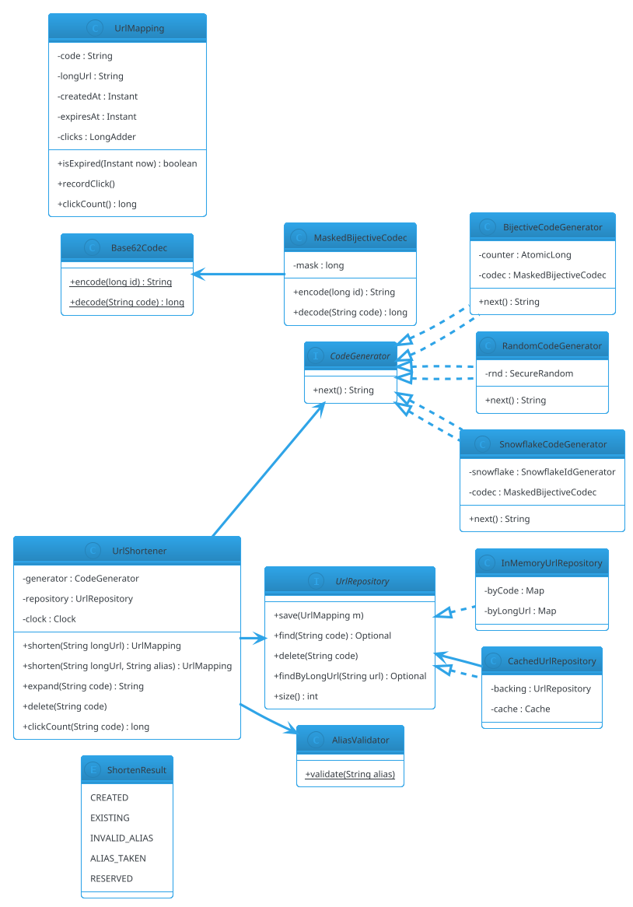

# URL Shortener (LLD)

## Problem Statement

Design an **in-process URL shortener library** — not the distributed service (that's HLD #01), but a reusable component that maps long URLs to short codes and back. It must generate **unique, collision-resistant codes**, handle **custom aliases**, support **expiration**, track **click counts**, and be **thread-safe** under concurrent requests.

This is the smallest LLD problem in Category F, and it complements HLD #01 by focusing on the **encoding + storage** algorithm rather than the distribution layer. Where HLD #01 covers rate limiting, CDN, sharding across regions, and analytics pipelines, this LLD focuses on the **data structure** inside one node.

**Reused primitives (see reference files):**
- Thread-Safe LRU Cache: `23-lru-cache.md` (§4.1, §4.2)
- Concurrency overview: `concurrency-basics.md` §3-5
- Repository pattern: `design-patterns/creational.md` §2 (Factory)
- Idempotency: `15-airline-reservation.md` §4.4

**New concepts unique to this problem:**
1. **Base62 encoding** — URL-safe alphabet, compact codes
2. **Bijective mapping** — id ↔ code, no collision
3. **Snowflake-style ID generation** — distributed-safe unique IDs
4. **Custom aliases** — user-provided, must check uniqueness
5. **Reserved words** — aliases that conflict with internal routes
6. **Expiration** — TTL per URL; lazy + sweep
7. **Click tracking** — atomic counter per short code
8. **Cache layer** — LRU for hot URLs

---

## 1. Requirements

### Functional

- **`shorten(longUrl)`** — returns short code
- **`shorten(longUrl, customAlias)`** — user-provided alias
- **`expand(shortCode)`** — returns original URL or throws
- **`delete(shortCode)`** — remove mapping
- **`clickCount(shortCode)`** — read-only counter
- **`expiresAt`** — optional TTL
- **Expired URLs return 404** on expand
- **Idempotent shorten** — same long URL with same options returns same code (configurable)
- **Reserved words** — block aliases like `admin`, `api`
- **Thread-safe** — concurrent shorten and expand

### Non-Functional

- **No collisions** for generated codes
- **Bounded memory** — expiration + cache eviction
- **Low latency** — `expand` < 1 µs from cache; `shorten` < 10 µs
- **Compact codes** — 7 chars for billions of URLs
- **Extensible** — new codec, storage, expiration policy
- **Observable** — hit/miss, shorten/expand counts

### Out of Scope

- HTTP server / routing (that's HLD #01)
- Rate limiting (that's LLD #21)
- CDN / edge caching
- Analytics pipelines
- Multi-region replication
- Custom domains (mention as extension)

---

## 2. Use Cases (brief)

| # | Use Case | Actor |
|---|---|---|
| UC1 | Shorten a long URL | Caller |
| UC2 | Shorten with custom alias | Caller |
| UC3 | Expand short code | Caller |
| UC4 | Delete short code | Owner |
| UC5 | Track click | System |
| UC6 | Expire URL | System |
| UC7 | Reserved word rejection | System |

---

## 3. Core Entities (delta)

**New entities:**

| Entity | Responsibility |
|---|---|
| `UrlShortener` | Top-level façade |
| `ShortCode` | Value object for a code |
| `UrlMapping` | long URL + metadata + expiry |
| `CodeGenerator` | Generates unique codes (bijective or random) |
| `Codec` | Base62 encode/decode |
| `UrlRepository` | In-memory storage |
| `ClickCounter` | Atomic counter per code |
| `ExpirationScheduler` | Sweeps expired entries |
| `ReservedWords` | Set of blocked aliases |

**Enums:**

| Enum | Values |
|---|---|
| `ShortenResult` | CREATED, EXISTING, INVALID_ALIAS, ALIAS_TAKEN, RESERVED |

**Interfaces:**

| Interface | Implementations |
|---|---|
| `CodeGenerator` | `BijectiveCounter`, `RandomCode`, `SnowflakeBased` |
| `UrlRepository` | `InMemoryRepository`, `FileBackedRepository` |
| `Codec` | `Base62Codec`, `Base64UrlCodec` |

---

## 4. What's New — the Three Code Generation Strategies

### 4.1 Base62 Encoding + Bijective Counter

**Idea:** encode a monotonically increasing counter into Base62.

- **Alphabet:** `0-9A-Za-z` (62 chars)
- **Length:** 7 chars → 62^7 ≈ 3.5 trillion codes
- **Bijective:** id ↔ code is a one-to-one mapping
- **No collisions** by construction

```java
public final class Base62Codec {

    private static final String ALPHABET = "0123456789ABCDEFGHIJKLMNOPQRSTUVWXYZabcdefghijklmnopqrstuvwxyz";
    private static final int BASE = 62;

    public static String encode(long id) {
        if (id < 0) throw new IllegalArgumentException("id must be non-negative");
        if (id == 0) return "0";
        StringBuilder sb = new StringBuilder();
        while (id > 0) {
            int rem = (int) (id % BASE);
            sb.append(ALPHABET.charAt(rem));
            id /= BASE;
        }
        return sb.reverse().toString();
    }

    public static long decode(String code) {
        long id = 0;
        for (int i = 0; i < code.length(); i++) {
            int idx = ALPHABET.indexOf(code.charAt(i));
            if (idx < 0) throw new IllegalArgumentException("Invalid character: " + code.charAt(i));
            id = id * BASE + idx;
        }
        return id;
    }
}
```

**Example:**
- id = 1 → "1"
- id = 61 → "z"
- id = 62 → "10"
- id = 1_000_000 → "4c92"
- id = 1_000_000_000 → "1s7Wa"
- id = 3_500_000_000_000 → "zzzzzzz" (7 chars, near max)

**Problem:** sequential codes are predictable. Someone could enumerate URLs. Fix:
- **Add a random offset** per environment (`START_ID = 1_000_000_000L`)
- **XOR with a secret mask** before encoding, reverse after decoding
- **Salt per shard** (for distributed systems)

```java
public final class MaskedBijectiveCodec {
    private final long mask;

    public MaskedBijectiveCodec(long mask) { this.mask = mask; }

    public String encode(long id) { return Base62Codec.encode(id ^ mask); }
    public long decode(String code) { return Base62Codec.decode(code) ^ mask; }
}
```

**Pros:** no collisions, compact, predictable length (grows logarithmically), fast.
**Cons:** predictable without masking; enumerable.

### 4.2 Random Code

**Idea:** generate a random 7-char code; check collision; retry on collision.

```java
public final class RandomCodeGenerator {

    private static final java.security.SecureRandom RND = new java.security.SecureRandom();
    private static final String ALPHABET = "0123456789ABCDEFGHIJKLMNOPQRSTUVWXYZabcdefghijklmnopqrstuvwxyz";
    private static final int CODE_LENGTH = 7;

    public static String generate() {
        StringBuilder sb = new StringBuilder(CODE_LENGTH);
        for (int i = 0; i < CODE_LENGTH; i++) {
            sb.append(ALPHABET.charAt(RND.nextInt(ALPHABET.length())));
        }
        return sb.toString();
    }
}
```

**Collision probability:** birthday paradox with 62^7 ≈ 3.5T space.
- 1M codes → ~0.0001% collision probability
- 100M codes → ~1% collision probability

**Handling collisions:** check existence; retry up to 3 times.

**Pros:** unpredictable, no central counter.
**Cons:** collisions possible; needs existence check + retry.
**Best for:** high-volume distributed systems where coordinating a counter is hard.

### 4.3 Snowflake-Based

**Idea:** generate a unique long id using the Snowflake algorithm, then Base62-encode it.

**Snowflake structure (64 bits):**
- 1 bit: sign (0)
- 41 bits: timestamp (milliseconds since a custom epoch; ~69 years)
- 10 bits: machine/worker id (1024 nodes)
- 12 bits: sequence within the same millisecond (4096 ids/ms/node)

**Throughput:** 4096 × 1000 = ~4M ids/sec per node.
**Uniqueness:** guaranteed across nodes (different worker ids).

```java
public final class SnowflakeIdGenerator {

    private static final long EPOCH = 1704067200000L;   // 2024-01-01
    private static final int WORKER_BITS = 10;
    private static final int SEQUENCE_BITS = 12;
    private static final long MAX_WORKER = (1L << WORKER_BITS) - 1;
    private static final long MAX_SEQUENCE = (1L << SEQUENCE_BITS) - 1;

    private final long workerId;
    private long lastTimestamp = -1L;
    private long sequence = 0L;

    public SnowflakeIdGenerator(long workerId) {
        if (workerId < 0 || workerId > MAX_WORKER) throw new IllegalArgumentException("workerId out of range");
        this.workerId = workerId;
    }

    public synchronized long nextId() {
        long now = System.currentTimeMillis();
        if (now < lastTimestamp) throw new IllegalStateException("Clock moved backwards");
        if (now == lastTimestamp) {
            sequence = (sequence + 1) & MAX_SEQUENCE;
            if (sequence == 0) {
                // Wait for next millisecond
                while (now == lastTimestamp) now = System.currentTimeMillis();
            }
        } else {
            sequence = 0;
        }
        lastTimestamp = now;
        return ((now - EPOCH) << (WORKER_BITS + SEQUENCE_BITS))
                | (workerId << SEQUENCE_BITS)
                | sequence;
    }
}
```

**Combined with Base62:**

```java
public final class SnowflakeBase62Generator {
    private final SnowflakeIdGenerator snowflake;
    private final MaskedBijectiveCodec codec;

    public SnowflakeBase62Generator(long workerId, long mask) {
        this.snowflake = new SnowflakeIdGenerator(workerId);
        this.codec = new MaskedBijectiveCodec(mask);
    }

    public String next() {
        return codec.encode(snowflake.nextId());
    }
}
```

**Pros:** distributed-safe, time-sortable, no collision.
**Cons:** 64-bit ids encode to ~11 Base62 chars (longer than the 7-char target).

**Optimization:** use a smaller Snowflake variant (fewer timestamp bits) if the system's expected lifetime is shorter.

### 4.4 Strategy Comparison

| Strategy | Predictable | Collision | Distributed | Code Length |
|---|---|---|---|---|
| Bijective counter | Yes (unless masked) | None | Coordinated | Short (grows) |
| Random 7-char | No | Possible | Yes | Fixed 7 |
| Snowflake + Base62 | No (time-based) | None | Yes | ~11 |

**Recommendation:**
- **Single-node:** bijective counter with random start offset and secret mask.
- **Distributed:** Snowflake + Base62, or random with collision check.

### 4.5 Custom Aliases

User-provided aliases (e.g., `mylink`) must be:
- **Unique** — no clash with existing codes
- **Not reserved** — no clash with internal routes (`admin`, `api`, `login`)
- **Valid format** — alphanumeric, length 3-20 (configurable)

```java
public final class AliasValidator {
    private static final java.util.Set<String> RESERVED = java.util.Set.of(
            "admin", "api", "login", "logout", "signup", "static",
            "assets", "health", "metrics", "robots.txt", "favicon.ico"
    );
    private static final java.util.regex.Pattern VALID = java.util.regex.Pattern.compile("^[A-Za-z0-9_-]{3,20}$");

    public static void validate(String alias) {
        if (alias == null || !VALID.matcher(alias).matches()) {
            throw new IllegalArgumentException("Invalid alias format");
        }
        if (RESERVED.contains(alias.toLowerCase())) {
            throw new IllegalArgumentException("Reserved alias: " + alias);
        }
    }
}
```

**Case sensitivity:** codes are case-sensitive (`abc` ≠ `ABC`). Aliases are typically matched case-sensitively too. Document clearly.

### 4.6 Expiration

Optional TTL per URL. Expired URLs return 404 on expand.

```java
public final class UrlMapping {
    private final String code;
    private final String longUrl;
    private final java.time.Instant createdAt;
    private final java.time.Instant expiresAt;       // nullable
    private final java.util.concurrent.atomic.LongAdder clicks = new java.util.concurrent.LongAdder();

    public UrlMapping(String code, String longUrl, java.time.Instant createdAt, java.time.Instant expiresAt) {
        this.code = code;
        this.longUrl = longUrl;
        this.createdAt = createdAt;
        this.expiresAt = expiresAt;
    }

    public String code() { return code; }
    public String longUrl() { return longUrl; }
    public java.time.Instant createdAt() { return createdAt; }
    public java.time.Instant expiresAt() { return expiresAt; }

    public boolean isExpired(java.time.Instant now) {
        return expiresAt != null && now.isAfter(expiresAt);
    }

    public void recordClick() { clicks.increment(); }
    public long clickCount() { return clicks.sum(); }
}
```

**Two expiration strategies:**
- **Lazy** — check on `expand`. Simple; expired entries linger in memory.
- **Sweep** — a scheduler periodically removes expired entries. Combine with lazy for best of both.

**Recommended:** lazy check + periodic sweep.

### 4.7 Click Tracking

Atomic counter per code. `LongAdder` scales under concurrency.

```java
public void recordClick(String code) {
    UrlMapping mapping = repository.find(code).orElse(null);
    if (mapping != null) mapping.recordClick();
}
```

**Note:** in a real system, click tracking is asynchronous — clicks are pushed to a Kafka topic and aggregated separately, to avoid adding latency to the redirect path. For LLD, the atomic counter suffices.

### 4.8 Caching Hot URLs

`expand` is the hot path — millions of redirects per second. Add an LRU cache in front of the repository (see `23-lru-cache.md`).

```java
public final class CachedUrlRepository {
    private final UrlRepository backing;
    private final Cache<String, UrlMapping> cache;   // from 23-lru-cache.md

    public CachedUrlRepository(UrlRepository backing, int cacheSize) {
        this.backing = backing;
        this.cache = new SynchronizedLRUCache<>(cacheSize, null);
    }

    public java.util.Optional<UrlMapping> find(String code) {
        UrlMapping cached = cache.get(code);
        if (cached != null) return java.util.Optional.of(cached);
        return backing.find(code).map(m -> { cache.put(code, m); return m; });
    }

    public void save(UrlMapping mapping) {
        backing.save(mapping);
        cache.put(mapping.code(), mapping);
    }

    public void delete(String code) {
        backing.delete(code);
        cache.remove(code);
    }
}
```

**Cache invalidation:** on `delete`, remove from cache. On expiry, lazy check on `find` catches it.

---

## 5. Class Diagram (delta)



---

## 6. Java Implementation (support pieces)

### 6.1 InMemoryUrlRepository

```java
public final class InMemoryUrlRepository implements UrlRepository {

    private final java.util.Map<String, UrlMapping> byCode = new java.util.concurrent.ConcurrentHashMap<>();
    private final java.util.Map<String, String> byLongUrl = new java.util.concurrent.ConcurrentHashMap<>();

    @Override
    public void save(UrlMapping m) {
        byCode.put(m.code(), m);
        byLongUrl.put(m.longUrl(), m.code());
    }

    @Override
    public java.util.Optional<UrlMapping> find(String code) {
        return java.util.Optional.ofNullable(byCode.get(code));
    }

    @Override
    public void delete(String code) {
        UrlMapping m = byCode.remove(code);
        if (m != null) byLongUrl.remove(m.longUrl());
    }

    @Override
    public java.util.Optional<UrlMapping> findByLongUrl(String url) {
        String code = byLongUrl.get(url);
        return code == null ? java.util.Optional.empty() : find(code);
    }

    @Override public int size() { return byCode.size(); }
}
```

### 6.2 UrlShortener

```java
public final class UrlShortener {

    private final CodeGenerator generator;
    private final UrlRepository repository;
    private final java.time.Clock clock;
    private final boolean idempotentShorten;
    private static final int MAX_GENERATION_RETRIES = 3;

    public UrlShortener(CodeGenerator generator, UrlRepository repository,
                        java.time.Clock clock, boolean idempotentShorten) {
        this.generator = generator;
        this.repository = repository;
        this.clock = clock;
        this.idempotentShorten = idempotentShorten;
    }

    public UrlMapping shorten(String longUrl) {
        return shorten(longUrl, null, null);
    }

    public UrlMapping shorten(String longUrl, String alias) {
        return shorten(longUrl, alias, null);
    }

    public UrlMapping shorten(String longUrl, String alias, java.time.Duration ttl) {
        if (longUrl == null || longUrl.isBlank()) {
            throw new IllegalArgumentException("longUrl required");
        }

        // Idempotent path
        if (idempotentShorten && alias == null) {
            var existing = repository.findByLongUrl(longUrl);
            if (existing.isPresent() && !existing.get().isExpired(java.time.Instant.now(clock))) {
                return existing.get();
            }
        }

        String code;
        if (alias != null) {
            AliasValidator.validate(alias);
            if (repository.find(alias).isPresent()) {
                throw new IllegalStateException("Alias already taken: " + alias);
            }
            code = alias;
        } else {
            code = generateUniqueCode();
        }

        java.time.Instant now = java.time.Instant.now(clock);
        java.time.Instant expiresAt = ttl == null ? null : now.plus(ttl);

        UrlMapping mapping = new UrlMapping(code, longUrl, now, expiresAt);
        repository.save(mapping);
        return mapping;
    }

    public String expand(String code) {
        UrlMapping m = repository.find(code)
                .orElseThrow(() -> new IllegalArgumentException("Unknown code: " + code));
        if (m.isExpired(java.time.Instant.now(clock))) {
            repository.delete(code);
            throw new IllegalStateException("Expired code: " + code);
        }
        m.recordClick();
        return m.longUrl();
    }

    public void delete(String code) {
        repository.delete(code);
    }

    public long clickCount(String code) {
        return repository.find(code)
                .map(UrlMapping::clickCount)
                .orElseThrow(() -> new IllegalArgumentException("Unknown code: " + code));
    }

    private String generateUniqueCode() {
        for (int i = 0; i < MAX_GENERATION_RETRIES; i++) {
            String code = generator.next();
            if (repository.find(code).isEmpty()) return code;
        }
        throw new IllegalStateException("Failed to generate unique code after retries");
    }
}
```

### 6.3 Demo

```java
public class Demo {
    public static void main(String[] args) {
        // Bijective counter with random start offset + secret mask
        CodeGenerator bijective = new BijectiveCodeGenerator(
                1_000_000_000L,   // random start offset
                0xDEADBEEFL       // mask
        );

        UrlShortener shortener = new UrlShortener(
                bijective,
                new InMemoryUrlRepository(),
                java.time.Clock.systemUTC(),
                true    // idempotent
        );

        var m1 = shortener.shorten("https://example.com/very/long/path");
        System.out.println("Code: " + m1.code() + " → " + m1.longUrl());

        var m2 = shortener.shorten("https://example.com/very/long/path");   // same code
        System.out.println("Idempotent: " + m1.code().equals(m2.code()));

        var m3 = shortener.shorten("https://example.com/other", "mylink");
        System.out.println("Custom alias: " + m3.code());

        // Expand
        String url = shortener.expand(m1.code());
        System.out.println("Expanded: " + url);
        System.out.println("Clicks: " + shortener.clickCount(m1.code()));

        // Reserved alias rejection
        try {
            shortener.shorten("https://bad.com", "admin");
        } catch (IllegalArgumentException e) {
            System.out.println("Rejected: " + e.getMessage());
        }
    }
}
```

---

## 7. Concurrency Considerations

Reused from `22-producer-consumer.md` §7 and `23-lru-cache.md` §7:
- `ConcurrentHashMap` for maps
- `AtomicLong` for the bijective counter
- `LongAdder` for click counts
- `ReentrantLock` if finer-grained coordination needed

**New to URL Shortener:**

- **Bijective counter uses `AtomicLong.incrementAndGet()`** — no lock; lock-free atomic.
- **Custom alias race** — two callers try the same alias simultaneously. Both check `find(alias).isEmpty()`, both see empty, both call `save`. Fix: `repository.save` uses `putIfAbsent` and returns the prior value.

```java
@Override
public boolean saveIfAbsent(UrlMapping m) {
    UrlMapping prior = byCode.putIfAbsent(m.code(), m);
    if (prior == null) {
        byLongUrl.put(m.longUrl(), m.code());
        return true;
    }
    return false;
}
```

Then `UrlShortener.shorten` handles the collision and retries (for generated codes) or rejects (for aliases).

- **Random code collision** — same as above. Retry up to N times.
- **Click counter is lock-free** — `LongAdder.increment()`; no coordination.
- **Idempotency race** — two threads shorten the same long URL simultaneously. Both miss `findByLongUrl`, both generate codes. Result: two codes for the same URL. **Fix:** `byLongUrl` uses `putIfAbsent` and the loser uses the winner's code.

```java
public UrlMapping shorten(String longUrl) {
    var existing = repository.findByLongUrl(longUrl);
    if (existing.isPresent() && !existing.get().isExpired(now)) return existing.get();
    String code = generateUniqueCode();
    UrlMapping mapping = new UrlMapping(code, longUrl, now, null);
    // Try to place; if someone else won the race, use their mapping
    if (!repository.saveIfAbsentByLongUrl(mapping)) {
        return repository.findByLongUrl(longUrl).orElse(mapping);
    }
    return mapping;
}
```

- **Expiration sweep** — a scheduled task removes expired entries. Combine with lazy check on expand (see §4.6). The sweep runs under a coarse lock; entries are removed in bulk.
- **Cache invalidation** — when `delete` is called, remove from the LRU cache. When an entry expires, lazy removal on next `find` handles it; the cache also has a TTL (see `23-lru-cache.md`).
- **Cache stampede** — many threads miss the cache simultaneously for the same hot code. Fix: single-flight / in-flight dedup (see follow-ups).
- **Deterministic testing** — inject `Clock` (see `14-meeting-scheduler.md` §4.1).

### Testing

```java
@Test
void bijectiveEncodingIsReversible() {
    for (long id : new long[]{0, 1, 61, 62, 1_000_000, 3_500_000_000L}) {
        String code = Base62Codec.encode(id);
        assertEquals(id, Base62Codec.decode(code));
    }
}

@Test
void concurrentShortenProducesUniqueCodes() throws InterruptedException {
    UrlShortener s = new UrlShortener(
            new BijectiveCodeGenerator(0, 0),
            new InMemoryUrlRepository(),
            java.time.Clock.systemUTC(), false);

    int threads = 32, ops = 1000;
    var codes = java.util.concurrent.ConcurrentHashMap.<String>newKeySet();
    var pool = java.util.concurrent.Executors.newFixedThreadPool(threads);
    var latch = new java.util.concurrent.CountDownLatch(1);

    for (int t = 0; t < threads; t++) {
        pool.submit(() -> {
            try { latch.await(); } catch (InterruptedException ignored) { return; }
            for (int i = 0; i < ops; i++) {
                codes.add(s.shorten("https://example.com/" + java.util.UUID.randomUUID()).code());
            }
        });
    }
    latch.countDown();
    pool.shutdown();
    assertTrue(pool.awaitTermination(30, java.util.concurrent.TimeUnit.SECONDS));

    assertEquals(threads * ops, codes.size());
}

@Test
void aliasRaceOnlyOneWins() throws InterruptedException {
    UrlShortener s = new UrlShortener(
            new BijectiveCodeGenerator(0, 0),
            new InMemoryUrlRepository(),
            java.time.Clock.systemUTC(), false);

    int threads = 10;
    var pool = java.util.concurrent.Executors.newFixedThreadPool(threads);
    var latch = new java.util.concurrent.CountDownLatch(1);
    var successes = new java.util.concurrent.atomic.AtomicInteger();

    for (int t = 0; t < threads; t++) {
        final int tid = t;
        pool.submit(() -> {
            try { latch.await(); } catch (InterruptedException ignored) { return; }
            try { s.shorten("https://example.com/" + tid, "shared-alias"); successes.incrementAndGet(); }
            catch (RuntimeException ignored) { }
        });
    }
    latch.countDown();
    pool.shutdown();
    pool.awaitTermination(5, java.util.concurrent.TimeUnit.SECONDS);

    assertEquals(1, successes.get());
}
```

---

## 8. Extensibility

| Feature | Change |
|---|---|
| Custom domain | Store domain per mapping; index by (domain, code) |
| Analytics | Push click events to an async stream; aggregate separately |
| Rate limiting per user | Wrap `shorten` with `21-rate-limiter-lld.md` |
| QR code generation | Add `QrCodeGenerator` on `UrlMapping` |
| Password-protected URLs | Store `passwordHash` on `UrlMapping`; check on expand |
| One-time URLs | Store `maxUses`; delete after N clicks |
| Geo-based redirects | Store per-region target URLs; pick at expand |
| A/B testing | Store multiple targets with weights |
| Reserved alias per user | Namespace aliases by user id |
| Distributed | Shard by code hash; Snowflake for ids; see HLD #01 |

---

## 9. Common Pitfalls

| Pitfall | Fix |
|---|---|
| Sequential, unmasked codes | Predictable; mask with secret |
| Random codes without collision check | Duplicates possible; retry |
| Alias race without atomic put | Use `putIfAbsent` |
| Idempotency race | `putIfAbsent` on long-url index |
| Unbounded code length | Bijective grows logarithmically; cap length if needed |
| Case-sensitive alias + case-insensitive check | Document clearly; normalize if needed |
| Reserved word validation case-sensitive | Normalize to lowercase for comparison |
| No expiration | Memory leaks; add TTL + sweep |
| Lazy expiration only | Expired entries linger; combine with sweep |
| No cache | Repository hit per expand; add LRU front |
| Cache stampede | Single-flight; see follow-ups |
| Non-atomic click counter | Use `LongAdder` |
| Clock not injectable | Inject `Clock` for testing |
| Bijective counter overflow | At 3.5T codes (7 chars), needs 8 chars; plan capacity |
| Mask inversion | XOR is self-inverse; keep mask secret |

---

## 10. Follow-ups

### Q1: Why is Base62 preferred over Base64?

**Answer:** Base64 includes `+` and `/`, which aren't URL-safe. Base64 URL-safe variant uses `-` and `_` — but those clash with some formats. Base62 (`0-9A-Za-z`) is purely alphanumeric — no escaping needed in URLs or filenames.

### Q2: How do you prevent enumeration?

**Answer:** Add a secret mask to the id before encoding, and reverse the mask on decode. Without the mask, an attacker can't guess valid codes from a sample. Snowflake ids are inherently unpredictable to outsiders because of the timestamp + worker bits.

### Q3: How do you handle hot keys (a URL getting millions of clicks)?

**Answer:** 
- **LRU cache** in front of the repository (see `23-lru-cache.md`).
- **Click tracking** asynchronously — push to a queue, aggregate separately (see `28-message-queue-lld.md`).
- **Distributed cache** — Redis with the mapping.
- **Per-code sharding** — hot codes go to dedicated shards.

### Q4: What is a cache stampede, and how do you prevent it?

**Answer:** When a hot entry expires or is evicted, many concurrent requests miss the cache simultaneously and all hit the repository. Fixes:
- **Single-flight** — only one thread fetches per key; others wait.
- **Probabilistic early expiration** — refresh the cache slightly before expiry, jittered across requests.
- **Never-expire hot keys** — a two-tier cache with a "hot" tier.

### Q5: How do you make this distributed?

**Answer:** 
- **Shard** by code hash: `shard = hash(code) % N`. Each shard is an independent `UrlShortener` with its own repository.
- **Snowflake-based id generation** for global uniqueness across shards.
- **Global cache** in Redis for hot codes.
- **Cross-shard rebalancing** on growth.

See HLD #01 for the full distributed design.

### Q6: What's the maximum number of URLs you can support?

**Answer:**
- **7 Base62 chars:** 62^7 ≈ 3.5 trillion
- **8 chars:** 62^8 ≈ 218 trillion
- **10 chars:** 62^10 ≈ 8.4 × 10^17

At 1 billion new URLs per day, 7 chars last ~9.5 years before growing to 8.

### Q7: How do you handle a user who wants a specific custom alias that's already taken?

**Answer:** Return `ALIAS_TAKEN`. Options:
- Suggest alternatives: `mylink2`, `mylink-x`
- Offer to purchase / transfer (business decision)
- Fall back to auto-generated code

### Q8: How do you test expiration?

**Answer:** Inject `Clock.fixed` with a future timestamp; verify `expand` throws after expiry. Combine with a sweep test that manually triggers the sweeper.

```java
var clock = java.time.Clock.fixed(java.time.Instant.parse("2025-01-01T00:00:00Z"), java.time.ZoneOffset.UTC);
var s = new UrlShortener(gen, repo, clock, false);
var m = s.shorten("https://example.com", null, java.time.Duration.ofDays(1));

// Advance clock
var futureClock = java.time.Clock.fixed(java.time.Instant.parse("2025-01-03T00:00:00Z"), java.time.ZoneOffset.UTC);
var s2 = new UrlShortener(gen, repo, futureClock, false);
assertThrows(IllegalStateException.class, () -> s2.expand(m.code()));
```

---

## 11. Similar Problems

- **URL Shortener (HLD #01)** — distributed version of this problem
- **ID Generator (LLD #03)** — Snowflake algorithm
- **Thread-Safe LRU Cache (LLD #23)** — the cache layer
- **Message Queue (LLD #28)** — for asynchronous click tracking
- **Idempotency Key (LLD #15)** — same atomic put-if-absent pattern

URL Shortener LLD's unique additions: **Base62 encoding**, **bijective mapping**, **code generation strategies**, **alias validation**, **click tracking**.

---

## 12. Key Takeaways

- **Base62 encoding** — URL-safe, compact, `0-9A-Za-z`
- **Bijective counter** — no collisions, predictable length
- **Mask the id** — prevents enumeration; XOR is self-inverse
- **Snowflake** — distributed-safe, time-sortable, ~4M ids/sec/node
- **Random 7-char** — unpredictable; collisions possible; retry
- **Custom aliases** — validate format, reserved words, uniqueness
- **Reserved words** — `admin`, `api`, `login`, etc.
- **Expiration** — lazy check + periodic sweep
- **Click tracking** — `LongAdder` per code; async in production
- **Cache hot URLs** — LRU in front of repository
- **Atomic `putIfAbsent`** — for alias and idempotency races
- **Idempotent shorten** — same long URL returns same code
- **Injectable `Clock`** — deterministic tests
- **Capacity planning** — 7 chars = 3.5T codes; 8 chars = 218T
- **Distributed** — shard by code hash; Snowflake for ids

### The Generalizable Recipe

For any **short code / identifier generation** problem:

1. **Encode id ↔ code** — Base62 (URL-safe), or fixed-width random
2. **Code generation strategy** — bijective counter, Snowflake, random
3. **Mask for privacy** — XOR with a secret
4. **Idempotency** — same input returns same code
5. **Custom aliases** — validate + atomic uniqueness
6. **Reserved words** — normalize + check
7. **Expiration** — lazy + sweep
8. **Click tracking** — atomic `LongAdder`; async in prod
9. **Cache** — LRU for hot codes
10. **Injectable `Clock`** — deterministic testing
11. **Concurrency** — `ConcurrentHashMap`, `AtomicLong`, `putIfAbsent`
12. **Capacity planning** — length vs. space

This skeleton plus the cache from `23-lru-cache.md` solves: URL Shortener, Paste Bin, File Share Link, Referral Code, Invite Code, Ticket ID, Order ID — with variations in encoding, aliasing, and expiration.