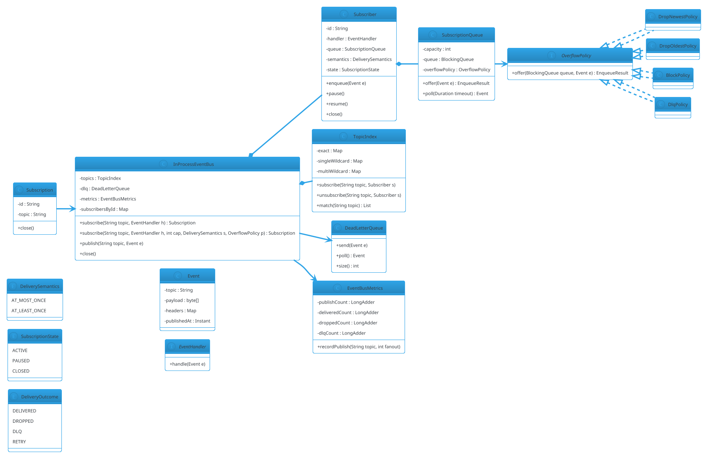

# Pub-Sub System (LLD)

## Problem Statement

Design an **in-process publish-subscribe system** — producers publish events to **topics**; subscribers receive events from topics they subscribe to. Support **topic-based** (and optionally **content-based**) filtering, **multiple subscriber types** (push and pull), **bounded queues**, **backpressure**, **acknowledgment**, **dead-letter queues**, and **thread-safety**.

This is the **fan-out counterpart to Message Queue (LLD #28)**. Where Message Queue delivers each message to **one** consumer (point-to-point), Pub-Sub delivers each message to **all** subscribers of a topic. Where HLD #05 covers the distributed version (Kafka, GCP Pub/Sub), this LLD captures the concurrency and semantics within a single process.

**Reused primitives (see reference files):**
- Message Queue (LLD #28): `28-message-queue-lld.md` (§4.1 message lifecycle, §4.6 DLQ, §4.7 visibility sweeper)
- Producer-Consumer: `22-producer-consumer.md` (§4.1-4.3)
- Thread Pool: `24-thread-pool.md` (§4.1, §4.5)
- Observer pattern: `design-patterns/behavioral.md` §2
- Concurrency overview: `concurrency-basics.md` §3-5

**New concepts unique to this problem:**
1. **Fan-out to N subscribers** — one message, many deliveries
2. **Topic registry** — dynamic subscribe/unsubscribe
3. **Subscriber isolation** — one slow subscriber must not block others
4. **Per-subscriber queues** — each subscriber has its own bounded buffer
5. **Delivery semantics** — at-most-once, at-least-once
6. **Subscription patterns** — exact topic, wildcard (`orders.*`), content-based (predicate)
7. **Backpressure per subscriber** — drop, block, or DLQ per subscription
8. **Publisher acknowledgment** — publisher knows when all subscribers have accepted

---

## 1. Requirements

### Functional

- **`publish(topic, event)`** — deliver event to all subscribers of `topic`
- **`subscribe(topic, handler)`** — register a subscriber
- **`unsubscribe(handle)`** — remove a subscriber
- **Wildcard topics** — `orders.*` matches `orders.created`, `orders.shipped`
- **Content-based filtering** (optional) — predicate on event payload
- **Delivery semantics** — at-most-once or at-least-once per subscription
- **Per-subscriber backpressure** — bounded queue per subscriber
- **DLQ per subscription** — failed events after N retries
- **Metrics** — publish/ack/drop counts per topic

### Non-Functional

- **Fan-out** — one publish reaches N subscribers
- **Subscriber isolation** — a slow subscriber must not block others
- **Thread-safe** — concurrent publish/subscribe/unsubscribe
- **Bounded memory** — per-subscriber queue bounded
- **Low publish latency** — < 100 µs for N ≤ 100 subscribers
- **Extensible** — new subscriber types, delivery semantics, filters

### Out of Scope

- Distributed pub/sub (Kafka, GCP Pub/Sub) — HLD #05
- Persistence / durability beyond process restart
- Exactly-once delivery
- Ordered delivery across subscribers
- Message schemas

---

## 2. Use Cases (brief)

| # | Use Case | Actor |
|---|---|---|
| UC1 | Subscribe to a topic | Subscriber |
| UC2 | Subscribe with wildcard | Subscriber |
| UC3 | Publish an event | Publisher |
| UC4 | Deliver to all subscribers | System |
| UC5 | Unsubscribe | Subscriber |
| UC6 | Slow subscriber dropped | System |
| UC7 | Failed event goes to DLQ | System |
| UC8 | Monitor publish/ack rate | Admin |

---

## 3. Core Entities (delta)

**New entities:**

| Entity | Responsibility |
|---|---|
| `EventBus` | Top-level façade |
| `Event` | Published event (topic + payload + metadata) |
| `Topic` | Logical channel with subscribers |
| `Subscriber` | Registered handler with its own queue |
| `Subscription` | Handle to a subscription |
| `DeliverySemantics` | AT_MOST_ONCE / AT_LEAST_ONCE |
| `EventFilter` | Predicate on event |
| `SubscriptionQueue` | Bounded per-subscriber buffer |
| `EventBusMetrics` | Counters |

**Enums:**

| Enum | Values |
|---|---|
| `DeliverySemantics` | AT_MOST_ONCE, AT_LEAST_ONCE |
| `SubscriptionState` | ACTIVE, PAUSED, CLOSED |
| `DeliveryOutcome` | DELIVERED, DROPPED, DLQ, RETRY |

**Interfaces:**

| Interface | Implementations |
|---|---|
| `EventBus` | `InProcessEventBus` |
| `EventHandler` | User-supplied |
| `EventFilter` | `TopicFilter`, `WildcardFilter`, `PredicateFilter` |
| `OverflowPolicy` | `DropNewest`, `DropOldest`, `Block`, `Dlq` |

---

## 4. What's New — the Four Design Dimensions

### 4.1 Fan-Out: One Publish, N Deliveries

The publisher calls `publish(topic, event)`. The bus must deliver to **all** subscribers of that topic. But subscribers may be:
- **Fast** (millisecond handlers)
- **Slow** (I/O-bound, seconds per event)
- **Broken** (throwing exceptions, hung)

**Design principle:** the publisher must not wait for slow subscribers. So delivery must be **asynchronous per subscriber**.

**Architecture:**
- Each subscriber has its **own bounded queue** and **its own delivery thread** (or a shared pool).
- `publish` enqueues the event into each subscriber's queue.
- If a queue is full, apply the **overflow policy** for that subscriber.

### 4.2 Per-Subscriber Queue + Worker

```java
public final class Subscriber {
    private final String id;
    private final EventHandler handler;
    private final SubscriptionQueue queue;
    private final DeliverySemantics semantics;
    private final java.util.concurrent.atomic.LongAdder delivered = new java.util.concurrent.atomic.LongAdder();
    private final java.util.concurrent.atomic.LongAdder dropped = new java.util.concurrent.atomic.LongAdder();
    private final java.util.concurrent.atomic.LongAdder failed = new java.util.concurrent.LongAdder();
    private final java.util.concurrent.atomic.AtomicReference<SubscriptionState> state
            = new java.util.concurrent.atomic.AtomicReference<>(SubscriptionState.ACTIVE);
    private Thread worker;
    private volatile boolean running = true;

    public Subscriber(String id, EventHandler handler, int queueCapacity,
                      DeliverySemantics semantics, OverflowPolicy overflowPolicy,
                      java.util.concurrent.ExecutorService executor) {
        this.id = id;
        this.handler = handler;
        this.queue = new SubscriptionQueue(queueCapacity, overflowPolicy);
        this.semantics = semantics;
        this.worker = new Thread(this::run, "sub-" + id);
        this.worker.setDaemon(true);
        this.worker.start();
    }

    public String id() { return id; }
    public SubscriptionState state() { return state.get(); }

    /** Enqueue an event for this subscriber. Never blocks the publisher. */
    public void enqueue(Event event) {
        if (state.get() != SubscriptionState.ACTIVE) return;
        SubscriptionQueue.EnqueueResult result = queue.offer(event);
        if (result == SubscriptionQueue.EnqueueResult.DROPPED) {
            dropped.increment();
        }
    }

    public void pause() { state.set(SubscriptionState.PAUSED); }
    public void resume() { state.set(SubscriptionState.ACTIVE); }

    public void close() {
        running = false;
        state.set(SubscriptionState.CLOSED);
        worker.interrupt();
    }

    private void run() {
        while (running) {
            try {
                Event e = queue.poll(java.time.Duration.ofMillis(100));
                if (e == null) continue;
                if (state.get() != SubscriptionState.ACTIVE) continue;

                try {
                    handler.handle(e);
                    delivered.increment();
                } catch (RuntimeException ex) {
                    failed.increment();
                    if (semantics == DeliverySemantics.AT_LEAST_ONCE) {
                        // Retry once, then DLQ (simplified)
                        try { handler.handle(e); delivered.increment(); }
                        catch (RuntimeException ex2) { /* DLQ handled outside */ }
                    }
                }
            } catch (InterruptedException ie) {
                Thread.currentThread().interrupt();
                return;
            }
        }
    }
}
```

**Key points:**
- **Enqueue is non-blocking** — publisher never waits on a subscriber.
- **Worker per subscriber** — parallel delivery, one thread per subscriber.
- **Bounded queue** — overflow policy decides drop/block/DLQ.
- **Delivery semantics** — retry logic per subscriber.
- **Pause/resume** — subscriber can pause consumption while still accepting enqueues (or drop them).

### 4.3 Subscription Queue + Overflow Policy

```java
public final class SubscriptionQueue {

    public enum EnqueueResult { ENQUEUED, DROPPED, DLQ }

    private final int capacity;
    private final OverflowPolicy overflowPolicy;
    private final java.util.concurrent.ArrayBlockingQueue<Event> queue;

    public SubscriptionQueue(int capacity, OverflowPolicy overflowPolicy) {
        this.capacity = capacity;
        this.overflowPolicy = overflowPolicy;
        this.queue = new java.util.concurrent.ArrayBlockingQueue<>(capacity);
    }

    public EnqueueResult offer(Event e) {
        return overflowPolicy.offer(queue, e);
    }

    public Event poll(java.time.Duration timeout) throws InterruptedException {
        return queue.poll(timeout.toMillis(), java.util.concurrent.TimeUnit.MILLISECONDS);
    }

    public int size() { return queue.size(); }
    public int capacity() { return capacity; }
}
```

**Overflow policies:**

```java
public interface OverflowPolicy {
    SubscriptionQueue.EnqueueResult offer(
            java.util.concurrent.BlockingQueue<Event> queue, Event e);
}
```

```java
public final class DropNewestPolicy implements OverflowPolicy {
    @Override public SubscriptionQueue.EnqueueResult offer(
            java.util.concurrent.BlockingQueue<Event> queue, Event e) {
        return queue.offer(e)
                ? SubscriptionQueue.EnqueueResult.ENQUEUED
                : SubscriptionQueue.EnqueueResult.DROPPED;
    }
}
```

```java
public final class DropOldestPolicy implements OverflowPolicy {
    @Override public SubscriptionQueue.EnqueueResult offer(
            java.util.concurrent.BlockingQueue<Event> queue, Event e) {
        if (queue.offer(e)) return SubscriptionQueue.EnqueueResult.ENQUEUED;
        queue.poll();     // drop oldest
        return queue.offer(e)
                ? SubscriptionQueue.EnqueueResult.ENQUEUED
                : SubscriptionQueue.EnqueueResult.DROPPED;
    }
}
```

```java
public final class BlockPolicy implements OverflowPolicy {
    private final java.time.Duration maxWait;

    public BlockPolicy(java.time.Duration maxWait) { this.maxWait = maxWait; }

    @Override public SubscriptionQueue.EnqueueResult offer(
            java.util.concurrent.BlockingQueue<Event> queue, Event e) {
        try {
            boolean ok = queue.offer(e, maxWait.toMillis(), java.util.concurrent.TimeUnit.MILLISECONDS);
            return ok ? SubscriptionQueue.EnqueueResult.ENQUEUED : SubscriptionQueue.EnqueueResult.DROPPED;
        } catch (InterruptedException ie) {
            Thread.currentThread().interrupt();
            return SubscriptionQueue.EnqueueResult.DROPPED;
        }
    }
}
```

```java
public final class DlqPolicy implements OverflowPolicy {
    private final DeadLetterQueue dlq;

    public DlqPolicy(DeadLetterQueue dlq) { this.dlq = dlq; }

    @Override public SubscriptionQueue.EnqueueResult offer(
            java.util.concurrent.BlockingQueue<Event> queue, Event e) {
        if (queue.offer(e)) return SubscriptionQueue.EnqueueResult.ENQUEUED;
        dlq.send(e);
        return SubscriptionQueue.EnqueueResult.DLQ;
    }
}
```

**Choosing a policy:**
- **DropNewest** — non-critical events (metrics, logs); latest state matters.
- **DropOldest** — real-time streams; only recent events matter.
- **Block** — publisher can tolerate backpressure; correctness matters.
- **DLQ** — audit-critical; never lose events.

### 4.4 Event Filtering — Topic + Wildcard + Predicate

**Topic matching:**

- **Exact:** `subscribe("orders.created", handler)` — matches only `orders.created`.
- **Wildcard (single-level):** `subscribe("orders.*", handler)` — matches `orders.created`, `orders.shipped`, but not `orders.foo.bar`.
- **Wildcard (multi-level):** `subscribe("orders.#", handler)` — matches any topic starting with `orders.`.

**Trie-based topic index:**

```java
public final class TopicIndex {

    private final java.util.Map<String, java.util.List<Subscriber>> exact = new java.util.concurrent.ConcurrentHashMap<>();
    private final java.util.Map<String, java.util.List<Subscriber>> singleWildcard = new java.util.concurrent.ConcurrentHashMap<>();
    private final java.util.Map<String, java.util.List<Subscriber>> multiWildcard = new java.util.concurrent.ConcurrentHashMap<>();

    public void subscribe(String topic, Subscriber s) {
        if (topic.endsWith(".#")) {
            String prefix = topic.substring(0, topic.length() - 2);
            multiWildcard.computeIfAbsent(prefix, k -> new java.util.concurrent.CopyOnWriteArrayList<>()).add(s);
        } else if (topic.endsWith(".*")) {
            String prefix = topic.substring(0, topic.length() - 2);
            singleWildcard.computeIfAbsent(prefix, k -> new java.util.concurrent.CopyOnWriteArrayList<>()).add(s);
        } else {
            exact.computeIfAbsent(topic, k -> new java.util.concurrent.CopyOnWriteArrayList<>()).add(s);
        }
    }

    public java.util.List<Subscriber> match(String topic) {
        java.util.List<Subscriber> matched = new java.util.ArrayList<>();
        matched.addAll(exact.getOrDefault(topic, java.util.List.of()));
        int lastDot = topic.lastIndexOf('.');
        if (lastDot > 0) {
            String prefix = topic.substring(0, lastDot);
            matched.addAll(singleWildcard.getOrDefault(prefix, java.util.List.of()));
        }
        // Multi-level wildcard: check all prefixes
        for (var entry : multiWildcard.entrySet()) {
            if (topic.startsWith(entry.getKey() + ".") || topic.equals(entry.getKey())) {
                matched.addAll(entry.getValue());
            }
        }
        return matched;
    }

    public void unsubscribe(String topic, Subscriber s) {
        if (topic.endsWith(".#")) {
            multiWildcard.getOrDefault(topic.substring(0, topic.length() - 2), java.util.List.of()).remove(s);
        } else if (topic.endsWith(".*")) {
            singleWildcard.getOrDefault(topic.substring(0, topic.length() - 2), java.util.List.of()).remove(s);
        } else {
            exact.getOrDefault(topic, java.util.List.of()).remove(s);
        }
    }
}
```

**Complexity:**
- Exact match: O(1) hash lookup
- Single wildcard: O(1) + O(1)
- Multi wildcard: O(W) where W = number of multi-wildcard subscriptions (usually small)

**For high-scale systems:** use a trie (each node = topic segment; leaves = subscribers). Match is O(topic depth).

**Content-based filtering (optional):**

```java
public interface EventFilter {
    boolean matches(Event e);
}

public final class PredicateFilter implements EventFilter {
    private final java.util.function.Predicate<Event> predicate;
    public PredicateFilter(java.util.function.Predicate<Event> p) { this.predicate = p; }
    @Override public boolean matches(Event e) { return predicate.test(e); }
}
```

Filters are applied **before enqueue** — subscribers with non-matching filters don't get the event. Note this **adds latency** to publish (the filter runs on the publisher's thread).

**Trade-off:** content filters are powerful but slow. For high throughput, keep filters simple (equality on header) or pre-topic them.

### 4.5 Delivery Semantics

**At-most-once:**
- Enqueue → deliver. If delivery fails, event is lost.
- Simplest; lowest overhead.

**At-least-once:**
- Enqueue → deliver. On failure, retry with backoff.
- After N retries, DLQ.
- Requires idempotent handlers (duplicates possible).

```java
public enum DeliverySemantics {
    AT_MOST_ONCE,
    AT_LEAST_ONCE
}
```

Delivery worker:

```java
private void run() {
    while (running) {
        try {
            Event e = queue.poll(java.time.Duration.ofMillis(100));
            if (e == null) continue;
            if (state.get() != SubscriptionState.ACTIVE) continue;

            int attempts = 0;
            while (true) {
                try {
                    handler.handle(e);
                    delivered.increment();
                    break;
                } catch (RuntimeException ex) {
                    attempts++;
                    if (semantics == DeliverySemantics.AT_MOST_ONCE || attempts >= maxAttempts) {
                        failed.increment();
                        dlq.send(e);
                        break;
                    }
                    // backoff
                    java.time.Duration backoff = retryPolicy.backoffFor(attempts);
                    try { Thread.sleep(backoff.toMillis()); }
                    catch (InterruptedException ie) { Thread.currentThread().interrupt(); return; }
                }
            }
        } catch (InterruptedException ie) { Thread.currentThread().interrupt(); return; }
    }
}
```

### 4.6 The EventBus

```java
public final class InProcessEventBus implements AutoCloseable {

    private final TopicIndex topics = new TopicIndex();
    private final DeadLetterQueue dlq;
    private final EventBusMetrics metrics = new EventBusMetrics();
    private final java.util.concurrent.ConcurrentHashMap<String, Subscriber> subscribersById
            = new java.util.concurrent.ConcurrentHashMap<>();
    private final java.util.concurrent.atomic.AtomicLong subscriberCounter = new java.util.concurrent.atomic.AtomicLong();

    public InProcessEventBus(DeadLetterQueue dlq) {
        this.dlq = dlq;
    }

    public Subscription subscribe(String topic, EventHandler handler) {
        return subscribe(topic, handler, 1000, DeliverySemantics.AT_MOST_ONCE,
                new DropNewestPolicy());
    }

    public Subscription subscribe(String topic, EventHandler handler,
                                  int queueCapacity, DeliverySemantics semantics,
                                  OverflowPolicy overflowPolicy) {
        String id = "sub-" + subscriberCounter.incrementAndGet();
        Subscriber s = new Subscriber(id, handler, queueCapacity, semantics,
                overflowPolicy, dlq);
        subscribersById.put(id, s);
        topics.subscribe(topic, s);
        return new Subscription(id, topic, this);
    }

    void unsubscribe(String id, String topic) {
        Subscriber s = subscribersById.remove(id);
        if (s != null) {
            topics.unsubscribe(topic, s);
            s.close();
        }
    }

    public void publish(String topic, Event event) {
        java.util.List<Subscriber> matched = topics.match(topic);
        for (Subscriber s : matched) {
            s.enqueue(event);
        }
        metrics.recordPublish(topic, matched.size());
    }

    public EventBusMetrics metrics() { return metrics; }

    @Override
    public void close() {
        for (Subscriber s : subscribersById.values()) s.close();
    }
}
```

**Key characteristics:**
- **`publish` is non-blocking** — enqueue only.
- **Fan-out** — iterates all matched subscribers.
- **Subscriber isolation** — one slow subscriber only fills its own queue.
- **Overflow policy per subscriber** — configured at subscribe time.

### 4.7 Subscription Handle

```java
public final class Subscription implements AutoCloseable {
    private final String id;
    private final String topic;
    private final InProcessEventBus bus;

    Subscription(String id, String topic, InProcessEventBus bus) {
        this.id = id;
        this.topic = topic;
        this.bus = bus;
    }

    public String id() { return id; }
    public String topic() { return topic; }

    @Override
    public void close() { bus.unsubscribe(id, topic); }
}
```

Usage:

```java
try (Subscription sub = bus.subscribe("orders.*", event -> process(event))) {
    // ... publish events ...
}   // auto-unsubscribe
```

### 4.8 Publisher Acknowledgment (Optional)

By default, `publish` is fire-and-forget. If the publisher needs to know when all subscribers have processed (or accepted) the event, provide a `Future`:

```java
public java.util.concurrent.CompletableFuture<Void> publishAndAwait(String topic, Event event) {
    var matched = topics.match(topic);
    var futures = matched.stream()
            .map(s -> s.enqueueAndAwait(event))
            .toArray(java.util.concurrent.CompletableFuture[]::new);
    return java.util.concurrent.CompletableFuture.allOf(futures);
}
```

**Trade-off:** awaiting all subscribers turns fan-out into a blocking operation. Use only when the publisher genuinely needs to wait (e.g., a two-phase commit coordinator). For most events, fire-and-forget is correct.

---

## 5. Class Diagram (delta)



---

## 6. Java Implementation (support pieces)

### 6.1 Event

```java
public final class Event {
    private final String topic;
    private final byte[] payload;
    private final java.util.Map<String, String> headers;
    private final java.time.Instant publishedAt;

    public Event(String topic, byte[] payload, java.util.Map<String, String> headers) {
        this.topic = topic;
        this.payload = payload.clone();
        this.headers = java.util.Map.copyOf(headers);
        this.publishedAt = java.time.Instant.now();
    }

    public String topic() { return topic; }
    public byte[] payload() { return payload.clone(); }
    public java.util.Map<String, String> headers() { return headers; }
    public java.time.Instant publishedAt() { return publishedAt; }
}
```

### 6.2 EventHandler

```java
@FunctionalInterface
public interface EventHandler {
    void handle(Event event) throws RuntimeException;
}
```

### 6.3 Metrics

```java
public final class EventBusMetrics {
    private final java.util.concurrent.atomic.LongAdder publishCount = new java.util.concurrent.atomic.LongAdder();
    private final java.util.concurrent.atomic.LongAdder deliveredCount = new java.util.concurrent.atomic.LongAdder();
    private final java.util.concurrent.atomic.LongAdder droppedCount = new java.util.concurrent.atomic.LongAdder();
    private final java.util.concurrent.atomic.LongAdder dlqCount = new java.util.concurrent.atomic.LongAdder();
    private final java.util.concurrent.ConcurrentHashMap<String, java.util.concurrent.atomic.LongAdder> perTopic
            = new java.util.concurrent.ConcurrentHashMap<>();

    public void recordPublish(String topic, int fanout) {
        publishCount.increment();
        perTopic.computeIfAbsent(topic, k -> new java.util.concurrent.atomic.LongAdder())
                .add(fanout);
    }

    public void recordDelivered() { deliveredCount.increment(); }
    public void recordDropped() { droppedCount.increment(); }
    public void recordDlq() { dlqCount.increment(); }

    public long publishCount() { return publishCount.sum(); }
    public long deliveredCount() { return deliveredCount.sum(); }
    public long droppedCount() { return droppedCount.sum(); }
    public long dlqCount() { return dlqCount.sum(); }
}
```

### 6.4 Demo

```java
public class Demo {
    public static void main(String[] args) throws InterruptedException {
        InProcessEventBus bus = new InProcessEventBus(new DeadLetterQueue());

        // Fast subscriber on orders.*
        try (Subscription s1 = bus.subscribe("orders.*",
                e -> System.out.println("[FAST] " + e.topic() + ": " + new String(e.payload())))) {

            // Slow subscriber
            try (Subscription s2 = bus.subscribe("orders.#",
                    e -> {
                        try { Thread.sleep(200); } catch (InterruptedException ignored) {}
                        System.out.println("[SLOW] " + e.topic());
                    },
                    10, DeliverySemantics.AT_MOST_ONCE, new DropNewestPolicy())) {

                // Publish 5 events
                for (int i = 0; i < 5; i++) {
                    bus.publish("orders.created",
                            new Event("orders.created", ("order-" + i).getBytes(), java.util.Map.of()));
                    bus.publish("orders.shipped",
                            new Event("orders.shipped", ("order-" + i).getBytes(), java.util.Map.of()));
                }
                Thread.sleep(2000);
            }
        }

        bus.close();
        System.out.println("Published: " + bus.metrics().publishCount());
        System.out.println("Delivered: " + bus.metrics().deliveredCount());
        System.out.println("Dropped: " + bus.metrics().droppedCount());
    }
}
```

**Expected behavior:**
- Fast subscriber receives all 10 events immediately.
- Slow subscriber queues up; may drop events if it falls behind (queue capacity 10).
- Fast and slow deliveries run concurrently.

---

## 7. Concurrency Considerations

Reused from `28-message-queue-lld.md` §7 and `22-producer-consumer.md` §7:
- Per-subscriber `BlockingQueue`
- Worker thread per subscriber
- `ConcurrentHashMap` for subscriber maps
- `LongAdder` for metrics

**New to Pub-Sub:**

- **Fan-out iteration** — `publish` iterates matched subscribers and calls `enqueue`. `CopyOnWriteArrayList` for the subscriber list under each topic ensures safe iteration while unsubscribes happen concurrently.
- **Subscriber isolation** — a slow subscriber never blocks the publisher or other subscribers. Each subscriber has its own queue and worker.
- **Per-subscriber backpressure** — each subscriber configures its own overflow policy.
- **Publish is non-blocking** — even with `BlockPolicy`, the block is bounded; the publisher never waits indefinitely.
- **Subscribe/unsubscribe races** — a subscriber may unsubscribe while a publish is in progress. Either the enqueue happens (subscriber closes after processing the queue) or it's skipped. `CopyOnWriteArrayList` handles the iteration; the `state.get() != ACTIVE` check handles the delivery.
- **Filter evaluation under lock** — content-based filters run on the publisher's thread. If a filter is slow, it slows the publisher. Keep filters fast.
- **Thread count** — one worker per subscriber. For many subscribers (1000+), use a shared thread pool.
- **DLQ per subscription vs global** — DLQ may be per subscription (isolation) or global. Choose based on operational needs.
- **No ordering across subscribers** — each subscriber processes its queue in order, but different subscribers may process in different orders due to independent timing.
- **Deterministic shutdown** — close each subscriber's worker; drain or abandon queue based on semantics.

### Testing

```java
@Test
void fanOutDeliversToAllSubscribers() throws InterruptedException {
    InProcessEventBus bus = new InProcessEventBus(new DeadLetterQueue());
    var received = new java.util.concurrent.CopyOnWriteArrayList<String>();

    try (var s1 = bus.subscribe("orders.*", e -> received.add("A:" + e.topic()));
         var s2 = bus.subscribe("orders.*", e -> received.add("B:" + e.topic()))) {

        bus.publish("orders.created", new Event("orders.created", new byte[0], java.util.Map.of()));
        Thread.sleep(500);
        assertEquals(2, received.size());
    }
    bus.close();
}

@Test
void slowSubscriberDoesNotBlockFast() throws InterruptedException {
    InProcessEventBus bus = new InProcessEventBus(new DeadLetterQueue());
    var fastCount = new java.util.concurrent.atomic.AtomicInteger();

    try (var fast = bus.subscribe("orders.*", e -> fastCount.incrementAndGet());
         var slow = bus.subscribe("orders.*", e -> Thread.sleep(1000))) {

        for (int i = 0; i < 5; i++) {
            bus.publish("orders.created", new Event("orders.created", new byte[0], java.util.Map.of()));
        }
        Thread.sleep(200);
        assertEquals(5, fastCount.get());
    }
    bus.close();
}

@Test
void wildcardSubscriberMatches() throws InterruptedException {
    InProcessEventBus bus = new InProcessEventBus(new DeadLetterQueue());
    var matched = new java.util.concurrent.atomic.AtomicInteger();

    try (var sub = bus.subscribe("orders.*", e -> matched.incrementAndGet())) {
        bus.publish("orders.created", new Event("orders.created", new byte[0], java.util.Map.of()));
        bus.publish("orders.shipped", new Event("orders.shipped", new byte[0], java.util.Map.of()));
        bus.publish("users.created", new Event("users.created", new byte[0], java.util.Map.of()));
        Thread.sleep(500);
        assertEquals(2, matched.get());
    }
    bus.close();
}
```

---

## 8. Extensibility

| Feature | Change |
|---|---|
| Distributed pub/sub | Back with Kafka / GCP Pub/Sub; see HLD #05 |
| Persistent subscriptions | Write to disk; on subscriber restart, resume from offset |
| Exactly-once (transactional) | Two-phase commit with subscriber state store |
| Replay / seek | Store event log; allow subscribers to replay from offset |
| Consumer groups | Multiple subscribers share a partition; rebalance on join/leave |
| Backpressure propagation | Subscriber signals the bus to pause; bus pauses producer |
| Batch delivery | Subscriber receives `List<Event>` per handler call |
| Priority topics | Higher-priority events processed first |
| Multi-tenancy | Namespace topics by tenant |
| Dead-letter retry | Scheduled reprocessing of DLQ |
| Content-based routing with ML | Slow; keep offline |
| Compression | Compress payload; decompress at subscriber |

---

## 9. Common Pitfalls

| Pitfall | Fix |
|---|---|
| Synchronous delivery on publish thread | Async per-subscriber queue + worker |
| Shared queue for all subscribers | Per-subscriber queue |
| Unbounded per-subscriber queue | Bounded; overflow policy |
| Blocking publisher on slow subscriber | Non-blocking enqueue; bounded wait at most |
| Slow filter blocking publisher | Keep filters fast; pre-topic if needed |
| Not isolating subscriber exceptions | Catch and DLQ per subscriber |
| Iterating subscriber list while unsubscribing | `CopyOnWriteArrayList` or copy under lock |
| Wildcard matching O(N) per publish | Trie index for many topics |
| Locking across subscribers | No locks; per-subscriber queue is thread-safe |
| Blocking on `queue.put` | Use `offer` with timeout for backpressure |
| No DLQ | Add per-subscription or global DLQ |
| No pause/resume | Subscriber state `PAUSED`; skip enqueue |
| Worker crash kills subscriber | try/catch around handle; continue loop |
| Not restoring interrupt flag | `Thread.currentThread().interrupt()` |
| Metrics under high load | `LongAdder` not `AtomicLong` |
| Close not idempotent | Check state before closing |

---

## 10. Follow-ups

### Q1: How is this different from Producer-Consumer?

**Answer:**
- **Producer-Consumer:** one shared queue, N consumers compete for messages. Each message is delivered to exactly one consumer.
- **Pub-Sub:** one message is delivered to **all** subscribers of a topic. Each subscriber has its own queue.

Producer-Consumer is **point-to-point**; Pub-Sub is **fan-out**.

### Q2: How is this different from Message Queue (LLD #28)?

**Answer:**
- **Message Queue:** point-to-point. Ack removes the message.
- **Pub-Sub:** fan-out. Ack is per subscriber; the message persists for other subscribers.
- **Message Queue** is one logical channel; **Pub-Sub** is many topics with filtering.
- **Message Queue** has visibility timeout; **Pub-Sub** typically has per-subscriber retry or DLQ (no shared visibility).

Both share delivery semantics (ack, retry, DLQ).

### Q3: How do you handle a subscriber who falls behind by hours?

**Answer:**
- **Bounded queue** ensures the subscriber doesn't consume unbounded memory.
- **Overflow policy** decides what happens: drop, DLQ, or pause enqueue.
- **Backpressure propagation** — signal the publisher to slow down (rare; usually the publisher just drops).
- **Lag monitoring** — track `queue.size()` and lag time; alert when exceeding threshold.

For critical streams, use **persistent offsets** (Kafka-style): the subscriber processes from a stored offset, and lag is the difference between the produced offset and the consumed offset.

### Q4: How do you guarantee exactly-once delivery?

**Answer:** You can't, in general. To approximate:
1. **Idempotent handlers** — dedup by event id.
2. **Transactional outbox** — write to a store and ack in the same transaction.
3. **Distributed transactions** — two-phase commit; expensive.

The pragmatic answer: **at-least-once + idempotent handler**.

### Q5: How do you scale to millions of events/sec?

**Answer:**
- **Lock-free structures** — `ArrayBlockingQueue` under high load; consider `LinkedTransferQueue` or Disruptor (LMAX).
- **Batching** — publish and deliver in batches.
- **Shared worker pool** — instead of one thread per subscriber.
- **Zero-copy** — pass references; serialize only at boundaries.
- **Off-heap buffers** — reduce GC pressure.
- **Multiple event buses** — shard by topic hash.

For 1M+ events/sec, use **Kafka** or **Aeron** as the backbone.

### Q6: How do you test that no events are lost?

**Answer:** Publish N events; wait until all subscribers have processed; assert `sum(delivered) == N * subscribers` for at-most-once, or `>= N * subscribers` for at-least-once.

Use a `CountDownLatch(N * subscribers)` to detect completion.

### Q7: How do you handle a subscriber that throws on every event?

**Answer:**
- **Retry N times** with backoff.
- **After N failures**: DLQ. Optionally, pause or disable the subscriber; alert.
- **Circuit breaker**: if failure rate exceeds threshold, stop delivering to that subscriber to protect resources.

### Q8: How would you add persistent subscriptions?

**Answer:** Each subscriber maintains an **offset** — the position of the last successfully processed event. The event bus stores events in an **append-only log** per topic. On subscribe, the subscriber specifies a starting offset (e.g., "earliest", "latest", or a specific position). This is exactly Kafka's model.

See HLD #05 for the distributed version.

---

## 11. Similar Problems

- **Message Queue (LLD #28)** — point-to-point variant
- **Producer-Consumer (LLD #22)** — single queue, many consumers
- **Observer Pattern** — synchronous pub-sub (`design-patterns/behavioral.md` §2)
- **Logging Framework (LLD #20)** — specialized pub-sub (appenders)
- **Pub-Sub (HLD #05)** — distributed version
- **Notification System (HLD #21)** — multi-channel fan-out

Pub-Sub LLD's unique additions: **fan-out**, **topic registry**, **wildcard subscriptions**, **per-subscriber isolation**, **delivery semantics**, **overflow policies**.

---

## 12. Key Takeaways

- **Fan-out** — one publish, N deliveries
- **Per-subscriber queue** — isolates slow/failed subscribers
- **Publish is non-blocking** — enqueue only
- **Overflow policies** — DropNewest, DropOldest, Block, DLQ
- **Delivery semantics** — at-most-once (fast) vs at-least-once (reliable)
- **Wildcard topics** — `orders.*` (single-level) and `orders.#` (multi-level)
- **Topic index** — exact hash + wildcard maps for O(1)-ish matching
- **Content filters** — powerful but slow; keep simple
- **Subscription handle** — `AutoCloseable` for try-with-resources
- **Subscriber state** — ACTIVE, PAUSED, CLOSED
- **DLQ per subscription** — isolate poison events
- **Worker per subscriber** — parallel delivery; or shared pool at scale
- **CopyOnWriteArrayList** — safe iteration during subscribe/unsubscribe
- **`LongAdder` for metrics** — not `AtomicLong`
- **At-least-once needs idempotent handlers** — duplicates possible
- **Persistent offsets** — the Kafka model for resumable subscriptions

### The Generalizable Recipe

For any **fan-out / event distribution** problem:

1. **Event** — topic + payload + metadata
2. **Topic registry** — exact + wildcard matching
3. **Subscriber** — handler + per-subscriber queue
4. **Worker per subscriber** — parallel, isolated
5. **Overflow policy** — per subscriber
6. **Delivery semantics** — at-most-once or at-least-once
7. **DLQ** — per subscription or global
8. **Subscription handle** — AutoCloseable
9. **Non-blocking publish** — enqueue only
10. **Filtering** — before enqueue; keep fast
11. **Metrics** — publish, delivered, dropped, DLQ
12. **Persistent offsets** — for resumable subscriptions
13. **Distributed** — back with Kafka (HLD #05)

This skeleton plus the queue and thread-pool primitives from `22` and `24` solves: Pub-Sub, Event Bus, Notification Fan-Out, Log Distribution, CQRS Event Distribution, Real-Time Analytics, Webhook Fan-Out — with variations in filtering, delivery semantics, and persistence.