# UML Basics

UML (Unified Modeling Language) is the standard notation for describing software design. In LLD interviews, you'll be expected to sketch **class diagrams** and **sequence diagrams** — usually on a whiteboard or in PlantUML. This page covers the notation you need, with examples in PlantUML syntax so you can paste directly into your docs.

---

## 📐 Why UML Matters

- **Communicates design** without code — faster to sketch and iterate
- **Standard notation** — interviewers recognize it immediately
- **Reveals design flaws** — you'll spot missing relationships, cycles, and fat interfaces when you draw
- **Documentation** — a class diagram survives refactors better than code snippets

---

## 1. Class Diagram Basics

A class diagram shows **classes**, their **attributes/methods**, and their **relationships**.

### 1.1 Class Notation

```
┌─────────────────────────┐
│      ClassName          │   ← name
├─────────────────────────┤
│ - privateField: Type    │   ← attributes
│ # protectedField: Type  │
│ + publicField: Type     │
├─────────────────────────┤
│ + publicMethod(): Type  │   ← methods
│ - privateMethod(): void │
└─────────────────────────┘
```

### Visibility Modifiers

| Symbol | Meaning | Java |
|---|---|---|
| `+` | Public | `public` |
| `-` | Private | `private` |
| `#` | Protected | `protected` |
| `~` | Package-private | (default) |
| *italic* | Abstract | `abstract` |
| *underlined* | Static | `static` |

### 1.2 PlantUML Class Syntax

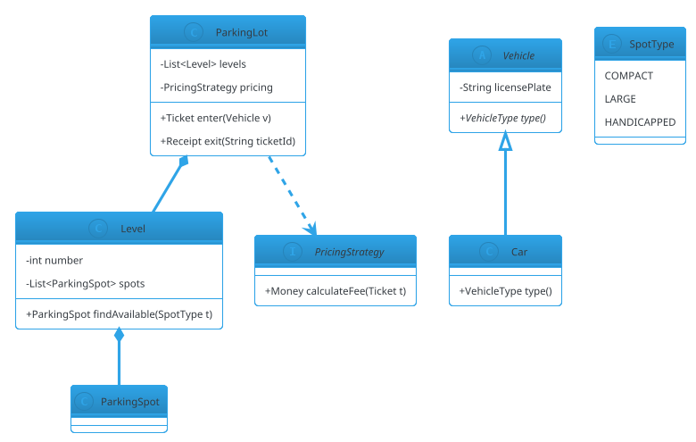

**Output:** a standard class diagram with all the elements above.

---

## 2. Relationships

The most important part of a class diagram is **how classes relate**. UML has precise notation for each relationship type.

### 2.1 Summary Table

| Relationship | UML Symbol | Meaning | Java |
|---|---|---|---|
| Inheritance | `Child ─▷ Parent` | is-a | `extends` |
| Implementation | `Impl ┈▷ Interface` | can-do | `implements` |
| Composition | `A ◆── B` | owns-a (strong) | field + `new` |
| Aggregation | `A ◇── B` | has-a (weak) | field passed in |
| Association | `A ── B` | uses-a | field |
| Dependency | `A ┈> B` | depends-on | param/local |
| Realization | `A ┈▷ B` | realizes interface | `implements` |

### 2.2 Inheritance (Generalization)

**"Is-a"** — the subtype is a special case of the supertype.

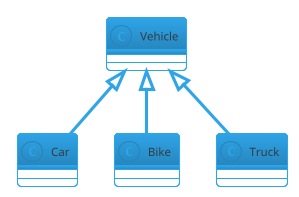

**Java:**
```java
public class Car extends Vehicle { }
public class Bike extends Vehicle { }
```

**When to use:** True subtype relationships where the base class contract is honored (LSP).

### 2.3 Implementation / Realization

**"Can-do"** — the class implements an interface.

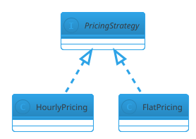

**Java:**
```java
public class HourlyPricing implements PricingStrategy { }
```

### 2.4 Composition

**Strong "owns-a"** — the part cannot exist without the whole. If the whole is destroyed, the part is destroyed.

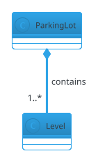

**Java:**
```java
public class ParkingLot {
    private final List<Level> levels = new ArrayList<>();   // composition
}
```

**Real-world:** A `Level` cannot exist without its `ParkingLot`. When the lot is destroyed, its levels are too.

### 2.5 Aggregation

**Weak "has-a"** — the part can exist independently of the whole.

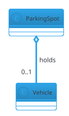

**Java:**
```java
public class ParkingSpot {
    private Vehicle currentVehicle;   // aggregation — vehicle exists elsewhere
}
```

**Real-world:** A `ParkingSpot` holds a `Vehicle`, but the `Vehicle` exists on its own (it drove in).

### 2.6 Association

**"Uses-a"** — a general relationship; the classes know about each other but don't own each other.

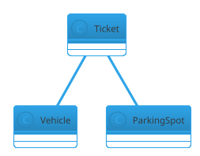

**Java:**
```java
public class Ticket {
    private final Vehicle vehicle;   // association
    private final ParkingSpot spot;
}
```

### 2.7 Dependency

**"Depends-on"** — the class uses another but doesn't hold a reference.

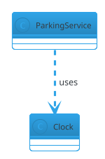

**Java:**
```java
public class ParkingService {
    public Ticket enter(Vehicle v, Clock clock) {   // parameter = dependency
        LocalDateTime now = LocalDateTime.now(clock);
        // ...
    }
}
```

**When to use:** Temporary use (parameter, local variable, static method call).

### 2.8 Composition vs Aggregation — Quick Rule

| Question | Composition | Aggregation |
|---|---|---|
| If the whole is destroyed, does the part die? | Yes | No |
| Does the whole create the part? | Yes | No |
| Does the part have identity outside the whole? | No | Yes |
| UML | `◆──` | `◇──` |

---

## 3. Multiplicities

Multiplicity says **how many instances** participate in a relationship.

| Notation | Meaning |
|---|---|
| `1` | Exactly one |
| `0..1` | Zero or one |
| `1..*` | One or more |
| `0..*` or `*` | Zero or more |
| `n` | Exactly n |
| `n..m` | Between n and m |

### Example

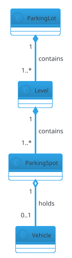

**Reading:** One `ParkingLot` contains one or more `Level`s; one `Level` contains one or more `ParkingSpot`s; one `ParkingSpot` holds zero or one `Vehicle`.

---

## 4. Sequence Diagrams

A sequence diagram shows **interactions over time** — who calls whom, in what order.

### 4.1 Elements

- **Actor / Participant**: a box at the top (e.g., `User`, `ParkingService`)
- **Lifeline**: a vertical dotted line
- **Activation bar**: a thin rectangle showing when a participant is active
- **Message**: an arrow from one lifeline to another
- **Return**: a dashed arrow
- **Alt / loop / opt**: control-flow fragments

### 4.2 Basic Sequence

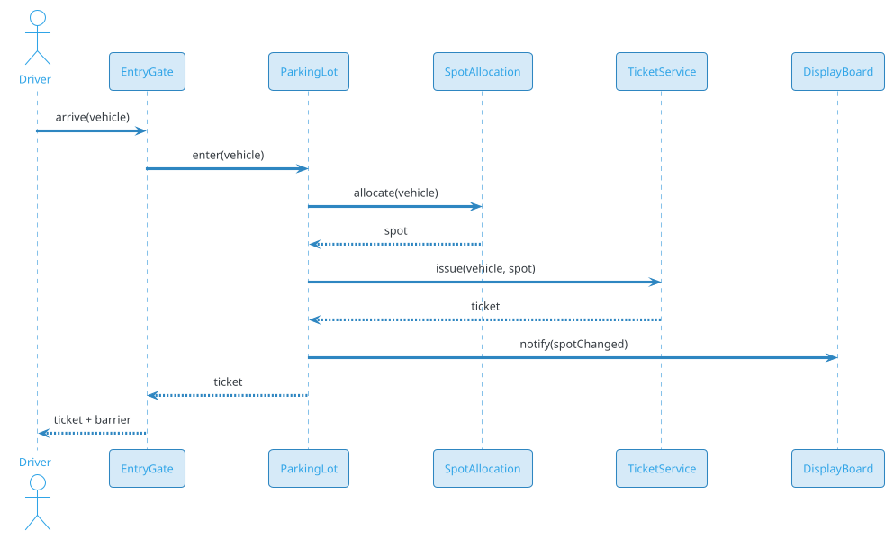

**Reading:** Left to right shows the actors. Downward arrows are time progression. Return arrows are dashed.

### 4.3 Alt (If/Else)

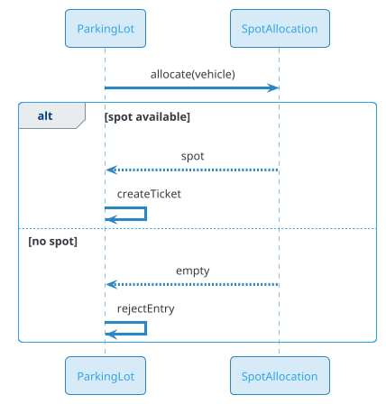

### 4.4 Loop

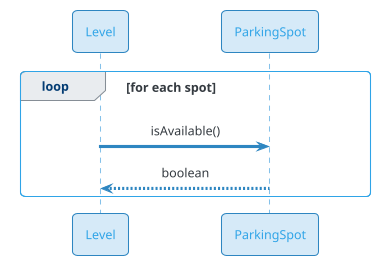

### 4.5 Async Messages

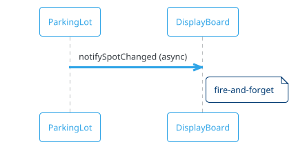

**Reading:** Open arrowhead (`->>`) means asynchronous — the caller doesn't wait.

### 4.6 Lifelines and Destruction

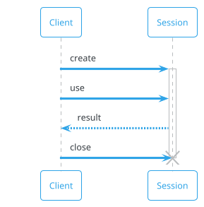

**`activate` / `destroy`** show when an object is created and destroyed.

---

## 5. State Diagrams (Bonus)

State diagrams show **state transitions** for a single object — perfect for problems like Vending Machine, ATM, and Order lifecycle.

### 5.1 Basic State Diagram

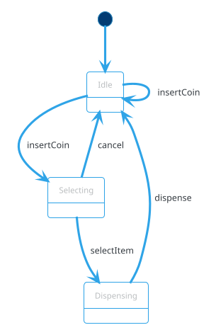

### 5.2 State Diagram with Composite

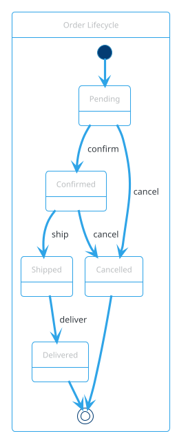

### 5.3 When to Use State Diagrams

- **Vending Machine** — idle, coin-inserted, item-selected, dispensing
- **ATM** — idle, card-inserted, PIN-entered, transaction, dispensing
- **Order** — pending, confirmed, shipped, delivered, cancelled
- **Ticket** — open, paid, lost
- **Elevator** — idle, moving-up, moving-down, door-open

State diagrams are **the fastest way to nail down lifecycle logic** before writing code.

---

## 6. Deployment Diagrams (Rare in LLD)

Deployment diagrams show **physical deployment** of software — servers, containers, nodes. **Rarely used in LLD** (common in HLD). Skip unless asked.

---

## 7. Package Diagrams (Rare in LLD)

Package diagrams show **logical grouping** of classes — modules, layers, namespaces.

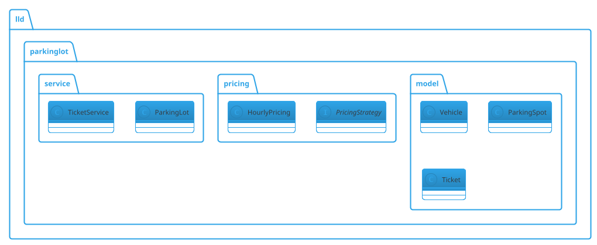

**Use:** Show module structure for large LLD problems.

---

## 8. Activity Diagrams (Rare in LLD)

Activity diagrams show **workflow** — like a flowchart with fork/join.

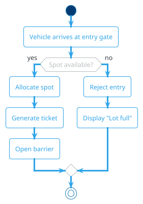

**Use:** High-level flows. Mostly replaced by sequence diagrams in LLD interviews.

---

## 9. PlantUML in MkDocs — Working Syntax

The `mkdocs-plantuml-local` plugin renders PlantUML. Use this header pattern for **all** diagrams to avoid parse errors:

### For class diagrams

```plantuml
@startuml
!theme cerulean-outline
skinparam backgroundColor white
skinparam shadowing false
skinparam classAttributeIconSize 0
skinparam linetype ortho

class Foo {
  - String bar
  + void baz()
}
@enduml
```

### For sequence diagrams

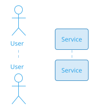

### For state diagrams

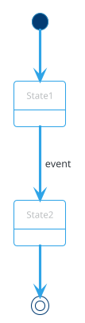

### Rules to Avoid PlantUML Errors

1. **Aliases:** use alphanumeric + underscore only. No digits in weird positions.
   - ❌ `K8s`, `S3`, `CI`, `New`, `Old`
   - ✅ `Kube`, `S3Store`, `CIPipe`, `NewRS`, `OldRS`

2. **No parentheses in message text:**
   - ❌ `Service -> Client : create (v2, 1 pod)`
   - ✅ `Service -> Client : create v2 with 1 pod`

3. **No reserved words as aliases:** `new`, `old`, `actor`, `participant`, `database`, `queue`, `note`, `alt`, `else`, `end`, `loop`.

4. **Quote display names** when they contain spaces: `participant "My Service" as MyService`.

5. **`!theme cerulean-outline`** at the top — matches the LLD section style.

---

## 10. UML Cheat Sheet

### Class Diagram Quick Reference

| Element | Notation | PlantUML |
|---|---|---|
| Class | box | `class Foo` |
| Abstract class | italic name | `abstract class Foo` |
| Interface | box + `«interface»` | `interface Foo` |
| Enum | box + `«enumeration»` | `enum Foo` |
| Public method | `+ method()` | — |
| Private field | `- field` | — |
| Static | underlined | `{static}` |
| Abstract | italic | `{abstract}` |

### Relationship Quick Reference

| Relationship | UML | PlantUML |
|---|---|---|
| Inheritance | `Child ─▷ Parent` | `Parent <|-- Child` |
| Implementation | `Impl ┈▷ Interface` | `Interface <|.. Impl` |
| Composition | `Whole ◆── Part` | `Whole *-- Part` |
| Aggregation | `Whole ◇── Part` | `Whole o-- Part` |
| Association | `A ── B` | `A -- B` |
| Dependency | `A ┈> B` | `A ..> B` |

### Multiplicity Quick Reference

| Multiplicity | Meaning |
|---|---|
| `1` | Exactly one |
| `0..1` | Zero or one |
| `1..*` | One or more |
| `0..*` or `*` | Zero or more |

---

## 11. What to Draw in an LLD Interview

In a 45-minute LLD round, aim for:

1. **One class diagram** — showing entities + key relationships + multiplicities (~5 min)
2. **One or two sequence diagrams** — for the trickiest flows (~5 min)
3. **One state diagram** — if the problem has a clear lifecycle (~3 min)

**Don't:**
- Draw every attribute (just key ones)
- Draw every method (just public API)
- Include getters/setters

**Do:**
- Use multiplicities (`1..*`, `0..1`)
- Show composition vs aggregation
- Label relationships (`contains`, `holds`, `uses`)
- Use abstract/interface keywords

---

## 🔗 Related Sections

- [How to Approach LLD](how-to-approach-lld.md) — the 6-step framework
- [SOLID Principles](solid-principles.md) — the "why" behind relationships
- [Design Patterns](design-patterns/index.md) — pattern-driven diagrams
- [Concurrency Basics](concurrency-basics.md) — thread safety in diagrams

---

## 📌 Key Takeaways

- **Class diagrams** — classes + attributes + methods + relationships
- **Sequence diagrams** — interactions over time; use `alt`/`loop`/`opt` for control flow
- **State diagrams** — lifecycle of a single object; perfect for Vending Machine, ATM, Order
- **Relationships matter** — Composition (`◆`), Aggregation (`◇`), Inheritance (`▷`), Implementation (`┈▷`)
- **Multiplicities** — always include (`1`, `0..1`, `1..*`, `*`)
- **Prefer composition** over inheritance — aggregation is looser than composition
- **PlantUML gotchas** — no digit aliases, no parentheses in messages, quote display names
- **Draw in interviews** — a rough diagram beats a long paragraph of prose
- **Keep it focused** — key attributes and public methods only; getters/setters are implied