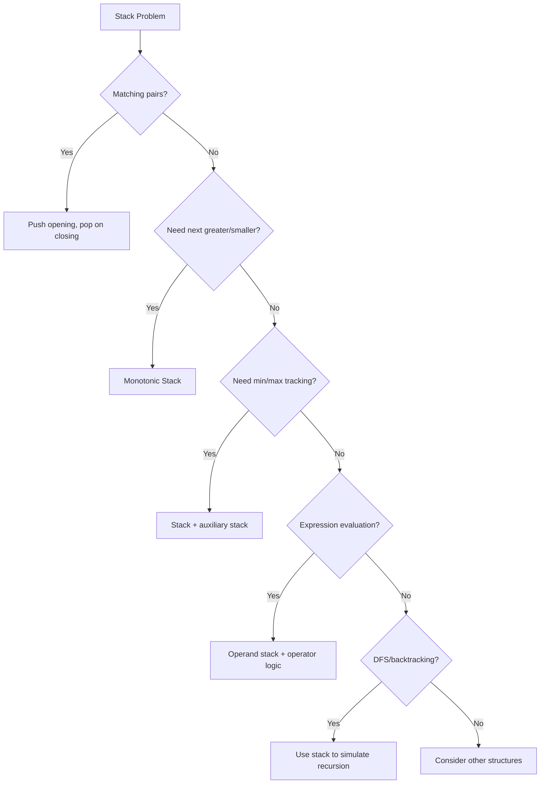
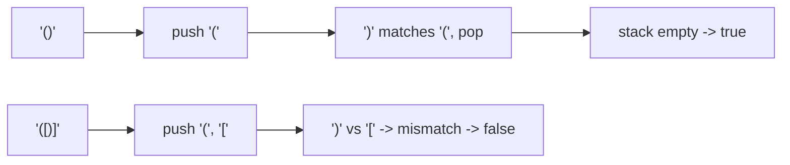
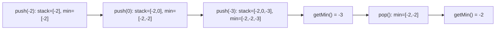
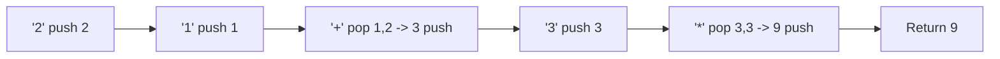
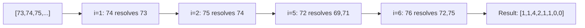
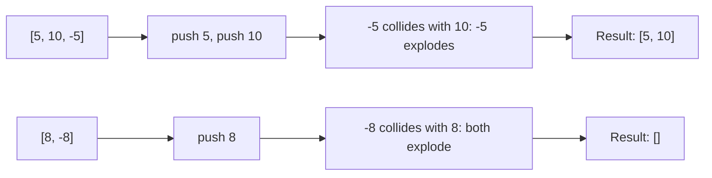
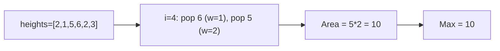
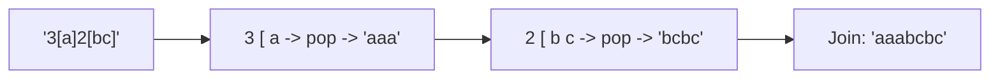

# Stack

## What is a Stack? (Simple Explanation)
Imagine a stack of plates. You can only add a plate to the top, and you can only remove a plate from the top. The last plate you put on is the first one you take off. That's a **stack**!

A stack is a "Last In, First Out" (LIFO) data structure:
- **Push**: Add to the top
- **Pop**: Remove from the top
- **Peek**: Look at the top without removing

**Real-life analogies:**
- Stack of plates in a cafeteria
- Browser back button (most recent page first)
- Undo/redo in text editors
- Function call stack in programming

## Key Concepts (In Simple Terms)
- **LIFO**: Last In, First Out — the last element added is the first removed
- **Top**: The only accessible position (for push/pop/peek)
- **Push**: Add an element to the top — O(1)
- **Pop**: Remove the top element — O(1)
- **Peek**: Look at the top element without removing — O(1)
- **Time Complexity**: O(1) for push/pop/peek
- **Space Complexity**: O(n) for n elements

## Stack vs Queue (Quick Comparison)
| Feature | Stack | Queue |
|---------|-------|-------|
| Order | LIFO (Last In First Out) | FIFO (First In First Out) |
| Add | At top | At rear |
| Remove | From top | From front |
| Analogy | Stack of plates | Line at store |

## Common Problems
- Valid Parentheses
- Min Stack (track minimum efficiently)
- Evaluate Reverse Polish Notation
- Daily Temperatures
- Asteroid Collision
- Largest Rectangle in Histogram
- Decode String
- Next Greater Element
- Trapping Rain Water

## Patterns / Techniques
- **Monotonic Stack**: Maintain increasing/decreasing order
- **Stack with Auxiliary Data Structure**: Track min/max alongside values
- **Stack for Expression Evaluation**: Postfix, infix, RPN
- **Stack for DFS/Recursion**: Convert recursion to iteration
- **Stack for Matching**: Parentheses, brackets, tags

---

## 🔹 Basic Templates

### Stack Using Java's Stack
```java
Stack<Integer> stack = new Stack<>();
stack.push(1);        // Add to top
stack.push(2);
int top = stack.peek();  // Look at top (returns 2)
int removed = stack.pop(); // Remove top (removes 2)
boolean empty = stack.isEmpty();
```

### Stack Using ArrayDeque (Faster, Preferred)
```java
Deque<Integer> stack = new ArrayDeque<>();
stack.push(1);
stack.push(2);
int top = stack.peek();
int removed = stack.pop();
boolean empty = stack.isEmpty();
```

### Monotonic Stack Template (Next Greater Element)
```java
public int[] nextGreater(int[] nums) {
    int n = nums.length;
    int[] result = new int[n];
    Arrays.fill(result, -1);
    Stack<Integer> stack = new Stack<>(); // Store indices
    for (int i = 0; i < n; i++) {
        while (!stack.isEmpty() && nums[i] > nums[stack.peek()]) {
            int prevIndex = stack.pop();
            result[prevIndex] = nums[i];
        }
        stack.push(i);
    }
    return result;
}
```

### Stack Decision Flow


---

## 🔹 Practice Problems by Topic

### Easy

#### 1. **Valid Parentheses**

**Problem Description:**
Given a string containing just '(', ')', '{', '}', '[' and ']', determine if the input string is valid. A string is valid if open brackets are closed by the same type and in the correct order.

**Simple Analogy:**
Like checking if brackets in a math expression are properly matched. Every opening bracket must have a matching closing bracket.

**Example Walkthrough:**

Input: `s = "()"`
```
Expected Output: true

i=0 '(': push -> stack=['(']
i=1 ')': matches '(', pop -> stack=[]
End: stack empty -> true
```

Input: `s = "()[]{}"`
```
Expected Output: true

i=0 '(': push -> stack=['(']
i=1 ')': matches '(', pop -> stack=[]
i=2 '[': push -> stack=['[']
i=3 ']': matches '[', pop -> stack=[]
i=4 '{': push -> stack=['{']
i=5 '}': matches '{', pop -> stack=[]
End: stack empty -> true
```

Input: `s = "(]"`
```
Expected Output: false

i=0 '(': push -> stack=['(']
i=1 ']': top is '(', expected ']' match is '[' -> mismatch!
Return false
```

Input: `s = "([)]"`
```
Expected Output: false

i=0 '(': push -> stack=['(']
i=1 '[': push -> stack=['(', '[']
i=2 ')': top is '[', expected match is '(' -> mismatch!
Return false
```

**Key Insight - Stack for Matching:**
Opening brackets are pushed onto the stack. When a closing bracket is encountered, it must match the top of the stack. If it does, pop. If not, invalid. At the end, stack must be empty.

**Why It Works:**
- The most recent unmatched opening bracket is always at the top
- A closing bracket must match this most recent opening (LIFO)
- If it doesn't, the brackets are in the wrong order
- If stack is non-empty at end, some openings weren't closed
- O(n) time, O(n) space

**Visualization - Valid Parentheses:**


```java
public boolean isValid(String s) {
    Stack<Character> stack = new Stack<>();
    HashMap<Character, Character> map = new HashMap<>();
    map.put(')', '(');
    map.put(']', '[');
    map.put('}', '{');
    for (char c : s.toCharArray()) {
        if (map.containsKey(c)) {
            if (stack.isEmpty() || stack.pop() != map.get(c)) {
                return false;
            }
        } else {
            stack.push(c);
        }
    }
    return stack.isEmpty();
}
```

**Edge Cases:**
- Empty string: returns true (vacuously valid)
- Single opening: returns false
- Single closing: returns false
- Only openings: returns false
- Only closings: returns false

**Time Complexity**: O(n)
**Space Complexity**: O(n)

**Similar Pattern Problems:**
- Valid Parentheses II
- Check if Balanced
- Remove Invalid Parentheses

---

#### 2. **Min Stack**

**Problem Description:**
Design a stack that supports push, pop, top, and retrieving the minimum element in O(1) time.

**Simple Analogy:**
Like a stack of plates where you always know the weight of the lightest plate in the stack.

**Example Walkthrough:**

Input:
```
MinStack minStack = new MinStack();
minStack.push(-2);
minStack.push(0);
minStack.push(-3);
minStack.getMin();  // returns -3
minStack.pop();
minStack.top();     // returns 0
minStack.getMin();  // returns -2
```

**Step-by-step:**
```
push(-2): stack=[-2], minStack=[-2]
push(0):  stack=[-2, 0], minStack=[-2, -2]
push(-3): stack=[-2, 0, -3], minStack=[-2, -2, -3]
getMin(): minStack top = -3
pop():    stack=[-2, 0], minStack=[-2, -2]
top():    stack top = 0
getMin(): minStack top = -2
```

Input:
```
push(5), push(3), push(7)
getMin() -> 3
pop()
getMin() -> 3
pop()
getMin() -> 5
```

**Step-by-step:**
```
push(5): stack=[5], minStack=[5]
push(3): stack=[5,3], minStack=[5,3] (3 < 5)
push(7): stack=[5,3,7], minStack=[5,3,3] (min(7,3)=3)
getMin(): 3
pop():    stack=[5,3], minStack=[5,3]
getMin(): 3
pop():    stack=[5], minStack=[5]
getMin(): 5
```

**Key Insight - Auxiliary Min Stack:**
Maintain two stacks: one for values, one for minimums. The min stack at each level stores the minimum of all elements up to that level. When we push, we push min(new_value, current_min). When we pop, we pop from both.

**Why It Works:**
- The min stack mirrors the value stack
- At each level, minStack[i] = min of stack[0..i]
- So minStack.top is always the minimum of all current elements
- Popping from both keeps them in sync
- All operations O(1)

**Visualization - Min Stack:**


```java
class MinStack {
    private Stack<Integer> stack;
    private Stack<Integer> minStack;
    public MinStack() {
        stack = new Stack<>();
        minStack = new Stack<>();
    }
    public void push(int val) {
        stack.push(val);
        minStack.push(Math.min(val, minStack.isEmpty() ? val : minStack.peek()));
    }
    public void pop() {
        stack.pop();
        minStack.pop();
    }
    public int top() {
        return stack.peek();
    }
    public int getMin() {
        return minStack.peek();
    }
}
```

**Edge Cases:**
- Empty stack: operations invalid (problem guarantees non-empty)
- Duplicate minimums: handled correctly
- Negative values: works correctly
- Single element: top = min = that element

**Time Complexity**: O(1) for all operations
**Space Complexity**: O(n)

**Similar Pattern Problems:**
- Max Stack
- Stack with Duplicate Min
- Design a Stack with Increment

---

### Medium

#### 3. **Evaluate Reverse Polish Notation**

**Problem Description:**
Evaluate the value of an arithmetic expression in Reverse Polish Notation (postfix). Valid operators are +, -, *, /. Each operand may be an integer or another expression.

**Simple Analogy:**
Like a calculator that reads operations after the numbers. "3 4 +" means 3 + 4 = 7.

**Example Walkthrough:**

Input: `tokens = ["2","1","+","3","*"]`
```
Expected Output: 9

Expression: ((2 + 1) * 3) = 9

Step-by-step:
"2": push 2 -> stack=[2]
"1": push 1 -> stack=[2, 1]
"+": pop 1, pop 2, compute 2+1=3, push 3 -> stack=[3]
"3": push 3 -> stack=[3, 3]
"*": pop 3, pop 3, compute 3*3=9, push 9 -> stack=[9]

Return 9
```

Input: `tokens = ["4","13","5","/","+"]`
```
Expected Output: 6

Expression: (4 + (13 / 5)) = 4 + 2 = 6

Step-by-step:
"4": push 4 -> stack=[4]
"13": push 13 -> stack=[4, 13]
"5": push 5 -> stack=[4, 13, 5]
"/": pop 5, pop 13, compute 13/5=2, push 2 -> stack=[4, 2]
"+": pop 2, pop 4, compute 4+2=6, push 6 -> stack=[6]

Return 6
```

Input: `tokens = ["10","6","9","3","+","-11","*","/","*","17","+","5","+"]`
```
Expected Output: 22
```

**Key Insight - Stack for Operands:**
Process tokens left to right. Numbers go to stack. When an operator appears, pop two operands, apply the operation, push the result. Order matters for - and /: the second popped is the left operand.

**Why It Works:**
- RPN is designed for stack evaluation
- Operands are pushed as encountered
- Operators consume the top two operands
- Result is pushed back for further use
- At end, single value remains

**Visualization - RPN Evaluation:**


```java
public int evalRPN(String[] tokens) {
    Stack<Integer> stack = new Stack<>();
    for (String token : tokens) {
        if (token.equals("+") || token.equals("-") || token.equals("*") || token.equals("/")) {
            int b = stack.pop();
            int a = stack.pop();
            int result;
            switch (token) {
                case "+": result = a + b; break;
                case "-": result = a - b; break;
                case "*": result = a * b; break;
                case "/": result = a / b; break;
                default: result = 0;
            }
            stack.push(result);
        } else {
            stack.push(Integer.parseInt(token));
        }
    }
    return stack.pop();
}
```

**Edge Cases:**
- Single number: returns it
- Division by zero: not in problem
- Negative numbers: handled
- Large results: int handles typical cases

**Time Complexity**: O(n)
**Space Complexity**: O(n)

**Similar Pattern Problems:**
- Basic Calculator
- Expression Evaluation
- Infix to Postfix

---

#### 4. **Daily Temperatures**

**Problem Description:**
Given an array of daily temperatures, return an array where each element is the number of days until a warmer temperature. If no warmer day exists, use 0.

**Simple Analogy:**
Like waiting for a warmer day. For each day, how many days until it's warmer?

**Example Walkthrough:**

Input: `temperatures = [73, 74, 75, 71, 69, 72, 76, 73]`
```
Expected Output: [1, 1, 4, 2, 1, 1, 0, 0]

Step-by-step (monotonic stack of indices):
i=0 (73): stack=[0]
i=1 (74): 74 > 73, pop 0, result[0]=1-0=1, push 1
          stack=[1]
i=2 (75): 75 > 74, pop 1, result[1]=2-1=1, push 2
          stack=[2]
i=3 (71): 71 < 75, push 3
          stack=[2, 3]
i=4 (69): 69 < 71, push 4
          stack=[2, 3, 4]
i=5 (72): 72 > 69, pop 4, result[4]=5-4=1
          72 > 71, pop 3, result[3]=5-3=2
          72 < 75, stop
          push 5 -> stack=[2, 5]
i=6 (76): 76 > 72, pop 5, result[5]=6-5=1
          76 > 75, pop 2, result[2]=6-2=4
          stack=[6]
i=7 (73): 73 < 76, push 7
          stack=[6, 7]

Result: [1, 1, 4, 2, 1, 1, 0, 0]
```

Input: `temperatures = [30, 40, 50, 60]`
```
Expected Output: [1, 1, 1, 0]

i=0 (30): stack=[0]
i=1 (40): 40>30, pop 0, result[0]=1, push 1
i=2 (50): 50>40, pop 1, result[1]=1, push 2
i=3 (60): 60>50, pop 2, result[2]=1, push 3
End: result[3]=0 (no warmer day)
Result: [1, 1, 1, 0]
```

Input: `temperatures = [30, 60, 90]`
```
Expected Output: [1, 1, 0]
```

**Key Insight - Monotonic Decreasing Stack:**
Maintain a stack of indices with decreasing temperatures. When a new warmer temperature arrives, it resolves all waiting days on the stack. Pop them and record the distance.

**Why It Works:**
- Stack holds indices of days waiting for a warmer day
- Temperatures in stack are decreasing (from bottom to top)
- When a warmer temp arrives, it's the answer for all days on stack with lower temp
- Pop them, compute distance, continue
- Remaining indices at end have no warmer day (result 0)
- O(n) because each index pushed/popped once

**Visualization - Daily Temperatures:**


```java
public int[] dailyTemperatures(int[] temperatures) {
    int n = temperatures.length;
    int[] result = new int[n];
    Stack<Integer> stack = new Stack<>();
    for (int i = 0; i < n; i++) {
        while (!stack.isEmpty() && temperatures[i] > temperatures[stack.peek()]) {
            int prevIndex = stack.pop();
            result[prevIndex] = i - prevIndex;
        }
        stack.push(i);
    }
    return result;
}
```

**Edge Cases:**
- All increasing: each day resolves the previous
- All decreasing: all zeros
- All same: all zeros
- Single day: returns [0]

**Time Complexity**: O(n)
**Space Complexity**: O(n)

**Similar Pattern Problems:**
- Next Greater Element
- Trapping Rain Water
- Stock Span Problem

---

#### 5. **Asteroid Collision**

**Problem Description:**
Given an array of asteroids (positive = moving right, negative = moving left), simulate collisions. When two asteroids collide, the smaller explodes. If equal, both explode. Return the final state.

**Simple Analogy:**
Like a game where asteroids move in a line and collide. Bigger one destroys smaller.

**Example Walkthrough:**

Input: `asteroids = [5, 10, -5]`
```
Expected Output: [5, 10]

5 (right), 10 (right), -5 (left)
5 and 10 moving right, -5 moving left
-5 collides with 10: 10 > 5, -5 explodes
Result: [5, 10]
```

Input: `asteroids = [8, -8]`
```
Expected Output: []

8 (right), -8 (left)
They collide: equal sizes, both explode
Result: []
```

Input: `asteroids = [10, 2, -5]`
```
Expected Output: [10]

10 (right), 2 (right), -5 (left)
-5 collides with 2: 5 > 2, 2 explodes
-5 collides with 10: 10 > 5, -5 explodes
Result: [10]
```

Input: `asteroids = [-2, -1, 1, 2]`
```
Expected Output: [-2, -1, 1, 2]

-2 (left), -1 (left), 1 (right), 2 (right)
No collisions (left ones moving away, right ones moving away)
Result: [-2, -1, 1, 2]
```

**Key Insight - Stack for Survivors:**
Use a stack to track surviving asteroids. For each asteroid:
- If moving right (positive): push to stack
- If moving left (negative): collide with rightward asteroids on stack

Collision rules:
- If stack top < |asteroid|: top explodes, continue
- If stack top == |asteroid|: both explode
- If stack top > |asteroid|: asteroid explodes

**Why It Works:**
- Only rightward asteroids followed by leftward ones can collide
- Stack naturally holds rightward asteroids waiting for collision
- When a leftward asteroid comes, it collides with the most recent rightward one
- This is LIFO order — correct for collisions
- If leftward asteroid survives all, it's added to stack

**Visualization - Asteroid Collision:**


```java
public int[] asteroidCollision(int[] asteroids) {
    Stack<Integer> stack = new Stack<>();
    for (int asteroid : asteroids) {
        boolean alive = true;
        while (alive && asteroid < 0 && !stack.isEmpty() && stack.peek() > 0) {
            int top = stack.pop();
            if (top < -asteroid) {
                continue;
            } else if (top == -asteroid) {
                alive = false;
            } else {
                alive = false;
                stack.push(top);
            }
        }
        if (alive) {
            stack.push(asteroid);
        }
    }
    int[] result = new int[stack.size()];
    for (int i = result.length - 1; i >= 0; i--) {
        result[i] = stack.pop();
    }
    return result;
}
```

**Edge Cases:**
- All moving same direction: no collisions
- Single asteroid: returns it
- Equal sizes: both explode
- Leftward asteroid survives: pushed to stack

**Time Complexity**: O(n)
**Space Complexity**: O(n)

**Similar Pattern Problems:**
- Robot Collisions
- Track Collisions
- Car Fleet

---

### Hard

#### 6. **Largest Rectangle in Histogram**

**Problem Description:**
Given an array of bar heights in a histogram, find the area of the largest rectangle that can be formed.

**Simple Analogy:**
Like finding the biggest rectangular poster that fits under a skyline.

**Example Walkthrough:**

Input: `heights = [2, 1, 5, 6, 2, 3]`
```
Expected Output: 10

Histogram:
    _
   | |
   | |   _
   | |  | |
 _ | |  | |
| || |  | |
| || |  | |
2 1 5 6 2 3

Largest rectangle: height 5, width 2 (bars at indices 2,3) = 10

Step-by-step (monotonic stack of indices):
i=0 (2): stack=[0]
i=1 (1): 1 < 2, pop 0. h=2, w=1 (stack empty), area=2. push 1. stack=[1]
i=2 (5): 5 > 1, push 2. stack=[1, 2]
i=3 (6): 6 > 5, push 3. stack=[1, 2, 3]
i=4 (2): 2 < 6, pop 3. h=6, w=4-2-1=1, area=6
         2 < 5, pop 2. h=5, w=4-1-1=2, area=10
         2 > 1, stop. push 4. stack=[1, 4]
i=5 (3): 3 > 2, push 5. stack=[1, 4, 5]
End of array:
pop 5: h=3, w=6-4-1=1, area=3
pop 4: h=2, w=6-1-1=4, area=8
pop 1: h=1, w=6, area=6

Max area = 10
```

Input: `heights = [2, 4]`
```
Expected Output: 4

Bars: 2, 4
Rectangle 1: height 2, width 2 = 4
Rectangle 2: height 4, width 1 = 4
Max = 4
```

Input: `heights = [2, 1, 2]`
```
Expected Output: 3

Bars: 2, 1, 2
Largest: height 1, width 3 = 3
Or height 2, width 1 = 2
Max = 3
```

**Key Insight - Monotonic Increasing Stack:**
Maintain a stack of indices with increasing heights. When a shorter bar appears, it's the right boundary for taller bars on the stack. Pop them, compute area with popped bar as height, and (current index - new top - 1) as width.

**Why It Works:**
- For each bar, we want the largest rectangle with that bar as the shortest
- Left boundary: previous smaller bar (in stack)
- Right boundary: next smaller bar (current when popping)
- Stack maintains increasing heights so we can find boundaries efficiently
- Adding 0 at end forces all bars to pop (handles remaining)
- Each bar pushed/popped once -> O(n)

**Visualization - Largest Rectangle:**


```java
public int largestRectangleArea(int[] heights) {
    Stack<Integer> stack = new Stack<>();
    int maxArea = 0;
    for (int i = 0; i < heights.length; i++) {
        while (!stack.isEmpty() && heights[i] < heights[stack.peek()]) {
            int h = heights[stack.pop()];
            int w = stack.isEmpty() ? i : i - stack.peek() - 1;
            maxArea = Math.max(maxArea, h * w);
        }
        stack.push(i);
    }
    while (!stack.isEmpty()) {
        int h = heights[stack.pop()];
        int w = stack.isEmpty() ? heights.length : heights.length - stack.peek() - 1;
        maxArea = Math.max(maxArea, h * w);
    }
    return maxArea;
}
```

**Edge Cases:**
- Empty array: returns 0
- Single bar: returns its height
- All same height: returns height * n
- Strictly increasing: each popped at end
- Strictly decreasing: each popped immediately

**Time Complexity**: O(n)
**Space Complexity**: O(n)

**Similar Pattern Problems:**
- Maximal Rectangle (2D version)
- Largest Rectangle with Rotations
- Trapping Rain Water

---

#### 7. **Decode String**

**Problem Description:**
Given an encoded string like "3[a]2[bc]", decode it to "aaabcbc". Numbers followed by brackets mean repeat the content inside that many times. Can be nested.

**Simple Analogy:**
Like expanding compressed text. "3[a]" means "aaa".

**Example Walkthrough:**

Input: `s = "3[a]2[bc]"`
```
Expected Output: "aaabcbc"

Step-by-step:
'3': num=3
'[': push 3, push "[", num=0
'a': push "a"
']': pop until "[": sb="a", pop "[", pop 3
     push "aaa"
'2': num=2
'[': push 2, push "[", num=0
'b': push "b"
'c': push "c"
']': pop until "[": sb="bc", pop "[", pop 2
     push "bcbc"
End: stack=["aaa", "bcbc"], join -> "aaabcbc"

Return "aaabcbc"
```

Input: `s = "3[a2[c]]"`
```
Expected Output: "accaccacc"

Step-by-step:
'3': num=3
'[': push 3, push "[", num=0
'a': push "a"
'2': num=2
'[': push 2, push "[", num=0
'c': push "c"
']': pop until "[": sb="c", pop "[", pop 2
     push "cc"
']': pop until "[": sb="acc", pop "[", pop 3
     push "accaccacc"

Return "accaccacc"
```

Input: `s = "2[abc]3[cd]ef"`
```
Expected Output: "abcabccdcdcdef"

2[abc] = abcabc
3[cd] = cdcdcd
+ ef
= abcabccdcdcdef
```

**Key Insight - Stack for Nested Structures:**
Use a stack to handle nesting. Push numbers and strings as encountered. When ']' is found, pop until '[' to get the substring, then pop the number, repeat the substring, and push back.

**Why It Works:**
- Nesting naturally maps to stack LIFO order
- Numbers are pushed before their '[' so we can retrieve them
- '[' acts as a marker for "start of group"
- When ']' found, the content is between the last '[' and now
- Repeat and push back for outer levels
- O(n * maxRepeat) time due to string building

**Visualization - Decode String:**


```java
public String decodeString(String s) {
    Stack<Object> stack = new Stack<>();
    int num = 0;
    for (char c : s.toCharArray()) {
        if (Character.isDigit(c)) {
            num = num * 10 + (c - '0');
        } else if (c == '[') {
            stack.push(num);
            stack.push("[");
            num = 0;
        } else if (c == ']') {
            StringBuilder sb = new StringBuilder();
            while (!stack.peek().equals("[")) {
                sb.insert(0, stack.pop());
            }
            stack.pop();
            int count = (Integer) stack.pop();
            String decoded = sb.toString();
            for (int i = 0; i < count; i++) {
                stack.push(decoded);
            }
        } else {
            stack.push(String.valueOf(c));
        }
    }
    StringBuilder result = new StringBuilder();
    while (!stack.isEmpty()) {
        result.insert(0, stack.pop());
    }
    return result.toString();
}
```

**Edge Cases:**
- Single group: works
- Nested groups: works
- Multiple groups: works
- No brackets: returns original
- Large repeat count: may cause memory issues

**Time Complexity**: O(n * maxRepeat)
**Space Complexity**: O(n)

**Similar Pattern Problems:**
- Nested List Weight Sum
- Decode Ways
- String Compression

---

## 📌 Key Patterns & Techniques

### 1. **Monotonic Stack**
- Maintain stack in increasing or decreasing order
- Used for: Next Greater Element, Largest Rectangle
- Efficiently find nearest element with specific property
- Pop when current element "resolves" stack elements
- Examples: Daily Temperatures, Largest Rectangle in Histogram

### 2. **Stack with Auxiliary Data**
- Pair stack with additional tracking (min/max)
- Used for: Min Stack, Max Stack
- O(1) operations for auxiliary queries
- Examples: Min Stack

### 3. **Stack for Matching**
- Push opening, pop on closing
- Used for: Valid Parentheses, HTML tags
- LIFO order matches nested structure
- Examples: Valid Parentheses, Decode String

### 4. **Stack for Expression Evaluation**
- Operands pushed, operators consume from stack
- Used for: RPN, infix, postfix
- Order matters for - and /
- Examples: Evaluate RPN

### 5. **Stack for Collision Simulation**
- Push one direction, collide with opposite
- Used for: Asteroid Collision, Car Fleet
- LIFO order matches collision sequence
- Examples: Asteroid Collision

---

## 🎯 Common Pitfalls to Avoid

- Forgetting to check if stack is empty before peek/pop
- Confusing stack index for multiple stacks (use separate stacks)
- Not handling order correctly in monotonic stack (increasing vs decreasing)
- Integer overflow in calculations (use long if needed)
- Not clearing stack between test cases (in class design)
- Popping in wrong order for non-commutative operations (- and /)
- Using `==` instead of `.equals()` for String comparison
- Not handling nested structures properly (Decode String)
- Forgetting that stack stores indices (not values) in some patterns
- Mixing up push/pop order when reconstructing results